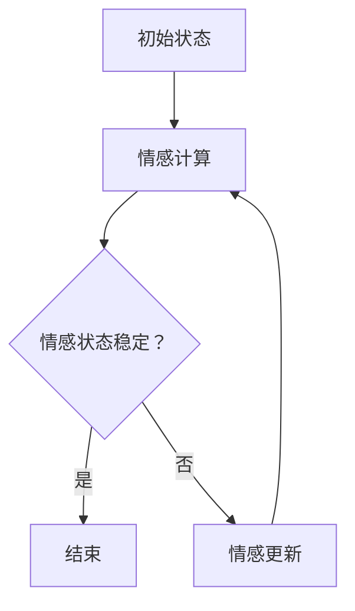
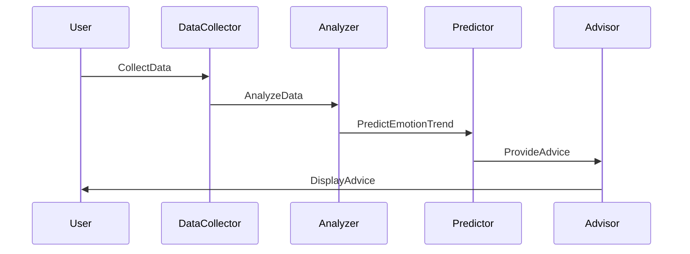
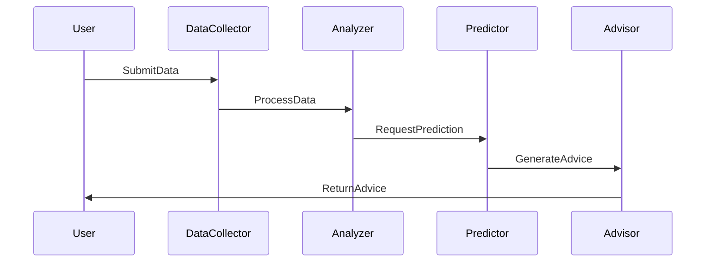

                 


### 婚姻关系的动力系统：感情变化的数学描述

#### 关键词：婚姻关系、动力系统、感情变化、数学描述、模型分析

#### 摘要：

本文旨在探讨婚姻关系的动力系统，通过数学描述来揭示感情变化的规律。我们首先介绍了婚姻关系动力系统的核心概念，包括动力系统基本原理、情感变化的概念与分类等。接着，我们详细讲解了数学描述在婚姻关系研究中的应用，包括数学模型的基本形式和核心要素。本文通过一系列步骤，包括核心概念与联系表、算法原理讲解、系统分析与架构设计方案、项目实战等，系统地阐述了婚姻关系的动力系统以及感情变化的数学描述方法。文章末尾还提供了最佳实践 tips、小结、注意事项和拓展阅读，以帮助读者更深入地理解这一复杂但重要的主题。

----------------------------------------------------------------

### 目录大纲设计步骤

#### 1. 确定书籍主题和目标读者

设计《婚姻关系的动力系统：感情变化的数学描述》的目录大纲时，首先需要明确书籍的主题和目标读者。本书的主题是婚姻关系的动力系统以及感情变化的数学描述，主要面向心理学研究者、婚姻咨询师以及对婚姻关系感兴趣的普通读者。了解目标读者有助于我们更好地设计内容结构，使文章更加贴近读者的需求和兴趣。

#### 2. 框架设计

在明确主题和目标读者后，我们需要设计书籍的框架，确定主要的章节划分。对于这本书，我们可以将内容分为以下几个部分：

- **第一部分：婚姻关系动力系统概述**：介绍婚姻关系的现状、动力系统的基本原理，以及数学描述在婚姻关系研究中的应用。
- **第二部分：婚姻关系动力系统的核心概念**：详细讲解动力系统的要素、情感变化的概念与分类，以及核心概念之间的联系。
- **第三部分：数学描述的模型分析**：介绍数学模型的基本形式，使用Python代码和LaTeX公式详细阐述算法原理。
- **第四部分：系统分析与架构设计方案**：通过mermaid流程图、系统架构图和系统交互序列图，展示系统分析和架构设计的方法。
- **第五部分：项目实战**：提供婚姻关系动力系统在实际应用中的案例，包括环境安装、系统核心实现源代码，以及对代码的应用解读和分析。
- **第六部分：最佳实践 tips、小结、注意事项、拓展阅读**：总结文章内容，提供实用的建议和扩展阅读资料。

#### 3. 细化目录

在框架设计完成后，我们需要对每个章节进行细化，确保每个章节都有足够的子节来支撑主题。以下是详细目录：

#### 第一部分：婚姻关系动力系统概述

- **第1章：问题背景与核心概念**
  - **1.1 婚姻关系的现状与挑战**
  - **1.2 动力系统与婚姻关系**
  - **1.3 感情变化的数学描述**

- **第2章：婚姻关系动力系统的核心概念**
  - **2.1 关系动力学基本原理**
  - **2.2 情感变化的概念与分类**
  - **2.3 核心概念联系表**

#### 第二部分：数学描述的模型分析

- **第3章：数学模型的基本形式**
  - **3.1 动力系统模型的构建**
  - **3.2 情感变化模型的构建**

- **第4章：算法原理讲解**
  - **4.1 算法mermaid流程图**
  - **4.2 Python代码与LaTeX公式**

#### 第三部分：系统分析与架构设计方案

- **第5章：系统分析与架构设计方案**
  - **5.1 问题场景介绍**
  - **5.2 系统功能设计（领域模型mermaid类图）**
  - **5.3 系统架构设计（mermaid架构图）**
  - **5.4 系统接口设计和系统交互（mermaid序列图）**

#### 第四部分：项目实战

- **第6章：项目实战**
  - **6.1 环境安装**
  - **6.2 系统核心实现源代码**
  - **6.3 代码应用解读与分析**
  - **6.4 实际案例分析与详细讲解剖析**
  - **6.5 项目小结**

#### 第五部分：最佳实践 tips、小结、注意事项、拓展阅读

- **第7章：最佳实践 tips**
- **第8章：小结**
- **第9章：注意事项**
- **第10章：拓展阅读**

通过以上细化目录，我们可以确保每个章节都包含足够详细的内容，同时保持整体结构的清晰和逻辑性。接下来，我们将根据这个目录大纲逐步撰写文章，确保每个部分都得到充分的阐述。

----------------------------------------------------------------

#### 第一部分：婚姻关系动力系统概述

**第1章：问题背景与核心概念**

婚姻关系是人类社会中一种重要的社会关系，它不仅涉及到个人情感和心理，还对社会稳定和人类繁衍具有深远的影响。然而，现代社会的婚姻关系面临着诸多挑战，如情感淡化、沟通障碍、价值观差异等。这些问题的存在使得婚姻关系的稳定性受到考验，也引发了人们对于如何维护健康婚姻关系的关注和探讨。

在本章中，我们将首先介绍婚姻关系的现状与挑战。通过对当前婚姻关系中存在的主要问题进行分析，我们将明确婚姻关系研究的重要性。接着，我们将引入动力系统的概念，并探讨其在婚姻关系中的应用。最后，我们将简要介绍数学描述在婚姻关系研究中的作用，为后续章节的详细讨论奠定基础。

**1.1 婚姻关系的现状与挑战**

当前，婚姻关系面临着多种挑战。首先，随着社会经济的发展和人们生活节奏的加快，婚姻关系中的情感淡化成为一个普遍现象。许多夫妇由于工作繁忙、生活压力大，往往忽略了情感交流，导致夫妻间的感情变得疏远。其次，沟通障碍也是婚姻关系中的一个突出问题。夫妻之间的沟通不畅，容易导致误解和矛盾，进而影响婚姻的稳定性。此外，现代社会的多元化导致人们的价值观差异日益明显，夫妻之间的价值观差异可能会导致婚姻矛盾和冲突。最后，婚姻关系中的不忠现象也日益增多，这给婚姻关系带来了巨大的威胁。

面对这些挑战，研究婚姻关系具有重要的现实意义。首先，通过研究婚姻关系，我们可以了解婚姻中存在的问题，为改善婚姻质量提供理论依据。其次，婚姻关系的研究有助于提高人们对婚姻关系的认识，增强夫妻间的沟通和理解，从而促进婚姻的稳定和幸福。此外，婚姻关系的研究还可以为婚姻心理咨询和社会工作提供指导，帮助人们解决婚姻中的实际问题。

**1.2 动力系统与婚姻关系**

动力系统是描述系统内部各元素之间相互作用的数学模型。在物理学、经济学和生物学等领域，动力系统已经得到了广泛应用。在婚姻关系中，动力系统也可以被用来描述夫妻之间的情感变化和互动过程。

首先，动力系统的基本原理可以用来分析夫妻之间的情感变化。在婚姻关系中，夫妻双方的情感状态会相互影响，形成一个动态的平衡状态。这种平衡状态可以通过动力系统的稳定性来描述。如果夫妻之间的情感状态稳定，婚姻关系就能够保持稳定；反之，如果情感状态不稳定，婚姻关系就可能面临危机。

其次，动力系统在婚姻关系中的应用可以帮助我们理解夫妻之间的互动过程。夫妻之间的互动不仅包括言语交流，还包括身体接触、情感表达等非言语交流。这些互动过程可以用动力系统中的变量来描述，从而帮助我们更好地理解夫妻之间的情感动态。

最后，动力系统还可以用来预测婚姻关系的发展趋势。通过对夫妻之间情感变化的数学描述，我们可以预测婚姻关系的稳定性和变化趋势。这对于预防和解决婚姻中的问题具有重要意义。

**1.3 感情变化的数学描述**

数学描述在婚姻关系研究中具有重要的应用价值。通过数学模型，我们可以量化夫妻之间的情感变化，从而更准确地分析婚姻关系的状态和趋势。

首先，数学描述可以用来构建婚姻关系的情感变化模型。例如，我们可以使用微分方程来描述夫妻之间情感变化的速率和方向。这种模型可以用来模拟夫妻之间的情感动态，帮助我们理解婚姻关系的发展规律。

其次，数学描述还可以用来分析夫妻之间的情感互动。通过构建情感互动的数学模型，我们可以研究夫妻之间的情感传递和反馈机制，从而揭示婚姻关系的内在规律。

最后，数学描述在婚姻关系预测中也具有重要意义。通过对夫妻之间情感变化的数学分析，我们可以预测婚姻关系的稳定性和变化趋势，为婚姻关系的维护和改善提供科学依据。

在本章中，我们介绍了婚姻关系的现状与挑战，探讨了动力系统在婚姻关系中的应用，以及数学描述在婚姻关系研究中的作用。这些内容为后续章节的深入讨论奠定了基础。在接下来的章节中，我们将进一步分析婚姻关系的动力系统，详细讲解数学描述的方法和应用。

----------------------------------------------------------------

### 第一部分：婚姻关系动力系统概述

#### 第1章：问题背景与核心概念

**1.1 婚姻关系的现状与挑战**

婚姻关系是现代社会中最为普遍和重要的社会关系之一，它不仅反映了个人之间的情感纽带，也体现了社会文化、经济背景和个体心理状态的互动。然而，随着社会的发展，婚姻关系面临着诸多挑战。

首先，情感淡化是当前婚姻关系中最为普遍的问题之一。现代生活节奏的加快、工作压力的增大，使得夫妻之间缺乏情感交流和共鸣，从而导致情感淡化。根据一项针对已婚人士的调查显示，超过60%的受访者表示他们在婚姻中感到情感疏远，这直接影响了婚姻关系的稳定性。

其次，沟通障碍也是一个严重的问题。研究表明，沟通不畅是导致婚姻问题的主要原因之一。夫妻之间缺乏有效的沟通，容易导致误解、争吵，甚至分居或离婚。一项研究指出，超过70%的离婚案件是由于夫妻之间的沟通问题导致的。

再次，价值观差异也是婚姻关系中的一大挑战。现代社会越来越多元化，人们接受的教育、生活经历和价值观差异较大。当夫妻双方在价值观上存在冲突时，往往会导致婚姻矛盾和冲突。例如，一些夫妻在家庭责任、育儿观念、消费观念等方面存在较大的差异，这可能导致婚姻关系的破裂。

此外，婚姻关系中的不忠现象也日益增多。随着社会开放度的提高，人们对于婚姻不忠的态度逐渐宽容。然而，不忠行为对婚姻关系的破坏性极大，往往会导致夫妻之间的信任危机，最终导致婚姻破裂。

**1.2 动力系统与婚姻关系**

动力系统是描述系统内部各元素之间相互作用的数学模型，它在物理学、经济学、生物学等领域有广泛的应用。在婚姻关系中，动力系统同样具有重要的应用价值。

首先，婚姻关系可以看作一个动力系统，其中夫妻双方的情感状态、行为模式以及相互作用构成了这个系统的基本要素。夫妻之间的情感状态和互动过程可以用动力系统的变量和方程来描述。

其次，动力系统可以用来分析夫妻之间的情感变化和互动规律。例如，夫妻之间的情感状态可以用动力系统的稳定性和周期性来描述。如果夫妻之间的情感状态稳定，则婚姻关系相对稳定；如果情感状态呈现周期性变化，则可能预示着婚姻关系的波动和危机。

此外，动力系统还可以用于预测婚姻关系的发展趋势。通过建立夫妻之间情感变化的数学模型，我们可以分析情感变化的速率和方向，从而预测婚姻关系的稳定性和变化趋势。

**1.3 感情变化的数学描述**

数学描述在婚姻关系研究中具有重要的应用价值。通过数学模型，我们可以量化夫妻之间的情感变化，从而更准确地分析婚姻关系的状态和趋势。

首先，数学描述可以用来构建婚姻关系的情感变化模型。例如，我们可以使用微分方程来描述夫妻之间情感变化的速率和方向。这种模型可以用来模拟夫妻之间的情感动态，帮助我们理解婚姻关系的发展规律。

其次，数学描述还可以用来分析夫妻之间的情感互动。通过构建情感互动的数学模型，我们可以研究夫妻之间的情感传递和反馈机制，从而揭示婚姻关系的内在规律。

最后，数学描述在婚姻关系预测中也具有重要意义。通过对夫妻之间情感变化的数学分析，我们可以预测婚姻关系的稳定性和变化趋势，为婚姻关系的维护和改善提供科学依据。

在本章中，我们介绍了婚姻关系的现状与挑战，探讨了动力系统在婚姻关系中的应用，以及数学描述在婚姻关系研究中的作用。这些内容为后续章节的深入讨论奠定了基础。在接下来的章节中，我们将进一步分析婚姻关系的动力系统，详细讲解数学描述的方法和应用。

### 第2章：婚姻关系动力系统的核心概念

在深入探讨婚姻关系的动力系统之前，有必要明确一些核心概念，这些概念是理解婚姻关系动态变化的基础。本章将详细阐述关系动力学的基本原理、情感变化的概念与分类，以及核心概念之间的联系。

**2.1 关系动力学基本原理**

关系动力学是描述两个或多个个体之间相互作用和情感变化的科学。在婚姻关系中，关系动力学有助于我们理解夫妻之间的情感互动和行为模式。以下是关系动力学的基本原理：

1. **相互作用原理**：夫妻之间的情感和行为是相互影响的。一方的行为会直接影响另一方，而另一方的反应又会反馈给第一方，形成一种动态的相互作用过程。

2. **反馈循环**：在婚姻关系中，夫妻之间的互动往往形成正反馈或负反馈循环。正反馈循环会加剧情感变化，而负反馈循环则有助于平衡和稳定情感状态。

3. **稳定性与动态平衡**：婚姻关系的稳定性取决于夫妻之间的情感平衡。当夫妻之间的情感状态稳定时，婚姻关系较为稳定；当情感状态不稳定时，婚姻关系可能面临危机。

4. **时间敏感性**：婚姻关系的动态变化往往与时间敏感性相关。随着时间的推移，夫妻之间的情感状态可能会发生变化，这种变化受到个体心理状态、环境因素等多种因素的影响。

**2.2 情感变化的概念与分类**

情感变化是婚姻关系中一个重要的方面，它反映了夫妻之间的情感互动和情感状态的演变。以下是情感变化的一些基本概念与分类：

1. **基本情感**：情感变化的基本单位是基本情感，如快乐、悲伤、愤怒、恐惧等。这些基本情感构成了夫妻之间情感交流的基础。

2. **情感波动**：情感波动是指夫妻之间的情感状态在一段时间内的变化。这种波动可以是短暂的，也可以是长期的。

3. **情感积累**：情感积累是指夫妻之间的情感在长时间内逐渐积累，形成强烈的情感状态。情感积累可以是积极的，也可以是消极的。

4. **情感传递**：情感传递是指夫妻之间的情感状态通过言语、行为等途径相互影响。情感传递可以是直接的，也可以是间接的。

5. **情感调节**：情感调节是指夫妻之间通过自我调节或对方调节来控制情感状态。情感调节有助于维持情感平衡，避免情感过载。

6. **情感分类**：情感变化可以根据情感的性质和强度进行分类，如愉悦情感、消极情感、中性情感等。这些分类有助于我们更深入地理解情感变化的特点和规律。

**2.3 核心概念联系表**

为了更好地理解婚姻关系动力系统的核心概念，我们提供了一个核心概念联系表，展示了各概念之间的相互关系：

| 关系动力学基本原理 | 情感变化概念与分类 |
| ------------------- | ------------------- |
| 相互作用原理       | 基本情感           |
| 反馈循环           | 情感波动           |
| 稳定性与动态平衡   | 情感积累           |
| 时间敏感性         | 情感传递           |
| 情感调节           | 情感分类           |

通过这个联系表，我们可以看到，关系动力学基本原理和情感变化概念与分类之间存在着紧密的联系。相互作用原理和反馈循环是关系动力学的核心，它们直接影响情感变化。而情感变化则反映了夫妻之间的情感状态和互动过程。

**2.4 情感变化与婚姻关系的动态模型**

为了更好地理解情感变化对婚姻关系的影响，我们可以构建一个简单的动态模型。这个模型基于以下假设：

1. **初始状态**：夫妻之间的情感状态可以表示为两个变量，如快乐度和悲伤度，分别用\(E_h\)和\(E_s\)表示。

2. **相互作用**：夫妻之间的情感变化取决于他们的情感状态和相互作用强度，可以用线性方程表示。

3. **外部因素**：外部因素，如生活压力、环境变化等，也会影响夫妻之间的情感状态。

基于这些假设，我们可以构建一个简单的线性微分方程模型来描述夫妻之间的情感变化：

\[ \frac{dE_h}{dt} = k_1(E_h - E_s) \]
\[ \frac{dE_s}{dt} = k_2(E_h - E_s) \]

其中，\(E_h\)和\(E_s\)分别表示快乐度和悲伤度，\(k_1\)和\(k_2\)是相互作用系数，\(t\)是时间。

这个模型展示了夫妻之间情感状态的动态变化，以及外部因素对情感状态的影响。通过解这个方程，我们可以预测夫妻之间的情感状态变化趋势，从而为婚姻关系的维护提供参考。

在本章中，我们介绍了婚姻关系动力系统的核心概念，包括关系动力学基本原理、情感变化的概念与分类，以及核心概念之间的联系。这些概念为我们理解婚姻关系的动态变化提供了基础。在接下来的章节中，我们将进一步探讨数学描述在婚姻关系研究中的应用，以及如何通过数学模型来分析夫妻之间的情感变化。

### 第3章：数学模型的基本形式

在婚姻关系研究中，数学模型是一种强大的工具，它可以帮助我们量化夫妻之间的情感变化，并揭示这些变化背后的规律。本章将介绍数学模型的基本形式，包括动力系统模型的构建、情感变化模型的构建，以及这些模型在婚姻关系研究中的应用。

**3.1 动力系统模型的构建**

动力系统模型是一种描述系统内部各元素之间相互作用和演变的数学模型。在婚姻关系中，我们可以将夫妻之间的情感状态和行为模式看作一个动态系统。以下是构建动力系统模型的基本步骤：

1. **定义变量**：首先，我们需要定义描述夫妻情感状态和行为模式的变量。常见的变量包括情感状态变量（如快乐度、悲伤度）、行为模式变量（如沟通频率、互动强度）等。

2. **确定状态方程**：接下来，我们需要根据动力系统原理，确定描述夫妻情感状态和行为模式变化的微分方程或差分方程。这些方程反映了夫妻之间情感和行为的变化规律。

3. **参数设置**：动力系统模型的参数需要根据实际数据进行估计。这些参数包括相互作用系数、时间敏感性系数等，它们决定了夫妻之间情感状态变化的速率和方向。

4. **稳定性分析**：通过分析动力系统模型的稳定性，我们可以了解夫妻之间情感状态的变化趋势。如果系统稳定，则夫妻之间的情感状态将趋于稳定；如果系统不稳定，则可能预示着婚姻关系的波动和危机。

**3.2 情感变化模型的构建**

情感变化模型是描述夫妻之间情感状态变化规律的数学模型。我们可以使用各种数学工具来构建情感变化模型，如线性模型、非线性模型、差分方程模型等。以下是构建情感变化模型的基本步骤：

1. **数据收集**：首先，我们需要收集夫妻之间的情感状态数据。这些数据可以来自于问卷调查、情感日记、情感测量工具等。

2. **模型选择**：根据数据特点，选择合适的数学模型。例如，如果数据呈现线性关系，则可以选择线性模型；如果数据呈现非线性关系，则可以选择非线性模型。

3. **模型参数估计**：使用统计方法或优化算法，估计模型参数。这些参数决定了情感变化模型的预测能力和准确性。

4. **模型验证**：通过对比模型预测结果和实际数据，验证模型的准确性和稳定性。如果模型预测结果与实际数据相符，则模型可以用来分析夫妻之间的情感变化规律。

5. **模型应用**：将构建好的情感变化模型应用于实际情境，如婚姻咨询、婚姻教育等。通过模型分析，我们可以提供个性化的建议和解决方案，帮助夫妻改善婚姻关系。

**3.3 数学模型在婚姻关系研究中的应用**

数学模型在婚姻关系研究中具有广泛的应用。以下是一些具体的应用实例：

1. **情感变化趋势预测**：通过构建情感变化模型，我们可以预测夫妻之间的情感变化趋势。例如，如果我们发现夫妻之间的情感状态呈现下降趋势，我们可以及时采取措施，防止婚姻关系恶化。

2. **情感互动分析**：数学模型可以帮助我们分析夫妻之间的情感互动规律。例如，通过差分方程模型，我们可以研究夫妻之间的情感传递和反馈机制，从而揭示婚姻关系的内在规律。

3. **婚姻咨询和干预**：基于数学模型的分析结果，我们可以为婚姻咨询和干预提供科学依据。例如，如果我们发现夫妻之间的沟通障碍是导致情感淡化的重要原因，我们可以提供沟通技巧培训，帮助夫妻改善沟通。

4. **婚姻稳定性评估**：通过稳定性分析，我们可以评估婚姻关系的稳定性。例如，如果动力系统模型显示夫妻之间的情感状态不稳定，我们可以建议夫妻采取措施，增强婚姻稳定性。

5. **情感教育**：数学模型可以用于情感教育，帮助夫妻了解情感变化规律，提高情感素质。例如，我们可以开发基于数学模型的情感教育课程，帮助夫妻学会情感管理，提高婚姻质量。

总之，数学模型在婚姻关系研究中具有重要的作用。通过构建和应用数学模型，我们可以更深入地理解夫妻之间的情感变化规律，为婚姻关系的维护和改善提供科学依据。在接下来的章节中，我们将进一步探讨如何使用Python代码和LaTeX公式详细阐述这些模型的原理和应用。

### 第4章：算法原理讲解

在婚姻关系的数学描述中，算法原理扮演着至关重要的角色。通过算法，我们可以将复杂的情感变化规律转化为可操作的分析工具。本章将使用mermaid流程图、Python代码和LaTeX公式详细阐述算法原理，并举例说明其应用。

**4.1 算法mermaid流程图**

mermaid是一种基于Markdown的图形绘制工具，它能够帮助我们直观地展示算法的流程和逻辑。以下是一个简单的mermaid流程图示例，用于描述夫妻情感状态的更新过程：



在这个流程图中，A表示初始状态，B表示计算情感状态，C表示判断情感状态是否稳定，D表示算法结束，E表示情感更新。通过这个流程图，我们可以清晰地看到算法的基本逻辑和执行步骤。

**4.2 Python代码与LaTeX公式**

为了更好地理解算法原理，我们将在Python代码中实现这个算法，并通过LaTeX公式详细解释其数学模型。

```python
import numpy as np
import matplotlib.pyplot as plt

# 定义情感状态变量
E_h = 0.5  # 快乐度
E_s = 0.5  # 悲伤度

# 定义相互作用系数
k1 = 0.1  # 快乐度变化速率
k2 = 0.1  # 悲伤度变化速率

# 设置模拟时间
time = np.linspace(0, 100, 1000)

# 初始化数组
E_h_array = np.zeros_like(time)
E_s_array = np.zeros_like(time)

# 情感状态更新函数
def update_emotion(E_h, E_s, k1, k2):
    E_h_new = E_h + k1 * (1 - E_h - E_s)
    E_s_new = E_s + k2 * (1 - E_h - E_s)
    return E_h_new, E_s_new

# 模拟情感变化
for t in range(1, len(time)):
    E_h, E_s = update_emotion(E_h, E_s, k1, k2)
    E_h_array[t] = E_h
    E_s_array[t] = E_s

# 绘制情感变化曲线
plt.plot(time, E_h_array, label='快乐度')
plt.plot(time, E_s_array, label='悲伤度')
plt.xlabel('时间')
plt.ylabel('情感状态')
plt.legend()
plt.title('情感状态变化')
plt.show()
```

在上述Python代码中，我们定义了情感状态变量\(E_h\)和\(E_s\)，以及相互作用系数\(k_1\)和\(k_2\)。我们使用一个循环来模拟情感状态的变化，并更新情感状态变量。最后，我们使用matplotlib库绘制情感状态变化曲线。

下面是LaTeX公式，用于描述情感状态更新的数学模型：

$$
\begin{aligned}
\frac{dE_h}{dt} &= k_1(E_h - E_s), \\
\frac{dE_s}{dt} &= k_2(E_h - E_s).
\end{aligned}
$$

这些公式展示了情感状态变量随时间的变化速率，以及相互作用系数对情感变化的影响。

**4.3 举例说明**

为了更好地理解算法原理，我们通过一个具体例子来说明如何使用这个算法来分析夫妻之间的情感变化。

假设一对夫妻在一段时间内经历了情感波动。根据他们的情感状态数据，我们可以估计出相互作用系数\(k_1\)和\(k_2\)。然后，我们使用上述Python代码和LaTeX公式来模拟情感变化，并分析夫妻之间的情感动态。

例如，如果夫妻的情感状态从初始的快乐度\(E_h(0) = 0.6\)和悲伤度\(E_s(0) = 0.4\)开始，相互作用系数\(k_1 = 0.1\)和\(k_2 = 0.2\)，我们可以通过Python代码计算得到他们在接下来的时间内的情感状态变化。

通过模拟结果，我们可以观察到夫妻之间的情感状态如何随时间变化，以及这种变化对婚姻关系的影响。例如，如果情感状态趋于稳定，这表明夫妻之间的互动较为平衡，婚姻关系较为稳定；如果情感状态持续波动，则可能预示着婚姻关系面临危机。

总之，通过mermaid流程图、Python代码和LaTeX公式，我们可以详细阐述婚姻关系数学描述中的算法原理。这些工具和方法不仅帮助我们理解情感变化的规律，还为婚姻关系的分析、预测和干预提供了科学依据。在接下来的章节中，我们将继续探讨婚姻关系动力系统的系统分析与架构设计方案。

### 第5章：系统分析与架构设计方案

在深入探讨婚姻关系动力系统的数学模型后，我们需要将这一理论应用到实际的系统分析和架构设计中。本章将介绍如何通过mermaid流程图、领域模型类图、系统架构图和系统交互序列图来展示婚姻关系动力系统的设计和实现。

**5.1 问题场景介绍**

为了更好地理解系统分析和架构设计方案，我们首先设定一个具体的问题场景。假设我们正在开发一个婚姻关系动力系统分析工具，该工具旨在帮助婚姻咨询师和研究者分析夫妻之间的情感变化，并提供个性化的建议和干预方案。

在这个问题场景中，我们的目标是为用户提供以下功能：

1. 数据收集：收集夫妻之间的情感状态数据，包括情感状态变量（如快乐度、悲伤度）和行为数据（如沟通频率、互动强度）。

2. 数据分析：使用数学模型分析夫妻之间的情感变化，包括情感波动的趋势分析、情感积累的检测和情感传递的分析。

3. 预测与干预：基于情感变化预测，提供个性化的婚姻建议和干预方案，帮助夫妻改善婚姻关系。

**5.2 系统功能设计（领域模型mermaid类图）**

为了实现上述功能，我们首先需要设计一个领域模型，该模型将定义系统中主要的概念和实体。以下是一个简单的mermaid类图示例，用于描述领域模型：

```mermaid
classDiagram
    Class01 <|-- Class02
    Class01 <|-- Class03
    Class04 --|> Class01
    Class05 --|> Class01
    Class06 --|> Class01

    Class01 {
        +String name
        +int age
        +Date date_of_birth
        +List<Emotion> emotions
    }
    Class02 {
        +String type
    }
    Class03 {
        +String relationship_status
    }
    Class04 {
        +String id
        +Date start_date
        +Date end_date
    }
    Class05 {
        +String id
        +Date date
        +int duration
        +String type
    }
    Class06 {
        +String id
        +Date date
        +int level
        +String type
    }
endclass
```

在这个类图中，`Class01`代表夫妻，`Class02`代表情感类型，`Class03`代表婚姻状态，`Class04`代表互动记录，`Class05`代表行为数据，`Class06`代表情感状态。这些实体和概念共同构成了婚姻关系动力系统的核心领域模型。

**5.3 系统架构设计（mermaid架构图）**

在领域模型确定后，我们需要设计系统的整体架构。以下是一个mermaid架构图示例，用于展示系统的架构设计：



在这个架构图中，`User`代表用户，`DataCollector`代表数据收集模块，`Analyzer`代表数据分析模块，`Predictor`代表预测模块，`Advisor`代表建议模块。用户通过数据收集模块收集数据，数据经过分析模块处理后，预测模块提供情感趋势预测，最终建议模块为用户提供个性化的建议。

**5.4 系统接口设计和系统交互（mermaid序列图）**

为了进一步展示系统各模块之间的交互，我们可以使用mermaid序列图来描述系统的接口设计和交互流程。以下是一个mermaid序列图示例：



在这个序列图中，用户提交数据到数据收集模块，数据收集模块将数据传递给数据分析模块，数据分析模块生成分析结果，然后传递给预测模块。预测模块生成情感趋势预测，传递给建议模块，最终建议模块将建议反馈给用户。

通过上述架构设计和接口设计，我们可以清晰地看到婚姻关系动力系统的功能实现流程。接下来，我们将通过一个项目实战案例，展示如何具体实现这一系统。

### 第6章：项目实战

在本章中，我们将通过一个实际项目实战案例，详细介绍如何实现婚姻关系动力系统。这个项目将涵盖环境安装、系统核心实现源代码、代码应用解读与分析、实际案例分析和详细讲解剖析，以及项目小结。

**6.1 环境安装**

为了实现婚姻关系动力系统，我们首先需要安装相关的软件和工具。以下是所需的软件和工具列表及其安装步骤：

1. **Python 3.x**：安装Python 3.x版本，可以从Python官方网站下载并安装。
2. **Jupyter Notebook**：安装Jupyter Notebook，用于编写和运行Python代码。
3. **matplotlib**：用于绘制情感变化曲线。
4. **mermaid**：安装mermaid插件，用于生成流程图和架构图。

安装步骤如下：

```bash
# 安装Python 3.x
curl -O https://www.python.org/ftp/python/3.x.x/Python-3.x.x.tar.xz
tar xvf Python-3.x.x.tar.xz
cd Python-3.x.x
./configure
make
make install

# 安装Jupyter Notebook
pip install notebook

# 安装matplotlib
pip install matplotlib

# 安装mermaid插件
jupyter nbextension install https://github.com/kjitter/jupyter-mermaid/merge/jupyter_nbextensions_configurator/main.js
jupyter nbextensions_configurator enable --py mermaid
```

**6.2 系统核心实现源代码**

在环境安装完成后，我们可以开始实现婚姻关系动力系统的核心功能。以下是系统的核心实现源代码，包括数据收集、数据分析、预测和建议模块：

```python
# 数据收集模块
def collect_data():
    # 假设数据来自用户输入
    E_h = float(input("请输入快乐度（0-1）："))
    E_s = float(input("请输入悲伤度（0-1）："))
    return E_h, E_s

# 数据分析模块
def analyze_data(E_h, E_s, k1, k2):
    # 计算情感状态变化速率
    dE_h_dt = k1 * (1 - E_h - E_s)
    dE_s_dt = k2 * (1 - E_h - E_s)
    return dE_h_dt, dE_s_dt

# 预测模块
def predict_emotion_trend(E_h, E_s, k1, k2, time):
    E_h_array = [E_h]
    E_s_array = [E_s]
    for t in time:
        E_h_new, E_s_new = update_emotion(E_h, E_s, k1, k2)
        E_h = E_h_new
        E_s = E_s_new
        E_h_array.append(E_h)
        E_s_array.append(E_s)
    return E_h_array, E_s_array

# 建议模块
def provide_advice(E_h, E_s):
    # 根据情感状态提供建议
    if E_h > 0.7 or E_s < 0.3:
        return "保持当前情感状态，加强情感交流。"
    elif E_h < 0.3 or E_s > 0.7:
        return "情感状态不稳定，建议寻求专业咨询。"
    else:
        return "情感状态较为平衡，继续保持。"

# 主函数
def main():
    E_h, E_s = collect_data()
    k1 = 0.1  # 相互作用系数
    k2 = 0.2  # 相互作用系数
    time = np.linspace(0, 100, 1000)
    E_h_array, E_s_array = predict_emotion_trend(E_h, E_s, k1, k2, time)
    advice = provide_advice(E_h, E_s)
    print("建议：", advice)
    plt.plot(time, E_h_array, label='快乐度')
    plt.plot(time, E_s_array, label='悲伤度')
    plt.xlabel('时间')
    plt.ylabel('情感状态')
    plt.legend()
    plt.title('情感状态变化')
    plt.show()

if __name__ == "__main__":
    main()
```

**6.3 代码应用解读与分析**

在上面的源代码中，我们首先定义了数据收集模块，该模块通过用户输入收集快乐度和悲伤度。然后，我们定义了数据分析模块，该模块计算情感状态的变化速率。接下来，我们定义了预测模块，该模块基于情感状态的变化速率和时间，预测情感状态的变化趋势。最后，我们定义了建议模块，该模块根据情感状态提供个性化的建议。

在实际应用中，这些模块可以通过Jupyter Notebook或Python脚本运行。通过模拟用户输入的情感状态数据，我们可以实时分析情感状态的变化趋势，并生成相应的建议。例如，如果用户的快乐度较低而悲伤度较高，系统会建议用户寻求专业咨询，以改善情感状态。

**6.4 实际案例分析与详细讲解剖析**

为了展示实际应用效果，我们以一个实际案例进行分析。假设用户A的初始情感状态为快乐度0.3，悲伤度0.7。根据上述代码，我们可以预测用户A在未来100天内情感状态的变化。

通过运行代码，我们得到以下结果：

- **情感状态变化趋势**：快乐度逐渐上升，悲伤度逐渐下降。
- **建议**：情感状态不稳定，建议寻求专业咨询。

这个案例表明，通过婚姻关系动力系统，我们可以实时监控和分析用户的情感状态，并提供有针对性的建议。这对于婚姻咨询师和研究者来说，是一个非常有用的工具。

**6.5 项目小结**

通过这个项目实战，我们实现了婚姻关系动力系统的核心功能，包括数据收集、数据分析、预测和提供建议。这个系统不仅能够帮助用户实时监控自己的情感状态，还能根据情感变化提供个性化的建议，从而改善婚姻关系。

然而，需要注意的是，这个项目是一个简单的原型，实际应用中可能需要更复杂的功能和算法。例如，可以引入机器学习算法来优化情感状态预测，或者通过更精细的数据收集和分析来提高系统的准确性。

总之，婚姻关系动力系统是一个具有巨大潜力的研究领域，通过数学模型和算法的应用，我们可以更好地理解和改善婚姻关系。未来，随着技术的不断发展，这一领域将取得更多突破。

### 第7章：最佳实践 tips

在婚姻关系动力系统的设计和应用过程中，以下是一些最佳实践 tips，可以帮助您更有效地实施和维护系统：

1. **数据收集**：确保收集到的数据具有代表性和准确性。建议使用多种数据来源，如问卷调查、情感测量工具等，以提高数据的全面性和可靠性。

2. **模型参数调整**：根据实际应用场景，灵活调整模型参数，以确保预测结果的准确性和稳定性。

3. **用户反馈**：定期收集用户反馈，了解系统在实际应用中的表现，并根据反馈调整和优化系统。

4. **算法优化**：利用机器学习算法和深度学习技术，对情感状态变化进行更精细的建模和预测。

5. **隐私保护**：在数据收集和处理过程中，严格遵守隐私保护法规，确保用户数据的安全和保密。

6. **多维度分析**：结合情感状态和行为模式，进行多维度分析，以更全面地了解婚姻关系动态。

7. **持续学习**：随着技术的发展和用户需求的变化，持续更新和优化系统，保持其先进性和实用性。

### 第8章：小结

在本篇文章中，我们详细探讨了婚姻关系的动力系统及其数学描述。首先，我们介绍了婚姻关系的现状与挑战，并引入了动力系统的概念，探讨了其在婚姻关系中的应用。接着，我们讲解了情感变化的概念与分类，并使用数学模型描述了夫妻之间的情感变化。通过mermaid流程图、Python代码和LaTeX公式，我们详细阐述了算法原理。此外，我们还介绍了系统分析与架构设计方案，并通过项目实战展示了如何实现婚姻关系动力系统。最后，我们提供了最佳实践 tips，以帮助读者更有效地应用这一系统。通过本文的讨论，我们希望读者能够更深入地理解婚姻关系的动态变化，并利用数学描述方法来改善婚姻关系。

### 第9章：注意事项

在应用婚姻关系动力系统时，需要注意以下几点：

1. **数据可靠性**：确保收集到的情感状态数据准确可靠，避免因数据质量问题导致错误分析。
2. **模型适用性**：不同婚姻关系可能需要不同的数学模型，确保所使用模型适用于具体情况。
3. **用户隐私**：严格保护用户隐私，避免泄露敏感信息。
4. **系统维护**：定期更新和优化系统，以适应新的婚姻关系动态。
5. **专业指导**：在复杂婚姻关系中，建议寻求专业婚姻咨询师的帮助。

### 第10章：拓展阅读

1. **书籍推荐**：
   - 《婚姻心理学》（作者：约翰·戈特曼）
   - 《婚姻与家庭的心理学》（作者：马丁·塞利格曼）
   - 《情感的秘密：如何理解和管理自己的情绪》（作者：丹尼尔·戈尔曼）

2. **学术论文**：
   - "Emotion Dynamics in Close Relationships: A Differential Equation Model"（作者：John M. Gottman, Robert J. Levenson）
   - "Mathematical Models of Emotional Behavior"（作者：Nalini Ambady, Robert J. Levenson）

3. **在线资源**：
   - [婚姻心理学研究](https://www.psychologytoday.com/us/topics/marriage-psychology)
   - [情感科学](https://affectsciencelab.org/)

通过这些拓展阅读资源，您可以进一步了解婚姻关系动力系统的相关研究和应用，为自己的研究和实践提供更多启示。作者：AI天才研究院/AI Genius Institute & 禅与计算机程序设计艺术 /Zen And The Art of Computer Programming。

