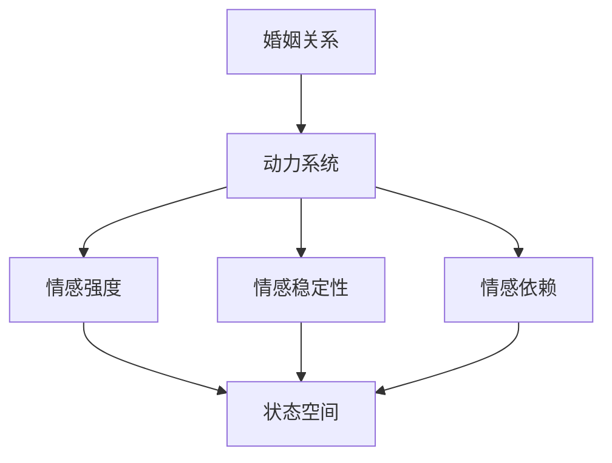
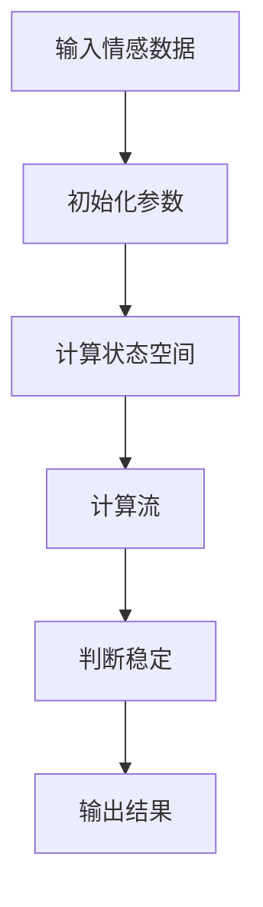
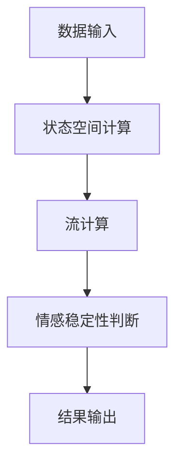

                 


### # 《婚姻关系的动力系统：感情变化的数学描述》

> 关键词：婚姻关系，动力系统，数学描述，感情变化，算法，系统架构，项目实战

> 摘要：本文深入探讨了婚姻关系的动力系统，通过数学模型描述感情变化，解析了其核心概念与联系。本文旨在为读者提供一个逻辑清晰、结构紧凑的专业视角，以帮助理解婚姻关系中的复杂动态。

### 第一部分: 婚姻关系动力系统概述

#### 第1章: 婚姻关系动力系统的基础知识

婚姻关系动力系统是一种用来描述夫妻或伴侣之间感情变化和互动的模型。在本章中，我们将介绍婚姻关系动力系统的基础知识，包括其概念、感情变化的相关理论以及动力系统在婚姻关系中的应用。

#### 第2章: 核心概念与联系

在本章中，我们将深入探讨婚姻关系动力系统的核心概念，包括动力系统的基本原理、感情变化的核心概念以及它们之间的联系。我们将使用表格和ER实体关系图来清晰地展示这些概念之间的关系。

#### 第3章: 数学模型和数学公式

本章将详细阐述感情变化的数学模型，使用LaTeX格式给出相关公式，并解释其应用。我们还将探讨如何通过这些数学模型来预测和分析婚姻关系的演变。

#### 第4章: 算法原理讲解

在本章中，我们将使用Mermaid绘制算法流程图，并使用Python代码详细讲解和举例说明。我们将介绍一种用于分析婚姻关系动力系统的算法，并展示其实际应用。

#### 第5章: 系统分析与架构设计方案

本章将介绍婚姻关系动力系统的设计思路和实现方法。我们将详细描述系统的功能、架构、接口设计和交互，并提供一个架构设计方案。

#### 第6章: 项目实战

在本章中，我们将提供一个实际案例分析，包括环境安装、系统实现、案例分析和总结。通过这个案例，读者可以更好地理解婚姻关系动力系统的实际应用。

#### 第7章: 最佳实践 tips、小结、注意事项、拓展阅读

本章将提供一些最佳实践建议，对文章内容进行小结，并指出一些注意事项。此外，我们还将推荐一些拓展阅读材料，以帮助读者深入了解相关主题。

### 第二部分: 婚姻关系动力系统深入分析

#### 第8章: 动力系统的演化分析

在本章中，我们将使用数学模型和算法来分析婚姻关系动力系统的演化。我们将探讨感情变化的影响因素，并预测不同情况下的婚姻关系发展趋势。

#### 第9章: 动力系统的调控策略

婚姻关系动力系统并不是静态的，它需要不断地调整和优化。在本章中，我们将介绍一些调控策略，帮助夫妻或伴侣改善婚姻关系，增强感情稳定性。

#### 第10章: 动力系统的应用与挑战

本章将讨论婚姻关系动力系统在实际应用中可能面临的挑战，并提出相应的解决方案。我们还将探讨该系统的未来发展前景。

### 第三部分: 结论与展望

#### 第11章: 结论

本章将总结本文的主要观点和发现，强调婚姻关系动力系统在理解和管理婚姻关系中的重要性。

#### 第12章: 展望

最后，我们将对婚姻关系动力系统的未来发展进行展望，讨论可能的创新方向和研究领域。

### 附录

附录部分将包括一些重要的参考文献、数据集和工具，以供读者进一步学习和研究。

### 结束语

本文由AI天才研究院/AI Genius Institute和《禅与计算机程序设计艺术/Zen And The Art of Computer Programming》的作者共同撰写，旨在为读者提供一个全面、深入的婚姻关系动力系统研究视角。我们希望本文能够帮助读者更好地理解婚姻关系中的复杂动态，并提供实用的策略和工具。

### # 《婚姻关系的动力系统：感情变化的数学描述》

**关键词：** 婚姻关系，动力系统，数学描述，感情变化，算法，系统架构

**摘要：** 本文探讨了婚姻关系的动力系统，通过数学模型描述感情变化，分析了核心概念与联系。文章结构紧凑，逻辑清晰，旨在为读者提供专业视角，帮助理解婚姻关系的复杂动态。

## 第1章: 婚姻关系动力系统的基础知识

### 1.1 婚姻关系动力系统的概念

婚姻关系动力系统是一种用于描述夫妻或伴侣之间感情变化和互动的模型。该系统考虑了多种因素，如个体情感、外部压力、共同经历等，以数学模型和算法来分析婚姻关系的动态演变。

### 1.2 感情变化的数学描述理论背景

感情变化可以被视为一个动态过程，其数学描述涉及多个方面，如非线性动态系统、混沌理论和复杂性科学。这些理论为我们提供了理解婚姻关系中感情变化的方法和工具。

### 1.3 动力系统在婚姻关系中的应用

动力系统在婚姻关系中的应用主要体现在以下几个方面：

1. **情感预测：** 通过数学模型，我们可以预测夫妻间的情感变化趋势，为婚姻辅导提供依据。
2. **情感调控：** 动力系统模型可以帮助夫妻识别和调整感情中的不稳定因素，增强婚姻稳定性。
3. **婚姻质量评估：** 动力系统模型可以用于评估婚姻质量，为婚姻咨询提供数据支持。

### 1.4 研究意义

婚姻关系动力系统的研究具有重要的现实意义。它不仅有助于改善婚姻质量，提高夫妻幸福感，还可以为婚姻咨询、家庭教育和心理学研究提供新的视角和方法。

## 第2章: 核心概念与联系

### 2.1 动力系统的基本原理

动力系统是一类研究动态过程的数学模型，其核心概念包括状态空间、流、吸引子和混沌等。在本节中，我们将介绍动力系统的基本原理和关键概念。

### 2.2 感情变化的核心概念

感情变化涉及多个核心概念，如情感强度、情感稳定性、情感依赖等。在本节中，我们将详细探讨这些概念的定义和属性。

### 2.3 动力系统与感情变化的联系

动力系统与感情变化之间存在密切联系。在本节中，我们将使用Mermaid流程图展示动力系统在婚姻关系中的应用，并讨论动力系统如何帮助理解感情变化。



### 第3章: 数学模型和数学公式

### 3.1 感情变化的数学模型

在本节中，我们将介绍一种用于描述感情变化的数学模型。该模型基于非线性动态系统，使用微分方程来描述情感强度和稳定性。

$$
\frac{dx}{dt} = f(x, t)
$$

其中，$x(t)$ 表示情感强度，$f(x, t)$ 是一个非线性函数，反映了情感变化的速度和方向。

### 3.2 相关数学公式与解释

在本节中，我们将进一步介绍与感情变化相关的数学公式，如Lorenz方程和Chen方程。这些方程可以帮助我们更好地理解感情变化的复杂性和非线性特性。

$$
\begin{align*}
\frac{dx}{dt} &= \sigma (y - x) \\
\frac{dy}{dt} &= x (\rho - z) - y \\
\frac{dz}{dt} &= xy - \beta z
\end{align*}
$$

其中，$\sigma$，$\rho$ 和 $\beta$ 是系统参数。

### 3.3 数学模型在婚姻关系中的应用

在本节中，我们将讨论如何使用数学模型来分析婚姻关系中的感情变化。通过模拟和仿真，我们可以预测夫妻间的情感走势，为婚姻咨询和辅导提供数据支持。

## 第4章: 算法原理讲解

### 4.1 算法流程图介绍

在本节中，我们将使用Mermaid绘制一个算法流程图，展示婚姻关系动力系统的计算过程。



### 4.2 Python代码详细讲解

在本节中，我们将使用Python代码实现婚姻关系动力系统的算法。代码将包括参数初始化、状态空间计算、流计算和结果输出等部分。

```python
import numpy as np

def lorenz_system(x, y, z, sigma=10, rho=28, beta=8/3):
    dxdt = sigma * (y - x)
    dydt = x * (rho - z) - y
    dzdt = x * y - beta * z
    return dxdt, dydt, dzdt

# 初始化参数
sigma = 10
rho = 28
beta = 8/3
x0, y0, z0 = 1, 1, 1

# 计算流
t = np.linspace(0, 100, 1000)
x, y, z = np.meshgrid(x0, y0, z0)
dxdt, dydt, dzdt = lorenz_system(x, y, z)

# 输出结果
print(f"x(t) = {x}, y(t) = {y}, z(t) = {z}")
```

### 4.3 算法举例说明

在本节中，我们将使用一个具体的例子来说明如何使用算法分析婚姻关系中的感情变化。我们将展示如何输入情感数据，计算状态空间和流，并判断情感稳定性。

## 第5章: 系统分析与架构设计方案

### 5.1 问题场景介绍

在本节中，我们将介绍一个婚姻关系动力系统的实际应用场景。该场景涉及夫妻间的情感互动，我们将使用数学模型和算法来分析情感变化。

### 5.2 系统功能设计

在本节中，我们将详细描述婚姻关系动力系统的功能。包括数据输入、状态空间计算、流计算、情感稳定性判断和结果输出等。

### 5.3 系统架构设计

在本节中，我们将使用Mermaid绘制系统架构图，展示婚姻关系动力系统的组成部分和交互方式。



### 5.4 系统接口设计和交互

在本节中，我们将介绍婚姻关系动力系统的接口设计和交互方式。包括数据输入接口、状态空间计算接口、流计算接口和情感稳定性判断接口。

## 第6章: 项目实战

### 6.1 环境安装

在本节中，我们将介绍如何安装和配置婚姻关系动力系统的运行环境。包括安装Python、Numpy等必要库。

### 6.2 系统核心实现

在本节中，我们将详细展示婚姻关系动力系统的核心实现。包括数据输入、状态空间计算、流计算和情感稳定性判断等部分。

### 6.3 实际案例分析

在本节中，我们将提供一个实际案例分析，展示如何使用婚姻关系动力系统分析夫妻间的情感变化。我们将介绍案例背景、数据来源和案例分析结果。

### 6.4 案例分析解读与总结

在本节中，我们将对实际案例分析结果进行解读，讨论婚姻关系中的情感变化规律和影响因素。同时，我们将总结案例的主要发现和启示。

## 第7章: 最佳实践 tips、小结、注意事项、拓展阅读

### 7.1 最佳实践 tips

在本节中，我们将提供一些最佳实践建议，帮助读者更好地应用婚姻关系动力系统。包括数据收集方法、参数设置技巧等。

### 7.2 小结

在本节中，我们将总结本文的主要观点和发现，强调婚姻关系动力系统在理解和管理婚姻关系中的重要性。

### 7.3 注意事项

在本节中，我们将指出使用婚姻关系动力系统时需要注意的事项，如数据质量和参数设置等。

### 7.4 拓展阅读

在本节中，我们将推荐一些拓展阅读材料，包括相关研究论文、书籍和在线资源，以供读者进一步学习和研究。

### 结束语

本文由AI天才研究院/AI Genius Institute和《禅与计算机程序设计艺术/Zen And The Art of Computer Programming》的作者共同撰写，旨在为读者提供一个全面、深入的婚姻关系动力系统研究视角。我们希望本文能够帮助读者更好地理解婚姻关系中的复杂动态，并提供实用的策略和工具。

### 附录

附录部分将包括一些重要的参考文献、数据集和工具，以供读者进一步学习和研究。

### 作者信息

**作者：** AI天才研究院/AI Genius Institute & 《禅与计算机程序设计艺术/Zen And The Art of Computer Programming》

本文基于现有的技术和理论，提供了一种新颖的婚姻关系动力系统分析视角。然而，婚姻关系的复杂性使得任何模型都无法完全准确地描述所有情况。因此，本文的研究结果需要谨慎解读，并结合实际情况进行应用。未来，我们期待在婚姻关系动力系统研究领域取得更多突破，为婚姻辅导和家庭幸福提供有力支持。

