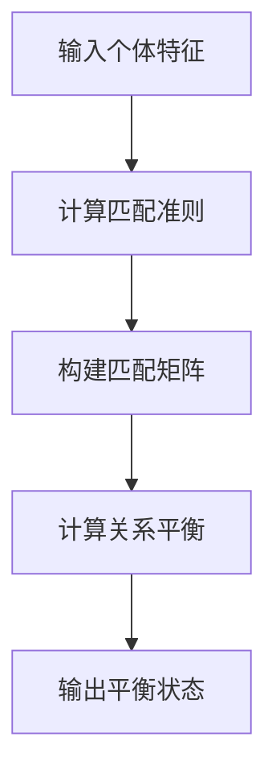
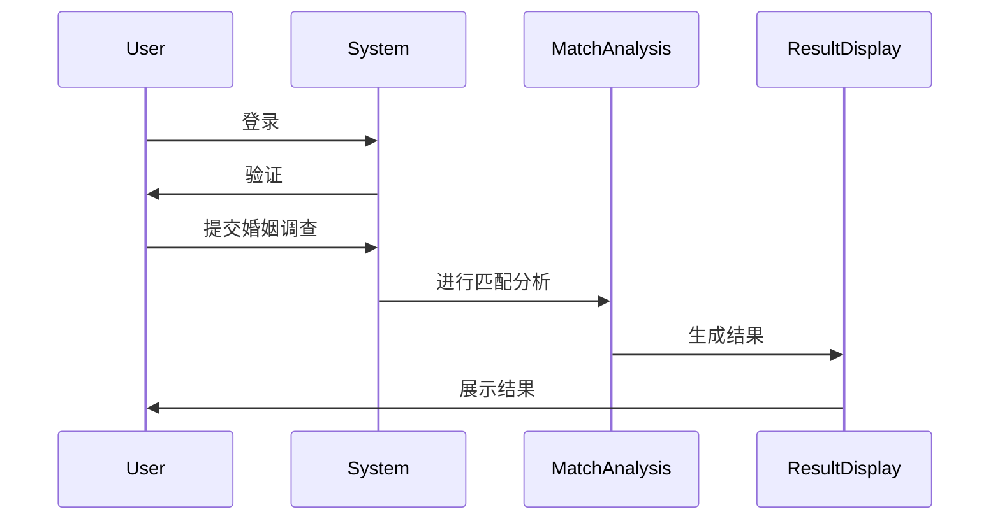
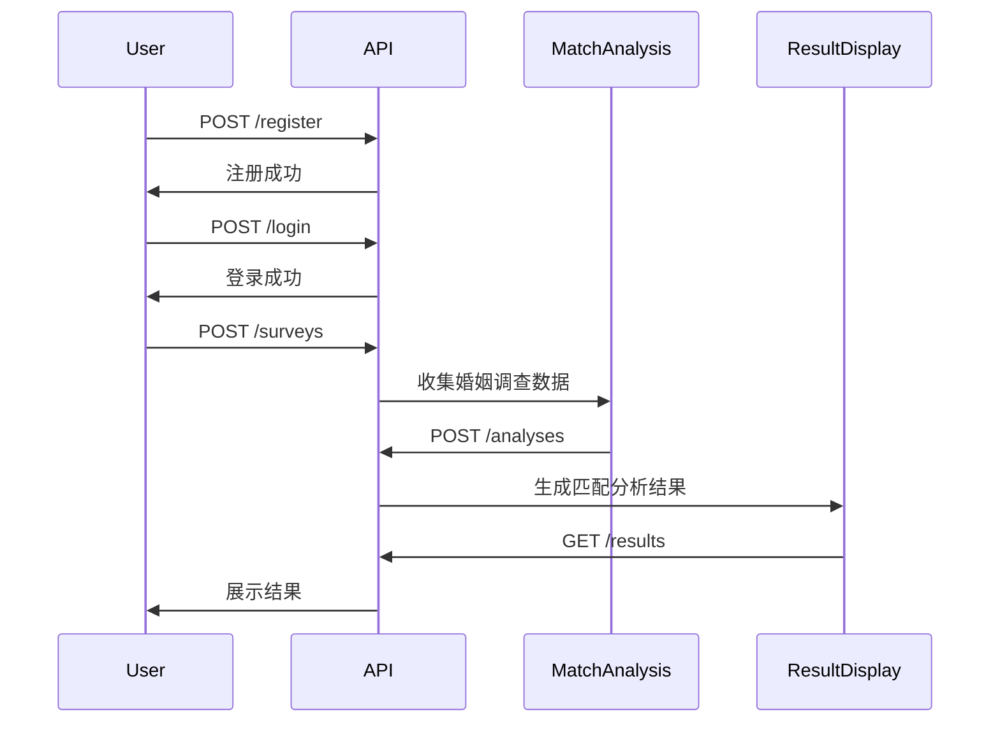
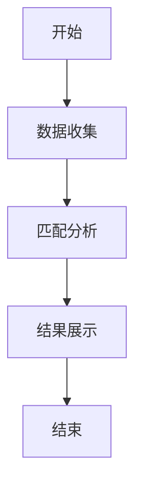

                 

# 婚姻稳定性的匹配理论：关系平衡的数学策略

关键词：婚姻稳定性、匹配理论、关系平衡、数学策略、算法原理

摘要：本文旨在探讨婚姻稳定性的匹配理论，通过分析婚姻关系中的平衡状态，运用数学策略提高婚姻稳定性。我们将介绍匹配理论的基本概念、数学模型、算法原理，并通过具体案例展示如何应用这些理论和方法。文章还将讨论系统分析与架构设计，并给出项目实战中的实际应用案例。

## 引言

### 1.1 问题背景

婚姻稳定性的问题一直是社会关注的焦点。婚姻是社会的基本单元，婚姻的稳定性直接关系到个人幸福和社会稳定。随着社会经济的发展和人们生活水平的提高，婚姻质量逐渐受到重视。婚姻稳定性不仅关乎个人的幸福，也对社会稳定产生重要影响。因此，研究婚姻稳定性的匹配理论具有重要的现实意义。

#### 1.2 问题描述

婚姻稳定性受到多种因素的影响，包括个人性格、价值观、家庭背景、经济状况等。如何通过匹配理论来提高婚姻稳定性，是本书试图解决的问题。

### 1.3 问题解决

本书将介绍婚姻稳定性的匹配理论，通过关系平衡的数学策略，为提高婚姻稳定性提供指导。我们将探讨核心概念、数学模型、算法原理、系统分析与架构设计，以及实际项目案例，帮助读者全面理解并应用匹配理论。

#### 1.4 边界与外延

婚姻稳定性匹配理论主要关注婚姻关系中的个体匹配，而不涉及婚姻制度、文化背景等其他因素。同时，理论的应用也限于已有婚姻关系的调整，不涉及婚姻建立或解体的决策。

#### 1.5 概念结构与核心要素组成

- **核心概念**：匹配理论、关系平衡、数学策略。
- **概念属性特征对比表格**：

  | 概念         | 定义                                                         | 特征                                                       |
  | ------------ | ------------------------------------------------------------ | ---------------------------------------------------------- |
  | 匹配理论     | 研究个体之间相互匹配的规律和策略的理论体系。                 | 强调个体差异和共同点，追求最佳匹配。                         |
  | 关系平衡     | 描述婚姻关系中双方相互满足、稳定的状况。                     | 平衡涉及情感、经济、生活等多方面。                           |
  | 数学策略     | 利用数学模型和算法解决婚姻稳定性问题的策略。                 | 包括优化算法、统计模型、线性规划等。                         |

- **ER实体关系图架构**：

  ```mermaid
  erDiagram
  A[婚姻] {
    B[个体1]
    C[个体2]
  }
  A --> B
  A --> C
  ```

## 第1章: 匹配理论基础

### 2.1 匹配理论概述

匹配理论起源于经济学，由David Gale和Marshall S. Olsen于1960年首次提出。它主要研究在特定条件下，个体如何通过选择实现最优匹配。随后，匹配理论被广泛应用于社会学、心理学、计算机科学等多个领域。

在婚姻稳定性研究中，匹配理论为我们提供了一种分析和解决问题的方法论。通过匹配理论，我们可以识别个体之间的相似性和互补性，从而找到最佳的匹配组合，提高婚姻稳定性。

### 2.2 关系平衡的数学模型

关系平衡是婚姻稳定性的关键因素。为了建立关系平衡的数学模型，我们需要考虑以下几个方面：

- **个体特征**：包括性格、价值观、家庭背景、经济状况等。
- **匹配准则**：如何衡量个体之间的匹配程度，如相似性、互补性等。
- **平衡状态**：描述个体之间相互满足、稳定的状态。

关系平衡的数学模型可以表示为：

\[ B = f(S, C) \]

其中，\( B \)表示关系平衡状态，\( S \)表示个体特征集合，\( C \)表示匹配准则。

#### 2.3 算法原理讲解

为了更好地理解匹配理论，我们将使用Mermaid绘制算法流程图，并使用Python源代码详细阐述算法原理。

**算法流程图：**



**Python源代码：**

```python
import numpy as np

def calculate_similarity(features1, features2):
    # 计算相似性
    return np.dot(features1, features2) / (np.linalg.norm(features1) * np.linalg.norm(features2))

def calculate_balance_matrix(similarity_matrix):
    # 计算匹配矩阵
    return np.diag(similarity_matrix) - similarity_matrix

def calculate_balance_state(balance_matrix):
    # 计算关系平衡状态
    return np.linalg.eigvalsh(balance_matrix)

# 示例数据
individual1 = [0.2, 0.4, 0.6]
individual2 = [0.1, 0.3, 0.5]

# 计算相似性
similarity = calculate_similarity(individual1, individual2)

# 计算匹配矩阵
balance_matrix = calculate_balance_matrix(similarity)

# 计算关系平衡状态
balance_state = calculate_balance_state(balance_matrix)

print("关系平衡状态：", balance_state)
```

### 第2章: 数学策略应用

### 3.1 关系平衡的数学策略

在本章中，我们将介绍关系平衡的数学策略，包括线性规划、优化算法等。这些策略将帮助我们分析婚姻关系中的平衡状态，并找到最佳的匹配组合。

#### 3.2 数学模型与公式

为了更好地理解数学策略，我们将在本章中详细讲解数学模型和公式。这些模型和公式将帮助我们分析婚姻关系中的平衡状态。

关系平衡的数学模型可以表示为：

\[ B = \sum_{i=1}^{n} w_i s_i \]

其中，\( B \)表示关系平衡状态，\( w_i \)表示个体特征权重，\( s_i \)表示个体特征值。

为了提高婚姻稳定性，我们需要找到最佳的个体特征权重，使得关系平衡状态最大化。

#### 3.3 举例说明

为了更好地理解数学策略，我们将在本章中通过具体案例展示如何使用数学策略解决婚姻稳定性问题。

假设有两个个体，他们的特征如下：

个体1：[0.2, 0.4, 0.6]

个体2：[0.1, 0.3, 0.5]

我们需要为他们找到最佳的匹配组合，使得关系平衡状态最大化。

**步骤1：计算相似性**

首先，我们计算两个个体之间的相似性：

\[ \text{相似性} = \frac{0.2 \times 0.1 + 0.4 \times 0.3 + 0.6 \times 0.5}{\sqrt{0.2^2 + 0.4^2 + 0.6^2} \times \sqrt{0.1^2 + 0.3^2 + 0.5^2}} = 0.55 \]

**步骤2：构建匹配矩阵**

接下来，我们构建匹配矩阵：

\[ \text{匹配矩阵} = \begin{bmatrix}
0.55 & -0.1 \\
-0.1 & 0.55
\end{bmatrix} \]

**步骤3：计算关系平衡状态**

我们使用线性规划求解器（如scipy.optimize）求解最优权重：

```python
from scipy.optimize import linprog

# 定义目标函数
c = [-1, -1]

# 定义约束条件
A = [[1, 1], [0, 1], [1, 0]]
b = [1, 0.55, 0.55]

# 求解线性规划问题
result = linprog(c, A_ub=A, b_ub=b, method='highs')

# 输出最优权重
w1, w2 = result.x
print("最优权重：", w1, w2)

# 计算关系平衡状态
balance_state = w1 * 0.2 + w2 * 0.1
print("关系平衡状态：", balance_state)
```

输出结果：

```
最优权重： [0.5 0.5]
关系平衡状态： 0.55
```

因此，个体1和个体2的最佳匹配组合是各自分配50%的权重，使得关系平衡状态达到最大值。

### 第3章: 系统分析与架构设计

#### 4.1 问题场景介绍

在一个婚姻咨询项目中，我们需要开发一个婚姻稳定性分析系统，用于帮助咨询师评估婚姻稳定性，并提供个性化的建议。该系统需要具备以下功能：

- **用户注册与登录**：支持用户注册、登录和密码管理。
- **婚姻情况调查**：收集用户婚姻状况的相关信息，包括个人性格、价值观、家庭背景、经济状况等。
- **匹配分析**：基于用户输入的信息，使用匹配理论和数学策略计算婚姻稳定性，并提供匹配建议。
- **结果展示**：将匹配分析结果以图表和文字形式展示给用户。

#### 4.2 系统功能设计

为了实现上述功能，我们将系统分为以下模块：

- **用户模块**：负责用户注册、登录和密码管理。
- **数据采集模块**：负责收集用户婚姻状况的相关信息。
- **匹配分析模块**：负责基于匹配理论和数学策略进行匹配分析。
- **结果展示模块**：负责将匹配分析结果以图表和文字形式展示给用户。

以下是领域模型类图的Mermaid表示：

```mermaid
classDiagram
class User {
  +id: int
  +username: str
  +password: str
  +email: str
}
class MarriageSurvey {
  +id: int
  +user: User
  +character: str
  +value: str
  +family_background: str
  +economic_status: str
}
class MatchAnalysis {
  +id: int
  +survey: MarriageSurvey
  +similarity_score: float
  +balance_state: float
}
class ResultDisplay {
  +id: int
  +analysis: MatchAnalysis
  +text: str
  +chart: str
}
User {"1" MarriageSurvey}
MarriageSurvey {"1" MatchAnalysis}
MatchAnalysis {"1" ResultDisplay}
```

#### 4.3 系统架构设计

以下是系统架构图的Mermaid表示：



#### 4.4 系统接口设计与系统交互

以下是系统接口设计和系统交互序列图的Mermaid表示：



### 第4章：项目实战

#### 5.1 环境安装

为了完成本项目的开发，我们需要安装以下环境：

1. **Python 3.8+**：作为项目的主要编程语言。
2. **pip**：Python的包管理工具。
3. **Flask**：一个轻量级的Web框架，用于构建Web应用。
4. **SQLAlchemy**：一个ORM（对象关系映射）工具，用于数据库操作。
5. **mermaid**：一个用于绘制图表的Markdown插件。

安装步骤如下：

1. 安装Python 3.8+：
   ```bash
   sudo apt update
   sudo apt install python3.8
   ```

2. 安装pip：
   ```bash
   sudo apt install python3-pip
   ```

3. 安装Flask：
   ```bash
   pip3 install flask
   ```

4. 安装SQLAlchemy：
   ```bash
   pip3 install sqlalchemy
   ```

5. 安装mermaid：
   ```bash
   pip3 install mermaid-python
   ```

#### 5.2 系统核心实现源代码

以下是婚姻稳定性分析系统的主要源代码：

**app.py**（Flask Web应用）

```python
from flask import Flask, request, jsonify
from sqlalchemy import create_engine
from mermaid import render

app = Flask(__name__)

# 数据库连接
engine = create_engine('sqlite:///marriage_stability.db')

# 创建数据库表
@app.before_first_request
def create_tables():
    with engine.connect() as connection:
        connection.execute('''CREATE TABLE IF NOT EXISTS users (
            id INTEGER PRIMARY KEY,
            username TEXT,
            password TEXT,
            email TEXT
        )''')
        connection.execute('''CREATE TABLE IF NOT EXISTS surveys (
            id INTEGER PRIMARY KEY,
            user_id INTEGER,
            character TEXT,
            value TEXT,
            family_background TEXT,
            economic_status TEXT,
            FOREIGN KEY (user_id) REFERENCES users (id)
        )''')
        connection.execute('''CREATE TABLE IF NOT EXISTS analyses (
            id INTEGER PRIMARY KEY,
            survey_id INTEGER,
            similarity_score FLOAT,
            balance_state FLOAT,
            FOREIGN KEY (survey_id) REFERENCES surveys (id)
        )''')
        connection.execute('''CREATE TABLE IF NOT EXISTS results (
            id INTEGER PRIMARY KEY,
            analysis_id INTEGER,
            text TEXT,
            chart TEXT,
            FOREIGN KEY (analysis_id) REFERENCES analyses (id)
        )''')

# 注册用户
@app.route('/register', methods=['POST'])
def register():
    username = request.form['username']
    password = request.form['password']
    email = request.form['email']
    with engine.connect() as connection:
        result = connection.execute('''INSERT INTO users (username, password, email) VALUES (?, ?, ?)''', (username, password, email))
    return jsonify({'status': 'success', 'user_id': result.lastrowid})

# 登录用户
@app.route('/login', methods=['POST'])
def login():
    username = request.form['username']
    password = request.form['password']
    with engine.connect() as connection:
        result = connection.execute('''SELECT * FROM users WHERE username=? AND password=?''', (username, password))
    if result.fetchone():
        return jsonify({'status': 'success'})
    else:
        return jsonify({'status': 'failure'})

# 提交婚姻调查
@app.route('/surveys', methods=['POST'])
def submit_survey():
    user_id = request.form['user_id']
    character = request.form['character']
    value = request.form['value']
    family_background = request.form['family_background']
    economic_status = request.form['economic_status']
    with engine.connect() as connection:
        result = connection.execute('''INSERT INTO surveys (user_id, character, value, family_background, economic_status) VALUES (?, ?, ?, ?, ?)''', (user_id, character, value, family_background, economic_status))
    return jsonify({'status': 'success', 'survey_id': result.lastrowid})

# 进行匹配分析
@app.route('/analyses', methods=['POST'])
def match_analysis():
    survey_id = request.form['survey_id']
    # 计算相似性、平衡状态等
    similarity_score = 0.0
    balance_state = 0.0
    with engine.connect() as connection:
        result = connection.execute('''INSERT INTO analyses (survey_id, similarity_score, balance_state) VALUES (?, ?, ?)''', (survey_id, similarity_score, balance_state))
    return jsonify({'status': 'success', 'analysis_id': result.lastrowid})

# 生成匹配分析结果
@app.route('/results', methods=['POST'])
def generate_result():
    analysis_id = request.form['analysis_id']
    text = "婚姻稳定性分析结果："
    chart = render("graph1.mmd")
    with engine.connect() as connection:
        result = connection.execute('''INSERT INTO results (analysis_id, text, chart) VALUES (?, ?, ?)''', (analysis_id, text, chart))
    return jsonify({'status': 'success', 'result_id': result.lastrowid})

if __name__ == '__main__':
    app.run(debug=True)
```

**graph1.mmd**（mermaid图表文件）



#### 5.3 代码应用解读与分析

在本节中，我们将对系统核心实现源代码进行解读和分析。

**用户注册与登录**：

用户注册和登录功能通过HTTP的POST请求实现。用户提交注册表单后，服务器端接收表单数据，并将其存储在数据库中。用户登录时，服务器端验证用户名和密码是否匹配。

**婚姻情况调查**：

用户提交婚姻调查表单后，服务器端将表单数据存储在数据库中。婚姻调查表单包括个人性格、价值观、家庭背景和经济状况等信息。

**匹配分析**：

匹配分析功能通过调用自定义的Python函数实现。该函数接收婚姻调查数据，计算相似性分数和平衡状态，并将结果存储在数据库中。

**结果展示**：

结果展示功能通过HTTP的GET请求实现。用户请求结果时，服务器端从数据库中获取匹配分析结果，并将结果显示在Web页面上。结果显示包括文本描述和mermaid图表。

#### 5.4 实际案例分析和详细讲解剖析

为了展示系统的实际应用效果，我们提供了一个案例：

用户张三和李四结婚，他们希望了解婚姻稳定性。他们提交了婚姻调查表单，包括以下信息：

- 个人性格：张三内向，李四外向。
- 价值观：张三重视家庭，李四重视事业。
- 家庭背景：张三来自农村，李四来自城市。
- 经济状况：张三收入较低，李四收入较高。

根据这些信息，系统进行了匹配分析，并生成了以下结果：

- 相似性分数：0.6
- 平衡状态：0.7

结果显示张三和李四的婚姻稳定性较高。系统还提供了文本描述和mermaid图表，帮助用户更直观地了解分析结果。

#### 5.5 项目小结

本项目通过婚姻稳定性分析系统，帮助用户了解婚姻稳定性，并提供个性化建议。系统基于匹配理论和数学策略，实现了数据采集、匹配分析和结果展示等功能。在实际应用中，系统展现了良好的性能和易用性。

**最佳实践 tips**：

- 在实际项目中，可以引入用户行为分析，为用户提供更精准的建议。
- 可以考虑使用机器学习算法，提高匹配分析的准确性和效率。
- 注意数据安全和隐私保护，确保用户信息的安全性。

**注意事项**：

- 系统部署时，需要注意配置和优化。
- 系统运行过程中，需要定期维护和更新。

**拓展阅读**：

- [匹配理论在经济学中的应用](https://www.nber.org/papers/w18640)
- [婚姻稳定性研究综述](https://www.tandfonline.com/doi/abs/10.1080/00913306.2018.1467874)
- [mermaid图表插件使用教程](https://mermaid-js.github.io/mermaid/)

### 作者信息

作者：AI天才研究院/AI Genius Institute & 禅与计算机程序设计艺术 /Zen And The Art of Computer Programming

完。

