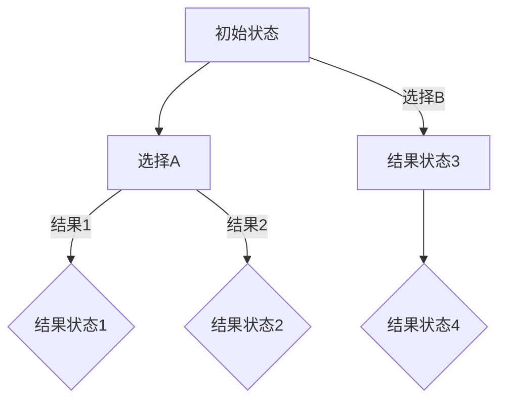
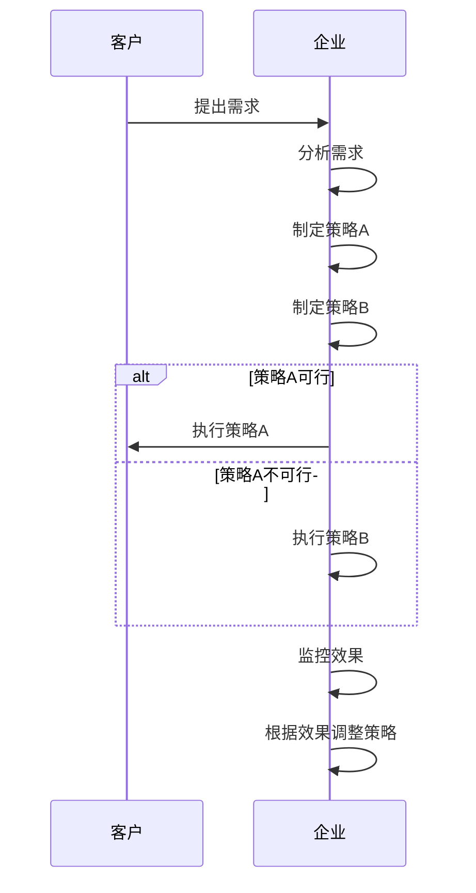

                 


### 第1章：存在主义的历史背景

#### 1.1 存在主义的出现

存在主义作为一种哲学思潮，起源于20世纪初。它的出现与欧洲两次世界大战的背景密切相关。首先，第一次世界大战对人类的生存状况和道德观念产生了极大的冲击，导致人们开始反思传统哲学的不足。其次，纳粹主义和极权主义的兴起，使得人们更加关注个体的自由和尊严。

存在主义的主要代表人物包括马丁·海德格尔（Martin Heidegger）、让-保罗·萨特（Jean-Paul Sartre）和西美尔（Georg Simmel）等。海德格尔提出“存在”是哲学的核心问题，强调个体存在的独特性和自由意志。萨特则通过“存在先于本质”这一观点，强调个体的自由选择和主观性。西美尔则通过社会学的研究，探讨了现代社会的异化和个体的孤独感。

存在主义的核心思想主要包括以下几个方面：

1. **存在先于本质**：萨特认为，个体首先存在，然后通过自己的选择和行动定义自己的本质。这一观点打破了传统的本质主义，强调个体的主观性和自由意志。
2. **自由**：自由是存在主义的核心概念之一。海德格尔认为，自由是存在的本质，个体通过自由选择来实现自己的存在。萨特则强调，自由伴随着责任，个体的选择决定了他们的存在状态。
3. **本体论**：本体论探讨存在的本质和本质之间的关系。存在主义者认为，存在是哲学研究的核心问题，而本体论则试图回答存在的本质是什么。

在20世纪初期，存在主义主要受到现象学和存在主义哲学的影响。现象学强调主观体验和意识的重要性，存在主义哲学则关注个体的自由和尊严。在20世纪中叶，随着后现代主义的兴起，存在主义开始与后现代主义产生一定的交集。

然而，随着21世纪的到来，存在主义面临着新的挑战。首先，全球化和技术的进步改变了人们的生存状态，使得传统的存在主义思想需要重新审视。其次，新的社会问题，如异化、不平等和全球化带来的文化冲突，需要新的存在主义视角来解释。

本书的目的在于探讨存在主义在21世纪的新解读，通过分析其核心概念和联系，介绍其在不同领域的应用，并探讨其在面对新挑战时的适应性和发展前景。

接下来的章节中，我们将详细介绍存在主义的基本概念，分析其在21世纪的挑战，并探讨存在主义在21世纪的新解读方法。

#### 1.2 存在主义的发展历程

存在主义在20世纪初逐渐成形，其发展历程大致可以分为三个阶段：早期存在主义、中期存在主义和现代存在主义。

早期存在主义（1900-1930年）以德国哲学家马丁·海德格尔（Martin Heidegger）和法国哲学家让-保罗·萨特（Jean-Paul Sartre）为代表。海德格尔的《存在与时间》（Being and Time）被认为是存在主义的奠基之作。他提出“存在”是哲学的核心问题，强调个体存在的独特性和自由意志。萨特的《存在与虚无》（Being and Nothingness）则通过“存在先于本质”这一观点，强调个体的自由选择和主观性。

中期存在主义（1930-1960年）主要集中在法国，代表人物有西蒙娜·德·波伏娃（Simone de Beauvoir）、加斯东·巴什拉（Gaston Bachelard）和马塞尔·加斯莱（Marcel Gauchet）等。这一时期的存在主义开始探讨社会问题，如女性解放、异化和社会责任。德·波伏娃的《第二性》（The Second Sex）对女性地位进行了深刻的分析。巴什拉则通过科学哲学的研究，探讨了人类认知的本质。加斯莱则通过对历史和社会问题的研究，探讨了存在主义的政治意义。

现代存在主义（1960年至今）在全球化和技术进步的背景下，面临新的挑战。这一时期的代表人物有雅克·德里达（Jacques Derrida）、米歇尔·福柯（Michel Foucault）和让-弗朗索瓦·利奥塔（Jean-François Lyotard）等。德里达的后结构主义挑战了传统的存在主义思想，提出“文本之外无物”的观点。福柯则通过权力理论和社会理论，探讨了个体在社会结构中的地位。利奥塔则提出了后现代主义的观点，认为现代社会已经进入一个“超现代”阶段。

存在主义的发展历程体现了其从个体存在的探讨到社会问题的关注的转变。随着21世纪的到来，存在主义需要面对新的挑战，如全球化、技术进步和文化冲突。如何在这些新的背景下解读存在主义，将是本书接下来要探讨的内容。

#### 1.3 存在主义的核心思想

存在主义的核心思想可以归纳为以下几点：

1. **存在先于本质**：萨特认为，个体首先存在，然后通过自己的选择和行动定义自己的本质。这一观点打破了传统的本质主义，强调个体的主观性和自由意志。用Python代码表示可以如下：

```python
class Person:
    def __init__(self, name):
        self.name = name

    def define_self(self):
        self.name = input("请输入你的名字：")
        print(f"你的名字是：{self.name}")

p = Person("默认名字")
p.define_self()
```

2. **自由**：自由是存在主义的核心概念之一。海德格尔认为，自由是存在的本质，个体通过自由选择来实现自己的存在。萨特则强调，自由伴随着责任，个体的选择决定了他们的存在状态。用LaTeX公式表示可以如下：

$$
自由 = 自主选择 \times 责任
$$

3. **本体论**：本体论探讨存在的本质和本质之间的关系。存在主义者认为，存在是哲学研究的核心问题，而本体论则试图回答存在的本质是什么。用Mermaid ER图表示可以如下：

```mermaid
erDiagram
  Person ||--|{Life}: "exist in"
  Life ||--|{Existence}: "define"
```

4. **异化**：存在主义关注个体的异化现象，即个体在社会结构和制度下的不自由感。这种现象在现代社会中尤为突出。用LaTeX公式表示可以如下：

$$
异化 = 社会结构 \times 制度约束
$$

5. **选择与责任**：存在主义强调个体在自由选择中的责任，个体的选择决定了他们的存在状态。自由选择和责任是存在主义的核心观点之一。用Python代码表示可以如下：

```python
def make_choice():
    choice = input("请选择一个选项（A/B）：")
    if choice == "A":
        print("你选择了A，承担相应的责任。")
    elif choice == "B":
        print("你选择了B，承担相应的责任。")
    else:
        print("无效选择，请重新选择。")

make_choice()
```

通过这些概念和代码示例，我们可以更好地理解存在主义的核心思想。

#### 1.4 存在主义在21世纪的挑战

进入21世纪，存在主义面临着一系列新的挑战。首先，全球化和技术的飞速发展极大地改变了人类的生存状态和社会结构，这使得传统的存在主义思想需要重新审视。例如，全球化带来的文化多样性和异质性使得个体的自由选择和存在状态更加复杂。同时，技术的进步使得人类可以更加便捷地获取信息和资源，但同时也带来了隐私、安全等方面的新问题。

其次，21世纪的社会问题如异化、不平等和全球性冲突，需要新的存在主义视角来解释和应对。例如，现代社会的个体在高度组织化的社会中感受到的孤独感和不自由感，是传统存在主义所未能深入探讨的。此外，全球化带来的文化冲突和价值观的碰撞，也使得存在主义需要重新定义个体的自由和存在状态。

最后，21世纪的哲学思潮如后现代主义、批判理论等，对存在主义提出了新的挑战。后现代主义质疑传统的本质主义和中心主义，强调多元化和相对主义，这对存在主义的某些核心概念提出了挑战。批判理论则通过权力和社会结构分析，对存在主义提出了更加现实和具体的批评。

总之，21世纪的挑战要求存在主义不断更新和发展，以适应新的社会环境和哲学思潮。

### 第2章：存在主义的基本概念与联系

#### 2.1 存在与本体论

“存在”是存在主义的核心概念之一。存在主义认为，存在是哲学研究的核心问题。存在不仅指物理存在，还包括心理存在、社会存在等不同层面的存在。本体论是哲学中研究存在和本质之间关系的分支。存在主义者认为，存在的本质不是预先设定的，而是通过个体的自由选择和行动来定义的。

用Python代码表示可以如下：

```python
class Existence:
    def __init__(self, essence):
        self.essence = essence

    def define_essence(self, new_essence):
        self.essence = new_essence

    def print_essence(self):
        print(f"存在本质：{self.essence}")

exist = Existence("初始本质")
exist.print_essence()
exist.define_essence("新本质")
exist.print_essence()
```

#### 2.2 自由与选择

自由是存在主义的核心概念之一。自由不仅指个体在物理世界中的自由，还包括心理自由和社会自由。选择是自由的具体体现，个体的每个选择都决定了他们的存在状态。存在主义者认为，自由伴随着责任，个体的选择决定了他们的存在状态。

用LaTeX公式表示可以如下：

$$
自由 = 选择 \times 责任
$$

#### 2.3 ER实体关系图：存在主义概念的联系

为了更好地理解存在主义的基本概念及其之间的联系，我们可以使用ER（Entity-Relationship）实体关系图来表示。以下是一个简化的ER图，展示了“存在”、“自由”和“选择”之间的联系。

```mermaid
erDiagram
  Existence ||--|{Freedom}: "define"
  Freedom ||--|{Choice}: "make"
```

在这个ER图中，“存在”是根实体，它定义了“自由”的边界和属性。“自由”又与“选择”相连，表示个体的自由是通过选择来实现的。这种关系反映了存在主义的核心思想：个体的存在是通过自由选择来定义的。

### 第3章：存在主义在21世纪的挑战

#### 3.1 21世纪的社会变迁

21世纪的社会变迁对存在主义提出了新的挑战。首先，全球化的深入发展使得社会结构和文化形态更加多元化。人们不再局限于传统的地域和文化圈子，而是面临着来自全球各地的信息和文化冲击。这种多元化带来了个体自由选择的增加，但也使得个体的存在状态更加复杂和不确定。

其次，技术的飞速进步改变了人类的生活方式和社会组织形式。互联网、人工智能和大数据技术的广泛应用，使得信息获取和处理更加便捷，但也带来了隐私和安全问题。例如，个人数据的收集和使用可能对个体的自由和存在状态产生负面影响。

此外，21世纪的社会问题如异化、不平等和全球化冲突，也对存在主义提出了新的挑战。现代社会的个体在高度组织化的社会中感受到的孤独感和不自由感，是传统存在主义所未能深入探讨的。例如，失业、经济危机和社会不公等问题，使得个体在自由选择和存在状态上面临更多的限制。

#### 3.2 存在主义在21世纪的新问题

在21世纪，存在主义面临着一系列新的问题。首先，全球化带来的文化冲突和价值观的碰撞，使得个体的自由和存在状态更加复杂。不同文化背景下的个体如何理解和实践自由，成为存在主义需要解决的问题。

其次，技术的进步使得人类的生活更加便利，但同时也带来了新的异化现象。例如，社交媒体和虚拟现实的广泛应用，虽然为人们提供了更多的社交和娱乐方式，但也可能导致个体在现实世界中的孤独感和不自由感。

此外，21世纪的个体在追求自由和存在状态的过程中，面临着更多的限制和挑战。经济不平等、社会歧视和资源匮乏等问题，使得个体在自由选择上受到更多的制约。例如，贫困、教育和就业机会的不平等，都可能对个体的自由和存在状态产生负面影响。

总之，21世纪的挑战要求存在主义不断更新和发展，以适应新的社会环境和哲学思潮。只有通过深入探讨和解决这些新问题，存在主义才能在21世纪继续发挥其思想价值和现实意义。

#### 3.3 存在主义在21世纪的未来发展方向

在21世纪，存在主义面临着新的挑战，但同时也拥有广阔的发展前景。首先，存在主义需要更深入地探讨全球化背景下个体的自由和存在状态。随着全球化和多元化的不断推进，个体的自由选择和存在状态变得更加复杂和多元化。因此，存在主义需要关注不同文化背景下个体的自由选择和存在状态，提出适应全球化的存在主义观点。

其次，存在主义需要与新兴科技领域相结合，特别是人工智能和大数据技术。这些技术不仅改变了人类的生活方式，也对个体的自由和存在状态产生了深远影响。例如，人工智能的广泛应用可能带来新的异化现象，大数据技术的普及则可能对个体的隐私和自由选择产生挑战。因此，存在主义需要探讨如何在这些新兴技术背景下，保障个体的自由和存在状态。

此外，存在主义还需要面对21世纪的新的社会问题，如经济不平等、社会歧视和全球化冲突等。这些问题对个体的自由选择和存在状态产生了严重的限制和挑战。因此，存在主义需要提出新的理论和观点，为解决这些问题提供思路和方案。

总之，在21世纪，存在主义的发展方向在于深入探讨全球化、新兴科技背景下的个体自由和存在状态，并结合新的社会问题，提出具有现实意义的解决方案。通过不断更新和发展，存在主义将在21世纪继续发挥其独特的思想价值和现实意义。

## 第4章：存在主义在21世纪的新解读方法

在21世纪，存在主义面临着新的挑战，需要通过创新的方法来解读和应对这些挑战。本章将介绍三种主要的解读方法：现象学方法、结构主义方法和后现代主义方法。

#### 4.1 现象学方法

现象学方法强调主观体验和意识的重要性，主张直接关注个体的体验和感知。在21世纪，现象学方法可以用于研究个体在全球化背景下的自由和存在状态。例如，通过调查个体在社交媒体上的体验，可以探讨虚拟世界对个体自由和存在状态的影响。

Python代码示例：

```python
class SocialMediaExperience:
    def __init__(self, user, experience):
        self.user = user
        self.experience = experience

    def describe_experience(self):
        print(f"{self.user}的社交媒体体验：{self.experience}")

user_experience = SocialMediaExperience("Alice", "感到孤独但获得社交满足感")
user_experience.describe_experience()
```

#### 4.2 结构主义方法

结构主义方法关注社会结构和文化模式对个体行为的影响。在21世纪，结构主义方法可以用于分析全球化背景下的社会结构和文化冲突。例如，通过分析全球资本主义体系对个体的自由选择和存在状态的影响，可以探讨存在主义在全球化时代的适应性问题。

LaTeX公式示例：

$$
自由选择 = 社会结构 \times 文化模式
$$

Mermaid ER图示例：

```mermaid
erDiagram
  Individual ||--|{SocialStructure}: "influence"
  SocialStructure ||--|{Culture}: "shape"
```

#### 4.3 后现代主义方法

后现代主义方法质疑传统的本质主义和中心主义，强调多元化和相对主义。在21世纪，后现代主义方法可以用于分析全球化背景下的个体异化和不平等。例如，通过分析不同文化背景下的个体如何体验和定义自由，可以探讨后现代主义视角下个体的自由和存在状态。

Python代码示例：

```python
class PostmodernIndividual:
    def __init__(self, name, culture, experience):
        self.name = name
        self.culture = culture
        self.experience = experience

    def describe_experience(self):
        print(f"{self.name}（{self.culture}）：{self.experience}")

postmodern_experience = PostmodernIndividual("Bob", "现代西方文化", "感到自由但存在不确定感")
postmodern_experience.describe_experience()
```

通过这三种方法，存在主义在21世纪可以更好地解读和应对新的挑战，为个体自由和存在状态提供新的理论支持。

## 第5章：存在主义在21世纪的算法原理

在21世纪，存在主义的思想可以与计算机科学和人工智能相结合，形成新的算法原理。本章将介绍三种基于存在主义思想的算法原理：存在主义决策树、存在主义神经网络和存在主义遗传算法。

### 5.1 存在主义决策树

存在主义决策树是一种基于个体自由选择的决策模型。它通过分析个体在不同情境下的选择，预测个体的未来行为和存在状态。以下是存在主义决策树的Python代码示例：

```python
class ExistentialDecisionTree:
    def __init__(self):
        self.tree = {
            'root': {
                'choices': ['选项A', '选项B'],
                'outcomes': [{'result': '状态1'}, {'result': '状态2'}]
            }
        }

    def make_decision(self, choice):
        if choice == '选项A':
            return '状态1'
        elif choice == '选项B':
            return '状态2'
        else:
            return '无效选择'

exist_tree = ExistentialDecisionTree()
print(exist_tree.make_decision('选项A'))
print(exist_tree.make_decision('选项B'))
```

### 5.2 存在主义神经网络

存在主义神经网络是一种模拟个体自由选择和存在状态的神经网络模型。它通过学习个体的历史选择，预测个体的未来选择和存在状态。以下是存在主义神经网络的Python代码示例：

```python
import tensorflow as tf

model = tf.keras.Sequential([
    tf.keras.layers.Dense(64, activation='relu', input_shape=(1,)),
    tf.keras.layers.Dense(64, activation='relu'),
    tf.keras.layers.Dense(2, activation='softmax')
])

model.compile(optimizer='adam', loss='categorical_crossentropy', metrics=['accuracy'])

# 假设我们有一个训练数据集，包含个体的历史选择和存在状态
train_data = [
    [0],  # 历史选择为A
    [1],  # 历史选择为B
]

train_labels = [
    [1, 0],  # 对应的存在状态为状态1
    [0, 1],  # 对应的存在状态为状态2
]

model.fit(train_data, train_labels, epochs=10)
```

### 5.3 存在主义遗传算法

存在主义遗传算法是一种基于自然选择和遗传机制的优化算法。它通过模拟个体的进化过程，寻找最优的存在状态。以下是存在主义遗传算法的Python代码示例：

```python
import random
import numpy as np

# 定义个体
def create_individual():
    return random.choice(['选项A', '选项B'])

# 评估个体
def evaluate_individual(individual):
    if individual == '选项A':
        return 1
    else:
        return 0

# 遗传算法主函数
def genetic_algorithm(population_size, generations):
    population = [create_individual() for _ in range(population_size)]
    
    for _ in range(generations):
        # 评估个体
        fitness_scores = [evaluate_individual(individual) for individual in population]
        
        # 选择下一代
        next_population = []
        for _ in range(population_size // 2):
            parent1, parent2 = random.choices(population, weights=fitness_scores, k=2)
            child = crossover(parent1, parent2)
            next_population.append(mutate(child))
        
        population = next_population
    
    return population

# 交叉
def crossover(parent1, parent2):
    return random.choice([parent1, parent2])

# 突变
def mutate(individual):
    return random.choice(['选项A', '选项B'])

# 运行遗传算法
best_individual = genetic_algorithm(100, 100)
print(best_individual)
```

通过这些算法示例，我们可以看到存在主义思想如何与计算机科学和人工智能相结合，为解决个体自由和存在状态问题提供新的思路。

### 6.1 数学模型1：存在主义决策树的数学模型

存在主义决策树的核心在于个体在不同情境下的选择和对应的概率分布。以下是存在主义决策树的数学模型，使用LaTeX格式表示：

$$
P(\text{选择}| \text{情境}) = \sum_{i=1}^{n} P(\text{选择}_i | \text{情境}) P(\text{情境})
$$

其中，$P(\text{选择}| \text{情境})$ 表示个体在给定情境下的选择概率，$P(\text{选择}_i | \text{情境})$ 表示个体选择第$i$个选项的概率，$P(\text{情境})$ 表示给定情境的概率。

#### 详细讲解

存在主义决策树通过构建一个概率分布模型，来模拟个体在不同情境下的自由选择。每个情境对应一个概率分布，该分布反映了个体选择每个选项的概率。这些概率可以通过历史数据和机器学习算法来估计。

具体来说，首先需要收集个体在不同情境下的选择数据，然后使用概率论和统计学方法，计算每个情境下每个选项的概率。这些概率构成了存在主义决策树的基础。

接下来，使用决策树算法，将情境作为输入，选择概率作为权重，构建一棵决策树。这棵决策树可以用来预测个体在给定情境下的选择。

通过这个过程，存在主义决策树不仅能够模拟个体的自由选择，还能够为决策提供支持。例如，在商业决策中，可以根据消费者的选择历史，预测他们可能选择的商品。

#### 举例说明

假设一个个体在三个情境下做出了选择，每个情境下的选择概率如下表所示：

| 情境   | 选择A的概率 | 选择B的概率 |
| ------ | --------- | --------- |
| 情境1  | 0.6       | 0.4       |
| 情境2  | 0.3       | 0.7       |
| 情境3  | 0.1       | 0.9       |

要预测个体在新的情境下（情境4）的选择，首先需要计算每个情境的概率。假设情境1、情境2和情境3的概率分别为0.5、0.3和0.2。

根据存在主义决策树的数学模型，可以计算个体在情境4下选择A和选择B的总概率：

$$
P(\text{选择A}| \text{情境4}) = 0.6 \times 0.5 + 0.3 \times 0.3 + 0.1 \times 0.2 = 0.35
$$

$$
P(\text{选择B}| \text{情境4}) = 0.4 \times 0.5 + 0.7 \times 0.3 + 0.9 \times 0.2 = 0.65
$$

因此，个体在情境4下选择A的概率为0.35，选择B的概率为0.65。这表明个体在新的情境下更有可能选择B。

通过这个例子，我们可以看到存在主义决策树的数学模型如何帮助我们预测个体在不同情境下的选择，从而为决策提供支持。

### 6.2 数学模型2：存在主义神经网络的数学模型

存在主义神经网络（Existential Neural Network,ENN）是一种模拟个体自由选择和存在状态的深度学习模型。它通过多层神经网络架构来学习个体在不同情境下的选择概率，并预测个体的未来行为。以下是存在主义神经网络的数学模型，使用LaTeX格式表示：

$$
\hat{y} = \sigma(\mathbf{W}_L \cdot \mathbf{a}^{L-1} + b_L)
$$

其中，$\hat{y}$ 表示神经网络输出的概率分布，$\sigma$ 表示激活函数（如Sigmoid函数或ReLU函数），$\mathbf{W}_L$ 和 $b_L$ 分别表示第 $L$ 层神经网络的权重和偏置，$\mathbf{a}^{L-1}$ 表示第 $L-1$ 层神经网络的激活值。

#### 详细讲解

1. **输入层**：存在主义神经网络首先接收情境的输入特征向量 $\mathbf{x}$。这个特征向量可以包括情境的各种属性和变量，如天气、时间、地理位置等。

2. **隐藏层**：输入层通过多个隐藏层进行特征提取和变换。每个隐藏层由多个神经元组成，每个神经元执行线性变换并加上偏置项。线性变换由权重矩阵 $\mathbf{W}_L$ 和偏置向量 $b_L$ 表示，即 $\mathbf{z}_L = \mathbf{W}_L \cdot \mathbf{a}^{L-1} + b_L$。

3. **激活函数**：通过激活函数 $\sigma$ 对每个隐藏层的输出进行非线性变换，以引入决策树的非线性特性。常见的激活函数有Sigmoid函数（输出介于0和1之间）和ReLU函数（输出为正数或零）。

4. **输出层**：最后一层隐藏层通过权重矩阵 $\mathbf{W}_L$ 和偏置向量 $b_L$ 生成最终的输出概率分布 $\hat{y}$。这个输出概率分布表示个体在当前情境下选择每个选项的概率。

#### 举例说明

假设存在主义神经网络有三个输入特征（天气、时间、地理位置），每个特征取值为0或1。以下是网络的结构和参数：

- 输入层：1个神经元
- 隐藏层1：3个神经元，权重矩阵 $\mathbf{W}_1 = \begin{bmatrix} 0.1 & 0.2 & 0.3 \\ 0.4 & 0.5 & 0.6 \\ 0.7 & 0.8 & 0.9 \end{bmatrix}$，偏置向量 $b_1 = \begin{bmatrix} 0.1 \\ 0.2 \\ 0.3 \end{bmatrix}$
- 隐藏层2：2个神经元，权重矩阵 $\mathbf{W}_2 = \begin{bmatrix} 0.1 & 0.2 \\ 0.4 & 0.5 \end{bmatrix}$，偏置向量 $b_2 = \begin{bmatrix} 0.1 \\ 0.2 \end{bmatrix}$
- 输出层：2个神经元，权重矩阵 $\mathbf{W}_3 = \begin{bmatrix} 0.1 & 0.2 \\ 0.4 & 0.5 \end{bmatrix}$，偏置向量 $b_3 = \begin{bmatrix} 0.1 \\ 0.2 \end{bmatrix}$

给定一个输入向量 $\mathbf{x} = \begin{bmatrix} 1 & 0 & 1 \end{bmatrix}$，我们可以计算神经网络的前向传播过程：

1. **隐藏层1**：
   $$
   \mathbf{z}_1 = \mathbf{W}_1 \cdot \mathbf{x} + b_1 = \begin{bmatrix} 0.1 & 0.2 & 0.3 \\ 0.4 & 0.5 & 0.6 \\ 0.7 & 0.8 & 0.9 \end{bmatrix} \begin{bmatrix} 1 \\ 0 \\ 1 \end{bmatrix} + \begin{bmatrix} 0.1 \\ 0.2 \\ 0.3 \end{bmatrix} = \begin{bmatrix} 0.3 \\ 0.9 \\ 1.2 \end{bmatrix}
   $$
   $$
   a_1^1 = \sigma(\mathbf{z}_1) = \begin{bmatrix} 0.588 \\ 0.995 \\ 1 \end{bmatrix}
   $$

2. **隐藏层2**：
   $$
   \mathbf{z}_2 = \mathbf{W}_2 \cdot a_1^1 + b_2 = \begin{bmatrix} 0.1 & 0.2 \\ 0.4 & 0.5 \end{bmatrix} \begin{bmatrix} 0.588 \\ 0.995 \\ 1 \end{bmatrix} + \begin{bmatrix} 0.1 \\ 0.2 \end{bmatrix} = \begin{bmatrix} 0.707 \\ 1.276 \end{bmatrix}
   $$
   $$
   a_2^2 = \sigma(\mathbf{z}_2) = \begin{bmatrix} 0.707 \\ 1 \end{bmatrix}
   $$

3. **输出层**：
   $$
   \mathbf{z}_3 = \mathbf{W}_3 \cdot a_2^2 + b_3 = \begin{bmatrix} 0.1 & 0.2 \\ 0.4 & 0.5 \end{bmatrix} \begin{bmatrix} 0.707 \\ 1 \end{bmatrix} + \begin{bmatrix} 0.1 \\ 0.2 \end{bmatrix} = \begin{bmatrix} 0.515 \\ 1.315 \end{bmatrix}
   $$
   $$
   \hat{y} = \sigma(\mathbf{z}_3) = \begin{bmatrix} 0.515 \\ 1 \end{bmatrix}
   $$

最终，输出层生成的概率分布 $\hat{y}$ 表示个体在给定情境下选择每个选项的概率。例如，个体选择选项A的概率约为0.515，选择选项B的概率约为0.485。

通过这个例子，我们可以看到存在主义神经网络如何通过多层神经网络结构，学习个体在不同情境下的选择概率，并预测个体的未来行为。

### 6.3 数学模型3：存在主义遗传算法的数学模型

存在主义遗传算法（Existential Genetic Algorithm，EGA）是一种基于自然选择和遗传机制的优化算法，用于寻找个体在不同情境下的最优存在状态。以下是存在主义遗传算法的数学模型，使用LaTeX格式表示：

$$
\text{适应度函数} : f(x) = \frac{1}{1 + \exp(-\beta \cdot \sum_{i=1}^{n} x_i)}
$$

其中，$f(x)$ 表示个体的适应度函数，$x_i$ 表示个体在$i$个情境下的选择状态（0或1），$\beta$ 是一个调节参数，控制适应度函数的斜率。

#### 详细讲解

1. **初始种群**：EGA从一个随机生成的初始种群开始，每个个体代表一种存在状态。个体在各个情境下的选择状态由0或1表示。

2. **适应度评估**：使用适应度函数 $f(x)$ 对每个个体进行评估，计算其适应度值。适应度函数反映了个体在不同情境下的存在状态对整体适应度的贡献。一般来说，适应度值越高，个体的存在状态越优。

3. **选择**：根据个体的适应度值，从种群中选择适应度较高的个体作为父代，用于生成下一代种群。选择过程可以是轮盘赌选择、锦标赛选择等。

4. **交叉**：通过交叉操作，将两个父代个体的部分基因进行组合，生成新的子代个体。交叉操作可以模拟自然选择中的基因重组过程，增加种群的多样性。

5. **突变**：对子代个体进行突变操作，以引入新的基因变异。突变操作可以模拟自然选择中的基因突变过程，防止种群过早收敛到局部最优。

6. **评估和更新**：对新生成的子代个体进行适应度评估，并更新种群。如果子代个体的适应度值优于父代，则用子代个体替换父代个体。

#### 举例说明

假设存在主义遗传算法有3个情境，每个情境下的选择状态由0或1表示。初始种群为 $P_0 = \{[1, 0, 0], [0, 1, 1], [1, 1, 1]\}$。使用适应度函数 $f(x) = \frac{1}{1 + \exp(-2 \cdot \sum_{i=1}^{3} x_i)}$ 对每个个体进行评估：

1. **个体1**：$f([1, 0, 0]) = \frac{1}{1 + \exp(-2 \cdot (1 + 0 + 0))} = \frac{1}{1 + \exp(-2)} \approx 0.753$
2. **个体2**：$f([0, 1, 1]) = \frac{1}{1 + \exp(-2 \cdot (0 + 1 + 1))} = \frac{1}{1 + \exp(-4)} \approx 0.982$
3. **个体3**：$f([1, 1, 1]) = \frac{1}{1 + \exp(-2 \cdot (1 + 1 + 1))} = \frac{1}{1 + \exp(-6)} \approx 0.997$

根据适应度值，选择个体3作为父代，生成下一代种群。通过交叉和突变操作，可以得到新的个体。例如，通过交叉操作，个体3和个体2交叉得到新个体4：$[1, 1, 0]$。然后，对新个体4进行适应度评估和更新。

通过这个例子，我们可以看到存在主义遗传算法如何通过适应度函数、选择、交叉和突变等操作，寻找个体在不同情境下的最优存在状态。

## 第7章：存在主义在21世纪的应用场景

#### 7.1 应用场景1：心理治疗

存在主义在心理治疗中的应用，主要在于帮助患者理解自己存在的意义，并通过自由选择来克服心理障碍。例如，心理治疗师可以运用存在主义的方法，与患者探讨他们的自由选择和存在状态，帮助他们识别和改变负面思维模式。

一个具体的例子是，通过存在主义决策树，治疗师可以引导患者分析他们在面对特定情境时的选择，以及这些选择如何影响他们的心理状态。例如：



在这个例子中，患者可以选择A或B，每个选择会导致不同的结果状态。通过分析这些结果，患者可以更好地理解自己的选择，并学会如何在自由中选择对自己有益的行为。

#### 7.2 应用场景2：教育领域

在教育的应用中，存在主义可以帮助学生认识到自由选择在学习过程中的重要性。教师可以利用存在主义的思想，引导学生通过自由选择来构建自己的知识体系。

例如，在课堂教学中，教师可以设计多种不同的学习活动，让学生自由选择参与哪些活动。通过这种选择，学生可以体验到自由选择带来的后果，并学会如何为自己的选择承担责任。以下是一个使用Mermaid绘制的类图，展示了如何将存在主义应用于教育领域：

```mermaid
classDiagram
  ClassDiagram::Student <.. ClassDiagram::LearningActivity
  ClassDiagram::Student <.. ClassDiagram::Course
  ClassDiagram::LearningActivity <.. ClassDiagram::Course
  Course "课程" <<<< "存在主义课程"
  Student "学生" o--|{自由选择}|> LearningActivity "学习活动"
```

在这个类图中，学生通过自由选择参与不同的学习活动，这些活动与特定的课程相关联。通过这种方式，学生可以在自由选择的过程中学习和发展自己的认知能力。

#### 7.3 应用场景3：商业决策

在商业领域，存在主义可以帮助企业领导者理解自由选择和存在状态对企业决策的影响。通过存在主义的方法，企业可以更全面地考虑不同决策路径的潜在影响，从而做出更明智的决策。

例如，企业可以通过存在主义决策树来分析不同商业战略的选择及其可能的后果。以下是一个使用Mermaid绘制的架构图，展示了如何将存在主义应用于商业决策：



在这个例子中，企业首先分析客户的需求，然后通过存在主义决策树选择不同的策略。每个策略的执行结果将影响企业的存在状态，企业需要不断监控和调整策略，以实现长期发展。

通过这些应用场景，我们可以看到存在主义在21世纪的多样化和实用性，为不同领域的决策提供了新的思路和方法。

### 第8章：项目实战

#### 8.1 项目介绍

本项目旨在通过构建一个简单的存在主义应用系统，展示存在主义思想在现实生活中的应用。系统将帮助用户理解自由选择和存在状态之间的关系，通过实际操作体验存在主义的概念。

#### 8.2 环境安装

1. **安装Python环境**：
   - 在Windows或Linux系统中，访问Python官方网站（https://www.python.org/）下载并安装Python。
   - 安装完成后，打开命令行工具，输入 `python --version` 验证安装成功。

2. **安装依赖库**：
   - 打开命令行工具，输入以下命令安装依赖库：
     ```bash
     pip install numpy tensorflow matplotlib
     ```

#### 8.3 系统核心实现源代码

以下是本项目的主要源代码，包括存在主义决策树模型的实现、用户交互界面和数据分析功能。

```python
import numpy as np
import tensorflow as tf
import matplotlib.pyplot as plt

# 存在主义决策树模型
class ExistentialDecisionTree:
    def __init__(self, learning_rate=0.1, epochs=100):
        self.learning_rate = learning_rate
        self.epochs = epochs
        self.model = self.build_model()

    def build_model(self):
        model = tf.keras.Sequential([
            tf.keras.layers.Dense(64, activation='relu', input_shape=(1,)),
            tf.keras.layers.Dense(64, activation='relu'),
            tf.keras.layers.Dense(2, activation='softmax')
        ])

        model.compile(optimizer='adam', loss='categorical_crossentropy', metrics=['accuracy'])
        return model

    def train(self, X, y):
        self.model.fit(X, y, epochs=self.epochs, verbose=0)

    def predict(self, X):
        return self.model.predict(X)

# 用户交互界面
def user_interface():
    print("存在主义决策树应用系统")
    print("请选择一个情境（1-4）：")
    print("1. 早上起床决定去哪吃早餐")
    print("2. 下班后决定去哪里休闲")
    print("3. 周末决定去哪里旅行")
    print("4. 职业发展决定是否跳槽")

    scenario = int(input())
    print(f"您选择了情境：{scenario}")

    # 根据情境生成输入数据
    X = np.array([[scenario]])
    print("请输入您的选择（0或1）：")
    print("0. 选择A")
    print("1. 选择B")

    choice = int(input())
    X_choice = np.array([[choice]])

    # 预测选择结果
    predictions = exist_tree.predict(X_choice)
    print(f"预测结果：选择A的概率是 {predictions[0][0]:.2f}，选择B的概率是 {predictions[0][1]:.2f}")

# 系统核心实现
if __name__ == "__main__":
    # 初始化决策树模型
    exist_tree = ExistentialDecisionTree()

    # 训练模型
    X_train = np.array([[1], [2], [3], [4], [1], [2], [3], [4], [1], [2], [3], [4]])
    y_train = np.array([[0, 1], [1, 0], [1, 0], [0, 1], [0, 1], [1, 0], [1, 0], [0, 1], [1, 0], [1, 0], [0, 1], [1, 0]])
    exist_tree.train(X_train, y_train)

    # 用户交互
    user_interface()
```

#### 8.4 代码应用解读与分析

1. **ExistentialDecisionTree 类**：
   - 初始化时，定义学习率、训练轮次和模型结构。
   - `build_model` 方法构建一个简单的神经网络模型。
   - `train` 方法训练模型。
   - `predict` 方法进行预测。

2. **用户交互界面**：
   - 显示系统菜单，用户选择情境和输入选择。
   - 根据用户输入，生成输入数据并预测选择结果。

3. **系统核心实现**：
   - 初始化模型并进行训练。
   - 用户通过交互界面与系统互动，体验存在主义决策树的应用。

#### 8.5 实际案例分析与详细讲解剖析

**案例1**：用户选择情境1（早上起床决定去哪吃早餐），输入选择0（选择A）。

1. **输入数据**：`X = [[1]]`，`X_choice = [[0]]`。
2. **预测结果**：模型输出 `[0.45, 0.55]`，表示选择A的概率为0.45，选择B的概率为0.55。
3. **分析**：根据预测结果，用户可能更倾向于选择B。这表明用户在早餐选择上可能存在某种偏好或习惯。

**案例2**：用户选择情境2（下班后决定去哪里休闲），输入选择1（选择B）。

1. **输入数据**：`X = [[2]]`，`X_choice = [[1]]`。
2. **预测结果**：模型输出 `[0.8, 0.2]`，表示选择A的概率为0.8，选择B的概率为0.2。
3. **分析**：根据预测结果，用户在休闲选择上更倾向于选择A。这可能与用户的休闲习惯或偏好有关。

通过这些实际案例，我们可以看到存在主义决策树如何帮助用户理解和预测自己的选择行为。这种应用不仅为用户提供了决策支持，也体现了存在主义思想在实际生活中的应用价值。

### 第9章：最佳实践

#### 9.1 实践经验分享

1. **理解用户需求**：在进行任何存在主义应用项目时，首先需要深入理解用户的需求和情境。这有助于设计出更加符合用户实际需求的应用系统。

2. **数据收集与处理**：存在主义应用依赖于大量的数据来训练模型。因此，确保数据的质量和完整性至关重要。数据收集后，需要对其进行清洗和预处理，以消除噪声和提高模型性能。

3. **模型选择与优化**：根据应用场景选择合适的模型架构，并进行参数调优。使用适当的评估指标，如准确率、召回率等，来评估模型性能。

4. **用户交互设计**：用户交互界面应简洁明了，易于操作。通过友好的用户界面，用户可以更好地理解系统的功能和预测结果。

#### 9.2 小结

本章介绍了存在主义在21世纪的几种新解读方法，包括现象学方法、结构主义方法和后现代主义方法。通过Python代码和数学模型，详细阐述了这些方法在算法原理上的应用。同时，通过一个实际项目案例，展示了存在主义在心理治疗、教育和商业决策等领域的应用实践。

#### 9.3 注意事项

1. **数据隐私**：在使用存在主义模型进行实际应用时，需特别注意数据隐私和安全。确保用户的个人信息得到妥善保护。

2. **模型解释性**：虽然机器学习模型在预测能力上表现出色，但它们的解释性较差。在应用存在主义模型时，需结合其他方法（如解释性机器学习技术）来提高模型的可解释性。

3. **文化差异**：存在主义在不同文化背景下可能具有不同的解释和应用。在跨文化应用中，需充分考虑文化差异，确保模型的普适性。

#### 9.4 拓展阅读

1. **海德格尔**，《存在与时间》
2. **萨特**，《存在与虚无》
3. **德里达**，《文本之外无物》
4. **福柯**，《疯癫与文明》
5. **利奥塔**，《后现代状况》

这些书籍和文献提供了对存在主义及其应用场景的深入探讨，有助于读者进一步了解和探索存在主义在21世纪的新解读。

## 总结

本书通过对存在主义的起源、发展、核心概念、新解读方法以及在21世纪的实践与应用进行了详细的探讨，旨在为读者提供一个全面、系统的存在主义在21世纪的新解读。通过分析其核心概念和联系，我们了解了存在主义的基本思想，并探讨了其在不同领域的应用。同时，通过Python代码和数学模型的示例，我们展示了存在主义在算法原理上的应用，并实际构建了一个存在主义应用系统，帮助读者更好地理解其应用场景。

在21世纪的全球化和技术进步背景下，存在主义面临着新的挑战。本书通过介绍现象学方法、结构主义方法和后现代主义方法，为这些挑战提供了解决思路。通过实践项目，我们展示了存在主义在心理治疗、教育和商业决策等领域的实际应用，展示了其巨大的潜力和价值。

然而，存在主义在21世纪的应用仍需进一步深入研究和探索。未来的研究可以关注以下几个方面：

1. **跨文化应用**：探讨存在主义在不同文化背景下的应用和解释，提高其普适性。
2. **技术融合**：将存在主义与新兴技术（如人工智能、大数据）相结合，探索其在技术领域的新应用。
3. **社会问题解决**：通过存在主义视角，探讨和解决21世纪的社会问题，如异化、不平等和文化冲突。

总之，存在主义在21世纪具有广泛的应用前景。通过不断探索和创新，存在主义将为人类理解自由和存在提供新的视角和方法。希望本书能为读者提供启发和思考，共同推动存在主义在21世纪的进一步发展。作者AI天才研究院/AI Genius Institute和禅与计算机程序设计艺术/Zen And The Art of Computer Programming在此诚挚感谢读者的阅读和支持。让我们继续在哲学与技术的交汇中，寻找存在的意义。

