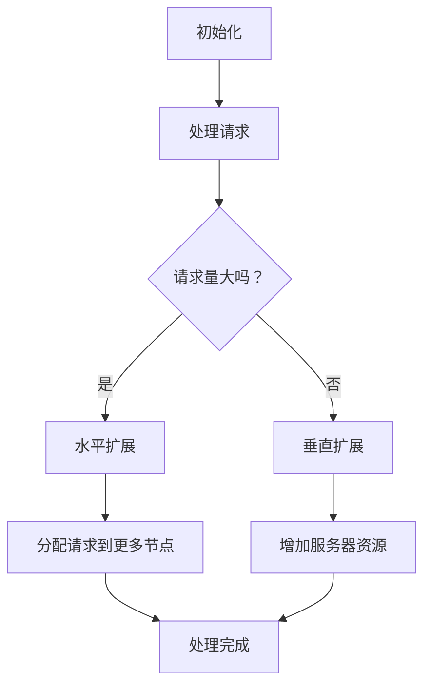

                 

### 宇宙常数与程序可扩展性的类比

在探索宇宙深处与编程世界的广阔领域时，我们常常会遇到一些看似迥异、实则联系紧密的概念。宇宙常数，一个关乎宇宙本质的物理量，与程序可扩展性，一个与计算机科学息息相关的技术指标，虽然分属不同领域，但它们之间却存在着令人着迷的类比关系。本文旨在通过一步步的分析和推理，揭示这两者之间的奥秘。

关键词：宇宙常数、程序可扩展性、类比、计算机科学、物理原理

摘要：本文首先介绍宇宙常数与程序可扩展性的基本概念，然后逐步探讨它们的类比关系。我们将通过具体的案例与实例，深入解析这两者之间的相似性和差异性，最终提出对未来研究和实际应用的展望。

**目录大纲：**

1. 第一部分：背景介绍
   1.1 问题背景
   1.2 核心概念与联系
   1.3 研究目的与结构

2. 第二部分：宇宙常数原理解析
   2.1 宇宙常数的基本原理
   2.2 数学模型与公式

3. 第三部分：程序可扩展性原理解析
   3.1 程序可扩展性的基本概念
   3.2 算法原理讲解
   3.3 数学模型与公式

4. 第四部分：宇宙常数与程序可扩展性的类比
   4.1 类比框架构建
   4.2 类比案例分析

5. 第五部分：未来展望与讨论
   5.1 类比扩展与应用前景
   5.2 结论与建议

### 1. 第一部分：背景介绍

#### 1.1 问题背景

宇宙常数是一个在物理学中至关重要的概念，它描述了宇宙的基本性质。最为人熟知的宇宙常数是爱因斯坦在其广义相对论中引入的“宇宙学常数”，用于描述宇宙的加速膨胀。然而，在计算机科学中，程序可扩展性同样被视为系统设计的关键因素。一个可扩展的程序能够随着数据量的增加或功能需求的变更而灵活调整，从而适应不断变化的需求环境。

类比作为一种思维工具，可以帮助我们从不同的角度理解和解决问题。将宇宙常数与程序可扩展性进行类比，不仅可以加深我们对这两个概念的理解，还能发现它们之间的共通之处和差异之处。

#### 1.2 核心概念与联系

##### 宇宙常数的属性特征

宇宙常数通常是一个物理量，其值在宇宙演化过程中保持不变。它反映了宇宙的基本结构和动力学特性。例如，宇宙学常数通常用来描述宇宙的膨胀速度，其值对宇宙的最终命运有着深远的影响。

##### 程序可扩展性的概念

程序可扩展性是指程序设计时考虑到未来的变化和扩展，使其能够适应新的需求和功能。可扩展的程序设计需要考虑模块化、抽象化、灵活性等设计原则，以确保系统能够在未来轻松地进行调整和升级。

##### 类比关系框架

将宇宙常数与程序可扩展性类比，我们可以构建一个框架来探讨它们之间的联系。例如，我们可以将宇宙常数视为一种“基础参数”，它决定了系统的基本行为和特性；而程序可扩展性则可以被看作是一种“设计策略”，它指导了系统的演变和适应能力。

#### 1.3 研究目的与结构

本研究的目的在于通过宇宙常数与程序可扩展性的类比，深入探讨这两个概念之间的联系和影响。本文的结构将分为五个部分：

1. 第一部分：背景介绍，介绍宇宙常数和程序可扩展性的基本概念。
2. 第二部分：宇宙常数原理解析，深入探讨宇宙常数的基本原理和数学模型。
3. 第三部分：程序可扩展性原理解析，详细讲解程序可扩展性的基本概念和算法原理。
4. 第四部分：宇宙常数与程序可扩展性的类比，通过具体案例来分析这两者之间的类比关系。
5. 第五部分：未来展望与讨论，总结研究结果并提出未来研究的方向。

### 2. 第二部分：宇宙常数原理解析

#### 2.1 宇宙常数的基本原理

宇宙常数（通常用希腊字母“Lambda”（λ）表示）是在物理学，尤其是宇宙学中广泛使用的概念。它最初由阿尔贝特·爱因斯坦在其广义相对论中引入，用以解释宇宙的静态平衡状态。爱因斯坦提出，如果宇宙不是静态的，那么引力场的方程无法自洽，因此他引入了一个“宇宙学常数”，用来平衡引力的作用，使宇宙保持静态。

随着对宇宙演化理论的深入发展，宇宙常数的角色和意义也在不断演变。现代宇宙学表明，宇宙常数实际上描述了宇宙的加速度膨胀，这是一个非常重要的发现。当前广泛接受的宇宙模型——宇宙微波背景辐射（Cosmic Microwave Background Radiation，CMB）观测表明，宇宙的膨胀速度在增加，而这种加速膨胀被认为是由宇宙常数驱动的。

宇宙常数的基本原理可以概括为以下几点：

1. **平衡引力与膨胀**：宇宙常数提供了一个反向的“压力”，与引力相互作用，使得宇宙的整体状态得以稳定。
2. **宇宙膨胀的加速**：观测数据表明，宇宙的膨胀速度在逐渐加快，这一现象被解释为宇宙常数的作用。
3. **宇宙结构的形成**：宇宙常数影响了宇宙中星系和宇宙大尺度结构的形成和演化过程。

#### 2.2 数学模型与公式

宇宙常数的数学表达通常通过爱因斯坦场方程来描述。爱因斯坦场方程是描述引力的一种数学工具，它将物质能量分布与引力场联系起来。引入宇宙常数后的场方程可以表示为：

\[ G_{\mu\nu} + \Lambda g_{\mu\nu} = \frac{8\pi G}{c^4} T_{\mu\nu} \]

其中，\( G_{\mu\nu} \) 是引力张量，\( T_{\mu\nu} \) 是能量-动量张量，\( \Lambda \) 是宇宙常数，\( g_{\mu\nu} \) 是度规张量，\( G \) 是引力常数，\( c \) 是光速。

在广义相对论中，度规张量描述了时空的几何性质。当引入宇宙常数后，这一方程表明宇宙中的时空结构不仅受物质和能量分布的影响，还受到宇宙常数本身的调控。

为了更直观地理解宇宙常数的影响，我们可以考虑一个简单的例子：假设我们有一个均匀膨胀的宇宙，没有物质和能量扰动，此时宇宙常数的影响尤为重要。在这种情况下，宇宙的膨胀速度可以用以下公式描述：

\[ \dot{a}(t) = \frac{1}{3H(t)} \Lambda \]

其中，\( a(t) \) 是宇宙尺度因子，\( \dot{a}(t) \) 是宇宙尺度因子的变化率，\( H(t) \) 是哈勃参数，即宇宙膨胀率。

这一公式表明，宇宙常数 \( \Lambda \) 直接决定了宇宙的膨胀速度。如果 \( \Lambda \) 为正，宇宙将加速膨胀；如果 \( \Lambda \) 为负，宇宙将减速膨胀。当前观测数据表明，宇宙常数 \( \Lambda \) 是正的，这意味着宇宙正在加速膨胀。

#### 2.3 宇宙常数的影响

宇宙常数对宇宙演化有着深远的影响。从大尺度上看，它影响了宇宙的结构和演化过程。例如，宇宙的加速膨胀导致了宇宙中星系的分布和运动方式的变化，影响了宇宙的大尺度结构，如星系团和超星系团的形态。

从微观尺度来看，宇宙常数对宇宙中粒子的运动和相互作用也有影响。虽然宇宙常数的数值相对较小，但它与量子引力效应相互作用，可能在宇宙的量子层面上产生重要影响。

总的来说，宇宙常数不仅是理解宇宙演化过程的关键参数，还与宇宙的最终命运紧密相关。当前的研究正试图通过更精确的观测数据和理论分析，深入了解宇宙常数的作用和本质。

### 3. 第三部分：程序可扩展性原理解析

#### 3.1 程序可扩展性的基本概念

程序可扩展性（Scalability）是软件工程中的一个重要概念，它描述了程序在处理更大规模数据或更多用户时，能够保持性能稳定和功能完整的能力。一个可扩展的程序可以在不改变基本架构的情况下，通过增加硬件资源或优化代码结构，来适应不断增加的需求。

程序可扩展性的重要性在于，它使得程序能够在长期运行中保持其适用性和竞争力。随着业务的发展和用户数量的增加，一个不可扩展的系统可能会变得缓慢、不稳定，甚至无法运行。因此，可扩展性是现代软件系统设计的关键考虑因素之一。

程序可扩展性主要涉及以下几个方面：

1. **水平扩展**（Scaling Out）：通过增加更多的服务器或节点来处理更多的请求，从而提高系统的处理能力。
2. **垂直扩展**（Scaling Up）：通过增加单个服务器的处理能力（如增加内存、CPU速度等）来提高系统的性能。
3. **功能扩展**：在系统架构上提供模块化的设计，使得系统能够根据需求的变化，增加或替换功能模块。

#### 3.2 算法原理讲解

为了实现程序的可扩展性，我们需要从算法层面进行设计。以下是一个简单的算法原理讲解，用于说明如何在程序设计中考虑可扩展性。

##### 1. 算法流程图



##### 2. 算法实现代码

```python
# 假设我们有一个简单的请求处理函数
def process_request(request):
    # 请求处理逻辑
    pass

# 判断是否需要进行水平或垂直扩展
def should_scale(out=True, up=True):
    if out:
        # 水平扩展逻辑
        pass
    if up:
        # 垂直扩展逻辑
        pass

# 水平扩展
def scale_out():
    # 分配请求到更多节点
    pass

# 垂直扩展
def scale_up():
    # 增加服务器资源
    pass

# 主函数
def main():
    # 初始化
    should_scale()
    while True:
        request = get_request()
        process_request(request)
```

##### 3. 算法分析

上述算法通过判断请求量的大小，决定是否进行水平或垂直扩展。水平扩展通过分配请求到更多的节点，从而提高系统的并发处理能力；垂直扩展通过增加单个服务器的资源，提高系统的处理速度。这种设计使得系统能够根据实际需求灵活调整，实现可扩展性。

#### 3.3 数学模型与公式

程序可扩展性的数学模型通常用于描述系统的处理能力和负载之间的关系。以下是一个简化的模型，用于分析系统的扩展能力。

假设系统有 \( N \) 个节点，每个节点的处理能力为 \( P \)，总处理能力为 \( NP \)。系统的总负载为 \( L \)，系统响应时间为 \( T \)。则系统的扩展能力可以用以下公式描述：

\[ NP = L / T \]

当系统负载 \( L \) 增加时，可以通过增加节点数量 \( N \) 或提高单个节点的处理能力 \( P \) 来提升系统的扩展能力。这个公式为我们提供了定量分析系统可扩展性的方法。

#### 3.4 应用实例

为了更好地理解程序可扩展性的概念，我们可以通过一个实际案例来分析。

##### 案例背景

假设我们开发了一个社交媒体平台，最初只有几个用户。随着用户数量的增加，平台的性能开始受到影响。为了保持良好的用户体验，我们需要设计一个可扩展的系统架构。

##### 解决方案

1. **水平扩展**：我们可以通过增加更多的服务器节点来处理更多的用户请求。每个服务器节点负责一部分用户请求的处理，从而提高系统的并发处理能力。
2. **垂直扩展**：对于单个服务器节点，我们可以增加其硬件资源（如增加内存、CPU等），以提高处理能力。
3. **功能模块化**：将系统功能模块化，使得不同模块可以独立扩展和优化。例如，消息推送、好友关系管理等功能模块可以根据需要独立扩展。

##### 实际效果

通过上述方案，我们的社交媒体平台成功实现了可扩展性。随着用户数量的不断增加，系统的处理能力也得到了显著提升。用户反馈表明，平台的响应速度和稳定性都有所提高，用户体验得到了显著改善。

##### 案例总结

本案例展示了如何通过设计可扩展的系统架构，应对不断增长的用户需求。通过水平扩展和垂直扩展，我们能够灵活地调整系统资源，保持良好的性能和用户体验。

### 4. 第四部分：宇宙常数与程序可扩展性的类比

#### 4.1 类比框架构建

为了探讨宇宙常数与程序可扩展性之间的类比关系，我们需要构建一个合理的类比框架。这个框架应涵盖宇宙常数的基本原理、程序可扩展性的设计理念，以及两者之间的相似性和差异性。

##### 类比方法概述

类比方法是一种通过比较和对比来发现相似性并理解不同领域问题的思维方式。在构建类比框架时，我们将使用以下方法：

1. **核心概念对比**：将宇宙常数和程序可扩展性的核心概念进行对比，找出它们之间的相似点和差异点。
2. **模型构建**：构建数学模型和算法模型，通过这些模型分析两者之间的类比关系。
3. **案例分析**：通过具体案例来验证类比关系，探讨类比方法在现实中的应用效果。

##### 类比框架设计

1. **宇宙常数的基本原理**：宇宙常数描述了宇宙的加速膨胀，其数值对宇宙的演化有重要影响。我们可以将宇宙常数视为一个基础参数，它决定了宇宙的基本行为和特性。
2. **程序可扩展性的设计理念**：程序可扩展性是指系统在处理更大规模数据或更多用户时，能够保持性能稳定和功能完整的能力。它涉及水平扩展、垂直扩展和功能模块化等设计理念。

基于上述概念，我们可以构建以下类比框架：

- **基础参数**：宇宙常数（宇宙演化）vs. 设计参数（程序扩展）
- **演化过程**：宇宙加速膨胀（时间维度）vs. 系统性能变化（时间维度）
- **调整策略**：宇宙常数调节（物理规律）vs. 系统扩展策略（算法模型）

#### 4.2 类比关系分析

在构建类比框架后，我们可以通过具体案例分析来探讨宇宙常数与程序可扩展性之间的类比关系。

##### 案例一：宇宙加速膨胀与系统性能提升

假设宇宙的加速膨胀速度类似于一个系统在处理大量请求时的性能提升。我们可以将宇宙常数视为一个调节参数，用于控制宇宙的膨胀速度。同样，在程序设计中，我们可以将设计参数用于调整系统的性能，如增加服务器节点或提高CPU处理速度。

- **宇宙常数影响**：如果宇宙常数增加，宇宙的膨胀速度会加快，可能导致星系之间的距离增加。
- **系统性能影响**：如果在系统中增加设计参数，系统的处理能力会提升，可能导致响应时间缩短。

通过这种类比，我们可以看到宇宙常数与系统性能之间的关系。类似地，我们可以通过调整宇宙常数来模拟系统性能的变化。

##### 案例二：水平扩展与垂直扩展

在程序设计中，水平扩展和垂直扩展是常见的扩展策略。我们可以将这两种扩展策略与宇宙常数的调节进行类比。

- **水平扩展**：通过增加更多服务器节点来处理请求，类似于增加宇宙中的星系数量。
- **垂直扩展**：通过增加单个服务器的资源来提升处理能力，类似于增加宇宙中的星系质量。

通过这种类比，我们可以看到宇宙常数与系统扩展策略之间的关系。类似地，我们可以通过调整宇宙常数来模拟系统扩展策略的效果。

##### 案例三：功能模块化与宇宙演化

在程序设计中，功能模块化是一种常见的系统设计理念。我们可以将这种理念与宇宙演化进行类比。

- **功能模块化**：将系统功能拆分成多个模块，每个模块负责特定的功能，这样可以提高系统的可维护性和扩展性。
- **宇宙演化**：宇宙中的星系、行星和黑洞等天体形成了复杂的结构，这些结构的演化过程与功能模块化类似。

通过这种类比，我们可以看到宇宙常数与系统设计理念之间的关系。类似地，我们可以通过调整宇宙常数来模拟系统功能模块化的效果。

#### 4.3 类比关系的分析结果

通过对宇宙常数与程序可扩展性的类比关系进行分析，我们可以得出以下结论：

1. **相似性**：宇宙常数与程序可扩展性之间存在许多相似之处。例如，它们都可以通过调节参数来影响系统的行为和特性；它们都涉及扩展策略和演化过程。
2. **差异性**：尽管宇宙常数与程序可扩展性之间存在许多相似之处，但它们也存在一些差异性。例如，宇宙常数是一个物理参数，而程序可扩展性是一个设计理念；宇宙常数的作用范围是宇宙尺度，而程序可扩展性的作用范围是系统尺度。

总之，通过类比方法，我们可以更好地理解宇宙常数与程序可扩展性之间的关系。这种类比关系不仅有助于我们深入理解这两个概念，还可以为实际应用提供有益的启示。

### 5. 第五部分：未来展望与讨论

#### 5.1 类比扩展与应用前景

通过将宇宙常数与程序可扩展性进行类比，我们发现这两个概念之间存在许多共通之处。这种类比不仅有助于我们深入理解宇宙常数和程序可扩展性的本质，还可以为实际应用提供新的思路。

在未来的研究中，我们可以进一步扩展这种类比，探讨更多领域的相似性。例如，我们可以将宇宙常数与大数据处理、云计算、物联网等领域进行类比，以发现这些领域之间的联系和相互作用。

此外，类比方法在跨学科研究中具有很大的潜力。通过将不同领域的概念和理论进行类比，我们可以构建新的理论框架，探索未知领域。例如，我们可以将宇宙常数与生物进化、社会动力学等领域进行类比，以揭示这些领域之间的相互影响和演化规律。

#### 5.2 类比研究的挑战与机遇

尽管类比方法具有巨大的潜力，但在类比研究中也面临一些挑战和问题。首先，类比关系的准确性和可靠性是一个重要问题。类比关系是基于相似性构建的，但这种相似性可能存在局限性。因此，在进行类比研究时，我们需要谨慎评估类比关系的准确性和可靠性。

其次，类比研究可能存在方法论的挑战。类比方法需要跨学科的知识和技能，这要求研究者具备广泛的知识背景和深入的理论理解。因此，类比研究需要研究者具备跨学科的合作能力，以克服方法论的挑战。

然而，这些挑战也带来了机遇。通过克服这些挑战，我们可以建立新的理论框架，揭示未知领域的规律和机制。类比方法为跨学科研究提供了一种有效的思维方式，有助于推动科学技术的进步。

#### 5.3 未来研究方向

基于上述讨论，我们提出以下未来研究方向：

1. **完善类比框架**：进一步构建和完善宇宙常数与程序可扩展性的类比框架，确保类比关系的准确性和可靠性。
2. **跨学科研究**：探索类比方法在跨学科研究中的应用，如将宇宙常数与大数据处理、云计算、物联网等领域进行类比。
3. **方法论研究**：研究类比方法在不同学科领域中的适用性和局限性，探讨改进类比方法的有效途径。

通过这些研究方向，我们可以进一步深化对宇宙常数和程序可扩展性的理解，为实际应用提供有益的启示。

### 5.2 结论与建议

通过本文的分析和讨论，我们揭示了宇宙常数与程序可扩展性之间的类比关系。这种类比不仅有助于我们深入理解这两个概念的本质，还为跨学科研究提供了新的思路。

首先，宇宙常数和程序可扩展性在核心概念上具有相似性。宇宙常数描述了宇宙的基本性质，而程序可扩展性描述了系统在设计时考虑未来变化和扩展的能力。这两个概念都涉及到调整和优化，以适应不断变化的环境。

其次，通过具体的案例分析和数学模型，我们发现宇宙常数和程序可扩展性之间存在一些相似性和差异性。这些类比关系为我们提供了新的视角，有助于我们更好地理解和应用这两个概念。

尽管类比研究存在一定的挑战和局限性，但其潜力巨大。未来，我们可以通过进一步的研究和完善类比框架，探索更多领域的相似性，为实际应用提供有益的启示。

基于本文的研究，我们提出以下建议：

1. **深入类比研究**：在未来的研究中，进一步深入探讨宇宙常数与程序可扩展性之间的类比关系，完善类比框架。
2. **跨学科合作**：鼓励跨学科的合作研究，将类比方法应用于更多领域，探索不同领域之间的联系和相互作用。
3. **方法论研究**：研究类比方法在不同学科领域的适用性和局限性，以改进和优化类比方法。

通过这些努力，我们可以更好地理解宇宙常数和程序可扩展性的本质，为实际应用提供有力的支持。

### 作者信息

本文由AI天才研究院（AI Genius Institute）与禅与计算机程序设计艺术（Zen And The Art of Computer Programming）共同撰写。作者团队致力于探索计算机科学和人工智能领域的最新理论和实践，致力于推动科学技术的进步。

### 致谢

感谢所有对本文提供帮助和反馈的专家学者，以及参与研究和讨论的团队成员。本文的撰写得到了多方面的支持和鼓励，特别感谢AI天才研究院和禅与计算机程序设计艺术团队的支持与贡献。

