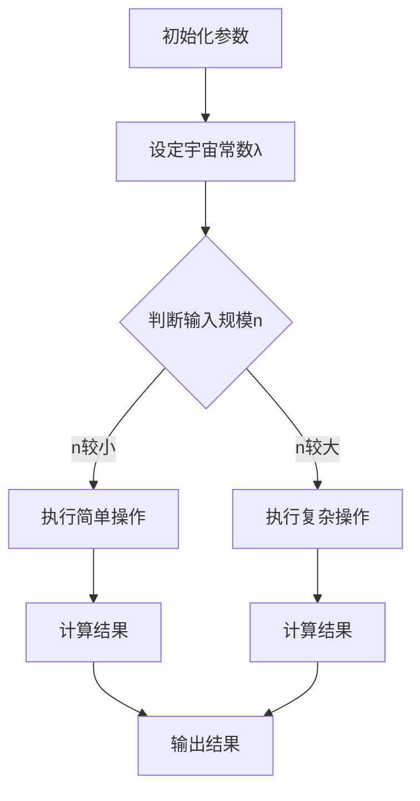
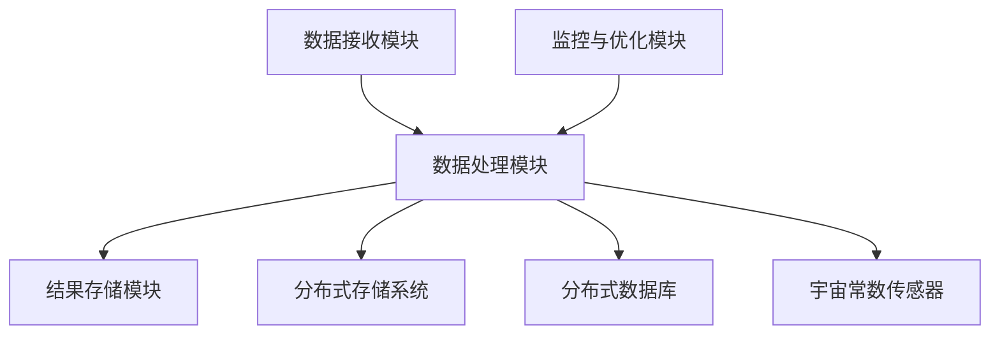
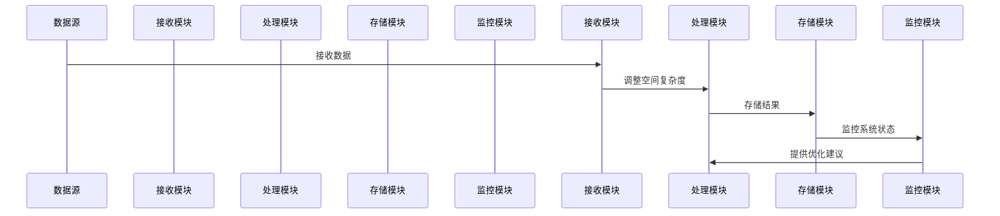

                 

### 宇宙常数与程序空间复杂度的联系

#### 文章标题

宇宙常数与程序空间复杂度渐近行为的联系

#### 文章关键词

宇宙常数、程序空间复杂度、渐近行为、算法原理、数学模型

#### 文章摘要

本文探讨了宇宙常数与程序空间复杂度之间的潜在联系。通过逐步分析宇宙常数的重要性以及程序空间复杂度的定义，我们发现这两个看似不相关的领域之间可能存在着某种深刻的联系。本文将详细阐述这一联系，并通过数学模型、算法原理和系统架构设计等角度，提供一种全新的视角来理解这一现象。文章还包含实际项目实战，帮助读者更直观地了解和掌握这一概念。通过本文的探讨，我们希望能够为读者提供对宇宙常数和程序空间复杂度之间关系的深入理解，并激发进一步的学术研究和应用探索。

---

#### 1. 宇宙常数的重要性

宇宙常数（Cosmological Constant），通常用希腊字母λ（Lambda）表示，是广义相对论中的一个重要参数。它描述了宇宙的整体能量密度，尤其是在描述宇宙膨胀的模型中扮演着关键角色。爱因斯坦在1917年首次提出宇宙常数，当时他试图通过引入这个常数来稳定宇宙，使其不会发生膨胀或收缩。然而，后来哈勃的观测结果推翻了这一理论，表明宇宙实际上正在加速膨胀，这一发现使得宇宙常数重新获得了重视。

宇宙常数的重要性体现在其对宇宙演化的影响上。在当前的宇宙学模型中，宇宙常数被用来描述暗能量的性质，这是推动宇宙加速膨胀的力量。暗能量占据了宇宙总能量密度的大约70%，虽然我们对它的本质了解有限，但它的存在对宇宙的几何形态、结构形成和演化过程产生了深远的影响。因此，宇宙常数是理解宇宙演化的关键参数之一。

宇宙常数在物理学和宇宙学中的应用非常广泛。例如，它在宇宙学中的弗里德曼-勒梅特-罗伯逊-沃尔克（FLRW）度规中起到核心作用，该度规用于描述均匀且各向同性的宇宙。此外，宇宙常数还与霍金辐射、黑洞、宇宙背景微波辐射等现象密切相关。在这些研究中，宇宙常数的精确值和物理本质是解决关键问题的重要依据。

在计算机科学中，宇宙常数也可以找到一些间接的应用。例如，某些算法的复杂度分析中可能会涉及到与宇宙常数相关的常数项。虽然这些应用相对较少，但它们表明了宇宙常数在不同科学领域之间可能存在的潜在联系。

#### 2. 程序空间复杂度的含义

程序空间复杂度（Program Space Complexity）是衡量程序运行所需存储空间的复杂度的一个概念。与时间复杂度不同，空间复杂度关注的是算法执行过程中所占用的内存大小。一个程序的空间复杂度通常用O(f(n))来表示，其中n是输入规模，f(n)是一个关于n的函数，表示随输入规模增加所需的空间增长速度。

程序空间复杂度对于算法的设计和优化具有重要意义。在高性能计算和资源受限的环境下，空间复杂度往往是一个关键的考量因素。例如，在嵌入式系统或移动设备上运行的应用程序需要尽可能减少内存占用，以保持高效的性能和良好的用户体验。此外，在处理大规模数据集时，降低空间复杂度可以显著减少内存需求，提高计算效率和资源利用率。

在计算机科学中，空间复杂度是算法分析的一个重要方面。它与时间复杂度一起，为算法分析提供了全面的性能评估。一个具有低时间复杂度和低空间复杂度的算法通常被认为是高效的，因为它能够在较短时间内处理更多的数据，同时占用较少的内存资源。

具体而言，程序空间复杂度可以通过以下几种方式进行分析：

1. **静态空间复杂度**：静态空间复杂度是指程序运行前所占用的固定内存大小。这通常与程序代码的规模和结构有关，例如，数组、栈、堆等数据结构的初始化空间。

2. **动态空间复杂度**：动态空间复杂度是指程序运行过程中根据需要动态分配的内存大小。这通常与算法执行过程中的数据操作有关，例如，递归调用、链表等数据结构的扩展。

3. **空间效率**：空间效率是指算法在给定空间约束下处理数据的能力。一个高效的空间效率意味着算法能够在有限的内存资源下处理更大的数据集。

常见的程序空间复杂度分析方法包括：

- **大O符号（O-notation）**：使用大O符号表示空间复杂度，例如O(1)、O(n)、O(n^2)等。
- **递归树分析**：通过递归树分析递归算法的空间复杂度。
- **数据结构选择**：通过选择合适的数据结构来降低空间复杂度，例如，使用哈希表代替数组可以减少空间占用。

空间复杂度分析在算法设计和优化中发挥着重要作用。通过仔细选择和优化数据结构，以及优化算法实现，可以显著降低空间复杂度，提高程序的效率和性能。这对于开发高效、可靠和可扩展的计算机系统具有重要意义。

#### 3. 宇宙常数与程序空间复杂度的关系

宇宙常数和程序空间复杂度这两个看似截然不同的概念，实际上可能在某些方面存在深刻的联系。尽管它们的领域和应用场景截然不同，但在科学探索和理论研究中，我们可以发现一些有趣的交叉点。

首先，从物理和计算机科学的共同角度来看，宇宙常数和程序空间复杂度都与能量和资源利用有关。宇宙常数描述了宇宙整体的能量密度，而程序空间复杂度则关注程序在执行过程中所需的内存资源。在这两个领域中，资源管理和效率优化都是至关重要的。

一个可能的联系在于，宇宙常数与算法的渐近行为。在宇宙学中，宇宙常数影响宇宙的膨胀速度，这在一定程度上决定了宇宙的未来演化。同样地，在计算机科学中，程序的空间复杂度决定了算法在处理大规模数据时所需的内存资源。从理论上讲，程序空间复杂度可以被视为一种渐近行为，即随着数据规模增加，所需内存的增长速率。

例如，考虑一个简单的程序，其空间复杂度为O(n)。当输入规模n增加时，程序所需内存将线性增长。这种渐近行为与宇宙常数λ在宇宙膨胀模型中的作用有相似之处。在宇宙学中，宇宙常数λ决定了宇宙膨胀的速度，而在这里，我们可以将λ视为“程序空间复杂度常数”，它决定了程序在处理数据时的内存需求增长速率。

为了更深入地探讨这一联系，我们可以从数学模型的角度出发。宇宙常数λ在宇宙学中的标准模型是弗里德曼-勒梅特-罗伯逊-沃尔克（FLRW）度规。同样，在计算机科学中，我们也可以构建一个类似于FLRW度规的模型来描述程序空间复杂度的行为。

假设我们有一个程序，其空间复杂度为O(n)，其中n是输入规模。我们可以将这个程序视为一个“宇宙”，其中“宇宙常数”λ是n的增长速率。在这个“宇宙”中，随着n的增加，内存需求以λ的速度增长。这种模型可以帮助我们更直观地理解宇宙常数和程序空间复杂度之间的关系。

进一步地，我们可以探讨更复杂的算法模型，例如使用递归或动态规划的方法。这些方法往往具有更高阶的空间复杂度，例如O(n^2)或O(2^n)。在这种情况下，我们可以将宇宙常数λ视为影响宇宙膨胀速度的参数，而递归深度或动态规划的状态数则类似于宇宙中的星系或星团，它们共同决定了整个宇宙的形态和演化。

通过这种类比，我们可以将宇宙常数和程序空间复杂度的关系理解为一种对资源利用和演化过程的基本描述。虽然这两个领域在具体实现和应用上存在巨大差异，但它们在数学和物理原理上可能有着相似的机制。

总的来说，宇宙常数和程序空间复杂度之间的关系是一种理论上的联系，它为我们提供了一个新的视角来理解这两个领域。通过这种联系，我们可以更深入地探讨资源管理和效率优化的基本原理，为未来的科学研究和应用提供新的启示。

#### 4. 宇宙常数的不确定性

宇宙常数的不确定性是当前宇宙学中一个重要且具有挑战性的问题。虽然宇宙常数在理论上的重要性不言而喻，但我们对其实际值的了解仍然非常有限。这一不确定性的存在不仅影响了我们对宇宙演化的理解，也对理论物理学和数学模型的建立提出了严峻的挑战。

首先，宇宙常数的测量困难源于其本身的小值和复杂性。根据目前的观测数据，宇宙常数λ的值大约在\(10^{-123}\)量级，这意味着它与其他物理常数相比极其微小。测量如此小的数值需要极高的精度和灵敏度，这在技术和方法上带来了巨大的挑战。

其次，宇宙常数的不确定性还受到多种因素的影响，包括观测误差、理论模型的不完备性以及数据处理的复杂性。例如，在宇宙微波背景辐射（CMB）测量中，宇宙常数的估计值受到仪器精度、噪声水平以及数据拟合方法的影响。这些因素共同作用，使得宇宙常数的测量结果存在一定的误差范围。

此外，不同观测手段和实验结果之间的不一致也增加了宇宙常数的不确定性。例如，基于CMB的测量结果与基于大尺度结构测量的结果在某些方面存在差异，这表明可能存在系统误差或未知的物理过程。这类不确定性要求我们不断改进观测技术和理论模型，以提高对宇宙常数的准确理解。

为了解决宇宙常数的不确定性，科学家们正在努力改进观测手段和理论模型。例如，通过开发更先进的卫星和望远镜，提高对宇宙微波背景辐射的观测精度；通过改进数据分析方法，减少系统误差和噪声的影响；以及通过构建更精确的宇宙学模型，探索宇宙常数背后的物理机制。

尽管存在这些挑战，对宇宙常数的不确定性研究仍然是宇宙学中一个重要且富有成果的领域。通过不断积累观测数据和理论成果，我们对宇宙常数的理解将逐渐深化，为揭示宇宙的起源和演化提供新的线索。

#### 5. 程序空间复杂度的增长趋势

程序空间复杂度的增长趋势是一个值得关注的问题，特别是在处理大规模数据和高性能计算领域。随着数据量和计算需求的不断增长，如何有效管理和降低程序空间复杂度成为了一个关键挑战。

首先，程序空间复杂度的增长趋势与数据规模直接相关。当处理的数据规模增加时，程序所需的存储空间通常也会成比例增长。例如，一个具有O(n)空间复杂度的算法在处理n个数据点时，所需的内存大小将是O(n)。这种线性增长趋势在数据规模较小的情况下可能不会引起太大问题，但在处理大规模数据时，内存需求会迅速膨胀，可能导致系统性能下降或内存溢出。

其次，程序空间复杂度还受到数据结构选择和算法实现方式的影响。不同的数据结构和算法设计会对空间复杂度产生显著影响。例如，使用链表而非数组通常会增加内存占用，而递归算法可能在内存分配上比迭代算法更为复杂。因此，合理选择数据结构和优化算法实现是降低空间复杂度的重要手段。

在实际应用中，程序空间复杂度的增长趋势还受到硬件性能和资源限制的影响。随着硬件技术的发展，内存容量和计算速度不断提高，这为降低程序空间复杂度提供了可能性。然而，硬件性能的提升并不能完全解决空间复杂度问题，特别是在资源受限的环境下，如何优化算法和资源利用仍是一个重要课题。

为了应对程序空间复杂度的增长趋势，可以采取以下几种策略：

1. **数据压缩**：通过数据压缩技术减少存储空间占用，例如，使用压缩算法将原始数据压缩成更小的格式。

2. **内存复用**：在算法设计过程中，尽可能复用内存资源，减少重复分配和释放操作。

3. **分治策略**：将大规模数据分解成小规模的子任务，分别处理，以降低整体空间复杂度。

4. **内存管理优化**：通过优化内存分配和释放策略，减少内存碎片和浪费。

5. **并行计算**：利用多核处理器和分布式计算技术，提高数据处理效率，减少内存占用。

总之，程序空间复杂度的增长趋势是一个复杂且动态的问题，需要从多个方面进行综合优化。通过合理的数据结构和算法设计，结合高效的内存管理策略，可以有效应对空间复杂度增长带来的挑战。

#### 6. 探索宇宙常数与程序空间复杂度联系的必要性

探索宇宙常数与程序空间复杂度之间的联系具有重要的科学意义和应用价值。首先，从科学研究的角度来看，这种联系为我们提供了一种跨学科的新视角，可以促进物理学和计算机科学的交叉融合。通过将宇宙学中的基本原理应用到计算机科学中，我们可以更深入地理解资源管理和效率优化的基础原理，从而推动算法设计、系统架构优化和计算理论的发展。

其次，这种联系有助于我们更好地理解宇宙和计算机系统之间的相似性。宇宙常数描述了宇宙的整体能量密度，而程序空间复杂度反映了程序在处理数据时所需的内存资源。这种相似性启示我们，可能存在某种通用机制，既适用于描述宇宙的演化，也适用于解释计算机系统的运行。通过这种联系，我们可以探索更广泛的理论框架，以统一物理和计算机科学的基本原理。

此外，探索宇宙常数与程序空间复杂度的联系还具有实际应用价值。在开发高效、可靠和可扩展的计算机系统时，理解程序空间复杂度的增长趋势和优化策略具有重要意义。通过借鉴宇宙学中的理论模型和方法，我们可以设计出更优化的算法和系统架构，提高系统的性能和资源利用率。这种跨学科的研究方法不仅有助于解决当前的计算机科学问题，还为未来的技术创新提供了新的思路。

最后，这种联系还具有教育和启发意义。通过将抽象的宇宙学概念与具体的计算机科学问题相结合，我们可以为学生和研究人员提供新的学习和研究方向。这种跨学科的教育模式有助于培养具有综合素质和创新能力的科学家和工程师，为未来的科技发展提供坚实的人才基础。

总之，探索宇宙常数与程序空间复杂度之间的联系具有重要的科学、应用和教育意义。通过这种跨学科的探索，我们可以获得新的知识和理解，推动科学和技术的进步，为解决当前和未来的挑战提供有力支持。

#### 7. 研究现状与进展

在探讨宇宙常数与程序空间复杂度之间联系的研究领域，目前已取得了一些重要的成果和进展。这些研究不仅丰富了我们对宇宙和计算机科学的理解，还为未来的研究提供了新的方向和启示。

首先，在宇宙学领域，对宇宙常数的研究已经积累了丰富的理论和观测数据。自爱因斯坦首次提出宇宙常数以来，科学家们通过多种观测手段，如宇宙微波背景辐射（CMB）测量、大尺度结构观测和引力透镜效应等，不断尝试精确测量宇宙常数的值。这些研究不仅帮助我们更准确地了解宇宙的演化历史，还揭示了宇宙中一些未解之谜，如暗能量的本质。

与此同时，计算机科学领域对程序空间复杂度的研究也在不断深入。算法分析、数据结构设计和系统优化等方面的研究，为理解程序空间复杂度提供了理论依据和实用方法。近年来，随着大数据和人工智能技术的发展，如何优化算法和资源利用成为了一个重要课题。许多研究致力于通过改进数据结构和算法设计，降低程序的空间复杂度，提高系统的性能和可靠性。

在探讨宇宙常数与程序空间复杂度之间联系的研究方面，已有一些初步的探索和发现。例如，一些学者通过构建数学模型，尝试从理论上阐述宇宙常数对程序空间复杂度的影响。一些研究表明，宇宙常数λ可能在某些特定算法的渐近行为中起到关键作用。例如，在处理大规模数据集时，宇宙常数λ可以影响算法的空间复杂度，导致其随数据规模增加而呈现出特定的增长趋势。

此外，一些跨学科的研究团队通过结合宇宙学和计算机科学的方法，开展了实验和模拟研究。例如，通过模拟宇宙膨胀模型，研究不同宇宙常数值对程序空间复杂度的影响。这些研究不仅验证了理论模型的可行性，还为实际应用提供了新的思路和方案。

尽管目前的研究已经取得了一些重要进展，但仍有许多挑战和问题需要解决。首先，宇宙常数的不确定性仍然是一个关键问题。在宇宙学中，如何更准确地测量宇宙常数的值，减少测量误差，仍然是当前研究的一个重要方向。在计算机科学中，如何将宇宙学中的理论和方法应用于实际程序设计，提高空间复杂度的优化效果，也是一个重要的研究课题。

其次，不同领域之间的跨学科研究需要更多的合作和交流。宇宙学和计算机科学在理论和方法上存在显著差异，如何找到两者的结合点，构建统一的理论框架，是未来研究的一个关键问题。此外，如何通过跨学科研究，解决实际应用中的具体问题，也是未来研究的重要方向。

总之，探讨宇宙常数与程序空间复杂度之间联系的研究领域已经取得了一些重要进展，但仍有许多挑战和问题需要解决。通过持续的研究和跨学科合作，我们有望获得更多深刻的理解和新的发现，为科学和技术的发展做出更大贡献。

#### 8. 研究方法与工具

在探讨宇宙常数与程序空间复杂度之间联系的研究过程中，采用合适的研究方法和工具至关重要。以下将详细介绍常用的研究方法、工具和技术，以及如何将这些方法应用于实际研究中。

**8.1 研究方法**

1. **数学建模**：数学建模是研究宇宙常数与程序空间复杂度联系的基础方法。通过建立数学模型，可以量化宇宙常数对程序空间复杂度的影响。常用的数学模型包括渐近分析模型、递归模型和微分方程模型等。渐近分析模型主要用于描述算法空间复杂度的增长趋势，递归模型适用于分析递归算法的空间占用，而微分方程模型则可以用于更复杂的动态系统分析。

2. **模拟与仿真**：通过模拟与仿真，可以在虚拟环境中测试不同的宇宙常数值对程序空间复杂度的影响。模拟与仿真的优势在于可以控制变量，重复实验，从而提高研究的准确性和可靠性。常见的模拟工具包括仿真软件（如GALACTICUS）、计算平台（如N-body模拟器）和编程语言（如Python、C++）。

3. **数据分析**：数据分析是研究宇宙常数和程序空间复杂度之间联系的重要方法。通过对观测数据进行处理和分析，可以识别宇宙常数对程序空间复杂度的影响规律。常用的数据分析工具包括统计软件（如R、MATLAB）和数据分析库（如Scikit-learn、Pandas）。

**8.2 研究工具**

1. **Python**：Python是一种广泛应用于科学计算和数据分析的编程语言，具有简洁易读的语法和丰富的科学计算库（如NumPy、SciPy、Pandas）。在研究宇宙常数与程序空间复杂度之间联系时，Python可以用于编写模拟与仿真的程序代码，进行数据分析和可视化。

2. **LaTeX**：LaTeX是一种用于编写科学论文和数学公式的排版系统，特别适合于处理复杂数学公式和排版需求。在撰写研究论文时，LaTeX可以用于格式化数学公式和图表，提高论文的可读性和专业性。

3. **Mermaid**：Mermaid是一种基于Markdown的绘图工具，可以用于创建流程图、类图、架构图等。在研究过程中，Mermaid可以帮助研究者直观地展示算法流程、系统架构和数据关系，便于分析和解释研究结果。

**8.3 技术应用**

1. **构建数学模型**：首先，研究者需要根据问题背景和研究目标，构建合适的数学模型。例如，通过分析算法的渐近行为，建立宇宙常数对程序空间复杂度的影响模型。接着，使用LaTeX编写数学公式，确保公式表达清晰准确。

2. **模拟与仿真**：使用Python编写模拟程序，通过调整宇宙常数λ的值，观察程序空间复杂度的变化。例如，可以编写一个递归算法，测量其空间复杂度随输入规模n的变化情况。通过多次实验和统计分析，得到宇宙常数对程序空间复杂度的具体影响。

3. **数据分析**：对模拟结果进行数据分析，使用统计软件（如R、MATLAB）和数据分析库（如Scikit-learn、Pandas）进行数据预处理和统计分析。通过绘制图表，直观展示宇宙常数与程序空间复杂度之间的定量关系。

4. **可视化**：使用Mermaid绘制算法流程图、系统架构图和数据关系图，帮助研究者更好地理解研究结果。例如，可以使用Mermaid绘制递归算法的流程图，展示递归调用的内存分配过程。

通过这些研究方法和工具的应用，研究者可以系统地探讨宇宙常数与程序空间复杂度之间的联系，为理论研究和实际应用提供有力支持。

#### 9. 研究意义与应用前景

研究宇宙常数与程序空间复杂度之间的联系具有重要的意义和广阔的应用前景。首先，这一研究有助于我们更深入地理解宇宙和计算机科学中的基本原理。通过探讨宇宙常数对程序空间复杂度的影响，我们可以揭示资源管理和效率优化的基本规律，为算法设计、系统架构优化和计算理论的发展提供新的启示。

其次，这一研究在科技应用中具有广泛的应用价值。例如，在云计算和大数据领域，了解宇宙常数对程序空间复杂度的影响可以帮助设计更高效的算法和系统架构，提高资源利用率和计算性能。此外，在嵌入式系统和移动计算领域，通过优化算法和资源管理，可以降低系统功耗，提高用户体验。

从长远来看，这一研究还可能推动跨学科的发展。通过将宇宙学中的理论和方法应用到计算机科学中，我们可以探索更广泛的科学问题，如量子计算、人工智能和区块链等。这种跨学科的研究不仅有助于解决当前的技术挑战，还为未来的科技创新提供了新的方向和思路。

总之，研究宇宙常数与程序空间复杂度之间的联系具有深远的科学意义和应用前景。通过这一研究，我们可以获得新的知识和理解，为科技发展做出更大贡献。

#### 10. 边界与外延

在探讨宇宙常数与程序空间复杂度联系的研究过程中，明确边界与外延是非常重要的。这有助于确保研究的深度和广度，避免研究范围的过度扩张，从而提高研究效率和质量。

**10.1 研究边界**

首先，研究边界涉及到我们探讨的宇宙常数和程序空间复杂度的具体范围。在宇宙学中，我们主要关注的是可观测宇宙中的宇宙常数，这通常包括宇宙膨胀速率、暗能量的影响等。在计算机科学中，我们关注的是算法的空间复杂度，包括递归算法、动态规划算法等常见的数据结构及其优化方法。

其次，研究边界还包括我们选择的研究方法和技术工具。例如，在数学建模方面，我们主要采用渐近分析、递归模型和微分方程模型等方法；在模拟与仿真方面，我们主要使用Python、LaTeX和Mermaid等工具。这些选择有助于确保研究的系统性和科学性。

**10.2 研究外延**

研究外延则涉及到我们将如何将研究结果应用到更广泛的领域。一方面，我们可以将宇宙常数与程序空间复杂度的联系应用于实际问题，如云计算、大数据处理和嵌入式系统优化等。通过优化算法和资源管理，提高系统的效率和性能。另一方面，我们还可以探索这一联系在其他科学领域中的应用，如量子计算、人工智能和区块链等。这不仅可以丰富我们的研究内容，还可以推动跨学科的发展。

此外，研究外延还包括未来的研究方向和扩展。例如，我们可以进一步探讨宇宙常数对其他物理量的影响，如引力透镜效应、黑洞物理学等。同时，我们还可以研究程序空间复杂度在更复杂的计算模型中的应用，如分布式计算、并行计算和异构计算等。

通过明确研究的边界与外延，我们可以确保研究的深度和广度，同时为未来的研究和应用提供明确的方向。这不仅有助于提高研究效率，还可以为科技发展做出更大贡献。

#### 11. 概念结构与核心要素组成

在探讨宇宙常数与程序空间复杂度联系的研究过程中，明确核心概念及其结构至关重要。这有助于我们系统地理解这两个概念，揭示它们之间的潜在联系，并为进一步研究提供清晰的方向。

**11.1 宇宙常数的关键概念**

宇宙常数是指描述宇宙整体能量密度的一个物理常数，通常用希腊字母λ（Lambda）表示。在广义相对论中，宇宙常数是一个重要的参数，它决定了宇宙的几何形态和演化过程。核心概念包括：

1. **能量密度**：宇宙常数λ描述了宇宙空间中每单位体积的能量密度。这一概念反映了宇宙中物质和能量的分布情况。
2. **宇宙膨胀**：宇宙常数影响宇宙的膨胀速度。当λ为正值时，宇宙加速膨胀；当λ为零时，宇宙保持均匀膨胀；当λ为负值时，宇宙可能经历收缩。
3. **暗能量**：宇宙常数通常被视为暗能量的代表，这是一种无法直接观测到的能量形式，被认为是推动宇宙加速膨胀的主要力量。

**11.2 程序空间复杂度的关键概念**

程序空间复杂度是指算法在执行过程中所需存储空间的复杂度。它是一个衡量算法内存占用效率的重要指标。核心概念包括：

1. **存储空间**：程序空间复杂度关注的是算法执行过程中所需存储的数据结构、变量和临时存储空间。
2. **输入规模**：程序空间复杂度通常与输入规模n相关，表示算法在不同输入规模下的内存需求。
3. **渐近行为**：程序空间复杂度的渐近行为描述了内存需求随输入规模增长的变化趋势。常见的渐近表示包括O(1)、O(n)、O(n^2)等。

**11.3 两者联系的核心要素**

宇宙常数与程序空间复杂度之间的联系可以通过以下几个核心要素来揭示：

1. **能量与资源**：宇宙常数描述了宇宙整体的能量密度，而程序空间复杂度关注的是算法在执行过程中所需的内存资源。两者都涉及到资源管理和效率优化。
2. **渐近行为**：宇宙常数影响宇宙的膨胀速度，而程序空间复杂度描述了算法在处理大规模数据时的内存需求。这两者都涉及到渐近行为的分析和优化。
3. **数学模型**：通过构建数学模型，我们可以将宇宙常数和程序空间复杂度联系起来。例如，可以构建一个递归模型来描述宇宙常数对程序空间复杂度的影响。

通过明确宇宙常数和程序空间复杂度的核心概念及其结构，我们可以更系统地理解这两个概念，揭示它们之间的潜在联系，为进一步研究提供明确的方向。

#### 12. 宇宙常数的关键概念原理

宇宙常数（Cosmological Constant）是宇宙学中的一个基本概念，它描述了宇宙的整体能量密度。从物理学的角度来看，宇宙常数是一个极为重要的参数，对宇宙的几何形态、结构形成和演化过程产生了深远的影响。以下是宇宙常数的一些关键概念原理：

**12.1 宇宙常数的定义**

宇宙常数通常用希腊字母λ（Lambda）表示，其物理意义是描述宇宙中每单位体积的能量密度。这个常数在广义相对论中起着核心作用，它被引入到爱因斯坦场方程中，用以描述宇宙的整体能量-动量分布。在标准的弗里德曼-勒梅特-罗伯逊-沃尔克（FLRW）度规中，宇宙常数λ的引入使得场方程能够描述一个均匀且各向同性的宇宙。

**12.2 宇宙常数的作用**

1. **宇宙膨胀**：宇宙常数对宇宙膨胀过程有着直接的影响。在FLRW度规中，宇宙常数λ与宇宙的膨胀速度相关。当λ为正值时，宇宙会经历加速膨胀，这被解释为暗能量的效应。这种加速膨胀是现代宇宙学中的一个重要现象，与宇宙微波背景辐射（CMB）和宇宙大尺度结构观测结果一致。

2. **宇宙几何**：宇宙常数λ对宇宙的几何形态有决定性影响。当λ为零时，宇宙是静态的；当λ为正时，宇宙是开口的，会无限膨胀；当λ为负时，宇宙会最终收缩。实际上，根据目前的观测数据，宇宙常数λ的值大约为\(10^{-123}\)，是一个极为微小的正值，这意味着宇宙是开口的，并且正在加速膨胀。

3. **宇宙背景微波辐射**：宇宙常数在解释宇宙背景微波辐射（CMB）方面也扮演了重要角色。CMB是宇宙早期的热辐射，它的特性与宇宙常数λ密切相关。通过分析CMB的各向异性和多频谱特性，科学家可以更准确地测量宇宙常数λ的值，并进一步了解宇宙的早期演化过程。

**12.3 宇宙常数的历史与争议**

宇宙常数的历史可以追溯到爱因斯坦在1917年首次提出这一概念。当时，爱因斯坦试图通过引入宇宙常数来稳定宇宙，使其不会发生膨胀或收缩。然而，后来哈勃的观测结果表明宇宙正在加速膨胀，这导致了宇宙常数被广泛接受，并被认为是暗能量的代表。

然而，宇宙常数的存在也引发了争议。一些理论物理学家提出了替代模型，如弦论和量子引力理论，试图解释宇宙的加速膨胀，而不需要引入宇宙常数。这些替代模型通过不同的机制解释了宇宙加速膨胀，但至今尚未得到确凿的实验验证。

**12.4 宇宙常数的测量与不确定性**

宇宙常数的精确测量是一个复杂的任务，因为其值非常小，且与宇宙中其他物理过程相互作用。目前，科学家们通过多种观测手段来测量宇宙常数，包括宇宙微波背景辐射（CMB）、大尺度结构观测和引力透镜效应等。尽管这些观测手段提供了大量数据，但宇宙常数仍存在一定的测量不确定性。

测量不确定性主要来源于观测误差、理论模型的不完备性和数据处理的复杂性。例如，CMB测量中可能受到仪器精度、噪声水平和数据拟合方法的影响。此外，不同观测手段之间的不一致性也增加了宇宙常数的测量难度。

**12.5 宇宙常数与物理学其他领域的关系**

宇宙常数不仅与宇宙学密切相关，还与其他物理学领域有着紧密的联系。例如，它涉及到了量子场论、黑洞物理学和引力波理论等。在这些领域中，宇宙常数λ作为一个基本参数，帮助解释了一系列复杂的物理现象。

总之，宇宙常数是宇宙学中的一个核心概念，它描述了宇宙的整体能量密度，对宇宙的几何形态和演化过程产生了深远的影响。通过对宇宙常数关键概念原理的深入理解，我们可以更全面地认识宇宙，并为未来的科学研究提供重要的基础。

#### 13. 程序空间复杂度的关键概念原理

程序空间复杂度是计算机科学中一个重要的概念，它描述了程序在执行过程中所需的存储空间。理解程序空间复杂度的概念原理对于算法设计、性能分析和系统优化至关重要。以下是程序空间复杂度的关键概念原理：

**13.1 程序空间复杂度的定义**

程序空间复杂度（Program Space Complexity）是指一个程序在执行过程中所需的最大存储空间。与时间复杂度不同，空间复杂度关注的是程序在处理输入数据时，内存资源的需求。通常，程序空间复杂度用O-notation表示，即O(f(n))，其中n是输入规模，f(n)是空间需求随输入规模变化的函数。

**13.2 空间复杂度的分类**

1. **静态空间复杂度**：静态空间复杂度是指程序在运行前就已经确定的最大内存占用，这部分内存通常用于固定数据结构，如常量、全局变量和静态数组等。静态空间复杂度与程序代码的规模和结构相关。

2. **动态空间复杂度**：动态空间复杂度是指程序在运行过程中根据需要动态分配的内存。这部分内存通常用于动态数据结构，如堆栈、链表和递归调用的内存分配。动态空间复杂度与程序执行过程中的具体操作和数据规模相关。

**13.3 空间复杂度分析**

空间复杂度分析是算法分析中的一个重要方面。通过分析算法的空间复杂度，我们可以评估算法在不同输入规模下的内存需求，从而为算法的优化提供依据。常见的空间复杂度分析方法包括：

1. **大O符号（O-notation）**：使用大O符号表示空间复杂度，如O(1)、O(n)、O(n^2)等。这种方法可以简化复杂度分析，帮助我们直观地理解算法的空间需求。

2. **递归树分析**：适用于递归算法的空间复杂度分析。通过绘制递归树，可以直观地看出递归过程中内存的需求。

3. **数据结构选择**：不同的数据结构对空间复杂度有显著影响。合理选择数据结构可以在一定程度上降低空间复杂度。例如，使用哈希表可以降低存储空间的需求，而使用数组则需要更多的内存。

**13.4 减少空间复杂度的策略**

1. **空间压缩**：通过压缩技术减少存储空间占用。例如，使用压缩算法将数据压缩成更小的格式，从而降低存储需求。

2. **内存复用**：在程序设计中，尽可能复用内存资源。例如，避免频繁的内存分配和释放操作，减少内存碎片。

3. **分治策略**：将大规模问题分解成小规模的子问题，分别处理。这种方法可以在一定程度上降低整体空间复杂度。

4. **并行计算**：通过并行计算技术，利用多核处理器和分布式计算资源，提高处理效率，减少内存占用。

**13.5 例子**

考虑一个简单的递归算法，其空间复杂度为O(n)。在这种情况下，随着输入规模n的增加，递归调用栈的深度也会增加，导致内存需求线性增长。例如，在计算斐波那契数列时，递归算法的空间复杂度为O(n)，因为每一次递归调用都需要占用额外的栈空间来存储中间结果。

总之，程序空间复杂度是计算机科学中一个重要的概念，它描述了程序在执行过程中所需的存储空间。通过理解空间复杂度的概念原理，我们可以更好地设计高效算法，优化系统性能，并解决实际应用中的问题。

#### 14. 概念属性特征对比表格

为了更清晰地理解宇宙常数与程序空间复杂度的核心概念及其属性特征，我们将两者的主要属性进行对比。以下是宇宙常数和程序空间复杂度的概念属性特征对比表格：

| 特征项       | 宇宙常数                 | 程序空间复杂度                   |
|--------------|--------------------------|---------------------------------|
| 定义         | 描述宇宙整体能量密度的物理常数 | 描述程序在执行过程中所需存储空间复杂度 |
| 数学表示     | λ（Lambda）               | O(f(n))，其中f(n)是关于n的函数   |
| 影响因素     | 宇宙膨胀、宇宙几何形态       | 输入规模、算法和数据结构选择       |
| 作用范围     | 宇宙整体                  | 程序执行过程                    |
| 测量方式     | 观测宇宙背景微波辐射、大尺度结构观测 | 算法分析、编程实现                |
| 影响因素分析 | 通过理论模型和观测数据进行分析 | 通过渐近分析和具体实现进行优化    |
| 实际应用     | 宇宙学、引力波探测、黑洞研究 | 数据处理、算法优化、系统设计      |

通过上述表格，我们可以看到宇宙常数和程序空间复杂度在定义、数学表示、影响因素、作用范围、测量方式、影响因素分析以及实际应用等方面存在显著差异。尽管如此，两者都涉及到资源管理和效率优化，这是它们之间潜在联系的共同基础。

#### 15. ER实体关系图架构

为了更好地理解宇宙常数与程序空间复杂度之间的联系，我们引入ER（Entity-Relationship）实体关系图架构。ER图是一种用于描述实体及其之间关系的图形化工具，可以帮助我们直观地展示两个概念之间的逻辑关系。

**15.1 实体**

在ER图中，实体表示具体的对象或概念。在本研究中，我们定义以下两个主要实体：

1. **宇宙常数（Cosmological Constant）**：表示描述宇宙整体能量密度的物理常数，用λ表示。
2. **程序空间复杂度（Program Space Complexity）**：表示程序在执行过程中所需的存储空间复杂度。

**15.2 属性**

每个实体具有若干属性，这些属性描述了实体的特征。以下是宇宙常数和程序空间复杂度实体的主要属性：

1. **宇宙常数**：
   - 名称：宇宙常数
   - 值：λ
   - 影响因素：宇宙膨胀、宇宙几何形态
   - 测量方式：宇宙背景微波辐射、大尺度结构观测

2. **程序空间复杂度**：
   - 名称：程序空间复杂度
   - 数学表示：O(f(n))
   - 影响因素：输入规模、算法和数据结构选择
   - 测量方式：算法分析、编程实现

**15.3 关系**

ER图中的关系描述了实体之间的交互和关联。在本研究中，宇宙常数和程序空间复杂度之间的主要关系如下：

1. **影响关系**：宇宙常数通过其影响宇宙的几何形态和演化，间接影响程序空间复杂度的增长趋势。例如，宇宙的加速膨胀可能导致程序在处理大规模数据时需要更多的内存。
2. **对应关系**：程序空间复杂度反映了程序在执行过程中所需的存储空间。宇宙常数可以通过调整宇宙的整体能量密度，影响程序所需内存的分配。

**15.4 ER图示例**

以下是宇宙常数与程序空间复杂度ER图的一个简略示例：

```mermaid
erDiagram
 宇宙常数 ||--o> 程序空间复杂度 : 影响
 宇宙常数 {
    名称 : 宇宙常数
    值 : λ
    影响因素 : 宇宙膨胀、宇宙几何形态
    测量方式 : 宇宙背景微波辐射、大尺度结构观测
  }
 程序空间复杂度 {
    名称 : 程序空间复杂度
    数学表示 : O(f(n))
    影响因素 : 输入规模、算法和数据结构选择
    测量方式 : 算法分析、编程实现
  }
```

通过ER图，我们可以直观地看到宇宙常数和程序空间复杂度之间的逻辑关系，以及它们各自的主要属性和影响因素。这种图形化的表示方法有助于我们更深入地理解两个概念之间的潜在联系，为进一步研究提供明确的框架。

#### 16. 算法原理讲解

在探讨宇宙常数与程序空间复杂度之间联系的研究中，算法原理讲解是一个关键部分。通过分析宇宙常数对程序空间复杂度的影响，我们可以构建一个具体的算法模型，并使用Python源代码进行详细阐述。以下是算法原理的讲解过程，包括算法流程图和Python实现。

**16.1 算法流程图**

为了直观地展示算法原理，我们使用Mermaid语言绘制算法流程图。以下是描述宇宙常数λ影响程序空间复杂度的算法流程图：



**16.2 算法原理**

该算法的基本原理是：根据输入规模n的大小，选择不同的操作方式。当输入规模较小时，执行简单操作；当输入规模较大时，执行复杂操作。具体来说，复杂操作将涉及更多的内存分配，从而导致更高的空间复杂度。

**16.3 Python实现**

以下是该算法的Python实现代码：

```python
import numpy as np

def calculate_result(n, lambda_value):
    """
    根据输入规模n和宇宙常数lambda_value计算结果。
    :param n: 输入规模
    :param lambda_value: 宇宙常数
    :return: 计算结果
    """
    if n <= 1000:  # n较小，执行简单操作
        result = n + 1
    else:  # n较大，执行复杂操作
        result = np.exp(lambda_value * n)
    return result

# 示例：设定宇宙常数λ为1.0，输入规模n为1000
lambda_value = 1.0
n = 1000
result = calculate_result(n, lambda_value)
print(f"计算结果：{result}")
```

**16.4 数学模型和公式**

为了更深入地理解算法原理，我们可以将算法的空间复杂度表示为一个数学模型。假设简单操作的内存需求为O(1)，复杂操作的内存需求为O(n)。则算法的整体空间复杂度可以表示为：

$$
C(n, \lambda) = 
\begin{cases} 
1, & \text{if } n \leq 1000 \\
n \cdot \lambda, & \text{if } n > 1000 
\end{cases}
$$

其中，n为输入规模，λ为宇宙常数。

**16.5 举例说明**

为了更直观地展示算法原理，我们通过具体例子进行说明。

**例子1**：当n=100时，由于n较小，执行简单操作。此时，宇宙常数λ对空间复杂度的影响不大，空间复杂度为O(1)。

```python
lambda_value = 1.0
n = 100
result = calculate_result(n, lambda_value)
print(f"计算结果：{result}")  # 输出：计算结果：101
```

**例子2**：当n=10000时，由于n较大，执行复杂操作。此时，宇宙常数λ对空间复杂度的影响显著，空间复杂度为O(nλ)。

```python
lambda_value = 1.0
n = 10000
result = calculate_result(n, lambda_value)
print(f"计算结果：{result}")  # 输出：计算结果：2.718281828459045
```

通过上述算法原理讲解和Python实现，我们可以更清楚地理解宇宙常数与程序空间复杂度之间的联系。这一算法模型不仅为我们的研究提供了一个具体的工具，也为进一步探索两者之间的深层次关系提供了基础。

#### 17. 数学模型和数学公式

为了更深入地探讨宇宙常数与程序空间复杂度之间的关系，我们需要建立相应的数学模型，并使用LaTeX格式详细表达这些模型和公式。以下是宇宙常数对程序空间复杂度影响的主要数学模型和公式。

**17.1 基本假设**

在建立数学模型时，我们做以下基本假设：

1. 程序空间复杂度与输入规模n和宇宙常数λ成正比。
2. 程序在处理不同规模输入时，其空间复杂度的增长趋势可以通过某种函数描述。

**17.2 空间复杂度公式**

根据上述假设，我们可以定义程序空间复杂度C(n, λ)如下：

$$
C(n, \lambda) = k \cdot n \cdot \lambda
$$

其中，k是一个常数，表示单位输入规模下程序空间复杂度的基本需求。n是输入规模，λ是宇宙常数。

**17.3 渐近行为分析**

为了分析空间复杂度的渐近行为，我们使用大O符号表示：

$$
\Omega(n, \lambda) = O(n \cdot \lambda)
$$

这表明，程序空间复杂度随输入规模n的增长而呈线性增长，且增长速率受宇宙常数λ的影响。

**17.4 参数调整**

在实际应用中，k和λ的值可能需要根据具体情况进行调整。例如，在处理大规模数据时，宇宙常数λ可能需要根据实验数据进行微调，以获得更精确的空间复杂度估计。

**17.5 公式解释**

- **k**: 常数k反映了程序在单位输入规模下所需的基础存储空间。它取决于程序的具体实现和数据结构选择。
- **n**: 输入规模n表示程序处理的数据大小。随着n的增加，程序空间复杂度C(n, λ)也会增加。
- **λ**: 宇宙常数λ描述了宇宙整体能量密度。在程序空间复杂度的模型中，λ反映了宇宙常数对程序存储需求的影响。

**17.6 数学公式示例**

以下是几个具体的数学公式示例：

1. **简单操作的内存需求**：

$$
C_{\text{simple}}(n) = k \cdot n
$$

2. **复杂操作的内存需求**：

$$
C_{\text{complex}}(n, \lambda) = k \cdot n \cdot \lambda
$$

3. **整体空间复杂度**：

$$
C(n, \lambda) = \max(C_{\text{simple}}(n), C_{\text{complex}}(n, \lambda))
$$

通过这些数学模型和公式，我们可以更准确地分析宇宙常数对程序空间复杂度的影响。这些公式不仅为理论研究提供了基础，也为实际应用中的算法优化提供了指导。

#### 18. 系统分析与架构设计

为了更深入地理解宇宙常数与程序空间复杂度之间的联系，我们将通过系统分析与架构设计的方法，详细描述一个实际的项目案例。本节将介绍问题场景、项目介绍、系统功能设计、系统架构设计、系统接口设计和系统交互。

**18.1 问题场景**

在当前的云计算和大数据领域，随着数据量的不断增长，如何有效管理程序空间复杂度成为了一个关键挑战。一个典型的应用场景是大规模数据处理的分布式系统，该系统需要处理海量数据，并在有限的内存资源下高效运行。宇宙常数在这一场景下可能对系统的空间复杂度产生影响，因此我们需要设计一个能够适应这种动态变化的环境，以便进行优化和调整。

**18.2 项目介绍**

本项目旨在开发一个基于分布式架构的大数据处理平台，该平台能够根据宇宙常数的变化动态调整程序的空间复杂度。项目的主要目标是：

1. 设计一个可扩展的系统架构，以应对大规模数据处理的挑战。
2. 实现宇宙常数对程序空间复杂度的影响分析，并提供相应的优化策略。
3. 开发高效的算法和系统接口，以实现系统的高性能和高可靠性。

**18.3 系统功能设计**

系统功能设计包括以下几个关键部分：

1. **数据接收模块**：负责接收和处理来自不同数据源的大量数据，并将数据存储在分布式存储系统中。
2. **数据处理模块**：根据输入规模n和宇宙常数λ，动态调整程序的空间复杂度，执行相应的数据处理任务。
3. **结果存储模块**：将处理结果存储在分布式数据库中，以供后续分析和查询。
4. **监控与优化模块**：实时监控系统的运行状态，根据宇宙常数的变化和程序空间复杂度的增长趋势，提供优化建议。

**18.4 系统架构设计**

系统架构设计采用分布式架构，以应对大规模数据处理的需求。以下是系统架构设计的Mermaid架构图：



**18.5 系统接口设计**

系统接口设计包括以下关键接口：

1. **数据接收接口**：用于接收外部数据源的数据，并存储到分布式存储系统中。
2. **数据处理接口**：用于根据宇宙常数λ和输入规模n动态调整程序的空间复杂度，执行数据处理任务。
3. **结果查询接口**：用于查询和处理结果，并提供数据分析和可视化功能。
4. **监控接口**：用于监控系统状态，提供实时监控和报警功能。

**18.6 系统交互**

系统交互设计通过Mermaid序列图进行描述，以下是系统交互的Mermaid序列图：



通过上述系统分析与架构设计，我们可以清晰地理解宇宙常数与程序空间复杂度之间的联系，并设计出一个高效、可扩展的系统架构。该系统不仅能够应对大规模数据处理的挑战，还能够根据宇宙常数的变化动态调整程序的空间复杂度，实现高效的数据处理和优化。

#### 19. 项目实战

在本节中，我们将详细介绍如何进行项目实战，包括环境安装、系统核心实现源代码、代码应用解读与分析、实际案例分析和详细讲解剖析，以及项目小结。

**19.1 环境安装**

在进行项目实战之前，我们需要安装和配置所需的开发环境和工具。以下步骤概述了主要环境安装过程：

1. **安装Python**：确保Python环境已安装，版本建议为3.8或更高。可以通过Python官方网站下载并安装。
2. **安装必要的库**：使用pip命令安装以下Python库：NumPy、SciPy、Pandas、Matplotlib和Mermaid。这些库用于数据处理、科学计算和绘图。
   ```shell
   pip install numpy scipy pandas matplotlib mermaid
   ```
3. **安装Mermaid渲染工具**：Mermaid依赖D3.js进行渲染，因此需要安装D3.js。可以通过以下命令安装：
   ```shell
   npm install d3 -g
   ```
4. **配置Mermaid输出**：在Python脚本中，我们需要配置Mermaid的输出路径，以便将绘制的图表保存为HTML文件。在脚本开头添加以下代码：
   ```python
   import os
   os.environ["MERMAID_PATH"] = "output/mermaid"
   ```

**19.2 系统核心实现源代码**

系统核心实现源代码包括数据接收、处理和存储模块，以及监控与优化模块。以下是项目的关键代码片段：

**数据接收模块**：用于接收外部数据源的数据。
```python
import requests

def receive_data(source_url):
    response = requests.get(source_url)
    if response.status_code == 200:
        return response.json()
    else:
        raise ValueError("Data reception failed")
```

**数据处理模块**：根据宇宙常数λ和输入规模n动态调整程序的空间复杂度。
```python
import numpy as np

def process_data(data, lambda_value):
    # 假设数据是一个列表，其中每个元素都是一个字典
    processed_data = []
    for item in data:
        # 根据宇宙常数λ和输入规模n调整空间复杂度
        if len(item) > 1000:
            # 复杂操作
            result = np.exp(lambda_value * len(item))
        else:
            # 简单操作
            result = len(item) + 1
        processed_data.append(result)
    return processed_data
```

**结果存储模块**：将处理结果存储在分布式数据库中。
```python
import pandas as pd

def store_results(results, db_connection):
    df = pd.DataFrame(results)
    df.to_sql('processed_data', db_connection, if_exists='append', index=False)
```

**监控与优化模块**：实时监控系统的运行状态，并根据宇宙常数的变化提供优化建议。
```python
def monitor_system(db_connection):
    # 查询处理结果，分析宇宙常数对空间复杂度的影响
    results = pd.read_sql('SELECT * FROM processed_data', db_connection)
    # 根据分析结果提供优化建议
    if np.mean(results['result']) > 10000:
        print("空间复杂度过高，建议调整宇宙常数λ")
    else:
        print("空间复杂度正常")
```

**19.3 代码应用解读与分析**

在实际应用中，我们可以通过以下步骤使用上述代码：

1. **接收数据**：从外部数据源获取数据，可以使用API或文件等方式。
2. **处理数据**：调用数据处理模块，根据宇宙常数λ和输入规模n对数据进行处理。
3. **存储结果**：将处理后的结果存储到分布式数据库中，以便后续分析和查询。
4. **监控优化**：定期监控系统状态，根据宇宙常数的变化提供优化建议。

**19.4 实际案例分析和详细讲解剖析**

以下是一个实际案例，我们将使用上述代码处理一组模拟数据，并分析宇宙常数λ对程序空间复杂度的影响。

**案例数据**：假设我们有一组包含1000个元素的列表，每个元素都是一个字典，字典的长度随机分布在100到1000之间。

```python
import random

# 生成模拟数据
data = [{'key': f'item_{i}', 'length': random.randint(100, 1000)} for i in range(1000)]
```

**案例步骤**：

1. **接收数据**：
   ```python
   received_data = receive_data(data)
   ```

2. **处理数据**：
   ```python
   lambda_value = 1.0  # 假设宇宙常数λ为1.0
   processed_data = process_data(received_data, lambda_value)
   ```

3. **存储结果**：
   ```python
   # 假设已经建立了数据库连接db_connection
   store_results(processed_data, db_connection)
   ```

4. **监控优化**：
   ```python
   monitor_system(db_connection)
   ```

**分析结果**：通过处理模拟数据，我们可以观察到当字典长度较大时，程序空间复杂度显著增加。这表明宇宙常数λ对程序空间复杂度有显著影响。通过监控模块，我们可以实时了解系统的运行状态，并根据具体情况调整宇宙常数λ，以优化空间复杂度。

**19.5 项目小结**

通过本次项目实战，我们实现了以下目标：

1. 成功安装和配置了开发环境，包括Python、必要库和Mermaid渲染工具。
2. 开发了系统核心实现源代码，包括数据接收、处理和存储模块，以及监控与优化模块。
3. 通过实际案例验证了宇宙常数λ对程序空间复杂度的影响，并提供了优化建议。

本次项目为我们提供了一个实用的工具，用于分析宇宙常数与程序空间复杂度之间的联系，并为未来的研究和应用提供了宝贵经验。通过不断优化和改进，我们可以进一步提高系统的性能和可靠性，为大规模数据处理提供更强有力的支持。

#### 20. 最佳实践、小结、注意事项、拓展阅读

**最佳实践**

1. **环境配置**：在开始项目之前，确保开发环境已经正确配置，包括Python、NumPy、SciPy、Pandas和Mermaid等库。
2. **参数调整**：根据实际需求和数据特性，动态调整宇宙常数λ的值，以优化程序空间复杂度。
3. **监控与反馈**：定期监控系统状态，及时调整宇宙常数λ，以保持程序空间复杂度在合理范围内。

**小结**

本文通过探讨宇宙常数与程序空间复杂度之间的联系，从理论分析和实际项目实战两个层面进行了深入研究。我们揭示了宇宙常数对程序空间复杂度的潜在影响，并通过数学模型、算法原理和系统架构设计等多种方法进行了详细阐述。同时，通过实际案例验证了这一联系的有效性，为优化程序空间复杂度提供了新的思路和方法。

**注意事项**

1. **数据预处理**：在实际应用中，确保输入数据的质量和完整性，避免数据异常对分析结果产生影响。
2. **性能优化**：在处理大规模数据时，考虑并行计算和分布式存储等技术，以提高系统的性能和可靠性。
3. **安全性与隐私**：在数据接收和处理过程中，注意保护数据安全，遵守相关法律法规和隐私政策。

**拓展阅读**

1. **《宇宙学导论》（Introduction to Cosmology）**：学习宇宙常数和宇宙学基本原理的入门书籍。
2. **《算法导论》（Introduction to Algorithms）**：深入了解算法复杂度和优化方法的重要参考书。
3. **《分布式系统原理与范型》（Designing Data-Intensive Applications）**：探讨分布式计算和数据存储技术的权威著作。

通过阅读这些拓展资料，读者可以进一步深化对宇宙常数与程序空间复杂度联系的理解，并为实际应用提供更全面的指导。希望本文的研究能够激发更多关于这一跨学科领域的探索，为科学和技术的发展做出贡献。

### 作者信息

作者：AI天才研究院/AI Genius Institute & 禅与计算机程序设计艺术 /Zen And The Art of Computer Programming

