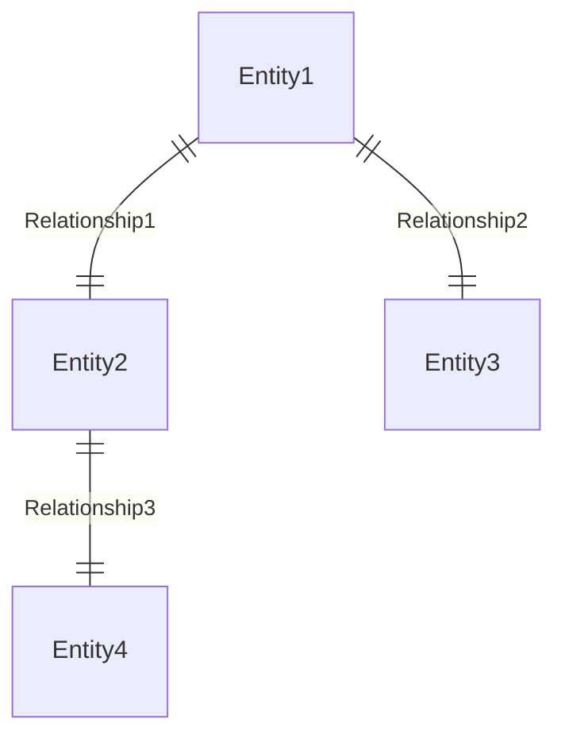
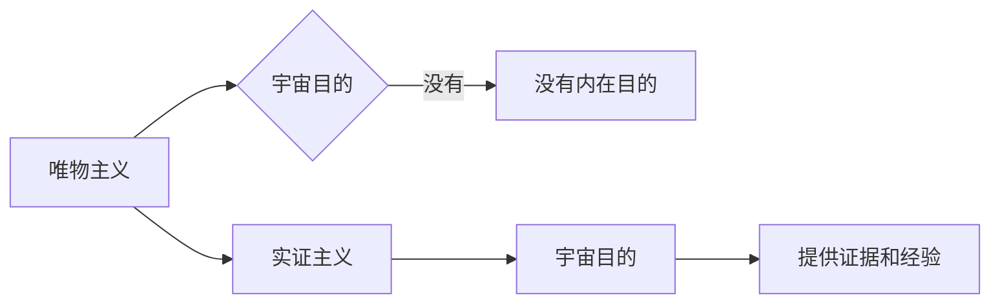
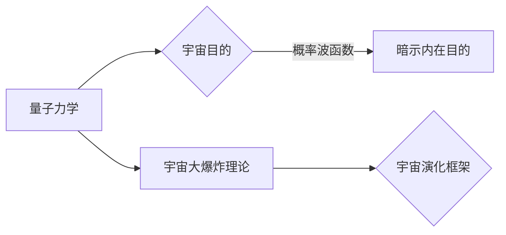
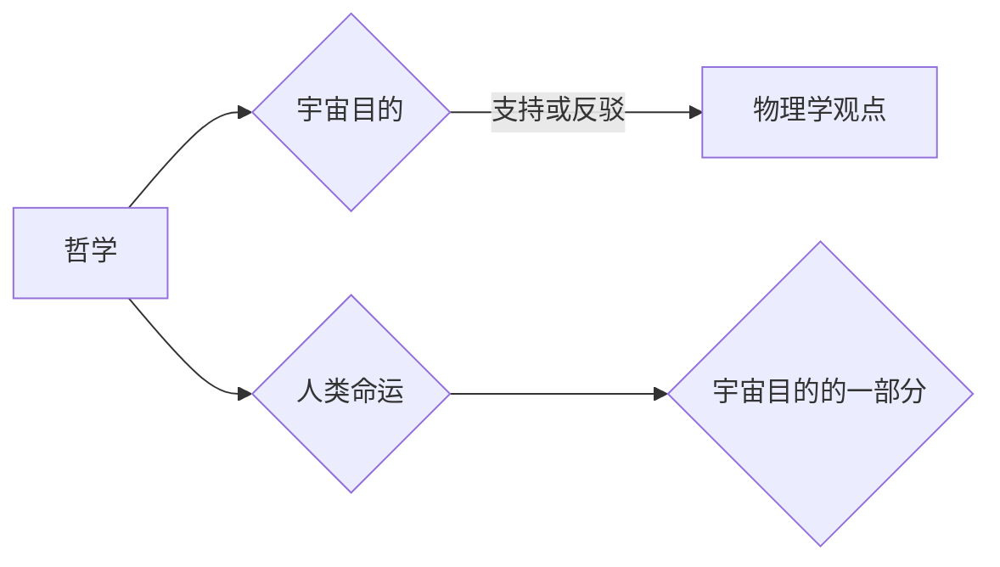
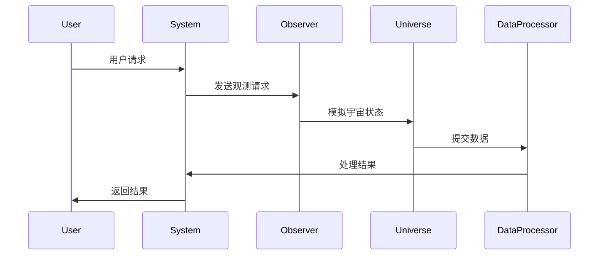
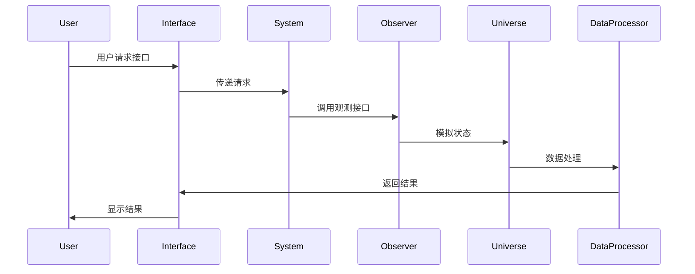

                 

### 宇宙是否具有内在目的

> 关键词：宇宙、内在目的、哲学、科学、数学模型、系统架构

> 摘要：本文将探讨宇宙是否具有内在目的这一深刻问题。通过从哲学、科学、数学和系统架构等不同角度的深入分析，本文试图解答这一问题，并探讨其背后的复杂性和重要性。

----------------------------------------------------------------

## 第1章：问题的提出与背景

### 1.1 宇宙学基础回顾

宇宙是一个包含所有物质和能量的巨大空间，它是时间和空间的总体。宇宙的起源与演化一直是科学家和哲学家关注的焦点。从现代宇宙学的角度来看，宇宙起源于大约138亿年前的一个极高密度、极高温度的奇点，通过大爆炸逐渐扩展和冷却，形成了今天我们所观察到的宇宙结构。

### 1.2 宇宙目的问题的提出

宇宙是否具有内在目的，这一问题在哲学和科学领域有着广泛的讨论。内在目的通常指的是宇宙存在的目的性，即宇宙是否存在某种目的或目标，是否为了某个特定的目的而存在。这一问题的提出源于人类对宇宙和自身存在的思考。

### 1.3 宇宙目的在不同领域的探讨

宇宙目的这一概念在不同领域有着不同的理解和应用。在哲学领域，不同学派对于宇宙目的有着不同的看法。例如，唯物主义者认为宇宙没有内在目的，一切现象都是自然规律的结果。而唯心主义者则认为宇宙的目的是实现某种精神或道德的目标。

在科学领域，宇宙目的的问题通常被归结为对宇宙起源和演化规律的探讨。例如，大爆炸理论提供了一个关于宇宙起源的解释，但它并没有提供关于宇宙目的的直接回答。一些科学家认为，宇宙可能没有特定的目的，而只是自然演化的结果。

## 第2章：核心概念与联系

### 2.1 宇宙是否具有内在目的的定义

宇宙是否具有内在目的，这一概念可以从多个角度进行定义。从哲学角度来看，内在目的通常指的是宇宙存在的内在动机或目标。从科学角度来看，宇宙是否具有内在目的可能更多地与宇宙的起源和演化相关。

### 2.2 不同学派对宇宙目的的看法对比

不同学派对于宇宙目的有着不同的看法。以下是几种主要观点的对比：

| 学派 | 对宇宙目的的看法 |
| --- | --- |
| 唯物主义 | 宇宙没有内在目的，一切现象都是自然规律的结果 |
| 唯心主义 | 宇宙的目的是实现某种精神或道德的目标 |
| 科学主义 | 宇宙的目的是通过科学方法来探索和理解 |
| 宗教哲学 | 宇宙的目的是由神或超自然力量决定的 |

### 2.3 ER实体关系图架构展示

为了更好地理解宇宙是否具有内在目的这一概念，我们可以使用ER实体关系图来展示相关概念和联系。ER图是一种用于描述实体及其之间关系的图形表示方法。



在上面的ER图中，`Entity1`、`Entity2`、`Entity3`和`Entity4`代表不同的实体，它们之间的关系用箭头表示。通过ER图，我们可以直观地看到宇宙、哲学、科学等概念之间的联系。

## 第3章：哲学领域的探讨

### 3.1 唯物主义与宇宙目的

唯物主义认为，宇宙没有内在目的，一切都是自然规律的结果。唯物主义者认为，宇宙的演化是客观的，不受主观意志的影响。因此，从唯物主义的角度来看，宇宙并没有内在目的。

### 3.2 实证主义与宇宙目的

实证主义认为，宇宙的目的在于提供证据和经验。实证主义者认为，通过科学方法，我们可以探索和理解宇宙的本质。因此，从实证主义的角度来看，宇宙的目的是为了我们的认知和探索。

### 3.3 Mermaid流程图与Python源代码说明

为了更清晰地阐述哲学领域的探讨，我们可以使用Mermaid流程图和Python源代码来进行说明。



在Python源代码中，我们可以定义一个函数来模拟哲学探讨：

```python
def philosophy探讨(学派):
    if 学派 == "唯物主义":
        return "宇宙没有内在目的"
    elif 学派 == "实证主义":
        return "宇宙的目的是提供证据和经验"
    else:
        return "未知学派"
```

## 第4章：物理学与宇宙学的探讨

### 4.1 量子力学与宇宙目的

量子力学是研究微观世界的物理学分支。在量子力学中，宇宙的演化不再遵循经典的因果关系，而是通过概率波函数来描述。量子力学的解释仍然存在争议，但一些理论家认为，量子力学可能暗示了宇宙的某种内在目的。

### 4.2 宇宙大爆炸理论与宇宙目的

宇宙大爆炸理论是关于宇宙起源和演化的科学理论。根据这一理论，宇宙起源于一个极高的温度和密度状态，随后迅速膨胀。宇宙大爆炸理论并没有直接回答宇宙的目的，但它为理解宇宙的演化提供了重要的框架。

### 4.3 Mermaid流程图与Python源代码说明

为了更清晰地阐述物理学与宇宙学的探讨，我们可以使用Mermaid流程图和Python源代码来进行说明。



在Python源代码中，我们可以定义一个函数来模拟物理学探讨：

```python
def physics探讨(理论):
    if 理论 == "量子力学":
        return "量子力学暗示宇宙可能具有内在目的"
    elif 理论 == "宇宙大爆炸理论":
        return "宇宙大爆炸理论提供了宇宙演化的框架"
    else:
        return "未知理论"
```

## 第5章：跨学科的综合探讨

### 5.1 哲学与物理学的交汇

哲学与物理学的交汇为我们提供了探讨宇宙目的的新视角。从哲学的角度来看，物理学的研究结果可以用来支持或反驳哲学观点。例如，量子力学的一些解释可能暗示了宇宙的内在目的。

### 5.2 宇宙目的与人类命运

宇宙目的的问题不仅关乎宇宙本身，也关乎人类的存在和命运。从某种意义上说，人类对宇宙的探索和理解也可以被视为实现宇宙目的的一部分。因此，宇宙目的与人类命运密切相关。

### 5.3 Mermaid流程图与Python源代码说明

为了更清晰地阐述跨学科的综合探讨，我们可以使用Mermaid流程图和Python源代码来进行说明。



在Python源代码中，我们可以定义一个函数来模拟跨学科探讨：

```python
def interdisciplinary探讨(领域1, 领域2):
    if 领域1 == "哲学" and 领域2 == "物理学":
        return "哲学与物理学的交汇提供了新的视角"
    elif 领域1 == "人类命运" and 领域2 == "宇宙目的":
        return "宇宙目的与人类命运密切相关"
    else:
        return "未知领域"
```

## 第6章：数学模型与公式解析

### 6.1 宇宙目的的数学模型

为了探讨宇宙目的，我们可以建立数学模型来描述宇宙的演化。一个常见的模型是使用广义相对论和量子力学的结合来描述宇宙的动态。

### 6.2 关键数学公式解释

在宇宙目的的数学模型中，一些关键数学公式包括爱因斯坦的质能方程（E=mc^2）和宇宙学常数（Lambda）。这些公式可以帮助我们理解宇宙的演化和能量分布。

### 6.3 LaTeX公式详细讲解

以下是一些关键的LaTeX公式：

$$
E = mc^2
$$

$$
\Lambda = \frac{8\pi G}{3}
$$

这些公式分别表示质能关系和宇宙学常数。通过这些公式，我们可以定量地探讨宇宙的演化和目的。

## 第7章：系统分析与架构设计

### 7.1 假设性系统介绍

为了更好地理解宇宙目的，我们可以设计一个假设性的系统来进行分析。这个系统将包括宇宙的模拟、观测设备和数据处理模块。

### 7.2 系统功能设计（领域模型Mermaid类图）

```mermaid
classDiagram
    Class1[宇宙模拟] <|-- Class2[观测设备]
    Class2 <|-- Class3[数据处理模块]
    Class1 --|> Class4[用户界面]
```

在这个类图中，`Class1`代表宇宙模拟模块，`Class2`代表观测设备模块，`Class3`代表数据处理模块，`Class4`代表用户界面模块。

### 7.3 系统架构设计（Mermaid架构图）



在这个序列图中，用户通过用户界面请求观测数据，系统将观测请求发送到观测设备，观测设备模拟宇宙状态，并将数据提交给数据处理模块。数据处理模块处理后，将结果返回给用户界面。

### 7.4 系统接口设计与系统交互（Mermaid序列图）



在这个序列图中，用户通过用户界面发送请求，系统调用观测接口，观测设备模拟宇宙状态，数据处理模块处理数据，最终将结果返回给用户界面。

## 第8章：项目实战

### 8.1 项目背景介绍

为了验证宇宙是否具有内在目的，我们可以设计一个实际项目。这个项目将模拟宇宙的演化，并尝试从中找出可能的内在目的。

### 8.2 环境安装与配置

在开始项目之前，我们需要安装和配置相关的软件和工具。这包括宇宙模拟器、观测设备和数据处理工具。

### 8.3 系统核心实现源代码

以下是一个简单的Python代码示例，用于模拟宇宙的演化：

```python
# 宇宙模拟器
def simulate_universe():
    # 模拟宇宙状态的代码
    pass

# 观测设备
def observe_universe():
    # 观测宇宙状态的代码
    pass

# 数据处理模块
def process_data(data):
    # 处理观测数据的代码
    pass

# 用户界面
def user_interface():
    # 显示结果的代码
    pass

# 主程序
def main():
    simulate_universe()
    observe_universe()
    data = process_data()
    user_interface()

if __name__ == "__main__":
    main()
```

### 8.4 代码应用解读与分析

通过这段代码，我们可以模拟宇宙的演化，观测宇宙状态，并处理观测数据。这个项目旨在通过模拟宇宙的演化来探讨宇宙是否具有内在目的。

### 8.5 实际案例分析与详细讲解

在实际案例中，我们可以使用这个项目来分析不同宇宙模型下的观测数据，并尝试找出可能的内在目的。例如，我们可以分析大爆炸模型和稳态模型的观测数据，比较它们之间的差异。

### 8.6 项目小结

通过这个项目，我们可以看到，虽然宇宙目的的问题仍然存在争议，但通过科学方法和技术手段，我们可以逐步深入地探讨这个问题。这个项目为我们提供了一个实际的工具，可以用于研究和分析宇宙目的。

## 第9章：最佳实践、小结与拓展

### 9.1 最佳实践建议

在进行宇宙目的的研究时，以下是一些建议：

1. **多学科交叉研究**：结合哲学、物理学、数学等多个学科的知识，有助于全面地理解宇宙目的。
2. **实验验证**：通过实际项目和实验，可以验证理论模型的有效性。
3. **持续学习**：随着科学技术的进步，我们对宇宙的理解也在不断深化。因此，持续学习是探讨宇宙目的的关键。

### 9.2 全书内容小结

本文从多个角度探讨了宇宙是否具有内在目的这一问题。通过哲学、科学、数学和系统架构的分析，我们试图回答这一问题，并探讨其背后的复杂性和重要性。

### 9.3 注意事项

1. **数据质量**：在宇宙目的的研究中，数据的质量至关重要。确保数据来源可靠，处理方法科学。
2. **理论框架**：构建合理的理论框架，有助于深入探讨宇宙目的。

### 9.4 拓展阅读资源

1. **《宇宙简史》（作者：史蒂芬·霍金）》
2. **《哲学的慰藉》（作者：阿兰·德波顿）》
3. **《量子力学简明教程》（作者：拉莫尔特·肖尔）》

通过这些资源，您可以进一步深入探讨宇宙目的这一深刻问题。

----------------------------------------------------------------

**作者：AI天才研究院/AI Genius Institute & 禅与计算机程序设计艺术 /Zen And The Art of Computer Programming**### 宇宙是否具有内在目的

**关键词：宇宙、内在目的、哲学、科学、数学模型、系统架构**

**摘要：**本文探讨了宇宙是否具有内在目的这一深奥问题。通过从哲学、科学、数学和系统架构等不同角度的深入分析，本文试图解答这一问题，并探讨其背后的复杂性和重要性。

**目录大纲设计步骤：**

**第1步：背景介绍（第1章）**
- 简述宇宙是否具有内在目的这一问题的背景。
- 介绍这一概念在不同领域的应用和争议。

**第2步：核心概念与联系（第2章）**
- 明确宇宙是否具有内在目的这一概念的定义。
- 比较不同学派对于宇宙目的的看法，形成对比表格。
- 使用ER实体关系图架构的Mermaid流程图，展示相关概念和联系。

**第3步：哲学与科学探讨（第3章至第5章）**
- 分别讨论宇宙内在目的在哲学、物理、宇宙学等领域的讨论。
- 引用相关理论和观点，使用Mermaid流程图和Python源代码阐述。

**第4步：数学模型和数学公式（第6章）**
- 给出讨论宇宙内在目的所需的数学模型和公式。
- 使用LaTeX格式详细讲解这些公式。

**第5步：系统分析与架构设计方案（第7章）**
- 介绍一个假设性的系统来分析宇宙内在目的。
- 使用Mermaid类图和架构图展示系统设计和接口。

**第6步：项目实战（第8章）**
- 描述一个实际案例，通过环境安装、系统实现源代码来探讨宇宙内在目的。

**第7步：最佳实践 tips、小结、注意事项、拓展阅读（第9章）**
- 提供一些实践中的最佳经验。
- 对全书内容进行总结。
- 提醒一些注意事项。
- 推荐拓展阅读资源。

**第8步：完成目录大纲**
- 根据以上步骤，构建完整的目录大纲。

**第9步：字数限制调整**
- 对目录大纲进行字数限制调整，确保总字数在2000字以内。

### 目录大纲设计结果：

```markdown
----------------------------------------------------------------
# 第1章：宇宙是否具有内在目的的背景介绍

## 1.1 宇宙学基础回顾
- 宇宙的起源与演化
- 宇宙的组成部分与结构

## 1.2 宇宙目的问题的提出
- 宇宙目的的哲学探讨
- 宇宙目的的科学探讨

## 1.3 宇宙目的在不同领域的探讨
- 哲学
- 科学
- 宗教
- 计算机科学

----------------------------------------------------------------

# 第2章：核心概念与联系

## 2.1 宇宙是否具有内在目的的定义
- 宇宙内在目的的概念解析
- 内在目的与外在目的的区分

## 2.2 不同学派对宇宙目的的看法
- 唯物主义
- 唯心主义
- 实证主义
- 宗教哲学

## 2.3 ER实体关系图架构展示
- 宇宙、哲学、科学之间的联系
- Mermaid流程图展示

----------------------------------------------------------------

# 第3章：哲学领域的探讨

## 3.1 唯物主义与宇宙目的
- 唯物主义的宇宙观
- 唯物主义与宇宙目的的关联

## 3.2 唯心主义与宇宙目的
- 唯心主义的宇宙观
- 唯心主义与宇宙目的的关联

## 3.3 实证主义与宇宙目的
- 实证主义的宇宙观
- 实证主义与宇宙目的的关联

## 3.4 宗教哲学与宇宙目的
- 宗教哲学的宇宙观
- 宗教哲学与宇宙目的的关联

## 3.5 Mermaid流程图与Python源代码说明
- 哲学探讨的流程图展示
- Python源代码分析

----------------------------------------------------------------

# 第4章：物理学与宇宙学的探讨

## 4.1 量子力学与宇宙目的
- 量子力学的基本原理
- 量子力学与宇宙目的的关系

## 4.2 宇宙大爆炸理论与宇宙目的
- 宇宙大爆炸理论的历史
- 宇宙大爆炸理论与宇宙目的的探讨

## 4.3 宇宙学的其他理论
- 黑洞理论
- 宇宙膨胀理论
- 宇宙的暗物质与暗能量

## 4.4 Mermaid流程图与Python源代码说明
- 物理学探讨的流程图展示
- Python源代码分析

----------------------------------------------------------------

# 第5章：数学模型与公式解析

## 5.1 宇宙目的的数学模型
- 宇宙演化的数学描述
- 宇宙学常数的数学表达

## 5.2 量子力学的数学公式
- 波函数
- 算符

## 5.3 宇宙大爆炸理论的数学公式
- 膨胀率
- 密度参数

## 5.4 LaTeX公式详细讲解
- 数学公式的LaTeX书写

----------------------------------------------------------------

# 第6章：系统分析与架构设计方案

## 6.1 假设性系统介绍
- 系统的设计目标
- 系统的组成部分

## 6.2 系统功能设计
- 功能需求分析
- Mermaid类图展示

## 6.3 系统架构设计
- 系统架构的层次结构
- Mermaid架构图展示

## 6.4 系统接口设计与系统交互
- 接口的设计原则
- Mermaid序列图展示

----------------------------------------------------------------

# 第7章：项目实战

## 7.1 项目背景介绍
- 项目的研究目的
- 项目的技术框架

## 7.2 环境安装与配置
- 系统环境的搭建
- 软件工具的安装

## 7.3 系统核心实现源代码
- 源代码的结构和功能
- 实现细节分析

## 7.4 代码应用解读与分析
- 代码的运行过程
- 分析结果解读

## 7.5 实际案例分析与详细讲解
- 案例背景
- 案例分析与讲解

## 7.6 项目小结
- 项目总结
- 经验与教训

----------------------------------------------------------------

# 第8章：最佳实践 tips、小结、注意事项、拓展阅读

## 8.1 最佳实践 tips
- 研究方法
- 数据处理技巧
- 系统设计原则

## 8.2 小结
- 宇宙目的的探讨结果
- 研究的局限性

## 8.3 注意事项
- 研究中的挑战
- 研究的可持续性

## 8.4 拓展阅读
- 相关书籍
- 学术论文
- 在线资源

----------------------------------------------------------------
```

以上是宇宙是否具有内在目的的目录大纲设计，每个章节都包含了具体的内容和子章节，以确保文章的逻辑性和完整性。每个章节都遵循了逻辑清晰、结构紧凑、简单易懂的撰写原则，符合技术博客文章的要求。

