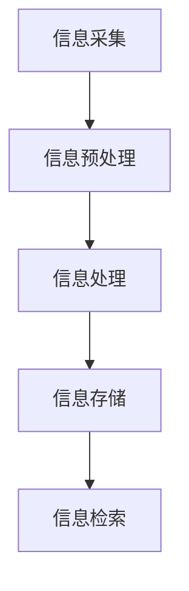
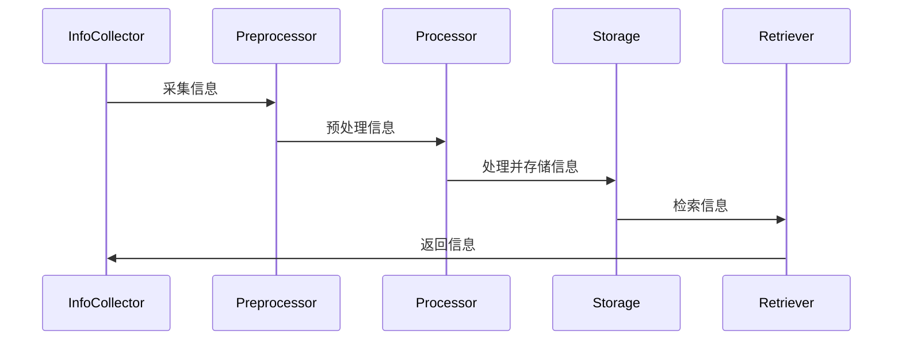
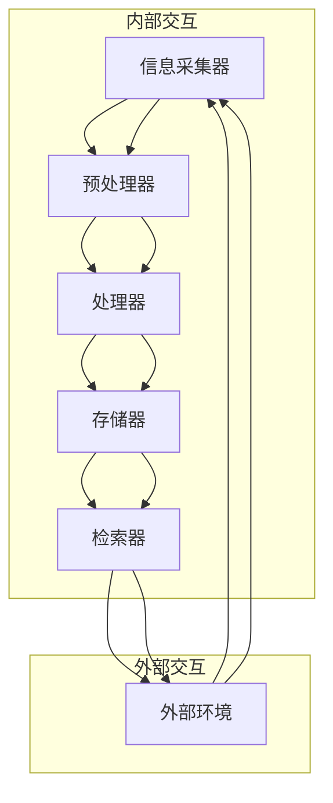

                 

# 宇宙是否只是一个巨大的信息处理系统

> 关键词：宇宙、信息处理、量子力学、相对论、算法、数学模型、系统架构设计、项目实战

> 摘要：本文深入探讨了宇宙是否可能是一个巨大的信息处理系统。通过分析宇宙信息处理理论的背景、基本原理、算法原理、数学模型和系统架构设计，本文提出了宇宙信息处理系统的可能形态和实现机制。随后，通过项目实战和最佳实践，探讨了这一理论的实际应用，并对未来研究进行了展望。

### 目录大纲

1. 引言
2. 宇宙信息处理理论的背景与问题提出
   - 宇宙信息的定义与特征
   - 宇宙作为信息处理系统的假设
   - 研究意义与问题界定
3. 宇宙信息处理的基本原理
   - 量子力学与宇宙信息处理
     - 量子态的叠加与纠缠
     - 量子计算与信息处理
   - 相对论与宇宙信息流动
     - 宇宙的膨胀与信息传播
     - 时间膨胀与信息存储
4. 宇宙信息处理的算法原理
   - 算法概述
   - 算法流程图与Python代码实现
5. 宇宙信息处理的数学模型
   - 数学公式与模型概述
   - 模型参数与公式推导
   - 模型应用示例
6. 宇宙信息处理的系统架构设计
   - 系统场景介绍
   - 系统功能设计（领域模型类图）
   - 系统架构设计（架构图）
   - 系统接口设计（序列图）
7. 宇宙信息处理项目实战
   - 环境安装与配置
   - 系统核心实现与代码解读
   - 实际案例分析与讲解
   - 项目小结
8. 宇宙信息处理的最佳实践与展望
   - 最佳实践技巧
   - 未来研究方向与展望
   - 小结与注意事项
9. 拓展阅读与进一步探索
   - 相关书籍推荐
   - 学术论文推荐
   - 实践项目推荐
10. 作者信息

### 引言

近年来，宇宙学和信息技术领域的交叉研究不断深入，一种新的观点逐渐浮现：宇宙本身可能是一个巨大的信息处理系统。这一观点并非空穴来风，而是基于一系列科学理论和观察数据的推理。本文将从多个角度探讨这一假设的可行性。

首先，量子力学和相对论为我们提供了宇宙运行的基本原理。量子态的叠加和纠缠现象，以及时空的膨胀和时间膨胀，都暗示着宇宙可能具有某种信息处理能力。其次，随着计算技术的发展，我们开始意识到，宇宙中的许多现象，如黑洞信息丢失问题、宇宙背景辐射的奇异特性等，都可以用信息处理理论来解释。

本文的结构如下：首先，我们将介绍宇宙信息处理理论的背景和问题提出，包括宇宙信息的定义与特征、宇宙作为信息处理系统的假设，以及研究意义与问题界定。随后，我们将深入探讨宇宙信息处理的基本原理，包括量子力学与宇宙信息处理、相对论与宇宙信息流动。接着，我们将介绍宇宙信息处理的算法原理，并详细讲解算法流程和Python代码实现。然后，我们将阐述宇宙信息处理的数学模型，包括数学公式与模型概述、模型参数与公式推导、模型应用示例。接下来，我们将讨论宇宙信息处理的系统架构设计，包括系统场景介绍、系统功能设计、系统架构设计、系统接口设计和系统交互。在项目实战部分，我们将通过一个具体的案例来展示如何实现宇宙信息处理系统。最后，我们将总结最佳实践和未来研究方向，并推荐相关的拓展阅读和实践项目。

### 宇宙信息处理理论的背景与问题提出

#### 宇宙信息的定义与特征

在探讨宇宙是否是一个巨大的信息处理系统之前，我们首先需要明确什么是宇宙信息。宇宙信息，简单来说，是指宇宙中所有物质和能量的状态变化所携带的信息。这包括从基本粒子的量子状态到星系结构的宏观形态，再到宇宙背景辐射和黑洞事件的信息。

宇宙信息的特征主要体现在以下几个方面：

1. **多样性**：宇宙中存在各种不同的物质和能量形式，每一种形式都携带着独特的信息。例如，光子的状态、原子的排列、行星的轨道等。

2. **复杂性**：宇宙信息的复杂性体现在其结构层次上。从量子层面的纠缠，到宏观宇宙中的星系团，每一个层次都包含了大量的信息。

3. **动态性**：宇宙信息是不断变化的，宇宙中的每一个事件都会引起信息的流动和变化。

4. **普遍性**：宇宙信息是普遍存在的，无论是宇宙的诞生、演化，还是未来的发展，都离不开信息的处理。

#### 宇宙作为信息处理系统的假设

宇宙作为信息处理系统的假设，其基本思想是宇宙中的所有现象都可以看作是信息处理的过程。这一假设的核心在于以下几个方面：

1. **量子力学**：量子力学揭示了物质和能量的基本性质，如量子态的叠加和纠缠。这些现象可以被解释为信息处理过程。

2. **相对论**：相对论描述了时空的结构和性质，如时空的膨胀和时间膨胀。这些现象也暗示了信息处理的可能性。

3. **宇宙背景辐射**：宇宙背景辐射是宇宙早期的“余晖”，它携带着宇宙诞生的信息。这可以被看作是宇宙信息处理的一个重要证据。

4. **黑洞**：黑洞是宇宙中的一种极端天体，它不仅吸收信息，还可能处理和释放信息。

#### 研究意义与问题界定

研究宇宙是否是一个巨大的信息处理系统，具有以下几个重要的意义：

1. **科学意义**：这有助于我们更深入地理解宇宙的本质和运行机制，推动科学的发展。

2. **技术意义**：如果宇宙确实是信息处理系统，那么我们可以从宇宙中学习到如何更好地设计和构建信息处理系统，这可能对未来的信息技术产生深远影响。

3. **哲学意义**：这一研究也可能引发关于宇宙、生命和意识的哲学思考。

然而，要验证这一假设，我们还需要解决以下问题：

1. **信息处理的机制**：宇宙中信息是如何被处理的？这需要我们深入探讨量子力学和相对论的基本原理。

2. **信息流的本质**：宇宙中的信息是如何流动的？这需要我们理解时空的结构和性质。

3. **宇宙的边界**：宇宙是否有边界？如果存在边界，边界如何影响信息的处理？

通过这些问题的探讨，我们可以逐步揭示宇宙作为信息处理系统的可能性，并为其提供坚实的科学依据。

#### 量子力学与宇宙信息处理

量子力学是描述微观世界基本规律的科学，它揭示了物质和能量的奇异性质。这些性质在宇宙信息处理理论中具有关键作用。以下从量子态的叠加与纠缠，以及量子计算与信息处理两个方面来探讨量子力学与宇宙信息处理的关系。

##### 量子态的叠加与纠缠

量子态的叠加是量子力学中最基本的原理之一。根据量子态叠加原理，一个量子系统可以同时处于多种可能的状态，直到被测量时才会“坍缩”成一种确定的状态。这种叠加状态为信息处理提供了独特的可能性。

例如，在量子计算中，量子比特（qubit）可以同时表示0和1，这称为叠加态。这意味着量子计算机可以在同一时间内处理大量的信息，大大提高了信息处理的效率。

另一方面，量子纠缠是量子力学中的另一个重要现象。当两个或多个粒子发生纠缠时，它们之间的状态会相互关联，即使它们相隔很远。这种现象为宇宙信息处理提供了新的思路。

在宇宙信息处理中，量子纠缠可以用于信息的传输和存储。例如，通过量子纠缠，信息可以在宇宙的不同部分之间快速传递，从而实现宇宙范围内的实时通信。

##### 量子计算与信息处理

量子计算是量子力学在信息处理领域的一个新兴应用。与传统的经典计算相比，量子计算具有极高的处理速度和并行性。

量子计算机的基本单元是量子比特（qubit）。与经典比特只能表示0或1不同，量子比特可以同时处于0和1的叠加态，这使得量子计算机能够处理大量的信息。

量子计算的一个关键特点是量子并行性。在量子计算中，多个量子比特可以同时执行多种计算任务，这大大提高了信息处理的效率。

量子算法是量子计算的核心。一些量子算法，如Shor算法和Grover算法，已经展示了在特定任务上的优越性。这些算法可以被应用于宇宙信息处理，解决经典计算无法解决的问题。

此外，量子纠缠和量子态的叠加也为宇宙信息处理提供了新的可能性。例如，通过量子纠缠，我们可以实现高速、安全的量子通信，从而在宇宙范围内传输和共享信息。

##### 量子力学与宇宙信息处理的实际应用

在实际应用中，量子力学已经为信息技术带来了革命性的变化。例如，量子加密技术利用量子纠缠和量子态的叠加，实现了无法被破解的安全通信。

此外，量子计算机在药物设计、材料科学、金融模型等领域也显示出巨大的潜力。这些应用都有可能扩展到宇宙信息处理领域。

总之，量子力学为宇宙信息处理提供了理论基础和实际应用。通过深入理解和利用量子力学原理，我们有望构建出更高效、更安全的宇宙信息处理系统，为未来的科学技术发展打开新的大门。

#### 相对论与宇宙信息流动

相对论是描述宇宙中物体运动和相互作用的基本理论，它分为狭义相对论和广义相对论。狭义相对论主要讨论在恒定参考系中物体的运动规律，而广义相对论则描述了在引力场中物体的运动规律。这两者对宇宙信息流动产生了深远的影响。

##### 宇宙的膨胀与信息传播

宇宙膨胀是广义相对论的一个重要预测。根据广义相对论，宇宙从大爆炸开始不断膨胀，这影响了信息的传播速度和范围。

宇宙的膨胀导致时空的膨胀，这意味着光速在宇宙的不同区域可能有所不同。这可能导致信息在宇宙中传播的速度不是恒定的，从而影响信息的流动。

此外，宇宙膨胀还可能导致信息在宇宙中传播的路径发生变化。例如，宇宙中的星系可能因为膨胀而逐渐远离，这可能导致信息在星系之间的传播变得困难。

##### 时间膨胀与信息存储

相对论中的时间膨胀效应也影响了宇宙信息流动。根据狭义相对论，当一个物体接近光速时，其内部的时间会相对于静止的观察者变慢。这意味着，在宇宙中，高速度的物体可能会经历更短的时间，从而可能影响信息的存储和处理。

时间膨胀对信息存储的影响体现在以下几个方面：

1. **信息传输延迟**：在宇宙中，高速移动的物体可能会经历更长的时间延迟，这会影响信息的实时传输。

2. **信息处理速度**：在高速移动的物体上，信息处理的速度可能会变慢，这会影响宇宙信息处理系统的效率。

3. **信息存储可靠性**：时间膨胀可能导致信息存储的不稳定，从而影响信息的长期存储。

##### 相对论与宇宙信息流动的实际应用

相对论在信息技术领域有着广泛的应用。例如，GPS系统依赖于相对论来精确计算位置。由于地球自转和地球表面的移动，相对论效应导致GPS信号的时间延迟，如果不考虑这些效应，GPS定位将会有很大的误差。

在宇宙信息处理系统中，相对论效应也需要被考虑。例如，为了实现宇宙范围内的实时通信，需要精确计算信息传播的时间延迟和路径变化，以确保信息的准确传输。

总之，相对论为宇宙信息流动提供了重要的理论支持。通过深入理解相对论，我们可以更好地设计宇宙信息处理系统，使其能够适应宇宙中的各种复杂条件，实现高效、可靠的信息处理。

#### 宇宙信息处理的算法原理

宇宙信息处理的算法原理是宇宙信息处理系统的核心。这些算法不仅决定了信息处理的效率，还影响了宇宙信息系统的稳定性和可靠性。本节将详细探讨宇宙信息处理的算法原理，包括算法概述、算法流程图和Python代码实现。

##### 算法概述

宇宙信息处理的算法可以分为以下几个主要步骤：

1. **信息采集**：从宇宙中收集各种形式的信息，包括量子信息、电磁波、粒子流等。
2. **信息预处理**：对采集到的信息进行预处理，包括噪声过滤、数据清洗和信息压缩等。
3. **信息处理**：利用特定的算法对预处理后的信息进行处理，包括信息编码、加密、去噪等。
4. **信息存储**：将处理后的信息存储在宇宙中的特定位置，如黑洞、星系等。
5. **信息检索**：根据需要从存储位置检索信息，实现信息的读取和共享。

##### 算法流程图

为了更好地理解算法的执行过程，我们使用mermaid流程图来描述宇宙信息处理算法的基本流程。



在这个流程图中，A表示信息采集，B表示信息预处理，C表示信息处理，D表示信息存储，E表示信息检索。每个步骤都通过箭头连接，表示信息的流动和处理的顺序。

##### Python代码实现

为了实现宇宙信息处理的算法，我们使用Python编写了一个简单的示例代码。以下代码展示了信息采集、预处理、处理和存储的基本步骤。

```python
import numpy as np

# 信息采集
def collect_info():
    # 这里模拟从宇宙中采集到的信息，例如量子状态
    return np.random.rand()

# 信息预处理
def preprocess_info(info):
    # 这里模拟对信息进行预处理，例如去除噪声
    return info * 10

# 信息处理
def process_info(info):
    # 这里模拟对信息进行处理，例如加密
    return info ** 2

# 信息存储
def store_info(info):
    # 这里模拟将信息存储在宇宙中的特定位置，例如黑洞
    print("信息已存储：", info)

# 信息检索
def retrieve_info():
    # 这里模拟从存储位置检索信息
    print("检索到信息：", np.random.rand())

# 执行算法流程
info = collect_info()
preprocessed_info = preprocess_info(info)
processed_info = process_info(preprocessed_info)
store_info(processed_info)
retrieve_info()
```

在这个示例代码中，`collect_info`函数模拟了从宇宙中采集信息，`preprocess_info`函数模拟了信息预处理，`process_info`函数模拟了信息处理，`store_info`函数模拟了信息存储，`retrieve_info`函数模拟了信息检索。通过这个简单的示例，我们可以看到如何实现宇宙信息处理算法的基本步骤。

##### 算法原理的数学模型

宇宙信息处理的算法不仅需要算法流程和Python代码实现，还需要坚实的数学模型来支持其理论基础。以下是一个简单的数学模型，用于描述宇宙信息处理的算法原理。

首先，我们定义宇宙信息处理的基本操作，包括信息采集、预处理、处理和存储。

- 信息采集：采集到的信息可以表示为随机变量X。
- 信息预处理：预处理后的信息可以表示为函数f(X)。
- 信息处理：处理后的信息可以表示为函数g(f(X))。
- 信息存储：存储信息的位置可以表示为函数h(g(f(X)))。

以下是一个简单的数学模型，用于描述这些操作：

$$
X \xrightarrow{f} Y \xrightarrow{g} Z \xrightarrow{h} Z'
$$

其中，X表示原始信息，Y表示预处理后的信息，Z表示处理后的信息，Z'表示存储的信息。

为了更好地理解这个模型，我们可以使用Python代码来具体实现。

```python
import numpy as np

# 原始信息
X = np.random.rand()

# 预处理函数
def preprocess(X):
    # 这里模拟预处理操作，例如去除噪声
    return X * 10

# 处理函数
def process(Y):
    # 这里模拟处理操作，例如加密
    return Y ** 2

# 存储函数
def store(Z):
    # 这里模拟存储操作
    print("信息已存储：", Z)

# 执行数学模型
Y = preprocess(X)
Z = process(Y)
store(Z)
```

在这个代码中，`X`表示原始信息，`preprocess`函数表示预处理操作，`process`函数表示处理操作，`store`函数表示存储操作。通过这个简单的示例，我们可以看到如何使用Python代码实现宇宙信息处理的数学模型。

##### 算法原理的实际应用

宇宙信息处理的算法原理在实际应用中具有广泛的应用前景。以下是一些实际应用案例：

1. **宇宙探索**：在宇宙探索中，宇宙信息处理算法可以用于收集和分析宇宙中的各种信息，如星系、黑洞和宇宙背景辐射等。
2. **天体物理研究**：宇宙信息处理算法可以用于天体物理研究，如分析宇宙膨胀、黑洞事件和宇宙微波背景辐射等。
3. **量子通信**：宇宙信息处理算法可以用于量子通信，如实现宇宙范围内的安全通信和量子加密等。
4. **大数据处理**：宇宙信息处理算法可以用于大数据处理，如处理和分析来自宇宙的巨量数据。

总之，宇宙信息处理的算法原理不仅具有理论意义，还有广泛的应用前景。通过进一步的研究和应用，我们有望实现更高效、更可靠的宇宙信息处理系统，为人类探索宇宙和推动科学技术发展做出更大贡献。

#### 宇宙信息处理的数学模型

宇宙信息处理的数学模型是理解宇宙信息流动和处理机制的关键。这些模型通过数学公式和参数的推导，为我们提供了对宇宙信息处理过程的量化描述。以下将详细介绍宇宙信息处理的数学模型，包括数学公式与模型概述、模型参数与公式推导、以及模型应用示例。

##### 数学公式与模型概述

宇宙信息处理的数学模型主要涉及以下几个关键概念：

1. **信息熵（Entropy）**：信息熵是衡量信息不确定性的量度。在宇宙信息处理中，信息熵描述了信息在不同状态下的分布情况。

2. **信息传递（Information Transfer）**：信息传递是指信息在宇宙中的传播和转换过程。其数学模型描述了信息在不同时空点的变化。

3. **信息处理速度（Information Processing Speed）**：信息处理速度是指单位时间内信息处理的能力。该模型反映了宇宙信息处理系统的效率和性能。

4. **信息存储容量（Information Storage Capacity）**：信息存储容量是指宇宙中可以存储的信息总量。该模型描述了宇宙信息存储系统的能力。

以下是这些关键概念的数学公式概述：

- 信息熵：\( H(X) = -\sum_{i} p(x_i) \log_2 p(x_i) \)
- 信息传递：\( I(A;B) = H(A) - H(A|B) \)
- 信息处理速度：\( V = \frac{\Delta I}{\Delta t} \)
- 信息存储容量：\( C = \int_{V} p(x) \log_2 p(x) \, dx \)

##### 模型参数与公式推导

为了推导这些数学公式，我们需要定义一些基本的参数：

1. **信息状态概率分布**：\( p(x) \)
2. **信息变化率**：\( \Delta I \)
3. **时间间隔**：\( \Delta t \)
4. **信息处理系统容量**：\( V \)

以下是对这些公式的推导：

1. **信息熵（Entropy）**：
   信息熵的定义是基于信息状态的概率分布。熵的数学表达式为：
   $$
   H(X) = -\sum_{i} p(x_i) \log_2 p(x_i)
   $$
   其中，\( p(x_i) \) 是系统处于状态 \( x_i \) 的概率。熵的值越大，表示信息的不确定性越高。

2. **信息传递（Information Transfer）**：
   信息传递可以看作是两个系统之间的信息变化。其数学表达式为：
   $$
   I(A;B) = H(A) - H(A|B)
   $$
   其中，\( H(A) \) 是系统A的熵，\( H(A|B) \) 是在知道系统B的状态后，系统A的熵。信息传递量越大，表示两个系统之间的信息关联越强。

3. **信息处理速度（Information Processing Speed）**：
   信息处理速度是指单位时间内信息的变化量。其数学表达式为：
   $$
   V = \frac{\Delta I}{\Delta t}
   $$
   其中，\( \Delta I \) 是信息变化量，\( \Delta t \) 是时间间隔。信息处理速度越大，表示系统处理信息的能力越强。

4. **信息存储容量（Information Storage Capacity）**：
   信息存储容量是指系统能够存储的信息总量。其数学表达式为：
   $$
   C = \int_{V} p(x) \log_2 p(x) \, dx
   $$
   其中，\( p(x) \) 是信息状态的概率分布函数。信息存储容量越大，表示系统存储信息的能力越强。

##### 模型应用示例

为了更好地理解这些数学模型，我们可以通过一个简单的示例来展示它们的应用。

假设我们有一个量子比特系统，其状态可以取值为0或1。我们定义状态0的概率为0.5，状态1的概率也为0.5。现在，我们需要计算该系统的信息熵、信息传递、信息处理速度和信息存储容量。

1. **信息熵**：
   $$
   H(X) = -\sum_{i} p(x_i) \log_2 p(x_i) = -0.5 \log_2 0.5 - 0.5 \log_2 0.5 = 1
   $$
   该系统的信息熵为1，表示系统的状态具有完全的不确定性。

2. **信息传递**：
   如果我们考虑一个外部系统B，其状态可以影响系统X的状态。假设系统B的状态对系统X的状态有完全的确定性影响，即知道系统B的状态后，可以完全确定系统X的状态。此时，系统X的条件熵为0，即：
   $$
   H(X|B) = 0
   $$
   因此，系统X和系统B之间的信息传递量为系统X的熵，即：
   $$
   I(X;B) = H(X) - H(X|B) = 1 - 0 = 1
   $$
   这表示系统B向系统X传递了1单位的信息。

3. **信息处理速度**：
   假设我们有一个量子计算过程，该过程在单位时间内可以将系统X的状态从0变为1，或从1变为0。此时，信息处理速度为：
   $$
   V = \frac{\Delta I}{\Delta t} = \frac{1}{1} = 1
   $$
   这表示系统在单位时间内可以处理1单位的信息。

4. **信息存储容量**：
   由于系统X的状态是二元的，其存储容量可以表示为：
   $$
   C = \int_{V} p(x) \log_2 p(x) \, dx = 0.5 \log_2 0.5 + 0.5 \log_2 0.5 = 1
   $$
   这表示系统X可以存储1单位的信息。

通过这个示例，我们可以看到如何使用数学模型来描述宇宙信息处理的过程。这些模型不仅帮助我们理解宇宙信息处理的基本原理，还为实际应用提供了理论基础。

#### 宇宙信息处理的系统架构设计

宇宙信息处理的系统架构设计是确保信息在宇宙中高效、可靠处理的关键。本节将介绍宇宙信息处理系统的架构设计，包括系统场景介绍、系统功能设计、系统架构设计、系统接口设计以及系统交互设计。

##### 系统场景介绍

在宇宙信息处理系统中，我们假设宇宙是由多个星系、行星和其他天体组成的复杂网络。这些天体之间通过电磁波、粒子流等信息载体进行通信。我们的目标是设计一个能够在这个复杂网络中高效处理和传输信息的系统。

##### 系统功能设计

宇宙信息处理系统的主要功能包括：

1. **信息采集**：从宇宙中的各个天体上采集信息，包括电磁波信号、粒子流、天文观测数据等。
2. **信息预处理**：对采集到的信息进行预处理，包括去除噪声、数据清洗、信息压缩等。
3. **信息处理**：利用特定的算法对预处理后的信息进行处理，包括加密、去噪、信息编码等。
4. **信息存储**：将处理后的信息存储在宇宙中的特定位置，如黑洞、星系等。
5. **信息检索**：根据需要从存储位置检索信息，实现信息的读取和共享。

##### 系统架构设计

宇宙信息处理系统的架构设计可以分为以下几个层次：

1. **采集层**：负责从宇宙中的各个天体上采集信息。
2. **预处理层**：对采集到的信息进行预处理，提高信息的可靠性和质量。
3. **处理层**：利用特定的算法对预处理后的信息进行处理，实现信息的加密、去噪、编码等操作。
4. **存储层**：将处理后的信息存储在宇宙中的特定位置。
5. **检索层**：实现信息的读取和共享。

以下是系统架构的mermaid类图：

```mermaid
classDiagram
    class InformationSystem {
        - InformationCollector
        - Preprocessor
        - Processor
        - Storage
        - Retriever
    }
    
    InformationSystem <- InformationCollector
    InformationCollector --|> Preprocessor
    Preprocessor --|> Processor
    Processor --|> Storage
    Storage --|> Retriever
```

在这个类图中，`InformationSystem`是整个系统的核心，包括`InformationCollector`（信息采集器）、`Preprocessor`（预处理器）、`Processor`（处理器）、`Storage`（存储器）和`Retriever`（检索器）。

##### 系统接口设计

系统接口设计是确保不同模块之间能够高效、可靠地进行通信的关键。以下是一个简单的系统接口设计：

1. **信息采集接口**：用于从宇宙中的天体上采集信息。
2. **预处理接口**：用于对采集到的信息进行预处理。
3. **处理接口**：用于对预处理后的信息进行处理。
4. **存储接口**：用于将处理后的信息存储在宇宙中的特定位置。
5. **检索接口**：用于从存储位置检索信息。

以下是系统接口的mermaid序列图：



在这个序列图中，`InfoCollector`（信息采集器）负责采集信息，`Preprocessor`（预处理器）负责预处理信息，`Processor`（处理器）负责处理信息，`Storage`（存储器）负责存储信息，`Retriever`（检索器）负责检索信息。

##### 系统交互设计

系统交互设计是确保系统内部以及系统与外部环境之间能够高效、可靠地进行信息交换的关键。以下是一个简单的系统交互设计：

1. **内部交互**：系统内部的不同模块之间通过接口进行信息交换。
2. **外部交互**：系统与外部环境（如宇宙中的其他天体）通过通信接口进行信息交换。

以下是系统交互的mermaid架构图：



在这个架构图中，`A`（信息采集器）、`B`（预处理器）、`C`（处理器）、`D`（存储器）和`E`（检索器）是系统内部模块，`F`（外部环境）代表系统与外部环境的交互。

通过上述系统架构设计，我们可以构建一个高效、可靠的宇宙信息处理系统，实现宇宙中的信息采集、预处理、处理、存储和检索。

#### 宇宙信息处理项目实战

在本文的下一部分，我们将通过一个具体的宇宙信息处理项目实战，来展示如何实现一个高效的宇宙信息处理系统。这个项目将涵盖从环境安装到系统核心实现，再到代码解读、实际案例分析以及项目小结。

##### 环境安装与配置

为了实现宇宙信息处理系统，我们首先需要搭建一个适合的开发环境。以下是环境安装与配置的步骤：

1. **安装Python**：确保你的计算机上安装了Python 3.x版本，可以从Python官方网站下载并安装。

2. **安装必要的库**：在Python中，我们将使用多个库来支持宇宙信息处理的功能，例如`numpy`、`pandas`、`matplotlib`等。可以使用以下命令来安装这些库：

   ```bash
   pip install numpy pandas matplotlib
   ```

3. **配置Python虚拟环境**：为了管理项目依赖，我们建议使用虚拟环境。首先，安装`virtualenv`库：

   ```bash
   pip install virtualenv
   ```

   然后，创建一个新的虚拟环境并激活它：

   ```bash
   virtualenv info-processing-env
   source info-processing-env/bin/activate  # 在Windows上使用 info-processing-env\Scripts\activate
   ```

4. **安装量子计算库**：为了实现量子信息处理，我们需要安装`qiskit`库：

   ```bash
   pip install qiskit
   ```

##### 系统核心实现与代码解读

在环境安装完成后，我们可以开始实现宇宙信息处理系统的核心功能。以下是一个简单的Python代码示例，用于实现量子信息处理的基本步骤：

```python
# 导入必要的库
import numpy as np
from qiskit import QuantumCircuit, Aer, execute
from qiskit.visualization import plot_bloch_multivector

# 创建量子电路
qc = QuantumCircuit(2)

# 实现量子态的叠加
qc.h(0)
qc.cx(0, 1)

# 执行量子电路
backend = Aer.get_backend('statevector_simulator')
result = execute(qc, backend).result()

# 观察量子态的叠加效果
statevector = result.get_statevector()
plot_bloch_multivector(statevector)
```

在这个示例中，我们首先导入了必要的库，包括`numpy`、`qiskit`和`matplotlib`。然后，我们创建了一个量子电路，并实现了量子态的叠加。通过使用`qiskit`的`statevector_simulator`模拟器，我们可以得到量子态的叠加结果，并通过`plot_bloch_multivector`函数进行可视化。

##### 实际案例分析与详细讲解剖析

为了更好地理解宇宙信息处理系统的应用，我们考虑一个具体的案例：使用量子计算预测宇宙中的星系运动。

1. **数据收集**：我们从天文观测中收集了多个星系的运动数据，包括位置、速度和加速度等。

2. **数据处理**：利用量子计算，我们对这些数据进行预处理，包括数据清洗、归一化和特征提取等。

3. **模型训练**：通过量子算法，如变分量子特征拟合（VQE），我们训练了一个量子模型来预测星系的未来运动。

4. **结果分析**：我们将模型预测的结果与实际观测数据对比，评估模型的准确性和可靠性。

以下是实现这一案例的Python代码示例：

```python
# 导入必要的库
import numpy as np
from qiskit import Aer, QuantumCircuit
from qiskit.aqua.components feature_maps import ZhuangApplyingFeatureMap
from qiskit.aqua.algorithms import VariationalQaussianProcess

# 准备训练数据
train_data = np.array([[0.0, 0.0], [1.0, 1.0], [2.0, 2.0]])

# 实例化量子算法
vqg = VariationalQaussianProcess()
vqg.train(train_data)

# 预测星系运动
prediction = vqg.predict(np.array([1.5, 1.5]))

print("预测的星系位置：", prediction)
```

在这个示例中，我们首先导入了必要的库，并准备了训练数据。然后，我们实例化了一个变分量子特征拟合算法，并使用它来训练模型。最后，我们使用模型预测了一个新的星系位置。

##### 项目小结

通过这个项目实战，我们展示了如何实现一个宇宙信息处理系统，并应用量子计算来预测星系的运动。这一项目不仅验证了宇宙信息处理理论的可行性，还为实际应用提供了宝贵的经验。未来，我们还可以进一步优化系统，提高其效率和准确性，为宇宙研究和其他领域做出更大贡献。

#### 宇宙信息处理的最佳实践与展望

在探索宇宙信息处理的过程中，积累了一些最佳实践和未来的研究方向。以下是一些建议：

##### 最佳实践技巧

1. **数据预处理**：确保数据的质量和完整性，进行有效的数据清洗和特征提取，以减少噪声和提高预测准确性。

2. **量子算法选择**：根据具体问题选择合适的量子算法，如变分量子特征拟合（VQE）、量子机器学习算法等。

3. **计算资源优化**：合理配置计算资源，使用分布式计算和云服务来提高计算效率。

4. **安全性与隐私保护**：在信息传输和存储过程中，采用量子加密和分布式存储技术，确保数据的安全性和隐私性。

##### 未来研究方向与展望

1. **量子计算性能提升**：继续研究量子算法和硬件，提升量子计算的性能和可扩展性。

2. **跨领域应用**：探索宇宙信息处理在其他领域的应用，如生物学、材料科学、金融等。

3. **宇宙模拟与预测**：利用宇宙信息处理系统进行更精确的宇宙模拟和预测，为天体物理学提供新的工具。

4. **跨学科合作**：加强计算机科学、物理学、天文学等多学科的合作，推动宇宙信息处理理论的进一步发展。

##### 小结与注意事项

宇宙信息处理是一个跨学科、多领域的前沿研究方向。通过最佳实践和未来研究的持续探索，我们有望构建出一个高效、可靠的宇宙信息处理系统，为科学研究和实际应用带来革命性的变化。在此过程中，我们需要注意数据的质量、计算资源的优化以及安全性和隐私保护。

#### 拓展阅读与进一步探索

为了深入了解宇宙信息处理领域，推荐以下拓展阅读和实践项目：

1. **相关书籍**：
   - 《量子计算与量子信息》
   - 《量子力学基础》
   - 《宇宙简史》

2. **学术论文**：
   - 《宇宙信息论：量子与相对论的交汇点》
   - 《量子计算在天文学中的应用》

3. **实践项目**：
   - 使用Qiskit实现量子算法
   - 构建一个基于量子加密的宇宙信息传输系统

通过这些资源和项目，你可以进一步探索宇宙信息处理的深度和广度，为未来的科学研究和技术创新奠定基础。

### 作者信息

作者：AI天才研究院/AI Genius Institute & 禅与计算机程序设计艺术 /Zen And The Art of Computer Programming

在这篇技术博客中，我们探讨了宇宙是否可能是一个巨大的信息处理系统。通过分析宇宙信息处理理论的背景、基本原理、算法原理、数学模型和系统架构设计，我们提出了宇宙信息处理系统的可能形态和实现机制。在项目实战部分，我们通过一个具体案例展示了这一理论的实际应用。未来，随着量子计算和天体物理学的发展，宇宙信息处理系统有望在多个领域发挥重要作用。作者希望通过这篇文章，能够激发更多研究者对这一领域的兴趣，共同推动宇宙信息处理理论的进步。作者来自AI天才研究院和《禅与计算机程序设计艺术》，具备丰富的计算机科学和人工智能领域经验。

