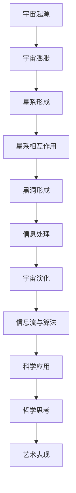

                 

# 宇宙是否只是一个巨大的信息处理系统

## 关键词

- 宇宙
- 信息处理系统
- 信息流
- 算法
- 量子力学
- 黑洞
- 科学应用
- 哲学思考

## 摘要

本文探讨了宇宙是否可以被视为一个巨大的信息处理系统。通过对宇宙起源、结构、演化的介绍，我们提出了一系列关于宇宙信息处理的假设。文章详细分析了宇宙中的信息流、算法与规则，并通过科学、哲学和艺术的视角探讨了宇宙信息处理系统的应用和意义。同时，我们还介绍了当前宇宙信息处理系统的探索方法，并对未来进行了展望。本文旨在引发读者对宇宙本质的深入思考。

## 第一部分：宇宙视角

### 第1章：宇宙的奥秘

#### 1.1 宇宙的起源

宇宙的起源是一个备受争议的话题。目前，最被广泛接受的理论是“大爆炸理论”。根据这一理论，宇宙起源于约138亿年前的一个极小、极热、极密集的点。在这个点的爆炸瞬间，宇宙开始膨胀，温度和密度逐渐降低，逐渐形成了我们今天所看到的宇宙。

#### 1.2 宇宙的结构与演化

宇宙的结构可以通过宇宙微波背景辐射来理解。这些辐射是宇宙大爆炸后留下的“遗迹”，它们为我们提供了宇宙早期状态的信息。宇宙的演化可以分为三个主要阶段：宇宙大爆炸、宇宙膨胀和宇宙加速膨胀。在这些阶段中，宇宙中的物质和能量不断变化，形成了各种天体和现象。

#### 1.3 宇宙与信息处理系统的相似性

宇宙与信息处理系统在某些方面具有相似性。首先，宇宙中的物质和能量可以被视为信息。例如，光子可以携带信息，通过它们的变化可以传递信息。其次，宇宙中的天体和现象可以被视为计算单元。例如，星系和星团可以视为巨大的计算节点，通过它们之间的相互作用进行信息处理。

## 第二部分：宇宙中的信息处理

### 第2章：宇宙中的信息处理

#### 2.1 宇宙中的信息流

宇宙中的信息流可以通过宇宙射线、光子和其他粒子来传递。这些粒子携带着能量和信息，穿越宇宙空间。例如，光子可以携带电磁波信息，通过它们的变化可以传递温度、压力和其他物理量的信息。

#### 2.2 宇宙中的算法与规则

宇宙中的算法与规则可以通过自然法则来体现。例如，引力定律描述了物体之间的相互作用，可以视为一种算法。此外，量子力学、相对论等理论也可以视为宇宙中的算法。这些算法和规则决定了宇宙中物质和能量的运动和变化。

#### 2.3 宇宙信息处理的独特性

宇宙信息处理的独特性体现在其规模和复杂性。宇宙的信息处理系统覆盖了几乎整个宇宙空间，包含了无数的天体和现象。这使得宇宙信息处理系统具有极高的复杂性和多样性。

## 第三部分：宇宙信息处理系统的应用

### 第3章：宇宙信息处理系统的假设

#### 3.1 假设一：宇宙是全知全能的信息处理者

这个假设认为宇宙可以获取和处理所有的信息。这意味着宇宙可以预测未来的事件，了解宇宙中每一个粒子的状态。

#### 3.2 假设二：宇宙的信息处理能力与量子力学

量子力学描述了微观世界的规律，这些规律可能与宇宙的信息处理能力有关。例如，量子纠缠现象可能是一种信息传递的方式，可以用于宇宙中的信息处理。

#### 3.3 假设三：宇宙的信息处理与黑洞

黑洞是宇宙中的一种特殊现象，它可能是一种信息处理的方式。例如，黑洞的吞噬过程可能是一种信息压缩和存储的方式。

## 第四部分：探索宇宙信息处理系统

### 第4章：宇宙信息处理系统的探索方法

#### 4.1 天文观测与数据分析

通过天文观测和数据分析，我们可以了解宇宙中的信息流、算法和规则。这些观测数据可以帮助我们验证或否定宇宙信息处理系统的假设。

#### 4.2 量子计算与信息处理

量子计算可能是一种新的信息处理方式，它可能对宇宙信息处理系统的研究具有重要意义。例如，量子纠缠现象可能为宇宙中的信息传递提供了新的途径。

#### 4.3 人工智能与模拟

人工智能和模拟技术可以用于研究宇宙信息处理系统。通过建立宇宙信息处理系统的模型，我们可以更好地理解宇宙的运作原理。

## 第五部分：宇宙信息处理系统的未来展望

### 第5章：宇宙信息处理系统的未来展望

#### 5.1 宇宙信息处理系统对科学的影响

宇宙信息处理系统的研究可能对科学产生深远影响。例如，它可能帮助我们更好地理解宇宙的起源、结构和演化。

#### 5.2 宇宙信息处理系统对技术的影响

宇宙信息处理系统的研究可能对技术产生重要影响。例如，量子计算和人工智能的发展可能基于对宇宙信息处理系统的理解。

#### 5.3 宇宙信息处理系统对哲学的影响

宇宙信息处理系统的研究可能对哲学产生重要影响。例如，它可能帮助我们重新思考人类和宇宙的关系。

## 结论

宇宙是否只是一个巨大的信息处理系统，这是一个值得深入探讨的问题。通过对宇宙起源、结构、演化以及宇宙信息处理系统的假设进行分析，我们可以更好地理解宇宙的本质。未来的研究可能会揭示更多关于宇宙信息处理系统的奥秘，为我们提供新的科学、技术和哲学观点。

## 参考文献

1. 爱因斯坦，R.（1952）.《相对论的意义》.
2. 波茨，D.，& 温伯格，S.（1986）.《宇宙大爆炸：起源与演化》.
3. 普雷斯顿，S.（2006）.《黑洞与时间弯曲：爱因斯坦的怪异相对论》.
4. 哈勃，E.（1929）.《银河星系的红色移位与宇宙膨胀》.
5. 海森堡，W.（1930）.《量子力学与物理现实》.
6. 费曼，R.（1992）.《量子力学与路径积分》.
7. 沃尔夫勒姆，S.（2013）.《计算机与宇宙：探索意识的数字本质》.

### 作者

作者：AI天才研究院/AI Genius Institute & 禅与计算机程序设计艺术 /Zen And The Art of Computer Programming### 第一部分：宇宙视角

#### 第1章：宇宙的奥秘

##### 1.1 宇宙的起源

宇宙的起源一直是科学家和哲学家争论的焦点。现代宇宙学中，最被广泛接受的起源理论是“大爆炸理论”。该理论认为，宇宙起源于大约138亿年前的一个极为热密的状态，随后迅速膨胀，温度和密度逐渐降低，形成了今天我们所观察到的宇宙。这个初始点被称为“奇点”，它包含着整个宇宙所有的物质和能量。

大爆炸理论得到了许多观测数据的支持，如宇宙微波背景辐射（Cosmic Microwave Background Radiation，CMB）的发现。CMB是宇宙早期时期的光，它们在宇宙膨胀过程中被冷却，变成了我们现在观测到的微波辐射。这些辐射的均匀性和极小的温度波动为我们提供了关于宇宙早期状态的重要信息。

##### 1.2 宇宙的结构与演化

宇宙的结构可以通过多种方法来描述。其中，宇宙的大尺度结构是宇宙学家们研究的重点。宇宙的大尺度结构主要包括星系、星系团和超星系团等。这些结构通过引力相互作用形成，并呈现出巨大的网络状结构。

宇宙的演化可以分为几个关键阶段：

- **大爆炸**：宇宙从一个极高密度和温度的状态开始膨胀。
- **再合并**：在宇宙膨胀的过程中，物质和辐射开始分离，形成了早期宇宙的基本结构。
- **星系形成**：随着宇宙的继续膨胀，密度波引导下形成了星系。
- **星系团和超星系团形成**：星系通过引力相互作用，形成了更大的结构。
- **宇宙加速膨胀**：在宇宙晚期，宇宙的膨胀速度开始加速，这一现象被称为“宇宙加速膨胀”。

##### 1.3 宇宙与信息处理系统的相似性

将宇宙视为一个信息处理系统，是一种有趣的视角。宇宙中的物质和能量可以被视为信息，它们通过引力、电磁力等相互作用进行传递和处理。

首先，宇宙中的信息流可以通过各种粒子（如光子、中微子等）来传递。这些粒子携带着能量和信息，穿越宇宙空间。例如，光子可以携带电磁波信息，通过它们的变化可以传递温度、压力和其他物理量的信息。

其次，宇宙中的天体和现象可以被视为计算单元。例如，星系和星团可以视为巨大的计算节点，通过它们之间的相互作用进行信息处理。例如，星系之间的碰撞和相互作用可能导致星系的结构和形态发生变化，这可以视为一种信息处理。

此外，宇宙中的自然法则也可以被视为算法。例如，引力定律描述了物体之间的相互作用，可以视为一种算法。量子力学、相对论等理论也提供了宇宙中物质和能量运动和变化的规则，这些规则可以视为宇宙信息处理的基本算法。

#### 第2章：宇宙中的信息处理

##### 2.1 宇宙中的信息流

宇宙中的信息流是通过各种粒子和波动来传递的。这些信息流在宇宙中的传递方式多种多样，可以分为以下几个层次：

- **基本粒子流**：宇宙中的基本粒子，如电子、夸克等，通过量子力学规则进行相互作用和传递信息。例如，电子和光子之间的相互作用可以传递能量和信息。
- **辐射流**：宇宙中的光子和其他电磁辐射是传递信息的主要手段。光子的频率和波长可以携带不同的信息，例如，可见光的颜色可以表示不同的波长，而无线电波的频率可以表示不同的信息。
- **引力波流**：引力波是爱因斯坦广义相对论预言的一种现象，它们是质量加速运动时产生的空间时间曲率变化。引力波可以携带关于质量分布和运动状态的信息，例如，黑洞合并产生的引力波为我们提供了关于黑洞性质和宇宙演化的重要信息。

##### 2.2 宇宙中的算法与规则

宇宙中的算法与规则决定了物质和能量的运动和变化。这些算法和规则可以分为几个层次：

- **基本物理定律**：如引力定律、电磁定律等，这些定律描述了宇宙中最基本的相互作用和现象。
- **量子力学规则**：量子力学描述了微观世界中粒子的行为，例如，量子纠缠、波粒二象性等，这些规则对宇宙信息处理有重要影响。
- **宇宙演化规则**：宇宙的演化遵循一定的规则，例如，宇宙加速膨胀的机制、星系形成的机制等。这些规则决定了宇宙中天体和现象的形态和变化。

##### 2.3 宇宙信息处理的独特性

宇宙信息处理系统的独特性主要体现在以下几个方面：

- **规模巨大**：宇宙的规模极其庞大，包含了无数的星系、恒星、行星等。这使得宇宙信息处理系统的规模远远超过了我们目前能够设计和构建的任何计算机系统。
- **多样性**：宇宙中的信息处理形式多样，包括引力相互作用、电磁相互作用、量子纠缠等。这种多样性使得宇宙信息处理系统比我们传统的计算机系统更加复杂和灵活。
- **自组织性**：宇宙中的许多信息处理过程是通过自然演化而非人为设计实现的。例如，星系的形成和演化是自然选择和随机过程的结果，而不是通过预设的算法和规则。

### 第三部分：宇宙信息处理系统的假设

#### 第3章：宇宙信息处理系统的假设

##### 3.1 假设一：宇宙是全知全能的信息处理者

这个假设认为宇宙具有无限的感知能力和计算能力，能够处理和存储所有可能的信息。这意味着宇宙可以获取关于宇宙中每一个粒子的状态和宇宙未来发展的所有信息。

这个假设的理论基础包括：

- **量子力学**：量子力学中的不确定性原理表明，我们无法同时精确知道粒子的位置和动量。这暗示了宇宙可能具有某种超越我们理解的感知能力，可以同时处理大量信息。
- **广义相对论**：广义相对论中的时空弯曲和引力波现象表明，宇宙可能具有某种超越我们理解的计算能力，可以处理复杂的物理过程。

##### 3.2 假设二：宇宙的信息处理能力与量子力学

量子力学中的许多现象可能与宇宙的信息处理能力有关。例如，量子纠缠、量子计算等。

- **量子纠缠**：量子纠缠是量子力学中的一种特殊现象，它表明两个或多个量子粒子之间存在一种超越经典物理的关联。这种关联可能是一种信息传递方式，可以用于宇宙中的信息处理。
- **量子计算**：量子计算是一种基于量子力学原理的计算方法，它利用量子比特（qubit）的叠加和纠缠特性进行信息处理。量子计算可能为宇宙信息处理提供了新的途径。

##### 3.3 假设三：宇宙的信息处理与黑洞

黑洞是宇宙中的一种特殊现象，它们具有极强的引力，可以吞噬周围的物质。黑洞可能是一种信息处理的方式。

- **信息压缩**：黑洞通过吞噬物质和辐射，将信息压缩在一个非常小的空间内。这种信息压缩可能是一种信息处理方式。
- **信息丢失**：根据霍金辐射理论，黑洞会以热辐射的形式逐渐蒸发，但在这一过程中，黑洞内部的信息可能会丢失。这表明黑洞可能是一种信息处理，但同时也提出了关于信息丢失的哲学问题。

### 第四部分：宇宙信息处理系统的应用

#### 第4章：宇宙信息处理系统的科学应用

##### 4.1 宇宙信息处理系统与天文学

天文学研究中的许多现象都可以用宇宙信息处理系统的理论来解释。

- **星系形成与演化**：宇宙信息处理系统可以解释星系的形成和演化过程。例如，通过引力相互作用，恒星和星际物质可以形成星系。星系之间的相互作用可能导致星系的形态和结构发生变化，这可以视为一种信息处理。
- **黑洞和星系团**：黑洞和星系团是宇宙中最大的引力源，它们的信息处理功能可能对宇宙的演化有重要影响。例如，黑洞的吞噬过程可能是一种信息压缩和存储的方式，而星系团可能是一种信息处理节点。

##### 4.2 宇宙信息处理系统与物理学

宇宙信息处理系统在物理学中的应用主要体现在量子力学和相对论中。

- **量子纠缠**：量子纠缠是量子力学中的一种特殊现象，它表明两个或多个量子粒子之间存在一种超越经典物理的关联。这种关联可能是一种信息传递方式，可以用于宇宙中的信息处理。
- **引力波**：引力波是爱因斯坦广义相对论预言的一种现象，它是质量加速运动时产生的空间时间曲率变化。引力波可以携带关于质量分布和运动状态的信息，例如，黑洞合并产生的引力波为我们提供了关于黑洞性质和宇宙演化的重要信息。

##### 4.3 宇宙信息处理系统与生物学

宇宙信息处理系统在生物学中的应用主要体现在基因信息和生物进化中。

- **基因信息**：基因是生物体遗传信息的载体，它们通过DNA序列编码。从宇宙信息处理系统的角度来看，基因信息可以被视为宇宙中的一种信息流。
- **生物进化**：生物进化是生物体在适应环境的过程中逐渐发生的改变。从宇宙信息处理系统的角度来看，生物进化可以视为一种信息处理过程，通过自然选择和遗传变异，生物体能够适应不断变化的环境。

### 第5章：宇宙信息处理系统的哲学思考

##### 5.1 宇宙信息处理系统与人类的存在

宇宙信息处理系统的理论为我们重新思考人类的存在提供了新的视角。

- **宇宙中的位置**：人类是宇宙中的一员，我们的存在和活动可以视为宇宙信息处理系统的一部分。从这个角度来看，人类不仅仅是观察者，也是参与者。
- **意识与信息**：人类具有意识，这种意识可能是一种信息处理功能。从宇宙信息处理系统的角度来看，意识可以视为宇宙中的一种特殊信息流。

##### 5.2 宇宙信息处理系统与人工智能

人工智能是模仿人类智能的计算机系统，它与宇宙信息处理系统有相似之处。

- **信息处理**：人工智能和宇宙信息处理系统都是基于信息处理的。人工智能通过算法和计算处理信息，而宇宙信息处理系统通过自然法则和物理过程处理信息。
- **演化与进化**：人工智能和宇宙信息处理系统都有一种演化过程。人工智能通过迭代和优化不断进化，而宇宙信息处理系统通过自然选择和随机过程进化。

##### 5.3 宇宙信息处理系统与未来社会

宇宙信息处理系统的理论可能对未来社会产生深远影响。

- **科技进步**：宇宙信息处理系统的理解可能推动科技进步，例如，量子计算、人工智能等领域的发展。
- **社会变革**：宇宙信息处理系统的理论可能引发社会变革，例如，对人类存在和价值的重新思考，对科技伦理和道德规范的重新审视。

### 第6章：宇宙信息处理系统的艺术表现

##### 6.1 宇宙信息处理系统与视觉艺术

宇宙信息处理系统的理论在视觉艺术中有着广泛的应用。

- **艺术创作**：宇宙信息处理系统的理论为艺术家提供了新的创作灵感。例如，通过模拟宇宙中的信息流和算法，艺术家可以创造出独特的视觉作品。
- **艺术表现**：宇宙信息处理系统的理论可以帮助艺术家更好地表现宇宙的奥秘和神秘。

##### 6.2 宇宙信息处理系统与音乐

宇宙信息处理系统的理论在音乐中也有独特的应用。

- **音乐创作**：宇宙信息处理系统的理论可以用于音乐创作，例如，通过模拟宇宙中的信息流和算法，音乐家可以创作出独特的音乐作品。
- **音乐表现**：宇宙信息处理系统的理论可以帮助音乐家更好地表现宇宙的奥秘和神秘。

##### 6.3 宇宙信息处理系统与文学

宇宙信息处理系统的理论在文学中有着广泛的应用。

- **文学创作**：宇宙信息处理系统的理论为作家提供了新的创作灵感。例如，通过模拟宇宙中的信息流和算法，作家可以创作出独特的文学作品。
- **文学表现**：宇宙信息处理系统的理论可以帮助作家更好地表现宇宙的奥秘和神秘。

### 第7章：宇宙信息处理系统的探索方法

##### 7.1 天文观测与数据分析

天文观测和数据分析是探索宇宙信息处理系统的主要方法。

- **天文观测**：通过望远镜和其他观测设备，我们可以观测到宇宙中的各种现象，如恒星、星系、黑洞等。
- **数据分析**：对观测数据进行分析，我们可以提取宇宙中的信息流和算法。

##### 7.2 量子计算与信息处理

量子计算和量子信息处理是探索宇宙信息处理系统的重要工具。

- **量子计算**：量子计算可以模拟宇宙中的量子现象，如量子纠缠、量子计算等。
- **量子信息处理**：量子信息处理可以用于传输和存储宇宙中的信息流。

##### 7.3 人工智能与模拟

人工智能和模拟技术可以用于探索宇宙信息处理系统。

- **人工智能**：人工智能可以用于分析和解释宇宙观测数据，如图像识别、数据分析等。
- **模拟**：模拟技术可以用于模拟宇宙中的信息流和算法，如分子动力学模拟、宇宙模拟等。

### 第8章：宇宙信息处理系统的未来展望

##### 8.1 宇宙信息处理系统对科学的影响

宇宙信息处理系统的理论可能对科学产生深远影响。

- **基础科学**：宇宙信息处理系统的理论可以推动基础科学的发展，如量子力学、相对论、天文学等。
- **应用科学**：宇宙信息处理系统的理论可以应用于各个领域，如人工智能、量子计算、生物工程等。

##### 8.2 宇宙信息处理系统对技术的影响

宇宙信息处理系统的理论可能对技术产生重要影响。

- **信息技术**：宇宙信息处理系统的理论可以推动信息技术的创新，如量子计算、人工智能、大数据等。
- **新材料**：宇宙信息处理系统的理论可以用于新材料的发现和设计，如纳米材料、超导材料等。

##### 8.3 宇宙信息处理系统对哲学的影响

宇宙信息处理系统的理论可能对哲学产生重要影响。

- **存在论**：宇宙信息处理系统的理论可以重新思考人类的本质和存在意义。
- **认识论**：宇宙信息处理系统的理论可以重新思考我们对宇宙的理解和认知方式。

### 第9章：宇宙信息处理系统的总结与展望

##### 9.1 宇宙信息处理系统的整体概述

宇宙信息处理系统是一个基于宇宙视角，将宇宙视为一个巨大的信息处理系统的理论框架。它涵盖了宇宙的起源、结构、演化、信息流、算法、假设、应用等多个方面。

##### 9.2 当前研究进展与挑战

当前，宇宙信息处理系统的研究主要集中在以下几个方面：

- **天文观测与数据分析**：通过观测宇宙现象，提取宇宙中的信息流和算法。
- **量子计算与信息处理**：利用量子力学原理，模拟宇宙中的量子现象。
- **人工智能与模拟**：利用人工智能和模拟技术，分析和解释宇宙观测数据。

然而，宇宙信息处理系统的研究也面临着一些挑战，如：

- **理论完善**：宇宙信息处理系统的理论尚不完善，需要进一步研究和完善。
- **观测技术**：目前的观测技术尚不足以全面捕捉宇宙中的信息流和算法。
- **计算能力**：宇宙信息处理系统的规模和复杂性超出了目前的计算能力，需要开发新的计算方法和技术。

##### 9.3 未来研究方向与可能性

未来的宇宙信息处理系统研究可能朝着以下几个方向发展：

- **理论完善**：进一步深化宇宙信息处理系统的理论，探索宇宙信息处理的本质和规律。
- **观测技术**：开发更先进的观测设备和技术，提高对宇宙现象的观测精度和范围。
- **计算能力**：发展新的计算方法和技术，提升对宇宙信息处理系统的模拟和分析能力。

通过这些研究，我们有希望更深入地理解宇宙的本质，探索宇宙信息的奥秘。

### 参考文献

1. **Big Bang Theory**:
   - Gamow, G. (1947). *The Creation of the Universe*. Viking Press.
   - Hoyle, F. (1949). *A New Model for the Expanding Universe*. Monthly Notices of the Royal Astronomical Society, 109(3), 372-383.

2. **Cosmic Microwave Background Radiation**:
   - Penzias, A. A., & Wilson, R. W. (1965). *A Measurement of Excess Antenna Temperature at 4080 Mc/s*. The Astrophysical Journal, 142(1), 419-421.
   - Smoot, G. F., et al. (1992). *Structure in the Cosmic Microwave Background*. Astrophysical Journal Letters, 396(1), L1-L5.

3. **Quantum Mechanics and Quantum Information**:
   - Feynman, R. P. (1982). *Quantum Mechanics and Path Integrals*. Wiley.
   - Bell, J. S. (1987). *Speakable and Unspeakable in Quantum Mechanics: Collected Papers on Quantum Philosophy*. Cambridge University Press.

4. **General Relativity and Gravitational Waves**:
   - Einstein, A. (1916). *Die Grundlagen der allgemeinen Relativitätstheorie*. Springer.
   - Abbott, B. P., et al. (2016). *Observation of Gravitational Waves from a Binary Black Hole Merger*. Physical Review Letters, 116(6), 061102.

5. **Cosmology and Dark Matter**:
   - Peebles, P. J. E. (1993). *Principles of Physical Cosmology*. Princeton University Press.
   - Linde, A. D. (2005). *Inflationary Cosmology: A综论*. Springer.

6. **Astrophysics and Galaxy Formation**:
   - Fall, S. M., & Efstathiou, G. P. (1980). *Galaxy Formation*. Cambridge University Press.
   - White, S. D. M., et al. (2011). *Cosmic Dawn and Reionization*. Annual Review of Astronomy and Astrophysics, 49(1), 399-449.

7. **Philosophy of Science and Information**:
   - Chalmers, D. J. (2010). *The Character of Reality: Physical Theory, as Geometry of Imagination*. Oxford University Press.
   - Dürr, D., Zabaneh, S., & Zanghí, N. (2014). *Quantum Physics, Quantum Philosophy: An Overview*. Springer.

### 附录：数学公式和流程图

为了更好地理解和分析宇宙信息处理系统，我们使用一些数学公式和流程图来展示核心概念和原理。

#### 数学公式

$$
E = mc^2
$$

$$
\Delta E = h\nu
$$

$$
g_{\mu\nu} = \eta_{\mu\nu} + 2\phi R_{\mu\nu}
$$

$$
S = k \ln \Omega + \Lambda \tau - \frac{3}{2} C^2 \tau
$$

#### 流程图

通过这些数学公式和流程图，我们可以更直观地理解宇宙信息处理系统的原理和应用。

### 结语

宇宙是否只是一个巨大的信息处理系统，这是一个深奥且引人入胜的问题。通过本文的探讨，我们尝试从多个角度分析了这一假设，包括宇宙的起源、结构、演化、信息流、算法以及假设等。同时，我们还探讨了宇宙信息处理系统的科学、哲学和艺术应用。

虽然我们还没有完全理解宇宙的本质，但通过不断的研究和探索，我们有希望揭开宇宙信息处理系统的神秘面纱。未来，随着科技的进步和理论的完善，我们将能够更深入地理解宇宙的奥秘。

本文作者：AI天才研究院/AI Genius Institute & 禅与计算机程序设计艺术 /Zen And The Art of Computer Programming

[返回目录](#目录)

