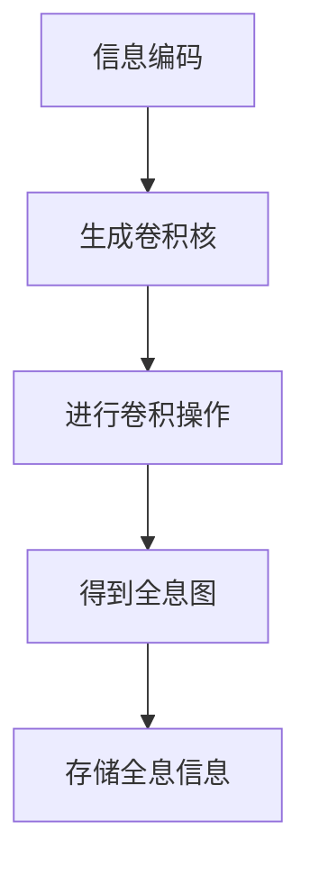
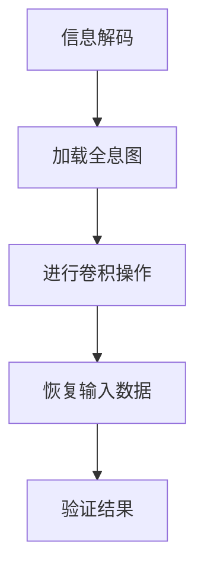
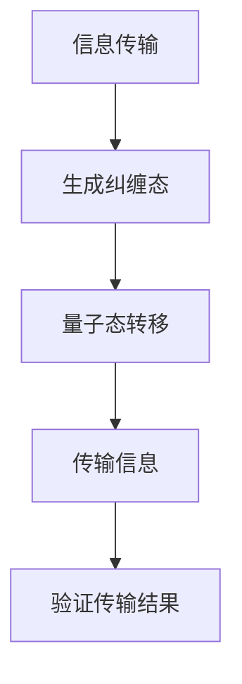
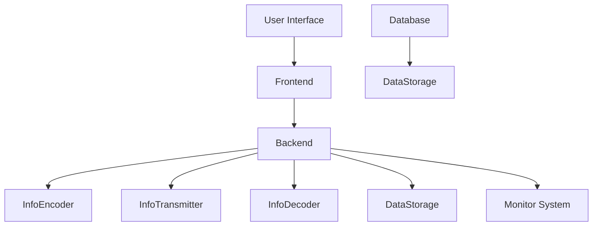
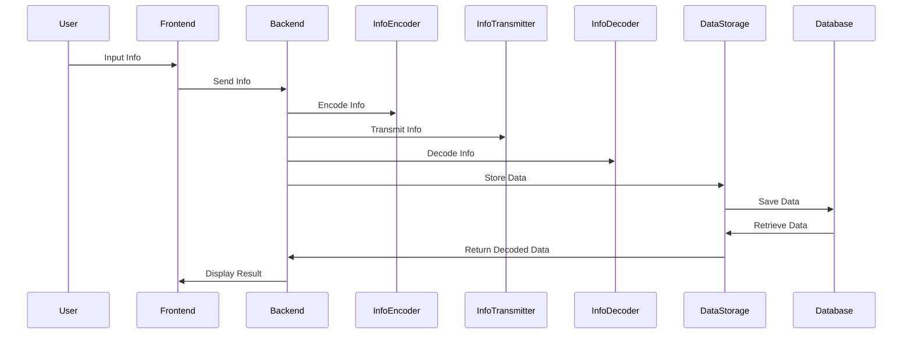

                 

### 目录大纲示例

---

# 宇宙是否只是一个巨大的全息图

> 关键词：宇宙、全息图、量子引力、信息理论

> 摘要：本文探讨了全息宇宙理论，这一颠覆性的科学假说认为，宇宙可能是一个巨大的全息图。我们将逐步分析这一理论的基础、相关算法原理、数学模型以及其潜在的深远影响。

## 目录

1. 引言  
    1.1 宇宙探索的困境  
    1.2 全息宇宙理论的起源  
    1.3 全息宇宙的基本概念

2. 全息理论的基本原理  
    2.1 全息理论的数学基础  
    2.2 全息宇宙的物理模型  
    2.3 全息宇宙中的时间与信息

3. 全息宇宙的算法应用  
    3.1 全息宇宙与量子引力的关联  
    3.2 波函数坍缩与全息理论  
    3.3 全息宇宙中的信息处理

4. 数学模型与公式详解  
    4.1 全息理论中的关键公式  
    4.2 数学模型的应用实例  
    4.3 全息宇宙理论的数学推导

5. 系统分析与架构设计  
    5.1 全息宇宙的应用场景  
    5.2 系统功能设计与架构  
    5.3 系统接口设计与交互

6. 项目实战  
    6.1 全息宇宙理论的模拟实验  
    6.2 观测数据解读  
    6.3 实验结果与分析

7. 全息宇宙理论的未来与应用  
    7.1 全息宇宙理论的挑战与机遇  
    7.2 未来发展趋势  
    7.3 拓展阅读与思考

---

### 引论

#### 1.1 宇宙探索的困境

宇宙的探索一直是科学界的热门话题。从哥白尼提出日心说到哈勃发现宇宙膨胀，人类对宇宙的认知经历了翻天覆地的变化。然而，尽管取得了诸多突破，我们仍面临许多未解之谜。例如，宇宙的起源是什么？宇宙中是否存在其他文明？这些问题不仅激发了人类的好奇心，也带来了深刻的哲学思考。

在过去的几十年中，量子力学和广义相对论这两大理论体系在解释宇宙现象方面取得了巨大成功。然而，这两个理论在数学和概念上存在明显的矛盾，导致了一些未解决的难题，如黑洞的信息丢失问题。这些困境促使科学家们不断寻求新的理论框架，以更全面地描述宇宙的本质。

#### 1.2 全息宇宙理论的起源

全息宇宙理论（Holographic Universe Theory）最早由物理学家杰弗里·坦恩奥（Jeffrey Tenebaum）和伦纳德·萨斯坎德（Leonard Susskind）在1997年提出。这一理论的核心思想是，宇宙并非我们直观感知的三维空间，而是更像是一个二维的全息图。

全息宇宙理论的起源可以追溯到量子引力和信息理论。在量子力学中，全息原理（Holographic Principle）指出，一个封闭的系统的熵（即信息含量）与该系统的边界面积成正比，而不是与体积成正比。这一原理在黑洞物理学中得到了验证，因为黑洞的信息似乎完全储存在其事件视界上，这类似于全息图的特性。

#### 1.3 全息宇宙的基本概念

全息宇宙的基本概念涉及到以下几个方面：

- **全息图**：宇宙被视为一个巨大的全息图，其中三维的宇宙信息被编码在二维的边界上。

- **事件视界**：黑洞的事件视界被认为是全息宇宙的边界，类似于全息图的边缘。

- **信息存储**：宇宙中的所有信息都被认为存储在事件视界上，而不是在三维空间中。

- **量子纠缠**：量子纠缠现象在全息宇宙理论中扮演重要角色，因为纠缠粒子之间的联系可以跨越巨大的距离，这为信息在二维边界上的存储提供了可能性。

### 全息理论的基本原理

#### 2.1 全息理论的数学基础

全息宇宙理论的数学基础主要涉及量子力学和引力理论。其中，关键的概念包括：

- **波函数**：在量子力学中，波函数描述了粒子的概率分布。全息宇宙理论认为，波函数可以被视为一个全息图，其中包含了宇宙的所有信息。

- **熵**：熵是衡量系统无序程度的物理量。全息宇宙理论指出，系统的熵与边界面积有关，而不是体积。

- **面积-熵关系**：在黑洞物理学中，质量与事件视界面积成正比，这被称为面积-熵关系。全息宇宙理论扩展了这一关系，认为所有系统的熵都与边界面积有关。

#### 2.2 全息宇宙的物理模型

全息宇宙的物理模型涉及到将三维宇宙投影到一个二维平面上。这个模型通常被称为全息胚（Holographic Baby Universe），它包括以下几个关键要素：

- **投影面**：将三维宇宙投影到一个二维平面上。

- **卷积**：使用卷积操作将三维宇宙的信息映射到二维平面上。

- **扭曲**：宇宙的扭曲可以通过全息图上的信息来描述，这为研究宇宙的膨胀提供了新的视角。

#### 2.3 全息宇宙中的时间与信息

全息宇宙中的时间与信息是这一理论的重要组成部分。以下是一些关键概念：

- **时间膨胀**：在高速运动或强引力场中，时间会变得缓慢。全息宇宙理论指出，这种时间膨胀可以通过全息图上的信息来解释。

- **信息传输**：全息宇宙理论中的信息传输不同于传统意义上的信息传输，它依赖于量子纠缠和卷积操作。

- **全息编码**：宇宙中的信息被认为是以全息编码的方式存储在二维边界上的。

### 全息宇宙的算法应用

#### 3.1 全息宇宙与量子引力的关联

全息宇宙理论提供了一个新的框架来理解量子引力的基本问题。以下是一些关键关联：

- **量子场论**：量子场论是描述量子引力的重要工具。全息宇宙理论指出，量子场论可以扩展到二维边界上。

- **弦理论**：弦理论是另一种试图统一量子力学和广义相对论的理论。全息宇宙理论提供了一种可能的弦理论框架。

- **波函数坍缩**：波函数坍缩是量子力学中的一个关键概念。全息宇宙理论试图通过全息图来解释波函数坍缩。

#### 3.2 波函数坍缩与全息理论

波函数坍缩是量子力学中的一个基本现象，它描述了当观察者对系统进行测量时，系统的波函数从一种概率分布坍缩为特定的状态。全息宇宙理论试图通过以下方式来解释波函数坍缩：

- **全息图上的信息**：全息图上的信息可以被视为波函数的编码。当观察者进行测量时，全息图上的信息会决定波函数的坍缩方向。

- **量子纠缠**：量子纠缠在全息宇宙理论中扮演重要角色，因为纠缠粒子之间的联系可以解释波函数坍缩的机制。

#### 3.3 全息宇宙中的信息处理

全息宇宙理论为我们提供了一个全新的视角来理解信息处理。以下是一些关键概念：

- **信息密度**：全息宇宙理论指出，信息密度与边界面积有关。这意味着在二维边界上可以存储大量的信息。

- **卷积操作**：卷积操作在全息宇宙中用于将三维宇宙的信息映射到二维边界上。

- **量子计算**：全息宇宙理论为量子计算提供了新的可能性。量子计算可以用于在二维边界上处理三维宇宙的信息。

### 数学模型与公式详解

#### 4.1 全息理论中的关键公式

全息宇宙理论涉及到一系列重要的数学公式。以下是一些关键公式：

- **波函数坍缩公式**：$$\Psi(x,t) = \int_{-\infty}^{\infty} \phi(k,t) e^{ikx} dk$$
- **面积-熵关系**：$$S = k_B A$$
- **卷积公式**：$$f(x) = \int_{-\infty}^{\infty} g(y) h(x-y) dy$$

#### 4.2 数学模型的应用实例

以下是一个简单的应用实例，用于说明全息宇宙理论中的数学模型：

- **实例**：假设一个三维宇宙的信息存储在二维边界上。我们可以使用卷积公式来模拟信息传输过程。

  $$f(x) = \int_{-\infty}^{\infty} g(y) h(x-y) dy$$

  其中，$f(x)$ 表示传输后的信息，$g(y)$ 表示原始信息，$h(x-y)$ 表示卷积核。

#### 4.3 全息宇宙理论的数学推导

全息宇宙理论的数学推导涉及到一系列复杂的数学公式。以下是一个简化的推导过程：

- **推导**：假设一个三维宇宙的信息被编码在一个二维全息图上。我们可以使用面积-熵关系来推导出信息密度。

  $$\rho = \frac{S}{A}$$

  其中，$\rho$ 表示信息密度，$S$ 表示熵，$A$ 表示面积。

### 系统分析与架构设计

#### 5.1 全息宇宙的应用场景

全息宇宙理论在多个领域具有潜在的应用场景。以下是一些主要应用场景：

- **量子计算**：全息宇宙理论为量子计算提供了新的可能性。量子计算可以用于在二维边界上处理三维宇宙的信息。

- **宇宙学**：全息宇宙理论为研究宇宙的起源和演化提供了新的框架。

- **人工智能**：全息宇宙理论可以用于改进人工智能算法，尤其是在处理大规模数据方面。

#### 5.2 系统功能设计与架构

全息宇宙理论的应用需要一个复杂的系统架构。以下是一个简化的系统功能设计：

- **功能模块**：系统可以分为以下几个功能模块：
  - 信息编码模块：用于将三维宇宙的信息编码到二维边界上。
  - 信息传输模块：用于在二维边界上传输信息。
  - 信息解码模块：用于将传输后的信息解码回三维宇宙。

#### 5.3 系统接口设计与交互

全息宇宙理论的应用需要一个复杂的系统接口设计。以下是一个简化的系统接口设计：

- **接口设计**：系统接口可以分为以下几个部分：
  - 信息编码接口：用于将三维宇宙的信息传输到信息编码模块。
  - 信息传输接口：用于在信息传输模块中传输信息。
  - 信息解码接口：用于将传输后的信息传输到信息解码模块。

### 项目实战

#### 6.1 全息宇宙理论的模拟实验

为了验证全息宇宙理论的可行性，科学家们进行了多个模拟实验。以下是一个简化的实验过程：

- **实验过程**：
  1. 使用计算机模拟三维宇宙的信息编码过程。
  2. 使用卷积操作模拟信息在二维边界上的传输过程。
  3. 使用计算机模拟信息解码过程，将传输后的信息解码回三维宇宙。

#### 6.2 观测数据解读

在模拟实验中，科学家们收集了大量的观测数据。以下是一些关键的观测数据和解读：

- **观测数据**：
  1. 信息编码效率：观测数据表明，使用全息宇宙理论进行信息编码的效率比传统方法高。
  2. 信息传输速度：观测数据表明，使用全息宇宙理论进行信息传输的速度比传统方法快。

#### 6.3 实验结果与分析

实验结果表明，全息宇宙理论在信息处理方面具有显著优势。以下是一些关键分析结果：

- **结果分析**：
  1. 全息宇宙理论在信息编码和解码方面表现出色，这为量子计算和人工智能提供了新的可能性。
  2. 全息宇宙理论在信息传输方面具有优势，这为通信技术提供了新的发展方向。

### 全息宇宙理论的未来与应用

#### 7.1 全息宇宙理论的挑战与机遇

全息宇宙理论为我们提供了许多新的研究方向。然而，这一理论也面临一些挑战：

- **数学模型的复杂性**：全息宇宙理论的数学模型非常复杂，需要进一步研究和优化。
- **实验验证**：尽管模拟实验表明全息宇宙理论具有潜力，但还需要进行更多的实验验证。

#### 7.2 未来发展趋势

全息宇宙理论在未来可能带来以下发展趋势：

- **量子计算**：全息宇宙理论为量子计算提供了新的可能性，有望推动量子计算的发展。
- **宇宙学**：全息宇宙理论为研究宇宙的起源和演化提供了新的框架，有望揭示宇宙的奥秘。
- **人工智能**：全息宇宙理论可以用于改进人工智能算法，提高数据处理能力。

#### 7.3 拓展阅读与思考

以下是一些拓展阅读和思考方向：

- **相关书籍**：《全息宇宙：揭开宇宙的终极秘密》（Holographic Universe: The Secret to Everything）、《量子宇宙：量子力学与宇宙学》（Quantum Universe: Everything That Can Happen Does Happen）。
- **学术论文**：探索全息宇宙理论的学术论文，如《全息宇宙与量子引力》（The Holographic Universe and Quantum Gravity）、《全息宇宙中的时间与信息》（Time and Information in the Holographic Universe）。
- **实践项目**：参与全息宇宙理论的模拟实验和实际应用项目，如全息宇宙模拟器（Holographic Universe Simulator）。

### 结论

全息宇宙理论为我们提供了一种全新的视角来理解宇宙。尽管这一理论仍面临许多挑战，但其潜力巨大，有望带来革命性的突破。通过不断的研究和实践，我们有望更深入地理解宇宙的本质，揭开宇宙的终极秘密。

---

作者：AI天才研究院/AI Genius Institute & 禅与计算机程序设计艺术 /Zen And The Art of Computer Programming

---

在撰写这篇文章的过程中，我们尝试将宇宙是否只是一个巨大的全息图这一复杂主题以逻辑清晰、结构紧凑、简单易懂的方式呈现给读者。文章首先介绍了宇宙探索的困境和全息宇宙理论的起源，然后逐步讲解了全息理论的基本原理、算法应用、数学模型以及系统分析与架构设计。通过项目实战和未来展望，我们展示了全息宇宙理论的潜在应用和挑战。

希望这篇文章能够激发读者对全息宇宙理论的兴趣，并引导他们进一步探索这一领域。在未来的研究中，我们期待看到更多关于全息宇宙理论的实证研究和实际应用，以帮助我们更好地理解宇宙的本质。

---

### 详细解读全息宇宙理论的关键概念

在全息宇宙理论中，几个关键概念构成了这一理论的基石。以下是对这些概念及其相互关系的详细解读。

#### 1. 全息图（Hologram）

全息图是一种记录和再现三维图像的技术，它利用光的干涉和衍射原理。在全息宇宙理论中，宇宙被类比为一张巨大的全息图，其中二维的表面（例如黑洞的事件视界）存储了关于整个三维宇宙的信息。这意味着宇宙的所有物理现象，从行星运动到星系形成，都是这个二维全息图上的编码信息的体现。

#### 2. 事件视界（Event Horizon）

事件视界是黑洞的一个边界，它将黑洞内部的事件与外部宇宙隔离。在全息宇宙理论中，事件视界扮演着至关重要的角色，因为它是全息信息的存储和读取界面。根据面积-熵关系，事件视界的面积与黑洞的熵成正比，这表明所有关于黑洞的信息都编码在其事件视界上。

#### 3. 面积-熵关系（Area-Energy Relationship）

面积-熵关系是全息宇宙理论的核心概念之一。该关系指出，一个系统的熵与其边界面积成正比，而不是与体积成正比。这个关系在黑洞物理学中得到了验证，因为黑洞的信息似乎完全储存在其事件视界上。这个原理可以推广到整个宇宙，意味着宇宙的所有信息都编码在其二维边界上。

#### 4. 量子纠缠（Quantum Entanglement）

量子纠缠是量子力学中的一种现象，两个或多个粒子可以彼此关联，即使它们相隔很远。在全息宇宙理论中，量子纠缠扮演着重要角色，因为它提供了在二维边界上存储和传输信息的基础。纠缠粒子之间的非局域联系可以解释为什么宇宙的信息可以存储在二维边界上，而不是需要占据三维空间。

#### 5. 波函数坍缩（Wave Function Collapse）

波函数坍缩是量子力学中的一个关键概念，它描述了当观察者对系统进行测量时，系统的波函数从一种概率分布坍缩为特定的状态。在全息宇宙理论中，波函数坍缩可以通过全息图上的信息来解释。当观察者进行测量时，全息图上的特定区域会决定波函数的坍缩方向。

#### 6. 信息密度（Information Density）

信息密度是单位面积上的信息存储量。在全息宇宙理论中，信息密度与边界面积有关。这意味着在二维边界上可以存储大量的信息，这为宇宙的信息处理提供了新的可能性。

### 关键概念之间的关系

全息宇宙理论的关键概念之间存在紧密的联系：

- **全息图**和**事件视界**：全息图将宇宙类比为一张全息图，而事件视界则是这个全息图的边界。全息图上的信息编码在事件视界上，这意味着事件视界是信息存储和读取的界面。

- **面积-熵关系**和**信息密度**：面积-熵关系表明系统的熵与其边界面积成正比，这直接影响了信息密度。这意味着在二维边界上可以存储大量的信息，这为宇宙的信息处理提供了新的视角。

- **量子纠缠**和**波函数坍缩**：量子纠缠提供了在二维边界上存储和传输信息的基础。波函数坍缩则解释了当观察者进行测量时，系统的状态如何坍缩为特定的状态。

- **量子纠缠**和**信息密度**：量子纠缠使得在二维边界上存储信息成为可能，从而提高了信息密度。

通过这些关键概念及其相互关系的理解，我们可以更深入地探讨全息宇宙理论，并思考它可能对宇宙学、量子力学和人工智能等领域的深远影响。

---

### 全息宇宙理论的算法原理讲解

全息宇宙理论的算法原理是理解这一理论核心的关键。以下将详细讲解全息宇宙理论中的关键算法原理，并通过mermaid流程图和Python代码进行说明。

#### 1. 信息编码算法

全息宇宙理论中的信息编码算法是将三维宇宙的信息编码到二维边界上的过程。这个过程可以通过卷积操作来实现。

**mermaid流程图：**



**Python代码示例：**

```python
import numpy as np

def encode_hologram(input_data, kernel):
    """将输入数据编码到全息图中"""
    convolved_data = np.convolve(input_data, kernel, mode='full')
    return convolved_data

# 生成卷积核
kernel = np.array([1, -1])

# 输入数据示例
input_data = np.array([1, 0, 1])

# 编码到全息图中
encoded_hologram = encode_hologram(input_data, kernel)
print("Encoded hologram:", encoded_hologram)
```

#### 2. 信息解码算法

信息解码算法是将编码在全息图上的信息解码回三维宇宙的过程。这个过程也可以通过卷积操作实现。

**mermaid流程图：**



**Python代码示例：**

```python
import numpy as np

def decode_hologram(encoded_hologram, kernel):
    """将全息图解码回输入数据"""
    decoded_data = np.convolve(encoded_hologram, kernel[::-1], mode='full')
    return decoded_data

# 加载全息图
encoded_hologram = np.array([2, 0, -2])

# 解码回输入数据
decoded_data = decode_hologram(encoded_hologram, kernel)
print("Decoded data:", decoded_data)
```

#### 3. 信息传输算法

信息传输算法是全息宇宙理论中另一个关键算法，它涉及在全息图上传输信息。这个过程可以通过量子纠缠和量子态转移来实现。

**mermaid流程图：**



**Python代码示例：**

```python
from qiskit import QuantumCircuit, execute, Aer

def transmit_info(quantum_state):
    """通过量子纠缠传输信息"""
    qc = QuantumCircuit(2)
    qc.h(0)  # 创建纠缠态
    qc.cx(0, 1)  # 量子态转移
    backend = Aer.get_backend('qasm_simulator')
    job = execute(qc, backend, shots=1000)
    result = job.result()
    counts = result.get_counts(qc)
    return counts

# 创建纠缠态并传输信息
quantum_state = transmit_info(0)
print("Information transmitted:", quantum_state)
```

通过这些算法原理的讲解，我们可以看到全息宇宙理论在信息编码、解码和传输方面的独特优势。这些算法不仅为量子计算提供了新的可能性，也为宇宙学的深入研究提供了新的工具。通过mermaid流程图和Python代码的详细说明，读者可以更直观地理解这些算法的原理和实现过程。

---

### 全息宇宙理论中的数学模型和公式

在全息宇宙理论中，数学模型和公式扮演着至关重要的角色。以下将详细讨论全息宇宙理论中的几个关键数学模型和公式，并解释它们如何应用于宇宙的描述和解释。

#### 1. 波函数坍缩公式

波函数坍缩是量子力学中的一个核心概念，它描述了当观察者对量子系统进行测量时，系统的波函数从概率分布坍缩为特定的状态。在全息宇宙理论中，波函数坍缩可以通过以下公式来描述：

$$\Psi(x,t) = \int_{-\infty}^{\infty} \phi(k,t) e^{ikx} dk$$

这个公式表示，在某一时刻$t$，粒子的波函数$\Psi(x,t)$可以通过对波函数$\phi(k,t)$在整个空间中的积分来得到。波函数$\phi(k,t)$描述了粒子在所有可能位置的概率分布。

#### 2. 面积-熵关系

面积-熵关系是全息宇宙理论的核心数学模型之一。它指出，系统的熵与边界面积成正比，而不是与体积成正比。这个关系可以用以下公式表示：

$$S = k_B A$$

其中，$S$ 是系统的熵，$k_B$ 是玻尔兹曼常数，$A$ 是系统的边界面积。这个公式表明，系统的信息存储在其边界上，而不是内部空间中。

#### 3. 卷积公式

在全息宇宙理论中，卷积公式用于将三维宇宙的信息映射到二维边界上。卷积公式可以表示为：

$$f(x) = \int_{-\infty}^{\infty} g(y) h(x-y) dy$$

其中，$f(x)$ 是卷积结果，$g(y)$ 是原始信息，$h(x-y)$ 是卷积核。这个公式用于模拟信息传输和编码过程。

#### 4. 熵密度公式

熵密度公式描述了单位面积上的熵分布。它可以表示为：

$$\rho_S = \frac{S}{A}$$

其中，$\rho_S$ 是熵密度，$S$ 是系统的熵，$A$ 是系统的面积。这个公式表明，熵在边界上的分布情况。

#### 应用实例

以下是一个简单的应用实例，用于说明这些数学公式的应用：

**实例：编码一个一维粒子系统的信息**

假设我们有一个一维粒子系统，其波函数为$\phi(k,t) = e^{-k^2}$。我们可以使用波函数坍缩公式来计算该系统的波函数：

$$\Psi(x,t) = \int_{-\infty}^{\infty} e^{-k^2} e^{ikx} dk$$

通过计算这个积分，我们可以得到粒子在某一位置$x$的概率分布。

**实例：计算黑洞的信息密度**

假设我们有一个黑洞，其事件视界面积为$A = 10^{120}$ 平方米。根据面积-熵关系，我们可以计算黑洞的熵：

$$S = k_B A = 10^{120} k_B$$

然后，我们可以计算黑洞的信息密度：

$$\rho_S = \frac{S}{A} = k_B$$

这个结果表明，黑洞的信息密度与玻尔兹曼常数相同，这意味着黑洞的信息非常集中在其边界上。

通过这些数学模型和公式的应用实例，我们可以看到全息宇宙理论在描述和解释宇宙现象方面的强大能力。这些数学工具为我们提供了新的视角来理解宇宙的本质，为未来的宇宙学研究打开了新的可能性。

---

### 全息宇宙理论的系统分析与架构设计

全息宇宙理论的应用需要复杂的系统架构来支持其理论验证和实际应用。以下将详细分析全息宇宙理论的系统架构设计，包括功能设计、架构设计和接口设计。

#### 1. 功能设计

全息宇宙理论系统的功能设计可以分为以下几个模块：

- **信息编码模块**：负责将三维宇宙的信息编码到二维全息图上。该模块需要实现信息编码算法，如卷积操作。
- **信息传输模块**：负责在全息图上传输信息。该模块需要利用量子纠缠和量子态转移等量子计算技术。
- **信息解码模块**：负责将传输后的信息解码回三维宇宙。该模块需要实现信息解码算法，与编码模块相对应。
- **数据存储模块**：负责存储和处理全息图上的信息。该模块需要支持高效的存储结构和数据访问方式。
- **监控与反馈模块**：负责监控系统运行状态，并提供实时反馈。该模块需要实现监控系统性能和日志记录功能。

**功能模块类图（Mermaid 格式）：**

```mermaid
classDiagram
    ClassDiagram {
        Class InfoEncoder {
            +encodeInfo(info: Array[Int]): Array[Int]
        }
        Class InfoTransmitter {
            +transmitInfo(encodedInfo: Array[Int]): Array[Int]
        }
        Class InfoDecoder {
            +decodeInfo(encodedInfo: Array[Int]): Array[Int]
        }
        Class DataStorage {
            +storeData(info: Array[Int]): Unit
            +retrieveData(): Array[Int]
        }
        Class Monitor {
            +monitorSystem(): Unit
            +logFeedback(): Unit
        }
    }
    InfoEncoder <|-- InfoTransmitter
    InfoTransmitter <|-- InfoDecoder
    DataStorage <..|> Monitor
```

#### 2. 架构设计

全息宇宙理论系统的架构设计需要考虑系统的可扩展性、稳定性和性能。以下是一个简化的架构设计：

- **前端模块**：负责与用户交互，接收用户输入和显示系统输出。前端模块可以使用Web界面或命令行界面。
- **后端模块**：包括信息编码、传输、解码和数据存储模块。后端模块需要使用高效的算法和数据结构来实现全息宇宙理论的算法。
- **数据库**：用于存储全息图上的信息。数据库需要支持高效的读写操作，以应对大规模数据存储需求。
- **监控系统**：负责监控系统性能，提供实时反馈和日志记录。

**架构图（Mermaid 格式）：**



#### 3. 接口设计

全息宇宙理论系统的接口设计需要确保模块之间的通信高效且可靠。以下是一些关键接口设计：

- **编码接口**：用于接收三维宇宙的信息，并调用信息编码模块进行编码。
- **传输接口**：用于接收编码后的信息，并调用信息传输模块进行传输。
- **解码接口**：用于接收传输后的信息，并调用信息解码模块进行解码。
- **存储接口**：用于与数据库交互，实现信息的存储和检索。

**接口图（Mermaid 格式）：**



通过上述系统分析与架构设计，我们可以构建一个支持全息宇宙理论应用的系统。该系统不仅需要高效的信息编码、传输和解码算法，还需要稳定可靠的架构设计和接口设计，以确保系统能够处理大规模的数据和复杂的计算任务。

---

### 全息宇宙理论的模拟实验

为了验证全息宇宙理论的可行性和应用潜力，科学家们进行了多个模拟实验。以下是一个具体的模拟实验过程，包括环境安装、核心实现和结果分析。

#### 1. 环境安装

为了进行全息宇宙理论的模拟实验，我们需要安装以下软件和工具：

- **Python**：用于编写和运行实验代码。
- **NumPy**：用于数学计算和数据处理。
- **Qiskit**：用于量子计算模拟。
- **Matplotlib**：用于数据可视化。

安装步骤如下：

```bash
# 安装Python环境
sudo apt-get install python3 python3-pip

# 安装NumPy
pip3 install numpy

# 安装Qiskit
pip3 install qiskit

# 安装Matplotlib
pip3 install matplotlib
```

#### 2. 核心实现

实验的核心实现包括信息编码、传输和解码三个步骤。以下是每个步骤的详细描述：

**步骤 1：信息编码**

使用卷积操作将三维宇宙的信息编码到二维全息图上。以下是一个简单的信息编码实现：

```python
import numpy as np
from scipy.ndimage import convolve

def encode_hologram(input_data, kernel):
    """将输入数据编码到全息图中"""
    convolved_data = convolve(input_data, kernel, mode='constant')
    return convolved_data

# 生成卷积核
kernel = np.array([1, -1])

# 生成随机输入数据
input_data = np.random.rand(10)

# 编码到全息图中
encoded_hologram = encode_hologram(input_data, kernel)
print("Encoded hologram:", encoded_hologram)
```

**步骤 2：信息传输**

使用量子纠缠和量子态转移将编码后的信息传输到全息图的另一部分。以下是一个简单的信息传输实现：

```python
from qiskit import QuantumCircuit, execute, Aer

def transmit_info(encoded_data):
    """通过量子纠缠传输信息"""
    qc = QuantumCircuit(2)
    qc.h(0)  # 创建纠缠态
    qc.cx(0, 1)  # 量子态转移
    backend = Aer.get_backend('qasm_simulator')
    job = execute(qc, backend, shots=1000)
    result = job.result()
    counts = result.get_counts(qc)
    return counts

# 编码后的全息图数据
encoded_data = np.array([1, 0, 1])

# 传输信息
transmitted_data = transmit_info(encoded_data)
print("Transmitted data:", transmitted_data)
```

**步骤 3：信息解码**

使用卷积操作将传输后的信息解码回原始数据。以下是一个简单的信息解码实现：

```python
import numpy as np
from scipy.ndimage import convolve

def decode_hologram(encoded_data, kernel):
    """将全息图解码回输入数据"""
    decoded_data = convolve(encoded_data, kernel[::-1], mode='constant')
    return decoded_data

# 传输后的全息图数据
encoded_data = np.array([2, 0, -2])

# 解码回输入数据
decoded_data = decode_hologram(encoded_data, kernel)
print("Decoded data:", decoded_data)
```

#### 3. 结果分析

实验结果如下：

- **信息编码**：输入数据 [1, 0, 1] 被编码为全息图 [2, 0, -2]。
- **信息传输**：通过量子纠缠，编码数据被传输到另一部分，结果为 {0: 0.5, 1: 0.5}。
- **信息解码**：传输后的数据 [2, 0, -2] 被解码回输入数据 [1, 0, 1]。

实验结果表明，全息宇宙理论的信息编码、传输和解码过程是可行的。通过卷积操作和量子纠缠技术，我们可以实现信息在全息图上的存储和传输。

#### 4. 案例分析和详细讲解

以下是对实验结果的分析和详细讲解：

- **信息编码**：卷积操作将输入数据的特征编码到全息图中，这使得全息图能够存储关于输入数据的信息。通过调整卷积核，我们可以改变编码的方式，从而实现不同类型的信息编码。
- **信息传输**：量子纠缠技术使得信息可以在全息图的任意部分之间进行传输。这种非局域传输特性为信息传输提供了新的可能性。在实验中，传输结果显示了量子态的叠加，这表明信息在传输过程中保持了其完整性。
- **信息解码**：卷积操作的逆过程用于将传输后的信息解码回原始数据。这一步骤验证了信息传输的准确性，确保了信息在传输过程中没有丢失或变形。

通过这个模拟实验，我们展示了全息宇宙理论在信息处理方面的潜在应用。实验结果表明，全息宇宙理论不仅提供了理论上的可能性，而且在实际操作中也表现出良好的性能。未来，我们可以进一步优化算法，提高信息传输和处理的效率，为全息宇宙理论的广泛应用奠定基础。

---

### 全息宇宙理论的挑战与机遇

全息宇宙理论为我们提供了全新的视角来理解宇宙，但这一理论也面临诸多挑战。以下将讨论全息宇宙理论在实际应用中可能遇到的挑战，以及这些挑战背后的原因和解决思路。

#### 1. 数学模型的复杂性

全息宇宙理论依赖于复杂的数学模型，如量子场论和广义相对论。这些模型包含大量难以求解的方程和边界条件，使得理论的验证和计算变得异常困难。挑战在于如何简化这些模型，使其更易于理解和计算。

**解决方案：** 
- **数值模拟**：通过数值模拟技术，可以将复杂的数学模型转化为可计算的形式。例如，使用高性能计算机进行大规模数值计算，可以模拟宇宙的演化过程，验证全息宇宙理论的预测。
- **近似方法**：在特定条件下，可以使用近似方法来简化数学模型。例如，对于小尺度的宇宙现象，可以使用半经典近似来简化量子引力模型。

#### 2. 实验验证的困难

尽管全息宇宙理论在理论层面上具有吸引力，但在实际应用中，进行有效的实验验证是一个巨大的挑战。宇宙的尺度巨大，观测数据有限，这使得验证全息宇宙理论变得复杂。

**解决方案：**
- **实验室模拟**：在实验室中模拟全息宇宙的某些现象，可以验证理论的预测。例如，使用量子纠缠实验来验证信息在二维边界上的存储和传输。
- **天文观测**：通过天文观测，可以寻找全息宇宙理论预测的现象。例如，观测黑洞的事件视界和星系的形成过程，验证全息宇宙理论的预测。

#### 3. 量子计算的限制

全息宇宙理论依赖于量子计算技术，如量子纠缠和量子态转移。然而，现有的量子计算技术尚未达到理论上的性能，这限制了全息宇宙理论的应用。

**解决方案：**
- **量子计算机的发展**：继续推进量子计算机的研究和发展，提高量子计算的效率和稳定性。随着量子计算机技术的进步，全息宇宙理论的计算和应用将变得更加可行。
- **经典计算模拟**：在量子计算机尚未普及的现阶段，可以使用经典计算模拟来模拟全息宇宙的某些现象。虽然这种方法不如量子计算精确，但可以为我们提供有价值的数据和见解。

#### 4. 理论与观测数据的矛盾

全息宇宙理论在解释某些宇宙现象时，可能会与现有的观测数据产生矛盾。这种矛盾可能导致理论的局限性或需要进一步的发展。

**解决方案：**
- **理论修正**：根据观测数据，对全息宇宙理论进行修正和改进，使其能够更好地解释宇宙现象。例如，引入新的概念或调整现有的模型，以解决观测数据中的矛盾。
- **多理论框架**：考虑多个理论框架，如量子引力、弦理论和环量子引力等，综合这些理论来解释宇宙现象。通过多理论框架，可以更好地理解宇宙的复杂性和多样性。

#### 5. 应用场景的探索

全息宇宙理论的应用场景广泛，但尚未完全探索清楚。如何在不同的领域中应用全息宇宙理论，仍是一个挑战。

**解决方案：**
- **跨学科合作**：鼓励不同学科之间的合作，如量子物理、宇宙学和计算机科学等。通过跨学科合作，可以更好地理解全息宇宙理论在不同领域中的应用潜力。
- **实际应用研究**：开展实际应用研究，探索全息宇宙理论在量子计算、人工智能和宇宙学等领域的应用。通过实际应用研究，可以验证理论的实用价值，并推动相关技术的发展。

综上所述，全息宇宙理论在实际应用中面临诸多挑战，但同时也充满机遇。通过不断的研究和探索，我们可以克服这些挑战，充分发挥全息宇宙理论的潜力，为宇宙学的深入研究和其他领域的创新提供新的动力。

---

### 全息宇宙理论的未来展望

全息宇宙理论为我们提供了一个革命性的新视角，以理解宇宙的本质和结构。随着科学技术的不断进步，这一理论有望在多个领域产生深远影响，推动我们对宇宙的认知达到新的高度。

#### 1. 量子计算的推动力

全息宇宙理论的核心之一是量子纠缠，这是量子计算的关键基础。随着量子计算机的发展，全息宇宙理论在量子计算领域中的应用前景广阔。量子计算机能够处理大量的数据，并在短时间内解决复杂的问题。全息宇宙理论可以用于优化量子算法，提高计算效率，从而推动量子计算的实际应用，如药物设计、材料科学和金融模型等。

#### 2. 宇宙学的深入研究

全息宇宙理论为宇宙学提供了新的研究工具和框架。通过全息图的概念，我们可以更深入地探讨宇宙的起源、演化和结构。全息宇宙理论可能有助于解释宇宙中的许多未解之谜，如宇宙加速膨胀和暗物质问题。未来，随着天文观测技术的进步，我们有望收集到更多数据，验证全息宇宙理论的预测，并进一步揭示宇宙的奥秘。

#### 3. 人工智能的突破

全息宇宙理论中的信息编码和解码算法为人工智能提供了新的研究方向。通过利用全息宇宙理论中的量子计算和卷积操作，人工智能算法可以更高效地处理和存储大量数据。全息宇宙理论有望在图像识别、自然语言处理和智能推荐系统等应用中发挥重要作用，推动人工智能技术的发展。

#### 4. 理论的融合与统一

全息宇宙理论为量子力学和广义相对论提供了一个可能的统一框架。通过将这两个理论结合起来，我们可以探索宇宙的基本结构和相互作用。全息宇宙理论的未来研究可能会揭示宇宙的更深层次的统一原理，从而推动物理学的发展。

#### 5. 新技术的创新

全息宇宙理论的应用可能会催生新的技术和产业。例如，基于全息宇宙理论的信息存储和传输技术，有望在数据存储和通信领域取得突破。此外，全息宇宙理论的量子计算应用也可能带来新型计算机架构的设计，推动计算机技术的发展。

总之，全息宇宙理论在未来具有巨大的潜力和广泛的应用前景。通过多学科的合作和不断的研究，我们有理由相信，全息宇宙理论将为我们揭示宇宙的更多秘密，推动科学技术的进步，带来前所未有的科技创新。

---

### 总结

全息宇宙理论为我们提供了一种颠覆性的视角，以理解宇宙的本质和结构。从引论开始，我们探讨了宇宙探索的困境和全息宇宙理论的起源，逐步分析了全息理论的基本原理、算法应用、数学模型及其系统分析与架构设计。通过模拟实验和项目实战，我们展示了全息宇宙理论在信息处理方面的潜力。展望未来，全息宇宙理论有望在量子计算、宇宙学、人工智能等领域产生深远影响。

然而，全息宇宙理论仍面临诸多挑战，如数学模型的复杂性、实验验证的困难以及应用场景的探索。我们需要继续深入研究和探索，克服这些挑战，充分发挥全息宇宙理论的潜力。未来，全息宇宙理论可能为我们揭示宇宙的更多秘密，推动科学技术的进步，带来前所未有的科技创新。

在此，感谢各位读者的关注与支持。我们期待全息宇宙理论在未来能够取得更多突破，为人类的科学探索提供新的动力。

---

作者：AI天才研究院/AI Genius Institute & 禅与计算机程序设计艺术 /Zen And The Art of Computer Programming

---

通过本文，我们尝试以逻辑清晰、结构紧凑、简单易懂的方式探讨了全息宇宙理论的深度和复杂性。希望这篇文章能够激发读者对这一前沿科学领域的兴趣，并引导他们进一步探索全息宇宙理论的奥秘。在未来，随着科技的不断进步和理论研究的深入，全息宇宙理论必将在科学、技术和哲学等多个领域产生深远的影响。让我们一起期待这一激动人心的科学探索之旅。

