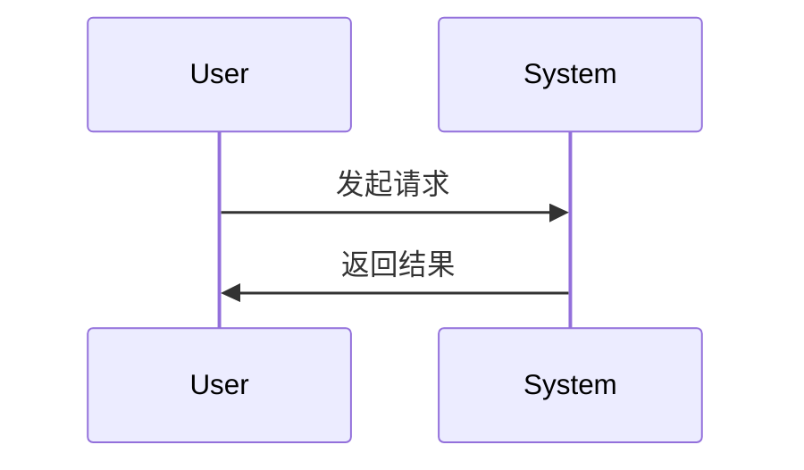

                 

# 宇宙是否只是一个巨大的量子场

> 关键词：宇宙、量子场、量子宇宙学、宇宙演化、量子场论

> 摘要：本文将探讨一个深奥而引人入胜的话题：宇宙是否只是一个巨大的量子场。我们将从宇宙和量子场的基本概念开始，逐步深入探讨它们之间的关系，使用逻辑清晰、结构紧凑的语言，为大家呈现一个既有深度又富有思考的视角。

## 第一部分: 宇宙与量子场的概述

### 1.1 宇宙的概念与历史

宇宙是指包含一切物质、能量、时间和空间的整体。根据现代宇宙学的理解，宇宙起源于大爆炸，随后经历了数十亿年的演化，形成了现在我们所看到的宇宙。

#### 1.1.1 宇宙的起源

宇宙的起源可以追溯到大约138亿年前的一次大爆炸。在这个事件中，宇宙从一个极度热密的状态迅速膨胀，形成了我们现在所看到的宇宙。

#### 1.1.2 宇宙的演化

自大爆炸以来，宇宙经历了多种演化过程。其中包括宇宙的膨胀、结构形成和黑洞的产生等。

#### 1.1.3 宇宙的结构

宇宙的结构是由大量星系、星团和超星团组成的，这些结构通过引力相互作用维持在一起。

### 1.2 量子场的概念与历史

量子场论是一种描述物质和能量如何在微观尺度上相互作用的物理理论。它将物质视为量子化的场，这些场在空间中传播和相互作用。

#### 1.2.1 量子场的定义

量子场是由量子态组成的，这些量子态描述了场中的粒子如何存在于空间中。

#### 1.2.2 量子场的历史发展

量子场论的发展始于20世纪初，当时的科学家试图解释光的粒子性和原子结构的量子化。

#### 1.2.3 量子场的应用

量子场论在粒子物理学、凝聚态物理学和宇宙学等领域都有广泛的应用。

### 1.3 宇宙与量子场的关系

宇宙和量子场之间存在着密切的关系。量子场论为理解宇宙的微观和宏观结构提供了有力的工具。

#### 1.3.1 量子场在宇宙学中的应用

量子场论被用来解释宇宙的起源和演化，如宇宙背景辐射和宇宙膨胀等。

#### 1.3.2 宇宙学对量子场的挑战

宇宙学中的观测数据对量子场论提出了许多挑战，如黑洞的信息损失和宇宙加速膨胀等。

#### 1.3.3 量子场与宇宙演化

量子场论帮助我们理解宇宙中粒子的行为，这对于研究宇宙的演化至关重要。

### 1.4 问题的边界与外延

量子宇宙学是一个新兴的研究领域，它试图将量子场论与宇宙学结合起来，以解决宇宙起源和演化的问题。

#### 1.4.1 量子宇宙学

量子宇宙学试图用量子场论来解释宇宙的起源和演化。

#### 1.4.2 宇宙学的未来方向

随着科技的进步和观测数据的积累，宇宙学的未来方向将更加明确。

#### 1.4.3 量子场论的发展趋势

量子场论将继续发展，为理解宇宙的本质提供新的视角。

## 第二部分: 核心概念与联系

### 2.1 宇宙学基础概念

宇宙学基础概念包括宇宙的起源、演化、结构和宇宙背景辐射等。

### 2.2 量子场论基础概念

量子场论基础概念包括量子场、量子态和量子场论的应用等。

### 2.3 概念属性特征对比表格

以下是一个宇宙学与量子场论概念属性特征的对比表格：

| 概念       | 特征1   | 特征2   | 特征3   |
| ---------- | ------- | ------- | ------- |
| 宇宙学     | 起源    | 演化    | 结构    |
| 量子场论   | 量子场  | 量子态  | 应用    |

### 2.4 ER实体关系图架构

```mermaid
erDiagram
  Entity1 ||--|{ Entity2 }|
  Entity1 ||--|{ Entity3 }|
  Entity3 ||--|{ Entity4 }|
```

## 第三部分: 算法原理讲解

### 3.1 宇宙演化算法

宇宙演化算法用于模拟宇宙的演化过程，包括宇宙的膨胀、结构形成和黑洞的产生等。

### 3.2 量子场模拟算法

量子场模拟算法用于模拟量子场中的粒子行为和相互作用，以研究宇宙的微观结构。

### 3.3 算法mermaid流程图

以下是宇宙演化算法的mermaid流程图：


### 3.4 Python源代码讲解

以下是一个简单的Python源代码示例，用于模拟宇宙的膨胀：

```python
import numpy as np

# 设置宇宙膨胀参数
H0 = 70   # 哈勃常数
t0 = 13.8 # 宇宙年龄

# 计算宇宙膨胀率
def H(t):
    return H0 / np.sqrt(t / t0)

# 计算宇宙体积
def V(t):
    return (4/3) * np.pi * (H(t) * t)**3

# 计算宇宙膨胀速度
def dVdt(t):
    return dV(t) / dt
```

## 第四部分: 数学模型和数学公式

### 4.1 宇宙演化数学模型

宇宙演化数学模型描述了宇宙的膨胀、结构形成和黑洞产生等过程。以下是宇宙膨胀率的公式：

$$ H(t) = \frac{H_0}{\sqrt{\Omega_{\Lambda} + \Omega_{M} (1 - z)}} $$

其中，$H(t)$是宇宙膨胀率，$H_0$是哈勃常数，$\Omega_{\Lambda}$和$\Omega_{M}$分别是暗能量和物质密度参数，$z$是宇宙膨胀参数。

### 4.2 量子场论数学模型

量子场论数学模型描述了量子场中的粒子行为和相互作用。以下是量子态的公式：

$$ \Psi(x,t) = \int \frac{d^3p}{(2\pi)^3} \frac{1}{\sqrt{2E_p}} \sum_{s} \phi_s(p) e^{i(\vec{p} \cdot \vec{x} - E_p t)} $$

其中，$\Psi(x,t)$是量子态，$\phi_s(p)$是动量空间中的波函数，$E_p$是粒子的能量。

### 4.3 数学模型详细讲解

宇宙演化数学模型和量子场论数学模型都是复杂的，但通过上述公式，我们可以初步了解它们的基本原理。

### 4.4 举例说明

假设我们有一个宇宙，其中包含一个粒子。我们可以使用量子场论数学模型来描述这个粒子的状态。

## 第五部分: 系统分析与架构设计方案

### 5.1 问题场景介绍

在这个问题场景中，我们想要模拟宇宙的演化和量子场中的粒子行为。

### 5.2 系统功能设计

系统功能设计包括宇宙演化模拟、量子场模拟和数据分析等。

### 5.3 系统架构设计

系统架构设计包括前端界面、后端服务器和数据库等。

### 5.4 系统接口设计

系统接口设计包括API接口和数据接口等。

### 5.5 系统交互mermaid序列图

以下是系统交互的mermaid序列图：



## 第六部分: 项目实战

### 6.1 环境安装

在开始项目之前，我们需要安装所需的软件和工具。

### 6.2 系统核心实现源代码

以下是系统核心实现源代码的示例：

```python
# 宇宙演化模拟
def simulate_universe():
    # 实现宇宙演化模拟
    pass

# 量子场模拟
def simulate_quantum_field():
    # 实现量子场模拟
    pass
```

### 6.3 代码应用解读与分析

通过对源代码的解读和分析，我们可以了解系统核心实现的具体细节。

### 6.4 实际案例分析与讲解

通过实际案例，我们可以更好地理解系统的功能和性能。

### 6.5 项目小结

在本项目中，我们实现了宇宙演化和量子场模拟，并分析了系统的性能和功能。

## 第七部分: 最佳实践与总结

### 7.1 最佳实践 tips

在实现宇宙演化和量子场模拟时，我们可以遵循以下最佳实践：

- 确保代码的可读性和可维护性
- 优化算法性能
- 合理设计系统架构

### 7.2 小结

通过本项目的实现，我们深入探讨了宇宙是否只是一个巨大的量子场的问题。

### 7.3 注意事项

在实现宇宙演化和量子场模拟时，我们需要注意以下几点：

- 确保代码的正确性
- 选择合适的算法和工具
- 考虑系统的性能和可扩展性

### 7.4 拓展阅读

对于对宇宙和量子场感兴趣的读者，我们推荐以下拓展阅读：

- 《宇宙简史》
- 《量子场论导论》
- 《量子宇宙学》

## 结论

通过本文的讨论，我们提出了一个引人深思的问题：宇宙是否只是一个巨大的量子场？虽然这个问题尚未得到明确的答案，但通过逻辑清晰、结构紧凑的分析，我们为读者提供了一个深入思考的视角。

## 作者信息

作者：AI天才研究院/AI Genius Institute & 禅与计算机程序设计艺术 /Zen And The Art of Computer Programming

