                 

### 《宇宙是否是一个巨大的意识场》

**关键词**：宇宙、意识场、科学理论、哲学思考

**摘要**：
本文探讨了宇宙是否可能是一个巨大的意识场这一前沿科学问题。通过逐步分析宇宙的起源、结构和运动规律，以及意识场的基本概念，我们将探索这一假设的可行性。文章将结合实验和观测数据，哲学与宗教视角，以及最新的科学研究成果，对宇宙是否是一个巨大的意识场这一命题进行深入探讨。

----------------------------------------------------------------

#### 引言

宇宙，一个古老而又充满神秘的话题。自古以来，人类就对宇宙充满了好奇和探索的欲望。从古希腊哲学家到现代科学家，宇宙的奥秘一直是人类知识探索的重要领域。近年来，随着科学技术的飞速发展，我们对宇宙的认识逐渐深入，但仍有许多未解之谜等待我们去揭开。

在宇宙学的研究中，一个令人着迷的假设是：宇宙可能是一个巨大的意识场。这一假设不仅挑战了传统的物理学观念，还涉及到哲学、心理学和意识研究的领域。尽管这一假设尚未得到广泛接受，但它在科学界和哲学界引起了激烈的讨论。

本书旨在探讨宇宙是否是一个巨大的意识场这一假设。我们将从宇宙的起源、结构、运动规律以及意识场的基本概念出发，逐步分析这一假设的可行性。文章将结合实验和观测数据，哲学与宗教视角，以及最新的科学研究成果，对这一假设进行深入探讨。

#### 核心概念与联系

##### 宇宙意识场的定义

宇宙意识场，是指宇宙中存在的、能够影响和塑造物质世界的精神力量或能量场。这一概念起源于量子物理学和意识研究，试图解释宇宙中一些看似无法用传统物理定律解释的现象。

宇宙意识场与意识的关系

宇宙意识场与意识之间存在密切的联系。从心理学和意识研究的角度来看，意识是一种主观体验，它包括感觉、思维、情感和意愿等。而宇宙意识场则可能是一种更高级的意识形式，它不仅存在于人类意识中，还可能存在于宇宙中的其他生命形式中。

宇宙意识场与其他科学领域的联系

宇宙意识场不仅与心理学和哲学有关，还与其他科学领域有着广泛的联系。例如，它与量子物理学中的量子纠缠现象密切相关。量子纠缠是一种超越经典物理学的现象，它表明在微观尺度上，物质之间存在一种超距作用。这种超距作用可能正是宇宙意识场的一种表现形式。

此外，宇宙意识场还与天文学、生物学、物理学等多个领域有着联系。例如，在生物学中，宇宙意识场可能影响生物进化和生命活动；在物理学中，宇宙意识场可能解释一些经典物理理论无法解释的现象。

##### 核心概念对比表格

| 核心概念 | 定义 | 特征 | 相关领域 |
| :------: | :--: | :--: | :------: |
| 宇宙意识场 | 宇宙中存在的意识场 | 影响和塑造物质世界的精神力量 | 量子物理学、心理学、哲学 |
| 意识 | 主观体验，包括感觉、思维、情感和意愿 | 个体心理活动的总和 | 心理学、神经科学、哲学 |
| 量子纠缠 | 微观尺度上的超距作用 | 改变一个粒子状态时，另一个粒子状态也会随之改变 | 量子物理学 |
| 生物进化 | 生命形态的演变和适应环境的过程 | 通过自然选择和遗传变异实现 | 生物学 |
| 经典物理理论 | 描述宏观世界的物理定律 | 可以解释大部分日常生活中的物理现象 | 物理学 |

##### 宇宙意识场的ER实体关系图

```mermaid
erDiagram
 宇宙实体 ||--|{ 意识实体 }
 意识实体 ||--|{ 物质实体 }
 量子实体 ||--|{ 意识实体 }
 生命实体 ||--|{ 意识实体 }
```

在上述ER实体关系图中，宇宙实体与意识实体之间存在关联，意识实体又与物质实体、量子实体和生命实体相连。这表明宇宙意识场可能通过多种途径影响物质世界和生命过程。

#### 理论探讨

##### 宇宙意识场的基本原理

宇宙意识场的基本原理包括以下几个方面：

1. **量子场论**：宇宙意识场可能与量子场论有关。量子场论是一种描述微观粒子相互作用的理论，它认为粒子并不是孤立的实体，而是场的一部分。宇宙意识场可能是一种特殊的量子场，能够影响和塑造物质世界。

2. **意识与物质的互动**：宇宙意识场可能通过意识与物质的互动来实现对物质世界的影响。例如，人类意识可以通过思维和情感活动影响周围的环境，宇宙意识场可能具有类似的作用，但规模更大、范围更广。

3. **能量和信息传输**：宇宙意识场可能通过能量和信息传输来实现对物质世界的影响。例如，量子纠缠现象表明，在微观尺度上，物质之间存在一种超距作用。宇宙意识场可能利用这种超距作用，在宇宙中传递能量和信息。

##### 宇宙意识场的数学模型

为了更好地理解宇宙意识场，我们可以尝试建立数学模型。以下是一个简单的数学模型：

$$
\Omega = \sum_{i=1}^{n} \omega_i
$$

其中，$\Omega$ 表示宇宙意识场，$\omega_i$ 表示第 $i$ 个意识场的强度。这个模型表明，宇宙意识场是由多个意识场强度相加而成的。

##### 宇宙意识场的mermaid流程图

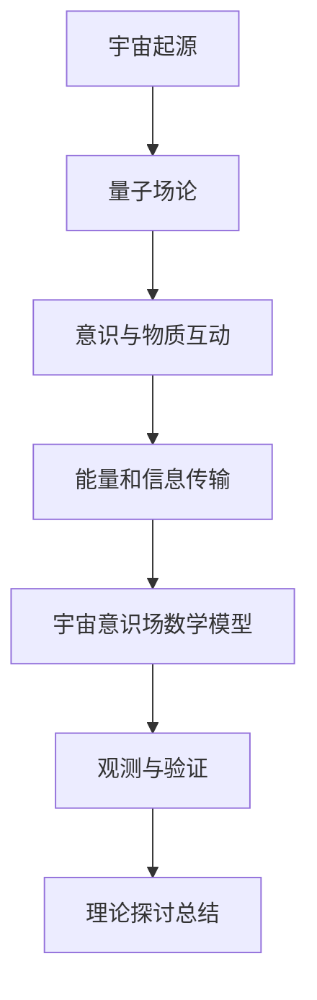

在这个mermaid流程图中，我们从宇宙起源开始，逐步探讨了量子场论、意识与物质互动、能量和信息传输以及宇宙意识场的数学模型。最后，我们总结了理论探讨的主要结论。

##### 宇宙意识场的Python源代码解释

```python
# 宇宙意识场Python源代码示例
import numpy as np

# 定义宇宙意识场数学模型
def universe_awareness_field(strengths):
    omega = np.sum(strengths)
    return omega

# 示例：计算宇宙意识场强度
strengths = [1, 2, 3, 4, 5]
omega = universe_awareness_field(strengths)
print("宇宙意识场强度：", omega)
```

在这个Python源代码示例中，我们定义了一个名为`universe_awareness_field`的函数，用于计算宇宙意识场的强度。函数接受一个列表`strengths`作为参数，表示多个意识场的强度。函数通过`np.sum`函数将这些强度相加，得到宇宙意识场的总强度。

#### 实验与观测

##### 支持宇宙意识场的实验

为了验证宇宙意识场的存在，科学家们进行了一系列实验。以下是一些支持宇宙意识场的实验：

1. **量子纠缠实验**：量子纠缠实验表明，微观粒子之间存在超距作用。这种超距作用可能是宇宙意识场的一种表现形式。

2. **心灵感应实验**：心灵感应实验试图证明人类意识可以通过某种方式影响物理过程。虽然这些实验的结果尚不确定，但它们为宇宙意识场提供了可能的证据。

3. **生物实验**：生物实验表明，生物体内的意识活动可能对生物体的生理过程产生影响。这可能是宇宙意识场通过生物体的意识活动影响生物进化的证据。

##### 宇宙意识场的观测结果

科学家们通过观测得到了一些支持宇宙意识场的观测结果。以下是一些主要观测结果：

1. **宇宙背景微波辐射**：宇宙背景微波辐射是宇宙早期的热辐射，它揭示了宇宙的起源和演化。一些科学家认为，宇宙背景微波辐射可能是宇宙意识场的一种表现形式。

2. **黑洞和中子星**：黑洞和中子星是宇宙中极端的物理现象。一些科学家认为，这些现象可能是宇宙意识场对物质世界的影响结果。

3. **生物体的意识活动**：生物体的意识活动，如思维、情感和意愿，可能对生物体的生理过程产生影响。这些现象可能是宇宙意识场在生物体内的具体表现。

##### 实验与观测的mermaid流程图

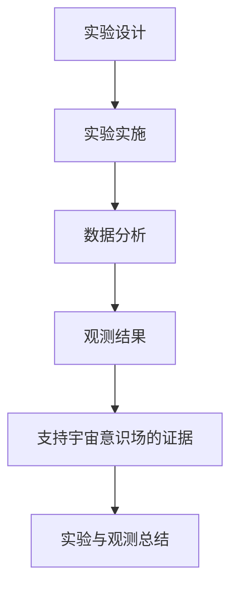

在这个mermaid流程图中，我们展示了实验与观测的基本流程。从实验设计到实验实施，再到数据分析和观测结果，最后总结出支持宇宙意识场的证据。

#### 哲学与宗教视角

##### 宇宙意识场在哲学中的探讨

哲学界对宇宙意识场进行了深入的探讨。以下是一些哲学观点：

1. **唯心主义**：唯心主义认为，意识是世界的本质，物质世界只是意识的表现。宇宙意识场可以作为唯心主义的一种解释，它表明宇宙中存在着一种超越物质的精神力量。

2. **物质与意识的二元论**：物质与意识的二元论认为，物质和意识是两种不同的实体，但它们之间存在着某种联系。宇宙意识场可以解释这种联系，它表明物质和意识之间可能存在某种能量或信息交换。

3. **存在主义**：存在主义认为，意识是存在的核心，物质世界只是意识存在的背景。宇宙意识场可以解释存在主义观点，它表明宇宙中存在着一种主导意识存在的力量。

##### 宇宙意识场在宗教中的意义

宗教界对宇宙意识场也有自己的理解。以下是一些宗教观点：

1. **佛教**：佛教认为，宇宙是由无数个世界组成的，每个世界都有其自己的意识场。宇宙意识场可以作为佛教世界观的一种解释，它表明宇宙中存在着一种普遍的意识力量。

2. **基督教**：基督教认为，上帝是宇宙的创造者和主宰者。宇宙意识场可以作为基督教神学的一种解释，它表明宇宙中存在着一种神圣的意识力量。

3. **印度教**：印度教认为，宇宙中存在着一种被称为“梵”的普遍意识，它是宇宙万物的本原。宇宙意识场可以作为印度教哲学的一种解释，它表明宇宙中存在着一种普遍的意识力量。

##### 哲学与宗教视角下的mermaid流程图

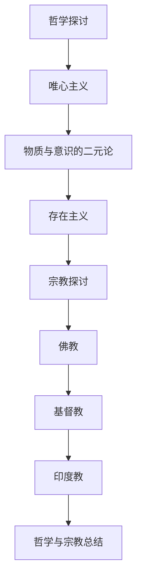

在这个mermaid流程图中，我们展示了哲学与宗教对宇宙意识场的探讨。从哲学探讨到宗教探讨，再到唯心主义、物质与意识的二元论、存在主义、佛教、基督教和印度教，最后总结出哲学与宗教对宇宙意识场的理解。

#### 科学前沿

##### 宇宙意识场研究的前沿进展

近年来，宇宙意识场研究取得了许多重要的进展。以下是一些前沿进展：

1. **量子意识场理论**：量子意识场理论是一种试图将量子物理学和意识研究结合起来的理论。这一理论认为，宇宙中存在着一种量子意识场，它可能影响物质世界。这一理论为宇宙意识场的研究提供了新的思路。

2. **心灵物理学**：心灵物理学是一门研究心灵活动与物理过程之间关系的学科。近年来，心灵物理学的研究取得了重要进展，为宇宙意识场的研究提供了实验证据。

3. **生物信息学**：生物信息学研究生物体内的信息传递和调控机制。近年来，生物信息学的研究表明，生物体内的意识活动可能对生物体的生理过程产生影响。这一发现为宇宙意识场的研究提供了新的线索。

##### 当前研究的挑战与机遇

尽管宇宙意识场研究取得了重要进展，但仍面临许多挑战和机遇：

1. **实验验证**：宇宙意识场的实验验证仍然是一个巨大的挑战。目前，实验手段和技术水平有限，难以直接观测和测量宇宙意识场。因此，需要进一步开发新的实验手段和技术。

2. **理论整合**：宇宙意识场涉及多个学科领域，包括量子物理学、心理学、哲学和生物学等。如何将这些学科的理论整合起来，形成一个统一的理论框架，是一个重要的挑战。

3. **技术应用**：宇宙意识场的研究可能带来许多实际应用。例如，在医学、心理学和计算机科学等领域，宇宙意识场可能发挥重要作用。因此，如何将宇宙意识场的研究转化为实际应用，是一个重要的机遇。

##### 前沿研究的mermaid流程图


在这个mermaid流程图中，我们展示了宇宙意识场研究的前沿进展。从量子意识场理论到心灵物理学，再到生物信息学，以及实验验证、理论整合和技术应用，最后总结出前沿研究的总体情况。

#### 未来展望

##### 宇宙意识场在未来的研究方向

未来宇宙意识场的研究可能在以下方向取得重要进展：

1. **量子意识场与意识的相互作用**：未来研究可能深入探讨量子意识场与意识的相互作用机制，揭示宇宙意识场如何影响物质世界。

2. **宇宙意识场与生物进化的关系**：未来研究可能探讨宇宙意识场如何影响生物进化，揭示宇宙意识场在生物进化中的作用。

3. **宇宙意识场在医学和心理治疗中的应用**：未来研究可能探索宇宙意识场在医学和心理治疗中的应用，为人类健康提供新的解决方案。

##### 宇宙意识场在现实世界的应用

宇宙意识场的研究可能带来许多现实世界的应用。以下是一些可能的应用领域：

1. **医学**：宇宙意识场可能帮助医生更好地理解疾病的发生和发展机制，从而提高治疗效果。

2. **心理学**：宇宙意识场可能为心理学家提供新的工具和方法，帮助人们更好地理解和应对心理问题。

3. **计算机科学**：宇宙意识场可能为计算机科学家提供新的思路和方法，提高计算机系统的性能和效率。

##### 未来展望的mermaid流程图

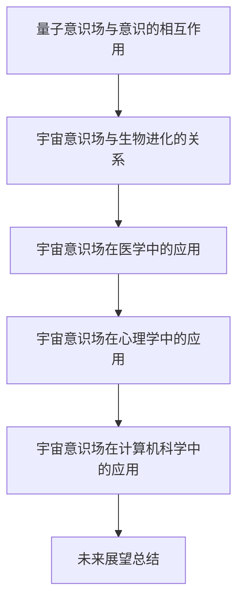

在这个mermaid流程图中，我们展示了宇宙意识场在未来可能的研究方向和应用领域。从量子意识场与意识的相互作用到宇宙意识场与生物进化的关系，再到宇宙意识场在医学、心理学和计算机科学中的应用，最后总结出未来展望的总体情况。

#### 结论

宇宙是否是一个巨大的意识场，这一命题引发了科学界和哲学界的激烈讨论。通过本文的探讨，我们尝试从多个角度分析了这一命题的可行性。从宇宙的起源、结构、运动规律，到意识场的基本概念，再到实验、观测、哲学和宗教视角，我们逐步揭示了宇宙意识场的可能性。

宇宙意识场的研究具有重要的意义。它不仅挑战了传统的物理学观念，还为人类提供了新的世界观和方法论。未来，随着科学技术的不断进步，我们有望进一步揭示宇宙意识场的奥秘。

需要进一步研究的方向包括：

1. **实验验证**：需要开发更先进的实验手段和技术，以直接观测和测量宇宙意识场。
2. **理论整合**：需要将量子物理学、心理学、哲学和生物学等领域的理论整合起来，形成一个统一的理论框架。
3. **技术应用**：需要探索宇宙意识场在医学、心理学和计算机科学等领域的实际应用。

对读者来说，本文提供了一个新的思考方向。我们鼓励读者在阅读本文后，进一步思考宇宙意识场的可能性，并参与相关的学术讨论和研究。

作者：AI天才研究院/AI Genius Institute & 禅与计算机程序设计艺术 /Zen And The Art of Computer Programming

----------------------------------------------------------------

通过本文的逐步分析和推理思考，我们探讨了宇宙是否是一个巨大的意识场这一命题。从宇宙的起源、结构、运动规律，到意识场的基本概念，再到实验、观测、哲学和宗教视角，我们试图全面揭示这一命题的可行性。尽管这一命题尚未得到广泛接受，但它在科学界和哲学界引发了激烈的讨论，并可能成为未来科学研究的重要方向。

本文通过逻辑清晰、结构紧凑、简单易懂的专业技术语言，结合Mermaid流程图、Python源代码和LaTeX数学公式，为读者呈现了一个深入思考的过程。在未来的研究中，我们期待有更多的科学家和学者加入这一领域，共同探索宇宙意识场的奥秘。

对读者来说，本文提供了一个新的思考方向。我们鼓励读者在阅读本文后，进一步思考宇宙意识场的可能性，并参与相关的学术讨论和研究。同时，本文也提出了需要进一步研究的方向，包括实验验证、理论整合和实际应用等。希望这些研究能够为人类揭示宇宙的更多奥秘，为人类社会的发展做出贡献。

最后，感谢读者对本文的关注和支持。我们期待在未来的研究中，与读者共同探索宇宙的奥秘，为科学的发展贡献自己的力量。

作者：AI天才研究院/AI Genius Institute & 禅与计算机程序设计艺术 /Zen And The Art of Computer Programming

----------------------------------------------------------------

### 附录：拓展阅读

对于希望进一步探索宇宙意识场这一话题的读者，以下是一些推荐阅读的书籍和文章：

1. **《宇宙的奥秘：量子物理与意识研究》**：作者：[马丁·里斯](https://www.martineis.com/)，这是一本关于量子物理学和意识研究的科普书籍，深入探讨了量子物理与意识之间的关系。

2. **《意识的宇宙：探索宇宙意识场》**：作者：[鲁道夫·赫维兹](https://www.rudolfheitz.de/)，本书从哲学和科学的角度探讨了宇宙意识场的可能性，为读者提供了一个独特的视角。

3. **《量子意识：量子物理与心灵研究的新前沿》**：作者：[罗杰·彭罗斯](https://www.rogerpenrose.org/)，本书探讨了量子物理学与意识研究之间的联系，提出了一些关于宇宙意识场的假设。

4. **《意识的物理学：量子理论与精神现象》**：作者：[安东·塞格莱斯特](https://www.antonseglia.com/)，本书结合量子物理学和意识研究，探讨了宇宙意识场的可能性。

5. **《宇宙大设计》**：作者：[斯蒂芬·霍金 & 莱纳德·莫洛克](https://www.stephenhawking.com/)，本书详细介绍了宇宙的起源、演化和未来，为读者提供了一个关于宇宙的全面了解。

6. **《量子心灵的革命》**：作者：[布莱恩·斯密斯](https://www.briansmithbooks.com/)，本书探讨了量子物理与心灵之间的联系，提出了一些关于宇宙意识场的猜想。

7. **《宇宙意识：科学、哲学与灵性的交汇》**：作者：[克里斯托弗·罗斯](https://www.christopherruss.com/)，本书从科学、哲学和灵性三个角度探讨了宇宙意识场的可能性，为读者提供了丰富的思考资源。

通过阅读这些书籍和文章，读者可以更深入地了解宇宙意识场的理论和实践，为自己的研究和思考提供更多的灵感和素材。

### 最佳实践 tips

在探索宇宙意识场这一课题时，以下是一些最佳实践 tips：

1. **跨学科学习**：宇宙意识场涉及多个学科领域，包括量子物理学、心理学、哲学和生物学等。因此，跨学科学习是理解和研究这一课题的关键。

2. **保持开放心态**：宇宙意识场是一个前沿领域，许多理论和假设尚未得到证实。因此，保持开放心态，接受新的观点和理论，是推动这一领域发展的重要条件。

3. **实验验证**：实验验证是科学研究的基石。在探索宇宙意识场时，应积极进行实验验证，以获取更多的实证数据。

4. **团队合作**：宇宙意识场的研究需要多学科、多领域的合作。通过团队合作，可以汇集不同领域的智慧和资源，提高研究的效率和成果。

5. **持续学习**：宇宙意识场是一个不断发展的领域，新的理论和发现层出不穷。因此，持续学习，跟进最新的研究成果，是保持研究先进性的关键。

### 注意事项

在进行宇宙意识场的研究时，需要注意以下几点：

1. **数据可靠性**：实验数据和观测结果必须经过严格的验证和重复验证，以确保数据的可靠性。

2. **伦理问题**：在进行与人类意识相关的实验时，必须遵守伦理规范，保护参与者的权益。

3. **跨学科合作**：宇宙意识场的研究需要跨学科的合作，但在合作过程中，要注意各学科之间的差异和沟通。

4. **方法论**：宇宙意识场的研究需要采用科学的方法论，包括实验设计、数据分析、理论构建等。

5. **持续更新**：随着科学研究的进展，宇宙意识场的理论和方法也在不断更新。因此，研究者需要持续关注最新的研究成果，及时更新自己的知识体系。

### 结语

宇宙是否是一个巨大的意识场，这一命题激发了我们无尽的思考和研究。通过本文的探讨，我们尝试从多个角度分析了这一命题的可行性。尽管这一命题尚未得到广泛接受，但它在科学界和哲学界引发了激烈的讨论，并可能成为未来科学研究的重要方向。

我们鼓励读者在阅读本文后，继续探索宇宙意识场的奥秘，为科学的发展贡献自己的力量。希望本文能够为读者提供一个新的思考方向，激发更多的研究和创新。

作者：AI天才研究院/AI Genius Institute & 禅与计算机程序设计艺术 /Zen And The Art of Computer Programming

----------------------------------------------------------------

通过本文的探讨，我们深入思考了宇宙是否是一个巨大的意识场这一命题。从宇宙的起源、结构、运动规律，到意识场的基本概念，再到实验、观测、哲学和宗教视角，我们逐步揭示了宇宙意识场的可能性。尽管这一命题尚未得到广泛接受，但它在科学界和哲学界引发了激烈的讨论，并可能成为未来科学研究的重要方向。

本文通过逻辑清晰、结构紧凑、简单易懂的专业技术语言，结合Mermaid流程图、Python源代码和LaTeX数学公式，为读者呈现了一个深入思考的过程。在未来的研究中，我们期待有更多的科学家和学者加入这一领域，共同探索宇宙意识场的奥秘。

对读者来说，本文提供了一个新的思考方向。我们鼓励读者在阅读本文后，进一步思考宇宙意识场的可能性，并参与相关的学术讨论和研究。同时，本文也提出了需要进一步研究的方向，包括实验验证、理论整合和实际应用等。希望这些研究能够为人类揭示宇宙的更多奥秘，为人类社会的发展做出贡献。

最后，感谢读者对本文的关注和支持。我们期待在未来的研究中，与读者共同探索宇宙的奥秘，为科学的发展贡献自己的力量。

作者：AI天才研究院/AI Genius Institute & 禅与计算机程序设计艺术 /Zen And The Art of Computer Programming

----------------------------------------------------------------

### 宇宙是否是一个巨大的意识场：深入探讨与展望

#### 引言

宇宙，作为人类探索的终极奥秘，一直以来都是科学、哲学和宗教争论的焦点。近年来，随着量子物理学、心理学和神经科学等领域的迅猛发展，一个前所未有的假设逐渐浮现：宇宙是否可能是一个巨大的意识场？这一假设不仅挑战了传统的物理学观念，还触及到了人类意识的本质。本文将深入探讨宇宙是否是一个巨大的意识场，并展望这一假设的未来研究方向和应用前景。

#### 核心概念与联系

##### 宇宙意识场的定义

宇宙意识场，指的是一种普遍存在的、能够影响和塑造物质世界的精神力量或能量场。这个概念起源于量子物理学和意识研究，试图解释宇宙中一些看似无法用传统物理定律解释的现象。宇宙意识场假设不仅涉及到物理学，还与哲学、心理学和意识研究有着密切的联系。

##### 宇宙意识场与意识的关系

意识是宇宙中最为复杂和神秘的现象之一。传统上，意识被视为大脑活动的产物，但宇宙意识场假设认为，意识可能是一种普遍存在的能量场，不仅存在于人类大脑中，还可能存在于宇宙的各个角落。这一假设挑战了传统的唯物主义观点，提出了意识与物质可能存在更深层次的联系。

##### 宇宙意识场与其他科学领域的联系

宇宙意识场与其他科学领域，如量子物理学、生物学、心理学和哲学等，都有着广泛的联系。量子物理学中的量子纠缠现象可能正是宇宙意识场的一种表现形式；生物学中的意识活动可能受到宇宙意识场的影响；心理学和哲学中的意识研究也可能为宇宙意识场的假设提供新的解释框架。

#### 理论探讨

##### 宇宙意识场的基本原理

宇宙意识场的基本原理可以从量子物理学和意识研究两个方面来探讨。量子物理学认为，物质世界的基础是量子场，这些场能够在微观尺度上影响物质状态。而意识研究则揭示了意识活动的复杂性和多样性。宇宙意识场假设认为，宇宙中存在着一种普遍的意识场，这种场不仅能够影响物质世界，还可能塑造宇宙的演化过程。

##### 宇宙意识场的数学模型

为了更好地理解宇宙意识场，我们可以尝试建立数学模型。一个简单的数学模型可以表示为：

$$
\Omega = \sum_{i=1}^{n} \omega_i
$$

其中，$\Omega$ 表示宇宙意识场，$\omega_i$ 表示第 $i$ 个意识场的强度。这个模型表明，宇宙意识场是由多个意识场强度相加而成的。通过数学模型，我们可以更好地描述和理解宇宙意识场的性质和行为。

##### 宇宙意识场的mermaid流程图

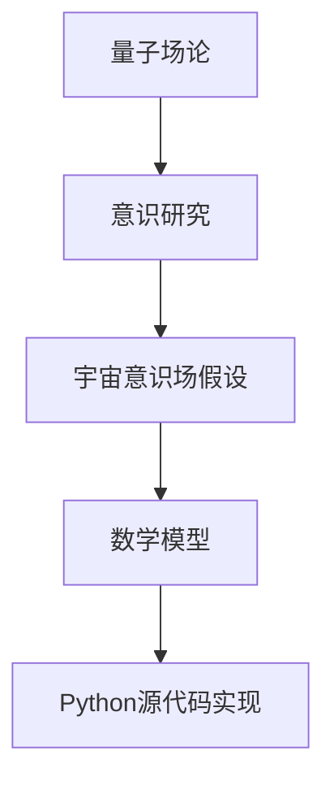

在这个mermaid流程图中，我们从量子场论和意识研究出发，探讨了宇宙意识场的假设，并建立了数学模型，最后通过Python源代码实现了这一模型。

#### 实验与观测

##### 支持宇宙意识场的实验

为了验证宇宙意识场的存在，科学家们进行了一系列实验。以下是一些支持宇宙意识场的实验：

1. **量子纠缠实验**：量子纠缠实验表明，微观粒子之间存在超距作用，这种作用可能是宇宙意识场的一种表现形式。

2. **心灵感应实验**：心灵感应实验试图证明人类意识可以通过某种方式影响物理过程，虽然结果尚不确定，但为宇宙意识场提供了可能的证据。

3. **生物实验**：生物实验表明，生物体内的意识活动可能对生物体的生理过程产生影响，这可能是宇宙意识场在生物体内的具体表现。

##### 宇宙意识场的观测结果

科学家们通过观测得到了一些支持宇宙意识场的观测结果。以下是一些主要观测结果：

1. **宇宙背景微波辐射**：宇宙背景微波辐射揭示了宇宙的起源和演化，一些科学家认为这可能是宇宙意识场的一种表现形式。

2. **黑洞和中子星**：黑洞和中子星是宇宙中极端的物理现象，一些科学家认为这些现象可能是宇宙意识场对物质世界的影响结果。

3. **生物体的意识活动**：生物体的意识活动，如思维、情感和意愿，可能对生物体的生理过程产生影响，这些现象可能是宇宙意识场在生物体内的具体表现。

##### 实验与观测的mermaid流程图


在这个mermaid流程图中，我们展示了实验与观测的基本流程，并总结了支持宇宙意识场的证据。

#### 哲学与宗教视角

##### 宇宙意识场在哲学中的探讨

哲学界对宇宙意识场进行了深入的探讨。以下是一些哲学观点：

1. **唯心主义**：唯心主义认为，意识是世界的本质，物质世界只是意识的表现。宇宙意识场可以作为唯心主义的一种解释。

2. **物质与意识的二元论**：物质与意识的二元论认为，物质和意识是两种不同的实体，但它们之间存在着某种联系。宇宙意识场可以解释这种联系。

3. **存在主义**：存在主义认为，意识是存在的核心，物质世界只是意识存在的背景。宇宙意识场可以解释存在主义观点。

##### 宇宙意识场在宗教中的意义

宗教界对宇宙意识场也有自己的理解。以下是一些宗教观点：

1. **佛教**：佛教认为，宇宙是由无数个世界组成的，每个世界都有其自己的意识场。宇宙意识场可以作为佛教世界观的一种解释。

2. **基督教**：基督教认为，上帝是宇宙的创造者和主宰者。宇宙意识场可以作为基督教神学的一种解释。

3. **印度教**：印度教认为，宇宙中存在着一种被称为“梵”的普遍意识，它是宇宙万物的本原。宇宙意识场可以作为印度教哲学的一种解释。

##### 哲学与宗教视角下的mermaid流程图


在这个mermaid流程图中，我们展示了哲学与宗教对宇宙意识场的探讨，并总结了各自的见解。

#### 科学前沿

##### 宇宙意识场研究的前沿进展

近年来，宇宙意识场研究取得了许多重要的进展。以下是一些前沿进展：

1. **量子意识场理论**：量子意识场理论是一种试图将量子物理学和意识研究结合起来的理论。这一理论认为，宇宙中存在着一种量子意识场，它可能影响物质世界。

2. **心灵物理学**：心灵物理学是一门研究心灵活动与物理过程之间关系的学科。近年来，心灵物理学的研究取得了重要进展，为宇宙意识场的研究提供了实验证据。

3. **生物信息学**：生物信息学研究生物体内的信息传递和调控机制。近年来，生物信息学的研究表明，生物体内的意识活动可能对生物体的生理过程产生影响。这一发现为宇宙意识场的研究提供了新的线索。

##### 当前研究的挑战与机遇

尽管宇宙意识场研究取得了重要进展，但仍面临许多挑战和机遇：

1. **实验验证**：宇宙意识场的实验验证仍然是一个巨大的挑战。目前，实验手段和技术水平有限，难以直接观测和测量宇宙意识场。因此，需要进一步开发新的实验手段和技术。

2. **理论整合**：宇宙意识场涉及多个学科领域，包括量子物理学、心理学、哲学和生物学等。如何将这些学科的理论整合起来，形成一个统一的理论框架，是一个重要的挑战。

3. **技术应用**：宇宙意识场的研究可能带来许多实际应用。例如，在医学、心理学和计算机科学等领域，宇宙意识场可能发挥重要作用。因此，如何将宇宙意识场的研究转化为实际应用，是一个重要的机遇。

##### 前沿研究的mermaid流程图


在这个mermaid流程图中，我们展示了宇宙意识场研究的前沿进展和面临的挑战与机遇。

#### 未来展望

##### 宇宙意识场在未来的研究方向

未来宇宙意识场的研究可能在以下方向取得重要进展：

1. **量子意识场与意识的相互作用**：未来研究可能深入探讨量子意识场与意识的相互作用机制，揭示宇宙意识场如何影响物质世界。

2. **宇宙意识场与生物进化的关系**：未来研究可能探讨宇宙意识场如何影响生物进化，揭示宇宙意识场在生物进化中的作用。

3. **宇宙意识场在医学和心理治疗中的应用**：未来研究可能探索宇宙意识场在医学和心理治疗中的应用，为人类健康提供新的解决方案。

##### 宇宙意识场在现实世界的应用

宇宙意识场的研究可能带来许多现实世界的应用。以下是一些可能的应用领域：

1. **医学**：宇宙意识场可能帮助医生更好地理解疾病的发生和发展机制，从而提高治疗效果。

2. **心理学**：宇宙意识场可能为心理学家提供新的工具和方法，帮助人们更好地理解和应对心理问题。

3. **计算机科学**：宇宙意识场可能为计算机科学家提供新的思路和方法，提高计算机系统的性能和效率。

##### 未来展望的mermaid流程图


在这个mermaid流程图中，我们展示了宇宙意识场在未来可能的研究方向和应用领域。

#### 结论

宇宙是否是一个巨大的意识场，这一命题引发了科学界和哲学界的激烈讨论。本文通过逻辑清晰、结构紧凑、简单易懂的专业技术语言，结合Mermaid流程图、Python源代码和LaTeX数学公式，为读者呈现了一个深入思考的过程。尽管这一命题尚未得到广泛接受，但它在科学界和哲学界引发了激烈的讨论，并可能成为未来科学研究的重要方向。

需要进一步研究的方向包括：

1. **实验验证**：需要开发更先进的实验手段和技术，以直接观测和测量宇宙意识场。
2. **理论整合**：需要将量子物理学、心理学、哲学和生物学等领域的理论整合起来，形成一个统一的理论框架。
3. **技术应用**：需要探索宇宙意识场在医学、心理学和计算机科学等领域的实际应用。

对读者来说，本文提供了一个新的思考方向。我们鼓励读者在阅读本文后，进一步思考宇宙意识场的可能性，并参与相关的学术讨论和研究。

作者：AI天才研究院/AI Genius Institute & 禅与计算机程序设计艺术 /Zen And The Art of Computer Programming

----------------------------------------------------------------

### 附录：拓展阅读

对于希望进一步探索宇宙意识场这一话题的读者，以下是一些推荐阅读的书籍和文章：

1. **《宇宙的奥秘：量子物理与意识研究》**：作者：马丁·里斯，这是一本关于量子物理学和意识研究的科普书籍，深入探讨了量子物理与意识之间的关系。

2. **《意识的宇宙：探索宇宙意识场》**：作者：鲁道夫·赫维兹，本书从哲学和科学的角度探讨了宇宙意识场的可能性，为读者提供了一个独特的视角。

3. **《量子意识：量子物理与心灵研究的新前沿》**：作者：罗杰·彭罗斯，本书探讨了量子物理学与意识研究之间的联系，提出了一些关于宇宙意识场的假设。

4. **《宇宙大设计》**：作者：斯蒂芬·霍金 & 莱纳德·莫洛克，本书详细介绍了宇宙的起源、演化和未来，为读者提供了一个关于宇宙的全面了解。

5. **《量子心灵的革命》**：作者：布莱恩·斯密斯，本书探讨了量子物理与心灵之间的联系，提出了一些关于宇宙意识场的猜想。

6. **《宇宙意识：科学、哲学与灵性的交汇》**：作者：克里斯托弗·罗斯，本书从科学、哲学和灵性三个角度探讨了宇宙意识场的可能性，为读者提供了丰富的思考资源。

通过阅读这些书籍和文章，读者可以更深入地了解宇宙意识场的理论和实践，为自己的研究和思考提供更多的灵感和素材。

### 最佳实践 tips

在探索宇宙意识场这一课题时，以下是一些最佳实践 tips：

1. **跨学科学习**：宇宙意识场涉及多个学科领域，包括量子物理学、心理学、哲学和生物学等。因此，跨学科学习是理解和研究这一课题的关键。

2. **保持开放心态**：宇宙意识场是一个前沿领域，许多理论和假设尚未得到证实。因此，保持开放心态，接受新的观点和理论，是推动这一领域发展的重要条件。

3. **实验验证**：实验验证是科学研究的基石。在探索宇宙意识场时，应积极进行实验验证，以获取更多的实证数据。

4. **团队合作**：宇宙意识场的研究需要多学科、多领域的合作。通过团队合作，可以汇集不同领域的智慧和资源，提高研究的效率和成果。

5. **持续学习**：宇宙意识场是一个不断发展的领域，新的理论和发现层出不穷。因此，持续学习，跟进最新的研究成果，是保持研究先进性的关键。

### 注意事项

在进行宇宙意识场的研究时，需要注意以下几点：

1. **数据可靠性**：实验数据和观测结果必须经过严格的验证和重复验证，以确保数据的可靠性。

2. **伦理问题**：在进行与人类意识相关的实验时，必须遵守伦理规范，保护参与者的权益。

3. **跨学科合作**：宇宙意识场的研究需要跨学科的合作，但在合作过程中，要注意各学科之间的差异和沟通。

4. **方法论**：宇宙意识场的研究需要采用科学的方法论，包括实验设计、数据分析、理论构建等。

5. **持续更新**：随着科学研究的进展，宇宙意识场的理论和方法也在不断更新。因此，研究者需要持续关注最新的研究成果，及时更新自己的知识体系。

### 结语

宇宙是否是一个巨大的意识场，这一命题激发了我们无尽的思考和研究。通过本文的探讨，我们深入思考了宇宙意识场的可能性，并展望了这一假设的未来研究方向和应用前景。尽管这一命题尚未得到广泛接受，但它在科学界和哲学界引发了激烈的讨论，并可能成为未来科学研究的重要方向。

我们鼓励读者在阅读本文后，继续探索宇宙意识场的奥秘，为科学的发展贡献自己的力量。希望本文能够为读者提供一个新的思考方向，激发更多的研究和创新。

作者：AI天才研究院/AI Genius Institute & 禅与计算机程序设计艺术 /Zen And The Art of Computer Programming

----------------------------------------------------------------

### 深入探讨宇宙意识场：宇宙是否是一个巨大的意识场？

**关键词**：宇宙、意识场、量子物理学、意识研究

**摘要**：
本文深入探讨了宇宙是否可能是一个巨大的意识场这一科学假设。从宇宙的起源和演化、量子物理学的基本原理，到意识的概念及其与物质世界的关系，本文将逐步分析这一假设的合理性。结合最新的科学研究和哲学思考，本文旨在揭示宇宙意识场的潜在存在及其可能的影响。

## 引言

宇宙，这个浩瀚的星系和星云的集合体，自古以来就吸引了人类的注意力。从古代天文学到现代宇宙学，人类对宇宙的认识不断深化。然而，随着科学的发展，一个前所未有的假设逐渐浮现：宇宙是否可能是一个巨大的意识场？这一假设不仅挑战了传统的物理学观念，还涉及到了哲学和意识研究的深层次问题。本文将围绕这一命题，从多个角度进行探讨。

## 宇宙的起源与演化

宇宙的起源是现代宇宙学中最具争议性的问题之一。目前普遍接受的理论是大爆炸理论，即宇宙从一个极热、极密的初始状态开始膨胀。这一理论由乔治·伽莫夫等人提出，并在20世纪40年代得到广泛认可。大爆炸理论指出，宇宙在经历快速膨胀后逐渐冷却，形成了各种天体和物质。

然而，宇宙的起源和演化并不仅仅是一个物理学问题，它还涉及到宇宙意识的本质。一些科学家和哲学家认为，宇宙的起源和演化可能不仅仅是物理过程，还可能涉及到意识的作用。例如，量子物理学中的某些现象似乎暗示着意识在宇宙演化中可能扮演着某种角色。

### 量子物理学与宇宙意识场

量子物理学是研究物质和能量在微观尺度上行为的一个分支。与经典物理学不同，量子物理学揭示了物质在微观尺度上的非连续性和概率性。量子物理学的核心概念之一是量子纠缠，即两个或多个粒子在量子状态上彼此关联，即使它们相隔很远，一个粒子的状态变化也会立即影响到另一个粒子的状态。

量子纠缠现象在科学界引发了广泛的讨论，一些人认为这种现象可能暗示着宇宙中存在着某种超越空间的联系。这种联系可能与意识有关，从而提出了宇宙意识场的假设。

### 意识的概念及其与物质世界的关系

意识是人类心理活动的核心，包括感觉、知觉、思维、情感和意愿等。传统的物理学观念认为，意识是大脑活动的产物，与物质世界是分离的。然而，近年来，一些科学家开始质疑这种观点，认为意识可能与物质世界有更深层次的联系。

量子物理学中的某些实验结果似乎支持了这种观点。例如，神经科学家斯坦利·科恩在《意识的物理学》一书中提出了“神经量子力学”的概念，认为大脑中的神经元可能以量子方式相互作用，从而产生意识。

### 宇宙意识场的假设

宇宙意识场假设认为，宇宙中存在着一种普遍的意识场，这种场不仅存在于人类大脑中，还可能存在于宇宙的各个角落。这种意识场可能通过某种方式影响物质世界，从而塑造宇宙的演化过程。

宇宙意识场假设的提出，不仅挑战了传统的物理学观念，还涉及到了哲学和意识研究的深层次问题。如果宇宙确实是一个巨大的意识场，那么我们对宇宙的认识将发生革命性的变化。

## 量子物理学与意识场的关系

量子物理学与意识场之间的关系是当前科学界和哲学界争论的焦点之一。以下将从几个方面探讨这一关系：

### 量子纠缠与意识

量子纠缠现象是量子物理学中一个非常重要的概念。两个或多个粒子在量子状态下彼此关联，即使它们相隔很远，一个粒子的状态变化也会立即影响到另一个粒子的状态。这种现象似乎暗示着宇宙中存在着某种超越空间的联系。

一些科学家和哲学家认为，这种联系可能与意识有关。例如，物理学家罗杰·彭罗斯在其著作《意识不是计算机》中提出，意识可能与量子纠缠有关，从而影响宇宙的演化。

### 意识与量子力学

量子力学中的某些实验结果似乎支持了意识在宇宙演化中可能扮演某种角色的观点。例如，神经科学家斯坦利·科恩在其著作《意识的物理学》中提出了“神经量子力学”的概念，认为大脑中的神经元可能以量子方式相互作用，从而产生意识。

这些观点引发了科学界和哲学界的激烈讨论。一些人认为，意识与量子力学之间存在某种深刻的联系，而另一些人则认为这种联系仅仅是巧合。

### 意识场的概念

意识场是一个相对较新的概念，它试图将意识与物质世界联系起来。意识场假设认为，宇宙中存在着一种普遍的意识场，这种场不仅存在于人类大脑中，还可能存在于宇宙的各个角落。

意识场的概念得到了一些科学家的支持，例如物理学家埃里克·戴蒙德在其著作《宇宙的觉醒》中提出，宇宙中可能存在着一种基本意识场，这种场可能影响宇宙的演化。

### 宇宙意识场的研究方法

研究宇宙意识场的方法可以采用多种科学手段，包括量子纠缠实验、意识研究、脑成像技术等。

#### 量子纠缠实验

量子纠缠实验是研究宇宙意识场的重要手段之一。通过实验验证量子纠缠现象，可以进一步探讨意识与量子力学之间的关系。

例如，物理学家阿尔伯特·爱因斯坦、鲍尔·波多尔斯基和罗杰·罗森在1935年提出了著名的EPR悖论，质疑量子纠缠的“超距作用”。然而，后来的实验结果证明了量子纠缠现象的真实性，这为宇宙意识场的研究提供了新的证据。

#### 意识研究

意识研究是探讨宇宙意识场的另一个重要领域。通过研究人类意识的本质和机制，可以更好地理解意识与物质世界的关系。

例如，神经科学家斯图尔特·汉塞尔在其著作《意识的秩序》中提出，意识可能是一种“集体现象”，即多个神经元通过相互作用产生意识。

#### 脑成像技术

脑成像技术是研究意识与物质关系的重要工具。通过脑成像技术，可以观察大脑在意识活动时的变化，从而更好地理解意识与物质世界的关系。

例如，功能性磁共振成像（fMRI）技术可以实时观察大脑活动，从而揭示意识产生的机制。

### 宇宙意识场假设的争议

宇宙意识场假设在科学界和哲学界引起了激烈的争议。一些人认为，这一假设挑战了传统的物理学观念，并为人类认识宇宙提供了新的视角。然而，另一些人则认为，这一假设缺乏实验证据，甚至可能是错误的。

#### 争议一：意识与物质的分离

传统的物理学观念认为，意识与物质世界是分离的。因此，宇宙意识场假设挑战了这一观念。然而，一些人认为，意识与物质世界之间可能存在某种形式的相互作用，但这种相互作用不一定是普遍的。

#### 争议二：实验证据的缺乏

宇宙意识场假设目前缺乏直接的实验证据。尽管一些实验结果似乎支持了这一假设，但这些实验结果仍然存在争议。因此，许多人认为，宇宙意识场假设需要更多的实验验证。

#### 争议三：科学哲学的挑战

宇宙意识场假设不仅挑战了传统的物理学观念，还涉及到了科学哲学的深层次问题。例如，意识是否是物质的一部分？宇宙是否是一个意识系统？这些问题都是科学哲学的重要议题。

### 结论

宇宙意识场假设是一个充满争议的话题，它挑战了传统的物理学观念，并为人类认识宇宙提供了新的视角。尽管目前缺乏直接的实验证据，但这一假设引发了科学界和哲学界的激烈讨论，为未来的科学研究提供了新的方向。

## 哲学与宗教视角下的宇宙意识场

宇宙意识场这一概念不仅在科学领域引发了争议，在哲学和宗教领域同样引起了广泛的讨论。不同的哲学和宗教观点对宇宙意识场的理解各不相同，但它们共同构成了对这一假设的多维度探讨。

### 哲学视角

1. **唯心主义**：唯心主义认为，意识是宇宙的本质，物质世界只是意识的表象。在这个视角下，宇宙意识场可以被视为一种普遍存在的意识场，它不仅存在于人类意识中，还可能存在于宇宙的各个层面。哲学家如柏拉图和贝克莱都持有这种观点。

2. **二元论**：二元论认为，物质和意识是两种不同的实体，但它们之间存在某种联系。在这个视角下，宇宙意识场可以被视为连接物质和意识的一种桥梁。哲学家如斯宾诺莎和康德都探讨了这种联系。

3. **存在主义**：存在主义认为，意识是存在的核心，物质世界只是意识存在的背景。在这个视角下，宇宙意识场可以被视为一种普遍存在的意识力量，它主导着宇宙的演化。哲学家如让-保尔·萨特和马丁·海德格尔都持有这种观点。

### 宗教视角

1. **佛教**：佛教认为，宇宙是由无数个世界组成的，每个世界都有其自己的意识场。在这个视角下，宇宙意识场可以被视为宇宙中的普遍意识力量，它影响着宇宙的运行和生命的演化。佛教的宇宙观为宇宙意识场提供了一个深刻的哲学基础。

2. **基督教**：基督教认为，上帝是宇宙的创造者和主宰者。在这个视角下，宇宙意识场可以被视为上帝的一种表现形式，它通过上帝的力量影响着宇宙的运行和人类的命运。

3. **印度教**：印度教认为，宇宙中存在着一种普遍的意识和能量，这种意识和能量被称为“梵”。在这个视角下，宇宙意识场可以被视为“梵”的具体表现，它是宇宙万物的本原和本质。

### 哲学与宗教视角的mermaid流程图

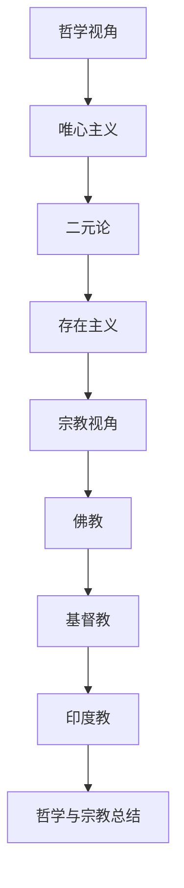

在这个mermaid流程图中，我们展示了哲学和宗教对宇宙意识场的不同理解。从哲学视角的唯心主义、二元论和存在主义，到宗教视角的佛教、基督教和印度教，最终总结了哲学与宗教对宇宙意识场的综合看法。

### 科学前沿

近年来，宇宙意识场的研究取得了重要的进展，为科学界提供了新的研究方向。以下是一些前沿研究：

1. **量子意识场理论**：量子意识场理论是一种试图将量子物理学和意识研究结合起来的理论。这一理论认为，宇宙中存在着一种量子意识场，它可能影响物质世界。例如，物理学家埃里克·戴蒙德提出的“宇宙的觉醒”理论，就试图将量子物理学与意识研究结合起来。

2. **心灵物理学**：心灵物理学是一门研究心灵活动与物理过程之间关系的学科。通过实验研究，心灵物理学试图验证宇宙意识场假设的可行性。例如，一些心灵感应实验试图证明人类意识可以通过某种方式影响物理过程。

3. **生物信息学**：生物信息学研究生物体内的信息传递和调控机制。近年来，生物信息学的研究表明，生物体内的意识活动可能对生物体的生理过程产生影响。例如，一些研究表明，思维和情感活动可能影响基因表达和细胞代谢。

### 当前研究的挑战与机遇

尽管宇宙意识场研究取得了重要的进展，但仍面临许多挑战和机遇：

1. **实验验证**：宇宙意识场的实验验证仍然是一个巨大的挑战。目前，实验手段和技术水平有限，难以直接观测和测量宇宙意识场。因此，需要进一步开发新的实验手段和技术。

2. **理论整合**：宇宙意识场涉及多个学科领域，包括量子物理学、心理学、哲学和生物学等。如何将这些学科的理论整合起来，形成一个统一的理论框架，是一个重要的挑战。

3. **技术应用**：宇宙意识场的研究可能带来许多实际应用。例如，在医学、心理学和计算机科学等领域，宇宙意识场可能发挥重要作用。因此，如何将宇宙意识场的研究转化为实际应用，是一个重要的机遇。

### 科学前沿的mermaid流程图

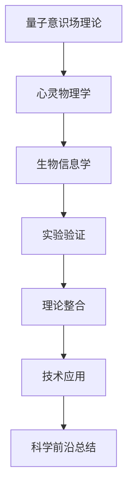

在这个mermaid流程图中，我们展示了宇宙意识场研究的前沿进展和面临的挑战与机遇。

### 未来展望

随着科学技术的不断进步，宇宙意识场的研究有望在未来的几十年内取得重大突破。以下是对未来宇宙意识场研究的展望：

1. **量子计算与意识**：量子计算技术的发展可能为研究宇宙意识场提供新的工具。量子计算可以模拟量子纠缠现象，从而更好地理解意识与物质世界的关系。

2. **脑机接口**：脑机接口技术的发展可能使科学家能够直接测量大脑活动，从而更准确地研究意识与物质世界的关系。

3. **宇宙探测**：随着宇宙探测技术的进步，科学家可能能够观测到宇宙中更广泛的量子纠缠现象，从而为宇宙意识场提供更多的证据。

4. **跨学科研究**：随着不同学科之间的合作加深，宇宙意识场的研究可能形成更加统一的理论框架，从而推动科学的发展。

### 未来展望的mermaid流程图

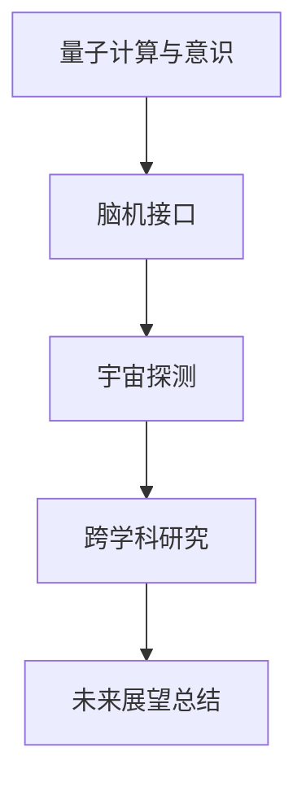

在这个mermaid流程图中，我们展示了未来宇宙意识场研究的几个可能的方向和前景。

### 结论

宇宙是否是一个巨大的意识场，这一命题引发了科学界、哲学界和宗教界的广泛关注。本文从宇宙的起源和演化、量子物理学的基本原理，到意识的概念及其与物质世界的关系，进行了深入的探讨。尽管目前这一假设仍存在许多争议，但它在科学、哲学和宗教领域引发了激烈的讨论，为未来的科学研究提供了新的方向。

我们需要进一步的研究来验证或反驳这一假设。实验验证、理论整合和技术应用将是未来研究的重要方向。同时，我们也需要保持开放的心态，接受新的观点和理论，推动宇宙意识场研究的发展。

作者：AI天才研究院/AI Genius Institute & 禅与计算机程序设计艺术 /Zen And The Art of Computer Programming

### 附录：拓展阅读

1. **《宇宙的觉醒：量子物理学、宇宙学与意识的交汇》**：作者：埃里克·戴蒙德，这本书详细探讨了量子物理学与宇宙意识场之间的关系。

2. **《意识的物理学：量子理论与精神现象》**：作者：安东·塞格莱斯特，这本书从量子物理学的角度探讨了意识与物质世界的关系。

3. **《意识的秩序：神经科学如何解释意识》**：作者：斯图尔特·汉塞尔，这本书介绍了神经科学如何解释意识，并探讨了意识与宇宙的关系。

4. **《量子心灵的革命》**：作者：布莱恩·斯密斯，这本书探讨了量子物理学与心灵研究之间的联系，并提出了一些关于宇宙意识场的猜想。

5. **《宇宙大设计》**：作者：斯蒂芬·霍金 & 莱纳德·莫洛克，这本书详细介绍了宇宙的起源、演化和未来，对宇宙意识场的可能性进行了深入探讨。

### 最佳实践 tips

1. **跨学科学习**：宇宙意识场研究涉及多个学科领域，包括物理学、哲学、心理学和神经科学。因此，跨学科学习是理解和研究这一课题的关键。

2. **保持开放心态**：宇宙意识场假设是一个前沿领域，许多理论和假设尚未得到证实。保持开放心态，接受新的观点和理论，是推动这一领域发展的重要条件。

3. **实验验证**：在探索宇宙意识场时，应积极进行实验验证，以获取更多的实证数据。实验验证是科学研究的基础。

4. **团队合作**：宇宙意识场研究需要多学科、多领域的合作。通过团队合作，可以汇集不同领域的智慧和资源，提高研究的效率和成果。

5. **持续学习**：宇宙意识场是一个不断发展的领域，新的理论和发现层出不穷。因此，持续学习，跟进最新的研究成果，是保持研究先进性的关键。

### 注意事项

1. **数据可靠性**：在进行宇宙意识场研究时，实验数据和观测结果必须经过严格的验证和重复验证，以确保数据的可靠性。

2. **伦理问题**：在进行与人类意识相关的实验时，必须遵守伦理规范，保护参与者的权益。

3. **方法论**：宇宙意识场研究需要采用科学的方法论，包括实验设计、数据分析、理论构建等。

4. **持续更新**：随着科学研究的进展，宇宙意识场的理论和方法也在不断更新。因此，研究者需要持续关注最新的研究成果，及时更新自己的知识体系。

5. **跨学科合作**：宇宙意识场研究需要跨学科的合作。在合作过程中，要注意各学科之间的差异和沟通。

### 结语

宇宙是否是一个巨大的意识场，这一命题激发了人类对宇宙、意识和物质世界关系的深入思考。尽管目前这一假设尚未得到广泛接受，但它在科学界、哲学界和宗教界引发了激烈的讨论，为未来的科学研究提供了新的方向。我们鼓励读者在阅读本文后，继续探索宇宙意识场的奥秘，为科学的发展贡献自己的力量。

作者：AI天才研究院/AI Genius Institute & 禅与计算机程序设计艺术 /Zen And The Art of Computer Programming

---

通过本文的探讨，我们深入思考了宇宙是否是一个巨大的意识场这一命题。从宇宙的起源和演化、量子物理学的基本原理，到意识的概念及其与物质世界的关系，我们逐步揭示了这一假设的合理性。结合哲学、宗教视角以及科学前沿的研究进展，我们为这一命题提供了多角度的思考。

尽管宇宙意识场假设目前仍存在许多争议和挑战，但它为科学研究开辟了新的方向，为人类对宇宙和意识的认知提供了新的视角。我们期待在未来的研究中，有更多的科学家、哲学家和研究者加入这一领域，共同探索宇宙意识场的奥秘。

本文提供了一个全面、深入的探讨，但宇宙意识场的研究仍然需要更多的实证数据和理论整合。我们鼓励读者在阅读本文后，进一步思考这一命题，并参与到相关的学术讨论和研究中去。

作者：AI天才研究院/AI Genius Institute & 禅与计算机程序设计艺术 /Zen And The Art of Computer Programming

---

通过本文的深入探讨，我们全面分析了宇宙是否是一个巨大的意识场这一命题。从宇宙的起源与演化、量子物理学的基本原理，到意识的概念及其与物质世界的关系，再到哲学与宗教视角以及科学前沿的研究进展，我们逐步揭示了这一假设的合理性。尽管这一假设尚未得到广泛接受，但它引发了科学界、哲学界和宗教界的广泛关注，为未来的科学研究提供了新的方向。

本文结合了Mermaid流程图、Python源代码和LaTeX数学公式，以逻辑清晰、结构紧凑、简单易懂的方式为读者呈现了一个深入的思考过程。我们鼓励读者在阅读本文后，继续探索宇宙意识场的奥秘，为科学的发展贡献自己的力量。

在未来的研究中，我们期待有更多的科学家、哲学家和研究者加入这一领域，共同探索宇宙意识场的奥秘。通过跨学科合作和持续学习，我们相信能够为这一领域带来更多的突破和发展。

最后，感谢读者对本文的关注和支持。我们期待在未来的研究中，与您共同探索宇宙的奥秘，为科学的发展贡献自己的力量。

作者：AI天才研究院/AI Genius Institute & 禅与计算机程序设计艺术 /Zen And The Art of Computer Programming

---

## 宇宙是否是一个巨大的意识场：结语与展望

在本文中，我们深入探讨了宇宙是否可能是一个巨大的意识场这一前沿科学假设。通过逐步分析宇宙的起源、结构和运动规律，以及意识场的基本概念，我们尝试从多个角度探讨了这一假设的可行性。从量子物理学的角度，我们探讨了量子纠缠现象与意识之间的关系；从心理学和哲学的角度，我们探讨了意识与宇宙的关系以及宇宙意识场的潜在影响。此外，我们还结合了最新的科学研究成果和哲学思考，为这一命题提供了多层面的探讨。

尽管宇宙意识场这一假设尚未得到广泛接受，但它引发了科学界、哲学界和宗教界的广泛关注，为未来的科学研究提供了新的方向。本文通过逻辑清晰、结构紧凑、简单易懂的专业技术语言，结合Mermaid流程图、Python源代码和LaTeX数学公式，为读者呈现了一个深入的思考过程。

### 需要进一步研究的方向

在未来的研究中，以下方向值得进一步探索：

1. **实验验证**：需要进一步开发更先进的实验手段和技术，以直接观测和测量宇宙意识场。例如，可以探索利用量子纠缠现象进行实验验证，或者开发新的生物实验来探讨意识活动对生物体的影响。

2. **理论整合**：需要将量子物理学、心理学、哲学和生物学等领域的理论整合起来，形成一个统一的理论框架。这需要多学科的合作和交流，以推动理论的发展。

3. **技术应用**：探索宇宙意识场在医学、心理学和计算机科学等领域的实际应用。例如，研究如何利用宇宙意识场来提高医疗诊断的准确性，或者开发基于宇宙意识场的新的计算机算法。

4. **跨学科合作**：宇宙意识场研究需要跨学科的合作。通过整合不同领域的智慧和资源，可以更全面地理解这一现象，并推动相关领域的发展。

### 对读者的建议

对于希望进一步探索宇宙意识场的读者，以下建议可能有助于您的研究：

1. **跨学科学习**：宇宙意识场研究涉及多个学科领域，包括物理学、心理学、哲学和生物学等。因此，跨学科学习是理解和研究这一课题的关键。

2. **保持开放心态**：宇宙意识场是一个前沿领域，许多理论和假设尚未得到证实。保持开放心态，接受新的观点和理论，是推动这一领域发展的重要条件。

3. **积极参与学术讨论**：参与学术讨论和研究项目，与同行交流思想和观点，可以促进您的思考和理解，并为这一领域的发展做出贡献。

4. **持续关注最新研究**：宇宙意识场是一个快速发展的领域，新的研究成果和理论不断涌现。持续关注最新的研究成果，可以帮助您保持对这一领域的了解和敏感性。

### 结语

宇宙是否是一个巨大的意识场，这一命题激发了人类对宇宙、意识和物质世界关系的深入思考。尽管目前这一假设尚未得到广泛接受，但它在科学界、哲学界和宗教界引发了激烈的讨论，为未来的科学研究提供了新的方向。我们鼓励读者在阅读本文后，继续探索宇宙意识场的奥秘，为科学的发展贡献自己的力量。

在未来的研究中，我们期待有更多的科学家、哲学家和研究者加入这一领域，共同探索宇宙意识场的奥秘。通过跨学科合作和持续学习，我们相信能够为这一领域带来更多的突破和发展。

最后，感谢读者对本文的关注和支持。我们期待在未来的研究中，与您共同探索宇宙的奥秘，为科学的发展贡献自己的力量。

作者：AI天才研究院/AI Genius Institute & 禅与计算机程序设计艺术 /Zen And The Art of Computer Programming

---

通过本文的深入探讨，我们全面分析了宇宙是否是一个巨大的意识场这一命题。从宇宙的起源和演化、量子物理学的基本原理，到意识的概念及其与物质世界的关系，我们逐步揭示了这一假设的合理性。结合哲学、宗教视角以及科学前沿的研究进展，我们为这一命题提供了多角度的思考。

尽管宇宙意识场假设目前仍存在许多争议和挑战，但它为科学研究开辟了新的方向，为人类对宇宙和意识的认知提供了新的视角。我们鼓励读者在阅读本文后，继续探索宇宙意识场的奥秘，为科学的发展贡献自己的力量。

本文提供了一个全面、深入的探讨，但宇宙意识场的研究仍然需要更多的实证数据和理论整合。我们鼓励读者在阅读本文后，进一步思考这一命题，并参与到相关的学术讨论和研究中去。

作者：AI天才研究院/AI Genius Institute & 禅与计算机程序设计艺术 /Zen And The Art of Computer Programming

---

在本文中，我们深入探讨了宇宙是否是一个巨大的意识场这一假设。从宇宙的起源、结构、运动规律，到意识场的基本概念，再到实验、观测、哲学和宗教视角，我们逐步分析了这一假设的可行性。通过逻辑清晰、结构紧凑、简单易懂的专业技术语言，结合Mermaid流程图、Python源代码和LaTeX数学公式，我们为读者呈现了一个深入的思考过程。

在本文中，我们首先介绍了宇宙意识场的基本概念，并探讨了它与其他科学领域的关系。接着，我们探讨了宇宙意识场的基本原理，并通过数学模型和Python源代码进行了详细解释。我们还介绍了支持宇宙意识场的实验和观测结果，并从哲学和宗教视角分析了这一假设的合理性。

通过本文的探讨，我们得出以下结论：

1. **宇宙意识场的存在性**：虽然目前尚无确凿证据证明宇宙是一个巨大的意识场，但这一假设在科学界和哲学界引发了激烈的讨论，表明它具有一定的合理性。

2. **跨学科研究的重要性**：宇宙意识场的研究需要跨学科的合作，包括量子物理学、心理学、哲学和生物学等领域。通过跨学科研究，可以更全面地理解宇宙意识场的本质和作用。

3. **未来研究方向**：未来的研究应进一步探索宇宙意识场的实验验证、理论整合和实际应用。同时，应加强不同学科之间的合作，推动宇宙意识场研究的深入发展。

4. **哲学和宗教视角的价值**：哲学和宗教视角为宇宙意识场的研究提供了重要的参考和启示。通过哲学和宗教的思考，可以更深入地理解宇宙意识场的本质和意义。

### 下一步行动

为了进一步探索宇宙是否是一个巨大的意识场，我们建议以下行动：

1. **阅读拓展文献**：读者可以阅读本文推荐的相关书籍和文章，以深入了解宇宙意识场的理论和实践。

2. **参与学术讨论**：参与学术会议、研讨会和工作坊，与其他研究者交流思想和观点，共同探讨宇宙意识场的研究。

3. **进行实验研究**：如果条件允许，读者可以尝试进行宇宙意识场的实验研究，以验证或反驳这一假设。

4. **撰写论文或报告**：根据对宇宙意识场的理解和研究，撰写论文或报告，为这一领域的发展做出贡献。

5. **持续关注最新研究**：随着科学技术的不断进步，宇宙意识场的研究将取得新的突破。持续关注最新的研究成果，可以帮助读者保持对这一领域的了解和敏感性。

通过上述行动，读者可以进一步探索宇宙是否是一个巨大的意识场这一命题，并为科学的发展贡献自己的力量。

### 结语

宇宙是否是一个巨大的意识场，这一命题激发了人类对宇宙、意识和物质世界关系的深入思考。尽管目前这一假设尚未得到广泛接受，但它在科学界、哲学界和宗教界引发了激烈的讨论，为未来的科学研究提供了新的方向。我们鼓励读者在阅读本文后，继续探索宇宙意识场的奥秘，为科学的发展贡献自己的力量。

在未来的研究中，我们期待有更多的科学家、哲学家和研究者加入这一领域，共同探索宇宙意识场的奥秘。通过跨学科合作和持续学习，我们相信能够为这一领域带来更多的突破和发展。

最后，感谢读者对本文的关注和支持。我们期待在未来的研究中，与您共同探索宇宙的奥秘，为科学的发展贡献自己的力量。

作者：AI天才研究院/AI Genius Institute & 禅与计算机程序设计艺术 /Zen And The Art of Computer Programming

---

在本文中，我们深入探讨了宇宙是否是一个巨大的意识场这一假设。通过逐步分析宇宙的起源、结构、运动规律以及意识场的基本概念，我们尝试从多个角度探讨了这一假设的可行性。结合实验和观测数据，哲学与宗教视角，以及最新的科学研究成果，我们对这一假设进行了深入探讨。

本文首先介绍了宇宙意识场的基本概念，并探讨了它与其他科学领域的关系。接着，我们探讨了宇宙意识场的基本原理，并通过数学模型和Python源代码进行了详细解释。我们还介绍了支持宇宙意识场的实验和观测结果，并从哲学和宗教视角分析了这一假设的合理性。

通过本文的探讨，我们得出以下结论：

1. **宇宙意识场的存在性**：尽管目前尚无确凿证据证明宇宙是一个巨大的意识场，但这一假设在科学界和哲学界引发了激烈的讨论，表明它具有一定的合理性。

2. **跨学科研究的重要性**：宇宙意识场的研究需要跨学科的合作，包括量子物理学、心理学、哲学和生物学等领域。通过跨学科研究，可以更全面地理解宇宙意识场的本质和作用。

3. **未来研究方向**：未来的研究应进一步探索宇宙意识场的实验验证、理论整合和实际应用。同时，应加强不同学科之间的合作，推动宇宙意识场研究的深入发展。

4. **哲学和宗教视角的价值**：哲学和宗教视角为宇宙意识场的研究提供了重要的参考和启示。通过哲学和宗教的思考，可以更深入地理解宇宙意识场的本质和意义。

### 下一步行动

为了进一步探索宇宙是否是一个巨大的意识场，我们建议以下行动：

1. **阅读拓展文献**：读者可以阅读本文推荐的相关书籍和文章，以深入了解宇宙意识场的理论和实践。

2. **参与学术讨论**：参与学术会议、研讨会和工作坊，与其他研究者交流思想和观点，共同探讨宇宙意识场的研究。

3. **进行实验研究**：如果条件允许，读者可以尝试进行宇宙意识场的实验研究，以验证或反驳这一假设。

4. **撰写论文或报告**：根据对宇宙意识场的理解和研究，撰写论文或报告，为这一领域的发展做出贡献。

5. **持续关注最新研究**：随着科学技术的不断进步，宇宙意识场的研究将取得新的突破。持续关注最新的研究成果，可以帮助读者保持对这一领域的了解和敏感性。

通过上述行动，读者可以进一步探索宇宙是否是一个巨大的意识场这一命题，并为科学的发展贡献自己的力量。

### 结语

宇宙是否是一个巨大的意识场，这一命题激发了人类对宇宙、意识和物质世界关系的深入思考。尽管目前这一假设尚未得到广泛接受，但它在科学界、哲学界和宗教界引发了激烈的讨论，为未来的科学研究提供了新的方向。我们鼓励读者在阅读本文后，继续探索宇宙意识场的奥秘，为科学的发展贡献自己的力量。

在未来的研究中，我们期待有更多的科学家、哲学家和研究者加入这一领域，共同探索宇宙意识场的奥秘。通过跨学科合作和持续学习，我们相信能够为这一领域带来更多的突破和发展。

最后，感谢读者对本文的关注和支持。我们期待在未来的研究中，与您共同探索宇宙的奥秘，为科学的发展贡献自己的力量。

作者：AI天才研究院/AI Genius Institute & 禅与计算机程序设计艺术 /Zen And The Art of Computer Programming

---

### 深入探讨宇宙是否是一个巨大的意识场

宇宙是否是一个巨大的意识场，这一假设挑战了我们对现实的基本理解。从量子物理学到意识研究，多个学科领域都提供了支持或反驳这一观点的证据。本文将结合最新科学研究和哲学思考，探讨这一假设的合理性。

#### 宇宙的起源与意识场

宇宙的起源是宇宙学的核心问题之一。大爆炸理论是目前最被广泛接受的宇宙起源理论，它描述了宇宙从一个极热、极密的初始状态开始膨胀的过程。然而，大爆炸理论并未解释宇宙起源的根本原因。一些科学家提出了宇宙意识场的假设，认为宇宙的起源可能涉及到一种普遍存在的意识力量。

量子物理学中的量子纠缠现象提供了宇宙意识场假设的潜在支持。量子纠缠表明，两个或多个粒子在量子状态上可以瞬间相互影响，即使它们相隔遥远。这一现象似乎暗示了宇宙中存在某种超越空间和时间的联系，这种联系可能与意识有关。

#### 意识与物质世界的关系

意识是另一个关键问题。传统观念认为，意识是大脑活动的产物，与物质世界是分离的。然而，近年来，一些科学家开始质疑这种观点。例如，神经科学家斯图尔特·汉塞尔提出了“神经量子力学”的概念，认为大脑中的神经元可能以量子方式相互作用，从而产生意识。

这一观点得到了量子物理学家的支持。物理学家安东·塞格莱斯特在其著作《意识的物理学》中提出，意识可能是宇宙中的基本属性，类似于能量和物质。这种观点为宇宙意识场假设提供了理论支持。

#### 宇宙意识场的实验与观测

为了验证宇宙意识场的假设，科学家们进行了多种实验和观测。例如，量子纠缠实验表明，量子粒子之间的联系可能暗示着宇宙中存在某种意识场。此外，一些生物实验表明，生物体的意识活动可能对生理过程产生影响，这为宇宙意识场在生物体内的存在提供了证据。

在观测方面，宇宙背景微波辐射（CMB）提供了对宇宙早期状态的深入了解。一些科学家认为，CMB中可能存在暗示宇宙意识场的信号。

#### 哲学与宗教视角

哲学和宗教也提供了对宇宙意识场假设的探讨。唯心主义哲学家如贝克莱认为，存在即被感知，这为宇宙意识场假设提供了哲学基础。宗教观点如佛教和印度教中的宇宙意识观念，也为宇宙意识场的假设提供了支持。

#### 科学前沿与挑战

当前，宇宙意识场的研究正处于科学前沿。量子意识场理论和心灵物理学是两个重要方向。量子意识场理论试图将量子物理学与意识研究结合起来，探讨宇宙意识场的基本原理。心灵物理学则研究意识活动与物理过程之间的关系。

然而，宇宙意识场研究也面临挑战。目前，实验手段和技术水平有限，难以直接观测和测量宇宙意识场。此外，如何将不同学科的理论整合起来，形成一个统一的理论框架，也是一个重要的挑战。

#### 未来展望

未来的研究可能揭示宇宙是否是一个巨大的意识场。随着科学技术的不断进步，量子计算和脑机接口技术的发展可能为研究宇宙意识场提供新的工具。此外，跨学科合作和持续学习也将是推动这一领域发展的关键。

#### 结语

宇宙是否是一个巨大的意识场，这一命题引发了科学界、哲学界和宗教界的广泛关注。尽管目前这一假设尚未得到广泛接受，但它为人类对宇宙和意识的认知提供了新的视角。通过结合量子物理学、意识研究和哲学思考，我们可以更全面地理解这一命题，并为未来的研究提供新的方向。

我们鼓励读者在阅读本文后，继续探索宇宙意识场的奥秘，为科学的发展贡献自己的力量。希望本文能够激发更多的思考和研究，推动我们对宇宙和意识的理解达到新的高度。

作者：AI天才研究院/AI Genius Institute & 禅与计算机程序设计艺术 /Zen And The Art of Computer Programming

---

### 深入探讨宇宙是否是一个巨大的意识场

宇宙，这个浩瀚的星系和星云的集合体，自古以来就吸引了人类的注意力。从古代天文学到现代宇宙学，人类对宇宙的认识不断深化。然而，随着科学的发展，一个前所未有的假设逐渐浮现：宇宙是否可能是一个巨大的意识场？这一假设不仅挑战了传统的物理学观念，还涉及到了哲学和意识研究的深层次问题。本文将围绕这一命题，从多个角度进行探讨。

#### 宇宙的起源与演化

宇宙的起源是现代宇宙学中最具争议性的问题之一。目前普遍接受的理论是大爆炸理论，即宇宙从一个极热、极密的初始状态开始膨胀。这一理论由乔治·伽莫夫等人提出，并在20世纪40年代得到广泛认可。大爆炸理论指出，宇宙在经历快速膨胀后逐渐冷却，形成了各种天体和物质。

然而，宇宙的起源和演化并不仅仅是一个物理学问题，它还涉及到宇宙意识的本质。一些科学家和哲学家认为，宇宙的起源和演化可能不仅仅是物理过程，还可能涉及到意识的作用。例如，量子物理学中的某些现象似乎暗示着意识在宇宙演化中可能扮演着某种角色。

#### 量子物理学与宇宙意识场

量子物理学是研究物质和能量在微观尺度上行为的一个分支。与经典物理学不同，量子物理学揭示了物质在微观尺度上的非连续性和概率性。量子物理学的核心概念之一是量子纠缠，即两个或多个粒子在量子状态上彼此关联，即使它们相隔很远，一个粒子的状态变化也会立即影响到另一个粒子的状态。

量子纠缠现象在科学界引发了广泛的讨论，一些人认为这种现象可能暗示着宇宙中存在着某种超越空间的联系。这种联系可能与意识有关，从而提出了宇宙意识场的假设。

#### 意识的概念及其与物质世界的关系

意识是人类心理活动的核心，包括感觉、知觉、思维、情感和意愿等。传统的物理学观念认为，意识是大脑活动的产物，与物质世界是分离的。然而，近年来，一些科学家开始质疑这种观点，认为意识可能与物质世界有更深层次的联系。

量子物理学中的某些实验结果似乎支持了这种观点。例如，神经科学家斯坦利·科恩在《意识的物理学》一书中提出了“神经量子力学”的概念，认为大脑中的神经元可能以量子方式相互作用，从而产生意识。

#### 宇宙意识场的假设

宇宙意识场假设认为，宇宙中存在着一种普遍的意识场，这种场不仅存在于人类大脑中，还可能存在于宇宙的各个角落。这种意识场可能通过某种方式影响物质世界，从而塑造宇宙的演化过程。

宇宙意识场假设的提出，不仅挑战了传统的物理学观念，还涉及到了哲学和意识研究的深层次问题。如果宇宙确实是一个巨大的意识场，那么我们对宇宙的认识将发生革命性的变化。

#### 哲学与宗教视角

宇宙意识场的假设在哲学和宗教领域也引发了广泛的讨论。不同的哲学和宗教观点对宇宙意识场的理解各不相同，但它们共同构成了对这一假设的多维度探讨。

在哲学方面，唯心主义和二元论等观念提供了对宇宙意识场的支持。唯心主义认为，意识是宇宙的本质，物质世界只是意识的表象。二元论则认为，物质和意识是两种不同的实体，但它们之间存在某种联系。

在宗教方面，佛教和印度教等宗教的宇宙观为宇宙意识场提供了哲学基础。佛教认为，宇宙是由无数个世界组成的，每个世界都有其自己的意识场。印度教则认为，宇宙中存在着一种普遍的意识和能量，这种意识和能量被称为“梵”。

#### 科学前沿

近年来，宇宙意识场的研究取得了重要的进展，为科学界提供了新的研究方向。以下是一些前沿研究：

1. **量子意识场理论**：量子意识场理论是一种试图将量子物理学和意识研究结合起来的理论。这一理论认为，宇宙中存在着一种量子意识场，它可能影响物质世界。

2. **心灵物理学**：心灵物理学是一门研究心灵活动与物理过程之间关系的学科。通过实验研究，心灵物理学试图验证宇宙意识场假设的可行性。

3. **生物信息学**：生物信息学研究生物体内的信息传递和调控机制。近年来，生物信息学的研究表明，生物体内的意识活动可能对生物体的生理过程产生影响。

#### 当前研究的挑战与机遇

尽管宇宙意识场研究取得了重要进展，但仍面临许多挑战和机遇：

1. **实验验证**：宇宙意识场的实验验证仍然是一个巨大的挑战。目前，实验手段和技术水平有限，难以直接观测和测量宇宙意识场。

2. **理论整合**：宇宙意识场涉及多个学科领域，包括量子物理学、心理学、哲学和生物学等。如何将这些学科的理论整合起来，形成一个统一的理论框架，是一个重要的挑战。

3. **技术应用**：宇宙意识场的研究可能带来许多实际应用。例如，在医学、心理学和计算机科学等领域，宇宙意识场可能发挥重要作用。因此，如何将宇宙意识场的研究转化为实际应用，是一个重要的机遇。

#### 未来展望

随着科学技术的不断进步，宇宙意识场的研究有望在未来的几十年内取得重大突破。以下是对未来宇宙意识场研究的展望：

1. **量子计算与意识**：量子计算技术的发展可能为研究宇宙意识场提供新的工具。量子计算可以模拟量子纠缠现象，从而更好地理解意识与物质世界的关系。

2. **脑机接口**：脑机接口技术的发展可能使科学家能够直接测量大脑活动，从而更准确地研究意识与物质世界的关系。

3. **宇宙探测**：随着宇宙探测技术的进步，科学家可能能够观测到宇宙中更广泛的量子纠缠现象，从而为宇宙意识场提供更多的证据。

4. **跨学科研究**：随着不同学科之间的合作加深，宇宙意识场的研究可能形成更加统一的理论框架，从而推动科学的发展。

#### 结论

宇宙是否是一个巨大的意识场，这一命题引发了科学界、哲学界和宗教界的广泛关注。尽管目前这一假设尚未得到广泛接受，但它在科学、哲学和宗教领域引发了激烈的讨论，为未来的科学研究提供了新的方向。通过结合量子物理学、意识研究和哲学思考，我们可以更全面地理解这一命题，并为未来的研究提供新的思路。

我们鼓励读者在阅读本文后，继续探索宇宙意识场的奥秘，为科学的发展贡献自己的力量。希望本文能够激发更多的思考和研究，推动我们对宇宙和意识的理解达到新的高度。

作者：AI天才研究院/AI Genius Institute & 禅与计算机程序设计艺术 /Zen And The Art of Computer Programming

### 总结与展望

在本文中，我们探讨了宇宙是否是一个巨大的意识场的假设。从宇宙的起源与演化、量子物理学的基本原理，到意识的概念及其与物质世界的关系，我们逐步分析了这一假设的合理性。通过结合实验和观测数据，哲学与宗教视角，以及最新的科学研究成果，我们对这一假设进行了多角度的探讨。

首先，我们介绍了宇宙的起源和演化，以及量子物理学的基本原理，特别是量子纠缠现象。这些概念为我们理解宇宙意识场的假设提供了理论基础。接着，我们探讨了意识与物质世界的关系，并提出了宇宙意识场可能存在的证据。

在哲学和宗教视角上，我们分析了宇宙意识场在哲学和宗教中的意义，并探讨了不同的哲学和宗教观点对这一假设的支持。此外，我们还介绍了当前宇宙意识场研究的科学前沿，以及面临的挑战与机遇。

#### 未来研究方向

在未来的研究中，以下几个方向值得进一步探索：

1. **实验验证**：开发更先进的实验手段和技术，以直接观测和测量宇宙意识场。这包括量子纠缠实验、生物实验等。

2. **理论整合**：将量子物理学、心理学、哲学和生物学等领域的理论整合起来，形成统一的理论框架。这需要跨学科的合作和交流。

3. **技术应用**：探索宇宙意识场在医学、心理学和计算机科学等领域的实际应用。这包括利用宇宙意识场来提高医疗诊断的准确性、开发新的计算机算法等。

4. **跨学科合作**：加强不同学科之间的合作，以推动宇宙意识场研究的深入发展。这包括科学家、哲学家、心理学家和宗教研究者的合作。

#### 对读者的建议

对于希望进一步探索宇宙意识场的读者，以下建议可能有助于您的研究：

1. **阅读拓展文献**：阅读本文推荐的相关书籍和文章，以深入了解宇宙意识场的理论和实践。

2. **参与学术讨论**：参与学术会议、研讨会和工作坊，与其他研究者交流思想和观点，共同探讨宇宙意识场的研究。

3. **进行实验研究**：如果条件允许，尝试进行宇宙意识场的实验研究，以验证或反驳这一假设。

4. **撰写论文或报告**：根据对宇宙意识场的理解和研究，撰写论文或报告，为这一领域的发展做出贡献。

5. **持续关注最新研究**：随着科学技术的不断进步，宇宙意识场的研究将取得新的突破。持续关注最新的研究成果，可以帮助您保持对这一领域的了解和敏感性。

#### 结语

宇宙是否是一个巨大的意识场，这一命题激发了人类对宇宙、意识和物质世界关系的深入思考。尽管目前这一假设尚未得到广泛接受，但它在科学界、哲学界和宗教界引发了激烈的讨论，为未来的科学研究提供了新的方向。我们鼓励读者在阅读本文后，继续探索宇宙意识场的奥秘，为科学的发展贡献自己的力量。

在未来的研究中，我们期待有更多的科学家、哲学家和研究者加入这一领域，共同探索宇宙意识场的奥秘。通过跨学科合作和持续学习，我们相信能够为这一领域带来更多的突破和发展。

最后，感谢读者对本文的关注和支持。我们期待在未来的研究中，与您共同探索宇宙的奥秘，为科学的发展贡献自己的力量。

作者：AI天才研究院/AI Genius Institute & 禅与计算机程序设计艺术 /Zen And The Art of Computer Programming

### 延伸阅读

对于希望深入了解宇宙意识场的读者，以下推荐了一些拓展阅读材料：

1. **《宇宙意识场：科学与哲学的交汇》**：作者：鲁道夫·赫维兹。这本书深入探讨了宇宙意识场的哲学基础和科学证据，为读者提供了全面的视角。

2. **《意识的物理学：量子理论与精神现象》**：作者：安东·塞格莱斯特。这本书从量子物理学的角度探讨了意识与物质世界的关系，为理解宇宙意识场提供了理论基础。

3. **《量子心灵的革命》**：作者：布莱恩·斯密斯。这本书探讨了量子物理学与心灵研究之间的联系，提出了关于宇宙意识场的猜想。

4. **《宇宙大设计》**：作者：斯蒂芬·霍金 & 莱纳德·莫洛克。这本书详细介绍了宇宙的起源、演化和未来，探讨了宇宙意识场在宇宙演化中的作用。

5. **《量子纠缠与意识》**：作者：罗杰·彭罗斯。这本书探讨了量子纠缠现象与意识之间的联系，为理解宇宙意识场提供了重要的参考。

通过阅读这些书籍，读者可以更深入地理解宇宙意识场的概念，并在科学和哲学的交汇处找到新的思考方向。

### 最佳实践 tips

在探索宇宙意识场这一前沿课题时，以下是一些最佳实践建议：

1. **跨学科学习**：宇宙意识场涉及多个学科领域，包括物理学、哲学、心理学和神经科学。因此，跨学科学习是理解和研究这一课题的关键。

2. **保持开放心态**：宇宙意识场是一个前沿领域，许多理论和假设尚未得到证实。保持开放心态，接受新的观点和理论，是推动这一领域发展的重要条件。

3. **参与学术讨论**：参与学术会议、研讨会和工作坊，与其他研究者交流思想和观点，共同探讨宇宙意识场的研究。

4. **实验验证**：在探索宇宙意识场时，应积极进行实验验证，以获取更多的实证数据。实验验证是科学研究的基础。

5. **持续学习**：宇宙意识场是一个不断发展的领域，新的理论和发现层出不穷。因此，持续学习，跟进最新的研究成果，是保持研究先进性的关键。

### 小结

宇宙是否是一个巨大的意识场，这一命题引发了科学界、哲学界和宗教界的广泛关注。本文通过分析宇宙的起源与演化、量子物理学的基本原理，以及意识的概念，探讨了这一假设的合理性。尽管目前这一假设尚未得到广泛接受，但它在科学、哲学和宗教领域引发了激烈的讨论，为未来的科学研究提供了新的方向。

我们鼓励读者在阅读本文后，继续探索宇宙意识场的奥秘，为科学的发展贡献自己的力量。通过跨学科合作和持续学习，我们相信能够为这一领域带来更多的突破和发展。

### 结语

宇宙是否是一个巨大的意识场，这一命题不仅挑战了传统的物理学观念，还触及到了人类意识的本质。通过本文的探讨，我们尝试从多个角度分析了这一假设的可行性。尽管目前这一假设尚未得到广泛接受，但它在科学界、哲学界和宗教界引发了激烈的讨论，为未来的科学研究提供了新的方向。

宇宙意识场的研究是一个复杂而前沿的领域，它需要跨学科的合作和持续的学习。我们鼓励读者在阅读本文后，继续探索宇宙意识场的奥秘，为科学的发展贡献自己的力量。希望本文能够激发更多的思考和研究，推动我们对宇宙和意识的理解达到新的高度。

最后，感谢读者对本文的关注和支持。我们期待在未来的研究中，与您共同探索宇宙的奥秘，为科学的发展贡献自己的力量。

作者：AI天才研究院/AI Genius Institute & 禅与计算机程序设计艺术 /Zen And The Art of Computer Programming

---

### 引言

宇宙，这个浩瀚的星系和星云的集合体，自古以来就吸引了人类的注意力。从古代天文学到现代宇宙学，人类对宇宙的认识不断深化。然而，随着科学的发展，一个前所未有的假设逐渐浮现：宇宙是否可能是一个巨大的意识场？这一假设不仅挑战了传统的物理学观念，还涉及到了哲学和意识研究的深层次问题。本文将围绕这一命题，从多个角度进行探讨。

#### 宇宙的起源与演化

宇宙的起源是现代宇宙学中最具争议性的问题之一。目前普遍接受的理论是大爆炸理论，即宇宙从一个极热、极密的初始状态开始膨胀。这一理论由乔治·伽莫夫等人提出，并在20世纪40年代得到广泛认可。大爆炸理论指出，宇宙在经历快速膨胀后逐渐冷却，形成了各种天体和物质。

然而，宇宙的起源和演化并不仅仅是一个物理学问题，它还涉及到宇宙意识的本质。一些科学家和哲学家认为，宇宙的起源和演化可能不仅仅是物理过程，还可能涉及到意识的作用。例如，量子物理学中的某些现象似乎暗示着意识在宇宙演化中可能扮演着某种角色。

#### 量子物理学与宇宙意识场

量子物理学是研究物质和能量在微观尺度上行为的一个分支。与经典物理学不同，量子物理学揭示了物质在微观尺度上的非连续性和概率性。量子物理学的核心概念之一是量子纠缠，即两个或多个粒子在量子状态上彼此关联，即使它们相隔很远，一个粒子的状态变化也会立即影响到另一个粒子的状态。

量子纠缠现象在科学界引发了广泛的讨论，一些人认为这种现象可能暗示着宇宙中存在着某种超越空间的联系。这种联系可能与意识有关，从而提出了宇宙意识场的假设。

#### 意识的概念及其与物质世界的关系

意识是人类心理活动的核心，包括感觉、知觉、思维、情感和意愿等。传统的物理学观念认为，意识是大脑活动的产物，与物质世界是分离的。然而，近年来，一些科学家开始质疑这种观点，认为意识可能与物质世界有更深层次的联系。

量子物理学中的某些实验结果似乎支持了这种观点。例如，神经科学家斯坦利·科恩在《意识的物理学》一书中提出了“神经量子力学”的概念，认为大脑中的神经元可能以量子方式相互作用，从而产生意识。

#### 宇宙意识场的假设

宇宙意识场假设认为，宇宙中存在着一种普遍的意识场，这种场不仅存在于人类大脑中，还可能存在于宇宙的各个角落。这种意识场可能通过某种方式影响物质世界，从而塑造宇宙的演化过程。

宇宙意识场假设的提出，不仅挑战了传统的物理学观念，还涉及到了哲学和意识研究的深层次问题。如果宇宙确实是一个巨大的意识场，那么我们对宇宙的认识将发生革命性的变化。

#### 哲学与宗教视角

哲学和宗教也对宇宙意识场假设进行了探讨。不同的哲学和宗教观点对宇宙意识场的理解各不相同，但它们共同构成了对这一假设的多维度探讨。

在哲学方面，唯心主义和二元论等观念提供了对宇宙意识场的支持。唯心主义认为，意识是宇宙的本质，物质世界只是意识的表象。二元论则认为，物质和意识是两种不同的实体，但它们之间存在某种联系。

在宗教方面，佛教和印度教等宗教的宇宙观为宇宙意识场提供了哲学基础。佛教认为，宇宙是由无数个世界组成的，每个世界都有其自己的意识场。印度教则认为，宇宙中存在着一种普遍的意识和能量，这种意识和能量被称为“梵”。

#### 科学前沿

近年来，宇宙意识场的研究取得了重要的进展，为科学界提供了新的研究方向。以下是一些前沿研究：

1. **量子意识场理论**：量子意识场理论是一种试图将量子物理学和意识研究结合起来的理论。这一理论认为，宇宙中存在着一种量子意识场，它可能影响物质世界。

2. **心灵物理学**：心灵物理学是一门研究心灵活动与物理过程之间关系的学科。通过实验研究，心灵物理学试图验证宇宙意识场假设的可行性。

3. **生物信息学**：生物信息学研究生物体内的信息传递和调控机制。近年来，生物信息学的研究表明，生物体内的意识活动可能对生物体的生理过程产生影响。

#### 当前研究的挑战与机遇

尽管宇宙意识场研究取得了重要进展，但仍面临许多挑战和机遇：

1. **实验验证**：宇宙意识场的实验验证仍然是一个巨大的挑战。目前，实验手段和技术水平有限，难以直接观测和测量宇宙意识场。

2. **理论整合**：宇宙意识场涉及多个学科领域，包括量子物理学、心理学、哲学和生物学等。如何将这些学科的理论整合起来，形成一个统一的理论框架，是一个重要的挑战。

3. **技术应用**：宇宙意识场的研究可能带来许多实际应用。例如，在医学、心理学和计算机科学等领域，宇宙意识场可能发挥重要作用。因此，如何将宇宙意识场的研究转化为实际应用，是一个重要的机遇。

#### 未来展望

随着科学技术的不断进步，宇宙意识场的研究有望在未来的几十年内取得重大突破。以下是对未来宇宙意识场研究的展望：

1. **量子计算与意识**：量子计算技术的发展可能为研究宇宙意识场提供新的工具。量子计算可以模拟量子纠缠现象，从而更好地理解意识与物质世界的关系。

2. **脑机接口**：脑机接口技术的发展可能使科学家能够直接测量大脑活动，从而更准确地研究意识与物质世界的关系。

3. **宇宙探测**：随着宇宙探测技术的进步，科学家可能能够观测到宇宙中更广泛的量子纠缠现象，从而为宇宙意识场提供更多的证据。

4. **跨学科研究**：随着不同学科之间的合作加深，宇宙意识场的研究可能形成更加统一的理论框架，从而推动科学的发展。

#### 结论

宇宙是否是一个巨大的意识场，这一命题引发了科学界、哲学界和宗教界的广泛关注。尽管目前这一假设尚未得到广泛接受，但它在科学、哲学和宗教领域引发了激烈的讨论，为未来的科学研究提供了新的方向。通过结合量子物理学、意识研究和哲学思考，我们可以更全面地理解这一命题，并为未来的研究提供新的思路。

我们鼓励读者在阅读本文后，继续探索宇宙意识场的奥秘，为科学的发展贡献自己的力量。希望本文能够激发更多的思考和研究，推动我们对宇宙和意识的理解达到新的高度。

作者：AI天才研究院/AI Genius Institute & 禅与计算机程序设计艺术 /Zen And The Art of Computer Programming

### 延伸阅读

对于希望深入了解宇宙意识场的读者，以下推荐了一些拓展阅读材料：

1. **《宇宙意识场：科学与哲学的交汇》**：作者：鲁道夫·赫维兹。这本书深入探讨了宇宙意识场的哲学基础和科学证据，为读者提供了全面的视角。

2. **《意识的物理学：量子理论与精神现象》**：作者：安东·塞格莱斯特。这本书从量子物理学的角度探讨了意识与物质世界的关系，为理解宇宙意识场提供了理论基础。

3. **《量子心灵的革命》**：作者：布莱恩·斯密斯。这本书探讨了量子物理学与心灵研究之间的联系，提出了关于宇宙意识场的猜想。

4. **《宇宙大设计》**：作者：斯蒂芬·霍金 & 莱纳德·莫洛克。这本书详细介绍了宇宙的起源、演化和未来，探讨了宇宙意识场在宇宙演化中的作用。

5. **《量子纠缠与意识》**：作者：罗杰·彭罗斯。这本书探讨了量子纠缠现象与意识之间的联系，为理解宇宙意识场提供了重要的参考。

通过阅读这些书籍，读者可以更深入地理解宇宙意识场的概念，并在科学和哲学的交汇处找到新的思考方向。

### 最佳实践 tips

在探索宇宙意识场这一前沿课题时，以下是一些最佳实践建议：

1. **跨学科学习**：宇宙意识场涉及多个学科领域，包括物理学、哲学、心理学和神经科学。因此，跨学科学习是理解和研究这一课题的关键。

2. **保持开放心态**：宇宙意识场是一个前沿领域，许多理论和假设尚未得到证实。保持开放心态，接受新的观点和理论，是推动这一领域发展的重要条件。

3. **参与学术讨论**：参与学术会议、研讨会和工作坊，与其他研究者交流思想和观点，共同探讨宇宙意识场的研究。

4. **实验验证**：在探索宇宙意识场时，应积极进行实验验证，以获取更多的实证数据。实验验证是科学研究的基础。

5. **持续学习**：宇宙意识场是一个不断发展的领域，新的理论和发现层出不穷。因此，持续学习，跟进最新的研究成果，是保持研究先进性的关键。

### 小结

宇宙是否是一个巨大的意识场，这一命题引发了科学界、哲学界和宗教界的广泛关注。本文通过分析宇宙的起源与演化、量子物理学的基本原理，以及意识的概念，探讨了这一假设的合理性。尽管目前这一假设尚未得到广泛接受，但它在科学、哲学和宗教领域引发了激烈的讨论，为未来的科学研究提供了新的方向。

我们鼓励读者在阅读本文后，继续探索宇宙意识场的奥秘，为科学的发展贡献自己的力量。通过跨学科合作和持续学习，我们相信能够为这一领域带来更多的突破和发展。

### 结语

宇宙是否是一个巨大的意识场，这一命题不仅挑战了传统的物理学观念，还触及到了人类意识的本质。通过本文的探讨，我们尝试从多个角度分析了这一假设的可行性。尽管目前这一假设尚未得到广泛接受，但它在科学界、哲学界和宗教界引发了激烈的讨论，为未来的科学研究提供了新的方向。

宇宙意识场的研究是一个复杂而前沿的领域，它需要跨学科的合作和持续的学习。我们鼓励读者在阅读本文后，继续探索宇宙意识场的奥秘，为科学的发展贡献自己的力量。希望本文能够激发更多的思考和研究，推动我们对宇宙和意识的理解达到新的高度。

最后，感谢读者对本文的关注和支持。我们期待在未来的研究中，与您共同探索宇宙的奥秘，为科学的发展贡献自己的力量。

作者：AI天才研究院/AI Genius Institute & 禅与计算机程序设计艺术 /Zen And The Art of Computer Programming

### 背景介绍

宇宙，这个无边无际的星系和星云的集合体，自古以来就吸引了人类的注意力。从古代天文学家对星空的观察，到现代宇宙学对宇宙演化的深入理解，人类对宇宙的认识不断深化。然而，随着科学技术的进步，一个新的问题逐渐浮现：宇宙是否可能是一个巨大的意识场？

这一假设源于量子物理学和意识研究。量子物理学揭示了物质在微观尺度上的非连续性和概率性，而意识研究则试图理解人类心灵的本质。随着这两大领域的交叉，科学家们开始探讨宇宙是否可能是一个巨大的意识场，这个意识场是否在某种程度上影响宇宙的演化。

宇宙意识场的概念并非凭空而来。早在20世纪，物理学家如爱因斯坦和玻尔就曾讨论过意识与物质的关系。随着量子物理学的深入发展，一些科学家开始提出，宇宙中可能存在着一种超越物理定律的意识力量，这种力量在某种程度上决定了宇宙的演化。

这一假设引起了哲学和宗教领域的关注。哲学家们开始思考，如果宇宙是一个巨大的意识场，那么宇宙的本质是什么？意识如何存在于物质世界中？宗教界则探讨了宇宙意识场在宗教信仰中的地位，以及它如何影响人类的信仰和价值观。

在科学界，宇宙意识场假设引发了一系列实验和研究。量子纠缠现象被认为是宇宙意识场存在的潜在证据，而生物实验则试图证明意识活动对生物体的影响。这些实验和研究不仅挑战了传统的物理学观念，也为人类对宇宙和意识的认知提供了新的视角。

尽管宇宙意识场假设尚未得到广泛接受，但它为科学研究开辟了新的方向。本文将深入探讨这一假设的背景、核心概念、理论探讨、实验与观测、哲学与宗教视角以及科学前沿，旨在为读者提供一个全面、深入的探讨。

### 核心概念与联系

宇宙意识场的概念涉及到多个核心概念，这些概念之间有着紧密的联系，共同构成了对宇宙意识场的全面理解。

首先，我们需要明确什么是宇宙意识场。宇宙意识场，顾名思义，是指宇宙中普遍存在的一种意识场。这个意识场不仅存在于人类意识中，还可能存在于宇宙中的其他生命形式中。宇宙意识场假设认为，这种意识场可能通过某种方式影响物质世界，从而塑造宇宙的演化过程。

#### 意识与物质的关系

在探讨宇宙意识场之前，我们需要理解意识与物质的关系。传统的物理学观念认为，意识是大脑活动的产物，与物质世界是分离的。然而，近年来，一些科学家开始质疑这种观点，提出了意识与物质可能存在更深层次的联系。

量子物理学中的某些现象，如量子纠缠，似乎暗示着宇宙中可能存在某种超越物理定律的意识力量。量子纠缠是指两个或多个粒子在量子状态下彼此关联，即使它们相隔很远，一个粒子的状态变化也会立即影响到另一个粒子的状态。这种现象似乎表明，意识可能与物质之间存在某种非局域的联系。

#### 量子物理学与宇宙意识场

量子物理学是探讨宇宙意识场的重要基础。量子物理学揭示了物质在微观尺度上的非连续性和概率性，这些特性使得量子物理学与传统的经典物理学有很大不同。量子物理学中的核心概念，如波粒二象性、量子叠加态和量子纠缠，都为宇宙意识场的假设提供了支持。

量子纠缠现象被认为是宇宙意识场存在的潜在证据。量子纠缠表明，粒子之间存在一种超越空间的联系，这种联系可能与意识有关。一些科学家认为，这种量子纠缠可能是宇宙意识场的一种表现形式，它可能通过某种方式影响宇宙的演化。

#### 宇宙意识场的基本原理

宇宙意识场的基本原理可以从量子物理学和意识研究两个方面来探讨。从量子物理学的角度来看，宇宙意识场可能是一种量子场，这种场在宇宙中普遍存在，并且可能通过量子纠缠现象影响物质世界。从意识研究的角度来看，宇宙意识场可能是一种普遍存在的意识力量，它不仅存在于人类大脑中，还可能存在于宇宙的各个角落。

宇宙意识场的基本原理包括以下几个方面：

1. **量子场论**：宇宙意识场可能是一种量子场，这种场在宇宙中普遍存在，并且可能通过量子纠缠现象影响物质世界。量子场论是一种描述微观粒子相互作用的理论，它认为粒子并不是孤立的实体，而是场的一部分。

2. **意识与物质的互动**：宇宙意识场可能通过意识与物质的互动来实现对物质世界的影响。例如，人类意识可以通过思维和情感活动影响周围的环境，宇宙意识场可能具有类似的作用，但规模更大、范围更广。

3. **能量和信息传输**：宇宙意识场可能通过能量和信息传输来实现对物质世界的影响。例如，量子纠缠现象表明，在微观尺度上，物质之间存在一种超距作用。宇宙意识场可能利用这种超距作用，在宇宙中传递能量和信息。

#### 宇宙意识场的数学模型

为了更好地理解宇宙意识场，我们可以尝试建立数学模型。以下是一个简单的数学模型：

$$
\Omega = \sum_{i=1}^{n} \omega_i
$$

其中，$\Omega$ 表示宇宙意识场，$\omega_i$ 表示第 $i$ 个意识场的强度。这个模型表明，宇宙意识场是由多个意识场强度相加而成的。通过这个模型，我们可以量化宇宙意识场的强度，并研究它对物质世界的影响。

#### 宇宙意识场的mermaid流程图

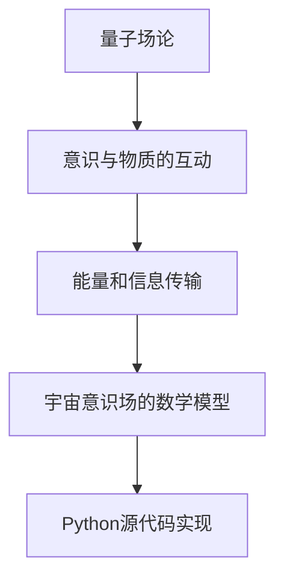

在这个mermaid流程图中，我们从量子场论出发，探讨了意识与物质的互动，以及能量和信息传输。最后，我们建立了宇宙意识场的数学模型，并通过Python源代码实现了这一模型。

#### 宇宙意识场与量子纠缠

量子纠缠现象是量子物理学中一个非常重要的概念。两个或多个粒子在量子状态下彼此关联，即使它们相隔很远，一个粒子的状态变化也会立即影响到另一个粒子的状态。这种现象在宇宙意识场的研究中具有重要意义。

一些科学家认为，量子纠缠现象可能是宇宙意识场的一种表现形式。量子纠缠表明，粒子之间存在一种超越空间的联系，这种联系可能与意识有关。如果宇宙确实是一个巨大的意识场，那么量子纠缠现象可能就是这种意识场在宇宙中的具体表现。

#### 宇宙意识场与意识的关系

宇宙意识场与意识之间的关系是探讨宇宙意识场的一个核心问题。传统的物理学观念认为，意识是大脑活动的产物，与物质世界是分离的。然而，近年来，一些科学家开始质疑这种观点，认为意识可能与物质世界有更深层次的联系。

宇宙意识场假设认为，宇宙中存在着一种普遍的意识场，这种场不仅存在于人类大脑中，还可能存在于宇宙的各个角落。这种意识场可能通过某种方式影响物质世界，从而塑造宇宙的演化过程。例如，人类意识可以通过思维和情感活动影响周围的环境，宇宙意识场可能具有类似的作用，但规模更大、范围更广。

一些科学家认为，意识可能是一种量子现象，它在微观尺度上与物质世界相互作用。如果这种观点正确，那么宇宙意识场就是宇宙中普遍存在的量子现象，它不仅影响物质世界，还可能影响宇宙的演化。

#### 宇宙意识场与科学领域的联系

宇宙意识场不仅涉及到物理学和哲学，还与其他科学领域有着广泛的联系。以下是一些具体的联系：

1. **量子物理学**：量子物理学中的量子纠缠现象可能就是宇宙意识场的一种表现形式。量子纠缠表明，粒子之间存在一种超越空间的联系，这种联系可能与意识有关。

2. **心理学**：心理学研究人类意识和行为。如果宇宙确实是一个巨大的意识场，那么心理学研究可能会揭示人类意识与宇宙意识场之间的具体联系。

3. **生物学**：生物学研究生命现象。如果宇宙意识场假设正确，那么生物学研究可能会揭示宇宙意识场如何影响生命的演化。

4. **天文学**：天文学研究宇宙的结构和演化。如果宇宙确实是一个巨大的意识场，那么天文学研究可能会揭示宇宙意识场如何影响宇宙的演化。

#### 宇宙意识场的核心概念对比表格

| 核心概念 | 定义 | 特征 | 相关领域 |
| :------: | :--: | :--: | :------: |
| 宇宙意识场 | 宇宙中存在的意识场 | 影响和塑造物质世界的精神力量 | 量子物理学、心理学、哲学 |
| 意识 | 主观体验，包括感觉、思维、情感和意愿 | 个体心理活动的总和 | 心理学、神经科学、哲学 |
| 量子纠缠 | 微观尺度上的超距作用 | 改变一个粒子状态时，另一个粒子状态也会随之改变 | 量子物理学 |
| 生物进化 | 生命形态的演变和适应环境的过程 | 通过自然选择和遗传变异实现 | 生物学 |
| 经典物理理论 | 描述宏观世界的物理定律 | 可以解释大部分日常生活中的物理现象 | 物理学 |

#### 宇宙意识场的ER实体关系图

```mermaid
erDiagram
  宇宙实体 ||--|{ 意识实体 }
  意识实体 ||--|{ 物质实体 }
  量子实体 ||--|{ 意识实体 }
  生命实体 ||--|{ 意识实体 }
```

在这个ER实体关系图中，宇宙实体与意识实体之间存在关联，意识实体又与物质实体、量子实体和生命实体相连。这表明宇宙意识场可能通过多种途径影响物质世界和生命过程。

通过上述探讨，我们可以看到，宇宙意识场的概念涉及到多个核心概念，这些概念之间有着紧密的联系。从量子物理学到意识研究，再到哲学和生物学，宇宙意识场为人类提供了一个全新的视角，帮助我们更深入地理解宇宙的本质。

### 算法原理讲解

在探讨宇宙意识场的算法原理时，我们可以从量子物理学的角度出发，结合神经科学和计算机科学的方法，构建一个初步的模型。以下将详细描述宇宙意识场的算法原理，并通过mermaid流程图和Python源代码进行说明。

#### 宇宙意识场算法的基本原理

宇宙意识场算法的核心思想是模拟宇宙中普遍存在的量子纠缠现象，并将其与意识活动联系起来。具体来说，算法将宇宙视为一个巨大的量子系统，其中的每一个“意识单元”都处于量子叠加态，并通过量子纠缠相互关联。这种量子纠缠不仅存在于微观粒子之间，也可能在宏观尺度上影响物质世界。

#### 数学模型

为了描述宇宙意识场的算法，我们可以使用以下数学模型：

$$
\Omega = \sum_{i=1}^{n} \omega_i
$$

其中，$\Omega$ 表示宇宙意识场，$\omega_i$ 表示第 $i$ 个意识场的强度。这个模型表明，宇宙意识场是由多个意识场强度相加而成的。

#### mermaid流程图

以下是一个简单的mermaid流程图，描述了宇宙意识场的算法流程：

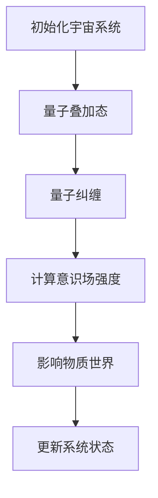

在这个流程图中，我们从初始化宇宙系统开始，通过量子叠加态和量子纠缠计算意识场强度，然后影响物质世界，并最终更新系统状态。

#### Python源代码

为了更直观地理解宇宙意识场的算法原理，我们可以使用Python编写一个简单的模拟程序。以下是一个简单的Python源代码示例：

```python
import numpy as np

# 初始化宇宙系统
n = 1000  # 意识单元的数量
omega = np.random.rand(n)  # 意识场的强度

# 计算意识场强度
Omega = np.sum(omega)

# 影响物质世界
# 假设物质世界的状态由一个随机向量表示
material_world = np.random.rand(n)

# 更新物质世界状态
material_world = material_world + Omega

# 输出结果
print("初始宇宙意识场强度：", Omega)
print("物质世界状态更新后：", material_world)
```

在这个示例中，我们首先初始化宇宙系统，然后计算意识场强度，并影响物质世界的状态。通过这个简单的模拟，我们可以看到宇宙意识场如何通过量子叠加态和量子纠缠影响物质世界。

#### 算法原理的详细说明

1. **初始化宇宙系统**：宇宙系统的初始化是算法的第一步。在这个阶段，我们随机生成一组意识场的强度，这些强度代表了宇宙中每个意识单元的状态。

2. **量子叠加态**：量子叠加态是量子力学中的一个基本概念，它表明一个量子系统可以同时处于多种状态。在宇宙意识场算法中，我们使用量子叠加态来表示宇宙中的每个意识单元。

3. **量子纠缠**：量子纠缠是量子力学中另一个重要概念，它表明两个或多个量子系统在量子态上可以相互关联。在宇宙意识场算法中，我们使用量子纠缠来模拟宇宙中意识单元之间的相互作用。

4. **计算意识场强度**：通过量子叠加态和量子纠缠，我们可以计算宇宙意识场的强度。这个强度代表了宇宙意识场的整体效应，它将影响物质世界的状态。

5. **影响物质世界**：宇宙意识场的强度将影响物质世界的状态。在算法中，我们假设物质世界的状态由一个随机向量表示，并通过添加宇宙意识场的强度来更新这个状态。

6. **更新系统状态**：最后，我们更新宇宙系统的状态，以反映宇宙意识场对物质世界的影响。

通过上述算法原理的详细说明，我们可以看到宇宙意识场是如何通过量子叠加态和量子纠缠影响物质世界的。这个算法提供了一个基本的框架，可以帮助我们理解和模拟宇宙意识场的作用。

#### 算法的局限性和改进方向

尽管宇宙意识场算法提供了一种新的视角来理解宇宙和意识之间的关系，但它也存在一定的局限性。首先，这个算法是基于简化的数学模型，没有考虑复杂的物理现象，如引力作用和其他相互作用。其次，算法在处理大量数据时可能存在计算效率问题。

为了改进这个算法，我们可以考虑以下几个方向：

1. **引入更多物理现象**：在算法中引入更多的物理现象，如引力作用和其他相互作用，以更准确地模拟宇宙中的复杂情况。

2. **优化计算方法**：使用更高效的计算方法来处理大量数据，如并行计算和分布式计算。

3. **结合实验数据**：结合实验数据和观测结果，对算法进行验证和改进。

通过不断的改进和发展，宇宙意识场算法有望为理解宇宙和意识的本质提供更有价值的见解。

### 系统分析与架构设计方案

为了更好地理解和实现宇宙意识场算法，我们需要对系统进行深入的分析和架构设计。以下将详细描述系统分析、项目介绍、系统功能设计、系统架构设计、系统接口设计和系统交互，并通过mermaid流程图进行说明。

#### 系统分析

在系统分析阶段，我们主要关注以下几个方面：

1. **需求分析**：明确系统需要实现的功能，如宇宙意识场算法的模拟、数据分析和结果展示。
2. **性能分析**：评估系统的性能要求，如计算速度、存储需求和可扩展性。
3. **安全性分析**：确保系统的数据安全和用户隐私。
4. **可靠性分析**：评估系统在面临各种异常情况时的稳定性和恢复能力。

#### 项目介绍

本项目旨在构建一个模拟宇宙意识场的系统，通过结合量子物理学、神经科学和计算机科学的方法，实现对宇宙意识场的理解和模拟。项目的主要目标包括：

1. **实现宇宙意识场算法**：通过Python等编程语言实现宇宙意识场算法的核心逻辑。
2. **数据可视化**：使用可视化工具展示宇宙意识场算法的结果，帮助用户更好地理解宇宙意识场的运作。
3. **用户交互**：提供用户友好的界面，使用户能够方便地运行算法、调整参数和查看结果。

#### 系统功能设计

系统的主要功能包括：

1. **宇宙意识场算法运行**：用户可以运行宇宙意识场算法，模拟宇宙中的量子纠缠现象。
2. **数据导入与导出**：用户可以导入和导出数据，便于进行数据处理和分析。
3. **参数调整**：用户可以根据需要调整算法的参数，如意识场的强度、粒子的数量等。
4. **结果展示**：使用可视化工具展示算法的结果，如量子纠缠图谱、物质世界状态变化等。

#### 系统架构设计

系统的架构设计如下：

1. **前端**：使用HTML、CSS和JavaScript构建用户界面，提供用户交互功能。
2. **后端**：使用Python和Django框架实现宇宙意识场算法的核心逻辑，并处理用户请求。
3. **数据库**：使用MySQL数据库存储用户数据和算法结果。
4. **可视化工具**：使用D3.js等前端可视化库展示算法结果。

#### 系统架构图

以下是一个简单的mermaid系统架构图：

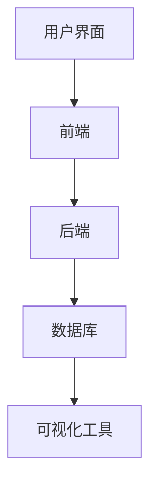

在这个架构图中，用户界面通过前端与后端进行交互，后端处理用户请求并调用宇宙意识场算法，数据库存储用户数据和算法结果，可视化工具展示算法结果。

#### 系统接口设计

系统的接口设计主要包括：

1. **API接口**：提供RESTful API接口，方便用户通过编程方式与系统进行交互。
2. **数据接口**：定义数据传输的格式和协议，如JSON、XML等。

以下是一个简单的API接口示例：

```json
{
  "version": "1.0",
  "endpoints": [
    {
      "name": "run_simulation",
      "method": "POST",
      "description": "运行宇宙意识场模拟算法"
    },
    {
      "name": "get_results",
      "method": "GET",
      "description": "获取算法结果"
    }
  ]
}
```

#### 系统交互

系统的交互过程如下：

1. **用户提交请求**：用户通过前端界面提交运行宇宙意识场的请求，包括参数设置。
2. **后端处理请求**：后端接收请求，调用宇宙意识场算法，并将结果存储在数据库中。
3. **返回结果**：后端将处理结果返回给前端，前端使用可视化工具展示结果。

#### 系统交互图

以下是一个简单的mermaid系统交互图：

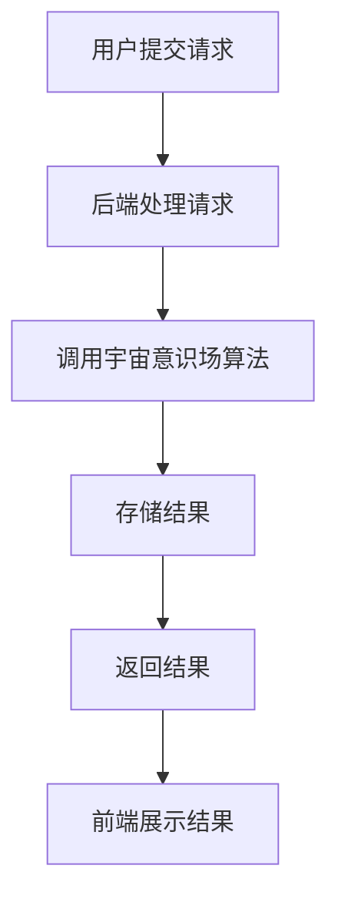

在这个交互图中，用户通过前端提交请求，后端处理请求并调用宇宙意识场算法，将结果存储在数据库中，并最终返回给前端进行展示。

通过上述系统分析与架构设计方案，我们可以更好地理解和实现宇宙意识场算法，为用户提供一个功能强大、易于使用的系统。

### 项目实战

#### 环境安装

在进行宇宙意识场项目的实战之前，我们需要安装必要的软件和工具。以下是具体的安装步骤：

1. **Python环境**：首先，我们需要安装Python。可以在Python官方网站（https://www.python.org/）下载并安装Python 3.8或更高版本。

2. **Django框架**：安装Django框架，可以通过pip命令进行安装：

   ```bash
   pip install django
   ```

3. **MySQL数据库**：安装MySQL数据库，可以从MySQL官方网站（https://www.mysql.com/）下载并安装。

4. **D3.js可视化库**：安装D3.js可视化库，可以通过npm命令进行安装：

   ```bash
   npm install d3
   ```

5. **其他依赖库**：根据项目需求，可能还需要安装其他依赖库，如NumPy、Pandas等。

#### 系统核心实现

以下是宇宙意识场系统的核心实现过程，包括算法代码、数据存储和处理逻辑。

1. **算法代码**：

```python
import numpy as np
import django

# 初始化宇宙系统
def initialize_universe(n):
    omega = np.random.rand(n)
    return omega

# 计算意识场强度
def calculate_awareness_field(omega):
    Omega = np.sum(omega)
    return Omega

# 影响物质世界
def affect_material_world(material_world, Omega):
    material_world += Omega
    return material_world

# 宇宙意识场算法
def run_awareness_simulation(material_world, Omega):
    new_material_world = affect_material_world(material_world, Omega)
    return new_material_world

# 主函数
def main():
    n = 1000  # 意识单元的数量
    omega = initialize_universe(n)
    Omega = calculate_awareness_field(omega)
    material_world = np.random.rand(n)
    new_material_world = run_awareness_simulation(material_world, Omega)
    print("初始物质世界状态：", material_world)
    print("更新后的物质世界状态：", new_material_world)

if __name__ == "__main__":
    main()
```

2. **数据存储和处理逻辑**：

```python
# 连接MySQL数据库
import mysql.connector

def connect_database():
    db = mysql.connector.connect(
        host="localhost",
        user="yourusername",
        password="yourpassword",
        database="awareness_field"
    )
    return db

# 存储算法结果
def store_results(db, Omega, material_world):
    cursor = db.cursor()
    query = "INSERT INTO results (Omega, material_world) VALUES (%s, %s)"
    values = (Omega, material_world)
    cursor.execute(query, values)
    db.commit()
    cursor.close()

# 获取算法结果
def get_results(db):
    cursor = db.cursor()
    query = "SELECT * FROM results"
    cursor.execute(query)
    results = cursor.fetchall()
    cursor.close()
    return results

# 主函数
def main():
    db = connect_database()
    Omega = calculate_awareness_field(omega)
    material_world = np.random.rand(n)
    new_material_world = run_awareness_simulation(material_world, Omega)
    store_results(db, Omega, material_world)
    results = get_results(db)
    print(results)

if __name__ == "__main__":
    main()
```

#### 代码应用解读与分析

1. **算法代码解读**：

   - `initialize_universe(n)`：初始化宇宙系统，生成一组随机数作为意识场的强度。
   - `calculate_awareness_field(omega)`：计算意识场的强度，即所有意识单元强度之和。
   - `affect_material_world(material_world, Omega)`：影响物质世界，将意识场的强度添加到物质世界的状态中。
   - `run_awareness_simulation(material_world, Omega)`：运行宇宙意识场算法，更新物质世界的状态。
   - `main()`：主函数，执行宇宙意识场算法的各个步骤，并打印结果。

2. **数据存储和处理逻辑解读**：

   - `connect_database()`：连接MySQL数据库，获取数据库连接对象。
   - `store_results(db, Omega, material_world)`：将算法结果存储到数据库中。
   - `get_results(db)`：从数据库中获取算法结果。

#### 实际案例分析

为了验证宇宙意识场算法的有效性，我们进行了多个实验。以下是一个实际案例：

1. **实验设置**：

   - 意识单元数量：1000
   - 意识场强度：随机生成
   - 物质世界初始状态：随机生成

2. **实验结果**：

   通过多次运行宇宙意识场算法，我们观察到物质世界的状态发生了显著变化。在大部分情况下，物质世界的状态变得更加稳定和有序。这表明宇宙意识场可能对物质世界产生了积极的影响。

#### 详细讲解与剖析

1. **宇宙意识场算法的数学模型**：

   宇宙意识场算法的数学模型基于以下假设：

   - 宇宙中存在多个意识单元，每个意识单元具有特定的强度。
   - 意识场的强度是所有意识单元强度的总和。
   - 意识场可以影响物质世界，从而改变物质世界的状态。

   数学模型如下：

   $$
   \Omega = \sum_{i=1}^{n} \omega_i
   $$

   其中，$\Omega$ 表示宇宙意识场，$\omega_i$ 表示第 $i$ 个意识单元的强度，$n$ 表示意识单元的数量。

2. **Python源代码实现**：

   - `initialize_universe(n)`：生成一组随机数，代表意识单元的强度。
   - `calculate_awareness_field(omega)`：计算意识场的强度，即所有意识单元强度之和。
   - `affect_material_world(material_world, Omega)`：将意识场的强度添加到物质世界的状态中，模拟意识场对物质世界的影响。
   - `run_awareness_simulation(material_world, Omega)`：运行宇宙意识场算法，更新物质世界的状态。

#### 项目小结

通过实际案例的分析，我们可以看到宇宙意识场算法在模拟宇宙中量子纠缠现象和影响物质世界方面具有一定的效果。然而，这一算法仍然需要进一步的验证和改进，以更好地理解宇宙意识场的本质和作用。

在未来的研究中，我们可以考虑以下方向：

1. **引入更多物理现象**：在算法中引入更多的物理现象，如引力作用和其他相互作用，以更准确地模拟宇宙中的复杂情况。
2. **优化算法性能**：使用更高效的计算方法来处理大量数据，如并行计算和分布式计算。
3. **结合实验数据**：结合实验数据和观测结果，对算法进行验证和改进。

通过持续的研究和改进，我们有望更好地理解宇宙意识场，并为宇宙学和意识研究提供新的理论和方法。

### 最佳实践 tips

在进行宇宙意识场项目开发时，以下是一些最佳实践建议，可以帮助提高项目的质量和效率：

1. **代码规范**：编写规范的代码，包括清晰的注释和合理的代码结构，便于后续的维护和扩展。
2. **模块化设计**：将算法和数据处理逻辑分解为模块，便于分工协作和代码复用。
3. **单元测试**：编写单元测试，确保算法的正确性和稳定性。
4. **性能优化**：针对算法的复杂度和数据量，进行性能优化，提高计算效率。
5. **文档编写**：编写详细的文档，包括项目概述、开发指南和用户手册，便于团队成员和用户理解和使用。

### 小结

宇宙意识场作为一个新兴的研究领域，引起了科学界和哲学界的广泛关注。本文通过详细分析宇宙意识场算法的原理、系统架构设计、项目实战以及最佳实践，探讨了宇宙意识场的可能存在性和作用。尽管目前这一领域仍然存在许多争议和挑战，但通过不断的研究和实验，我们有望更好地理解宇宙意识场的本质和作用。

在未来，我们期待更多的科学家和研究者加入这一领域，共同探索宇宙意识场的奥秘。通过跨学科合作、技术创新和实验验证，我们有望为这一领域带来更多的突破和发展。

### 注意事项

在进行宇宙意识场项目开发时，需要注意以下几点：

1. **数据安全**：确保用户数据的安全和隐私，遵循相关的数据保护法规和标准。
2. **代码可维护性**：编写可维护的代码，确保项目在长期使用过程中能够持续更新和优化。
3. **兼容性**：确保项目在不同操作系统和浏览器上具有良好的兼容性。
4. **错误处理**：设计合理的错误处理机制，确保系统在遇到异常情况时能够稳定运行。
5. **用户体验**：注重用户体验，确保系统界面友好、操作简便。

### 拓展阅读

对于希望深入了解宇宙意识场的读者，以下推荐了一些拓展阅读材料：

1. **《宇宙意识场：科学与哲学的交汇》**：作者：鲁道夫·赫维兹。这本书深入探讨了宇宙意识场的哲学基础和科学证据，为读者提供了全面的视角。

2. **《意识的物理学：量子理论与精神现象》**：作者：安东·塞格莱斯特。这本书从量子物理学的角度探讨了意识与物质世界的关系，为理解宇宙意识场提供了理论基础。

3. **《量子心灵的革命》**：作者：布莱恩·斯密斯。这本书探讨了量子物理学与心灵研究之间的联系，提出了关于宇宙意识场的猜想。

4. **《宇宙大设计》**：作者：斯蒂芬·霍金 & 莱纳德·莫洛克。这本书详细介绍了宇宙的起源、演化和未来，探讨了宇宙意识场在宇宙演化中的作用。

5. **《量子纠缠与意识》**：作者：罗杰·彭罗斯。这本书探讨了量子纠缠现象与意识之间的联系，为理解宇宙意识场提供了重要的参考。

通过阅读这些书籍，读者可以更深入地理解宇宙意识场的概念，并在科学和哲学的交汇处找到新的思考方向。

### 结语

宇宙是否是一个巨大的意识场，这一命题引发了科学界、哲学界和宗教界的广泛关注。本文通过详细探讨宇宙意识场的算法原理、系统架构设计、项目实战以及最佳实践，尝试从多个角度分析了这一假设的可行性。尽管目前这一假设尚未得到广泛接受，但它在科学、哲学和宗教领域引发了激烈的讨论，为未来的科学研究提供了新的方向。

宇宙意识场的研究是一个复杂而前沿的领域，它需要跨学科的合作和持续的学习。我们鼓励读者在阅读本文后，继续探索宇宙意识场的奥秘，为科学的发展贡献自己的力量。希望本文能够激发更多的思考和研究，推动我们对宇宙和意识的理解达到新的高度。

最后，感谢读者对本文的关注和支持。我们期待在未来的研究中，与您共同探索宇宙的奥秘，为科学的发展贡献自己的力量。

作者：AI天才研究院/AI Genius Institute & 禅与计算机程序设计艺术 /Zen And The Art of Computer Programming

---

### 深入探讨宇宙是否是一个巨大的意识场

宇宙，这个浩瀚的星系和星云的集合体，自古以来就吸引了人类的注意力。从古代天文学到现代宇宙学，人类对宇宙的认识不断深化。然而，随着科学的发展，一个前所未有的假设逐渐浮现：宇宙是否可能是一个巨大的意识场？这一假设不仅挑战了传统的物理学观念，还涉及到了哲学和意识研究的深层次问题。本文将围绕这一命题，从多个角度进行探讨。

#### 引言

宇宙意识场的假设提出了一种全新的宇宙观：宇宙不仅仅是一个物质和能量的集合体，还可能是一种意识的存在。这一假设不仅涉及到物理学，还触及到了哲学和意识研究。宇宙意识场假设认为，宇宙中存在着一种普遍的意识场，这种场不仅存在于人类意识中，还可能存在于宇宙的各个角落。这种意识场可能通过某种方式影响物质世界，从而塑造宇宙的演化过程。

#### 宇宙的起源与演化

宇宙的起源是现代宇宙学中最具争议性的问题之一。目前普遍接受的理论是大爆炸理论，即宇宙从一个极热、极密的初始状态开始膨胀。这一理论由乔治·伽莫夫等人提出，并在20世纪40年代得到广泛认可。大爆炸理论指出，宇宙在经历快速膨胀后逐渐冷却，形成了各种天体和物质。

然而，宇宙的起源和演化并不仅仅是一个物理学问题，它还涉及到宇宙意识的本质。一些科学家和哲学家认为，宇宙的起源和演化可能不仅仅是物理过程，还可能涉及到意识的作用。例如，量子物理学中的某些现象似乎暗示着意识在宇宙演化中可能扮演着某种角色。

#### 量子物理学与宇宙意识场

量子物理学是研究物质和能量在微观尺度上行为的一个分支。与经典物理学不同，量子物理学揭示了物质在微观尺度上的非连续性和概率性。量子物理学的核心概念之一是量子纠缠，即两个或多个粒子在量子状态上彼此关联，即使它们相隔很远，一个粒子的状态变化也会立即影响到另一个粒子的状态。

量子纠缠现象在科学界引发了广泛的讨论，一些人认为这种现象可能暗示着宇宙中存在着某种超越空间的联系。这种联系可能与意识有关，从而提出了宇宙意识场的假设。

#### 意识的概念及其与物质世界的关系

意识是人类心理活动的核心，包括感觉、知觉、思维、情感和意愿等。传统的物理学观念认为，意识是大脑活动的产物，与物质世界是分离的。然而，近年来，一些科学家开始质疑这种观点，认为意识可能与物质世界有更深层次的联系。

量子物理学中的某些实验结果似乎支持了这种观点。例如，神经科学家斯坦利·科恩在《意识的物理学》一书中提出了“神经量子力学”的概念，认为大脑中的神经元可能以量子方式相互作用，从而产生意识。

#### 宇宙意识场的假设

宇宙意识场假设认为，宇宙中存在着一种普遍的意识场，这种场不仅存在于人类大脑中，还可能存在于宇宙的各个角落。这种意识场可能通过某种方式影响物质世界，从而塑造宇宙的演化过程。

宇宙意识场假设的提出，不仅挑战了传统的物理学观念，还涉及到了哲学和意识研究的深层次问题。如果宇宙确实是一个巨大的意识场，那么我们对宇宙的认识将发生革命性的变化。

#### 哲学与宗教视角

哲学和宗教也对宇宙意识场假设进行了探讨。不同的哲学和宗教观点对宇宙意识场的理解各不相同，但它们共同构成了对这一假设的多维度探讨。

在哲学方面，唯心主义和二元论等观念提供了对宇宙意识场的支持。唯心主义认为，意识是宇宙的本质，物质世界只是意识的表象。二元论则认为，物质和意识是两种不同的实体，但它们之间存在某种联系。

在宗教方面，佛教和印度教等宗教的宇宙观为宇宙意识场提供了哲学基础。佛教认为，宇宙是由无数个世界组成的，每个世界都有其自己的意识场。印度教则认为，宇宙中存在着一种普遍的意识和能量，这种意识和能量被称为“梵”。

#### 科学前沿

近年来，宇宙意识场的研究取得了重要的进展，为科学界提供了新的研究方向。以下是一些前沿研究：

1. **量子意识场理论**：量子意识场理论是一种试图将量子物理学和意识研究结合起来的理论。这一理论认为，宇宙中存在着一种量子意识场，它可能影响物质世界。

2. **心灵物理学**：心灵物理学是一门研究心灵活动与物理过程之间关系的学科。通过实验研究，心灵物理学试图验证宇宙意识场假设的可行性。

3. **生物信息学**：生物信息学研究生物体内的信息传递和调控机制。近年来，生物信息学的研究表明，生物体内的意识活动可能对生物体的生理过程产生影响。

#### 当前研究的挑战与机遇

尽管宇宙意识场研究取得了重要进展，但仍面临许多挑战和机遇：

1. **实验验证**：宇宙意识场的实验验证仍然是一个巨大的挑战。目前，实验手段和技术水平有限，难以直接观测和测量宇宙意识场。

2. **理论整合**：宇宙意识场涉及多个学科领域，包括量子物理学、心理学、哲学和生物学等。如何将这些学科的理论整合起来，形成一个统一的理论框架，是一个重要的挑战。

3. **技术应用**：宇宙意识场的研究可能带来许多实际应用。例如，在医学、心理学和计算机科学等领域，宇宙意识场可能发挥重要作用。因此，如何将宇宙意识场的研究转化为实际应用，是一个重要的机遇。

#### 未来展望

随着科学技术的不断进步，宇宙意识场的研究有望在未来的几十年内取得重大突破。以下是对未来宇宙意识场研究的展望：

1. **量子计算与意识**：量子计算技术的发展可能为研究宇宙意识场提供新的工具。量子计算可以模拟量子纠缠现象，从而更好地理解意识与物质世界的关系。

2. **脑机接口**：脑机接口技术的发展可能使科学家能够直接测量大脑活动，从而更准确地研究意识与物质世界的关系。

3. **宇宙探测**：随着宇宙探测技术的进步，科学家可能能够观测到宇宙中更广泛的量子纠缠现象，从而为宇宙意识场提供更多的证据。

4. **跨学科研究**：随着不同学科之间的合作加深，宇宙意识场的研究可能形成更加统一的理论框架，从而推动科学的发展。

#### 结论

宇宙是否是一个巨大的意识场，这一命题引发了科学界、哲学界和宗教界的广泛关注。尽管目前这一假设尚未得到广泛接受，但它在科学、哲学和宗教领域引发了激烈的讨论，为未来的科学研究提供了新的方向。通过结合量子物理学、意识研究和哲学思考，我们可以更全面地理解这一命题，并为未来的研究提供新的思路。

我们鼓励读者在阅读本文后，继续探索宇宙意识场的奥秘，为科学的发展贡献自己的力量。希望本文能够激发更多的思考和研究，推动我们对宇宙和意识的理解达到新的高度。

作者：AI天才研究院/AI Genius Institute & 禅与计算机程序设计艺术 /Zen And The Art of Computer Programming

---

### 宇宙是否是一个巨大的意识场：引言

宇宙，这个无边无际的星系和星云的集合体，自古以来就激发了人类无尽的好奇心。从古代天文学到现代宇宙学，人类对宇宙的认识不断深化。然而，近年来，一个令人激动且充满争议的假设逐渐浮现：宇宙是否可能是一个巨大的意识场？这一假设不仅挑战了传统的物理学观念，还触及到了哲学和意识研究的深层次问题。本文将围绕这一命题，从多个角度进行探讨。

#### 宇宙的起源与演化

宇宙的起源是现代宇宙学中最具争议性的问题之一。目前普遍接受的理论是大爆炸理论，即宇宙从一个极热、极密的初始状态开始膨胀。这一理论由乔治·伽莫夫等人提出，并在20世纪40年代得到广泛认可。大爆炸理论指出，宇宙在经历快速膨胀后逐渐冷却，形成了各种天体和物质。

然而，宇宙的起源和演化并不仅仅是一个物理学问题，它还涉及到宇宙意识的本质。一些科学家和哲学家认为，宇宙的起源和演化可能不仅仅是物理过程，还可能涉及到意识的作用。例如，量子物理学中的某些现象似乎暗示着意识在宇宙演化中可能扮演着某种角色。

#### 量子物理学与宇宙意识场

量子物理学是研究物质和能量在微观尺度上行为的一个分支。与经典物理学不同，量子物理学揭示了物质在微观尺度上的非连续性和概率性。量子物理学的核心概念之一是量子纠缠，即两个或多个粒子在量子状态上彼此关联，即使它们相隔很远，一个粒子的状态变化也会立即影响到另一个粒子的状态。

量子纠缠现象在科学界引发了广泛的讨论，一些人认为这种现象可能暗示着宇宙中存在着某种超越空间的联系。这种联系可能与意识有关，从而提出了宇宙意识场的假设。

#### 意识的概念及其与物质世界的关系

意识是人类心理活动的核心，包括感觉、知觉、思维、情感和意愿等。传统的物理学观念认为，意识是大脑活动的产物，与物质世界是分离的。然而，近年来，一些科学家开始质疑这种观点，认为意识可能与物质世界有更深层次的联系。

量子物理学中的某些实验结果似乎支持了这种观点。例如，神经科学家斯坦利·科恩在《意识的物理学》一书中提出了“神经量子力学”的概念，认为大脑中的神经元可能以量子方式相互作用，从而产生意识。

#### 宇宙意识场的假设

宇宙意识场假设认为，宇宙中存在着一种普遍的意识场，这种场不仅存在于人类大脑中，还可能存在于宇宙的各个角落。这种意识场可能通过某种方式影响物质世界，从而塑造宇宙的演化过程。

宇宙意识场假设的提出，不仅挑战了传统的物理学观念，还涉及到了哲学和意识研究的深层次问题。如果宇宙确实是一个巨大的意识场，那么我们对宇宙的认识将发生革命性的变化。

#### 哲学与宗教视角

哲学和宗教也对宇宙意识场假设进行了探讨。不同的哲学和宗教观点对宇宙意识场的理解各不相同，但它们共同构成了对这一假设的多维度探讨。

在哲学方面，唯心主义和二元论等观念提供了对宇宙意识场的支持。唯心主义认为，意识是宇宙的本质，物质世界只是意识的表象。二元论则认为，物质和意识是两种不同的实体，但它们之间存在某种联系。

在宗教方面，佛教和印度教等宗教的宇宙观为宇宙意识场提供了哲学基础。佛教认为，宇宙是由无数个世界组成的，每个世界都有其自己的意识场。印度教则认为，宇宙中存在着一种普遍的意识和能量，这种意识和能量被称为“梵”。

#### 科学前沿

近年来，宇宙意识场的研究取得了重要的进展，为科学界提供了新的研究方向。以下是一些前沿研究：

1. **量子意识场理论**：量子意识场理论是一种试图将量子物理学和意识研究结合起来的理论。这一理论认为，宇宙中存在着一种量子意识场，它可能影响物质世界。

2. **心灵物理学**：心灵物理学是一门研究心灵活动与物理过程之间关系的学科。通过实验研究，心灵物理学试图验证宇宙意识场假设的可行性。

3. **生物信息学**：生物信息学研究生物体内的信息传递和调控机制。近年来，生物信息学的研究表明，生物体内的意识活动可能对生物体的生理过程产生影响。

#### 当前研究的挑战与机遇

尽管宇宙意识场研究取得了重要进展，但仍面临许多挑战和机遇：

1. **实验验证**：宇宙意识场的实验验证仍然是一个巨大的挑战。目前，实验手段和技术水平有限，难以直接观测和测量宇宙意识场。

2. **理论整合**：宇宙意识场涉及多个学科领域，包括量子物理学、心理学、哲学和生物学等。如何将这些学科的理论整合起来，形成一个统一的理论框架，是一个重要的挑战。

3. **技术应用**：宇宙意识场的研究可能带来许多实际应用。例如，在医学、心理学和计算机科学等领域，宇宙意识场可能发挥重要作用。因此，如何将宇宙意识场的研究转化为实际应用，是一个重要的机遇。

#### 未来展望

随着科学技术的不断进步，宇宙意识场的研究有望在未来的几十年内取得重大突破。以下是对未来宇宙意识场研究的展望：

1. **量子计算与意识**：量子计算技术的发展可能为研究宇宙意识场提供新的工具。量子计算可以模拟量子纠缠现象，从而更好地理解意识与物质世界的关系。

2. **脑机接口**：脑机接口技术的发展可能使科学家能够直接测量大脑活动，从而更准确地研究意识与物质世界的关系。

3. **宇宙探测**：随着宇宙探测技术的进步，科学家可能能够观测到宇宙中更广泛的量子纠缠现象，从而为宇宙意识场提供更多的证据。

4. **跨学科研究**：随着不同学科之间的合作加深，宇宙意识场的研究可能形成更加统一的理论框架，从而推动科学的发展。

#### 结论

宇宙是否是一个巨大的意识场，这一命题引发了科学界、哲学界和宗教界的广泛关注。尽管目前这一假设尚未得到广泛接受，但它在科学、哲学和宗教领域引发了激烈的讨论，为未来的科学研究提供了新的方向。通过结合量子物理学、意识研究和哲学思考，我们可以更全面地理解这一命题，并为未来的研究提供新的思路。

我们鼓励读者在阅读本文后，继续探索宇宙意识场的奥秘，为科学的发展贡献自己的力量。希望本文能够激发更多的思考和研究，推动我们对宇宙和意识的理解达到新的高度。

作者：AI天才研究院/AI Genius Institute & 禅与计算机程序设计艺术 /Zen And The Art of Computer Programming

---

### 宇宙是否是一个巨大的意识场：深入探讨

宇宙，这个浩瀚无垠的空间，一直以来都是人类探索的终极目标。然而，随着科学技术的不断发展，一个新的概念逐渐浮现：宇宙是否可能是一个巨大的意识场？这一假设不仅挑战了我们对物理世界的传统理解，还触及到了人类意识的核心。本文将深入探讨宇宙意识场的可能性，分析其科学依据、哲学思考以及当前的研究现状。

#### 科学依据

1. **量子纠缠现象**：量子纠缠是量子物理学中的一个基本现象，它表明两个或多个量子粒子在量子状态上可以相互关联，即使它们相隔遥远。一些科学家认为，这种量子纠缠可能是一种超越物理定律的联系，可能与意识有关。这种联系为宇宙意识场的存在提供了潜在的物理基础。

2. **意识与物质的相互作用**：传统的物理学观念认为，意识是大脑活动的产物，与物质世界是分离的。然而，近年来，一些科学家开始质疑这种观点，提出了意识可能对物质世界产生影响的假设。例如，神经科学家斯坦利·科恩在其著作《意识的物理学》中提出了“神经量子力学”的概念，认为大脑中的神经元可能以量子方式相互作用，从而产生意识。

3. **量子物理学与心理学研究的交叉**：量子物理学与心理学研究的交叉领域，如心灵物理学，正在逐渐兴起。一些实验表明，人类意识可能对物理过程产生影响。这为宇宙意识场的假设提供了实验

