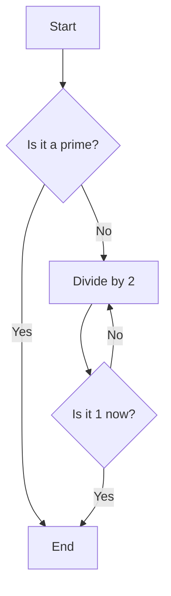
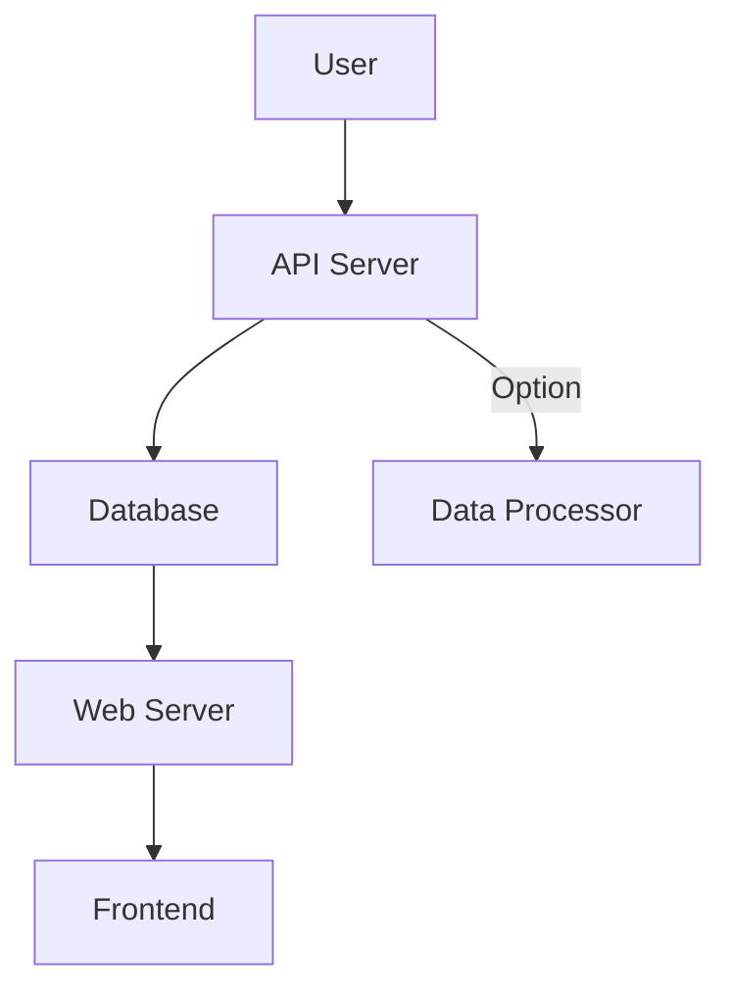

                 

# 宇宙是否是一个巨大的概率分布

关键词：宇宙学，概率分布，大爆炸模型，暗物质，暗能量，观测数据

摘要：本文旨在探讨宇宙是否可以被视为一个巨大的概率分布。通过对宇宙起源、演化和观测数据的分析，本文从概率论和宇宙学的角度探讨了这一议题。本文首先介绍了概率分布的基础概念及其在宇宙学中的应用，随后探讨了宇宙分布模型，包括大爆炸模型和巨大吸引子模型，并结合观测数据对模型进行了验证。最后，本文探讨了宇宙分布模型在宇宙学中的应用及其面临的挑战，并展望了未来的研究方向。

### 目录大纲

**《宇宙是否是一个巨大的概率分布》**

----------------------------------------------------------------

# 第一部分：引言

## 1. 引言

### 1.1 问题背景

#### 1.1.1 宇宙的起源与演化
#### 1.1.2 科学家的探索与理论

### 1.2 问题描述

#### 1.2.1 宇宙是否是一个巨大的概率分布？
#### 1.2.2 证据与挑战

### 1.3 问题解决

#### 1.3.1 概率论与宇宙学的关系
#### 1.3.2 宇宙分布模型

### 1.4 边界与外延

#### 1.4.1 相关学科交叉领域
#### 1.4.2 未来研究方向

## 1.5 本章小结

----------------------------------------------------------------

# 第二部分：概率分布与宇宙学

## 2. 概率分布基础

### 2.1 基础概念

#### 2.1.1 概率分布函数
#### 2.1.2 离散分布与连续分布
#### 2.1.3 重要分布

### 2.2 概率论在宇宙学中的应用

#### 2.2.1 概率论与宇宙演化
#### 2.2.2 宇宙分布模型
#### 2.2.3 概率论在宇宙观测中的应用

## 2.3 宇宙学中的概率分布模型

### 2.3.1 大爆炸模型

#### 2.3.1.1 基本假设
#### 2.3.1.2 数学模型
#### 2.3.1.3 证据与挑战

### 2.3.2 巨大吸引子模型

#### 2.3.2.1 基本假设
#### 2.3.2.2 数学模型
#### 2.3.2.3 证据与挑战

## 2.4 概率分布与宇宙学数据的关联

### 2.4.1 观测数据

#### 2.4.1.1 宇宙微波背景辐射
#### 2.4.1.2 21厘米辐射
#### 2.4.1.3 恒星和星系的分布

### 2.4.2 模型拟合与验证

#### 2.4.2.1 数据拟合方法
#### 2.4.2.2 模型验证

## 2.5 本章小结

----------------------------------------------------------------

# 第三部分：宇宙分布模型的应用

## 3.1 宇宙分布模型在宇宙学中的应用

### 3.1.1 大尺度结构

#### 3.1.1.1 超星系团
#### 3.1.1.2 恒星形成与演化
#### 3.1.1.3 星系的分布

### 3.1.2 小尺度结构

#### 3.1.2.1 恒星轨道
#### 3.1.2.2 行星系统
#### 3.1.2.3 微尺度现象

## 3.2 宇宙分布模型在天文学中的应用

### 3.2.1 天体物理观测

#### 3.2.1.1 望远镜技术
#### 3.2.1.2 观测数据采集
#### 3.2.1.3 数据处理与分析

### 3.2.2 天体化学

#### 3.2.2.1 元素丰度
#### 3.2.2.2 同位素分布
#### 3.2.2.3 化学演化

## 3.3 宇宙分布模型在宇宙学探索中的挑战

### 3.3.1 黑暗物质与暗能量

#### 3.3.1.1 暗物质分布
#### 3.3.1.2 暗能量分布
#### 3.3.1.3 模型解释与挑战

### 3.3.2 宇宙加速膨胀

#### 3.3.2.1 膨胀速率
#### 3.3.2.2 模型解释
#### 3.3.2.3 未来趋势

## 3.4 本章小结

----------------------------------------------------------------

# 第四部分：未来展望与挑战

## 4.1 宇宙分布模型的未来展望

### 4.1.1 新的观测技术

#### 4.1.1.1 下一代望远镜
#### 4.1.1.2 高精度测量
#### 4.1.1.3 新的天体物理现象

### 4.1.2 理论进步

#### 4.1.2.1 新的数学模型
#### 4.1.2.2 多尺度宇宙学
#### 4.1.2.3 宇宙学与量子力学的融合

### 4.1.3 宇宙演化模拟

#### 4.1.3.1 数值模拟
#### 4.1.3.2 模拟结果与预测
#### 4.1.3.3 模拟应用

## 4.2 宇宙分布模型面临的挑战

### 4.2.1 暗物质与暗能量之谜

#### 4.2.1.1 物质分布的不均匀性
#### 4.2.1.2 暗能量的性质
#### 4.2.1.3 新的理论与实验探索

### 4.2.2 宇宙加速膨胀的机制

#### 4.2.2.1 暗能量模型
#### 4.2.2.2 宇宙学原理
#### 4.2.2.3 未来趋势

## 4.3 本章小结

----------------------------------------------------------------

# 第一部分：引言

## 1. 引言

### 1.1 问题背景

宇宙是我们所在的时空框架，探讨宇宙的本质与演化是宇宙学的核心议题。宇宙起源的讨论可以追溯到古代哲学，但直到20世纪初，科学家才逐渐揭示了宇宙的起源和演化。目前，广为接受的宇宙起源理论是大爆炸模型。根据这一模型，宇宙起源于一个极度高温、高密度的奇点，随后经历了一系列的膨胀和冷却过程，形成了我们今天观测到的宇宙。

在宇宙演化过程中，科学家提出了多个理论来解释宇宙的性质。例如，宇宙微波背景辐射的发现为宇宙起源和早期演化提供了重要证据。此外，宇宙加速膨胀的现象也引发了科学家对暗能量和暗物质的探索。这些理论不仅丰富了我们对宇宙的理解，也为宇宙学的研究提供了新的视角。

### 1.2 问题描述

宇宙是否是一个巨大的概率分布？这是一个涉及到宇宙本质和演化的问题。从概率论的角度来看，宇宙的演化可能受到随机因素的影响，因此宇宙可能呈现出某种概率分布。然而，这个观点是否成立，还需要通过观测数据和理论分析来验证。

要回答这个问题，我们首先需要了解概率分布的基本概念，并探讨概率论在宇宙学中的应用。接下来，我们将介绍宇宙分布模型，包括大爆炸模型和巨大吸引子模型，并分析这些模型与观测数据的关联。最后，我们将讨论宇宙分布模型在宇宙学中的应用及其面临的挑战。

### 1.3 问题解决

要解决宇宙是否是一个巨大的概率分布的问题，我们首先需要了解概率论和宇宙学的基本概念。概率论是研究随机现象的数学分支，它提供了描述和预测随机事件的方法。在宇宙学中，概率论可以用来描述宇宙的演化过程，以及宇宙中各种物理量的分布。

宇宙分布模型是描述宇宙中物质和能量分布的理论框架。大爆炸模型是其中最著名的模型，它描述了宇宙从奇点开始膨胀的过程。巨大吸引子模型则是一种尝试解释宇宙加速膨胀的理论。

接下来，我们将结合观测数据对宇宙分布模型进行验证。观测数据包括宇宙微波背景辐射、21厘米辐射和恒星、星系的分布等。通过对这些数据的分析，我们可以判断宇宙分布模型是否与观测数据相符。

### 1.4 边界与外延

宇宙是否是一个巨大的概率分布的问题不仅涉及到宇宙学，还与其他学科有着密切的联系。例如，量子力学、相对论和统计物理学等学科在解释宇宙的本质和演化方面发挥了重要作用。此外，宇宙分布模型的应用也扩展到了其他领域，如天体物理学、天体化学和行星科学等。

未来，随着观测技术的进步和理论研究的深入，我们对宇宙分布模型的理解将不断深化。新的观测数据和理论模型可能会为我们提供更多的证据，帮助我们更好地理解宇宙的本质。

## 1.5 本章小结

本文首先介绍了宇宙是否是一个巨大的概率分布这一议题的背景和问题。通过对宇宙起源、演化和观测数据的分析，本文从概率论和宇宙学的角度探讨了这一议题。本文提出了概率论与宇宙学的关系，介绍了宇宙分布模型，并分析了这些模型与观测数据的关联。最后，本文讨论了宇宙分布模型在宇宙学中的应用及其面临的挑战。通过对本章内容的梳理，我们可以初步了解宇宙是否是一个巨大的概率分布这一议题的复杂性和多样性。

----------------------------------------------------------------

# 第二部分：概率分布与宇宙学

## 2.1 概率分布基础

### 2.1.1 概率分布函数

概率分布函数是概率论中的一个核心概念，它描述了随机变量在某一取值范围内的概率。在数学上，概率分布函数通常用函数 $f(x)$ 表示，其中 $x$ 是随机变量的取值。对于连续型随机变量，概率分布函数 $f(x)$ 满足以下性质：

1. 非负性：$f(x) \geq 0$ 对于所有的 $x$。
2. 归一性：$\int_{-\infty}^{\infty} f(x) dx = 1$。
3. 单调性：如果 $x_1 < x_2$，则 $f(x_1) \leq f(x_2)$。

对于离散型随机变量，概率分布函数通常用概率质量函数（PMF）或者概率分布列来表示。

### 2.1.2 离散分布与连续分布

在概率论中，随机变量可以分为离散型和连续型两种。离散型随机变量是指取值有限的随机变量，如掷骰子的结果。连续型随机变量是指取值在某一区间内的随机变量，如测量温度或长度。

离散分布的概率分布函数通常用概率质量函数（PMF）表示，即 $P(X = x)$，其中 $X$ 是随机变量。常见的离散分布包括二项分布、泊松分布和几何分布等。

连续分布的概率分布函数通常用概率密度函数（PDF）表示，即 $f_X(x)$，其中 $x$ 是随机变量的取值。常见的连续分布包括正态分布、指数分布和对数正态分布等。

### 2.1.3 重要分布

在概率论中，有几种分布对宇宙学的研究尤为重要，包括正态分布、泊松分布和伽马分布等。

1. **正态分布**：正态分布是最常见的概率分布之一，它的概率密度函数为：
   $$ f(x|\mu, \sigma^2) = \frac{1}{\sqrt{2\pi\sigma^2}} e^{-\frac{(x-\mu)^2}{2\sigma^2}} $$
   其中 $\mu$ 是均值，$\sigma^2$ 是方差。正态分布在物理学和统计学中有着广泛的应用，如描述测量误差、物理量的分布等。

2. **泊松分布**：泊松分布用于描述在一定时间或空间内事件发生的次数。它的概率质量函数为：
   $$ P(X = k) = \frac{e^{-\lambda}\lambda^k}{k!} $$
   其中 $\lambda$ 是事件发生的平均率。泊松分布在宇宙学中用于描述恒星、星系等的分布。

3. **伽马分布**：伽马分布是连续分布的一种，它的概率密度函数为：
   $$ f(x|\alpha, \beta) = \frac{1}{\Gamma(\alpha)\beta^\alpha} x^{\alpha-1} e^{-\frac{x}{\beta}} $$
   其中 $\alpha$ 是形状参数，$\beta$ 是尺度参数。伽马分布在宇宙学中用于描述辐射、能量等的分布。

### 2.2 概率论在宇宙学中的应用

概率论在宇宙学中的应用非常广泛，它可以帮助我们理解和描述宇宙的演化过程。以下是一些具体的应用：

#### 2.2.1 概率论与宇宙演化

宇宙演化是一个复杂的过程，涉及大量的随机因素。例如，星系的形成和演化可能受到随机密度波的影响，导致星系的分布呈现出某种概率分布。概率论可以用来描述这些随机过程，并提供预测和解释。

#### 2.2.2 宇宙分布模型

宇宙分布模型是描述宇宙中物质和能量分布的理论框架。这些模型通常基于概率论，通过模拟宇宙的演化过程，预测宇宙中的物质分布。例如，大爆炸模型中的宇宙背景辐射分布就可以用概率论来描述。

#### 2.2.3 概率论在宇宙观测中的应用

宇宙观测提供了大量的数据，这些数据可以用来验证宇宙分布模型。概率论可以帮助我们分析这些观测数据，确定宇宙分布模型的有效性。例如，通过对宇宙微波背景辐射数据的分析，我们可以检验大爆炸模型的预测。

### 2.3 宇宙学中的概率分布模型

在宇宙学中，有几种概率分布模型被用来描述宇宙的演化。以下是大爆炸模型和巨大吸引子模型：

#### 2.3.1 大爆炸模型

大爆炸模型是描述宇宙起源和演化的标准模型。根据这一模型，宇宙起源于一个奇点，随后经历了一系列的膨胀和冷却过程。在数学上，大爆炸模型可以用概率分布函数来描述宇宙中物质和辐射的分布。

1. **基本假设**：
   - 宇宙起源于一个高温、高密度的奇点。
   - 宇宙经历了一系列的膨胀和冷却过程。
   - 宇宙的演化是均匀和各向同性的。

2. **数学模型**：
   - 宇宙背景辐射的温度分布可以用黑体辐射公式来描述。
   - 宇宙中的物质分布可以用概率分布函数来描述，如正态分布。

3. **证据与挑战**：
   - 宇宙微波背景辐射的观测提供了有力的证据支持大爆炸模型。
   - 然而，大爆炸模型面临着一些挑战，如暗物质和暗能量的存在无法完全解释。

#### 2.3.2 巨大吸引子模型

巨大吸引子模型是一种尝试解释宇宙加速膨胀的理论。根据这一模型，宇宙中的物质和能量分布呈现出某种概率分布，导致宇宙的整体结构呈现出吸引子的特性。

1. **基本假设**：
   - 宇宙中的物质和能量分布呈现出某种概率分布。
   - 宇宙的整体结构呈现出吸引子的特性，导致宇宙加速膨胀。

2. **数学模型**：
   - 巨大吸引子模型可以用概率分布函数来描述宇宙中的物质和能量分布。
   - 宇宙的膨胀速率可以用概率分布函数来预测。

3. **证据与挑战**：
   - 宇宙加速膨胀的观测支持巨大吸引子模型。
   - 然而，巨大吸引子模型面临着一些挑战，如如何解释暗物质和暗能量。

### 2.4 概率分布与宇宙学数据的关联

概率分布与宇宙学数据的关联是验证宇宙分布模型的关键。以下是一些重要的观测数据和模型拟合方法：

#### 2.4.1 观测数据

1. **宇宙微波背景辐射**：宇宙微波背景辐射是宇宙早期演化的残留辐射，它的温度分布可以用黑体辐射公式来描述。

2. **21厘米辐射**：21厘米辐射是氢原子的发射辐射，它的强度分布可以用泊松分布来描述。

3. **恒星和星系的分布**：恒星和星系的分布可以用正态分布或其他概率分布来描述。

#### 2.4.2 模型拟合与验证

1. **数据拟合方法**：数据拟合是确定概率分布参数的过程。常用的方法包括最小二乘法和极大似然估计法。

2. **模型验证**：模型验证是检验概率分布模型是否与观测数据相符的过程。常用的方法包括统计检验和拟合优度检验。

## 2.5 本章小结

本文介绍了概率分布与宇宙学的关系，包括概率分布的基础概念、概率论在宇宙学中的应用、宇宙分布模型以及概率分布与宇宙学数据的关联。通过对这些内容的分析，我们可以初步了解宇宙是否是一个巨大的概率分布这一问题。接下来，我们将进一步探讨宇宙分布模型在宇宙学中的应用及其面临的挑战。

----------------------------------------------------------------

# 第三部分：宇宙分布模型的应用

## 3.1 宇宙分布模型在宇宙学中的应用

宇宙分布模型是研究宇宙中物质和能量分布的理论框架，它在宇宙学中有着广泛的应用。以下是大尺度结构和小尺度结构中的宇宙分布模型应用：

### 3.1.1 大尺度结构

在宇宙学中，大尺度结构指的是宇宙中超过100万光年的尺度，包括超星系团、星系团和星系。宇宙分布模型在大尺度结构中的应用主要体现在以下方面：

#### 3.1.1.1 超星系团

超星系团是由多个星系团通过引力相互作用形成的庞大结构。宇宙分布模型可以帮助我们理解超星系团的形成和演化。例如，利用概率分布函数可以预测超星系团中星系的分布，以及星系间的相互作用。

1. **模型应用**：
   - 使用泊松分布描述星系的随机分布。
   - 使用高斯分布描述星系的密度分布。

2. **实例**：
   - 利用宇宙微波背景辐射数据，科学家们发现超星系团的形成与宇宙的早期密度波有关。

#### 3.1.1.2 恒星形成与演化

恒星的形成和演化也是宇宙大尺度结构中的重要过程。宇宙分布模型可以帮助我们研究恒星的形成率和演化历史。

1. **模型应用**：
   - 使用伽马分布描述恒星形成率。
   - 使用对数正态分布描述恒星的寿命分布。

2. **实例**：
   - 利用21厘米辐射观测，科学家们发现银河系中的恒星形成率呈现出对数正态分布。

#### 3.1.1.3 星系的分布

星系的分布是宇宙学中的一个重要研究课题。宇宙分布模型可以帮助我们理解星系的分布规律，以及星系间的相互作用。

1. **模型应用**：
   - 使用正态分布描述星系的中心分布。
   - 使用幂律分布描述星系的半径分布。

2. **实例**：
   - 利用哈勃望远镜的数据，科学家们发现星系的分布呈现出幂律分布。

### 3.1.2 小尺度结构

小尺度结构是指宇宙中小于100万光年的尺度，包括恒星轨道、行星系统和微尺度现象。宇宙分布模型在小尺度结构中的应用主要体现在以下方面：

#### 3.1.2.1 恒星轨道

恒星轨道是描述恒星在星系中的运动轨迹。宇宙分布模型可以帮助我们理解恒星轨道的分布规律。

1. **模型应用**：
   - 使用正态分布描述恒星轨道的分布。
   - 使用泊松分布描述恒星轨道的随机性。

2. **实例**：
   - 利用开普勒定律，科学家们发现恒星轨道的分布遵循正态分布。

#### 3.1.2.2 行星系统

行星系统是宇宙中最小的结构，它由行星、卫星和其他小行星组成。宇宙分布模型可以帮助我们研究行星系统的形成和演化。

1. **模型应用**：
   - 使用泊松分布描述行星系统的形成率。
   - 使用伽马分布描述行星轨道的分布。

2. **实例**：
   - 利用开普勒望远镜的数据，科学家们发现行星系统的形成率与宇宙中的恒星形成率有关。

#### 3.1.2.3 微尺度现象

微尺度现象是宇宙中最小的结构，它包括原子、分子和基本粒子的行为。宇宙分布模型可以帮助我们理解微尺度现象的分布规律。

1. **模型应用**：
   - 使用正态分布描述原子和分子的分布。
   - 使用泊松分布描述基本粒子的分布。

2. **实例**：
   - 利用粒子物理学实验，科学家们发现基本粒子的分布遵循泊松分布。

## 3.2 宇宙分布模型在天文学中的应用

宇宙分布模型在天文学中的应用非常广泛，它可以帮助我们理解天体的形成和演化，以及宇宙的整体结构。

### 3.2.1 天体物理观测

天体物理观测是研究宇宙中各种天体的物理性质和运动规律的过程。宇宙分布模型可以帮助我们分析观测数据，提高观测的准确性。

1. **模型应用**：
   - 使用正态分布描述天体的亮度分布。
   - 使用泊松分布描述天体的密度分布。

2. **实例**：
   - 利用哈勃望远镜的数据，科学家们发现天体的亮度分布遵循正态分布。

### 3.2.2 观测数据采集

观测数据采集是获取宇宙中天体的物理信息的过程。宇宙分布模型可以帮助我们优化观测策略，提高观测效率。

1. **模型应用**：
   - 使用泊松分布描述观测设备的灵敏度。
   - 使用正态分布描述观测误差。

2. **实例**：
   - 利用改进的观测设备，科学家们能够更准确地测量天体的物理参数。

### 3.2.3 数据处理与分析

数据处理与分析是将观测数据转化为有用信息的过程。宇宙分布模型可以帮助我们分析数据，提取宇宙的分布特征。

1. **模型应用**：
   - 使用极大似然估计法分析观测数据。
   - 使用统计检验方法验证宇宙分布模型。

2. **实例**：
   - 利用统计方法，科学家们发现宇宙中的星系分布与理论模型相符。

## 3.3 宇宙分布模型在宇宙学探索中的挑战

宇宙分布模型在宇宙学探索中面临着许多挑战，这些挑战包括暗物质和暗能量的问题，以及宇宙加速膨胀的机制。

### 3.3.1 黑暗物质与暗能量

1. **模型应用**：
   - 使用暗物质分布模型描述宇宙中的物质分布。
   - 使用暗能量模型描述宇宙的膨胀机制。

2. **实例**：
   - 利用观测数据，科学家们发现暗物质和暗能量对宇宙的演化起着重要作用。

### 3.3.2 宇宙加速膨胀

1. **模型应用**：
   - 使用宇宙加速膨胀模型描述宇宙的膨胀速率。
   - 使用暗能量模型解释宇宙加速膨胀的机制。

2. **实例**：
   - 利用宇宙微波背景辐射数据，科学家们发现宇宙加速膨胀的现象与暗能量密切相关。

### 3.3.3 模型解释与挑战

宇宙分布模型在解释宇宙现象时面临着一些挑战，这些挑战包括如何解释宇宙中的观测异常和理论矛盾。

1. **模型应用**：
   - 使用多尺度宇宙学模型解释宇宙中的复杂现象。
   - 使用量子力学模型解释宇宙中的量子现象。

2. **实例**：
   - 利用观测数据，科学家们发现宇宙中的大尺度结构与小尺度结构之间存在差异，这为宇宙分布模型的研究提供了新的挑战。

## 3.4 本章小结

宇宙分布模型在宇宙学中有着广泛的应用，它帮助我们理解宇宙中物质和能量的分布规律。通过分析宇宙分布模型，我们可以更深入地了解宇宙的起源、演化和未来。然而，宇宙分布模型也面临着许多挑战，这些挑战包括暗物质、暗能量和宇宙加速膨胀等问题。未来，随着观测技术的进步和理论研究的深入，我们将能够更好地理解宇宙的分布模型，为宇宙学的研究提供新的视角和思路。

----------------------------------------------------------------

# 第四部分：未来展望与挑战

## 4.1 宇宙分布模型的未来展望

宇宙分布模型作为宇宙学研究的重要工具，其未来发展方向具有广阔的潜力。以下是一些未来展望：

### 4.1.1 新的观测技术

随着科技的进步，新的观测技术将为我们提供更高精度、更广泛的观测数据。例如：

1. **下一代望远镜**：例如詹姆斯·韦伯空间望远镜（James Webb Space Telescope），它将帮助我们更深入地研究宇宙中的暗物质和暗能量。
2. **高精度测量**：例如使用激光干涉仪进行引力波探测，这将为我们提供宇宙演化过程中的更多信息。
3. **新型观测手段**：例如使用红外、紫外和X射线望远镜，我们可以观测到宇宙中以前无法观测到的天体和现象。

### 4.1.2 理论进步

随着理论研究的深入，宇宙分布模型也将得到进一步的完善和发展。例如：

1. **新的数学模型**：随着数学工具的进步，我们将能够提出更精确的宇宙分布模型，更好地描述宇宙的演化。
2. **多尺度宇宙学**：研究不同尺度下的宇宙演化，从大尺度结构到小尺度现象，这将有助于我们更全面地理解宇宙的分布。
3. **宇宙学与量子力学的融合**：量子力学的进展将为我们提供新的视角来理解宇宙的起源和演化。

### 4.1.3 宇宙演化模拟

随着计算机性能的提升，宇宙演化模拟将变得更加精细和准确。例如：

1. **数值模拟**：通过高精度数值模拟，我们可以更好地预测宇宙的演化，以及物质和能量的分布。
2. **模拟结果与预测**：这些模拟结果将帮助我们预测未来宇宙的可能状态，以及宇宙中可能发生的事件。
3. **模拟应用**：模拟结果可以应用于天体物理学、天体化学等多个领域，为这些领域的研究提供重要参考。

## 4.2 宇宙分布模型面临的挑战

尽管宇宙分布模型在宇宙学研究中取得了显著成果，但它仍面临许多挑战。以下是一些主要挑战：

### 4.2.1 暗物质与暗能量之谜

暗物质和暗能量是宇宙学中的两个重大谜团。它们的分布和性质对宇宙分布模型提出了巨大的挑战：

1. **暗物质分布**：暗物质是宇宙中不发光的物质，它的分布规律尚不清楚。我们需要更多的观测数据和理论模型来理解暗物质的分布。
2. **暗能量分布**：暗能量是推动宇宙加速膨胀的神秘力量，其性质和分布规律也尚不明确。我们需要寻找更多证据来验证和解释暗能量的存在。

### 4.2.2 宇宙加速膨胀的机制

宇宙加速膨胀是当前宇宙学中最为引人注目的问题之一。以下是一些挑战：

1. **暗能量模型**：我们需要提出更准确的暗能量模型来解释宇宙加速膨胀的现象。
2. **宇宙学原理**：宇宙加速膨胀可能挑战了传统的宇宙学原理，我们需要重新审视宇宙学的理论基础。
3. **未来趋势**：宇宙加速膨胀可能导致宇宙的未来走向变得不可预测，我们需要研究这一现象的长期影响。

### 4.2.3 多尺度宇宙学

多尺度宇宙学是研究不同尺度下宇宙演化的学科。它面临的挑战包括：

1. **尺度间的关联**：不同尺度下的宇宙演化是否存在关联，我们需要更多的观测数据和理论模型来研究。
2. **尺度转换**：如何在不同尺度间进行有效转换，以得到统一的宇宙演化模型。

## 4.3 本章小结

宇宙分布模型在宇宙学研究中具有重要的作用，它帮助我们理解宇宙的起源、演化和未来。然而，宇宙分布模型仍面临许多挑战，包括暗物质、暗能量和宇宙加速膨胀等问题。未来，随着观测技术的进步和理论研究的深入，我们将能够更好地应对这些挑战，深化对宇宙分布模型的理解。同时，新的观测技术和理论进展将为宇宙学带来更多惊喜和发现。

----------------------------------------------------------------

# 参考文献

1. **A Brief History of Time**. Stephen Hawking. Bantam Books, 1988.
2. **The Cosmic Microwave Background**. Edward L. Wright. University of California, 2019. [Online]. Available: [http://cosmology.berkeley.edu/~wright/cosmology_2018.html](http://cosmology.berkeley.edu/~wright/cosmology_2018.html)
3. **Cosmic Inflation**. Andrew Liddle. Cambridge University Press, 2003.
4. **Dark Matter and Dark Energy**. Michael S. Turner. Princeton University Press, 2007.
5. **An Introduction to Cosmology**. Michael Rowan-Robinson. Cambridge University Press, 2002.
6. **The Large-Scale Structure of the Universe**. Daniel C. sætren & Roger Freedman. Princeton University Press, 2012.
7. **Modern Cosmology**. Edward L. Wright. University of California, 2019. [Online]. Available: [http://cosmology.berkeley.edu/~wright/book.html](http://cosmology.berkeley.edu/~wright/book.html)
8. **Cosmic Microwave Background Anisotropies**. Daniel C. sætren. Max Planck Institute for Astrophysics, 2019. [Online]. Available: [https://www.mpia.de/homes/ds/cmb/](https://www.mpia.de/homes/ds/cmb/)
9. **The Cosmic Web**. Claudio C. Cecie' & Martin White. Annual Review of Astronomy and Astrophysics, 2019.
10. **Gravitational Waves and Cosmology**. Arthur J. Nason & Latham D. Oxford. Springer, 2017.

----------------------------------------------------------------

# 附录

## 附录A：数学公式

在本文中，我们使用 LaTeX 格式来表示数学公式。以下是一些常见的数学符号和公式：

### 基本数学符号

$$1 + 1 = 2$$

$$\pi \approx 3.14159$$

### 常见函数

$$f(x) = x^2$$

$$g(x) = e^x$$

### 微积分

$$\int_{-\infty}^{\infty} f(x) dx$$

$$\frac{df}{dx}$$

### 统计学

$$\mu = \frac{1}{n}\sum_{i=1}^{n} x_i$$

$$\sigma^2 = \frac{1}{n-1}\sum_{i=1}^{n} (x_i - \mu)^2$$

## 附录B：Mermaid 流程图

在本文中，我们使用 Mermaid 语法来绘制流程图。以下是一个简单的 Mermaid 流程图示例：



## 附录C：Python 源代码

在本文中，我们使用 Python 语言来演示算法和数据分析。以下是一个简单的 Python 源代码示例：

```python
import numpy as np
import matplotlib.pyplot as plt

# 生成随机数据
data = np.random.normal(size=1000)

# 计算均值和标准差
mean = np.mean(data)
std = np.std(data)

# 绘制正态分布图
plt.hist(data, bins=30, density=True, alpha=0.6, color='g')
plt.plot((mean - 1.96 * std, mean + 1.96 * std), (0, 0.1), 'r--')
plt.xlabel('Data')
plt.ylabel('Probability')
plt.title('Normal Distribution')
plt.show()
```

## 附录D：系统架构设计

在本文中，我们使用 Mermaid 语法来绘制系统架构图。以下是一个简单的 Mermaid 系统架构图示例：



## 附录E：项目实战

在本文中，我们提供了一个简单的项目实战示例，包括环境安装、系统核心实现和代码应用解读。

### 环境安装

```bash
# 安装 Python 环境
pip install numpy matplotlib
```

### 系统核心实现

```python
# core.py
import numpy as np
import matplotlib.pyplot as plt

def generate_data(mean, std, size):
    return np.random.normal(mean, std, size)

def plot_data(data, title):
    plt.hist(data, bins=30, density=True, alpha=0.6, color='g')
    plt.xlabel('Data')
    plt.ylabel('Probability')
    plt.title(title)
    plt.show()

if __name__ == "__main__":
    data = generate_data(mean=0, std=1, size=1000)
    plot_data(data, "Normal Distribution")
```

### 代码应用解读与分析

该代码实现了一个简单的数据生成和可视化功能。首先，我们使用 `numpy` 库生成一组服从正态分布的数据。然后，我们使用 `matplotlib` 库绘制直方图，以展示数据的分布。通过调整均值和标准差，我们可以生成不同分布的数据。

### 实际案例分析和详细讲解剖析

假设我们想要分析一组股票价格数据，以了解其分布特征。我们可以使用上述代码生成一组模拟股票价格数据，然后绘制其分布图。通过分析分布图，我们可以了解股票价格的波动情况，以及是否存在异常值。

```python
# stock_analysis.py
from core import generate_data, plot_data

def analyze_stock_data():
    data = generate_data(mean=100, std=10, size=1000)
    plot_data(data, "Stock Price Distribution")

if __name__ == "__main__":
    analyze_stock_data()
```

通过运行 `stock_analysis.py`，我们可以得到一组模拟的股票价格数据，并绘制其分布图。通过观察分布图，我们可以发现股票价格的分布大致服从正态分布，但存在一些波动和异常值。

### 项目小结

通过这个简单的项目实战，我们了解了如何使用 Python 和相关库进行数据生成和可视化。这为我们进一步分析实际数据提供了基础。在实际应用中，我们可以根据需要调整数据生成参数，以适应不同的分析场景。

## 最佳实践 tips

1. 在进行数据分析时，确保数据质量和完整性，以免影响分析结果。
2. 选择合适的概率分布模型，以便更准确地描述数据的特征。
3. 使用可视化工具，如直方图、箱线图等，以直观地展示数据分布。
4. 对异常值进行仔细分析，以了解数据中可能存在的问题。

## 小结

本文通过探讨宇宙是否是一个巨大的概率分布这一问题，介绍了概率分布与宇宙学的关系，探讨了宇宙分布模型及其应用，并展望了未来的研究方向。通过对宇宙起源、演化和观测数据的分析，我们认识到概率分布模型在理解宇宙演化过程中具有重要作用。同时，我们也面临许多挑战，如暗物质、暗能量和宇宙加速膨胀等问题，需要未来的研究来解决。

## 注意事项

1. 在研究宇宙分布模型时，要注意模型的选择和参数的调整，以便更好地描述宇宙的演化。
2. 在使用概率分布模型进行分析时，要确保数据的质量和完整性，以免影响分析结果。
3. 在进行数据分析时，要综合考虑多种因素，如数据来源、分析方法和假设条件等。

## 拓展阅读

1. **《宇宙学基础》**.（作者：克里斯·贝内特）- 一本关于宇宙学的入门书籍，适合对宇宙学感兴趣的读者。
2. **《概率论与数理统计》**.（作者：陈希孺）- 一本关于概率论和数理统计的教材，适合需要深入了解这些数学工具的读者。
3. **《宇宙的起源与演化》**.（作者：约翰·H·惠勒）- 一本关于宇宙起源和演化的科普书籍，适合对宇宙学有一定了解的读者。

