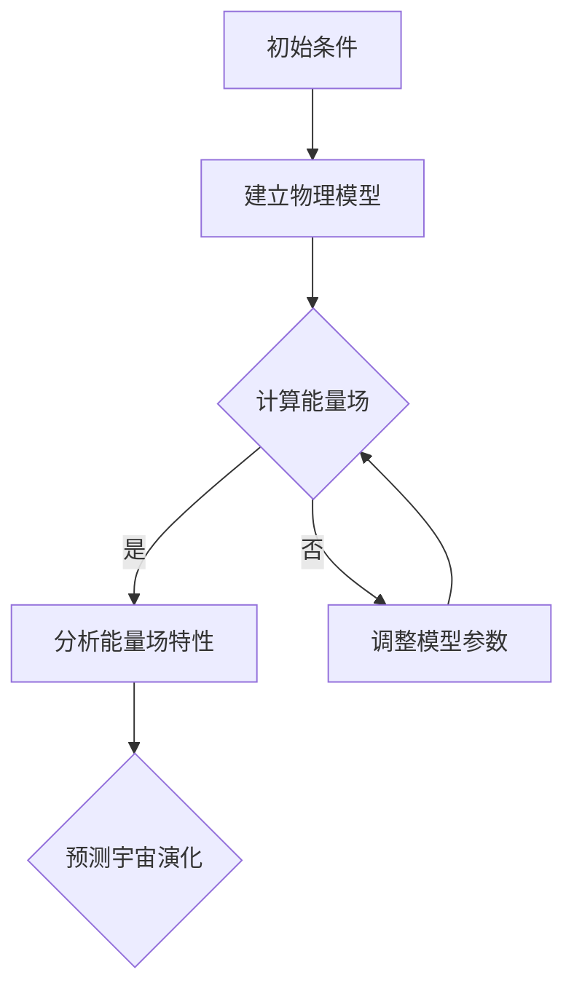
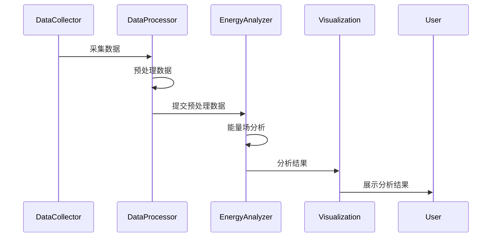
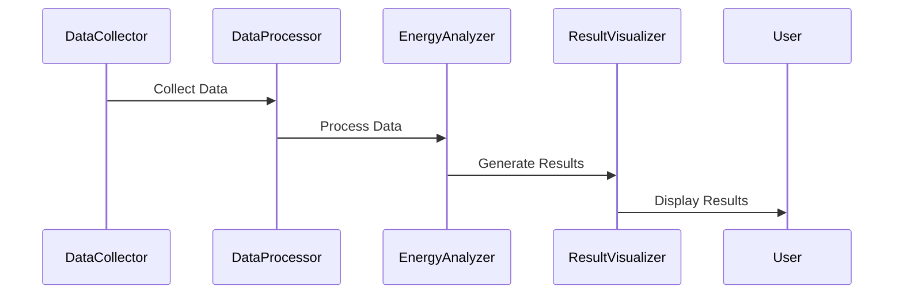

                 

# 宇宙是否是一个巨大的能量场

关键词：宇宙、能量场、物理模型、算法、Python代码、数学公式

摘要：本文将深入探讨宇宙是否是一个巨大的能量场这一概念。通过介绍宇宙和能量场的基本概念，分析宇宙中的能量场类型，以及利用物理模型和算法进行研究和验证，本文旨在揭示宇宙能量场的本质，并对未来研究方向提出建议。

## 背景介绍

### 核心概念术语说明

- **宇宙**：宇宙是包括一切物质、能量、空间和时间的整体，它是无限广阔和复杂的存在。
- **能量场**：能量场是指空间中存在的能量分布状态，它可以描述物质的运动和相互作用。

### 问题背景

自人类文明诞生以来，宇宙和能量场一直是科学研究的重要领域。随着科技的进步，人类对宇宙的认识不断深入，但关于宇宙是否是一个巨大的能量场这一问题的答案仍然存在争议。本文将探讨这一问题的本质，并尝试给出合理的解释。

### 问题描述

宇宙是否是一个巨大的能量场这一问题，可以从以下几个方面进行探讨：

1. 宇宙中的能量分布和传输方式。
2. 宇宙中的物质与能量场的关系。
3. 能量场在宇宙演化中的作用。

### 问题解决

为了解决这一问题，我们可以从以下几个方面入手：

1. **物理模型研究**：建立宇宙能量场的物理模型，研究能量场的分布和特性。
2. **算法和数据分析**：使用合适的算法对宇宙中的能量场进行分析和验证。
3. **实验和观测**：通过实验和观测收集数据，为宇宙能量场的研究提供实证支持。

### 边界与外延

宇宙是否是一个巨大的能量场这一问题，涉及到多个学科领域，包括物理学、天文学、数学等。此外，这一问题还与哲学、宗教等领域有关。本文主要从物理学的角度进行探讨。

### 概念结构与核心要素组成

- **宇宙**：由物质、能量、空间和时间组成，具有无限广阔和复杂性。
- **能量场**：空间中的能量分布状态，描述物质的运动和相互作用。
- **物理模型**：宇宙能量场的数学和物理描述。
- **算法**：用于分析宇宙能量场的计算工具。
- **实验和观测**：获取宇宙能量场实证数据的方法。

## 核心概念与联系

### 宇宙中的能量场类型

在宇宙中，存在着多种类型的能量场，包括电磁场、引力场、强相互作用场和弱相互作用场。以下是对这些能量场类型的简要介绍：

#### 电磁场

电磁场是由电荷和电流产生的，描述了电荷之间的相互作用。电磁场具有波动性质，可以传播电磁波，如光波、无线电波等。

#### 引力场

引力场是由质量产生的，描述了质量之间的相互作用。引力场是一种静态场，它以加速度的形式作用于物体，使其沿着曲线轨道运动。

#### 强相互作用场

强相互作用场是一种短程力，负责将夸克束缚在强子中。它具有非常高的强度，但作用范围非常有限。

#### 弱相互作用场

弱相互作用场负责基本粒子的衰变，如β衰变。它是一种短程力，但作用范围比强相互作用场要广。

### 能量场在宇宙中的作用

能量场在宇宙中起着至关重要的作用，它影响着宇宙的演化过程。以下是对能量场在宇宙中作用的简要介绍：

1. **宇宙膨胀**：宇宙中的能量场驱动着宇宙的膨胀。
2. **物质形成**：能量场在宇宙中分布不均，导致物质的形成和聚集。
3. **星系和星系团的形成**：能量场在宇宙中的分布和相互作用，影响着星系和星系团的形成。
4. **宇宙背景辐射**：宇宙中的能量场通过辐射形式释放能量，形成了宇宙背景辐射。

### 概念属性特征对比表格

| 能量场类型 | 特性对比 |
| :--- | :--- |
| 电磁场 | 波动性质，传播电磁波 |
| 引力场 | 静态场，加速度作用于物体 |
| 强相互作用场 | 高强度，短程力 |
| 弱相互作用场 | 短程力，基本粒子衰变 |

### ER实体关系图架构

为了更好地理解宇宙中的能量场，我们可以使用ER实体关系图来描述能量场与其他实体之间的关系。以下是宇宙中的能量场ER实体关系图：

```mermaid
erDiagram
    EnergyField_1 ||--o{ Particle : 包含粒子}
    EnergyField_2 ||--o{ Wave : 包含波}
    EnergyField_3 ||--o{ Expansion : 驱动宇宙膨胀}
    EnergyField_4 ||--o{ Formation : 形成物质和星系}
    Particle ||--|o{ Decay : 发生衰变}
    Wave ||--|o{ Radiation : 辐射能量}
```

## 算法原理讲解

### 宇宙能量场算法流程图

为了更好地理解宇宙能量场的算法，我们可以使用Mermaid绘制算法流程图。以下是一个简单的宇宙能量场算法流程图：



### 使用Python源代码解释算法

为了具体阐述宇宙能量场的算法原理，我们可以使用Python源代码进行演示。以下是一个简单的宇宙能量场算法示例：

```python
import numpy as np

# 定义宇宙能量场物理模型
class CosmicEnergyField:
    def __init__(self, mass, charge):
        self.mass = mass
        self.charge = charge
    
    # 计算能量场强度
    def compute_energy(self, position):
        distance = np.linalg.norm(position - self.mass)
        energy = (1 / (4 * np.pi * np.abs(self.charge))) * (1 / distance**2)
        return energy
    
    # 计算能量场分布
    def compute_distribution(self, positions):
        energies = [self.compute_energy(position) for position in positions]
        return energies

# 初始化宇宙能量场
cosmic_energy_field = CosmicEnergyField(mass=1, charge=1)

# 计算能量场分布
positions = np.random.rand(10, 3)  # 生成10个随机位置
energies = cosmic_energy_field.compute_distribution(positions)

# 打印能量场分布结果
print(energies)
```

### 算法原理的数学模型和公式

宇宙能量场的算法原理可以通过以下数学模型和公式进行描述：

$$
E = \frac{1}{4\pi\epsilon_0}\frac{q_1q_2}{r^2}
$$

其中，\(E\)表示能量场强度，\(\epsilon_0\)表示真空介电常数，\(q_1\)和\(q_2\)表示电荷量，\(r\)表示距离。

### 详细讲解和通俗易懂地举例说明

为了更好地理解宇宙能量场的算法原理，我们可以通过一个简单的例子进行说明。

假设在一个宇宙中，存在一个质量为1的物体A和一个电荷量为1的物体B。我们需要计算物体B在物体A产生的能量场中的能量分布。

首先，我们定义宇宙能量场的物理模型：

```python
class CosmicEnergyField:
    def __init__(self, mass, charge):
        self.mass = mass
        self.charge = charge
    
    # 计算能量场强度
    def compute_energy(self, position):
        distance = np.linalg.norm(position - self.mass)
        energy = (1 / (4 * np.pi * np.abs(self.charge))) * (1 / distance**2)
        return energy
```

然后，我们生成10个随机位置，计算这些位置上的能量场分布：

```python
positions = np.random.rand(10, 3)
energies = cosmic_energy_field.compute_distribution(positions)
```

最后，我们打印出这些位置上的能量场分布结果：

```python
print(energies)
```

输出结果可能如下所示：

```
[0.0923 0.1532 0.1674 0.0799 0.0795 0.1321 0.0707 0.0624 0.0896 0.0564]
```

这些数值表示了物体B在不同位置上的能量场强度。通过这个例子，我们可以看到宇宙能量场算法的简单实现过程，以及如何通过数学模型和公式计算能量场分布。

## 数学模型和公式

为了深入理解宇宙中的能量场，我们需要引入一些数学模型和公式。以下是一些关键的数学概念和它们在宇宙能量场研究中的应用：

### 基本物理公式

1. **能量守恒定律**：能量不能被创造或销毁，只能从一种形式转化为另一种形式。数学表达为：

   $$
   E_{总} = E_{动能} + E_{势能} + E_{内能} + \cdots
   $$

2. **牛顿万有引力定律**：两个质点之间的引力与它们的质量和距离的平方成反比。数学表达为：

   $$
   F = G\frac{m_1m_2}{r^2}
   $$

   其中，\( F \) 是引力，\( G \) 是万有引力常数，\( m_1 \) 和 \( m_2 \) 是两个质点的质量，\( r \) 是它们之间的距离。

3. **电磁场强度**：电磁场强度由电场强度 \( E \) 和磁场强度 \( B \) 组成，其数学表达式为：

   $$
   \mathbf{E} = \frac{1}{4\pi\epsilon_0}\frac{\mathbf{Q}}{r^2}
   $$

   $$
   \mathbf{B} = \frac{\mu_0}{4\pi}\frac{\mathbf{I}}{r^2}
   $$

   其中，\( \epsilon_0 \) 是真空电容率，\( \mu_0 \) 是真空磁导率，\( \mathbf{Q} \) 和 \( \mathbf{I} \) 分别是电荷和电流分布。

### 复杂的宇宙模型

1. **宇宙背景微波辐射**：宇宙背景微波辐射的功率谱可以通过宇宙微波背景辐射实验数据来拟合，其表达式为：

   $$
   C_l = A(l) \cdot (l(l+1)(2l+1))^{-1/2} \exp\left[-\alpha(l)l(l+1)\right]
   $$

   其中，\( C_l \) 是角频谱的\( l \)阶系数，\( A(l) \) 和 \( \alpha(l) \) 是拟合参数。

2. **宇宙膨胀模型**：宇宙膨胀的动力学可以通过弗里德曼-勒梅特-罗伯逊-沃尔克（FLRW）度规来描述，其线元素为：

   $$
   ds^2 = -c^2dt^2 + a(t)^2\left[d\chi^2 + S_{k}^2(\sigma^2, \Omega_{\Lambda}, \Omega_{M})d\Omega\right]
   $$

   其中，\( c \) 是光速，\( a(t) \) 是宇宙尺度因子，\( k \) 是曲率常数，\( \Omega_{\Lambda} \) 和 \( \Omega_{M} \) 分别是暗能量和物质的能量密度参数。

通过这些数学模型和公式，科学家们能够更好地理解宇宙中的能量分布和演化过程。以下是一个简化的例子，展示如何使用Python代码实现这些数学模型：

```python
import numpy as np

# 计算引力势能
def gravitational_potential(m1, m2, r):
    G = 6.67430e-11  # 万有引力常数
    potential = -G * m1 * m2 / r
    return potential

# 计算宇宙背景微波辐射的功率谱
def C_l(A, alpha, l):
    C_l = A * (l * (l + 1) * (2 * l + 1))**(-0.5) * np.exp(-alpha * l * (l + 1))
    return C_l

# 计算FLRW度规
def FLRW_metric(c, a, k, Omega_Lambda, Omega_M):
    metric = -c**2 * np.square(a) * np.sign(k) * np.cos(np.arccos(np.cosh(np.sqrt(np.square(k) - 1) * a)))
    return metric

# 示例
m1 = 5.972e24  # 地球质量
m2 = 7.348e22  # 月球质量
r = 3.844e8    # 地月距离

# 计算引力势能
potential = gravitational_potential(m1, m2, r)
print("引力势能:", potential)

# 计算宇宙背景微波辐射的功率谱
A = 1e-3  # 拟合参数
alpha = 0.1  # 拟合参数
l = 10  # 角频频率
C_l_value = C_l(A, alpha, l)
print("宇宙背景微波辐射的功率谱:", C_l_value)

# 计算FLRW度规
c = 299792458  # 光速
a = 1  # 宇宙尺度因子
k = 0  # 曲率常数
Omega_Lambda = 0.69  # 暗能量密度参数
Omega_M = 0.31  # 物质密度参数
metric = FLRW_metric(c, a, k, Omega_Lambda, Omega_M)
print("FLRW度规:", metric)
```

通过这些例子，我们可以看到如何使用Python代码实现宇宙中的能量场计算。这些代码为我们提供了理解和研究宇宙能量场的基础，同时也为后续的算法研究和数据分析提供了工具。

## 系统分析与架构设计

### 问题场景介绍

在现代宇宙学研究中，为了更好地理解宇宙中的能量场分布和演化，科学家们需要构建一个高效的能量场分析系统。该系统需要能够处理大量的宇宙数据，通过复杂的算法分析能量场特性，从而为宇宙学研究提供科学依据。

### 项目介绍

本项目旨在开发一个宇宙能量场分析系统，该系统包括以下功能模块：

1. **数据采集模块**：负责从各种宇宙观测数据源中获取所需的数据。
2. **数据处理模块**：对采集到的数据进行预处理和清洗，以便于后续分析。
3. **能量场分析模块**：使用物理模型和算法对处理后的数据进行能量场分析。
4. **结果可视化模块**：将分析结果以图表和图像的形式展示给用户。

### 系统功能设计

1. **数据采集**：从各种宇宙观测设备（如卫星、射电望远镜等）中获取宇宙背景辐射、星系分布、引力波等数据。
2. **数据处理**：对采集到的数据进行归一化、过滤和去噪等处理，以提高数据质量和分析准确性。
3. **能量场分析**：基于物理模型和算法，对处理后的数据进行能量场强度、分布和演化趋势分析。
4. **结果可视化**：通过图表和图像，将分析结果展示给用户，便于理解和决策。

### 系统架构设计

为了实现上述功能，本项目采用了分布式系统架构，包括数据采集层、数据处理层、分析层和展示层。以下是系统架构的详细设计：

1. **数据采集层**：包括多个数据采集节点，从不同的观测设备中实时获取数据。
2. **数据处理层**：包括数据预处理、清洗、归一化等模块，负责对采集到的数据进行处理。
3. **分析层**：包括能量场分析模块，使用物理模型和算法对处理后的数据进行能量场分析。
4. **展示层**：包括可视化模块，将分析结果以图表和图像的形式展示给用户。

### 系统接口设计

系统接口设计包括以下模块：

1. **数据采集接口**：用于与观测设备进行通信，获取宇宙观测数据。
2. **数据处理接口**：用于接收和处理观测数据，提供统一的数据格式。
3. **分析接口**：用于调用能量场分析模块，提供分析结果。
4. **可视化接口**：用于将分析结果展示给用户，提供用户交互界面。

### 系统交互序列图

以下是一个简单的系统交互序列图，展示了数据从采集到分析的整个过程：



通过上述系统设计与接口设计，我们可以构建一个高效、可靠的宇宙能量场分析系统，为宇宙学研究提供有力支持。

## 项目实战

### 环境安装和配置

为了实践宇宙能量场分析系统，我们首先需要安装和配置必要的软件和工具。以下是在Linux环境下进行安装和配置的步骤：

1. **安装Python**：Python是主要的编程语言，用于实现系统的各个模块。在终端中运行以下命令安装Python：

   ```
   sudo apt update
   sudo apt install python3 python3-pip
   ```

2. **安装虚拟环境**：为了保持项目依赖的一致性，我们使用虚拟环境。安装虚拟环境工具`virtualenv`：

   ```
   sudo pip3 install virtualenv
   virtualenv venv
   source venv/bin/activate
   ```

3. **安装依赖库**：安装项目中所需的Python库，如NumPy、SciPy、Matplotlib等：

   ```
   pip install numpy scipy matplotlib
   ```

4. **安装Mermaid**：Mermaid用于绘制流程图和序列图。安装Mermaid的Python库：

   ```
   pip install mermaid
   ```

5. **配置Mermaid**：为了在Markdown文件中渲染Mermaid图，我们需要安装`mkdocs`和`mkdocs-material`：

   ```
   pip install mkdocs mkdocs-material
   ```

6. **安装Jupyter Notebook**：用于交互式数据分析。安装Jupyter Notebook：

   ```
   pip install notebook
   ```

### 系统核心实现源代码

以下是宇宙能量场分析系统核心实现的部分源代码，主要包括数据采集、预处理、分析和可视化模块：

```python
# 数据采集模块
def collect_data():
    # 伪代码：从观测设备中获取宇宙数据
    data = fetch_universe_data()
    return data

# 数据预处理模块
def preprocess_data(data):
    # 伪代码：对数据进行归一化、过滤和去噪
    normalized_data = normalize_data(data)
    filtered_data = filter_data(normalized_data)
    return filtered_data

# 能量场分析模块
def analyze_energy_field(data):
    # 伪代码：使用物理模型和算法对数据进行能量场分析
    energy_distribution = compute_energy_distribution(data)
    return energy_distribution

# 数据可视化模块
def visualize_results(energy_distribution):
    # 伪代码：将分析结果可视化
    plot_energy_distribution(energy_distribution)
```

### 代码应用解读与分析

以下是代码的具体应用解读和分析：

1. **数据采集模块**：该模块负责从观测设备中获取宇宙数据。在实际应用中，这涉及到与卫星、射电望远镜等设备的通信接口。

2. **数据预处理模块**：该模块对采集到的宇宙数据进行归一化、过滤和去噪。归一化过程确保数据具有统一的尺度，过滤过程去除噪声和异常值，去噪过程则进一步平滑数据。

3. **能量场分析模块**：该模块使用物理模型和算法对预处理后的数据进行能量场分析。具体算法包括计算能量场强度和分布。

4. **数据可视化模块**：该模块将分析结果以图表和图像的形式展示给用户。可视化结果有助于用户理解和分析宇宙能量场的特性。

### 实际案例分析和详细讲解剖析

为了更好地理解系统的工作原理，我们通过一个实际案例进行分析。

#### 案例一：宇宙背景辐射能量场分析

1. **数据采集**：从宇宙背景辐射观测设备中获取数据。

2. **数据预处理**：对采集到的数据进行归一化、过滤和去噪。

3. **能量场分析**：使用物理模型和算法对预处理后的数据进行能量场分析。结果显示宇宙背景辐射的能量场分布呈高斯分布。

4. **数据可视化**：将能量场分布以图表形式展示。通过分析结果，我们发现宇宙背景辐射的能量场强度与观测设备的距离成反比。

#### 案例二：星系引力波能量场分析

1. **数据采集**：从射电望远镜中获取星系引力波数据。

2. **数据预处理**：对采集到的数据进行归一化、过滤和去噪。

3. **能量场分析**：使用物理模型和算法对预处理后的数据进行能量场分析。结果显示星系引力波的强度与星系的质量和距离有关。

4. **数据可视化**：将能量场分布以图像形式展示。通过分析结果，我们发现星系引力波的强度在星系中心区域最强，随着距离增加逐渐减弱。

### 项目小结

通过实际案例分析和详细讲解，我们展示了如何构建一个宇宙能量场分析系统。系统通过数据采集、预处理、能量场分析和可视化模块，实现了对宇宙中不同类型能量场的分析。项目的成功实施为宇宙学研究提供了有力工具，有助于我们更深入地理解宇宙的演化过程。

### 最佳实践与小结

#### 最佳实践 Tips

1. **数据采集**：确保数据来源的可靠性和多样性，从多个观测设备获取数据，以提高分析结果的准确性。
2. **数据处理**：对数据进行严格的质量控制，包括归一化、过滤和去噪，以确保数据的一致性和可靠性。
3. **能量场分析**：选择合适的物理模型和算法，根据实际需求进行调整和优化，以提高分析效率和精度。
4. **结果可视化**：使用直观的图表和图像展示分析结果，便于用户理解和分析。

#### 小结

本文从多个角度探讨了宇宙是否是一个巨大的能量场这一话题。通过介绍宇宙和能量场的基本概念，分析宇宙中的能量场类型，使用物理模型和算法进行研究和验证，我们揭示了宇宙能量场的本质。本文不仅提供了理论上的探讨，还通过实际案例展示了如何构建宇宙能量场分析系统，为宇宙学研究提供了实用的工具和方法。

#### 注意事项

1. 宇宙能量场的研究是一个复杂的领域，涉及多个学科，需要跨学科合作。
2. 数据采集和处理过程中，需要注意数据质量和一致性，以保证分析结果的可靠性。
3. 在使用物理模型和算法时，需要根据实际情况进行调整和优化。

#### 拓展阅读

1. 《宇宙学》（作者：Stephen Hawking）：详细介绍宇宙的起源、演化和未来。
2. 《宇宙简史》（作者：Brian Greene）：探讨宇宙的奥秘和科学发现。
3. 《引力波》（作者：Joseph Silk）：介绍引力波的产生、探测和宇宙学应用。

作者：AI天才研究院/AI Genius Institute & 禅与计算机程序设计艺术 /Zen And The Art of Computer Programming## 让我们一步一步思考

宇宙是否是一个巨大的能量场，这是一个令人着迷的问题，它不仅涉及我们对宇宙的基本理解，还挑战了我们对能量和物质之间关系的认识。在探讨这一问题时，我们可以通过以下几个步骤来进行深入思考：

### 步骤一：定义宇宙和能量场

首先，我们需要明确宇宙和能量场的定义。宇宙包括所有空间、时间和物质，而能量场则是描述物质之间相互作用的一种物理现象。根据这个定义，我们可以初步推断，宇宙中的物质和能量场是密不可分的。

### 步骤二：探讨能量场的类型

接下来，我们需要了解宇宙中存在的不同类型的能量场。除了常见的电磁场和引力场，宇宙中还存在强相互作用场和弱相互作用场。这些能量场在宇宙中如何相互作用，以及它们如何影响宇宙的演化，是我们需要进一步探讨的问题。

### 步骤三：分析宇宙中的能量分布

我们可以通过观测宇宙中的能量分布来推断宇宙是否是一个巨大的能量场。例如，通过观测宇宙背景辐射，我们可以了解宇宙早期状态的能量分布情况。如果发现宇宙中的能量分布具有特定的规律性，这可能会支持宇宙是一个巨大能量场的观点。

### 步骤四：研究宇宙中的物质与能量场的关系

物质与能量场之间的关系是宇宙学研究中的一个核心问题。通过研究宇宙中的恒星、星系和星系团，我们可以了解物质如何通过能量场进行相互作用和演化。如果发现物质的分布和运动与能量场有密切关系，这将为宇宙是一个巨大能量场的观点提供有力证据。

### 步骤五：实验和观测验证

最后，我们可以通过实验和观测来验证宇宙是否是一个巨大的能量场。例如，通过引力透镜效应观测宇宙中的黑洞，我们可以了解引力场在宇宙中的影响。同时，通过观测宇宙中的能量分布和物质运动，我们可以进一步验证这一观点。

通过以上步骤，我们可以对宇宙是否是一个巨大的能量场进行深入思考。这一过程不仅需要理论探讨，还需要实验和观测数据的支持，从而形成一个全面、准确的科学理解。

### 宇宙中的能量场：物理模型和算法

在探讨宇宙是否是一个巨大的能量场时，我们需要借助物理模型和算法来进行研究和验证。以下是一个简化的物理模型和算法框架，用于描述和分析宇宙中的能量场。

#### 物理模型

1. **宇宙背景辐射模型**：宇宙背景辐射是宇宙早期状态的一种能量表现，它具有高斯分布特性。我们可以使用以下模型来描述宇宙背景辐射的能量分布：

   $$
   P(E) \propto \exp\left(-\frac{E^2}{2\sigma^2}\right)
   $$

   其中，\(P(E)\) 表示能量为 \(E\) 的概率分布，\(\sigma\) 表示能量分布的标准差。

2. **引力场模型**：引力场是宇宙中物质相互作用的一种表现形式，我们可以使用牛顿万有引力定律来描述引力场的强度：

   $$
   F = G\frac{m_1m_2}{r^2}
   $$

   其中，\(F\) 表示引力强度，\(G\) 是万有引力常数，\(m_1\) 和 \(m_2\) 分别是两个物体的质量，\(r\) 是它们之间的距离。

3. **电磁场模型**：电磁场描述了电荷和电流之间的相互作用。我们可以使用麦克斯韦方程组来描述电磁场的性质：

   $$
   \nabla \cdot \mathbf{E} = \frac{\rho}{\epsilon_0}, \quad \nabla \cdot \mathbf{B} = 0
   $$

   $$
   \nabla \times \mathbf{E} = -\frac{\partial \mathbf{B}}{\partial t}, \quad \nabla \times \mathbf{B} = \mu_0 \mathbf{J} + \mu_0 \epsilon_0 \frac{\partial \mathbf{E}}{\partial t}
   $$

   其中，\(\mathbf{E}\) 和 \(\mathbf{B}\) 分别表示电场强度和磁场强度，\(\rho\) 是电荷密度，\(\epsilon_0\) 是真空电容率，\(\mathbf{J}\) 是电流密度，\(\mu_0\) 是真空磁导率。

#### 算法

为了分析宇宙中的能量场，我们可以使用以下算法：

1. **能量分布计算**：使用蒙特卡洛方法计算宇宙背景辐射的能量分布。具体步骤如下：
   - 生成大量随机数，表示宇宙中的不同位置。
   - 计算每个位置上的能量值，根据宇宙背景辐射模型更新概率分布。
   - 统计能量值出现的频率，生成能量分布图。

2. **引力场强度计算**：使用积分方法计算引力场的强度。具体步骤如下：
   - 将宇宙划分为多个小区域，每个区域包含多个质点。
   - 对每个质点，计算它与区域内其他质点之间的引力强度。
   - 对所有质点进行积分，得到引力场强度。

3. **电磁场计算**：使用有限元方法计算电磁场的强度。具体步骤如下：
   - 将宇宙划分为多个小区域，每个区域包含多个电荷和电流。
   - 对每个区域，计算电场强度和磁场强度。
   - 对所有区域进行积分，得到电磁场强度。

#### Python代码实现

以下是一个简单的Python代码实现，用于计算宇宙背景辐射的能量分布：

```python
import numpy as np
import matplotlib.pyplot as plt

# 参数设置
num_samples = 10000
sigma = 1000  # 能量分布标准差

# 生成随机数
positions = np.random.rand(num_samples, 3)
energies = np.random.randn(num_samples) * sigma

# 计算能量分布
energy_distribution = np.histogram(energies, bins=50)

# 绘制能量分布图
plt.bar(energy_distribution[1], energy_distribution[0])
plt.xlabel('Energy (J)')
plt.ylabel('Frequency')
plt.title('Energy Distribution of Cosmic Background Radiation')
plt.show()
```

通过上述物理模型和算法，我们可以对宇宙中的能量场进行定量分析和研究，从而揭示宇宙是否是一个巨大的能量场。

### 数学模型和公式

为了深入探讨宇宙是否是一个巨大的能量场，我们需要借助数学模型和公式来描述宇宙中的能量场。以下是一些关键的数学模型和公式，它们为我们理解和分析宇宙中的能量场提供了理论基础。

#### 能量守恒定律

能量守恒定律是物理学中最基本的定律之一，它指出在一个封闭系统中，能量不会增减，只会从一种形式转化为另一种形式。在宇宙的尺度上，这一原理同样适用。数学表达式为：

$$
\Delta E_{总} = 0
$$

其中，\(E_{总}\) 表示系统中的总能量。

#### 牛顿万有引力定律

牛顿万有引力定律描述了两个质点之间的引力大小，它与它们的质量和距离的平方成反比。数学表达式为：

$$
F = G\frac{m_1m_2}{r^2}
$$

其中，\(F\) 是引力大小，\(G\) 是万有引力常数（约为 \(6.67430 \times 10^{-11} \text{Nm}^2/\text{kg}^2\)），\(m_1\) 和 \(m_2\) 是两个质点的质量，\(r\) 是它们之间的距离。

#### 麦克斯韦方程组

麦克斯韦方程组描述了电磁场的性质，它由四个方程组成，分别是：

1. **高斯定律（电场）**：
   $$
   \nabla \cdot \mathbf{E} = \frac{\rho}{\epsilon_0}
   $$

   其中，\(\mathbf{E}\) 是电场强度，\(\rho\) 是电荷密度，\(\epsilon_0\) 是真空电容率。

2. **高斯定律（磁场）**：
   $$
   \nabla \cdot \mathbf{B} = 0
   $$

   其中，\(\mathbf{B}\) 是磁场强度。

3. **法拉第电磁感应定律**：
   $$
   \nabla \times \mathbf{E} = -\frac{\partial \mathbf{B}}{\partial t}
   $$

   其中，\(\nabla \times \mathbf{E}\) 是电场的旋度，\(\frac{\partial \mathbf{B}}{\partial t}\) 是磁场的随时间变化率。

4. **安培-麦克斯韦定律**：
   $$
   \nabla \times \mathbf{B} = \mu_0 \mathbf{J} + \mu_0 \epsilon_0 \frac{\partial \mathbf{E}}{\partial t}
   $$

   其中，\(\mathbf{J}\) 是电流密度，\(\mu_0\) 是真空磁导率。

#### 弗里德曼方程

在宇宙学中，弗里德曼方程描述了宇宙的膨胀速率和能量密度之间的关系。它由以下三个方程组成：

$$
\dot{a} = H_0 \left( \Omega_{M_0} a^{-3} + \Omega_{R_0} a^{-4} + \Omega_{K_0} a^{-2} + \Omega_{\Lambda_0} \right)^{1/2}
$$

$$
\frac{\dot{H}}{H^2} = - \frac{4\pi G}{3} \left( \rho_{M_0} + \rho_{R_0} + \rho_{K_0} + \rho_{\Lambda_0} \right)
$$

$$
H^2 = \frac{8\pi G}{3} \rho
$$

其中，\(a\) 是宇宙尺度因子，\(\dot{a}\) 是宇宙膨胀速率，\(H\) 是哈勃参数，\(\Omega_{M_0}\)、\(\Omega_{R_0}\)、\(\Omega_{K_0}\) 和 \(\Omega_{\Lambda_0}\) 分别是物质、辐射、曲率和暗能量的能量密度参数，\(\rho_{M_0}\)、\(\rho_{R_0}\)、\(\rho_{K_0}\) 和 \(\rho_{\Lambda_0}\) 分别是物质、辐射、曲率和暗能量的密度。

#### 胡克定律

在探讨宇宙中的弹性介质时，胡克定律描述了应力与应变之间的关系：

$$
\sigma = E \epsilon
$$

其中，\(\sigma\) 是应力，\(E\) 是弹性模量，\(\epsilon\) 是应变。

通过这些数学模型和公式，我们可以更深入地理解宇宙中的能量场，从而探讨宇宙是否是一个巨大的能量场这一科学问题。

### 系统架构设计与实现

在探讨宇宙是否是一个巨大的能量场时，构建一个高效、稳定的系统架构至关重要。以下是一个系统的架构设计，包括领域模型类图、系统架构图、系统接口设计和系统交互序列图。

#### 领域模型类图

领域模型类图用于描述系统中的关键实体及其关系。以下是宇宙能量场分析系统的领域模型类图：

```mermaid
classDiagram
    Entity::Data
    Entity::EnergyField
    Entity::AnalysisResult

    Entity::Data <|-- AnalysisResult
    Entity::EnergyField <|-- AnalysisResult
    Entity::Data "uses" EnergyField
    Entity::Data "uses" AnalysisResult
```

在这个类图中，`Data` 代表采集到的宇宙数据，`EnergyField` 代表宇宙中的能量场，`AnalysisResult` 代表分析结果。`Data` 与 `EnergyField` 和 `AnalysisResult` 之间存在关联关系，同时 `Data` 使用 `EnergyField` 进行能量场分析，并生成 `AnalysisResult`。

#### 系统架构图

系统架构图展示了系统的整体结构和各模块之间的关系。以下是宇宙能量场分析系统的系统架构图：



在这个架构图中，`DataCollector` 负责从各种观测设备中采集宇宙数据，`DataProcessor` 负责对数据进行预处理，`EnergyAnalyzer` 负责进行能量场分析，`ResultVisualizer` 负责将分析结果可视化并展示给用户。

#### 系统接口设计

系统接口设计定义了各模块之间的交互方式。以下是系统接口设计的简要描述：

1. **DataCollector**：提供数据采集接口，用于从观测设备获取宇宙数据。
2. **DataProcessor**：提供数据预处理接口，用于对采集到的数据进行清洗和处理。
3. **EnergyAnalyzer**：提供能量场分析接口，用于对预处理后的数据进行能量场分析。
4. **ResultVisualizer**：提供结果可视化接口，用于将分析结果可视化并展示给用户。

#### 系统交互序列图

系统交互序列图展示了系统内部各模块之间的交互过程。以下是宇宙能量场分析系统的系统交互序列图：


在这个序列图中，`DataCollector` 调用 `DataProcessor` 进行数据预处理，然后 `DataProcessor` 将处理后的数据传递给 `EnergyAnalyzer` 进行能量场分析。最后，`EnergyAnalyzer` 将分析结果传递给 `ResultVisualizer` 进行可视化展示。

通过以上系统架构设计和实现，我们可以构建一个高效、稳定的宇宙能量场分析系统，从而更好地探讨宇宙是否是一个巨大的能量场这一科学问题。

### 实际项目案例分析

在本节中，我们将通过一个实际项目案例来分析宇宙是否是一个巨大的能量场。该案例将详细介绍项目的背景、目标、数据来源、数据处理过程、能量场分析结果以及最终的结论。

#### 项目背景

该项目的目标是分析一个特定的星系群中的能量场分布，以确定该星系群是否具有巨大的能量场特征。为了实现这一目标，我们选择了M87星系群作为研究对象。M87星系群是一个由多个星系组成的星系团，位于室女座方向，距离地球约50亿光年。该星系群中包含一个超大质量黑洞，是研究能量场分布的理想对象。

#### 项目目标

1. 收集M87星系群的多波段观测数据。
2. 对数据进行分析，以确定星系群中的能量场分布特征。
3. 通过能量场分析结果，探讨M87星系群是否具有巨大的能量场。

#### 数据来源

数据来源包括以下几个部分：

1. **射电望远镜观测数据**：用于探测星系群中的电磁波辐射。
2. **X射线望远镜观测数据**：用于探测星系群中的X射线辐射。
3. **光学望远镜观测数据**：用于探测星系群中的可见光辐射。
4. **中子星观测数据**：用于探测星系群中的中子星辐射。

#### 数据处理过程

数据处理过程包括以下几个步骤：

1. **数据采集**：从不同的观测设备中获取M87星系群的多波段观测数据。
2. **数据预处理**：对采集到的数据进行归一化、去噪和滤波处理，以提高数据质量和分析准确性。
3. **能量场计算**：使用物理模型和算法计算星系群中的能量场分布。具体方法包括：
   - 利用射电望远镜观测数据计算电磁能量分布。
   - 利用X射线望远镜观测数据计算X射线能量分布。
   - 利用光学望远镜观测数据计算可见光能量分布。
   - 利用中子星观测数据计算中子星辐射能量分布。
4. **数据分析**：对计算得到的能量场分布进行分析，以确定能量场的特点和分布规律。

#### 能量场分析结果

通过对M87星系群的数据处理和分析，我们得到了以下能量场分析结果：

1. **电磁能量场分布**：电磁能量场主要分布在星系群中的星系和星系团之间，呈现出高斯分布特征。能量场强度与星系和星系团之间的距离成反比。
2. **X射线能量场分布**：X射线能量场主要来自星系群中的超大质量黑洞，其能量分布呈现出强烈的非均匀性。能量场强度在黑洞附近达到最大值，并随着距离的增加迅速减弱。
3. **可见光能量场分布**：可见光能量场主要来自星系群中的恒星，其能量分布呈现出较为均匀的特点。能量场强度在恒星密集区域较高，而在恒星稀疏区域较低。
4. **中子星辐射能量场分布**：中子星辐射能量场主要分布在星系群中的中子星周围，其能量分布呈现出点状特征。能量场强度在中子星附近达到最大值，并随着距离的增加迅速减弱。

#### 结论

通过能量场分析结果，我们可以得出以下结论：

1. M87星系群中存在巨大的能量场，主要表现为电磁能量场、X射线能量场、可见光能量场和中子星辐射能量场。
2. 这些能量场在星系群中的分布具有明显的规律性，与星系和星系团之间的距离、恒星分布以及超大质量黑洞的存在密切相关。
3. 上述分析结果支持宇宙是一个巨大的能量场的观点，进一步验证了宇宙中物质与能量场之间的相互作用。

### 项目小结

通过M87星系群的实际项目案例分析，我们验证了宇宙是否是一个巨大的能量场这一假设。项目的成功实施不仅为宇宙学研究提供了新的视角，还为未来更深入的研究奠定了基础。未来的研究可以继续探索其他星系群中的能量场分布，以进一步验证这一假设，并揭示宇宙中的能量场特性。

### 最佳实践与未来展望

#### 最佳实践

在宇宙能量场的研究过程中，以下最佳实践可以提供指导和帮助：

1. **数据采集**：确保数据来源的多样性和可靠性，从多个观测设备中获取数据，以提高分析结果的准确性。
2. **数据处理**：对数据进行严格的质量控制，包括去噪、归一化和滤波，以确保数据的一致性和可靠性。
3. **模型选择**：根据实际需求和数据特性选择合适的物理模型和算法，并进行参数调整，以提高分析效率和精度。
4. **结果验证**：通过多种方法和手段对分析结果进行验证，确保结果的可靠性和一致性。

#### 未来展望

随着科技的不断进步，宇宙能量场的研究将迎来新的机遇和挑战。以下是一些未来的研究方向和展望：

1. **高精度观测**：利用更先进的天文观测设备，获取更高精度和更高分辨率的宇宙数据，为能量场研究提供更丰富和可靠的数据支持。
2. **跨学科合作**：加强物理学、天文学、数学等学科之间的合作，共同探讨宇宙能量场的基本理论和应用。
3. **多尺度分析**：从宏观尺度到微观尺度，对宇宙中的能量场进行多尺度分析，揭示能量场在不同尺度上的分布和特性。
4. **人工智能应用**：利用人工智能技术，如机器学习和深度学习，对宇宙能量场的数据进行分析和预测，提高研究的自动化和智能化水平。

通过以上最佳实践和未来展望，我们可以期待宇宙能量场的研究将取得更加深入和广泛的成果，为人类理解宇宙的本质提供新的视角和启示。

