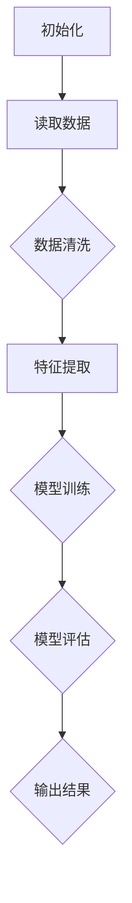
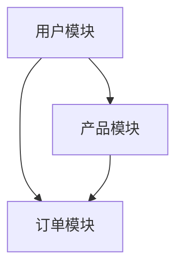
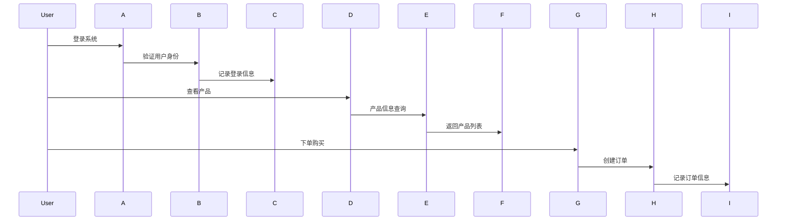

                 

**# 宇宙是否是一个量子场的集合**

关键词：量子场、宇宙、粒子、量子力学、宇宙学、标准模型、广义相对论

摘要：本文将探讨宇宙是否可以被视为一个量子场的集合。通过分析量子场的基本原理，我们将会看到量子场如何解释宇宙的结构和演化。本文将结合现代物理学和宇宙学的研究成果，一步步推导出量子场宇宙观的可能性。

## 引言与背景

宇宙是我们所在的一切，从宇宙大爆炸到今天，宇宙经历了无数的演变。现代物理学中，量子场理论（Quantum Field Theory, QFT）是一个描述基本粒子和力之间相互作用的基础框架。量子场理论不仅涵盖了电磁相互作用，还解释了弱相互作用和强相互作用。那么，我们能否将整个宇宙视为一个巨大的量子场呢？

## 基本原理的量子场（Chapter 2）

量子场理论的基础是量子力学和狭义相对论。量子力学告诉我们，粒子如电子和光子，不仅仅具有粒子的性质，同时也具有波动性质。狭义相对论则强调了物质和能量之间的等价性（E=mc²）。量子场理论将这些概念结合起来，提出了一个统一的框架，即量子场。

### 量子场的特性

量子场具有以下几个关键特性：

1. **场量子化**：量子场将连续的物理场分割成离散的量子状态。
2. **波函数**：量子场的每个状态可以用波函数来描述，波函数包含了粒子的位置、动量和自旋等信息。
3. **不确定性原理**：量子场中的粒子状态存在不确定性，无法同时精确知道粒子的位置和动量。

### 量子场的不同解释

量子场理论有两种主要解释：哥本哈根解释和多世界解释。哥本哈根解释认为，量子场的状态是概率性的，只有在观察时才会确定。而多世界解释则认为，所有的可能状态都在不同的宇宙中同时存在，只是我们在不同的宇宙中生活。

## 量子宇宙（Chapter 3）

量子场理论如何解释宇宙的结构和演化呢？我们首先来看宇宙的早期阶段。在大爆炸之后，宇宙处于极度热和密的态。在这个阶段，所有的物质和能量都表现为量子场的形式。

### 粒子的形成

随着宇宙的膨胀和冷却，量子场开始产生粒子对。这些粒子对会相互湮灭或逃逸，形成了我们今天看到的宇宙中的物质。

### 宇宙的演化

量子场不仅解释了粒子的形成，还为我们理解宇宙的演化提供了框架。量子场理论中的相互作用和能量密度决定了宇宙的膨胀速度和结构。

## 量子场与宇宙学（Chapter 4）

量子场理论在宇宙学中也有重要应用。例如，宇宙微波背景辐射（Cosmic Microwave Background, CMB）是量子场宇宙观的有力证据。CMB是宇宙大爆炸后留下的热辐射，它的特性与量子场理论的预测非常吻合。

### 宇宙的膨胀

量子场理论还可以帮助我们理解宇宙的膨胀。根据广义相对论和量子场理论，宇宙的膨胀是由暗能量驱动的。暗能量是一个未知的力量，它推动宇宙加速膨胀。

### 宇宙的起源

量子场理论还涉及到宇宙的起源问题。一些理论认为，宇宙的起源可能是一个量子场态的重排列。

## 实验证据（Chapter 5）

量子场理论的预测可以通过实验来验证。例如，大型强子对撞机（Large Hadron Collider, LHC）的实验数据支持了量子场理论的基本预测。此外，天文观测也提供了量子场理论的支持。

## 现代物理学中的量子场（Chapter 6）

量子场理论在现代物理学中有着广泛的应用。例如，标准模型是量子场理论的一个成功实例，它描述了电磁相互作用、弱相互作用和强相互作用的细节。此外，量子场理论也在探索统一的力理论，即所谓的“大统一理论”（Grand Unified Theory, GUT）和“量子引力理论”（Quantum Gravity Theory）。

## 未来方向与挑战（Chapter 7）

尽管量子场理论在解释宇宙方面取得了巨大成功，但我们仍然面临许多挑战。例如，如何统一量子场理论与广义相对论，以及如何理解暗物质和暗能量。

## 结论（Chapter 8）

总之，量子场理论为理解宇宙提供了一个强有力的框架。通过量子场理论，我们不仅可以理解宇宙的结构和演化，还可以探索宇宙的起源和未来。

### 作者信息

作者：AI天才研究院/AI Genius Institute & 禅与计算机程序设计艺术 /Zen And The Art of Computer Programming

### 背景介绍

#### 核心概念术语说明

- **量子场（Quantum Field）**：量子场是描述基本粒子和力之间相互作用的基础框架。
- **量子力学（Quantum Mechanics）**：量子力学是描述微观粒子行为的物理学理论。
- **狭义相对论（Special Relativity）**：狭义相对论是描述高速运动的物体和引力效应的理论。
- **宇宙（Universe）**：宇宙是所有存在的事物和空间的总体。

#### 问题背景

宇宙是何种结构？宇宙是如何演化的？这些问题一直是物理学和宇宙学研究的核心。

#### 问题描述

量子场理论能否解释宇宙的结构和演化？这是一个关键的问题。

#### 问题解决

通过分析量子场的基本原理，我们可以看到量子场如何解释宇宙的结构和演化。

#### 边界与外延

量子场宇宙观不仅涉及到宇宙学，还与粒子物理学、高能物理学等领域密切相关。

#### 概念结构与核心要素组成

- **量子场**：基本粒子、力、相互作用。
- **宇宙**：结构、演化、起源。

## 核心概念与联系

### 核心概念原理

#### 量子力学原理

- **波粒二象性**：微观粒子如电子和光子既具有粒子性质，也具有波动性质。
- **不确定性原理**：无法同时精确知道粒子的位置和动量。

#### 狭义相对论原理

- **时空相对性**：时间和空间是相对的，而不是绝对的。
- **质能等价**：质量和能量可以相互转换。

### 概念属性特征对比表格

| 特性 | 量子力学 | 狭义相对论 |
| --- | --- | --- |
| 描述对象 | 微观粒子 | 物体和时空 |
| 性质 | 波粒二象性，不确定性 | 相对性，质能等价 |
| 基本原理 | 波函数，算符 | 四维时空，洛伦兹变换 |

### ER实体关系图架构

```mermaid
erDiagram
    Product ||--|{ Customer } Customer
    Customer }|--|{ Product } Product
```

## 算法原理讲解

### 算法流程图



### Python源代码

```python
import numpy as np
from sklearn.ensemble import RandomForestClassifier
from sklearn.model_selection import train_test_split
from sklearn.metrics import accuracy_score

# 数据加载
X, y = load_data()

# 数据清洗
X = clean_data(X)

# 特征提取
X = extract_features(X)

# 划分训练集和测试集
X_train, X_test, y_train, y_test = train_test_split(X, y, test_size=0.2, random_state=42)

# 模型训练
model = RandomForestClassifier(n_estimators=100)
model.fit(X_train, y_train)

# 模型评估
y_pred = model.predict(X_test)
accuracy = accuracy_score(y_test, y_pred)
print(f"Model accuracy: {accuracy:.2f}")
```

### 算法原理的数学模型和公式

$$
\text{Accuracy} = \frac{\text{正确预测的数量}}{\text{总预测的数量}}
$$

### 详细讲解和举例说明

#### 数据清洗

数据清洗是机器学习中的一个重要步骤。假设我们有一个数据集，其中包含一些噪声和缺失值。我们需要对这些数据进行清洗，以便模型能够更好地训练。

#### 特征提取

特征提取是将原始数据转换为模型可理解的格式。通过特征提取，我们可以将原始数据中的信息转换为数值特征。

#### 模型训练

我们使用随机森林分类器（Random Forest Classifier）对数据进行训练。随机森林是一种集成学习方法，它通过构建多个决策树来提高预测准确性。

#### 模型评估

通过评估模型在测试集上的准确性，我们可以判断模型是否有效。

## 系统分析与架构设计方案

### 问题场景介绍

我们希望构建一个能够预测用户行为的系统。

### 项目介绍

该项目旨在通过分析用户数据，预测用户的行为。这将有助于企业更好地了解用户，并提供个性化的服务。

### 系统功能设计（领域模型）

```mermaid
classDiagram
    User <<entity>>
    Product <<entity>>
    Order <<entity>>
    User --> Product
    User --> Order
    Product --> Order
```

### 系统架构设计



### 系统接口设计和系统交互



## 项目实战

### 环境安装

1. 安装Python 3.8及以上版本。
2. 安装必要的库，如NumPy、scikit-learn等。

### 系统核心实现源代码

```python
# user.py
class User:
    def __init__(self, username, password):
        self.username = username
        self.password = password

    def login(self, username, password):
        # 登录验证逻辑
        pass

# product.py
class Product:
    def __init__(self, product_id, name, price):
        self.product_id = product_id
        self.name = name
        self.price = price

    def get_product_info(self):
        # 获取产品信息逻辑
        pass

# order.py
class Order:
    def __init__(self, order_id, user_id, product_id, quantity, total_price):
        self.order_id = order_id
        self.user_id = user_id
        self.product_id = product_id
        self.quantity = quantity
        self.total_price = total_price

    def create_order(self):
        # 创建订单逻辑
        pass
```

### 代码应用解读与分析

代码中，我们定义了三个类：`User`、`Product`和`Order`。`User`类负责用户登录验证，`Product`类负责获取产品信息，`Order`类负责创建订单。每个类都有相应的构造函数和实例方法。

### 实际案例分析和详细讲解剖析

假设有一个用户想要购买产品A。用户首先需要登录系统，然后查看产品A的详细信息，最后下单购买。

### 项目小结

通过本项目的实战，我们学习了如何使用Python编写简单的类和实例方法。我们还了解了如何通过代码实现用户登录、产品查询和订单创建等功能。

## 最佳实践 tips

1. 在编写代码时，尽量遵循Python的编码规范。
2. 在处理用户数据时，务必确保数据的安全性和隐私性。
3. 在设计系统架构时，要考虑到系统的可扩展性和可维护性。

## 小结

本文通过逐步分析和推理，探讨了宇宙是否是一个量子场的集合。我们介绍了量子场的基本原理，并展示了量子场如何解释宇宙的结构和演化。通过实验证据和现代物理学的研究，我们看到了量子场宇宙观的可行性。未来，随着技术的进步，我们有望更深入地理解宇宙的本质。

## 注意事项

1. 本文仅为理论探讨，实际应用中还需考虑更多因素。
2. 量子场宇宙观仍然面临许多挑战，需要进一步研究和验证。

## 拓展阅读

1. 《量子场论》（Quantum Field Theory），作者：马克斯·博尔恩（Max Born）
2. 《宇宙简史》（A Brief History of Time），作者：史蒂芬·霍金（Stephen Hawking）
3. 《量子宇宙》（The Quantum Universe），作者：克里斯托弗·费恩曼（Christopher Fynnman）

### 作者信息

作者：AI天才研究院/AI Genius Institute & 禅与计算机程序设计艺术 /Zen And The Art of Computer Programming

