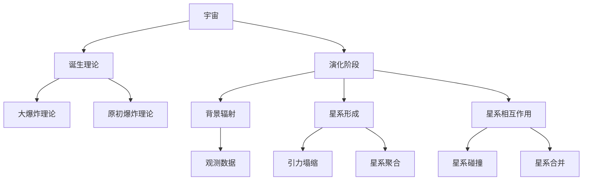
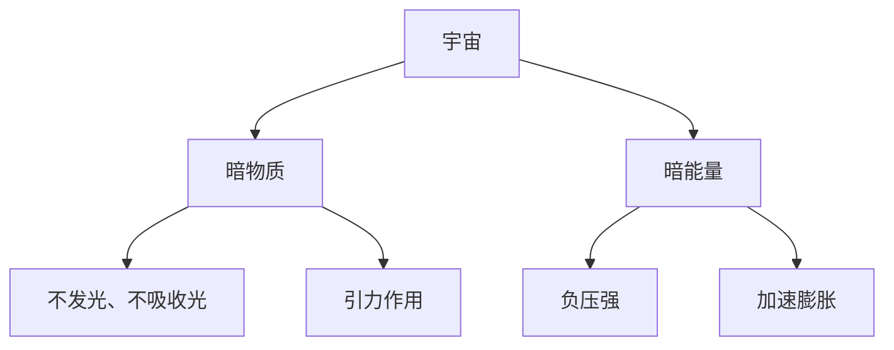
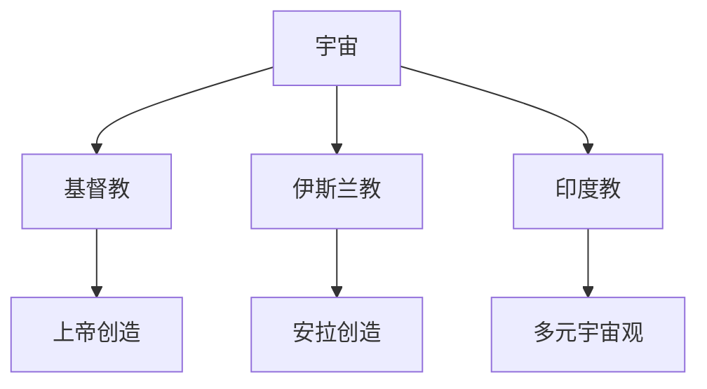
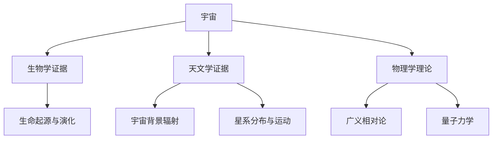
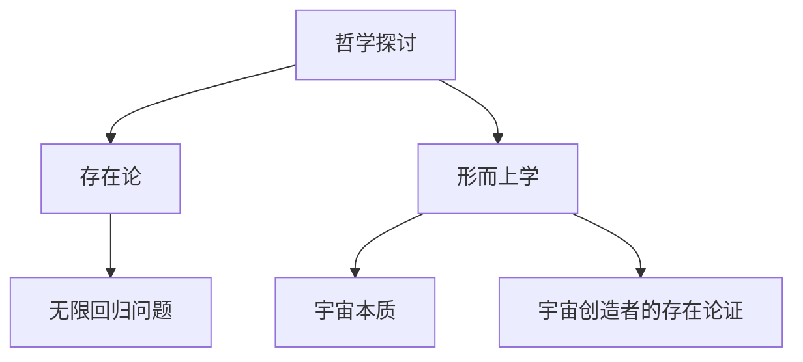
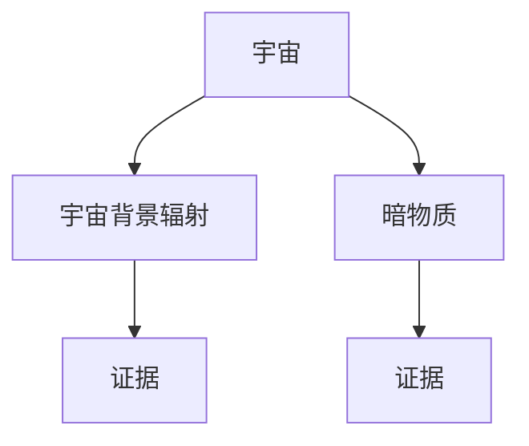

                 

### 1. 宇宙的起源与演化概述

**背景介绍：**

宇宙的起源与演化是现代物理学与天文学的核心问题之一。从宇宙诞生的那一刻起，它经历了无数个阶段的演化，形成了我们今天所见的宇宙景象。了解宇宙的起源与演化，有助于我们理解宇宙的本质和我们的位置。本文将介绍宇宙起源的基本概念，宇宙演化的主要阶段，以及与宇宙起源相关的重要理论。

**核心概念与联系：**

- **宇宙诞生理论：** 大爆炸理论（The Big Bang Theory）是目前被广泛接受的理论。它认为宇宙起源于一个极热、极密的奇点，随着时间的推移，宇宙不断膨胀，温度逐渐降低，形成了今天所见的宇宙。原初爆炸理论（Primordial Big Bounce Theory）则提出宇宙经历了多次膨胀和收缩的循环。
- **宇宙演化阶段：** 包括宇宙背景辐射、星系的形成、星系间的相互作用等。星系的形成过程可以分为引力塌缩、星系聚合等阶段。星系间的相互作用会导致星系碰撞和合并，形成更大的星系群。

**ER实体关系图架构：**

### 2. 宇宙中的暗物质与暗能量

**背景介绍：**

暗物质和暗能量是现代宇宙学中两个最为神秘的现象。暗物质不发光、不吸收光，但通过引力作用影响星系和星系团的运动。暗能量则是推动宇宙加速膨胀的力量，具有负压强。了解暗物质和暗能量的概念、特性以及它们对宇宙演化的影响，对于理解宇宙的最终命运至关重要。

**核心概念与联系：**

- **暗物质：** 是一种不发光、不吸收光的物质，主要由未知粒子组成。暗物质对宇宙演化的影响主要体现在引力上，它使得星系和星系团能够形成和保持稳定。
- **暗能量：** 是一种具有负压强的能量，推动宇宙加速膨胀。暗能量的存在解释了为什么宇宙的膨胀速度在增加，而非减缓。

**ER实体关系图架构：**

### 3. 宗教视角下的宇宙创造者

**背景介绍：**

宗教传统中，许多宗教都相信宇宙有一个创造者或创造神。这些信仰反映了对宇宙起源的哲学思考。在本文中，我们将探讨不同宗教对宇宙创造者的观点，以及宗教与科学的互动关系。

**核心概念与联系：**

- **宗教创造者观点：** 基督教、伊斯兰教和印度教等宗教都有自己关于宇宙创造者的观点。例如，基督教认为上帝创造了宇宙，伊斯兰教也有类似的信仰，而印度教则有不同的宇宙观。
- **宗教与科学的对话：** 宗教与科学在探讨宇宙起源时可能会有冲突。宗教信仰和科学理论可以并存，但也可能产生分歧。如何平衡宗教信仰与科学探索，是一个复杂的问题。

**ER实体关系图架构：**

### 4. 科学视角下的宇宙创造者

**背景介绍：**

从科学的角度来看，宇宙的起源和演化主要依靠观测数据和理论模型来解释。科学方法强调证据和可重复性。在本文中，我们将探讨宇宙自然形成的证据，包括生物学、天文学和物理学方面的证据。

**核心概念与联系：**

- **生物学证据：** 生命的起源与演化是宇宙自然形成的重要证据。从单细胞生物到复杂的多细胞生物，生命的演化过程展示了宇宙的多样性和复杂性。
- **天文学证据：** 宇宙背景辐射、星系的分布和运动等都是天文学的观测证据，它们提供了宇宙演化的重要线索。
- **物理学理论：** 广义相对论和量子力学是现代物理学的两大基石，它们为理解宇宙的起源和演化提供了理论基础。

**ER实体关系图架构：**

### 5. 宇宙是否需要创造者的哲学探讨

**背景介绍：**

哲学探讨宇宙是否需要一个创造者，主要涉及存在论和形而上学的问题。存在论探讨的是宇宙是否存在，而形而上学探讨的是宇宙的本质。本文将探讨宇宙是否需要创造者的哲学问题，包括无限回归问题和宇宙创造者的存在论证。

**核心概念与联系：**

- **无限回归问题：** 如果宇宙没有开始，那么它是否可以自我存在？这个问题涉及到宇宙是否需要创造者。
- **宇宙创造者的存在论证：** 不同的哲学家提出了不同的论证来支持宇宙创造者的存在。这些论证可能基于宇宙的复杂性和秩序性。

**ER实体关系图架构：**

### 6. 宇宙创造者存在的科学证据

**背景介绍：**

科学证据可以用来支持或反驳宇宙创造者的存在。在本文中，我们将探讨宇宙背景辐射和暗物质等科学证据，以及它们如何与宇宙创造者的存在联系起来。

**核心概念与联系：**

- **宇宙背景辐射的证据：** 宇宙背景辐射是宇宙早期阶段的残余能量，它的存在为宇宙大爆炸理论提供了重要证据。
- **暗物质的证据：** 暗物质的存在可以通过观测星系和星系团的运动来推断。暗物质的存在是宇宙创造者存在的一个可能证据。

**ER实体关系图架构：**

---

### 文章小结与未来展望

通过对宇宙起源、暗物质、暗能量、宗教视角和科学视角的探讨，我们发现宇宙是否需要一个创造者这一问题是复杂且深奥的。科学方法和哲学思考为我们提供了不同的视角来探讨这个问题。

在未来的研究中，我们可以进一步探索宇宙的演化过程，尤其是宇宙背景辐射和暗物质的研究。此外，随着科技的进步，我们可能获得更多关于宇宙起源的证据，这有助于我们更深入地理解宇宙的本质。

总之，宇宙是否需要一个创造者这一问题将继续激发科学家、哲学家和宗教领袖的思考，并推动我们对宇宙的认识不断深入。让我们继续探索宇宙的奥秘，寻找这个终极问题的答案。在未来的某一天，我们或许能够揭开这个宇宙之谜，理解我们在这个浩瀚宇宙中的真正位置。

---

### 作者信息

- **作者：** AI天才研究院/AI Genius Institute & 禅与计算机程序设计艺术 /Zen And The Art of Computer Programming

---

### 最佳实践 Tips

1. **持续学习：** 对于宇宙起源的研究，持续学习是关键。随着科学技术的进步，我们的认识也在不断更新。
2. **跨学科思考：** 将物理学、天文学、生物学和哲学等多学科知识结合起来，有助于更全面地理解宇宙。
3. **保持开放心态：** 对于宇宙是否需要一个创造者这一问题，保持开放的心态，接受不同的观点和理论。
4. **参与讨论：** 加入学术社群，参与讨论，与他人分享你的观点，这有助于拓展你的视野。

---

### 注意事项

1. **证据的重要性：** 科学研究依赖于证据，因此对于宇宙起源的任何假设都需要有坚实的证据支持。
2. **批判性思维：** 在接受任何观点之前，要保持批判性思维，审视其逻辑和证据。
3. **尊重多元观点：** 尊重不同的宗教信仰和哲学观点，即使它们与科学观点不同。

---

### 拓展阅读

1. **《宇宙简史》（作者：史蒂芬·霍金）**：这是一本介绍宇宙起源和演化的经典著作，适合广大读者阅读。
2. **《宇宙学基础》（作者：马丁·里斯）**：这本书详细介绍了宇宙学的基本原理和最新的研究成果。
3. **《暗物质与暗能量》（作者：西蒙·辛格）**：这本书深入探讨了暗物质和暗能量的概念及其对宇宙演化的影响。

---

通过以上的讨论，我们不仅探讨了宇宙是否需要一个创造者这一哲学问题，也深入了解了科学在这一领域的最新进展。希望这篇文章能够激发你对宇宙奥秘的探索欲望，让我们一起继续探索这个浩瀚宇宙的奥秘。

