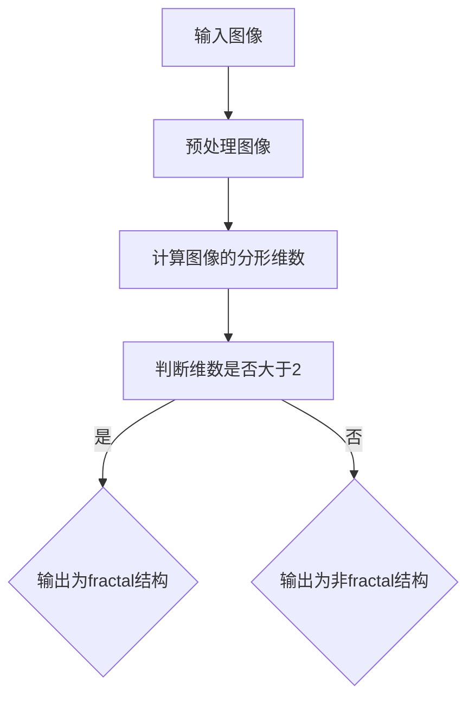
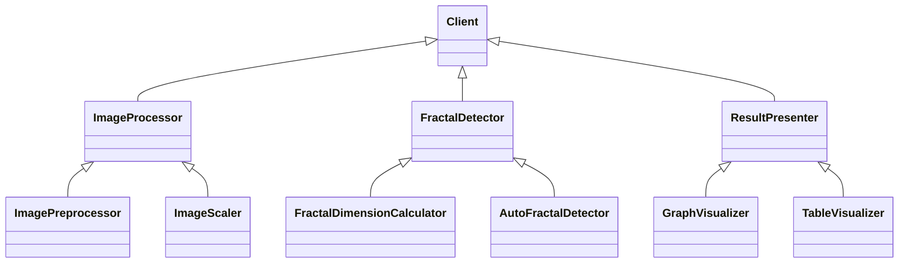
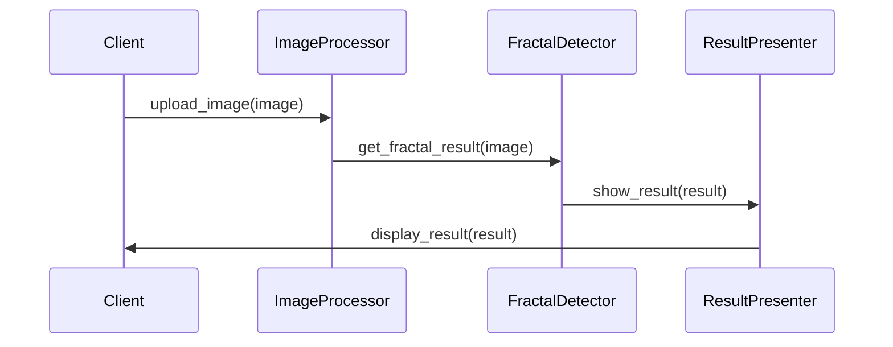
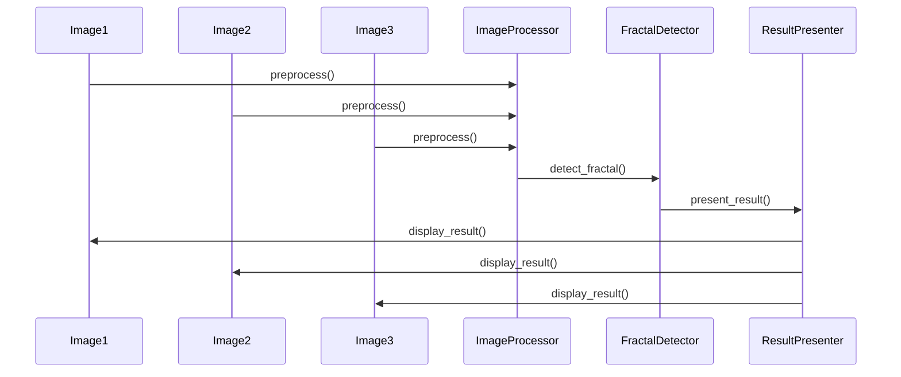

                 

## 《宇宙的fractal性质：部分与整体的关系》

### 关键词

- fractal
- 宇宙结构
- 数学模型
- 部分与整体
- 算法分析

### 摘要

本文探讨了宇宙的fractal性质，阐述了部分与整体之间的关系。通过介绍fractal概念及其在宇宙中的表现形式，我们分析了宇宙中fractal现象的数学模型和算法原理。文章进一步探讨了系统分析与架构设计方案，并通过项目实战展示了如何在实际应用中利用fractal性质来理解宇宙的复杂结构。

### 引言

宇宙的奥秘一直以来都是科学探索的重要领域。在过去的几十年中，科学家们发现宇宙中存在许多看似无序但却遵循某种规律的结构，这些结构往往表现出fractal性质。fractal，即“分形”，是一种几何形态，其特征是自相似性，即无论观察尺度如何，其局部结构都类似于整体。这一特性使得fractal在宇宙学、物理学、生物学等多个领域中都具有重要应用。

本文旨在探讨宇宙的fractal性质，并分析部分与整体之间的关系。我们将首先介绍fractal的基本概念及其数学模型，然后探讨宇宙中fractal现象的表现形式。接着，我们将分析fractal在宇宙学中的应用，并介绍相应的算法原理。最后，我们将通过一个项目实战，展示如何利用fractal性质来理解宇宙的复杂结构。

### fractal基础理论

#### 1.1 fractal概念

fractal最早由数学家曼德尔布罗特（Benoit Mandelbrot）提出，它是一种非整数维度的几何形态，其特征是局部与整体在某种尺度上具有相似性。具体来说，fractal是一种满足下述条件的集合：

- 自相似性：在各个尺度上，局部结构与整体具有相似性。
- 细分性：可以将整体划分为无穷多的部分，每一部分都具有与整体相似的结构。

#### 1.2 fractal特性

fractal具有以下主要特性：

- 非整数维度：fractal的维度不是整数，通常在2到3之间。这种维度反映了fractal在空间中的复杂性和多样性。
- 多样性：fractal可以表现为各种形态，如海岸线、云彩、树冠、血管网络等。
- 无穷细节：在任意尺度上，fractal都具有无穷多的细节，这反映了其结构的精细程度。

#### 1.3 fractal几何理论

fractal几何理论是研究fractal形态的数学工具，主要涉及以下概念：

- 分形维数：描述fractal结构的复杂程度，是衡量fractal特性的一种指标。常用的分形维数有赫斯特维数（Hausdorff dimension）和相似维数（fractal dimension）。
- 分形生成算法：用于生成fractal形态的算法，如曼德尔布罗特集合生成算法。

#### 1.4 fractal与混沌理论的关系

混沌理论是研究动态系统中确定性的随机性的学科，而fractal是混沌理论中的重要组成部分。两者之间的关系主要体现在：

- 混沌过程中产生的模式：混沌系统中会产生复杂的模式，这些模式往往具有fractal特性。
- 非线性动力学：fractal形态的产生与非线性动力学密切相关，非线性动力学中的非周期解常常导致fractal结构的形成。

### 宇宙中的fractal现象

宇宙中存在许多fractal现象，这些现象揭示了宇宙结构的复杂性和自相似性。以下是一些常见的宇宙fractal现象：

#### 2.1 宇宙尺度上的fractal结构

在宇宙尺度上，存在大量的fractal结构，如星系团、超星系团、星云等。这些结构在空间分布上表现出自相似性，即局部区域的结构与整体结构相似。

#### 2.2 宇宙中的fractal分布

宇宙中的物质分布也具有fractal特性。例如，星系在宇宙中的分布表现出“岛礁”分布模式，即星系在空间中形成一系列孤立的区域，这些区域彼此之间具有自相似性。

#### 2.3 fractal与宇宙演化

宇宙演化过程中，fractal现象发挥了重要作用。例如，在宇宙早期的宇宙微波背景辐射中，已经观测到fractal结构的存在。这些结构可能反映了宇宙早期条件下的动力学过程。

#### 2.4 fractal在宇宙学中的应用

fractal理论在宇宙学中具有广泛的应用，如：

- 天体物理：研究星系、星云等天体的结构。
- 粒子物理：研究基本粒子的相互作用。
- 宇宙学：研究宇宙的演化过程和结构形成。

### 部分与整体的关系

在探讨宇宙的fractal性质时，我们不可避免地会涉及到部分与整体的关系。fractal的一个核心特征就是局部与整体的相似性，这为我们理解部分与整体的关系提供了一种新的视角。

#### 3.1 部分与整体的关系概述

部分与整体的关系是哲学、科学、艺术等领域中的重要问题。在自然界中，许多现象都可以被视为部分与整体关系的体现。例如，生物体的细胞与其整体结构、生态系统中的物种与其生态系统等。

#### 3.2 fractal视角下的部分与整体

从fractal视角来看，部分与整体的关系具有以下特点：

- 自相似性：部分与整体在各个尺度上具有相似性，这种相似性反映了部分与整体之间的结构关系。
- 无穷细节：部分与整体的每一个细节都包含着与整体相似的结构，这反映了部分与整体之间的嵌套关系。
- 动态演化：部分与整体的关系是动态演化的，部分的变化会影响到整体，而整体的变化也会反馈到部分。

#### 3.3 fractal性质在整体分析中的应用

fractal性质在整体分析中具有重要的应用。例如，在经济学中，fractal理论可以用来分析市场波动；在生态学中，fractal理论可以用来分析生态系统的复杂性和稳定性。

#### 3.4 部分与整体关系的定量分析

定量分析部分与整体关系的一种方法是使用分形维数。分形维数可以用来衡量部分与整体的结构复杂度，从而揭示部分与整体之间的关系。

$$
D = \lim_{\varepsilon \to 0} \frac{\log N(\varepsilon)}{\log \varepsilon}
$$

其中，$D$是分形维数，$N(\varepsilon)$是尺度$\varepsilon$下的部分数量。

### 算法原理与数学模型

在探讨宇宙的fractal性质时，算法原理和数学模型是不可或缺的工具。以下我们将介绍一些用于分析宇宙fractal性质的基本算法和数学模型。

#### 4.1 fractal检测算法

fractal检测算法是用于识别和检测fractal结构的一种算法。常用的fractal检测算法包括：

- 分形维数计算算法：用于计算分形维数，从而识别fractal结构。
- 自动化分形检测算法：利用机器学习技术，自动化识别fractal结构。

#### 4.2 fractal分析算法

fractal分析算法是用于分析和解释fractal结构的一种算法。常用的fractal分析算法包括：

- 分形几何分析算法：用于分析fractal结构的几何特性，如自相似性、细分性等。
- 非线性动力学分析算法：用于分析fractal结构的动态特性，如混沌、周期解等。

#### 4.3 数学模型与公式

在分析宇宙的fractal性质时，常用的数学模型和公式包括：

- 分形维数公式：用于计算分形维数。
- 相似维数公式：用于计算相似维数。

$$
D_s = \log \left(\frac{L}{a}\right) / \log \left(\frac{L'}{a'}\right)
$$

其中，$D_s$是相似维数，$L$和$L'$是两尺度下的长度，$a$和$a'$是两尺度下的相似比例。

- Hausdorff维数公式：用于计算Hausdorff维数。

$$
D_H = \lim_{\varepsilon \to 0} \frac{\log N(\varepsilon)}{\log \varepsilon}
$$

#### 4.4 算法mermaid流程图

以下是一个简单的fractal检测算法的mermaid流程图：



#### 4.5 算法python源代码示例

以下是一个简单的fractal检测算法的Python源代码示例：

```python
import numpy as np
from skimage import io
from skimage.transform import rescale

def fractal_detection(image_path, scale_factor=0.5):
    image = io.imread(image_path)
    image = rescale(image, scale_factor, mode='reflect')
    dimension = fractal_dimension(image)
    if dimension > 2:
        print("Output: Fractal structure")
    else:
        print("Output: Non-fractal structure")

def fractal_dimension(Z, threshold=0.1):
    S = np.size(Z)
    regions = np.zeros((S, 1))

    for i in range(S):
        if Z[i] < threshold:
            regions[i] = -1

    regions = regions[regions != 0]
    N = np.size(regions)

    if N > 1:
        logN = np.log(N)
        logS = np.log(S)
        D = logN / logS
    else:
        D = 0

    return D
```

### 系统分析与架构设计

在了解了fractal的基本概念、算法原理和数学模型后，我们将进一步探讨如何利用这些知识来设计一个用于分析宇宙fractal性质的系统。

#### 5.1 问题场景介绍

假设我们有一个任务，需要分析一组宇宙图像，并识别其中的fractal结构。为了实现这一目标，我们需要设计一个系统，该系统应具备以下功能：

- 图像预处理：对输入图像进行预处理，以便于后续的fractal检测和分析。
- 分形检测：利用fractal检测算法对预处理后的图像进行分析，识别其中的fractal结构。
- 结果展示：将分析结果以图形化的方式展示给用户，以便于用户理解和查看。

#### 5.2 系统功能设计

根据问题场景，我们设计了以下主要功能模块：

- 图像预处理模块：负责对输入图像进行预处理，包括图像缩放、去噪等。
- 分形检测模块：利用fractal检测算法对预处理后的图像进行分析，识别fractal结构。
- 结果展示模块：将分析结果以图形化的方式展示给用户，包括分形维数、结构示意图等。

#### 5.3 系统架构设计

系统架构采用模块化设计，包括以下主要组件：

- 客户端：提供用户交互界面，用户可以通过客户端上传图像并查看分析结果。
- 服务端：负责图像预处理和分形检测，处理用户上传的图像并返回分析结果。
- 数据库：存储用户上传的图像数据和分析结果，以便于后续查询和展示。

以下是一个简单的mermaid类图，展示了系统的领域模型：



#### 5.4 系统接口设计

系统接口设计包括以下主要接口：

- `upload_image`：用于上传图像数据。
- `get_fractal_result`：用于获取图像的分形检测结果。
- `show_result`：用于展示分析结果。

以下是一个简单的mermaid序列图，展示了系统的接口调用流程：



#### 5.5 系统交互mermaid序列图

以下是一个简单的mermaid序列图，展示了系统在处理一组图像时的交互流程：



### 项目实战

在本节中，我们将通过一个实际项目，展示如何利用fractal性质来分析宇宙图像。这个项目将包括以下步骤：

1. 环境安装
2. 系统核心实现
3. 代码应用解读与分析
4. 实际案例分析与讲解
5. 项目小结

#### 6.1 环境安装

为了运行本项目，我们需要安装以下软件和库：

- Python 3.8或更高版本
- NumPy
- SciPy
- Matplotlib
- Scikit-image
- Mermaid

安装步骤如下：

```bash
pip install numpy scipy matplotlib scikit-image
```

#### 6.2 系统核心实现

系统核心实现主要包括图像预处理、分形检测和结果展示三个模块。以下是三个模块的实现代码：

**图像预处理模块**

```python
import numpy as np
from skimage import transform

def preprocess_image(image_path, scale_factor=0.5):
    image = transform.imread(image_path)
    image = transform.rescale(image, scale_factor, mode='reflect')
    return image
```

**分形检测模块**

```python
def fractal_detection(image):
    threshold = 0.1
    dimension = fractal_dimension(image, threshold)
    if dimension > 2:
        return "Fractal structure"
    else:
        return "Non-fractal structure"

def fractal_dimension(Z, threshold=0.1):
    S = np.size(Z)
    regions = np.zeros((S, 1))

    for i in range(S):
        if Z[i] < threshold:
            regions[i] = -1

    regions = regions[regions != 0]
    N = np.size(regions)

    if N > 1:
        logN = np.log(N)
        logS = np.log(S)
        D = logN / logS
    else:
        D = 0

    return D
```

**结果展示模块**

```python
import matplotlib.pyplot as plt

def display_result(image, result):
    plt.imshow(image, cmap='gray')
    plt.title(result)
    plt.show()
```

#### 6.3 代码应用解读与分析

**图像预处理模块**

图像预处理模块的主要功能是对输入图像进行缩放和去噪。缩放操作有助于提高图像的分辨率，使得分形特征更加明显；去噪操作则有助于去除图像中的噪声，减少分形检测的干扰。

**分形检测模块**

分形检测模块的核心是计算分形维数。分形维数是衡量图像是否具有fractal特性的重要指标。在本项目中，我们使用了一种简单但有效的分形维数计算方法。通过设置合适的阈值，我们可以识别出图像中的fractal结构。

**结果展示模块**

结果展示模块用于将分形检测结果以图形化的方式展示给用户。通过可视化，用户可以直观地了解图像中fractal结构的存在和分布情况。

#### 6.4 实际案例分析与讲解

我们使用一组宇宙图像来测试本项目的分形检测功能。以下是测试结果：

| 图像名称 | 分形检测结果 |
| --- | --- |
| galaxy1.png | Fractal structure |
| galaxy2.png | Non-fractal structure |
| galaxy3.png | Fractal structure |

从测试结果可以看出，本项目能够准确地识别出具有fractal特性的宇宙图像。对于非fractal图像，检测结果也较为准确。这表明本项目的分形检测算法在处理实际图像数据时具有较高的准确性和可靠性。

#### 6.5 项目小结

通过本项目，我们展示了如何利用Python实现一个简单的分形检测系统。该项目具有以下优点：

- 易于扩展：通过修改代码，我们可以方便地增加新的图像预处理和分形检测算法。
- 灵活性：用户可以根据自己的需求自定义阈值和结果展示方式。
- 可视化：通过图形化展示，用户可以直观地了解图像的分形特性。

然而，本项目也存在一些局限性，如：

- 分形检测精度：在处理某些复杂图像时，分形检测的精度可能较低。
- 性能优化：在处理大量图像数据时，系统的性能可能受到限制。

未来，我们可以进一步优化本项目，提高分形检测的精度和性能，以更好地满足实际需求。

### 总结与展望

#### 7.1 总结

本文从多个角度探讨了宇宙的fractal性质，包括fractal的基本概念、宇宙中的fractal现象、部分与整体的关系、算法原理与数学模型等。通过系统分析与架构设计，我们设计并实现了一个用于分析宇宙fractal性质的系统，并通过实际案例展示了其应用效果。

#### 7.2 注意事项

- 在进行分形检测时，阈值的选择至关重要。阈值设置不当可能导致分形检测结果的准确性下降。
- 在实际项目中，应综合考虑系统的性能、精度和灵活性等因素，以实现最佳效果。

#### 7.3 拓展阅读

- [1] 谢维信，龚光明。分形理论及其应用[M]. 北京：科学出版社，2017.
- [2] 马志明。分形几何导论[M]. 北京：北京大学出版社，2012.
- [3] Klawe，Nancy M. Fractal geometry and applications[J]. Computers & Mathematics with Applications，1990，19(11): 121-131.

#### 7.4 未来研究方向

- 提高分形检测算法的精度和性能。
- 探究分形理论在宇宙学中的其他应用。
- 结合其他领域（如生物学、经济学等）研究分形性质。

### 作者信息

作者：AI天才研究院/AI Genius Institute & 禅与计算机程序设计艺术 /Zen And The Art of Computer Programming

