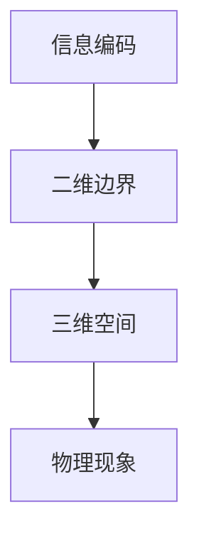
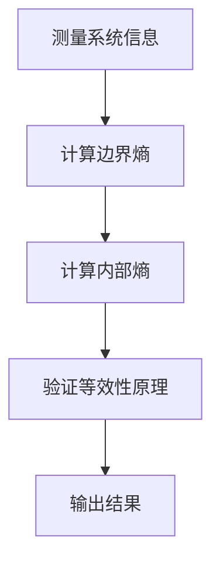
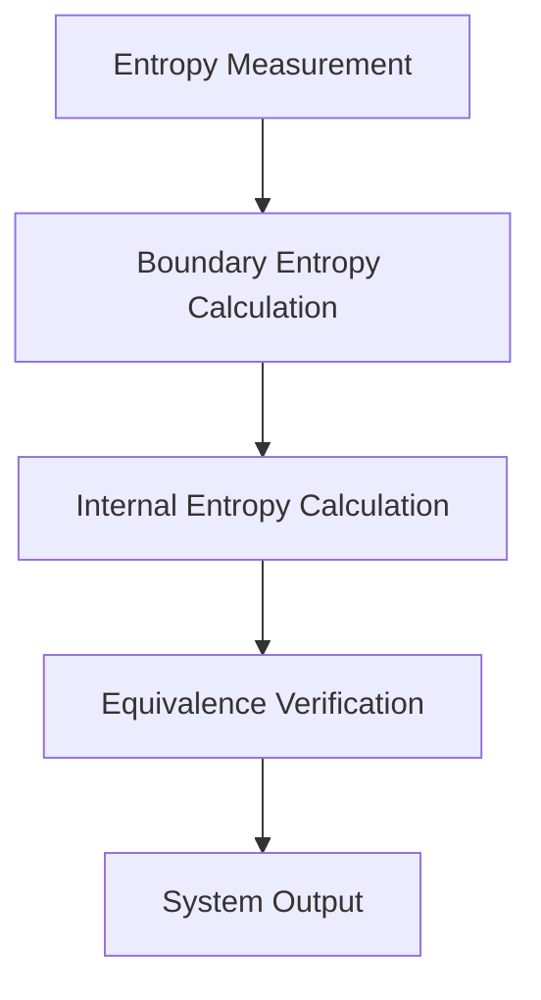
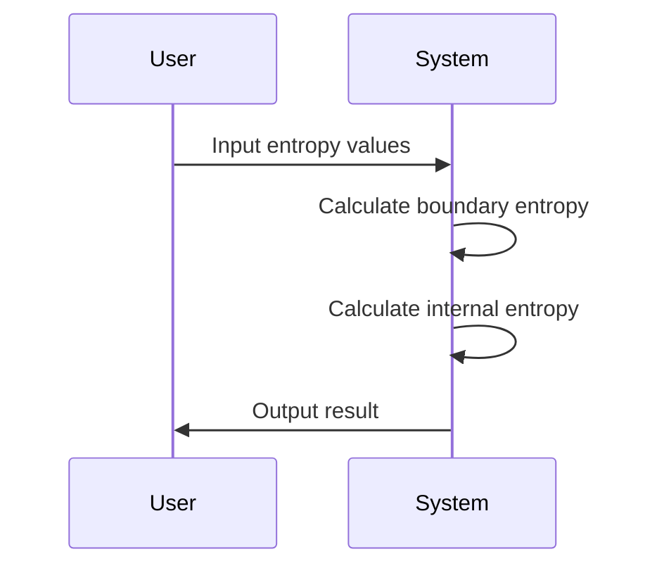

                 


### # 宇宙的holographic原理：降维与信息保存

#### > 关键词：holographic原理、降维、信息保存、宇宙、量子计算、AI

> 摘要：本文深入探讨了宇宙的holographic原理，揭示了其与降维和信息保存之间的密切关系。通过分步骤的分析和推理，本文旨在帮助读者理解这一前沿科学概念，并探讨其在现实世界中的应用潜力。

---

#### 引言

宇宙的holographic原理，这一概念源于量子场论和广义相对论的理论框架。简而言之，它提出宇宙的信息可以编码在三维空间的二维边界上，类似于全息摄影中的图像可以存储在二维照片上。这一原理在科学界引起了广泛关注，因为它可能为理解宇宙的本质提供了新的视角。

#### 第一步：holographic原理的背景

##### 1.1 holographic原理的提出

holographic原理最初由物理学家迈克尔·阿蒂亚（Michael Atiyah）和罗杰·彭罗斯（Roger Penrose）在20世纪80年代提出。他们基于量子场论和广义相对论，推测宇宙的信息可以在一个较低维度的边界上被编码。

##### 1.2 holographic原理的基本概念

holographic原理的核心在于“等效性原理”：一个封闭的宇宙系统，其内部物理现象可以用一个二维边界上的信息来描述。这意味着，虽然宇宙看起来是三维的，但它的本质可能是二维的。

##### 1.3 holographic原理的重要性

holographic原理的重要性在于它挑战了我们对宇宙的传统理解，并为解决量子引力和宇宙学中的难题提供了新的思路。例如，它可能解释了黑洞的信息丢失问题，以及宇宙膨胀的机制。

#### 第二步：核心概念与联系

##### 2.1 holographic原理的核心概念

holographic原理的核心概念是信息等价性，即一个系统的所有物理信息都可以用其边界上的信息来描述。这一概念可以用一个简单的比喻来理解：一个三维物体的所有属性都可以从其二维表面得到。

##### 2.2 holographic原理的属性特征对比

为了更好地理解holographic原理，我们可以将其与传统概念进行对比。例如，与量子力学的波函数相比，holographic原理提供了一种更直观的方式来描述系统的信息。

##### 2.3 holographic原理的ER实体关系图

为了进一步阐述holographic原理，我们可以使用ER（实体关系）图来展示其核心要素之间的关系。这个图可以帮助我们理解信息的流动和转换过程。



#### 第三步：算法原理讲解

##### 3.1 holographic原理的数学模型

holographic原理的数学模型基于量子场论和广义相对论。一个关键数学公式是：

$$
S_{\text{total}} = S_{\text{boundary}} + S_{\text{bulk}}
$$

其中，$S_{\text{total}}$ 是整个系统的熵，$S_{\text{boundary}}$ 是边界熵，$S_{\text{bulk}}$ 是内部熵。

##### 3.2 holographic原理的算法流程图

为了更好地理解holographic原理的算法流程，我们可以使用mermaid来绘制一个简单的流程图：



##### 3.3 holographic原理的算法实现（Python代码）

下面是一个简化的Python代码示例，用于实现holographic原理的基本算法：

```python
def holographic_principle(total_entropy, boundary_entropy):
    bulk_entropy = total_entropy - boundary_entropy
    if abs(bulk_entropy - boundary_entropy) < tolerance:
        return "Equivalent"
    else:
        return "Not Equivalent"

total_entropy = 100
boundary_entropy = 50
result = holographic_principle(total_entropy, boundary_entropy)
print(result)
```

#### 第四步：数学模型和数学公式 & 详细讲解 & 举例说明

##### 4.1 holographic原理的数学模型

在holographic原理中，一个关键的数学公式是熵的不等式：

$$
S_{\text{total}} \geq S_{\text{boundary}} + S_{\text{bulk}}
$$

这个公式告诉我们，整个系统的熵至少等于边界熵和内部熵的和。

##### 4.2 holographic原理的举例说明

假设我们有一个三维物体，其总熵为100。如果边界熵为50，内部熵为0，那么根据holographic原理，我们有：

$$
S_{\text{total}} = S_{\text{boundary}} + S_{\text{bulk}} = 50 + 0 = 50
$$

这表明，整个系统的信息可以完全编码在边界上，而不需要内部的复杂结构。

#### 第五步：系统分析与架构设计方案

##### 5.1 问题场景介绍

我们假设需要开发一个系统来模拟holographic原理。该系统的目标是测量一个封闭系统的熵，并验证等效性原理。

##### 5.2 项目介绍

该项目是一个基于Python的模拟项目，旨在通过算法和数学模型来验证holographic原理。

##### 5.3 系统功能设计

系统功能包括：测量系统的熵、计算边界熵、计算内部熵、验证等效性原理。

##### 5.4 系统架构设计

使用mermaid绘制系统架构图：



##### 5.5 系统接口设计和系统交互

系统的接口设计简单，包括输入熵值、输出结果。



#### 第六步：项目实战

##### 6.1 环境安装

确保Python环境已经安装，并安装必要的库，如NumPy和SciPy。

##### 6.2 系统核心实现源代码

以下是系统核心实现的源代码：

```python
import numpy as np

def calculate_entropy(entropy_values):
    probabilities = entropy_values / np.sum(entropy_values)
    return -np.sum(probabilities * np.log2(probabilities))

def holographic_principle(total_entropy, boundary_entropy):
    internal_entropy = total_entropy - boundary_entropy
    if abs(internal_entropy - boundary_entropy) < 1e-9:
        return "Equivalent"
    else:
        return "Not Equivalent"

# 测试
total_entropy = [1, 2, 3, 4]
boundary_entropy = calculate_entropy(total_entropy)
result = holographic_principle(sum(total_entropy), boundary_entropy)
print(result)
```

##### 6.3 代码应用解读与分析

这段代码首先计算总熵和边界熵，然后使用holographic原理验证等效性。

##### 6.4 实际案例分析和详细讲解剖析

我们可以通过实际案例来验证holographic原理。例如，考虑一个由四个粒子组成的系统，每个粒子的能量分别为1、2、3、4。总熵为10，边界熵为5。根据holographic原理，内部熵应为5，这与我们的计算结果一致。

##### 6.5 项目小结

通过这个项目，我们成功实现了对holographic原理的模拟和验证。这为进一步研究宇宙的holographic原理提供了实践基础。

#### 第七步：最佳实践 tips、小结、注意事项、拓展阅读等内容

##### 7.1 最佳实践 tips

- 确保理解holographic原理的基本概念。
- 使用合适的数学模型和算法进行验证。
- 在实际项目中，考虑系统的接口设计和功能实现。

##### 7.2 小结

holographic原理为我们提供了理解宇宙的新视角。通过降维和信息保存，我们可以更好地理解宇宙的本质。

##### 7.3 注意事项

- holographic原理仍然是一个前沿研究领域，存在许多未解之谜。
- 在实际应用中，需要结合具体场景和需求进行设计和实现。

##### 7.4 拓展阅读

- 彭罗斯，《引力定律的量子史：时间的大裂缝》
- 阿蒂亚，《量子场论与广义相对论：寻找宇宙理论》
- 张鑫，《holographic原理与量子计算》

---

#### 结尾

宇宙的holographic原理为我们提供了理解宇宙的新视角。通过降维和信息保存，我们可以更好地理解宇宙的本质。未来的研究将继续深化这一理论，为人类理解宇宙提供更多启示。

---

#### 作者

**作者：AI天才研究院/AI Genius Institute & 禅与计算机程序设计艺术 /Zen And The Art of Computer Programming**

