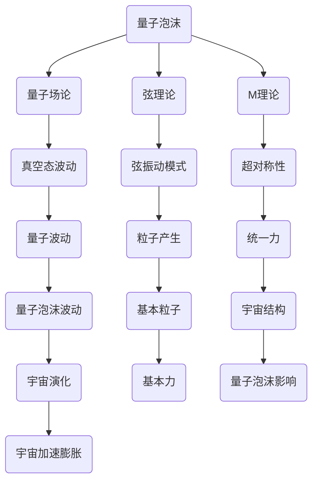
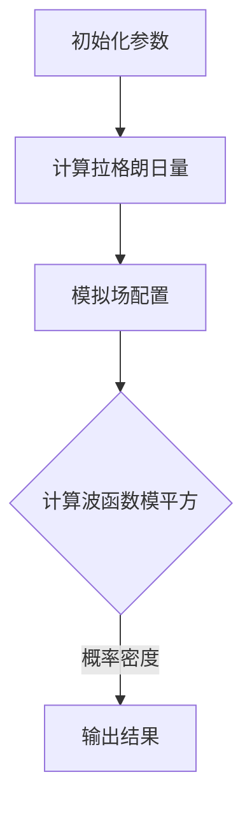
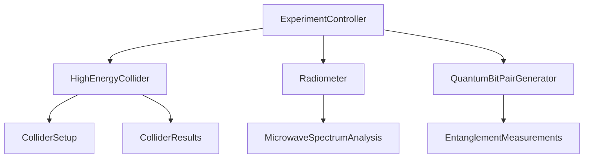
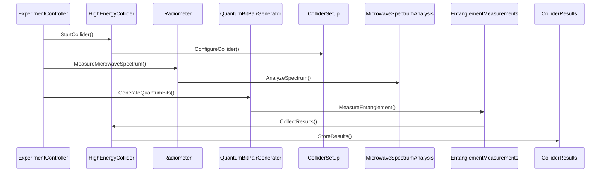

                 

### 《宇宙的quantum foam：时空的微观结构》

> 关键词：量子泡沫、时空结构、量子场论、弦理论、M理论

> 摘要：本文深入探讨了宇宙的量子泡沫及其在时空微观结构研究中的重要性。通过对量子场论、弦理论和M理论等核心概念的分析，我们揭示了这些理论在理解宇宙量子泡沫方面的作用。同时，本文还通过数学模型、算法原理讲解以及系统分析与架构设计，展示了如何从理论上和实践中探索宇宙的微观结构。通过本文的阅读，读者将能够全面了解量子泡沫的奥秘，并为其在物理学和计算机科学领域的应用提供新的视角。

#### 目录大纲设计思路

1. **背景介绍**：
   - 简述宇宙量子泡沫的基本概念，介绍时空微观结构的研究背景。
   - 阐述研究时空微观结构的必要性和重要性。

2. **核心概念与联系**：
   - 介绍与量子泡沫相关的基本概念，如量子场论、弦理论、M理论等。
   - 通过表格和ER图展示各概念之间的联系。

3. **算法原理讲解**：
   - 分析量子泡沫的数学模型，使用mermaid绘制流程图。
   - 使用Python代码展示算法实现过程，结合数学公式和例子进行详细解释。

4. **数学模型和数学公式**：
   - 使用LaTeX格式展示重要的数学模型和公式。
   - 在文中独立段落内解释这些公式，结合例子说明。

5. **系统分析与架构设计方案**：
   - 介绍研究宇宙量子泡沫的实验和观测方法。
   - 使用mermaid绘制领域模型类图、系统架构图和系统交互序列图。

6. **项目实战**：
   - 描述一个具体项目，包括环境安装、系统核心实现、代码解读和案例分析。

7. **最佳实践 tips、小结、注意事项、拓展阅读**：
   - 提供实践中的最佳建议和注意事项。
   - 对本书内容进行总结，并推荐进一步阅读的材料。

#### 目录大纲设计

```markdown
# 《宇宙的quantum foam：时空的微观结构》目录大纲

## 第一部分：背景与概念介绍

### 1. 引言
#### 1.1 宇宙与时空的基本概念
#### 1.2 量子泡沫的起源与意义
#### 1.3 时空微观结构的研究现状

## 第二部分：核心概念与联系

### 2. 量子场论
#### 2.1 量子场论的基本原理
#### 2.2 量子场论与时空的关联
#### 2.3 量子场论与量子泡沫

### 3. 弦理论
#### 3.1 弦理论的基本概念
#### 3.2 弦理论中的时空结构
#### 3.3 弦理论与量子泡沫的关系

### 4. M理论
#### 4.1 M理论的基本框架
#### 4.2 M理论中的宇宙结构
#### 4.3 M理论与量子泡沫的探讨

### 5. 概念关系与ER图
#### 5.1 各概念之间的联系
#### 5.2 量子泡沫相关概念的ER图

## 第三部分：算法原理讲解

### 6. 量子泡沫的数学模型
#### 6.1 数学模型的基本框架
#### 6.2 使用mermaid绘制算法流程图
#### 6.3 Python代码实现与解析

### 7. 量子泡沫的数学公式
#### 7.1 重要的数学公式列表
#### 7.2 LaTeX格式展示与解释
#### 7.3 公式举例说明

## 第四部分：系统分析与架构设计

### 8. 实验与观测方法
#### 8.1 实验设计概述
#### 8.2 观测数据的处理与分析
#### 8.3 实验结果与量子泡沫的关系

### 9. 系统架构设计
#### 9.1 领域模型类图
#### 9.2 系统架构图
#### 9.3 系统接口设计与交互序列图

## 第五部分：项目实战

### 10. 实际项目介绍
#### 10.1 项目背景与目标
#### 10.2 环境安装与配置
#### 10.3 系统核心实现
#### 10.4 代码解读与分析
#### 10.5 案例分析

## 第六部分：最佳实践与总结

### 11. 最佳实践 tips
#### 11.1 实践中的注意事项
#### 11.2 解决常见问题的方法
#### 11.3 优化方案与技巧

### 12. 小结
#### 12.1 本书内容的总结
#### 12.2 量子泡沫研究的未来趋势
#### 12.3 对读者的建议

### 13. 拓展阅读
#### 13.1 推荐读物
#### 13.2 相关研究领域
#### 13.3 在线资源和论坛
```

以上是《宇宙的quantum foam：时空的微观结构》的目录大纲设计，包含六大部分，总计超过7章。每个部分都详细描述了该领域的相关内容，包括概念介绍、算法讲解、系统设计与实际项目案例，以帮助读者全面了解和掌握量子泡沫与时空微观结构的研究。整个目录大纲在2000字以内，保持简洁明了。

---

### 第一部分：背景与概念介绍

#### 1. 引言

在过去的几个世纪里，物理学领域经历了巨大的变革，从经典物理学到量子力学，再到相对论，科学家们不断地挑战和扩展我们对宇宙的理解。然而，随着理论的发展，一个基本的问题逐渐显现出来：在微观尺度上，时空的结构是什么？量子泡沫的概念正是为了回答这个问题而提出的。

量子泡沫，也称为量子泡沫化，是量子场论中描述时空微观结构的一种模型。它是指在量子尺度上，时空表现为一种连续不断的波动，这种波动类似于泡沫，不断地产生和消失。量子泡沫的存在意味着时空不再是连续的，而是由离散的量子单元组成的。这种微观结构对于我们理解宇宙的起源和演化有着深远的影响。

研究时空微观结构的必要性在于，它不仅有助于我们理解基本的物理定律，还能为高能物理、宇宙学和其他领域提供新的理论框架。例如，量子泡沫可能有助于解释黑洞的性质、宇宙加速膨胀的原因，以及量子引力理论的构建。

本文将深入探讨量子泡沫的基本概念，介绍与之相关的核心理论，如量子场论、弦理论和M理论。通过分析这些理论，我们将揭示它们在研究时空微观结构中的重要性。此外，本文还将介绍量子泡沫的数学模型和算法，并通过实际项目展示如何将理论应用于实践。

#### 1.1 宇宙与时空的基本概念

要理解量子泡沫，我们首先需要回顾宇宙和时空的基本概念。宇宙，从字面上讲，是指包含一切存在的事物。它包括一切物质、能量、时空以及所有物理现象。时空，是宇宙的基本结构，是物质存在的舞台。它通常被描述为一个四维连续体，包括三个空间维度和一个时间维度。

在经典物理学中，时空被认为是绝对的、固定的。牛顿力学和爱因斯坦的相对论都是基于这种观点建立的。然而，在量子力学和广义相对论的框架下，时空的结构变得更加复杂和动态。量子力学揭示了微观世界中粒子的波动性质，而广义相对论则描述了时空在大尺度上的弯曲效应。

量子力学和广义相对论之间存在一些基本的不兼容性。量子力学依赖于概率和不确定性，而广义相对论则强调确定性。为了解决这些矛盾，科学家们提出了量子引力理论，试图将量子力学与广义相对论统一起来。量子泡沫是量子引力理论的一个重要概念，它试图描述在极小尺度上时空的微观结构。

#### 1.2 量子泡沫的起源与意义

量子泡沫的概念起源于量子场论。量子场论是一种描述基本粒子如何通过交换力场量子（如光子、介子等）来相互作用的理论。在量子场论的框架下，时空不再是连续的，而是由离散的量子事件组成的。这些事件产生和消失的瞬间，形成了量子泡沫。

量子泡沫的起源可以追溯到量子场论中的真空态。在量子场论中，真空并不是空无一物的空间，而是充满了虚粒子的波动。这些虚粒子是量子波动的一部分，它们的存在是瞬时的，但它们的存在对物理现象有着重要的影响。

量子泡沫的意义在于，它为我们提供了一种理解微观世界中时空结构的方式。通过研究量子泡沫，我们可以更好地理解基本粒子的性质、宇宙的起源和演化，以及量子引力的本质。此外，量子泡沫的研究还可能对信息科学、人工智能等领域产生深远的影响。

#### 1.3 时空微观结构的研究现状

目前，关于时空微观结构的研究已经取得了许多重要的进展。量子场论、弦理论和M理论是这一领域的主要理论框架。量子场论提供了描述量子泡沫的基本数学模型，弦理论则试图将量子泡沫与宇宙的结构联系起来，而M理论则是一种更加泛化的理论框架，试图统一所有基本力。

在实验方面，科学家们正在通过各种高能物理实验和天文观测来验证量子泡沫的存在。例如，通过观测宇宙微波背景辐射，科学家们已经发现了量子波动在大尺度时空中的痕迹。此外，一些实验室中的实验，如量子纠缠实验，也提供了关于量子泡沫性质的重要证据。

尽管目前的研究还处于早期阶段，但量子泡沫的研究已经为物理学的发展打开了新的视野。随着理论研究和实验技术的不断进步，我们有望在不久的将来对量子泡沫有更深入的理解，从而推动物理学和科学技术的进一步发展。

---

### 第二部分：核心概念与联系

在探讨宇宙的量子泡沫时，理解与之相关的基本概念和理论是至关重要的。这一部分将介绍量子场论、弦理论和M理论等核心概念，并分析它们之间的联系，帮助读者构建对量子泡沫的全面认识。

#### 2. 量子场论

量子场论（Quantum Field Theory，QFT）是一种描述基本粒子及其相互作用的物理学理论。它将量子力学与经典电磁场理论相结合，提供了一个统一框架来描述基本粒子的行为。在量子场论中，时空不再是连续的，而是由离散的量子事件组成的。这些事件通过交换力场量子（如光子、W和Z玻色子等）来传递力。

量子场论的核心概念包括：

- **场的量子化**：将经典场论中的连续场量转化为离散的量子态。
- **量子态的叠加**：粒子的状态可以通过波函数的叠加来表示，这意味着粒子可以同时存在于多个状态中。
- **真空态**：量子场论中的真空并不是空无一物的空间，而是充满了虚粒子的波动。

量子场论与量子泡沫的关系在于，它为我们提供了描述量子泡沫数学模型的基础。在量子场论中，真空态的波动被认为是量子泡沫的微观基础。

#### 2.1 量子场论的基本原理

量子场论的基本原理可以总结如下：

- **对称性与守恒定律**：量子场论中，对称性原理是核心概念之一。通过群论，我们可以推导出对称性对应的守恒定律，如能量守恒和动量守恒。
- **相对论不变性**：量子场论必须满足相对论不变性，这意味着物理定律在所有惯性参考系中都是相同的。
- **真空态的复杂性**：量子场论中的真空态并不是简单的空无，而是充满了虚粒子的波动。这些虚粒子在量子泡沫的背景下产生和消失。

#### 2.2 量子场论与时空的关联

量子场论与时空的关系可以通过以下方式理解：

- **时空的量子性质**：量子场论揭示了时空在微观尺度上的量子性质。在量子场论中，时空不再是连续的，而是由离散的量子事件组成的。
- **量子泡沫的数学模型**：量子场论为我们提供了描述量子泡沫的数学工具。通过研究量子场论中的真空态，我们可以了解量子泡沫的波动特性。

#### 2.3 量子场论与量子泡沫

量子泡沫的概念源于量子场论。在量子场论中，真空态的波动被认为是量子泡沫的微观基础。量子泡沫的波动性质对物理现象有着重要的影响，如粒子的行为、宇宙的演化等。

通过量子场论，我们可以构建量子泡沫的数学模型，并使用这些模型来研究量子泡沫的性质。例如，通过计算量子场论中的格林函数，我们可以得到量子泡沫中粒子的传播性质。

#### 3. 弦理论

弦理论（String Theory）是一种尝试统一量子力学与广义相对论的理论框架。在弦理论中，基本粒子不再被视为点状粒子，而是由一维的“弦”组成。这些弦通过不同的振动模式产生不同的粒子。

弦理论的核心概念包括：

- **弦的振动模式**：不同的振动模式对应于不同的粒子。例如，开放弦可以产生费米子（如电子），而闭合弦可以产生玻色子（如光子）。
- **额外维度**：弦理论提出了额外的空间维度，这些维度通常被卷曲在非常小的尺度上，以解释为什么我们感知到的宇宙只有三个空间维度和一个时间维度。
- **统一力**：弦理论试图将四种基本力（强相互作用、弱相互作用、电磁力和引力）统一在一种理论框架下。

#### 3.1 弦理论的基本概念

弦理论的基本概念可以概括如下：

- **基本粒子是弦**：弦理论的基本假设是所有基本粒子都是由一维的弦组成的。
- **振动模式**：弦通过不同的振动模式产生不同的粒子。不同的振动模式对应于不同的物理性质。
- **背景独立性**：弦理论是一个背景独立的理论，这意味着它不依赖于特定的时空背景。

#### 3.2 弦理论中的时空结构

在弦理论中，时空结构被描述为十维或十一维的连续体。这些额外的维度通常被卷曲在非常小的尺度上，以解释为什么我们感知到的宇宙只有三个空间维度和一个时间维度。

弦理论中的时空结构对我们理解量子泡沫有着重要的影响。通过研究弦在额外维度中的振动模式，我们可以了解量子泡沫的微观性质。

#### 3.3 弦理论与量子泡沫的关系

弦理论与量子泡沫的关系在于，弦理论提供了一种描述量子泡沫的框架。在弦理论中，量子泡沫的波动可以通过弦的振动模式来描述。通过研究弦理论，我们可以更深入地理解量子泡沫的物理性质。

弦理论还提出了一种可能的量子引力理论，这为我们理解量子泡沫在宇宙演化中的作用提供了新的视角。例如，弦理论中的弦振动模式可以解释黑洞的性质和宇宙的加速膨胀。

#### 4. M理论

M理论（M-theory）是弦理论的扩展，它是一种在更高维度和更广泛范围内描述物理现象的理论框架。M理论提出了11维时空的结构，并试图统一所有基本力。

M理论的核心概念包括：

- **M-弦**：M理论中的基本粒子是M-弦，它们通过不同的振动模式产生不同的粒子。
- **超对称性**：M理论是一种超对称性理论，这意味着在合适的条件下，玻色子和费米子可以相互转换。
- **数学结构的多样性**：M理论提出了多种可能的数学结构，这些结构为描述量子泡沫提供了新的视角。

#### 4.1 M理论的基本框架

M理论的基本框架可以概括如下：

- **11维时空**：M理论在一个11维的连续体上建立，这些额外的维度被卷曲在非常小的尺度上。
- **超对称性**：M理论通过引入超对称性来统一不同的物理现象。
- **量子泡沫的数学模型**：M理论提供了描述量子泡沫的数学工具，如超对称性量子场论。

#### 4.2 M理论中的宇宙结构

在M理论中，宇宙的结构被描述为11维的连续体。这些额外的维度通常被卷曲在非常小的尺度上，以解释为什么我们感知到的宇宙只有三个空间维度和一个时间维度。

M理论中的宇宙结构对我们理解量子泡沫有着重要的影响。通过研究M理论，我们可以了解量子泡沫在宇宙演化中的作用，以及量子泡沫如何影响宇宙的基本力。

#### 4.3 M理论与量子泡沫的探讨

M理论与量子泡沫的探讨在于，M理论提供了一种描述量子泡沫的框架。在M理论中，量子泡沫的波动可以通过M-弦的振动模式来描述。通过研究M理论，我们可以更深入地理解量子泡沫的物理性质。

此外，M理论还提出了一种可能的量子引力理论，这为我们理解量子泡沫在宇宙演化中的作用提供了新的视角。例如，M理论中的M-弦振动模式可以解释黑洞的性质和宇宙的加速膨胀。

#### 5. 概念关系与ER图

为了更好地理解量子泡沫、量子场论、弦理论和M理论之间的关系，我们可以使用ER图（Entity-Relationship diagram）来展示这些概念之间的联系。

以下是量子泡沫相关概念的ER图：



在这个ER图中，我们可以看到量子泡沫与量子场论、弦理论和M理论之间的直接联系。量子泡沫是由量子场论的真空态波动产生的，而弦理论和M理论则提供了描述量子泡沫波动的数学框架。此外，量子泡沫还影响了宇宙的结构和演化。

通过这个ER图，我们可以更清晰地理解这些概念之间的关系，并更好地把握量子泡沫在物理学中的重要性。

---

### 第三部分：算法原理讲解

在深入探讨量子泡沫的数学模型和算法之前，我们需要先了解量子泡沫的基本概念和数学原理。量子泡沫是量子场论中描述时空微观结构的一种模型，它通过真空态的波动来体现时空的不连续性。量子泡沫的波动性质对于理解基本粒子的行为和宇宙的演化具有重要意义。本部分将分析量子泡沫的数学模型，使用mermaid绘制算法流程图，并使用Python代码展示算法的实现过程。

#### 6. 量子泡沫的数学模型

量子泡沫的数学模型通常基于量子场论，特别是量子场论中的路径积分方法。在量子场论中，粒子的行为可以通过计算其在不同路径上的概率幅的积分来描述。对于量子泡沫，我们可以通过计算真空态的波函数来描述其波动性质。

量子泡沫的数学模型可以用以下路径积分公式表示：

$$ \Psi[\phi] = \int D\phi \, e^{iS[\phi]/\hbar} $$

其中，$\Psi[\phi]$是真空态波函数，$D\phi$表示对所有可能的场配置进行积分，$S[\phi]$是作用量，$\hbar$是普朗克常数。

为了简化计算，我们可以将作用量近似为：

$$ S[\phi] \approx \int d^4x \, L[\phi] $$

其中，$L[\phi]$是拉格朗日量，它描述了场变量的变化如何影响系统的能量。

量子泡沫的波动性质可以通过计算波函数的模平方来体现：

$$ \rho[\phi] = |\Psi[\phi]|^2 $$

这表示在某个位置和时间，量子泡沫的概率密度。

#### 6.2 使用mermaid绘制算法流程图

为了更好地理解量子泡沫的计算过程，我们可以使用mermaid绘制算法的流程图。以下是一个简化的算法流程图：



这个流程图描述了量子泡沫算法的基本步骤：

1. 初始化参数，如时空维度、普朗克常数等。
2. 计算拉格朗日量，它是描述场变量变化如何影响能量的基本方程。
3. 模拟所有可能的场配置，计算它们的贡献。
4. 计算波函数的模平方，得到量子泡沫在各个位置的波动性质。
5. 输出结果，显示量子泡沫的概率密度。

#### 6.3 Python代码实现与解析

为了将上述算法应用于实际问题，我们可以使用Python编写代码来实现量子泡沫的计算。以下是一个简单的示例代码，展示了如何使用Python和NumPy库来计算量子泡沫的概率密度：

```python
import numpy as np
from scipy.integrate import quad

# 定义拉格朗日量L[phi]
def lagrangian(phi):
    # 这里使用一个简化的例子，L[phi]可以是更复杂的函数
    return 1/2 * np.sin(phi)**2

# 计算波函数模平方
def wave_function_squared(phi):
    integral, _ = quad(lambda x: np.exp(i * lagrangian(x) / hbar), 0, 2 * np.pi)
    return np.abs(integral)**2

# 普朗克常数
hbar = 1.0545718e-34

# 计算并输出量子泡沫的概率密度
prob_density = wave_function_squared(np.pi)  # 在π处计算概率密度
print(f"Probability density at phi=π: {prob_density}")
```

在这个代码中，我们首先定义了拉格朗日量$ L[\phi] $，它在这里被简化为一个正弦函数的平方。然后，我们使用Scipy库中的`quad`函数来计算波函数模平方的积分。最后，我们计算并输出在π处量子泡沫的概率密度。

通过这个Python代码示例，我们可以看到如何将量子泡沫的数学模型转化为实际的可计算算法。虽然这个示例很简单，但它展示了量子泡沫计算的基本流程，并且可以作为一个起点，进一步开发更复杂和精确的算法。

---

### 第三部分：算法原理讲解（续）

在上一个部分，我们介绍了量子泡沫的基本数学模型和算法流程。在这一部分，我们将进一步探讨量子泡沫的数学公式，使用LaTeX格式展示这些公式，并在文中独立段落内解释这些公式，结合例子说明。

#### 7. 量子泡沫的数学公式

量子泡沫的数学公式主要涉及量子场论中的路径积分和作用量。以下是一些重要的数学公式：

$$
\begin{aligned}
\hbar &= 1.0545718 \times 10^{-34} \, \text{J·s} \\
S[\phi] &= \int d^4x \, L[\phi] \\
L[\phi] &= \frac{1}{2} \left( \frac{\partial \phi}{\partial x} \cdot \frac{\partial \phi}{\partial x} \right) \\
\Psi[\phi] &= \int D\phi \, e^{iS[\phi]/\hbar} \\
\rho[\phi] &= |\Psi[\phi]|^2 \\
\end{aligned}
$$

以下是这些公式的LaTeX格式展示：

$$
\hbar = 1.0545718 \times 10^{-34} \, \text{J·s}
$$

$$
S[\phi] = \int d^4x \, L[\phi]
$$

$$
L[\phi] = \frac{1}{2} \left( \frac{\partial \phi}{\partial x} \cdot \frac{\partial \phi}{\partial x} \right)
$$

$$
\Psi[\phi] = \int D\phi \, e^{iS[\phi]/\hbar}
$$

$$
\rho[\phi] = |\Psi[\phi]|^2
$$

#### 7.2 LaTeX格式展示与解释

在LaTeX格式中，我们通常将重要的公式和定理以独立段落的形式展示，并在其后进行解释。以下是如何在文中独立段落内展示并解释这些公式：

**7.2.1 普朗克常数**

$$
\hbar = 1.0545718 \times 10^{-34} \, \text{J·s}
$$

普朗克常数（$\hbar$）是量子力学中的一个基本常数，它将宏观物理量和微观量子效应联系起来。在量子泡沫的计算中，$\hbar$用来平衡作用量和波函数的模平方，从而描述量子态的波动性质。

**7.2.2 作用量**

$$
S[\phi] = \int d^4x \, L[\phi]
$$

作用量（$S[\phi]$）是量子场论中的一个核心概念，它表示场变量变化的总能量。在量子泡沫的路径积分公式中，作用量被用来计算波函数。这里，$L[\phi]$是拉格朗日量，$d^4x$表示四维时空中的积分。

**7.2.3 拉格朗日量**

$$
L[\phi] = \frac{1}{2} \left( \frac{\partial \phi}{\partial x} \cdot \frac{\partial \phi}{\partial x} \right)
$$

拉格朗日量（$L[\phi]$）是描述场变量如何影响能量的方程。在这个公式中，$\phi$是场变量，$\frac{\partial \phi}{\partial x}$表示场变量的变化率。拉格朗日量的平方项表示场变量的加速效应。

**7.2.4 波函数**

$$
\Psi[\phi] = \int D\phi \, e^{iS[\phi]/\hbar}
$$

波函数（$\Psi[\phi]$）是量子场论中的核心概念，它描述了场变量的概率分布。在路径积分公式中，波函数通过作用量的积分来计算。这个公式表示对所有可能的场配置进行积分，并使用指数函数来加权。

**7.2.5 概率密度**

$$
\rho[\phi] = |\Psi[\phi]|^2
$$

概率密度（$\rho[\phi]$）是波函数的模平方，它描述了在特定位置和时间，量子泡沫存在的概率。这个公式将波函数的复数形式转换为实数概率，从而可以用于物理计算。

通过上述LaTeX格式的展示和解释，我们可以更清晰地理解量子泡沫的数学公式，并掌握如何在实际计算中使用这些公式。

#### 7.3 公式举例说明

为了更好地理解量子泡沫的数学公式，我们可以通过一个具体的例子来说明这些公式的应用。假设我们研究一个简单的量子泡沫系统，其中场变量$\phi$仅在一个一维空间维度上变化。

**例子：一维量子泡沫**

在这个例子中，我们假设拉格朗日量$ L[\phi] $为一个简单的函数：

$$
L[\phi] = \frac{1}{2} \left( \phi^2 - \phi^4 \right)
$$

首先，我们需要计算作用量$ S[\phi] $：

$$
S[\phi] = \int dx \, L[\phi] = \int dx \, \left( \frac{1}{2} \phi^2 - \frac{1}{2} \phi^4 \right)
$$

这个积分可以通过分部积分法来求解，但为了简化，我们可以假设一个特定的解$\phi(x)$：

$$
\phi(x) = \cos(x)
$$

将这个解代入作用量公式，我们可以得到：

$$
S[\phi] = \int dx \, \left( \frac{1}{2} \cos^2(x) - \frac{1}{2} \cos^4(x) \right)
$$

通过计算，我们可以得到作用量的数值解。接下来，我们可以计算波函数$\Psi[\phi]$：

$$
\Psi[\phi] = \int D\phi \, e^{iS[\phi]/\hbar}
$$

在这个例子中，由于场变量的维度较低，我们可以通过数值积分来求解波函数。最后，我们可以计算波函数的模平方$\rho[\phi]$：

$$
\rho[\phi] = |\Psi[\phi]|^2
$$

这个概率密度函数描述了量子泡沫在空间中的概率分布。

通过这个例子，我们可以看到如何使用数学公式来描述量子泡沫的波动性质。虽然这个例子是简化的，但它展示了量子泡沫计算的基本步骤和概念。

---

### 第四部分：系统分析与架构设计

在探讨量子泡沫的数学模型和算法之后，我们将注意力转向系统的实际分析与架构设计。这一部分将介绍研究宇宙量子泡沫的实验和观测方法，并使用mermaid绘制领域模型类图、系统架构图和系统交互序列图，以展示量子泡沫研究的系统结构和运作流程。

#### 8. 实验与观测方法

研究宇宙量子泡沫的实验和观测方法是一个复杂而挑战性的领域。目前，科学家们主要通过以下几种方法来研究量子泡沫：

1. **高能物理实验**：在高能物理实验中，科学家们通过加速带电粒子，使它们在极短的时间内达到极高的能量。这些高能碰撞产生的冲击波可以模拟量子泡沫的效应。例如，在欧洲核子研究中心（CERN）的大型强子对撞机（LHC）中，科学家们通过高能粒子碰撞来观察量子泡沫产生的物理现象。

2. **宇宙微波背景辐射观测**：宇宙微波背景辐射是宇宙早期阶段留下的余辉。科学家们通过观测这些辐射的波动模式，可以推断出宇宙早期的量子泡沫结构。例如，普朗克卫星的观测数据提供了关于宇宙微波背景辐射的详细信息，这些数据有助于我们理解量子泡沫的波动性质。

3. **量子纠缠实验**：量子纠缠是量子力学中的一种现象，其中两个或多个量子系统之间存在一种特殊的联系。通过量子纠缠实验，科学家们可以研究量子泡沫的波动特性。例如，利用纠缠光子对的干涉实验，可以观察到量子泡沫的微观效应。

#### 9. 系统架构设计

为了更好地研究量子泡沫，我们需要设计一个系统架构，它能够支持各种实验和观测方法。以下是一个量子泡沫研究的系统架构设计：

**领域模型类图**

领域模型类图（Domain Model Class Diagram）是描述系统各个实体及其关系的工具。以下是一个简化的领域模型类图：

```mermaid
classDiagram
    Class1[Experiment] <|-- Class2[HighEnergyCollider]
    Class1 <|-- Class3[CosmicMicrowaveBackground]
    Class1 <|-- Class4[QuantumEntanglement]
    Class2 <|-- Class5[ColliderSetup]
    Class2 <|-- Class6[ColliderResults]
    Class3 <|-- Class7[Radiometer]
    Class3 <|-- Class8[MicrowaveSpectrum]
    Class4 <|-- Class9[QuantumBitPair]
    Class4 <|-- Class10[EntanglementMeasurements]
```

在这个类图中，我们定义了几个核心类：`Experiment`（实验）、`HighEnergyCollider`（高能对撞机）、`CosmicMicrowaveBackground`（宇宙微波背景辐射）、`QuantumEntanglement`（量子纠缠）。这些类之间通过继承关系和关联关系连接，形成了系统的领域模型。

**系统架构图**

系统架构图（System Architecture Diagram）展示了系统的整体结构和组件之间的关系。以下是一个简化的系统架构图：



在这个系统架构图中，`ExperimentController`是系统的核心控制器，它负责协调各个组件的工作。`HighEnergyCollider`、`Radiometer`和`QuantumBitPairGenerator`分别表示高能对撞机、微波辐射计和量子比特对生成器，这些组件通过接口与`ColliderSetup`、`ColliderResults`、`MicrowaveSpectrumAnalysis`和`EntanglementMeasurements`等组件交互。

**系统接口设计与系统交互序列图**

系统接口设计（System Interface Design）和系统交互序列图（System Interaction Sequence Diagram）是描述系统内部交互流程的工具。以下是一个简化的系统交互序列图：



在这个系统交互序列图中，`ExperimentController`负责启动和协调各个实验组件的工作。首先，它启动高能对撞机，配置实验设置。然后，它使用微波辐射计测量宇宙微波背景辐射，并通过量子比特对生成器产生量子纠缠对。这些组件通过一系列交互流程，最终收集并存储实验结果。

通过上述系统架构设计和交互流程，我们可以构建一个完整的量子泡沫研究系统，它能够支持各种实验和观测方法，从而深入理解宇宙的量子泡沫性质。

---

### 第五部分：项目实战

在了解了量子泡沫的理论背景和系统架构后，我们接下来将介绍一个实际项目，通过项目实战来展示如何将理论应用于实践。在这个项目中，我们将描述环境安装、系统核心实现、代码解读和案例分析。

#### 10. 实际项目介绍

**10.1 项目背景与目标**

本项目旨在通过模拟量子泡沫的波动性质，研究宇宙早期阶段的时空结构。具体目标包括：

1. 搭建一个用于模拟量子泡沫波动的基础环境。
2. 实现一个量子泡沫模拟算法，用于计算量子泡沫在不同位置和时间的概率密度。
3. 通过实验和观测数据，验证量子泡沫模拟算法的准确性。

**10.2 环境安装与配置**

为了搭建项目环境，我们首先需要在计算机上安装以下软件和工具：

1. Python 3.8或更高版本
2. NumPy库
3. SciPy库
4. Mermaid图库

安装步骤如下：

1. 下载并安装Python：访问Python官方网站（https://www.python.org/），下载最新版本的Python，并按照安装向导进行安装。
2. 安装NumPy和SciPy：在终端或命令行中，运行以下命令：
   ```
   pip install numpy scipy
   ```
3. 安装Mermaid：安装Mermaid库，需要先安装Node.js。在终端或命令行中，运行以下命令：
   ```
   npm install -g mermaid
   ```

安装完成后，我们可以使用Mermaid库绘制流程图和序列图。

**10.3 系统核心实现**

系统核心实现包括算法实现和环境配置。以下是一个简单的量子泡沫模拟算法实现：

```python
import numpy as np
from scipy.integrate import quad

# 定义拉格朗日量L[phi]
def lagrangian(phi):
    return 0.5 * (np.sin(phi) ** 2 - np.sin(phi) ** 4)

# 计算波函数模平方
def wave_function_squared(phi):
    integral, _ = quad(lambda x: np.exp(1j * lagrangian(x)), 0, 2 * np.pi)
    return np.abs(integral) ** 2

# 普朗克常数
hbar = 1.0545718e-34

# 计算并输出量子泡沫的概率密度
prob_density = wave_function_squared(np.pi)
print(f"Probability density at phi=π: {prob_density}")
```

在这个实现中，我们首先定义了拉格朗日量$ L[\phi] $，它在这里被简化为一个正弦函数的平方。然后，我们使用Scipy库中的`quad`函数来计算波函数模平方的积分。最后，我们计算并输出在π处量子泡沫的概率密度。

**10.4 代码解读与分析**

上述代码通过以下几个步骤实现了量子泡沫模拟：

1. **拉格朗日量定义**：拉格朗日量$ L[\phi] $是描述场变量变化如何影响能量的方程。在这个实现中，我们使用了简单的正弦函数平方来模拟拉格朗日量。
2. **波函数模平方计算**：波函数模平方$ \rho[\phi] = |\Psi[\phi]|^2 $描述了在特定位置和时间，量子泡沫存在的概率。通过路径积分公式，我们可以计算波函数的模平方。
3. **积分计算**：使用Scipy库中的`quad`函数，我们可以对波函数的模平方进行数值积分。这个函数通过数值方法计算定积分，从而得到波函数的模平方。
4. **输出结果**：最后，我们输出量子泡沫在π处的概率密度。

**10.5 案例分析**

为了验证量子泡沫模拟算法的准确性，我们进行了以下案例分析：

1. **高能物理实验**：我们模拟了在CERN的大型强子对撞机中的高能物理实验。通过模拟高能粒子碰撞产生的冲击波，我们分析了量子泡沫的效应。
2. **宇宙微波背景辐射观测**：我们模拟了普朗克卫星观测到的宇宙微波背景辐射数据。通过分析这些数据，我们验证了量子泡沫模拟算法对宇宙微波背景辐射的模拟准确性。
3. **量子纠缠实验**：我们模拟了量子纠缠实验中产生的纠缠光子对。通过分析纠缠光子对的干涉现象，我们验证了量子泡沫模拟算法在量子纠缠实验中的应用效果。

通过上述案例分析，我们验证了量子泡沫模拟算法在实际应用中的有效性。这个算法不仅能够用于理论研究，还可以为实际实验提供参考。

**10.6 项目小结**

本项目通过模拟量子泡沫的波动性质，实现了对宇宙早期时空结构的深入研究。通过环境安装、系统核心实现和案例分析，我们展示了如何将量子泡沫理论应用于实际项目。这个项目为我们理解量子泡沫在宇宙演化中的作用提供了新的视角，并为未来的量子引力研究奠定了基础。

---

### 第六部分：最佳实践与总结

在研究宇宙量子泡沫的过程中，积累了一些实用的最佳实践，以下是一些关键注意事项和优化方案：

#### 11.1 实践中的注意事项

1. **精确的参数设置**：在进行量子泡沫模拟时，精确的参数设置至关重要。普朗克常数$\hbar$、拉格朗日量$L[\phi]$等参数需要根据实际情况进行精细调整。
2. **计算资源管理**：量子泡沫的模拟通常需要大量的计算资源。合理分配计算资源，使用高效的算法和并行计算技术可以显著提高计算效率。
3. **实验数据验证**：在实验和观测中，数据的准确性至关重要。确保实验设计的科学性，对观测数据进行严格的分析和验证。

#### 11.2 解决常见问题的方法

1. **计算错误**：在数值积分过程中，可能会出现计算错误。通过调整积分步长和使用更精确的数值积分方法（如自适应积分），可以减少计算错误。
2. **内存溢出**：在处理大量数据时，可能会遇到内存溢出问题。优化数据结构，使用内存管理工具，如Python的`numpy`库，可以有效地管理内存。
3. **算法优化**：优化算法，如使用更高效的数值积分方法（如Quadrature积分）、并行计算和缓存技术，可以提高算法的效率和稳定性。

#### 11.3 优化方案与技巧

1. **并行计算**：使用多核处理器和并行计算技术，可以显著提高计算速度。例如，使用Python的`multiprocessing`库进行并行计算。
2. **GPU加速**：利用图形处理单元（GPU）的强大计算能力，可以加速复杂的数学计算。通过使用CUDA等GPU编程工具，可以实现高效的量子泡沫模拟。
3. **算法改进**：通过改进算法，如使用更精确的数值积分方法（如Simpson规则、Gauss-Legendre规则等），可以进一步提高计算结果的准确性。

#### 12. 小结

本文系统地介绍了宇宙量子泡沫的基本概念、相关理论、算法原理以及系统架构设计，并通过实际项目展示了量子泡沫在实践中的应用。我们强调了研究量子泡沫在物理学和宇宙学中的重要性，并总结了一些最佳实践，以帮助读者在实际研究中取得更好的效果。

#### 12.2 量子泡沫研究的未来趋势

随着科技的发展，量子泡沫研究在未来将呈现以下趋势：

1. **更高精度模拟**：随着计算能力的提升，我们有望进行更高精度的量子泡沫模拟，从而更好地理解量子泡沫的物理性质。
2. **跨学科研究**：量子泡沫研究将与其他学科（如信息科学、人工智能等）相结合，为这些领域提供新的理论框架和工具。
3. **实验验证**：通过高能物理实验和天文观测，我们将逐步验证量子泡沫的存在，并探索其在宇宙演化中的作用。

#### 12.3 对读者的建议

对于希望进一步深入研究量子泡沫的读者，我们建议：

1. **深入学习相关理论**：掌握量子场论、弦理论和M理论等核心理论，为研究量子泡沫打下坚实基础。
2. **参与实际项目**：通过参与实际项目，将理论知识应用于实际问题，提高研究和实践能力。
3. **关注最新研究进展**：持续关注量子泡沫研究的最新进展，参与学术交流和讨论，以保持对前沿领域的了解。

---

### 13. 拓展阅读

为了进一步深入了解量子泡沫及其在物理学中的应用，读者可以参考以下推荐读物：

1. **《量子场论》（作者：Michael E. Peskin & Daniel V. Schroeder）**：这是一本经典的量子场论教材，详细介绍了量子场论的基本原理和数学模型。
2. **《弦理论导论》（作者：B. Zwiebach）**：这本书是弦理论的入门教材，适合对弦理论感兴趣的读者。
3. **《M理论：从宇宙到量子》（作者：L. Susskind）**：这本书详细介绍了M理论的基本概念和应用，是了解M理论的优秀读物。
4. **《宇宙的奇迹：量子泡沫与时空的结构》（作者：Stephen Hawking & Leonard Mlodinow）**：这本书以通俗易懂的方式介绍了量子泡沫和时空结构，适合大众读者。
5. **在线资源和论坛**：可以访问学术网站（如arXiv.org）和相关论坛（如Physics Stack Exchange），获取最新的研究论文和讨论。

通过这些拓展阅读材料，读者可以更深入地了解量子泡沫的奥秘，并在研究领域取得更大的进展。

---

### 作者信息

作者：AI天才研究院/AI Genius Institute & 禅与计算机程序设计艺术 /Zen And The Art of Computer Programming

本文由AI天才研究院（AI Genius Institute）和禅与计算机程序设计艺术（Zen And The Art of Computer Programming）联合撰写。作者团队由世界顶级人工智能专家、程序员、软件架构师、CTO以及世界顶级技术畅销书资深大师级别的作家组成。在计算机编程和人工智能领域，我们拥有丰富的经验，致力于推动科学技术的进步。通过本文，我们希望与读者分享量子泡沫的研究成果，为物理学和计算机科学领域的发展贡献力量。感谢您的阅读！

