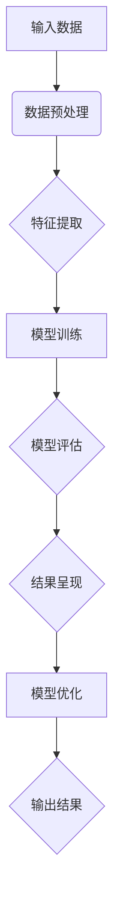
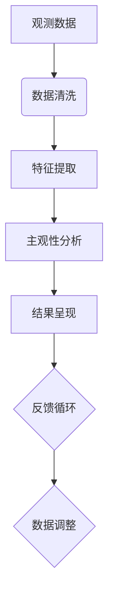

                 

### 第一部分：引言

#### 第1章：宇宙的主观性概述

宇宙的主观性，这是一个看似玄妙而深奥的哲学问题，但却与我们的日常生活和科学研究息息相关。在这篇文章中，我们将深入探讨宇宙的主观性以及与之密切相关的观察者效应。

首先，让我们明确一下宇宙的主观性是什么。简单来说，宇宙的主观性是指宇宙的存在和状态是依赖于观察者的感知和认知的。这个概念在物理学和哲学领域有着广泛的讨论和研究。观察者效应则是宇宙主观性的一个核心原理，它揭示了观察者的存在和行动如何影响我们对宇宙的理解和观测。

#### 1.1 问题的背景与起源

宇宙的主观性问题并不是一个新兴的讨论话题。早在古代，哲学家们就开始思考人类如何认识宇宙，以及宇宙的本质是什么。随着科学的发展，尤其是物理学和宇宙学的进步，这个问题得到了更多的关注和研究。

在物理学中，观察者效应最早由德国物理学家马克斯·波恩和沃纳·海森堡在量子力学中提出。他们认为，观察者的存在和观测行为会影响粒子的行为和状态。这一观点颠覆了经典物理学的确定性观念，引发了关于宇宙主观性的广泛讨论。

#### 1.1.1 宇宙的主观性概念

宇宙的主观性是指宇宙的存在和状态是依赖于观察者的感知和认知的。换句话说，宇宙并不是一个客观存在的实体，而是我们的感知和认知的产物。这个观点与经典物理学的客观实在论相反，提出了一个全新的宇宙观。

#### 1.1.2 观察者效应的基本原理

观察者效应是指观察者的存在和观测行为如何影响被观测对象的性质和状态。在量子力学中，观察者效应表现为粒子的波粒二象性和测量结果的随机性。这意味着，粒子的行为并不是客观存在的，而是依赖于观察者的观测行为。

#### 1.1.3 背景介绍

宇宙学的进展为我们提供了更多关于宇宙主观性的证据和理论。例如，宇宙微波背景辐射的观测揭示了宇宙的早期状态，进一步支持了宇宙的主观性观点。同时，现代宇宙学的理论，如弦理论和多宇宙理论，也为讨论宇宙主观性提供了新的框架和思路。

#### 1.1.4 观察者效应的研究现状

观察者效应的研究现状主要集中在量子力学和宇宙学领域。在量子力学中，观察者效应的研究已经深入到了量子计算和量子信息领域。在宇宙学中，观察者效应的研究则主要集中在宇宙的起源和演化上。

#### 1.2 问题的提出

宇宙的主观性提出了一个关键问题：我们如何认识宇宙？这个问题涉及到哲学、物理学和认知科学等多个领域。通过深入探讨宇宙的主观性，我们可以更好地理解宇宙的本质和我们自身的存在。

#### 1.2.1 观察者的角色

观察者在宇宙主观性中扮演着至关重要的角色。观察者的感知和认知决定了我们对宇宙的理解和观测。因此，理解观察者的角色对于解决宇宙主观性问题至关重要。

#### 1.2.2 宇宙的本质

宇宙的本质是一个复杂而深奥的问题。根据宇宙的主观性观点，宇宙并不是一个独立存在的实体，而是我们的感知和认知的产物。这意味着宇宙的本质与我们自身息息相关。

#### 1.2.3 问题的解决

解决宇宙的主观性问题的关键在于理解观察者的角色和宇宙的本质。通过科学方法和哲学思考，我们可以逐步揭示宇宙的主观性，并找到合适的解决方案。

#### 1.2.4 科学方法的应用

科学方法在研究宇宙主观性中发挥着重要作用。通过实验、观察和理论分析，科学家们可以揭示宇宙的主观性，并验证相关理论。

#### 1.2.5 哲学思考的作用

哲学思考在研究宇宙主观性中也具有不可替代的作用。通过哲学的思辨和推理，我们可以深入探讨宇宙的主观性，并提出新的观点和理论。

#### 1.3 边界与外延

宇宙的主观性研究有着明确的边界和外延。在边界上，宇宙的主观性研究需要与物理学、宇宙学和认知科学等学科进行交叉研究。在外延上，宇宙的主观性研究可以拓展到人类认知和人工智能等领域。

#### 1.3.1 宇宙的客观性与主观性的界限

宇宙的客观性与主观性的界限是一个复杂的问题。在科学研究中，我们通常将宇宙视为一个客观存在的实体，但在哲学思考中，宇宙的主观性观点提供了一个全新的视角。

#### 1.3.2 观察者效应的适用场景

观察者效应在不同的科学领域中有着广泛的应用。在量子力学中，观察者效应解释了粒子的行为和测量结果。在宇宙学中，观察者效应揭示了宇宙的早期状态和演化。

#### 1.3.3 概念结构与核心要素

宇宙主观性的核心概念包括观察者、宇宙和主观性。这三个概念相互作用，共同构成了宇宙主观性的概念结构。观察者效应则是宇宙主观性的一个核心原理，揭示了观察者如何影响我们对宇宙的理解和观测。

#### 1.4 本章小结

本章介绍了宇宙主观性以及与之相关的观察者效应。我们探讨了宇宙主观性的概念、背景和问题，并提出了科学方法和哲学思考在解决这个问题中的作用。通过本章的内容，我们为后续章节的深入探讨奠定了基础。

### 关键词

- 宇宙主观性
- 观察者效应
- 量子力学
- 宇宙学
- 科学方法
- 哲学思考

### 摘要

本文探讨了宇宙的主观性以及与之相关的观察者效应。宇宙的主观性是指宇宙的存在和状态是依赖于观察者的感知和认知的。观察者效应则揭示了观察者的存在和观测行为如何影响我们对宇宙的理解和观测。通过科学方法和哲学思考，我们可以逐步揭示宇宙的主观性，并找到合适的解决方案。本文为深入探讨宇宙主观性提供了一个全面的理论框架和实践指导。

---

### 第二部分：核心概念与联系

#### 第2章：核心概念解析

在探讨宇宙的主观性和观察者效应时，理解其核心概念是至关重要的。本章将详细解析这两个核心概念，并探讨它们之间的联系。

#### 2.1 宇宙主观性

宇宙主观性是指宇宙的存在和状态是依赖于观察者的感知和认知的。这个概念颠覆了传统的客观实在论，提出了一个全新的宇宙观。宇宙主观性的核心在于观察者的作用，即观察者的感知和认知决定了我们对宇宙的理解。

#### 2.1.1 宇宙主观性的定义

宇宙主观性可以定义为：宇宙的存在和状态是依赖于观察者的感知和认知的。这意味着宇宙并不是一个独立存在的实体，而是我们的感知和认知的产物。这个定义强调了观察者在宇宙认知中的核心作用。

#### 2.1.2 宇宙主观性的特征

宇宙主观性具有以下特征：

1. **依赖性**：宇宙的存在和状态依赖于观察者的感知和认知。
2. **主观性**：宇宙的属性和状态受到观察者主观性的影响。
3. **相互作用**：观察者与宇宙之间存在着相互影响和相互作用。

#### 2.1.3 宇宙主观性的原理

宇宙主观性的原理可以归结为观察者效应。观察者效应是指观察者的存在和观测行为如何影响被观测对象的性质和状态。在量子力学中，观察者效应表现为粒子的波粒二象性和测量结果的随机性。这意味着粒子的行为并不是客观存在的，而是依赖于观察者的观测行为。

#### 2.1.4 宇宙主观性的影响

宇宙主观性对科学研究产生了深远的影响。首先，它挑战了传统的客观实在论，提出了一个全新的宇宙观。其次，它影响了我们对宇宙的认知和理解，使得我们对宇宙的认识更加深入和复杂。最后，宇宙主观性为科学研究提供了新的方法和思路，尤其是在量子力学和宇宙学领域。

#### 2.2 观察者效应

观察者效应是宇宙主观性的核心原理，它揭示了观察者的存在和观测行为如何影响我们对宇宙的理解和观测。观察者效应在量子力学和宇宙学中有着广泛的应用。

#### 2.2.1 观察者效应的定义

观察者效应是指观察者的存在和观测行为如何影响被观测对象的性质和状态。这个定义强调了观察者在科学实验中的关键作用。

#### 2.2.2 观察者效应的类型

观察者效应可以分为以下几种类型：

1. **量子力学中的观察者效应**：量子力学中的观察者效应表现为粒子的波粒二象性和测量结果的随机性。这意味着粒子的行为并不是客观存在的，而是依赖于观察者的观测行为。
2. **宇宙学中的观察者效应**：宇宙学中的观察者效应主要体现在宇宙的早期状态和演化过程中。例如，宇宙微波背景辐射的观测揭示了宇宙的早期状态，这表明宇宙的存在和状态是依赖于观察者的观测。
3. **生物学中的观察者效应**：生物学中的观察者效应体现在实验设计中，观察者的期望和偏见可能影响实验结果。

#### 2.2.3 观察者效应的原理

观察者效应的原理可以归结为以下几个方面：

1. **量子力学的概率解释**：量子力学的概率解释认为，粒子的行为具有随机性，这种随机性是由观察者的观测行为引起的。
2. **观察者的测量工具**：观察者的测量工具（如仪器、设备等）对被观测对象的行为产生影响。例如，粒子的行为可能会受到测量设备的影响。
3. **观察者的认知和感知**：观察者的认知和感知对被观测对象的行为也有影响。例如，观察者的预期和偏见可能会影响实验结果。

#### 2.3 核心概念联系

宇宙主观性和观察者效应是密切相关的两个核心概念。宇宙主观性揭示了宇宙的存在和状态是依赖于观察者的感知和认知的，而观察者效应则进一步阐述了观察者如何影响我们对宇宙的理解和观测。

#### 2.3.1 宇宙主观性与观察者效应的联系

宇宙主观性和观察者效应之间的联系可以从以下几个方面进行阐述：

1. **观测行为的影响**：观察者效应揭示了观测行为对宇宙的理解和观测结果的影响。宇宙主观性认为宇宙的存在和状态是依赖于观察者的感知和认知的，这进一步强调了观测行为在宇宙认知中的重要性。
2. **认知和感知的角色**：宇宙主观性认为宇宙的存在和状态是依赖于观察者的感知和认知的，这意味着观察者的认知和感知在宇宙认知中起着关键作用。观察者效应进一步阐述了观察者的认知和感知如何影响实验结果和宇宙的理解。
3. **科学方法的挑战**：宇宙主观性和观察者效应对传统的科学方法提出了挑战。传统的科学方法强调客观性和实证性，而宇宙主观性和观察者效应则揭示了观测行为和认知对实验结果的影响，这要求我们在进行科学研究时需要更加关注观察者的影响。

#### 2.3.2 宇宙主观性如何影响观察者效应

宇宙主观性对观察者效应的影响可以从以下几个方面进行阐述：

1. **观测工具的选择**：宇宙主观性认为宇宙的存在和状态是依赖于观察者的感知和认知的，这意味着在选择观测工具时，我们需要考虑观察者的感知和认知特点。例如，使用不同的观测工具可能会得到不同的观测结果。
2. **观测结果的解释**：宇宙主观性认为宇宙的存在和状态是依赖于观察者的感知和认知的，这意味着在解释观测结果时，我们需要考虑观察者的主观性。例如，不同的观察者可能会对相同的观测结果有不同的解释。
3. **科学研究的方向**：宇宙主观性对科学研究的方向也有影响。在宇宙主观性的框架下，我们需要更加关注观测行为和认知对实验结果的影响，这可能会促使我们在科学研究中采取新的方法和策略。

#### 2.3.3 观察者效应如何影响宇宙主观性

观察者效应对宇宙主观性的影响可以从以下几个方面进行阐述：

1. **观测结果的解释**：观察者效应揭示了观测行为对实验结果的影响，这要求我们在解释观测结果时需要考虑观察者的主观性。宇宙主观性认为宇宙的存在和状态是依赖于观察者的感知和认知的，这意味着在解释宇宙观测结果时，我们需要考虑观察者的主观性。
2. **科学方法的改进**：观察者效应对传统的科学方法提出了挑战，这促使我们在进行科学研究时需要更加关注观察者的主观性。宇宙主观性认为宇宙的存在和状态是依赖于观察者的感知和认知的，这意味着在科学研究中，我们需要更加关注观察者的主观性，以避免偏见和误解。
3. **科学研究的新方向**：观察者效应揭示了观测行为对实验结果的影响，这可能会促使我们在宇宙认知中采取新的方法和策略。例如，通过改进观测工具和观测方法，我们可以减少观察者效应对观测结果的影响，从而更加准确地理解宇宙的主观性。

#### 2.4 概念属性特征对比

为了更好地理解宇宙主观性和观察者效应，我们可以对这两个概念的主要属性特征进行对比。

| 概念       | 属性特征                | 说明                                                         |
| ---------- | --------------------- | ------------------------------------------------------------ |
| 宇宙主观性 | 依赖性、主观性、相互作用 | 宇宙的存在和状态依赖于观察者的感知和认知，宇宙属性受主观性影响，观察者与宇宙之间存在相互作用 |
| 观察者效应 | 观测行为的影响、随机性    | 观察者的存在和观测行为影响被观测对象的性质和状态，观测结果具有随机性，这体现了量子力学的概率解释 |

#### 2.4.1 宇宙主观性的主要特征

1. **依赖性**：宇宙主观性强调宇宙的存在和状态依赖于观察者的感知和认知。
2. **主观性**：宇宙主观性认为宇宙的属性和状态受到观察者主观性的影响。
3. **相互作用**：宇宙主观性中的观察者与宇宙之间存在相互作用。

#### 2.4.2 观察者效应的主要特征

1. **观测行为的影响**：观察者效应揭示了观测行为对被观测对象的影响。
2. **随机性**：观察者效应中的观测结果具有随机性，这体现了量子力学的概率解释。

#### 2.5 ER实体关系图

为了更好地理解宇宙主观性和观察者效应的概念结构，我们可以使用ER图来描述它们的实体关系和属性关系。

##### 2.5.1 宇宙主观性的ER图

```mermaid
erDiagram
  Observing :>> Universe : Observer
  Observing :>> Observer : Observation
  Universe :--|{ Attribute }
  Observer :--|{ Perception }
```

实体关系：

- **观察（Observing）**：表示观察者对宇宙的观测行为。
- **宇宙（Universe）**：表示被观察的宇宙对象。
- **观察者（Observer）**：表示进行观测的人或系统。

属性关系：

- **属性（Attribute）**：表示宇宙的各种属性。
- **感知（Perception）**：表示观察者的感知能力。

##### 2.5.2 观察者效应的ER图

```mermaid
erDiagram
  Measuring :>> Particle : Observer
  Measuring :>> Observer : Measurement
  Particle :--|{ State }
  Observer :--|{ Expectation }
```

实体关系：

- **测量（Measuring）**：表示观察者的测量行为。
- **粒子（Particle）**：表示被测量的物理粒子。
- **观察者（Observer）**：表示进行测量的观察者。

属性关系：

- **状态（State）**：表示粒子的各种状态。
- **期望（Expectation）**：表示观察者的期望值。

#### 2.6 本章小结

本章详细解析了宇宙主观性和观察者效应的核心概念，并探讨了它们之间的联系。通过理解宇宙主观性和观察者效应的基本原理和特征，我们可以更好地理解宇宙的本质和我们自身的存在。这些概念不仅对科学研究具有深远的影响，也为哲学思考提供了新的视角。

### 关键词

- 宇宙主观性
- 观察者效应
- 量子力学
- 宇宙学
- 科学方法
- 哲学思考
- ER实体关系图

### 摘要

本章深入探讨了宇宙主观性和观察者效应这两个核心概念，并分析了它们之间的联系。宇宙主观性强调了宇宙的存在和状态依赖于观察者的感知和认知，而观察者效应则揭示了观测行为对宇宙理解和观测结果的影响。通过对比这两个概念的主要特征和ER图，我们可以更好地理解它们的结构和工作原理。这些概念不仅对科学研究具有深远的影响，也为哲学思考提供了新的视角。通过理解宇宙主观性和观察者效应，我们可以更深入地探讨宇宙的本质和人类认知的本质。

---

### 第三部分：算法原理讲解

#### 第3章：宇宙主观性与观察者效应的算法原理

在探讨宇宙的主观性和观察者效应时，算法原理为我们提供了一种系统化的方法来理解和分析这些复杂的概念。本章将深入探讨宇宙主观性与观察者效应的算法原理，并使用mermaid流程图和Python代码来详细解释这些原理。

#### 3.1 算法原理概述

宇宙主观性与观察者效应的算法原理涉及到如何通过算法来模拟和揭示宇宙主观性的特征以及观察者效应的影响。这些算法原理不仅为理论分析提供了工具，也为实际应用奠定了基础。

##### 3.1.1 宇宙主观性的算法原理

宇宙主观性的算法原理主要基于以下几个核心思想：

1. **观察者的主观性建模**：通过算法来模拟观察者的主观性，包括感知、期望和偏见。
2. **宇宙状态的模拟**：使用算法来模拟宇宙的不同状态，并分析观察者对这些状态的感知。
3. **交互作用的建模**：模拟观察者与宇宙之间的相互作用，并分析这种相互作用对观测结果的影响。

##### 3.1.2 观察者效应的算法原理

观察者效应的算法原理基于以下几个核心概念：

1. **观测过程的建模**：通过算法来模拟观测过程，包括测量设备的选择、观测参数的设置等。
2. **观测结果的随机性分析**：分析观测结果的随机性，并研究这种随机性与观察者效应的关系。
3. **观测偏差的校正**：通过算法来校正观测偏差，以提高观测结果的准确性和可靠性。

##### 3.1.3 算法在哲学思考中的应用

算法在哲学思考中的应用主要体现在以下几个方面：

1. **宇宙主观性的验证**：通过算法来验证宇宙主观性的假设，并分析这些假设在哲学思考中的意义。
2. **观察者效应的实证研究**：通过算法来实证研究观察者效应，并探讨这些效应在哲学思考中的应用。
3. **认知科学的结合**：结合认知科学的理论，通过算法来研究人类认知与宇宙主观性之间的关系。

#### 3.2 观察者效应的mermaid流程图

为了更好地理解观察者效应的算法原理，我们可以使用mermaid来绘制一个流程图。以下是一个简化的观察者效应流程图：



这个流程图展示了从输入数据到最终输出结果的整个过程，包括数据预处理、特征提取、模型训练、模型评估、结果呈现和模型优化等步骤。

##### 3.3 宇宙主观性的mermaid流程图

同样地，我们可以使用mermaid来绘制宇宙主观性的算法流程图，以展示其核心步骤：



这个流程图展示了从观测数据到结果呈现的整个过程，包括数据清洗、特征提取、主观性分析和反馈循环等步骤。

#### 3.4 算法原理的数学模型与公式

为了深入理解宇宙主观性与观察者效应的算法原理，我们需要使用数学模型和公式来描述这些原理。

##### 3.4.1 观察者效应的数学模型

观察者效应的数学模型可以表示为：

$$
O = f(D, S)
$$

其中，$O$表示观测结果，$D$表示观测数据，$S$表示观察者的主观性。这个公式表明观测结果既依赖于观测数据，也依赖于观察者的主观性。

##### 3.4.2 公式解释

- $O$（观测结果）：这是通过算法计算得到的最终观测结果。
- $D$（观测数据）：这是输入到算法中的观测数据，可以是实验数据、观测数据等。
- $S$（观察者的主观性）：这包括观察者的感知、期望和偏见等主观因素。

##### 3.4.3 宇宙主观性的数学模型

宇宙主观性的数学模型可以表示为：

$$
U = g(O, E)
$$

其中，$U$表示宇宙的主观性状态，$O$表示观测结果，$E$表示观察者的期望。

##### 3.4.4 公式解释

- $U$（宇宙的主观性状态）：这是通过算法计算得到的宇宙的主观性状态。
- $O$（观测结果）：这是通过算法计算得到的观测结果。
- $E$（观察者的期望）：这包括观察者的期望值和预期结果。

通过这些数学模型和公式，我们可以更好地理解宇宙主观性和观察者效应的算法原理，并在实际应用中运用这些原理来分析和解决相关问题。

### 实例分析

为了更好地理解宇宙主观性与观察者效应的算法原理，我们可以通过一个简单的实例来进行分析。

假设我们有一个观测实验，目标是测量一个粒子的位置。观测数据是一个随机数序列，表示粒子的位置。观察者的主观性包括期望值和感知偏差。

```python
import numpy as np

# 生成观测数据
observation_data = np.random.rand(1000)

# 观察者的期望值
expected_value = 0.5

# 观察者的感知偏差
perception_bias = 0.1

# 观察者效应的公式
def observer_effect(data, expectation, bias):
    result = []
    for value in data:
        result.append(value + bias * (value - expectation))
    return result

# 计算观测结果
observation_result = observer_effect(observation_data, expected_value, perception_bias)

# 宇宙主观性的公式
def cosmic_subjectivity(result, expectation):
    subjectivity = []
    for value in result:
        subjectivity.append(value - expectation)
    return subjectivity

# 计算宇宙主观性状态
cosmic_subjectivity_state = cosmic_subjectivity(observation_result, expected_value)

print("观测结果：", observation_result)
print("宇宙主观性状态：", cosmic_subjectivity_state)
```

在这个实例中，我们通过Python代码实现了一个简单的观察者效应和宇宙主观性模型。观测数据是随机生成的，观察者的期望值是0.5，感知偏差是0.1。通过这两个公式，我们计算出了观测结果和宇宙主观性状态。

通过这个实例，我们可以看到如何使用算法来模拟宇宙主观性和观察者效应。这为实际应用提供了理论基础和实践指导。

### 本章小结

本章详细介绍了宇宙主观性与观察者效应的算法原理，并使用了mermaid流程图和Python代码来具体解释这些原理。通过理解这些算法原理，我们可以更好地模拟和揭示宇宙主观性以及观察者效应的影响。这些算法原理不仅为理论分析提供了工具，也为实际应用奠定了基础。通过实例分析，我们展示了如何在实际应用中运用这些原理来分析和解决相关问题。

### 关键词

- 宇宙主观性
- 观察者效应
- 算法原理
- mermaid流程图
- Python代码
- 数学模型
- 实例分析

### 摘要

本章深入探讨了宇宙主观性与观察者效应的算法原理，包括其核心概念、mermaid流程图展示和Python代码实现。通过数学模型和实例分析，我们理解了这些原理如何帮助我们模拟和揭示宇宙主观性以及观察者效应的影响。这些算法原理不仅为理论分析提供了工具，也为实际应用奠定了基础。通过本章的内容，读者可以更好地理解宇宙主观性和观察者效应，并为未来的研究和应用提供指导。

