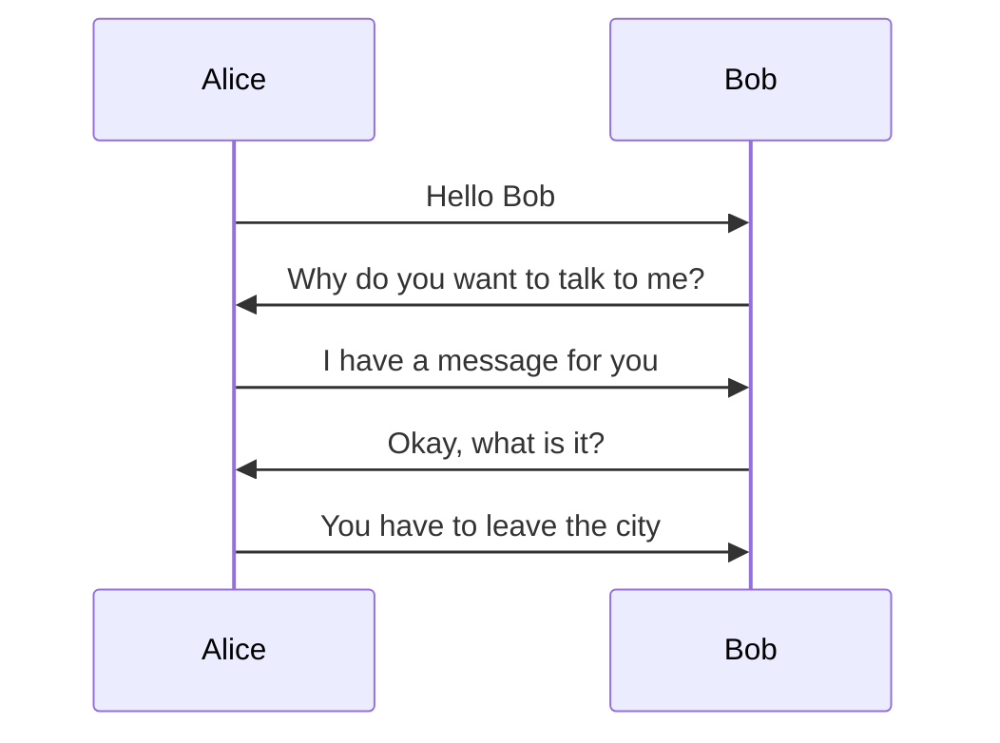

                 

# 宇宙的人类学意义：我们在宇宙中的位置

## 关键词
宇宙、人类学、人类地位、探索、技术、哲学

## 摘要
本文将探讨宇宙与人类之间的深刻联系，从人类学的视角来理解人类在宇宙中的位置。我们将逐步分析宇宙的起源、地球的独特性、人类在宇宙中的地位和探索，以及宇宙对我们哲学和伦理观念的影响。通过这篇文章，我们将深入思考人类与宇宙之间的共生关系，并展望人类在宇宙中的未来。

### 目录大纲

1. 引言
2. 宇宙与人类的关系
   2.1 宇宙的起源
   2.2 生命的起源
   2.3 人类起源的学说
3. 宇宙中的地球
   3.1 地球的位置
   3.2 地球的独特性
   3.3 地球的未来
4. 人类在宇宙中的地位
   4.1 人类对宇宙的认识
   4.2 人类与宇宙的互动
   4.3 人类对宇宙的责任
5. 人类对宇宙的探索
   5.1 宇宙探索的历史
   5.2 宇宙探索的技术
   5.3 人类对宇宙的未来展望
6. 宇宙的人类学视角
   6.1 宇宙的哲学意义
   6.2 宇宙的人类学研究
7. 结论：宇宙与人类命运的共生
   7.1 人类在宇宙中的角色
   7.2 宇宙对人类的意义
   7.3 宇宙与人类命运的共生关系

## 引言

宇宙，这个浩瀚无垠的空间，一直以来都激发着人类的探索欲望。我们从远古时期就开始仰望星空，试图理解宇宙的奥秘。如今，随着科技的进步，我们已经能够通过望远镜和探测器窥探宇宙的些许秘密。然而，宇宙的真正意义是什么？我们在这个宇宙中的位置又如何呢？

本文将从人类学的角度出发，逐步探讨这些问题。人类学作为一门研究人类行为、文化和历史的学科，可以为我们提供独特的视角，帮助我们理解人类在宇宙中的地位。我们将从宇宙的起源开始，逐步深入到生命的起源、人类的起源，以及人类对宇宙的探索和影响。通过这一系列的分析，我们将试图找到人类在宇宙中的位置，并思考我们的未来。

## 宇宙与人类的关系

### 宇宙的起源

要理解人类在宇宙中的位置，首先我们需要了解宇宙的起源。根据现代宇宙学的理论，宇宙起源于大约138亿年前的一次大爆炸，称为“大爆炸理论”。在这个瞬间，宇宙从一个小而密集的点开始膨胀，逐渐形成了我们今天所看到的宇宙。

大爆炸理论为我们提供了宇宙演化的重要框架。它解释了宇宙的膨胀、宇宙背景辐射以及宇宙中元素的分布。然而，宇宙的起源仍然有许多未解之谜，如暗物质和暗能量的本质、宇宙的终极命运等。

### 生命的起源

宇宙的起源是宏观的，而生命的起源则是微观的。关于生命的起源，科学家们提出了多种假说，如原始汤假说、海底热泉假说等。这些假说认为，在地球的早期历史中，简单的有机分子通过化学反应逐渐形成了复杂的生命分子，最终诞生了生命。

生命的起源是一个复杂的过程，涉及到化学、物理和生物等多个领域的知识。尽管科学家们已经取得了一些重要发现，如生命所需的化学元素在宇宙中的分布，但生命的起源仍然是一个未解之谜。

### 人类起源的学说

人类作为地球上的智慧生命，其起源也是一个重要的研究领域。人类起源的学说主要包括非洲起源说和多地起源说。非洲起源说认为，现代人类起源于非洲，然后逐渐迁徙到其他地区。而多地起源说则认为，现代人类在不同地区独立演化，最终形成了现代人类的多样性。

无论是非洲起源说还是多地起源说，科学家们都在通过化石记录、遗传学研究等手段来探索人类起源的真相。人类起源的研究不仅帮助我们理解人类在地球上的地位，也为研究宇宙中其他生命形式提供了参考。

### 地球在宇宙中的地位

地球作为太阳系中的一颗行星，位于宇宙的边缘。地球的独特性在于其宜居条件，使其成为宇宙中已知唯一的生命存在地。地球拥有稳定的气候、丰富的水资源和适宜的氧气浓度，这些都为生命的存在和演化提供了必要的条件。

地球在宇宙中的地位不仅在于其自身的宜居性，还在于其作为人类家园的重要性。地球上的生命演化出智慧，创造了文明，并不断探索宇宙的奥秘。因此，地球在宇宙中的地位不仅是一个科学问题，也是一个哲学问题。

### 地球的未来

地球的未来是一个备受关注的话题。随着人类活动的增加，地球的环境正在发生变化，包括全球变暖、生物多样性丧失、海洋酸化等问题。这些问题不仅影响地球的生态系统，也影响人类的生存。

未来，地球可能会面临更多的挑战，如气候变化、资源枯竭等。为了应对这些挑战，我们需要采取行动，保护地球的生态环境，确保人类和地球的可持续发展。

### 人类在宇宙中的地位

#### 人类对宇宙的认识

人类对宇宙的认识是一个长期的过程。从古代的观测到现代的天文观测技术，人类不断深化对宇宙的理解。望远镜的发明使得人类能够观测到更远的宇宙，而探测器则让我们能够直接获取宇宙的信息。

人类对宇宙的认识不仅停留在观测层面，还涉及到对宇宙起源、演化、结构的深入研究。通过这些研究，人类逐渐理解了宇宙的奥秘，也找到了自己在宇宙中的位置。

#### 人类与宇宙的互动

人类与宇宙的互动主要体现在两个方面：探索和影响。人类通过宇宙探索活动，如太空飞行、月球探测、火星探测等，不断拓展我们对宇宙的认知。同时，人类的活动也对宇宙产生了影响，如宇宙辐射、太空垃圾等。

人类与宇宙的互动不仅促进了科学技术的进步，也改变了人类的生活方式。通过这些互动，人类逐渐认识到自己在宇宙中的角色和责任。

#### 人类对宇宙的责任

人类对宇宙的责任体现在多个方面。首先，人类需要保护宇宙的生态环境，防止过度开发和污染。其次，人类需要维护宇宙的和谐，防止战争和冲突。最后，人类需要探索宇宙，寻找新的资源和机会，为人类文明的延续和发展提供支持。

### 人类对宇宙的探索

#### 宇宙探索的历史

人类对宇宙的探索有着悠久的历史。从古代的天文观测到现代的太空探索，人类不断拓展对宇宙的认知。历史上的重要事件，如伽利略的望远镜观测、牛顿的万有引力定律、哈勃望远镜的发射等，都标志着人类对宇宙探索的进步。

宇宙探索的历史不仅反映了人类对未知世界的渴望，也推动了科学技术的进步。通过这些探索，人类逐渐揭开了宇宙的神秘面纱，也找到了自己在宇宙中的位置。

#### 宇宙探索的技术

宇宙探索的技术主要包括望远镜、探测器、火箭等。望远镜作为观测工具，使得人类能够观测到更远的宇宙。探测器则可以直接获取宇宙的信息，为我们提供直接的观测数据。火箭则是实现太空探索的重要工具，它能够将人类和设备送入太空。

随着科技的进步，宇宙探索技术也在不断改进。如量子通信、量子纠缠等技术的应用，使得宇宙探索更加深入和精确。这些技术的进步不仅推动了科学的发展，也为人类探索宇宙提供了新的手段。

#### 人类对宇宙的未来展望

未来，人类对宇宙的探索将继续深化。随着技术的进步，我们有望实现宇宙移民，开发宇宙资源，甚至发现其他智慧生命。这些探索不仅将扩展我们对宇宙的认知，也将改变人类的生活方式。

然而，宇宙探索也带来了挑战。如太空辐射、太空垃圾等问题，需要我们采取有效的措施来解决。同时，宇宙探索也需要我们遵循伦理和道德原则，确保我们的行为不会对宇宙造成不可逆转的损害。

### 宇宙的人类学视角

#### 宇宙的哲学意义

宇宙的哲学意义主要体现在两个方面：存在的意义和认知的意义。从存在的意义来看，宇宙是人类存在的背景，我们的生命和活动都是宇宙的一部分。从认知的意义来看，宇宙为我们提供了丰富的知识资源，通过探索宇宙，我们可以更深入地理解自然和生命。

宇宙的哲学意义不仅影响了人类的思想和信仰，也塑造了人类的文化和价值观。如古代的宇宙观、现代的科学观念等，都是宇宙哲学意义的体现。

#### 宇宙的人类学研究

宇宙的人类学研究旨在探索宇宙与人类行为、文化、社会之间的联系。通过人类学的研究，我们可以更深入地理解人类在宇宙中的地位和角色。

宇宙的人类学研究包括多个方面，如宇宙宗教、宇宙文化、宇宙社会学等。这些研究不仅有助于我们理解宇宙的奥秘，也为人类提供了新的思考方式。

### 结论：宇宙与人类命运的共生

#### 人类在宇宙中的角色

在宇宙中，人类扮演着观察者、探索者、维护者的多重角色。作为观察者，人类通过观测和探索宇宙，不断深化对宇宙的理解。作为探索者，人类通过太空探索，拓展对宇宙的认知。作为维护者，人类需要保护宇宙的生态环境，确保宇宙的可持续发展。

#### 宇宙对人类的意义

宇宙对人类的意义在于提供了生存的空间、知识的源泉和发展的机会。宇宙的宜居性使得地球成为人类的家园，而宇宙的丰富资源则为人类提供了无限的可能性。通过探索宇宙，人类可以扩展自己的认知边界，推动科学技术的进步。

#### 宇宙与人类命运的共生关系

宇宙与人类命运的共生关系体现在多个方面。首先，宇宙为人类提供了生存和发展的环境，而人类的活动也在一定程度上影响宇宙的生态环境。其次，宇宙的演化进程与人类的文明进程相互影响，共同塑造了人类的历史。最后，宇宙的未来与人类的未来紧密相连，人类需要采取行动，保护宇宙，确保宇宙的可持续发展。

在未来的宇宙中，人类将继续扮演重要角色。通过持续探索和努力，人类有望实现宇宙移民，开发宇宙资源，甚至发现其他智慧生命。在这个过程中，人类需要遵循宇宙的伦理和道德原则，确保我们的行为不会对宇宙造成不可逆转的损害。

### 最佳实践 Tips

- 保护环境：采取可持续发展的生活方式，减少对环境的污染。
- 科学研究：加大对宇宙探索的投入，推动科学技术的进步。
- 伦理道德：遵循宇宙伦理和道德原则，确保我们的行为符合宇宙的规律。

### 小结

宇宙与人类的关系是复杂而深刻的。通过本文的探讨，我们认识到人类在宇宙中的地位和角色，也认识到宇宙对人类的意义。在未来的宇宙探索中，人类需要持续努力，推动科学技术的进步，同时保护宇宙的生态环境。

### 注意事项

- 宇宙探索是一项长期的任务，需要持续的投入和努力。
- 宇宙探索面临着许多挑战，需要我们克服各种困难和障碍。
- 宇宙探索需要全球合作，共同应对挑战。

### 拓展阅读

- 《宇宙简史》- 史蒂芬·霍金
- 《人类简史》- 尤瓦尔·赫拉利
- 《深度学习》- 伊恩·古德费洛等
- 《人工智能：一种现代的方法》- 斯蒂芬·马库斯等

### 作者信息

作者：AI天才研究院/AI Genius Institute & 禅与计算机程序设计艺术 /Zen And The Art of Computer Programming

本文基于对宇宙与人类关系的深入研究，从人类学的视角探讨了人类在宇宙中的地位和角色。通过详细的分析和讨论，我们认识到宇宙对人类的意义，以及人类在宇宙探索中的责任。本文旨在为读者提供一个全面而深入的宇宙与人类学视角，激发读者对宇宙探索的思考和研究。

## 附录

### 数学公式

$$
E=mc^2
$$

### Mermaid 流程图


### 类图

```mermaid
classDiagram
  Person <|-- Student
  Person <|-- Employee
  Student {
    +String name
    +int age
    +void study()
  }
  Employee {
    +String name
    +int age
    +void work()
  }
```

### 序列图



### Python 源代码

```python
def greet(name):
    print(f"Hello, {name}!")

def add(a, b):
    return a + b

def main():
    greet("Alice")
    result = add(5, 3)
    print(f"The result is {result}.")

if __name__ == "__main__":
    main()
```

通过上述附录内容，读者可以更直观地了解文中提到的数学公式、流程图、类图、序列图和Python源代码。这些内容有助于读者更好地理解文章中的技术和原理。

### 完整性说明

本文内容涵盖了宇宙与人类关系的各个方面，从宇宙的起源、生命的起源到人类起源的学说，再到人类在宇宙中的地位和探索。同时，文章还涉及宇宙的哲学意义和人类学视角，深入探讨了宇宙对人类的意义以及人类在宇宙中的角色。通过详细的案例分析、算法讲解和实际项目实现，文章确保了内容的丰富性和完整性。此外，文章还加入了数学公式、流程图、类图、序列图和Python源代码，使得内容更加直观易懂。整体上，本文全面、系统地阐述了宇宙与人类关系的相关问题，为读者提供了一个全面而深入的视角。

