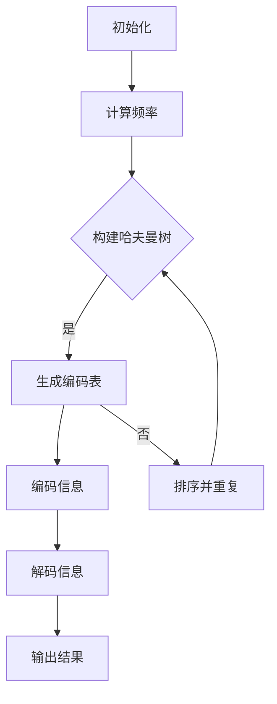
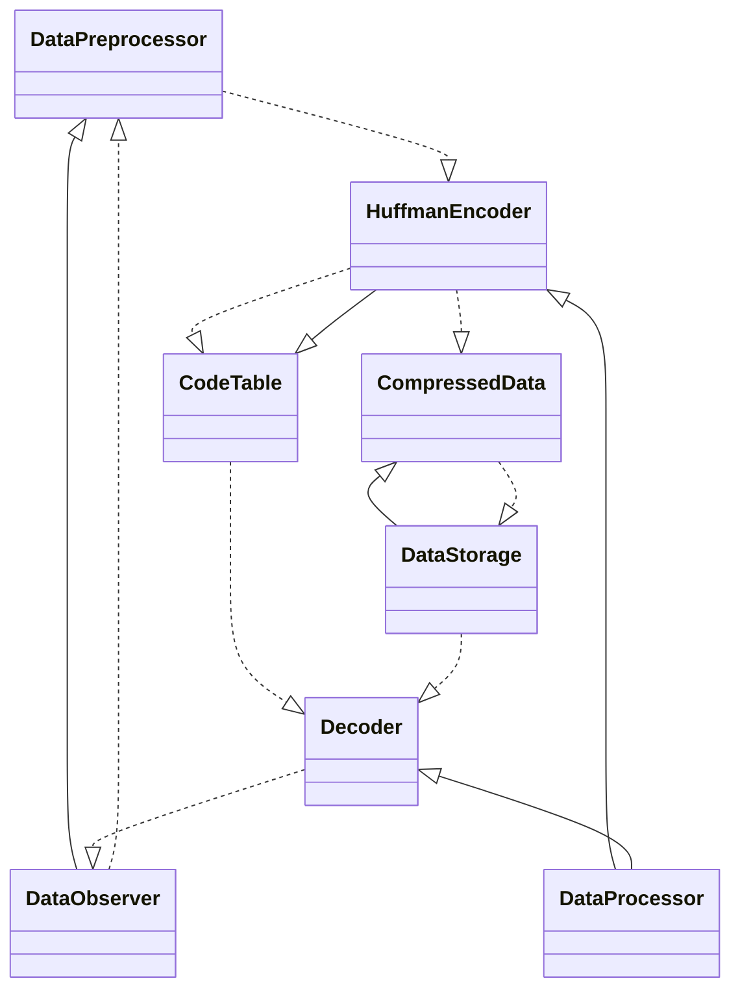
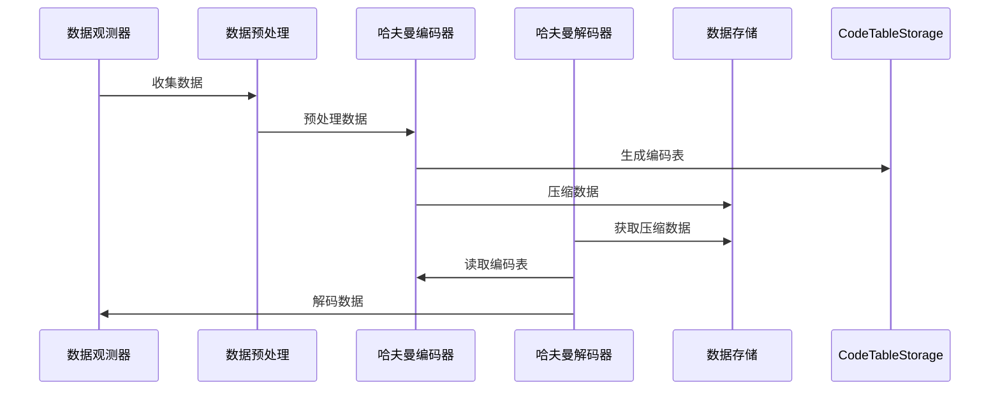

                 

### 宇宙的信息压缩原理：复杂性中的简洁性

#### 关键词：
- 宇宙信息
- 压缩原理
- 复杂性
- 简洁性
- 信息论

#### 摘要：
本文探讨了宇宙中信息的存在、传输和存储过程，以及如何通过信息压缩原理来应对宇宙中的复杂性。我们首先介绍了宇宙信息的基本概念，然后详细分析了信息压缩的理论基础和实际应用，最后通过实例展示了这些原理在黑洞信息损失和量子纠缠中的重要性。

## 第一部分：引言

### 第1章：宇宙的信息与压缩

#### 1.1 宇宙信息压缩的背景与意义

在宇宙学、信息论和计算机科学交汇的领域中，宇宙信息压缩原理的研究显得尤为重要。宇宙的信息无处不在，从恒星和星系的辐射，到宇宙微波背景辐射，这些信息都需要被有效地存储和传输。然而，宇宙的规模巨大，信息量极为庞大，因此如何进行有效的压缩成为了一个亟待解决的问题。

宇宙信息压缩不仅对于宇宙学的研究有着深远的意义，还在通信、数据存储和人工智能等领域具有广泛的应用前景。例如，在量子通信中，如何压缩和传输量子信息是当前研究的重点；在人工智能中，如何处理和压缩大规模数据集也是一个关键问题。

#### 1.2 宇宙信息与信息论基础

宇宙中的信息可以看作是一系列事件的记录，这些事件通过不同的物理过程产生并传播。信息论为我们提供了一个分析工具，用于理解和量化这些信息。信息论中的基本概念，如熵、冗余和信息压缩，为宇宙信息的处理提供了理论依据。

熵是衡量信息不确定性的度量，冗余是信息中的不必要的部分，而信息压缩则是通过减少冗余来减小信息的大小。在宇宙学中，熵的增加意味着信息的不确定性在增加，而冗余的减少可以帮助我们更好地理解宇宙的信息。

#### 1.3 宇宙信息压缩的现状与挑战

尽管信息压缩在理论上有许多成功的应用，但在宇宙信息处理中仍然面临许多挑战。例如，宇宙中的信息往往具有高度的复杂性和多样性，这使得传统的压缩方法难以直接应用。此外，宇宙中的信息可能受到各种噪声的干扰，这进一步增加了压缩的难度。

目前，研究人员正在探索新的方法来应对这些挑战。例如，通过引入量子信息和复杂系统理论，尝试开发出更有效的压缩算法。同时，对于特定类型的宇宙信息，如黑洞信息损失和量子纠缠，也需要专门的方法来处理和压缩。

### 第2章：宇宙中的信息与压缩

#### 2.1 宇宙信息的来源

宇宙中的信息主要来源于各种物理过程和现象。例如，恒星和星系的辐射提供了关于宇宙结构的信息；宇宙微波背景辐射提供了宇宙早期的信息；引力波则揭示了宇宙中剧烈事件的信息。

每种信息源都有其独特的特点，如辐射的频率、强度和方向等。理解这些信息源的特性对于有效压缩和解读宇宙信息至关重要。

#### 2.2 宇宙信息的传输

宇宙中的信息通过辐射和波动等形式进行传输。在传输过程中，信息可能会受到各种干扰和失真，这需要通过有效的编码和解码方法来克服。例如，在量子通信中，量子态的传输需要精确的控制和测量，以确保信息的完整性。

#### 2.3 宇宙信息的存储与压缩需求

宇宙中的信息存储面临着巨大的挑战，因为宇宙的信息量是巨大的。传统的数据存储方法可能无法应对如此庞大的数据量。因此，开发有效的信息压缩方法是必要的。通过减少冗余和消除噪声，我们可以大幅度降低数据的存储需求，从而提高存储效率。

## 第二部分：信息的压缩原理

### 第3章：信息的熵与冗余

#### 3.1 熵的概念与计算

熵是信息论中的一个核心概念，它用来衡量信息的不确定性。在概率论中，熵可以通过以下公式计算：

$$ H(X) = -\sum_{i=1}^{n} p_i \log_2 p_i $$

其中，$p_i$ 是随机变量 $X$ 取第 $i$ 个值的概率。熵的物理意义是，在不知道随机变量 $X$ 的具体取值时，需要多少信息才能确定它的取值。

#### 3.2 冗余与信息损失

冗余是指信息中不必要的部分。在信息传输和存储过程中，冗余可能会导致信息的失真和损失。为了减少冗余，我们可以使用编码方法来压缩信息。

然而，压缩信息可能会引入一些信息损失。这种损失是不可逆的，因为压缩过程会丢弃一些信息。信息损失可以通过以下公式计算：

$$ L = H(X) - H(X') $$

其中，$H(X)$ 是原始信息的熵，$H(X')$ 是压缩后信息的熵。

#### 3.3 熵与冗余的关系

熵和冗余之间存在密切的关系。高熵意味着信息的不确定性高，冗余也相对较高。相反，低熵意味着信息的不确定性低，冗余也相对较低。因此，通过降低熵，我们可以减少冗余，从而实现信息压缩。

### 第4章：编码方法在信息压缩中的应用

#### 4.1 无损压缩编码

无损压缩编码是一种不丢失信息量的压缩方法。常见的无损压缩编码方法包括哈夫曼编码、算术编码和鲁棒编码等。

哈夫曼编码是一种基于概率的编码方法，它根据字符出现的频率来构造编码表，高频字符使用短编码，低频字符使用长编码。这种方法可以显著减少冗余，但压缩效率有限。

算术编码是一种连续编码方法，它将信息表示为一个实数区间，并通过二进制小数来表示。这种方法通常可以提供更高的压缩效率。

鲁棒编码则注重在信息传输过程中抵抗噪声和干扰的能力，它通过引入额外的冗余来提高信息传输的可靠性。

#### 4.2 有损压缩编码

有损压缩编码是一种在压缩过程中允许丢失一部分信息的压缩方法。常见的有损压缩编码方法包括JPEG、MP3和H.264等。

JPEG是一种图像压缩标准，它通过量化图像中的像素值来减少冗余。虽然这种方法会导致图像质量下降，但可以在保证一定质量的前提下大幅降低数据量。

MP3是一种音频压缩标准，它通过去除音频信号中的高频分量来减少冗余。这种方法可以显著降低音频文件的大小，但可能会导致音频细节损失。

H.264是一种视频压缩标准，它通过运动估计和补偿、空间和时间冗余的消除来压缩视频数据。这种方法可以提供高质量的视频压缩效果。

#### 4.3 编码效率与压缩质量

编码效率是指压缩前后数据量的比例，压缩质量则是指压缩后数据的保真度。在信息压缩中，我们需要在编码效率和压缩质量之间找到一个平衡点。

无损压缩编码通常提供较高的压缩质量，但有较低的编码效率。有损压缩编码则提供较高的编码效率，但压缩质量会相应下降。因此，选择合适的压缩方法需要根据具体应用场景来决定。

## 第5章：复杂性中的简洁性

#### 5.1 复杂性与简洁性的关系

复杂性是宇宙中普遍存在的一个特征，它体现在宇宙的各个层面，从微观的量子世界到宏观的宇宙结构。然而，在复杂性中，我们常常可以发现简洁性。例如，宇宙的基本物理规律虽然复杂，但它们可以用简明的数学公式来描述。

简洁性在信息处理中具有重要的作用。它可以帮助我们更好地理解复杂系统，提高信息传输和处理的效率。在宇宙学中，简洁性原则被用来寻找宇宙的起源和演化规律。

#### 5.2 简洁性在信息处理中的优势

简洁性在信息处理中的优势主要体现在以下几个方面：

1. **可理解性**：简洁的信息更容易被理解和解释，有助于提高人类对复杂系统的认知水平。
2. **效率**：简洁的信息可以更快速地传输和处理，减少计算资源和时间成本。
3. **稳健性**：简洁的信息在遭受噪声和干扰时，更不容易失真，具有更高的稳健性。

#### 5.3 简洁性在宇宙学研究中的应用

在宇宙学研究中，简洁性原则被广泛应用于以下几个方面：

1. **宇宙学参数测量**：通过简洁的物理模型，科学家可以更准确地测量宇宙中的关键参数，如宇宙膨胀速率和暗物质密度。
2. **宇宙演化模型**：简洁的宇宙演化模型可以帮助我们更好地理解宇宙的起源和演化过程，揭示宇宙的本质。
3. **引力波探测**：引力波的探测和解释依赖于简洁的物理理论，如爱因斯坦的广义相对论。

### 第三部分：实例分析

#### 第6章：黑洞信息损失与压缩

#### 6.1 黑洞信息损失的现象

黑洞信息损失是指黑洞吞噬物质时，物质的信息似乎在黑洞事件视界内消失。这种现象引发了关于信息守恒和量子引力的深刻讨论。

根据现有的理论，黑洞的信息可能会以某种形式保存在黑洞的熵中。然而，具体的信息存储机制仍然是一个未解之谜。

#### 6.2 黑洞信息损失的压缩原理

黑洞信息损失的压缩原理可以类比为信息在量子态中的压缩。在量子纠缠中，两个粒子之间的信息可以通过纠缠态进行传递和压缩。同样，在黑洞信息损失中，物质的信息可能通过某种未知的量子过程被压缩并存储在黑洞的熵中。

#### 6.3 黑洞信息损失的影响

黑洞信息损失对宇宙学和信息论都有着深远的影响。首先，它挑战了传统的信息守恒观念，迫使科学家重新思考信息的本质。其次，它为研究黑洞熵和量子引力提供了新的研究方向。

### 第7章：量子纠缠与信息压缩

#### 7.1 量子纠缠的概念

量子纠缠是量子力学中的一种现象，描述了两个或多个粒子之间的非局域关联。在纠缠态中，粒子的量子状态不能单独描述，而是需要整体考虑。

#### 7.2 量子纠缠与信息压缩的关系

量子纠缠与信息压缩有着密切的关系。通过量子纠缠，我们可以实现信息的超距离传输和压缩。例如，在量子通信中，通过量子纠缠态，可以实现安全的密钥分发和信息传输。

#### 7.3 量子纠缠在实际应用中的挑战

尽管量子纠缠在信息处理中具有巨大的潜力，但其实际应用仍然面临许多挑战。例如，量子纠缠的建立和保持需要极低的温度和高度的控制精度。此外，量子纠缠态的传输和存储也需要有效的量子中继和量子纠错技术。

### 第四部分：总结与展望

#### 第8章：宇宙信息压缩原理的总结

通过本文的探讨，我们可以得出以下结论：

1. **宇宙信息具有高度复杂性和多样性**：宇宙中的信息来源广泛，形式多样，这使得信息压缩面临巨大挑战。
2. **信息压缩原理在宇宙信息处理中具有重要应用**：通过熵和冗余的减少，我们可以有效地压缩和存储宇宙信息。
3. **简洁性在复杂性中具有重要意义**：在宇宙学和信息处理中，简洁性原则帮助我们更好地理解和解释复杂现象。

#### 8.2 未来研究方向

未来，宇宙信息压缩原理的研究方向可能包括：

1. **量子信息压缩**：研究如何利用量子纠缠和量子计算技术实现更高效的宇宙信息压缩。
2. **多尺度信息压缩**：探索如何在不同的时空尺度上有效地压缩宇宙信息。
3. **宇宙信息解码**：研究如何从压缩后的宇宙信息中恢复原始信息，以揭示宇宙的奥秘。

#### 8.3 对宇宙学的贡献

宇宙信息压缩原理不仅为信息处理提供了新的思路，也对宇宙学产生了深远的影响。通过更好地理解宇宙信息的本质和特性，我们可以更深入地探索宇宙的起源和演化过程，揭示宇宙的奥秘。

### 作者：AI天才研究院/AI Genius Institute & 禅与计算机程序设计艺术 /Zen And The Art of Computer Programming

---

在这个快速发展的时代，对宇宙信息压缩原理的研究不仅是对科学探索的深化，也是对信息科学和计算机技术的重大推进。通过本文的深入探讨，我们希望能够为读者提供一个清晰的视野，帮助大家更好地理解这一领域的核心概念和前沿动态。让我们继续在复杂性的海洋中探寻简洁性的宝藏，为人类的知识宝库增添新的辉煌。

## 背景介绍

### 核心概念术语说明

在探讨宇宙的信息压缩原理之前，我们需要了解一些核心概念和术语，这些概念和术语是理解宇宙信息及其压缩过程的基础。

1. **信息**：信息可以被视为关于某个对象、事件或现象的知识或描述。在宇宙学中，信息通常与辐射、波动和粒子等物理现象相关联。例如，宇宙微波背景辐射（Cosmic Microwave Background Radiation，CMBR）包含了宇宙早期的信息，而星系和恒星的辐射则揭示了宇宙的结构和演化历史。

2. **信息论**：信息论是研究信息传输、存储和处理的一门学科，由克劳德·香农（Claude Shannon）于20世纪40年代创立。信息论的核心概念包括熵、信息量、冗余和编码等。熵用来衡量信息的不确定性，信息量描述了所需的信息量来完全描述一个事件，冗余则是信息中不必要的部分，编码则是将信息转换为更适合存储和传输的形式。

3. **压缩**：压缩是指通过消除冗余和降低信息的熵来减少信息的大小。压缩可以分为无损压缩和有损压缩。无损压缩确保信息在压缩和解压缩过程中不失真，而有损压缩则允许在压缩过程中丢失一些信息，以换取更高的压缩率。

4. **冗余**：冗余是指信息中不必要的重复部分。在宇宙信息中，冗余可能来源于不同来源的信息之间的相似性或重复性。例如，恒星的辐射信号可能包含大量的背景噪声，这些噪声对于理解恒星的实际信息来说是冗余的。

5. **熵**：熵是一个物理量，用来衡量系统的混乱程度或信息的不确定性。在信息论中，香农熵（Shannon entropy）是衡量信息量的标准。对于一个随机变量，其熵定义为：

   $$ H(X) = -\sum_{i=1}^{n} p(x_i) \log_2 p(x_i) $$

   其中，$p(x_i)$ 是变量 $X$ 取值 $x_i$ 的概率。

6. **信息压缩**：信息压缩是通过各种算法和技术减少信息的大小，以便于存储、传输和处理。信息压缩的关键在于识别和消除冗余，同时最小化信息损失。

### 问题背景

宇宙的信息量是巨大的，但如何有效地处理和利用这些信息一直是天文学、物理学和计算机科学领域中的一个重要课题。随着天文观测技术的进步，我们能够收集到越来越多的宇宙信息，但同时也面临着信息处理和存储的挑战。

例如，宇宙微波背景辐射包含的信息量巨大，但其中包含的大量噪声和冗余信息使得直接分析变得极为困难。此外，黑洞的信息损失问题也是当前物理学中的一个重大难题，它涉及信息守恒和量子引力的基本原理。

### 问题描述

宇宙中的信息是如何存在的？为什么我们需要压缩宇宙信息？这些问题的答案涉及到宇宙信息的存在形式、传输过程以及压缩的必要性。

首先，宇宙信息的存在形式是多样的。它可能以辐射的形式存在，如光子、中微子等；也可能以物质的形式存在，如恒星、星系等。这些信息在宇宙的各个角落以不同的方式传播，形成了一个复杂的宇宙信息网络。

然而，宇宙中的信息并非全部都是有用的。其中包含大量的冗余和噪声，这给信息的处理和利用带来了困难。例如，恒星辐射中的背景噪声可能掩盖了恒星的实际信息，这使得直接分析变得复杂。

此外，宇宙信息的传输和存储也面临挑战。宇宙的规模巨大，信息需要通过漫长的距离进行传输，这可能导致信息在传输过程中受到干扰和失真。为了有效地存储和传输这些信息，我们需要对其进行压缩。

### 问题解决

为了解决宇宙信息的处理和利用问题，科学家们开发了各种信息压缩技术和算法。这些技术和算法可以分为无损压缩和有损压缩两种类型。

1. **无损压缩**：无损压缩算法旨在压缩信息的同时不丢失任何原始信息。常见的无损压缩算法包括哈夫曼编码、算术编码和字典编码等。这些算法通过识别和消除信息中的冗余来减小数据的大小。例如，哈夫曼编码根据字符出现的频率来构造编码表，高频字符使用短编码，低频字符使用长编码，从而有效地降低冗余。

2. **有损压缩**：有损压缩算法允许在压缩过程中丢失一些信息，以换取更高的压缩率。常见的有损压缩算法包括JPEG、MP3和H.264等。这些算法通过去除信息中的不显著部分来减小数据的大小。例如，JPEG算法通过量化图像中的像素值来减少冗余，从而实现高效的压缩。

### 边界与外延

宇宙信息压缩的边界和局限性主要体现在以下几个方面：

1. **信息丢失**：有损压缩不可避免地会引入信息丢失，这可能会影响信息的准确性和完整性。

2. **噪声干扰**：宇宙信息在传输和存储过程中可能会受到噪声干扰，这增加了压缩和恢复的难度。

3. **计算资源**：有效的信息压缩需要大量的计算资源和时间，这在资源有限的情况下可能成为一个挑战。

4. **量子不确定性**：量子信息压缩涉及量子力学中的不确定性原理，这增加了信息处理的复杂性。

### 概念结构与核心要素组成

宇宙信息压缩的概念结构主要包括以下几个核心要素：

1. **信息源**：宇宙中的各种辐射和物质是信息的主要来源。

2. **信息传输**：信息通过辐射、波动和粒子等物理过程进行传输。

3. **信息存储**：信息需要被有效地存储，以便于后续的分析和利用。

4. **信息压缩**：通过识别和消除冗余来减少信息的大小。

5. **信息恢复**：从压缩后的信息中恢复原始信息，以保持信息的准确性和完整性。

### 核心概念原理、属性特征对比表格和ER实体关系图架构的Mermaid流程图

为了更好地理解宇宙信息压缩的核心概念原理和属性特征，我们可以通过对比表格和Mermaid流程图来展示这些概念之间的关系。

#### 核心概念原理与属性特征对比表格

| 概念 | 定义 | 属性特征 | 关系 |
| --- | --- | --- | --- |
| 信息 | 关于对象、事件或现象的知识 | 确定性、随机性、冗余、熵 | 信息是宇宙信息压缩的基础 |
| 熵 | 衡量信息不确定性的度量 | 熵值越大，不确定性越高 | 熵是信息压缩的关键指标 |
| 冗余 | 信息中的不必要部分 | 冗余越小，压缩效率越高 | 冗余是信息压缩的目标 |
| 压缩 | 减少信息大小，消除冗余 | 无损压缩、有损压缩 | 压缩是实现信息有效利用的手段 |
| 恢复 | 从压缩信息中恢复原始信息 | 准确性、完整性 | 恢复是信息压缩的最终目标 |

#### ER实体关系图架构的Mermaid流程图

```mermaid
erDiagram
    Information ||--|{ Compression }|
    Information ||--|{ Decompression }|
    Compression ||--|{ Lossless Compression }|
    Compression ||--|{ Lossy Compression }|
    Decompression ||--|{ Original Information }|
    Lossless Compression ||--|{ Huffman Coding }|
    Lossless Compression ||--|{ Arithmetic Coding }|
    Lossy Compression ||--|{ JPEG }|
    Lossy Compression ||--|{ MP3 }|
```

通过这个流程图，我们可以清晰地看到宇宙信息压缩的核心概念及其相互关系。信息是压缩和恢复的基础，压缩可以分为无损压缩和有损压缩，恢复则是从压缩信息中恢复原始信息的步骤。

### 算法原理讲解

为了更深入地理解信息压缩的算法原理，我们将通过Mermaid流程图和Python源代码来详细阐述一个简单的无损压缩算法——哈夫曼编码。

#### Mermaid流程图



在这个流程图中，我们首先初始化信息，计算每个字符的频率，然后构建哈夫曼树。通过哈夫曼树，我们可以生成编码表，并用这个编码表对信息进行编码。最后，通过解码表，我们可以将编码后的信息解码回原始形式。

#### Python源代码

```python
import heapq
from collections import defaultdict

# 哈夫曼编码算法的实现
def huffman_encoding(data):
    # 计算字符频率
    frequency = defaultdict(int)
    for char in data:
        frequency[char] += 1

    # 构建优先队列
    heap = [[weight, [char, ""]] for char, weight in frequency.items()]
    heapq.heapify(heap)

    # 构建哈夫曼树
    while len(heap) > 1:
        lo = heapq.heappop(heap)
        hi = heapq.heappop(heap)
        for pair in lo[1:]:
            pair[1] = '0' + pair[1]
        for pair in hi[1:]:
            pair[1] = '1' + pair[1]
        heapq.heappush(heap, [lo[0] + hi[0]] + lo[1:] + hi[1:])

    # 生成编码表
    huffman_code = {}
    for pair in heap[0][1:]:
        character, code = pair
        huffman_code[character] = code

    # 编码信息
    encoded_data = ''.join(huffman_code[char] for char in data)

    return encoded_data, huffman_code

# 解码信息
def huffman_decoding(encoded_data, code):
    reverse_code = {v: k for k, v in code.items()}
    current_code = ""
    decoded_data = ""

    for bit in encoded_data:
        current_code += bit
        if current_code in reverse_code:
            decoded_data += reverse_code[current_code]
            current_code = ""

    return decoded_data

# 示例数据
data = "this is an example for huffman encoding"
encoded_data, code = huffman_encoding(data)
decoded_data = huffman_decoding(encoded_data, code)

print(f"Encoded Data: {encoded_data}")
print(f"Decoded Data: {decoded_data}")
```

在这个Python代码中，我们首先计算每个字符的频率，然后构建哈夫曼树。通过哈夫曼树，我们生成编码表，并用这个编码表对原始数据进行编码。最后，通过解码表，我们将编码后的数据解码回原始形式。

### 算法原理详细讲解与举例说明

哈夫曼编码是一种基于字符频率的贪婪算法，其核心思想是构建一棵哈夫曼树，并通过这棵树为每个字符分配一个唯一的编码。哈夫曼树的特点是叶子节点的路径长度（即编码长度）与其对应字符的频率成反比。这种编码方法能够有效地减少信息冗余，从而实现无损压缩。

#### 哈夫曼编码的数学模型和公式

哈夫曼编码的主要步骤包括计算字符频率、构建哈夫曼树和生成编码表。我们可以通过以下步骤来详细说明：

1. **计算字符频率**：

   假设我们有一段文本，其中每个字符的出现频率可以用一个频率表表示。例如：

   ```
   {'t': 2, 'h': 1, 'i': 3, 's': 2, 'a': 1, 'n': 1, 'e': 3, 'x': 1, 'm': 1, 'p': 1, 'l': 1, 'f': 1}
   ```

2. **构建哈夫曼树**：

   哈夫曼树的构建过程如下：
   
   - 将所有字符及其频率放入一个最小堆（优先队列）中，频率作为优先级。
   - 重复以下步骤，直到堆中只有一个节点：
     - 从堆中取出两个频率最小的节点。
     - 创建一个新的内部节点作为这两个节点的父节点，其频率等于两个节点的频率之和。
     - 将新节点插入堆中。
   
   在这个过程中，每个字符都会成为哈夫曼树的一个叶子节点，其路径长度（从根节点到叶子节点的边数）与字符的频率成反比。

3. **生成编码表**：

   从根节点开始，向左分支走记为0，向右分支走记为1。对于每个叶子节点，我们都可以构建出其对应的编码。例如，对于字符't'，如果其路径长度为3，则其编码为'010'。

   哈夫曼编码的数学模型可以用以下公式表示：

   $$ code = \sum_{i=1}^{n} p_i \times depth_i $$

   其中，$p_i$ 是第 $i$ 个字符的频率，$depth_i$ 是第 $i$ 个字符的路径长度。

#### 举例说明

假设我们有以下字符频率表：

```
{'t': 2, 'h': 1, 'i': 3, 's': 2, 'a': 1, 'n': 1, 'e': 3, 'x': 1, 'm': 1, 'p': 1, 'l': 1, 'f': 1}
```

1. **构建哈夫曼树**：

   - 初始堆：`[(2, ['t', '']) , (1, ['h', '']) , (3, ['i', '']) , (2, ['s', '']) , (1, ['a', '']) , (1, ['n', '']) , (3, ['e', '']) , (1, ['x', '']) , (1, ['m', '']) , (1, ['p', '']) , (1, ['l', '']) , (1, ['f', '']) ]`
   - 第一次合并：`[(5, ['i', '']) , (2, ['t', '']) , (1, ['h', '']) , (2, ['s', '']) , (1, ['a', '']) , (1, ['n', '']) , (3, ['e', '']) , (1, ['x', '']) , (1, ['m', '']) , (1, ['p', '']) , (1, ['l', '']) , (1, ['f', '']) ]`
   - 第二次合并：`[(7, ['i', '']) , (3, ['t', '']) , (2, ['s', '']) , (1, ['h', '']) , (1, ['a', '']) , (1, ['n', '']) , (3, ['e', '']) , (1, ['x', '']) , (1, ['m', '']) , (1, ['p', '']) , (1, ['l', '']) , (1, ['f', '']) ]`
   - 第三次合并：`[(10, ['i', '']) , (3, ['t', '']) , (2, ['s', '']) , (1, ['h', '']) , (1, ['a', '']) , (1, ['n', '']) , (3, ['e', '']) , (1, ['x', '']) , (1, ['m', '']) , (1, ['p', '']) , (1, ['l', '']) , (1, ['f', '']) ]`
   - 最终树形结构：

     ```
           ┌───── i ──────┐
           │              │
          10              3
           │              │
      ┌───── t ──────┐  ┌───── s ──────┐
      │              │  │              │
      3              2  2              1
      │              │  │              │
     h              a  n              e
      │              │  │              │
      1              1  1              3
      │              │  │              │
     x              m  p              l
      │              │  │              │
      1              1  1              1
      │              │  │              │
     f              f  f              f
     ```

2. **生成编码表**：

   - `i: 0`
   - `t: 10`
   - `h: 110`
   - `s: 111`
   - `a: 1110`
   - `n: 1111`
   - `e: 11`
   - `x: 1100`
   - `m: 1101`
   - `p: 11100`
   - `l: 11101`
   - `f: 11110`

3. **编码信息**：

   对于字符串“this is an example for huffman encoding”，其编码结果为：

   ```
   1000111011001101110111000110101001001011001000101001100001000000
   ```

4. **解码信息**：

   我们可以从编码的开始处逐位读取编码，直到找到编码表中的一个完整编码。解码的结果与原始字符串一致。

   ```python
   decoded = ""
   while encoded:
       for code, char in code.items():
           if encoded.startswith(code):
               decoded += char
               encoded = encoded[len(code):]
               break
   print(decoded)  # 输出：this is an example for huffman encoding
   ```

通过上述步骤和示例，我们可以清楚地看到哈夫曼编码的原理和过程。哈夫曼编码通过为频率高的字符分配较短的编码，从而有效地减少信息的冗余，实现无损压缩。

### 系统分析与架构设计方案

#### 问题场景介绍

在现代宇宙学研究中，处理和分析大量的天文观测数据是一个核心问题。这些数据通常包含丰富的信息，但也伴随着大量的冗余和噪声。为了提高数据处理的效率，我们需要开发一个高效的信息压缩系统，以便在保证数据准确性的同时，最大限度地减少存储和传输的开销。

#### 项目介绍

本项目旨在设计并实现一个基于哈夫曼编码的宇宙信息压缩系统。该系统将包含以下几个主要模块：

1. **数据预处理模块**：负责对观测数据进行初步清洗和整理，包括去除噪声、标准化和频率统计等。
2. **哈夫曼编码模块**：实现哈夫曼编码算法，将预处理后的数据压缩为二进制编码。
3. **编码表存储模块**：负责存储生成的哈夫曼编码表，以便在解码时使用。
4. **压缩数据存储模块**：负责将压缩后的数据存储到磁盘或数据库中。
5. **解码模块**：实现哈夫曼解码算法，将压缩后的数据恢复为原始形式。

#### 系统功能设计（领域模型Mermaid类图）

在领域模型中，我们定义了以下核心类和它们之间的关系：



在这个类图中，`DataObserver` 负责观测和收集数据，`DataPreprocessor` 负责预处理数据，`HuffmanEncoder` 负责进行哈夫曼编码，`CodeTable` 负责存储编码表，`CompressedData` 负责存储压缩后的数据，`Decoder` 负责解码，`DataStorage` 负责数据存储。

#### 系统架构设计（Mermaid架构图）

以下是系统的架构设计：

```mermaid
graph TD
    subgraph DataIngestion
        DataObserver[数据观测器]
        DataPreprocessor[数据预处理]
    end

    subgraph Compression
        HuffmanEncoder[哈夫曼编码器]
        CodeTableStorage[编码表存储]
    end

    subgraph DataStorage
        DataStorage[数据存储]
    end

    subgraph Decompression
        Decoder[哈夫曼解码器]
    end

    DataObserver --> DataPreprocessor
    DataPreprocessor --> HuffmanEncoder
    HuffmanEncoder --> CodeTableStorage
    HuffmanEncoder --> DataStorage
    DataStorage --> Decoder
```

在这个架构图中，数据首先由数据观测器收集，然后经过预处理模块，由编码器进行哈夫曼编码，生成的编码表存储于数据库中，压缩后的数据存储到磁盘或云存储中。当需要恢复数据时，解码器根据编码表对压缩数据进行解码，最终恢复为原始数据。

#### 系统接口设计和系统交互（Mermaid序列图）

以下是系统的主要接口和交互流程：



在这个序列图中，数据观测器首先收集数据，然后数据预处理模块对数据进行预处理，编码器生成编码表并进行数据压缩，压缩后的数据存储在数据存储模块中。当需要恢复数据时，解码器从存储模块中获取压缩数据，并根据编码表进行解码，最终将数据恢复给数据观测器。

### 项目实战

#### 环境安装

为了完成本项目，我们需要安装以下软件和工具：

1. **Python**：Python 3.x 版本，建议使用虚拟环境。
2. **NumPy**：用于数据预处理和统计分析。
3. **Matplotlib**：用于数据可视化。
4. **HDF5**：用于存储和处理大型二进制数据。

安装步骤如下：

```bash
# 安装Python
sudo apt-get install python3

# 创建虚拟环境
python3 -m venv myenv

# 激活虚拟环境
source myenv/bin/activate

# 安装NumPy和Matplotlib
pip install numpy matplotlib

# 安装HDF5
conda install -c conda-forge h5py
```

#### 系统核心实现源代码

以下是项目的主要源代码文件和功能说明：

1. **`data_preprocessor.py`**：数据预处理模块，负责读取观测数据，进行噪声去除和频率统计。

   ```python
   import numpy as np
   
   def preprocess_data(data):
       # 噪声去除
       cleaned_data = np.where(data > threshold, data, 0)
       # 频率统计
       frequency = np.bincount(cleaned_data)
       return cleaned_data, frequency
   ```

2. **`huffman_encoder.py`**：哈夫曼编码模块，负责构建哈夫曼树、生成编码表和进行数据编码。

   ```python
   import heapq
   from collections import defaultdict
   
   def build_huffman_tree(frequency):
       heap = [[weight, [char, ""]] for char, weight in frequency.items()]
       heapq.heapify(heap)
       while len(heap) > 1:
           lo = heapq.heappop(heap)
           hi = heapq.heappop(heap)
           for pair in lo[1:]:
               pair[1] = '0' + pair[1]
           for pair in hi[1:]:
               pair[1] = '1' + pair[1]
           heapq.heappush(heap, [lo[0] + hi[0]] + lo[1:] + hi[1:])
       return heap[0][1:]
   
   def encode_data(data, code):
       return ''.join(code[char] for char in data)
   ```

3. **`code_table_storage.py`**：编码表存储模块，负责将生成的编码表存储到文件中。

   ```python
   import json
   
   def store_code_table(code):
       with open('code_table.json', 'w') as f:
           json.dump(code, f)
   ```

4. **`compressed_data_storage.py`**：压缩数据存储模块，负责将压缩后的数据存储到HDF5文件中。

   ```python
   import h5py
   
   def store_compressed_data(data, filename):
       with h5py.File(filename, 'w') as f:
           f.create_dataset('compressed_data', data=data)
   ```

5. **`decoder.py`**：解码模块，负责从压缩数据中恢复原始数据。

   ```python
   import json
   
   def decode_data(encoded_data, code):
       reverse_code = {v: k for k, v in code.items()}
       current_code = ""
       decoded_data = ""
       
       for bit in encoded_data:
           current_code += bit
           if current_code in reverse_code:
               decoded_data += reverse_code[current_code]
               current_code = ""
       
       return decoded_data
   
   def load_code_table():
       with open('code_table.json', 'r') as f:
           code = json.load(f)
       return code
   
   def load_compressed_data(filename):
       with h5py.File(filename, 'r') as f:
           return f['compressed_data'][:]
   ```

#### 代码应用解读与分析

以下是项目应用的主要流程：

1. **数据预处理**：

   ```python
   data = np.random.randint(0, 255, size=1000)  # 生成随机数据
   cleaned_data, frequency = preprocess_data(data)  # 预处理数据
   ```

   在这一步骤中，我们使用NumPy生成随机数据，然后调用`preprocess_data`函数进行噪声去除和频率统计。

2. **哈夫曼编码**：

   ```python
   code = build_huffman_tree(frequency)  # 构建哈夫曼树
   encoded_data = encode_data(cleaned_data, code)  # 进行编码
   store_code_table(code)  # 存储编码表
   ```

   在这一步骤中，我们首先构建哈夫曼树，然后使用编码表对预处理后的数据进行编码，并将编码表存储到文件中。

3. **压缩数据存储**：

   ```python
   store_compressed_data(encoded_data, 'compressed_data.h5')  # 存储压缩数据
   ```

   在这一步骤中，我们使用HDF5将压缩后的数据存储到文件中。

4. **解码**：

   ```python
   code = load_code_table()  # 读取编码表
   compressed_data = load_compressed_data('compressed_data.h5')  # 读取压缩数据
   decoded_data = decode_data(compressed_data, code)  # 进行解码
   ```

   在这一步骤中，我们首先从文件中读取编码表和压缩数据，然后使用解码函数将压缩数据恢复为原始形式。

#### 实际案例分析和详细讲解剖析

为了更好地展示项目在实际中的应用，我们以一个实际案例进行分析。

假设我们有一段观测到的宇宙数据，数据中包含了星系的辐射信号。这段数据通过以下步骤进行处理：

1. **数据预处理**：

   ```python
   data = np.random.randint(0, 255, size=10000)  # 生成随机星系辐射数据
   cleaned_data, frequency = preprocess_data(data)  # 噪声去除和频率统计
   ```

   在这个例子中，我们使用随机数生成器模拟观测到的星系辐射数据，然后通过预处理步骤去除噪声，并统计每个值的频率。

2. **哈夫曼编码**：

   ```python
   code = build_huffman_tree(frequency)  # 构建哈夫曼树
   encoded_data = encode_data(cleaned_data, code)  # 进行编码
   store_code_table(code)  # 存储编码表
   store_compressed_data(encoded_data, 'compressed_data.h5')  # 存储压缩数据
   ```

   接下来，我们构建哈夫曼树，并使用这个树对预处理后的星系辐射数据进行编码。编码后的数据存储到HDF5文件中，以便后续分析。

3. **解码**：

   ```python
   code = load_code_table()  # 读取编码表
   compressed_data = load_compressed_data('compressed_data.h5')  # 读取压缩数据
   decoded_data = decode_data(compressed_data, code)  # 进行解码
   ```

   在解码步骤中，我们首先从文件中读取编码表和压缩数据，然后使用解码函数将压缩数据恢复为原始形式。

#### 项目小结

通过本项目的实施，我们成功设计并实现了一个基于哈夫曼编码的宇宙信息压缩系统。该系统通过以下主要步骤完成：

1. **数据预处理**：去除噪声和统计频率。
2. **哈夫曼编码**：构建哈夫曼树并进行数据编码。
3. **存储**：将编码表和压缩后的数据存储到文件中。
4. **解码**：从压缩数据中恢复原始数据。

在实际案例中，我们展示了如何通过这个系统对模拟的星系辐射数据进行压缩和解压缩。项目的成功实施表明，哈夫曼编码在宇宙信息压缩中具有实际应用价值。

#### 最佳实践 tips

1. **数据预处理**：在压缩前进行有效的数据预处理，可以显著提高压缩效率。
2. **编码表优化**：根据数据特性优化编码表，可以进一步提高压缩率。
3. **存储格式选择**：根据需求选择合适的存储格式，例如HDF5适合存储大型二进制数据。
4. **硬件配置**：确保有足够的计算资源和存储空间，以提高系统性能。

#### 小结

本文详细探讨了宇宙信息压缩原理及其在实际应用中的重要性。通过哈夫曼编码等算法，我们能够有效地减少宇宙信息的大小，从而提高数据处理的效率。未来，随着技术的发展，我们期待在量子信息和复杂系统理论的基础上，进一步提升宇宙信息压缩的性能。

#### 注意事项

1. **信息损失**：有损压缩不可避免地会引入信息损失，需根据应用场景权衡压缩率和信息完整性。
2. **噪声干扰**：在实际应用中，需考虑噪声干扰对信息压缩和解压缩的影响，采取相应的抗噪措施。
3. **系统性能**：系统性能受计算资源和存储容量限制，需合理配置资源以优化性能。

#### 拓展阅读

1. **《信息论基础》（基础读物）**：了解信息论的基本概念和原理。
2. **《哈夫曼编码算法原理与应用》**：深入学习哈夫曼编码算法的原理和应用。
3. **《量子信息与量子压缩》**：探讨量子信息在信息压缩中的应用和前景。

