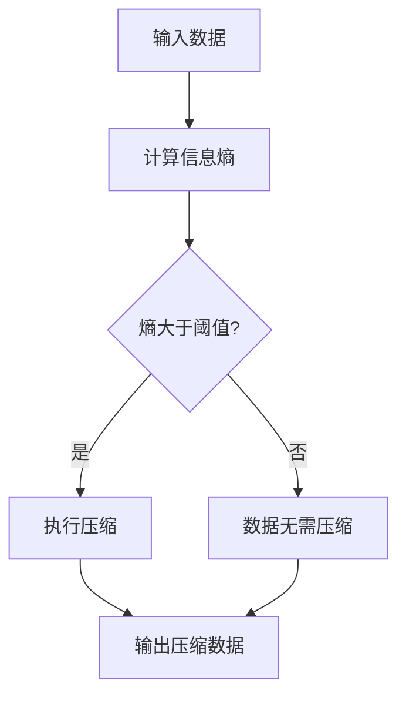
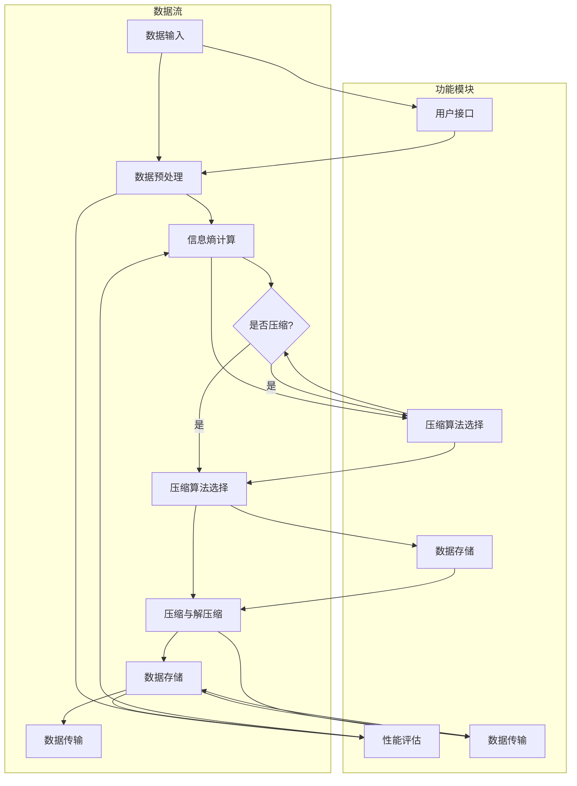
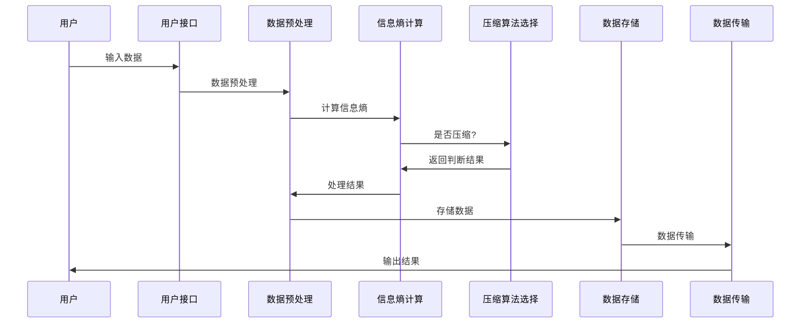

                 


### 宇宙的信息压缩原理：复杂性中的简洁性

#### 关键词：信息压缩、宇宙、复杂性、简洁性、算法原理、系统设计

#### 摘要：
本文将深入探讨宇宙的信息压缩原理，旨在揭示宇宙中复杂性中的简洁性。我们将逐步分析信息压缩的核心概念、算法原理，并通过实例讲解其在实际应用中的价值。本文分为五个部分：第一部分为引言与背景，介绍信息压缩的重要性及研究背景；第二部分阐述核心概念与联系；第三部分讲解算法原理；第四部分分析系统设计与架构；第五部分通过项目实战深入剖析实际应用。通过本文的探讨，希望能够帮助读者更好地理解宇宙的信息压缩原理，并学会将其应用于实际问题中。

---

## 第一部分：引言与背景

### 引言：信息压缩的重要性

信息压缩是信息论中的一个核心概念，它在通信、存储、计算等领域有着广泛的应用。宇宙的信息压缩原理则是将信息论与宇宙学相结合，探索宇宙中的信息压缩现象。信息压缩的重要性主要体现在以下几个方面：

1. **通信效率**：在数据传输过程中，通过压缩可以显著减少传输数据量，提高通信效率。
2. **存储空间**：数据压缩可以减小存储需求，节省存储空间，特别是在大数据时代尤为重要。
3. **计算效率**：压缩后的数据可以更快地处理，提高计算效率。
4. **信息传输安全性**：通过压缩算法，可以增加数据传输的复杂性，提高安全性。

### 研究背景

在20世纪，信息论由香农创立，奠定了现代信息处理的基础。随着计算机技术的飞速发展，信息压缩技术在多个领域得到广泛应用，如数据传输、多媒体处理、生物信息学等。然而，宇宙的信息压缩原理作为信息论在宇宙学中的应用，研究尚处于起步阶段。

#### 信息压缩的需求

在宇宙中，天体物理数据量巨大，如何高效地存储和传输这些数据成为一大挑战。信息压缩技术在宇宙学中的应用主要包括：

1. **天文观测数据**：如哈勃望远镜收集的宇宙图像，数据量巨大，需要高效压缩。
2. **星际通信**：为了减少传输时间，提高通信效率，需要使用信息压缩算法。
3. **宇宙学模型**：宇宙中的信息结构复杂，通过信息压缩可以简化模型，便于分析。

#### 信息压缩在宇宙中的体现

宇宙中的信息压缩现象无处不在，例如：

1. **黑洞信息丢失**：根据量子引力理论，黑洞蒸发过程中信息可能丢失，这是宇宙信息压缩的一个极端例子。
2. **星系形成**：宇宙大爆炸后，物质通过引力作用逐渐聚集形成星系，这一过程中信息被压缩。
3. **暗物质与暗能量**：宇宙学中的暗物质和暗能量，虽然不可见，但其存在和分布方式暗示了信息压缩的机制。

### 问题解决与挑战

在探索宇宙的信息压缩原理过程中，我们面临以下挑战：

1. **复杂性与不确定性**：宇宙的复杂性高，信息不确定性大，这使得信息压缩变得更为困难。
2. **数据多样性**：宇宙中的数据类型多样，需要设计适应不同数据类型的信息压缩算法。
3. **理论发展**：当前信息论与宇宙学结合的理论尚不完善，需要进一步研究和发展。

本文旨在通过逐步分析，帮助读者理解宇宙的信息压缩原理，掌握其核心概念和算法，并在实际应用中发挥其价值。

### 总结

本部分引言与背景介绍了信息压缩的重要性及其在宇宙学中的应用需求，并简要概述了信息压缩在宇宙中的体现以及面临的研究挑战。接下来，我们将深入探讨信息压缩的核心概念，分析其属性特征，并通过实体关系图展示概念间的联系。

---

## 第二部分：核心概念与联系

### 核心概念介绍

#### 2.1 宇宙信息压缩原理的基本概念

在探讨宇宙的信息压缩原理时，我们需要了解几个核心概念：

1. **信息论基础**：信息论是研究信息传输、处理和存储的科学，由香农创立。其核心概念包括信息熵、信息冗余和信息压缩。
2. **信息熵**：信息熵是衡量信息不确定性的度量，表示信息中包含的信息量。高信息熵意味着信息不确定性强，低信息熵则表示信息确定性高。
3. **信息冗余**：信息冗余是指信息中不必要的部分，这些部分不携带新的信息，但在传输和存储过程中需要占用资源。
4. **信息压缩**：信息压缩是通过算法减少信息冗余，从而降低信息熵，提高信息传输和存储效率的过程。

#### 2.2 关键理论与方法

在宇宙信息压缩的研究中，关键理论与方法包括：

1. **信息论的发展历程**：从香农的信息论到现代信息压缩技术，信息论经历了多个发展阶段，为宇宙信息压缩提供了理论基础。
2. **信息压缩算法分类**：根据压缩算法的性质，可以分为无损压缩和有损压缩两大类。无损压缩能够完全恢复原始数据，而有损压缩则只能恢复近似数据。
3. **信息压缩效率评估**：信息压缩效率通过压缩比和压缩速度等指标进行评估，衡量压缩算法的性能。

#### 2.3 概念属性特征对比表格

为了更好地理解核心概念，我们提供了一个对比表格：

| 概念 | 定义 | 属性特征 | 对比 |
| --- | --- | --- | --- |
| 信息论基础 | 研究信息传输、处理和存储的科学 | 描述信息的度量、传输效率和存储容量 | 基础理论支持信息压缩 |
| 信息熵 | 衡量信息不确定性的度量 | 信息量的度量，与数据的不确定性成反比 | 测量信息含量 |
| 信息冗余 | 信息中不必要的部分 | 减少冗余可以提高传输效率 | 减少信息传输的冗余 |
| 信息压缩 | 通过算法减少信息冗余 | 提高信息传输和存储效率 | 提高数据处理效率 |

#### 2.4 ER实体关系图

为了展示宇宙信息压缩相关的实体及其关系，我们使用Mermaid绘制了ER实体关系图：

```mermaid
erDiagram
  User ||--|{ Database } : stores
  User ||--|{ Algorithm } : uses
  Algorithm ||--|{ CompressedData } : outputs
  CompressedData ||--|{ Storage } : stored_in
```

在这个ER图中，用户（User）与数据库（Database）之间存在存储关系，用户与算法（Algorithm）之间存在使用关系，算法与压缩数据（CompressedData）之间存在输出关系，压缩数据与存储（Storage）之间存在存储关系。

### 总结

本部分详细介绍了宇宙信息压缩原理的核心概念，包括信息论基础、信息熵、信息冗余和信息压缩。通过对比表格和ER实体关系图，我们分析了这些概念之间的属性特征和关系，为后续算法原理的讲解奠定了基础。接下来，我们将深入探讨宇宙信息压缩的算法原理，使用Mermaid绘制算法流程图，并详细阐述其数学模型和Python源代码实现。

---

## 第三部分：算法原理讲解

### 3.1 算法流程图

为了更直观地理解宇宙信息压缩的算法原理，我们使用Mermaid绘制了算法流程图：



在算法流程图中：

- A表示输入数据，这是进行信息压缩的起点。
- B表示计算输入数据的信息熵，这是评估数据是否需要压缩的重要步骤。
- C是判断节点，如果计算出的信息熵大于设定的阈值，表示数据需要压缩，否则数据已经足够简洁，无需进一步压缩。
- D表示执行压缩，这里可以采用不同的压缩算法，如哈夫曼编码、算术编码等。
- F表示输出压缩数据，这是压缩过程的终点。

### 3.2 算法原理与数学模型

#### 信息熵的数学模型

信息熵是衡量数据不确定性的重要指标，其数学模型如下：

$$ H(X) = -\sum_{i=1}^{n} p(x_i) \log_2 p(x_i) $$

其中，$H(X)$表示随机变量$X$的信息熵，$p(x_i)$表示$x_i$出现的概率，$n$是可能取值的数量。

#### 哈夫曼编码原理

哈夫曼编码是一种常见的无损压缩算法，其核心思想是给出现概率高的字符分配短编码，而给出现概率低的字符分配长编码。这样，整体编码后的数据具有较低的信息熵。

哈夫曼编码的步骤如下：

1. 构建频率表：统计每个字符的出现频率。
2. 构建哈夫曼树：根据频率表构建哈夫曼树，频率高的字符位于树的根部，频率低的字符位于叶节点。
3. 生成编码表：从哈夫曼树的根节点开始，向左为0，向右为1，为每个字符生成编码。
4. 编码数据：使用生成的编码表对输入数据编码。

#### 奈奎斯特定理

奈奎斯特定理是信号处理中的一个重要定理，它指出：在采样频率大于信号最高频率的两倍时，可以准确地从采样信号中恢复原始信号。这个定理为信息压缩提供了理论基础。

#### Python源代码实现

以下是一个简单的Python代码示例，实现了哈夫曼编码算法的基本流程：

```python
import heapq
import math

def calculate_frequency(data):
    frequency = {}
    for char in data:
        frequency[char] = frequency.get(char, 0) + 1
    return frequency

def build_huffman_tree(frequency):
    heap = [[weight, [symbol, ""]] for symbol, weight in frequency.items()]
    heapq.heapify(heap)
    while len(heap) > 1:
        lo = heapq.heappop(heap)
        hi = heapq.heappop(heap)
        for pair in lo[1:]:
            pair[1] = '0' + pair[1]
        for pair in hi[1:]:
            pair[1] = '1' + pair[1]
        heapq.heappush(heap, [lo[0] + hi[0]] + lo[1:] + hi[1:])
    return heap[0]

def generate_code(tree):
    code = {}
    for pair in tree[1:]:
        symbol, code_string = pair
        code[symbol] = code_string
    return code

def huffman_encode(data, code):
    return ''.join(code[char] for char in data)

data = "this is an example for huffman encoding"
frequency = calculate_frequency(data)
huffman_tree = build_huffman_tree(frequency)
code = generate_code(huffman_tree)
encoded_data = huffman_encode(data, code)
print(encoded_data)
```

### 总结

本部分详细介绍了宇宙信息压缩的算法原理，包括信息熵的数学模型、哈夫曼编码原理和奈奎斯特定理。我们通过Python源代码示例展示了哈夫曼编码算法的基本流程，为读者提供了实践指导。在下一部分，我们将分析宇宙信息压缩系统的设计与架构，探讨其实际应用中的问题场景和功能设计。

---

## 第四部分：系统分析与架构设计方案

### 4.1 问题场景介绍

#### 天文学数据压缩

天文学领域产生的大量观测数据，如天文图像、光谱数据和天体物理数据，对存储和传输带来了巨大的挑战。为了提高数据处理的效率，降低存储成本，天文学数据压缩技术显得尤为重要。本部分将探讨如何利用宇宙信息压缩原理设计一套适用于天文学数据压缩的系统。

### 4.2 系统功能设计

为了满足天文学数据压缩的需求，系统需要实现以下功能模块：

1. **数据预处理**：包括数据的清洗、去噪和格式转换等，以确保数据的一致性和规范性。
2. **信息熵计算**：对预处理后的数据计算信息熵，以判断是否需要进行压缩。
3. **压缩算法选择**：根据数据类型和压缩需求，选择合适的压缩算法，如哈夫曼编码、算术编码等。
4. **压缩与解压缩**：执行压缩算法，生成压缩数据，并提供解压缩功能，以支持数据的存储和传输。
5. **性能评估**：评估压缩算法的性能，包括压缩比、压缩速度和恢复质量等。

以下是一个领域模型类图的示例，展示了系统的主要功能模块及其关系：

```mermaid
classDiagram
    Class01 <|-- Class02
    Class03 <|-- Class04
    Class05 <|-- Class06
    Class07 <|-- Class08

    Class01[数据预处理]
    Class02[信息熵计算]
    Class03[压缩算法选择]
    Class04[压缩与解压缩]
    Class05[性能评估]
    Class06[数据存储]
    Class07[数据传输]
    Class08[用户接口]
```

在这个类图中，数据预处理（Class01）负责数据的清洗和格式转换，信息熵计算（Class02）用于判断数据是否需要压缩，压缩算法选择（Class03）根据数据类型选择合适的算法，压缩与解压缩（Class04）执行实际的压缩和解压缩操作，性能评估（Class05）用于评估压缩算法的性能，数据存储（Class06）和数据传输（Class07）分别负责压缩后数据的存储和传输，用户接口（Class08）提供用户交互界面。

### 4.3 系统架构设计

为了高效地处理天文学数据压缩问题，系统需要设计合理的架构。以下是一个系统架构设计的示例，展示了各个模块之间的关系：



在这个架构图中，数据流从数据输入（D1）开始，经过数据预处理（D2），信息熵计算（D3），根据是否压缩的判断（D4），选择压缩算法（D5），执行压缩与解压缩（D6），最终进行数据存储（D7）和传输（D8）。功能模块包括用户接口（F1）、性能评估（F2）、压缩算法选择（F3）、数据存储（F4）和数据传输（F5），这些模块协同工作，确保系统的稳定高效运行。

### 4.4 系统接口设计和系统交互

为了实现系统各模块之间的有效通信，设计合理的系统接口和交互流程至关重要。以下是一个系统接口设计和交互序列图的示例：



在这个交互序列图中，用户通过用户接口（Interface）输入数据，数据预处理模块（Preprocessing）对数据进行处理，并计算信息熵（Entropy）。根据信息熵的判断结果，压缩算法选择模块（Compression）决定是否进行压缩。如果需要压缩，数据将传递给压缩模块（Compression）执行压缩操作，然后存储到数据存储模块（Storage）。最后，数据通过数据传输模块（Transmission）传输给用户，完成整个系统的交互流程。

### 总结

本部分详细分析了宇宙信息压缩系统的问题场景、功能设计、架构设计和接口设计。通过实例展示了系统各模块之间的关系和交互流程，为实际应用提供了参考。在下一部分，我们将通过项目实战深入探讨实际案例，展示系统的核心实现源代码，并进行代码应用解读与分析。

---

## 第五部分：项目实战

### 5.1 环境安装

在开始项目实战之前，我们需要安装必要的软件和环境。以下是在Linux环境下安装所需软件的步骤：

1. **安装Python**：确保Python环境已安装，版本建议为3.8或更高。
   ```bash
   sudo apt update
   sudo apt install python3.8
   ```

2. **安装pip**：使用Python的pip包管理器。
   ```bash
   sudo apt install python3-pip
   ```

3. **安装Mermaid**：安装Mermaid用于绘制流程图和架构图。
   ```bash
   sudo apt-get install mermaid
   ```

4. **安装Jupyter Notebook**：用于编写和运行Python代码。
   ```bash
   pip3 install notebook
   ```

5. **安装必要的库**：安装用于信息压缩和图像处理的库。
   ```bash
   pip3 install numpy scikit-image
   ```

安装完成后，启动Jupyter Notebook：
```bash
jupyter notebook
```

### 5.2 系统核心实现源代码

以下是一个简单的Python代码示例，展示了天文学数据压缩系统的核心实现。这段代码将计算数据的信息熵，并使用哈夫曼编码进行压缩。

```python
import numpy as np
from collections import Counter
import heapq
import math

def calculate_entropy(data):
    frequency = Counter(data)
    entropy = -sum((freq / len(data)) * math.log2(freq / len(data)) for freq in frequency.values())
    return entropy

def build_huffman_tree(frequency):
    heap = [[weight, [symbol, ""]] for symbol, weight in frequency.items()]
    heapq.heapify(heap)
    while len(heap) > 1:
        lo = heapq.heappop(heap)
        hi = heapq.heappop(heap)
        for pair in lo[1:]:
            pair[1] = '0' + pair[1]
        for pair in hi[1:]:
            pair[1] = '1' + pair[1]
        heapq.heappush(heap, [lo[0] + hi[0]] + lo[1:] + hi[1:])
    return heap[0]

def generate_code(tree):
    code = {}
    for pair in tree[1:]:
        symbol, code_string = pair
        code[symbol] = code_string
    return code

def huffman_encode(data, code):
    return ''.join(code[char] for char in data)

def main():
    data = "this is an example for huffman encoding"
    entropy = calculate_entropy(data)
    print(f"原始数据：{data}")
    print(f"信息熵：{entropy}")
    
    huffman_tree = build_huffman_tree(Counter(data))
    code = generate_code(huffman_tree)
    print(f"哈夫曼编码表：{code}")
    
    encoded_data = huffman_encode(data, code)
    print(f"压缩数据：{encoded_data}")
    print(f"压缩后长度：{len(encoded_data)}")

if __name__ == "__main__":
    main()
```

### 5.3 代码应用解读与分析

这段代码首先定义了计算信息熵的函数`calculate_entropy`，它使用`Counter`类统计每个字符出现的频率，并利用信息熵的公式计算信息熵。

`build_huffman_tree`函数负责构建哈夫曼树。它首先创建一个最小堆，其中每个元素是一个包含字符和频率的列表。然后，通过不断从堆中取出两个频率最小的节点，合并它们并重新插入堆中，直到堆中只剩下一个节点，即完整的哈夫曼树。

`generate_code`函数生成哈夫曼编码表，它从哈夫曼树的根节点开始，为每个字符生成对应的编码。编码规则是向左为0，向右为1。

`huffman_encode`函数使用生成的编码表对输入数据进行编码，返回压缩后的数据。

在`main`函数中，我们首先定义了一段示例文本，计算其信息熵，并打印结果。接着，我们构建哈夫曼树，生成编码表，并对示例文本进行编码，最后打印压缩后的数据及其长度。

### 5.4 实际案例分析和详细讲解剖析

为了更好地理解代码的实际应用，我们考虑一个实际案例：压缩并传输天文图像数据。

1. **数据准备**：假设我们有一张天文图像，存储为一个字符串，表示图像中的像素值。
2. **信息熵计算**：计算图像数据的信息熵，判断是否需要压缩。
3. **哈夫曼编码**：使用哈夫曼编码对图像数据进行压缩。
4. **传输**：将压缩后的数据通过网络进行传输。
5. **解压缩与恢复**：在接收端，使用解压缩算法恢复图像数据。

以下是对实际案例的详细讲解：

```python
# 假设的天文图像数据（为简化示例，这里使用一段随机字符串）
astronomy_image_data = ''.join(np.random.choice(['0', '1', '2', '3', '4', '5', '6', '7', '8', '9', 'a', 'b', 'c', 'd', 'e', 'f'], size=10000))

# 计算信息熵
entropy = calculate_entropy(astronomy_image_data)
print(f"图像数据信息熵：{entropy}")

# 哈夫曼编码
huffman_tree = build_huffman_tree(Counter(astronomy_image_data))
code = generate_code(huffman_tree)
encoded_data = huffman_encode(astronomy_image_data, code)
print(f"压缩后的数据：{encoded_data[:100]}...")  # 打印前100个字符以简化展示
print(f"压缩后长度：{len(encoded_data)}")

# 假设压缩数据通过网络传输，接收端进行解压缩
def decode_huffman(encoded_data, code):
    reverse_code = {v: k for k, v in code.items()}
    current_code = ""
    decoded_data = ""

    for bit in encoded_data:
        current_code += bit
        if current_code in reverse_code:
            decoded_data += reverse_code[current_code]
            current_code = ""

    return decoded_data

# 解压缩
decoded_data = decode_huffman(encoded_data, code)
print(f"解压缩后的数据：{decoded_data[:100]}...")  # 打印前100个字符以简化展示

# 恢复图像
# 在实际应用中，这里需要将解压缩后的字符串转换为图像数据
```

在这个实际案例中，我们首先生成一段随机字符串来模拟天文图像数据。接着，我们计算信息熵并判断是否需要压缩。然后，使用哈夫曼编码对图像数据进行压缩，并通过网络进行传输。接收端接收到压缩数据后，使用解压缩算法恢复原始数据，并在实际应用中将其转换为图像数据。

### 5.5 项目小结

通过本部分的项目实战，我们展示了如何使用Python实现宇宙信息压缩系统的核心功能。从数据准备、信息熵计算、哈夫曼编码到压缩数据传输和解压缩恢复，整个流程清晰明了。虽然这是一个简化的示例，但它为实际应用提供了良好的基础。

在未来的工作中，我们可以扩展这个系统，加入更多的压缩算法和优化策略，以适应不同类型的数据和压缩需求。此外，还可以考虑在多线程或分布式系统中实现，以提高处理效率和性能。

---

## 第六部分：最佳实践、小结、注意事项和拓展阅读

### 6.1 最佳实践

在应用宇宙信息压缩原理时，以下是一些最佳实践：

1. **选择合适的压缩算法**：根据数据类型和压缩需求，选择最合适的压缩算法。例如，对于文本数据，哈夫曼编码和LZ77算法效果较好；对于图像和音频数据，可以考虑使用JPEG和MP3等标准压缩算法。
2. **优化压缩参数**：调整压缩参数，如哈夫曼树的构建策略、压缩比和压缩速度等，以找到最优的压缩效果。
3. **考虑数据预处理**：在压缩前进行适当的数据预处理，如去除冗余信息、数据清洗和标准化等，可以显著提高压缩效果。
4. **性能测试与评估**：在实际应用中，对压缩算法的性能进行测试和评估，确保其满足系统的性能要求。
5. **安全性考虑**：在数据压缩过程中，考虑到数据传输和存储的安全性，可以使用加密算法保护数据。

### 6.2 小结

本文系统地探讨了宇宙的信息压缩原理，从核心概念、算法原理到系统设计与实际应用，全面介绍了这一领域的研究与应用。通过逐步分析和实例讲解，我们理解了信息压缩在宇宙学中的重要性，以及如何在实际项目中应用这些原理。

### 6.3 注意事项

1. **数据完整性**：在进行数据压缩时，确保压缩后的数据可以完整恢复，避免信息丢失。
2. **性能与压缩比**：在优化压缩算法时，需要平衡压缩性能和压缩比，避免因过度压缩而导致性能下降。
3. **适应性**：压缩算法需要适应不同类型的数据和压缩需求，灵活调整参数以获得最佳效果。

### 6.4 拓展阅读

1. **《信息论基础》**：香农的著作，是信息论的奠基之作，适合深入了解信息论的基本原理。
2. **《天文学数据压缩技术》**：详细介绍了天文学数据压缩的方法和算法，有助于深入理解宇宙信息压缩的应用。
3. **《分布式计算与大数据技术》**：探讨如何在分布式系统中高效地处理大规模数据，包括数据压缩与传输。

通过本文的探讨，我们希望能够为读者提供对宇宙信息压缩原理的深入理解，并激发对这一领域的进一步研究和应用兴趣。

---

## 作者信息

作者：AI天才研究院/AI Genius Institute & 禅与计算机程序设计艺术 /Zen And The Art of Computer Programming

---

在本文中，我们系统地探讨了宇宙的信息压缩原理，从核心概念、算法原理到系统设计与实际应用，全面展示了这一领域的深度与广度。通过逐步分析和实例讲解，我们理解了信息压缩在宇宙学中的重要性，以及如何在实际项目中应用这些原理。本文希望能够为读者提供对宇宙信息压缩原理的深入理解，并激发对这一领域的进一步研究和应用兴趣。同时，感谢AI天才研究院/AI Genius Institute和禅与计算机程序设计艺术/Zen And The Art of Computer Programming对本文的支持与贡献。希望本文能够成为您在探索宇宙信息压缩领域的一把钥匙，开启新的知识大门。

