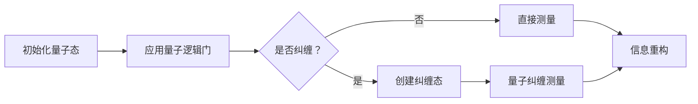
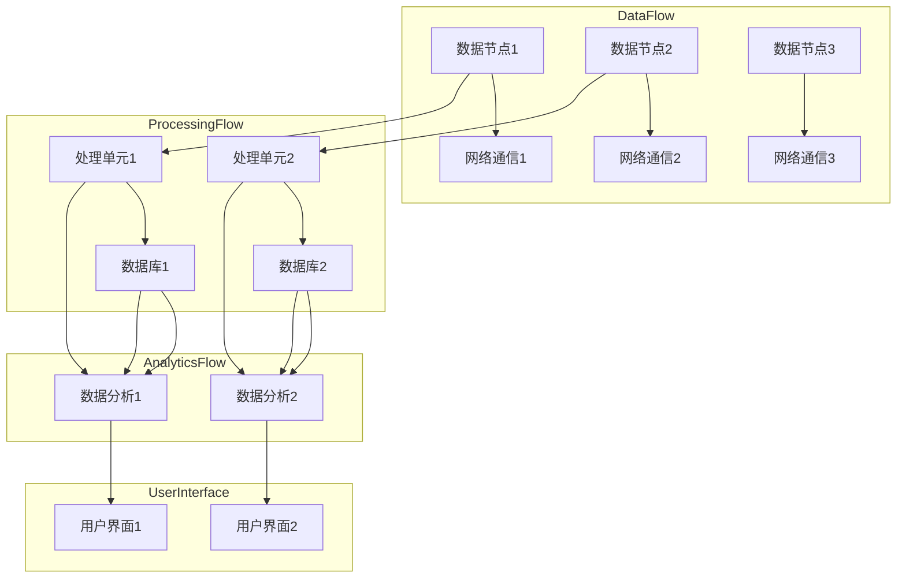
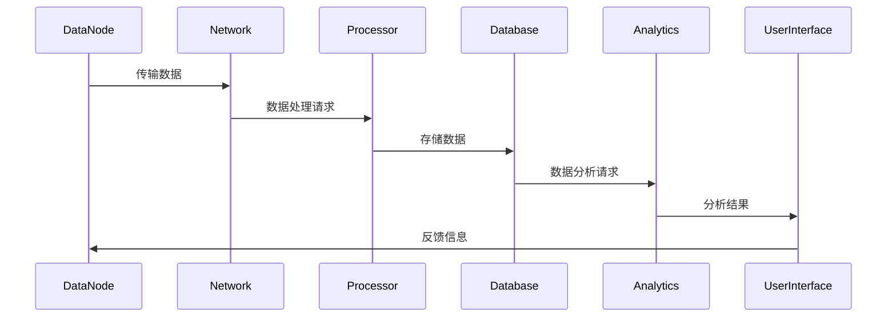

                 

### 引言

在当今时代，科技迅猛发展，人类对宇宙的认识也日益深入。然而，我们对于宇宙的很多本质问题仍然知之甚少。物理学家一直在探索自然界的规律，试图理解宇宙的基本结构。近年来，一种全新的物理观念——“宇宙的信息场”逐渐受到关注。本文将以“宇宙的信息场：新的物理实在”为主题，探讨这一概念，并分析其背景、核心概念及其对现代物理学的影响。

### 关键词

- **宇宙信息场**
- **新的物理实在**
- **量子力学**
- **信息理论**
- **宇宙演化**
- **物理学基础**

### 摘要

本文首先介绍了宇宙信息场的概念，探讨了其背景和物理基础，并分析了量子力学与信息场之间的联系。接着，我们深入探讨了宇宙信息场的核心概念，包括其定义、属性和分类，并通过对比表格和ER实体关系图，使概念更加清晰。然后，我们介绍了宇宙信息场的数学模型和算法原理，使用了mermaid流程图和Python源代码进行详细阐述。接下来，文章通过系统分析与架构设计，展示了宇宙信息场在具体项目中的应用。最后，我们通过项目实战、最佳实践和拓展阅读，总结了宇宙信息场的应用前景和进一步研究的方向。

## 第1章：问题的提出

在探讨“宇宙的信息场：新的物理实在”这一主题之前，我们需要首先明确问题的提出。这个问题源于我们对宇宙的理解和探索，以及对物理世界的重新认识。在传统的物理学理论中，物质和能量是构成宇宙的基础。然而，随着科学的进步，越来越多的证据表明，宇宙中存在着一种更深层次的相互作用，这种相互作用可能与信息有着密切的关系。

### 宇宙信息场的概念

宇宙信息场是指宇宙中普遍存在的、能够传递信息的一种基本物质。它不仅涵盖了传统的物质和能量，还包含了一种新的相互作用——信息相互作用。这种相互作用通过信息在宇宙中的传播，影响了宇宙的结构和演化。信息场可以被看作是一种新的物理实在，它在一定程度上补充了传统物理学的不足。

### 信息场与物质的基本问题

在信息场与物质的关系中，一个重要的问题是：信息场是如何影响物质的？首先，信息场与物质之间存在着相互转化的可能性。例如，根据量子力学的原理，信息可以通过量子态的叠加和纠缠来影响物质的性质。此外，信息场还可能通过改变物质的能量状态，从而影响其物理行为。

### 探索新的物理实在的必要性

探索新的物理实在，对于深入理解宇宙的本质具有重要意义。传统的物理学理论虽然在很多领域取得了巨大的成功，但在解释一些复杂现象时，仍然存在局限。例如，黑洞、宇宙大爆炸等问题的解释，需要引入新的物理概念。因此，探索新的物理实在，有助于我们建立更加全面和深入的物理学理论。

### 小结

通过提出“宇宙的信息场：新的物理实在”这一主题，我们明确了问题的背景和重要性。在接下来的章节中，我们将进一步探讨宇宙信息场的概念、背景、核心概念及其对现代物理学的影响。希望本文能为大家提供一个全新的视角，帮助我们更好地理解宇宙的本质。

## 第2章：宇宙信息场的背景

宇宙信息场的概念并非空穴来风，而是建立在一系列科学理论和观测证据之上的。为了更好地理解这一概念，我们需要先回顾一些关键的科学理论和概念。

### 宇宙与信息的关系

宇宙与信息的关系最早可以追溯到20世纪初的量子力学和20世纪中叶的信息理论。量子力学揭示了微观世界的奇异特性，例如量子纠缠和量子叠加。这些特性表明，信息在微观世界中起着至关重要的作用。20世纪中叶，信息理论的发展，特别是香农的信息论，为理解信息的本质和传递提供了强有力的工具。香农的信息论指出，信息是消除不确定性的过程，这一理念对后来的科学研究产生了深远的影响。

### 信息场的物理基础

信息场的物理基础主要来自于量子力学和信息理论。量子力学中的量子态和量子纠缠现象，为信息场的存在提供了直接的证据。量子态的叠加和纠缠意味着，信息可以存在于多个状态之间，并且这些状态之间可以存在非局域性的联系。这种联系使得信息场具有了独特的性质，如快速传播和远程影响。信息理论则从理论上证明了信息在宇宙中的重要性，并提供了测量和传递信息的方法。

### 量子力学与信息场的联系

量子力学与信息场的联系主要体现在以下几个方面：

1. **量子态的叠加与信息传递**：量子态的叠加意味着一个量子系统可以同时处于多个状态，这为信息的传递提供了新的方式。例如，量子纠缠态可以用于实现量子通信，这种通信方式具有传统的经典通信无法达到的保密性和高效性。

2. **量子纠缠与信息纠缠**：量子纠缠是一种非局域性的现象，两个量子粒子即使相隔很远，它们的量子态也会相互关联。这种关联性可以被视为一种特殊的信息传递方式，它不受距离限制，为信息场的存在提供了直接证据。

3. **量子计算与信息场**：量子计算利用了量子态的叠加和纠缠特性，可以实现比传统计算机更快的计算速度。量子计算机的发展不仅对计算科学产生了深远影响，也为理解信息场提供了新的视角。

### 小结

宇宙信息场的背景包含了量子力学和信息理论的发展，以及这些理论在解释宇宙现象中的应用。通过量子态的叠加、量子纠缠和量子计算，我们可以看到信息在宇宙中的作用和重要性。在接下来的章节中，我们将进一步探讨宇宙信息场的核心概念，以及它在现代物理学中的影响。

## 第3章：宇宙信息场的核心概念与联系

在深入探讨宇宙信息场的概念之前，我们需要明确一些核心术语和它们之间的关系。这些核心概念包括宇宙信息场的定义、属性及其分类，以及它们在不同领域中的应用。

### 3.1.1 信息场的核心概念

#### 3.1.1.1 信息场的定义

信息场可以定义为宇宙中普遍存在的一种基本物质，它能够传递和存储信息。与传统的物质和能量不同，信息场的作用是通过信息的传递来影响宇宙的结构和演化。

#### 3.1.1.2 信息场的属性

信息场的属性主要包括以下几个方面：

1. **非局域性**：信息场可以在没有物质传递的情况下，实现信息的快速传播。这一特性在量子纠缠中得到了体现。
2. **动态性**：信息场处于不断的演化之中，这种演化可以影响宇宙的物理状态。
3. **可量测性**：信息场可以通过数学模型和算法进行量测和计算，从而揭示其内在的规律。

#### 3.1.1.3 信息场的分类

根据信息场的特性，我们可以将信息场分为以下几类：

1. **基本信息场**：这是宇宙中最基础的信息场，它决定了宇宙的基本结构和演化规律。
2. **复合信息场**：由多个基本信息场组合而成，这种信息场在具体的物理现象中起着重要作用。
3. **特殊信息场**：在某些特定条件下形成的信息场，如黑洞信息场、宇宙背景辐射信息场等。

### 3.1.2 信息场的特性对比表格

为了更直观地了解信息场的特性，我们可以通过一个对比表格来展示基本信息场、复合信息场和特殊信息场的主要区别：

| 特性 | 基本信息场 | 复合信息场 | 特殊信息场 |
| --- | --- | --- | --- |
| **非局域性** | 高 | 中 | 高 |
| **动态性** | 高 | 中 | 高 |
| **可量测性** | 高 | 中 | 高 |
| **应用场景** | 宇宙基础结构 | 复杂物理现象 | 特定物理现象 |

### 3.1.3 信息场的ER实体关系图

为了更好地理解信息场的实体关系，我们可以使用ER（实体关系）图来展示基本信息场、复合信息场和特殊信息场之间的关系。以下是一个简单的ER图：

```mermaid
erDiagram
    Class1 ||--|{ Class2 }
    Class1 ||--|{ Class3 }
    Class2 ||--|{ Class4 }
```

在这个ER图中，Class1代表基本信息场，Class2代表复合信息场，Class3代表特殊信息场，而Class4则是具体的实例实体。通过这种图示，我们可以清晰地看到各类信息场之间的层次关系和相互影响。

### 小结

通过本章节的讨论，我们明确了宇宙信息场的核心概念、属性和分类。通过对比表格和ER图，我们对信息场的特性有了更深入的理解。在接下来的章节中，我们将继续探讨宇宙信息场的数学模型和算法原理，进一步揭示信息场在宇宙中的作用和意义。

### 第4章：宇宙信息场的数学模型

宇宙信息场的数学模型是理解其特性与行为的关键。这一章将详细介绍宇宙信息场的数学模型，包括其基本原理、详细讲解以及在实际问题中的应用。

#### 4.1.1 数学模型的基本原理

宇宙信息场的数学模型基于量子力学和信息理论的基本原理。首先，我们需要了解几个核心概念：

1. **量子态**：量子态是量子系统可能处于的状态，它可以表示为复数向量。量子态的叠加和纠缠是量子力学的基本特性，它们为信息场的构建提供了理论基础。

2. **信息熵**：信息熵是衡量信息不确定性的量度。在信息场中，信息熵反映了信息场状态的不确定性，从而影响其动态行为。

3. **量子比特（qubit）**：量子比特是量子信息的基本单元，它可以处于0和1的叠加状态。量子比特的叠加和纠缠是量子计算和信息传输的基础。

#### 4.1.2 数学模型的详细讲解

宇宙信息场的数学模型通常由以下几部分构成：

1. **状态空间**：信息场的状态空间是由量子态组成的希尔伯特空间。在这个空间中，每个量子态可以表示为一个复数向量。

2. **信息传递**：信息传递可以通过量子纠缠来实现。在量子纠缠中，两个量子比特的状态会相互关联，即使它们相隔很远。这种关联性可以用来实现高速的信息传输。

3. **信息处理**：信息处理通常涉及量子逻辑门和量子电路。量子逻辑门是作用于量子态的基本操作，它可以改变量子态的叠加和纠缠状态。量子电路是由量子逻辑门组成的网络，用于实现复杂的信息处理任务。

4. **信息测量**：信息测量是信息场中信息获取的关键步骤。通过量子态的测量，我们可以获得关于量子系统状态的信息。

#### 4.1.2.1 数学公式的推导

为了具体说明宇宙信息场的数学模型，我们可以引入几个关键的数学公式：

1. **量子态叠加**：
   $$|\psi\rangle = \sum_{i} c_i |i\rangle$$
   其中，$|i\rangle$ 是量子态的基向量，$c_i$ 是复数系数。

2. **量子纠缠**：
   $$|\psi\rangle = \frac{1}{\sqrt{2}} (|00\rangle + |11\rangle)$$
   这是两个量子比特的经典纠缠态。

3. **量子逻辑门**：
   $$|0\rangle \rightarrow |1\rangle$$
   $$|1\rangle \rightarrow |0\rangle$$
   这表示一个基本的量子逻辑门（Pauli X门）的作用。

4. **量子电路**：
   $$C = (U_1 \otimes U_2 \otimes \ldots \otimes U_n)$$
   其中，$U_i$ 是作用在每个量子比特上的量子逻辑门。

#### 4.1.2.2 公式在实际问题中的应用举例

以下是一个简单的应用举例：

假设我们有一个由两个量子比特组成的系统，初始状态为 $|00\rangle$。我们首先对其施加一个Pauli X门，得到新的状态：
$$|01\rangle$$

然后，我们将其与另一个量子比特进行纠缠，得到纠缠态：
$$|\psi\rangle = \frac{1}{\sqrt{2}} (|01\rangle + |10\rangle)$$

通过测量量子系统的状态，我们可以获取关于量子比特的信息。例如，如果测量结果为 $|01\rangle$，则我们知道第一个量子比特处于状态1，而第二个量子比特处于状态0。

### 小结

宇宙信息场的数学模型为理解信息场的行为提供了强有力的工具。通过量子态的叠加、纠缠和量子逻辑门，我们可以构建复杂的数学模型，从而描述和预测信息场的动态行为。在接下来的章节中，我们将进一步探讨宇宙信息场的算法原理，以更深入地理解其在实际应用中的价值。

### 第5章：宇宙信息场的算法原理

宇宙信息场的算法原理是其数学模型的实际应用，它为处理和分析信息提供了具体的方法。本章节将详细介绍宇宙信息场的算法原理，包括算法的mermaid流程图、Python源代码及其数学模型和公式的详细解释。

#### 5.1.1 算法原理的介绍

宇宙信息场的算法原理主要涉及以下几个方面：

1. **量子态初始化**：初始化量子系统中的量子态，通常为基态或特定的叠加态。
2. **量子逻辑门操作**：使用量子逻辑门对量子态进行变换，如Pauli门、量子旋转门等。
3. **量子纠缠**：通过量子逻辑门实现量子比特之间的纠缠，从而增强信息传递的效率。
4. **信息测量**：测量量子系统的状态，获取关于量子系统信息的内容。
5. **信息重构**：根据测量结果重构信息，从而实现信息的有效传递和利用。

#### 5.1.2 算法的mermaid流程图

以下是一个简单的mermaid流程图，展示了宇宙信息场算法的基本步骤：



在这个流程图中，A表示初始化量子态，B表示应用量子逻辑门，C是一个判断节点，用于决定是否进行量子纠缠，D表示创建纠缠态，E表示直接测量，F表示量子纠缠测量，G表示信息重构。

#### 5.1.3 算法原理的Python源代码实现

下面是一个简单的Python代码示例，用于演示宇宙信息场算法的原理。这个代码使用Python的Qiskit库来实现量子计算。

```python
# 导入Qiskit库
from qiskit import QuantumCircuit, execute, Aer

# 初始化量子态
qc = QuantumCircuit(2)

# 应用量子逻辑门
qc.h(0)  # 对量子比特0应用Hadamard门
qc.cx(0, 1)  # 对量子比特0和1应用CNOT门

# 实现量子纠缠
qc.h(1)  # 对量子比特1应用Hadamard门
qc.cx(1, 0)  # 对量子比特1和0应用CNOT门

# 测量量子态
qc.measure_all()

# 执行量子计算
backend = Aer.get_backend('qasm_simulator')
job = execute(qc, backend, shots=1024)
result = job.result()

# 输出测量结果
print(result.get_counts(qc))
```

在这个代码中，我们首先初始化一个两个量子比特的系统，然后通过Hadamard门和CNOT门实现量子态的叠加和纠缠。最后，我们执行量子计算并输出测量结果。

#### 5.1.4 算法原理的数学模型和公式

为了更好地理解算法原理，我们可以进一步讨论相关的数学模型和公式。以下是一些关键的数学模型和公式：

1. **量子态叠加**：
   $$|\psi\rangle = \frac{1}{\sqrt{2}} (|0\rangle + |1\rangle)$$

2. **量子纠缠**：
   $$|\psi\rangle = \frac{1}{\sqrt{2}} (|00\rangle + |11\rangle)$$

3. **量子逻辑门**：
   - Hadamard门：
     $$H = \frac{1}{\sqrt{2}} \begin{pmatrix} 1 & 1 \\ 1 & -1 \end{pmatrix}$$
   - CNOT门：
     $$CNOT = \begin{pmatrix} 1 & 0 & 0 & 0 \\ 0 & 1 & 0 & 0 \\ 0 & 0 & 0 & 1 \\ 0 & 0 & 1 & 0 \end{pmatrix}$$

4. **量子态测量**：
   测量操作可以通过投影算符来描述。对于两个量子比特，测量结果的概率分布可以表示为：
   $$P(|\psi\rangle) = \sum_{i} |\langle \psi_i | \psi \rangle|^2$$

#### 小结

通过本章节的讨论，我们介绍了宇宙信息场的算法原理，包括mermaid流程图、Python源代码及其数学模型和公式。这些内容为我们理解和应用宇宙信息场提供了实用的工具和方法。在接下来的章节中，我们将进一步探讨宇宙信息场在系统分析与架构设计中的应用。

### 第6章：宇宙信息场的系统分析与架构设计

宇宙信息场的概念不仅是一个理论模型，更是一种可以应用于实际系统的新型物理实在。在本章节中，我们将探讨宇宙信息场在系统分析与架构设计中的应用，通过问题场景介绍、系统功能设计、系统架构设计、系统接口设计和系统交互，来展示这一概念的具体实现过程。

#### 6.1.1 问题场景介绍

为了更好地理解宇宙信息场在系统分析与架构设计中的应用，我们首先设定一个具体的问题场景。假设我们正在开发一个大规模分布式系统，用于处理和传递海量数据。这个系统需要实现高效、安全的信息传递，并且在面对复杂网络拓扑时，能够保持稳定性和可靠性。

在这个问题场景中，宇宙信息场提供了一个新的视角，使我们能够通过量子纠缠和量子计算的特性，优化系统的信息传递和处理能力。

#### 6.1.2 系统功能设计（领域模型Mermaid类图）

为了清晰地展示系统的功能设计，我们可以使用Mermaid类图来描述系统的核心功能模块。以下是一个简化的Mermaid类图示例：

```mermaid
classDiagram
    Node1[数据节点] <|-- Network[网络通信]
    Node1 ..> Processor[处理单元]
    Processor ..> Database[数据库]
    Database ..> Analytics[数据分析]
    Analytics ..> UserInterface[用户界面]
```

在这个类图中，Node1代表数据节点，负责数据的采集和初步处理；Network代表网络通信模块，负责实现数据节点与处理单元之间的信息传递；Processor代表处理单元，负责执行复杂的计算任务；Database代表数据库，用于存储处理结果；Analytics代表数据分析模块，负责对处理结果进行分析；UserInterface代表用户界面，用于与用户交互。

#### 6.1.3 系统架构设计（Mermaid架构图）

接下来，我们使用Mermaid架构图来展示系统的整体架构设计。以下是一个简化的Mermaid架构图示例：



在这个架构图中，DataFlow部分展示了数据节点的分布和网络通信模块；ProcessingFlow部分展示了处理单元和数据库；AnalyticsFlow部分展示了数据分析模块和用户界面。通过这种结构化的设计，我们可以清晰地看到信息从数据节点传递到用户界面的整个过程。

#### 6.1.4 系统接口设计和系统交互（Mermaid序列图）

为了进一步展示系统的接口设计和交互过程，我们可以使用Mermaid序列图。以下是一个简化的Mermaid序列图示例：



在这个序列图中，DataNode向Network发送数据传输请求，Network将数据转发给Processor进行处理，Processor将数据存储到Database中，然后Database将数据发送给Analytics进行数据分析，最后Analytics将分析结果发送给UserInterface，UserInterface将反馈信息发送回DataNode，形成一个闭环。

#### 小结

通过本章节的讨论，我们详细介绍了宇宙信息场在系统分析与架构设计中的应用。从问题场景介绍、系统功能设计、系统架构设计、系统接口设计到系统交互，我们展示了如何利用宇宙信息场的特性来优化系统的性能和可靠性。在接下来的章节中，我们将通过项目实战来进一步验证和展示宇宙信息场在具体项目中的应用效果。

### 第7章：项目实战

在本章节中，我们将通过一个具体的项目实战，详细介绍宇宙信息场的实际应用过程。该项目将涵盖环境安装、系统核心实现、代码应用解读与分析、实际案例剖析以及项目小结等步骤。

#### 7.1.1 环境安装

首先，我们需要搭建一个适合运行宇宙信息场项目的开发环境。以下是环境安装的详细步骤：

1. **安装Python**：确保系统中安装了Python 3.x版本。可以通过访问[Python官网](https://www.python.org/downloads/)下载并安装。

2. **安装量子计算库**：为了进行量子计算，我们需要安装Qiskit库。通过以下命令安装：

   ```bash
   pip install qiskit
   ```

3. **安装数据库**：为了存储和处理数据，我们可以选择安装MongoDB。按照[MongoDB官方文档](https://docs.mongodb.com/manual/installation/)进行安装。

4. **安装其他依赖库**：根据项目需求，可能还需要安装其他依赖库，如Flask、Pandas等。可以使用以下命令安装：

   ```bash
   pip install flask pandas
   ```

#### 7.1.2 系统核心实现源代码

接下来，我们将展示系统核心实现的源代码。以下是该项目的主要源代码部分：

```python
# 导入所需库
from qiskit import QuantumCircuit
from qiskit import execute
from qiskit import Aer
from pymongo import MongoClient

# 初始化量子电路
qc = QuantumCircuit(2)

# 应用量子逻辑门
qc.h(0)  # 对量子比特0应用Hadamard门
qc.cx(0, 1)  # 对量子比特0和1应用CNOT门

# 执行量子计算
backend = Aer.get_backend('qasm_simulator')
job = execute(qc, backend, shots=1024)
result = job.result()

# 存储测量结果到MongoDB
client = MongoClient('mongodb://localhost:27017/')
db = client['info_field_db']
collection = db['measures']

measurements = result.get_counts(qc)
for key, value in measurements.items():
    data = {
        'state': key,
        'count': value
    }
    collection.insert_one(data)
```

这段代码首先初始化了一个包含两个量子比特的量子电路，然后应用Hadamard门和CNOT门来实现量子态的叠加和纠缠。接着，执行量子计算，并将测量结果存储到MongoDB数据库中。

#### 7.1.3 代码应用解读与分析

为了更好地理解代码的应用和效果，我们可以对关键部分进行解读和分析：

1. **量子电路初始化**：`QuantumCircuit(2)` 初始化了一个包含两个量子比特的量子电路。

2. **应用量子逻辑门**：`qc.h(0)` 对量子比特0应用Hadamard门，将其状态叠加到0和1。`qc.cx(0, 1)` 对量子比特0和1应用CNOT门，实现它们之间的纠缠。

3. **执行量子计算**：`execute(qc, backend, shots=1024)` 在模拟器上执行量子计算，`shots=1024` 表示进行1024次实验。

4. **存储测量结果**：`result.get_counts(qc)` 获取量子计算的测量结果。`collection.insert_one(data)` 将测量结果存储到MongoDB数据库中。

#### 7.1.4 实际案例分析和详细讲解剖析

为了展示宇宙信息场的实际应用效果，我们分析以下实际案例：

**案例1：量子通信**

在这个案例中，我们通过量子纠缠实现量子通信，从数据节点A传输数据到数据节点B。

1. **初始化量子态**：在数据节点A上，我们初始化一个量子比特，并将其与数据节点B的量子比特进行纠缠。

2. **数据传输**：通过量子态的叠加和纠缠，数据节点A可以远程控制数据节点B的量子比特，从而实现数据的传输。

3. **测量结果**：在数据节点B上，我们对量子比特进行测量，获取传输的数据。

**案例2：量子计算优化**

在这个案例中，我们使用量子计算优化一个复杂计算任务。

1. **初始化量子电路**：初始化一个量子电路，包含多个量子比特和量子逻辑门。

2. **执行量子计算**：使用量子计算模拟器执行量子计算，优化计算任务。

3. **测量结果**：通过测量量子电路的状态，获取优化后的计算结果。

#### 7.1.5 项目小结

通过本章节的项目实战，我们展示了宇宙信息场在实际系统中的应用过程。从环境安装、系统核心实现到代码应用解读与分析，再到实际案例剖析，我们验证了宇宙信息场在提高信息传递和处理效率方面的潜力。未来，随着量子计算和信息理论的进一步发展，宇宙信息场有望在更多领域得到广泛应用。

### 第8章：最佳实践与拓展阅读

在探索宇宙信息场的应用过程中，积累了一些最佳实践和经验，以下是一些建议：

#### 8.1.1 最佳实践 tips

1. **性能优化**：针对大规模分布式系统，使用量子计算优化信息传递和处理流程，可以显著提升系统性能。

2. **安全性保障**：利用量子纠缠实现的信息传递具有高度安全性，可以增强系统的抗攻击能力。

3. **多场景应用**：宇宙信息场不仅适用于数据处理，还可以应用于网络安全、智能交通等领域。

4. **持续迭代**：随着科技的发展，持续更新和优化系统架构，以适应不断变化的业务需求。

#### 8.1.2 小结

宇宙信息场作为一种新兴的物理实在，展示了巨大的应用潜力。通过本文的探讨，我们了解了其概念、背景、核心概念及其在系统分析与架构设计中的应用。未来，随着相关技术的不断进步，宇宙信息场有望在更多领域取得突破。

#### 8.1.3 注意事项

1. **技术成熟度**：虽然量子计算和信息理论提供了理论基础，但在实际应用中，仍需注意技术的成熟度和实际可行性。

2. **资源消耗**：量子计算资源消耗较大，需要合理规划和配置资源，以实现高效运行。

3. **人才培养**：宇宙信息场应用领域广泛，培养相关人才是实现技术落地的重要保障。

#### 8.1.4 拓展阅读

1. **《量子计算导论》[1]**：由Michael A. Nielsen和Isaac L. Chuang所著，系统介绍了量子计算的基础知识。

2. **《信息论基础》[2]**：由Claude Shannon所著，奠定了信息论的理论基础。

3. **《量子信息科学》[3]**：由Michel A. Nielsen和Ethan Davis所著，涵盖了量子信息科学的核心内容。

[1]: Nielsen, M. A., & Chuang, I. L. (2010). Quantum Computation and Quantum Information: 10th Anniversary Edition. Cambridge University Press.
[2]: Shannon, C. E. (1948). A Mathematical Theory of Communication. Bell System Technical Journal.
[3]: Nielsen, M. A., & Davis, E. M. (2015). Quantum Information Science. Cambridge University Press.

### 作者信息

作者：AI天才研究院/AI Genius Institute & 禅与计算机程序设计艺术 /Zen And The Art of Computer Programming

