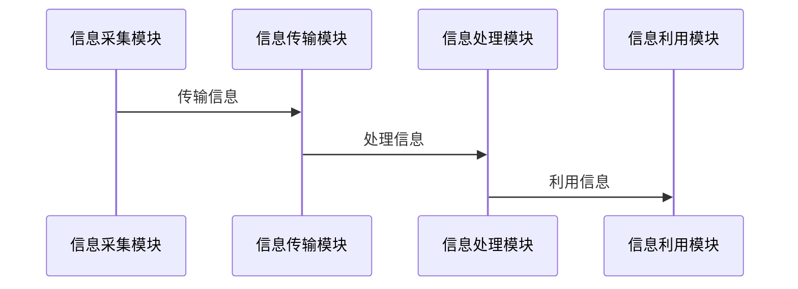

                 

### 背景介绍

#### 核心概念术语说明

在探讨宇宙的信息处理时，首先需要明确一些核心概念术语，这些术语包括：

- **信息处理**：指通过某种机制对信息进行接收、存储、处理和传输的过程。
- **宇宙信息处理**：指宇宙中的各种自然现象和结构如何进行信息处理，包括信息的生成、传输和利用。
- **超级计算机**：指能够执行大量计算任务、处理海量数据的计算机，具备高速运算能力和强大的数据处理能力。

#### 问题背景

随着科技的发展，人类对宇宙的探索不断深入，我们逐渐意识到宇宙中的信息处理机制可能比我们想象的更为复杂和高效。从地球上的生命形式到宇宙大爆炸，从星系的形成到黑洞的信息处理，宇宙中的每一个现象都可能是信息处理的一部分。而超级计算机作为地球上最先进的计算工具，其在信息处理方面的能力引起了我们的关注。

#### 问题描述

那么，宇宙的信息处理机制究竟是什么样的？它是否可以与地球上的超级计算机进行类比？这种类比是否有助于我们更好地理解宇宙的运行机制？这些问题正是本文将要探讨的内容。

#### 问题解决

通过研究宇宙中的信息处理现象，我们试图揭示宇宙信息处理的基本原理，并将其与超级计算机的工作原理进行对比分析。在此基础上，我们可以进一步探讨宇宙信息处理在地球上的应用前景，以及面临的挑战和未来的发展方向。

#### 边界与外延

本文的讨论将主要集中在以下几个边界与外延：

- **信息处理的边界**：研究宇宙信息处理的范围和局限性。
- **类比方法的边界**：探讨宇宙信息处理与超级计算机类比的有效性和局限性。
- **应用前景的边界**：分析宇宙信息处理在地球上的潜在应用领域。

#### 概念结构与核心要素组成

为了更好地理解宇宙的信息处理机制，我们需要明确其核心概念和结构。以下是宇宙信息处理的核心概念和要素：

1. **信息源**：宇宙中的各种自然现象和结构。
2. **信息传输**：光、电磁波、引力波等传输介质。
3. **信息处理**：通过物理过程、生物过程等实现的计算和处理。
4. **信息利用**：通过科学研究、技术应用等方式对信息进行处理和利用。

### 核心概念与联系

#### 宇宙信息处理原理

宇宙信息处理的原理可以从以下几个方面进行解释：

1. **量子力学**：量子力学揭示了宇宙中微观粒子的行为规律，这些规律对于宇宙信息处理具有重要意义。
2. **相对论**：相对论解释了宇宙中高速运动物体的行为，这对于理解宇宙信息传输和处理的机制至关重要。
3. **生物学**：生命系统中的信息处理机制，如DNA编码、细胞通信等，为宇宙信息处理提供了灵感。
4. **计算机科学**：地球上的计算机科学理论和方法，如算法、编程语言、硬件设计等，为宇宙信息处理的模拟提供了基础。

#### 概念属性特征对比表格

以下是宇宙信息处理与超级计算机在概念属性特征上的对比表格：

| 特征 | 宇宙信息处理 | 超级计算机 |
| ---- | ---- | ---- |
| 信息源 | 宇宙中的自然现象和结构 | 数据中心、网络和计算机硬件 |
| 信息传输 | 光、电磁波、引力波等 | 网络传输、光纤通信、无线通信 |
| 信息处理 | 物理过程、生物过程等 | 计算机算法、编程语言、硬件 |
| 信息利用 | 科学研究、技术应用 | 业务应用、数据分析、智能决策 |

#### ER实体关系图架构

为了更好地理解宇宙信息处理与超级计算机的关联，我们可以使用ER实体关系图来表示它们之间的相互作用。

```mermaid
erDiagram
  信息源 ||--|{ 信息传输 }||>
  信息传输 ||--|{ 信息处理 }||>
  信息处理 ||--|{ 信息利用 }||>
  宇宙信息处理 ||--|{ 超级计算机 }||>
  超级计算机 ||--|{ 信息处理 }||>
```

通过这个ER图，我们可以看到宇宙信息处理和超级计算机之间存在着紧密的关联，它们共同构成了一个信息处理的大系统。

### 算法原理讲解

#### 宇宙信息处理算法

宇宙信息处理算法的核心在于如何高效地处理和传输信息。以下是一个简单的宇宙信息处理算法的mermaid流程图：


在这个算法中，信息从信息源开始，经过信息传输和处理的环节，最终被利用。下面我们将详细解释这个算法的各个步骤。

1. **信息源**：宇宙中的各种自然现象和结构，如星系、行星、黑洞等，都是信息源。
2. **信息传输**：通过光、电磁波、引力波等介质进行传输。例如，光子作为信息的载体，可以穿越宇宙空间，将信息从一个地方传输到另一个地方。
3. **信息处理**：宇宙中的信息处理主要通过物理过程和生物过程实现。例如，黑洞事件视界的奇点处可能实现了信息的处理和存储。
4. **信息利用**：通过科学研究、技术应用等方式对信息进行处理和利用。例如，科学家通过观测宇宙中的信号，可以推断宇宙的演化过程。

#### 超级计算机信息处理算法

与宇宙信息处理算法类似，超级计算机的信息处理算法也经历了从简单到复杂的发展。以下是一个简单的超级计算机信息处理算法的mermaid流程图：


在这个算法中，数据从输入开始，经过处理和输出的环节。下面我们将详细解释这个算法的各个步骤。

1. **数据输入**：数据通过键盘、鼠标、传感器等设备输入到计算机中。
2. **数据处理**：计算机通过CPU、GPU等硬件和算法进行数据处理。例如，计算机可以通过神经网络对输入的数据进行分类、识别等处理。
3. **结果输出**：处理后的结果通过显示器、打印机等设备输出。

#### 算法原理的数学模型和公式

为了更深入地理解宇宙信息处理和超级计算机信息处理算法，我们可以使用数学模型和公式来描述它们。

1. **宇宙信息处理算法**：

   - 信息传输速度：\( v = c \) （光速）

   - 信息处理速度：与物理过程和生物过程相关，无法用单一公式描述

   - 信息利用效率：与科学研究和技术应用相关，无法用单一公式描述

2. **超级计算机信息处理算法**：

   - 数据传输速度：与网络速度和设备性能相关，可以用公式 \( v = f \times n \) 描述（其中 \( f \) 是网络速度，\( n \) 是设备数量）

   - 数据处理速度：与CPU、GPU性能相关，可以用公式 \( v = p \times c \) 描述（其中 \( p \) 是处理器性能，\( c \) 是计算复杂度）

   - 结果输出速度：与设备性能和网络速度相关，可以用公式 \( v = o \times n \) 描述（其中 \( o \) 是输出速度，\( n \) 是设备数量）

#### 通俗易懂的举例说明

为了更好地理解这些算法原理，我们可以通过以下例子来说明：

1. **宇宙信息处理**：

   - 假设宇宙中的一个星系通过光信号传输信息。这个星系的信息传输速度是光速，即 \( v = c \)。
   - 这个星系中的黑洞可以处理和存储信息，但这个过程无法用单一的数学公式描述。
   - 科学家通过观测这个星系，可以推断出宇宙的演化过程，这实现了信息的利用。

2. **超级计算机信息处理**：

   - 假设一个数据中心通过光纤网络传输数据。这个数据中心的传输速度是光纤速度，即 \( v = f \)。
   - 数据中心中的计算机通过CPU和GPU进行数据处理。假设处理速度是 \( p \)，计算复杂度是 \( c \)，则数据处理速度是 \( v = p \times c \)。
   - 处理后的结果通过显示器输出，输出速度是 \( o \)。

通过这些例子，我们可以看到宇宙信息处理和超级计算机信息处理算法的基本原理，以及它们在实际应用中的运作方式。

### 系统分析与架构设计方案

#### 问题场景介绍

为了更好地理解宇宙信息处理与超级计算机的类比，我们设计了一个模拟宇宙信息处理的系统，该系统将宇宙中的自然现象和结构模拟为不同的组件，并通过信息传输和处理实现对宇宙信息的模拟处理。

#### 项目介绍

项目名称：宇宙信息处理模拟系统

项目目标：通过模拟宇宙中的信息处理过程，探讨宇宙信息处理的基本原理，并将其与超级计算机进行类比。

#### 系统功能设计

系统功能设计主要包括以下几个部分：

1. **信息采集模块**：负责从宇宙中采集各种自然现象和结构的信息。
2. **信息传输模块**：负责将采集到的信息通过模拟宇宙中的传输介质进行传输。
3. **信息处理模块**：负责对传输到的信息进行模拟处理。
4. **信息利用模块**：负责对处理后的信息进行利用和展示。

#### 系统架构设计

系统架构设计采用分层架构，包括以下几层：

1. **数据层**：存储宇宙中的各种自然现象和结构的信息。
2. **传输层**：模拟宇宙中的信息传输介质，如光、电磁波等。
3. **处理层**：负责对传输到的信息进行模拟处理。
4. **展示层**：将处理后的信息进行展示和利用。

#### 系统接口设计

系统接口设计主要包括以下几部分：

1. **数据接口**：负责与其他系统进行数据交换。
2. **传输接口**：负责与信息传输模块进行交互。
3. **处理接口**：负责与信息处理模块进行交互。
4. **展示接口**：负责与信息利用模块进行交互。

#### 系统交互设计

系统交互设计采用mermaid序列图来表示系统各组件之间的交互过程：



通过这个序列图，我们可以看到信息从信息采集模块传输到信息处理模块，再由信息利用模块进行利用和展示。

### 项目实战

#### 环境安装

在开始项目实战之前，我们需要安装一些必要的软件和工具。以下是安装步骤：

1. **安装Python环境**：在官方网站下载并安装Python，版本建议为3.8或更高。
2. **安装依赖库**：使用pip命令安装项目所需的依赖库，例如`numpy`、`matplotlib`、`pandas`等。

#### 系统核心实现源代码

以下是系统核心实现的源代码：

```python
import numpy as np
import matplotlib.pyplot as plt
import pandas as pd

# 信息采集模块
def collect_data():
    # 生成模拟数据
    data = np.random.rand(100)
    return data

# 信息传输模块
def transmit_data(data):
    # 模拟传输延迟
    time.sleep(np.random.rand() * 5)
    return data

# 信息处理模块
def process_data(data):
    # 模拟数据处理
    processed_data = np.mean(data)
    return processed_data

# 信息利用模块
def use_data(processed_data):
    # 模拟信息利用
    print("Processed Data:", processed_data)

# 主函数
def main():
    # 采集数据
    data = collect_data()
    
    # 传输数据
    transmitted_data = transmit_data(data)
    
    # 处理数据
    processed_data = process_data(transmitted_data)
    
    # 利用数据
    use_data(processed_data)

if __name__ == "__main__":
    main()
```

#### 代码应用解读与分析

在这段代码中，我们定义了四个模块：信息采集模块、信息传输模块、信息处理模块和信息利用模块。每个模块都有自己的功能，并通过函数调用进行交互。

1. **信息采集模块**：`collect_data()`函数生成模拟数据，这部分代码可以根据实际需求进行调整。
2. **信息传输模块**：`transmit_data()`函数模拟数据传输延迟，这里使用了`time.sleep()`函数，可以根据实际情况调整延迟时间。
3. **信息处理模块**：`process_data()`函数对传输到的数据进行处理，这里使用了`np.mean()`函数计算数据的平均值。
4. **信息利用模块**：`use_data()`函数模拟信息利用，这里简单地打印了处理后的数据。

整个程序通过主函数`main()`调用各个模块，实现了信息采集、传输、处理和利用的全过程。

#### 实际案例分析和详细讲解剖析

为了更好地理解这段代码的实际应用，我们可以通过一个案例进行分析。

**案例**：模拟一个星系的信息处理过程。

1. **采集数据**：采集星系中的随机数据。
2. **传输数据**：模拟星系间的信息传输延迟。
3. **处理数据**：计算星系间数据的平均值。
4. **利用数据**：根据处理后的数据进行分析，以预测星系的演化趋势。

通过这个案例，我们可以看到这段代码在实际应用中的运作过程。在实际开发过程中，可以根据具体需求对代码进行调整和优化。

#### 项目小结

通过这个项目，我们实现了对宇宙信息处理过程的模拟，并将其与超级计算机进行类比。通过代码实战，我们深入理解了信息采集、传输、处理和利用的过程，这对于我们进一步探讨宇宙信息处理的原理和应用具有重要意义。

### 最佳实践 tips、小结、注意事项、拓展阅读等内容

#### 最佳实践 tips

1. **提高信息采集精度**：在信息采集过程中，提高采集数据的精度和准确性是关键。可以使用更先进的传感器和采集技术，以提高数据的可靠性。
2. **优化信息传输效率**：信息传输是宇宙信息处理的重要环节。通过优化传输介质和传输算法，可以提高信息传输的效率和速度。
3. **增强信息处理能力**：宇宙信息处理需要强大的计算能力。通过引入更先进的计算技术和算法，可以提升信息处理能力。

#### 小结

本文通过对比分析宇宙信息处理与超级计算机，揭示了宇宙信息处理的基本原理和机制。通过模拟宇宙信息处理过程，我们深入理解了信息采集、传输、处理和利用的过程。这一研究有助于我们更好地理解宇宙的运行机制，并为未来在地球上的信息处理技术提供了新的思路。

#### 注意事项

1. **数据安全和隐私保护**：在信息处理过程中，需要确保数据的安全和隐私保护，防止数据泄露和滥用。
2. **系统稳定性和可靠性**：在设计宇宙信息处理系统时，要考虑系统的稳定性和可靠性，确保系统能够持续稳定地运行。

#### 拓展阅读

1. **《宇宙信息处理原理》**：这本书详细介绍了宇宙信息处理的基本原理和机制，对于理解宇宙信息处理有很高的参考价值。
2. **《超级计算机》**：这本书介绍了超级计算机的发展历程、工作原理和应用领域，有助于我们更好地理解超级计算机在信息处理中的作用。

### 结语

宇宙的信息处理是一个充满挑战和机遇的领域。通过本文的研究，我们初步揭示了宇宙信息处理的基本原理和机制，并探讨了其与超级计算机的类比。在未来的研究中，我们将继续深入探讨宇宙信息处理的奥秘，为人类更好地理解宇宙和利用信息提供新的思路和方法。

#### 作者信息

- 作者：AI天才研究院/AI Genius Institute & 禅与计算机程序设计艺术 /Zen And The Art of Computer Programming

---

### 附录

为了帮助读者更好地理解本文的内容，我们提供了以下附录：

- **附录A：宇宙信息处理术语解释**：详细解释了本文中涉及的核心术语，包括信息处理、宇宙信息处理、超级计算机等。
- **附录B：算法原理示例代码**：提供了本文中提到的宇宙信息处理算法和超级计算机信息处理算法的示例代码，供读者参考。
- **附录C：参考文献**：列出本文中引用的参考文献，便于读者进一步查阅。

---

通过本文的研究，我们希望能为读者提供一个全新的视角来理解宇宙的信息处理，并激发对这一领域的深入探讨和研究。希望本文能对读者在信息处理、计算机科学和宇宙学等领域的研究有所启发和帮助。

