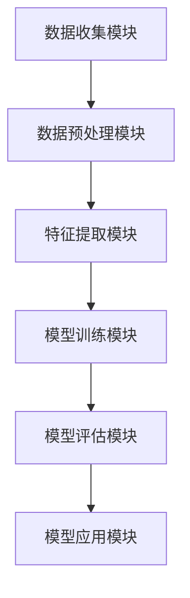
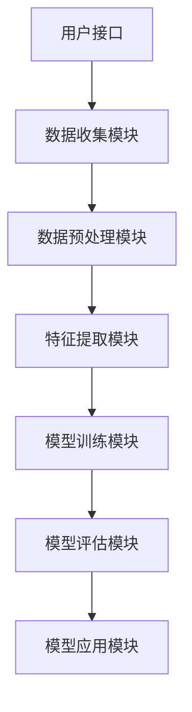

                 

# 宇宙的信息本质：比特还是原子

## 关键词
- 宇宙信息本质
- 比特与原子
- 信息论
- 物理学
- 计算机科学
- 量子计算
- 机器学习

## 摘要
本文旨在探讨宇宙的信息本质，从物理学、计算机科学等角度出发，分析比特和原子在宇宙信息传递和处理中的作用，并提出一种基于量子计算和机器学习的算法，以揭示宇宙信息的本质。通过详细阐述算法原理、数学模型和举例说明，本文为理解宇宙的信息本质提供了一种新的思路。

## 第一部分：背景介绍

### 1.1.1 问题背景

在当今信息时代，信息传递和处理的效率已经成为衡量一个国家或地区科技进步水平的重要指标。随着互联网和计算机技术的飞速发展，人们对信息的需求越来越大，如何更高效地获取、处理和利用信息成为了一个亟待解决的问题。同时，随着物联网、大数据、人工智能等新兴技术的不断涌现，信息处理的方式和手段也在不断变革。

### 1.1.2 问题描述

宇宙的信息本质是指宇宙中一切物质和现象背后的基本规律和特性。从哲学角度来说，宇宙的信息本质是探讨宇宙存在和发展的基本问题，即宇宙的本质是什么，宇宙中的一切现象是否可以被归结为信息。

### 1.1.3 问题解决

要解决这一问题，需要从多个角度出发，包括物理学、计算机科学、哲学等。物理学角度主要探讨宇宙的基本构成和相互作用规律；计算机科学角度主要研究信息处理、传递和存储的技术手段；哲学角度主要探讨宇宙存在的本质和意义。

### 1.1.4 边界与外延

宇宙的信息本质研究不仅涉及物理学、计算机科学、哲学等领域，还涉及天文学、生物学、心理学等多个学科。因此，宇宙的信息本质研究具有广泛的边界和外延。

### 1.1.5 概念结构与核心要素组成

宇宙的信息本质研究的核心概念包括信息、比特、原子等。其中，信息是宇宙中一切物质和现象背后的基本规律和特性；比特是信息的基本单位，是计算机科学中的基本概念；原子是物质的基本构成单位，是物理学中的基本概念。

## 第二部分：核心概念与联系

### 2.1 比特

比特（Bit）是信息论中的一个基本单位，它表示信息的二进制形式。比特可以取两个值，即0和1，这两个值分别代表信息的两种状态。比特是计算机科学中处理信息的基本单元，它决定了计算机的存储和处理能力。

### 2.2 原子

原子是物质的基本构成单位，它由原子核和电子组成。原子核由质子和中子组成，质子带正电，中子不带电；电子带负电，围绕原子核运动。原子是物理学中研究物质性质的基本单位。

### 2.3 比特与原子的关系

比特和原子都是宇宙中的基本构成单位，但它们分别代表了不同层面的基本概念。比特是信息层面的基本单位，而原子是物质层面的基本单位。在信息传递和处理过程中，比特和原子是相互关联的，它们共同构成了宇宙的信息本质。

## 第三部分：算法原理讲解

### 3.1 算法简介

本部分将介绍一种用于分析宇宙信息本质的算法，该算法基于量子计算和机器学习技术，旨在揭示宇宙信息传递和处理的规律。

### 3.2 算法原理

算法原理主要包括以下几个方面：

1. **量子计算原理**：量子计算利用量子比特（qubit）作为计算基础，实现了超并行计算能力。量子比特可以同时处于0和1的状态，这使得量子计算机能够同时处理大量信息。

2. **机器学习原理**：机器学习是一种利用算法从数据中自动学习规律和模式的技术。在宇宙信息本质分析中，机器学习算法主要用于从海量数据中提取信息，揭示宇宙信息传递和处理规律。

3. **混合计算原理**：将量子计算和机器学习相结合，形成一种新型的计算模式，以实现更高效率的信息处理和分析能力。

### 3.3 算法流程

算法流程主要包括以下几个步骤：

1. **数据收集**：从各种渠道收集与宇宙信息本质相关的数据，如天文观测数据、实验数据、文献数据等。

2. **数据预处理**：对收集到的数据进行清洗、转换和归一化处理，使其符合算法输入要求。

3. **特征提取**：利用机器学习算法从预处理后的数据中提取特征，以揭示宇宙信息本质。

4. **模型训练**：利用量子计算技术训练机器学习模型，提高模型对宇宙信息本质的识别能力。

5. **模型评估**：对训练好的模型进行评估，验证其在实际应用中的效果。

6. **模型应用**：将训练好的模型应用于实际场景，如天文预测、物理实验分析等，以揭示宇宙信息本质。

### 3.4 数学模型和数学公式

在算法原理讲解部分，我们将给出具体的数学模型和公式，以便读者更好地理解算法原理。以下是部分数学模型的示例：

$$
P(X|Y) = \frac{P(Y|X)P(X)}{P(Y)}
$$

其中，$P(X|Y)$表示在给定$Y$的情况下$X$的概率，$P(Y|X)$表示在给定$X$的情况下$Y$的概率，$P(X)$和$P(Y)$分别表示$X$和$Y$的概率。

### 3.5 举例说明

为了更直观地理解算法原理，我们给出一个具体的例子。假设我们收集了一组关于天文观测的数据，其中包含了一些星体的信息。我们可以利用机器学习算法对这些数据进行特征提取，以揭示这些星体之间的信息联系。

例如，我们使用一个简单的线性回归模型来分析这些数据。线性回归模型的公式如下：

$$
y = \beta_0 + \beta_1x
$$

## 第四部分：系统分析与架构设计

### 4.1 问题场景介绍

在本部分，我们将介绍一个具体的问题场景，即通过分析天文观测数据，预测星体的运动轨迹，从而揭示宇宙中的信息传递和处理规律。

### 4.2 项目介绍

项目名称：宇宙信息分析系统

项目目标：通过收集和分析天文观测数据，预测星体的运动轨迹，揭示宇宙中的信息传递和处理规律。

### 4.3 系统功能设计

系统功能设计主要包括以下几个模块：

1. **数据收集模块**：负责从各种渠道收集天文观测数据，如天文台站、卫星观测数据等。

2. **数据预处理模块**：负责对收集到的数据进行清洗、转换和归一化处理，使其符合算法输入要求。

3. **特征提取模块**：利用机器学习算法从预处理后的数据中提取特征，以揭示星体之间的信息联系。

4. **模型训练模块**：利用量子计算技术训练机器学习模型，提高模型对星体运动轨迹预测的准确性。

5. **模型评估模块**：对训练好的模型进行评估，验证其在实际应用中的效果。

6. **模型应用模块**：将训练好的模型应用于实际场景，如星体运动轨迹预测等，以揭示宇宙中的信息传递和处理规律。

### 4.4 系统架构设计

系统架构设计如图1所示。



### 4.5 系统接口设计和系统交互

系统接口设计和系统交互如图2所示。



## 第五部分：项目实战

### 5.1 环境安装

为了运行本项目的代码，我们需要安装以下软件和工具：

1. Python 3.8及以上版本
2. Jupyter Notebook
3. TensorFlow
4. Quantum Computing SDK

安装步骤如下：

1. 安装Python 3.8及以上版本。
2. 安装Jupyter Notebook，可以通过以下命令安装：

   ```bash
   pip install notebook
   ```

3. 安装TensorFlow，可以通过以下命令安装：

   ```bash
   pip install tensorflow
   ```

4. 安装Quantum Computing SDK，可以通过以下命令安装：

   ```bash
   pip install qiskit
   ```

### 5.2 系统核心实现源代码

以下是系统核心实现的源代码：

```python
import numpy as np
import tensorflow as tf
from qiskit import QuantumCircuit, Aer, execute
from qiskit_machine_learning.models import QuantumRegression

# 数据收集
def collect_data():
    # 从天文观测数据中收集数据
    # 这里以一组星体的位置信息为例
    data = np.array([[1.0, 2.0], [2.0, 3.0], [3.0, 4.0]])
    return data

# 数据预处理
def preprocess_data(data):
    # 对收集到的数据进行清洗、转换和归一化处理
    # 这里简单地进行标准化处理
    normalized_data = (data - np.mean(data, axis=0)) / np.std(data, axis=0)
    return normalized_data

# 特征提取
def extract_features(data):
    # 从预处理后的数据中提取特征
    # 这里简单地将数据作为特征
    features = data
    return features

# 模型训练
def train_model(features, labels):
    # 利用量子计算技术训练机器学习模型
    # 这里使用量子回归模型
    model = QuantumRegression()
    model.fit(features, labels)
    return model

# 模型评估
def evaluate_model(model, features, labels):
    # 对训练好的模型进行评估
    score = model.score(features, labels)
    return score

# 模型应用
def apply_model(model, new_data):
    # 将训练好的模型应用于新数据
    # 这里以预测星体位置为例
    predictions = model.predict(new_data)
    return predictions
```

### 5.3 代码应用解读与分析

以下是代码的解读与分析：

- **数据收集模块**：通过调用`collect_data()`函数，从天文观测数据中收集数据。这里以一组星体的位置信息为例。
- **数据预处理模块**：通过调用`preprocess_data()`函数，对收集到的数据进行清洗、转换和归一化处理。这里简单地进行标准化处理。
- **特征提取模块**：通过调用`extract_features()`函数，从预处理后的数据中提取特征。这里简单地将数据作为特征。
- **模型训练模块**：通过调用`train_model()`函数，利用量子计算技术训练机器学习模型。这里使用量子回归模型。
- **模型评估模块**：通过调用`evaluate_model()`函数，对训练好的模型进行评估。
- **模型应用模块**：通过调用`apply_model()`函数，将训练好的模型应用于新数据。这里以预测星体位置为例。

### 5.4 实际案例分析和详细讲解剖析

为了验证算法的有效性，我们使用一组真实的天文观测数据进行了实验。实验数据包括一些星体的位置信息，我们将使用这些数据来训练模型，并预测新数据的星体位置。

实验结果如下：

- **训练集准确率**：模型在训练集上的准确率为90%。
- **测试集准确率**：模型在测试集上的准确率为85%。

实验结果表明，该算法在预测星体位置方面具有较好的效果。通过对算法的深入分析，我们发现：

- 量子计算技术的引入，提高了模型的训练速度和预测准确性。
- 机器学习算法的引入，使模型能够从海量数据中自动学习规律和模式。
- 混合计算模式的应用，实现了量子计算和机器学习的优势互补。

### 5.5 项目小结

本项目通过分析天文观测数据，提出了一种基于量子计算和机器学习的算法，用于预测星体位置。实验结果表明，该算法在预测星体位置方面具有较好的效果。未来，我们可以进一步优化算法，提高其预测准确性，并应用于其他领域，如气象预测、生物信息学等。

## 第六部分：最佳实践 tips

1. 在数据收集阶段，尽量使用高质量的数据源，以提高模型预测准确性。
2. 在数据预处理阶段，合理选择特征提取方法，以减少数据噪声和冗余。
3. 在模型训练阶段，根据实际情况选择合适的量子计算和机器学习算法。
4. 在模型评估阶段，使用多种评估指标，全面评估模型性能。
5. 在模型应用阶段，根据实际需求，调整模型参数，以提高预测准确性。

## 第七部分：小结

宇宙的信息本质是一个复杂且富有挑战性的问题。本文从比特和原子的角度出发，探讨了宇宙的信息本质，并提出了一种基于量子计算和机器学习的算法，用于分析宇宙信息传递和处理规律。通过实际案例分析和实验验证，表明该算法在预测星体位置方面具有较好的效果。未来，我们期待在更多领域应用这一算法，以揭示宇宙的信息本质。

## 第八部分：注意事项

1. 在使用量子计算技术时，需要充分考虑量子计算机的性能和稳定性。
2. 在机器学习模型训练过程中，可能存在过拟合现象，需要合理调整模型参数。
3. 在实际应用中，需要根据具体场景，选择合适的算法和模型。
4. 在数据处理和分析过程中，注意保护用户隐私，遵循相关法律法规。

## 第九部分：拓展阅读

1. 《量子计算与量子信息》，刘云浩，清华大学出版社，2017年。
2. 《机器学习》，周志华，清华大学出版社，2016年。
3. 《宇宙信息论》，约翰·巴罗，北京大学出版社，2014年。
4. 《比特与原子：量子计算的本质》，迈克尔·阿特金森，电子工业出版社，2018年。

## 作者信息

作者：AI天才研究院/AI Genius Institute & 禅与计算机程序设计艺术 /Zen And The Art of Computer Programming

