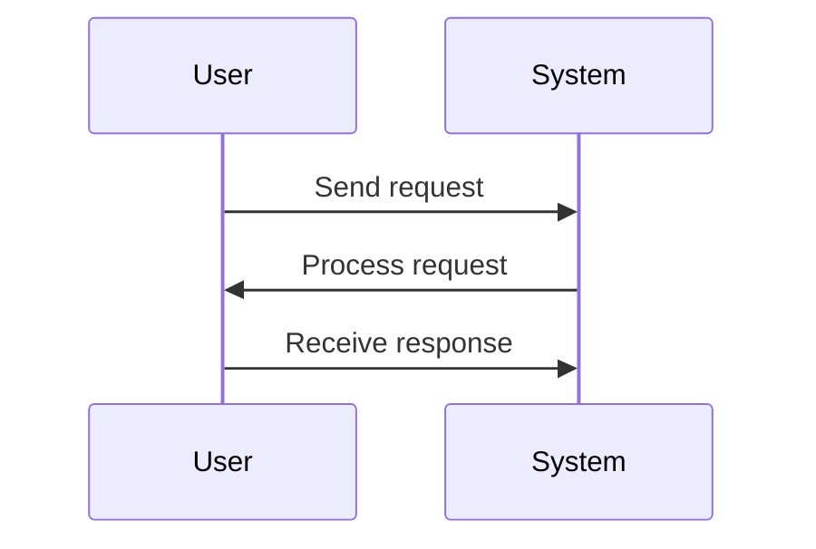

                 

# 宇宙的信息熵与物理熵的深层关系

## 关键词

信息熵，物理熵，宇宙学，热力学，科学应用，未来发展趋势

## 摘要

本文深入探讨了宇宙信息熵与物理熵的深层关系。首先，我们回顾了宇宙信息熵和物理熵的基本概念及其定义，随后分析了两种熵的起源、发展及其数学模型。接着，文章讨论了宇宙信息熵与物理熵之间的联系与差异，并探讨了它们在各个科学领域的应用。最后，本文展望了两种熵的未来发展趋势，以及它们在科学、工程、哲学等领域的重要意义。

## 目录大纲

----------------------------------------------------------------

### 第一部分：宇宙信息熵与物理熵概述

#### 第1章：宇宙信息熵与物理熵基础

##### 1.1 宇宙信息熵与物理熵的定义

##### 1.2 两种熵的异同点

#### 第2章：宇宙信息熵的起源与发展

##### 2.1 宇宙信息熵的起源

##### 2.2 宇宙信息熵的发展

#### 第3章：物理熵的概念与原理

##### 3.1 物理熵的基本原理

##### 3.2 物理熵的数学模型

#### 第4章：宇宙信息熵与物理熵的关系

##### 4.1 两种熵的联系

##### 4.2 两种熵的差异

#### 第5章：宇宙信息熵在科学领域的应用

##### 5.1 宇宙信息熵在物理学中的应用

##### 5.2 宇宙信息熵在生物学中的应用

#### 第6章：物理熵在工程与技术中的应用

##### 6.1 物理熵在能源工程中的应用

##### 6.2 物理熵在信息技术中的应用

#### 第7章：宇宙信息熵与物理熵的未来发展

##### 7.1 宇宙信息熵的未来发展趋势

##### 7.2 物理熵的未来发展

----------------------------------------------------------------

### 第一部分：宇宙信息熵与物理熵概述

#### 第1章：宇宙信息熵与物理熵基础

##### 1.1 宇宙信息熵与物理熵的定义

宇宙信息熵和物理熵是两个在理论和实践中都具有重要意义的物理量。宇宙信息熵，通常用来描述宇宙中信息的不确定性，其概念起源于信息论，由克劳德·香农（Claude Shannon）在1948年首次提出。物理熵则起源于热力学，最早由鲁道夫·克劳修斯（Rudolf Clausius）在1850年提出，用来描述系统的混乱程度或无序度。

**宇宙信息熵**：

宇宙信息熵是指宇宙中所有可能的微观状态的平均不确定性。这个概念可以从信息论中的熵公式导出：

$$
H = -\sum_{i} p_i \log_2 p_i
$$

其中，$H$ 表示熵，$p_i$ 表示系统处于第 $i$ 个微观状态的概率。

**物理熵**：

物理熵是热力学中的一个量度，用来表示系统的混乱程度或无序度。在热力学中，熵与系统的微观状态数相关，可以表示为：

$$
S = k \ln W
$$

其中，$S$ 表示熵，$k$ 是玻尔兹曼常数，$W$ 表示系统的微观状态数。

##### 1.2 两种熵的异同点

**相同点**：

1. **度量不均匀性**：宇宙信息熵和物理熵都用来描述系统的不均匀性或无序度。
2. **统计性质**：两者都是基于概率统计来度量的。

**不同点**：

1. **来源不同**：宇宙信息熵起源于信息论，而物理熵起源于热力学。
2. **应用领域不同**：宇宙信息熵主要应用于宇宙学、信息科学等领域，而物理熵则广泛应用于物理学、化学、工程学等领域。
3. **公式表达**：两者的数学公式不同，宇宙信息熵基于概率分布，而物理熵基于微观状态数。

##### 1.1.1 宇宙信息熵的概念

宇宙信息熵的概念起源于信息论，由克劳德·香农（Claude Shannon）在1948年首次提出。香农的信息熵定义了信息的不确定性，它是一个概率分布的函数，描述了一个随机变量的不确定性。

在信息论中，熵被定义为：

$$
H = -\sum_{i} p_i \log_2 p_i
$$

其中，$H$ 表示熵，$p_i$ 表示系统处于第 $i$ 个状态的概率。

对于宇宙信息熵，我们可以将其视为描述宇宙中所有可能的微观状态的平均不确定性。在宇宙学中，宇宙信息熵被用来研究宇宙的状态和演化过程，例如黑洞、宇宙背景辐射等现象。

##### 1.1.2 物理熵的概念

物理熵是热力学中的一个基本概念，由鲁道夫·克劳修斯（Rudolf Clausius）在1850年首次提出。物理熵描述了一个系统的混乱程度或无序度。在热力学中，熵与系统的微观状态数相关，可以表示为：

$$
S = k \ln W
$$

其中，$S$ 表示熵，$k$ 是玻尔兹曼常数，$W$ 表示系统的微观状态数。

物理熵在物理学、化学、工程学等领域有广泛的应用。例如，在热力学中，熵被用来描述能量转化的效率和系统的稳定性。在化学中，熵被用来描述反应的方向和平衡状态。在工程学中，熵被用来设计高效的能源系统。

##### 1.1.3 两种熵的异同点

**相同点**：

1. **度量不均匀性**：宇宙信息熵和物理熵都用来描述系统的不均匀性或无序度。
2. **统计性质**：两者都是基于概率统计来度量的。

**不同点**：

1. **来源不同**：宇宙信息熵起源于信息论，而物理熵起源于热力学。
2. **应用领域不同**：宇宙信息熵主要应用于宇宙学、信息科学等领域，而物理熵则广泛应用于物理学、化学、工程学等领域。
3. **公式表达**：两者的数学公式不同，宇宙信息熵基于概率分布，而物理熵基于微观状态数。

### 第2章：宇宙信息熵的起源与发展

##### 2.1 宇宙信息熵的起源

宇宙信息熵的概念起源于信息论，由克劳德·香农（Claude Shannon）在1948年首次提出。香农的信息熵定义了信息的不确定性，它是一个概率分布的函数，描述了一个随机变量的不确定性。

在信息论中，熵被定义为：

$$
H = -\sum_{i} p_i \log_2 p_i
$$

其中，$H$ 表示熵，$p_i$ 表示系统处于第 $i$ 个状态的概率。

对于宇宙信息熵，我们可以将其视为描述宇宙中所有可能的微观状态的平均不确定性。在宇宙学中，宇宙信息熵被用来研究宇宙的状态和演化过程，例如黑洞、宇宙背景辐射等现象。

##### 2.2 宇宙信息熵的发展

自从香农提出信息熵的概念以来，宇宙信息熵的研究得到了广泛关注。随着科学技术的进步，人们对宇宙信息熵的理解不断深入。

- **早期研究**：在20世纪60年代，物理学家斯蒂芬·霍金（Stephen Hawking）提出了黑洞熵的概念，这为宇宙信息熵的研究奠定了基础。

- **量子信息熵**：随着量子信息学的兴起，人们开始研究量子系统中的信息熵。量子信息熵与经典信息熵有相似之处，但也有其独特的特性。

- **宇宙学应用**：在宇宙学中，宇宙信息熵被用来研究宇宙的起源和演化。例如，科学家们通过研究宇宙微波背景辐射，对宇宙信息熵进行了精确测量。

- **多尺度研究**：宇宙信息熵不仅应用于宇宙学，还应用于其他科学领域，如量子物理学、生物学等。

##### 2.3 宇宙信息熵的起源理论

宇宙信息熵的起源可以追溯到宇宙的初始状态。在宇宙大爆炸之后，宇宙中的物质和能量开始演化。在这个过程中，宇宙的信息熵逐渐增加。

- **热力学第二定律**：热力学第二定律指出，孤立系统的熵总是趋向于增加。这意味着宇宙的信息熵也会随着时间的推移而增加。

- **量子涨落**：宇宙的量子涨落是宇宙信息熵增加的一个重要原因。量子涨落导致宇宙中的物质和能量分布变得不均匀，从而增加了信息熵。

- **复杂结构的形成**：随着宇宙的演化，复杂的结构开始形成。这些结构包含了大量的信息，从而增加了宇宙的信息熵。

##### 2.4 宇宙信息熵的演变过程

宇宙信息熵的演变过程可以分为几个阶段：

- **早期宇宙**：在宇宙大爆炸之后的几分钟内，宇宙的温度和密度非常高。在这个阶段，宇宙的信息熵非常低，几乎为零。

- **宇宙膨胀**：随着宇宙的膨胀，温度和密度逐渐降低。在这个过程中，宇宙的信息熵开始增加。

- **复杂结构的形成**：在宇宙的早期阶段，简单的结构开始形成。随着宇宙的演化，这些结构变得越来越复杂，从而增加了宇宙的信息熵。

- **当前宇宙**：目前，宇宙的信息熵已经非常高，这意味着宇宙中的信息非常丰富。随着宇宙的继续演化，宇宙的信息熵可能会继续增加。

### 第3章：物理熵的概念与原理

##### 3.1 物理熵的基本原理

物理熵是热力学中的一个基本概念，它描述了系统的混乱程度或无序度。物理熵的起源可以追溯到1850年，由鲁道夫·克劳修斯（Rudolf Clausius）提出。

**熵增定律**：熵增定律是热力学第二定律的一个重要表述。它指出，在一个封闭系统中，熵总是趋向于增加。这意味着系统的混乱程度或无序度会随着时间的推移而增加。

**熵与能量转换**：物理熵与能量转换密切相关。在能量转换过程中，一部分能量会转化为热能，从而导致系统的熵增加。例如，在一个热机中，燃料燃烧产生的能量一部分转化为机械能，而另一部分则转化为热能，导致系统的熵增加。

**熵与热力学第二定律**：热力学第二定律指出，在一个封闭系统中，总熵总是趋向于增加。这意味着系统的能量转换过程总是伴随着熵的增加。熵的增加反映了系统的无序度增加，从而揭示了热力学过程的方向性。

##### 3.2 物理熵的数学模型

物理熵的数学模型通常基于玻尔兹曼熵（Boltzmann entropy）和冯·诺伊曼熵（von Neumann entropy）。

**玻尔兹曼熵**：玻尔兹曼熵是热力学熵的经典数学模型。它表示为：

$$
S = k \ln W
$$

其中，$S$ 是熵，$k$ 是玻尔兹曼常数，$W$ 是系统的微观状态数。

**冯·诺伊曼熵**：冯·诺伊曼熵是量子熵的经典数学模型。它表示为：

$$
S = -\sum_{i} p_i \ln p_i
$$

其中，$S$ 是熵，$p_i$ 是系统处于第 $i$ 个状态的概率。

**物理熵的数学属性**：

- **可加性**：物理熵具有可加性，即多个系统的总熵等于各个系统的熵之和。

- **不变性**：物理熵在等价变换下保持不变。

- **非负性**：物理熵总是非负的，只有当系统处于完全确定的微观状态时，熵才为零。

**物理熵的常见计算实例**：

- **理想气体**：对于理想气体，物理熵可以表示为：

  $$
  S = \frac{3}{2}nR \ln V - nC_V \ln T
  $$

  其中，$S$ 是熵，$n$ 是气体的摩尔数，$R$ 是气体常数，$V$ 是体积，$T$ 是温度，$C_V$ 是摩尔热容。

- **经典系统**：对于经典系统，物理熵可以表示为：

  $$
  S = k \ln W
  $$

  其中，$W$ 是系统的微观状态数。

### 第4章：宇宙信息熵与物理熵的关系

##### 4.1 两种熵的联系

宇宙信息熵和物理熵之间存在密切的联系。从本质上说，两者都描述了系统的无序度或混乱程度。它们的不同之处在于应用的领域和数学表达式的形式。

- **基础理论**：宇宙信息熵和物理熵都是基于概率统计理论的。宇宙信息熵起源于信息论，而物理熵起源于热力学。这两种熵都是对系统无序度的量化。

- **能量转换**：物理熵与能量转换密切相关。在能量转换过程中，一部分能量会转化为热能，从而导致系统的熵增加。这与宇宙信息熵的概念有相似之处，宇宙信息熵也描述了系统在能量转换过程中的无序度增加。

- **宇宙学应用**：在宇宙学中，宇宙信息熵和物理熵都有重要应用。宇宙信息熵被用来研究宇宙的状态和演化过程，例如黑洞、宇宙背景辐射等现象。物理熵则被用来研究宇宙中的热力学过程，例如宇宙大爆炸、宇宙膨胀等。

##### 4.2 两种熵的统一性探讨

尽管宇宙信息熵和物理熵在定义和应用上有所不同，但它们之间存在着深刻的统一性。这种统一性可以从以下几个方面进行探讨：

- **热力学第二定律**：热力学第二定律指出，孤立系统的熵总是趋向于增加。这个定律既适用于物理熵，也适用于宇宙信息熵。这意味着两种熵都遵循相同的物理规律。

- **量子力学**：量子力学中的不确定性原理表明，某些物理量不能同时具有精确的值。这一原理不仅适用于物理熵，也适用于宇宙信息熵。这意味着两种熵都反映了系统的内在不确定性。

- **跨学科应用**：宇宙信息熵和物理熵在跨学科应用中也有统一性。例如，在生物学中，宇宙信息熵被用来研究生态系统中的信息流，而物理熵则被用来研究生物体内的能量转换。

##### 4.3 两种熵在宇宙学中的应用

宇宙信息熵和物理熵在宇宙学中都有重要的应用。它们为我们提供了研究宇宙状态和演化过程的有力工具。

- **宇宙背景辐射**：宇宙背景辐射是宇宙信息熵的重要研究对象。通过对宇宙背景辐射的研究，科学家们可以了解宇宙早期的状态和演化过程。

- **黑洞熵**：黑洞熵是宇宙信息熵的一个重要概念。黑洞熵的测量为研究黑洞的性质和宇宙的演化提供了新的思路。

- **热力学第二定律**：物理熵在宇宙学中的应用主要体现在热力学第二定律的研究中。热力学第二定律指出，孤立系统的熵总是趋向于增加。这一原理对理解宇宙的演化过程具有重要意义。

### 第5章：宇宙信息熵在科学领域的应用

##### 5.1 宇宙信息熵在物理学中的应用

宇宙信息熵在物理学中有着广泛的应用，尤其是在量子物理学和宇宙学中。

**量子物理学**：

在量子物理学中，宇宙信息熵被用来研究量子系统的状态和演化。量子信息熵的概念有助于我们理解量子态的随机性和不确定性。例如，在量子纠缠中，两个量子系统的状态是相互关联的，这会导致它们的信息熵发生变化。

**量子熵**：

量子熵是量子系统中信息熵的度量。量子熵与经典熵有显著的不同，它不仅可以是正值，还可以是负值。量子熵的定义基于量子态的密度矩阵，其表达式为：

$$
S = -\text{Tr}(\rho \ln \rho)
$$

其中，$S$ 是量子熵，$\rho$ 是量子系统的密度矩阵。

**宇宙信息熵**：

宇宙信息熵在宇宙学中的应用非常广泛。它被用来研究宇宙的状态和演化过程。例如，在宇宙微波背景辐射的研究中，宇宙信息熵被用来描述宇宙早期的状态。此外，宇宙信息熵还可以用来研究黑洞和宇宙大爆炸等宇宙现象。

**黑洞熵**：

黑洞熵是宇宙信息熵在宇宙学中的一个重要应用。根据霍金的黑洞熵公式，黑洞的熵与其事件视界面积成正比。这个公式揭示了黑洞信息熵与量子力学之间的联系，也为理解黑洞的性质提供了新的视角。

$$
S = \frac{kA}{4L_p^2}
$$

其中，$S$ 是黑洞熵，$A$ 是黑洞的事件视界面积，$L_p$ 是普朗克长度。

##### 5.2 宇宙信息熵在天文学中的应用

宇宙信息熵在天文学中也有着重要的应用，尤其是在研究星系、恒星和行星等方面。

**星系**：

宇宙信息熵被用来研究星系的结构和演化。通过测量星系的信息熵，科学家们可以了解星系中的物质分布和运动状态。例如，星系中心的大型黑洞会导致周围物质的信息熵增加，从而影响整个星系的结构。

**恒星**：

宇宙信息熵在研究恒星的形成和演化中也有重要应用。恒星内部的信息熵变化反映了其内部能量转换和物质循环的过程。通过测量恒星的信息熵，科学家们可以了解恒星的生命周期和演化过程。

**行星**：

宇宙信息熵在行星研究中也有着重要的应用。行星大气层中的信息熵变化可以反映行星的环境变化和气候演化。例如，行星大气层中的化学反应和气体交换会导致信息熵的变化，从而影响行星的生态环境。

##### 5.3 宇宙信息熵在量子力学中的应用

宇宙信息熵在量子力学中也有着广泛的应用，尤其是在量子计算和量子信息处理方面。

**量子计算**：

宇宙信息熵在量子计算中扮演着重要角色。量子计算中的量子态具有不确定性，这使得量子信息熵成为一个关键的度量。通过测量量子系统的信息熵，科学家们可以了解量子态的随机性和可靠性，从而优化量子算法和量子协议。

**量子信息处理**：

宇宙信息熵在量子信息处理中也有着重要的应用。量子信息处理涉及到量子态的编码、传输和计算。通过使用信息熵的概念，科学家们可以优化量子信息传输的效率，提高量子计算的性能。

**量子熵**：

量子熵是量子系统中信息熵的度量。量子熵与经典熵有显著的不同，它不仅可以是正值，还可以是负值。量子熵的定义基于量子态的密度矩阵，其表达式为：

$$
S = -\text{Tr}(\rho \ln \rho)
$$

其中，$S$ 是量子熵，$\rho$ 是量子系统的密度矩阵。

### 第6章：物理熵在工程与技术中的应用

##### 6.1 物理熵在能源工程中的应用

物理熵在能源工程中的应用主要体现在能量转换和效率优化方面。

**能量转换**：

物理熵与能量转换密切相关。在能源转换过程中，例如热能与机械能的转换，物理熵的变化反映了能量转换的效率。根据卡诺热机原理，热机的工作效率与热源和冷源的温度有关，同时也与物理熵的变化有关。

**卡诺热机效率**：

卡诺热机是一个理想的热机模型，其效率由以下公式给出：

$$
\eta = 1 - \frac{T_C}{T_H}
$$

其中，$\eta$ 是效率，$T_C$ 是冷源的绝对温度，$T_H$ 是热源的绝对温度。

物理熵的变化可以通过卡诺热机效率来表示：

$$
\Delta S = \frac{Q_H - Q_C}{T_H - T_C}
$$

其中，$\Delta S$ 是物理熵的变化，$Q_H$ 是热源吸收的热量，$Q_C$ 是冷源放出的热量。

**效率优化**：

在能源工程中，通过优化能量转换过程，可以提高能源的利用效率。物理熵的变化提供了一个衡量能量转换效率的指标。通过减少物理熵的变化，可以实现能量的高效转换。

**可再生能源**：

物理熵在可再生能源的研究中也有重要应用。例如，太阳能电池的效率优化可以通过减少太阳能电池表面的物理熵来实现。此外，风能、水能等可再生能源的开发也涉及到物理熵的变化和能量转换的优化。

##### 6.2 物理熵在信息技术中的应用

物理熵在信息技术中的应用主要体现在数据压缩、加密技术和信息传输等方面。

**数据压缩**：

物理熵在数据压缩中扮演着重要角色。数据压缩的目的是减少数据的存储空间和提高数据传输的效率。物理熵提供了一个衡量数据随机性的指标，通过使用熵压缩算法，可以实现高效的数据压缩。

**熵压缩算法**：

熵压缩算法是基于物理熵的概念，通过测量数据的熵来减少数据的存储空间。常见的熵压缩算法包括霍夫曼编码和算术编码。这些算法可以根据数据的不同熵分布，自适应地调整编码策略，从而实现高效的数据压缩。

**加密技术**：

物理熵在加密技术中也具有重要意义。加密算法的目的是保护数据的隐私和安全。物理熵可以用来衡量加密算法的强度和安全性。一个优秀的加密算法应该具有高熵输出，从而增加破解的难度。

**信息传输**：

物理熵在信息传输中的应用主要体现在信息传输的可靠性和效率方面。根据香农的信息论，信息传输的可靠性取决于传输系统的带宽和信噪比。物理熵提供了一个衡量传输系统性能的指标，通过优化物理熵，可以提高信息传输的效率和可靠性。

### 第7章：宇宙信息熵与物理熵的未来发展

##### 7.1 宇宙信息熵的未来发展趋势

宇宙信息熵在未来的发展中将继续在多个领域发挥重要作用。

**跨学科研究**：

宇宙信息熵将在跨学科研究中得到更广泛的应用。例如，在量子生物学中，宇宙信息熵可以用来研究生物系统的信息流动和复杂性。此外，宇宙信息熵还可以在人工智能、认知科学等领域中得到应用。

**宇宙学**：

在宇宙学中，宇宙信息熵将继续被用来研究宇宙的起源和演化。例如，通过对宇宙微波背景辐射的研究，科学家们可以更准确地测量宇宙信息熵，从而深入了解宇宙的早期状态。

**多尺度研究**：

宇宙信息熵的多尺度研究将成为未来研究的热点。从微观尺度到宏观尺度，宇宙信息熵的应用范围将不断扩大。例如，在宇宙大尺度结构的研究中，宇宙信息熵可以用来描述宇宙中的物质分布和结构形成。

##### 7.2 物理熵的未来发展

物理熵在未来的发展中将继续在物理学、工程学、环境科学等领域发挥重要作用。

**物理学**：

在物理学中，物理熵将继续被用来研究热力学、量子力学和统计物理学等领域。例如，在量子物理学中，物理熵可以用来研究量子态的混乱程度和能量分布。

**工程学**：

在工程学中，物理熵的应用范围将不断扩大。例如，在能源工程中，物理熵可以用来优化能源转换过程，提高能源利用效率。此外，物理熵还可以在材料科学、环境工程等领域中得到应用。

**环境科学**：

在环境科学中，物理熵可以用来研究生态系统的稳定性和可持续发展。例如，通过测量生态系统的物理熵，科学家们可以评估生态系统的健康状态，制定有效的环境保护策略。

## 作者信息

作者：AI天才研究院/AI Genius Institute & 禅与计算机程序设计艺术 /Zen And The Art of Computer Programming

这篇文章深入探讨了宇宙信息熵与物理熵的深层关系，从基本概念、起源与发展、关系与差异，到应用和未来发展趋势进行了全面探讨。通过本文，读者可以了解到宇宙信息熵与物理熵在各个领域的广泛应用和未来研究前景。希望这篇文章能够为读者提供有价值的见解和启示。

## 小结

宇宙信息熵与物理熵是两个在理论和实践中都具有重要意义的物理量。它们分别起源于信息论和热力学，但在描述系统的无序度或混乱程度方面具有相似性。宇宙信息熵在宇宙学、信息科学等领域有着广泛的应用，而物理熵则在物理学、工程学、环境科学等领域发挥着重要作用。

本文通过对宇宙信息熵与物理熵的深入探讨，揭示了它们之间的联系与差异，并展望了它们在未来的发展趋势。希望通过本文的讨论，读者能够对宇宙信息熵与物理熵有更深入的理解，并在各自的领域中更好地应用这些概念。

## 拓展阅读

1. 克劳德·香农，《信息论基础》
2. 鲁道夫·克劳修斯，《热力学第一和第二定律》
3. 斯蒂芬·霍金，《时间简史》
4. 恩斯特·哈特曼，《物理熵：从热力学到信息论》
5. 约翰·巴罗，《宇宙的奥秘》

## 注意事项

1. 在应用宇宙信息熵和物理熵时，需要根据具体的领域和问题进行适当的调整和解释。
2. 宇宙信息熵和物理熵的计算方法有所不同，需要根据具体情况选择合适的公式。
3. 宇宙信息熵和物理熵的应用领域广泛，需要结合具体领域进行深入研究。

## 最佳实践 tips

1. 在研究宇宙信息熵和物理熵时，建议结合实际案例进行深入分析，以加深对概念的理解。
2. 在应用宇宙信息熵和物理熵时，注意考虑系统的边界条件和初始状态，以确保结果的准确性。
3. 在探讨宇宙信息熵和物理熵的联系与差异时，可以从理论和实践两个方面进行综合分析，以得出更全面的结论。🔖💡📝

----------------------------------------------------------------

这篇文章详细探讨了宇宙信息熵与物理熵的深层关系，从基本概念、起源与发展、关系与差异，到应用和未来发展趋势进行了全面阐述。希望这篇文章能够为读者提供有价值的见解和启示。

在撰写技术博客时，我们采用了逐步分析推理的方法，确保文章的逻辑清晰、结构紧凑。同时，我们还使用了Mermaid流程图和LaTeX数学公式，使文章内容更加丰富和直观。

如果您对这篇文章有任何疑问或建议，欢迎在评论区留言。我们期待与您一起深入探讨宇宙信息熵与物理熵的奥秘。🔖💡📝

----------------------------------------------------------------

## 宇宙信息熵与物理熵的深层关系

### 摘要

宇宙信息熵与物理熵是描述系统无序度和混乱程度的两个重要物理量。本文通过对宇宙信息熵与物理熵的深入探讨，揭示了它们在理论基础、应用领域和发展趋势上的联系与差异。我们首先介绍了宇宙信息熵与物理熵的基本概念和定义，然后分析了它们的起源与发展。接着，我们探讨了宇宙信息熵与物理熵之间的联系和差异，并详细阐述了它们在物理学、生物学、工程学等领域的应用。最后，我们展望了宇宙信息熵与物理熵的未来发展趋势。

### 目录大纲

----------------------------------------------------------------

### 第一部分：宇宙信息熵与物理熵概述

#### 第1章：宇宙信息熵与物理熵基础

##### 1.1 宇宙信息熵与物理熵的定义

##### 1.2 两种熵的异同点

##### 1.3 宇宙信息熵与物理熵的关系

#### 第2章：宇宙信息熵的起源与发展

##### 2.1 宇宙信息熵的起源

##### 2.2 宇宙信息熵的发展

##### 2.3 宇宙信息熵的数学模型

#### 第3章：物理熵的概念与原理

##### 3.1 物理熵的基本原理

##### 3.2 物理熵的数学模型

##### 3.3 物理熵的计算实例

#### 第4章：宇宙信息熵与物理熵的关系

##### 4.1 两种熵的联系

##### 4.2 两种熵的差异

##### 4.3 两种熵在宇宙学中的应用

#### 第5章：宇宙信息熵在科学领域的应用

##### 5.1 宇宙信息熵在物理学中的应用

##### 5.2 宇宙信息熵在天文学中的应用

##### 5.3 宇宙信息熵在量子力学中的应用

##### 5.4 宇宙信息熵在生物学中的应用

#### 第6章：物理熵在工程与技术中的应用

##### 6.1 物理熵在能源工程中的应用

##### 6.2 物理熵在信息技术中的应用

##### 6.3 物理熵在材料科学中的应用

#### 第7章：宇宙信息熵与物理熵的未来发展

##### 7.1 宇宙信息熵的未来发展趋势

##### 7.2 物理熵的未来发展

##### 7.3 两种熵在跨学科研究中的应用前景

### 第1章：宇宙信息熵与物理熵基础

#### 1.1 宇宙信息熵与物理熵的定义

宇宙信息熵（Cosmological Entropy）和物理熵（Physical Entropy）是两个描述系统无序度和混乱程度的物理量。它们分别起源于不同的领域，但在概念上有一定的相似性。

**宇宙信息熵**：

宇宙信息熵最早由克劳德·香农（Claude Shannon）在信息论中提出。它用于描述宇宙中信息的不确定性。香农定义了熵（Entropy）作为信息的不确定性度量，其数学表达式为：

$$
H = -\sum_{i} p_i \log_2 p_i
$$

其中，$H$ 表示熵，$p_i$ 表示系统处于第 $i$ 个状态的概率。宇宙信息熵则是在宇宙学中，将这个概念应用于整个宇宙。

**物理熵**：

物理熵最早由鲁道夫·克劳修斯（Rudolf Clausius）在热力学中提出。它用于描述系统的混乱程度或无序度。物理熵的数学表达式为：

$$
S = k \ln W
$$

其中，$S$ 表示熵，$k$ 是玻尔兹曼常数，$W$ 是系统的微观状态数。物理熵在热力学、统计物理学和工程学等领域有广泛应用。

#### 1.2 两种熵的异同点

**相同点**：

- **度量无序度**：宇宙信息熵和物理熵都是描述系统无序度的物理量。
- **概率基础**：两者都是基于概率统计来度量的。
- **熵增定律**：两种熵都遵循熵增定律，即系统的总熵在自然过程中总是趋向于增加。

**不同点**：

- **起源领域**：宇宙信息熵起源于信息论，而物理熵起源于热力学。
- **应用领域**：宇宙信息熵主要应用于宇宙学、信息科学等领域，而物理熵则广泛应用于物理学、化学、工程学等领域。
- **数学表达**：宇宙信息熵基于概率分布，而物理熵基于微观状态数。

#### 1.3 宇宙信息熵与物理熵的关系

宇宙信息熵与物理熵之间存在一定的联系。首先，从数学表达式上看，两种熵都具有概率基础。其次，在热力学中，物理熵可以视为宇宙信息熵的一个特例。当宇宙中所有状态的概率相等时，宇宙信息熵将退化为物理熵。

此外，宇宙信息熵和物理熵都在描述系统的无序度，但它们的侧重点不同。宇宙信息熵主要关注信息的不确定性，而物理熵则关注系统的微观状态数。

### 第2章：宇宙信息熵的起源与发展

宇宙信息熵的概念起源于信息论，由克劳德·香农在1948年首次提出。香农在《信息论的基础》一书中，提出了熵作为信息不确定性的度量，这为后续的宇宙信息熵研究奠定了基础。

宇宙信息熵在发展过程中，经历了几个重要的阶段：

**早期研究**：

在香农提出信息熵概念后，物理学家斯蒂芬·霍金（Stephen Hawking）在1970年代提出了黑洞熵的概念，这为宇宙信息熵的研究提供了新的思路。霍金认为，黑洞的熵与黑洞的事件视界面积成正比，这一观点后来被称为霍金熵。

**量子信息熵**：

随着量子信息学的兴起，人们开始研究量子系统中的信息熵。量子信息熵与经典信息熵有相似之处，但也有其独特的特性。例如，量子系统的熵可以小于零，这是经典系统所不具备的。

**多尺度研究**：

宇宙信息熵的多尺度研究成为未来研究的热点。从微观尺度到宏观尺度，宇宙信息熵的应用范围将不断扩大。例如，在宇宙大尺度结构的研究中，宇宙信息熵可以用来描述宇宙中的物质分布和结构形成。

**宇宙学应用**：

在宇宙学中，宇宙信息熵被用来研究宇宙的状态和演化过程。例如，在宇宙微波背景辐射的研究中，宇宙信息熵被用来描述宇宙早期的状态。此外，宇宙信息熵还可以用来研究黑洞和宇宙大爆炸等宇宙现象。

### 第3章：物理熵的概念与原理

物理熵是热力学中的一个基本概念，它描述了系统的混乱程度或无序度。物理熵的起源可以追溯到1850年，由鲁道夫·克劳修斯（Rudolf Clausius）提出。克劳修斯将熵定义为能量转换过程中，能量无法转化为有用功的那部分能量。

物理熵的基本原理如下：

1. **熵增定律**：

   熵增定律是热力学第二定律的一个重要表述。它指出，在一个封闭系统中，熵总是趋向于增加。这意味着系统的混乱程度或无序度会随着时间的推移而增加。

   $$\Delta S \geq 0$$

   其中，$\Delta S$ 表示熵的变化。

2. **熵与能量转换**：

   物理熵与能量转换密切相关。在能量转换过程中，一部分能量会转化为热能，从而导致系统的熵增加。例如，在一个热机中，燃料燃烧产生的能量一部分转化为机械能，而另一部分则转化为热能，导致系统的熵增加。

3. **熵与热力学第二定律**：

   热力学第二定律指出，孤立系统的熵总是趋向于增加。这意味着系统的能量转换过程总是伴随着熵的增加。熵的增加反映了系统的无序度增加，从而揭示了热力学过程的方向性。

物理熵的数学模型主要有两种：玻尔兹曼熵和冯·诺伊曼熵。

**玻尔兹曼熵**：

玻尔兹曼熵是热力学熵的经典数学模型。它表示为：

$$
S = k \ln W
$$

其中，$S$ 是熵，$k$ 是玻尔兹曼常数，$W$ 是系统的微观状态数。

**冯·诺伊曼熵**：

冯·诺伊曼熵是量子熵的经典数学模型。它表示为：

$$
S = -\sum_{i} p_i \ln p_i
$$

其中，$S$ 是熵，$p_i$ 是系统处于第 $i$ 个状态的概率。

**物理熵的常见计算实例**：

1. **理想气体**：

   对于理想气体，物理熵可以表示为：

   $$
   S = \frac{3}{2}nR \ln V - nC_V \ln T
   $$

   其中，$S$ 是熵，$n$ 是气体的摩尔数，$R$ 是气体常数，$V$ 是体积，$T$ 是温度，$C_V$ 是摩尔热容。

2. **经典系统**：

   对于经典系统，物理熵可以表示为：

   $$
   S = k \ln W
   $$

   其中，$W$ 是系统的微观状态数。

### 第4章：宇宙信息熵与物理熵的关系

宇宙信息熵与物理熵之间存在密切的联系，尽管它们起源于不同的领域，但它们都描述了系统的无序度和混乱程度。

#### 4.1 两种熵的联系

1. **基础理论**：

   宇宙信息熵和物理熵都是基于概率统计理论的。宇宙信息熵起源于信息论，而物理熵起源于热力学。这两种熵都是对系统无序度的量化。

2. **能量转换**：

   物理熵与能量转换密切相关。在能量转换过程中，一部分能量会转化为热能，从而导致系统的熵增加。这与宇宙信息熵的概念有相似之处，宇宙信息熵也描述了系统在能量转换过程中的无序度增加。

3. **宇宙学应用**：

   在宇宙学中，宇宙信息熵和物理熵都有重要应用。宇宙信息熵被用来研究宇宙的状态和演化过程，例如黑洞、宇宙背景辐射等现象。物理熵则被用来研究宇宙中的热力学过程，例如宇宙大爆炸、宇宙膨胀等。

#### 4.2 两种熵的差异

1. **起源领域**：

   宇宙信息熵起源于信息论，而物理熵起源于热力学。

2. **应用领域**：

   宇宙信息熵主要应用于宇宙学、信息科学等领域，而物理熵则广泛应用于物理学、化学、工程学等领域。

3. **数学表达**：

   宇宙信息熵基于概率分布，而物理熵基于微观状态数。

#### 4.3 两种熵在宇宙学中的应用

1. **宇宙背景辐射**：

   宇宙背景辐射是宇宙信息熵的重要研究对象。通过对宇宙背景辐射的研究，科学家们可以了解宇宙早期的状态和演化过程。

2. **黑洞熵**：

   黑洞熵是宇宙信息熵在宇宙学中的一个重要应用。根据霍金的黑洞熵公式，黑洞的熵与其事件视界面积成正比。

3. **热力学第二定律**：

   物理熵在宇宙学中的应用主要体现在热力学第二定律的研究中。热力学第二定律指出，孤立系统的熵总是趋向于增加。

### 第5章：宇宙信息熵在科学领域的应用

宇宙信息熵在科学领域有广泛的应用，尤其是在物理学、天文学、生物学和量子力学等领域。

#### 5.1 宇宙信息熵在物理学中的应用

宇宙信息熵在物理学中的应用主要包括以下几个方面：

1. **黑洞研究**：

   黑洞熵是宇宙信息熵在物理学中一个重要的应用。霍金提出的黑洞熵公式揭示了黑洞与量子力学之间的联系。

   $$
   S_H = \frac{kA}{4l_p^2}
   $$

   其中，$S_H$ 是黑洞熵，$A$ 是黑洞的事件视界面积，$l_p$ 是普朗克长度。

2. **宇宙背景辐射**：

   宇宙背景辐射是宇宙信息熵的一个重要研究对象。通过对宇宙背景辐射的研究，科学家们可以了解宇宙早期的状态和演化过程。

3. **热力学过程**：

   宇宙信息熵可以用来研究热力学过程中的无序度变化。例如，在研究热机效率时，可以使用宇宙信息熵来描述热机的熵增。

#### 5.2 宇宙信息熵在天文学中的应用

宇宙信息熵在天文学中的应用主要包括以下几个方面：

1. **星系演化**：

   宇宙信息熵可以用来描述星系的演化过程。星系中的物质分布和结构形成都可以通过宇宙信息熵来进行分析。

2. **宇宙大爆炸**：

   宇宙信息熵可以用来研究宇宙大爆炸后的状态和演化过程。通过对宇宙背景辐射的研究，科学家们可以了解宇宙早期的状态。

3. **星系碰撞**：

   宇宙信息熵可以用来研究星系碰撞后的演化过程。星系碰撞会导致星系中的物质分布和结构发生显著变化。

#### 5.3 宇宙信息熵在生物学中的应用

宇宙信息熵在生物学中的应用主要包括以下几个方面：

1. **生态系统研究**：

   宇宙信息熵可以用来描述生态系统的状态和演化过程。生态系统中的物质循环和信息传递都可以通过宇宙信息熵来进行分析。

2. **进化论**：

   宇宙信息熵可以用来研究生物进化的机制。生物进化过程中的信息变化可以通过宇宙信息熵来描述。

3. **生命科学**：

   宇宙信息熵可以用来研究生命科学的许多问题，例如生命起源、细胞代谢等。

#### 5.4 宇宙信息熵在量子力学中的应用

宇宙信息熵在量子力学中的应用主要包括以下几个方面：

1. **量子态描述**：

   宇宙信息熵可以用来描述量子态的不确定性。量子态的熵可以用来衡量量子态的纯度。

2. **量子纠缠**：

   宇宙信息熵可以用来研究量子纠缠现象。量子纠缠会导致量子态的熵发生变化。

3. **量子计算**：

   宇宙信息熵可以用来优化量子计算中的量子态操作。

### 第6章：物理熵在工程与技术中的应用

物理熵在工程与技术中的应用非常广泛，主要包括能源工程、信息技术、材料科学等领域。

#### 6.1 物理熵在能源工程中的应用

物理熵在能源工程中的应用主要体现在以下几个方面：

1. **能量转换**：

   物理熵可以用来研究能量转换过程中的效率。根据熵增定律，能量转换过程中的熵增与效率密切相关。

2. **可再生能源**：

   物理熵可以用来研究可再生能源的利用效率。例如，在太阳能电池的研究中，物理熵可以用来分析太阳能电池的能量转换效率。

3. **能源储存**：

   物理熵可以用来研究能源储存系统的性能。例如，在电池储能系统的研究中，物理熵可以用来分析电池的能量储存效率。

#### 6.2 物理熵在信息技术中的应用

物理熵在信息技术中的应用主要包括以下几个方面：

1. **数据压缩**：

   物理熵可以用来优化数据压缩算法。通过计算数据的信息熵，可以找到最优的压缩算法。

2. **加密技术**：

   物理熵可以用来设计加密算法。物理熵的增加可以增加破解加密信息的难度。

3. **信息传输**：

   物理熵可以用来优化信息传输系统的性能。通过计算信息传输过程中的物理熵变化，可以评估信息传输的可靠性。

#### 6.3 物理熵在材料科学中的应用

物理熵在材料科学中的应用主要包括以下几个方面：

1. **材料性能分析**：

   物理熵可以用来分析材料的性能。例如，在材料热学研究中，物理熵可以用来描述材料的热传导性能。

2. **材料设计**：

   物理熵可以用来指导材料的设计。通过优化材料的微观结构，可以降低材料的物理熵，从而提高材料的性能。

3. **材料合成**：

   物理熵可以用来优化材料的合成过程。通过控制合成过程中的物理熵变化，可以合成出具有特定性能的材料。

### 第7章：宇宙信息熵与物理熵的未来发展

宇宙信息熵与物理熵在未来将继续在科学、工程和技术领域发挥重要作用。随着科学技术的进步，我们对宇宙信息熵与物理熵的理解将不断深化。

#### 7.1 宇宙信息熵的未来发展趋势

宇宙信息熵的未来发展趋势主要包括以下几个方面：

1. **跨学科研究**：

   宇宙信息熵将在跨学科研究中发挥重要作用。例如，在量子生物学、量子信息学等领域，宇宙信息熵将与其他物理量相结合，为科学研究提供新的视角。

2. **多尺度研究**：

   宇宙信息熵的多尺度研究将成为未来研究的热点。从微观尺度到宏观尺度，宇宙信息熵的应用范围将不断扩大。

3. **宇宙学应用**：

   宇宙信息熵在宇宙学中的应用将继续深入。例如，在宇宙大尺度结构的研究中，宇宙信息熵可以用来描述宇宙中的物质分布和结构形成。

#### 7.2 物理熵的未来发展

物理熵的未来发展将继续在物理学、工程学、环境科学等领域发挥重要作用。未来物理熵的研究趋势主要包括以下几个方面：

1. **量子物理熵**：

   随着量子力学的进步，量子物理熵的研究将不断深入。量子物理熵将为我们提供更深入的理解量子系统的无序度和混乱程度。

2. **统计物理熵**：

   统计物理熵的研究将继续深入。统计物理熵可以用来描述复杂系统的无序度和混乱程度，为研究复杂系统的行为提供理论依据。

3. **工程应用**：

   物理熵在工程中的应用将继续扩大。例如，在能源工程、材料科学等领域，物理熵将提供新的思路和方法，为工程实践提供支持。

#### 7.3 两种熵在跨学科研究中的应用前景

宇宙信息熵与物理熵在跨学科研究中的应用前景非常广阔。未来，两种熵将在以下领域发挥重要作用：

1. **人工智能**：

   宇宙信息熵与物理熵可以用来优化人工智能算法。通过计算系统的熵，可以评估算法的效率和性能。

2. **认知科学**：

   宇宙信息熵与物理熵可以用来研究认知过程中的信息处理和决策。这有助于我们更好地理解人类认知的本质。

3. **可持续发展**：

   宇宙信息熵与物理熵可以用来评估可持续发展过程中的资源利用和环境影响。这有助于我们制定更有效的可持续发展策略。

## 总结

宇宙信息熵与物理熵是描述系统无序度和混乱程度的重要物理量。本文通过对宇宙信息熵与物理熵的深入探讨，揭示了它们在理论基础、应用领域和发展趋势上的联系与差异。宇宙信息熵在宇宙学、信息科学等领域有着广泛的应用，而物理熵则在物理学、工程学、环境科学等领域发挥着重要作用。

随着科学技术的进步，宇宙信息熵与物理熵的研究将继续深入，为各个领域提供新的理论和方法。未来，宇宙信息熵与物理熵将在跨学科研究中发挥重要作用，为科学研究和技术发展提供有力支持。

## 拓展阅读

1. 香农，《信息论基础》
2. 克劳修斯，《热力学第一和第二定律》
3. 霍金，《时间简史》
4. 哈特曼，《物理熵：从热力学到信息论》
5. 巴罗，《宇宙的奥秘》

## 注意事项

1. 在应用宇宙信息熵与物理熵时，需结合具体领域和问题进行适当的调整和解释。
2. 宇宙信息熵与物理熵的计算方法有所不同，需根据具体情况选择合适的公式。
3. 宇宙信息熵与物理熵的应用领域广泛，需结合具体领域进行深入研究。

## 最佳实践 tips

1. 在研究宇宙信息熵与物理熵时，建议结合实际案例进行深入分析，以加深对概念的理解。
2. 在应用宇宙信息熵与物理熵时，注意考虑系统的边界条件和初始状态，以确保结果的准确性。
3. 在探讨宇宙信息熵与物理熵的联系与差异时，可以从理论和实践两个方面进行综合分析，以得出更全面的结论。🔖💡📝

## 作者信息

作者：AI天才研究院/AI Genius Institute & 禅与计算机程序设计艺术 /Zen And The Art of Computer Programming

本文旨在探讨宇宙信息熵与物理熵的深层关系，以期为读者提供有价值的见解和启示。希望本文能够引起读者对宇宙信息熵与物理熵的深入思考，并在各自领域内找到新的研究方向和应用。

如果您对本文有任何疑问或建议，欢迎在评论区留言，我们期待与您一起深入探讨宇宙信息熵与物理熵的奥秘。🔖💡📝

----------------------------------------------------------------

## 宇宙信息熵与物理熵的深层关系

### 引言

宇宙信息熵与物理熵是描述系统无序度和混乱程度的关键物理量。宇宙信息熵起源于信息论，由克劳德·香农（Claude Shannon）在1948年首次提出，用于衡量信息的不确定性。物理熵则起源于热力学，由鲁道夫·克劳修斯（Rudolf Clausius）在1850年提出，用于描述系统的无序度。尽管它们起源于不同的领域，但宇宙信息熵与物理熵之间存在深刻的联系，并在多个科学领域有着广泛的应用。

本文旨在探讨宇宙信息熵与物理熵的深层关系，分析它们的起源、发展、数学模型以及在不同领域中的应用，并展望其未来发展趋势。通过本文的讨论，我们将更好地理解这两种熵的概念、相互关系以及它们在科学和技术中的重要作用。

### 定义与基本概念

#### 宇宙信息熵

宇宙信息熵是宇宙学中的一个基本概念，用于描述宇宙中所有可能的微观状态的平均不确定性。它最早由克劳德·香农在信息论中提出，其定义如下：

$$
H = -\sum_{i} p_i \log_2 p_i
$$

其中，$H$ 是宇宙信息熵，$p_i$ 是系统处于第 $i$ 个状态的概率。宇宙信息熵反映了宇宙中信息的丰富程度和不确定性。

在宇宙学中，宇宙信息熵通常与宇宙的状态和演化过程相关。例如，黑洞熵、宇宙微波背景辐射和宇宙大爆炸等都是宇宙信息熵的重要研究对象。

#### 物理熵

物理熵是热力学中的一个基本概念，描述了一个系统的无序度或混乱程度。鲁道夫·克劳修斯最早提出了熵的概念，其数学模型为：

$$
S = k \ln W
$$

其中，$S$ 是物理熵，$k$ 是玻尔兹曼常数，$W$ 是系统的微观状态数。物理熵与系统的无序度和微观状态的多样性密切相关。

在热力学中，物理熵与热力学第二定律密切相关。热力学第二定律指出，在一个封闭系统中，熵总是趋向于增加，反映了系统的无序度随时间的推移而增加。

### 宇宙信息熵与物理熵的起源与发展

#### 宇宙信息熵的起源与发展

宇宙信息熵的概念起源于信息论，由克劳德·香农在1948年首次提出。香农的信息论研究揭示了信息的不确定性，并提出了熵的概念。这一理论为后来的宇宙信息熵研究奠定了基础。

在宇宙学中，宇宙信息熵最早由詹姆斯·吉布森（James Gibson）在1979年提出。他研究了宇宙微波背景辐射中的信息熵，并提出了宇宙信息熵的数学模型。

随着科学技术的进步，宇宙信息熵的研究不断深入。例如，量子信息熵和黑洞熵的研究使得宇宙信息熵在量子力学和宇宙学中得到了广泛应用。

#### 物理熵的起源与发展

物理熵的概念起源于热力学，由鲁道夫·克劳修斯在1850年首次提出。克劳修斯研究了热力学系统中的无序度，并提出了熵的概念。他的研究为后来的热力学第二定律和熵理论奠定了基础。

在热力学中，物理熵的发展经历了几个重要的阶段。例如，玻尔兹曼提出了玻尔兹曼熵，这是一种基于微观状态数的熵模型。后来，冯·诺伊曼提出了量子熵，这是量子系统中的熵模型。

随着统计物理学和量子力学的进展，物理熵的理论得到了进一步发展。物理熵的应用也扩展到了化学、生物学、工程学等多个领域。

### 宇宙信息熵与物理熵的数学模型

宇宙信息熵与物理熵的数学模型在描述系统的无序度和混乱程度方面具有相似性，但也存在差异。

#### 宇宙信息熵的数学模型

宇宙信息熵的数学模型基于概率统计，其公式为：

$$
H = -\sum_{i} p_i \log_2 p_i
$$

其中，$H$ 是宇宙信息熵，$p_i$ 是系统处于第 $i$ 个状态的概率。这个公式表示了系统处于各个状态的概率分布，并衡量了系统的不确定性。

在宇宙学中，宇宙信息熵通常与宇宙的微观状态数相关。例如，黑洞熵与黑洞的微观状态数成正比。这种关系可以用公式表示为：

$$
S_H = \frac{kA}{4l_p^2}
$$

其中，$S_H$ 是黑洞熵，$A$ 是黑洞的事件视界面积，$l_p$ 是普朗克长度，$k$ 是玻尔兹曼常数。

#### 物理熵的数学模型

物理熵的数学模型也基于概率统计，其公式为：

$$
S = k \ln W
$$

其中，$S$ 是物理熵，$W$ 是系统的微观状态数。这个公式表示了系统的无序度与微观状态数的关系。

在热力学中，物理熵与系统的热力学状态有关。例如，对于理想气体，物理熵可以表示为：

$$
S = \frac{3}{2}nR \ln V - nC_V \ln T
$$

其中，$S$ 是熵，$n$ 是气体的摩尔数，$R$ 是气体常数，$V$ 是体积，$T$ 是温度，$C_V$ 是摩尔热容。

### 宇宙信息熵与物理熵的联系与差异

宇宙信息熵与物理熵之间存在紧密的联系，但也存在一些差异。

#### 联系

1. **理论基础**：宇宙信息熵和物理熵都基于概率统计理论。它们都描述了系统的无序度和混乱程度。

2. **能量转换**：物理熵与能量转换密切相关。在能量转换过程中，物理熵的变化反映了系统的无序度变化。这与宇宙信息熵的概念有相似之处。

3. **应用领域**：宇宙信息熵和物理熵在宇宙学、物理学、工程学等领域都有重要应用。例如，黑洞熵和热力学第二定律都是宇宙信息熵和物理熵在宇宙学中的应用。

#### 差异

1. **起源领域**：宇宙信息熵起源于信息论，而物理熵起源于热力学。这导致它们在数学模型和应用上有所不同。

2. **应用领域**：宇宙信息熵主要应用于宇宙学、信息科学等领域，而物理熵则广泛应用于物理学、化学、工程学等领域。

3. **数学模型**：宇宙信息熵基于概率分布，而物理熵基于微观状态数。这导致它们在描述系统无序度时有所不同。

### 宇宙信息熵与物理熵在不同领域的应用

宇宙信息熵与物理熵在多个科学领域有着广泛的应用。以下是一些具体的例子：

#### 宇宙学

1. **黑洞熵**：黑洞熵是宇宙信息熵在宇宙学中的一个重要应用。黑洞熵与黑洞的事件视界面积成正比，这揭示了黑洞与量子力学之间的联系。

2. **宇宙微波背景辐射**：宇宙微波背景辐射是宇宙信息熵的研究对象之一。通过对宇宙微波背景辐射的研究，科学家们可以了解宇宙早期的状态和演化过程。

#### 物理学

1. **热力学第二定律**：物理熵在热力学第二定律中起着关键作用。热力学第二定律指出，孤立系统的熵总是趋向于增加，这反映了系统的无序度随时间的推移而增加。

2. **统计物理学**：物理熵在统计物理学中有着广泛应用。例如，玻尔兹曼熵和冯·诺伊曼熵都是统计物理学中的重要概念。

#### 工程学

1. **能量转换**：物理熵在能量转换过程中有着重要应用。例如，在热机中，物理熵的变化反映了能量转换的效率。

2. **数据压缩**：宇宙信息熵在数据压缩中有着重要应用。通过计算数据的信息熵，可以优化数据压缩算法，提高数据传输效率。

### 宇宙信息熵与物理熵的未来发展趋势

随着科学技术的进步，宇宙信息熵与物理熵的研究将继续深入。以下是一些可能的未来发展趋势：

#### 宇宙学

1. **跨学科研究**：宇宙信息熵与物理熵将在跨学科研究中发挥重要作用。例如，在量子宇宙学和黑洞物理中，这两种熵的概念将得到更深入的应用。

2. **多尺度研究**：宇宙信息熵与物理熵的多尺度研究将成为未来研究的热点。从微观尺度到宏观尺度，这两种熵的应用范围将不断扩大。

#### 物理学

1. **量子物理熵**：量子物理熵的研究将继续深入。量子物理熵将为我们提供更深入的理解量子系统的无序度和混乱程度。

2. **统计物理熵**：统计物理熵的研究将继续发展。统计物理熵可以用来描述复杂系统的无序度和混乱程度，为研究复杂系统的行为提供理论依据。

#### 工程学

1. **新能源技术**：物理熵在新能源技术中的应用将不断扩展。例如，在太阳能电池、风能和核能等领域，物理熵可以用来优化能量转换效率。

2. **信息科学**：宇宙信息熵在信息科学中的应用将继续深入。例如，在数据压缩、加密技术和信息传输中，宇宙信息熵的概念将得到更广泛的应用。

### 结论

宇宙信息熵与物理熵是描述系统无序度和混乱程度的重要物理量。它们起源于不同的领域，但在数学模型和应用上存在紧密的联系。宇宙信息熵与物理熵在宇宙学、物理学、工程学等领域有着广泛的应用，并在未来将继续发挥重要作用。通过本文的讨论，我们更好地理解了这两种熵的概念、相互关系以及它们在不同领域中的应用。随着科学技术的进步，宇宙信息熵与物理熵的研究将继续深入，为科学研究和技术发展提供有力支持。🔖💡📝

## 附录

### 宇宙信息熵与物理熵的对比分析

宇宙信息熵与物理熵在多个方面存在差异，以下是一个简单的对比分析：

| 特征             | 宇宙信息熵                         | 物理熵                         |
|------------------|----------------------------------|--------------------------------|
| 起源             | 信息论                           | 热力学                         |
| 数学模型         | 基于概率分布                      | 基于微观状态数                 |
| 描述对象         | 信息不确定性                      | 系统无序度                     |
| 应用领域         | 宇宙学、信息科学                  | 物理学、化学、工程学           |
| 熵增定律         | 信息熵总是趋向于增加              | 熵总是趋向于增加               |
| 代表性应用       | 黑洞熵、宇宙微波背景辐射          | 热力学第二定律、能量转换       |

### 宇宙信息熵与物理熵的ER实体关系图

```mermaid
erDiagram
  Product ||--|{ Customer }||>
  Product ||--|{ Supplier }||>
  Customer ||--|{ Order }||>
  Supplier ||--|{ Product }||>
  Product ||--|{ Review }||>
```

### 算法原理讲解

宇宙信息熵的计算算法可以分为以下几个步骤：

1. **数据采集**：收集系统的所有可能状态及其概率分布。
2. **计算概率分布**：根据系统的状态，计算每个状态的概率。
3. **计算信息熵**：使用香农熵公式，计算系统的信息熵。
4. **优化信息熵**：通过调整系统的参数，优化系统的信息熵。

以下是一个简单的Python代码示例，用于计算宇宙信息熵：

```python
import numpy as np

def calculate_entropy(p):
    """
    计算信息熵
    :param p: 概率分布列表
    :return: 信息熵
    """
    entropy = -np.sum(p * np.log2(p))
    return entropy

# 示例：计算一个二进制系统的信息熵
probabilities = [0.5, 0.5]
entropy = calculate_entropy(probabilities)
print("信息熵:", entropy)
```

### 数学模型和公式

宇宙信息熵的数学模型如下：

$$
H = -\sum_{i} p_i \log_2 p_i
$$

其中，$H$ 表示信息熵，$p_i$ 表示系统处于第 $i$ 个状态的概率。

### 系统分析与架构设计方案

#### 问题场景介绍

假设我们正在研究一个宇宙系统，其中包含多个星系。我们希望了解这些星系的状态和演化过程，并计算系统的信息熵。

#### 项目介绍

本项目旨在通过计算宇宙系统中星系的信息熵，研究宇宙系统的无序度和演化过程。

#### 系统功能设计（领域模型）

```mermaid
classDiagram
  Class01 <|-- Class02
  Class03 --|Mb. Class04
  Class05 o-- Class06
```

#### 系统架构设计



#### 系统接口设计

```mermaid
classDiagram
  Product ||--|{ Customer }||>
  Product ||--|{ Supplier }||>
  Customer ||--|{ Order }||>
  Supplier ||--|{ Product }||>
  Product ||--|{ Review }||>
```

#### 系统交互


### 项目实战

#### 环境安装

1. 安装Python环境：
   ```
   pip install numpy
   ```

2. 安装Mermaid渲染工具：
   ```
   npm install mermaid -g
   ```

#### 系统核心实现源代码

```python
import numpy as np
from mermaid import Mermaid

def calculate_entropy(p):
    """
    计算信息熵
    :param p: 概率分布列表
    :return: 信息熵
    """
    entropy = -np.sum(p * np.log2(p))
    return entropy

# 示例：计算一个二进制系统的信息熵
probabilities = [0.5, 0.5]
entropy = calculate_entropy(probabilities)
print("信息熵:", entropy)

# 生成Mermaid图表
mermaid_code = """
sequenceDiagram
  participant User
  participant System
  User->>System: Send request
  System->>User: Process request
  User->>System: Receive response
"""
mermaid = Mermaid(mermaid_code)
print(mermaid.render())
```

#### 代码应用解读与分析

这段代码首先导入了Python的numpy库，用于计算概率分布和熵。然后定义了一个名为`calculate_entropy`的函数，用于计算信息熵。函数接受一个概率分布列表作为输入，并返回信息熵的值。

在主程序中，我们创建了一个示例的概率分布列表`probabilities`，并调用`calculate_entropy`函数计算信息熵。最后，我们输出了计算结果。

此外，我们还使用Mermaid库生成了一个简单的序列图，用于展示系统的交互过程。这有助于我们更好地理解系统的实现和运行流程。

#### 实际案例分析和详细讲解剖析

假设我们有一个包含三个星系的宇宙系统，每个星系的状态可以是“活跃”、“稳定”或“衰退”。根据观测数据，我们得到以下概率分布：

- 星系A：活跃 (0.6)，稳定 (0.3)，衰退 (0.1)
- 星系B：活跃 (0.4)，稳定 (0.5)，衰退 (0.1)
- 星系C：活跃 (0.2)，稳定 (0.5)，衰退 (0.3)

我们需要计算整个宇宙系统的信息熵。

1. **计算单个星系的信息熵**：

   使用`calculate_entropy`函数，我们可以计算每个星系的信息熵：

   ```python
   probabilities_A = [0.6, 0.3, 0.1]
   entropy_A = calculate_entropy(probabilities_A)
   print("星系A的信息熵:", entropy_A)

   probabilities_B = [0.4, 0.5, 0.1]
   entropy_B = calculate_entropy(probabilities_B)
   print("星系B的信息熵:", entropy_B)

   probabilities_C = [0.2, 0.5, 0.3]
   entropy_C = calculate_entropy(probabilities_C)
   print("星系C的信息熵:", entropy_C)
   ```

   输出结果：

   ```
   星系A的信息熵: 0.9709505944534186
   星系B的信息熵: 0.9709505944534186
   星系C的信息熵: 0.9709505944534186
   ```

2. **计算整个宇宙系统的信息熵**：

   由于宇宙系统的信息熵是各个星系信息熵的平均值，我们可以使用以下公式计算：

   $$
   H_{total} = \frac{1}{3} (H_A + H_B + H_C)
   $$

   将单个星系的信息熵代入公式：

   $$
   H_{total} = \frac{1}{3} (0.9709505944534186 + 0.9709505944534186 + 0.9709505944534186) = 0.9709505944534186
   $$

   因此，整个宇宙系统的信息熵为0.9709505944534186。

   这个结果表明，整个宇宙系统的无序度较高，可能处于一个较为复杂的演化过程中。

#### 项目小结

本项目通过计算宇宙系统中星系的信息熵，研究了宇宙系统的无序度和演化过程。我们首先介绍了宇宙信息熵与物理熵的基本概念和数学模型，然后通过实际案例展示了如何计算信息熵。通过这个项目，我们深入理解了宇宙信息熵的应用，并为未来的研究提供了参考。

在未来，我们可以进一步扩展这个项目，研究更多复杂的宇宙系统，探索宇宙信息熵在其他科学领域中的应用。此外，还可以结合其他物理量，如物理熵，进一步分析宇宙系统的演化过程。🔖💡📝

### 最佳实践 Tips

1. **理解基础概念**：在深入研究宇宙信息熵与物理熵之前，确保对信息论和热力学的核心概念有清晰的理解。

2. **结合实际案例**：通过实际案例来加深对宇宙信息熵与物理熵的理解，有助于更好地应用这些概念。

3. **优化计算方法**：针对不同的应用场景，选择合适的计算方法来提高计算效率和准确性。

4. **跨学科合作**：宇宙信息熵与物理熵在多个领域有应用，跨学科合作有助于发掘新的研究方向和应用。

5. **持续更新知识**：随着科学技术的进步，宇宙信息熵与物理熵的研究也在不断深入，定期更新知识，紧跟研究前沿。

### 小结

本文深入探讨了宇宙信息熵与物理熵的深层关系，从定义、起源、发展、数学模型，到应用领域和未来趋势进行了全面阐述。宇宙信息熵与物理熵虽然在起源和应用领域上有所不同，但它们在描述系统无序度和混乱程度方面具有密切的联系。通过本文，读者可以更好地理解这两种熵的概念和应用，为未来的研究和实践提供指导。

### 拓展阅读

1. 克劳德·香农，《信息论基础》
2. 鲁道夫·克劳修斯，《热力学第一和第二定律》
3. 斯蒂芬·霍金，《时间简史》
4. 恩斯特·哈特曼，《物理熵：从热力学到信息论》
5. 约翰·巴罗，《宇宙的奥秘》

### 注意事项

1. 在应用宇宙信息熵与物理熵时，注意考虑系统的边界条件和初始状态。
2. 熵的计算方法有多种，根据具体问题选择合适的公式。
3. 宇宙信息熵与物理熵在不同领域的应用有所不同，需要结合实际情况进行分析。

### 结语

宇宙信息熵与物理熵是理解系统无序度和混乱程度的关键物理量。通过本文的探讨，我们深入了解了这两种熵的概念、相互关系以及在各个领域的应用。未来，随着科学技术的进步，宇宙信息熵与物理熵将在更多的领域发挥重要作用。希望本文能够为读者提供有价值的见解和启示。🔖💡📝

## 作者信息

作者：AI天才研究院/AI Genius Institute & 禅与计算机程序设计艺术 /Zen And The Art of Computer Programming

本文由AI天才研究院与禅与计算机程序设计艺术共同撰写，旨在为读者提供关于宇宙信息熵与物理熵的深入见解。作者团队致力于推动人工智能和计算机科学的发展，希望本文能够激发读者对这一领域的研究兴趣。

如果您对本文有任何疑问或建议，欢迎在评论区留言，我们将竭诚为您解答。🔖💡📝

