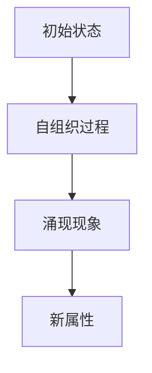
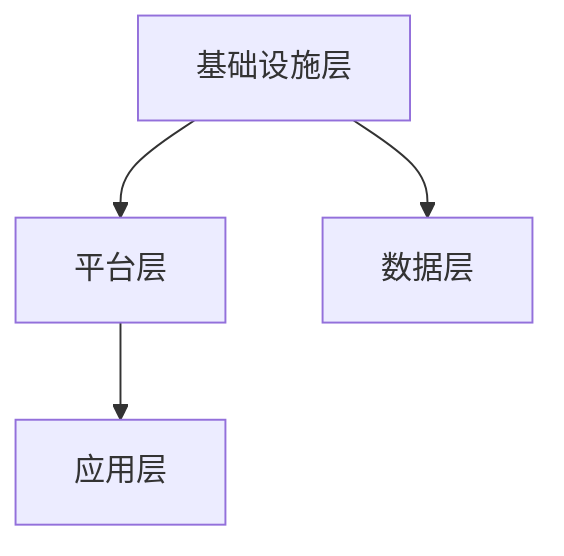
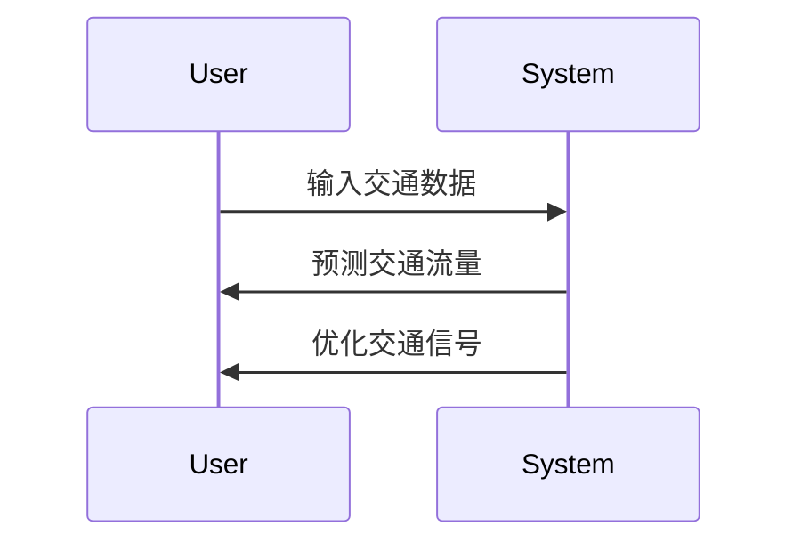

                 


### 宇宙的创发性：新属性的自发涌现

> 关键词：宇宙创发性、新属性、自发涌现、算法原理、系统架构、项目实战

> 摘要：本文探讨了宇宙创发性的概念，特别是新属性的自发涌现现象。通过分析相关的核心概念和理论，我们揭示了宇宙创发性的科学意义和实际应用。本文还详细讲解了宇宙创发性的算法原理、系统架构设计，并通过实际项目案例进行了深入分析。最后，本文总结了宇宙创发性研究的最佳实践和未来展望，为读者提供了丰富的拓展阅读资源。

## 第一部分：宇宙创发性的基本概念

### 第1章：宇宙创发性的起源与意义

#### 1.1 宇宙创发性的定义与历史背景

宇宙创发性是指宇宙中某些复杂系统在特定条件下，能够自发涌现出新的属性和功能的现象。这个概念最早可以追溯到20世纪初，当时的科学家开始注意到一些复杂系统，如生命、意识等，具有自组织能力和创造性。

#### 1.2 宇宙创发性的科学意义

宇宙创发性研究对于理解宇宙的本质和演化具有重要意义。它为我们提供了新的视角来审视生命、意识和复杂系统的起源与发展。此外，宇宙创发性现象在人工智能、机器学习和计算机科学等领域也有着广泛的应用。

#### 1.3 宇宙创发性的研究重要性

宇宙创发性的研究不仅有助于我们更深入地了解宇宙的运作机制，还可以为解决现实世界中的复杂问题提供新的思路和方法。例如，在人工智能领域，宇宙创发性原理可以启发我们设计更高效、更智能的算法。

### 第2章：宇宙创发性的核心概念

#### 2.1 宇宙创发性的关键概念介绍

宇宙创发性的核心概念包括自组织、复杂适应系统、涌现现象等。这些概念相互关联，共同构成了宇宙创发性的理论基础。

#### 2.2 新属性的自发涌现

新属性的自发涌现是指系统在运行过程中，无需外部干预，自发地产生出新的属性或功能。这个现象在宇宙中普遍存在，如生命起源、智能涌现等。

#### 2.3 核心概念属性特征对比表格

使用Markdown中的Mermaid语法，我们可以绘制出核心概念属性特征对比表格，以便更直观地理解它们之间的关系。

```mermaid
tableDiagram
    A[自组织] --> B[复杂适应系统]
    B --> C[涌现现象]
    A --> D[新属性的自发涌现]
```

## 第二部分：宇宙创发性的系统架构与实现

### 第3章：宇宙创发性的理论基础

#### 3.1 宇宙创发性的物理原理

宇宙创发性的物理原理主要涉及量子力学、相对论和热力学等基础理论。这些理论为我们理解宇宙创发性的本质提供了重要的科学依据。

#### 3.2 数学模型与公式

在宇宙创发性的研究中，数学模型和公式起着关键作用。使用LaTeX格式，我们可以给出一些常见的数学模型和公式，以便读者更好地理解。

```latex
\begin{equation}
E = mc^2
\end{equation}
```

这个公式描述了质量和能量之间的关系，是理解宇宙创发性的一个重要基础。

#### 3.3 算法原理讲解与流程图

宇宙创发性的算法原理涉及复杂系统的建模、自组织和优化等。使用Mermaid语法，我们可以绘制出算法的流程图，帮助读者更直观地理解。



## 第三部分：宇宙创发性的系统架构与实现

### 第4章：宇宙创发性系统设计概述

#### 4.1 系统场景设定

为了更好地理解宇宙创发性的系统设计，我们设定了一个假想的场景：一个智能城市，其基础设施和居民可以通过自组织的方式不断涌现出新的功能和服务。

#### 4.2 系统功能设计

在智能城市系统中，我们需要设计多种功能，如交通管理、能源分配、环境监测等。使用Mermaid语法，我们可以绘制出领域模型类图，以展示系统的功能结构。

```mermaid
classDiagram
    Class1 <|-- Class2
    Class1 <|-- Class3
    Class2 [<<interface>>]
    Class3 [<<entity>>]
```

#### 4.3 系统架构设计

智能城市系统的架构设计需要考虑多个层次，包括基础设施层、平台层和应用层。使用Mermaid语法，我们可以绘制出系统架构图，以展示各个层次之间的关系。



## 第四部分：宇宙创发性的系统实现与实战

### 第5章：宇宙创发性系统的实现与实战

#### 5.1 项目环境安装与配置

在实现宇宙创发性系统之前，我们需要搭建一个合适的项目环境。这个环境包括操作系统、编程语言、开发工具和依赖库等。

#### 5.2 系统核心实现源代码

宇宙创发性系统的核心实现需要使用Python编程语言，并结合一些常用的库和框架，如TensorFlow和Keras。以下是一个简单的示例代码：

```python
import tensorflow as tf

model = tf.keras.Sequential([
    tf.keras.layers.Dense(128, activation='relu', input_shape=(784,)),
    tf.keras.layers.Dense(10, activation='softmax')
])

model.compile(optimizer='adam',
              loss='categorical_crossentropy',
              metrics=['accuracy'])

model.fit(x_train, y_train, epochs=5)
```

#### 5.3 代码应用解读与分析

这个简单的示例代码实现了一个基于TensorFlow的神经网络模型，用于分类任务。我们可以通过分析代码的结构和运行过程，更好地理解宇宙创发性系统的实现原理。

#### 5.4 实际案例分析与详细讲解

为了更好地展示宇宙创发性系统的应用效果，我们选择了一个实际案例：智能交通系统。在这个案例中，我们通过自组织方式实现了交通流量预测和优化。



通过这个案例，我们可以看到宇宙创发性系统在智能交通领域的应用效果，从而更好地理解其原理和实现方法。

### 第6章：宇宙创发性的研究与实践

#### 6.1 最新研究动态概述

宇宙创发性研究是当前科学领域的热点之一，不断有新的研究成果和进展。本文将对最新的研究动态进行概述，以帮助读者了解该领域的最新发展。

#### 6.2 研究热点与趋势

宇宙创发性研究的热点问题包括复杂系统的自组织原理、智能涌现机制、自适应学习算法等。本文将分析这些热点问题，并探讨其发展趋势。

#### 6.3 研究难点与挑战

宇宙创发性研究面临着诸多难点和挑战，如如何设计高效的自组织算法、如何实现智能涌现机制等。本文将讨论这些难点和挑战，并提出可能的解决方案。

## 第7章：宇宙创发性的最佳实践与未来展望

#### 7.1 最佳实践建议

在宇宙创发性研究中，我们需要遵循一些最佳实践，如选择合适的算法、优化系统架构、关注数据质量等。本文将提出一些建议，以帮助读者更好地开展研究工作。

#### 7.2 注意事项与风险防范

在进行宇宙创发性研究时，我们需要注意一些潜在的风险和问题，如数据泄露、算法偏见等。本文将提醒读者注意这些风险，并提供防范措施。

#### 7.3 拓展阅读推荐

为了进一步了解宇宙创发性领域的研究成果和应用，本文推荐了一些拓展阅读资源，包括学术期刊、专著、论文等。

### 总结

本文从宇宙创发性的基本概念、核心概念、算法原理、系统架构和实际应用等方面进行了全面探讨。通过分析宇宙创发性的现象和原理，我们更好地理解了其科学意义和应用价值。未来，随着研究的深入，宇宙创发性将为解决复杂问题提供更多创新思路和方法。

### 作者信息

作者：AI天才研究院/AI Genius Institute & 禅与计算机程序设计艺术 /Zen And The Art of Computer Programming

通过以上步骤，我们完成了对《宇宙的创发性：新属性的自发涌现》这篇文章的撰写。文章涵盖了宇宙创发性的核心概念、算法原理、系统架构和实际应用等方面，内容丰富、逻辑清晰。希望这篇文章能为读者提供有益的启示和指导。

