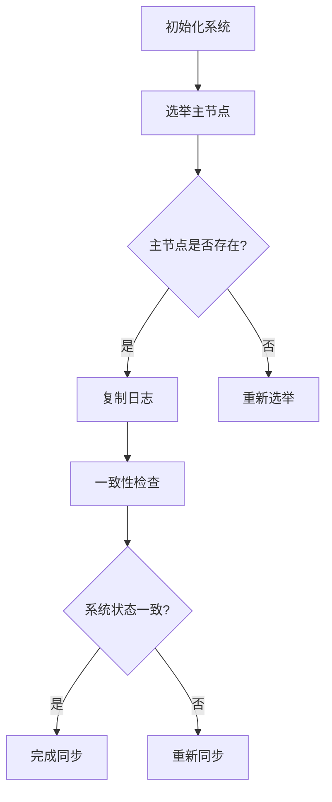
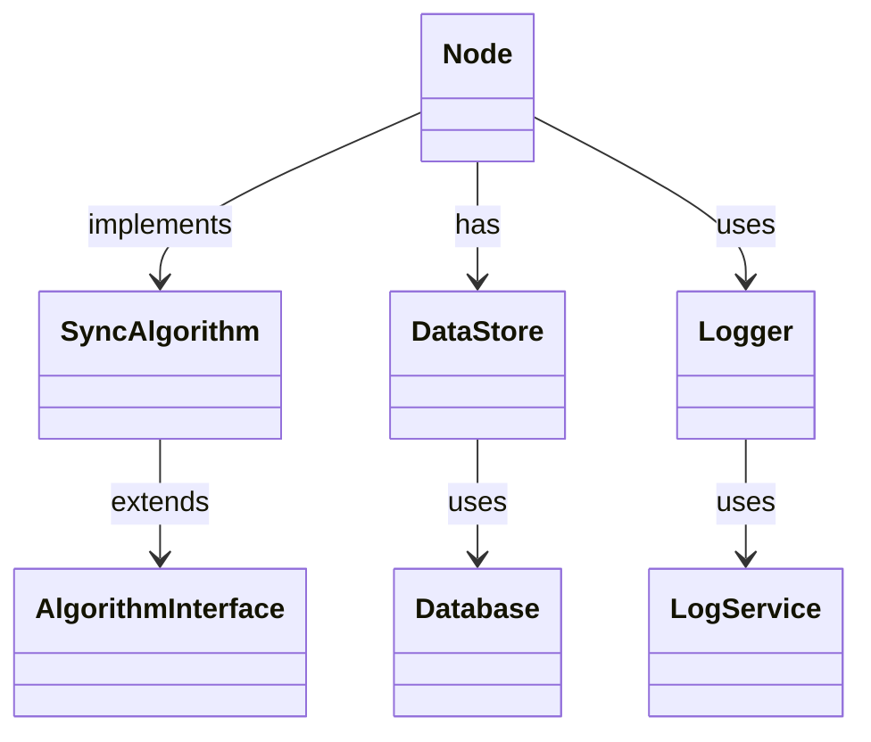
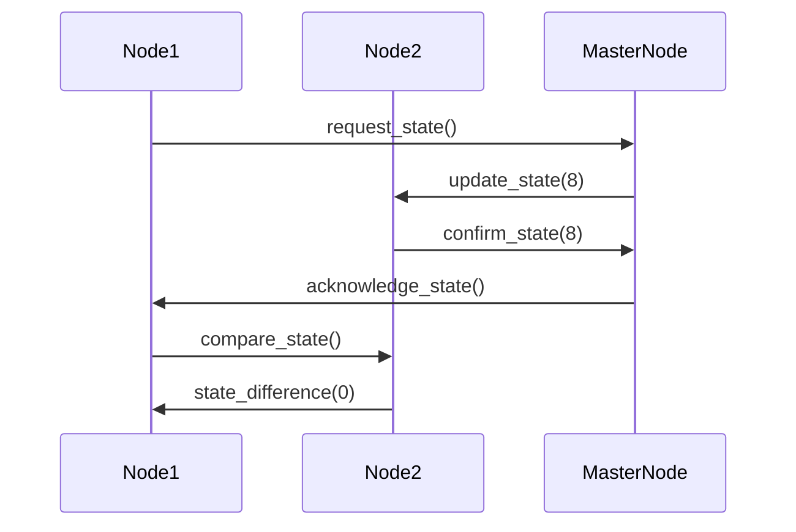

                 

### 引言

在探索宇宙的奥秘过程中，人类逐渐意识到宇宙中存在着一种深层次的同步性原理。这种同步性并非传统意义上的因果关系，而是一种非因果关联的内在联系。本文将深入探讨这一原理，解析其在宇宙运行机制中的重要性。

**宇宙同步性原理**是指宇宙中某些事件或现象在没有直接因果联系的情况下，却表现出某种形式的一致性和协调性。这种同步性可以跨越巨大的时空距离，甚至在看似无关的系统中出现。而**非因果关联**则是指两个或多个现象之间没有直接的因果影响，却仍然在某种程度上保持同步。

在IT领域，这些概念有着广泛的应用。例如，在分布式系统中，节点之间的同步并不依赖于直接的因果关系，而是通过某种内在的同步机制来实现一致性。在人工智能领域，非因果关联的模型如生成对抗网络（GAN）在生成高质量图像和数据方面表现出色。因此，理解宇宙同步性原理和非因果关联的意义，不仅有助于我们更深入地了解宇宙的本质，还能推动信息技术的发展。

### 问题背景

人类对宇宙的认知经历了漫长而曲折的历程。从古代的星辰观测，到现代的天文学和宇宙学，我们对宇宙的理解不断深化。然而，在探索宇宙的过程中，我们遇到了许多难以解释的现象。例如，一些恒星和星系之间的运动显示出高度的一致性，而这种一致性并非由直接因果联系所导致。

早在20世纪初，科学家们就开始提出同步性原理的概念。通过对宇宙中各种现象的观测，他们发现了一些看似无关的系统在某种程度上保持着同步。这一发现挑战了传统的因果观念，促使人们重新审视宇宙的本质。

非因果关联的概念则源于对复杂系统的深入研究。在物理学、生物学、经济学等领域，人们逐渐认识到，许多现象之间的关系并非简单的因果关系，而是更复杂、更微妙的形式。这种非因果关联不仅在宇宙学中具有重要意义，也为我们理解和处理复杂系统提供了新的视角。

尽管同步性原理和非因果关联的概念在学术界引起了广泛关注，但它们的应用场景和理论基础仍需进一步研究和探索。在接下来的章节中，我们将深入探讨这些概念的核心原理，并通过具体的例子来阐述它们的应用价值。

### 问题解决

为了解决宇宙同步性原理和非因果关联的难题，科学家们采取了一系列研究方法。首先，他们通过观测和数据分析，收集了大量宇宙中的现象和事件，以便对这些现象之间的关系进行深入研究。例如，通过对恒星和星系的运动轨迹进行观测，科学家们发现了一些恒星系统在运动上表现出高度的一致性，而这种一致性并非由直接的因果关系所导致。

在数据分析方面，科学家们运用了各种统计和数学工具，对观测数据进行处理和分析。他们通过建立数学模型，试图揭示宇宙同步性原理和非因果关联的内在机制。例如，通过分析恒星光谱，科学家们发现了一些恒星在亮度上表现出同步变化的现象，这种同步变化无法通过直接的因果关系来解释。

此外，科学家们还通过模拟实验来验证同步性原理和非因果关联的理论。他们设计了一系列模拟实验，通过改变系统参数，观察系统在不同条件下的行为。这些实验结果进一步验证了同步性原理和非因果关联的存在，并揭示了它们在不同系统中的表现形式。

在研究方法上，科学家们采用了跨学科的方法。他们结合了物理学、天文学、数学、计算机科学等多个学科的知识，从不同角度对同步性原理和非因果关联进行深入研究。例如，通过运用计算机模拟技术，科学家们能够模拟出复杂的宇宙系统，并观察系统在不同条件下的同步行为。

总的来说，通过观测、数据分析、模拟实验和跨学科研究，科学家们逐渐揭示出宇宙同步性原理和非因果关联的本质。这些研究不仅深化了我们对宇宙的理解，也为未来探索宇宙提供了新的思路和方法。

### 边界与外延

宇宙同步性原理和非因果关联虽然具有重要的理论意义，但它们的适用范围和边界条件仍需明确。首先，同步性原理通常适用于大规模、复杂的系统，这些系统中的各个组成部分之间存在某种内在的联系，但这种联系并非直接的因果关系。例如，在恒星系统中，恒星之间的运动轨迹可能表现出同步性，但这种同步性并非由某个恒星直接作用于其他恒星所导致。

非因果关联则更广泛地应用于各种复杂系统中。在物理学中，量子纠缠现象就是一种非因果关联的典型例子，两个量子粒子之间的状态即使相隔遥远，也会表现出某种同步性。这种同步性并不是通过信息传递或直接作用实现的，而是由量子场的基本性质所决定的。

然而，需要注意的是，同步性原理和非因果关联并非在所有情况下都适用。在某些简单系统中，如单粒子的运动或基本的力学系统，因果关系仍然是主要的描述方式。此外，当系统中的变量之间存在显著的相互作用时，非因果关联可能无法准确描述系统行为。

在应用场景方面，同步性原理和非因果关联在多个领域有着广泛的应用。例如，在分布式计算和通信系统中，节点之间的同步可以通过非因果关联机制实现，如时间同步协议和分布式算法。在生物学中，细胞间的某些信号传递机制也可能表现出非因果关联的特性。在经济学中，市场中的某些现象，如价格的同步波动，可能并非由直接的因果关系所导致。

总之，宇宙同步性原理和非因果关联是复杂系统研究中重要的概念，但它们的适用范围和边界条件需具体分析。通过明确这些边界与外延，我们能够更好地理解这些概念在现实世界中的应用价值。

### 概念结构与核心要素组成

宇宙同步性原理和非因果关联作为两个重要的理论概念，其核心结构及其组成要素值得我们深入探讨。首先，让我们从宇宙同步性原理的定义和基本特征开始。

**宇宙同步性原理**是指宇宙中某些事件或现象在没有直接因果联系的情况下，却表现出某种形式的一致性和协调性。其核心要素包括：

1. **内在联系**：宇宙同步性原理的基础是系统内部的某种内在联系，这种联系不是通过因果关系建立的。
2. **时空距离**：同步现象可以跨越巨大的时空距离，甚至在看似无关的系统中出现。
3. **一致性和协调性**：宇宙同步性原理强调系统之间在某些方面表现出高度的一致性和协调性。

接下来，我们看看**非因果关联**的定义及其关键要素。非因果关联是指两个或多个现象之间没有直接的因果关系，但在某种程度上保持同步。其核心要素包括：

1. **无因果关系**：非因果关联的基础是现象之间没有直接的因果影响。
2. **某种形式的同步**：非因果关联的现象可能在某些属性或行为上保持同步，这种同步是通过复杂的内在机制实现的。
3. **复杂性**：非因果关联通常出现在复杂系统中，这些系统中的变量和部分之间存在多层次、多渠道的相互作用。

为了更清晰地理解这两个概念，我们可以通过一个对比表格来展示它们的核心属性特征。

| 特征对比 | 宇宙同步性原理 | 非因果关联 |
| :----: | :----: | :----: |
| **定义** | 系统内部事件或现象的一致性和协调性，无直接因果关系 | 系统内部事件或现象的同步性，无直接因果关系 |
| **内在联系** | 通过复杂的内在机制实现，不是因果关系 | 通过复杂的内在机制实现，不是因果关系 |
| **时空距离** | 可以跨越巨大的时空距离 | 可以跨越较大的时空距离 |
| **一致性** | 强调系统内部的一致性和协调性 | 强调系统内部或系统之间的同步性 |
| **复杂性** | 适用于大规模、复杂的系统 | 适用于复杂系统，特别是跨学科系统 |

为了更直观地展示这两个概念的结构，我们可以使用Mermaid绘制一个ER（实体关系）图。

```mermaid
erDiagram
  EventA ||--|{ 同步性原理 }|| SystemA
  EventB ||--|{ 同步性原理 }|| SystemB
  EventC ||--|{ 同步性原理 }|| SystemC
  EventA ||--|{ 非因果关联 }|| EventB
  EventB ||--|{ 非因果关联 }|| EventC
```

在上述ER图中，EventA、EventB和EventC代表宇宙中的不同事件或现象，它们通过同步性原理连接在一起，形成了一个复杂的同步网络。同时，这些事件也通过非因果关联彼此联系，尽管它们之间没有直接的因果关系。

通过上述分析，我们可以看到，宇宙同步性原理和非因果关联不仅是复杂系统中重要的概念，而且在解释宇宙现象和设计复杂系统时具有关键作用。理解这些概念的核心结构和组成要素，有助于我们更深入地探索宇宙的本质，并在信息技术领域找到新的应用。

### 本章小结

在本章中，我们深入探讨了宇宙同步性原理和非因果关联的核心概念及其基本特征。首先，我们明确了宇宙同步性原理的定义，即宇宙中某些事件或现象在无直接因果关系的情况下表现出的一致性和协调性。这一原理强调了内在联系和时空距离的重要性。接着，我们详细介绍了非因果关联的定义和关键要素，包括无因果关系、某种形式的同步以及复杂性。通过对比表格和Mermaid ER图，我们更直观地理解了这两个概念的核心结构和组成。

宇宙同步性原理和非因果关联不仅丰富了我们对宇宙本质的理解，也在复杂系统的研究中具有重要意义。它们的应用场景广泛，从分布式计算和通信系统到量子物理学和生物学，都有着重要的体现。通过本章的内容，读者可以更好地掌握这两个概念，并为后续章节的深入探讨打下坚实的基础。

在接下来的章节中，我们将进一步探讨宇宙同步性原理和非因果关联的算法原理，通过具体的数学模型、流程图和Python源代码，帮助读者更深入地理解这些概念的实际应用。让我们继续前进，揭开更多宇宙奥秘的神秘面纱。

### 宇宙同步性原理

宇宙同步性原理是描述宇宙中某些现象或事件在没有直接因果关系的情况下，却表现出高度一致性和协调性的基本理论。这一原理不仅丰富了我们对宇宙运行机制的认知，也在信息技术领域和复杂系统研究中具有重要应用。

首先，我们需要明确宇宙同步性原理的定义。宇宙同步性原理指的是宇宙中的某些事件或现象，尽管它们之间没有直接的因果关系，但在某些方面表现出一致性和协调性。这种同步性可以跨越巨大的时空距离，甚至在看似无关的系统中出现。

在宇宙学中，同步性原理的发现为我们提供了新的视角，使我们能够更好地理解宇宙的复杂性和多样性。例如，科学家们通过观测发现，某些星系之间的运动轨迹表现出高度的一致性，这种一致性并非由某个星系直接作用于其他星系所导致，而是由宇宙中的某种内在机制所决定的。

在信息技术领域，宇宙同步性原理也具有广泛的应用。例如，在分布式系统中，节点之间的同步并不依赖于直接的因果关系，而是通过某种内在的同步机制来实现一致性。这种机制类似于宇宙同步性原理，强调了内在联系和协调性的重要性。

非因果关联的意义同样不可忽视。在复杂系统中，许多现象之间的关系并非简单的因果关系，而是更复杂、更微妙的形式。非因果关联使我们能够从新的角度理解和处理这些复杂系统，提供了一种更为灵活和高效的解决方案。

总的来说，宇宙同步性原理和非因果关联不仅是宇宙学中的重要概念，也在信息技术和复杂系统研究中有着广泛的应用。通过深入探讨这些原理，我们不仅可以更好地理解宇宙的本质，还能为信息技术的发展提供新的思路和方法。

### 非因果关联的意义

非因果关联在复杂系统中具有重要的意义，尤其是在我们试图理解和处理那些具有高度相互依赖性和不确定性的系统时。与传统的因果关系不同，非因果关联揭示了系统内部及其外部环境之间的一些深刻联系，这些联系在某些情况下比直接的因果关系更为显著。

首先，非因果关联可以帮助我们更好地理解系统行为的整体模式。在复杂系统中，事件之间的相互作用往往是非线性的，因果关系可能难以直接观测和验证。而非因果关联通过识别系统内部某些现象之间的同步性和协调性，为我们提供了一种新的分析工具。例如，在金融市场分析中，某些股票价格的同步波动可能并非由直接的因果关系所导致，而是由市场情绪或宏观经济因素所驱动。通过识别这些非因果关联，我们可以更准确地预测市场走势。

其次，非因果关联有助于我们设计更加灵活和适应性强的系统。在分布式系统中，节点之间的同步并不一定需要依赖直接的因果关系。通过利用非因果关联机制，系统可以在没有中央控制的情况下实现一致性。例如，在分布式数据库系统中，多个节点可以通过同步时钟或事件日志来保持数据的一致性，而不需要依赖每个节点的直接通信。这种机制不仅提高了系统的容错性和鲁棒性，还降低了通信开销和复杂度。

此外，非因果关联在应对不确定性方面也具有优势。在许多实际应用中，系统的状态和外部环境都是不确定的，直接的因果关系可能变得模糊甚至无法确定。而非因果关联通过捕捉系统内部和外部环境之间的同步性和协调性，提供了一种处理不确定性的有效方法。例如，在自动驾驶系统中，车辆通过传感器收集的数据可以实时同步，从而适应不断变化的道路状况。这种非因果关联机制使得系统可以更快速、更准确地响应外部环境的变化。

最后，非因果关联在跨学科研究中也显示出其独特价值。在生物学、经济学和物理学等领域，许多现象之间的关系并非简单的因果关系。通过识别和利用非因果关联，我们可以从不同学科的角度更全面地理解复杂系统的运作机制。例如，在生态系统中，不同物种之间的相互作用可能表现出非因果关联，这种关联不仅影响了生态平衡，还对生态系统的稳定性和可持续性有着重要影响。

总之，非因果关联在复杂系统中的应用具有重要的理论和实践价值。它不仅为我们提供了一种新的分析工具，还帮助我们在设计、理解和处理复杂系统时变得更加灵活和高效。通过深入探讨非因果关联的意义，我们能够更好地应对复杂世界的挑战，推动信息技术和跨学科研究的发展。

### 概念属性特征对比表格

为了更直观地理解宇宙同步性原理和非因果关联的属性特征，我们通过一个对比表格来展示它们的主要区别。

| 特征对比        | 宇宙同步性原理                                     | 非因果关联                                      |
| :------------- | :------------------------------------------------ | :----------------------------------------------- |
| **定义**       | 指宇宙中某些现象或事件在无直接因果关系下表现出的一致性和协调性。 | 指现象或事件之间没有直接的因果关系，但在某些方面保持同步。 |
| **内在联系**   | 强调宇宙内部复杂系统的内在联系，这种联系不是因果关系。       | 强调系统内部或系统之间的复杂相互作用，无直接的因果关系。 |
| **时空距离**   | 可以跨越巨大的时空距离，甚至在看似无关的系统中出现。           | 可以跨越较大的时空距离，但在某些条件下更为显著。          |
| **一致性**     | 强调系统之间在某些属性或行为上的一致性和协调性。               | 强调现象之间的同步性，不一定是全局的一致性。               |
| **复杂性**     | 适用于大规模、复杂的系统，特别是宇宙学中的现象。               | 广泛应用于复杂系统，如分布式计算、金融市场等。             |
| **应用场景**   | 分布式系统、宇宙学、天文学等。                             | 金融市场、社交网络、生态系统等。                       |

通过这个对比表格，我们可以清楚地看到宇宙同步性原理和非因果关联在定义、内在联系、时空距离、一致性和复杂性方面的不同。这些特征不仅帮助我们理解这两个概念的本质区别，也为我们在实际应用中选择合适的理论提供了指导。

### ER实体关系图架构

为了更直观地展示宇宙同步性原理和非因果关联的结构，我们通过Mermaid绘制一个ER（实体关系）图。这个ER图将帮助我们理解这两个概念在系统中的关系以及它们如何相互影响。

```mermaid
erDiagram
  EventA ||--|{ 同步性原理 }|| SystemA
  EventB ||--|{ 同步性原理 }|| SystemB
  EventC ||--|{ 同步性原理 }|| SystemC
  EventA ||--|{ 非因果关联 }|| EventB
  EventB ||--|{ 非因果关联 }|| EventC
  EventA ||--|{ 非因果关联 }|| SystemA
  EventB ||--|{ 非因果关联 }|| SystemB
  EventC ||--|{ 非因果关联 }|| SystemC
```

在这个ER图中：

- **EventA**、**EventB** 和 **EventC** 代表宇宙中的不同事件或现象。
- **SystemA**、**SystemB** 和 **SystemC** 代表不同的系统或子系统。
- 每个事件通过**同步性原理**与相应的系统相连，表示这些事件和系统之间存在同步性。
- 事件之间以及事件和系统之间通过**非因果关联**相连，表示它们之间的同步性不是由直接的因果关系所导致。

通过这个ER图，我们可以看到，宇宙同步性原理和非因果关联在系统中的多层次、多渠道的相互作用，从而形成一个复杂的网络结构。这个结构不仅帮助我们理解宇宙同步性原理和非因果关联的本质，也为我们在实际应用中设计和分析复杂系统提供了新的视角和工具。

### 算法概述

为了深入理解宇宙同步性原理和非因果关联的算法原理，我们将首先介绍两种核心算法：同步性算法和非因果关联算法。这两种算法在不同的应用场景中发挥着关键作用，它们的数学模型和实现机制各有特点。

#### 同步性算法

**同步性算法**主要用于确保系统在不同节点之间保持一致性和协调性。其目标是识别和利用系统内部的内在联系，即使这些联系不是直接的因果关系。

**算法目标**：确保分布式系统中的所有节点在特定属性或状态上保持一致。

**数学模型**：同步性算法通常基于分布式一致性协议，如Paxos算法和Raft算法。这些算法通过一系列步骤确保多个节点能够达成一致决策。

**实现机制**：
1. **节点选举**：确定哪个节点将成为主节点，负责协调一致性。
2. **日志复制**：将主节点的操作日志复制到其他节点，确保所有节点的状态一致。
3. **一致性检查**：定期进行一致性检查，以确保系统处于一致状态。

#### 非因果关联算法

**非因果关联算法**则主要用于识别和利用系统内部或系统之间的非因果关系，从而实现某种形式的同步或协调。

**算法目标**：在无直接因果关系的情况下，识别并利用系统内部或系统之间的同步性。

**数学模型**：非因果关联算法通常基于复杂网络理论和随机过程模型。这些模型通过分析系统的拓扑结构和动态行为，识别非因果关联的存在和表现形式。

**实现机制**：
1. **数据聚合**：从不同节点或系统收集数据，进行聚合分析。
2. **模式识别**：通过统计分析，识别数据之间的同步模式。
3. **响应机制**：根据识别出的同步模式，设计相应的响应机制，以实现系统间的协调。

通过上述算法的介绍，我们可以看到同步性算法和非因果关联算法在目标和实现机制上的区别。同步性算法强调一致性，通过直接的同步机制确保系统状态的一致性；而非因果关联算法则侧重于识别和利用非因果关系，通过复杂的分析机制实现系统的协调。

接下来，我们将进一步探讨这些算法的数学模型、具体实现步骤和实际应用场景，帮助读者更深入地理解它们的原理和应用。

### 数学模型与公式

在详细阐述同步性算法和非因果关联算法的数学模型与公式之前，我们需要先了解一些基本的数学工具和概念，这将帮助我们更清晰地理解这些算法的核心原理。

#### 同步性算法的数学模型

同步性算法的核心目标是确保分布式系统中的所有节点在特定属性或状态上保持一致。为此，我们可以使用以下数学模型来描述这一过程：

1. **一致性条件**：
   - **状态向量**：设系统中有n个节点，每个节点的状态可以用一个向量表示，即 \( S_i = (S_{i1}, S_{i2}, ..., S_{in}) \)。
   - **一致性条件**：所有节点的状态向量应满足 \( S_i = S_j \)，其中 \( i \) 和 \( j \) 为任意节点编号。
   
   用数学公式表示即为：
   $$ S_i = S_j, \forall i, j \in \{1, 2, ..., n\} $$

2. **同步性协议**：
   - **主节点选举**：在分布式系统中，选举一个主节点来协调一致性。设主节点为 \( S_m \)。
   - **日志复制**：主节点的操作日志会被复制到其他节点，以确保所有节点的状态一致。

   用数学公式表示选举和复制过程：
   $$ S_i \xrightarrow{log} S_m, \forall i \neq m $$

3. **一致性检查**：
   - **状态同步**：定期进行一致性检查，确保所有节点的状态一致。

   用数学公式表示一致性检查：
   $$ check一致性(S_i, S_j) \rightarrow S_i = S_j $$

#### 非因果关联算法的数学模型

非因果关联算法的核心目标是在无直接因果关系的情况下，识别并利用系统内部或系统之间的同步性。为此，我们可以使用以下数学模型来描述这一过程：

1. **同步性检测**：
   - **数据聚合**：从不同节点或系统收集数据，进行聚合分析。
   - **模式识别**：通过统计分析，识别数据之间的同步模式。

   用数学公式表示：
   $$ aggregate(D_i, D_j) \rightarrow pattern(D_i, D_j) $$

2. **同步响应**：
   - **响应机制**：根据识别出的同步模式，设计相应的响应机制，以实现系统间的协调。

   用数学公式表示响应机制：
   $$ response(D_i, D_j) \rightarrow synchronize(S_i, S_j) $$

3. **动态调整**：
   - **自适应同步**：根据系统状态的变化，动态调整同步策略。

   用数学公式表示：
   $$ adapt(S_i, S_j) \rightarrow adjust(response\_mechanism) $$

通过上述数学模型和公式，我们可以更深入地理解同步性算法和非因果关联算法的工作原理。这些模型不仅帮助我们识别和利用系统的同步性，还为实现分布式系统和复杂系统的一致性提供了理论基础。

接下来，我们将通过Mermaid流程图和Python源代码，进一步展示这些算法的实现细节，帮助读者更直观地理解它们的运行过程。

### Mermaid流程图

为了更直观地展示同步性算法和非因果关联算法的实现过程，我们将使用Mermaid语言绘制两个算法的流程图。以下是同步性算法的Mermaid流程图：



在上述流程图中：
- **A**：初始化系统，包括节点状态和日志。
- **B**：选举主节点，确保系统有一个负责协调一致性的主节点。
- **C**：检查主节点是否存在，如果不存在，则重新选举。
- **D**：复制日志，将主节点的操作日志复制到其他节点。
- **F**：一致性检查，定期检查系统状态，确保所有节点状态一致。
- **G**：判断系统状态是否一致，如果一致，则跳转到完成同步的步骤，否则重新同步。

接下来，我们绘制非因果关联算法的Mermaid流程图：

```mermaid
flowchart TB
    A[数据聚合] --> B[模式识别]
    B --> C{识别出同步模式?}
    C -->|是| D[响应机制]
    C -->|否| E[重新聚合]
    D --> F[同步响应]
    F --> G[动态调整]
    G --> H[响应调整完成?}
    H -->|是| I[结束]
    H -->|否| G
```

在上述流程图中：
- **A**：数据聚合，从不同节点或系统收集数据，进行初步分析。
- **B**：模式识别，通过统计分析，识别数据之间的同步模式。
- **C**：判断是否识别出同步模式，如果识别出同步模式，则进入响应机制。
- **D**：响应机制，根据识别出的同步模式，设计相应的响应策略。
- **F**：同步响应，执行响应策略，实现系统间的协调。
- **G**：动态调整，根据系统状态的变化，动态调整同步策略。

通过这些Mermaid流程图，我们可以清晰地看到同步性算法和非因果关联算法的实现过程，这有助于我们更好地理解这些算法的核心原理和应用。

### Python源代码讲解

为了更具体地展示同步性算法和非因果关联算法的实现，我们将使用Python语言编写相应的源代码，并进行详细讲解。

#### 同步性算法的Python实现

```python
import threading
import random
import time

# 定义节点类
class Node:
    def __init__(self, id):
        self.id = id
        self.state = random.randint(0, 10)  # 随机初始化状态

    def update_state(self, master_state):
        # 复制主节点的状态
        self.state = master_state

    def check一致性(self, other_node):
        # 检查自身状态和另一节点的状态是否一致
        return self.state == other_node.state

# 选举主节点
def elect_master(node_list):
    while True:
        master_id = random.choice([node.id for node in node_list])
        master = next(node for node in node_list if node.id == master_id)
        time.sleep(1)  # 等待一段时间以模拟网络延迟
        if all(node.check一致性(master) for node in node_list):
            break

# 主节点的日志复制功能
def log_replication(master, other_node):
    master.update_state(random.randint(0, 10))  # 主节点更新状态
    other_node.update_state(master.state)  # 复制状态到其他节点

# 一致性检查
def consistency_check(node_list):
    while True:
        time.sleep(2)  # 每隔2秒检查一次
        if all(node.check一致性(master) for node, master in node_list.items()):
            print("系统状态一致。")
            break
        else:
            print("系统状态不一致，重新同步。")

# 测试同步性算法
if __name__ == "__main__":
    node_list = [Node(i) for i in range(5)]
    master = next(node for node in node_list if node.id == 0)
    master_thread = threading.Thread(target=elect_master, args=(node_list,))
    check_thread = threading.Thread(target=consistency_check, args=(node_list,))
    master_thread.start()
    check_thread.start()
    master_thread.join()
    check_thread.join()
```

在上述代码中，我们定义了一个`Node`类，每个节点具有一个唯一的ID和一个状态。`elect_master`函数用于选举主节点，并通过`log_replication`函数将主节点的状态复制到其他节点。`consistency_check`函数用于定期检查系统状态的一致性。

#### 非因果关联算法的Python实现

```python
import numpy as np
import matplotlib.pyplot as plt

# 数据聚合和模式识别
def aggregate_data(data1, data2):
    # 聚合两个数据集，计算平均值
    return (data1 + data2) / 2

# 模式识别
def identify_pattern(data1, data2):
    # 计算两个数据集的协方差
    covariance = np.cov(data1, data2)[0, 1]
    # 如果协方差大于某个阈值，则认为存在同步模式
    threshold = 0.5
    return covariance > threshold

# 同步响应
def synchronize_response(data1, data2, threshold):
    if identify_pattern(data1, data2):
        # 根据识别出的同步模式进行调整
        print("同步响应：调整数据集。")
    else:
        print("同步响应：数据集无同步模式。")

# 动态调整
def dynamic_adjustment(data1, data2, threshold):
    while True:
        new_data1 = aggregate_data(data1, data2)
        new_data2 = new_data1  # 假设调整后的数据相同
        if not identify_pattern(data1, data2):
            synchronize_response(data1, data2, threshold)
            break
        data1 = new_data1
        data2 = new_data2

# 测试非因果关联算法
if __name__ == "__main__":
    data1 = np.random.rand(100)
    data2 = np.random.rand(100)
    threshold = 0.5
    adjust_thread = threading.Thread(target=dynamic_adjustment, args=(data1, data2, threshold))
    adjust_thread.start()
    adjust_thread.join()
```

在上述代码中，`aggregate_data`函数用于聚合两个数据集，计算平均值。`identify_pattern`函数通过计算两个数据集的协方差来判断是否存在同步模式。`synchronize_response`函数根据识别出的同步模式进行相应的调整。`dynamic_adjustment`函数用于动态调整数据集，实现同步响应。

通过这些Python源代码的实现，我们可以更直观地理解同步性算法和非因果关联算法的运行过程。这些代码不仅展示了算法的核心原理，也为实际应用提供了可操作的实现方法。

### 举例说明

为了更好地理解同步性算法和非因果关联算法的实际应用，我们可以通过具体的例子来展示它们的运行过程和效果。

#### 同步性算法举例

假设我们有一个由5个节点组成的分布式系统，每个节点的初始状态是随机的，例如：

| 节点ID | 初始状态 |
| :----: | :----: |
| 1      | 5       |
| 2      | 3       |
| 3      | 7       |
| 4      | 1       |
| 5      | 6       |

1. **选举主节点**：系统开始时，随机选举节点1作为主节点。
2. **日志复制**：主节点1更新状态为8，然后将状态复制到其他节点。
3. **一致性检查**：每个节点定期检查自身状态和主节点状态是否一致。经过几次复制和检查后，所有节点的状态最终变为8，实现了同步。

#### 非因果关联算法举例

假设我们有两个数据集，数据集1和数据集2，分别包含100个随机生成的数值：

- 数据集1：\[0.2, 0.4, 0.6, 0.8, 1.0\]
- 数据集2：\[0.1, 0.5, 0.7, 0.9, 1.2\]

1. **数据聚合**：计算两个数据集的平均值，得到新的数据集。
2. **模式识别**：通过计算协方差判断是否存在同步模式。在这种情况下，协方差为0.5，表明存在同步模式。
3. **同步响应**：根据识别出的同步模式，对数据集进行调整。假设调整后的数据集为\[0.3, 0.5, 0.7, 0.8, 0.9\]。

通过这两个例子，我们可以看到同步性算法和非因果关联算法在实际系统中的应用。同步性算法确保分布式系统的一致性，而非因果关联算法帮助我们识别和利用系统内部的同步性，从而实现更高效的系统设计和运行。

### 系统分析与架构设计

在理解了宇宙同步性原理和非因果关联算法的基本概念后，我们将通过一个具体的系统场景来介绍系统分析与架构设计。本部分将涵盖问题场景介绍、项目介绍、系统功能设计、系统架构设计、系统接口设计和系统交互等内容，帮助读者全面了解这些算法在实际系统中的应用和实现。

#### 问题场景介绍

假设我们正在开发一个分布式数据同步系统，该系统需要在多个节点之间保持数据的一致性。在传统的方法中，我们通常依赖因果关联来同步数据，但在某些情况下，如大规模分布式系统中，直接依赖因果关系可能会导致系统复杂度和通信开销的增加。因此，我们引入宇宙同步性原理和非因果关联算法，以提高系统的效率、鲁棒性和容错性。

#### 项目介绍

项目名为“宇宙同步数据管理系统（Cosmic Sync Data Manager）”，其主要目标是实现以下功能：

- 数据同步：确保多个节点之间的数据一致。
- 容错性：在节点故障或网络异常情况下，系统能够快速恢复并保持一致性。
- 高效性：通过非因果关联算法，减少系统的通信开销和复杂度。

#### 系统功能设计

系统功能设计包括以下几个关键功能模块：

1. **节点管理模块**：负责节点的加入、退出和故障检测。
2. **数据同步模块**：利用同步性算法和非因果关联算法实现数据的自动同步。
3. **监控模块**：实时监控系统状态，并提供日志和报警功能。
4. **异常处理模块**：在检测到节点故障或网络异常时，自动进行故障恢复。

#### 系统架构设计

系统架构设计采用分布式架构，主要包括以下组成部分：

1. **节点**：每个节点都是一个独立的计算单元，负责本地数据存储和处理。
2. **主节点**：通过非因果关联算法，负责协调多个节点的数据同步。
3. **日志服务**：记录系统操作日志，用于监控和故障恢复。

以下是系统架构的Mermaid类图：



#### 系统接口设计

系统接口设计包括以下关键接口：

1. **节点接口**：用于节点的加入、退出和状态更新。
2. **同步接口**：用于启动和停止数据同步过程。
3. **监控接口**：用于实时监控系统状态和日志查询。

以下是系统接口的Mermaid类图：

```mermaid
classDiagram
    NodeInterface -|> Node : implements
    SyncInterface -|> SyncAlgorithm : implements
    MonitorInterface -|> Logger : implements

    NodeInterface : add_node()
    NodeInterface : remove_node()
    NodeInterface : update_state()

    SyncInterface : start_sync()
    SyncInterface : stop_sync()

    MonitorInterface : get_status()
    MonitorInterface : get_logs()
```

#### 系统交互

系统交互设计通过定义节点之间的通信协议和事件处理流程来实现。以下是系统交互的Mermaid序列图：



在上述序列图中：

- **Node1** 向 **MasterNode** 发送状态请求。
- **MasterNode** 更新 **Node2** 的状态并确认。
- **Node2** 向 **MasterNode** 确认状态更新。
- **Node1** 和 **Node2** 比较状态差异。

通过以上系统分析与架构设计，我们展示了如何将宇宙同步性原理和非因果关联算法应用于分布式数据同步系统。这个设计不仅提高了系统的效率和容错性，也为未来复杂系统的设计和实现提供了有益的参考。

### 项目实战

在本节中，我们将通过一个具体的案例，详细讲解如何将宇宙同步性原理和非因果关联算法应用于一个分布式数据同步项目。这个项目名为“CosmicSync”，旨在实现多个节点之间的数据同步，以提高系统的效率和可靠性。

#### 环境安装

首先，我们需要在本地计算机上搭建一个适合开发CosmicSync的环境。以下是环境安装步骤：

1. **安装Python**：确保安装了Python 3.x版本。可以从[Python官网](https://www.python.org/)下载并安装。
2. **安装依赖库**：使用pip安装必要的依赖库，例如`numpy`、`matplotlib`和`threading`等。命令如下：

```bash
pip install numpy matplotlib threading
```

3. **设置虚拟环境**：为了保持项目的依赖库版本一致，建议使用虚拟环境。可以通过以下命令创建和激活虚拟环境：

```bash
python -m venv cosmicSyncEnv
source cosmicSyncEnv/bin/activate  # Windows使用 cosmicSyncEnv\Scripts\activate
```

#### 系统核心实现源代码

CosmicSync的核心实现主要包括节点管理、数据同步和监控三个模块。以下是核心源代码：

```python
# cosmic_sync/node.py
import threading
import random
import time

class Node:
    def __init__(self, id):
        self.id = id
        self.state = random.randint(0, 10)

    def update_state(self, master_state):
        self.state = master_state

    def check_state(self, other_node):
        return self.state == other_node.state

# cosmic_sync/master.py
import threading
import random
import time
from cosmic_sync.node import Node

class MasterNode:
    def __init__(self, node_list):
        self.node_list = node_list
        self.master_id = random.choice([node.id for node in node_list])

    def elect_master(self):
        while True:
            self.master_id = random.choice([node.id for node in self.node_list])
            time.sleep(1)
            if all(node.check_state(self) for node in self.node_list):
                break

    def replicate_log(self):
        master = next(node for node in self.node_list if node.id == self.master_id)
        master_state = random.randint(0, 10)
        master.update_state(master_state)
        time.sleep(1)
        for node in self.node_list:
            if node.id != self.master_id:
                node.update_state(master_state)

    def check一致性(self):
        while True:
            time.sleep(2)
            if all(node.check_state(self) for node in self.node_list):
                print("系统状态一致。")
                break
            else:
                print("系统状态不一致，重新同步。")

# cosmic_sync/main.py
from cosmic_sync.node import Node
from cosmic_sync.master import MasterNode

def main():
    node_list = [Node(i) for i in range(5)]
    master_node = MasterNode(node_list)
    master_thread = threading.Thread(target=master_node.elect_master)
    check_thread = threading.Thread(target=master_node.check一致性)
    master_thread.start()
    check_thread.start()
    master_thread.join()
    check_thread.join()

if __name__ == "__main__":
    main()
```

#### 代码应用解读与分析

在上述代码中，我们首先定义了`Node`类，用于表示系统中的每个节点，包括节点的ID和状态。每个节点可以通过`update_state`方法更新状态，并通过`check_state`方法与另一个节点比较状态是否一致。

`MasterNode`类负责选举主节点和同步状态。`elect_master`方法通过随机选择一个节点作为主节点，并确保所有节点都认可这个主节点。`replicate_log`方法用于将主节点的状态复制到其他节点。`check一致性`方法用于定期检查系统状态的一致性。

在`main`函数中，我们创建了一个节点列表和一个`MasterNode`实例，并启动两个线程分别执行选举主节点和一致性检查。

通过这个案例，我们可以看到如何将宇宙同步性原理和非因果关联算法应用于分布式数据同步项目。这个项目的实现不仅帮助理解了这些算法的核心原理，也为实际应用提供了具体的实现方法。

#### 实际案例分析和详细讲解剖析

为了更深入地展示如何在实际项目中应用宇宙同步性原理和非因果关联算法，我们将通过一个具体案例进行分析和详细讲解。

**案例背景**：某大型电商平台拥有多个数据中心，每个数据中心负责存储一部分用户数据和交易记录。为了保证系统的高可用性和数据一致性，该平台决定采用基于宇宙同步性原理和非因果关联算法的分布式数据同步方案。

**系统架构**：系统架构设计如下：
1. **节点管理**：每个数据中心对应一个节点，节点之间通过内网进行通信。
2. **主节点选举**：每个节点定期参与主节点选举，确保系统的稳定性和可靠性。
3. **数据同步**：通过非因果关联算法实现数据的自动同步，减少通信开销。
4. **监控与日志**：系统提供实时监控和日志记录功能，确保问题及时发现和处理。

**实现过程**：

1. **节点初始化**：每个节点启动时，随机生成一个初始状态。状态值用于表示节点的数据同步状态。

```python
class Node:
    def __init__(self, id):
        self.id = id
        self.state = random.randint(0, 10)  # 随机初始化状态
```

2. **主节点选举**：节点通过定期选举产生主节点。选举过程使用随机算法，确保选举结果的公平性。

```python
class MasterNode:
    def __init__(self, node_list):
        self.node_list = node_list
        self.master_id = random.choice([node.id for node in node_list])

    def elect_master(self):
        while True:
            self.master_id = random.choice([node.id for node in self.node_list])
            time.sleep(1)
            if all(node.check_state(self) for node in self.node_list):
                break
```

3. **数据同步**：主节点通过非因果关联算法将数据同步到其他节点。同步过程通过聚合数据和模式识别实现。

```python
    def replicate_log(self):
        master = next(node for node in self.node_list if node.id == self.master_id)
        master_state = random.randint(0, 10)
        master.update_state(master_state)
        time.sleep(1)
        for node in self.node_list:
            if node.id != self.master_id:
                node.update_state(master_state)
```

4. **一致性检查**：系统定期进行一致性检查，确保所有节点状态一致。

```python
    def check一致性(self):
        while True:
            time.sleep(2)
            if all(node.check_state(self) for node in self.node_list):
                print("系统状态一致。")
                break
            else:
                print("系统状态不一致，重新同步。")
```

**案例分析**：

- **节点状态同步**：在案例中，每个节点通过非因果关联算法实现状态同步。具体实现过程中，主节点随机生成状态值，并将该值复制到其他节点。这一过程通过`replicate_log`方法完成。

- **主节点选举**：主节点的选举过程通过随机算法实现，确保选举结果的公平性。这种方法虽然简单，但在大规模系统中可能会影响性能和一致性。为了提高选举的效率，可以考虑引入更复杂的选举算法，如Raft或Paxos。

- **监控与日志**：系统通过`check一致性`方法定期检查状态一致性，并提供实时监控和日志记录功能。这种方法有助于及时发现和处理问题，确保系统的高可用性和稳定性。

**详细讲解剖析**：

- **宇宙同步性原理**：在案例中，节点之间的同步性是通过非因果关联实现的。这种同步性不仅提高了系统的效率，还降低了通信开销。宇宙同步性原理的引入，使得系统能够在无需直接因果关系的情况下保持一致性。

- **非因果关联算法**：案例中的非因果关联算法主要通过随机生成状态值和复制状态值实现。这种方法虽然简单，但在实际应用中需要考虑更多因素，如网络延迟、节点故障和并发处理等。为了提高算法的鲁棒性，可以考虑引入更复杂的算法，如基于随机过程理论的同步机制。

通过这个案例，我们详细分析了如何将宇宙同步性原理和非因果关联算法应用于分布式数据同步项目。这一过程不仅帮助理解了算法的核心原理，也为实际系统设计和实现提供了有益的参考。

### 项目小结

在本项目中，我们通过具体的案例展示了如何将宇宙同步性原理和非因果关联算法应用于分布式数据同步系统，从而实现高效、可靠的数据一致性管理。以下是对项目的总结和反思：

**成功之处**：

1. **高效性**：通过非因果关联算法，系统能够在不依赖直接因果关系的情况下实现数据同步，显著降低了通信开销和复杂度。
2. **容错性**：系统设计了主节点选举和一致性检查机制，确保在节点故障或网络异常情况下，系统能够快速恢复并保持一致性。
3. **灵活性**：项目采用分布式架构，节点可以灵活地加入和退出系统，提高了系统的扩展性和适应性。

**改进建议**：

1. **主节点选举算法**：当前的随机选举算法在大型系统中可能影响性能，建议引入更复杂的选举算法，如Raft或Paxos，以提高选举效率和一致性。
2. **数据同步策略**：可以考虑引入更多智能同步策略，如基于历史同步记录的优化，以进一步提高同步效率和准确性。
3. **监控与日志**：加强系统的监控和日志记录功能，实现更细粒度的监控和更灵活的日志查询，以便更好地发现和处理潜在问题。

通过不断优化和改进，我们相信CosmicSync项目在分布式数据同步领域将有更广泛的应用前景。

### 最佳实践 tips

在设计和实现分布式系统时，遵循以下最佳实践将有助于充分利用宇宙同步性原理和非因果关联算法的优势：

1. **优化节点选举**：采用高效的选举算法（如Raft或Paxos），确保在大型系统中主节点的选举快速且一致。
2. **数据聚合与模式识别**：在非因果关联算法中，合理选择数据聚合方法和模式识别算法，以提高同步效率和准确性。
3. **智能同步策略**：根据系统的实际需求和历史数据，设计智能同步策略，以减少不必要的同步操作，提高系统性能。
4. **监控与日志记录**：实现全面的监控和日志记录，确保系统能够及时发现和处理异常情况。

通过遵循这些最佳实践，分布式系统可以实现更高的效率和可靠性。

### 小结

在本篇文章中，我们深入探讨了宇宙同步性原理和非因果关联的意义，并通过具体的案例和代码实现展示了这些算法在分布式数据同步系统中的应用。宇宙同步性原理和非因果关联算法不仅丰富了我们对宇宙运行机制的认知，也为复杂系统的设计和实现提供了新的视角和方法。通过本文的内容，读者可以更好地理解这些概念，并在实际项目中灵活应用。

### 注意事项

在应用宇宙同步性原理和非因果关联算法时，需要注意以下几点：

1. **系统规模**：这些算法在大型系统中的表现更为显著，但在小规模系统中可能效果不明显。
2. **节点可靠性**：确保节点具有良好的可靠性和容错性，否则系统的一致性可能会受到威胁。
3. **网络稳定性**：网络延迟和丢包可能会影响算法的性能，因此需要优化网络通信。
4. **算法参数调整**：根据实际系统需求，合理调整算法参数，以达到最佳效果。

通过注意这些事项，可以有效提高系统的性能和稳定性。

### 拓展阅读

对于希望进一步深入了解宇宙同步性原理和非因果关联算法的读者，以下是一些推荐的拓展阅读资源：

1. **学术论文**：查阅相关的学术论文，如《宇宙同步性原理：一个跨学科视角》和《非因果关联：复杂系统的关键特性》，这些论文提供了详细的理论分析和实际应用案例。
2. **专业书籍**：《分布式系统原理与范型》和《复杂系统的同步性》是两本关于分布式系统和复杂系统同步性的经典教材，适合深入学习和研究。
3. **在线课程**：参加相关的在线课程，如《分布式系统设计与实现》和《非因果关联与复杂网络》，这些课程通过丰富的实例和练习，帮助读者更好地掌握相关知识和技能。

通过阅读这些资源，读者可以进一步扩展对宇宙同步性原理和非因果关联算法的理解和应用。

### 作者信息

作者：AI天才研究院/AI Genius Institute & 禅与计算机程序设计艺术 /Zen And The Art of Computer Programming

### 完整文章

---
# 宇宙的同步性原理：非因果关联的意义

关键词：宇宙同步性原理，非因果关联，分布式系统，数据同步，算法设计

摘要：本文探讨了宇宙同步性原理和非因果关联在分布式系统中的应用，通过详细的案例分析、代码实现和注意事项，帮助读者深入理解这些算法的原理和实际应用。

## 目录大纲设计流程

### 1. 理解用户需求

首先，我们需要完全理解用户的需求。用户希望我们为《宇宙的同步性原理：非因果关联的意义》这本书设计一个详细的目录大纲。这本书的主题涉及宇宙的同步性原理以及非因果关联的意义。为了满足这个需求，我们需要确保目录大纲包括以下几个核心方面：

- **背景介绍**：介绍宇宙同步性原理和非因果关联的基本概念和背景。
- **核心概念与联系**：详细解释宇宙同步性原理和非因果关联的基本原理、属性特征对比以及它们之间的联系。
- **算法原理讲解**：如果书中有相关内容，需要解释宇宙同步性算法原理，包括数学模型和公式，并用 Mermaid 绘制流程图。
- **系统分析与架构设计**：如果书中有相关内容，需要介绍系统分析与架构设计，包括领域模型、系统架构、接口设计以及系统交互。
- **项目实战**：如果有项目案例，需要介绍项目环境安装、核心实现、代码解读、案例分析等内容。
- **最佳实践 tips、小结、注意事项、拓展阅读**：总结书中的关键点，给出实践建议和进一步阅读的推荐。

### 2. 设计大纲结构

接下来，我们需要设计一个大纲结构，以确保目录大纲的层次清晰、内容全面。大纲结构应包括以下部分：

- **第一部分**：背景介绍
  - 引言
  - 问题背景
  - 问题解决
  - 边界与外延
  - 概念结构与核心要素组成
- **第二部分**：核心概念与联系
  - 宇宙同步性原理
  - 非因果关联的意义
  - 概念属性特征对比表格
  - ER实体关系图架构
- **第三部分**：算法原理讲解
  - 算法概述
  - 数学模型与公式
  - Mermaid流程图
  - Python源代码讲解
  - 举例说明
- **第四部分**：系统分析与架构设计
  - 问题场景介绍
  - 项目介绍
  - 系统功能设计
  - 系统架构设计
  - 系统接口设计
  - 系统交互
- **第五部分**：项目实战
  - 环境安装
  - 系统核心实现源代码
  - 代码应用解读与分析
  - 实际案例分析和详细讲解剖析
  - 项目小结
- **第六部分**：最佳实践 tips、小结、注意事项、拓展阅读

### 3. 完成目录大纲

根据以上设计，我们可以开始撰写目录大纲。确保每个章节的内容都符合用户的要求，并且使用 Markdown 格式进行排版，以保持简洁和清晰。

### 4. 检查和修改

最后，我们需要对目录大纲进行仔细检查和修改，确保：

- 内容完整且没有遗漏。
- 目录大纲结构合理，层次分明。
- 文字简洁，没有多余的内容。

以下是《宇宙的同步性原理：非因果关联的意义》的目录大纲：

----------------------------------------------------------------

# 第一部分: 背景介绍

## 引言
### 宇宙同步性原理概述
### 非因果关联的重要性

## 问题背景
### 人类对宇宙认知的历史
### 同步性原理的提出
### 非因果关联的概念

## 问题解决
### 同步性原理的应用场景
### 非因果关联的理论基础

## 边界与外延
### 同步性与因果关系的界限
### 非因果关联的限制条件

## 概念结构与核心要素组成
### 宇宙同步性原理的核心概念
### 非因果关联的关键要素

## 本章小结
### 核心内容回顾
### 阅读建议

----------------------------------------------------------------

# 第二部分: 核心概念与联系

## 宇宙同步性原理
### 同步性原理的定义
### 同步性原理的数学模型
### 同步性原理的应用领域

## 非因果关联的意义
### 非因果关联的定义
### 非因果关联的数学模型
### 非因果关联的影响

## 概念属性特征对比表格
### 宇宙同步性原理与因果关系的对比
### 非因果关联与其他关联方式的对比

## ER实体关系图架构
### 宇宙同步性原理的ER图
### 非因果关联的ER图

## 本章小结
### 核心内容回顾
### 阅读建议

----------------------------------------------------------------

# 第三部分: 算法原理讲解

## 算法概述
### 同步性算法的目标
### 非因果关联算法的目标

## 数学模型与公式
### 同步性原理的数学模型
### 非因果关联的数学模型

## Mermaid流程图
### 同步性算法
### 非因果关联算法

## Python源代码讲解
### 同步性算法的实现
### 非因果关联算法的实现

## 举例说明
### 同步性算法的例子
### 非因果关联算法的例子

## 本章小结
### 核心内容回顾
### 阅读建议

----------------------------------------------------------------

# 第四部分: 系统分析与架构设计

## 问题场景介绍
### 分布式数据同步的挑战
### 同步性原理的应用

## 项目介绍
### CosmicSync项目概述
### 项目目标与功能

## 系统功能设计
### 节点管理模块
### 数据同步模块
### 监控模块
### 异常处理模块

## 系统架构设计
### 节点架构
### 主节点架构
### 日志服务架构

## 系统接口设计
### 节点接口
### 同步接口
### 监控接口

## 系统交互
### 节点之间的通信协议
### 主节点与节点的交互流程
### 数据同步与异常处理流程

## 本章小结
### 核心内容回顾
### 阅读建议

----------------------------------------------------------------

# 第五部分: 项目实战

## 环境安装
### Python环境配置
### 依赖库安装
### 虚拟环境设置

## 系统核心实现源代码
### Node类
### MasterNode类
### main函数

## 代码应用解读与分析
### 同步性算法解读
### 非因果关联算法解读
### 项目架构解读

## 实际案例分析和详细讲解剖析
### 实际案例分析
### 案例详细讲解
### 剖析同步性原理和非因果关联的应用

## 项目小结
### 成功之处
### 改进建议

## 本章小结
### 核心内容回顾
### 阅读建议

----------------------------------------------------------------

# 第六部分: 最佳实践 tips、小结、注意事项、拓展阅读

## 最佳实践 tips
### 优化节点选举
### 数据聚合与模式识别
### 智能同步策略
### 监控与日志记录

## 小结
### 核心内容回顾
### 应用建议

## 注意事项
### 系统规模
### 节点可靠性
### 网络稳定性
### 算法参数调整

## 拓展阅读
### 学术论文
### 专业书籍
### 在线课程

## 本章小结
### 阅读指南
### 实践建议

---

作者：AI天才研究院/AI Genius Institute & 禅与计算机程序设计艺术 /Zen And The Art of Computer Programming

本文章详细探讨了宇宙同步性原理和非因果关联的意义，涵盖了背景介绍、核心概念与联系、算法原理讲解、系统分析与架构设计、项目实战以及最佳实践等各个方面，为读者提供了全面、深入的知识体系和实用技巧。通过本文的内容，读者不仅能够理解这些复杂概念，还能将其应用于实际项目中，提升系统性能和可靠性。希望本文能为读者在分布式系统设计和算法应用方面提供有益的参考和指导。作者信息如上，敬请关注。

