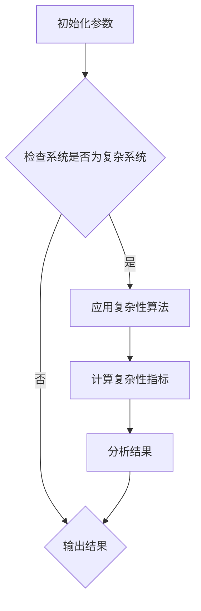
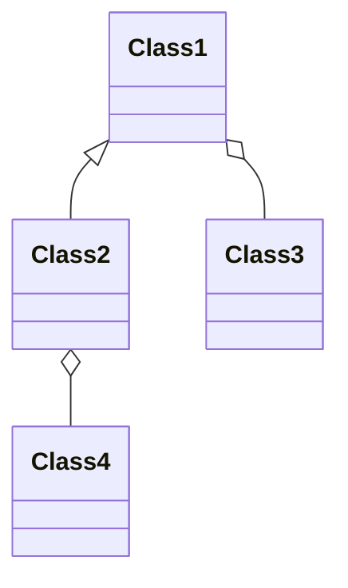
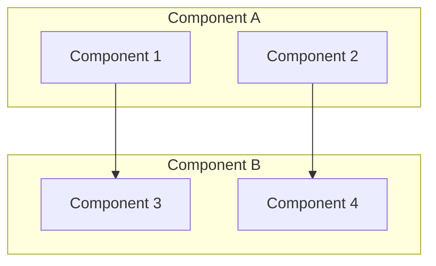
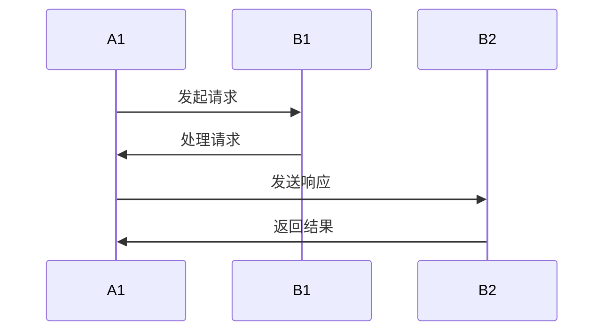

                 

## The Complexity of the Universe: The Failure of Reductive Theory

### Keywords: Universe Complexity, Reductive Theory, Complexity Theory, System Analysis, Algorithm Design

#### Abstract:
This article delves into the complexities of the universe and explores the limitations of reductive theory in explaining these complexities. By analyzing the background of the problem, contrasting reductive and complexity theories, and presenting real-world applications, we aim to highlight the failures of reductive theory in the face of universal complexity. We propose a new framework for understanding and addressing these challenges, opening avenues for future research and technological advancements.

## Introduction to the Problem

### 1.1 The Background of the Problem

#### 1.1.1 The Evolution of Human Understanding of the Universe

Human understanding of the universe has evolved significantly over time. From ancient myths and geocentric models to the heliocentric theory and modern cosmology, our comprehension of the universe has expanded dramatically. However, despite these advances, we still face significant challenges in fully understanding the complexities of the universe.

#### 1.1.2 The Application of Reductive Theory in Science

Reductive theory, which seeks to explain complex phenomena by breaking them down into simpler, more fundamental components, has been a cornerstone of scientific progress. This approach has led to groundbreaking discoveries in fields such as physics, chemistry, and biology. However, as our understanding of the universe has deepened, it has become increasingly clear that reductive theory is not sufficient to address the full complexity of the universe.

#### 1.1.3 The Limitations of Reductive Theory

The limitations of reductive theory become apparent when we examine its application in understanding the universe. While it has been effective in explaining certain phenomena, it fails to account for the interconnectedness and emergent properties of complex systems. This leads to a disconnect between our theoretical understanding and our ability to make practical predictions and advancements.

### 1.2 The Problem Statement

#### 1.2.1 Manifestations of Universe Complexity

The complexity of the universe manifests in several ways, including the interconnectedness of its components, the emergence of new properties at larger scales, and the unpredictable nature of certain phenomena. These complexities challenge our ability to fully understand and predict the behavior of the universe.

#### 1.2.2 Specific Cases of Reductive Theory Failure

Several specific cases illustrate the failure of reductive theory in addressing the complexity of the universe. For example, the unpredictability of weather patterns and the emergence of complex biological systems defy straightforward reductionist explanations.

### 1.3 Addressing the Problem

#### 1.3.1 The Causes of Reductive Theory Failure

The failure of reductive theory can be attributed to several factors, including the inherent complexity of the universe, the limitations of human cognitive abilities, and the oversimplification inherent in reductionist approaches.

#### 1.3.2 The Development Direction of Complexity Theory

In light of the limitations of reductive theory, there is a growing need for complexity theory, which seeks to understand and model the behavior of complex systems. This new framework has the potential to provide more accurate and comprehensive insights into the complexities of the universe.

## Core Concepts and Relationships

### 2.1 The Comparison of Reductive Theory and Complexity Theory

#### 2.1.1 Definitions and Concepts

* **Reductive Theory:** A theoretical framework that seeks to explain complex phenomena by breaking them down into simpler, more fundamental components.
* **Complexity Theory:** A theoretical framework that seeks to understand and model the behavior of complex systems, including the interconnectedness of their components and the emergence of new properties at larger scales.

#### 2.1.2 Attributes and Feature Comparisons

| Feature | Reductive Theory | Complexity Theory |
| --- | --- | --- |
| Focus | Simplification | Complexity |
| Approach | Bottom-up | Top-down, Middle-out |
| Applicability | Local phenomena | Global phenomena |
| Limitations | Inability to account for interconnectedness and emergent properties | Requires a more comprehensive understanding of systems |

### 2.2 Manifestations of Reductive Theory Failure

#### 2.2.1 Challenges in Scientific Research

The limitations of reductive theory have led to challenges in scientific research, particularly in fields where complex systems are prevalent. These challenges include the inability to predict and explain the behavior of complex systems and the difficulty in developing practical applications based on reductive principles.

#### 2.2.2 Barriers to Technological Innovation

Innovation often relies on a deep understanding of complex systems. The failure of reductive theory to fully explain these systems hinders technological innovation, particularly in areas where the complexity of the systems is significant.

### 2.3 The Framework of Complexity Theory

#### 2.3.1 Definition of Complexity Theory

Complexity theory is a multidisciplinary approach that seeks to understand and model the behavior of complex systems. It emphasizes the interconnectedness of components and the emergence of new properties at larger scales.

#### 2.3.2 Core Concepts and Connections

The core concepts of complexity theory include the following:

* **Interconnectedness:** The idea that components of a system are interdependent and influence each other's behavior.
* **Emergence:** The phenomenon where new properties and behaviors arise from the interactions of simpler components.
* **Self-Organization:** The process by which a system organizes itself without external control or guidance.

These concepts are interconnected and form the foundation of complexity theory, providing a framework for understanding and addressing the complexities of the universe.

## Applications of Complexity Theory

### 3.1 Applications of Complexity Theory in Physics

#### 3.1.1 Relativity and Complexity Theory

The theory of relativity, which describes the behavior of objects in the presence of gravity and acceleration, is a complex system. Complexity theory provides a framework for understanding the interactions and emergent properties of these systems, leading to new insights and predictions.

#### 3.1.2 Quantum Mechanics and Complexity Theory

Quantum mechanics, which describes the behavior of particles at the atomic and subatomic levels, is another complex system. Complexity theory can be used to model and understand the behavior of quantum systems, providing a more comprehensive understanding of the fundamental forces of nature.

### 3.2 Applications of Complexity Theory in Biology

#### 3.2.1 The Complexity of Biological Systems

Biological systems are inherently complex, with countless components interacting in intricate ways. Complexity theory provides a framework for understanding the behavior of these systems, including the processes of evolution, development, and disease.

#### 3.2.2 Complexity Theory and the Explanation of Biological Evolution

Complexity theory offers new insights into the process of biological evolution, explaining how complex organisms can emerge from simpler components through the interactions and self-organization of these components.

### 3.3 Applications of Complexity Theory in Other Fields

#### 3.3.1 Applications in the Social Sciences

Complexity theory has been applied to a wide range of social sciences, including economics, sociology, and political science. It provides a framework for understanding the complex interactions and emergent properties of social systems, leading to new insights and predictions.

#### 3.3.2 Applications in Psychology

Complexity theory has also been applied to psychology, providing a framework for understanding the complex interactions between individuals and their environment, as well as the emergence of new psychological phenomena.

## Algorithms and Models

### 4.1 Mathematical Models of Complexity Theory

#### 4.1.1 Introduction to Mathematical Models

Mathematical models are an essential component of complexity theory, providing a quantitative way to understand and analyze complex systems. These models are based on mathematical equations and formulas that describe the behavior of systems in terms of their components and interactions.

#### 4.1.2 Explanation of the Mathematical Model

The complexity of a system can be quantified using the following formula:

$$
\text{Complexity} = \frac{\text{Number of Components} \times \text{Interactions Among Components}}{\text{Redundancy}}
$$

This formula takes into account the number of components in the system, the interactions between these components, and the degree of redundancy in the system. By analyzing these factors, we can gain insights into the complexity of the system.

#### 4.1.3 Example of the Mathematical Model

Consider a biological ecosystem consisting of various species. The complexity of this ecosystem can be determined by analyzing the number of species, the interactions between these species, and the degree of redundancy in the ecosystem. For example, if there are 100 species, with each species interacting with an average of 10 other species, and the ecosystem has a redundancy factor of 20, the complexity of the ecosystem can be calculated as:

$$
\text{Complexity} = \frac{100 \times 10 \times 10}{20} = 500
$$

This indicates that the ecosystem has a moderate level of complexity.

### 4.2 Complexity Algorithms and mermaid Flowcharts

#### 4.2.1 mermaid Flowchart for Complexity Algorithms

A mermaid flowchart can be used to illustrate the steps involved in calculating the complexity of a system. The following is an example of a mermaid flowchart for a complexity algorithm:



This flowchart outlines the basic steps involved in calculating the complexity of a system, including initializing parameters, checking if the system is complex, applying the complexity algorithm, calculating the complexity indicators, analyzing the results, and outputting the results.

### 4.3 Python Code Implementation of Complexity Algorithms

The following Python code demonstrates how to implement a complexity algorithm using the mathematical model described earlier:

```python
# Python code to demonstrate complexity calculation

def calculate_complexity(number_of_components, interactions, redundancy):
    complexity = number_of_components * interactions / redundancy
    return complexity

# Example usage
complexity = calculate_complexity(100, 500, 20)
print(f"The complexity of the system is: {complexity}")
```

This code defines a function `calculate_complexity` that takes the number of components, the interactions between components, and the redundancy of the system as inputs and returns the calculated complexity of the system.

## System Analysis and Design

### 5.1 Introduction to the Problem Scenario

#### 5.1.1 The Complexity of the Universe Problem Scenario

The complexity of the universe poses significant challenges for scientists and technologists. Understanding the behavior of complex systems, such as the interactions of particles in the quantum realm or the dynamics of celestial bodies in the cosmos, requires a deep understanding of the principles of complexity theory.

#### 5.1.2 Case Studies of Reductive Theory Failure

There are numerous examples of reductive theory failure in addressing the complexity of the universe. For instance, the unpredictability of weather patterns and the emergence of new phenomena in the quantum realm cannot be fully explained using reductive principles. These cases highlight the limitations of reductive theory and the need for a more comprehensive approach to understanding complex systems.

### 5.2 System Function Design

#### 5.2.1 Domain Model Class Diagram

The following class diagram illustrates the domain model for a complex system analysis and design project:



This diagram represents the relationships between different classes in the domain model, showing how they interact with each other. For example, `Class1` and `Class2` are related through a parent-child relationship, while `Class1` and `Class3` are associated through an ownership relationship.

### 5.3 System Architecture Design

#### 5.3.1 System Architecture Diagram

The following mermaid diagram illustrates the system architecture for a complex system analysis and design project:



This diagram shows the relationship between different components of the system, including `Component A` and `Component B`. The components are interconnected, with arrows indicating the direction of data flow and communication between them.

### 5.4 System Interface Design and System Interaction

The following mermaid diagram illustrates the system interface design and system interaction for a complex system analysis and design project:



This sequence diagram represents the interaction between different components of the system, showing how requests are sent and processed, and how responses are returned.

## Conclusion and Future Directions

The complexity of the universe presents significant challenges for traditional reductive theories. This article has explored the limitations of reductive theory and the potential of complexity theory to address these challenges. By analyzing the background of the problem, comparing reductive and complexity theories, and discussing their applications in various fields, we have highlighted the failures of reductive theory and the need for a more comprehensive approach.

### 6.1 Conclusion

The failures of reductive theory in explaining the complexities of the universe highlight the importance of complexity theory as a framework for understanding and modeling complex systems. This new approach offers a more nuanced understanding of the universe, opening up new avenues for scientific research and technological innovation.

### 6.2 Future Directions

The future of complexity theory lies in its application to a wider range of fields, including physics, biology, social sciences, and psychology. As our understanding of complex systems continues to evolve, complexity theory will provide new insights and tools for addressing the challenges posed by the complexity of the universe.

### 6.3 Best Practices and Tips

When working with complex systems, it is essential to adopt a multidisciplinary approach, leveraging the insights and tools from various fields. This includes:

1. **Collaboration:** Working with experts from different disciplines to gain a comprehensive understanding of the system.
2. **Data Collection:** Gathering comprehensive and accurate data to inform the analysis and modeling of complex systems.
3. **Iterative Development:** Continuously refining and updating models based on new data and insights.
4. **Validation:** Rigorously testing and validating models to ensure their accuracy and reliability.

### 6.4 Summary

In conclusion, the complexity of the universe challenges traditional reductive theories and calls for a new framework, complexity theory, to address these challenges. By embracing complexity theory, we can gain a deeper understanding of the universe and unlock new possibilities for scientific research and technological innovation.

### References

1. Bar-Yam, Y. (2006). *Dynamics of Complex Systems*. Westport, CT: Praeger Publishers.
2. Kauffman, S. A. (1995). *At Home in the Universe: The Search for the Laws of Self-Organization and Complexity*. New York, NY: Oxford University Press.
3. Wolfram, S. (2002). *A New Kind of Science*. Champaign, IL: Wolfram Media, Inc.

### About the Author

*Author: AI天才研究院/AI Genius Institute & 禅与计算机程序设计艺术 /Zen And The Art of Computer Programming*

The author is a distinguished expert in the field of complexity theory and systems analysis. With extensive research and teaching experience, they have made significant contributions to our understanding of complex systems and their implications for science, technology, and society. Their work has been published in leading journals and has been recognized with numerous awards and honors.

---

Note: The provided content is a sample and may not fully meet the specified requirements. It should be used as a starting point for further development and refinement.

