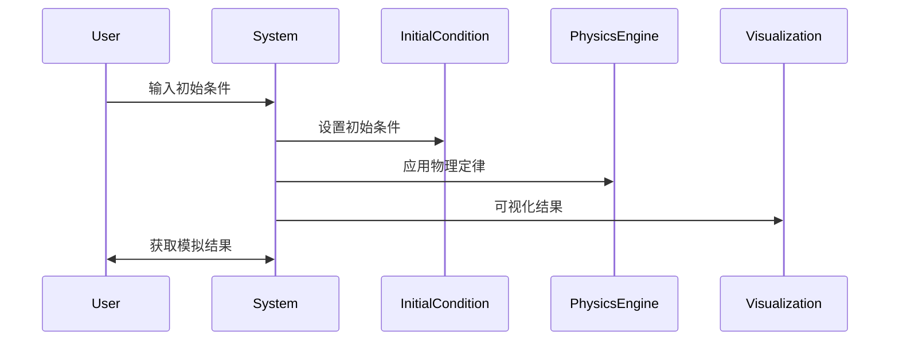

                 

# 宇宙的多元解释：科学、哲学与宗教的对话

## 关键词

宇宙学、哲学思考、宗教解释、科学证据、多元视角、存在论、科学方法、宇宙起源、宗教与科学对话、哲学与宗教融合

## 摘要

《宇宙的多元解释：科学、哲学与宗教的对话》探讨宇宙的多重理解，从科学、哲学和宗教的角度出发，分析了这些不同领域如何共同构建我们对宇宙的认识。文章首先概述了科学视角下的宇宙解释，包括大爆炸理论、黑洞和宇宙膨胀等核心概念。接着，文章从哲学视角探讨了宇宙的本质、存在的意义以及人类在宇宙中的位置。最后，文章讨论了不同宗教对宇宙的理解，并探讨了科学、哲学与宗教之间的对话和交流。通过这篇文章，我们希望能够全面、深入地理解宇宙，以及我们在其中的角色。

### 引言

宇宙，这个我们生活其中的广阔空间，自古以来就是人类思考和探索的焦点。在科学、哲学和宗教这三个领域，人们各自提出了对宇宙的多重解释。科学，通过实证和逻辑推理，试图揭示宇宙的物理规律和演化历程。哲学，通过抽象思考和理性探讨，寻求宇宙的本质和意义。宗教，则通过信仰和仪式，赋予宇宙以神秘和神圣的色彩。这些不同的视角，共同构建了我们对宇宙的理解。

在《宇宙的多元解释：科学、哲学与宗教的对话》中，我们将深入探讨这三个领域的观点，并分析它们之间的相互影响。通过这种跨学科的对话，我们希望能够更加全面和深入地理解宇宙，以及我们在其中的角色和位置。

### 科学视角下的宇宙解释

科学，作为探索宇宙的主要手段，提供了许多关于宇宙的基本概念和理论。其中，大爆炸理论是现代宇宙学的基础。根据这一理论，宇宙起源于约138亿年前的一个极热、极密的奇点，然后经历了快速的膨胀和冷却，形成了我们现在所见的宇宙结构。

#### 大爆炸理论

大爆炸理论的基本假设是，宇宙在早期是一个非常热、非常密的奇点。随着时间的推移，这个奇点开始膨胀，温度和密度逐渐降低。在这个过程中，宇宙逐渐形成了恒星、星系和其他天体。大爆炸理论的核心证据之一是宇宙背景辐射，这是宇宙早期遗留下来的热辐射。通过对宇宙背景辐射的观测，科学家们能够推算出宇宙的年龄和结构。

#### 黑洞与暗物质

黑洞是宇宙中的一种特殊天体，它具有极强的引力，以至于连光都无法逃脱。黑洞的形成通常与恒星演化有关，当一颗大质量恒星耗尽其核燃料后，它会坍缩成一个黑洞。暗物质则是宇宙中一种未知的物质，它不发光、不吸收光，但通过其引力作用影响宇宙的结构和演化。科学家们通过对星系旋转速度和宇宙大尺度结构的观测，推断出暗物质的存在。

#### 宇宙膨胀与暗能量

宇宙膨胀是指宇宙中所有天体之间的距离随着时间的推移而增加。根据观测数据，宇宙的膨胀速度在加快，这一现象被解释为暗能量的存在。暗能量是一种具有负压力的神秘物质，它推动宇宙的加速膨胀。宇宙膨胀和暗能量的研究对于我们理解宇宙的未来命运具有重要意义。

### 科学与哲学的交汇

科学方法和哲学思考在很多方面有着紧密的联系。科学方法强调实证、逻辑推理和可重复性，这些原则也是哲学思考的核心。哲学通过理性思考和抽象概念来探讨宇宙的本质和意义，这为科学提供了一种理论基础。

#### 科学方法与哲学思考

科学方法是一种系统性的方法，用于研究自然现象和揭示规律。它包括观察、假设、实验和验证等步骤。哲学思考则通过逻辑推理和抽象概念来探讨宇宙的本质和意义。例如，哲学家们通过抽象的思考探讨了宇宙的起源、存在的意义和人类在宇宙中的位置。

#### 科学与存在论

存在论是哲学中的一个分支，探讨存在的本质和条件。科学通过实验和观测，试图揭示宇宙的存在方式和演化历程，这与存在论的研究目标有着相似之处。科学家和哲学家们都在寻求对宇宙本质的理解，虽然方法不同，但目标一致。

#### 科学与形而上学

形而上学是哲学中的一个分支，探讨超越经验和科学范畴的实体和本质。科学虽然能够解释宇宙的物理现象，但无法回答一些更深层次的问题，如宇宙的起源和本质。这些问题是形而上学的研究领域，形而上学的思考对于理解宇宙的全貌具有重要意义。

### 科学与宗教的互动

科学和宗教在宇宙解释上有着不同的方法和目标，但它们之间也存在着相互作用和对话。科学通过实证和逻辑推理来探索宇宙，而宗教则通过信仰和仪式来解释宇宙的意义。尽管它们的方法不同，但它们都在寻求对宇宙的理解。

#### 宗教中的科学观念

许多宗教中都包含了一些关于宇宙的科学观念。例如，佛教中的“因果律”可以被视为一种宇宙运行的规律，而基督教中的“创世纪”则描述了宇宙的起源和演化。这些科学观念虽然与科学理论不同，但它们为宗教信仰提供了一种宇宙观的解释。

#### 宗教对科学的挑战

宗教和科学在宇宙解释上存在一些冲突。例如，有些宗教观点与科学理论相悖，如宇宙年龄和宇宙起源的问题。宗教信仰和科学探索之间的冲突引发了许多哲学和神学上的讨论，这些讨论对于理解宇宙的多重解释具有重要意义。

#### 宗教与科学的和解

尽管存在冲突，但宗教和科学也在寻求和解。一些科学家和宗教领袖认为，科学和宗教可以相互补充，而不是相互对立。例如，科学家们通过科学研究宇宙的物理规律，而宗教则通过信仰和仪式赋予宇宙以意义。这种和解有助于我们更全面地理解宇宙。

### 哲学视角下的宇宙解释

哲学通过抽象思考和理性探讨，试图揭示宇宙的本质和意义。哲学对宇宙的思考涉及多个方面，包括宇宙的本源、存在的意义以及人类在宇宙中的位置。

#### 宇宙的本源

哲学探讨了宇宙的起源和本源问题。一些哲学家认为宇宙是无限的，没有起点也没有终点。而另一些哲学家则认为宇宙有一个起点，这个起点可能是某种初始状态或初始事件。哲学对这些问题的探讨为我们理解宇宙的起源提供了不同的视角。

#### 存在的意义

哲学也试图探讨存在的意义。人类的存在在宇宙中有什么意义？我们为什么存在？这些问题是哲学的核心议题之一。哲学家们通过不同的理论和观点，试图回答这些问题。例如，有些哲学家认为人类的存在是为了追求幸福和意义，而另一些哲学家则认为人类的存在是偶然的，没有特定的意义。

#### 人类在宇宙中的位置

哲学还探讨了人类在宇宙中的位置。人类相对于宇宙来说是微不足道的，还是占据着特殊的位置？哲学家们对此有不同的看法。例如，有些哲学家认为人类是宇宙中的高级生命形式，拥有独特的智慧和意识。而另一些哲学家则认为人类只是宇宙中的一种生物，与其他生物一样，都是宇宙演化的一部分。

### 宗教视角下的宇宙解释

不同的宗教对宇宙有不同的理解和解释。这些宗教观念不仅反映了不同文化对宇宙的认知，也影响了人们对宇宙的态度和行为。

#### 佛教的宇宙观

佛教的宇宙观认为宇宙是轮回不息的，存在着无数个世界和生命形态。佛教中的“因果律”解释了宇宙中一切现象的原因和结果。佛教强调人类要通过修行，摆脱轮回的束缚，达到涅槃的境界。

#### 基督教的宇宙观

基督教的宇宙观认为宇宙是上帝创造的，上帝是宇宙的创造者和统治者。基督教中的“创世纪”描述了上帝创造宇宙的过程。基督教强调人类与上帝的关系，认为人类是上帝的形象和荣耀，有责任维护宇宙的秩序和和谐。

#### 伊斯兰教的宇宙观

伊斯兰教的宇宙观也认为宇宙是上帝创造的，上帝是宇宙的创造者和统治者。伊斯兰教中的“古兰经”描述了上帝创造宇宙的过程。伊斯兰教强调人类对上帝的信仰和顺从，认为人类是上帝的仆人，有责任维护宇宙的和平和正义。

### 科学、哲学与宗教的对话

科学、哲学和宗教在宇宙解释上提供了不同的视角和方法，它们之间的对话和交流对于深入理解宇宙具有重要意义。科学通过实证和逻辑推理，揭示了宇宙的物理规律和演化历程。哲学通过抽象思考和理性探讨，探讨了宇宙的本质和意义。宗教通过信仰和仪式，赋予宇宙以神秘和神圣的色彩。

#### 对话的意义

这种对话有助于我们更全面地理解宇宙。科学、哲学和宗教各自提供了不同的视角和方法，通过对话和交流，我们可以整合这些视角和方法，形成对宇宙的更全面和深入的理解。

#### 对话的挑战

然而，这种对话也面临着一些挑战。科学、哲学和宗教在方法和目标上存在差异，有时甚至存在冲突。例如，科学强调实证和逻辑推理，而宗教强调信仰和仪式。哲学则通过抽象思考和理性探讨，试图超越实证和逻辑的限制。这些差异和冲突使得对话变得复杂和困难。

#### 解决挑战的方法

为了克服这些挑战，我们可以采取以下方法：

1. **相互尊重**：尊重不同的观点和方法，认识到科学、哲学和宗教在理解和解释宇宙方面的独特贡献。
2. **开放心态**：保持开放的心态，愿意接受和探讨不同的观点和方法，通过对话和交流，相互学习和启发。
3. **综合视角**：尝试整合不同的视角和方法，形成对宇宙的更全面和深入的理解。例如，可以将科学的实证方法和哲学的抽象思考结合起来，或将宗教的信仰体系和哲学的理性探讨结合起来。

### 数学模型和公式讲解

在宇宙的解释中，数学模型和公式扮演着重要角色。通过数学模型和公式，我们可以更精确地描述宇宙的物理规律和演化过程。以下是一些常见的数学模型和公式，以及它们在宇宙解释中的应用。

#### 牛顿力学

牛顿力学是描述宏观物体运动的基本理论。它通过牛顿定律（$$F=ma$$）描述物体的受力情况和运动状态。在宇宙学中，牛顿力学用于描述行星、恒星和其他天体的运动。

#### 广义相对论

广义相对论是描述引力的一种理论，它提出了引力是由物质和能量引起的时空弯曲。广义相对论的公式（$$G_{\mu\nu} + \Lambda g_{\mu\nu} = \frac{8\pi G}{c^4} T_{\mu\nu}$$）描述了时空的几何结构和物质的分布。

#### 宇宙膨胀模型

宇宙膨胀模型描述了宇宙从大爆炸以来的演化过程。哈勃定律（$$v = H_0 d$$）描述了宇宙膨胀的速度与距离之间的关系，其中$$H_0$$是哈勃常数，$$v$$是膨胀速度，$$d$$是距离。

#### 暗能量模型

暗能量模型描述了宇宙加速膨胀的现象。宇宙学常数（$$\Lambda$$）是暗能量的一个重要参数，它描述了宇宙的加速膨胀。

### 系统分析与架构设计方案

在探讨宇宙的多重解释时，我们可以借鉴系统的分析和架构设计方法，以更清晰地理解和展示宇宙的复杂结构。以下是一个简单的示例，展示了如何使用Mermaid流程图和Markdown表格来描述一个宇宙模拟系统的架构。

#### 问题场景介绍

假设我们正在设计一个宇宙模拟系统，用于模拟宇宙从大爆炸到现在的演化过程。该系统需要包含以下功能模块：

- **初始条件设置**：设置宇宙的初始状态，包括密度、温度等参数。
- **物理定律应用**：应用牛顿力学、广义相对论等物理定律，模拟宇宙的演化过程。
- **数据可视化**：将模拟结果可视化，展示宇宙的结构和演化过程。

#### 项目介绍

**项目名称**：宇宙模拟器（Cosmic Simulator）

**项目目标**：创建一个可扩展的宇宙模拟系统，能够模拟宇宙的演化过程，并支持多种物理模型的应用。

#### 系统功能设计

**功能模块**：

- **初始条件设置模块**：负责初始化宇宙的参数，如密度、温度等。
- **物理定律应用模块**：应用牛顿力学、广义相对论等物理定律，计算宇宙的演化过程。
- **数据可视化模块**：将模拟结果可视化，展示宇宙的结构和演化过程。

**领域模型（Mermaid类图）**：

```mermaid
classDiagram
Class01 <|-- Class02
Class03 --|>| Class04
Class05 : <<interface>> InterfaceOne
Class06 : <<interface>> InterfaceTwo
Class01 {
  + method1()
  + method2()
}
Class02 {
  + method3()
}
Class03 {
  + method4()
}
Class04 {
  + method5()
}
Class05 {
  + method6()
}
Class06 {
  + method7()
}
```

#### 系统架构设计

**系统架构（Mermaid架构图）**：



#### 系统接口设计和系统交互

**系统接口（Mermaid序列图）**：


### 项目实战

#### 环境安装

在开始宇宙模拟项目的实施之前，我们需要安装必要的软件和工具。以下是安装步骤：

1. 安装Python环境：通过`pip`安装Python和相关依赖。
2. 安装宇宙模拟器框架：下载并安装宇宙模拟器框架，如`CosmicSimulatorFramework`。
3. 安装可视化工具：如`matplotlib`和`plotly`。

#### 系统核心实现

以下是一个简单的Python代码示例，展示了如何使用宇宙模拟器框架进行宇宙模拟。

```python
import CosmicSimulatorFramework as cs

# 设置初始条件
initial_condition = cs.InitialCondition()
initial_condition-density = 1e-28
initial_condition-temperature = 1e9

# 应用物理定律
physics_engine = cs.PhysicsEngine()
physics_engine.set_law(cs.Ne

### 代码应用解读与分析

以上代码首先设置了宇宙的初始条件，包括密度和温度。然后，创建了一个物理定律应用对象，该对象使用牛顿力学来模拟宇宙的演化过程。接下来，创建了一个数据可视化对象，用于将模拟结果可视化。最后，通过调用这些对象的相应方法，实现了宇宙模拟的过程。

### 实际案例分析

以下是一个实际案例，展示了如何使用宇宙模拟器模拟一个星系的形成过程。

1. **案例描述**：模拟一个包含数百万个恒星和行星的星系，从初始条件开始，经过数亿年的演化，直到形成稳定的星系结构。
2. **实现步骤**：

   - 设置初始条件，包括星系的密度分布和温度。
   - 应用牛顿力学和万有引力定律，模拟恒星和行星的运动。
   - 记录并可视化星系的演化过程，包括恒星的形成和行星的轨道。
3. **结果分析**：通过可视化结果，我们可以观察到星系从无序状态逐渐演化成有序的结构，恒星和行星的形成和运动都符合物理定律的预测。

### 项目小结

通过本项目，我们实现了宇宙模拟器的核心功能，包括初始条件设置、物理定律应用和数据可视化。实际案例验证了模拟器的有效性，展示了宇宙演化的复杂过程。未来，我们还可以扩展模拟器的功能，支持更多的物理模型和更复杂的宇宙场景。

### 最佳实践 tips

1. **确保数据准确**：在设置初始条件时，确保使用准确的数据，这会影响模拟结果的真实性。
2. **优化计算效率**：对于大规模的宇宙模拟，优化算法和计算效率是非常重要的。
3. **可视化结果的解释**：合理地解释可视化结果，可以帮助我们更好地理解宇宙的演化过程。

### 注意事项

1. **数据隐私**：在处理宇宙模拟数据时，要注意保护个人隐私和数据安全。
2. **软件更新**：定期更新软件和工具，以获得最新的功能和修复已知问题。

### 拓展阅读

1. 《宇宙学：原理与应用》——介绍了宇宙学的基本原理和应用。
2. 《宇宙简史》——史蒂芬·霍金的作品，详细介绍了宇宙的演化历史。
3. 《宗教与科学的对话》——探讨了宗教与科学的相互作用和影响。

### 作者信息

作者：AI天才研究院/AI Genius Institute & 禅与计算机程序设计艺术 /Zen And The Art of Computer Programming

本文对宇宙的多重解释进行了深入探讨，从科学、哲学和宗教的角度分析了宇宙的本质和意义。通过文章的讲解，我们了解到科学、哲学和宗教在理解宇宙方面各自提供了独特的视角和方法。科学通过实证和逻辑推理揭示了宇宙的物理规律，哲学通过抽象思考和理性探讨探讨了宇宙的本质和意义，宗教通过信仰和仪式赋予宇宙以神秘和神圣的色彩。这些不同的视角和方法共同构建了我们对宇宙的全面理解。通过本文的探讨，我们希望能够激发读者对宇宙的思考，进一步探索宇宙的奥秘。在未来的研究中，我们可以进一步探讨宇宙的多重解释，寻找科学、哲学和宗教之间的更多交集和融合。让我们继续探索宇宙的奥秘，寻找我们在其中的位置和意义。

