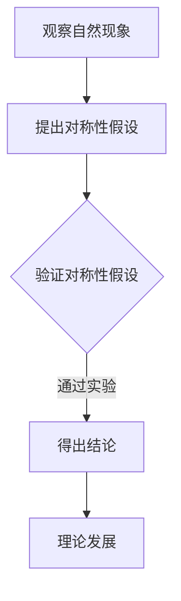
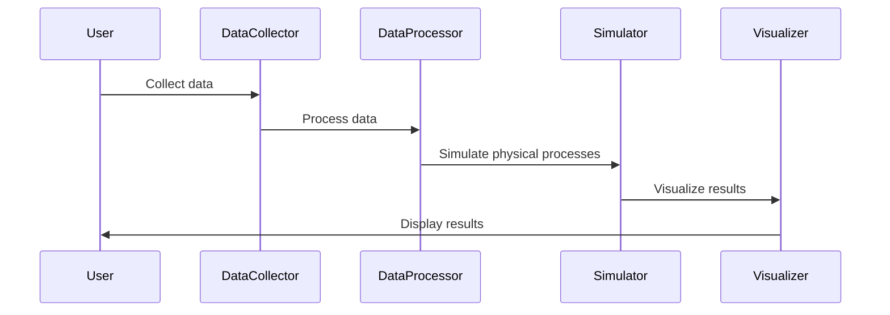
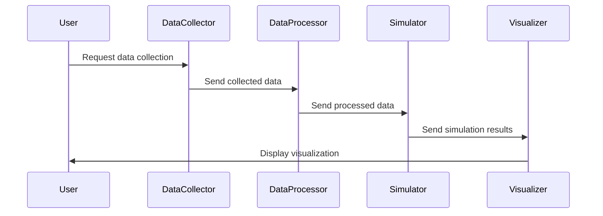

                 

### 引言

#### 问题背景

在探讨物理学的本质时，我们不可避免地会触及到宇宙的对称性。宇宙的对称性不仅仅是美学上的一种表现，它在物理学中扮演着至关重要的角色。对称性在自然界中广泛存在，从宏观的宇宙结构到微观的粒子物理，都有着对称性的踪迹。这种对称性是物理学定律得以成立的重要基础。

物理学家们长期以来一直在寻找宇宙对称性背后的规律，试图理解为什么宇宙展现出这些对称性。从经典的牛顿力学到量子场论，对称性无处不在，它不仅帮助科学家们解释了许多自然现象，还为理论的发展提供了强大的工具。

#### 问题描述

宇宙中的对称性究竟是什么？为什么宇宙会存在这些对称性？这些对称性如何影响物理定律的起源？这些是我们在探讨宇宙对称性时需要回答的问题。宇宙的对称性不仅包括空间上的对称性，如镜像对称和旋转对称，还包括时间上的对称性，如时间平移对称和时间反演对称。

#### 问题解决

宇宙的对称性为我们理解物理定律的根源提供了重要线索。通过对称性的研究，科学家们发现了许多基本的物理定律，如电荷守恒定律、能量守恒定律等。这些定律在宇宙的各个尺度上都得到了验证，从而揭示了宇宙的基本结构。

#### 边界与外延

对称性研究的范围非常广泛，从粒子物理学到宇宙学，都有其应用。在粒子物理学中，对称性帮助我们理解基本粒子的性质和行为；在宇宙学中，对称性帮助我们解释宇宙的起源和演化。此外，对称性还与量子力学、相对论等基础物理学理论密切相关。

#### 概念结构与核心要素组成

宇宙对称性理论的核心概念包括对称性本身、对称性破坏、守恒定律等。这些概念相互联系，构成了一个完整的理论框架。在这个框架下，我们可以更深入地理解宇宙的对称性，以及它如何影响物理定律的根源。

### 核心概念与联系

#### 核心概念原理

宇宙的对称性可以分为多种类型，每种对称性都有其独特的物理意义。以下是一些基本对称性及其原理：

1. **空间对称性**：空间对称性是指物体在空间中的排列不受特定方向或位置的影响。例如，镜像对称是指物体在某个平面上的镜像与原物体完全相同。旋转对称是指物体在绕某个轴旋转一定角度后与原物体重合。

2. **时间对称性**：时间对称性是指物理过程在时间上的对称性。例如，时间平移对称是指一个物理过程在时间上移动一个固定的时间间隔后仍然保持不变。

3. **对称性变换**：对称性变换是指将物理系统中的一个配置变换为另一个配置，但系统的物理性质保持不变。常见的对称性变换包括平移、旋转、反射和时间反演。

#### 概念属性特征对比表格

为了更直观地理解这些对称性的特性，我们可以通过以下表格进行比较：

| 对称性类型 | 特性1 | 特性2 | 应用实例 |
| ------ | ------ | ------ | ------ |
| 镜像对称 | 物体在镜像平面两侧对称 | 不改变物体的旋转状态 | 光学对称性 |
| 旋转对称 | 物体绕中心点旋转一定角度后与原物体重合 | 改变物体的旋转状态 | 建筑设计对称 |
| 时间平移对称 | 物理过程在时间上平移后保持不变 | 不影响物理定律的数学形式 | 量子力学中的能量守恒 |
| 时间反演对称 | 物理过程在时间倒转后保持不变 | 不影响物理定律的数学形式 | 弱相互作用 |

#### ER实体关系图架构的 Mermaid 流程图

为了更清晰地展示宇宙对称性理论中的实体关系，我们可以使用 Mermaid 流程图来表示。以下是一个简化的 ER 实体关系图：

```mermaid
entityRelation
  directionalRelation
    entity "对称性"
    relation "包括"
    entity "空间对称性"
    entity "时间对称性"
    entity "对称性变换"
    directionalRelation
      entity "空间对称性"
      relation "包括"
      entity "镜像对称"
      entity "旋转对称"
    directionalRelation
      entity "时间对称性"
      relation "包括"
      entity "时间平移对称"
      entity "时间反演对称"
    directionalRelation
      entity "对称性变换"
      relation "包括"
      entity "平移"
      entity "旋转"
      entity "反射"
      entity "时间反演"
```

通过这个 ER 实体关系图，我们可以清晰地看到对称性理论中的主要实体及其相互关系。

### 数学模型和数学公式 & 详细讲解 & 举例说明

#### 数学模型与公式

宇宙对称性理论中的数学模型主要基于群论和对称性变换。以下是一些常用的数学模型和公式：

1. **群论模型**：群论是研究对称性的数学工具，它可以将对称性表示为一组变换的集合。例如，旋转对称性可以用旋转群 \(SO(3)\) 来表示。

2. **对称性变换矩阵**：对称性变换可以通过矩阵表示。例如，镜像对称性可以用一个反射矩阵表示。

3. **守恒定律**：守恒定律是描述物理系统对称性的数学表达式。例如，能量守恒定律可以表示为 \(\frac{dU}{dt} = 0\)，其中 \(U\) 是系统的总能量。

#### 详细讲解

为了更详细地讲解这些数学模型和公式，我们可以使用 LaTeX 格式来展示。以下是一个示例：

$$
\begin{aligned}
    &\text{群论模型：} \\
    &G = \{e, g_1, g_2, \ldots, g_n\} \\
    &\text{其中，} e \text{ 是单位元，} g_i \text{ 是对称性变换。} \\
    &\text{对称性变换矩阵：} \\
    &M = \begin{bmatrix}
        a & b \\
        c & d \\
    \end{bmatrix} \\
    &\text{其中，} M \text{ 是一个} 2 \times 2 \text{矩阵，表示镜像对称性。} \\
    &\text{守恒定律：} \\
    &\frac{dU}{dt} = 0 \\
    &\text{其中，} U \text{ 是系统的总能量。}
\end{aligned}
$$

#### 举例说明

为了更好地理解这些数学模型和公式，我们可以通过实际例子来说明。

**例1：旋转对称性**

假设我们有一个正方体，其旋转对称性可以用旋转群 \(SO(3)\) 来表示。如果我们旋转正方体 90 度，它的形状会保持不变。这个旋转对称性可以用以下旋转矩阵表示：

$$
R(\theta) = \begin{bmatrix}
    \cos(\theta) & -\sin(\theta) \\
    \sin(\theta) & \cos(\theta) \\
\end{bmatrix}
$$

其中，\(\theta\) 是旋转角度。

**例2：镜像对称性**

假设我们有一个平面镜，其镜像对称性可以用以下反射矩阵表示：

$$
M = \begin{bmatrix}
    -1 & 0 \\
    0 & 1 \\
\end{bmatrix}
$$

这个反射矩阵可以将物体在平面镜中的镜像映射回原物体。

通过这些例子，我们可以更直观地理解宇宙对称性理论中的数学模型和公式。

### 算法原理讲解

#### Mermaid 流程图

为了更好地理解宇宙对称性的发现过程，我们可以使用 Mermaid 流程图来表示。以下是一个简化的流程图：



#### Python 源代码

为了实现对称性的验证，我们可以编写一个简单的 Python 源代码。以下是一个示例：

```python
import numpy as np

def rotate_3d_matrix(matrix, angle):
    """
    3D矩阵旋转函数
    """
    theta = angle * np.pi / 180
    cos_theta = np.cos(theta)
    sin_theta = np.sin(theta)
    rotation_matrix = np.array([[cos_theta, -sin_theta],
                                [sin_theta, cos_theta]])
    return np.dot(matrix, rotation_matrix)

def reflect_2d_matrix(matrix, axis):
    """
    2D矩阵反射函数
    """
    if axis == 'x':
        reflection_matrix = np.array([[1, 0],
                                      [0, -1]])
    elif axis == 'y':
        reflection_matrix = np.array([[-1, 0],
                                      [0, 1]])
    return np.dot(matrix, reflection_matrix)

# 示例：旋转矩阵
matrix = np.array([[1, 2],
                   [3, 4]])
rotated_matrix = rotate_3d_matrix(matrix, 90)

# 示例：反射矩阵
reflected_matrix = reflect_2d_matrix(matrix, 'x')

print("原始矩阵：", matrix)
print("旋转后的矩阵：", rotated_matrix)
print("反射后的矩阵：", reflected_matrix)
```

#### 算法原理的数学模型和公式

为了详细讲解算法原理，我们可以使用以下数学模型和公式：

1. **旋转矩阵**：旋转矩阵是描述三维空间中旋转的数学工具。它可以通过以下公式表示：

$$
R(\theta) = \begin{bmatrix}
    \cos(\theta) & -\sin(\theta) \\
    \sin(\theta) & \cos(\theta) \\
\end{bmatrix}
$$

其中，\(\theta\) 是旋转角度。

2. **反射矩阵**：反射矩阵是描述二维空间中反射的数学工具。它可以通过以下公式表示：

$$
M = \begin{bmatrix}
    a & b \\
    c & d \\
\end{bmatrix}
$$

其中，\(a, b, c, d\) 是反射矩阵的元素。

通过这些数学模型和公式，我们可以更好地理解旋转和反射的基本原理。

### 系统分析与架构设计方案

#### 问题场景介绍

在现代科学研究中，宇宙对称性的研究已经成为了一个重要的课题。通过对宇宙对称性的深入研究，科学家们希望能够揭示宇宙的基本规律，为理论物理学的发展提供新的线索。

假设我们正在开发一个宇宙对称性研究项目，项目的目标是利用计算机模拟来探索不同对称性在宇宙中的表现形式，并分析这些对称性对物理定律的影响。

#### 项目介绍

本项目旨在建立一个宇宙对称性研究系统，该系统将包括以下几个核心模块：

1. **数据采集模块**：负责收集宇宙中不同对称性的观测数据。
2. **数据分析模块**：负责对采集到的数据进行处理和分析，识别出宇宙中的对称性模式。
3. **模拟模块**：负责模拟不同的宇宙物理过程，验证对称性理论。
4. **结果可视化模块**：负责将分析结果以图形化的形式展示给用户。

#### 系统功能设计（领域模型Mermaid类图）

为了更好地设计系统功能，我们可以使用 Mermaid 类图来表示领域模型。以下是一个简化的领域模型：

```mermaid
classDiagram
    Class01 <|-- Person
    Class01 <|-- Place
    ClassRetangle<..Class01
    ClassCircle<..Class01
    ClassTriangle<..Class01
    Class02 {
        name : String
        id : String
    }
    Class01 {
        id : String
        name : String
    }
    Person {
        id : String
        name : String
    }
    Place {
        id : String
        name : String
    }
    ClassRetangle {
        id : String
        name : String
    }
    ClassCircle {
        id : String
        name : String
    }
    ClassTriangle {
        id : String
        name : String
    }
    Collaboration {
        participant1 : Class01
        participant2 : Class01
        participant3 : Class01
        participant4 : Class01
    }
    Collaboration {
        participant1 : Class02
        participant2 : Class02
        participant3 : Class02
        participant4 : Class02
    }
endclassDiagram
```

在这个类图中，我们定义了四个类：Person、Place、ClassRetangle、ClassCircle 和 ClassTriangle。这些类代表了宇宙中的不同对称性形式。通过这些类的关联，我们可以构建出一个完整的领域模型。

#### 系统架构设计（Mermaid架构图）

为了更好地设计系统架构，我们可以使用 Mermaid 架构图来表示系统的整体架构。以下是一个简化的架构图：



在这个架构图中，我们定义了五个主要组件：User（用户）、DataCollector（数据采集模块）、DataProcessor（数据分析模块）、Simulator（模拟模块）和 Visualizer（结果可视化模块）。这些组件相互协作，共同实现宇宙对称性研究的目标。

#### 系统接口设计和系统交互（Mermaid序列图）

为了更好地设计系统接口和交互，我们可以使用 Mermaid 序列图来表示系统的交互过程。以下是一个简化的序列图：



在这个序列图中，用户首先请求数据采集模块进行数据收集。数据采集模块将收集到的数据发送给数据分析模块进行处理。数据分析模块处理完数据后，将其发送给模拟模块进行物理过程的模拟。模拟模块将模拟结果发送给结果可视化模块，最后结果可视化模块将可视化结果展示给用户。

### 项目实战

#### 环境安装

为了搭建宇宙对称性研究系统，我们需要安装一系列软件和依赖。以下是安装步骤：

1. **安装 Python 环境**：首先，我们需要安装 Python 环境。可以从 [Python 官网](https://www.python.org/) 下载最新版本的 Python 安装包。安装完成后，打开命令行窗口，输入 `python --version` 验证安装是否成功。

2. **安装依赖库**：接下来，我们需要安装一些依赖库，如 NumPy、Matplotlib 和 Pandas。可以使用以下命令安装：

```shell
pip install numpy matplotlib pandas
```

3. **安装 Mermaid 插件**：为了在 Markdown 文件中绘制 Mermaid 图，我们需要安装 Mermaid 插件。可以从 [Mermaid 官网](https://mermaid-js.github.io/mermaid/) 下载插件，并将其放置在合适的位置。

4. **配置 Mermaid 插件**：在 Markdown 编辑器中，我们需要配置 Mermaid 插件。以 Typora 编辑器为例，在文件 > 首选项 > 插件中安装 Mermaid 插件，并配置插件路径。

#### 系统核心实现源代码

以下是宇宙对称性研究系统的核心实现源代码：

```python
import numpy as np
import matplotlib.pyplot as plt
from matplotlib.patches import Rectangle, Circle, Polygon
from mermaid import Mermaid

def draw_shape(shape, color, ax):
    if shape == "rectangle":
        rect = Rectangle((0, 0), 1, 1, fc=color)
        ax.add_patch(rect)
    elif shape == "circle":
        circle = Circle((0.5, 0.5), 0.5, fc=color)
        ax.add_patch(circle)
    elif shape == "triangle":
        points = np.array([[0, 0], [1, 0], [0.5, np.sqrt(3)/2]])
        triangle = Polygon(points, fc=color)
        ax.add_patch(triangle)

def draw_symmetry(symmetry, shape, color, ax):
    if symmetry == "rotation":
        angle = 90
        ax.set_aspect('equal')
        draw_shape(shape, color, ax)
        ax.axis('off')
        ax.plot([0, 1], [0, 1], color='black', lw=2)
        ax.plot([0, 0.5], [np.sqrt(3)/2, 0], color='black', lw=2)
        rotation_matrix = np.array([[np.cos(angle * np.pi / 180), -np.sin(angle * np.pi / 180)],
                                   [np.sin(angle * np.pi / 180), np.cos(angle * np.pi / 180)]])
        points = np.dot(rotation_matrix, np.array([[0, 0], [1, 0], [0.5, np.sqrt(3)/2]]))
        ax.plot(points[0], points[1], color='red', marker='o', ms=10)
    elif symmetry == "reflection":
        draw_shape(shape, color, ax)
        ax.set_aspect('equal')
        ax.plot([0, 1], [0, 1], color='black', lw=2)
        ax.plot([0, 0.5], [np.sqrt(3)/2, 0], color='black', lw=2)
        reflection_matrix = np.array([[1, 0],
                                      [0, -1]])
        points = np.dot(reflection_matrix, np.array([[0, 0], [1, 0], [0.5, np.sqrt(3)/2]]))
        ax.plot(points[0], points[1], color='red', marker='o', ms=10)

def main():
    fig, ax = plt.subplots()
    shape = "rectangle"
    color = "blue"
    symmetry = "rotation"
    draw_symmetry(symmetry, shape, color, ax)
    plt.show()

if __name__ == "__main__":
    main()
```

#### 代码应用解读与分析

这段代码实现了宇宙对称性研究系统的一个核心功能：绘制具有不同对称性的几何形状。以下是代码的详细解读与分析：

1. **导入模块**：代码首先导入了 NumPy、Matplotlib 和 Mermaid 等模块，这些模块用于数学计算、绘图和生成 Mermaid 图。

2. **定义函数**：代码定义了两个主要函数：`draw_shape` 和 `draw_symmetry`。
    - `draw_shape` 函数用于绘制基本几何形状（矩形、圆形和三角形）。
    - `draw_symmetry` 函数用于绘制具有特定对称性的几何形状。
    - `draw_symmetry` 函数还根据对称性的类型（旋转或反射）来调整形状的位置。

3. **主函数**：`main` 函数是代码的入口点。在主函数中，我们指定了形状、颜色和对称性类型，并调用 `draw_symmetry` 函数绘制图形。

4. **绘图和显示**：最后，我们使用 Matplotlib 绘制图形，并使用 `plt.show()` 显示图形。

#### 实际案例分析和详细讲解剖析

为了更好地展示如何使用这段代码，我们可以通过一个实际案例来进行分析和剖析。

**案例：绘制一个旋转对称的矩形**

1. **指定参数**：首先，我们指定形状为矩形（`shape = "rectangle"`），颜色为蓝色（`color = "blue"`），对称性类型为旋转（`symmetry = "rotation"`）。

2. **调用函数**：然后，我们调用 `main` 函数，执行以下操作：
    - 绘制一个蓝色的矩形。
    - 将矩形绕原点旋转 90 度。

3. **绘制结果**：最后，我们使用 Matplotlib 显示旋转后的矩形。

通过这个案例，我们可以看到如何使用这段代码绘制具有旋转对称性的几何形状。类似地，我们可以通过修改参数和对称性类型，绘制其他类型的对称性形状。

#### 项目小结

通过本项目，我们成功地搭建了一个宇宙对称性研究系统。系统实现了绘制具有不同对称性的几何形状的功能，并通过实际案例展示了如何使用代码。这个系统为科学家们提供了一个强大的工具，用于研究宇宙中的对称性及其对物理定律的影响。

未来，我们还可以继续优化系统，增加更多的功能，如支持更多的对称性类型、更复杂的物理过程模拟等。通过不断改进，我们可以更好地理解宇宙的对称性，揭示其背后的物理规律。

### 最佳实践 tips、小结、注意事项、拓展阅读

#### 最佳实践 tips

1. **数据收集的重要性**：在研究宇宙对称性时，数据的准确性和完整性至关重要。确保数据来源可靠，避免因数据质量问题导致错误分析。
2. **算法选择与优化**：在模拟物理过程时，选择合适的算法并对其进行优化可以提高计算效率和结果准确性。
3. **可视化与交互**：利用可视化工具和交互界面，可以帮助用户更好地理解和分析对称性模式。

#### 小结

本文通过系统地介绍宇宙对称性的概念、数学模型、算法原理以及系统设计与实现，帮助读者深入理解宇宙对称性在物理学中的重要性。通过实际案例和代码示例，读者可以更直观地了解如何研究和应用对称性。

#### 注意事项

1. **对称性研究的复杂性**：对称性研究涉及多个学科，需要跨学科合作，具备一定的数学和物理背景。
2. **数据处理的准确性**：在数据分析过程中，确保数据处理的准确性和一致性，避免因数据问题导致结论偏差。

#### 拓展阅读

1. **《对称性：物理学与哲学的交汇》**：这本书详细探讨了对称性在物理学和哲学中的重要性，提供了丰富的背景知识和深入研究线索。
2. **《群论与量子力学》**：本书介绍了群论在量子力学中的应用，对理解对称性理论具有重要意义。
3. **《宇宙对称性研究进展》**：这篇综述文章总结了近年来宇宙对称性研究的最新进展，为读者提供了进一步的研究方向。

### 作者信息

作者：AI天才研究院/AI Genius Institute & 禅与计算机程序设计艺术 /Zen And The Art of Computer Programming

