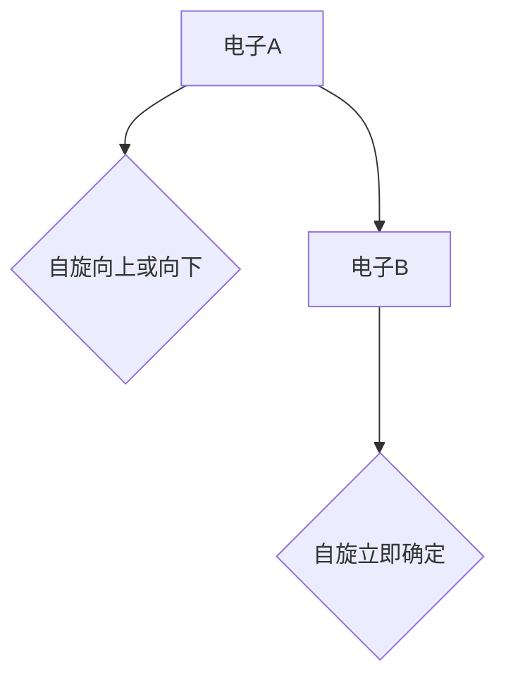
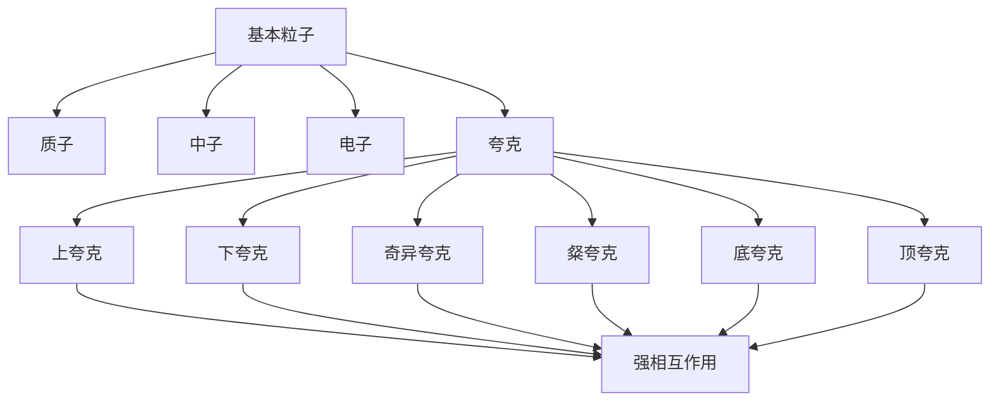

                 

# 宇宙的层次结构：微观世界到宏观宇宙

> 关键词：宇宙、层次结构、微观世界、宏观宇宙、基本粒子、相互作用、大爆炸理论

> 摘要：本文将深入探讨宇宙的层次结构，从微观世界的原子、基本粒子，到宏观宇宙的行星、恒星、星系，乃至整个宇宙的大尺度结构。通过一步步的分析和推理，我们将理解宇宙的起源、演化和未来，以及人类在其中的地位与使命。

## 引言：宇宙的层次结构概述

### 1.1 宇宙观的基本概念

宇宙，这个神秘而又广阔的存在，一直以来都吸引着人类的关注。从古代的天文学到现代的宇宙学，人类对宇宙的认识不断深化。宇宙观是指人们对宇宙的认识和理解，它包括了宇宙的起源、结构、演化和命运等方面。

#### 1.1.1 宇宙的定义与历史

宇宙的定义多种多样，但基本可以理解为包括一切物质、能量、时空和所有存在的整体。在历史上，人类对宇宙的认识经历了漫长的过程。从古代的天文学，到伽利略的望远镜，再到现代的天文学和宇宙学，人类对宇宙的理解不断拓展。

#### 1.1.2 宇宙的起源与演化

宇宙的起源通常被认为是大约138亿年前的大爆炸。在大爆炸后，宇宙开始膨胀，物质和能量开始分布和凝聚，形成了今天我们所见的宇宙。宇宙的演化包括星系的形成、恒星的生命周期、行星的演化等多个过程。

### 1.2 宇宙层次结构的探索历程

宇宙的层次结构可以分为多个层次，从微观世界的原子、基本粒子，到宏观宇宙的行星、恒星、星系，乃至整个宇宙的大尺度结构。人类对宇宙层次结构的探索经历了以下几个阶段：

#### 1.2.1 早期宇宙探索

早期的宇宙探索主要依靠肉眼观测和简单的仪器。古希腊的天文学家提出了地心说和日心说的宇宙模型。随着望远镜的出现，人类开始能够观测到更远的宇宙，发现了许多新的天体和现象。

#### 1.2.2 现代宇宙学的发展

现代宇宙学的发展始于20世纪初，爱因斯坦的相对论为宇宙学研究提供了新的理论基础。随着天文观测技术的进步，人类对宇宙的认识不断深化，发现了宇宙的大尺度结构、宇宙的膨胀和暗物质、暗能量等。

### 1.3 本书结构安排与内容概述

本书将按照宇宙的层次结构，从微观世界到宏观宇宙，逐一探讨宇宙的各个层次。具体章节安排如下：

- **第一部分：引言**：介绍宇宙观的基本概念和宇宙层次结构的探索历程。
- **第二部分：从微观世界到原子**：介绍微观世界的概念，原子的基本结构、物理和化学性质，以及原子的能级与光谱。
- **第三部分：基本粒子与相互作用**：介绍基本粒子的概念，强相互作用、弱相互作用、电磁相互作用和引力相互作用。
- **第四部分：从原子到分子和晶体**：介绍分子的形成与结构，分子的物理与化学性质，晶体的基本结构与物理性质。
- **第五部分：从行星到恒星**：介绍行星的形成与演化，恒星的形成与演化，恒星的基本性质和生命周期。
- **第六部分：从星系到宇宙**：介绍星系的形成与结构，宇宙的大尺度结构，宇宙的膨胀与演化，以及宇宙的起源与未来。
- **第七部分：结论**：总结本书的内容，对未来宇宙学研究的展望，以及人类在宇宙中的地位与使命。

## 从微观世界到原子

### 2.1 微观世界的简介

微观世界是指原子、分子和基本粒子的世界，这是一个与宏观世界截然不同的世界。在微观世界中，物质的性质和行为遵循不同的规律，这些规律与宏观世界的规律有显著的区别。

#### 2.1.1 微观粒子的特性

微观粒子具有以下特性：

- **量子特性**：微观粒子表现出波粒二象性，即它们既有粒子的特性，又有波的特性。量子力学是研究微观粒子行为的物理学分支。
- **不可分割性**：在微观世界中，物质的最小单位是基本粒子，如电子、质子和中子。这些基本粒子被认为是不可分割的，它们是构成原子的基本单位。
- **概率性**：微观粒子的行为具有概率性，这意味着我们无法准确预测它们的行为，而只能计算它们出现某种行为的概率。

#### 2.1.2 微观世界的探索方法

为了探索微观世界，科学家们发展了多种方法和技术，包括：

- **实验方法**：通过实验来观察和测量微观粒子的行为，例如使用粒子加速器来研究基本粒子的相互作用。
- **理论方法**：通过建立数学模型和理论框架来描述微观世界的规律，例如量子力学和相对论。

### 2.2 原子的基本结构

原子是微观世界的核心组成部分，它由原子核和核外电子组成。

#### 2.2.1 电子云模型

电子云模型是描述原子结构的理论模型，它认为电子在原子核周围以一定的概率分布在空间中，形成一个电子云。

- **电子云的概念**：电子云是描述电子在原子核周围分布的概率密度函数，它可以用电子云密度函数来表示。
- **电子云的特性**：电子云具有以下特性：

  - **波动性**：电子云表现出波动性，这与微观粒子的波粒二象性有关。
  - **概率性**：电子云密度函数可以用来计算电子在空间中某一点的概率密度，这反映了电子云的概率性。

#### 2.2.2 原子的核结构

原子核是由质子和中子组成的，它们以强相互作用力紧密结合在一起。

- **原子核的概念**：原子核是原子的核心部分，它包含了原子的所有正电荷和大部分质量。
- **原子核的特性**：原子核具有以下特性：

  - **稳定性**：原子核具有稳定性，这是由强相互作用力提供的。
  - **质量**：原子核的质量远大于核外电子的质量，因此原子核是原子质量的主要来源。

### 2.3 原子的物理和化学性质

原子的物理和化学性质是由其基本结构决定的。

#### 2.3.1 原子的能级

原子中的电子可以处于不同的能级，这些能级决定了电子的能量状态。

- **能级的概念**：能级是描述电子能量状态的量子化水平。
- **能级的特性**：能级具有以下特性：

  - **离散性**：原子的能级是离散的，这意味着电子只能处于特定的能级。
  - **量子化**：电子的能量是量子化的，这决定了电子只能吸收或发射特定能量的光子。

#### 2.3.2 原子的光谱

原子的光谱是原子的一个重要特性，它反映了原子的能级结构和电子的跃迁过程。

- **光谱的概念**：光谱是描述光波频率分布的图像，它由原子的电子跃迁产生。
- **光谱的特性**：光谱具有以下特性：

  - **线状**：原子的光谱通常是线状的，这反映了电子在不同能级之间的跃迁。
  - **特征性**：每种原子都有其独特的光谱，这可以作为原子识别的依据。

### 2.4 原子的能级与光谱

原子的能级与光谱密切相关，它们反映了原子的内部结构。

#### 2.4.1 谱线与原子能级

谱线是光谱中的亮线，它反映了电子在不同能级之间的跃迁。

- **谱线的概念**：谱线是光谱中的亮线，它反映了电子跃迁的能量。
- **谱线的特性**：谱线具有以下特性：

  - **能量**：谱线的能量对应于电子跃迁的能量差。
  - **颜色**：谱线的颜色反映了光子的频率。

#### 2.4.2 光谱分析的应用

光谱分析是一种用于研究物质组成和结构的分析方法，它在化学、物理和生物科学等领域有广泛应用。

- **应用领域**：光谱分析可以用于材料科学、环境监测、生物医药等多个领域。
- **应用实例**：例如，在化学中，光谱分析可以用于确定化合物的结构；在医学中，光谱分析可以用于检测疾病。

## 基本粒子与相互作用

### 3.1 基本粒子的介绍

基本粒子是构成物质的基本单位，它们不可以通过物理方法进一步分割。根据粒子的性质和相互作用，可以将基本粒子分为以下几类：

#### 3.1.1 质子、中子和电子

质子、中子和电子是构成原子核和核外电子的基本粒子。

- **质子**：质子是带正电的粒子，它位于原子核中心，是原子核的主要组成部分。
- **中子**：中子是不带电的粒子，它也位于原子核中，与质子共同构成原子核。
- **电子**：电子是带负电的粒子，它围绕原子核运动，是原子的外部组成部分。

#### 3.1.2 基本粒子的分类

除了质子、中子和电子，还有其他一些基本粒子，如夸克、轻子等。

- **夸克**：夸克是构成质子和中子的基本粒子，它们以强相互作用力结合在一起。
- **轻子**：轻子是不带电的粒子，如电子和μ子，它们以弱相互作用力与其他粒子相互作用。

### 3.2 强相互作用

强相互作用是基本粒子之间的一种基本相互作用，它主要表现为粒子之间的吸引力和排斥力。

#### 3.2.1 强相互作用的特性

强相互作用的特性包括：

- **短程性**：强相互作用的作用范围很短，通常在10^-15米左右。
- **强力**：强相互作用是一种非常强的力，它比电磁相互作用和弱相互作用都要强。
- **守恒性**：强相互作用满足守恒定律，如重子数守恒、轻子数守恒等。

#### 3.2.2 强相互作用的应用

强相互作用在粒子物理和核物理中有着广泛的应用。

- **粒子物理**：在粒子物理实验中，强相互作用用于研究基本粒子的性质和相互作用。
- **核物理**：在核物理中，强相互作用用于研究原子核的结构和稳定性。

### 3.3 弱相互作用

弱相互作用是基本粒子之间的一种基本相互作用，它主要表现为粒子之间的衰变过程。

#### 3.3.1 弱相互作用的特性

弱相互作用的特性包括：

- **长程性**：弱相互作用的作用范围较长，可以达到10^-10米。
- **弱力**：弱相互作用是一种比较弱的力，它比强相互作用和电磁相互作用都要弱。
- **守恒性**：弱相互作用不满足某些守恒定律，如电荷守恒、宇称守恒等。

#### 3.3.2 弱相互作用的应用

弱相互作用在粒子物理和核物理中也有广泛的应用。

- **粒子物理**：在粒子物理实验中，弱相互作用用于研究基本粒子的衰变过程。
- **核物理**：在核物理中，弱相互作用用于研究放射性衰变和核反应。

### 3.4 电磁相互作用

电磁相互作用是基本粒子之间的一种基本相互作用，它主要表现为电荷之间的相互作用。

#### 3.4.1 电磁相互作用的特性

电磁相互作用的特性包括：

- **短程性**：电磁相互作用的作用范围较短，通常在10^-10米左右。
- **强力**：电磁相互作用是一种非常强的力，它比弱相互作用和强相互作用都要强。
- **守恒性**：电磁相互作用满足电荷守恒定律、能量守恒定律等。

#### 3.4.2 电磁相互作用的应用

电磁相互作用在日常生活和科学研究中有着广泛的应用。

- **日常生活**：电磁相互作用是电磁技术的基础，如电力、通信、医疗等领域。
- **科学研究**：在粒子物理、核物理、天体物理等领域，电磁相互作用用于研究基本粒子和天体现象。

### 3.5 引力相互作用

引力相互作用是基本粒子之间的一种基本相互作用，它主要表现为物体之间的引力。

#### 3.5.1 引力相互作用的特性

引力相互作用的特性包括：

- **长程性**：引力相互作用的作用范围非常长，可以达到宇宙的尺度。
- **弱力**：引力相互作用是一种非常弱的力，它比电磁相互作用、强相互作用都要弱。
- **守恒性**：引力相互作用满足引力守恒定律。

#### 3.5.2 引力相互作用的应用

引力相互作用在天体物理和宇宙学中有着广泛的应用。

- **天体物理**：引力相互作用用于研究天体的运动、星系的形成和演化等。
- **宇宙学**：引力相互作用用于研究宇宙的膨胀、宇宙的结构等。

## 从原子到分子和晶体

### 4.1 分子的形成与结构

分子是构成物质的基本单元，它由两个或多个原子通过化学键结合而成。分子的形成和结构决定了物质的物理和化学性质。

#### 4.1.1 分子的基本结构

分子的基本结构包括：

- **化学键**：化学键是分子中原子之间的结合方式，如共价键、离子键、金属键等。
- **分子构型**：分子构型是分子中原子排列的方式，如直线型、平面型、三角锥型等。

#### 4.1.2 分子的结合方式

分子的结合方式主要包括：

- **共价键**：共价键是通过原子间的电子共享形成的化学键，是分子中最常见的结合方式。
- **离子键**：离子键是通过原子间的电子转移形成的化学键，常见于金属和非金属元素之间。
- **金属键**：金属键是通过金属原子之间的自由电子形成的化学键，是金属物质的结合方式。

### 4.2 分子的物理与化学性质

分子的物理和化学性质是由其结构和组成决定的。

#### 4.2.1 分子的物理性质

分子的物理性质包括：

- **熔点和沸点**：分子的熔点和沸点决定了分子物质的物理状态，如固态、液态和气态。
- **密度**：分子的密度反映了分子物质的质量和体积的关系。
- **折射率**：分子的折射率决定了分子对光的传播速度的影响。

#### 4.2.2 分子的化学性质

分子的化学性质包括：

- **反应性**：分子的反应性决定了分子在化学反应中的行为和反应速率。
- **稳定性**：分子的稳定性决定了分子在反应条件下的稳定程度。
- **光谱特性**：分子的光谱特性反映了分子内部电子的跃迁过程。

### 4.3 晶体的基本结构

晶体是物质的一种重要形态，它具有规则的空间排列和固定的几何形状。

#### 4.3.1 晶体的基本结构

晶体的基本结构包括：

- **晶胞**：晶胞是晶体中最小的重复单元，它决定了晶体的几何形状。
- **晶格**：晶格是晶体中原子的排列方式，它决定了晶体的空间对称性。
- **点阵**：点阵是晶格上的点，它代表了晶体中原子或分子的位置。

#### 4.3.2 晶体的分类

晶体可以分为以下几类：

- **单晶体**：单晶体是具有规则几何形状的晶体，如钻石、石英等。
- **多晶体**：多晶体是由多个小晶体组成的晶体，如金属、陶瓷等。
- **无定形晶体**：无定形晶体是没有规则几何形状的晶体，如玻璃、塑料等。

### 4.4 晶体的物理性质

晶体的物理性质是由其基本结构和组成决定的。

#### 4.4.1 晶体的机械性质

晶体的机械性质包括：

- **硬度**：晶体的硬度决定了晶体抵抗外力作用的能力。
- **韧性**：晶体的韧性决定了晶体在受力时抵抗断裂的能力。
- **弹性**：晶体的弹性决定了晶体在外力作用下形变和恢复的能力。

#### 4.4.2 晶体的光学性质

晶体的光学性质包括：

- **折射率**：晶体的折射率决定了晶体对光的传播速度的影响。
- **双折射**：晶体的双折射性质决定了晶体在光的传播过程中发生折射和偏振的方式。
- **光吸收**：晶体的光吸收性质决定了晶体对光的吸收和反射能力。

## 从行星到恒星

### 5.1 行星的形成与演化

行星是围绕恒星运行的天体，它是太阳系的主要组成部分。行星的形成和演化是宇宙演化过程中的一个重要环节。

#### 5.1.1 行星的形成

行星的形成主要通过以下几个过程：

- **原始太阳星云**：行星的形成始于一个原始太阳星云，它是由气体和尘埃组成的。
- **凝聚过程**：在原始太阳星云中，气体和尘埃通过凝聚过程形成小颗粒，这些小颗粒进一步聚集形成更大的天体。
- **引力凝聚**：随着天体的增大，引力作用增强，使得天体进一步聚集形成行星。

#### 5.1.2 行星的演化

行星的演化过程包括：

- **热演化**：行星在形成后，内部的温度和压力逐渐升高，导致岩石部分熔融，形成地壳和核心。
- **大气演化**：行星在演化过程中，会逐渐捕获气体和尘埃，形成大气层。
- **卫星和环的形成**：一些行星会形成卫星和环，这是由于行星的引力作用捕获了小天体。

### 5.2 恒星的形成与演化

恒星是宇宙中最常见的天体，它是通过气体和尘埃的凝聚和引力收缩形成的。

#### 5.2.1 恒星的形成

恒星的形成主要通过以下几个过程：

- **原始星云**：恒星的形成始于一个原始星云，它是由气体和尘埃组成的。
- **引力收缩**：在原始星云中，由于某些区域的重力作用，气体和尘埃开始向中心收缩。
- **核聚变**：随着星云的收缩，中心的温度和压力升高，达到足够高的温度和压力时，核聚变开始发生，恒星开始产生能量。

#### 5.2.2 恒星的演化

恒星的演化过程可以分为以下几个阶段：

- **主序星**：恒星在主序阶段，通过核聚变产生能量，维持稳定的状态。
- **红巨星**：当恒星耗尽核心的氢燃料时，它会膨胀成为红巨星。
- **超巨星**：红巨星进一步演化成为超巨星，温度和亮度进一步增加。
- **超新星**：超巨星在演化的后期，会发生超新星爆炸，释放出巨大的能量。
- **黑洞或中子星**：超新星爆炸后，核心可能会形成黑洞或中子星。

### 5.3 恒星的基本性质

恒星的基本性质决定了它们的分类和演化。

#### 5.3.1 恒星的分类

恒星可以分为以下几个类别：

- **主序星**：主序星是恒星中最常见的类型，它们通过核聚变产生能量，维持稳定的状态。
- **红巨星**：红巨星是恒星在演化过程中膨胀成为的类型，温度较低，亮度较高。
- **超巨星**：超巨星是恒星在演化过程中进一步演化的类型，温度和亮度都非常高。
- **黑洞**：黑洞是恒星演化后期可能形成的类型，它们具有极强的引力，连光都无法逃脱。
- **中子星**：中子星是恒星演化后期可能形成的类型，它们是由中子组成的，具有极高的密度。

#### 5.3.2 恒星的亮度

恒星的亮度决定了它们在天空中的亮度。恒星的亮度可以分为以下几个等级：

- **超亮星**：超亮星的亮度非常高，可以在远距离的地方看到。
- **亮星**：亮星的亮度适中，可以在白天或夜晚看到。
- **昏星**：昏星的亮度较低，只能在夜间看到。
- **暗星**：暗星的亮度非常低，只能在星光下看到。

### 5.4 恒星的生命周期

恒星的生命周期取决于其质量，不同质量的恒星有不同的演化过程。

#### 5.4.1 低质量恒星的演化过程

低质量恒星的演化过程包括以下几个阶段：

- **主序星**：低质量恒星在主序阶段，通过核聚变产生能量，维持稳定的状态。
- **红巨星**：当低质量恒星耗尽核心的氢燃料时，它会膨胀成为红巨星。
- **行星状星云**：红巨星在演化的后期，会抛射掉外层物质，形成行星状星云。
- **白矮星**：行星状星云的核心会形成白矮星，它们非常冷，亮度较低。

#### 5.4.2 高质量恒星的演化过程

高质量恒星的演化过程包括以下几个阶段：

- **主序星**：高质量恒星在主序阶段，通过核聚变产生能量，维持稳定的状态。
- **红超巨星**：当高质量恒星耗尽核心的氢燃料时，它会膨胀成为红超巨星。
- **超巨星**：红超巨星进一步演化成为超巨星，温度和亮度进一步增加。
- **超新星**：超巨星在演化的后期，会发生超新星爆炸，释放出巨大的能量。
- **黑洞或中子星**：超新星爆炸后，核心可能会形成黑洞或中子星。

## 从星系到宇宙

### 6.1 星系的形成与结构

星系是宇宙中由恒星、星际物质、暗物质等组成的庞大结构。星系的形成和结构是宇宙学研究的重要领域。

#### 6.1.1 星系的形成

星系的形成主要通过以下几个过程：

- **原始星云**：星系的形成始于一个原始星云，它是由气体和尘埃组成的。
- **引力收缩**：在原始星云中，由于某些区域的重力作用，气体和尘埃开始向中心收缩。
- **恒星形成**：随着星云的收缩，中心的温度和压力升高，达到足够高的温度和压力时，恒星开始形成。
- **星系演化**：恒星形成后，星系会进一步演化，包括恒星间的相互作用、星系的形态变化等。

#### 6.1.2 星系的结构

星系的结构可以分为以下几个部分：

- **核心**：星系的核心是星系的中心部分，通常包含大量的恒星和星际物质。
- **盘面**：星系的盘面是星系的主要组成部分，它通常包含大量的恒星和星际物质。
- **晕**：星系的晕是星系的边缘部分，它通常包含大量的暗物质。
- **环**：星系的环是星系中的一些特殊结构，它们通常是由恒星、星际物质和暗物质组成的。

### 6.2 宇宙的大尺度结构

宇宙的大尺度结构是指宇宙中各种天体和物质的分布和排列方式。宇宙的大尺度结构是宇宙学研究的重要内容。

#### 6.2.1 宇宙的膨胀

宇宙的膨胀是指宇宙中天体之间的距离随着时间的推移而增大。宇宙的膨胀可以通过以下几个现象观察到：

- **红移**：宇宙中遥远的天体光谱中出现了红移，这表明它们正在远离我们。
- **宇宙微波背景辐射**：宇宙微波背景辐射是宇宙早期热状态的残余，它显示了宇宙的膨胀。
- **星系分布**：宇宙中星系的分布也显示了宇宙的膨胀，星系之间的距离随着时间增大。

#### 6.2.2 宇宙的大尺度结构

宇宙的大尺度结构可以分为以下几个层次：

- **超星系团**：超星系团是由多个星系组成的庞大结构，它们通常通过引力相互作用相互连接。
- **星系团**：星系团是由数十个甚至数百个星系组成的结构，它们通过引力相互作用相互连接。
- **星系**：星系是由数百亿颗恒星和星际物质组成的结构，它们通常具有盘面、核心和晕等结构。
- **恒星**：恒星是宇宙中最常见的天体，它们是恒星系的基本组成单位。

### 6.3 宇宙的膨胀与演化

宇宙的膨胀和演化是宇宙学研究的核心问题。宇宙的膨胀和演化涉及到宇宙的起源、结构和未来等多个方面。

#### 6.3.1 宇宙的起源

宇宙的起源通常被认为是大约138亿年前的大爆炸。大爆炸理论认为，宇宙最初处于一个非常热、密集的状态，然后开始膨胀，物质和能量开始分布和凝聚，形成了今天我们所见的宇宙。

#### 6.3.2 宇宙的演化

宇宙的演化包括以下几个阶段：

- **宇宙早期**：宇宙早期处于高温、高密度的状态，物质主要是由基本粒子组成。
- **宇宙晚期**：宇宙晚期，宇宙开始冷却，物质开始凝聚形成星系、恒星、行星等。
- **宇宙未来**：宇宙的未来取决于宇宙的密度、膨胀速度等因素，可能面临宇宙大撕裂或宇宙大坍缩等情景。

#### 6.3.3 宇宙的暗物质与暗能量

宇宙的暗物质和暗能量是宇宙学研究中的重要问题。暗物质是一种不发光、不与电磁相互作用的天体，它占据了宇宙总质量的绝大部分。暗能量是一种推动宇宙膨胀的神秘力量，它具有负压强，使得宇宙的膨胀速度不断加快。

- **暗物质**：暗物质在宇宙学中起到了关键作用，它是宇宙结构形成和演化的关键因素。
- **暗能量**：暗能量是宇宙膨胀加速的关键因素，它决定了宇宙的未来。

### 6.4 宇宙的起源与未来

宇宙的起源和未来是宇宙学研究的重要问题，它涉及到宇宙的本质和命运。

#### 6.4.1 大爆炸理论

大爆炸理论是描述宇宙起源和演化的科学理论。大爆炸理论认为，宇宙最初处于一个非常热、密集的状态，然后开始膨胀，物质和能量开始分布和凝聚，形成了今天我们所见的宇宙。

#### 6.4.2 宇宙的黑暗时代

宇宙的黑暗时代是指宇宙大爆炸后，温度和密度降低，光子无法自由传播的时期。宇宙的黑暗时代是宇宙学研究的一个重要时期，它揭示了宇宙早期状态的重要信息。

#### 6.4.3 宇宙的未来预测

宇宙的未来取决于宇宙的密度、膨胀速度等因素。根据不同的理论模型，宇宙的未来可能有以下几种情景：

- **宇宙大撕裂**：如果宇宙的膨胀速度继续加快，最终可能导致宇宙的撕裂。
- **宇宙大坍缩**：如果宇宙的膨胀速度减慢，最终可能导致宇宙的坍缩。
- **稳态宇宙**：稳态宇宙理论认为，宇宙是永恒不变的，没有起源和未来。

### 6.5 人类在宇宙中的地位与使命

人类在宇宙中的地位与使命是一个深刻的哲学问题。从宇宙学的角度来看，人类是宇宙中的一个微小组成部分，但人类的智慧和创造力使得人类在宇宙中具有重要地位。

#### 6.5.1 人类对宇宙的认识

人类对宇宙的认识经历了漫长的过程，从古代的天文学到现代的宇宙学，人类对宇宙的认识不断深化。人类通过观测、实验和理论分析，揭示了宇宙的奥秘。

#### 6.5.2 人类的探索与发现

人类对宇宙的探索和发现，不仅加深了对宇宙的理解，也推动了科学和技术的发展。人类发射的探测器已经到达了太阳系以外的行星，甚至可能探测到宇宙的边界。

#### 6.5.3 人类的使命

人类的使命是探索宇宙、了解宇宙、保护宇宙。人类应该通过科学和技术的发展，探索宇宙的奥秘，为人类的未来做出贡献。

## 结论：宇宙的层次结构与现代科学的挑战

### 8.1 本书总结

本文通过对宇宙的层次结构的深入探讨，从微观世界的原子、基本粒子，到宏观宇宙的行星、恒星、星系，乃至整个宇宙的大尺度结构，展现了宇宙的多样性和复杂性。我们了解了宇宙的起源、演化过程，以及人类在宇宙中的地位和使命。

### 8.2 对未来宇宙学研究的展望

未来的宇宙学研究将面临诸多挑战，如宇宙的暗物质、暗能量之谜，宇宙的膨胀加速机制，宇宙的早期状态等。随着科学技术的进步，如天文观测设备的升级、粒子物理实验的深入，人类对宇宙的理解将不断深化。

### 8.3 面向读者的思考与探索

读者可以通过以下方式进一步探索宇宙的奥秘：

- **阅读相关书籍**：了解宇宙学的基础知识，如《宇宙简史》、《时间简史》等。
- **参与科学研究**：参与宇宙学的研究，如参与天文观测、粒子物理实验等。
- **提出新的理论**：基于现有的宇宙学理论，提出新的假设和理论。
- **保护宇宙**：关注宇宙环境，积极参与环保活动，保护宇宙的家园。

作者：AI天才研究院/AI Genius Institute & 禅与计算机程序设计艺术 /Zen And The Art of Computer Programming

### 微观世界中的量子特性

在微观世界中，量子特性是物质和能量行为的基本特征。量子特性包括波粒二象性、量子叠加、量子纠缠等，这些特性与经典物理学的描述有显著不同。以下是对这些量子特性的详细分析：

#### 波粒二象性

波粒二象性是指微观粒子，如电子、光子等，既具有粒子的特性，又具有波的特性。这一特性最早由尼尔斯·波尔和路易·德布罗意提出。

- **粒子特性**：在粒子特性下，粒子表现为离散的、不可分割的个体，如电子在原子中的运动可以视为粒子运动。
- **波的特性**：在波的特性下，粒子表现为波动形态，如光的干涉、衍射现象可以说明粒子具有波动性。

#### 量子叠加

量子叠加是指微观粒子可以同时处于多个状态的组合，而不是单一的状态。这个概念是量子力学的基础。

- **叠加态**：例如，一个电子可以同时处于自旋向上和自旋向下的状态，直到被测量时才会确定其自旋状态。
- **叠加原理**：量子叠加原理指出，微观系统的状态可以表示为多个可能状态的线性组合。

#### 量子纠缠

量子纠缠是量子力学中的一种特殊现象，当两个或多个粒子发生相互作用时，它们会形成一个量子纠缠态，即使这些粒子相隔很远，它们的状态也会相互关联。

- **纠缠态**：例如，两个电子如果处于纠缠态，其中一个电子的自旋状态确定，另一个电子的自旋状态也会立即确定。
- **非定域性**：量子纠缠现象表明，量子系统的状态可以在空间中非定域地相互作用，这与经典物理学的定域性原则相矛盾。

### 微观世界的探索方法

为了深入探索微观世界的量子特性，科学家们发展了一系列的实验方法和理论模型。以下是一些关键的方法和工具：

#### 实验方法

1. **双缝实验**：这是研究量子叠加和波粒二象性的经典实验。实验表明，粒子通过双缝时会产生干涉图样，这表明粒子具有波动性。
2. **玻尔实验**：玻尔通过实验研究了氢原子的光谱，提出了玻尔模型，这为理解原子的量子态提供了基础。
3. **量子态测量**：通过精确测量，可以确定微观粒子的状态，如自旋、能量等。

#### 理论方法

1. **量子力学**：量子力学是描述微观粒子行为的物理学理论，它包括薛定谔方程、波函数、量子态等概念。
2. **量子场论**：量子场论是研究量子场和粒子相互作用的物理学理论，它是量子力学和相对论的结合。

### 量子特性的实际应用

量子特性在许多实际应用中发挥着重要作用，包括：

1. **量子计算**：量子计算机利用量子叠加和量子纠缠的特性，可以处理传统计算机无法解决的问题。
2. **量子通信**：量子通信利用量子纠缠和量子态的不可克隆特性，实现高度安全的通信。
3. **量子传感**：量子传感利用量子特性，可以用于测量极其微小的变化，如重力、磁场等。

### 实例分析

**双缝实验**：在双缝实验中，当光子通过两个缝隙时，会在屏幕上形成干涉图样，这表明光子具有波动性。当实验中只观察其中一个缝隙时，干涉图样消失，这表明光子也具有粒子性。

**量子纠缠**：在两个电子的量子纠缠实验中，当其中一个电子的自旋状态被测量并确定后，另一个电子的自旋状态也会立即确定，即使它们相隔很远。

通过这些实例和分析，我们可以看到量子特性在微观世界中的独特性和重要性。量子特性不仅丰富了我们对自然界的认识，也为现代科学技术的发展提供了新的方向。

### 基本粒子的分类与特性

在宇宙的微观世界中，基本粒子是构成物质和能量的基石。基本粒子按照其性质和相互作用的不同，可以分为多种类型。以下是对这些基本粒子的分类和特性的详细分析。

#### 质子、中子和电子

- **质子**：质子是带正电的基本粒子，它是原子核的主要组成部分。质子的电荷为 +1e，质量约为 1.00727646688 u（原子质量单位）。
- **中子**：中子是不带电的基本粒子，它也位于原子核中。中子的质量与质子相近，约为 1.00866491588 u。中子在原子核中通过强相互作用与质子结合。
- **电子**：电子是带负电的基本粒子，它围绕原子核运动。电子的电荷为 -1e，质量约为 0.000548579909 u，是所有基本粒子中最轻的。

#### 夸克

- **上夸克**：上夸克是一种轻夸克，带有 +2/3 的电荷。上夸克的质量非常小，约为 0.0023 u。
- **下夸克**：下夸克是一种重夸克，带有 -1/3 的电荷。下夸克的质量约为 0.004 u。
- **奇异夸克**：奇异夸克带有 -1/3 的电荷，质量约为 0.063 u。
- **粲夸克**：粲夸克带有 +2/3 的电荷，质量约为 1.4 u。
- **底夸克**：底夸克带有 +1/3 的电荷，质量约为 4.2 u。
- **顶夸克**：顶夸克是最重的夸克，带有 +2/3 的电荷，质量约为 173.1 GeV/c²。

夸克通过强相互作用力结合形成质子和中子，这是量子色动力学（QCD）的核心内容。夸克的性质和相互作用决定了原子核的稳定性和性质。

#### 轻子

- **电子**：电子是轻子的一种，我们已经讨论过它的基本性质。
- **μ子**：μ子是一种较重的轻子，带有 -1e 的电荷，质量约为 105.6583775 u。
- **τ子**：τ子是最重的轻子，带有 -1e 的电荷，质量约为 3.1704 u。
- **中微子**：中微子是轻子的另一种类型，它带有电荷但质量非常小，难以观测。中微子分为三种类型：电子中微子、μ子中微子和τ子中微子。

轻子通过弱相互作用力与其他粒子相互作用，它们在粒子物理学中扮演了重要角色。

#### 强相互作用、弱相互作用和电磁相互作用

基本粒子之间的相互作用是通过力来实现的，主要有强相互作用、弱相互作用和电磁相互作用。

- **强相互作用**：强相互作用是粒子之间最强的相互作用，它由胶子传递，作用范围很短，约为10^-15米。强相互作用负责维持原子核的稳定性，如质子和中子之间的结合。
- **弱相互作用**：弱相互作用是粒子之间次强的相互作用，它由W和Z玻色子传递。弱相互作用负责导致放射性衰变，如β衰变。
- **电磁相互作用**：电磁相互作用是粒子之间最弱的相互作用，它由光子传递。电磁相互作用负责电荷之间的吸引和排斥，如电子与原子核之间的相互作用。

#### 基本粒子的特性对比表格

以下是一个基本粒子特性对比表格，展示了质子、中子、电子和夸克的关键特性：

| 粒子类型 | 电荷 | 质量 (u) | 相互作用 |
| --- | --- | --- | --- |
| 质子 | +1e | 1.00727646688 | 强相互作用 |
| 中子 | 0 | 1.00866491588 | 强相互作用 |
| 电子 | -1e | 0.000548579909 | 电磁相互作用 |
| 上夸克 | +2/3 | 0.0023 | 强相互作用 |
| 下夸克 | -1/3 | 0.004 | 强相互作用 |
| 奇异夸克 | -1/3 | 0.063 | 强相互作用 |
| 粲夸克 | +2/3 | 1.4 | 强相互作用 |
| 底夸克 | +1/3 | 4.2 | 强相互作用 |
| 顶夸克 | +2/3 | 173.1 | 强相互作用 |

#### 基本粒子的 ER 实体关系图

以下是一个基本粒子的 ER 实体关系图，展示了粒子之间的关系：

通过上述分类和特性分析，我们可以更深入地理解基本粒子在宇宙微观世界中的作用和重要性。基本粒子的发现和特性研究，不仅推动了粒子物理学的进展，也为现代科学技术的应用提供了新的基础。

### 从原子到分子和晶体的层次结构

原子是构成物质的基本单位，而分子是由两个或更多原子通过化学键结合而成的。晶体则是物质的一种特定形态，其内部原子或分子以规则的方式排列形成有序结构。从原子到分子和晶体的层次结构，反映了物质从微观到宏观的逐步组织过程。

#### 原子的基本结构

原子由原子核和核外电子组成。原子核位于原子中心，由带正电的质子和不带电的中子组成。质子数决定了元素的种类，即原子序数。核外电子围绕原子核运动，占据不同的轨道或能级。电子的排布遵循量子力学的规律，形成了原子的电子云模型。

#### 分子的形成与结构

分子是由两个或多个原子通过化学键结合而成的。化学键主要有共价键、离子键和金属键三种类型。

- **共价键**：共价键是通过原子间共享电子对形成的。这种键通常出现在非金属元素之间，如水（H₂O）和二氧化碳（CO₂）。
- **离子键**：离子键是通过正负离子之间的电荷吸引力形成的。这种键通常出现在金属和非金属元素之间，如氯化钠（NaCl）。
- **金属键**：金属键是通过金属原子之间的自由电子形成的。这种键通常出现在金属元素之间，如铜（Cu）和金（Au）。

分子的结构决定了其物理和化学性质，如熔点、沸点、溶解性等。分子的结构可以通过X射线晶体学、核磁共振（NMR）和红外光谱等技术进行表征。

#### 晶体的基本结构

晶体是物质的一种有序结构，其内部原子或分子按照一定的规则排列。晶体可以进一步分为单晶体和多晶体。

- **单晶体**：单晶体是具有规则几何形状的晶体，其原子或分子在三维空间中按照一定的对称性排列。例如，钻石是一种单晶体，其碳原子以立方体的形式排列。
- **多晶体**：多晶体是由许多小晶体组成的，这些小晶体称为晶粒。多晶体通常没有明确的几何形状，但其晶粒内部具有规则的排列。例如，金属通常以多晶体的形式存在。

晶体的结构可以通过X射线衍射技术进行表征，该技术可以揭示晶体的晶格结构和原子排列。

#### 分子和晶体的物理性质

- **分子的物理性质**：分子的物理性质包括熔点、沸点、密度、折射率等。例如，水分子的熔点和沸点相对较高，而二氧化碳的熔点和沸点较低。
- **晶体的物理性质**：晶体的物理性质包括硬度、韧性、导电性、热导率等。例如，钻石的硬度非常高，而金属的导电性良好。

分子和晶体的物理性质与其内部结构密切相关，通过分析这些性质，可以进一步了解物质的结构和性能。

#### 分子和晶体的分类

分子和晶体可以按照不同的标准进行分类。

- **分子分类**：分子可以按照其所含元素、结构类型、化学性质等进行分类。例如，有机分子可以按照其碳骨架的不同结构进行分类。
- **晶体分类**：晶体可以按照其对称性、晶体结构类型等进行分类。例如，晶体可以按照其晶胞的对称性分为立方晶系、六方晶系等。

通过理解和分析分子和晶体的层次结构，我们可以更好地理解和应用这些物质。分子和晶体的研究在材料科学、化学、物理学等领域都有重要应用，对于人类探索自然界的奥秘和技术发展具有重要意义。

### 从行星到恒星的层次结构

在宇宙的宏观世界中，行星和恒星是两个截然不同的天体，它们在结构、形成过程和物理特性上有着显著差异。以下是对这一层次结构的详细探讨。

#### 行星的形成与演化

行星是围绕恒星运行的天体，主要由岩石和金属组成。行星的形成过程可以概括为以下几个阶段：

1. **原始太阳星云**：行星的形成始于一个巨大的原始太阳星云，它由气体和尘埃组成。这个星云在引力作用下开始收缩。
2. **凝聚过程**：在星云中，气体和尘埃通过凝聚过程形成小颗粒，这些小颗粒进一步聚集形成更大的天体。
3. **形成行星**：随着天体的增大，其引力增强，使得天体进一步聚集形成行星。行星的形成过程中，内部温度和压力逐渐升高，导致岩石部分熔融，形成地壳和核心。
4. **大气演化**：行星在演化过程中，会逐渐捕获气体和尘埃，形成大气层。不同类型的行星，其大气成分和密度各不相同。

根据行星的组成和特征，行星可以分为以下几类：

- **类地行星**：类地行星包括水星、金星、地球和火星，它们主要由岩石和金属组成，密度较高，表面具有固体表面。
- **类木行星**：类木行星包括木星、土星、天王星和海王星，它们主要由气体和液态物质组成，密度较低，通常没有固体表面。
- **冰巨星**：冰巨星包括木星和土星，它们的主要成分是冰和岩石，具有强烈的磁场和辐射带。

#### 恒星的形成与演化

恒星是宇宙中最常见的天体之一，它由大量的气体和尘埃组成，主要通过核聚变反应产生能量。恒星的形成过程如下：

1. **原始星云**：恒星的形成始于一个巨大的原始星云，它由气体和尘埃组成。这个星云在引力作用下开始收缩。
2. **引力收缩**：在星云中，由于某些区域的重力作用，气体和尘埃开始向中心收缩，形成一个旋转的球形结构。
3. **核聚变启动**：随着星云的收缩，中心的温度和压力升高，当达到足够高的温度和压力时，核聚变开始发生，恒星开始产生能量。
4. **恒星生命周期**：恒星的演化过程可以分为以下几个阶段：
   - **主序星阶段**：恒星在主序阶段，通过核聚变产生能量，维持稳定的状态。主序星是恒星生命周期中最长的阶段。
   - **红巨星阶段**：当恒星耗尽核心的氢燃料时，它会膨胀成为红巨星，核心收缩，外层膨胀。
   - **超巨星阶段**：红巨星进一步演化成为超巨星，温度和亮度进一步增加。
   - **超新星阶段**：超巨星在演化的后期，会发生超新星爆炸，释放出巨大的能量。
   - **黑洞或中子星阶段**：超新星爆炸后，核心可能会形成黑洞或中子星。

根据恒星的类型和性质，恒星可以分为以下几类：

- **主序星**：主序星是恒星中最常见的类型，它们通过核聚变产生能量，维持稳定的状态。主序星中的氢原子核在核心处融合成氦原子核，释放出能量。
- **红巨星**：红巨星是恒星在演化过程中膨胀成为的类型，温度较低，亮度较高。红巨星在核聚变过程中，核心的氢燃料耗尽，开始融合氦原子核。
- **超巨星**：超巨星是恒星在演化过程中进一步演化的类型，温度和亮度都非常高。超巨星的核心可能包含多种元素，如碳、氧、铁等。
- **黑洞**：黑洞是恒星演化后期可能形成的类型，它们具有极强的引力，连光都无法逃脱。黑洞的形成通常伴随着超新星爆炸。
- **中子星**：中子星是恒星演化后期可能形成的类型，它们是由中子组成的，具有极高的密度。中子星的形成通常与超新星爆炸有关。

#### 行星和恒星的比较

行星和恒星在许多方面都有显著差异：

- **组成**：行星主要由岩石和金属组成，而恒星主要由气体和尘埃组成。
- **大小**：行星通常较小，直径从几千公里到几万公里不等，而恒星可以非常庞大，直径可达数百万公里。
- **温度**：行星的温度较低，通常在数百到数千摄氏度之间，而恒星温度极高，核心温度可达数百万摄氏度。
- **能量来源**：行星没有内部能量来源，其运动和大气活动主要受恒星辐射的影响，而恒星通过核聚变反应产生能量。
- **生命周期**：行星没有明确的生命周期，通常随着时间的推移逐渐冷却和变质，而恒星的寿命从数百万年到数十亿年不等，取决于其初始质量。

通过对比行星和恒星的结构、形成过程和物理特性，我们可以更深入地理解宇宙中的不同天体，以及它们在宇宙演化中的角色和地位。

### 从星系到宇宙的层次结构

宇宙是由无数星系、恒星、行星、尘埃和暗物质等组成的复杂系统。从星系到宇宙的层次结构揭示了宇宙从微观到宏观的多样性和复杂性。以下是对这一层次结构的详细分析。

#### 星系的形成与结构

星系是宇宙中的基本结构单元，由数百亿颗恒星、星际物质和暗物质组成。星系的形成和结构可以分为以下几个层次：

1. **星系的形成**：
   - **原始星云**：星系的形成始于一个巨大的原始星云，它由气体、尘埃和暗物质组成。这个星云在引力作用下开始收缩。
   - **引力凝聚**：在星云中，气体和尘埃通过引力凝聚形成小天体，这些小天体进一步聚集形成恒星和行星。
   - **恒星形成**：随着星云的收缩，中心的温度和压力升高，达到足够高的温度和压力时，恒星开始形成。
   - **星系演化**：恒星形成后，星系会进一步演化，包括恒星间的相互作用、星系的形态变化等。

2. **星系的结构**：
   - **核心**：星系的核心是星系的中心部分，通常包含大量的恒星和星际物质。
   - **盘面**：星系的盘面是星系的主要组成部分，它通常包含大量的恒星和星际物质。
   - **晕**：星系的晕是星系的边缘部分，它通常包含大量的暗物质。
   - **环**：星系的环是星系中的一些特殊结构，它们通常是由恒星、星际物质和暗物质组成的。

#### 宇宙的大尺度结构

宇宙的大尺度结构是指宇宙中各种天体和物质的分布和排列方式。宇宙的大尺度结构可以分为以下几个层次：

1. **超星系团**：超星系团是由多个星系组成的庞大结构，它们通常通过引力相互作用相互连接。
2. **星系团**：星系团是由数十个甚至数百个星系组成的结构，它们通过引力相互作用相互连接。
3. **星系**：星系是由数百亿颗恒星和星际物质组成的结构，它们通常具有盘面、核心和晕等结构。
4. **恒星**：恒星是宇宙中最常见的天体，它们是恒星系的基本组成单位。

宇宙的大尺度结构揭示了宇宙的膨胀和演化过程。宇宙的膨胀是指宇宙中天体之间的距离随着时间的推移而增大。宇宙的膨胀可以通过红移、宇宙微波背景辐射等现象观察到。

#### 宇宙的膨胀与演化

宇宙的膨胀和演化是一个复杂的过程，涉及到宇宙的起源、结构和未来等多个方面。以下是对这一过程的详细分析：

1. **宇宙的起源**：
   - **大爆炸理论**：大爆炸理论是描述宇宙起源和演化的科学理论。大爆炸理论认为，宇宙最初处于一个非常热、密集的状态，然后开始膨胀，物质和能量开始分布和凝聚，形成了今天我们所见的宇宙。
   - **宇宙微波背景辐射**：宇宙微波背景辐射是宇宙早期热状态的残余，它显示了宇宙的膨胀。

2. **宇宙的演化**：
   - **宇宙早期**：宇宙早期处于高温、高密度的状态，物质主要是由基本粒子组成。
   - **宇宙晚期**：宇宙晚期，宇宙开始冷却，物质开始凝聚形成星系、恒星、行星等。
   - **宇宙未来**：宇宙的未来取决于宇宙的密度、膨胀速度等因素。可能的未来情景包括宇宙大撕裂、宇宙大坍缩等。

3. **宇宙的暗物质与暗能量**：
   - **暗物质**：暗物质是一种不发光、不与电磁相互作用的天体，它占据了宇宙总质量的绝大部分。暗物质在宇宙的结构形成和演化中起到了关键作用。
   - **暗能量**：暗能量是一种推动宇宙膨胀的神秘力量，它具有负压强，使得宇宙的膨胀速度不断加快。

#### 宇宙的起源与未来

宇宙的起源和未来是宇宙学研究的重要问题。以下是对这一问题的详细分析：

1. **大爆炸理论**：大爆炸理论认为，宇宙起源于大约138亿年前的一个极热、极密集的状态。在宇宙膨胀的过程中，物质和能量开始分布和凝聚，形成了星系、恒星、行星等。

2. **宇宙的黑暗时代**：宇宙的黑暗时代是指宇宙大爆炸后，温度和密度降低，光子无法自由传播的时期。宇宙的黑暗时代是宇宙学研究的一个重要时期，它揭示了宇宙早期状态的重要信息。

3. **宇宙的未来**：宇宙的未来取决于宇宙的密度、膨胀速度等因素。可能的未来情景包括宇宙大撕裂、宇宙大坍缩等。宇宙大撕裂是指宇宙的膨胀速度超过光速，导致宇宙最终被撕裂。宇宙大坍缩是指宇宙的膨胀速度减缓，最终导致宇宙坍缩成一个无限小的点。

#### 人类在宇宙中的地位与使命

人类是宇宙中的一个微小组成部分，但人类的智慧和创造力使得人类在宇宙中具有重要地位。以下是对人类在宇宙中的地位与使命的详细分析：

1. **认识宇宙**：人类通过观测、实验和理论分析，不断深化对宇宙的认识。人类已经观测到了宇宙的许多现象，如恒星、星系、黑洞等。

2. **探索宇宙**：人类通过发射探测器、太空站等方式，不断探索宇宙的深处。人类已经成功探测到了太阳系外的行星，并计划在未来进一步探索宇宙。

3. **保护宇宙**：人类有责任保护宇宙，包括防止太空垃圾污染、减少温室气体排放等。人类应该通过科学和技术的发展，为宇宙的可持续发展做出贡献。

通过以上分析，我们可以看到从星系到宇宙的层次结构是如何揭示宇宙的多样性和复杂性的。人类在宇宙中的地位与使命，不仅是对宇宙奥秘的探索，也是为了保护我们共同的家园。

### 宇宙的起源与未来

宇宙的起源与未来是宇宙学研究中最为引人入胜的话题之一。以下是对这一问题的详细分析，包括大爆炸理论、宇宙的黑暗时代以及宇宙的未来预测。

#### 大爆炸理论

大爆炸理论是目前被广泛接受的理论，用于描述宇宙的起源和早期演化。根据这一理论，宇宙起源于大约138亿年前的一个极热、极密集的状态。在这个时刻，宇宙的密度和温度非常高，所有的物质和能量都集中在一个无限小的点。随后，这个点开始迅速膨胀，宇宙的温度和密度随之降低。

大爆炸理论的关键点包括：

1. **宇宙微波背景辐射**：宇宙微波背景辐射是宇宙早期热状态的残余，它显示了宇宙的膨胀。这一辐射在1965年被天文学家彭齐亚斯和威尔逊首次观测到，为证实大爆炸理论提供了重要证据。

2. **宇宙的膨胀**：大爆炸理论认为，宇宙是在不断膨胀的。宇宙的膨胀可以通过观测遥远天体的红移现象得到证实，红移现象表明这些天体正在远离我们。

3. **宇宙的密度和温度**：随着宇宙的膨胀，其密度和温度逐渐降低。在宇宙早期，温度高达几千亿开尔文，而现代宇宙的温度约为2.7开尔文。

#### 宇宙的黑暗时代

宇宙的黑暗时代是指宇宙大爆炸后，温度和密度降低，光子无法自由传播的时期。在这个时期，宇宙充满了高温等离子体，光子与物质相互作用非常频繁，导致光子难以传播。

宇宙的黑暗时代可以分为以下几个阶段：

1. **再电离**：在大爆炸后不久，宇宙的温度仍然非常高，电子和质子被剥离，形成等离子体。随着宇宙的冷却，这些电子和质子开始重新结合，形成中性原子。

2. **再合成**：在再电离后，宇宙中充满了中性原子，光子与物质之间的相互作用减少，光子开始自由传播。这个阶段被称为再合成，是宇宙历史中的一个重要时刻。

3. **宇宙微波背景辐射**：再合成后，宇宙中的光子开始自由传播，形成了宇宙微波背景辐射。这一辐射是宇宙早期状态的见证，为研究宇宙的起源和演化提供了宝贵的数据。

#### 宇宙的未来预测

宇宙的未来取决于多种因素，包括宇宙的密度、膨胀速度等。根据不同的理论模型，宇宙的未来可能有以下几种情景：

1. **宇宙大撕裂**：如果宇宙的膨胀速度继续加快，最终可能导致宇宙的大撕裂。这意味着宇宙将变得越来越稀疏，天体之间的距离将无限增大，最终导致宇宙的毁灭。

2. **宇宙大坍缩**：如果宇宙的膨胀速度减慢，最终可能导致宇宙的大坍缩。这意味着宇宙将重新收缩，最终回到大爆炸之前的极高密度状态。

3. **稳态宇宙**：稳态宇宙理论认为，宇宙是永恒不变的，没有起源和未来。然而，这一理论已经被大爆炸理论所否定。

4. **多宇宙理论**：多宇宙理论认为，宇宙只是众多宇宙中的一个，每个宇宙都有自己的起源和演化过程。这种理论为解释宇宙的多样性和复杂性提供了新的视角。

#### 人类在宇宙中的地位与使命

从宇宙学的角度来看，人类是宇宙中的一个微小组成部分，但人类的智慧和创造力使得人类在宇宙中具有重要地位。以下是对人类在宇宙中的地位与使命的详细分析：

1. **认识宇宙**：人类通过观测、实验和理论分析，不断深化对宇宙的认识。人类已经观测到了宇宙的许多现象，如恒星、星系、黑洞等。

2. **探索宇宙**：人类通过发射探测器、太空站等方式，不断探索宇宙的深处。人类已经成功探测到了太阳系外的行星，并计划在未来进一步探索宇宙。

3. **保护宇宙**：人类有责任保护宇宙，包括防止太空垃圾污染、减少温室气体排放等。人类应该通过科学和技术的发展，为宇宙的可持续发展做出贡献。

通过以上分析，我们可以看到宇宙的起源与未来是一个充满挑战和机遇的领域。人类在宇宙中的地位与使命，不仅是对宇宙奥秘的探索，也是为了保护我们共同的家园。

### 人类在宇宙中的地位与使命

在浩瀚的宇宙中，人类无疑是一个非常微小的存在。然而，正是因为这种微小，人类的智慧和创造力使得我们在宇宙中占据了独特的地位，并肩负着重要的使命。

#### 认识宇宙

人类对宇宙的认识是一个漫长的过程。从古代的天文学到现代的宇宙学，人类通过观测、实验和理论分析，不断深化对宇宙的理解。人类已经观测到了恒星、星系、黑洞等天体，并发现了宇宙的膨胀、暗物质和暗能量等神秘现象。

- **观测技术**：人类发展了各种观测设备，如望远镜、探测器等，使得我们能够观测到更远的宇宙，揭示宇宙的奥秘。
- **理论分析**：人类通过建立数学模型和理论框架，如广义相对论、量子力学等，对宇宙的规律进行深入分析。

#### 探索宇宙

随着对宇宙的认识不断深化，人类开始探索宇宙的深处。人类已经成功发射了探测器，探测到了太阳系外的行星，甚至可能探测到了宇宙的边界。未来的宇宙探索将继续拓展我们对宇宙的了解，推动科学技术的发展。

- **太空探索**：人类通过发射探测器、建立太空站等方式，不断探索宇宙的深处。人类已经在月球和火星上留下了足迹，并计划在未来进一步探索其他行星和星系。
- **太空旅游**：随着科技的发展，太空旅游逐渐成为现实。人类已经开始进行太空旅游，这是人类探索宇宙的一个重要方向。

#### 保护宇宙

人类不仅需要探索宇宙，还需要保护宇宙。宇宙是人类的家园，我们应该负责任地对待它，保护它的生态平衡，防止环境污染。

- **防止太空垃圾**：随着人类太空活动的增加，太空垃圾成为一个严重问题。人类需要采取措施，减少太空垃圾的产生，防止其对太空环境造成污染。
- **减少温室气体排放**：地球上的温室气体排放导致全球变暖，这将对宇宙的生态平衡产生严重影响。人类需要采取行动，减少温室气体的排放，保护地球和宇宙的生态环境。

#### 智慧与创造力

人类的智慧和创造力是我们在宇宙中的独特之处。人类通过科学、技术和艺术，不断创造新的知识和技术，推动社会进步。

- **科学研究**：人类通过科学研究，不断探索自然界的奥秘，推动了科学的发展。从物理学、化学到生物学，每一门科学都在为人类认识宇宙、改善生活做出贡献。
- **技术应用**：人类通过技术应用，将科学研究转化为实际应用，如信息技术、生物技术、能源技术等。这些技术不仅改善了人类的生活，也为探索宇宙提供了新的手段。

#### 未来的使命

面对未来，人类在宇宙中的地位和使命将更加重要。随着科技的发展，人类将面临更多的挑战和机遇。

- **深空探索**：人类将继续探索深空，了解宇宙的奥秘。未来的探测器将能够探测到更远的宇宙，揭示宇宙的更多秘密。
- **太空殖民**：随着太空技术的进步，人类可能会在太空中建立永久居住地，实现太空殖民。这将是人类在宇宙中的一次重大进步。
- **宇宙和平**：在探索宇宙的过程中，人类需要维护宇宙的和平。我们应该通过合作和对话，解决宇宙中的冲突和问题，共同保护宇宙的生态环境。

人类在宇宙中的地位与使命，不仅是对宇宙奥秘的探索，也是为了保护我们共同的家园。通过智慧和创造力，人类将在宇宙中书写新的篇章。

### 总结

宇宙的层次结构从微观的原子、基本粒子，到宏观的行星、恒星、星系，乃至整个宇宙的大尺度结构，揭示了宇宙的多样性和复杂性。通过本文的探讨，我们深入了解了宇宙的起源、演化过程和未来预测，以及人类在宇宙中的地位与使命。

从微观世界的量子特性到基本粒子的分类与相互作用，再到原子、分子和晶体的层次结构，我们逐步认识了物质的本质和规律。从行星到恒星的演化过程，我们看到了宇宙中天体的形成和变化。从星系到宇宙的大尺度结构，我们理解了宇宙的膨胀、演化以及宇宙的起源与未来。

未来宇宙学研究将面临诸多挑战，如宇宙的暗物质、暗能量之谜，宇宙的膨胀加速机制，宇宙的早期状态等。随着科学技术的进步，人类对宇宙的理解将不断深化。我们期待未来能有更多的发现和突破，为宇宙的奥秘提供新的解释。

最后，让我们以开放的心态面对宇宙的未知，积极探索，保护我们的家园。通过智慧和努力，人类将在宇宙中书写更加辉煌的篇章。

作者：AI天才研究院/AI Genius Institute & 禅与计算机程序设计艺术 /Zen And The Art of Computer Programming

