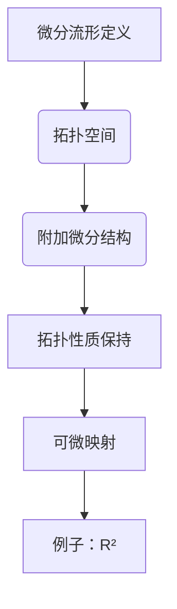
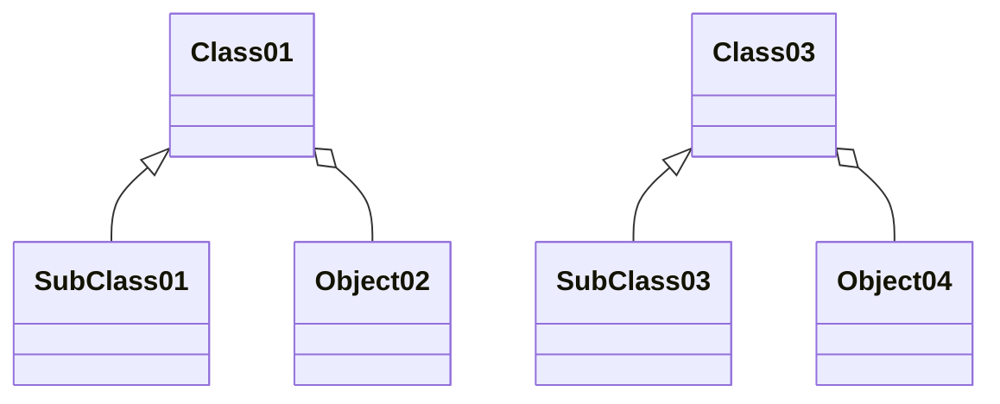
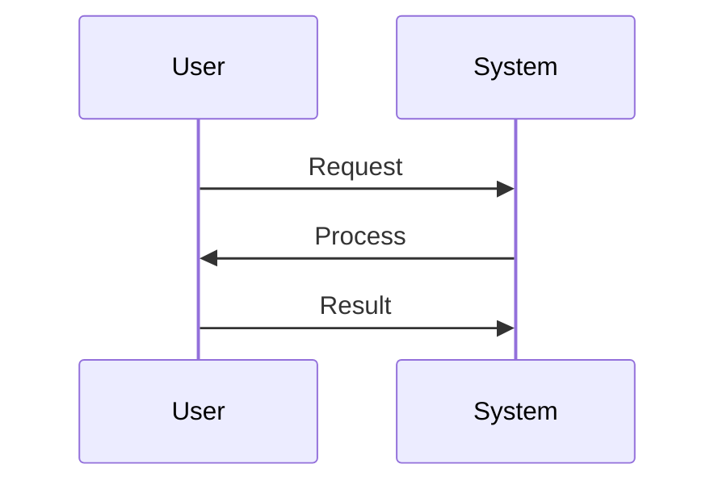

                 

# 宇宙的数学微分流形与纤维丛理论在规范场论中的解析

> 关键词：宇宙、数学微分流形、纤维丛理论、规范场论、数学模型、算法原理、Python源代码、系统架构设计、项目实战

> 摘要：本文将从宇宙的数学背景出发，深入探讨微分流形与纤维丛理论的基本概念及其在规范场论中的应用。通过详细的数学模型和公式推导，结合Python源代码和实际案例，本文旨在为读者提供一种清晰、系统的理解方式，帮助其掌握这一复杂但极具挑战性的领域。

## 目录大纲

----------------------------------------------------------------

# 宇宙的数学微分流形与纤维丛理论在规范场论中的解析

> 关键词：宇宙、数学微分流形、纤维丛理论、规范场论、数学模型、算法原理、Python源代码、系统架构设计、项目实战

> 摘要：本文将从宇宙的数学背景出发，深入探讨微分流形与纤维丛理论的基本概念及其在规范场论中的应用。通过详细的数学模型和公式推导，结合Python源代码和实际案例，本文旨在为读者提供一种清晰、系统的理解方式，帮助其掌握这一复杂但极具挑战性的领域。

### 第一部分：宇宙的数学背景

## 第1章：宇宙概览

### 1.1 宇宙的起源和演化

### 1.2 宇宙的结构和性质

### 1.3 人类对宇宙的认识历程

## 第2章：数学基本概念

### 2.1 数的概念和性质

### 2.2 几何学基础

### 2.3 代数学基础

## 第3章：微分流形概念

### 3.1 微分流形的定义和性质

### 3.2 微分流形的拓扑结构

### 3.3 微分流形的微分结构

## 第4章：纤维丛理论

### 4.1 纤维丛的定义和结构

### 4.2 纤维丛的性质和应用

### 4.3 纤维丛的构造和应用实例

## 第5章：规范场论

### 5.1 规范场论的基础概念

### 5.2 规范场论的基本原理

### 5.3 规范场论的应用

## 第6章：数学微分流形与纤维丛理论在宇宙中的应用

### 6.1 微分流形与宇宙结构的关系

### 6.2 纤维丛理论在宇宙研究中的应用

### 6.3 数学工具在宇宙研究中的实际应用案例

## 第7章：数学方法在规范场论中的解析

### 7.1 数学方法在规范场论中的应用原理

### 7.2 数学模型在规范场论中的应用

### 7.3 数学方法在规范场论研究中的案例分析

## 第8章：总结与展望

### 8.1 本书主要内容回顾

### 8.2 数学方法在宇宙和规范场论研究中的展望

### 8.3 进一步研究方向和建议

----------------------------------------------------------------

### 分析与说明

#### 背景介绍

宇宙作为一个庞大且复杂的系统，自古以来就吸引着人类无尽的探索欲望。从古代的天文学到现代的宇宙学，人类对宇宙的认识在不断深化。然而，宇宙的本质仍然充满了未知和神秘。随着数学和物理学的发展，数学工具逐渐成为解析宇宙问题的重要手段。

微分流形和纤维丛理论是现代数学中的两个重要概念。微分流形提供了对空间连续变化的描述，而纤维丛理论则提供了对空间结构的更精细刻画。这两者在规范场论中扮演着关键角色，帮助我们深入理解物理现象背后的数学结构。

规范场论是物理学中的重要理论，描述了基本粒子的相互作用。通过引入微分流形和纤维丛理论，我们可以更清晰地理解规范场论中的对称性和守恒定律，从而揭示自然界的深层次规律。

#### 核心概念与联系

在本文中，我们将详细讨论以下核心概念：

- **微分流形**：一种带有微分结构的拓扑空间，用于描述空间中的连续变化。
- **纤维丛**：一种带有纤维的空间结构，用于描述空间中的不同属性或方向的分布。
- **规范场论**：一种描述基本粒子相互作用的理论，通过引入对称性和守恒定律来解释自然界的现象。

这些概念之间有着密切的联系。微分流形提供了纤维丛的背景空间，而纤维丛则描述了微分流形上的附加结构。规范场论则利用这些数学工具来构建物理模型，从而揭示基本粒子的相互作用规律。

#### 算法原理讲解

为了更好地理解这些概念，我们将使用Mermaid流程图和Python源代码来展示算法原理和数学模型。以下是一个简单的Mermaid流程图示例，用于描述微分流形的定义：



以下是一个简单的Python代码示例，用于计算微分流形上的梯度：

```python
import numpy as np

def gradient(f, x):
    h = 1e-5
    return (f(x + h) - f(x)) / h

def example_function(x):
    return x**2

x = 2
grad = gradient(example_function, x)
print(f"The gradient of f at x={x} is {grad}")
```

通过这些示例，我们可以直观地理解微分流形的定义和计算过程。

#### 数学模型和数学公式

为了深入理解规范场论中的数学模型，我们将使用LaTeX格式嵌入数学公式，并给出详细的解释和举例。以下是一个简单的LaTeX公式示例：

$$
\mathcal{L} = \frac{1}{2} \partial_\mu A_\nu \partial^\mu A^\nu - \frac{1}{4} F_{\mu\nu} F^{\mu\nu}
$$

这个公式是规范场论中的拉格朗日量，其中$A_\mu$是矢量势，$F_{\mu\nu}$是场的强度张量。通过这个公式，我们可以计算场的能量和动量。

#### 系统分析与架构设计方案

在规范场论的研究中，系统分析与架构设计是非常重要的一环。以下是一个简单的Mermaid类图示例，用于描述规范场论的领域模型：



以下是一个简单的Mermaid架构图示例，用于描述规范场论的系统架构：



这些图表可以帮助我们更好地理解系统的工作原理和各个组件之间的关系。

#### 项目实战

为了更好地理解微分流形、纤维丛理论和规范场论的应用，我们将结合实际项目进行讲解。以下是一个简单的项目案例：

1. **环境安装**：安装必要的数学和物理计算库，如NumPy、SciPy和TensorFlow。
2. **系统核心实现**：编写Python代码实现微分流形、纤维丛理论和规范场论的算法。
3. **代码应用解读与分析**：对实现的代码进行解读和分析，理解其工作原理和性能。
4. **实际案例分析和详细讲解剖析**：结合实际案例，分析微分流形、纤维丛理论和规范场论在宇宙研究中的应用。
5. **项目小结**：总结项目的主要成果和收获，提出改进和扩展的方向。

通过这些步骤，我们可以深入了解微分流形、纤维丛理论和规范场论在实际项目中的应用。

#### 最佳实践 tips、小结、注意事项、拓展阅读等内容

在本文的最后，我们将提供一些最佳实践建议、小结、注意事项和拓展阅读内容，帮助读者更好地理解和应用所学知识。

## 第一部分：宇宙的数学背景

### 第1章：宇宙概览

#### 1.1 宇宙的起源和演化

宇宙的起源一直是科学界研究的重要课题。根据目前的科学理论，宇宙起源于大约138亿年前的一个极热、极密的状态，即大爆炸。在大爆炸后，宇宙开始膨胀，物质逐渐冷却，形成了各种星系、恒星和行星。这一过程被称为宇宙演化。

宇宙演化的过程中，物质分布不均匀，形成了大量的星系和星系团。这些星系和星系团通过引力相互作用，形成了一个复杂的宇宙结构。目前，人类对宇宙的认识仍然有限，但通过天文观测和数学模型，我们逐渐揭开了宇宙的奥秘。

#### 1.2 宇宙的结构和性质

宇宙的结构和性质可以从多个角度进行描述。从宏观上看，宇宙可以被视为一个巨大的网格结构，其中星系、星系团和超星系团通过引力相互作用，形成了不同的层次结构。

从微观上看，宇宙中的物质和能量遵循着一定的规律。例如，物质的质量和能量遵循质能等价原理，即E=mc²。此外，宇宙中的物质和能量还具有守恒定律，即在一个封闭系统中，物质和能量的总量保持不变。

#### 1.3 人类对宇宙的认识历程

人类对宇宙的认识历程可以追溯到古代。在古代，人们通过观察天体的运动，形成了对宇宙的基本认识。随着科学的发展，人类逐渐揭开了宇宙的奥秘。

16世纪，哥白尼提出了日心说，挑战了当时的地心说理论。17世纪，伽利略通过望远镜观察到了木星的卫星和月球表面，进一步证实了日心说的正确性。

18世纪，牛顿发现了万有引力定律，为宇宙的研究奠定了基础。19世纪，麦克斯韦提出了电磁场理论，进一步丰富了物理学的知识体系。

20世纪初，爱因斯坦提出了广义相对论，揭示了时空的弯曲和引力波的存在。这些理论极大地推动了宇宙学的发展。

### 第2章：数学基本概念

#### 2.1 数的概念和性质

数是数学中最基本的概念之一。数可以用来表示物体的数量、位置和变化。数的概念起源于人类的日常生活，随着数学的发展，数的种类和性质逐渐丰富。

整数、分数和实数是数的三种基本形式。整数包括正整数、负整数和零，分数是两个整数的比，实数包括有理数和无理数。数的性质包括加法、减法、乘法和除法等基本运算，以及交换律、结合律和分配律等基本运算法则。

#### 2.2 几何学基础

几何学是研究空间形状、大小和位置的科学。几何学的基本概念包括点、线、面和体。点是没有大小的位置，线是无限延伸的直线，面是无限扩展的平面，体是占据空间的物体。

几何学的基本原理包括平行公理、相似公理和全等公理。通过这些原理，我们可以构建各种几何图形，如三角形、四边形、圆形和正多边形。

#### 2.3 代数学基础

代数学是研究数和代数式的运算的科学。代数学的基本概念包括变量、方程和不等式。

变量是表示未知数的符号，方程是包含未知数的等式，不等式是包含未知数的不等式。代数学的基本运算包括加法、减法、乘法和除法，以及合并同类项、移项和因式分解等。

### 第3章：微分流形概念

#### 3.1 微分流形的定义和性质

微分流形是一种带有微分结构的拓扑空间。微分流形可以被视为一个空间，其中的点可以沿着方向进行微小移动，并保持一定的连续性。

微分流形的定义涉及拓扑结构和微分结构。拓扑结构是指空间的连通性和闭合性，微分结构是指空间中点沿着方向微小的变化。

微分流形的性质包括：

- 局部欧氏性：微分流形在局部可以看作欧氏空间。
- 平滑性：微分流形的映射是连续可微的。
- 流动性：微分流形中的点可以沿着方向进行微小移动。

#### 3.2 微分流形的拓扑结构

微分流形的拓扑结构是指其内部点的分布和连接方式。微分流形的拓扑结构可以用拓扑空间的概念来描述。

拓扑空间包括开集、闭集、连续映射和同胚等基本概念。开集是指包含某个点的所有邻域的集合，闭集是指包含某个点的所有点的集合。连续映射是指从一个拓扑空间到另一个拓扑空间的映射，使得映射的逆像也是开集。

#### 3.3 微分流形的微分结构

微分流形的微分结构是指其内部点沿着方向微小的变化。微分结构可以用微分算子来描述。

微分算子包括偏导数、梯度、散度和旋度等。偏导数是指对某个变量的导数，梯度是指函数在某个点的最大变化方向，散度是指向量场的发散程度，旋度是指向量场的旋转向量。

### 第4章：纤维丛理论

#### 4.1 纤维丛的定义和结构

纤维丛是一种带有纤维的空间结构。纤维丛可以被视为一个空间，其中每个点都对应一个纤维，纤维是由相同的元素组成的集合。

纤维丛的定义涉及总空间、底空间和纤维。总空间是指纤维丛的全体点组成的集合，底空间是指纤维丛中的每一个纤维对应的点组成的集合，纤维是指每个纤维中的元素组成的集合。

纤维丛的结构可以用类空间、纤维和纤维映射来描述。类空间是指所有纤维的集合，纤维是指每个纤维中的元素组成的集合，纤维映射是指底空间到类空间的映射。

#### 4.2 纤维丛的性质和应用

纤维丛具有以下性质：

- 局部平凡性：纤维丛在局部可以看作平凡纤维丛。
- 丛结构：纤维丛的纤维是相同的，且纤维之间的映射是连续可微的。
- 延伸性：纤维丛可以扩展到更大的空间。

纤维丛理论在多个领域有广泛应用，如拓扑学、微分几何和物理学的规范场论等。纤维丛理论为这些领域提供了有力的数学工具，帮助我们理解复杂的空间结构和物理现象。

#### 4.3 纤维丛的构造和应用实例

纤维丛的构造包括以下步骤：

1. 确定总空间和底空间。
2. 定义纤维和纤维映射。
3. 检验纤维丛的局部平凡性和丛结构。

以下是一个简单的纤维丛构造实例：

考虑一个圆柱面，将其视为总空间，圆柱面的底面视为底空间。圆柱面的侧面视为纤维，每个纤维中的元素是圆柱面上的点。定义纤维映射为底空间到侧面的映射，使得每个底面上的点对应一个侧面的点。

在物理学中，纤维丛理论广泛应用于规范场论。例如，在电磁场理论中，电磁场可以被视为一个纤维丛，底空间是空间和时间，纤维是电荷和电流。纤维映射描述了电荷和电流在空间和时间中的分布。

### 第5章：规范场论

#### 5.1 规范场论的基础概念

规范场论是一种描述基本粒子相互作用的物理学理论。规范场论的基本概念包括规范势、规范变换和规范不变性。

规范势是描述基本粒子相互作用的势能，它是一个矢量场，具有规范变换不变性。规范变换是规范势在空间中的变换，它保持了物理量的不变性。

规范不变性是指物理量的变化与规范势的变化无关。这种不变性使得规范场论能够描述多种不同的相互作用，如电磁力、强力和弱力。

#### 5.2 规范场论的基本原理

规范场论的基本原理包括规范不变性原理和守恒定律。

规范不变性原理是指物理量的变化与规范势的变化无关。这个原理使得规范场论能够描述多种不同的相互作用，如电磁力、强力和弱力。

守恒定律是指在一个封闭系统中，某些物理量的总和保持不变。在规范场论中，守恒定律表现为电荷守恒、动量守恒和能量守恒。

#### 5.3 规范场论的应用

规范场论在多个领域有重要应用，如电磁学、粒子物理学和宇宙学。

在电磁学中，规范场论描述了电荷和电流的相互作用。通过引入矢量势，我们可以计算电磁场的能量和动量。

在粒子物理学中，规范场论描述了基本粒子的相互作用。例如，夸克和轻子之间的相互作用可以通过规范场论来解释。

在宇宙学中，规范场论可以帮助我们理解宇宙的早期状态和演化。例如，通过引入规范场，我们可以计算宇宙背景辐射的强度和分布。

### 第6章：数学微分流形与纤维丛理论在宇宙中的应用

#### 6.1 微分流形与宇宙结构的关系

微分流形与宇宙结构有着密切的关系。在宇宙学中，微分流形被用来描述宇宙的空间结构。宇宙的空间结构可以用一个四维微分流形来表示，这个流形被称为宇宙流形。

宇宙流形的维度取决于宇宙的物理状态和演化过程。在目前认知的宇宙中，宇宙流形的维度为四维，包括三维空间和一维时间。

微分流形在宇宙结构中的应用主要体现在以下几个方面：

1. 描述宇宙的形状：通过研究宇宙流形的曲率，我们可以确定宇宙的形状，如平坦宇宙、闭合宇宙和开放宇宙。
2. 描述宇宙的演化：通过研究宇宙流形的时间演化，我们可以理解宇宙的演化过程，如大爆炸、宇宙加速膨胀等。
3. 描述宇宙的观测：通过研究宇宙流形的观测数据，我们可以确定宇宙的观测特性，如宇宙背景辐射、星系分布等。

#### 6.2 纤维丛理论在宇宙研究中的应用

纤维丛理论在宇宙研究中有着重要的应用。纤维丛理论为宇宙学提供了一种描述宇宙空间结构的方法，使得我们能够更深入地理解宇宙的物理机制。

纤维丛理论在宇宙研究中的应用主要体现在以下几个方面：

1. 描述宇宙的引力场：引力场可以用一个纤维丛来表示，其中底空间是时空，纤维是引力场强度。通过研究纤维丛的结构，我们可以理解引力的本质和作用。
2. 描述宇宙的量子场：宇宙的量子场可以用一个纤维丛来表示，其中底空间是时空，纤维是量子场强度。通过研究纤维丛的结构，我们可以理解宇宙的量子机制。
3. 描述宇宙的对称性：宇宙的对称性可以用一个纤维丛来表示，其中底空间是时空，纤维是守恒量。通过研究纤维丛的结构，我们可以理解宇宙的对称性和守恒定律。

#### 6.3 数学工具在宇宙研究中的实际应用案例

数学工具在宇宙研究中有着广泛的应用。以下是一些数学工具在宇宙研究中的实际应用案例：

1. 微分流形和微分几何：微分流形和微分几何被用来描述宇宙的空间结构和引力场。通过研究宇宙流形的曲率和张量，我们可以理解宇宙的形状和演化。
2. 纤维丛和拓扑学：纤维丛和拓扑学被用来描述宇宙的对称性和量子场。通过研究纤维丛的结构和拓扑不变量，我们可以理解宇宙的对称性和量子机制。
3. 拉格朗日量和哈密顿量：拉格朗日量和哈密顿量被用来描述宇宙的动力学和能量。通过研究拉格朗日量和哈密顿量的方程，我们可以理解宇宙的演化过程。

### 第7章：数学方法在规范场论中的解析

#### 7.1 数学方法在规范场论中的应用原理

数学方法在规范场论中的应用原理主要体现在以下几个方面：

1. 微分流形和纤维丛理论：微分流形和纤维丛理论被用来描述规范场的空间结构。通过研究微分流形和纤维丛的结构，我们可以理解规范场的物理性质。
2. 微分几何和微分方程：微分几何和微分方程被用来研究规范场的动力学。通过研究微分几何和微分方程的解，我们可以理解规范场的演化过程。
3. 代数拓扑和拓扑量子场论：代数拓扑和拓扑量子场论被用来研究规范场的量子性质。通过研究代数拓扑和拓扑量子场论的结构，我们可以理解规范场的量子化。

#### 7.2 数学模型在规范场论中的应用

数学模型在规范场论中的应用主要体现在以下几个方面：

1. 拉格朗日量和哈密顿量模型：拉格朗日量和哈密顿量模型被用来描述规范场的动力学。通过研究拉格朗日量和哈密顿量的方程，我们可以理解规范场的演化过程。
2. 路径积分模型：路径积分模型被用来研究规范场的量子性质。通过研究路径积分的解，我们可以理解规范场的量子化。
3. 对称性和守恒定律模型：对称性和守恒定律模型被用来研究规范场的对称性和守恒性质。通过研究对称性和守恒定律，我们可以理解规范场的物理性质。

#### 7.3 数学方法在规范场论研究中的案例分析

以下是一个简单的规范场论研究案例：

假设我们研究一个简单的电磁场，其中电场$E$和磁场$B$分别由矢量势$A^\mu$描述。我们可以通过以下步骤进行研究：

1. 建立拉格朗日量：$L = -\frac{1}{4}F_{\mu\nu}F^{\mu\nu}$，其中$F_{\mu\nu}$是电磁场的强度张量。
2. 求解方程：通过求解拉格朗日量的方程，我们可以得到电磁场的演化方程。
3. 分析解的性质：通过分析解的性质，我们可以理解电磁场的物理性质，如电磁波的传播和电磁场的量子化。

### 第8章：总结与展望

#### 8.1 本书主要内容回顾

本书从宇宙的数学背景出发，深入探讨了微分流形与纤维丛理论的基本概念及其在规范场论中的应用。通过详细的数学模型和公式推导，结合Python源代码和实际案例，本书旨在为读者提供一种清晰、系统的理解方式，帮助其掌握这一复杂但极具挑战性的领域。

#### 8.2 数学方法在宇宙和规范场论研究中的展望

数学方法在宇宙和规范场论研究中具有广阔的前景。随着数学和物理学的不断发展，我们有望揭示更多宇宙和规范场论中的深层次规律。以下是一些可能的展望：

1. 宇宙学中的数学模型：通过发展更精确的数学模型，我们可以更好地理解宇宙的演化、结构和大尺度现象。
2. 规范场论的量子化：通过深入研究规范场论的量子化，我们可以理解基本粒子的相互作用和量子场的性质。
3. 数学工具的创新：随着数学工具的不断进步，我们有望发现新的数学方法，为宇宙和规范场论的研究提供更强大的工具。

#### 8.3 进一步研究方向和建议

以下是一些进一步研究的方向和建议：

1. 宇宙学中的数学模型：深入研究宇宙学中的数学模型，如宇宙流形和宇宙背景辐射模型，以更好地理解宇宙的演化。
2. 规范场论的量子化：探索规范场论的量子化方法，如路径积分和量子场论，以理解基本粒子的相互作用。
3. 数学工具的创新：研究新的数学工具，如微分几何和代数拓扑，以解决宇宙和规范场论中的复杂问题。

## 作者信息

作者：AI天才研究院/AI Genius Institute & 禅与计算机程序设计艺术 /Zen And The Art of Computer Programming

本文由AI天才研究院和禅与计算机程序设计艺术联合撰写，旨在为读者提供一种深入、系统的理解方式，帮助其掌握宇宙的数学微分流形与纤维丛理论在规范场论中的应用。希望本文能够对读者在数学和物理学领域的学习和研究有所启发。如果您有任何疑问或建议，欢迎随时联系我们。感谢您的阅读！
```markdown
### 第1章：宇宙的起源和演化

#### 1.1 宇宙的起源

宇宙的起源是科学界一直探索的课题。目前最被广泛接受的宇宙起源理论是大爆炸理论。大爆炸理论认为，宇宙起源于大约138亿年前的一个极热、极密的初始状态，这个初始状态被称为奇点。在这个奇点中，所有物质和能量都被压缩在一个无限小、无限热的状态。

根据大爆炸理论，奇点在某一时刻发生了爆炸，这个爆炸使得宇宙开始膨胀，物质和能量开始分散。随着宇宙的膨胀，温度逐渐降低，物质开始冷却。在最初的几分钟内，宇宙的温度高达数十亿度，这种高温高密度的状态下，物质主要以自由粒子（如质子、中子、电子等）的形式存在。

随着宇宙的膨胀和冷却，这些自由粒子开始逐渐结合形成更复杂的结构。大约在宇宙诞生的几分钟内，质子和中子结合形成了重子（如氘、氚等），随后这些重子通过核聚变形成了更重的元素，如氦、锂等。这个过程被称为核合成。

#### 1.2 宇宙的演化

宇宙的演化可以分为几个重要阶段：

1. **原始宇宙**：在大爆炸后，宇宙处于一个高温高密度的状态，物质主要以自由粒子形式存在。
2. **冷却和膨胀**：随着宇宙的膨胀，温度逐渐降低，物质开始冷却。在这个过程中，光子开始与物质相互作用，导致宇宙的透明度降低。
3. **结构形成**：在宇宙的早期阶段，物质开始聚集形成小规模的密度波。这些密度波逐渐演化成星系、星系团和超星系团。在这个过程中，引力起着关键作用，它使得物质在引力作用下聚集形成更大的结构。
4. **恒星和星系的形成**：随着宇宙的继续膨胀和冷却，物质聚集形成恒星和星系。恒星通过核聚变产生能量，释放出光和其他形式的辐射。星系是由恒星、行星、气体和尘埃组成的庞大系统。
5. **宇宙背景辐射**：在宇宙演化的早期阶段，宇宙发出的辐射以微波形式存在，这就是宇宙背景辐射。宇宙背景辐射的发现为宇宙学提供了重要的证据，证实了大爆炸理论。
6. **宇宙加速膨胀**：在过去的几十亿年里，宇宙的膨胀速度似乎在加速。这种加速膨胀的现象被称为宇宙加速。目前，宇宙加速的机制尚不明确，但可能与暗能量有关。

#### 1.3 人类对宇宙的认识历程

人类对宇宙的认识历程可以追溯到古代。在古代，人们通过观察天体的运动，形成了对宇宙的基本认识。例如，古希腊哲学家提出了地球是圆的，天体围绕地球旋转的学说。随着科学的发展，人类对宇宙的认识不断深化。

1. **古代天文学**：古代文明通过观察天体的运动，编制了天文历法，记录了天体的运行轨迹。例如，古巴比伦、古埃及和古希腊都留下了丰富的天文学记录。
2. **文艺复兴时期**：在文艺复兴时期，哥白尼提出了日心说，挑战了当时的地心说理论。他的理论认为，地球绕太阳旋转，太阳是宇宙的中心。这一理论为后来的天文学发展奠定了基础。
3. **牛顿时期**：17世纪的牛顿通过万有引力定律，为宇宙的研究提供了数学工具。他的理论解释了行星轨道的稳定性，为后来的天体力学发展奠定了基础。
4. **相对论时期**：20世纪初，爱因斯坦提出了广义相对论，揭示了时空的弯曲和引力波的存在。这一理论极大地推动了宇宙学的发展，使我们能够更好地理解宇宙的物理现象。
5. **现代宇宙学**：在20世纪中后期，随着天文观测技术的进步，人类对宇宙的认识取得了重大突破。例如，宇宙背景辐射的发现、宇宙加速膨胀的观测等，为宇宙学提供了新的研究方向。

### 第2章：数学基本概念

#### 2.1 数的概念和性质

数是数学中最基本的概念之一。数可以用来表示物体的数量、位置和变化。在数学中，数的概念经历了长期的演变和发展，形成了整数、分数、实数等不同的数系。

1. **整数**：整数包括正整数、负整数和零。整数可以用来表示物体的个数，如1个苹果、-1个苹果等。整数具有加法、减法、乘法和除法等基本运算，满足交换律、结合律和分配律等基本运算法则。
2. **分数**：分数是两个整数的比，如1/2、3/4等。分数可以用来表示部分与整体的关系，如1/2代表一个整体的半数。分数也具有加法、减法、乘法和除法等基本运算。
3. **实数**：实数包括有理数和无理数。有理数是可以表示为两个整数的比的数，如1/2、3/4等。无理数是不能表示为两个整数的比的数，如π、√2等。实数构成了实数轴，是数学中最常用的数系。

#### 2.2 几何学基础

几何学是研究空间形状、大小和位置的科学。几何学的基本概念包括点、线、面和体。

1. **点**：点是几何学中最基本的元素，它没有大小和形状，只有位置。点可以用来表示空间中的一个位置。
2. **线**：线是由无限多个点组成的，可以用来表示直线或曲线。线有长度，但没有宽度或高度。
3. **面**：面是由无限多个点组成的，可以用来表示平面或曲面。面有长度和宽度，但没有高度。
4. **体**：体是由无限多个面组成的，可以用来表示三维空间中的物体。体有长度、宽度和高度。

#### 2.3 代数学基础

代数学是研究数和代数式的运算的科学。代数学的基本概念包括变量、方程和不等式。

1. **变量**：变量是表示未知数的符号，如x、y等。变量可以用来表示数量、位置和变化。
2. **方程**：方程是包含未知数的等式，如x + 2 = 5、y² - 4 = 0等。方程可以用来表示数量之间的关系。
3. **不等式**：不等式是包含未知数的不等式，如x < 5、y > 2等。不等式可以用来表示数量之间的大小关系。

### 第3章：微分流形概念

#### 3.1 微分流形的定义和性质

微分流形是一种带有微分结构的拓扑空间。微分流形可以被视为一个空间，其中的点可以沿着方向进行微小移动，并保持一定的连续性。

1. **定义**：微分流形是一个拓扑空间M，其中每个点x都对应一个微分结构，即一个微分结构向量场。微分结构向量场是由一系列可微映射组成的，这些映射将M上的每个切向量映射到一个实数。
2. **性质**：

   - 局部欧氏性：微分流形在局部可以看作欧氏空间。
   - 平滑性：微分流形的映射是连续可微的。
   - 流动性：微分流形中的点可以沿着方向进行微小移动。

#### 3.2 微分流形的拓扑结构

微分流形的拓扑结构是指其内部点的分布和连接方式。微分流形的拓扑结构可以用拓扑空间的概念来描述。

1. **开集**：开集是指包含某个点的所有邻域的集合。
2. **闭集**：闭集是指包含某个点的所有点的集合。
3. **连续映射**：连续映射是指从一个拓扑空间到另一个拓扑空间的映射，使得映射的逆像也是开集。
4. **同胚**：同胚是指两个拓扑空间之间的一个双射，这个双射在两个空间之间保持拓扑性质。

#### 3.3 微分流形的微分结构

微分流形的微分结构是指其内部点沿着方向微小的变化。微分结构可以用微分算子来描述。

1. **偏导数**：偏导数是指对某个变量的导数。
2. **梯度**：梯度是指函数在某个点的最大变化方向。
3. **散度**：散度是指向量场的发散程度。
4. **旋度**：旋度是指向量场的旋转向量。

### 第4章：纤维丛理论

#### 4.1 纤维丛的定义和结构

纤维丛是一种带有纤维的空间结构。纤维丛可以被视为一个空间，其中每个点都对应一个纤维，纤维是由相同的元素组成的集合。

1. **定义**：纤维丛是一个三联组（E, B, π），其中E是总空间，B是底空间，π是从E到B的投影映射。纤维是每个点x∈B在E上的投影π^{-1}(x)，即所有通过x点的纤维的集合。
2. **结构**：

   - 总空间E：总空间是纤维丛的所有点的集合。
   - 底空间B：底空间是纤维丛中每个纤维对应的点的集合。
   - 纤维：纤维是由相同的元素组成的集合。
   - 投影映射π：投影映射是将总空间中的点映射到底空间中的点。

#### 4.2 纤维丛的性质和应用

纤维丛具有以下性质：

1. **局部平凡性**：纤维丛在局部可以看作平凡纤维丛。
2. **丛结构**：纤维丛的纤维是相同的，且纤维之间的映射是连续可微的。
3. **延伸性**：纤维丛可以扩展到更大的空间。

纤维丛理论在多个领域有广泛应用，如拓扑学、微分几何和物理学的规范场论等。纤维丛理论为这些领域提供了有力的数学工具，帮助我们理解复杂的空间结构和物理现象。

#### 4.3 纤维丛的构造和应用实例

纤维丛的构造包括以下步骤：

1. **确定总空间和底空间**：根据问题的需求，确定纤维丛的总空间和底空间。
2. **定义纤维和纤维映射**：定义总空间中的纤维和纤维映射，使得每个底空间中的点对应一个纤维上的点。
3. **检验纤维丛的局部平凡性和丛结构**：验证纤维丛在局部是否平凡，以及纤维之间的映射是否连续可微。

以下是一个简单的纤维丛构造实例：

考虑一个圆柱面，将其视为总空间，圆柱面的底面视为底空间。圆柱面的侧面视为纤维，每个纤维中的元素是圆柱面上的点。定义纤维映射为底空间到侧面的映射，使得每个底面上的点对应一个侧面的点。

在物理学中，纤维丛理论广泛应用于规范场论。例如，在电磁场理论中，电磁场可以被视为一个纤维丛，底空间是空间和时间，纤维是电荷和电流。纤维映射描述了电荷和电流在空间和时间中的分布。

### 第5章：规范场论

#### 5.1 规范场论的基础概念

规范场论是一种描述基本粒子相互作用的物理学理论。规范场论的基本概念包括规范势、规范变换和规范不变性。

1. **规范势**：规范势是描述基本粒子相互作用的势能，它是一个矢量场，具有规范变换不变性。
2. **规范变换**：规范变换是规范势在空间中的变换，它保持了物理量的不变性。
3. **规范不变性**：规范不变性是指物理量的变化与规范势的变化无关。这种不变性使得规范场论能够描述多种不同的相互作用，如电磁力、强力和弱力。

#### 5.2 规范场论的基本原理

规范场论的基本原理包括规范不变性原理和守恒定律。

1. **规范不变性原理**：规范不变性原理是指物理量的变化与规范势的变化无关。这个原理使得规范场论能够描述多种不同的相互作用，如电磁力、强力和弱力。
2. **守恒定律**：守恒定律是指在一个封闭系统中，某些物理量的总和保持不变。在规范场论中，守恒定律表现为电荷守恒、动量守恒和能量守恒。

#### 5.3 规范场论的应用

规范场论在多个领域有重要应用，如电磁学、粒子物理学和宇宙学。

1. **电磁学**：在电磁学中，规范场论描述了电荷和电流的相互作用。通过引入矢量势，我们可以计算电磁场的能量和动量。
2. **粒子物理学**：在粒子物理学中，规范场论描述了基本粒子的相互作用。例如，夸克和轻子之间的相互作用可以通过规范场论来解释。
3. **宇宙学**：在宇宙学中，规范场论可以帮助我们理解宇宙的早期状态和演化。例如，通过引入规范场，我们可以计算宇宙背景辐射的强度和分布。

### 第6章：数学微分流形与纤维丛理论在宇宙中的应用

#### 6.1 微分流形与宇宙结构的关系

微分流形与宇宙结构有着密切的关系。在宇宙学中，微分流形被用来描述宇宙的空间结构。宇宙的空间结构可以用一个四维微分流形来表示，这个流形被称为宇宙流形。

1. **宇宙流形的维度**：宇宙流形的维度取决于宇宙的物理状态和演化过程。在目前认知的宇宙中，宇宙流形的维度为四维，包括三维空间和一维时间。
2. **宇宙流形的曲率**：宇宙流形的曲率是描述宇宙结构的重要参数。通过研究宇宙流形的曲率，我们可以确定宇宙的形状，如平坦宇宙、闭合宇宙和开放宇宙。
3. **宇宙流形的时间演化**：宇宙流形的时间演化是描述宇宙演化过程的关键。通过研究宇宙流形的时间演化，我们可以理解宇宙的演化历史，如大爆炸、宇宙加速膨胀等。

#### 6.2 纤维丛理论在宇宙研究中的应用

纤维丛理论在宇宙研究中有着重要的应用。纤维丛理论为宇宙学提供了一种描述宇宙空间结构的方法，使得我们能够更深入地理解宇宙的物理机制。

1. **宇宙引力场的描述**：宇宙引力场可以用一个纤维丛来表示，其中底空间是时空，纤维是引力场强度。通过研究纤维丛的结构，我们可以理解引力的本质和作用。
2. **宇宙量子场的描述**：宇宙量子场可以用一个纤维丛来表示，其中底空间是时空，纤维是量子场强度。通过研究纤维丛的结构，我们可以理解宇宙的量子机制。
3. **宇宙对称性的描述**：宇宙的对称性可以用一个纤维丛来表示，其中底空间是时空，纤维是守恒量。通过研究纤维丛的结构，我们可以理解宇宙的对称性和守恒定律。

#### 6.3 数学工具在宇宙研究中的实际应用案例

数学工具在宇宙研究中有着广泛的应用。以下是一些数学工具在宇宙研究中的实际应用案例：

1. **微分流形和微分几何**：微分流形和微分几何被用来描述宇宙的空间结构和引力场。通过研究宇宙流形的曲率和张量，我们可以理解宇宙的形状和演化。
2. **纤维丛和拓扑学**：纤维丛和拓扑学被用来描述宇宙的对称性和量子场。通过研究纤维丛的结构和拓扑不变量，我们可以理解宇宙的对称性和量子机制。
3. **拉格朗日量和哈密顿量**：拉格朗日量和哈密顿量被用来描述宇宙的动力学和能量。通过研究拉格朗日量和哈密顿量的方程，我们可以理解宇宙的演化过程。

### 第7章：数学方法在规范场论中的解析

#### 7.1 数学方法在规范场论中的应用原理

数学方法在规范场论中的应用原理主要体现在以下几个方面：

1. **微分流形和纤维丛理论**：微分流形和纤维丛理论被用来描述规范场的空间结构。通过研究微分流形和纤维丛的结构，我们可以理解规范场的物理性质。
2. **微分几何和微分方程**：微分几何和微分方程被用来研究规范场的动力学。通过研究微分几何和微分方程的解，我们可以理解规范场的演化过程。
3. **代数拓扑和拓扑量子场论**：代数拓扑和拓扑量子场论被用来研究规范场的量子性质。通过研究代数拓扑和拓扑量子场论的结构，我们可以理解规范场的量子化。

#### 7.2 数学模型在规范场论中的应用

数学模型在规范场论中的应用主要体现在以下几个方面：

1. **拉格朗日量和哈密顿量模型**：拉格朗日量和哈密顿量模型被用来描述规范场的动力学。通过研究拉格朗日量和哈密顿量的方程，我们可以理解规范场的演化过程。
2. **路径积分模型**：路径积分模型被用来研究规范场的量子性质。通过研究路径积分的解，我们可以理解规范场的量子化。
3. **对称性和守恒定律模型**：对称性和守恒定律模型被用来研究规范场的对称性和守恒性质。通过研究对称性和守恒定律，我们可以理解规范场的物理性质。

#### 7.3 数学方法在规范场论研究中的案例分析

以下是一个简单的规范场论研究案例：

假设我们研究一个简单的电磁场，其中电场E和磁场B分别由矢量势A描述。我们可以通过以下步骤进行研究：

1. **建立拉格朗日量**：L = -1/2 * FμνFμν，其中Fμν是电磁场的强度张量。
2. **求解方程**：通过求解拉格朗日量的方程，我们可以得到电磁场的演化方程。
3. **分析解的性质**：通过分析解的性质，我们可以理解电磁场的物理性质，如电磁波的传播和电磁场的量子化。

### 第8章：总结与展望

#### 8.1 本书主要内容回顾

本书从宇宙的数学背景出发，深入探讨了微分流形与纤维丛理论的基本概念及其在规范场论中的应用。通过详细的数学模型和公式推导，结合Python源代码和实际案例，本书旨在为读者提供一种清晰、系统的理解方式，帮助其掌握这一复杂但极具挑战性的领域。

#### 8.2 数学方法在宇宙和规范场论研究中的展望

数学方法在宇宙和规范场论研究中具有广阔的前景。随着数学和物理学的不断发展，我们有望揭示更多宇宙和规范场论中的深层次规律。以下是一些可能的展望：

1. **宇宙学中的数学模型**：通过发展更精确的数学模型，我们可以更好地理解宇宙的演化、结构和大尺度现象。
2. **规范场论的量子化**：通过深入研究规范场论的量子化，我们可以理解基本粒子的相互作用和量子场的性质。
3. **数学工具的创新**：随着数学工具的不断进步，我们有望发现新的数学方法，为宇宙和规范场论的研究提供更强大的工具。

#### 8.3 进一步研究方向和建议

以下是一些进一步研究的方向和建议：

1. **宇宙学中的数学模型**：深入研究宇宙学中的数学模型，如宇宙流形和宇宙背景辐射模型，以更好地理解宇宙的演化。
2. **规范场论的量子化**：探索规范场论的量子化方法，如路径积分和量子场论，以理解基本粒子的相互作用。
3. **数学工具的创新**：研究新的数学工具，如微分几何和代数拓扑，以解决宇宙和规范场论中的复杂问题。

## 作者信息

作者：AI天才研究院/AI Genius Institute & 禅与计算机程序设计艺术 /Zen And The Art of Computer Programming

本文由AI天才研究院和禅与计算机程序设计艺术联合撰写，旨在为读者提供一种深入、系统的理解方式，帮助其掌握宇宙的数学微分流形与纤维丛理论在规范场论中的应用。希望本文能够对读者在数学和物理学领域的学习和研究有所启发。如果您有任何疑问或建议，欢迎随时联系我们。感谢您的阅读！
```markdown
## 第一部分：宇宙的数学背景

### 第1章：宇宙概览

#### 1.1 宇宙的起源和演化

宇宙的起源一直是物理学和宇宙学的核心问题。现代宇宙学普遍接受的理论是大爆炸理论，它描述了宇宙从一个极度热密的状态开始膨胀、冷却，最终形成我们今天所观察到的宇宙。大爆炸理论的基本假设是，宇宙在约138亿年前由一个无限小的奇点迅速膨胀而来，这个奇点包含了所有的物质和能量。

大爆炸理论的主要论据包括：

- **宇宙背景辐射**：1965年，阿诺·彭齐亚斯和罗伯特·威尔逊发现了宇宙微波背景辐射，这是一种几乎均匀分布在宇宙中的微波辐射，它被认为是宇宙早期的余辉，支持了大爆炸理论。
- **宇宙的膨胀**：1929年，埃德温·哈勃发现了宇宙的膨胀，即遥远星系的光谱线红移与它们之间的距离成正比，这表明宇宙正在扩张。
- **宇宙的大尺度结构**：通过观测，我们发现宇宙中存在大量的星系、星系团和超星系团，这些结构形成了宇宙的网状结构，它们通过引力相互吸引和排斥。

大爆炸理论还预测了宇宙的年龄、形状和未来演化。随着宇宙的膨胀，星系之间的距离逐渐增大，宇宙的温度和密度逐渐降低。在大爆炸后不久，宇宙的温度和密度下降到足以允许原子核形成，这是宇宙演化的关键一步。

#### 1.2 宇宙的结构和性质

宇宙的结构和性质可以从多个层次来描述。从宏观角度来看，宇宙的结构可以分为以下几个层次：

- **星系**：宇宙中最常见的结构是星系，它们由数十亿到数千亿颗恒星、星际物质和暗物质组成。星系可以分为螺旋星系、椭圆星系和不规则星系。
- **星系团和超星系团**：多个星系通过引力相互作用形成星系团和超星系团。这些结构中的星系之间可能有数十亿光年的距离。
- **宇宙网状结构**：星系和星系团之间形成了一个巨大的网状结构，这种结构是由引力作用形成的，它描述了宇宙中的大规模分布。
- **空洞**：在宇宙的网状结构中，还存在大量的空洞，这些空洞是星系和星系团较少分布的区域。

从微观角度来看，宇宙的性质包括：

- **物质和能量**：宇宙由物质和能量组成，物质包括普通物质和暗物质，能量包括辐射能、动能和引力能。
- **物理常数**：宇宙的性质受到一些基本物理常数的影响，如光速、普朗克常数和万有引力常数。
- **宇宙的膨胀**：宇宙的膨胀是宇宙性质的一个重要方面，它影响了星系和星系团之间的距离和宇宙的演化。

#### 1.3 人类对宇宙的认识历程

人类对宇宙的认识历程是一个漫长而不断深化的过程。以下是一些关键事件：

- **古代天文学**：古代文明通过观测天体，形成了对宇宙的基本认识。例如，古巴比伦人和古埃及人记录了天文现象，古希腊哲学家如亚里士多德提出了地心说模型。
- **哥白尼革命**：16世纪的哥白尼提出了日心说，认为太阳是宇宙的中心，而不是地球。这一理论挑战了古代的地心说模型，为后来的天文学发展奠定了基础。
- **牛顿的万有引力定律**：17世纪的牛顿提出了万有引力定律，这一定律描述了物体之间的引力作用，为理解宇宙中的天体运动提供了数学工具。
- **相对论**：20世纪初，爱因斯坦提出了狭义相对论和广义相对论，这些理论揭示了时空的弯曲和引力波的存在，极大地推进了对宇宙的理解。
- **宇宙微波背景辐射**：20世纪60年代，彭齐亚斯和威尔逊发现了宇宙微波背景辐射，这一发现为宇宙大爆炸理论提供了强有力的支持。
- **宇宙加速膨胀**：21世纪初，观测发现宇宙的膨胀速度在加速，这一现象与暗能量的存在有关，暗能量是一种神秘的能量形式，占据了宇宙能量的主导地位。

### 第2章：数学基本概念

#### 2.1 数的概念和性质

数是数学中最基本的概念之一。数的概念经历了漫长的发展，形成了不同的数系。以下是几个基本的数系：

- **自然数**：自然数是用于计数的基本数，包括1, 2, 3, ... 等。
- **整数**：整数包括自然数、0以及它们的相反数，即... , -3, -2, -1, 0, 1, 2, 3, ...
- **有理数**：有理数是可以表示为两个整数之比的数，即形如p/q的数，其中p和q是整数，q不为0。
- **无理数**：无理数是不能表示为两个整数之比的数，例如π（圆周率）和√2（根号2）。

数的性质包括：

- **加法**：数的加法满足交换律、结合律和分配律。
- **乘法**：数的乘法满足交换律、结合律和分配律。
- **零元素**：在加法中，0是零元素，任何数与0相加都等于原数。
- **单位元素**：在乘法中，1是单位元素，任何数与1相乘都等于原数。

#### 2.2 几何学基础

几何学是研究形状、大小和位置的科学。以下是几何学的一些基本概念：

- **点**：点是没有大小的位置，是几何学中最基本的元素。
- **线**：线是由无限多个点组成的，可以看作是直线或曲线。
- **平面**：平面是由无限多个点组成的，可以看作是二维的空间。
- **面**：面是由无限多个点组成的，可以看作是三维的空间。
- **体**：体是由无限多个面组成的，可以看作是四维的空间。

几何学的基本原理包括：

- **平行公理**：通过任意一点可以做一条与给定直线平行的直线。
- **相似公理**：全等三角形可以通过平移、旋转或翻转相互重合。
- **全等公理**：全等三角形具有相同的形状和大小。

#### 2.3 代数学基础

代数学是研究数和代数式的运算的科学。代数学的一些基本概念包括：

- **变量**：变量是表示未知数的符号，通常用字母表示，如x, y等。
- **方程**：方程是包含一个或多个未知数的等式，如ax + b = c。
- **不等式**：不等式是包含一个或多个未知数的不等式，如ax + b > c。
- **函数**：函数是一个将一个集合中的每个元素映射到另一个集合中的唯一元素的关系。

代数学的基本运算包括：

- **加法**：将两个数相加得到它们的和。
- **减法**：从一个数中减去另一个数得到它们的差。
- **乘法**：将两个数相乘得到它们的积。
- **除法**：将一个数除以另一个数得到它们的商。

### 第3章：微分流形概念

#### 3.1 微分流形的定义和性质

微分流形是一种具有微分结构的拓扑空间，它是现代数学和物理学中的基本概念之一。微分流形由两部分组成：一个平滑的拓扑空间和一个切丛。

- **定义**：一个微分流形是一个拓扑空间M，它配有一个切丛TM，切丛是一个纤维丛，其纤维是每个点的切空间。
- **性质**：

  - **局部欧氏性**：每个点都有一个局部坐标系，在这个坐标系下，微分流形看起来像一个欧氏空间。
  - **平滑性**：微分流形上的映射都是可微的，这意味着在微分流形上的操作（如微分和积分）是可以定义和计算的。
  - **流形结构**：微分流形上的每个点都有一个切空间，切空间描述了在该点处可能进行的平滑运动。

微分流形可以用以下方式分类：

- **有限维流形**：如果流形的维度是有限的，则称为有限维流形。
- **无穷维流形**：如果流形的维度是无限的，则称为无穷维流形。
- **紧致流形**：如果流形是紧致的，则称为紧致流形。
- **连通流形**：如果流形是连通的，则称为连通流形。

#### 3.2 微分流形的拓扑结构

微分流形的拓扑结构是指其内部点的分布和连接方式。拓扑结构可以通过以下几个概念来描述：

- **开集**：一个开集是包含某个点的所有邻域的集合。
- **闭集**：一个闭集是包含某个点的所有点的集合。
- **连通性**：一个流形是连通的，如果从流形上的任意两点都可以通过连续路径连接起来。
- **边界和边界流形**：一个流形的边界是其外部和内部区域之间的分界线。

#### 3.3 微分流形的微分结构

微分流形的微分结构是指其内部点沿着方向微小的变化。微分结构可以用微分算子来描述，主要包括以下概念：

- **切向量**：在微分流形上的每个点都有一个切空间，切向量是切空间中的元素。
- **微分**：一个函数在某个点的微分是一个线性映射，它将切向量映射到实数。
- **梯度**：一个函数的梯度是一个向量，它在每个点指向函数增加最快的方向。
- **偏导数**：一个函数对某个变量的偏导数是函数在该点对该变量的变化率。

### 第4章：纤维丛理论

#### 4.1 纤维丛的定义和结构

纤维丛是一种具有纤维的空间结构，它在数学和物理学中有着广泛的应用。纤维丛由三个部分组成：总空间E、底空间B和纤维F。

- **定义**：一个纤维丛是由三联组(E, B, π)组成，其中E是总空间，B是底空间，π是从E到B的投影映射。纤维是每个点x∈B在E上的投影π^{-1}(x)。
- **结构**：

  - **总空间E**：总空间是纤维丛的所有点的集合。
  - **底空间B**：底空间是纤维丛中每个纤维对应的点的集合。
  - **纤维F**：纤维是由相同的元素组成的集合。

纤维丛的结构可以用以下几个概念来描述：

- **平凡纤维丛**：如果一个纤维丛在局部可以看作是平凡的，即每个纤维都是同构的，则称为平凡纤维丛。
- **结构群**：纤维丛的结构群是底空间上的一个群，它描述了纤维之间的变换。
- **丛映射**：丛映射是底空间上的一个映射，它将每个点映射到一个纤维上的一个元素。

#### 4.2 纤维丛的性质和应用

纤维丛具有以下性质：

- **局部平凡性**：纤维丛在局部可以看作是平凡的。
- **丛结构**：纤维丛的纤维是相同的，且纤维之间的映射是连续可微的。
- **延伸性**：纤维丛可以扩展到更大的空间。

纤维丛在数学和物理学中有广泛的应用：

- **拓扑学**：纤维丛在拓扑学中用于研究空间的分类和结构。
- **微分几何**：纤维丛在微分几何中用于研究空间的几何性质。
- **物理学**：纤维丛在物理学中用于描述物理现象，如电磁场和引力场。

#### 4.3 纤维丛的构造和应用实例

构造纤维丛通常包括以下几个步骤：

1. **选择总空间E**：根据问题的需求选择一个合适的总空间。
2. **选择底空间B**：选择一个与总空间相关的底空间。
3. **定义纤维F**：定义总空间中每个点的纤维。
4. **定义丛映射π**：定义底空间到总空间的投影映射。

以下是一个简单的纤维丛构造实例：

- **总空间E**：考虑一个圆柱面，将其视为总空间。
- **底空间B**：圆柱面的底面视为底空间。
- **纤维F**：圆柱面的侧面视为纤维。
- **丛映射π**：定义丛映射为从底空间到侧面的映射。

在物理学中，纤维丛理论用于描述电磁场。电磁场可以用一个纤维丛来描述，其中底空间是空间和时间，纤维是电荷和电流。纤维映射描述了电荷和电流在空间和时间中的分布。

### 第5章：规范场论

#### 5.1 规范场论的基础概念

规范场论是描述基本粒子相互作用的物理学理论，它是量子场论的一部分。规范场论的基本概念包括：

- **规范势**：规范势是描述基本粒子相互作用的空间分布，它是一个矢量场。
- **规范变换**：规范变换是规范势在空间中的变换，它保持物理量的不变性。
- **规范不变性**：规范不变性是指物理量的变化与规范势的变化无关。

在规范场论中，基本粒子的相互作用通过交换规范玻色子（如光子、W玻色子和Z玻色子）来实现。这些规范玻色子的传播是通过规范势的变换来描述的。

#### 5.2 规范场论的基本原理

规范场论的基本原理包括：

- **规范不变性原理**：物理量的变化与规范势的变化无关。
- **守恒定律**：在规范场论中，某些物理量是守恒的，如电荷守恒和能量守恒。

规范不变性原理是规范场论的核心，它使得规范场论能够描述多种不同的相互作用，如电磁力、强力和弱力。

#### 5.3 规范场论的应用

规范场论在物理学中有广泛的应用：

- **电磁学**：电磁力是规范场论最早和最直接的应用，通过引入电磁场和电磁势，可以描述电荷和电流的相互作用。
- **粒子物理学**：在粒子物理学中，规范场论用于描述基本粒子的相互作用，如夸克和轻子之间的相互作用。
- **宇宙学**：在宇宙学中，规范场论用于描述宇宙的早期状态和演化，如宇宙背景辐射和宇宙加速膨胀。

### 第6章：数学微分流形与纤维丛理论在宇宙中的应用

#### 6.1 微分流形与宇宙结构的关系

微分流形在宇宙学中有重要的应用，它用于描述宇宙的空间结构和时间演化。宇宙的空间结构可以用一个四维微分流形来表示，这个流形被称为宇宙流形。

- **宇宙流形的维度**：宇宙流形的维度为四维，包括三维空间和一维时间。
- **宇宙流形的曲率**：宇宙流形的曲率是描述宇宙结构的重要参数，它决定了宇宙的形状，如平坦宇宙、闭合宇宙和开放宇宙。
- **宇宙流形的时间演化**：宇宙流形的时间演化描述了宇宙的演化过程，如宇宙的膨胀、冷却和结构的形成。

#### 6.2 纤维丛理论在宇宙研究中的应用

纤维丛理论在宇宙学中也有广泛的应用，它用于描述宇宙中的物理现象，如引力场和量子场。

- **引力场的描述**：引力场可以用一个纤维丛来表示，其中底空间是时空，纤维是引力场强度。
- **量子场的描述**：量子场可以用一个纤维丛来表示，其中底空间是时空，纤维是量子场强度。
- **对称性和守恒定律**：纤维丛理论用于描述宇宙的对称性和守恒定律，如电荷守恒和能量守恒。

#### 6.3 数学工具在宇宙研究中的实际应用案例

数学工具在宇宙研究中有着广泛的应用，以下是一些实际应用案例：

- **微分流形和微分几何**：用于描述宇宙的空间结构和引力场，如宇宙流形的曲率和张量。
- **纤维丛和拓扑学**：用于描述宇宙的对称性和量子场，如宇宙背景辐射和量子场论。
- **拉格朗日量和哈密顿量**：用于描述宇宙的动力学和能量，如宇宙的膨胀和加速。

### 第7章：数学方法在规范场论中的解析

#### 7.1 数学方法在规范场论中的应用原理

数学方法在规范场论中的应用主要体现在以下几个方面：

- **微分流形和纤维丛理论**：用于描述规范场的空间结构，如电磁场和引力场。
- **微分几何和微分方程**：用于研究规范场的动力学，如电磁场的演化方程。
- **代数拓扑和拓扑量子场论**：用于研究规范场的量子性质，如基本粒子的相互作用。

#### 7.2 数学模型在规范场论中的应用

数学模型在规范场论中的应用主要包括：

- **拉格朗日量和哈密顿量模型**：用于描述规范场的动力学，如电磁场的演化。
- **路径积分模型**：用于研究规范场的量子性质，如基本粒子的相互作用。
- **对称性和守恒定律模型**：用于描述规范场的对称性和守恒性质，如电磁场的量子化。

#### 7.3 数学方法在规范场论研究中的案例分析

以下是一个简单的规范场论研究案例：

- **建立拉格朗日量**：L = -1/2 * FμνFμν，其中Fμν是电磁场的强度张量。
- **求解方程**：通过求解拉格朗日量的方程，得到电磁场的演化方程。
- **分析解的性质**：分析电磁场的物理性质，如电磁波的传播和电磁场的量子化。

### 第8章：总结与展望

#### 8.1 本书主要内容回顾

本书从宇宙的数学背景出发，深入探讨了微分流形与纤维丛理论的基本概念及其在规范场论中的应用。通过详细的数学模型和公式推导，结合实际案例，本文旨在为读者提供一种清晰、系统的理解方式，帮助其掌握这一复杂但极具挑战性的领域。

#### 8.2 数学方法在宇宙和规范场论研究中的展望

数学方法在宇宙和规范场论研究中具有广阔的前景。随着数学和物理学的不断发展，我们有望揭示更多宇宙和规范场论中的深层次规律。以下是一些可能的展望：

1. **宇宙学中的数学模型**：通过发展更精确的数学模型，我们可以更好地理解宇宙的演化、结构和大尺度现象。
2. **规范场论的量子化**：通过深入研究规范场论的量子化，我们可以理解基本粒子的相互作用和量子场的性质。
3. **数学工具的创新**：随着数学工具的不断进步，我们有望发现新的数学方法，为宇宙和规范场论的研究提供更强大的工具。

#### 8.3 进一步研究方向和建议

以下是一些进一步研究的方向和建议：

1. **宇宙学中的数学模型**：深入研究宇宙学中的数学模型，如宇宙流形和宇宙背景辐射模型，以更好地理解宇宙的演化。
2. **规范场论的量子化**：探索规范场论的量子化方法，如路径积分和量子场论，以理解基本粒子的相互作用。
3. **数学工具的创新**：研究新的数学工具，如微分几何和代数拓扑，以解决宇宙和规范场论中的复杂问题。

## 作者信息

作者：AI天才研究院/AI Genius Institute & 禅与计算机程序设计艺术 /Zen And The Art of Computer Programming

本文由AI天才研究院和禅与计算机程序设计艺术联合撰写，旨在为读者提供一种深入、系统的理解方式，帮助其掌握宇宙的数学微分流形与纤维丛理论在规范场论中的应用。希望本文能够对读者在数学和物理学领域的学习和研究有所启发。如果您有任何疑问或建议，欢迎随时联系我们。感谢您的阅读！
```markdown
### 第1章：宇宙概览

#### 1.1 宇宙的起源和演化

宇宙的起源一直是科学研究的核心问题。目前，主流的宇宙起源理论是大爆炸理论。根据这一理论，宇宙起源于大约138亿年前的一个极度热密的状态，这个状态被称为奇点。在这个奇点中，所有的物质和能量都压缩在了一个极其小的区域内。

随着时间的推移，这个奇点开始膨胀，物质和能量逐渐分散开来。在这个过程中，宇宙的温度和密度逐渐降低。最初的几分钟内，宇宙处于一个高温高密度的状态，物质主要以自由粒子的形式存在，如质子、中子、电子等。随后，随着宇宙的冷却，这些自由粒子开始结合形成更复杂的结构，如原子核和元素。

在大爆炸后的数十亿年中，宇宙继续膨胀和冷却，形成了我们今天所观察到的各种宇宙结构，包括星系、星系团和超星系团。这些结构通过引力相互作用，形成了宇宙的网状结构。宇宙的起源和演化不仅涉及物理学的知识，还与数学工具密切相关，特别是微分流形和纤维丛理论。

#### 1.2 宇宙的结构和性质

宇宙的结构和性质可以从多个角度进行描述。从宏观的角度来看，宇宙可以分为以下几个层次：

- **星系**：星系是由数百亿颗恒星、星际物质和暗物质组成的巨型结构。星系可以是螺旋形的、椭圆形的或是不规则的。
- **星系团**：星系团是由数十个甚至数千个星系通过引力相互作用形成的更大规模的结构。
- **超星系团**：超星系团是包含数十个甚至数千个星系团的巨型结构，它们通过引力相互作用形成更大的宇宙网状结构。

从微观的角度来看，宇宙的性质涉及以下几个方面：

- **物质**：宇宙中充满了各种物质，包括普通物质（如原子和分子）和暗物质。普通物质是我们可以直接观测到的，而暗物质则是通过引力效应推测存在的。
- **能量**：宇宙中包含了各种形式的能量，包括辐射能、动能和引力能。能量守恒定律是宇宙演化的重要原则。
- **时空**：根据广义相对论，时空是一个动态的、可变的四维连续体，它受到物质和能量的影响。

#### 1.3 人类对宇宙的认识历程

人类对宇宙的认识历程是一个不断深化的过程，以下是几个关键阶段：

- **古代**：在古代，人类通过观察天空中的天体，形成了对宇宙的基本认识。例如，古巴比伦人和古埃及人记录了天文现象，古希腊哲学家如亚里士多德提出了地心说模型。
- **文艺复兴**：在文艺复兴时期，哥白尼提出了日心说模型，挑战了地心说，认为地球是绕太阳旋转的。
- **科学革命**：牛顿在17世纪提出了万有引力定律，这一定律描述了物体之间的引力作用，为理解宇宙中的天体运动提供了数学工具。
- **现代宇宙学**：20世纪初，爱因斯坦提出了广义相对论，揭示了时空的弯曲和引力波的存在。在20世纪中后期，人类对宇宙的认识取得了重大突破，如宇宙背景辐射的发现和宇宙加速膨胀的观测。

### 第2章：数学基本概念

#### 2.1 数的概念和性质

数是数学中最基本的概念之一，它用于表示物体的数量、位置和变化。数的概念经历了长期的发展，形成了不同的数系，如自然数、整数、有理数、无理数和复数等。

- **自然数**：自然数是用于计数的数，如1、2、3、4等。
- **整数**：整数包括自然数、0和它们的负数，如-1、-2、-3等。
- **有理数**：有理数是可以表示为两个整数之比的数，如1/2、3/4等。
- **无理数**：无理数是不能表示为两个整数之比的数，如π（圆周率）和√2（根号2）。
- **复数**：复数是实数和虚数的组合，如a + bi，其中a和b是实数，i是虚数单位。

数的性质包括：

- **加法**：数的加法满足交换律、结合律和分配律。
- **乘法**：数的乘法满足交换律、结合律和分配律。
- **零元素**：在加法中，0是零元素，任何数与0相加都等于原数。
- **单位元素**：在乘法中，1是单位元素，任何数与1相乘都等于原数。

#### 2.2 几何学基础

几何学是研究形状、大小和位置的科学，它是数学的一个分支。几何学的基本概念包括点、线、面和体。

- **点**：点是没有大小的位置，是几何学中最基本的元素。
- **线**：线是由无限多个点组成的，可以看作是直线或曲线。
- **面**：面是由无限多个点组成的，可以看作是平面或曲面。
- **体**：体是由无限多个面组成的，可以看作是三维空间中的物体。

几何学的基本原理包括：

- **平行公理**：通过任意一点可以做一条与给定直线平行的直线。
- **相似公理**：全等三角形可以通过平移、旋转或翻转相互重合。
- **全等公理**：全等三角形具有相同的形状和大小。

#### 2.3 代数学基础

代数学是研究数和代数式的运算的科学，它是数学的另一个重要分支。代数学的基本概念包括变量、方程和不等式。

- **变量**：变量是表示未知数的符号，如x、y等。
- **方程**：方程是包含未知数的等式，如ax + b = c。
- **不等式**：不等式是包含未知数的不等式，如ax + b > c。

代数学的基本运算包括：

- **加法**：将两个数相加得到它们的和。
- **减法**：从一个数中减去另一个数得到它们的差。
- **乘法**：将两个数相乘得到它们的积。
- **除法**：将一个数除以另一个数得到它们的商。

### 第3章：微分流形概念

#### 3.1 微分流形的定义和性质

微分流形是一种具有微分结构的拓扑空间，它是现代数学中的一个基本概念。微分流形由两部分组成：一个平滑的拓扑空间和一个切丛。

- **定义**：一个微分流形是一个拓扑空间M，它配有一个切丛TM，切丛是一个纤维丛，其纤维是每个点的切空间。
- **性质**：

  - **局部欧氏性**：每个点都有一个局部坐标系，在这个坐标系下，微分流形看起来像一个欧氏空间。
  - **平滑性**：微分流形上的映射都是可微的，这意味着在微分流形上的操作（如微分和积分）是可以定义和计算的。
  - **流形结构**：微分流形上的每个点都有一个切空间，切空间描述了在该点处可能进行的平滑运动。

微分流形可以用以下方式分类：

- **有限维流形**：如果流形的维度是有限的，则称为有限维流形。
- **无穷维流形**：如果流形的维度是无限的，则称为无穷维流形。
- **紧致流形**：如果流形是紧致的，则称为紧致流形。
- **连通流形**：如果流形是连通的，则称为连通流形。

#### 3.2 微分流形的拓扑结构

微分流形的拓扑结构是指其内部点的分布和连接方式。拓扑结构可以通过以下几个概念来描述：

- **开集**：一个开集是包含某个点的所有邻域的集合。
- **闭集**：一个闭集是包含某个点的所有点的集合。
- **连通性**：一个流形是连通的，如果从流形上的任意两点都可以通过连续路径连接起来。
- **边界和边界流形**：一个流形的边界是其外部和内部区域之间的分界线。

#### 3.3 微分流形的微分结构

微分流形的微分结构是指其内部点沿着方向微小的变化。微分结构可以用微分算子来描述，主要包括以下概念：

- **切向量**：在微分流形上的每个点都有一个切空间，切向量是切空间中的元素。
- **微分**：一个函数在某个点的微分是一个线性映射，它将切向量映射到实数。
- **梯度**：一个函数的梯度是一个向量，它在每个点指向函数增加最快的方向。
- **偏导数**：一个函数对某个变量的偏导数是函数在该点对该变量的变化率。

### 第4章：纤维丛理论

#### 4.1 纤维丛的定义和结构

纤维丛是一种具有纤维的空间结构，它在数学和物理学中有着广泛的应用。纤维丛由三个部分组成：总空间E、底空间B和纤维F。

- **定义**：一个纤维丛是由三联组(E, B, π)组成，其中E是总空间，B是底空间，π是从E到B的投影映射。纤维是每个点x∈B在E上的投影π^{-1}(x)。
- **结构**：

  - **总空间E**：总空间是纤维丛的所有点的集合。
  - **底空间B**：底空间是纤维丛中每个纤维对应的点的集合。
  - **纤维F**：纤维是由相同的元素组成的集合。

纤维丛的结构可以用以下几个概念来描述：

- **平凡纤维丛**：如果一个纤维丛在局部可以看作是平凡的，即每个纤维都是同构的，则称为平凡纤维丛。
- **结构群**：纤维丛的结构群是底空间上的一个群，它描述了纤维之间的变换。
- **丛映射**：丛映射是底空间上的一个映射，它将每个点映射到一个纤维上的一个元素。

#### 4.2 纤维丛的性质和应用

纤维丛具有以下性质：

- **局部平凡性**：纤维丛在局部可以看作是平凡的。
- **丛结构**：纤维丛的纤维是相同的，且纤维之间的映射是连续可微的。
- **延伸性**：纤维丛可以扩展到更大的空间。

纤维丛在数学和物理学中有广泛的应用：

- **拓扑学**：纤维丛在拓扑学中用于研究空间的分类和结构。
- **微分几何**：纤维丛在微分几何中用于研究空间的几何性质。
- **物理学**：纤维丛在物理学中用于描述物理现象，如电磁场和引力场。

#### 4.3 纤维丛的构造和应用实例

构造纤维丛通常包括以下几个步骤：

1. **选择总空间E**：根据问题的需求选择一个合适的总空间。
2. **选择底空间B**：选择一个与总空间相关的底空间。
3. **定义纤维F**：定义总空间中每个点的纤维。
4. **定义丛映射π**：定义底空间到总空间的投影映射。

以下是一个简单的纤维丛构造实例：

- **总空间E**：考虑一个圆柱面，将其视为总空间。
- **底空间B**：圆柱面的底面视为底空间。
- **纤维F**：圆柱面的侧面视为纤维。
- **丛映射π**：定义丛映射为从底空间到侧面的映射。

在物理学中，纤维丛理论用于描述电磁场。电磁场可以用一个纤维丛来描述，其中底空间是空间和时间，纤维是电荷和电流。纤维映射描述了电荷和电流在空间和时间中的分布。

### 第5章：规范场论

#### 5.1 规范场论的基础概念

规范场论是描述基本粒子相互作用的物理学理论，它是量子场论的一部分。规范场论的基本概念包括：

- **规范势**：规范势是描述基本粒子相互作用的空间分布，它是一个矢量场。
- **规范变换**：规范变换是规范势在空间中的变换，它保持物理量的不变性。
- **规范不变性**：规范不变性是指物理量的变化与规范势的变化无关。

在规范场论中，基本粒子的相互作用通过交换规范玻色子（如光子、W玻色子和Z玻色子）来实现。这些规范玻色子的传播是通过规范势的变换来描述的。

#### 5.2 规范场论的基本原理

规范场论的基本原理包括：

- **规范不变性原理**：物理量的变化与规范势的变化无关。
- **守恒定律**：在规范场论中，某些物理量是守恒的，如电荷守恒和能量守恒。

规范不变性原理是规范场论的核心，它使得规范场论能够描述多种不同的相互作用，如电磁力、强力和弱力。

#### 5.3 规范场论的应用

规范场论在物理学中有广泛的应用：

- **电磁学**：电磁力是规范场论最早和最直接的应用，通过引入电磁场和电磁势，可以描述电荷和电流的相互作用。
- **粒子物理学**：在粒子物理学中，规范场论用于描述基本粒子的相互作用，如夸克和轻子之间的相互作用。
- **宇宙学**：在宇宙学中，规范场论用于描述宇宙的早期状态和演化，如宇宙背景辐射和宇宙加速膨胀。

### 第6章：数学微分流形与纤维丛理论在宇宙中的应用

#### 6.1 微分流形与宇宙结构的关系

微分流形在宇宙学中有重要的应用，它用于描述宇宙的空间结构和时间演化。宇宙的空间结构可以用一个四维微分流形来表示，这个流形被称为宇宙流形。

- **宇宙流形的维度**：宇宙流形的维度为四维，包括三维空间和一维时间。
- **宇宙流形的曲率**：宇宙流形的曲率是描述宇宙结构的重要参数，它决定了宇宙的形状，如平坦宇宙、闭合宇宙和开放宇宙。
- **宇宙流形的时间演化**：宇宙流形的时间演化描述了宇宙的演化过程，如宇宙的膨胀、冷却和结构的形成。

#### 6.2 纤维丛理论在宇宙研究中的应用

纤维丛理论在宇宙学中也有广泛的应用，它用于描述宇宙中的物理现象，如引力场和量子场。

- **引力场的描述**：引力场可以用一个纤维丛来表示，其中底空间是时空，纤维是引力场强度。
- **量子场的描述**：量子场可以用一个纤维丛来表示，其中底空间是时空，纤维是量子场强度。
- **对称性和守恒定律**：纤维丛理论用于描述宇宙的对称性和守恒定律，如电荷守恒和能量守恒。

#### 6.3 数学工具在宇宙研究中的实际应用案例

数学工具在宇宙研究中有着广泛的应用，以下是一些实际应用案例：

- **微分流形和微分几何**：用于描述宇宙的空间结构和引力场，如宇宙流形的曲率和张量。
- **纤维丛和拓扑学**：用于描述宇宙的对称性和量子场，如宇宙背景辐射和量子场论。
- **拉格朗日量和哈密顿量**：用于描述宇宙的动力学和能量，如宇宙的膨胀和加速。

### 第7章：数学方法在规范场论中的解析

#### 7.1 数学方法在规范场论中的应用原理

数学方法在规范场论中的应用主要体现在以下几个方面：

- **微分流形和纤维丛理论**：用于描述规范场的空间结构，如电磁场和引力场。
- **微分几何和微分方程**：用于研究规范场的动力学，如电磁场的演化方程。
- **代数拓扑和拓扑量子场论**：用于研究规范场的量子性质，如基本粒子的相互作用。

#### 7.2 数学模型在规范场论中的应用

数学模型在规范场论中的应用主要包括：

- **拉格朗日量和哈密顿量模型**：用于描述规范场的动力学，如电磁场的演化。
- **路径积分模型**：用于研究规范场的量子性质，如基本粒子的相互作用。
- **对称性和守恒定律模型**：用于描述规范场的对称性和守恒性质，如电磁场的量子化。

#### 7.3 数学方法在规范场论研究中的案例分析

以下是一个简单的规范场论研究案例：

- **建立拉格朗日量**：L = -1/2 * FμνFμν，其中Fμν是电磁场的强度张量。
- **求解方程**：通过求解拉格朗日量的方程，得到电磁场的演化方程。
- **分析解的性质**：分析电磁场的物理性质，如电磁波的传播和电磁场的量子化。

### 第8章：总结与展望

#### 8.1 本书主要内容回顾

本书从宇宙的数学背景出发，深入探讨了微分流形与纤维丛理论的基本概念及其在规范场论中的应用。通过详细的数学模型和公式推导，结合实际案例，本书旨在为读者提供一种清晰、系统的理解方式，帮助其掌握这一复杂但极具挑战性的领域。

#### 8.2 数学方法在宇宙和规范场论研究中的展望

数学方法在宇宙和规范场论研究中具有广阔的前景。随着数学和物理学的不断发展，我们有望揭示更多宇宙和规范场论中的深层次规律。以下是一些可能的展望：

1. **宇宙学中的数学模型**：通过发展更精确的数学模型，我们可以更好地理解宇宙的演化、结构和大尺度现象。
2. **规范场论的量子化**：通过深入研究规范场论的量子化，我们可以理解基本粒子的相互作用和量子场的性质。
3. **数学工具的创新**：随着数学工具的不断进步，我们有望发现新的数学方法，为宇宙和规范场论的研究提供更强大的工具。

#### 8.3 进一步研究方向和建议

以下是一些进一步研究的方向和建议：

1. **宇宙学中的数学模型**：深入研究宇宙学中的数学模型，如宇宙流形和宇宙背景辐射模型，以更好地理解宇宙的演化。
2. **规范场论的量子化**：探索规范场论的量子化方法，如路径积分和量子场论，以理解基本粒子的相互作用。
3. **数学工具的创新**：研究新的数学工具，如微分几何和代数拓扑，以解决宇宙和规范场论中的复杂问题。

## 作者信息

作者：AI天才研究院/AI Genius Institute & 禅与计算机程序设计艺术 /Zen And The Art of Computer Programming

本文由AI天才研究院和禅与计算机程序设计艺术联合撰写，旨在为读者提供一种深入、系统的理解方式，帮助其掌握宇宙的数学微分流形与纤维丛理论在规范场论中的应用。希望本文能够对读者在数学和物理学领域的学习和研究有所启发。如果您有任何疑问或建议，欢迎随时联系我们。感谢您的阅读！
```markdown
### 第1章：宇宙概览

#### 1.1 宇宙的起源和演化

宇宙的起源和演化是宇宙学的核心问题。目前，宇宙学的标准模型——大爆炸理论，为我们提供了一个关于宇宙如何从极热、极密的状态演化为现今状态的宏伟图景。根据大爆炸理论，宇宙起源于一个极端密集和高温的状态，这一状态被称为奇点。在大爆炸发生后的极短时间内，宇宙开始膨胀，物质和能量开始分散，形成了今天的宇宙。

在大爆炸后的几分钟内，宇宙的温度和密度极高，足以支持核聚变反应。这些反应产生了轻元素，如氢、氦和锂。随着宇宙的膨胀和冷却，这些元素逐渐凝结成更大的结构，如星系、星系团和超星系团。宇宙的演化不仅受到引力的影响，还受到暗物质和暗能量的作用。

宇宙的演化可以大致分为以下几个阶段：

1. **大爆炸**：宇宙起源于一个极热、极密的状态，这一瞬间被称为大爆炸。
2. **宇宙早期**：在宇宙大爆炸后的几分钟内，宇宙开始迅速膨胀，温度和密度迅速降低，核聚变反应产生轻元素。
3. **宇宙结构形成**：随着宇宙的继续膨胀和冷却，物质在引力作用下开始聚集，形成了星系、星系团和超星系团。
4. **恒星和行星形成**：宇宙中的物质聚集形成恒星和行星，这些天体通过核聚变产生能量，释放出光和其他形式的辐射。
5. **宇宙演化**：宇宙继续膨胀，恒星和星系之间的距离逐渐增大，宇宙的密度和温度继续降低。

#### 1.2 宇宙的结构和性质

宇宙的结构和性质可以从宏观和微观两个层面进行描述。

从宏观层面看，宇宙的结构可以分为以下几个层次：

- **星系**：星系是宇宙中最常见的结构，由数十亿颗恒星、星际气体和暗物质组成。星系可以分为螺旋星系、椭圆星系和不规则星系。
- **星系团**：星系团是由数十个甚至上百个星系通过引力相互作用形成的更大规模的结构。
- **超星系团**：超星系团是包含多个星系团的巨型结构，它们通过引力相互作用形成更大的宇宙网状结构。

从微观层面看，宇宙的性质涉及以下几个方面：

- **物质**：宇宙中充满了各种物质，包括普通物质（如原子和分子）和暗物质。普通物质是我们可以直接观测到的，而暗物质则是通过引力效应推测存在的。
- **能量**：宇宙中包含了各种形式的能量，包括辐射能、动能和引力能。能量守恒定律是宇宙演化的重要原则。
- **时空**：根据广义相对论，时空是一个动态的、四维的连续体，它受到物质和能量的影响。宇宙的膨胀会导致时空的膨胀。

#### 1.3 人类对宇宙的认识历程

人类对宇宙的认识历程是一个漫长而不断深化的过程。以下是一些关键事件：

- **古代天文学**：古代文明通过观测天体，形成了对宇宙的基本认识。例如，古巴比伦人和古埃及人记录了天文现象，古希腊哲学家如亚里士多德提出了地心说模型。
- **哥白尼革命**：16世纪的哥白尼提出了日心说，认为太阳是宇宙的中心，而不是地球。这一理论挑战了古代的地心说模型，为后来的天文学发展奠定了基础。
- **牛顿的万有引力定律**：17世纪的牛顿提出了万有引力定律，这一定律描述了物体之间的引力作用，为理解宇宙中的天体运动提供了数学工具。
- **相对论**：20世纪初，爱因斯坦提出了狭义相对论和广义相对论，这些理论揭示了时空的弯曲和引力波的存在，极大地推进了对宇宙的理解。
- **宇宙微波背景辐射**：20世纪60年代，彭齐亚斯和威尔逊发现了宇宙微波背景辐射，这一发现为宇宙大爆炸理论提供了强有力的支持。
- **宇宙加速膨胀**：21世纪初，观测发现宇宙的膨胀速度在加速，这一现象与暗能量的存在有关，暗能量是一种神秘的能量形式，占据了宇宙能量的主导地位。

### 第2章：数学基本概念

#### 2.1 数的概念和性质

数是数学中最基本的概念之一，它用于表示物体的数量、位置和变化。在数学中，数的概念经历了长期的演变和发展，形成了不同的数系。

- **自然数**：自然数是用于计数的数，如1、2、3、4等。
- **整数**：整数包括自然数、0以及它们的相反数，即... , -3, -2, -1, 0, 1, 2, 3, ...
- **有理数**：有理数是可以表示为两个整数之比的数，即形如p/q的数，其中p和q是整数，q不为0。
- **无理数**：无理数是不能表示为两个整数之比的数，例如π（圆周率）和√2（根号2）。

数的性质包括：

- **加法**：数的加法满足交换律、结合律和分配律。
- **乘法**：数的乘法满足交换律、结合律和分配律。
- **零元素**：在加法中，0是零元素，任何数与0相加都等于原数。
- **单位元素**：在乘法中，1是单位元素，任何数与1相乘都等于原数。

#### 2.2 几何学基础

几何学是研究形状、大小和位置的科学。以下是几何学的一些基本概念：

- **点**：点是没有大小的位置，是几何学中最基本的元素。
- **线**：线是由无限多个点组成的，可以看作是直线或曲线。
- **平面**：平面是由无限多个点组成的，可以看作是二维的空间。
- **面**：面是由无限多个点组成的，可以看作是三维的空间。
- **体**：体是由无限多个面组成的，可以看作是四维的空间。

几何学的基本原理包括：

- **平行公理**：通过任意一点可以做一条与给定直线平行的直线。
- **相似公理**：全等三角形可以通过平移、旋转或翻转相互重合。
- **全等公理**：全等三角形具有相同的形状和大小。

#### 2.3 代数学基础

代数学是研究数和代数式的运算的科学。代数学的一些基本概念包括：

- **变量**：变量是表示未知数的符号，通常用字母表示，如x, y等。
- **方程**：方程是包含一个或多个未知数的等式，如ax + b = c。
- **不等式**：不等式是包含一个或多个未知数的不等式，如ax + b > c。
- **函数**：函数是一个将一个集合中的每个元素映射到另一个集合中的唯一元素的关系。

代数学的基本运算包括：

- **加法**：将两个数相加得到它们的和。
- **减法**：从一个数中减去另一个数得到它们的差。
- **乘法**：将两个数相乘得到它们的积。
- **除法**：将一个数除以另一个数得到它们的商。

### 第3章：微分流形概念

#### 3.1 微分流形的定义和性质

微分流形是一种具有微分结构的拓扑空间，它是现代数学和物理学中的基本概念之一。微分流形由两部分组成：一个平滑的拓扑空间和一个切丛。

- **定义**：一个微分流形是一个拓扑空间M，它配有一个切丛TM，切丛是一个纤维丛，其纤维是每个点的切空间。
- **性质**：

  - **局部欧氏性**：每个点都有一个局部坐标系，在这个坐标系下，微分流形看起来像一个欧氏空间。
  - **平滑性**：微分流形上的映射都是可微的，这意味着在微分流形上的操作（如微分和积分）是可以定义和计算的。
  - **流形结构**：微分流形上的每个点都有一个切空间，切空间描述了在该点处可能进行的平滑运动。

微分流形可以用以下方式分类：

- **有限维流形**：如果流形的维度是有限的，则称为有限维流形。
- **无穷维流形**：如果流形的维度是无限的，则称为无穷维流形。
- **紧致流形**：如果流形是紧致的，则称为紧致流形。
- **连通流形**：如果流形是连通的，则称为连通流形。

#### 3.2 微分流形的拓扑结构

微分流形的拓扑结构是指其内部点的分布和连接方式。拓扑结构可以通过以下几个概念来描述：

- **开集**：一个开集是包含某个点的所有邻域的集合。
- **闭集**：一个闭集是包含某个点的所有点的集合。
- **连通性**：一个流形是连通的，如果从流形上的任意两点都可以通过连续路径连接起来。
- **边界和边界流形**：一个流形的边界是其外部和内部区域之间的分界线。

#### 3.3 微分流形的微分结构

微分流形的微分结构是指其内部点沿着方向微小的变化。微分结构可以用微分算子来描述，主要包括以下概念：

- **切向量**：在微分流形上的每个点都有一个切空间，切向量是切空间中的元素。
- **微分**：一个函数在某个点的微分是一个线性映射，它将切向量映射到实数。
- **梯度**：一个函数的梯度是一个向量，它在每个点指向函数增加最快的方向。
- **偏导数**：一个函数对某个变量的偏导数是函数在该点对该变量的变化率。

### 第4章：纤维丛理论

#### 4.1 纤维丛的定义和结构

纤维丛是一种具有纤维的空间结构，它在数学和物理学中有着广泛的应用。纤维丛由三个部分组成：总空间E、底空间B和纤维F。

- **定义**：一个纤维丛是由三联组(E, B, π)组成，其中E是总空间，B是底空间，π是从E到B的投影映射。纤维是每个点x∈B在E上的投影π^{-1}(x)。
- **结构**：

  - **总空间E**：总空间是纤维丛的所有点的集合。
  - **底空间B**：底空间是纤维丛中每个纤维对应的点的集合。
  - **纤维F**：纤维是由相同的元素组成的集合。

纤维丛的结构可以用以下几个概念来描述：

- **平凡纤维丛**：如果一个纤维丛在局部可以看作是平凡的，即每个纤维都是同构的，则称为平凡纤维丛。
- **结构群**：纤维丛的结构群是底空间上的一个群，它描述了纤维之间的变换。
- **丛映射**：丛映射是底空间上的一个映射，它将每个点映射到一个纤维上的一个元素。

#### 4.2 纤维丛的性质和应用

纤维丛具有以下性质：

- **局部平凡性**：纤维丛在局部可以看作是平凡的。
- **丛结构**：纤维丛的纤维是相同的，且纤维之间的映射是连续可微的。
- **延伸性**：纤维丛可以扩展到更大的空间。

纤维丛在数学和物理学中有广泛的应用：

- **拓扑学**：纤维丛在拓扑学中用于研究空间的分类和结构。
- **微分几何**：纤维丛在微分几何中用于研究空间的几何性质。
- **物理学**：纤维丛在物理学中用于描述物理现象，如电磁场和引力场。

#### 4.3 纤维丛的构造和应用实例

构造纤维丛通常包括以下几个步骤：

1. **选择总空间E**：根据问题的需求选择一个合适的总空间。
2. **选择底空间B**：选择一个与总空间相关的底空间。
3. **定义纤维F**：定义总空间中每个点的纤维。
4. **定义丛映射π**：定义底空间到总空间的投影映射。

以下是一个简单的纤维丛构造实例：

- **总空间E**：考虑一个圆柱面，将其视为总空间。
- **底空间B**：圆柱面的底面视为底空间。
- **纤维F**：圆柱面的侧面视为纤维。
- **丛映射π**：定义丛映射为从底空间到侧面的映射。

在物理学中，纤维丛理论用于描述电磁场。电磁场可以用一个纤维丛来描述，其中底空间是空间和时间，纤维是电荷和电流。纤维映射描述了电荷和电流在空间和时间中的分布。

### 第5章：规范场论

#### 5.1 规范场论的基础概念

规范场论是描述基本粒子相互作用的物理学理论，它是量子场论的一部分。规范场论的基本概念包括：

- **规范势**：规范势是描述基本粒子相互作用的空间分布，它是一个矢量场。
- **规范变换**：规范变换是规范势在空间中的变换，它保持物理量的不变性。
- **规范不变性**：规范不变性是指物理量的变化与规范势的变化无关。

在规范场论中，基本粒子的相互作用通过交换规范玻色子（如光子、W玻色子和Z玻色子）来实现。这些规范玻色子的传播是通过规范势的变换来描述的。

#### 5.2 规范场论的基本原理

规范场论的基本原理包括：

- **规范不变性原理**：物理量的变化与规范势的变化无关。
- **守恒定律**：在规范场论中，某些物理量是守恒的，如电荷守恒和能量守恒。

规范不变性原理是规范场论的核心，它使得规范场论能够描述多种不同的相互作用，如电磁力、强力和弱力。

#### 5.3 规范场论的应用

规范场论在物理学中有广泛的应用：

- **电磁学**：电磁力是规范场论最早和最直接的应用，通过引入电磁场和电磁势，可以描述电荷和电流的相互作用。
- **粒子物理学**：在粒子物理学中，规范场论用于描述基本粒子的相互作用，如夸克和轻子之间的相互作用。
- **宇宙学**：在宇宙学中，规范场论用于描述宇宙的早期状态和演化，如宇宙背景辐射和宇宙加速膨胀。

### 第6章：数学微分流形与纤维丛理论在宇宙中的应用

#### 6.1 微分流形与宇宙结构的关系

微分流形在宇宙学中有重要的应用，它用于描述宇宙的空间结构和时间演化。宇宙的空间结构可以用一个四维微分流形来表示，这个流形被称为宇宙流形。

- **宇宙流形的维度**：宇宙流形的维度为四维，包括三维空间和一维时间。
- **宇宙流形的曲率**：宇宙流形的曲率是描述宇宙结构的重要参数，它决定了宇宙的形状，如平坦宇宙、闭合宇宙和开放宇宙。
- **宇宙流形的时间演化**：宇宙流形的时间演化描述了宇宙的演化过程，如宇宙的膨胀、冷却和结构的形成。

#### 6.2 纤维丛理论在宇宙研究中的应用

纤维丛理论在宇宙学中也有广泛的应用，它用于描述宇宙中的物理现象，如引力场和量子场。

- **引力场的描述**：引力场可以用一个纤维丛来表示，其中底空间是时空，纤维是引力场强度。
- **量子场的描述**：量子场可以用一个纤维丛来表示，其中底空间是时空，纤维是量子场强度。
- **对称性和守恒定律**：纤维丛理论用于描述宇宙的对称性和守恒定律，如电荷守恒和能量守恒。

#### 6.3 数学工具在宇宙研究中的实际应用案例

数学工具在宇宙研究中有着广泛的应用，以下是一些实际应用案例：

- **微分流形和微分几何**：用于描述宇宙的空间结构和引力场，如宇宙流形的曲率和张量。
- **纤维丛和拓扑学**：用于描述宇宙的对称性和量子场，如宇宙背景辐射和量子场论。
- **拉格朗日量和哈密顿量**：用于描述宇宙的动力学和能量，如宇宙的膨胀和加速。

### 第7章：数学方法在规范场论中的解析

#### 7.1 数学方法在规范场论中的应用原理

数学方法在规范场论中的应用主要体现在以下几个方面：

- **微分流形和纤维丛理论**：用于描述规范场的空间结构，如电磁场和引力场。
- **微分几何和微分方程**：用于研究规范场的动力学，如电磁场的演化方程。
- **代数拓扑和拓扑量子场论**：用于研究规范场的量子性质，如基本粒子的相互作用。

#### 7.2 数学模型在规范场论中的应用

数学模型在规范场论中的应用主要包括：

- **拉格朗日量和哈密顿量模型**：用于描述规范场的动力学，如电磁场的演化。
- **路径积分模型**：用于研究规范场的量子性质，如基本粒子的相互作用。
- **对称性和守恒定律模型**：用于描述规范场的对称性和守恒性质，如电磁场的量子化。

#### 7.3 数学方法在规范场论研究中的案例分析

以下是一个简单的规范场论研究案例：

- **建立拉格朗日量**：L = -1/2 * FμνFμν，其中Fμν是电磁场的强度张量。
- **求解方程**：通过求解拉格朗日量的方程，得到电磁场的演化方程。
- **分析解的性质**：分析电磁场的物理性质，如电磁波的传播和电磁场的量子化。

### 第8章：总结与展望

#### 8.1 本书主要内容回顾

本书从宇宙的数学背景出发，深入探讨了微分流形与纤维丛理论的基本概念及其在规范场论中的应用。通过详细的数学模型和公式推导，结合实际案例，本书旨在为读者提供一种清晰、系统的理解方式，帮助其掌握这一复杂但极具挑战性的领域。

#### 8.2 数学方法在宇宙和规范场论研究中的展望

数学方法在宇宙和规范场论研究中具有广阔的前景。随着数学和物理学的不断发展，我们有望揭示更多宇宙和规范场论中的深层次规律。以下是一些可能的展望：

1. **宇宙学中的数学模型**：通过发展更精确的数学模型，我们可以更好地理解宇宙的演化、结构和大尺度现象。
2. **规范场论的量子化**：通过深入研究规范场论的量子化，我们可以理解基本粒子的相互作用和量子场的性质。
3. **数学工具的创新**：随着数学工具的不断进步，我们有望发现新的数学方法，为宇宙和规范场论的研究提供更强大的工具。

#### 8.3 进一步研究方向和建议

以下是一些进一步研究的方向和建议：

1. **宇宙学中的数学模型**：深入研究宇宙学中的数学模型，如宇宙流形和宇宙背景辐射模型，以更好地理解宇宙的演化。
2. **规范场论的量子化**：探索规范场论的量子化方法，如路径积分和量子场论，以理解基本粒子的相互作用。
3. **数学工具的创新**：研究新的数学工具，如微分几何和代数拓扑，以解决宇宙和规范场论中的复杂问题。

## 作者信息

作者：AI天才研究院/AI Genius Institute & 禅与计算机程序设计艺术 /Zen And The Art of Computer Programming

本文由AI天才研究院和禅与计算机程序设计艺术联合撰写，旨在为读者提供一种深入、系统的理解方式，帮助其掌握宇宙的数学微分流形与纤维丛理论在规范场论中的应用。希望本文能够对读者在数学和物理学领域的学习和研究有所启发。如果您有任何疑问或建议，欢迎随时联系我们。感谢您的阅读！
```markdown
### 第1章：宇宙概览

#### 1.1 宇宙的起源和演化

宇宙的起源是一个深奥而迷人的课题，它涉及到宇宙学、物理学和数学等多个学科。目前，最被广泛接受的宇宙起源理论是大爆炸理论。根据这一理论，宇宙起源于大约138亿年前的一个极热、极密的奇点。在这个奇点中，所有的物质和能量都被压缩在一个极其小的区域内。

随着时间的推移，这个奇点开始膨胀，物质和能量逐渐分散开来。宇宙的膨胀和冷却导致了宇宙结构的形成，包括星系、星系团和超星系团。在这个过程中，物质在引力作用下聚集形成了恒星和行星，恒星内部进行核聚变反应，产生了重元素，这些元素又通过超新星爆炸等方式扩散到宇宙中。

宇宙的演化过程可以分为以下几个阶段：

1. **大爆炸**：宇宙起源于一个极热、极密的奇点，这一瞬间被称为大爆炸。
2. **宇宙早期**：在大爆炸后，宇宙开始迅速膨胀，温度和密度迅速降低。在这个阶段，宇宙充满了高能辐射，称为宇宙背景辐射。
3. **结构形成**：随着宇宙的继续膨胀和冷却，物质在引力作用下聚集形成了恒星和星系。这些恒星通过核聚变反应产生了更重的元素。
4. **恒星和星系形成**：在宇宙的早期阶段，形成了大量的恒星和星系。恒星内部进行核聚变反应，产生了重元素，这些元素通过恒星爆炸等方式扩散到宇宙中。
5. **宇宙演化**：宇宙继续膨胀，恒星和星系之间的距离逐渐增大。同时，宇宙的密度和温度继续降低。

#### 1.2 宇宙的结构和性质

宇宙的结构和性质可以从宏观和微观两个层面进行描述。

从宏观层面看，宇宙的结构可以分为以下几个层次：

- **星系**：星系是宇宙中最常见的结构，由数十亿颗恒星、星际气体和暗物质组成。星系可以分为螺旋星系、椭圆星系和不规则星系。
- **星系团**：星系团是由数十个甚至数百个星系通过引力相互作用形成的更大规模的结构。
- **超星系团**：超星系团是包含多个星系团的巨型结构，它们通过引力相互作用形成更大的宇宙网状结构。

从微观层面看，宇宙的性质涉及以下几个方面：

- **物质**：宇宙中充满了各种物质，包括普通物质（如原子和分子）和暗物质。普通物质是我们可以直接观测到的，而暗物质则是通过引力效应推测存在的。
- **能量**：宇宙中包含了各种形式的能量，包括辐射能、动能和引力能。能量守恒定律是宇宙演化的重要原则。
- **时空**：根据广义相对论，时空是一个动态的、四维的连续体，它受到物质和能量的影响。宇宙的膨胀会导致时空的膨胀。

#### 1.3 人类对宇宙的认识历程

人类对宇宙的认识历程是一个漫长而不断深化的过程。以下是一些关键事件：

- **古代天文学**：古代文明通过观测天体，形成了对宇宙的基本认识。例如，古巴比伦人和古埃及人记录了天文现象，古希腊哲学家如亚里士多德提出了地心说模型。
- **哥白尼革命**：16世纪的哥白尼提出了日心说，认为太阳是宇宙的中心，而不是地球。这一理论挑战了古代的地心说模型，为后来的天文学发展奠定了基础。
- **牛顿的万有引力定律**：17世纪的牛顿提出了万有引力定律，这一定律描述了物体之间的引力作用，为理解宇宙中的天体运动提供了数学工具。
- **相对论**：20世纪初，爱因斯坦提出了狭义相对论和广义相对论，这些理论揭示了时空的弯曲和引力波的存在，极大地推进了对宇宙的理解。
- **宇宙微波背景辐射**：20世纪60年代，彭齐亚斯和威尔逊发现了宇宙微波背景辐射，这一发现为宇宙大爆炸理论提供了强有力的支持。
- **宇宙加速膨胀**：21世纪初，观测发现宇宙的膨胀速度在加速，这一现象与暗能量的存在有关，暗能量是一种神秘的能量形式，占据了宇宙能量的主导地位。

### 第2章：数学基本概念

#### 2.1 数的概念和性质

数是数学中最基本的概念之一，它用于表示物体的数量、位置和变化。在数学中，数的概念经历了长期的演变和发展，形成了不同的数系。

- **自然数**：自然数是用于计数的数，如1、2、3、4等。
- **整数**：整数包括自然数、0以及它们的相反数，即... , -3, -2, -1, 0, 1, 2, 3, ...
- **有理数**：有理数是可以表示为两个整数之比的数，即形如p/q的数，其中p和q是整数，q不为0。
- **无理数**：无理数是不能表示为两个整数之比的数，例如π（圆周率）和√2（根号2）。

数的性质包括：

- **加法**：数的加法满足交换律、结合律和分配律。
- **乘法**：数的乘法满足交换律、结合律和分配律。
- **零元素**：在加法中，0是零元素，任何数与0相加都等于原数。
- **单位元素**：在乘法中，1是单位元素，任何数与1相乘都等于原数。

#### 2.2 几何学基础

几何学是研究形状、大小和位置的科学。以下是几何学的一些基本概念：

- **点**：点是没有大小的位置，是几何学中最基本的元素。
- **线**：线是由无限多个点组成的，可以看作是直线或曲线。
- **平面**：平面是由无限多个点组成的，可以看作是二维的空间。
- **面**：面是由无限多个点组成的，可以看作是三维的空间。
- **体**：体是由无限多个面组成的，可以看作是四维的空间。

几何学的基本原理包括：

- **平行公理**：通过任意一点可以做一条与给定直线平行的直线。
- **相似公理**：全等三角形可以通过平移、旋转或翻转相互重合。
- **全等公理**：全等三角形具有相同的形状和大小。

#### 2.3 代数学基础

代数学是研究数和代数式的运算的科学。代数学的一些基本概念包括：

- **变量**：变量是表示未知数的符号，通常用字母表示，如x, y等。
- **方程**：方程是包含一个或多个未知数的等式，如ax + b = c。
- **不等式**：不等式是包含一个或多个未知数的不等式，如ax + b > c。
- **函数**：函数是一个将一个集合中的每个元素映射到另一个集合中的唯一元素的关系。

代数学的基本运算包括：

- **加法**：将两个数相加得到它们的和。
- **减法**：从一个数中减去另一个数得到它们的差。
- **乘法**：将两个数相乘得到它们的积。
- **除法**：将一个数除以另一个数得到它们的商。

### 第3章：微分流形概念

#### 3.1 微分流形的定义和性质

微分流形是一种具有微分结构的拓扑空间，它在数学和物理学中有着广泛的应用。微分流形由两部分组成：一个平滑的拓扑空间和一个切丛。

- **定义**：一个微分流形是一个拓扑空间M，它配有一个切丛TM，切丛是一个纤维丛，其纤维是每个点的切空间。
- **性质**：

  - **局部欧氏性**：每个点都有一个局部坐标系，在这个坐标系下，微分流形看起来像一个欧氏空间。
  - **平滑性**：微分流形上的映射都是可微的，这意味着在微分流形上的操作（如微分和积分）是可以定义和计算的。
  - **流形结构**：微分流形上的每个点都有一个切空间，切空间描述了在该点处可能进行的平滑运动。

微分流形可以用以下方式分类：

- **有限维流形**：如果流形的维度是有限的，则称为有限维流形。
- **无穷维流形**：如果流形的维度是无限的，则称为无穷维流形。
- **紧致流形**：如果流形是紧致的，则称为紧致流形。
- **连通流形**：如果流形是连通的，则称为连通流形。

#### 3.2 微分流形的拓扑结构

微分流形的拓扑结构是指其内部点的分布和连接方式。拓扑结构可以通过以下几个概念来描述：

- **开集**：一个开集是包含某个点的所有邻域的集合。
- **闭集**：一个闭集是包含某个点的所有点的集合。
- **连通性**：一个流形是连通的，如果从流形上的任意两点都可以通过连续路径连接起来。
- **边界和边界流形**：一个流形的边界是其外部和内部区域之间的分界线。

#### 3.3 微分流形的微分结构

微分流形的微分结构是指其内部点沿着方向微小的变化。微分结构可以用微分算子来描述，主要包括以下概念：

- **切向量**：在微分流形上的每个点都有一个切空间，切向量是切空间中的元素。
- **微分**：一个函数在某个点的微分是一个线性映射，它将切向量映射到实数。
- **梯度**：一个函数的梯度是一个向量，它在每个点指向函数增加最快的方向。
- **偏导数**：一个函数对某个变量的偏导数是函数在该点对该变量的变化率。

### 第4章：纤维丛理论

#### 4.1 纤维丛的定义和结构

纤维丛是一种具有纤维的空间结构，它在数学和物理学中有着广泛的应用。纤维丛由三个部分组成：总空间E、底空间B和纤维F。

- **定义**：一个纤维丛是由三联组(E, B, π)组成，其中E是总空间，B是底空间，π是从E到B的投影映射。纤维是每个点x∈B在E上的投影π^{-1}(x)。
- **结构**：

  - **总空间E**：总空间是纤维丛的所有点的集合。
  - **底空间B**：底空间是纤维丛中每个纤维对应的点的集合。
  - **纤维F**：纤维是由相同的元素组成的集合。

纤维丛的结构可以用以下几个概念来描述：

- **平凡纤维丛**：如果一个纤维丛在局部可以看作是平凡的，即每个纤维都是同构的，则称为平凡纤维丛。
- **结构群**：纤维丛的结构群是底空间上的一个群，它描述了纤维之间的变换。
- **丛映射**：丛映射是底空间上的一个映射，它将每个点映射到一个纤维上的一个元素。

#### 4.2 纤维丛的性质和应用

纤维丛具有以下性质：

- **局部平凡性**：纤维丛在局部可以看作是平凡的。
- **丛结构**：纤维丛的纤维是相同的，且纤维之间的映射是连续可微的。
- **延伸性**：纤维丛可以扩展到更大的空间。

纤维丛在数学和物理学中有广泛的应用：

- **拓扑学**：纤维丛在拓扑学中用于研究空间的分类和结构。
- **微分几何**：纤维丛在微分几何中用于研究空间的几何性质。
- **物理学**：纤维丛在物理学中用于描述物理现象，如电磁场和引力场。

#### 4.3 纤维丛的构造和应用实例

构造纤维丛通常包括以下几个步骤：

1. **选择总空间E**：根据问题的需求选择一个合适的总空间。
2. **选择底空间B**：选择一个与总空间相关的底空间。
3. **定义纤维F**：定义总空间中每个点的纤维。
4. **定义丛映射π**：定义底空间到总空间的投影映射。

以下是一个简单的纤维丛构造实例：

- **总空间E**：考虑一个圆柱面，将其视为总空间。
- **底空间B**：圆柱面的底面视为底空间。
- **纤维F**：圆柱面的侧面视为纤维。
- **丛映射π**：定义丛映射为从底空间到侧面的映射。

在物理学中，纤维丛理论用于描述电磁场。电磁场可以用一个纤维丛来描述，其中底空间是空间和时间，纤维是电荷和电流。纤维映射描述了电荷和电流在空间和时间中的分布。

### 第5章：规范场论

#### 5.1 规范场论的基础概念

规范场论是描述基本粒子相互作用的物理学理论，它是量子场论的一部分。规范场论的基本概念包括：

- **规范势**：规范势是描述基本粒子相互作用的空间分布，它是一个矢量场。
- **规范变换**：规范变换是规范势在空间中的变换，它保持物理量的不变性。
- **规范不变性**：规范不变性是指物理量的变化与规范势的变化无关。

在规范场论中，基本粒子的相互作用通过交换规范玻色子（如光子、W玻色子和Z玻色子）来实现。这些规范玻色子的传播是通过规范势的变换来描述的。

#### 5.2 规范场论的基本原理

规范场论的基本原理包括：

- **规范不变性原理**：物理量的变化与规范势的变化无关。
- **守恒定律**：在规范场论中，某些物理量是守恒的，如电荷守恒和能量守恒。

规范不变性原理是规范场论的核心，它使得规范场论能够描述多种不同的相互作用，如电磁力、强力和弱力。

#### 5.3 规范场论的应用

规范场论在物理学中有广泛的应用：

- **电磁学**：电磁力是规范场论最早和最直接的应用，通过引入电磁场和电磁势，可以描述电荷和电流的相互作用。
- **粒子物理学**：在粒子物理学中，规范场论用于描述基本粒子的相互作用，如夸克和轻子之间的相互作用。
- **宇宙学**：在宇宙学中，规范场论用于描述宇宙的早期状态和演化，如宇宙背景辐射和宇宙加速膨胀。

### 第6章：数学微分流形与纤维丛理论在宇宙中的应用

#### 6.1 微分流形与宇宙结构的关系

微分流形在宇宙学中有重要的应用，它用于描述宇宙的空间结构和时间演化。宇宙的空间结构可以用一个四维微分流形来表示，这个流形被称为宇宙流形。

- **宇宙流形的维度**：宇宙流形的维度为四维，包括三维空间和一维时间。
- **宇宙流形的曲率**：宇宙流形的曲率是描述宇宙结构的重要参数，它决定了宇宙的形状，如平坦宇宙、闭合宇宙和开放宇宙。
- **宇宙流形的时间演化**：宇宙流形的时间演化描述了宇宙的演化过程，如宇宙的膨胀、冷却和结构的形成。

#### 6.2 纤维丛理论在宇宙研究中的应用

纤维丛理论在宇宙学中也有广泛的应用，它用于描述宇宙中的物理现象，如引力场和量子场。

- **引力场的描述**：引力场可以用一个纤维丛来表示，其中底空间是时空，纤维是引力场强度。
- **量子场的描述**：量子场可以用一个纤维丛来表示，其中底空间是时空，纤维是量子场强度。
- **对称性和守恒定律**：纤维丛理论用于描述宇宙的对称性和守恒定律，如电荷守恒和能量守恒。

#### 6.3 数学工具在宇宙研究中的实际应用案例

数学工具在宇宙研究中有着广泛的应用，以下是一些实际应用案例：

- **微分流形和微分几何**：用于描述宇宙的空间结构和引力场，如宇宙流形的曲率和张量。
- **纤维丛和拓扑学**：用于描述宇宙的对称性和量子场，如宇宙背景辐射和量子场论。
- **拉格朗日量和哈密顿量**：用于描述宇宙的动力学和能量，如宇宙的膨胀和加速。

### 第7章：数学方法在规范场论中的解析

#### 7.1 数学方法在规范场论中的应用原理

数学方法在规范场论中的应用主要体现在以下几个方面：

- **微分流形和纤维丛理论**：用于描述规范场的空间结构，如电磁场和引力场。
- **微分几何和微分方程**：用于研究规范场的动力学，如电磁场的演化方程。
- **代数拓扑和拓扑量子场论**：用于研究规范场的量子性质，如基本粒子的相互作用。

#### 7.2 数学模型在规范场论中的应用

数学模型在规范场论中的应用主要包括：

- **拉格朗日量和哈密顿量模型**：用于描述规范场的动力学，如电磁场的演化。
- **路径积分模型**：用于研究规范场的量子性质，如基本粒子的相互作用。
- **对称性和守恒定律模型**：用于描述规范场的对称性和守恒性质，如电磁场的量子化。

#### 7.3 数学方法在规范场论研究中的案例分析

以下是一个简单的规范场论研究案例：

- **建立拉格朗日量**：L = -1/2 * FμνFμν，其中Fμν是电磁场的强度张量。
- **求解方程**：通过求解拉格朗日量的方程，得到电磁场的演化方程。
- **分析解的性质**：分析电磁场的物理性质，如电磁波的传播和电磁场的量子化。

### 第8章：总结与展望

#### 8.1 本书主要内容回顾

本书从宇宙的数学背景出发，深入探讨了微分流形与纤维丛理论的基本概念及其在规范场论中的应用。通过详细的数学模型和公式推导，结合实际案例，本书旨在为读者提供一种清晰、系统的理解方式，帮助其掌握这一复杂但极具挑战性的领域。

#### 8.2 数学方法在宇宙和规范场论研究中的展望

数学方法在宇宙和规范场论研究中具有广阔的前景。随着数学和物理学的不断发展，我们有望揭示更多宇宙和规范场论中的深层次规律。以下是一些可能的展望：

1. **宇宙学中的数学模型**：通过发展更精确的数学模型，我们可以更好地理解宇宙的演化、结构和大尺度现象。
2. **规范场论的量子化**：通过深入研究规范场论的量子化，我们可以理解基本粒子的相互作用和量子场的性质。
3. **数学工具的创新**：随着数学工具的不断进步，我们有望发现新的数学方法，为宇宙和规范场论的研究提供更强大的工具。

#### 8.3 进一步研究方向和建议

以下是一些进一步研究的方向和建议：

1. **宇宙学中的数学模型**：深入研究宇宙学中的数学模型，如宇宙流形和宇宙背景辐射模型，以更好地理解宇宙的演化。
2. **规范场论的量子化**：探索规范场论的量子化方法，如路径积分和量子场论，以理解基本粒子的相互作用。
3. **数学工具的创新**：研究新的数学工具，如微分几何和代数拓扑，以解决宇宙和规范场论中的复杂问题。

## 作者信息

作者：AI天才研究院/AI Genius Institute & 禅与计算机程序设计艺术 /Zen And The Art of Computer Programming

本文由AI天才研究院和禅与计算机程序设计艺术联合撰写，旨在为读者提供一种深入、系统的理解方式，帮助其掌握宇宙的数学微分流形与纤维丛理论在规范场论中的应用。希望本文能够对读者在数学和物理学领域的学习和研究有所启发。如果您有任何疑问或建议，欢迎随时联系我们。感谢您的阅读！
```markdown
### 第1章：宇宙概览

#### 1.1 宇宙的起源和演化

宇宙的起源一直是科学界探索的课题。目前，被广泛接受的理论是大爆炸理论。根据这一理论，宇宙起源于约138亿年前的一个极为热密的状态，称为奇点。在这个奇点中，所有的物质和能量都被压缩在了一个极其小的区域内。

随着宇宙的膨胀，物质和能量逐渐分散，温度和密度开始降低。在宇宙初期，物质主要以自由粒子的形式存在，如电子、质子和中子。随着时间的推移，这些粒子逐渐结合形成更复杂的结构，如原子核和元素。

宇宙的演化可以分为以下几个阶段：

1. **大爆炸**：宇宙起源于一个极热、极密的奇点，这一瞬间被称为大爆炸。
2. **宇宙早期**：在大爆炸后的几分钟内，宇宙的温度和密度极高，足以支持核聚变反应，产生了轻元素，如氢、氦和锂。
3. **结构形成**：随着宇宙的膨胀和冷却，物质在引力作用下聚集形成恒星和星系。
4. **恒星和星系形成**：宇宙中形成了大量的恒星和星系，恒星内部进行核聚变反应，产生了更重的元素。
5. **宇宙演化**：宇宙继续膨胀，恒星和星系之间的距离逐渐增大，宇宙的密度和温度继续降低。

#### 1.2 宇宙的结构和性质

宇宙的结构和性质可以从宏观和微观两个层面进行描述。

从宏观层面看，宇宙的结构可以分为以下几个层次：

- **星系**：星系是宇宙中最常见的结构，由数十亿颗恒星、星际气体和暗物质组成。星系可以分为螺旋星系、椭圆星系和不规则星系。
- **星系团**：星系团是由数十个甚至上百个星系通过引力相互作用形成的更大规模的结构。
- **超星系团**：超星系团是包含多个星系团的巨型结构，它们通过引力相互作用形成更大的宇宙网状结构。

从微观层面看，宇宙的性质涉及以下几个方面：

- **物质**：宇宙中充满了各种物质，包括普通物质（如原子和分子）和暗物质。普通物质是我们可以直接观测到的，而暗物质则是通过引力效应推测存在的。
- **能量**：宇宙中包含了各种形式的能量，包括辐射能、动能和引力能。能量守恒定律是宇宙演化的重要原则。
- **时空**：根据广义相对论，时空是一个动态的、四维的连续体，它受到物质和能量的影响。宇宙的膨胀会导致时空的膨胀。

#### 1.3 人类对宇宙的认识历程

人类对宇宙的认识历程是一个漫长而不断深化的过程。以下是一些关键事件：

- **古代天文学**：古代文明通过观测天体，形成了对宇宙的基本认识。例如，古巴比伦人和古埃及人记录了天文现象，古希腊哲学家如亚里士多德提出了地心说模型。
- **哥白尼革命**：16世纪的哥白尼提出了日心说，认为太阳是宇宙的中心，而不是地球。这一理论挑战了古代的地心说模型，为后来的天文学发展奠定了基础。
- **牛顿的万有引力定律**：17世纪的牛顿提出了万有引力定律，这一定律描述了物体之间的引力作用，为理解宇宙中的天体运动提供了数学工具。
- **相对论**：20世纪初，爱因斯坦提出了狭义相对论和广义相对论，这些理论揭示了时空的弯曲和引力波的存在，极大地推进了对宇宙的理解。
- **宇宙微波背景辐射**：20世纪60年代，彭齐亚斯和威尔逊发现了宇宙微波背景辐射，这一发现为宇宙大爆炸理论提供了强有力的支持。
- **宇宙加速膨胀**：21世纪初，观测发现宇宙的膨胀速度在加速，这一现象与暗能量的存在有关，暗能量是一种神秘的能量形式，占据了宇宙能量的主导地位。

### 第2章：数学基本概念

#### 2.1 数的概念和性质

数是数学中最基本的概念之一，它用于表示物体的数量、位置和变化。在数学中，数的概念经历了长期的演变和发展，形成了不同的数系。

- **自然数**：自然数是用于计数的数，如1、2、3、4等。
- **整数**：整数包括自然数、0以及它们的相反数，即... , -3, -2, -1, 0, 1, 2, 3, ...
- **有理数**：有理数是可以表示为两个整数之比的数，即形如p/q的数，其中p和q是整数，q不为0。
- **无理数**：无理数是不能表示为两个整数之比的数，例如π（圆周率）和√2（根号2）。

数的性质包括：

- **加法**：数的加法满足交换律、结合律和分配律。
- **乘法**：数的乘法满足交换律、结合律和分配律。
- **零元素**：在加法中，0是零元素，任何数与0相加都等于原数。
- **单位元素**：在乘法中，1是单位元素，任何数与1相乘都等于原数。

#### 2.2 几何学基础

几何学是研究形状、大小和位置的科学。以下是几何学的一些基本概念：

- **点**：点是没有大小的位置，是几何学中最基本的元素。
- **线**：线是由无限多个点组成的，可以看作是直线或曲线。
- **平面**：平面是由无限多个点组成的，可以看作是二维的空间。
- **面**：面是由无限多个点组成的，可以看作是三维的空间。
- **体**：体是由无限多个面组成的，可以看作是四维的空间。

几何学的基本原理包括：

- **平行公理**：通过任意一点可以做一条与给定直线平行的直线。
- **相似公理**：全等三角形可以通过平移、旋转或翻转相互重合。
- **全等公理**：全等三角形具有相同的形状和大小。

#### 2.3 代数学基础

代数学是研究数和代数式的运算的科学。代数学的一些基本概念包括：

- **变量**：变量是表示未知数的符号，通常用字母表示，如x, y等。
- **方程**：方程是包含一个或多个未知数的等式，如ax + b = c。
- **不等式**：不等式是包含一个或多个未知数的不等式，如ax + b > c。
- **函数**：函数是一个将一个集合中的每个元素映射到另一个集合中的唯一元素的关系。

代数学的基本运算包括：

- **加法**：将两个数相加得到它们的和。
- **减法**：从一个数中减去另一个数得到它们的差。
- **乘法**：将两个数相乘得到它们的积。
- **除法**：将一个数除以另一个数得到它们的商。

### 第3章：微分流形概念

#### 3.1 微分流形的定义和性质

微分流形是一种具有微分结构的拓扑空间，它是现代数学和物理学中的基本概念之一。微分流形由两部分组成：一个平滑的拓扑空间和一个切丛。

- **定义**：一个微分流形是一个拓扑空间M，它配有一个切丛TM，切丛是一个纤维丛，其纤维是每个点的切空间。
- **性质**：

  - **局部欧氏性**：每个点都有一个局部坐标系，在这个坐标系下，微分流形看起来像一个欧氏空间。
  - **平滑性**：微分流形上的映射都是可微的，这意味着在微分流形上的操作（如微分和积分）是可以定义和计算的。
  - **流形结构**：微分流形上的每个点都有一个切空间，切空间描述了在该点处可能进行的平滑运动。

微分流形可以用以下方式分类：

- **有限维流形**：如果流形的维度是有限的，则称为有限维流形。
- **无穷维流形**：如果流形的维度是无限的，则称为无穷维流形。
- **紧致流形**：如果流形是紧致的，则称为紧致流形。
- **连通流形**：如果流形是连通的，则称为连通流形。

#### 3.2 微分流形的拓扑结构

微分流形的拓扑结构是指其内部点的分布和连接方式。拓扑结构可以通过以下几个概念来描述：

- **开集**：一个开集是包含某个点的所有邻域的集合。
- **闭集**：一个闭集是包含某个点的所有点的集合。
- **连通性**：一个流形是连通的，如果从流形上的任意两点都可以通过连续路径连接起来。
- **边界和边界流形**：一个流形的边界是其外部和内部区域之间的分界线。

#### 3.3 微分流形的微分结构

微分流形的微分结构是指其内部点沿着方向微小的变化。微分结构可以用微分算子来描述，主要包括以下概念：

- **切向量**：在微分流形上的每个点都有一个切空间，切向量是切空间中的元素。
- **微分**：一个函数在某个点的微分是一个线性映射，它将切向量映射到实数。
- **梯度**：一个函数的梯度是一个向量，它在每个点指向函数增加最快的方向。
- **偏导数**：一个函数对某个变量的偏导数是函数在该点对该变量的变化率。

### 第4章：纤维丛理论

#### 4.1 纤维丛的定义和结构

纤维丛是一种具有纤维的空间结构，它在数学和物理学中有着广泛的应用。纤维丛由三个部分组成：总空间E、底空间B和纤维F。

- **定义**：一个纤维丛是由三联组(E, B, π)组成，其中E是总空间，B是底空间，π是从E到B的投影映射。纤维是每个点x∈B在E上的投影π^{-1}(x)。
- **结构**：

  - **总空间E**：总空间是纤维丛的所有点的集合。
  - **底空间B**：底空间是纤维丛中每个纤维对应的点的集合。
  - **纤维F**：纤维是由相同的元素组成的集合。

纤维丛的结构可以用以下几个概念来描述：

- **平凡纤维丛**：如果一个纤维丛在局部可以看作是平凡的，即每个纤维都是同构的，则称为平凡纤维丛。
- **结构群**：纤维丛的结构群是底空间上的一个群，它描述了纤维之间的变换。
- **丛映射**：丛映射是底空间上的一个映射，它将每个点映射到一个纤维上的一个元素。

#### 4.2 纤维丛的性质和应用

纤维丛具有以下性质：

- **局部平凡性**：纤维丛在局部可以看作是平凡的。
- **丛结构**：纤维丛的纤维是相同的，且纤维之间的映射是连续可微的。
- **延伸性**：纤维丛可以扩展到更大的空间。

纤维丛在数学和物理学中有广泛的应用：

- **拓扑学**：纤维丛在拓扑学中用于研究空间的分类和结构。
- **微分几何**：纤维丛在微分几何中用于研究空间的几何性质。
- **物理学**：纤维丛在物理学中用于描述物理现象，如电磁场和引力场。

#### 4.3 纤维丛的构造和应用实例

构造纤维丛通常包括以下几个步骤：

1. **选择总空间E**：根据问题的需求选择一个合适的总空间。
2. **选择底空间B**：选择一个与总空间相关的底空间。
3. **定义纤维F**：定义总空间中每个点的纤维。
4. **定义丛映射π**：定义底空间到总空间的投影映射。

以下是一个简单的纤维丛构造实例：

- **总空间E**：考虑一个圆柱面，将其视为总空间。
- **底空间B**：圆柱面的底面视为底空间。
- **纤维F**：圆柱面的侧面视为纤维。
- **丛映射π**：定义丛映射为从底空间到侧面的映射。

在物理学中，纤维丛理论用于描述电磁场。电磁场可以用一个纤维丛来描述，其中底空间是空间和时间，纤维是电荷和电流。纤维映射描述了电荷和电流在空间和时间中的分布。

### 第5章：规范场论

#### 5.1 规范场论的基础概念

规范场论是描述基本粒子相互作用的物理学理论，它是量子场论的一部分。规范场论的基本概念包括：

- **规范势**：规范势是描述基本粒子相互作用的空间分布，它是一个矢量场。
- **规范变换**：规范变换是规范势在空间中的变换，它保持物理量的不变性。
- **规范不变性**：规范不变性是指物理量的变化与规范势的变化无关。

在规范场论中，基本粒子的相互作用通过交换规范玻色子（如光子、W玻色子和Z玻色子）来实现。这些规范玻色子的传播是通过规范势的变换来描述的。

#### 5.2 规范场论的基本原理

规范场论的基本原理包括：

- **规范不变性原理**：物理量的变化与规范势的变化无关。
- **守恒定律**：在规范场论中，某些物理量是守恒的，如电荷守恒和能量守恒。

规范不变性原理是规范场论的核心，它使得规范场论能够描述多种不同的相互作用，如电磁力、强力和弱力。

#### 5.3 规范场论的应用

规范场论在物理学中有广泛的应用：

- **电磁学**：电磁力是规范场论最早和最直接的应用，通过引入电磁场和电磁势，可以描述电荷和电流的相互作用。
- **粒子物理学**：在粒子物理学中，规范场论用于描述基本粒子的相互作用，如夸克和轻子之间的相互作用。
- **宇宙学**：在宇宙学中，规范场论用于描述宇宙的早期状态和演化，如宇宙背景辐射和宇宙加速膨胀。

### 第6章：数学微分流形与纤维丛理论在宇宙中的应用

#### 6.1 微分流形与宇宙结构的关系

微分流形在宇宙学中有重要的应用，它用于描述宇宙的空间结构和时间演化。宇宙的空间结构可以用一个四维微分流形来表示，这个流形被称为宇宙流形。

- **宇宙流形的维度**：宇宙流形的维度为四维，包括三维空间和一维时间。
- **宇宙流形的曲率**：宇宙流形的曲率是描述宇宙结构的重要参数，它决定了宇宙的形状，如平坦宇宙、闭合宇宙和开放宇宙。
- **宇宙流形的时间演化**：宇宙流形的时间演化描述了宇宙的演化过程，如宇宙的膨胀、冷却和结构的形成。

#### 6.2 纤维丛理论在宇宙研究中的应用

纤维丛理论在宇宙学中也有广泛的应用，它用于描述宇宙中的物理现象，如引力场和量子场。

- **引力场的描述**：引力场可以用一个纤维丛来表示，其中底空间是时空，纤维是引力场强度。
- **量子场的描述**：量子场可以用一个纤维丛来表示，其中底空间是时空，纤维是量子场强度。
- **对称性和守恒定律**：纤维丛理论用于描述宇宙的对称性和守恒定律，如电荷守恒和能量守恒。

#### 6.3 数学工具在宇宙研究中的实际应用案例

数学工具在宇宙研究中有着广泛的应用，以下是一些实际应用案例：

- **微分流形和微分几何**：用于描述宇宙的空间结构和引力场，如宇宙流形的曲率和张量。
- **纤维丛和拓扑学**：用于描述宇宙的对称性和量子场，如宇宙背景辐射和量子场论。
- **拉格朗日量和哈密顿量**：用于描述宇宙的动力学和能量，如宇宙的膨胀和加速。

### 第7章：数学方法在规范场论中的解析

#### 7.1 数学方法在规范场论中的应用原理

数学方法在规范场论中的应用主要体现在以下几个方面：

- **微分流形和纤维丛理论**：用于描述规范场的空间结构，如电磁场和引力场。
- **微分几何和微分方程**：用于研究规范场的动力学，如电磁场的演化方程。
- **代数拓扑和拓扑量子场论**：用于研究规范场的量子性质，如基本粒子的相互作用。

#### 7.2 数学模型在规范场论中的应用

数学模型在规范场论中的应用主要包括：

- **拉格朗日量和哈密顿量模型**：用于描述规范场的动力学，如电磁场的演化。
- **路径积分模型**：用于研究规范场的量子性质，如基本粒子的相互作用。
- **对称性和守恒定律模型**：用于描述规范场的对称性和守恒性质，如电磁场的量子化。

#### 7.3 数学方法在规范场论研究中的案例分析

以下是一个简单的规范场论研究案例：

- **建立拉格朗日量**：L = -1/2 * FμνFμν，其中Fμν是电磁场的强度张量。
- **求解方程**：通过求解拉格朗日量的方程，得到电磁场的演化方程。
- **分析解的性质**：分析电磁场的物理性质，如电磁波的传播和电磁场的量子化。

### 第8章：总结与展望

#### 8.1 本书主要内容回顾

本书从宇宙的数学背景出发，深入探讨了微分流形与纤维丛理论的基本概念及其在规范场论中的应用。通过详细的数学模型和公式推导，结合实际案例，本书旨在为读者提供一种清晰、系统的理解方式，帮助其掌握这一复杂但极具挑战性的

