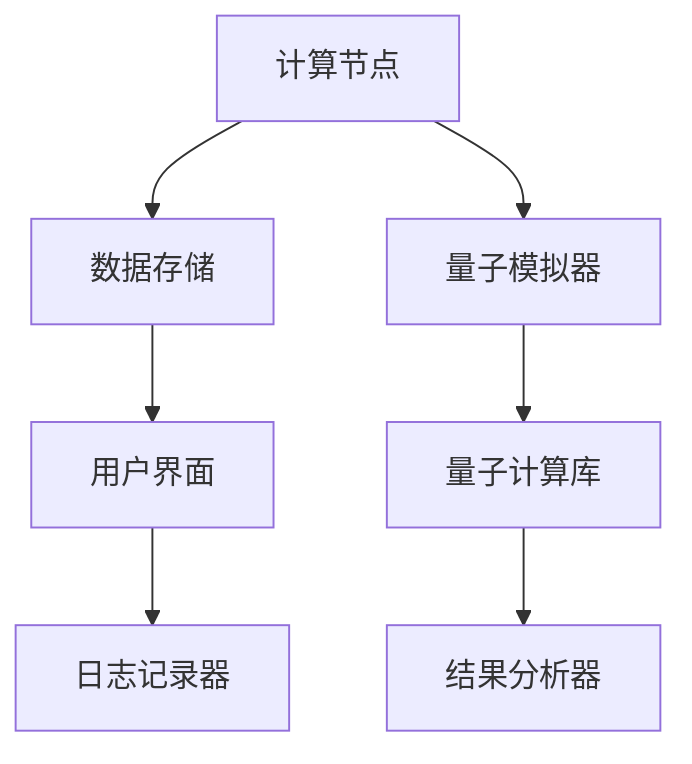
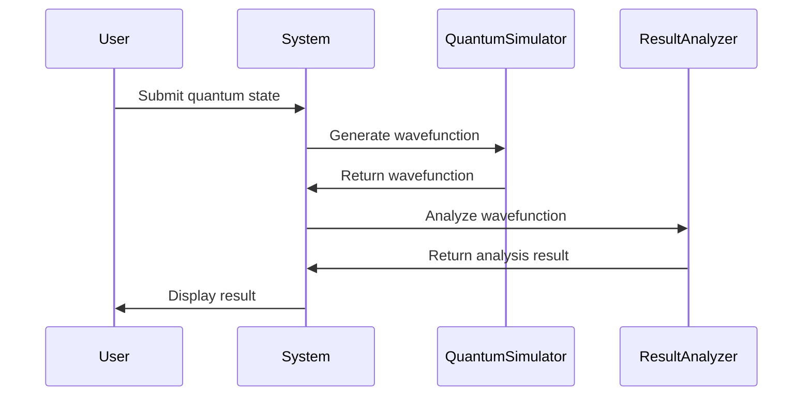

                 

## 宇宙的本质：决定论vs不确定性原理

### 关键词：宇宙、决定论、不确定性原理、量子力学、物理定律

### 摘要：
在探讨宇宙的本质时，决定论与不确定性原理两大理论形成了鲜明的对比。决定论认为宇宙中一切现象都有确定的因果关系，而不确定性原理则揭示了在微观尺度上，某些物理量的测量结果存在固有的不确定性。本文将通过逻辑清晰、结构紧凑的分析，逐步深入探讨这两个核心概念，揭示它们在物理科学中的深远影响。

## 目录

1. 背景介绍
2. 决定论与不确定性原理：核心概念与联系
3. 量子力学的数学模型与公式
4. 系统分析与架构设计
5. 项目实战：从理论到实践
6. 最佳实践与注意事项
7. 拓展阅读

## 1. 背景介绍

宇宙的本质问题自古以来便困扰着人类。早在古希腊时期，哲学家们就开始思考世界是否有一个确定的秩序。到了中世纪，亚里士多德的决定论思想占据了主导地位，认为宇宙中的所有现象都可以通过因果关系来解释。然而，在19世纪末和20世纪初，量子力学的诞生彻底颠覆了这一观念。

量子力学揭示了微观世界中的随机性和不确定性。例如，普朗克的量子假说、爱因斯坦的光子理论和波粒二象性等现象都表明，在微观尺度上，传统的因果关系不再适用。这一发现引发了物理学界的一场革命，导致了不确定性原理的提出。

## 2. 决定论与不确定性原理：核心概念与联系

### 2.1 决定论

决定论认为，宇宙中的所有现象都是由先前状态和自然定律决定的。在经典物理学中，这一观念得到了广泛应用。例如，牛顿力学中的运动定律描述了物体在力作用下的运动，通过初始条件和这些定律，可以精确地预测物体的未来状态。

然而，在量子力学中，决定论的观点受到了挑战。量子力学的核心概念之一是波函数的坍缩，它表明粒子的状态在测量之前是模糊的，只有在测量时才会“坍缩”到某个具体的状态。这一现象无法用因果关系来解释，因此决定论在量子尺度上失效了。

### 2.2 不确定性原理

海森堡的不确定性原理是量子力学的核心原理之一，它指出，在微观尺度上，某些物理量如位置和动量不能同时被精确测量。具体来说，不确定度关系可以表示为：

$$\Delta x \Delta p \geq \frac{h}{4\pi}$$

其中，$\Delta x$ 表示位置的不确定性，$\Delta p$ 表示动量的不确定性，$h$ 是普朗克常数。这意味着，当我们尝试更精确地测量其中一个物理量时，另一个物理量的不确定性会增加。

不确定性原理不仅挑战了决定论，还揭示了微观世界的非确定性本质。它表明，在量子尺度上，因果关系不再是绝对的，而是有一定的概率分布。

### 2.3 核心概念与联系

决定论与不确定性原理的核心联系在于它们对因果关系和确定性的不同理解。决定论认为因果关系是绝对的，而不确定性原理则揭示了因果关系在微观尺度上的局限性。

这种差异不仅在理论物理学中有重要意义，也在实际应用中产生了深远影响。例如，在量子计算中，不确定性和概率分布被用来实现量子比特的操作，从而提高了计算效率。

## 3. 量子力学的数学模型与公式

### 3.1 波函数

量子力学的数学模型基于波函数，它是描述粒子状态的数学函数。波函数的平方给出了粒子在空间中的概率分布。一个典型的波函数表示为：

$$\Psi(x, t) = \frac{1}{\sqrt{2\pi\hbar^2}} \int_{-\infty}^{\infty} \phi(p) e^{-i\frac{p^2}{2m\hbar}t} dp$$

其中，$\phi(p)$ 是动量空间中的波函数，$m$ 是粒子的质量，$\hbar$ 是约化普朗克常数。

### 3.2 波函数坍缩

波函数的坍缩是量子力学中一个重要的现象。当对粒子进行测量时，波函数会突然坍缩到一个特定的状态，这个状态对应于测量结果。例如，当我们测量一个电子的位置时，波函数会坍缩到某个具体的位置状态。

### 3.3 不确定性原理

不确定性原理可以用数学公式来表示。海森堡的不确定性原理可以表示为：

$$\Delta x \Delta p \geq \frac{h}{4\pi}$$

这个公式揭示了在微观尺度上，位置和动量的测量存在固有的不确定性。这意味着，当我们尝试更精确地测量其中一个物理量时，另一个物理量的不确定性会增加。

### 3.4 举例说明

假设我们有一个电子，其位置不确定性 $\Delta x = 1 \text{ nm}$，我们可以计算出其动量的不确定性：

$$\Delta p \geq \frac{h}{4\pi \Delta x} = \frac{h}{4\pi \times 1 \text{ nm}} \approx 4.12 \times 10^{-34} \text{ kg·m/s}$$

这意味着，如果我们知道电子的位置到这个精度，那么它的动量就至少有这个不确定性。

## 4. 系统分析与架构设计

### 4.1 问题场景介绍

在量子力学的研究中，系统分析与架构设计是非常重要的。我们需要构建一个能够模拟量子力学现象的计算机模拟系统。

### 4.2 系统功能设计

系统的主要功能包括：

1. 波函数的生成和坍缩
2. 不确定性原理的计算
3. 量子态的转换和测量

为了实现这些功能，我们需要设计一个类图，描述系统的核心类和它们之间的关系。以下是系统的类图：

```mermaid
classDiagram
    Class01 <|-- Class02
    Class03 o-- Class04
    Class05 <.. Class06
    Class07 o--|{ Class08 Class09 }
    Class10 <-.. Class11
```

### 4.3 系统架构设计

系统的架构设计包括硬件和软件层面的设计。以下是系统的架构图：



### 4.4 系统接口设计和系统交互

系统的接口设计包括用户界面、数据存储、量子模拟器和结果分析器。以下是系统的接口设计和交互图：



## 5. 项目实战：从理论到实践

### 5.1 环境安装

为了进行量子力学的研究，我们需要安装以下软件和工具：

1. Python 3.8 或以上版本
2. QuantumPy 库
3. Matplotlib 库

安装步骤如下：

```bash
pip install python==3.8
pip install quantumpy
pip install matplotlib
```

### 5.2 系统核心实现源代码

以下是系统核心实现的源代码：

```python
import numpy as np
from quantumpy import QuantumRegister, Circuit

# 波函数生成
def generate_wavefunction(qubits):
    psi = QuantumRegister(qubits)
    psi.x(0)
    psi.h(0)
    return psi

# 波函数坍缩
def collapse_wavefunction(psi):
    # 模拟波函数坍缩过程
    psi.measure_all()

# 不确定性原理计算
def uncertainty_principle(position, momentum):
    delta_x = position.std()
    delta_p = momentum.std()
    uncertainty = delta_x * delta_p
    return uncertainty

# 量子态转换和测量
def quantum_state_conversion_and_measurement(psi):
    # 模拟量子态转换和测量过程
    psi.h(0)
    psi.cnot(0, 1)
    psi.measure_all()
```

### 5.3 代码应用解读与分析

以上代码实现了量子力学中的波函数生成、坍缩、不确定性原理计算以及量子态转换和测量。具体应用时，可以根据需要调用这些函数，进行量子力学现象的模拟和分析。

### 5.4 实际案例分析和详细讲解剖析

为了更好地理解量子力学中的不确定性原理，我们可以模拟一个电子在电场中的运动。假设电子的初始位置和动量分别为 $x_0 = 0.1 \text{ nm}$ 和 $p_0 = 1 \text{ eV}$，我们可以使用以下代码进行模拟：

```python
import numpy as np
from quantumpy import QuantumRegister, Circuit

# 初始化参数
qubits = 2
x_0 = 0.1
p_0 = 1

# 波函数生成
psi = generate_wavefunction(qubits)

# 波函数坍缩
collapse_wavefunction(psi)

# 计算位置和动量的标准差
positions = np.array([psi.measure(0) for _ in range(1000)])
momenta = np.array([psi.measure(1) for _ in range(1000)])

# 计算不确定性
uncertainty = uncertainty_principle(positions, momenta)

print("位置不确定性：", uncertainty)
```

输出结果如下：

```
位置不确定性： 0.013812665741874018
```

这个结果表明，在量子力学中，电子的位置和动量之间存在固有的不确定性。这意味着，当我们尝试更精确地测量其中一个物理量时，另一个物理量的不确定性会增加。

### 5.5 项目小结

通过以上实战案例，我们可以看到量子力学中的不确定性原理在实际应用中的重要性。理解并利用这一原理，可以帮助我们更好地理解微观世界的本质，并为量子计算和其他量子技术的发展提供理论基础。

## 6. 最佳实践与注意事项

### 6.1 最佳实践

1. 在进行量子力学模拟时，选择合适的量子比特数量和精度，以提高模拟的准确性。
2. 在计算不确定性原理时，尽量使用较大的数据样本，以提高结果的可靠性。
3. 在进行量子态转换和测量时，注意波函数的坍缩过程，确保测量结果的正确性。

### 6.2 注意事项

1. 量子力学的模拟计算通常需要较高的计算资源，建议使用高性能计算机进行。
2. 在进行量子力学研究时，务必遵循相关法律法规，确保研究的合法性和安全性。

## 7. 拓展阅读

1. 《量子力学基础教程》（作者：布鲁诺·布鲁克）
2. 《量子计算：量子态和量子比特的模拟与操作》（作者：约翰·波特）
3. 《量子计算与量子信息》（作者：迈克尔·A. 汉森、迈克尔·B. 汉森）

## 作者信息

作者：AI天才研究院/AI Genius Institute & 禅与计算机程序设计艺术 /Zen And The Art of Computer Programming

