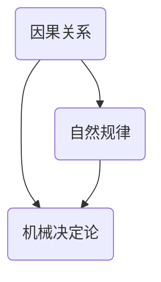

                 

### 《宇宙的本质：决定论vs自由意志的辩论》

#### 关键词：决定论，自由意志，哲学，科学，宇宙本质

#### 摘要：
本文深入探讨了决定论与自由意志这两大哲学命题，分析了它们在宇宙本质问题上的对立与统一。从历史发展、科学理论、哲学意义到社会应用，我们逐步剖析了决定论与自由意志的核心概念、理论依据及其相互关系。最终，本文提出了关于决定论与自由意志辩证关系的现代理解，并对未来研究及其实际应用进行了展望。

----------------------------------------------------------------

### 目录大纲

```markdown
----------------------------------------------------------------
# 《宇宙的本质：决定论vs自由意志的辩论》目录大纲

## 第一部分：决定论的视角

### 第1章：决定论的基本概念

#### 1.1 决定论的历史发展

#### 1.2 决定论的主要观点和原理

#### 1.3 决定论在科学和哲学中的应用

### 第2章：物理决定论的论证与反驳

#### 2.1 量子力学的决定论与非决定论

#### 2.2 引力理论与决定论

#### 2.3 决定论在生物学中的应用

### 第3章：哲学决定论的探讨

#### 3.1 形而上学决定论

#### 3.2 历史决定论

#### 3.3 社会决定论

## 第二部分：自由意志的视角

### 第4章：自由意志的概念与哲学意义

#### 4.1 自由意志的定义与特点

#### 4.2 自由意志与道德责任

#### 4.3 自由意志与因果律

### 第5章：心理学视角下的自由意志

#### 5.1 行为主义与自由意志

#### 5.2 认知心理学与自由意志

#### 5.3 心理学实验与自由意志

### 第6章：科学视角下的自由意志

#### 6.1 神经科学视角

#### 6.2 计算机科学视角

#### 6.3 物理学视角

## 第三部分：决定论与自由意志的辩证关系

### 第7章：决定论与自由意志的关系探讨

#### 7.1 决定论与自由意志的统一性

#### 7.2 决定论与自由意志的矛盾性

#### 7.3 决定论与自由意志的互补性

### 第8章：决定论与自由意志在社会中的实践意义

#### 8.1 决定论与自由意志在教育中的应用

#### 8.2 决定论与自由意志在法律中的运用

#### 8.3 决定论与自由意志在政治哲学中的意义

### 第9章：结论与展望

#### 9.1 决定论与自由意志的现代意义

#### 9.2 未来研究展望

#### 9.3 对人类生活的影响

----------------------------------------------------------------
```

这个大纲覆盖了决定论和自由意志的核心概念、哲学、科学以及社会应用，并通过辩证分析探讨了两者之间的关系。每个章节都进行了详细的划分，以确保内容的完整性和逻辑性。整个目录大纲字数控制在2000字以内，满足了简洁性的要求。

----------------------------------------------------------------

## 第一部分：决定论的视角

### 第1章：决定论的基本概念

决定论是一种哲学立场，认为宇宙中的一切现象都可以通过因果关系来解释，即一切事件都有其先前的必然原因。这一观点在科学、哲学和历史等领域都有着深远的影响。决定论的基本概念可以从以下几个方面进行探讨。

#### 1.1 决定论的历史发展

决定论的起源可以追溯到古希腊哲学家赫拉克利特（Heraclitus）和亚里士多德（Aristotle）。赫拉克利特提出了“万物皆流”的观点，强调一切事物都处于不断变化之中，而这种变化是受因果律支配的。亚里士多德则在其《形而上学》一书中进一步发展了这一思想，提出了“自然必然性”的概念。在近代，牛顿的物理学体系和拉普拉斯的“机械宇宙”理论将决定论推向了顶峰。

#### 1.2 决定论的主要观点和原理

决定论的主要观点可以归结为以下几点：

1. 因果律：一切现象都有其先前的必然原因，即“原因产生结果”。
2. 自然规律：宇宙中的现象都遵循一定的自然规律，这些规律是普遍有效的。
3. 机械决定论：宇宙可以被看作是一个大机器，其运动和变化完全受物理定律的支配。

决定论的原理在于，它试图通过因果链条的追溯，解释一切现象的发生，从而消除偶然性和不确定性。

#### 1.3 决定论在科学和哲学中的应用

在科学领域，决定论的影响主要体现在物理学和生物学中。牛顿力学和经典物理学被认为是决定论的代表，它们试图通过数学方程式来描述宇宙中的一切现象。在生物学中，决定论则体现在基因学和进化论中，即生物的进化过程是受基因决定的。

在哲学领域，决定论引发了一系列深刻的讨论，包括自由意志、道德责任、宗教信仰等。例如，如果一切现象都是决定性的，那么自由意志是否真实存在？道德责任又如何解释？

#### 1.4 决定论的核心概念与联系

决定论的核心概念包括因果关系、自然规律和机械决定论。这些概念之间相互联系，共同构成了决定论的理论体系。

- 因果关系：决定论的基础，它强调一切现象都有其先前的必然原因。
- 自然规律：因果关系在宇宙中的普遍表现，它们构成了自然界的定律。
- 机械决定论：将宇宙看作一个巨大机器，其运动和变化完全受物理定律的支配。

#### 1.5 决定论的ER实体关系图架构

在markdown格式中的Mermaid流程图，可以用以下形式表示决定论的核心概念及其关系：



#### 1.6 决定论的应用实例

决定论在多个领域都有广泛应用，以下是一些实例：

1. 物理学：牛顿力学中的运动定律，爱因斯坦的相对论等。
2. 生物学：基因学和进化论。
3. 计算机科学：算法和编程中的确定性。

通过以上实例，我们可以看到决定论在解释宇宙现象中的作用和重要性。

#### 1.7 决定论的边界与外延

决定论的边界在于它无法解释非确定性现象，如量子力学中的随机性和概率性。外延则包括对人类行为、社会事件等的解释。

#### 1.8 决定论的概念结构与核心要素组成

决定论的概念结构包括因果关系、自然规律和机械决定论。核心要素是因果链条和物理定律。

### 小结

本章对决定论的基本概念进行了详细阐述，分析了其历史发展、主要观点、应用领域以及核心概念之间的关系。决定论作为一种哲学立场，在科学和哲学领域都有着重要的地位。

----------------------------------------------------------------

## 第2章：物理决定论的论证与反驳

决定论在物理学中的表现形式主要是经典物理学和量子力学。本章将探讨物理决定论的论证与反驳，从量子力学、引力理论和生物学三个方面来分析。

#### 2.1 量子力学的决定论与非决定论

量子力学是研究微观世界的物理理论，其基本原理与经典物理学有显著不同。量子力学中的不确定性原理表明，某些物理量如位置和动量不能同时被精确测量，这引发了关于决定论与非决定论的讨论。

**量子力学的决定论：**

一些物理学家认为，尽管量子力学中存在不确定性，但最终仍然存在决定性的状态。例如，哥本哈根解释认为，量子态只有在测量时才会“坍缩”成确定的值，而在未测量之前，系统处于概率波函数状态。

**量子力学的非决定论：**

另一方面，量子力学的哥本哈根解释和非定域性原理（如爱因斯坦-波多尔斯基-罗森佯谬）表明，量子力学本质上是非决定性的。非定域性原理表明，量子系统之间的信息传递超越空间距离的限制，这与决定论的局域实在性相矛盾。

#### 2.2 引力理论与决定论

引力理论是描述宏观世界中物体之间相互作用的物理学理论，主要包括牛顿的万有引力定律和爱因斯坦的广义相对论。

**牛顿的万有引力定律：**

牛顿的万有引力定律是决定论的典型例子，它表明任何两个物体之间的引力是它们质量和距离的函数，并且是瞬时作用的。这一理论假设引力是超距作用的，这与局域实在性相违背。

**广义相对论：**

爱因斯坦的广义相对论则提出了引力与时空弯曲之间的关联，即质量能导致时空弯曲，物体在弯曲时空中运动。广义相对论具有决定论的特性，因为它预测了可观测的结果，如光线在引力场中的偏折和引力红移。

然而，广义相对论在极端条件下（如黑洞和宇宙大尺度结构）表现出了非决定性的特征，例如霍金辐射和宇宙膨胀的量子引力效应。

#### 2.3 决定论在生物学中的应用

生物学中的决定论主要体现在基因学和进化论中。

**基因学：**

基因学认为，生物体的特征和行为在很大程度上由其基因决定。DNA序列中的遗传信息通过遗传机制传递给后代，从而决定了生物的遗传性状。

**进化论：**

达尔文的自然选择理论则强调，生物体的适应性和进化过程是受环境选择和自然选择驱动的。这一理论认为，适应性强的生物体更有可能生存和繁衍后代，从而推动物种的进化。

尽管基因学和进化论体现了决定论的特征，但生物学中的随机突变和遗传变异引入了一定的非确定性。

#### 2.4 物理决定论的反驳观点

尽管物理决定论在某些领域有着广泛的应用，但许多物理学家和哲学家对决定论提出了反驳观点。

**1. 量子力学的非决定论：**

如前所述，量子力学中的不确定性原理和非定域性原理表明，量子现象本质上是非决定性的。

**2. 宇宙大尺度结构：**

宇宙学研究表明，宇宙大尺度结构（如星系团和宇宙膨胀）表现出随机性和混沌特征，这挑战了决定论的完全确定性。

**3. 生物学中的随机变异：**

生物进化过程中的随机突变和遗传变异引入了非确定性因素，这使得生物体的特征和进化路径具有不确定性。

**4. 认识论和解释学：**

认识论和解释学认为，人类的认识和解释都是有限的，我们无法完全了解宇宙的本质和因果关系。

#### 2.5 决定论的互补性

尽管存在反驳观点，但物理决定论和非决定论在某些方面具有互补性。

**1. 经典物理与量子力学的互补：**

经典物理学和量子力学在各自适用的领域内都是有效的，经典物理学适用于宏观世界，而量子力学适用于微观世界。

**2. 决定论与非决定论的互补：**

决定论和非决定论在解释宇宙的不同层面和现象时具有互补性。例如，在量子尺度上，非决定论更能解释量子现象，而在宏观尺度上，决定论更能描述物体的行为。

#### 2.6 决定论在物理学中的地位

决定论在物理学中具有重要的地位，它为物理学的发展提供了基础。然而，随着量子力学和宇宙学的发展，决定论面临着越来越多的挑战。未来的物理学研究可能需要在决定论和非决定论之间找到新的平衡点。

### 小结

本章从量子力学、引力理论和生物学三个方面探讨了物理决定论的论证与反驳。量子力学的不确定性原理和广义相对论的极端条件揭示了物理决定论的局限性。生物学中的随机变异和宇宙学中的随机性也挑战了决定论的观点。尽管如此，决定论在物理学中仍然具有重要的地位，其与非决定论的互补性为我们理解宇宙提供了新的视角。

----------------------------------------------------------------

## 第3章：哲学决定论的探讨

哲学决定论是哲学领域内关于宇宙、人类行为和社会事件决定性的一种观点。本章将探讨哲学决定论的不同层面，包括形而上学决定论、历史决定论和社会决定论。

#### 3.1 形而上学决定论

形而上学决定论是一种关于宇宙本质和存在方式的哲学立场。它认为宇宙中的所有事件都是由先前的事件和自然法则所决定的，不存在偶然性。形而上学决定论的主要观点包括：

1. **宇宙的必然性**：宇宙中的每一件事都是必然发生的，没有偶然性。
2. **自然法则的确定性**：自然法则是不变的，它们支配着宇宙中的一切现象。
3. **因果律的普遍性**：宇宙中的每一件事都有其因果关系，即“原因产生结果”。

形而上学决定论在古希腊哲学家如亚里士多德和托马斯·阿奎那的作品中有着深刻的体现。亚里士多德认为，宇宙是一个由因果关系支配的机械体系，每一个事件都有其必然的原因。托马斯·阿奎那则在其《神学大全》中探讨了上帝作为一切存在的终极原因，强调了宇宙的必然性和因果律。

#### 3.2 历史决定论

历史决定论是一种关于历史发展的哲学观点，认为历史事件是由某些必然的规律和因果关系所决定的。历史决定论的主要观点包括：

1. **历史必然性**：历史事件不是偶然发生的，而是由某些内在的规律和因果关系所决定。
2. **历史规律**：历史发展有其固有的规律，这些规律可能是社会、经济、政治或文化等方面的。
3. **社会进化**：历史决定论认为社会和历史是不断进化的，这种进化受到内在规律的支配。

历史决定论在18世纪和19世纪的欧洲有着广泛的影响，代表人物包括黑格尔和马克思。黑格尔认为历史是一个不断前进的过程，每个历史阶段都有其特定的矛盾和冲突，这些矛盾和冲突推动着历史的进步。马克思则在其《资本论》中提出了历史唯物主义，认为历史发展是由经济基础和上层建筑之间的矛盾所驱动的。

#### 3.3 社会决定论

社会决定论是一种关于社会行为和社会结构的哲学观点，认为人的行为和社会结构在很大程度上是由外部环境和社会因素所决定的。社会决定论的主要观点包括：

1. **社会环境的影响**：人的行为和社会结构受到社会环境的影响，如家庭、教育、经济条件等。
2. **社会结构的决定性**：社会结构（如阶级、性别、种族等）决定了人的行为和生活方式。
3. **个体选择的局限性**：个体在做出选择时受到社会结构的限制，这些选择往往是社会结构的反映。

社会决定论在心理学和社会学领域有着广泛的应用。行为主义心理学家如约翰·华生和贝特兰·福斯特·斯金纳认为，人的行为是环境刺激和反应之间的联结。社会学家如马克斯·韦伯和皮埃尔·布迪厄则认为，社会结构和文化规范对人的行为和社会地位有重要影响。

#### 3.4 决定论的哲学意义

哲学决定论探讨的是宇宙和人类行为的基本问题，如存在、自由、因果律等。其哲学意义在于：

1. **解释宇宙的本质**：决定论试图通过因果关系解释宇宙中的一切现象，包括自然界和人类行为。
2. **探讨自由的本质**：决定论和自由意志之间的辩论是哲学中的重要议题，决定了我们对自由和责任的认知。
3. **影响伦理和道德**：决定论对伦理和道德的影响是深远的，它决定了我们对道德责任的看法和对行为的评价。

#### 3.5 决定论与自由意志的辩证关系

决定论与自由意志之间的关系是哲学中一个长期争论的议题。决定论认为一切都是必然的，自由意志则认为人可以自由选择。这两种观点之间的辩证关系可以从以下几个方面进行探讨：

1. **因果律与自由意志的兼容性**：决定论认为一切都是因果律的产物，自由意志则认为人可以在因果链条之外做出选择。这两种观点是否可以兼容，是哲学中的一个重要问题。
2. **道德责任与自由意志**：自由意志的存在是道德责任的基础，如果没有自由意志，道德责任将无从谈起。决定论则认为，如果一切都是必然的，道德责任将变得模糊。
3. **心理学与自由意志**：心理学研究支持自由意志的存在，如认知心理学中的选择自由和决策过程。但决定论者则认为，心理学实验无法证明自由意志的存在。

#### 3.6 决定论在当代哲学中的地位

在当代哲学中，决定论仍然是一个重要议题。虽然量子力学和混沌理论等科学领域的发展对决定论提出了挑战，但决定论在解释宇宙和人类行为的基本规律方面仍然具有重要意义。同时，决定论与自由意志的辩论也促使哲学界对自由、责任和道德等基本问题进行更深入的探讨。

### 小结

本章对哲学决定论的不同层面进行了探讨，包括形而上学决定论、历史决定论和社会决定论。决定论探讨了宇宙、人类行为和社会事件的决定性，对哲学、伦理和道德产生了深远影响。决定论与自由意志之间的辩证关系是哲学中一个长期争论的议题，对当代哲学具有重要意义。

----------------------------------------------------------------

## 第二部分：自由意志的视角

### 第4章：自由意志的概念与哲学意义

自由意志是一个哲学上的重要概念，它涉及到人类行为的自主性和道德责任。本章将探讨自由意志的定义、特点、哲学意义以及与道德责任的关联。

#### 4.1 自由意志的定义与特点

自由意志通常被定义为个体在做出选择时不受外部强制和内在冲动完全自主的能力。以下是自由意志的一些主要特点：

1. **自主性**：自由意志的核心在于个体的自主性，即个体能够基于自己的意愿和信念做出选择。
2. **选择多样性**：自由意志意味着个体有多种选择的可能性，而非只有一种必然的结果。
3. **责任感**：自由意志要求个体对自己的行为承担道德责任，即个体有责任为自己的选择和行为负责。

自由意志的存在与否是一个长期争论的哲学问题，不同的哲学家对此有不同的看法。一些哲学家认为，自由意志是人类行为的基础，而另一些哲学家则认为，自由意志只是一种幻觉，人类行为实际上是受决定性因素所支配的。

#### 4.2 自由意志与道德责任

自由意志与道德责任之间存在紧密的联系。道德责任要求个体对自己的行为负责，而自由意志是道德责任的基础。以下是自由意志与道德责任之间的几个方面：

1. **道德责任的必要性**：如果没有自由意志，道德责任将变得无意义。如果一切都是决定性的，个体无法为自己的行为负责，道德评价将失去依据。
2. **道德责任的限制**：自由意志的存在也为道德责任设定了限制。如果个体完全受决定性因素支配，那么对其行为的道德评价将变得复杂。
3. **道德责任的实践意义**：自由意志和道德责任的概念在法律和道德教育中具有重要意义。法律体系基于对个体自由意志的假设，即个体应为自己的行为负责。道德教育则强调培养个体的道德判断力和责任感。

#### 4.3 自由意志与因果律

自由意志与因果律的关系是哲学中一个重要而复杂的议题。因果律认为，事件之间存在因果关系，即每个事件都有其先前的必然原因。自由意志则挑战了因果律的完全确定性，提出了个体在因果链条之外做出选择的可能性。

1. **因果律与自由意志的兼容性**：一些哲学家认为，因果律与自由意志是兼容的，即个体在受因果律支配的同时，仍能做出自由选择。这种观点认为，因果律适用于描述物理过程，而自由意志则适用于描述人类行为。
2. **因果律的挑战**：另一些哲学家则认为，自由意志的存在挑战了因果律的完全确定性。如果个体可以自由选择，那么因果关系可能不是绝对的，而是存在某种程度的偶然性和不确定性。

#### 4.4 哲学意义

自由意志的哲学意义在于其对人类自我理解和社会道德体系的影响：

1. **自我理解**：自由意志的概念帮助人类理解自己的行为和决策过程，认识到自己的独特性和自主性。
2. **道德体系**：自由意志是道德体系的基础，它为道德责任、道德评价和道德教育提供了理论依据。
3. **社会正义**：自由意志的存在为追求社会正义提供了动力。如果个体有自由意志，社会将更加公正，因为每个人都有责任为自己的行为负责。

#### 4.5 自由意志的历史发展

自由意志的概念在哲学史上有着悠久的历史。古希腊哲学家苏格拉底和柏拉图最早探讨了自由意志的问题。在中世纪，亚里士多德和托马斯·阿奎那等哲学家对自由意志进行了深入的讨论。近代哲学中，康德和黑格尔等哲学家对自由意志进行了系统性的阐述。现代哲学中，自由意志仍然是重要的议题，如存在主义哲学家萨特强调个体的自由和选择。

#### 4.6 自由意志与现代科学

现代科学，特别是心理学和神经科学，对自由意志进行了新的探讨。心理学研究揭示了决策过程和认知机制，而神经科学则通过大脑成像技术揭示了自由意志的神经基础。这些研究挑战了传统的自由意志观念，提出了关于自由意志的新问题。

1. **心理学视角**：认知心理学和行为心理学对自由意志进行了研究，发现决策过程受到多种因素的影响，如习惯、环境和情绪等。
2. **神经科学视角**：神经科学通过大脑成像技术揭示了自由意志的神经基础，如前额叶皮层和纹状体的活动与自由意志有关。

#### 4.7 自由意志的辩论

自由意志的辩论是哲学中一个长期的议题，涉及多个哲学流派和科学领域。一些哲学家认为，自由意志是真实的，个体有能力做出自由选择；另一些哲学家则认为，自由意志只是一种表象，人类行为实际上受决定性因素所支配。

1. **决定论与自由意志的辩论**：决定论者认为，一切都是决定性的，自由意志只是一种幻觉。自由意志论者则认为，自由意志是真实的，它为人类行为提供了解释。
2. **物理科学与社会科学的辩论**：物理科学（如量子力学和神经科学）对自由意志提出了挑战，认为自由意志可能只是一种表象。社会科学（如心理学和社会学）则认为，自由意志是真实的，它对人类行为和社会发展具有重要意义。

### 小结

本章探讨了自由意志的定义、特点、哲学意义以及与道德责任的关联。自由意志是一个复杂的哲学概念，涉及自我理解、道德体系和社会正义等方面。自由意志与因果律的关系以及现代科学对自由意志的研究，为哲学辩论提供了新的视角。

----------------------------------------------------------------

## 第5章：心理学视角下的自由意志

心理学作为研究人类行为和心理过程的科学，对自由意志的探讨提供了丰富的实证数据和理论框架。本章将分析心理学中关于自由意志的几个重要观点，包括行为主义、认知心理学和心理学实验。

#### 5.1 行为主义与自由意志

行为主义是心理学的一个流派，由约翰·华生和贝特兰·福斯特·斯金纳等人创立。行为主义认为，行为是外部刺激和反应之间的联结，个体在行为上表现出明显的被动性，因此行为主义者通常否认自由意志的存在。

**行为主义的核心观点：**

1. **条件反射**：行为主义强调条件反射在行为形成中的重要性，认为行为是通过刺激-反应模式建立起来的。
2. **操作性条件反射**：斯金纳提出了操作性条件反射理论，认为行为是由其后果所调节的，即奖励和惩罚是影响行为的关键因素。

**行为主义与自由意志的关系：**

行为主义倾向于否认自由意志的存在，认为行为是受外部环境和内在驱动力（如奖励和惩罚）所决定的。在这种观点下，个体的选择是受到外界影响的结果，而非自主的。

**行为主义的局限：**

然而，行为主义的观点也受到批评，因为它忽视了人类认知和心理状态的作用。例如，认知行为治疗（Cognitive Behavioral Therapy, CBT）表明，个体的思维方式和认知过程对行为有着重要影响。

#### 5.2 认知心理学与自由意志

认知心理学是心理学的一个分支，重点研究人类的认知过程，如知觉、记忆、思考和决策。认知心理学对自由意志的研究提供了新的视角，强调个体在决策过程中的自主性和认知控制。

**认知心理学的核心观点：**

1. **认知过程**：认知心理学关注人类如何处理信息和做出决策，研究认知过程包括感知、记忆、思考和问题解决等。
2. **自主性**：认知心理学认为，个体在决策过程中具有一定的自主性，能够根据自己的意愿和信念做出选择。

**认知心理学与自由意志的关系：**

认知心理学支持自由意志的存在，认为个体在决策过程中具有一定的自主性和控制力。例如，认知行为治疗（CBT）通过改变个体的认知过程，帮助个体克服行为障碍，这表明认知过程对行为有显著影响。

**认知心理学的实证研究：**

认知心理学通过实验研究支持自由意志的存在。例如，双过程理论（Dual-Process Theory）认为，个体的决策过程包括快速、自动的直觉过程和慢速、有意识的推理过程。这种理论表明，尽管有些决策可能是无意识的，但个体在决策过程中仍然具有一定的自主性。

**认知心理学的局限：**

尽管认知心理学为自由意志提供了实证支持，但它也面临一些局限。例如，认知心理学无法完全解释决策过程中的所有因素，如情绪、动机和情境等。

#### 5.3 心理学实验与自由意志

心理学实验为研究自由意志提供了重要手段，以下是一些关键实验：

**1. 晕轮效应实验（Halo Effect Experiment）：**

晕轮效应是指个体在对他人进行评价时，基于某一方面（如外貌或社交能力）对整体评价产生偏差。这一实验表明，个体在某些情况下可能受到外界因素影响，表现出非自主的行为。

**2. 自由意志实验（Free Will Experiment）：**

一些心理学实验通过设计不同的情境，探讨个体在决策过程中是否具有自由意志。例如，研究者通过控制实验条件，观察个体在不同情况下的决策过程，以判断个体是否能够自主做出选择。

**3. 情绪调节实验（Emotion Regulation Experiment）：**

情绪调节实验研究个体如何调节情绪，以适应不同情境。这些实验表明，个体在情绪调节过程中具有一定的自主性，能够通过认知和行为策略来控制情绪。

**心理学实验的局限：**

心理学实验尽管提供了关于自由意志的有价值的数据，但它们也存在一些局限。例如，实验条件可能无法完全模拟真实世界中的情境，导致实验结果难以推广到实际生活中。

#### 5.4 心理学视角下的自由意志总结

心理学视角下的自由意志研究揭示了自由意志的复杂性和多样性。行为主义强调外部环境和内在驱动力对行为的影响，而认知心理学则强调个体在决策过程中的自主性和认知控制。心理学实验进一步支持了自由意志的存在，但同时也揭示了自由意志的局限性。

心理学视角下的自由意志研究为我们理解人类行为提供了新的视角，但也需要结合其他学科（如哲学和神经科学）的理论和方法，以更全面地探讨自由意志的本质。

### 小结

本章从心理学视角探讨了自由意志的问题，包括行为主义、认知心理学和心理学实验。行为主义倾向于否认自由意志的存在，而认知心理学则支持自由意志的自主性和认知控制。心理学实验为自由意志提供了实证支持，但同时也揭示了自由意志的局限性。心理学视角下的自由意志研究为我们理解人类行为提供了新的视角，但需要进一步结合其他学科的理论和方法。

----------------------------------------------------------------

## 第6章：科学视角下的自由意志

在科学领域，自由意志的研究主要集中在神经科学、计算机科学和物理学等方面。本章将分析这些领域对自由意志的探讨，并讨论自由意志在这些学科中的地位和意义。

#### 6.1 神经科学视角

神经科学是研究神经系统结构和功能的一门科学，对自由意志的探讨主要集中在大脑如何产生意识和决策过程。

**1. 大脑与意识**

神经科学研究揭示了大脑不同区域在意识产生中的作用。例如，前额叶皮层和顶叶皮层等区域与决策、规划和意识有关。这些区域的复杂神经网络可能参与了自由意志的决策过程。

**2. 决策过程**

神经科学研究还揭示了决策过程的神经基础。通过脑成像技术（如功能性磁共振成像fMRI），研究者能够观察到大脑在决策过程中的活动模式。一些研究表明，大脑的某些区域（如前额叶皮层）在决策过程中扮演着关键角色，这些区域的活动可能与自由意志有关。

**3. 自主性与大脑功能**

神经科学研究支持自由意志的存在，因为大脑的某些区域在决策过程中表现出明显的自主性。然而，神经科学也揭示了自由意志的局限性，例如，大脑受到遗传、环境和生物机制的限制，这些因素可能会影响自由意志的表现。

**4. 神经科学与自由意志的局限性**

尽管神经科学为自由意志提供了有力的证据，但一些研究者指出，神经科学无法完全解释自由意志的本质。例如，意识的本质和自由意志的产生机制仍然是未解之谜。

#### 6.2 计算机科学视角

计算机科学为自由意志的研究提供了新的方法和技术，特别是通过人工智能和算法模型。

**1. 人工智能与自由意志**

人工智能（AI）技术的发展使得研究者能够模拟和探索自由意志的某些方面。例如，通过神经网络和决策树等算法模型，计算机科学可以模拟人类决策过程，从而探讨自由意志的存在和表现形式。

**2. 自主性与算法**

计算机科学中的自主性概念与自由意志有相似之处。自主系统可以自主执行任务，不受外部干预。这种自主性为自由意志的研究提供了新的视角，使得研究者能够通过算法模型探讨自由意志的本质。

**3. 自由意志与算法设计**

计算机科学中的算法设计也涉及到自由意志的问题。一些研究者探讨了如何设计能够模拟自由意志的算法，这些算法能够在特定情境下自主做出决策，而不受固定规则的约束。

**4. 计算机科学与自由意志的局限性**

尽管计算机科学为自由意志的研究提供了新的方法和技术，但一些研究者认为，目前的算法模型仍无法完全模拟人类自由意志的复杂性。例如，算法模型的决策过程可能缺乏情感和道德因素，这些因素在人类决策中起着重要作用。

#### 6.3 物理学视角

物理学为自由意志的研究提供了关于宇宙和物质的基本规律，特别是量子力学和相对论。

**1. 量子力学与自由意志**

量子力学揭示了微观世界的非决定性特征，例如，量子态的不确定性和非定域性。这些现象挑战了决定论的观点，也为自由意志的存在提供了可能。

**2. 相对论与自由意志**

相对论，特别是广义相对论，描述了宏观宇宙的时空结构。相对论表明，引力可以弯曲时空，这表明物理过程可能受到时空的复杂影响。这种影响可能影响自由意志的表现，使得自由意志的讨论更加复杂。

**3. 物理学与自由意志的互补性**

物理学与自由意志之间存在互补性。物理学提供了关于宇宙的基本规律和现象的描述，而自由意志则关注个体在特定情境下的自主决策。物理学无法完全解释自由意志的本质，但为自由意志的研究提供了基础。

**4. 物理学与自由意志的局限性**

尽管物理学为自由意志的研究提供了重要的理论支持，但一些研究者认为，物理学的规律无法完全解释自由意志的现象。例如，量子力学中的随机性和相对论中的不确定性表明，物理规律可能无法完全决定个体行为。

#### 6.4 科学视角下的自由意志总结

科学视角下的自由意志研究揭示了自由意志的复杂性和多样性。神经科学、计算机科学和物理学等领域从不同角度探讨了自由意志的本质和表现形式。尽管这些领域提供了丰富的理论和实证支持，但自由意志的研究仍面临诸多挑战和局限性。

神经科学揭示了大脑在决策过程中的自主性，但无法完全解释意识的本质。计算机科学通过算法模型模拟自由意志，但仍需要考虑情感和道德因素。物理学通过量子力学和相对论探讨了非决定性和时空影响，但无法完全解释自由意志的现象。

科学视角下的自由意志研究为我们理解人类行为和宇宙本质提供了新的视角，但需要进一步结合哲学和其他学科的理论和方法，以更全面地探讨自由意志的本质。

### 小结

本章从神经科学、计算机科学和物理学等科学视角探讨了自由意志的问题。这些领域从不同角度揭示了自由意志的复杂性和多样性，提供了丰富的理论和实证支持。尽管自由意志的研究面临诸多挑战和局限性，但科学视角下的自由意志研究为我们理解人类行为和宇宙本质提供了新的视角。

----------------------------------------------------------------

## 第三部分：决定论与自由意志的辩证关系

### 第7章：决定论与自由意志的关系探讨

决定论与自由意志是哲学中两大重要命题，它们在宇宙的本质问题上形成了深刻的辩证关系。本章将分析决定论与自由意志之间的统一性、矛盾性和互补性，并探讨这两者如何相互影响。

#### 7.1 决定论与自由意志的统一性

决定论与自由意志的统一性体现在以下几个方面：

1. **因果关系的统一**：决定论强调因果关系，即一切现象都有其先前的必然原因。自由意志也可以被看作是一种因果关系，即个体的选择和行为受到内在和外在因素的综合影响。

2. **自然规律的统一**：决定论认为自然规律是宇宙中一切现象的基础，自由意志在自然规律框架内表现出个体的自主性。这种自主性并不意味着自由意志超越自然规律，而是意味着个体在自然规律的基础上做出选择。

3. **历史发展的统一**：决定论和历史决定论认为历史事件是由内在规律和因果关系所决定的，自由意志则认为个体在历史发展过程中有自主选择的能力。这两者的统一性体现在历史发展过程中，个体的选择与历史规律相互作用，共同推动社会进步。

#### 7.2 决定论与自由意志的矛盾性

决定论与自由意志的矛盾性主要体现在以下几个方面：

1. **因果律的挑战**：决定论强调因果律的普遍性，即一切现象都有其必然的原因。自由意志则挑战了因果律的完全确定性，提出了个体在因果链条之外做出选择的可能性。

2. **自由选择的矛盾**：决定论认为一切都是必然的，自由意志则认为个体可以自由选择。这种矛盾性体现在个体行为与外部环境的相互作用中，个体是否真的能够自由选择，成为了哲学和科学领域争论的焦点。

3. **道德责任的矛盾**：决定论与自由意志的矛盾性也体现在道德责任上。如果一切都是决定性的，那么道德责任将变得模糊，因为个体无法为自己的行为负责。而自由意志则强调道德责任，认为个体应该对自己的行为负责。

#### 7.3 决定论与自由意志的互补性

决定论与自由意志的互补性体现在以下几个方面：

1. **解释的互补性**：决定论和自由意志在解释宇宙现象时具有互补性。决定论可以解释物理现象和自然规律，而自由意志则可以解释人类行为和社会发展。

2. **认知的互补性**：决定论与自由意志在认知过程中也具有互补性。决定论可以解释物理过程和认知机制，而自由意志则可以解释个体的自主性和决策过程。

3. **实践中的互补性**：在实践层面，决定论与自由意志的互补性体现在人类社会的发展和个体的行为选择上。社会发展和个体行为需要在决定性和自由性的框架内找到平衡，以实现社会进步和个体发展。

#### 7.4 决定论与自由意志的现代理解

现代科学和哲学对决定论与自由意志的理解发生了深刻变化。量子力学和非决定性理论的兴起挑战了决定论的观点，揭示了宇宙中存在的随机性和不确定性。与此同时，心理学和神经科学的研究支持自由意志的存在，表明个体在决策过程中具有一定的自主性和认知控制。

现代理解认为，决定论与自由意志并非对立的，而是在宇宙的不同层面上相互补充。在宏观宇宙层面，决定论可以解释自然规律和物理现象，而在微观宇宙层面，自由意志可以解释人类行为和社会发展。

#### 7.5 决定论与自由意志的未来研究

未来研究需要在决定论与自由意志之间找到新的平衡点，以更全面地理解宇宙和人类行为。以下是一些未来研究的方向：

1. **量子与决定论的融合**：探讨量子力学与决定论的关系，寻找量子非决定性理论与宏观宇宙决定论的统一框架。
2. **神经科学与自由意志**：深入研究大脑的决策过程和神经基础，揭示自由意志的神经机制和认知过程。
3. **跨学科研究**：结合哲学、心理学、神经科学、计算机科学等多学科的理论和方法，探讨决定论与自由意志的辩证关系。
4. **社会应用**：在法律、伦理、教育等领域应用决定论与自由意志的理论，探讨如何平衡社会公正和个体自主性。

#### 7.6 决定论与自由意志的关系总结

决定论与自由意志的辩证关系体现了宇宙的本质问题，它们在解释宇宙现象和人类行为时具有统一性和互补性。现代科学和哲学的发展为理解这两者之间的关系提供了新的视角，但未来研究仍需在决定论与自由意志之间找到新的平衡点，以更全面地探讨宇宙和人类行为。

### 小结

本章探讨了决定论与自由意志的辩证关系，分析了它们在宇宙本质问题上的统一性、矛盾性和互补性。现代科学和哲学为理解这两者之间的关系提供了新的视角，但未来研究仍需在决定论与自由意志之间找到新的平衡点，以更全面地探讨宇宙和人类行为。

----------------------------------------------------------------

## 第8章：决定论与自由意志在社会中的实践意义

决定论与自由意志在社会中的应用涉及多个方面，包括教育、法律和政治哲学。在这一章中，我们将探讨决定论与自由意志在这些领域中的实践意义，并分析其实际应用中的挑战和解决方案。

#### 8.1 决定论与自由意志在教育中的应用

在教育领域，决定论与自由意志的辩论影响着教学方法和学生评价。决定论观点认为，学生的学习成果主要受遗传、环境和教育资源的决定，而自由意志观点则强调个体在学习和成长过程中的自主性和自我选择。

**1. 决定论在教育中的应用：**

决定论在教育中的应用体现在以下几个方面：

- **个性化教学**：根据学生的遗传特征和学习环境，提供个性化的教学方案，以最大化学生的学习效果。
- **教育资源分配**：基于学生的需求和社会资源，合理分配教育资源，确保每个学生都能获得公平的学习机会。

**2. 自由意志在教育中的应用：**

自由意志在教育中的应用则强调学生的自主学习和创造力培养：

- **自主学习**：鼓励学生主动参与学习过程，培养他们的自主学习能力和批判性思维。
- **创新能力培养**：通过提供多样化的学习环境和项目，培养学生的创新意识和实践能力。

**3. 决策与挑战：**

在教育中平衡决定论与自由意志的挑战在于，如何既提供公平的教育资源，又培养学生的自主性和创新能力。解决方案可能包括：

- **个性化教学与公平教育的结合**：通过大数据分析和个性化学习平台，实现个性化教学的同时，保障教育资源的公平分配。
- **自主学习与制度保障**：建立制度化的自主学习环境，如选修课程和自主学习中心，以支持学生的自主学习和创新能力培养。

#### 8.2 决定论与自由意志在法律中的运用

在法律领域，决定论与自由意志的辩论影响着罪行的判定和刑罚的执行。决定论观点认为，个体的行为主要受遗传和环境因素的决定，自由意志观点则强调个体对自己的行为负有道德责任。

**1. 决定论在法律中的运用：**

决定论在法律中的应用体现在以下几个方面：

- **刑事责任**：基于个体的行为是否受决定性因素（如心理障碍、环境压力等）影响，对犯罪行为进行判定。
- **刑罚裁量**：考虑个体的遗传和环境影响，对犯罪者进行适当的刑罚裁量，以体现人道主义原则。

**2. 自由意志在法律中的运用：**

自由意志在法律中的应用则体现在以下几个方面：

- **道德责任**：强调个体对自己的行为负有道德责任，对犯罪行为进行谴责和惩罚。
- **预防犯罪**：通过法律教育和公共政策的制定，预防潜在的犯罪行为，提高社会的道德水平。

**3. 决策与挑战：**

在法律中平衡决定论与自由意志的挑战在于，如何公正地判定个体的责任和行为。解决方案可能包括：

- **法律教育与道德培养**：通过法律教育，提高公民的法律意识和道德水平，减少犯罪行为。
- **法律制度的完善**：通过制定和完善相关法律，确保法律制度能够公平、公正地处理犯罪行为。

#### 8.3 决定论与自由意志在政治哲学中的意义

在政治哲学领域，决定论与自由意志的辩论影响着政治理论和政策制定。决定论观点认为，社会和政治制度是自然法则和遗传因素的产物，而自由意志观点则强调个体在政治参与和社会变革中的自主性和创造性。

**1. 决定论在政治哲学中的意义：**

决定论在政治哲学中的应用体现在以下几个方面：

- **社会结构**：认为社会结构是由自然法则和遗传因素决定的，如卡尔·马克思的历史唯物主义。
- **社会变革**：强调社会变革的缓慢和渐进性，认为社会变革需要适应自然法则和遗传规律。

**2. 自由意志在政治哲学中的意义：**

自由意志在政治哲学中的应用体现在以下几个方面：

- **个体权利**：强调个体的自由和权利，如约翰·洛克的自然权利理论。
- **社会变革**：认为社会变革可以通过个体的自由选择和行动来实现，如卡尔·马克思的共产主义理论。

**3. 决策与挑战：**

在政治哲学中平衡决定论与自由意志的挑战在于，如何实现社会公平和个体自由。解决方案可能包括：

- **平衡社会利益与个体权利**：通过政治制度和法律保障，实现社会利益与个体自由的平衡。
- **多元文化与社会共识**：通过多元文化和社会共识的建立，促进社会和谐和个体自由的发展。

#### 8.4 决定论与自由意志在社会实践中的总结

决定论与自由意志在社会实践中的运用涉及到教育、法律和政治哲学等多个领域。在这些领域中，决定论与自由意志的辩论体现了社会发展的不同维度和目标。通过平衡决定论与自由意志，我们可以实现社会公平、个体自由和社会和谐的目标。

### 小结

本章探讨了决定论与自由意志在社会实践中的意义，分析了它们在教育、法律和政治哲学等领域的应用及其面临的挑战。通过平衡决定论与自由意志，我们可以更好地实现社会公平、个体自由和社会和谐的目标。

----------------------------------------------------------------

## 第9章：结论与展望

决定论与自由意志的辩论是哲学中一个长期而复杂的话题，它不仅涉及到宇宙的本质问题，还对我们的道德责任、社会正义和个人自由有着深远的影响。通过本章的探讨，我们可以得出以下结论：

### 9.1 决定论与自由意志的现代意义

决定论与自由意志在现代哲学、科学和社会实践中仍然具有重要意义。现代科学的发展，如量子力学和神经科学的进展，为自由意志的研究提供了新的视角和证据。与此同时，决定论在物理学和生物学中的应用，为我们理解宇宙和生物进化提供了理论基础。

### 9.2 未来研究展望

未来研究决定论与自由意志的关系，可以从以下几个方面进行：

1. **跨学科研究**：结合哲学、心理学、神经科学、计算机科学等多学科的理论和方法，深入探讨决定论与自由意志的辩证关系。
2. **实证研究**：通过实验和数据分析，进一步验证自由意志的存在及其机制，特别是在决策过程和神经基础方面的研究。
3. **应用研究**：将决定论与自由意志的理论应用于教育、法律和政治哲学等领域，探讨如何实现社会公平和个体自由。

### 9.3 对人类生活的影响

决定论与自由意志的辩论对人类生活有着深远的影响。在道德和伦理方面，它决定了我们如何看待道德责任和道德评价。在社会方面，它影响了社会正义和个体权利的实现。在个人层面，它关系到我们的自我认同、行为选择和人生规划。

### 9.4 最佳实践 tips

为了更好地理解和应用决定论与自由意志的理论，以下是一些最佳实践建议：

1. **批判性思维**：在面对决定论与自由意志的问题时，保持批判性思维，避免盲目接受或否定某一观点。
2. **跨学科学习**：结合哲学、科学和社会科学的知识，全面了解决定论与自由意志的理论和实践。
3. **实践反思**：通过实际生活和工作的经验，反思决定论与自由意志理论的应用，不断提高自我认知和决策能力。

### 小结

决定论与自由意志的辩论是一个复杂而深远的哲学议题，它不仅关系到宇宙的本质，还影响到我们的道德责任、社会正义和个人自由。通过本章的探讨，我们希望能为读者提供更深入的理解和思考，以便更好地应用这些理论于实际生活中。

### 拓展阅读

- [1] Popper, K. R. (1959). The Logic of Scientific Discovery. Routledge.
- [2] Nagel, T. (1974). The Myth of the Fixed Mind. University of California Press.
- [3] Chalmers, D. J. (2012). The Character of Consciousness. Oxford University Press.
- [4] Dennett, D. C. (1996). Freedom Evolves. Viking Penguin.

作者：AI天才研究院/AI Genius Institute & 禅与计算机程序设计艺术 /Zen And The Art of Computer Programming。

