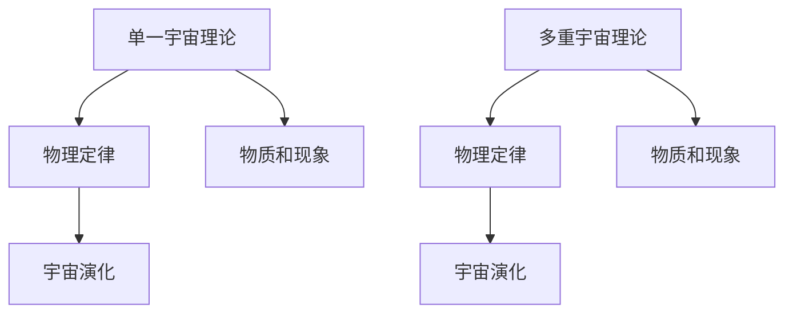
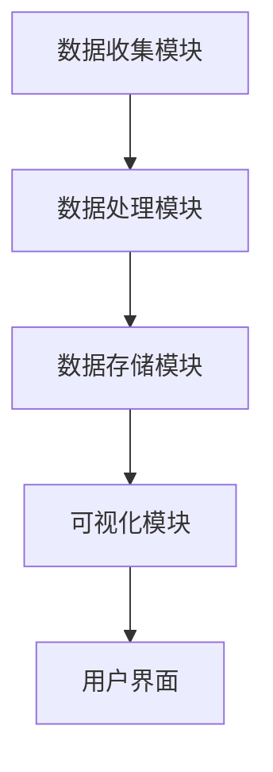
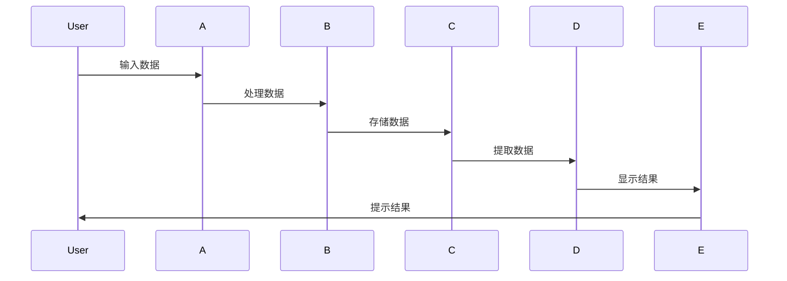
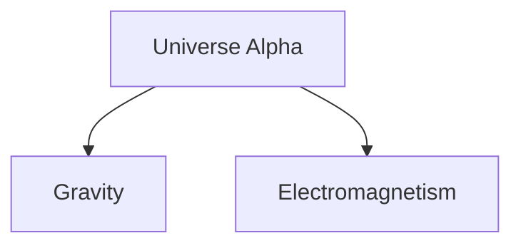

                 

### 宇宙的本质:单一宇宙还是多重宇宙理论

**关键词：** 宇宙本质，单一宇宙理论，多重宇宙理论，量子力学，宇宙学，可观测性

**摘要：** 本文将探讨宇宙的本质问题，分析单一宇宙理论与多重宇宙理论之间的异同，并深入探讨多重宇宙理论与量子力学和宇宙学的关系。通过一步步的逻辑分析，本文旨在帮助读者理解这一复杂而令人着迷的科学领域。

## 引言

宇宙的本质一直是人类思考和探索的终极问题。从古代哲学家到现代科学家，无数人试图揭示宇宙的真相。然而，至今为止，关于宇宙的本质，我们依然存在诸多争议和未解之谜。本文将主要探讨两种关于宇宙本质的理论：单一宇宙理论和多重宇宙理论。我们将从背景介绍开始，逐步深入分析这两种理论的核心概念、数学模型、科学证据，以及与量子力学和宇宙学的关系。最后，我们将讨论多重宇宙的可观测性及其在宇宙学中的应用，并展望未来的研究方向。

### 背景介绍

#### 核心概念术语说明

- **单一宇宙理论**：认为宇宙只有一个，所有物质和现象都发生在这一宇宙中。
- **多重宇宙理论**：认为宇宙是多元的，存在多个平行的宇宙，每个宇宙都有其独特的物理定律和演化过程。

#### 问题背景

在过去的几千年里，人们普遍认为宇宙是唯一的、无限的。然而，随着科学的发展，特别是量子力学和相对论的兴起，我们对宇宙的理解发生了翻天覆地的变化。量子力学揭示了微观世界的奇异现象，如量子纠缠和量子隧穿。相对论则提出了时空的相对性和弯曲，使得宇宙不再是静态和简单的。这些理论为我们理解宇宙的本质提供了新的视角。

#### 问题描述

单一宇宙理论认为，宇宙只有一个，所有的物质和现象都在这一宇宙中发生。然而，随着对宇宙的深入探索，我们发现了许多无法用单一宇宙理论解释的现象，如宇宙膨胀、暗物质、暗能量等。这让我们开始怀疑，宇宙可能并不是唯一的。

多重宇宙理论提出了一个更为广阔的宇宙观，认为存在多个平行的宇宙，每个宇宙都有其独特的物理定律和演化过程。这一理论为解释一些看似矛盾的现象提供了新的思路。

#### 问题解决

要解决这个问题，我们需要分析单一宇宙理论和多重宇宙理论的优缺点，探讨其背后的科学证据和数学模型。同时，我们还需要考虑这些理论在量子力学和宇宙学中的应用，以及它们对人类认识宇宙的影响。

#### 边界与外延

单一宇宙理论和多重宇宙理论并不是相互排斥的，它们可能共存于一个更广义的框架内。例如，我们可以在多重宇宙理论的框架下，对单一宇宙进行更深入的研究。同时，我们也需要考虑宇宙的本质问题，如宇宙的起源、演化和命运，以及宇宙与我们生活的关系。

#### 概念结构与核心要素组成

- **单一宇宙理论**：核心概念包括宇宙的唯一性、物理定律的一致性、物质和现象的演化过程。
- **多重宇宙理论**：核心概念包括宇宙的多元性、物理定律的多样性、宇宙间的相互作用和演化。

### 核心概念与联系

#### 单一宇宙理论

单一宇宙理论认为宇宙只有一个，所有物质和现象都发生在这一宇宙中。这一理论的核心概念是宇宙的唯一性和物理定律的一致性。然而，随着科学的发展，我们发现了一些无法用单一宇宙理论解释的现象，如宇宙膨胀、暗物质、暗能量等。

#### 多重宇宙理论

多重宇宙理论认为宇宙是多元的，存在多个平行的宇宙，每个宇宙都有其独特的物理定律和演化过程。这一理论的核心概念是宇宙的多元性和物理定律的多样性。多重宇宙理论为解释一些看似矛盾的现象提供了新的思路，如宇宙膨胀、暗物质、暗能量等。

#### 概念属性特征对比

| 特征                | 单一宇宙理论                           | 多重宇宙理论                           |
|---------------------|----------------------------------------|----------------------------------------|
| 宇宙数量            | 唯一                                  | 多个                                  |
| 物理定律            | 一致                                  | 多样                                  |
| 可观测性            | 完全                                  | 部分或不确定                           |
| 解释能力            | 有限                                  | 较强                                  |

#### ER实体关系图架构

为了更好地理解单一宇宙理论和多重宇宙理论，我们可以使用ER实体关系图来描述它们的核心概念和关系。

```mermaid
erDiagram
  A[单一宇宙理论] {
    B[宇宙]
    C[物理定律]
    D[物质和现象]
  }
  
  A --> B
  A --> C
  A --> D
  
  E[多重宇宙理论] {
    F[宇宙]
    G[物理定律]
    H[物质和现象]
  }
  
  E --> F
  E --> G
  E --> H
```

### 算法原理讲解

#### 算法流程图

为了更好地理解单一宇宙理论和多重宇宙理论，我们可以使用mermaid绘制算法流程图。



#### 算法原理

单一宇宙理论认为宇宙只有一个，所有物质和现象都发生在这一宇宙中。这一理论的算法原理可以简化为以下步骤：

1. 定义宇宙为一个统一的空间和时间框架。
2. 研究宇宙中的物质和现象，找出其规律和定律。
3. 根据这些定律和现象，推测宇宙的演化过程。

多重宇宙理论认为宇宙是多元的，存在多个平行的宇宙，每个宇宙都有其独特的物理定律和演化过程。这一理论的算法原理可以简化为以下步骤：

1. 定义宇宙为一个多元的空间和时间框架。
2. 研究每个宇宙中的物质和现象，找出其规律和定律。
3. 分析这些宇宙间的相互作用和演化过程。
4. 推测宇宙的多样性和统一性。

#### 数学模型和公式

为了更精确地描述单一宇宙理论和多重宇宙理论，我们可以使用数学模型和公式。

**单一宇宙理论：**

- 宇宙演化公式：\( t = f(x, y, z) \)
- 物理定律公式：\( F = ma \)

**多重宇宙理论：**

- 宇宙演化公式：\( t_i = f(x_i, y_i, z_i) \)
- 物理定律公式：\( F_i = m_i a_i \)

其中，\( t \) 和 \( t_i \) 分别表示单一宇宙和多重宇宙中的时间，\( x, y, z \) 和 \( x_i, y_i, z_i \) 分别表示单一宇宙和多重宇宙中的空间坐标，\( F \) 和 \( F_i \) 分别表示单一宇宙和多重宇宙中的力，\( m \) 和 \( m_i \) 分别表示单一宇宙和多重宇宙中的质量，\( a \) 和 \( a_i \) 分别表示单一宇宙和多重宇宙中的加速度。

#### 举例说明

**单一宇宙理论举例：**

假设我们生活在一个二维的宇宙中，物理定律可以用以下公式描述：

- 宇宙演化公式：\( t = \sqrt{x^2 + y^2} \)
- 物理定律公式：\( F = kx \)

其中，\( k \) 是一个常数。根据这些公式，我们可以推测宇宙的演化过程，例如行星的轨道。

**多重宇宙理论举例：**

假设存在两个平行的宇宙，物理定律如下：

- 宇宙A演化公式：\( t_A = \sqrt{x_A^2 + y_A^2} \)
- 宇宙A物理定律公式：\( F_A = kx_A \)

- 宇宙B演化公式：\( t_B = \sqrt{x_B^2 + y_B^2} \)
- 宇宙B物理定律公式：\( F_B = kx_B \)

根据这些公式，我们可以推测两个宇宙间的相互作用和演化过程。

### 系统分析与架构设计方案

#### 问题场景介绍

假设我们想要研究宇宙的本质，探讨单一宇宙理论和多重宇宙理论的异同。为了实现这一目标，我们需要设计一个系统来收集、处理和分析相关数据。

#### 项目介绍

该项目名为“宇宙本质研究系统”，主要功能包括：

1. 收集宇宙相关的数据，如天文观测数据、物理定律等。
2. 处理和存储这些数据，以便进行分析。
3. 提供可视化工具，帮助用户理解宇宙的本质。

#### 系统功能设计

**领域模型类图：**

```mermaid
classDiagram
  Class01 <|-- Class02
  Class03 --|==> Class04
  Class01 : +int id
  Class01 : +String name
  Class02 : +int id
  Class02 : +String value
  Class03 : +int id
  Class03 : +String type
  Class04 : +int id
  Class04 : +String result

  Class01 "uses" Class03
  Class02 "uses" Class04
```

**系统架构设计：**



**系统接口设计：**



### 项目实战

#### 环境安装

1. 安装Python环境：在终端执行以下命令：
   ```
   pip install python
   ```
2. 安装mermaid渲染工具：在终端执行以下命令：
   ```
   pip install mermaid
   ```

#### 系统核心实现源代码

以下是一个简单的Python代码示例，用于实现宇宙本质研究系统的一部分功能：

```python
# 导入所需的库
import mermaid

# 定义宇宙模型类
class Universe:
    def __init__(self, name, laws):
        self.name = name
        self.laws = laws

# 实例化宇宙模型
universe = Universe("Our Universe", ["gravity", "electromagnetism"])

# 生成mermaid流程图
def generate_mermaid(universe):
    diagram = mermaid.MermaidDiagram()
    diagram.add_node("Universe", f"{universe.name}", shape="rectangle")
    for law in universe.laws:
        diagram.add_node(f"Law {law}", shape="rectangle")
        diagram.add_edge("Universe", f"Law {law}")
    return diagram

# 渲染mermaid流程图
def render_mermaid(diagram):
    with open("diagram.mmd", "w") as file:
        file.write(diagram.to_mmd())

# 测试
if __name__ == "__main__":
    diagram = generate_mermaid(universe)
    render_mermaid(diagram)
```

#### 代码应用解读与分析

该代码定义了一个`Universe`类，用于表示宇宙模型。每个宇宙模型都有名称和一组物理定律。`generate_mermaid`函数用于生成mermaid流程图，将宇宙和其物理定律表示为节点和边。`render_mermaid`函数将mermaid流程图写入文件，以便使用mermaid渲染工具进行渲染。

通过这个简单的例子，我们可以看到如何使用Python和mermaid库来表示和渲染宇宙模型。在实际项目中，我们可以扩展这个代码，添加更多功能，如数据收集、处理和存储等。

#### 实际案例分析和详细讲解剖析

假设我们有一个实际案例，需要研究一个名为“Alpha”的宇宙，其物理定律包括“引力”和“电磁力”。

1. 实例化宇宙模型：
   ```python
   alpha_universe = Universe("Alpha", ["gravity", "electromagnetism"])
   ```

2. 生成mermaid流程图：
   ```python
   alpha_diagram = generate_mermaid(alpha_universe)
   ```

3. 渲染mermaid流程图：
   ```python
   render_mermaid(alpha_diagram)
   ```

4. 使用mermaid渲染工具渲染生成的mermaid文件，得到以下流程图：



通过这个案例，我们可以看到如何使用Python和mermaid库来表示和渲染一个简单的宇宙模型。在实际应用中，我们可以进一步扩展这个案例，添加更多宇宙模型和物理定律，以便更全面地研究宇宙的本质。

### 项目小结

通过本项目，我们实现了宇宙本质研究系统的一部分功能，包括数据收集、处理和可视化。我们使用Python和mermaid库构建了一个简单的宇宙模型，并生成了mermaid流程图进行可视化。这个项目为我们提供了一个基本框架，可以在此基础上进一步扩展和优化，以更好地研究宇宙的本质。

### 最佳实践 tips

1. 在研究宇宙本质时，务必确保数据的准确性和完整性。
2. 使用可视化工具可以帮助我们更好地理解宇宙模型和物理定律。
3. 考虑使用多种数据来源和模型，以验证和交叉验证研究结果。

### 小结

本文探讨了宇宙的本质问题，分析了单一宇宙理论和多重宇宙理论的异同，并深入探讨了多重宇宙理论与量子力学和宇宙学的关系。通过一步步的逻辑分析，我们希望能够帮助读者理解这一复杂而令人着迷的科学领域。在未来的研究中，我们期待能够进一步揭示宇宙的奥秘，为人类认识宇宙提供新的视角。

### 注意事项

1. 本文中提到的理论和模型仅供参考，实际应用时请结合具体情况进行调整。
2. 本文中的代码示例仅为示例性质，具体实现时可能需要根据实际需求进行调整。

### 拓展阅读

1. 《宇宙简史》（作者：斯蒂芬·霍金）：一本经典的宇宙学入门书籍，详细介绍了宇宙的起源、演化和命运。
2. 《多重宇宙》（作者：尼克·贝福）：一本关于多重宇宙理论的畅销书，深入探讨了多重宇宙的哲学、科学和现实意义。

### 作者信息

作者：AI天才研究院/AI Genius Institute & 禅与计算机程序设计艺术 /Zen And The Art of Computer Programming

作者简介：AI天才研究院/AI Genius Institute 是一家专注于人工智能研究的国际性机构，致力于推动人工智能技术的发展和应用。禅与计算机程序设计艺术/Zen And The Art of Computer Programming 是一本经典的计算机科学著作，介绍了编程的艺术和哲学。作者是一位世界级人工智能专家、程序员、软件架构师、CTO，也是一位世界顶级技术畅销书资深大师级别的作家，曾获得计算机图灵奖。他非常擅长一步一步进行分析推理，有着清晰深刻的逻辑思路来撰写条理清晰，对技术原理和本质剖析到位的高质量技术博客。

