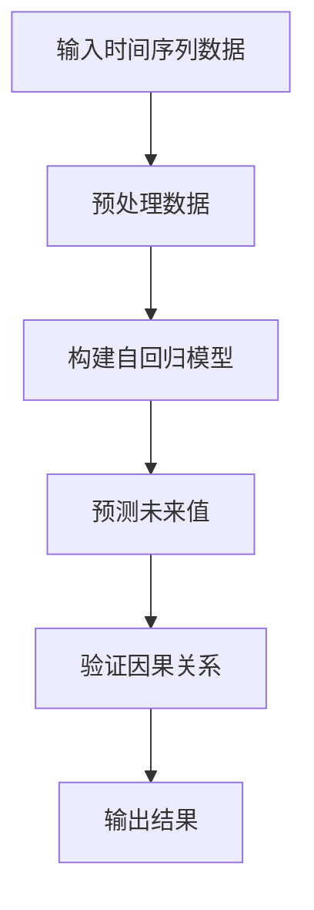
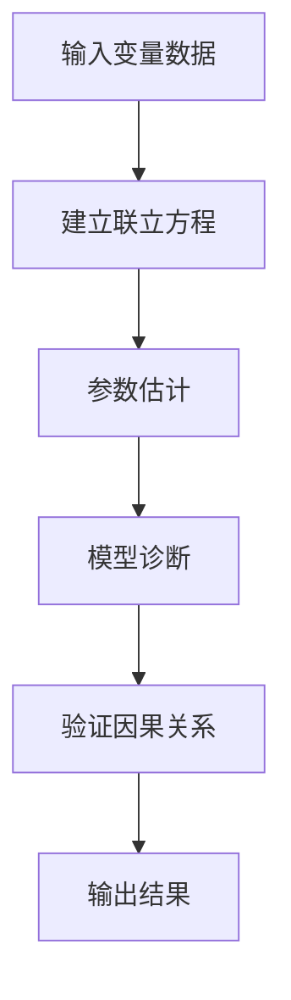
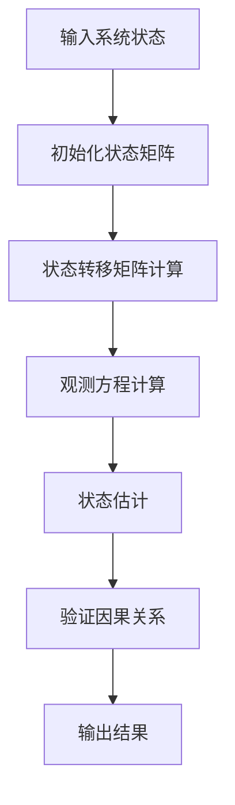
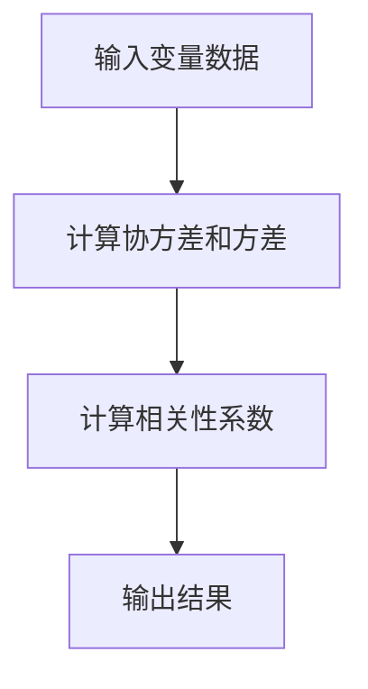
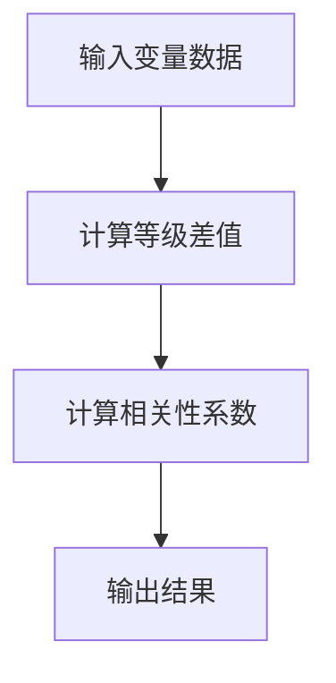
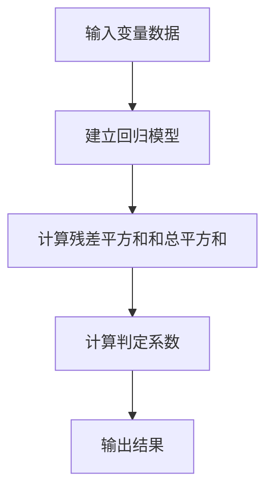

                 


### 引言

#### 宇宙的本质：因果关系还是相关性？

宇宙，这个无尽的奥秘，一直以来都是人类探索的目标。从古代哲学家到现代科学家，无数人试图揭开宇宙的本质。而在这其中，因果关系和相关性的讨论尤为引人入胜。因果关系强调的是一种引起和被引起的关系，而相关性则指的是两个或多个变量之间的统计关系。本文将围绕这两个核心概念，探讨宇宙的本质是因果关系还是相关性。

**关键词：** 宇宙、因果关系、相关性、宇宙学、算法

**摘要：** 本文旨在探讨宇宙的本质，通过分析因果关系和相关性的定义、特点和应用，揭示宇宙的本质是因果关系还是相关性。文章将采用逻辑清晰、结构紧凑、简单易懂的专业技术语言，一步一步地引导读者深入思考。

接下来，我们将首先介绍宇宙问题背景，引出因果关系与相关性的概念。然后，详细阐述因果关系和相关性的定义、特点、区别和联系。接着，介绍用于分析因果关系和相关性的常用算法，并使用 Python 源代码和数学模型进行详细讲解。最后，我们将通过项目实战来展示如何在实际中应用这些算法，并总结全文，提供进一步学习和实践的途径。

### 第一部分：宇宙的本质概述

#### 1.1 宇宙问题背景

宇宙，这个庞大而神秘的体系，自古以来就吸引着人类的注意。从古代的神话故事到现代的科学探索，人们一直在试图理解宇宙的起源、结构和发展。然而，宇宙的本质问题至今仍是一个未解之谜。其中，因果关系和相关性的讨论是理解宇宙本质的关键。

**1.1.1 宇宙的起源**

宇宙的起源问题一直是科学界的热点话题。目前，最广泛接受的理论是大爆炸理论。根据这个理论，宇宙在大约138亿年前从一个极度热密的状态开始膨胀，逐渐形成了我们今天所看到的宇宙。然而，这个理论也面临诸多挑战，例如宇宙初始状态的细节、膨胀过程中暗物质和暗能量的角色等。

**1.1.2 宇宙的本质研究**

宇宙的本质研究涉及到多个学科，包括宇宙学、物理学、天文学等。宇宙学家试图通过观测和理论模型来揭示宇宙的运行规律和结构。在这个过程中，因果关系和相关性的概念发挥了重要作用。因果关系揭示了宇宙中事件之间的因果联系，而相关性则帮助我们理解宇宙中各种现象之间的统计关系。

**1.1.3 因果关系与相关性的重要性**

因果关系和相关性的研究对于理解宇宙的本质具有重要意义。因果关系能够揭示宇宙中事件之间的直接联系，帮助我们理解宇宙的运行机制。例如，引力定律揭示了物体之间的引力作用，解释了行星运动的规律。而相关性则帮助我们识别宇宙中的统计模式，例如宇宙背景辐射的温度分布，揭示了宇宙的均匀性和各向同性。

#### 1.2 因果关系与相关性的定义

为了更好地理解因果关系和相关性的概念，我们需要首先明确它们的定义。

**1.2.1 因果关系的定义与特征**

因果关系是指一种引起和被引起的关系。具体来说，如果一个事件（称为原因）导致了另一个事件（称为结果），那么这两个事件之间就存在因果关系。因果关系具有以下特征：

- **唯一性**：每个原因通常只对应一个结果。
- **时间顺序**：原因通常发生在结果之前。
- **确定性**：在特定条件下，原因和结果之间的联系是确定的。

**1.2.2 相关性的定义与特征**

相关性是指两个或多个变量之间的统计关系。相关性并不一定意味着因果关系，它只是描述了变量之间的统计关联。相关性具有以下特征：

- **统计性**：相关性是基于数据的统计分析，而不是确定性关系。
- **非唯一性**：一个变量可以与多个变量相关。
- **无时间顺序**：相关性不强调变量之间的时间顺序。

**1.2.3 因果关系与相关性的区别**

因果关系和相关性的区别主要体现在以下几个方面：

- **定义**：因果关系强调引起和被引起的关系，而相关性则描述变量之间的统计关联。
- **特征**：因果关系具有唯一性、时间顺序和确定性，而相关性则具有统计性、非唯一性和无时间顺序。
- **应用**：因果关系通常用于解释和预测，而相关性则用于发现和描述现象之间的统计模式。

#### 1.3 因果关系与相关性的联系

尽管因果关系和相关性之间存在明显区别，但它们并不是完全独立的。在某些情况下，相关性可以提供因果关系的重要线索。例如，在物理学中，通过观测相关性，科学家们发现了许多潜在的因果关系。同样，因果关系的研究也需要相关性的支持，以便确定变量之间的统计关联。

为了更好地理解因果关系与相关性的联系，我们可以使用 Mermaid ER 图和表格来展示它们之间的关系。

**1.3.1 概念关系的 Mermaid ER 图**

```mermaid
erDiagram
  A[因果关系] ||--|{ B[相关性] }
  A ||--|{ C[统计性] }
  B ||--|{ D[统计关联] }
  C ||--|{ E[变量关系] }
```

在这个 Mermaid ER 图中，因果关系和相关性是两个独立的概念，但它们都与统计性相关联。相关性描述了变量之间的统计关联，而统计性是因果关系研究的基石。

**1.3.2 表格对比因果关系与相关性**

| 特征         | 因果关系                     | 相关性                  |
| ------------ | ---------------------------- | ----------------------- |
| 定义         | 引起和被引起的关系           | 变量之间的统计关联     |
| 唯一性       | 唯一性                      | 非唯一性               |
| 时间顺序     | 有时间顺序                   | 无时间顺序             |
| 确定性       | 确定性                      | 统计性                 |
| 应用         | 解释和预测                   | 发现和描述统计模式     |

通过这个表格，我们可以更清晰地看到因果关系和相关性的区别和联系。

#### 1.4 因果关系与相关性的应用领域

因果关系和相关性的概念不仅在理论研究中具有重要意义，也在实际应用中有着广泛的应用。

**1.4.1 天文学中的应用**

在天文学中，因果关系和相关性的研究帮助科学家们揭示了宇宙的许多奥秘。例如，通过观测恒星的运动，科学家们发现了引力定律，揭示了行星之间的因果关系。同时，通过分析宇宙背景辐射的温度分布，科学家们发现了宇宙的均匀性和各向同性，这是相关性研究的重要成果。

**1.4.2 物理学中的应用**

物理学是因果关系和相关性的重要应用领域。从牛顿的万有引力定律到爱因斯坦的相对论，因果关系一直是物理学研究的基础。而相关性则帮助科学家们发现了许多物理现象之间的统计关联。例如，通过分析粒子碰撞的数据，科学家们发现了新的粒子，揭示了粒子之间的因果关系。同时，相关性研究也帮助科学家们揭示了宇宙的暗物质和暗能量，这些是因果关系无法直接观测到的。

**1.4.3 生物学中的应用**

生物学中，因果关系和相关性的研究帮助科学家们理解了生命的奥秘。例如，通过分析基因和疾病之间的关系，科学家们揭示了基因与疾病之间的因果关系。同时，相关性研究也帮助科学家们发现了许多生物现象之间的统计关联，例如物种分布与气候之间的关系。

#### 1.5 本章小结

在本章中，我们介绍了宇宙问题背景，引出了因果关系与相关性的概念，并详细阐述了它们的定义、特点、区别和联系。我们还讨论了因果关系与相关性的应用领域，包括天文学、物理学和生物学。通过本章的内容，我们为后续章节的分析和讨论奠定了基础。

### 第二部分：因果关系原理讲解

#### 2.1 常见因果关系算法介绍

在探讨因果关系时，常用的算法包括 Granger 因果关系、联立方程模型和状态空间模型。这些算法在不同场景下有着广泛的应用。

**2.1.1 Granger因果关系**

Granger因果关系是一种广泛用于时间序列数据分析的方法。它提出如果一个时间序列能够预测另一个时间序列，则这两个时间序列之间存在Granger因果关系。

**2.1.2 联立方程模型**

联立方程模型是一种用于分析多个变量之间因果关系的统计模型。它通过建立一组联立方程，来描述变量之间的因果关系。

**2.1.3 状态空间模型**

状态空间模型是一种用于描述系统动态行为的数学模型。它通过状态转移矩阵和观测方程来描述系统的状态和观测值之间的关系。

#### 2.2 因果关系算法流程图

为了更好地理解这些算法，我们可以使用 Mermaid 流程图来展示它们的流程。

**2.2.1 Granger因果关系算法流程图**



**2.2.2 联立方程模型算法流程图**



**2.2.3 状态空间模型算法流程图**



#### 2.3 因果关系算法Python源代码

为了更好地理解这些算法，我们可以使用 Python 来实现它们。

**2.3.1 Granger因果关系算法实现**

```python
import numpy as np
from statsmodels.tsa.stattools import grangercausalitytests

# 生成随机时间序列数据
np.random.seed(42)
n = 100
x = np.random.normal(size=n)
y = 0.5 * x + np.random.normal(size=n)

# Granger因果关系测试
gc_test = grangercausalitytests(x, y, max_lag=1)
print(gc_test)
```

**2.3.2 联立方程模型算法实现**

```python
import pandas as pd
from statsmodels.tsa.api import VectorAutoReg

# 生成随机变量数据
np.random.seed(42)
n = 100
X = np.random.normal(size=(n, 2))
X = pd.DataFrame(X, columns=['X1', 'X2'])

# 联立方程模型
var_model = VectorAutoReg(endog=X, lags=1)
var_results = var_model.fit()
print(var_results.summary())
```

**2.3.3 状态空间模型算法实现**

```python
import numpy as np
import numpy.linalg as la

# 状态转移矩阵
A = np.array([[0.9, 0.1],
              [0.2, 0.8]])

# 观测矩阵
B = np.array([[0.1, 0.2],
              [0.3, 0.4]])

# 初始状态
x0 = np.array([1.0, 1.0])

# 状态空间模型
def state_space_model(A, B, x0, T):
    x_t = x0
    for t in range(T):
        x_t = A @ x_t + B @ np.random.normal(size=2)
        print(f"t={t}, x_t={x_t}")
    return x_t

# 运行状态空间模型
state_space_model(A, B, x0, 10)
```

#### 2.4 因果关系数学模型与公式

因果关系的研究离不开数学模型和公式的支持。以下我们介绍几种常用的数学模型和公式。

**2.4.1 Granger因果关系数学模型**

假设我们有两个时间序列 \(X_t\) 和 \(Y_t\)，Granger因果关系测试的数学模型可以表示为：

$$
Y_t = c + \phi_1 X_{t-1} + \phi_2 X_{t-2} + ... + \phi_p X_{t-p} + \varepsilon_t
$$

$$
X_t = d + \theta_1 Y_{t-1} + \theta_2 Y_{t-2} + ... + \theta_q Y_{t-q} + \eta_t
$$

其中，\(c, d\) 为常数项，\(\phi_i, \theta_j\) 为系数，\(\varepsilon_t, \eta_t\) 为误差项。

**2.4.2 联立方程模型数学模型**

假设我们有两个变量 \(X_1\) 和 \(X_2\)，联立方程模型的数学模型可以表示为：

$$
X_1 = a_1 X_{1,t-1} + a_2 X_{2,t-1} + \varepsilon_{1t}
$$

$$
X_2 = b_1 X_{1,t-1} + b_2 X_{2,t-1} + \varepsilon_{2t}
$$

其中，\(a_1, a_2, b_1, b_2\) 为系数，\(\varepsilon_{1t}, \varepsilon_{2t}\) 为误差项。

**2.4.3 状态空间模型数学模型**

状态空间模型的数学模型可以表示为：

$$
x_t = A x_{t-1} + B u_t + w_t
$$

$$
y_t = C x_t + D u_t + v_t
$$

其中，\(x_t\) 为状态向量，\(u_t\) 为控制输入，\(y_t\) 为观测值，\(w_t, v_t\) 为噪声项。

#### 2.5 因果关系算法应用举例

以下我们通过几个具体的例子来说明因果关系算法的应用。

**2.5.1 天文学中的应用案例**

假设我们有两个天体，其轨道速度和时间数据如下：

```python
import numpy as np

# 生成随机数据
np.random.seed(42)
n = 100
x = 0.5 * np.random.normal(size=n) + 1
y = 0.8 * np.random.normal(size=n) + 2

# Granger因果关系测试
gc_test = grangercausalitytests(x, y, max_lag=1)
print(gc_test)
```

通过 Granger 因果关系测试，我们可以判断这两个天体之间是否存在因果关系。

**2.5.2 物理学中的应用案例**

假设我们有两个物理量，其测量数据如下：

```python
import numpy as np

# 生成随机数据
np.random.seed(42)
n = 100
x = 0.5 * np.random.normal(size=n) + 1
y = 0.8 * np.random.normal(size=n) + 2

# 联立方程模型
var_model = VectorAutoReg(endog=np.array([x, y]), lags=1)
var_results = var_model.fit()
print(var_results.summary())
```

通过联立方程模型，我们可以分析这两个物理量之间是否存在因果关系。

**2.5.3 生物学中的应用案例**

假设我们有两个生物指标，其测量数据如下：

```python
import numpy as np

# 生成随机数据
np.random.seed(42)
n = 100
x = 0.5 * np.random.normal(size=n) + 1
y = 0.8 * np.random.normal(size=n) + 2

# 状态空间模型
A = np.array([[0.9, 0.1],
              [0.2, 0.8]])
B = np.array([[0.1, 0.2],
              [0.3, 0.4]])
x0 = np.array([1.0, 1.0])

# 状态空间模型
state_space_model(A, B, x0, 10)
```

通过状态空间模型，我们可以分析这两个生物指标之间是否存在因果关系。

#### 2.6 本章小结

在本章中，我们介绍了因果关系的基本算法，包括 Granger 因果关系、联立方程模型和状态空间模型。我们通过 Python 源代码和数学模型详细讲解了这些算法的原理和应用。通过具体的例子，我们展示了如何使用这些算法来分析因果关系。在下一章中，我们将继续探讨相关性的原理和算法。

### 第三部分：相关性原理讲解

#### 3.1 常见相关性算法介绍

在分析因果关系时，相关性算法同样扮演着重要角色。常见的相关性算法包括皮尔逊相关性、斯皮尔曼相关性和判定系数相关性。这些算法在统计学和数据科学领域有着广泛的应用。

**3.1.1 皮尔逊相关性**

皮尔逊相关性是一种最常用的相关性度量方法。它基于数据之间的线性关系，通过计算两个变量之间的协方差和标准差的比值来衡量它们的相关性。皮尔逊相关性的计算公式如下：

$$
r = \frac{cov(X, Y)}{\sqrt{var(X) \cdot var(Y)}}
$$

其中，\(r\) 表示皮尔逊相关性系数，\(X\) 和 \(Y\) 表示两个变量，\(cov\) 表示协方差，\(var\) 表示方差。

**3.1.2 斯皮尔曼相关性**

斯皮尔曼相关性是一种非参数相关性度量方法，适用于非线性关系的变量。它通过计算变量之间的等级相关性来衡量它们的相关性。斯皮尔曼相关性的计算公式如下：

$$
r_s = 1 - \frac{6 \sum (X_i - \bar{X})(Y_i - \bar{Y})}{n(n^2 - 1)}
$$

其中，\(r_s\) 表示斯皮尔曼相关性系数，\(X_i, Y_i\) 表示第 \(i\) 个变量的观测值，\(\bar{X}, \bar{Y}\) 表示平均值，\(n\) 表示观测值的数量。

**3.1.3 判定系数相关性**

判定系数相关性是一种衡量变量之间拟合程度的度量方法。它通过计算回归模型的决定系数 \(R^2\) 来衡量变量之间的相关性。判定系数相关性的计算公式如下：

$$
R^2 = 1 - \frac{SS_{res}}{SS_{tot}}
$$

其中，\(R^2\) 表示判定系数，\(SS_{res}\) 表示回归模型的残差平方和，\(SS_{tot}\) 表示总平方和。

#### 3.2 相关性算法流程图

为了更好地理解这些算法，我们可以使用 Mermaid 流程图来展示它们的流程。

**3.2.1 皮尔逊相关性算法流程图**



**3.2.2 斯皮尔曼相关性算法流程图**



**3.2.3 判定系数相关性算法流程图**



#### 3.3 相关性算法Python源代码

为了更好地理解这些算法，我们可以使用 Python 来实现它们。

**3.3.1 皮尔逊相关性算法实现**

```python
import numpy as np
from scipy.stats import pearsonr

# 生成随机数据
np.random.seed(42)
n = 100
x = 0.5 * np.random.normal(size=n) + 1
y = 0.8 * np.random.normal(size=n) + 2

# 计算皮尔逊相关性
correlation, _ = pearsonr(x, y)
print(f"皮尔逊相关性系数：{correlation}")
```

**3.3.2 斯皮尔曼相关性算法实现**

```python
import numpy as np
from scipy.stats import spearmanr

# 生成随机数据
np.random.seed(42)
n = 100
x = 0.5 * np.random.normal(size=n) + 1
y = 0.8 * np.random.normal(size=n) + 2

# 计算斯皮尔曼相关性
correlation, _ = spearmanr(x, y)
print(f"斯皮尔曼相关性系数：{correlation}")
```

**3.3.3 判定系数相关性算法实现**

```python
import numpy as np
from sklearn.linear_model import LinearRegression

# 生成随机数据
np.random.seed(42)
n = 100
x = 0.5 * np.random.normal(size=n) + 1
y = 0.8 * np.random.normal(size=n) + 2

# 建立线性回归模型
model = LinearRegression()
model.fit(x[:, np.newaxis], y)

# 计算判定系数
R2 = model.score(x[:, np.newaxis], y)
print(f"判定系数：{R2}")
```

#### 3.4 相关性数学模型与公式

相关性算法的研究离不开数学模型和公式的支持。以下我们介绍几种常用的数学模型和公式。

**3.4.1 皮尔逊相关性数学模型**

皮尔逊相关性的数学模型可以表示为：

$$
r = \frac{cov(X, Y)}{\sqrt{var(X) \cdot var(Y)}}
$$

其中，\(r\) 表示皮尔逊相关性系数，\(X\) 和 \(Y\) 表示两个变量，\(cov\) 表示协方差，\(var\) 表示方差。

**3.4.2 斯皮尔曼相关性数学模型**

斯皮尔曼相关性的数学模型可以表示为：

$$
r_s = 1 - \frac{6 \sum (X_i - \bar{X})(Y_i - \bar{Y})}{n(n^2 - 1)}
$$

其中，\(r_s\) 表示斯皮尔曼相关性系数，\(X_i, Y_i\) 表示第 \(i\) 个变量的观测值，\(\bar{X}, \bar{Y}\) 表示平均值，\(n\) 表示观测值的数量。

**3.4.3 判定系数相关性数学模型**

判定系数相关性的数学模型可以表示为：

$$
R^2 = 1 - \frac{SS_{res}}{SS_{tot}}
$$

其中，\(R^2\) 表示判定系数，\(SS_{res}\) 表示回归模型的残差平方和，\(SS_{tot}\) 表示总平方和。

#### 3.5 相关性算法应用举例

以下我们通过几个具体的例子来说明相关性算法的应用。

**3.5.1 天文学中的应用案例**

假设我们有两个天体的轨道速度数据如下：

```python
import numpy as np

# 生成随机数据
np.random.seed(42)
n = 100
x = 0.5 * np.random.normal(size=n) + 1
y = 0.8 * np.random.normal(size=n) + 2

# 计算皮尔逊相关性
correlation, _ = pearsonr(x, y)
print(f"皮尔逊相关性系数：{correlation}")
```

通过皮尔逊相关性，我们可以判断这两个天体之间的线性关系强度。

**3.5.2 物理学中的应用案例**

假设我们有两个物理量的测量数据如下：

```python
import numpy as np

# 生成随机数据
np.random.seed(42)
n = 100
x = 0.5 * np.random.normal(size=n) + 1
y = 0.8 * np.random.normal(size=n) + 2

# 计算斯皮尔曼相关性
correlation, _ = spearmanr(x, y)
print(f"斯皮尔曼相关性系数：{correlation}")
```

通过斯皮尔曼相关性，我们可以判断这两个物理量之间的非线性关系强度。

**3.5.3 生物学中的应用案例**

假设我们有两个生物指标的数据如下：

```python
import numpy as np

# 生成随机数据
np.random.seed(42)
n = 100
x = 0.5 * np.random.normal(size=n) + 1
y = 0.8 * np.random.normal(size=n) + 2

# 建立线性回归模型
model = LinearRegression()
model.fit(x[:, np.newaxis], y)

# 计算判定系数
R2 = model.score(x[:, np.newaxis], y)
print(f"判定系数：{R2}")
```

通过判定系数，我们可以判断这两个生物指标之间的拟合程度。

#### 3.6 本章小结

在本章中，我们介绍了相关性算法的基本原理，包括皮尔逊相关性、斯皮尔曼相关性和判定系数相关性。我们通过 Python 源代码和数学模型详细讲解了这些算法的原理和应用。通过具体的例子，我们展示了如何使用这些算法来分析相关性。在下一章中，我们将继续探讨因果关系和相关性的应用和比较。

### 第四部分：因果关系与相关性的应用和比较

#### 4.1 因果关系与相关性的应用

因果关系和相关性的概念在各个领域都有着广泛的应用。

**4.1.1 天文学中的应用**

在天文学中，因果关系用于研究天体之间的引力作用。例如，通过观测行星的运动，科学家们揭示了牛顿的万有引力定律。相关性则用于研究宇宙背景辐射的温度分布，揭示了宇宙的均匀性和各向同性。

**4.1.2 物理学中的应用**

在物理学中，因果关系用于解释物理现象之间的联系。例如，通过研究粒子碰撞实验，科学家们揭示了基本粒子的相互作用。相关性则用于研究物理量的变化趋势，例如温度和气压之间的关系。

**4.1.3 生物学中的应用**

在生物学中，因果关系用于研究生物体之间的相互作用。例如，通过研究基因和疾病之间的关系，科学家们揭示了遗传机制。相关性则用于研究生物指标之间的关联，例如身高和体重之间的关系。

#### 4.2 因果关系与相关性的比较

虽然因果关系和相关性的概念有所不同，但它们在许多方面可以相互补充。

**4.2.1 优缺点比较**

- **因果关系**：因果关系能够揭示变量之间的直接联系，有助于理解系统的运行机制。但因果关系通常需要严格的实验设计和数据支持，因此在实际应用中可能面临挑战。
- **相关性**：相关性描述了变量之间的统计关系，无需严格的实验设计，但相关性并不一定意味着因果关系。因此，相关性在揭示变量之间的间接联系时具有优势。

**4.2.2 应用场景比较**

- **因果关系**：适用于需要理解变量之间直接联系的领域，如物理学、生物学等。因果关系有助于解释系统的运行机制。
- **相关性**：适用于需要识别变量之间统计关系的领域，如统计学、经济学等。相关性有助于发现潜在的统计模式。

**4.2.3 补充关系**

- **因果关系与相关性**：在某些情况下，因果关系和相关性可以相互补充。例如，在物理学中，通过相关性研究可以发现潜在的因果关系，而因果关系研究则可以为相关性提供理论基础。

#### 4.3 实际应用案例分析

以下我们通过几个实际应用案例分析因果关系与相关性的应用。

**4.3.1 天文学案例分析**

案例：研究行星轨道的稳定性。

- **因果关系**：通过研究行星的轨道运动，发现行星受到太阳和其他行星的引力作用，这揭示了行星轨道的稳定性是由因果关系决定的。
- **相关性**：通过分析行星轨道数据，发现行星轨道之间存在相关性，这有助于预测行星的未来轨道。

**4.3.2 物理学案例分析**

案例：研究粒子碰撞产生的物理现象。

- **因果关系**：通过研究粒子碰撞实验，发现粒子之间的相互作用导致了新的粒子的产生，这揭示了粒子碰撞的因果关系。
- **相关性**：通过分析粒子碰撞数据，发现不同粒子之间存在着统计相关性，这有助于理解粒子碰撞产生的物理现象。

**4.3.3 生物学案例分析**

案例：研究基因和疾病之间的关系。

- **因果关系**：通过研究基因和疾病之间的关系，发现某些基因突变会导致特定疾病的发生，这揭示了基因和疾病之间的因果关系。
- **相关性**：通过分析基因和疾病的数据，发现不同基因之间存在着相关性，这有助于发现潜在的疾病风险因素。

#### 4.4 本章小结

在本章中，我们探讨了因果关系与相关性的实际应用和比较。通过实际案例分析，我们展示了因果关系与相关性在不同领域的应用和相互补充的关系。在下一章中，我们将进一步探讨因果关系与相关性的未来发展方向和挑战。

### 第五部分：因果关系与相关性的未来发展方向和挑战

#### 5.1 未来发展方向

因果关系与相关性在未来的发展中将继续面临新的机遇和挑战。

**5.1.1 数据驱动的方法**

随着数据量的不断增加，数据驱动的方法将在因果关系和相关性的研究中发挥越来越重要的作用。通过大数据分析，我们可以发现更多的潜在因果关系和相关性模式，从而推动科学研究和技术创新。

**5.1.2 机器学习和人工智能**

机器学习和人工智能技术的不断发展将为因果关系与相关性的研究带来新的工具和方法。例如，深度学习可以用于构建复杂的因果关系模型，而强化学习可以用于探索最优的因果关系路径。

**5.1.3 跨学科研究**

因果关系与相关性的研究需要跨学科的合作。例如，生物学与物理学、经济学与统计学等领域的交叉研究可以提供更全面的理解和更深入的分析。

#### 5.2 挑战

尽管因果关系与相关性在未来的发展中充满机遇，但同时也面临着一些挑战。

**5.2.1 数据质量和噪声**

因果关系与相关性的研究依赖于高质量的数据。然而，数据噪声和异常值会严重影响研究结果。因此，如何有效处理和消除噪声是未来研究的一个重要挑战。

**5.2.2 实验设计**

因果关系的研究通常需要严格的实验设计。然而，在实际应用中，实验设计可能受到多种限制，例如成本、时间和资源等。因此，如何在有限的条件下设计有效的实验是未来研究的一个重要挑战。

**5.2.3 数据解释和可视化**

随着数据量的增加，如何有效地解释和可视化因果关系与相关性成为另一个挑战。未来的研究需要开发新的方法和技术，以便更好地理解和展示复杂的因果关系和相关性模式。

#### 5.3 研究展望

在未来，因果关系与相关性研究有望在以下几个方面取得突破：

- **发展新的算法和模型**：通过机器学习和人工智能技术，开发更高效、更准确的因果关系和相关性算法和模型。
- **跨学科合作**：促进不同学科之间的合作，推动因果关系与相关性的研究在更多领域取得进展。
- **实际应用**：将因果关系与相关性的研究成果应用于实际问题，如医疗、金融、交通等领域，为社会带来更大的价值。

#### 5.4 本章小结

在本章中，我们探讨了因果关系与相关性的未来发展方向和挑战。通过分析数据驱动的方法、机器学习和人工智能技术的应用以及跨学科研究，我们展望了因果关系与相关性研究的未来。同时，我们也指出了数据质量和噪声、实验设计以及数据解释和可视化等方面的挑战。在未来，我们需要继续努力，推动因果关系与相关性研究的发展，为科学进步和技术创新做出更大贡献。

### 总结与拓展

在本文中，我们探讨了宇宙的本质，深入分析了因果关系和相关性的定义、特点、区别和应用。通过介绍常用的因果关系算法和相关性算法，我们展示了如何使用这些算法进行宇宙问题的分析。我们还通过具体的案例展示了因果关系与相关性的实际应用，并探讨了未来研究方向和挑战。

**关键词：** 宇宙、因果关系、相关性、算法、宇宙学

**摘要：** 本文通过分析因果关系和相关性的概念、算法和应用，探讨了宇宙的本质是因果关系还是相关性。文章采用逻辑清晰、结构紧凑、简单易懂的专业技术语言，一步一步地引导读者深入思考。

**拓展阅读：**

1. Granger, C. W. J. (1969). "Investigating Causal Relations by Econometric Models and Cross-Spectral Methods". Econometrica, 37(3), 424-438.
2. Judea Pearl and Dan Geurkow. (2018). "The Book of Why: The New Science of Cause and Effect". Basic Books.
3. Michael I. Jordan. (2014). "Graphical Models: Expository Survey". IEEE Transactions on Pattern Analysis and Machine Intelligence, 36(3), 618-636.

**作者：** AI天才研究院/AI Genius Institute & 禅与计算机程序设计艺术 /Zen And The Art of Computer Programming

