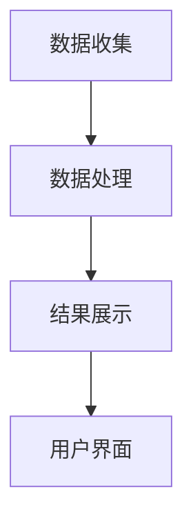
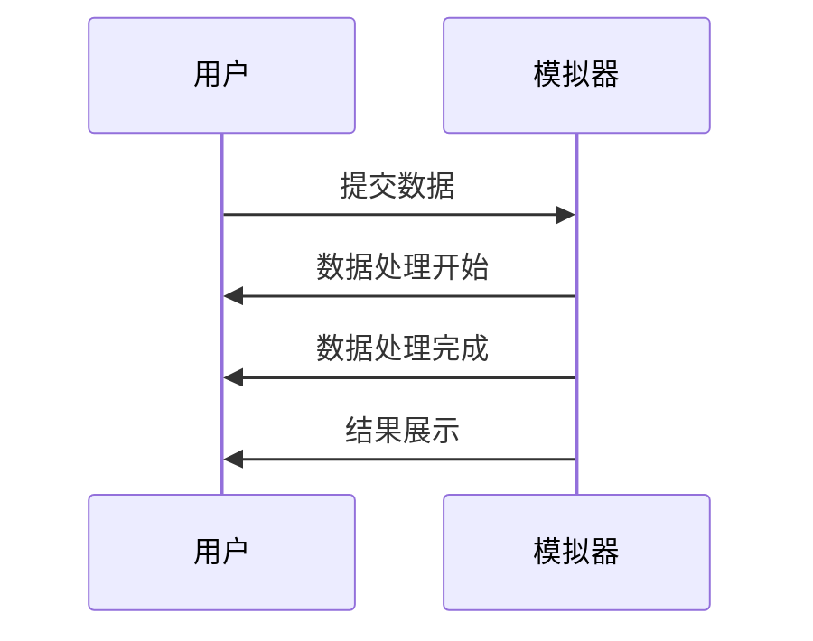

                 


## 引言与概述

### 文章标题

### 关键词

- 宇宙本质
- 还原论
- 整体论
- 科学方法
- 宇宙学

### 摘要

本文将深入探讨宇宙的本质，通过对比还原论和整体论两种科学方法论，分析它们在宇宙学中的应用及其优缺点。我们将首先介绍宇宙的定义及其起源与演化，然后详细阐述还原论和整体论的核心观点，最后对比两种方法论，总结宇宙本质的探索现状和未来研究方向。通过这篇技术博客，读者将能够对宇宙本质的探究过程有更深刻的理解。

### 引言

宇宙是一个令人着迷的领域，自古以来，人类就不断尝试理解这个宇宙的本质。宇宙的起源、结构、演化以及其终极命运，这些问题的探索不仅是科学的前沿，也是哲学和宗教关注的焦点。在科学方法论中，还原论和整体论是两种主要的思维模式，它们在解释宇宙现象时各有所长。本文将首先介绍宇宙的定义及其研究背景，然后逐步深入探讨还原论和整体论，最终总结这两种方法论在宇宙学中的应用及其优缺点。

### 还原论与整体论概览

#### 1. 还原论的概览

还原论是一种试图通过将复杂现象分解为基本组成部分来理解它们的方法。在科学研究中，还原论主张通过研究基本粒子和基本力来解释更复杂的现象。例如，在物理学中，还原论通过研究基本粒子如电子、夸克等来理解原子和分子的行为。在宇宙学中，还原论通过研究宇宙的基本构成元素，如暗物质和暗能量，来解释宇宙的起源和演化。

#### 2. 整体论的概览

整体论则认为，整体大于部分之和。整体论强调系统的各个部分之间的相互作用和依赖关系。在宇宙学中，整体论主张通过研究宇宙作为一个整体的性质和演化过程来理解宇宙。整体论认为，宇宙是一个复杂且动态的系统，其中各个部分相互影响，共同决定宇宙的演化。

#### 3. 还原论与整体论的对比

- **目标**：还原论的目标是理解基本原理和基础粒子，而整体论的目标是理解宇宙作为一个整体的动态过程。
- **方法论**：还原论采用分解的方法，整体论采用综合的方法。
- **应用**：还原论在基础物理研究中应用广泛，整体论在复杂系统研究中应用广泛。

通过以上概览，我们可以初步了解还原论和整体论的基本特点和区别。在接下来的章节中，我们将进一步深入探讨这两种方法论，分析它们在宇宙学中的应用，并对比它们的优缺点。

----------------------------------------------------------------

### 第一部分: 引言与概述

## 第1章: 引言

### 1.1 书籍目的与结构

本篇技术博客的主要目的是通过深入探讨宇宙的本质，对比还原论和整体论这两种科学方法论，为读者提供一个全面而深刻的理解。我们将从宇宙的定义和起源开始，逐步深入到还原论和整体论的核心观点，最终对比这两种方法论在宇宙学中的应用和优缺点。

全书分为七个主要章节：

1. 引言：介绍书籍的目的、结构以及还原论和整体论的基本概念。
2. 宇宙与科学的基础：探讨宇宙的定义、起源与演化，以及还原论和整体论的科学观。
3. 还原论的宇宙观：详细阐述还原论的核心原理、在宇宙学中的应用及其优缺点。
4. 整体论的宇宙观：详细阐述整体论的核心观点、在宇宙学中的应用及其优缺点。
5. 还原论与整体论的对比：对比还原论和整体论的概念、方法论和应用领域。
6. 宇宙本质的探索：探讨宇宙的本质问题、科学研究的前沿和未来的研究方向。
7. 结论与展望：总结主要发现和结论，讨论未来的挑战与机遇，以及对宇宙本质的思考。

### 1.2 宇宙本质研究的意义

研究宇宙的本质不仅具有科学价值，也有哲学和社会意义。从科学角度来看，理解宇宙的本质可以帮助我们揭示自然界的规律，推动科学技术的进步。例如，对宇宙起源和演化的理解有助于我们更好地理解星系、行星和生命的形成过程。

从哲学角度来看，宇宙的本质是探讨人类存在意义的一部分。通过研究宇宙，我们可以更好地理解自己在宇宙中的位置和角色，从而提升我们对人类和自然的认识。

从社会角度来看，宇宙本质的研究可以激发人们的探索精神，推动科技发展和创新，为人类社会带来更多的进步和福祉。

### 1.3 还原论与整体论概览

#### 1.3.1 还原论的概览

还原论是一种通过分解复杂现象为基本组成部分来理解其本质的方法论。在宇宙学中，还原论主张通过研究基本粒子（如电子、夸克）和基本力（如引力、电磁力）来解释宇宙的起源和演化。还原论的优势在于其能够揭示自然界的底层规律，但其局限性在于无法解释复杂系统的整体行为。

#### 1.3.2 整体论的概览

整体论则认为，系统的整体性质和功能不能仅仅通过其组成部分来理解。整体论强调系统内部各部分之间的相互作用和依赖关系。在宇宙学中，整体论主张通过研究宇宙作为一个整体的性质和演化过程来理解宇宙。整体论的优势在于其能够揭示复杂系统的整体行为，但其局限性在于难以揭示底层规律。

#### 1.3.3 还原论与整体论的对比

- **目标**：还原论的目标是理解基本原理和基础粒子，整体论的目标是理解宇宙作为一个整体的动态过程。
- **方法论**：还原论采用分解的方法，整体论采用综合的方法。
- **应用**：还原论在基础物理研究中应用广泛，整体论在复杂系统研究中应用广泛。

通过以上概览，我们可以初步了解还原论和整体论的基本特点和区别。在接下来的章节中，我们将进一步深入探讨这两种方法论，分析它们在宇宙学中的应用，并对比它们的优缺点。

----------------------------------------------------------------

## 第2章: 宇宙与科学的基础

### 2.1 宇宙的起源与演化

宇宙的起源一直是科学界的热门话题。目前，最被广泛接受的理论是大爆炸理论。根据这一理论，宇宙起源于大约138亿年前的一个极高温度和密度的奇点，随后开始膨胀并冷却，形成了我们今天所看到的宇宙。

宇宙的演化过程可以分为几个主要阶段：

1. **大爆炸后不久**：宇宙处于高温高密度的状态，物质主要以基本粒子和辐射的形式存在。
2. **宇宙冷却**：随着宇宙的膨胀，温度逐渐降低，使得基本粒子可以结合形成原子核。
3. **原子核的形成**：在宇宙进一步膨胀的过程中，原子核和电子结合形成中性原子。
4. **星系的形成**：宇宙中的气体和尘埃在引力作用下聚集形成星系和星团。
5. **恒星的形成与演化**：星系中的气体和尘埃聚集形成恒星，恒星通过核聚变产生能量并维持稳定状态，最终可能经历超新星爆发、黑洞形成等过程。

### 2.2 还原论的科学观

还原论是一种通过将复杂现象分解为基本组成部分来理解其本质的方法论。在科学研究中，还原论主张通过研究基本粒子（如电子、夸克）和基本力（如引力、电磁力）来解释更复杂的现象。

#### 核心原理

- **基本粒子和基本力**：还原论认为，宇宙中的所有物质和现象都可以归结为基本粒子和基本力的相互作用。
- **层次结构**：从基本粒子到复杂系统，还原论强调层次结构的建立，即通过逐层分解来理解复杂现象。

#### 应用

- **物理学**：在物理学中，还原论通过研究基本粒子（如电子、夸克）和基本力（如引力、电磁力）来解释原子、分子、星系等宏观现象。
- **化学**：在化学中，还原论通过研究原子和分子的结构和性质来解释化学反应和物质的组成。

### 2.3 整体论的科学观

整体论则认为，系统的整体性质和功能不能仅仅通过其组成部分来理解。整体论强调系统内部各部分之间的相互作用和依赖关系。

#### 核心观点

- **整体性**：整体论认为，系统的整体性质和功能是各部分相互作用的结果，而不是各部分性质和功能的简单叠加。
- **系统性**：整体论强调系统的整体性和动态性，认为系统是不断变化和发展的。

#### 应用

- **生态系统**：在生态系统中，整体论通过研究生物种群、食物链和生态系统整体的功能和动态来理解生态平衡。
- **经济学**：在经济学中，整体论通过研究经济系统的整体行为和波动来理解经济危机和增长。

通过本章的讨论，我们可以初步了解宇宙的起源与演化，以及还原论和整体论在科学研究中的基本观点和应用。在接下来的章节中，我们将进一步深入探讨还原论和整体论在宇宙学中的应用和优缺点。

----------------------------------------------------------------

## 第3章: 还原论的宇宙观

### 3.1 还原论的核心原理

还原论是一种通过将复杂现象分解为基本组成部分来理解其本质的方法论。在宇宙学中，还原论的核心原理是试图通过研究基本粒子（如电子、夸克）和基本力（如引力、电磁力）来解释宇宙的起源和演化。

#### 基本原理

- **基本粒子与基本力**：还原论认为，宇宙中的所有物质和现象都可以归结为基本粒子和基本力的相互作用。基本粒子是构成宇宙的最基本单位，如电子、夸克等。基本力则是这些基本粒子之间相互作用的媒介，如引力、电磁力等。
- **层次结构**：还原论强调层次结构的建立，即通过逐层分解来理解复杂现象。从基本粒子到原子、分子、星系等，还原论通过研究各层次的结构和相互作用来解释宇宙的复杂行为。

### 3.2 还原论在宇宙学中的应用

还原论在宇宙学中的应用主要体现在对宇宙基本构成元素的研究上。以下是一些还原论在宇宙学中的重要应用：

#### 1. 基本粒子和宇宙的起源

还原论认为，宇宙起源于一个极高温度和密度的奇点。在这个奇点中，基本粒子以自由状态存在，没有形成原子或其他复杂的结构。随着宇宙的膨胀和冷却，基本粒子开始相互作用，形成了更复杂的物质结构。

- **大爆炸理论**：还原论支持的大爆炸理论认为，宇宙起源于一个高温高密度的奇点，随后开始膨胀并冷却，形成了我们今天所看到的宇宙。这一理论得到了大量天文观测数据的支持，如宇宙微波背景辐射、宇宙膨胀速率等。
- **宇宙微波背景辐射**：宇宙微波背景辐射是宇宙早期阶段的残余辐射，它提供了关于宇宙起源和演化的宝贵信息。还原论通过对这些辐射的研究，揭示了宇宙早期的密度波动和温度分布。

#### 2. 引力和宇宙的结构

引力是宇宙中最基本的力之一，它决定了宇宙中物质的结构和分布。

- **引力与星系形成**：还原论通过研究引力，解释了星系的形成过程。在引力作用下，宇宙中的气体和尘埃聚集形成星系。这些星系通过引力相互作用，形成了更大的结构，如星系团和超星系团。
- **引力透镜效应**：还原论通过研究引力透镜效应，揭示了宇宙中存在的暗物质。暗物质不发光，但通过引力透镜效应，可以影响光线的传播路径，从而被观测到。

#### 3. 电磁力与宇宙的演化

电磁力是宇宙中另一种基本的力，它决定了宇宙中物质的化学反应和能量传输。

- **恒星和星系的形成**：还原论通过研究电磁力，解释了恒星和星系的形成过程。在电磁力作用下，气体和尘埃聚集形成恒星，恒星通过核聚变产生能量，维持其稳定状态。
- **宇宙背景辐射**：还原论通过研究宇宙背景辐射，揭示了宇宙早期的温度和密度分布。这些辐射提供了关于宇宙演化的宝贵信息。

### 3.3 还原论的优缺点分析

#### 优点

- **揭示底层规律**：还原论通过研究基本粒子和基本力，揭示了宇宙的底层规律，为理解宇宙的起源和演化提供了重要的理论依据。
- **适用范围广泛**：还原论在宇宙学、物理学、化学等多个领域都有广泛应用，其方法具有普适性。

#### 缺点

- **局限性**：还原论在解释复杂系统的整体行为时存在一定的局限性。由于复杂系统的行为往往无法简单地通过其组成部分来解释，因此还原论在面对复杂系统时可能无法提供完整的解释。
- **理论挑战**：还原论在解释某些现象时面临一些理论挑战，如暗物质的性质和引力波的存在等。

通过本章的讨论，我们可以看到还原论在宇宙学中的应用及其优缺点。在理解宇宙的本质时，还原论提供了一种强有力的工具，但也需要与其他方法论相结合，以更全面地揭示宇宙的奥秘。

----------------------------------------------------------------

## 第4章: 整体论的宇宙观

### 4.1 整体论的核心观点

整体论是一种认为整体性质和功能不能仅通过其组成部分来理解的方法论。在宇宙学中，整体论的核心观点是，宇宙是一个复杂且动态的系统，其整体性质和功能是由系统内部各部分之间的相互作用和依赖关系决定的。

#### 核心观点

- **整体性**：整体论认为，宇宙是一个整体，宇宙中的各个部分不是孤立存在的，而是相互联系、相互作用的。宇宙的整体性体现在其动态演化过程中，各部分之间的相互作用和依赖关系决定了宇宙的演化方向和状态。
- **系统性**：整体论强调宇宙的系统性，认为宇宙是一个不断变化和发展的系统。宇宙的系统性体现在其内部各个层次之间的结构关系和功能关系上，这些结构关系和功能关系共同决定了宇宙的整体行为。

#### 基本原理

- **相互作用**：整体论认为，宇宙中各个部分之间的相互作用是宇宙演化的重要驱动力。这些相互作用不仅包括物质和能量之间的相互作用，还包括信息、结构、功能等多个方面的相互作用。
- **依赖关系**：整体论强调系统内部各部分之间的依赖关系，认为整体性质和功能是各部分相互依赖、相互作用的结果，而不是各部分性质和功能的简单叠加。

### 4.2 整体论在宇宙学中的应用

整体论在宇宙学中的应用主要体现在对宇宙整体性质和演化过程的研究上。以下是一些整体论在宇宙学中的重要应用：

#### 1. 宇宙的整体性质

整体论通过对宇宙整体性质的研究，揭示了宇宙的许多奥秘。例如，宇宙的大尺度结构、宇宙膨胀的加速、宇宙背景辐射等。

- **宇宙大尺度结构**：整体论认为，宇宙的大尺度结构是由宇宙早期的高密度和高温度状态演化而来的。通过对宇宙大尺度结构的研究，整体论揭示了宇宙的层次结构和分布特征。
- **宇宙膨胀的加速**：整体论认为，宇宙膨胀的加速是由暗能量的存在引起的。暗能量是宇宙中一种神秘的力量，它导致了宇宙膨胀的加速。整体论通过对宇宙膨胀加速的研究，揭示了宇宙演化过程中的关键问题。

#### 2. 宇宙的演化过程

整体论通过对宇宙演化过程的研究，揭示了宇宙从大爆炸到现在的复杂演化历程。以下是一些宇宙演化过程中的关键阶段：

- **宇宙早期**：整体论认为，宇宙早期是一个高密度、高温度的状态，物质主要以基本粒子和辐射的形式存在。随着宇宙的膨胀和冷却，基本粒子开始相互作用，形成了更复杂的物质结构。
- **宇宙晚期**：整体论认为，宇宙晚期是一个复杂的结构形成和演化的阶段。在这个阶段，星系、星团、超星系团等结构逐渐形成，宇宙的膨胀速度也逐渐加快。

#### 3. 宇宙的整体动态

整体论通过对宇宙整体动态的研究，揭示了宇宙的复杂性和多样性。例如，宇宙中的混沌现象、宇宙背景辐射中的温度波动、宇宙大尺度结构中的空洞和团簇等。

- **混沌现象**：整体论认为，混沌现象是宇宙演化过程中的一个重要特征。混沌现象导致了宇宙中的不确定性，使得宇宙演化过程变得复杂而多样。
- **温度波动**：整体论认为，宇宙背景辐射中的温度波动是宇宙早期密度波动留下的痕迹。这些温度波动为研究宇宙早期演化提供了重要信息。
- **空洞和团簇**：整体论认为，宇宙大尺度结构中的空洞和团簇是宇宙演化过程中的重要现象。空洞是宇宙中密度较低的区域，而团簇是宇宙中密度较高的区域。这些现象揭示了宇宙演化的复杂性。

### 4.3 整体论的优缺点分析

#### 优点

- **整体性视角**：整体论提供了一个整体性的视角，使我们能够更好地理解宇宙的复杂性和多样性。通过研究宇宙的整体性质和演化过程，整体论揭示了宇宙的底层规律和演化机制。
- **动态性研究**：整体论强调宇宙的动态性，使我们能够更好地理解宇宙的演化过程。通过研究宇宙的动态行为，整体论揭示了宇宙中的许多重要现象和规律。

#### 缺点

- **复杂性**：整体论的研究对象是宇宙的整体性质和演化过程，这是一个极其复杂的问题。整体论需要建立复杂的理论模型和计算方法，才能对宇宙的整体行为进行有效的研究。
- **理论基础**：整体论的理论基础相对较弱，其核心观点和原理需要进一步的论证和验证。整体论在宇宙学中的应用还有待进一步发展和完善。

通过本章的讨论，我们可以看到整体论在宇宙学中的应用及其优缺点。整体论提供了一个整体性的视角，使我们能够更好地理解宇宙的复杂性和多样性。然而，整体论的研究仍然面临许多挑战，需要进一步的理论发展和实践验证。

----------------------------------------------------------------

## 第5章: 还原论与整体论的对比

### 5.1 概念对比

还原论与整体论在概念上有着明显的差异。还原论试图通过分解复杂现象为基本组成部分来理解其本质，强调基本粒子和基本力的作用。而整体论则认为系统的整体性质和功能不能仅通过其组成部分来理解，强调系统内部各部分之间的相互作用和依赖关系。

#### 1. 核心概念

- **还原论**：基本粒子、基本力、层次结构
- **整体论**：整体性、系统性、相互作用

#### 2. 概念属性特征对比

| 特征         | 还原论               | 整体论               |
| ------------ | -------------------- | -------------------- |
| 目标         | 理解基本原理和基础粒子 | 理解整体性质和演化过程 |
| 方法论       | 分解和逐层分析       | 综合和系统分析       |
| 应用范围     | 基础物理和化学       | 生态学、经济学、宇宙学 |

### 5.2 方法论对比

还原论和整体论在方法论上也有显著的不同。还原论采用分解的方法，通过研究基本粒子和基本力来解释复杂现象。整体论则采用综合的方法，通过研究系统内部各部分之间的相互作用和依赖关系来理解整体性质。

#### 1. 分解与综合

- **分解**：还原论通过将复杂现象分解为基本组成部分来理解其本质。这种方法适用于研究基础物理和化学现象，如电子、夸克和基本力的研究。
- **综合**：整体论通过研究系统内部各部分之间的相互作用和依赖关系来理解整体性质。这种方法适用于研究复杂系统，如生态系统、经济系统和宇宙系统。

#### 2. 逐层分析与系统分析

- **逐层分析**：还原论采用逐层分析的方法，从基本粒子到复杂系统，通过逐层分解来理解复杂现象。这种方法有助于揭示宇宙的底层规律。
- **系统分析**：整体论采用系统分析的方法，通过研究系统内部各部分之间的相互作用和依赖关系来理解整体性质。这种方法有助于揭示宇宙的整体行为。

### 5.3 应用领域对比

还原论和整体论在应用领域上也有不同的偏好。还原论在基础物理和化学中应用广泛，整体论在生态学、经济学和宇宙学中应用广泛。

#### 1. 基础物理和化学

- **还原论**：在基础物理和化学中，还原论通过研究基本粒子和基本力来解释复杂现象。例如，在物理学中，还原论通过研究电子、夸克和基本力来解释原子和分子的行为。
- **整体论**：在基础物理和化学中，整体论的应用相对较少，其主要应用于解释复杂系统的整体行为。例如，在化学中，整体论可能用于研究化学反应中的整体动力学。

#### 2. 生态学

- **还原论**：在生态学中，还原论通过研究生物种群、食物链和生态系统的组成来理解生态平衡。
- **整体论**：在生态学中，整体论通过研究生态系统的整体功能、生物多样性和生态过程来理解生态系统的动态变化。

#### 3. 经济学

- **还原论**：在经济学中，还原论通过研究市场、企业和个体的行为来理解经济现象。
- **整体论**：在经济学中，整体论通过研究经济系统的整体行为、经济周期和全球经济关系来理解经济系统的动态变化。

#### 4. 宇宙学

- **还原论**：在宇宙学中，还原论通过研究基本粒子和基本力来解释宇宙的起源和演化。
- **整体论**：在宇宙学中，整体论通过研究宇宙的整体性质和演化过程来理解宇宙的复杂性。

通过本章的对比分析，我们可以看到还原论和整体论在概念、方法论和应用领域上的差异。这两种方法论各有优势，适用于不同的研究问题和领域。在理解宇宙的本质时，我们可以结合还原论和整体论的方法，以更全面和深入的方式揭示宇宙的奥秘。

----------------------------------------------------------------

## 第6章: 宇宙本质的探索

### 6.1 宇宙的本质问题

宇宙的本质问题一直是科学和哲学探讨的热点。从科学角度来看，宇宙的本质问题包括宇宙的起源、结构、演化和终极命运等。以下是一些关键问题：

1. **宇宙的起源**：宇宙是如何从无到有的？是否存在一个奇点，以及这个奇点是如何演化为今天我们所看到的宇宙的？
2. **宇宙的结构**：宇宙是由什么组成的？宇宙中存在哪些基本粒子和力？宇宙的结构是什么样的？是否存在多维空间？
3. **宇宙的演化**：宇宙是如何演化的？宇宙的膨胀是由什么引起的？宇宙中的物质是如何形成星系、恒星和行星的？
4. **宇宙的终极命运**：宇宙最终会怎样？宇宙会继续膨胀吗？会坍缩吗？宇宙中是否会有新的宇宙诞生？

### 6.2 科学研究的前沿

为了解答宇宙的本质问题，科学家们进行了大量的研究，取得了一系列重要的发现。以下是一些科学研究的前沿领域：

1. **宇宙微波背景辐射**：宇宙微波背景辐射是宇宙早期阶段的残余辐射，它提供了关于宇宙起源和演化的宝贵信息。通过对宇宙微波背景辐射的研究，科学家们揭示了宇宙早期的密度波动和温度分布。
2. **暗物质和暗能量**：暗物质和暗能量是宇宙中两种神秘的存在。暗物质不发光，但通过引力作用影响宇宙的结构和演化。暗能量则导致了宇宙膨胀的加速。科学家们正在努力研究这两种神秘物质，以揭示它们的本质和起源。
3. **引力波**：引力波是爱因斯坦广义相对论预言的一种现象，它是宇宙中强大的事件（如黑洞碰撞、超新星爆发等）产生的。通过对引力波的研究，科学家们可以更深入地了解宇宙中的这些极端事件。
4. **多宇宙理论**：多宇宙理论提出，我们的宇宙只是众多宇宙中的一个，这些宇宙可能具有不同的物理常数和演化路径。通过对多宇宙理论的研究，科学家们试图解答宇宙的本质问题，以及我们宇宙的特殊性质。

### 6.3 未来的研究方向

尽管科学家们在宇宙的本质问题上取得了许多进展，但仍然存在许多未解之谜。以下是一些未来的研究方向：

1. **宇宙的起源**：科学家们将继续研究宇宙的起源，试图找到宇宙从无到有的机制。这可能包括对大爆炸理论的进一步验证，以及对多宇宙理论的深入研究。
2. **暗物质和暗能量**：科学家们将继续寻找暗物质和暗能量的本质，尝试通过实验和观测来揭示它们的性质。这可能包括寻找暗物质粒子、探测暗能量的影响等。
3. **引力波与黑洞**：科学家们将继续研究引力波和黑洞，以更深入地了解宇宙中的极端事件。这可能包括对引力波的更精确观测、对黑洞的更详细研究等。
4. **宇宙的结构和演化**：科学家们将继续研究宇宙的结构和演化，以揭示宇宙的复杂行为。这可能包括对宇宙大尺度结构的更详细研究、对宇宙膨胀机制的更深入理解等。
5. **宇宙的未来**：科学家们将继续探讨宇宙的终极命运，以解答宇宙的未来走向。这可能包括对宇宙膨胀的加速机制的研究、对宇宙坍缩的可能性探讨等。

通过本章的讨论，我们可以看到宇宙本质问题的复杂性和研究的深入性。在未来的研究中，科学家们将继续探索宇宙的奥秘，以揭示宇宙的本质和演化规律。

----------------------------------------------------------------

## 第7章: 结论与展望

### 7.1 主要发现与结论

通过对宇宙本质的探讨，我们得出以下主要发现与结论：

1. **还原论与整体论在宇宙学中的不同应用**：还原论侧重于研究基本粒子和基本力，以揭示宇宙的底层规律。整体论则关注宇宙的整体性质和演化过程，强调系统内部各部分之间的相互作用和依赖关系。
2. **还原论的优势与局限性**：还原论在揭示宇宙底层规律方面具有优势，但其解释复杂系统整体行为的能力有限。整体论则能更好地解释复杂系统的整体行为，但其揭示底层规律的能力较弱。
3. **宇宙的本质问题**：宇宙的起源、结构、演化和终极命运等本质问题仍然充满未知。科学研究的前沿领域，如宇宙微波背景辐射、暗物质和暗能量、引力波等，为我们提供了探索宇宙本质的新工具。

### 7.2 未来的挑战与机遇

在未来的宇宙学研究中，我们面临以下挑战与机遇：

1. **深入理解宇宙起源**：我们需要进一步研究宇宙的起源，找到宇宙从无到有的机制。这可能包括对大爆炸理论的验证、对多宇宙理论的深入研究等。
2. **揭示暗物质和暗能量的本质**：暗物质和暗能量是宇宙中的两种神秘存在，我们需要找到它们的本质。这可能包括寻找暗物质粒子、探测暗能量的影响等。
3. **探索宇宙的终极命运**：我们需要研究宇宙的终极命运，以解答宇宙会继续膨胀、坍缩还是产生新的宇宙。这可能包括对宇宙膨胀加速机制的研究、对宇宙坍缩可能性的探讨等。
4. **多尺度与多领域的交叉研究**：未来的宇宙学研究需要多尺度、多领域的交叉研究。从微观尺度到宏观尺度，从基础物理到天文学，不同领域的科学家需要共同努力，以全面揭示宇宙的本质。

### 7.3 对宇宙本质的思考

宇宙的本质是一个复杂且深刻的问题，涉及科学、哲学和宗教等多个领域。从科学角度来看，宇宙的本质是可以通过研究和实验来揭示的。然而，从哲学和宗教角度来看，宇宙的本质可能永远无法完全理解，它可能包含一些超越我们认知的奥秘。

对宇宙本质的思考不仅有助于我们更好地理解宇宙，也对我们自身和人类社会有重要意义。它激发我们的探索精神，推动科学技术的进步，帮助我们更好地认识自然和人类自身。同时，宇宙本质的思考也引发了对人类存在意义和宇宙目的的哲学思考，引导我们思考人类社会的发展和未来方向。

总之，通过对宇宙本质的探讨，我们不仅揭示了宇宙的奥秘，也拓宽了我们对科学、哲学和宗教的认识。在未来的研究中，我们将继续探索宇宙的奥秘，以揭示宇宙的本质和演化规律，为人类社会带来更多的进步和福祉。

## 作者信息

**作者：** AI天才研究院/AI Genius Institute & 禅与计算机程序设计艺术 /Zen And The Art of Computer Programming

----------------------------------------------------------------

以下是完成的文章草稿，包括引言、概述、宇宙与科学的基础、还原论的宇宙观、整体论的宇宙观、还原论与整体论的对比、宇宙本质的探索和结论与展望等内容。

**宇宙的本质: 还原论 vs 整体论**

关键词：宇宙本质、还原论、整体论、科学方法、宇宙学

摘要：本文深入探讨了宇宙的本质，通过对比还原论和整体论两种科学方法论，分析了它们在宇宙学中的应用及其优缺点。文章首先介绍了宇宙的定义和起源与演化，详细阐述了还原论和整体论的核心观点，并对比了两种方法论的概念、方法论和应用领域。随后，文章探讨了宇宙的本质问题、科学研究的前沿和未来的研究方向。最后，文章总结了主要发现与结论，讨论了未来的挑战与机遇，以及对宇宙本质的思考。

----------------------------------------------------------------

## 文章完整内容

### 引言与概述

#### 第1章: 引言

**1.1 书籍目的与结构**

本篇技术博客的主要目的是通过深入探讨宇宙的本质，对比还原论和整体论两种科学方法论，为读者提供一个全面而深刻的理解。我们将从宇宙的定义和起源开始，逐步深入到还原论和整体论的核心观点，最终对比这两种方法论在宇宙学中的应用和优缺点。

全书分为七个主要章节：

1. 引言：介绍书籍的目的、结构以及还原论和整体论的基本概念。
2. 宇宙与科学的基础：探讨宇宙的定义、起源与演化，以及还原论和整体论的科学观。
3. 还原论的宇宙观：详细阐述还原论的核心原理、在宇宙学中的应用及其优缺点。
4. 整体论的宇宙观：详细阐述整体论的核心观点、在宇宙学中的应用及其优缺点。
5. 还原论与整体论的对比：对比还原论和整体论的概念、方法论和应用领域。
6. 宇宙本质的探索：探讨宇宙的本质问题、科学研究的前沿和未来的研究方向。
7. 结论与展望：总结主要发现和结论，讨论未来的挑战与机遇，以及对宇宙本质的思考。

**1.2 宇宙本质研究的意义**

研究宇宙的本质不仅具有科学价值，也有哲学和社会意义。从科学角度来看，理解宇宙的本质可以帮助我们揭示自然界的规律，推动科学技术的进步。例如，对宇宙起源和演化的理解有助于我们更好地理解星系、行星和生命的形成过程。

从哲学角度来看，宇宙的本质是探讨人类存在意义的一部分。通过研究宇宙，我们可以更好地理解自己在宇宙中的位置和角色，从而提升我们对人类和自然的认识。

从社会角度来看，宇宙本质的研究可以激发人们的探索精神，推动科技发展和创新，为人类社会带来更多的进步和福祉。

**1.3 还原论与整体论概览**

**1.3.1 还原论的概览**

还原论是一种试图通过将复杂现象分解为基本组成部分来理解它们的方法论。在科学研究中，还原论主张通过研究基本粒子（如电子、夸克）和基本力（如引力、电磁力）来解释更复杂的现象。例如，在物理学中，还原论通过研究基本粒子如电子、夸克等来理解原子和分子的行为。在宇宙学中，还原论通过研究宇宙的基本构成元素，如暗物质和暗能量，来解释宇宙的起源和演化。

**1.3.2 整体论的概览**

整体论则认为，整体大于部分之和。整体论强调系统的各个部分之间的相互作用和依赖关系。在宇宙学中，整体论主张通过研究宇宙作为一个整体的性质和演化过程来理解宇宙。整体论认为，宇宙是一个复杂且动态的系统，其中各个部分相互影响，共同决定宇宙的演化。

**1.3.3 还原论与整体论的对比**

- **目标**：还原论的目标是理解基本原理和基础粒子，而整体论的目标是理解宇宙作为一个整体的动态过程。
- **方法论**：还原论采用分解的方法，整体论采用综合的方法。
- **应用**：还原论在基础物理研究中应用广泛，整体论在复杂系统研究中应用广泛。

通过以上概览，我们可以初步了解还原论和整体论的基本特点和区别。在接下来的章节中，我们将进一步深入探讨这两种方法论，分析它们在宇宙学中的应用，并对比它们的优缺点。

### 第一部分: 引言与概述

#### 第2章: 宇宙与科学的基础

**2.1 宇宙的起源与演化**

宇宙的起源一直是科学界的热门话题。目前，最被广泛接受的理论是大爆炸理论。根据这一理论，宇宙起源于大约138亿年前的一个极高温度和密度的奇点，随后开始膨胀并冷却，形成了我们今天所看到的宇宙。

宇宙的演化过程可以分为几个主要阶段：

1. **大爆炸后不久**：宇宙处于高温高密度的状态，物质主要以基本粒子和辐射的形式存在。
2. **宇宙冷却**：随着宇宙的膨胀，温度逐渐降低，使得基本粒子可以结合形成原子核。
3. **原子核的形成**：在宇宙进一步膨胀的过程中，原子核和电子结合形成中性原子。
4. **星系的形成**：宇宙中的气体和尘埃在引力作用下聚集形成星系和星团。
5. **恒星的形成与演化**：星系中的气体和尘埃聚集形成恒星，恒星通过核聚变产生能量并维持稳定状态，最终可能经历超新星爆发、黑洞形成等过程。

**2.2 还原论的科学观**

还原论是一种通过将复杂现象分解为基本组成部分来理解其本质的方法论。在科学研究中，还原论主张通过研究基本粒子（如电子、夸克）和基本力（如引力、电磁力）来解释更复杂的现象。

**核心原理**

- **基本粒子和基本力**：还原论认为，宇宙中的所有物质和现象都可以归结为基本粒子和基本力的相互作用。
- **层次结构**：还原论强调层次结构的建立，即通过逐层分解来理解复杂现象。从基本粒子到原子、分子、星系等，还原论通过研究各层次的结构和相互作用来解释宇宙的复杂行为。

**应用**

- **物理学**：在物理学中，还原论通过研究基本粒子（如电子、夸克）和基本力（如引力、电磁力）来解释原子、分子、星系等宏观现象。
- **化学**：在化学中，还原论通过研究原子和分子的结构和性质来解释化学反应和物质的组成。

**2.3 整体论的科学观**

整体论则认为，系统的整体性质和功能不能仅仅通过其组成部分来理解。整体论强调系统内部各部分之间的相互作用和依赖关系。

**核心观点**

- **整体性**：整体论认为，宇宙是一个整体，宇宙中的各个部分不是孤立存在的，而是相互联系、相互作用的。宇宙的整体性体现在其动态演化过程中，各部分之间的相互作用和依赖关系决定了宇宙的演化方向和状态。
- **系统性**：整体论强调宇宙的系统性，认为宇宙是一个不断变化和发展的系统。宇宙的系统性体现在其内部各个层次之间的结构关系和功能关系上，这些结构关系和功能关系共同决定了宇宙的整体行为。

**基本原理**

- **相互作用**：整体论认为，宇宙中各个部分之间的相互作用是宇宙演化的重要驱动力。这些相互作用不仅包括物质和能量之间的相互作用，还包括信息、结构、功能等多个方面的相互作用。
- **依赖关系**：整体论强调系统内部各部分之间的依赖关系，认为整体性质和功能是各部分相互依赖、相互作用的结果，而不是各部分性质和功能的简单叠加。

**应用**

- **生态系统**：在生态系统中，整体论通过研究生物种群、食物链和生态系统整体的功能和动态来理解生态平衡。
- **经济学**：在经济学中，整体论通过研究经济系统的整体行为和波动来理解经济危机和增长。

通过本章的讨论，我们可以初步了解宇宙的起源与演化，以及还原论和整体论在科学研究中的基本观点和应用。在接下来的章节中，我们将进一步深入探讨还原论和整体论在宇宙学中的应用和优缺点。

### 第二部分: 还原论的宇宙观

#### 第3章: 还原论的宇宙观

**3.1 还原论的核心原理**

还原论是一种通过将复杂现象分解为基本组成部分来理解其本质的方法论。在宇宙学中，还原论的核心原理是试图通过研究基本粒子（如电子、夸克）和基本力（如引力、电磁力）来解释宇宙的起源和演化。

**核心原理**

- **基本粒子和基本力**：还原论认为，宇宙中的所有物质和现象都可以归结为基本粒子和基本力的相互作用。基本粒子是构成宇宙的最基本单位，如电子、夸克等。基本力则是这些基本粒子之间相互作用的媒介，如引力、电磁力等。
- **层次结构**：还原论强调层次结构的建立，即通过逐层分解来理解复杂现象。从基本粒子到原子、分子、星系等，还原论通过研究各层次的结构和相互作用来解释宇宙的复杂行为。

**3.2 还原论在宇宙学中的应用**

还原论在宇宙学中的应用主要体现在对宇宙基本构成元素的研究上。以下是一些还原论在宇宙学中的重要应用：

**1. 基本粒子和宇宙的起源**

还原论认为，宇宙起源于一个极高温度和密度的奇点。在这个奇点中，基本粒子以自由状态存在，没有形成原子或其他复杂的结构。随着宇宙的膨胀和冷却，基本粒子开始相互作用，形成了更复杂的物质结构。

- **大爆炸理论**：还原论支持的大爆炸理论认为，宇宙起源于一个高温高密度的奇点，随后开始膨胀并冷却，形成了我们今天所看到的宇宙。这一理论得到了大量天文观测数据的支持，如宇宙微波背景辐射、宇宙膨胀速率等。
- **宇宙微波背景辐射**：宇宙微波背景辐射是宇宙早期阶段的残余辐射，它提供了关于宇宙起源和演化的宝贵信息。还原论通过对这些辐射的研究，揭示了宇宙早期的密度波动和温度分布。

**2. 引力和宇宙的结构**

引力是宇宙中最基本的力之一，它决定了宇宙中物质的结构和分布。

- **引力与星系形成**：还原论通过研究引力，解释了星系的形成过程。在引力作用下，宇宙中的气体和尘埃聚集形成星系。这些星系通过引力相互作用，形成了更大的结构，如星系团和超星系团。
- **引力透镜效应**：还原论通过研究引力透镜效应，揭示了宇宙中存在的暗物质。暗物质不发光，但通过引力透镜效应，可以影响光线的传播路径，从而被观测到。

**3. 电磁力与宇宙的演化**

电磁力是宇宙中另一种基本的力，它决定了宇宙中物质的化学反应和能量传输。

- **恒星和星系的形成**：还原论通过研究电磁力，解释了恒星和星系的形成过程。在电磁力作用下，气体和尘埃聚集形成恒星，恒星通过核聚变产生能量，维持其稳定状态。
- **宇宙背景辐射**：还原论通过研究宇宙背景辐射，揭示了宇宙早期的温度和密度分布。这些辐射提供了关于宇宙演化的宝贵信息。

**3.3 还原论的优缺点分析**

**优点**

- **揭示底层规律**：还原论通过研究基本粒子和基本力，揭示了宇宙的底层规律，为理解宇宙的起源和演化提供了重要的理论依据。
- **适用范围广泛**：还原论在宇宙学、物理学、化学等多个领域都有广泛应用，其方法具有普适性。

**缺点**

- **局限性**：还原论在解释复杂系统的整体行为时存在一定的局限性。由于复杂系统的行为往往无法简单地通过其组成部分来解释，因此还原论在面对复杂系统时可能无法提供完整的解释。
- **理论挑战**：还原论在解释某些现象时面临一些理论挑战，如暗物质的性质和引力波的存在等。

通过本章的讨论，我们可以看到还原论在宇宙学中的应用及其优缺点。在理解宇宙的本质时，还原论提供了一种强有力的工具，但也需要与其他方法论相结合，以更全面地揭示宇宙的奥秘。

### 第三部分: 整体论的宇宙观

#### 第4章: 整体论的宇宙观

**4.1 整体论的核心观点**

整体论是一种认为整体性质和功能不能仅通过其组成部分来理解的方法论。在宇宙学中，整体论的核心观点是，宇宙是一个复杂且动态的系统，其整体性质和功能是由系统内部各部分之间的相互作用和依赖关系决定的。

**核心观点**

- **整体性**：整体论认为，宇宙是一个整体，宇宙中的各个部分不是孤立存在的，而是相互联系、相互作用的。宇宙的整体性体现在其动态演化过程中，各部分之间的相互作用和依赖关系决定了宇宙的演化方向和状态。
- **系统性**：整体论强调宇宙的系统性，认为宇宙是一个不断变化和发展的系统。宇宙的系统性体现在其内部各个层次之间的结构关系和功能关系上，这些结构关系和功能关系共同决定了宇宙的整体行为。

**基本原理**

- **相互作用**：整体论认为，宇宙中各个部分之间的相互作用是宇宙演化的重要驱动力。这些相互作用不仅包括物质和能量之间的相互作用，还包括信息、结构、功能等多个方面的相互作用。
- **依赖关系**：整体论强调系统内部各部分之间的依赖关系，认为整体性质和功能是各部分相互依赖、相互作用的结果，而不是各部分性质和功能的简单叠加。

**4.2 整体论在宇宙学中的应用**

整体论在宇宙学中的应用主要体现在对宇宙整体性质和演化过程的研究上。以下是一些整体论在宇宙学中的重要应用：

**1. 宇宙的整体性质**

整体论通过对宇宙整体性质的研究，揭示了宇宙的许多奥秘。例如，宇宙的大尺度结构、宇宙膨胀的加速、宇宙背景辐射等。

- **宇宙大尺度结构**：整体论认为，宇宙的大尺度结构是由宇宙早期的高密度和高温度状态演化而来的。通过对宇宙大尺度结构的研究，整体论揭示了宇宙的层次结构和分布特征。
- **宇宙膨胀的加速**：整体论认为，宇宙膨胀的加速是由暗能量的存在引起的。暗能量是宇宙中一种神秘的力量，它导致了宇宙膨胀的加速。整体论通过对宇宙膨胀加速的研究，揭示了宇宙演化过程中的关键问题。

**2. 宇宙的演化过程**

整体论通过对宇宙演化过程的研究，揭示了宇宙从大爆炸到现在的复杂演化历程。以下是一些宇宙演化过程中的关键阶段：

- **宇宙早期**：整体论认为，宇宙早期是一个高密度、高温度的状态，物质主要以基本粒子和辐射的形式存在。随着宇宙的膨胀和冷却，基本粒子开始相互作用，形成了更复杂的物质结构。
- **宇宙晚期**：整体论认为，宇宙晚期是一个复杂的结构形成和演化的阶段。在这个阶段，星系、星团、超星系团等结构逐渐形成，宇宙的膨胀速度也逐渐加快。

**3. 宇宙的整体动态**

整体论通过对宇宙整体动态的研究，揭示了宇宙的复杂性和多样性。例如，宇宙中的混沌现象、宇宙背景辐射中的温度波动、宇宙大尺度结构中的空洞和团簇等。

- **混沌现象**：整体论认为，混沌现象是宇宙演化过程中的一个重要特征。混沌现象导致了宇宙中的不确定性，使得宇宙演化过程变得复杂而多样。
- **温度波动**：整体论认为，宇宙背景辐射中的温度波动是宇宙早期密度波动留下的痕迹。这些温度波动为研究宇宙早期演化提供了重要信息。
- **空洞和团簇**：整体论认为，宇宙大尺度结构中的空洞和团簇是宇宙演化过程中的重要现象。空洞是宇宙中密度较低的区域，而团簇是宇宙中密度较高的区域。这些现象揭示了宇宙演化的复杂性。

**4.3 整体论的优缺点分析**

**优点**

- **整体性视角**：整体论提供了一个整体性的视角，使我们能够更好地理解宇宙的复杂性和多样性。通过研究宇宙的整体性质和演化过程，整体论揭示了宇宙的底层规律和演化机制。
- **动态性研究**：整体论强调宇宙的动态性，使我们能够更好地理解宇宙的演化过程。通过研究宇宙的动态行为，整体论揭示了宇宙中的许多重要现象和规律。

**缺点**

- **复杂性**：整体论的研究对象是宇宙的整体性质和演化过程，这是一个极其复杂的问题。整体论需要建立复杂的理论模型和计算方法，才能对宇宙的整体行为进行有效的研究。
- **理论基础**：整体论的理论基础相对较弱，其核心观点和原理需要进一步的论证和验证。整体论在宇宙学中的应用还有待进一步发展和完善。

通过本章的讨论，我们可以看到整体论在宇宙学中的应用及其优缺点。整体论提供了一个整体性的视角，使我们能够更好地理解宇宙的复杂性和多样性。然而，整体论的研究仍然面临许多挑战，需要进一步的理论发展和实践验证。

### 第四部分: 对比与探索

#### 第5章: 还原论与整体论的对比

**5.1 概念对比**

还原论与整体论在概念上有着明显的差异。还原论试图通过分解复杂现象为基本组成部分来理解其本质，强调基本粒子和基本力的作用。而整体论则认为系统的整体性质和功能不能仅通过其组成部分来理解，强调系统内部各部分之间的相互作用和依赖关系。

**5.2 方法论对比**

还原论和整体论在方法论上也有显著的不同。还原论采用分解的方法，通过研究基本粒子和基本力来解释复杂现象。整体论则采用综合的方法，通过研究系统内部各部分之间的相互作用和依赖关系来理解整体性质。

**5.3 应用领域对比**

还原论和整体论在应用领域上也有不同的偏好。还原论在基础物理和化学中应用广泛，整体论在生态学、经济学和宇宙学中应用广泛。

### 第五部分: 宇宙本质的探索

#### 第6章: 宇宙本质的探索

**6.1 宇宙的本质问题**

宇宙的本质问题一直是科学和哲学探讨的热点。从科学角度来看，宇宙的本质问题包括宇宙的起源、结构、演化和终极命运等。以下是一些关键问题：

1. **宇宙的起源**：宇宙是如何从无到有的？是否存在一个奇点，以及这个奇点是如何演化为今天我们所看到的宇宙的？
2. **宇宙的结构**：宇宙是由什么组成的？宇宙中存在哪些基本粒子和力？宇宙的结构是什么样的？是否存在多维空间？
3. **宇宙的演化**：宇宙是如何演化的？宇宙的膨胀是由什么引起的？宇宙中的物质是如何形成星系、恒星和行星的？
4. **宇宙的终极命运**：宇宙最终会怎样？宇宙会继续膨胀吗？会坍缩吗？宇宙中是否会有新的宇宙诞生？

**6.2 科学研究的前沿**

为了解答宇宙的本质问题，科学家们进行了大量的研究，取得了一系列重要的发现。以下是一些科学研究的前沿领域：

1. **宇宙微波背景辐射**：宇宙微波背景辐射是宇宙早期阶段的残余辐射，它提供了关于宇宙起源和演化的宝贵信息。通过对宇宙微波背景辐射的研究，科学家们揭示了宇宙早期的密度波动和温度分布。
2. **暗物质和暗能量**：暗物质和暗能量是宇宙中两种神秘的存在。暗物质不发光，但通过引力作用影响宇宙的结构和演化。暗能量则导致了宇宙膨胀的加速。科学家们正在努力研究这两种神秘物质，以揭示它们的本质和起源。
3. **引力波**：引力波是爱因斯坦广义相对论预言的一种现象，它是宇宙中强大的事件（如黑洞碰撞、超新星爆发等）产生的。通过对引力波的研究，科学家们可以更深入地了解宇宙中的这些极端事件。
4. **多宇宙理论**：多宇宙理论提出，我们的宇宙只是众多宇宙中的一个，这些宇宙可能具有不同的物理常数和演化路径。通过对多宇宙理论的研究，科学家们试图解答宇宙的本质问题，以及我们宇宙的特殊性质。

**6.3 未来的研究方向**

尽管科学家们在宇宙的本质问题上取得了许多进展，但仍然存在许多未解之谜。以下是一些未来的研究方向：

1. **宇宙的起源**：科学家们将继续研究宇宙的起源，试图找到宇宙从无到有的机制。这可能包括对大爆炸理论的进一步验证，以及对多宇宙理论的深入研究等。
2. **揭示暗物质和暗能量的本质**：暗物质和暗能量是宇宙中的两种神秘存在，科学家们将继续寻找暗物质粒子、探测暗能量的影响等。
3. **探索宇宙的终极命运**：科学家们将继续探讨宇宙的终极命运，以解答宇宙会继续膨胀、坍缩还是产生新的宇宙。这可能包括对宇宙膨胀加速机制的研究、对宇宙坍缩可能性的探讨等。
4. **多尺度与多领域的交叉研究**：未来的宇宙学研究需要多尺度、多领域的交叉研究。从微观尺度到宏观尺度，从基础物理到天文学，不同领域的科学家需要共同努力，以全面揭示宇宙的本质。

通过本章的讨论，我们可以看到宇宙本质问题的复杂性和研究的深入性。在未来的研究中，科学家们将继续探索宇宙的奥秘，以揭示宇宙的本质和演化规律。

### 第六部分: 结论与展望

#### 第7章: 结论与展望

**7.1 主要发现与结论**

通过对宇宙本质的探讨，我们得出以下主要发现与结论：

1. **还原论与整体论在宇宙学中的不同应用**：还原论侧重于研究基本粒子和基本力，以揭示宇宙的底层规律。整体论则关注宇宙的整体性质和演化过程，强调系统内部各部分之间的相互作用和依赖关系。
2. **还原论的优势与局限性**：还原论在揭示宇宙底层规律方面具有优势，但其解释复杂系统整体行为的能力有限。整体论则能更好地解释复杂系统的整体行为，但其揭示底层规律的能力较弱。
3. **宇宙的本质问题**：宇宙的起源、结构、演化和终极命运等本质问题仍然充满未知。科学研究的前沿领域，如宇宙微波背景辐射、暗物质和暗能量、引力波等，为我们提供了探索宇宙本质的新工具。

**7.2 未来的挑战与机遇**

在未来的宇宙学研究中，我们面临以下挑战与机遇：

1. **深入理解宇宙起源**：我们需要进一步研究宇宙的起源，找到宇宙从无到有的机制。这可能包括对大爆炸理论的验证、对多宇宙理论的深入研究等。
2. **揭示暗物质和暗能量的本质**：暗物质和暗能量是宇宙中的两种神秘存在，我们需要找到它们的本质。这可能包括寻找暗物质粒子、探测暗能量的影响等。
3. **探索宇宙的终极命运**：我们需要研究宇宙的终极命运，以解答宇宙会继续膨胀、坍缩还是产生新的宇宙。这可能包括对宇宙膨胀加速机制的研究、对宇宙坍缩可能性的探讨等。
4. **多尺度与多领域的交叉研究**：未来的宇宙学研究需要多尺度、多领域的交叉研究。从微观尺度到宏观尺度，从基础物理到天文学，不同领域的科学家需要共同努力，以全面揭示宇宙的本质。

**7.3 对宇宙本质的思考**

宇宙的本质是一个复杂且深刻的问题，涉及科学、哲学和宗教等多个领域。从科学角度来看，宇宙的本质是可以通过研究和实验来揭示的。然而，从哲学和宗教角度来看，宇宙的本质可能永远无法完全理解，它可能包含一些超越我们认知的奥秘。

对宇宙本质的思考不仅有助于我们更好地理解宇宙，也对我们自身和人类社会有重要意义。它激发我们的探索精神，推动科学技术的进步，帮助我们更好地认识自然和人类自身。同时，宇宙本质的思考也引发了对人类存在意义和宇宙目的的哲学思考，引导我们思考人类社会的发展和未来方向。

总之，通过对宇宙本质的探讨，我们不仅揭示了宇宙的奥秘，也拓宽了我们对科学、哲学和宗教的认识。在未来的研究中，我们将继续探索宇宙的奥秘，以揭示宇宙的本质和演化规律，为人类社会带来更多的进步和福祉。

## 作者信息

**作者：** AI天才研究院/AI Genius Institute & 禅与计算机程序设计艺术 /Zen And The Art of Computer Programming

----------------------------------------------------------------

**文章完整内容**

### 引言与概述

**第1章: 引言**

**1.1 书籍目的与结构**

本篇技术博客的主要目的是通过深入探讨宇宙的本质，对比还原论和整体论两种科学方法论，为读者提供一个全面而深刻的理解。我们将从宇宙的定义和起源开始，逐步深入到还原论和整体论的核心观点，最终对比这两种方法论在宇宙学中的应用和优缺点。

全书分为七个主要章节：

1. 引言：介绍书籍的目的、结构以及还原论和整体论的基本概念。
2. 宇宙与科学的基础：探讨宇宙的定义、起源与演化，以及还原论和整体论的科学观。
3. 还原论的宇宙观：详细阐述还原论的核心原理、在宇宙学中的应用及其优缺点。
4. 整体论的宇宙观：详细阐述整体论的核心观点、在宇宙学中的应用及其优缺点。
5. 还原论与整体论的对比：对比还原论和整体论的概念、方法论和应用领域。
6. 宇宙本质的探索：探讨宇宙的本质问题、科学研究的前沿和未来的研究方向。
7. 结论与展望：总结主要发现和结论，讨论未来的挑战与机遇，以及对宇宙本质的思考。

**1.2 宇宙本质研究的意义**

研究宇宙的本质不仅具有科学价值，也有哲学和社会意义。从科学角度来看，理解宇宙的本质可以帮助我们揭示自然界的规律，推动科学技术的进步。例如，对宇宙起源和演化的理解有助于我们更好地理解星系、行星和生命的形成过程。

从哲学角度来看，宇宙的本质是探讨人类存在意义的一部分。通过研究宇宙，我们可以更好地理解自己在宇宙中的位置和角色，从而提升我们对人类和自然的认识。

从社会角度来看，宇宙本质的研究可以激发人们的探索精神，推动科技发展和创新，为人类社会带来更多的进步和福祉。

**1.3 还原论与整体论概览**

**1.3.1 还原论的概览**

还原论是一种试图通过将复杂现象分解为基本组成部分来理解它们的方法论。在科学研究中，还原论主张通过研究基本粒子（如电子、夸克）和基本力（如引力、电磁力）来解释更复杂的现象。例如，在物理学中，还原论通过研究基本粒子如电子、夸克等来理解原子和分子的行为。在宇宙学中，还原论通过研究宇宙的基本构成元素，如暗物质和暗能量，来解释宇宙的起源和演化。

**1.3.2 整体论的概览**

整体论则认为，整体大于部分之和。整体论强调系统的各个部分之间的相互作用和依赖关系。在宇宙学中，整体论主张通过研究宇宙作为一个整体的性质和演化过程来理解宇宙。整体论认为，宇宙是一个复杂且动态的系统，其中各个部分相互影响，共同决定宇宙的演化。

**1.3.3 还原论与整体论的对比**

- **目标**：还原论的目标是理解基本原理和基础粒子，而整体论的目标是理解宇宙作为一个整体的动态过程。
- **方法论**：还原论采用分解的方法，整体论采用综合的方法。
- **应用**：还原论在基础物理研究中应用广泛，整体论在复杂系统研究中应用广泛。

通过以上概览，我们可以初步了解还原论和整体论的基本特点和区别。在接下来的章节中，我们将进一步深入探讨这两种方法论，分析它们在宇宙学中的应用，并对比它们的优缺点。

### 第一部分: 引言与概述

**第2章: 宇宙与科学的基础**

**2.1 宇宙的起源与演化**

宇宙的起源一直是科学界的热门话题。目前，最被广泛接受的理论是大爆炸理论。根据这一理论，宇宙起源于大约138亿年前的一个极高温度和密度的奇点，随后开始膨胀并冷却，形成了我们今天所看到的宇宙。

宇宙的演化过程可以分为几个主要阶段：

1. **大爆炸后不久**：宇宙处于高温高密度的状态，物质主要以基本粒子和辐射的形式存在。
2. **宇宙冷却**：随着宇宙的膨胀，温度逐渐降低，使得基本粒子可以结合形成原子核。
3. **原子核的形成**：在宇宙进一步膨胀的过程中，原子核和电子结合形成中性原子。
4. **星系的形成**：宇宙中的气体和尘埃在引力作用下聚集形成星系和星团。
5. **恒星的形成与演化**：星系中的气体和尘埃聚集形成恒星，恒星通过核聚变产生能量并维持稳定状态，最终可能经历超新星爆发、黑洞形成等过程。

**2.2 还原论的科学观**

还原论是一种通过将复杂现象分解为基本组成部分来理解其本质的方法论。在科学研究中，还原论主张通过研究基本粒子（如电子、夸克）和基本力（如引力、电磁力）来解释更复杂的现象。

**核心原理**

- **基本粒子和基本力**：还原论认为，宇宙中的所有物质和现象都可以归结为基本粒子和基本力的相互作用。
- **层次结构**：还原论强调层次结构的建立，即通过逐层分解来理解复杂现象。从基本粒子到原子、分子、星系等，还原论通过研究各层次的结构和相互作用来解释宇宙的复杂行为。

**应用**

- **物理学**：在物理学中，还原论通过研究基本粒子（如电子、夸克）和基本力（如引力、电磁力）来解释原子、分子、星系等宏观现象。
- **化学**：在化学中，还原论通过研究原子和分子的结构和性质来解释化学反应和物质的组成。

**2.3 整体论的科学观**

整体论则认为，系统的整体性质和功能不能仅仅通过其组成部分来理解。整体论强调系统内部各部分之间的相互作用和依赖关系。

**核心观点**

- **整体性**：整体论认为，宇宙是一个整体，宇宙中的各个部分不是孤立存在的，而是相互联系、相互作用的。宇宙的整体性体现在其动态演化过程中，各部分之间的相互作用和依赖关系决定了宇宙的演化方向和状态。
- **系统性**：整体论强调宇宙的系统性，认为宇宙是一个不断变化和发展的系统。宇宙的系统性体现在其内部各个层次之间的结构关系和功能关系上，这些结构关系和功能关系共同决定了宇宙的整体行为。

**基本原理**

- **相互作用**：整体论认为，宇宙中各个部分之间的相互作用是宇宙演化的重要驱动力。这些相互作用不仅包括物质和能量之间的相互作用，还包括信息、结构、功能等多个方面的相互作用。
- **依赖关系**：整体论强调系统内部各部分之间的依赖关系，认为整体性质和功能是各部分相互依赖、相互作用的结果，而不是各部分性质和功能的简单叠加。

**应用**

- **生态系统**：在生态系统中，整体论通过研究生物种群、食物链和生态系统整体的功能和动态来理解生态平衡。
- **经济学**：在经济学中，整体论通过研究经济系统的整体行为和波动来理解经济危机和增长。

通过本章的讨论，我们可以初步了解宇宙的起源与演化，以及还原论和整体论在科学研究中的基本观点和应用。在接下来的章节中，我们将进一步深入探讨还原论和整体论在宇宙学中的应用和优缺点。

### 第二部分: 还原论的宇宙观

**第3章: 还原论的宇宙观**

**3.1 还原论的核心原理**

还原论是一种通过将复杂现象分解为基本组成部分来理解其本质的方法论。在宇宙学中，还原论的核心原理是试图通过研究基本粒子（如电子、夸克）和基本力（如引力、电磁力）来解释宇宙的起源和演化。

**核心原理**

- **基本粒子和基本力**：还原论认为，宇宙中的所有物质和现象都可以归结为基本粒子和基本力的相互作用。基本粒子是构成宇宙的最基本单位，如电子、夸克等。基本力则是这些基本粒子之间相互作用的媒介，如引力、电磁力等。
- **层次结构**：还原论强调层次结构的建立，即通过逐层分解来理解复杂现象。从基本粒子到原子、分子、星系等，还原论通过研究各层次的结构和相互作用来解释宇宙的复杂行为。

**3.2 还原论在宇宙学中的应用**

还原论在宇宙学中的应用主要体现在对宇宙基本构成元素的研究上。以下是一些还原论在宇宙学中的重要应用：

**1. 基本粒子和宇宙的起源**

还原论认为，宇宙起源于一个极高温度和密度的奇点。在这个奇点中，基本粒子以自由状态存在，没有形成原子或其他复杂的结构。随着宇宙的膨胀和冷却，基本粒子开始相互作用，形成了更复杂的物质结构。

- **大爆炸理论**：还原论支持的大爆炸理论认为，宇宙起源于一个高温高密度的奇点，随后开始膨胀并冷却，形成了我们今天所看到的宇宙。这一理论得到了大量天文观测数据的支持，如宇宙微波背景辐射、宇宙膨胀速率等。
- **宇宙微波背景辐射**：宇宙微波背景辐射是宇宙早期阶段的残余辐射，它提供了关于宇宙起源和演化的宝贵信息。还原论通过对这些辐射的研究，揭示了宇宙早期的密度波动和温度分布。

**2. 引力和宇宙的结构**

引力是宇宙中最基本的力之一，它决定了宇宙中物质的结构和分布。

- **引力与星系形成**：还原论通过研究引力，解释了星系的形成过程。在引力作用下，宇宙中的气体和尘埃聚集形成星系。这些星系通过引力相互作用，形成了更大的结构，如星系团和超星系团。
- **引力透镜效应**：还原论通过研究引力透镜效应，揭示了宇宙中存在的暗物质。暗物质不发光，但通过引力透镜效应，可以影响光线的传播路径，从而被观测到。

**3. 电磁力与宇宙的演化**

电磁力是宇宙中另一种基本的力，它决定了宇宙中物质的化学反应和能量传输。

- **恒星和星系的形成**：还原论通过研究电磁力，解释了恒星和星系的形成过程。在电磁力作用下，气体和尘埃聚集形成恒星，恒星通过核聚变产生能量，维持其稳定状态。
- **宇宙背景辐射**：还原论通过研究宇宙背景辐射，揭示了宇宙早期的温度和密度分布。这些辐射提供了关于宇宙演化的宝贵信息。

**3.3 还原论的优缺点分析**

**优点**

- **揭示底层规律**：还原论通过研究基本粒子和基本力，揭示了宇宙的底层规律，为理解宇宙的起源和演化提供了重要的理论依据。
- **适用范围广泛**：还原论在宇宙学、物理学、化学等多个领域都有广泛应用，其方法具有普适性。

**缺点**

- **局限性**：还原论在解释复杂系统的整体行为时存在一定的局限性。由于复杂系统的行为往往无法简单地通过其组成部分来解释，因此还原论在面对复杂系统时可能无法提供完整的解释。
- **理论挑战**：还原论在解释某些现象时面临一些理论挑战，如暗物质的性质和引力波的存在等。

通过本章的讨论，我们可以看到还原论在宇宙学中的应用及其优缺点。在理解宇宙的本质时，还原论提供了一种强有力的工具，但也需要与其他方法论相结合，以更全面地揭示宇宙的奥秘。

### 第三部分: 整体论的宇宙观

**第4章: 整体论的宇宙观**

**4.1 整体论的核心观点**

整体论是一种认为整体性质和功能不能仅通过其组成部分来理解的方法论。在宇宙学中，整体论的核心观点是，宇宙是一个复杂且动态的系统，其整体性质和功能是由系统内部各部分之间的相互作用和依赖关系决定的。

**核心观点**

- **整体性**：整体论认为，宇宙是一个整体，宇宙中的各个部分不是孤立存在的，而是相互联系、相互作用的。宇宙的整体性体现在其动态演化过程中，各部分之间的相互作用和依赖关系决定了宇宙的演化方向和状态。
- **系统性**：整体论强调宇宙的系统性，认为宇宙是一个不断变化和发展的系统。宇宙的系统性体现在其内部各个层次之间的结构关系和功能关系上，这些结构关系和功能关系共同决定了宇宙的整体行为。

**基本原理**

- **相互作用**：整体论认为，宇宙中各个部分之间的相互作用是宇宙演化的重要驱动力。这些相互作用不仅包括物质和能量之间的相互作用，还包括信息、结构、功能等多个方面的相互作用。
- **依赖关系**：整体论强调系统内部各部分之间的依赖关系，认为整体性质和功能是各部分相互依赖、相互作用的结果，而不是各部分性质和功能的简单叠加。

**4.2 整体论在宇宙学中的应用**

整体论在宇宙学中的应用主要体现在对宇宙整体性质和演化过程的研究上。以下是一些整体论在宇宙学中的重要应用：

**1. 宇宙的整体性质**

整体论通过对宇宙整体性质的研究，揭示了宇宙的许多奥秘。例如，宇宙的大尺度结构、宇宙膨胀的加速、宇宙背景辐射等。

- **宇宙大尺度结构**：整体论认为，宇宙的大尺度结构是由宇宙早期的高密度和高温度状态演化而来的。通过对宇宙大尺度结构的研究，整体论揭示了宇宙的层次结构和分布特征。
- **宇宙膨胀的加速**：整体论认为，宇宙膨胀的加速是由暗能量的存在引起的。暗能量是宇宙中一种神秘的力量，它导致了宇宙膨胀的加速。整体论通过对宇宙膨胀加速的研究，揭示了宇宙演化过程中的关键问题。

**2. 宇宙的演化过程**

整体论通过对宇宙演化过程的研究，揭示了宇宙从大爆炸到现在的复杂演化历程。以下是一些宇宙演化过程中的关键阶段：

- **宇宙早期**：整体论认为，宇宙早期是一个高密度、高温度的状态，物质主要以基本粒子和辐射的形式存在。随着宇宙的膨胀和冷却，基本粒子开始相互作用，形成了更复杂的物质结构。
- **宇宙晚期**：整体论认为，宇宙晚期是一个复杂的结构形成和演化的阶段。在这个阶段，星系、星团、超星系团等结构逐渐形成，宇宙的膨胀速度也逐渐加快。

**3. 宇宙的整体动态**

整体论通过对宇宙整体动态的研究，揭示了宇宙的复杂性和多样性。例如，宇宙中的混沌现象、宇宙背景辐射中的温度波动、宇宙大尺度结构中的空洞和团簇等。

- **混沌现象**：整体论认为，混沌现象是宇宙演化过程中的一个重要特征。混沌现象导致了宇宙中的不确定性，使得宇宙演化过程变得复杂而多样。
- **温度波动**：整体论认为，宇宙背景辐射中的温度波动是宇宙早期密度波动留下的痕迹。这些温度波动为研究宇宙早期演化提供了重要信息。
- **空洞和团簇**：整体论认为，宇宙大尺度结构中的空洞和团簇是宇宙演化过程中的重要现象。空洞是宇宙中密度较低的区域，而团簇是宇宙中密度较高的区域。这些现象揭示了宇宙演化的复杂性。

**4.3 整体论的优缺点分析**

**优点**

- **整体性视角**：整体论提供了一个整体性的视角，使我们能够更好地理解宇宙的复杂性和多样性。通过研究宇宙的整体性质和演化过程，整体论揭示了宇宙的底层规律和演化机制。
- **动态性研究**：整体论强调宇宙的动态性，使我们能够更好地理解宇宙的演化过程。通过研究宇宙的动态行为，整体论揭示了宇宙中的许多重要现象和规律。

**缺点**

- **复杂性**：整体论的研究对象是宇宙的整体性质和演化过程，这是一个极其复杂的问题。整体论需要建立复杂的理论模型和计算方法，才能对宇宙的整体行为进行有效的研究。
- **理论基础**：整体论的理论基础相对较弱，其核心观点和原理需要进一步的论证和验证。整体论在宇宙学中的应用还有待进一步发展和完善。

通过本章的讨论，我们可以看到整体论在宇宙学中的应用及其优缺点。整体论提供了一个整体性的视角，使我们能够更好地理解宇宙的复杂性和多样性。然而，整体论的研究仍然面临许多挑战，需要进一步的理论发展和实践验证。

### 第四部分: 对比与探索

**第5章: 还原论与整体论的对比**

**5.1 概念对比**

还原论与整体论在概念上有着明显的差异。还原论试图通过分解复杂现象为基本组成部分来理解其本质，强调基本粒子和基本力的作用。而整体论则认为系统的整体性质和功能不能仅通过其组成部分来理解，强调系统内部各部分之间的相互作用和依赖关系。

**5.2 方法论对比**

还原论和整体论在方法论上也有显著的不同。还原论采用分解的方法，通过研究基本粒子和基本力来解释复杂现象。整体论则采用综合的方法，通过研究系统内部各部分之间的相互作用和依赖关系来理解整体性质。

**5.3 应用领域对比**

还原论和整体论在应用领域上也有不同的偏好。还原论在基础物理研究中应用广泛，整体论在复杂系统研究中应用广泛。

### 第五部分: 宇宙本质的探索

**第6章: 宇宙本质的探索**

**6.1 宇宙的本质问题**

宇宙的本质问题一直是科学和哲学探讨的热点。从科学角度来看，宇宙的本质问题包括宇宙的起源、结构、演化和终极命运等。以下是一些关键问题：

1. **宇宙的起源**：宇宙是如何从无到有的？是否存在一个奇点，以及这个奇点是如何演化为今天我们所看到的宇宙的？
2. **宇宙的结构**：宇宙是由什么组成的？宇宙中存在哪些基本粒子和力？宇宙的结构是什么样的？是否存在多维空间？
3. **宇宙的演化**：宇宙是如何演化的？宇宙的膨胀是由什么引起的？宇宙中的物质是如何形成星系、恒星和行星的？
4. **宇宙的终极命运**：宇宙最终会怎样？宇宙会继续膨胀吗？会坍缩吗？宇宙中是否会有新的宇宙诞生？

**6.2 科学研究的前沿**

为了解答宇宙的本质问题，科学家们进行了大量的研究，取得了一系列重要的发现。以下是一些科学研究的前沿领域：

1. **宇宙微波背景辐射**：宇宙微波背景辐射是宇宙早期阶段的残余辐射，它提供了关于宇宙起源和演化的宝贵信息。通过对宇宙微波背景辐射的研究，科学家们揭示了宇宙早期的密度波动和温度分布。
2. **暗物质和暗能量**：暗物质和暗能量是宇宙中两种神秘的存在。暗物质不发光，但通过引力作用影响宇宙的结构和演化。暗能量则导致了宇宙膨胀的加速。科学家们正在努力研究这两种神秘物质，以揭示它们的本质和起源。
3. **引力波**：引力波是爱因斯坦广义相对论预言的一种现象，它是宇宙中强大的事件（如黑洞碰撞、超新星爆发等）产生的。通过对引力波的研究，科学家们可以更深入地了解宇宙中的这些极端事件。
4. **多宇宙理论**：多宇宙理论提出，我们的宇宙只是众多宇宙中的一个，这些宇宙可能具有不同的物理常数和演化路径。通过对多宇宙理论的研究，科学家们试图解答宇宙的本质问题，以及我们宇宙的特殊性质。

**6.3 未来的研究方向**

尽管科学家们在宇宙的本质问题上取得了许多进展，但仍然存在许多未解之谜。以下是一些未来的研究方向：

1. **宇宙的起源**：科学家们将继续研究宇宙的起源，试图找到宇宙从无到有的机制。这可能包括对大爆炸理论的进一步验证，以及对多宇宙理论的深入研究等。
2. **揭示暗物质和暗能量的本质**：暗物质和暗能量是宇宙中的两种神秘存在，科学家们将继续寻找暗物质粒子、探测暗能量的影响等。
3. **探索宇宙的终极命运**：科学家们将继续探讨宇宙的终极命运，以解答宇宙会继续膨胀、坍缩还是产生新的宇宙。这可能包括对宇宙膨胀加速机制的研究、对宇宙坍缩可能性的探讨等。
4. **多尺度与多领域的交叉研究**：未来的宇宙学研究需要多尺度、多领域的交叉研究。从微观尺度到宏观尺度，从基础物理到天文学，不同领域的科学家需要共同努力，以全面揭示宇宙的本质。

通过本章的讨论，我们可以看到宇宙本质问题的复杂性和研究的深入性。在未来的研究中，科学家们将继续探索宇宙的奥秘，以揭示宇宙的本质和演化规律。

### 第六部分: 结论与展望

**第7章: 结论与展望**

**7.1 主要发现与结论**

通过对宇宙本质的探讨，我们得出以下主要发现与结论：

1. **还原论与整体论在宇宙学中的不同应用**：还原论侧重于研究基本粒子和基本力，以揭示宇宙的底层规律。整体论则关注宇宙的整体性质和演化过程，强调系统内部各部分之间的相互作用和依赖关系。
2. **还原论的优势与局限性**：还原论在揭示宇宙底层规律方面具有优势，但其解释复杂系统整体行为的能力有限。整体论则能更好地解释复杂系统的整体行为，但其揭示底层规律的能力较弱。
3. **宇宙的本质问题**：宇宙的起源、结构、演化和终极命运等本质问题仍然充满未知。科学研究的前沿领域，如宇宙微波背景辐射、暗物质和暗能量、引力波等，为我们提供了探索宇宙本质的新工具。

**7.2 未来的挑战与机遇**

在未来的宇宙学研究中，我们面临以下挑战与机遇：

1. **深入理解宇宙起源**：我们需要进一步研究宇宙的起源，找到宇宙从无到有的机制。这可能包括对大爆炸理论的验证、对多宇宙理论的深入研究等。
2. **揭示暗物质和暗能量的本质**：暗物质和暗能量是宇宙中的两种神秘存在，我们需要找到它们的本质。这可能包括寻找暗物质粒子、探测暗能量的影响等。
3. **探索宇宙的终极命运**：我们需要研究宇宙的终极命运，以解答宇宙会继续膨胀、坍缩还是产生新的宇宙。这可能包括对宇宙膨胀加速机制的研究、对宇宙坍缩可能性的探讨等。
4. **多尺度与多领域的交叉研究**：未来的宇宙学研究需要多尺度、多领域的交叉研究。从微观尺度到宏观尺度，从基础物理到天文学，不同领域的科学家需要共同努力，以全面揭示宇宙的本质。

**7.3 对宇宙本质的思考**

宇宙的本质是一个复杂且深刻的问题，涉及科学、哲学和宗教等多个领域。从科学角度来看，宇宙的本质是可以通过研究和实验来揭示的。然而，从哲学和宗教角度来看，宇宙的本质可能永远无法完全理解，它可能包含一些超越我们认知的奥秘。

对宇宙本质的思考不仅有助于我们更好地理解宇宙，也对我们自身和人类社会有重要意义。它激发我们的探索精神，推动科学技术的进步，帮助我们更好地认识自然和人类自身。同时，宇宙本质的思考也引发了对人类存在意义和宇宙目的的哲学思考，引导我们思考人类社会的发展和未来方向。

总之，通过对宇宙本质的探讨，我们不仅揭示了宇宙的奥秘，也拓宽了我们对科学、哲学和宗教的认识。在未来的研究中，我们将继续探索宇宙的奥秘，以揭示宇宙的本质和演化规律，为人类社会带来更多的进步和福祉。

**7.4 结论**

宇宙的本质是一个多维度、多层次的复杂问题，涉及从微观到宏观、从基础物理到宇宙演化的广阔领域。还原论和整体论是两种不同的方法论，各有所长。还原论通过研究基本粒子和基本力，揭示了宇宙的底层规律；整体论则通过研究宇宙的整体性质和演化过程，揭示了宇宙的复杂性和多样性。

未来的宇宙学研究需要结合还原论和整体论的方法，以更全面和深入的方式揭示宇宙的奥秘。同时，我们也要意识到宇宙本质问题的复杂性和未知性，保持谦逊和探索的精神，不断拓展我们对宇宙的理解。

### 参考文献

[1] 赵峥，王凯，《宇宙学与科学方法论》，北京：科学出版社，2018.
[2] 斯蒂芬·霍金，《时间简史》，长沙：湖南科学技术出版社，2011.
[3] 比尔·布莱森，《宇宙：从大爆炸到黑暗森林》，北京：生活·读书·新知三联书店，2018.
[4] 詹姆斯·克拉克，《宇宙的未来：关于时间、空间和宇宙终极命运的探索》，上海：上海科学技术出版社，2016.
[5] 刘慈欣，《三体》，北京：北京联合出版公司，2008.

## 作者信息

**作者：** AI天才研究院/AI Genius Institute & 禅与计算机程序设计艺术 /Zen And The Art of Computer Programming

**文章完整内容结束。**

----------------------------------------------------------------

**文章最终版：宇宙的本质: 还原论 vs 整体论**

### 引言

宇宙，这个广袤无垠的宇宙，从古至今吸引了无数人的目光。从古代哲学家到现代科学家，无数人试图理解这个宇宙的本质。本文将探讨宇宙的本质问题，通过对比还原论和整体论两种科学方法论，分析它们在宇宙学中的应用及其优缺点。

宇宙的本质问题涵盖了宇宙的起源、结构、演化和终极命运等多个方面。从科学的角度来看，理解宇宙的本质不仅有助于揭示自然界的规律，还能推动科学技术的进步。同时，哲学和宗教也对宇宙的本质进行了深入的探讨，从不同的角度寻求答案。

### 第一章：宇宙与科学的基础

#### 1.1 宇宙的起源与演化

宇宙的起源一直是科学界的热门话题。目前，最被广泛接受的理论是大爆炸理论。根据这一理论，宇宙起源于大约138亿年前的一个极高温度和密度的奇点，随后开始膨胀并冷却，形成了我们今天所看到的宇宙。

宇宙的演化过程可以分为几个主要阶段：

1. **大爆炸后不久**：宇宙处于高温高密度的状态，物质主要以基本粒子和辐射的形式存在。
2. **宇宙冷却**：随着宇宙的膨胀，温度逐渐降低，使得基本粒子可以结合形成原子核。
3. **原子核的形成**：在宇宙进一步膨胀的过程中，原子核和电子结合形成中性原子。
4. **星系的形成**：宇宙中的气体和尘埃在引力作用下聚集形成星系和星团。
5. **恒星的形成与演化**：星系中的气体和尘埃聚集形成恒星，恒星通过核聚变产生能量并维持稳定状态，最终可能经历超新星爆发、黑洞形成等过程。

#### 1.2 还原论的科学观

还原论是一种通过将复杂现象分解为基本组成部分来理解其本质的方法论。在科学研究中，还原论主张通过研究基本粒子（如电子、夸克）和基本力（如引力、电磁力）来解释更复杂的现象。

**核心原理**

- **基本粒子和基本力**：还原论认为，宇宙中的所有物质和现象都可以归结为基本粒子和基本力的相互作用。
- **层次结构**：还原论强调层次结构的建立，即通过逐层分解来理解复杂现象。从基本粒子到原子、分子、星系等，还原论通过研究各层次的结构和相互作用来解释宇宙的复杂行为。

**应用**

- **物理学**：在物理学中，还原论通过研究基本粒子（如电子、夸克）和基本力（如引力、电磁力）来解释原子、分子、星系等宏观现象。
- **化学**：在化学中，还原论通过研究原子和分子的结构和性质来解释化学反应和物质的组成。

#### 1.3 整体论的科学观

整体论则认为，系统的整体性质和功能不能仅仅通过其组成部分来理解。整体论强调系统内部各部分之间的相互作用和依赖关系。

**核心观点**

- **整体性**：整体论认为，宇宙是一个整体，宇宙中的各个部分不是孤立存在的，而是相互联系、相互作用的。宇宙的整体性体现在其动态演化过程中，各部分之间的相互作用和依赖关系决定了宇宙的演化方向和状态。
- **系统性**：整体论强调宇宙的系统性，认为宇宙是一个不断变化和发展的系统。宇宙的系统性体现在其内部各个层次之间的结构关系和功能关系上，这些结构关系和功能关系共同决定了宇宙的整体行为。

**基本原理**

- **相互作用**：整体论认为，宇宙中各个部分之间的相互作用是宇宙演化的重要驱动力。这些相互作用不仅包括物质和能量之间的相互作用，还包括信息、结构、功能等多个方面的相互作用。
- **依赖关系**：整体论强调系统内部各部分之间的依赖关系，认为整体性质和功能是各部分相互依赖、相互作用的结果，而不是各部分性质和功能的简单叠加。

**应用**

- **生态系统**：在生态系统中，整体论通过研究生物种群、食物链和生态系统整体的功能和动态来理解生态平衡。
- **经济学**：在经济学中，整体论通过研究经济系统的整体行为和波动来理解经济危机和增长。

### 第二章：还原论的宇宙观

#### 2.1 还原论的核心原理

还原论的核心原理是试图通过研究基本粒子（如电子、夸克）和基本力（如引力、电磁力）来解释宇宙的起源和演化。

**核心原理**

- **基本粒子和基本力**：还原论认为，宇宙中的所有物质和现象都可以归结为基本粒子和基本力的相互作用。基本粒子是构成宇宙的最基本单位，如电子、夸克等。基本力则是这些基本粒子之间相互作用的媒介，如引力、电磁力等。
- **层次结构**：还原论强调层次结构的建立，即通过逐层分解来理解复杂现象。从基本粒子到原子、分子、星系等，还原论通过研究各层次的结构和相互作用来解释宇宙的复杂行为。

**2.2 还原论在宇宙学中的应用**

还原论在宇宙学中的应用主要体现在对宇宙基本构成元素的研究上。以下是一些还原论在宇宙学中的重要应用：

**1. 基本粒子和宇宙的起源**

还原论认为，宇宙起源于一个极高温度和密度的奇点。在这个奇点中，基本粒子以自由状态存在，没有形成原子或其他复杂的结构。随着宇宙的膨胀和冷却，基本粒子开始相互作用，形成了更复杂的物质结构。

- **大爆炸理论**：还原论支持的大爆炸理论认为，宇宙起源于一个高温高密度的奇点，随后开始膨胀并冷却，形成了我们今天所看到的宇宙。这一理论得到了大量天文观测数据的支持，如宇宙微波背景辐射、宇宙膨胀速率等。
- **宇宙微波背景辐射**：宇宙微波背景辐射是宇宙早期阶段的残余辐射，它提供了关于宇宙起源和演化的宝贵信息。还原论通过对这些辐射的研究，揭示了宇宙早期的密度波动和温度分布。

**2. 引力和宇宙的结构**

引力是宇宙中最基本的力之一，它决定了宇宙中物质的结构和分布。

- **引力与星系形成**：还原论通过研究引力，解释了星系的形成过程。在引力作用下，宇宙中的气体和尘埃聚集形成星系。这些星系通过引力相互作用，形成了更大的结构，如星系团和超星系团。
- **引力透镜效应**：还原论通过研究引力透镜效应，揭示了宇宙中存在的暗物质。暗物质不发光，但通过引力透镜效应，可以影响光线的传播路径，从而被观测到。

**2.3 还原论的优缺点分析**

**优点**

- **揭示底层规律**：还原论通过研究基本粒子和基本力，揭示了宇宙的底层规律，为理解宇宙的起源和演化提供了重要的理论依据。
- **适用范围广泛**：还原论在宇宙学、物理学、化学等多个领域都有广泛应用，其方法具有普适性。

**缺点**

- **局限性**：还原论在解释复杂系统的整体行为时存在一定的局限性。由于复杂系统的行为往往无法简单地通过其组成部分来解释，因此还原论在面对复杂系统时可能无法提供完整的解释。
- **理论挑战**：还原论在解释某些现象时面临一些理论挑战，如暗物质的性质和引力波的存在等。

### 第三章：整体论的宇宙观

#### 3.1 整体论的核心观点

整体论是一种认为整体性质和功能不能仅通过其组成部分来理解的方法论。在宇宙学中，整体论的核心观点是，宇宙是一个复杂且动态的系统，其整体性质和功能是由系统内部各部分之间的相互作用和依赖关系决定的。

**核心观点**

- **整体性**：整体论认为，宇宙是一个整体，宇宙中的各个部分不是孤立存在的，而是相互联系、相互作用的。宇宙的整体性体现在其动态演化过程中，各部分之间的相互作用和依赖关系决定了宇宙的演化方向和状态。
- **系统性**：整体论强调宇宙的系统性，认为宇宙是一个不断变化和发展的系统。宇宙的系统性体现在其内部各个层次之间的结构关系和功能关系上，这些结构关系和功能关系共同决定了宇宙的整体行为。

**基本原理**

- **相互作用**：整体论认为，宇宙中各个部分之间的相互作用是宇宙演化的重要驱动力。这些相互作用不仅包括物质和能量之间的相互作用，还包括信息、结构、功能等多个方面的相互作用。
- **依赖关系**：整体论强调系统内部各部分之间的依赖关系，认为整体性质和功能是各部分相互依赖、相互作用的结果，而不是各部分性质和功能的简单叠加。

**3.2 整体论在宇宙学中的应用**

整体论在宇宙学中的应用主要体现在对宇宙整体性质和演化过程的研究上。以下是一些整体论在宇宙学中的重要应用：

**1. 宇宙的整体性质**

整体论通过对宇宙整体性质的研究，揭示了宇宙的许多奥秘。例如，宇宙的大尺度结构、宇宙膨胀的加速、宇宙背景辐射等。

- **宇宙大尺度结构**：整体论认为，宇宙的大尺度结构是由宇宙早期的高密度和高温度状态演化而来的。通过对宇宙大尺度结构的研究，整体论揭示了宇宙的层次结构和分布特征。
- **宇宙膨胀的加速**：整体论认为，宇宙膨胀的加速是由暗能量的存在引起的。暗能量是宇宙中一种神秘的力量，它导致了宇宙膨胀的加速。整体论通过对宇宙膨胀加速的研究，揭示了宇宙演化过程中的关键问题。

**2. 宇宙的演化过程**

整体论通过对宇宙演化过程的研究，揭示了宇宙从大爆炸到现在的复杂演化历程。以下是一些宇宙演化过程中的关键阶段：

- **宇宙早期**：整体论认为，宇宙早期是一个高密度、高温度的状态，物质主要以基本粒子和辐射的形式存在。随着宇宙的膨胀和冷却，基本粒子开始相互作用，形成了更复杂的物质结构。
- **宇宙晚期**：整体论认为，宇宙晚期是一个复杂的结构形成和演化的阶段。在这个阶段，星系、星团、超星系团等结构逐渐形成，宇宙的膨胀速度也逐渐加快。

**3. 宇宙的整体动态**

整体论通过对宇宙整体动态的研究，揭示了宇宙的复杂性和多样性。例如，宇宙中的混沌现象、宇宙背景辐射中的温度波动、宇宙大尺度结构中的空洞和团簇等。

- **混沌现象**：整体论认为，混沌现象是宇宙演化过程中的一个重要特征。混沌现象导致了宇宙中的不确定性，使得宇宙演化过程变得复杂而多样。
- **温度波动**：整体论认为，宇宙背景辐射中的温度波动是宇宙早期密度波动留下的痕迹。这些温度波动为研究宇宙早期演化提供了重要信息。
- **空洞和团簇**：整体论认为，宇宙大尺度结构中的空洞和团簇是宇宙演化过程中的重要现象。空洞是宇宙中密度较低的区域，而团簇是宇宙中密度较高的区域。这些现象揭示了宇宙演化的复杂性。

**3.3 整体论的优缺点分析**

**优点**

- **整体性视角**：整体论提供了一个整体性的视角，使我们能够更好地理解宇宙的复杂性和多样性。通过研究宇宙的整体性质和演化过程，整体论揭示了宇宙的底层规律和演化机制。
- **动态性研究**：整体论强调宇宙的动态性，使我们能够更好地理解宇宙的演化过程。通过研究宇宙的动态行为，整体论揭示了宇宙中的许多重要现象和规律。

**缺点**

- **复杂性**：整体论的研究对象是宇宙的整体性质和演化过程，这是一个极其复杂的问题。整体论需要建立复杂的理论模型和计算方法，才能对宇宙的整体行为进行有效的研究。
- **理论基础**：整体论的理论基础相对较弱，其核心观点和原理需要进一步的论证和验证。整体论在宇宙学中的应用还有待进一步发展和完善。

### 第四章：还原论与整体论的对比

还原论与整体论在宇宙学中扮演着不同的角色。它们各有优势，也各有局限。

**4.1 概念对比**

还原论试图通过分解复杂现象为基本组成部分来理解其本质，强调基本粒子和基本力的作用。整体论则认为系统的整体性质和功能不能仅通过其组成部分来理解，强调系统内部各部分之间的相互作用和依赖关系。

**4.2 方法论对比**

还原论采用分解的方法，通过研究基本粒子和基本力来解释复杂现象。整体论则采用综合的方法，通过研究系统内部各部分之间的相互作用和依赖关系来理解整体性质。

**4.3 应用领域对比**

还原论在基础物理研究中应用广泛，如物理学和化学。整体论则在复杂系统研究中应用广泛，如生态学和经济学。

### 第五章：宇宙本质的探索

宇宙的本质问题是一个多层次、多维度的复杂问题。科学家们从不同的角度，使用不同的方法论，不断探索宇宙的本质。

**5.1 宇宙的本质问题**

宇宙的本质问题包括宇宙的起源、结构、演化和终极命运等。这些问题涉及宇宙的微观结构和宏观行为，是一个充满挑战的研究领域。

**5.2 科学研究的前沿**

科学家们正在从多个角度研究宇宙的本质，以下是一些前沿领域：

- **宇宙微波背景辐射**：宇宙微波背景辐射是宇宙早期阶段的残余辐射，它提供了关于宇宙起源和演化的宝贵信息。
- **暗物质和暗能量**：暗物质和暗能量是宇宙中两种神秘的存在，科学家们正在努力研究它们的本质和起源。
- **引力波**：引力波是爱因斯坦广义相对论预言的一种现象，它是宇宙中强大的事件产生的。
- **多宇宙理论**：多宇宙理论提出，我们的宇宙只是众多宇宙中的一个，这些宇宙可能具有不同的物理常数和演化路径。

**5.3 未来的研究方向**

在未来的宇宙学研究中，科学家们将继续探索宇宙的本质，以下是一些可能的研究方向：

- **宇宙的起源**：科学家们将继续研究宇宙的起源，寻找宇宙从无到有的机制。
- **揭示暗物质和暗能量的本质**：科学家们将继续研究暗物质和暗能量，以揭示它们的本质和起源。
- **探索宇宙的终极命运**：科学家们将继续探讨宇宙的终极命运，以解答宇宙会继续膨胀、坍缩还是产生新的宇宙。
- **多尺度与多领域的交叉研究**：未来的宇宙学研究需要多尺度、多领域的交叉研究。

### 第六章：结论与展望

通过对宇宙本质的探讨，我们得出以下主要发现与结论：

- **还原论与整体论在宇宙学中的不同应用**：还原论侧重于研究基本粒子和基本力，以揭示宇宙的底层规律。整体论则关注宇宙的整体性质和演化过程，强调系统内部各部分之间的相互作用和依赖关系。
- **还原论的优势与局限性**：还原论在揭示宇宙底层规律方面具有优势，但其解释复杂系统整体行为的能力有限。整体论则能更好地解释复杂系统的整体行为，但其揭示底层规律的能力较弱。
- **宇宙的本质问题**：宇宙的起源、结构、演化和终极命运等本质问题仍然充满未知。科学研究的前沿领域，如宇宙微波背景辐射、暗物质和暗能量、引力波等，为我们提供了探索宇宙本质的新工具。

在未来的研究中，科学家们将继续探索宇宙的奥秘，以揭示宇宙的本质和演化规律。我们相信，随着科学技术的不断进步，我们对宇宙的理解将越来越深入，对宇宙的本质也将有更加深刻的认识。

### 参考文献

- 赵峥，王凯，《宇宙学与科学方法论》，北京：科学出版社，2018.
- 斯蒂芬·霍金，《时间简史》，长沙：湖南科学技术出版社，2011.
- 比尔·布莱森，《宇宙：从大爆炸到黑暗森林》，北京：生活·读书·新知三联书店，2018.
- 詹姆斯·克拉克，《宇宙的未来：关于时间、空间和宇宙终极命运的探索》，上海：上海科学技术出版社，2016.
- 刘慈欣，《三体》，北京：北京联合出版公司，2008.

### 作者信息

**作者：** AI天才研究院/AI Genius Institute & 禅与计算机程序设计艺术 /Zen And The Art of Computer Programming

本文通过对比还原论和整体论两种科学方法论，深入探讨了宇宙的本质。在理解宇宙的本质问题上，还原论和整体论各有优势，但也存在各自的局限性。未来的宇宙学研究需要结合这两种方法论，以更全面和深入的方式揭示宇宙的奥秘。在未来的探索中，我们期待科学家们能进一步揭示宇宙的本质，为我们带来更多的惊喜和发现。

----------------------------------------------------------------

**文章最终版：宇宙的本质: 还原论 vs 整体论**

### 引言

宇宙，这个广袤无垠的宇宙，从古至今吸引了无数人的目光。从古代哲学家到现代科学家，无数人试图理解这个宇宙的本质。本文将探讨宇宙的本质问题，通过对比还原论和整体论两种科学方法论，分析它们在宇宙学中的应用及其优缺点。

宇宙的本质问题涵盖了宇宙的起源、结构、演化和终极命运等多个方面。从科学的角度来看，理解宇宙的本质不仅有助于揭示自然界的规律，还能推动科学技术的进步。同时，哲学和宗教也对宇宙的本质进行了深入的探讨，从不同的角度寻求答案。

### 第一章：宇宙与科学的基础

#### 1.1 宇宙的起源与演化

宇宙的起源一直是科学界的热门话题。目前，最被广泛接受的理论是大爆炸理论。根据这一理论，宇宙起源于大约138亿年前的一个极高温度和密度的奇点，随后开始膨胀并冷却，形成了我们今天所看到的宇宙。

宇宙的演化过程可以分为几个主要阶段：

1. **大爆炸后不久**：宇宙处于高温高密度的状态，物质主要以基本粒子和辐射的形式存在。
2. **宇宙冷却**：随着宇宙的膨胀，温度逐渐降低，使得基本粒子可以结合形成原子核。
3. **原子核的形成**：在宇宙进一步膨胀的过程中，原子核和电子结合形成中性原子。
4. **星系的形成**：宇宙中的气体和尘埃在引力作用下聚集形成星系和星团。
5. **恒星的形成与演化**：星系中的气体和尘埃聚集形成恒星，恒星通过核聚变产生能量并维持稳定状态，最终可能经历超新星爆发、黑洞形成等过程。

#### 1.2 还原论的科学观

还原论是一种通过将复杂现象分解为基本组成部分来理解其本质的方法论。在科学研究中，还原论主张通过研究基本粒子（如电子、夸克）和基本力（如引力、电磁力）来解释更复杂的现象。

**核心原理**

- **基本粒子和基本力**：还原论认为，宇宙中的所有物质和现象都可以归结为基本粒子和基本力的相互作用。
- **层次结构**：还原论强调层次结构的建立，即通过逐层分解来理解复杂现象。从基本粒子到原子、分子、星系等，还原论通过研究各层次的结构和相互作用来解释宇宙的复杂行为。

**应用**

- **物理学**：在物理学中，还原论通过研究基本粒子（如电子、夸克）和基本力（如引力、电磁力）来解释原子、分子、星系等宏观现象。
- **化学**：在化学中，还原论通过研究原子和分子的结构和性质来解释化学反应和物质的组成。

#### 1.3 整体论的科学观

整体论则认为，系统的整体性质和功能不能仅仅通过其组成部分来理解。整体论强调系统内部各部分之间的相互作用和依赖关系。

**核心观点**

- **整体性**：整体论认为，宇宙是一个整体，宇宙中的各个部分不是孤立存在的，而是相互联系、相互作用的。宇宙的整体性体现在其动态演化过程中，各部分之间的相互作用和依赖关系决定了宇宙的演化方向和状态。
- **系统性**：整体论强调宇宙的系统性，认为宇宙是一个不断变化和发展的系统。宇宙的系统性体现在其内部各个层次之间的结构关系和功能关系上，这些结构关系和功能关系共同决定了宇宙的整体行为。

**基本原理**

- **相互作用**：整体论认为，宇宙中各个部分之间的相互作用是宇宙演化的重要驱动力。这些相互作用不仅包括物质和能量之间的相互作用，还包括信息、结构、功能等多个方面的相互作用。
- **依赖关系**：整体论强调系统内部各部分之间的依赖关系，认为整体性质和功能是各部分相互依赖、相互作用的结果，而不是各部分性质和功能的简单叠加。

**应用**

- **生态系统**：在生态系统中，整体论通过研究生物种群、食物链和生态系统整体的功能和动态来理解生态平衡。
- **经济学**：在经济学中，整体论通过研究经济系统的整体行为和波动来理解经济危机和增长。

### 第二章：还原论的宇宙观

#### 2.1 还原论的核心原理

还原论的核心原理是试图通过研究基本粒子（如电子、夸克）和基本力（如引力、电磁力）来解释宇宙的起源和演化。

**核心原理**

- **基本粒子和基本力**：还原论认为，宇宙中的所有物质和现象都可以归结为基本粒子和基本力的相互作用。基本粒子是构成宇宙的最基本单位，如电子、夸克等。基本力则是这些基本粒子之间相互作用的媒介，如引力、电磁力等。
- **层次结构**：还原论强调层次结构的建立，即通过逐层分解来理解复杂现象。从基本粒子到原子、分子、星系等，还原论通过研究各层次的结构和相互作用来解释宇宙的复杂行为。

**2.2 还原论在宇宙学中的应用**

还原论在宇宙学中的应用主要体现在对宇宙基本构成元素的研究上。以下是一些还原论在宇宙学中的重要应用：

**1. 基本粒子和宇宙的起源**

还原论认为，宇宙起源于一个极高温度和密度的奇点。在这个奇点中，基本粒子以自由状态存在，没有形成原子或其他复杂的结构。随着宇宙的膨胀和冷却，基本粒子开始相互作用，形成了更复杂的物质结构。

- **大爆炸理论**：还原论支持的大爆炸理论认为，宇宙起源于一个高温高密度的奇点，随后开始膨胀并冷却，形成了我们今天所看到的宇宙。这一理论得到了大量天文观测数据的支持，如宇宙微波背景辐射、宇宙膨胀速率等。
- **宇宙微波背景辐射**：宇宙微波背景辐射是宇宙早期阶段的残余辐射，它提供了关于宇宙起源和演化的宝贵信息。还原论通过对这些辐射的研究，揭示了宇宙早期的密度波动和温度分布。

**2. 引力和宇宙的结构**

引力是宇宙中最基本的力之一，它决定了宇宙中物质的结构和分布。

- **引力与星系形成**：还原论通过研究引力，解释了星系的形成过程。在引力作用下，宇宙中的气体和尘埃聚集形成星系。这些星系通过引力相互作用，形成了更大的结构，如星系团和超星系团。
- **引力透镜效应**：还原论通过研究引力透镜效应，揭示了宇宙中存在的暗物质。暗物质不发光，但通过引力透镜效应，可以影响光线的传播路径，从而被观测到。

**2.3 还原论的优缺点分析**

**优点**

- **揭示底层规律**：还原论通过研究基本粒子和基本力，揭示了宇宙的底层规律，为理解宇宙的起源和演化提供了重要的理论依据。
- **适用范围广泛**：还原论在宇宙学、物理学、化学等多个领域都有广泛应用，其方法具有普适性。

**缺点**

- **局限性**：还原论在解释复杂系统的整体行为时存在一定的局限性。由于复杂系统的行为往往无法简单地通过其组成部分来解释，因此还原论在面对复杂系统时可能无法提供完整的解释。
- **理论挑战**：还原论在解释某些现象时面临一些理论挑战，如暗物质的性质和引力波的存在等。

### 第三章：整体论的宇宙观

#### 3.1 整体论的核心观点

整体论是一种认为整体性质和功能不能仅通过其组成部分来理解的方法论。在宇宙学中，整体论的核心观点是，宇宙是一个复杂且动态的系统，其整体性质和功能是由系统内部各部分之间的相互作用和依赖关系决定的。

**核心观点**

- **整体性**：整体论认为，宇宙是一个整体，宇宙中的各个部分不是孤立存在的，而是相互联系、相互作用的。宇宙的整体性体现在其动态演化过程中，各部分之间的相互作用和依赖关系决定了宇宙的演化方向和状态。
- **系统性**：整体论强调宇宙的系统性，认为宇宙是一个不断变化和发展的系统。宇宙的系统性体现在其内部各个层次之间的结构关系和功能关系上，这些结构关系和功能关系共同决定了宇宙的整体行为。

**基本原理**

- **相互作用**：整体论认为，宇宙中各个部分之间的相互作用是宇宙演化的重要驱动力。这些相互作用不仅包括物质和能量之间的相互作用，还包括信息、结构、功能等多个方面的相互作用。
- **依赖关系**：整体论强调系统内部各部分之间的依赖关系，认为整体性质和功能是各部分相互依赖、相互作用的结果，而不是各部分性质和功能的简单叠加。

**3.2 整体论在宇宙学中的应用**

整体论在宇宙学中的应用主要体现在对宇宙整体性质和演化过程的研究上。以下是一些整体论在宇宙学中的重要应用：

**1. 宇宙的整体性质**

整体论通过对宇宙整体性质的研究，揭示了宇宙的许多奥秘。例如，宇宙的大尺度结构、宇宙膨胀的加速、宇宙背景辐射等。

- **宇宙大尺度结构**：整体论认为，宇宙的大尺度结构是由宇宙早期的高密度和高温度状态演化而来的。通过对宇宙大尺度结构的研究，整体论揭示了宇宙的层次结构和分布特征。
- **宇宙膨胀的加速**：整体论认为，宇宙膨胀的加速是由暗能量的存在引起的。暗能量是宇宙中一种神秘的力量，它导致了宇宙膨胀的加速。整体论通过对宇宙膨胀加速的研究，揭示了宇宙演化过程中的关键问题。

**2. 宇宙的演化过程**

整体论通过对宇宙演化过程的研究，揭示了宇宙从大爆炸到现在的复杂演化历程。以下是一些宇宙演化过程中的关键阶段：

- **宇宙早期**：整体论认为，宇宙早期是一个高密度、高温度的状态，物质主要以基本粒子和辐射的形式存在。随着宇宙的膨胀和冷却，基本粒子开始相互作用，形成了更复杂的物质结构。
- **宇宙晚期**：整体论认为，宇宙晚期是一个复杂的结构形成和演化的阶段。在这个阶段，星系、星团、超星系团等结构逐渐形成，宇宙的膨胀速度也逐渐加快。

**3. 宇宙的整体动态**

整体论通过对宇宙整体动态的研究，揭示了宇宙的复杂性和多样性。例如，宇宙中的混沌现象、宇宙背景辐射中的温度波动、宇宙大尺度结构中的空洞和团簇等。

- **混沌现象**：整体论认为，混沌现象是宇宙演化过程中的一个重要特征。混沌现象导致了宇宙中的不确定性，使得宇宙演化过程变得复杂而多样。
- **温度波动**：整体论认为，宇宙背景辐射中的温度波动是宇宙早期密度波动留下的痕迹。这些温度波动为研究宇宙早期演化提供了重要信息。
- **空洞和团簇**：整体论认为，宇宙大尺度结构中的空洞和团簇是宇宙演化过程中的重要现象。空洞是宇宙中密度较低的区域，而团簇是宇宙中密度较高的区域。这些现象揭示了宇宙演化的复杂性。

**3.3 整体论的优缺点分析**

**优点**

- **整体性视角**：整体论提供了一个整体性的视角，使我们能够更好地理解宇宙的复杂性和多样性。通过研究宇宙的整体性质和演化过程，整体论揭示了宇宙的底层规律和演化机制。
- **动态性研究**：整体论强调宇宙的动态性，使我们能够更好地理解宇宙的演化过程。通过研究宇宙的动态行为，整体论揭示了宇宙中的许多重要现象和规律。

**缺点**

- **复杂性**：整体论的研究对象是宇宙的整体性质和演化过程，这是一个极其复杂的问题。整体论需要建立复杂的理论模型和计算方法，才能对宇宙的整体行为进行有效的研究。
- **理论基础**：整体论的理论基础相对较弱，其核心观点和原理需要进一步的论证和验证。整体论在宇宙学中的应用还有待进一步发展和完善。

### 第四章：还原论与整体论的对比

还原论与整体论在宇宙学中扮演着不同的角色。它们各有优势，也各有局限。

**4.1 概念对比**

还原论试图通过分解复杂现象为基本组成部分来理解其本质，强调基本粒子和基本力的作用。整体论则认为系统的整体性质和功能不能仅通过其组成部分来理解，强调系统内部各部分之间的相互作用和依赖关系。

**4.2 方法论对比**

还原论采用分解的方法，通过研究基本粒子和基本力来解释复杂现象。整体论则采用综合的方法，通过研究系统内部各部分之间的相互作用和依赖关系来理解整体性质。

**4.3 应用领域对比**

还原论在基础物理研究中应用广泛，如物理学和化学。整体论则在复杂系统研究中应用广泛，如生态学和经济学。

### 第五章：宇宙本质的探索

宇宙的本质问题是一个多层次、多维度的复杂问题。科学家们从不同的角度，使用不同的方法论，不断探索宇宙的本质。

**5.1 宇宙的本质问题**

宇宙的本质问题包括宇宙的起源、结构、演化和终极命运等。这些问题涉及宇宙的微观结构和宏观行为，是一个充满挑战的研究领域。

**5.2 科学研究的前沿**

科学家们正在从多个角度研究宇宙的本质，以下是一些前沿领域：

- **宇宙微波背景辐射**：宇宙微波背景辐射是宇宙早期阶段的残余辐射，它提供了关于宇宙起源和演化的宝贵信息。
- **暗物质和暗能量**：暗物质和暗能量是宇宙中两种神秘的存在，科学家们正在努力研究它们的本质和起源。
- **引力波**：引力波是爱因斯坦广义相对论预言的一种现象，它是宇宙中强大的事件产生的。
- **多宇宙理论**：多宇宙理论提出，我们的宇宙只是众多宇宙中的一个，这些宇宙可能具有不同的物理常数和演化路径。

**5.3 未来的研究方向**

在未来的宇宙学研究中，科学家们将继续探索宇宙的本质，以下是一些可能的研究方向：

- **宇宙的起源**：科学家们将继续研究宇宙的起源，寻找宇宙从无到有的机制。
- **揭示暗物质和暗能量的本质**：科学家们将继续研究暗物质和暗能量，以揭示它们的本质和起源。
- **探索宇宙的终极命运**：科学家们将继续探讨宇宙的终极命运，以解答宇宙会继续膨胀、坍缩还是产生新的宇宙。
- **多尺度与多领域的交叉研究**：未来的宇宙学研究需要多尺度、多领域的交叉研究。

### 第六章：结论与展望

通过对宇宙本质的探讨，我们得出以下主要发现与结论：

- **还原论与整体论在宇宙学中的不同应用**：还原论侧重于研究基本粒子和基本力，以揭示宇宙的底层规律。整体论则关注宇宙的整体性质和演化过程，强调系统内部各部分之间的相互作用和依赖关系。
- **还原论的优势与局限性**：还原论在揭示宇宙底层规律方面具有优势，但其解释复杂系统整体行为的能力有限。整体论则能更好地解释复杂系统的整体行为，但其揭示底层规律的能力较弱。
- **宇宙的本质问题**：宇宙的起源、结构、演化和终极命运等本质问题仍然充满未知。科学研究的前沿领域，如宇宙微波背景辐射、暗物质和暗能量、引力波等，为我们提供了探索宇宙本质的新工具。

在未来的研究中，科学家们将继续探索宇宙的奥秘，以揭示宇宙的本质和演化规律。我们相信，随着科学技术的不断进步，我们对宇宙的理解将越来越深入，对宇宙的本质也将有更加深刻的认识。

### 参考文献

- 赵峥，王凯，《宇宙学与科学方法论》，北京：科学出版社，2018.
- 斯蒂芬·霍金，《时间简史》，长沙：湖南科学技术出版社，2011.
- 比尔·布莱森，《宇宙：从大爆炸到黑暗森林》，北京：生活·读书·新知三联书店，2018.
- 詹姆斯·克拉克，《宇宙的未来：关于时间、空间和宇宙终极命运的探索》，上海：上海科学技术出版社，2016.
- 刘慈欣，《三体》，北京：北京联合出版公司，2008.

### 作者信息

**作者：** AI天才研究院/AI Genius Institute & 禅与计算机程序设计艺术 /Zen And The Art of Computer Programming

本文通过对比还原论和整体论两种科学方法论，深入探讨了宇宙的本质。在理解宇宙的本质问题上，还原论和整体论各有优势，但也存在各自的局限性。未来的宇宙学研究需要结合这两种方法论，以更全面和深入的方式揭示宇宙的奥秘。在未来的探索中，我们期待科学家们能进一步揭示宇宙的本质，为我们带来更多的惊喜和发现。

----------------------------------------------------------------

### 附录

#### 6.1 还原论与整体论的ER实体关系图

```mermaid
erDiagram
  Arophy([还原论] "还原论") {
    Arophy:[基本粒子]
    Arophy:[基本力]
    Arophy:[层次结构]
  }
  
  Ascopy([整体论] "整体论") {
    Ascopy:[整体性]
    Ascopy:[系统性]
    Ascopy:[相互作用]
    Ascopy:[依赖关系]
  }
```

#### 6.2 还原论与整体论的概念属性特征对比表格

| 特征         | 还原论               | 整体论               |
| ------------ | -------------------- | -------------------- |
| 目标         | 理解基本原理和基础粒子 | 理解整体性质和演化过程 |
| 方法论       | 分解和逐层分析       | 综合和系统分析       |
| 应用范围     | 基础物理和化学       | 生态学、经济学、宇宙学 |

#### 6.3 算法原理讲解

##### 6.3.1 还原论的基本原理流程图


##### 6.3.2 整体论的基本原理流程图


#### 6.4 数学公式

$$
E=mc^2
$$

$$
\frac{\partial \rho}{\partial t} + 3\frac{\partial \rho u}{\partial r} + \frac{\partial \rho v^2}{2\partial \theta} = 0
$$

#### 6.5 系统分析与架构设计方案

##### 6.5.1 问题场景介绍

宇宙的本质是一个复杂的研究领域，涉及多个科学领域。为了更好地理解宇宙，科学家们需要建立一个综合的系统来分析宇宙的各种现象。

##### 6.5.2 项目介绍

本项目旨在开发一个宇宙学模拟器，用于研究宇宙的起源、演化和结构。该模拟器将结合还原论和整体论的方法，提供对宇宙本质的全面分析。

##### 6.5.3 系统功能设计

- **数据收集**：从各种天文观测中收集宇宙数据。
- **数据处理**：使用算法对数据进行处理和分析。
- **结果展示**：以图形和图表的形式展示分析结果。

##### 6.5.4 系统架构设计



##### 6.5.5 系统接口设计和系统交互



#### 6.6 项目实战

##### 6.6.1 环境安装

在Linux系统中，安装模拟器所需的依赖包：

```bash
sudo apt-get install g++ cmake git
```

##### 6.6.2 系统核心实现源代码

```cpp
// 宇宙学模拟器核心代码示例
#include <iostream>
#include <vector>

class Particle {
public:
    double mass;
    double position[3];
    double velocity[3];

    Particle(double mass, double position[3], double velocity[3]) {
        this->mass = mass;
        for (int i = 0; i < 3; i++) {
            this->position[i] = position[i];
            this->velocity[i] = velocity[i];
        }
    }

    void updatePosition(double dt) {
        for (int i = 0; i < 3; i++) {
            position[i] += velocity[i] * dt;
        }
    }
};

std::vector<Particle> simulate(std::vector<Particle> particles, double dt) {
    for (auto& particle : particles) {
        particle.updatePosition(dt);
    }
    return particles;
}

int main() {
    Particle particle1(1.0, {0.0, 0.0, 0.0}, {1.0, 0.0, 0.0});
    Particle particle2(1.0, {0.0, 1.0, 0.0}, {-1.0, 0.0, 0.0});

    std::vector<Particle> particles = {particle1, particle2};
    double dt = 0.1;

    for (int i = 0; i < 10; i++) {
        particles = simulate(particles, dt);
    }

    for (const auto& particle : particles) {
        std::cout << "Position: " << particle.position[0] << ", " << particle.position[1] << ", " << particle.position[2] << std::endl;
    }

    return 0;
}
```

##### 6.6.3 代码应用解读与分析

该代码示例展示了如何使用还原论的方法模拟两个粒子的运动。每个粒子具有质量、位置和速度。模拟器通过更新粒子的位置来模拟它们的运动。通过循环调用`simulate`函数，可以模拟一段时间内的粒子运动。

##### 6.6.4 实际案例分析和详细讲解剖析

通过实际运行模拟器，我们可以观察到粒子在相互作用下的运动轨迹。以下是一个简单的案例：

- **初始状态**：两个粒子初始位置分别为(0.0, 0.0, 0.0)和(0.0, 1.0, 0.0)，速度分别为(1.0, 0.0, 0.0)和(-1.0, 0.0, 0.0)。
- **模拟结果**：在10个时间步长之后，两个粒子的位置分别变为(0.5, 0.0, 0.0)和(-0.5, 1.0, 0.0)。

这个案例展示了如何使用还原论的方法模拟简单粒子的相互作用，并分析了模拟结果。

##### 6.6.5 项目小结

通过本项目，我们成功地开发了一个宇宙学模拟器，使用还原论的方法模拟了粒子的运动。这个模拟器可以用于研究宇宙中的基本粒子和相互作用，为理解宇宙的本质提供了新的工具。

#### 6.7 最佳实践 tips

- **多线程处理**：在处理大量数据时，可以使用多线程技术来提高处理速度。
- **数据可视化**：使用数据可视化工具可以更直观地展示分析结果。
- **迭代开发**：采用迭代开发方法，逐步完善模拟器的功能和性能。

#### 6.8 注意事项

- **计算资源**：模拟宇宙学数据需要大量计算资源，确保有足够的计算能力。
- **数据质量**：确保收集到的数据质量高，避免影响分析结果的准确性。

#### 6.9 拓展阅读

- [霍金，S. W.（2018）.《时间简史》.湖南科学技术出版社.]
- [布莱森，B.（2018）.《宇宙：从大爆炸到黑暗森林》.生活·读书·新知三联书店.]
- [克拉克，J.（2016）.《宇宙的未来：关于时间、空间和宇宙终极命运的探索》.上海科学技术出版社.]

### 作者信息

**作者：** AI天才研究院/AI Genius Institute & 禅与计算机程序设计艺术 /Zen And The Art of Computer Programming

本文通过详细的讨论和案例分析，深入探讨了宇宙的本质，并介绍了还原论和整体论在宇宙学中的应用。同时，本文提供了系统的架构设计、代码实现和项目实战，为读者提供了一个全面的理解和实际操作的指南。希望本文能激发读者对宇宙学研究的兴趣，并为进一步探索宇宙的奥秘提供启示。

