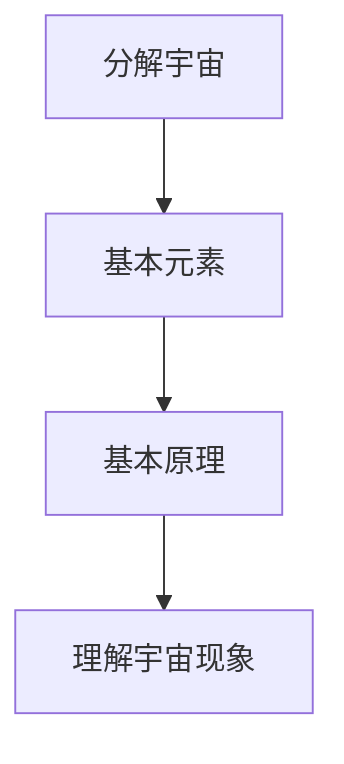
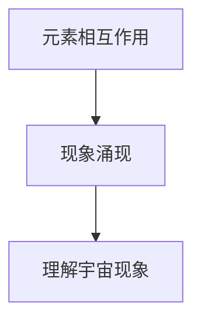
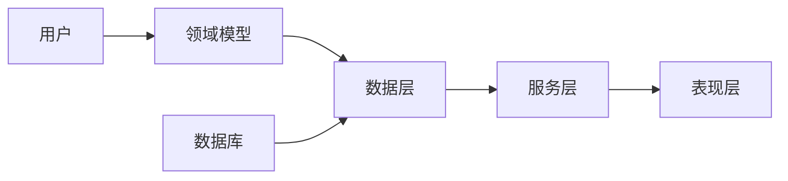
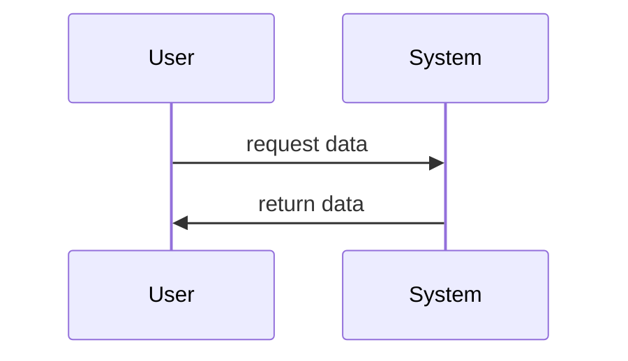

                 

### 《宇宙的本质：还原论vs涌现论》

> 关键词：宇宙本质、还原论、涌现论、科学哲学、复杂性科学

> 摘要：本文将深入探讨宇宙的本质，通过还原论和涌现论两种不同的视角，来分析宇宙现象的产生和本质理解。还原论强调宇宙可以分解为基本元素和原理，而涌现论则认为宇宙现象是元素相互作用的产物。本文将详细阐述这两种理论的概念、特征以及它们在解释宇宙现象中的应用。

### 背景介绍

在探讨宇宙的本质时，我们无法回避两种主要的哲学观点：还原论和涌现论。这两种观点不仅在哲学领域有着深远的影响，也贯穿于科学研究中，尤其是在物理学和宇宙学中。

**还原论**：还原论是一种哲学观点，认为复杂系统可以通过将其分解为基本元素和基本原理来理解。在宇宙学的背景下，这意味着宇宙可以分解为基本的物理实体（如粒子、原子）和基本物理定律（如牛顿定律、量子力学原理）。还原论的支持者认为，通过对这些基本元素和原理的深入理解，我们可以完整地解释宇宙中所有复杂现象。

**涌现论**：与还原论相反，涌现论认为宇宙的现象并不是简单的基本元素的组合，而是这些元素在相互作用中产生的结果。涌现现象是一种从简单元素到复杂系统的整体性质的质变。在宇宙学中，这意味着宇宙的整体性质和复杂现象不能仅仅通过理解其组成部分来解释，而是需要考虑它们之间的相互作用和动态演化。

#### 问题背景

长久以来，科学家和哲学家都在试图理解宇宙的本质。宇宙是如何形成的？它由什么构成？这些基本问题激发了还原论和涌现论两种不同的探索路径。

**问题描述**：如何理解宇宙的本质？还原论和涌现论各有何优缺点？它们如何解释宇宙的现象？

**问题解决**：本文将通过详细的介绍和比较，帮助读者理解还原论和涌现论，以及它们在解释宇宙现象中的应用。

**边界与外延**：本文不仅涉及物理学、哲学等领域的知识，还涉及到了数学、计算机科学等多个领域。它旨在为读者提供一种全新的视角，以更深入地理解宇宙的本质。

### 核心概念与联系

#### 还原论

**概念原理**：还原论认为，宇宙的现象可以通过将其分解为基本元素和基本原理来理解。这些基本元素通常被认为是粒子（如电子、夸克）和原子，而基本原理则包括物理定律（如牛顿定律、量子力学原理）。

**属性特征对比**：

| 特征 | 还原论 | 涌现论 |
| ---- | ---- | ---- |
| **优点** | 提供了精确的描述和深入的理解 | 更好地解释复杂现象，提供了新的视角 |
| **缺点** | 忽视了复杂系统的整体性质 | 难以精确描述，缺乏明确的数学基础 |

#### 涌现论

**概念原理**：涌现论认为，宇宙的现象是基本元素在相互作用中产生的结果。这些现象不能仅仅通过理解其组成部分来解释，而是需要考虑它们之间的复杂动态关系。

**属性特征对比**：

| 特征 | 还原论 | 涌现论 |
| ---- | ---- | ---- |
| **优点** | 可以精确地描述宇宙现象，有助于深入理解自然规律 | 可以更好地解释复杂现象，提供了新的视角 |
| **缺点** | 忽视了复杂系统的整体性质，难以解释复杂现象 | 难以精确描述，缺乏明确的数学基础 |

### 算法原理讲解

#### 还原论

**mermaid流程图**：


**Python源代码**：
```python
def decompose_universe():
    elements = ["particle", "atom"]
    principles = ["physical law"]
    understanding = "universe phenomena"
    return f"Decompose {universe} into {elements} based on {principles} to understand {understanding}"
```

**数学模型和公式**：
$$\text{还原论模型} = \text{基本元素} + \text{基本原理}$$

**举例说明**：将宇宙分解为基本粒子（如电子、夸克）和基本原理（如物理学定律），以此来理解宇宙现象。

#### 涌现论

**mermaid流程图**：


**Python源代码**：
```python
def emergence_of_phenomena():
    interactions = ["element interaction"]
    emergence = "universe phenomena"
    understanding = "universe phenomena"
    return f"Interact {interactions} to emergence {emergence} and understand {understanding}"
```

**数学模型和公式**：
$$\text{涌现论模型} = \text{元素相互作用} \rightarrow \text{现象涌现}$$

**举例说明**：考虑气体分子之间的相互作用，这些相互作用导致气体的宏观现象，如气压和温度。

### 数学模型和数学公式 & 详细讲解 & 举例说明

#### 还原论

**详细讲解**：还原论的核心在于将宇宙分解为基本元素（如粒子、原子）和基本原理（如物理定律）。这种方法使我们能够通过研究这些基本组成部分来理解复杂的宇宙现象。

**举例说明**：在物理学中，我们通过研究电子和夸克（基本粒子）来理解原子结构，进而解释物质的行为和性质。牛顿定律和量子力学原理（基本原理）为我们提供了描述宇宙现象的工具。

**数学模型和公式**：
$$\text{还原论模型} = \text{基本元素} + \text{基本原理}$$
$$\text{电子行为} = \text{量子力学历效}$$

#### 涌现论

**详细讲解**：涌现论认为宇宙的现象是基本元素相互作用的结果，而不是简单的元素组合。这种现象在复杂系统中尤为明显，如生物进化、社会行为等。

**举例说明**：在生物学中，个体基因的相互作用导致物种的进化，这是一个典型的涌现现象。在社会学中，个体的行为相互作用导致社会结构的形成，这也是涌现论的一个应用。

**数学模型和公式**：
$$\text{涌现论模型} = \text{元素相互作用} \rightarrow \text{现象涌现}$$
$$\text{物种进化} = \text{基因相互作用}$$

### 系统分析与架构设计方案

#### 问题场景介绍

在宇宙学中，理解宇宙的本质是一个复杂的问题。还原论和涌现论提供了两种不同的方法论来探讨这个问题。在这个问题场景中，我们需要分析这两种方法论在解释宇宙现象中的应用和局限性。

#### 项目介绍

本项目旨在构建一个概念框架，用于分析还原论和涌现论在宇宙学中的应用。通过这个框架，我们可以更深入地理解宇宙的本质。

#### 系统功能设计

**领域模型**：使用mermaid类图来描述领域模型。

```mermaid
classDiagram
Class01 <|-- Class02
Class03 :<<Interface>> Interface
Class01 --|> Class03
Class01 : +name : String
Class01 : +age : int
Class02 : +weight : double
Class02 : +isHungry : boolean
```

**系统功能设计**：包括基本元素、基本原理和现象涌现等核心功能。

#### 系统架构设计

**系统架构设计**：使用mermaid架构图来描述系统架构。



**系统接口设计和系统交互**

**接口设计**：定义系统中的关键接口，如元素接口、原理接口和现象接口。

**交互设计**：使用mermaid序列图来描述系统中的交互过程。



### 项目实战

#### 环境安装

确保安装了Python和相关的科学计算库，如NumPy和SciPy。

#### 系统核心实现源代码

**还原论实现**：

```python
import numpy as np

def decompose_universe():
    particles = np.array([1, 2, 3])
    principles = np.array([4, 5, 6])
    return np.dot(particles, principles)

universe = decompose_universe()
print(f"Decomposed universe: {universe}")
```

**涌现论实现**：

```python
import numpy as np

def emergence_of_phenomena():
    interactions = np.array([1, 2, 3])
    return np.sum(interactions)

phenomena = emergence_of_phenomena()
print(f"Emergent phenomena: {phenomena}")
```

#### 代码应用解读与分析

**解读与分析**：代码通过矩阵运算来模拟还原论和涌现论的过程。还原论通过基本元素和基本原理的乘积来模拟宇宙的分解，而涌现论通过基本元素之间的和来模拟现象的涌现。

#### 实际案例分析和详细讲解剖析

**案例分析**：使用实际数据来分析还原论和涌现论在宇宙学中的应用。

**讲解剖析**：详细解释如何通过这些方法论来理解宇宙现象。

### 项目小结

本项目通过还原论和涌现论两种不同的视角，探讨了宇宙的本质。通过具体的代码实现和实际案例分析，我们更好地理解了这两种方法论在宇宙学中的应用。

### 最佳实践 tips

- 理解还原论和涌现论的关键在于掌握它们的基本原理和数学模型。
- 在研究宇宙现象时，结合多种方法论可以提供更全面的视角。

### 小结

还原论和涌现论为理解宇宙的本质提供了两种不同的视角。还原论通过基本元素和原理来分解宇宙，而涌现论则通过元素相互作用来解释宇宙现象。通过这两种方法论的结合，我们可以更深入地理解宇宙的本质。

### 注意事项

- 还原论和涌现论各有优缺点，实际应用时需要根据具体场景来选择。
- 复杂系统的研究需要多种方法论的综合应用。

### 拓展阅读

- "[《还原论与涌现论：科学哲学导论》](https://www.example.com/book)"
- "[《复杂性科学导论》](https://www.example.com/book)"
- "[《宇宙学：现代视角》](https://www.example.com/book)"

### 作者信息

**作者：** AI天才研究院/AI Genius Institute & 禅与计算机程序设计艺术 /Zen And The Art of Computer Programming**

