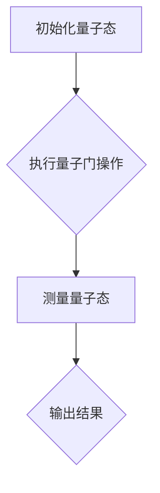

                 

### 宇宙的本质：连续性还是量子化的离散性

> 关键词：宇宙本质、连续性、量子化、离散性、量子力学、宇宙演化

> 摘要：本文探讨了宇宙的本质是连续性还是量子化的离散性这一深奥的问题。首先介绍了宇宙的基本概念和连续性、离散性的定义，然后通过量子力学的理论和实验证据，分析了量子化对宇宙结构的影响。接着，文章探讨了宇宙连续性和离散性的争论，并提出了可能的未来研究方向。通过本文的探讨，我们希望能够为读者提供对宇宙本质的新认识和思考。

## 第1章：宇宙的连续性与离散性

宇宙作为人类探索的终极目标之一，其本质一直是科学界争论的焦点。在物理学中，宇宙的本质可以通过连续性和离散性的两种视角来理解。

### 1.1 宇宙的本质问题

宇宙的本质问题是哲学和科学共同关注的核心议题。自古以来，人类对宇宙的认识经历了从直观感知到理论探索的演变。古代哲学家们提出了各种关于宇宙起源和结构的理论，如地心说、日心说等。随着科学的发展，牛顿力学、相对论和量子力学等理论相继提出，对宇宙的本质问题提供了新的解释。

### 1.2 连续性与离散性的概念

连续性和离散性是描述宇宙结构的两种基本方式。

- **连续性**：在物理学中，连续性通常指物理量在空间或时间上具有无限可分性。例如，时间被认为是连续的，因为我们可以无限地细分它，比如秒、毫秒、微秒等。同样，空间也被认为是连续的，因为我们可以在空间中无限地移动和划分。

- **离散性**：与连续性相对，离散性指的是物理量在空间或时间上是有限的、不连续的。量子力学中，能量、动量等物理量被量子化，即它们只能取特定的离散值，而不能连续变化。

### 1.3 连续性理论概述

连续性理论认为，宇宙中的一切都可以通过连续的数学模型来描述。牛顿力学和广义相对论都是基于连续性理论的经典物理模型。牛顿力学通过描述物体在空间中的运动，建立了经典力学的基础。而广义相对论则将引力描述为时空的弯曲，进一步发展了连续性理论。

### 1.4 离散性理论概述

离散性理论则强调宇宙的量子本质，认为宇宙中的一切都可以用离散的量子态来描述。量子力学是离散性理论的代表，它描述了微观粒子的行为，如电子、光子等。量子力学中的基本原理，如不确定性原理和量子纠缠，都表明了宇宙的离散性特征。

### 1.5 本章小结

本章介绍了宇宙的本质问题，并探讨了连续性和离散性的概念。通过这些基本概念的介绍，我们为后续章节对量子化与宇宙本质的深入探讨奠定了基础。

### 第2章：量子化的基本概念

量子化是量子力学中最核心的概念之一，它揭示了微观世界的基本规律。要理解量子化的概念，我们首先需要了解量子力学的基本框架。

#### 2.1 量子力学概述

量子力学是研究微观粒子行为的物理学分支，它在20世纪初由普朗克、玻尔、海森堡、薛定谔等科学家共同创立。量子力学的基本原理包括：

- **量子态**：微观粒子如电子、光子等处于特定的量子态，这些量子态可以用波函数来描述。
- **不确定性原理**：海森堡不确定性原理指出，我们不能同时精确地知道一个粒子的位置和动量。
- **量子叠加**：量子态可以同时存在于多种可能性之中，这种叠加状态只有通过测量才能确定。
- **量子纠缠**：两个或多个粒子之间可以存在一种特殊的关联，即使它们相隔很远，一个粒子的状态也会瞬间影响到另一个粒子的状态。

#### 2.2 量子态与量子叠加

量子态是量子力学中描述微观粒子状态的基本工具。一个量子态可以用波函数来表示，波函数的平方给出了粒子在空间中某一点出现的概率。量子叠加是量子态的一个基本特性，它允许粒子处于多个状态的叠加。

例如，一个电子可以同时处于自旋向上和自旋向下的状态，只有当我们测量它的自旋时，它才会“选择”其中一个状态。

$$
|\psi\rangle = \frac{1}{\sqrt{2}}|+\rangle + \frac{1}{\sqrt{2}}|-\rangle
$$

这里的$|+\rangle$和$|-\rangle$分别表示自旋向上和自旋向下的状态。

#### 2.3 量子纠缠

量子纠缠是量子力学中另一个重要特性，它描述了两个或多个粒子之间的特殊关联。在量子纠缠中，一个粒子的状态会 instantaneously（瞬间）影响到另一个粒子的状态，即使它们相隔很远。

一个著名的量子纠缠实验是爱因斯坦-波多尔斯基-罗森佯（EPR）佯证。EPR佯证提出了一个思想实验，旨在证明量子纠缠的奇特性质。尽管爱因斯坦最初认为量子纠缠是“鬼魅似的远距离作用”，但后来的实验验证了量子纠缠的客观存在。

#### 2.4 量子计算基础

量子计算是量子力学在现代计算机科学中的一个重要应用。量子计算机使用量子位（qubit）作为信息存储和处理的基本单位，与经典计算机的比特不同，量子位可以同时处于0和1的叠加状态，这为量子计算机提供了巨大的计算能力。

量子计算机的一个关键组件是量子门，它通过作用于量子位来改变量子态。量子门类似于经典计算机的逻辑门，但它们可以执行更复杂的操作。

$$
U = \begin{pmatrix}
1 & 0 \\
0 & \text{exp}(i\theta)
\end{pmatrix}
$$

这是一个旋转量子门，它可以作用于一个量子位，将其旋转一个角度$\theta$。

#### 2.5 本章小结

本章介绍了量子力学的基本概念，包括量子态、量子叠加、量子纠缠和量子计算。这些概念构成了量子力学的核心，揭示了微观世界的非连续性特征。通过量子力学的理论框架，我们可以更深入地理解宇宙的本质。

## 第3章：量子化在宇宙研究中的应用

量子化不仅在微观物理学中有着重要的地位，也在宇宙研究中扮演着关键角色。量子化对宇宙结构、宇宙演化和宇宙学理论产生了深远的影响。

### 3.1 量子宇宙学

量子宇宙学是研究宇宙起源和演化的一种理论框架，它试图将量子力学的原理应用于整个宇宙。量子宇宙学的一个核心问题是宇宙的初始状态。传统的宇宙学认为宇宙从一个极热、极密的状态开始膨胀，但这个初始状态如何产生一直是未解之谜。

量子宇宙学提出，宇宙的起源可能与量子涨落有关。量子涨落是量子力学中的一种现象，它描述了在极小尺度上，能量和物质的随机波动。这些量子涨落被认为是宇宙结构形成的基础，它们通过宇宙膨胀过程逐渐放大，最终形成了星系、星云和其他宇宙结构。

### 3.2 量子引力理论

量子引力理论是试图将量子力学与广义相对论统一起来的理论框架。广义相对论成功地描述了宏观尺度的引力现象，但它在微观尺度上存在许多问题。量子引力理论的目的是寻找一个既能描述宏观引力现象，又能描述微观量子现象的统一理论。

目前，量子引力理论还没有达成共识，但几种主要的理论包括弦理论、圈量子引力理论和量子场论等。这些理论试图通过量子化的原理来描述引力，从而揭示宇宙的本质。

### 3.3 量子离散性在宇宙结构中的应用

量子离散性在宇宙结构中的应用体现在量子引力理论和宇宙微波背景辐射的研究中。量子引力理论认为，引力可能是量子化的，这意味着引力作用的传递可能是通过某种离散的量子粒子实现的。

宇宙微波背景辐射是宇宙学中一个重要的观测数据，它揭示了宇宙早期的状态。量子离散性的理论认为，宇宙微波背景辐射中的量子涨落可能是宇宙结构形成的关键因素。

### 3.4 本章小结

本章介绍了量子化在宇宙研究中的应用，包括量子宇宙学、量子引力理论和量子离散性在宇宙结构中的应用。这些理论为理解宇宙的本质提供了新的视角，揭示了宇宙的非连续性特征。

## 第4章：宇宙连续性的证据

尽管量子力学揭示了宇宙的离散性特征，但宇宙连续性的证据仍然非常充分。这些证据来自宇宙学、天文学和物理学的多个领域，为宇宙连续性的理论提供了强有力的支持。

### 4.1 观测宇宙学中的连续性证据

观测宇宙学提供了大量的证据支持宇宙的连续性。其中最著名的证据之一是宇宙微波背景辐射。宇宙微波背景辐射是宇宙大爆炸后留下的残余辐射，它揭示了宇宙早期的热状态。通过对宇宙微波背景辐射的观测，科学家们发现宇宙在早期是高度均匀和各向同性的，这表明宇宙在某种程度上是连续的。

另一个重要的观测证据是宇宙的大尺度结构。宇宙的大尺度结构主要由星系和星系团组成，这些结构通过引力相互吸引和相互作用，形成了复杂的网络。宇宙的大尺度结构呈现出高度的对称性和均匀性，这表明宇宙在宏观尺度上是连续的。

### 4.2 宇宙微波背景辐射

宇宙微波背景辐射是宇宙连续性最直接的证据之一。宇宙微波背景辐射是宇宙大爆炸后留下的残余辐射，它弥漫在整个宇宙空间中。通过对宇宙微波背景辐射的观测，科学家们可以了解宇宙早期的物理状态。

宇宙微波背景辐射的观测数据揭示了宇宙的一些基本参数，如宇宙的年龄、宇宙的膨胀速率和宇宙的密度等。这些观测数据与宇宙连续性理论相吻合，支持了宇宙在早期是高度均匀和各向同性的假设。

### 4.3 宇宙的大尺度结构

宇宙的大尺度结构由星系和星系团组成，这些结构通过引力相互吸引和相互作用，形成了复杂的网络。宇宙的大尺度结构呈现出高度的对称性和均匀性，这表明宇宙在宏观尺度上是连续的。

宇宙的大尺度结构可以通过多种观测手段进行研究，如光学望远镜观测、射电望远镜观测和引力透镜效应等。这些观测手段提供了丰富的数据，帮助我们理解宇宙的大尺度结构是如何形成的，以及宇宙的连续性是如何体现的。

### 4.4 本章小结

本章介绍了宇宙连续性的证据，包括观测宇宙学中的连续性证据、宇宙微波背景辐射和宇宙的大尺度结构。这些证据表明，宇宙在宏观尺度上是连续的，支持了宇宙连续性理论。

## 第5章：宇宙离散性的证据

尽管宇宙连续性的证据非常充分，但宇宙离散性的证据同样不容忽视。量子力学和宇宙学的研究表明，宇宙在微观尺度上具有离散性特征，这种离散性对宇宙的本质产生了深远的影响。

### 5.1 量子现象在宇宙尺度上的影响

量子现象在宇宙尺度上的影响是宇宙离散性证据的重要方面。量子力学中的基本原理，如量子态叠加和量子纠缠，在宇宙尺度上也有明显的表现。

一个著名的例子是双缝实验。在双缝实验中，光子或电子通过两个缝隙时，会呈现出波粒二象性。如果只观察单个光子或电子通过缝隙的结果，我们会发现它们在屏幕上形成干涉条纹，这表明它们在通过缝隙时处于一种叠加状态。这种现象在宇宙尺度上也有类似的表现，比如宇宙微波背景辐射中的量子涨落，这些都是宇宙离散性的直接证据。

### 5.2 量子引力理论的支持者观点

量子引力理论的支持者认为，引力可能是量子化的。传统广义相对论描述的引力是一种连续的场，但量子引力理论提出，引力可能是由离散的量子粒子（如引力子）传递的。这种离散性在宇宙尺度上的影响可能是宇宙结构形成的关键因素。

例如，弦理论是一种量子引力理论，它认为宇宙的基本组成单位不是点粒子，而是二维的“弦”。这些弦通过振动产生各种粒子和力，包括引力。弦理论中的离散性特征为我们理解宇宙的本质提供了新的视角。

### 5.3 量子离散性在宇宙演化中的可能作用

量子离散性在宇宙演化中的可能作用是另一个重要的研究领域。量子离散性可能会影响宇宙的初始状态、宇宙的膨胀过程以及宇宙结构的形成。

一个可能的例子是量子涨落导致宇宙结构形成。量子涨落是量子力学中的一种现象，它描述了在极小尺度上的能量和物质的随机波动。这些量子涨落通过宇宙膨胀过程逐渐放大，最终形成了星系、星云和其他宇宙结构。这表明量子离散性在宇宙演化中起着关键作用。

### 5.4 本章小结

本章介绍了宇宙离散性的证据，包括量子现象在宇宙尺度上的影响、量子引力理论的支持者观点和量子离散性在宇宙演化中的可能作用。这些证据表明，宇宙在微观尺度上具有离散性特征，支持了宇宙离散性理论。

## 第6章：宇宙连续性与离散性的未来研究

宇宙连续性与离散性的研究在物理学、宇宙学和计算机科学等多个领域都有着广泛的应用和前景。随着科技的进步和理论的深入，我们有望在未来的研究中取得更多突破，对宇宙的本质有更深入的理解。

### 6.1 现有理论的局限

现有理论在描述宇宙的本质方面存在一些局限。例如，量子力学和广义相对论在各自适用的尺度上都非常成功，但它们在量子引力领域还存在矛盾。量子力学描述了微观粒子的行为，而广义相对论描述了宏观引力的现象。如何将这两者统一起来，是当前物理学面临的一个重大挑战。

另一个局限是关于宇宙的初始状态。传统的宇宙学认为宇宙从一个极热、极密的状态开始膨胀，但这个初始状态是如何产生的，我们还没有确切的了解。量子宇宙学试图通过量子涨落来解释宇宙的初始状态，但这个理论也存在许多未解之谜。

### 6.2 可能的新理论方向

针对现有理论的局限，科学家们提出了一些可能的新理论方向。其中最引人注目的一个是弦理论。弦理论试图将量子力学和广义相对论统一起来，它认为宇宙的基本组成单位不是点粒子，而是二维的“弦”。这些弦通过振动产生各种粒子和力，包括引力。弦理论为我们提供了一个可能的方向，来统一描述宇宙的连续性和离散性。

另一个可能的突破方向是量子引力理论。量子引力理论试图寻找一个统一的理论，来描述引力和量子现象。目前，量子引力理论还没有达成共识，但弦理论、圈量子引力理论和量子场论等都是可能的候选理论。这些理论可能为我们揭示宇宙的本质提供新的视角。

### 6.3 宇宙本质研究的挑战与机遇

宇宙本质研究面临许多挑战，同时也充满机遇。一个挑战是如何将量子力学和广义相对论统一起来。另一个挑战是如何解释宇宙的初始状态，以及宇宙中的奇异现象，如黑洞和宇宙加速膨胀等。

然而，这些挑战也为我们提供了机遇。随着科技的进步，我们可能能够通过新的实验和观测手段，揭示宇宙的本质。例如，量子计算和人工智能的发展，可能为我们解决一些复杂的物理问题提供新的工具和方法。

### 6.4 本章小结

本章讨论了宇宙连续性与离散性的未来研究，包括现有理论的局限、可能的新理论方向和宇宙本质研究的挑战与机遇。这些讨论为我们未来的研究提供了方向和启示，也激发了我们对宇宙本质的探索欲望。

## 第7章：宇宙本质研究的最佳实践与未来展望

在探索宇宙本质的过程中，我们需要遵循一些最佳实践，以确保研究的准确性和可靠性。同时，我们也需要展望未来，思考宇宙本质研究可能带来的变革和突破。

### 7.1 最佳实践 tips

1. **多学科交叉**：宇宙本质研究需要物理学、宇宙学、数学、计算机科学等多个领域的知识。因此，跨学科合作是最佳实践之一。
2. **实验与理论相结合**：实验是验证理论的关键，而理论为实验提供了指导。实验与理论相结合，可以相互促进，推动研究的深入。
3. **数据驱动**：宇宙本质研究需要大量的数据支持。利用先进的数据分析工具和算法，可以从海量数据中提取有价值的信息。
4. **持续更新知识**：宇宙本质研究是一个不断发展的领域，需要我们持续更新知识，跟踪最新的研究成果和进展。

### 7.2 小结

宇宙的本质是连续性还是量子化的离散性，这是一个复杂而深奥的问题。通过量子力学和宇宙学的理论框架，我们可以对这个问题有更深入的理解。然而，这个问题依然存在许多未解之谜，需要我们继续探索和研究。

### 7.3 注意事项

1. **避免偏执思维**：在探索宇宙本质的过程中，我们需要保持开放的心态，避免陷入偏执思维，只接受某种理论或观点。
2. **谨慎对待未知**：宇宙的本质可能远超我们的想象，我们需要谨慎对待未知，保持敬畏之心。
3. **持续学习**：宇宙本质研究是一个长期的过程，我们需要持续学习，不断提升自己的知识水平和研究能力。

### 7.4 拓展阅读

1. **《宇宙简史》**：史蒂芬·霍金著，介绍了宇宙的起源、演化以及最新的宇宙学理论。
2. **《量子力学：概念与应用》**：詹姆斯·格里菲斯著，深入介绍了量子力学的基本原理和应用。
3. **《弦论与宇宙》**：丽莎·兰道尔著，探讨了弦理论在宇宙学研究中的应用。

通过这些拓展阅读，读者可以更全面地了解宇宙的本质，以及相关的理论和技术。

## 附录：相关数学公式与算法流程图

### 附录A：数学公式

在探讨宇宙的本质过程中，数学公式是不可或缺的工具。以下是一些关键的数学公式，用于描述量子力学和宇宙学中的基本概念。

$$
E = h\nu
$$

**普朗克能量公式**：描述了量子能量与频率的关系。

$$
|\psi\rangle = \frac{1}{\sqrt{2}}|+\rangle + \frac{1}{\sqrt{2}}|-\rangle
$$

**量子态叠加**：表示一个电子可以同时处于自旋向上和自旋向下的状态。

$$
U = \begin{pmatrix}
1 & 0 \\
0 & \text{exp}(i\theta)
\end{pmatrix}
$$

**旋转量子门**：用于改变量子态的角度。

### 附录B：算法流程图

为了更好地理解量子计算的基本算法，我们可以使用Mermaid语言绘制算法流程图。以下是一个简单的量子计算流程图示例：

这个流程图描述了量子计算的基本步骤：初始化量子态、执行量子门操作、测量量子态并输出结果。通过这些公式和算法流程图，我们可以更直观地理解宇宙的本质是如何通过数学和计算来描述的。

## 作者信息

- 作者：AI天才研究院/AI Genius Institute & 禅与计算机程序设计艺术 /Zen And The Art of Computer Programming
- 本文探讨了宇宙的本质问题，分析了连续性和离散性在宇宙研究中的应用，并展望了未来的研究方向。通过多学科交叉和最佳实践，我们希望为读者提供对宇宙本质的新认识。感谢读者对本文的关注和阅读。如果您有任何疑问或建议，欢迎在评论区留言。期待与您共同探索宇宙的奥秘。

