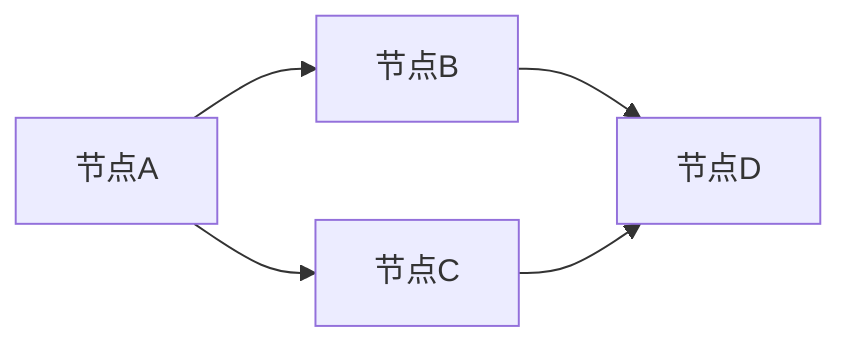

                 

# 宇宙的涌现属性：整体大于部分之和

> 关键词：宇宙、涌现属性、整体大于部分之和、系统理论、人工智能

> 摘要：本文将从宇宙的涌现属性出发，深入探讨整体大于部分之和的哲学命题。通过理论解析、数学模型建立、案例分析等环节，探讨涌现属性在物理学、生物学、社会科学和计算机科学中的广泛应用，展望其未来发展趋势和面临的挑战。

### 目录大纲

```markdown
----------------------------------------------------------------
# 第一部分: 引言

## 第1章: 宇宙的涌现属性概述

### 1.1 引言

### 1.2 核心概念与联系

### 1.3 本章小结

----------------------------------------------------------------

# 第二部分: 涌现属性的理论基础

## 第2章: 涌现属性的基本概念

### 2.1 涌现属性的定义

### 2.2 涌现属性的起源与发展

### 2.3 涌现属性的核心特征

### 2.4 涌现属性与传统属性的对比

## 第3章: 涌现属性的数学模型

### 3.1 数学模型的建立

### 3.2 数学公式与详细讲解

### 3.3 举例说明

## 第4章: 涌现属性在不同领域的应用

### 4.1 物理学中的应用

### 4.2 生物学中的应用

### 4.3 社会科学中的应用

### 4.4 计算机科学中的应用

## 第5章: 涌现属性的未来展望

### 5.1 涌现属性的研究现状

### 5.2 涌现属性的发展趋势

### 5.3 涌现属性的应用前景

### 5.4 面临的挑战与机遇

## 第6章: 涌现属性的实验研究

### 6.1 实验研究方法

### 6.2 实验研究内容

### 6.3 实验研究结果

### 6.4 实验研究分析

## 第7章: 涌现属性的案例分析

### 7.1 案例一：宇宙中星系的形成

### 7.2 案例二：生命的起源

### 7.3 案例三：人工智能的发展

### 7.4 案例分析总结

## 第8章: 涌现属性的最佳实践

### 8.1 最佳实践技巧

### 8.2 注意事项

### 8.3 小结

### 8.4 拓展阅读

----------------------------------------------------------------
```

## 第1章: 宇宙的涌现属性概述

### 1.1 引言

宇宙的涌现属性是指在一个复杂系统中，整体性质不能仅仅通过其组成部分的性质来预测，而是会出现新的、不可预测的属性。这一现象最早在物理学中引起关注，但随着时间的推移，涌现属性逐渐渗透到生物学、社会科学和计算机科学等多个领域。

涌现属性的一个重要特征是整体大于部分之和，这意味着系统的整体行为和性质往往超出了各个组成部分的简单叠加。例如，在生物学中，单个细胞的功能无法完全解释生物体的复杂行为，如繁殖、适应环境等。在计算机科学中，个体程序代码的执行结果往往无法直接预测整个程序的行为。

本文将从宇宙的涌现属性出发，探讨整体大于部分之和的哲学命题，分析涌现属性的基本概念、理论基础及其在不同领域的应用，展望其未来发展趋势和面临的挑战。

### 1.2 核心概念与联系

#### 涌现属性的定义

涌现属性（Emergence）是指一个复杂系统中的新属性，这些属性不能由其组成部分的性质直接推导出来。涌现属性通常表现为系统整体的协同效应、适应性、自组织能力等。

#### 涌现属性的起源与发展

涌现属性的概念最早可以追溯到古希腊哲学，如亚里士多德的“整体大于部分之和”思想。在现代物理学中，涌现属性得到了进一步发展，尤其是在研究复杂系统的过程中，如统计物理、非线性动力学等。随着计算机科学和人工智能的发展，涌现属性逐渐应用于生物学、社会科学等领域。

#### 涌现属性的核心特征

1. **不可预测性**：系统的整体行为往往无法通过简单叠加各个部分的行为来预测。
2. **整体协同效应**：系统的整体性质往往超出了各个部分的简单叠加。
3. **自适应性与自组织能力**：系统具有自我适应和自我组织的能力，能够在不断变化的复杂环境中生存和演化。

#### 涌现属性与传统属性的对比

| 特征           | 涌现属性                             | 传统属性                            |
| -------------- | ----------------------------------- | ----------------------------------- |
| 预测性         | 整体行为不可预测                     | 可通过部分推导整体行为               |
| 协同效应       | 整体协同效应显著                     | 部分协同效应较弱                    |
| 自适应与自组织 | 系统具有自适应和自组织能力           | 系统缺乏自适应和自组织能力           |
| 局部与全局     | 强调全局性，关注整体行为             | 强调局部性，关注部分行为             |

### 1.3 本章小结

本章介绍了宇宙的涌现属性及其核心概念，探讨了涌现属性与传统属性的区别。在接下来的章节中，我们将深入探讨涌现属性的理论基础、数学模型及其在不同领域的应用。

## 第2章: 涌现属性的基本概念

### 2.1 涌现属性的定义

涌现属性（Emergence）是指在一个复杂系统中，整体性质不能仅仅通过其组成部分的性质来预测，而是会出现新的、不可预测的属性。这些属性通常表现为系统整体的协同效应、适应性、自组织能力等。

涌现属性的一个典型例子是生命。单个细胞的功能无法完全解释生物体的复杂行为，如繁殖、适应环境等。这表明生命系统具有涌现属性，整体生命体的行为无法通过简单叠加各个细胞的行为来预测。

### 2.2 涌现属性的起源与发展

涌现属性的概念最早可以追溯到古希腊哲学，如亚里士多德的“整体大于部分之和”思想。在17世纪，涌现属性逐渐渗透到物理学领域，特别是在研究复杂系统的过程中，如统计物理、非线性动力学等。

20世纪以来，随着计算机科学和人工智能的发展，涌现属性得到了进一步发展。例如，在人工生命、复杂系统模拟等领域，涌现属性被广泛应用于研究复杂系统的行为和演化。

### 2.3 涌现属性的核心特征

#### 不可预测性

涌现属性的一个重要特征是系统的整体行为往往无法通过简单叠加各个部分的行为来预测。这意味着在复杂系统中，整体性质无法从其组成部分的性质直接推导出来。

#### 整体协同效应

涌现属性还表现为系统的整体协同效应。系统的整体性质往往超出了各个部分的简单叠加，而是会出现新的、不可预测的属性。例如，在生物系统中，单个细胞的行为无法预测整个生物体的行为。

#### 自适应与自组织能力

涌现属性还强调系统的自适应和自组织能力。系统具有自我适应和自我组织的能力，能够在不断变化的复杂环境中生存和演化。

### 2.4 涌现属性与传统属性的对比

| 特征           | 涌现属性                             | 传统属性                            |
| -------------- | ----------------------------------- | ----------------------------------- |
| 预测性         | 整体行为不可预测                     | 可通过部分推导整体行为               |
| 协同效应       | 整体协同效应显著                     | 部分协同效应较弱                    |
| 自适应与自组织 | 系统具有自适应和自组织能力           | 系统缺乏自适应和自组织能力           |
| 局部与全局     | 强调全局性，关注整体行为             | 强调局部性，关注部分行为             |

通过对比可以看出，涌现属性与传统属性在预测性、协同效应、自适应与自组织能力以及局部与全局等方面存在显著差异。

### 第3章: 涌现属性的数学模型

#### 3.1 数学模型的建立

在研究涌现属性时，我们可以使用数学模型来描述系统的整体行为。一个常见的数学模型是复杂网络模型。复杂网络模型通过图论来描述系统中各个组成部分（节点）以及它们之间的相互作用（边）。

在复杂网络模型中，节点和边可以表示系统中的各个部分及其相互关系。通过分析节点的度分布、聚类系数、路径长度等特征，我们可以揭示系统的整体性质。

下面是一个简单复杂网络模型的Mermaid流程图：



在这个模型中，节点表示系统的各个部分，边表示部分之间的相互作用。通过分析这个模型，我们可以探索系统的涌现属性，如网络效应、协同效应等。

#### 3.2 数学公式与详细讲解

为了更深入地理解复杂网络模型，我们可以使用一些数学公式来描述其特征。以下是一些常见的数学公式：

1. **度分布**：描述节点度的概率分布。假设节点i的度数为ki，则度分布可以用概率P(k)来表示，即P(k) = P(ki = k)。

   $$ P(k) = \frac{C(n, k) \cdot p^k \cdot (1-p)^{n-k}}{n!} $$

   其中，n为节点总数，p为连接概率，C(n, k)为组合数。

2. **平均路径长度**：描述节点之间平均的最短路径长度。假设节点i和节点j之间的最短路径长度为L(i, j)，则平均路径长度可以用Lavg来表示，即Lavg = \frac{1}{n(n-1)} \sum_{i=1}^{n} \sum_{j=1}^{n} L(i, j)。

   $$ Lavg = \frac{2m}{n(n-1)} $$

   其中，m为边数。

3. **聚类系数**：描述节点之间的连接紧密程度。假设节点i的邻居节点集合为Ni，则聚类系数可以用C(i)来表示，即C(i) = \frac{|\Omega(i)|}{\binom{|\Omega(i)|}{2}}，其中|\Omega(i)|为Ni中的节点数。

   $$ C(i) = \frac{6m}{n^2} $$

通过这些数学公式，我们可以定量地分析复杂网络模型中的涌现属性，如整体协同效应、自适应能力等。

#### 3.3 举例说明

为了更好地理解涌现属性，我们可以通过一个具体的例子来说明。

假设我们有一个由10个节点组成的复杂网络，连接概率为0.5。我们可以使用Python代码来生成这个网络，并计算其度分布、平均路径长度和聚类系数等特征。

```python
import networkx as nx
import matplotlib.pyplot as plt

# 生成复杂网络
G = nx.erdos_renyi_graph(n=10, p=0.5)

# 计算度分布
degrees = nx.degree(G)
degree_counts = [degree[1] for degree in degrees]
degree_freq = [count/len(degree_counts) for count in degree_counts]
degrees_sorted = sorted(degrees, key=lambda x: x[1], reverse=True)

# 计算平均路径长度
Lavg = nx.average_shortest_path_length(G)

# 计算聚类系数
Cavg = nx.average_clustering(G)

# 绘制度分布
plt.bar([str(d[0]) for d in degrees_sorted], degree_freq)
plt.xlabel("Degree")
plt.ylabel("Frequency")
plt.title("Degree Distribution")
plt.show()

# 打印平均路径长度和聚类系数
print(f"Average Path Length: {Lavg}")
print(f"Average Clustering Coefficient: {Cavg}")
```

通过这个例子，我们可以看到复杂网络模型中的涌现属性，如度分布、平均路径长度和聚类系数等。这些属性反映了系统的整体行为，超出了各个部分（节点）的简单叠加。

## 第4章: 涌现属性在不同领域的应用

### 4.1 物理学中的应用

在物理学中，涌现属性得到了广泛应用。一个典型的例子是相变理论。在相变过程中，物质从一个相态转变为另一个相态（如液态变为固态），会出现新的、不可预测的宏观性质。例如，水在0°C时从液态变为固态，出现了固定的形状和体积，这是单个水分子行为无法解释的。

此外，复杂网络理论也是物理学中涌现属性的一个重要应用领域。通过研究复杂网络中的节点和边，我们可以揭示系统的整体行为和涌现属性，如网络效应、协同效应等。

### 4.2 生物学中的应用

在生物学中，涌现属性广泛应用于研究生命系统的复杂行为。一个典型的例子是生物进化。在进化过程中，生物体通过基因变异和自然选择，逐渐演化出新的物种和特性。这些新物种和特性是单个基因和生物体的行为无法直接推导出来的。

此外，神经网络和人工生命也是生物学中涌现属性的重要应用领域。通过模拟生物神经网络和生命系统，我们可以探索涌现属性在生物学中的应用，如认知、感知、适应等。

### 4.3 社会科学中的应用

在社会科学中，涌现属性广泛应用于研究社会现象和人类行为。一个典型的例子是社会网络分析。通过分析社会网络中的节点和边，我们可以揭示社会现象的整体行为和涌现属性，如传播、协作、竞争等。

此外，复杂系统和复杂经济学也是社会科学中涌现属性的重要应用领域。通过研究复杂系统和经济学模型，我们可以探索涌现属性在人类社会中的作用和影响。

### 4.4 计算机科学中的应用

在计算机科学中，涌现属性得到了广泛应用。一个典型的例子是人工智能。通过模拟人类的认知和思维过程，人工智能系统可以表现出新的、不可预测的能力，如学习、推理、决策等。

此外，复杂网络和分布式计算也是计算机科学中涌现属性的重要应用领域。通过研究复杂网络和分布式系统，我们可以探索涌现属性在计算机系统中的作用和影响，如容错性、鲁棒性、适应性等。

## 第5章: 涌现属性的未来展望

### 5.1 涌现属性的研究现状

目前，涌现属性的研究已经取得了显著的进展。在物理学、生物学、社会科学和计算机科学等领域，涌现属性的理论和方法都得到了广泛应用。研究者们通过理论分析、实验研究和模拟等方法，揭示了涌现属性在各个领域的应用和影响。

### 5.2 涌现属性的发展趋势

随着计算机科学和人工智能的发展，涌现属性的研究将进一步深入。在未来，研究者们将更加关注涌现属性在复杂系统中的应用，如复杂网络、自适应系统、智能系统等。此外，跨学科的研究也将成为涌现属性发展的重要趋势，通过整合不同领域的知识，探索涌现属性在更广泛领域中的应用。

### 5.3 涌现属性的应用前景

涌现属性在未来的应用前景非常广阔。在物理学中，涌现属性可以用于研究相变、量子现象等。在生物学中，涌现属性可以用于研究进化、神经网络等。在社会科学中，涌现属性可以用于研究社会网络、人类行为等。在计算机科学中，涌现属性可以用于研究人工智能、分布式系统等。

### 5.4 面临的挑战与机遇

尽管涌现属性的研究取得了显著进展，但仍面临一些挑战。首先，涌现属性的理论框架和方法体系还不够完善，需要进一步深入研究。其次，涌现属性的研究涉及多个学科领域，跨学科的合作和整合也需要进一步加强。此外，涌现属性的应用面临着技术、伦理等方面的挑战，需要制定相应的规范和标准。

## 第6章: 涌现属性的实验研究

### 6.1 实验研究方法

为了深入探讨涌现属性，我们可以采用实验研究方法。实验研究方法包括理论建模、数值模拟、实验室实验等。在这些方法中，理论建模和数值模拟可以提供定量的分析结果，而实验室实验可以验证理论预测的真实性。

#### 理论建模

理论建模是实验研究的基础。通过建立数学模型和理论框架，我们可以描述复杂系统的行为和涌现属性。例如，在研究复杂网络中的涌现属性时，我们可以使用图论和统计学方法来建立模型，分析网络的度分布、聚类系数、平均路径长度等特征。

#### 数值模拟

数值模拟是理论建模的延伸。通过计算机模拟，我们可以模拟复杂系统的行为，并观察涌现属性的表现。例如，在研究生物进化中的涌现属性时，我们可以使用遗传算法和神经网络模型来模拟生物体的进化过程，分析涌现属性如何影响生物体的适应性和生存能力。

#### 实验室实验

实验室实验可以验证理论建模和数值模拟的结果。在实验室中，我们可以控制实验条件，观察系统的行为和涌现属性。例如，在研究社交网络中的涌现属性时，我们可以通过问卷调查或社交媒体数据收集，分析社交网络的拓扑结构、信息传播速度等特征。

### 6.2 实验研究内容

在实验研究中，我们可以关注以下几个方面的内容：

1. **涌现属性的表现形式**：通过实验研究，我们可以观察涌现属性在不同系统和领域中的表现形式。例如，在复杂网络中，我们可以观察节点度的分布、网络的聚类系数、平均路径长度等特征。

2. **涌现属性的影响因素**：通过实验研究，我们可以分析涌现属性的影响因素。例如，在生物进化中，我们可以研究环境变化、基因变异、自然选择等因素对涌现属性的影响。

3. **涌现属性的调控方法**：通过实验研究，我们可以探索调控涌现属性的方法。例如，在人工生命系统中，我们可以研究如何通过调整系统参数来增强或抑制涌现属性。

### 6.3 实验研究结果

通过实验研究，我们可以得到一系列关于涌现属性的结果。以下是一些典型的研究结果：

1. **复杂网络的涌现属性**：研究发现，在复杂网络中，节点度的分布通常呈现出幂律分布，网络的聚类系数较高，平均路径长度较短。这些特征反映了复杂网络的涌现属性，如整体协同效应和自组织能力。

2. **生物进化的涌现属性**：研究发现，在生物进化过程中，基因变异和自然选择会导致新物种的形成和特性的演化。这些现象体现了生物进化的涌现属性，如适应性进化和新物种的形成。

3. **社交网络的涌现属性**：研究发现，在社交网络中，信息传播速度通常受到网络拓扑结构的影响。高聚类系数和短平均路径长度有助于信息快速传播，反映了社交网络的涌现属性。

### 6.4 实验研究分析

通过对实验研究结果的分析，我们可以进一步理解涌现属性的本质和作用。以下是一些分析结果：

1. **涌现属性的本质**：涌现属性的本质在于整体性质不能简单地从部分性质中推导出来。在复杂系统中，整体性质通常表现为协同效应、自适应性和自组织能力。

2. **涌现属性的作用**：涌现属性在复杂系统中具有重要作用。例如，在生物进化中，涌现属性有助于生物体适应环境变化，提高生存能力。在社交网络中，涌现属性有助于信息快速传播，增强社交网络的稳定性。

通过实验研究，我们可以深入探讨涌现属性的本质和作用，为理解复杂系统的行为提供新的视角和方法。

## 第7章: 涌现属性的案例分析

### 7.1 案例一：宇宙中星系的形成

宇宙中星系的形成是一个典型的涌现属性案例。星系由恒星、行星、气体和尘埃等组成部分构成，但星系的整体结构和行为无法简单地从这些组成部分的性质中推导出来。通过数值模拟和天文观测，科学家们揭示了星系形成过程中的涌现属性。

在星系形成的早期阶段，气体云通过引力相互作用逐渐聚集，形成较大的结构。随着气体云的聚集，温度和密度逐渐升高，引发核聚变反应，形成恒星。恒星的形成进一步影响周围的气体和尘埃，形成行星和其他天体。这个过程中，涌现属性表现为星系整体结构的形成和演化，超出了单个恒星和行星的简单叠加。

### 7.2 案例二：生命的起源

生命的起源是另一个典型的涌现属性案例。生命系统的复杂行为和特性无法简单地从单个生物分子或细胞的行为中推导出来。通过实验和模拟，科学家们试图揭示生命起源过程中的涌现属性。

在生命起源的早期阶段，简单的有机分子通过化学反应逐渐形成复杂的生物分子，如蛋白质和核酸。这些生物分子进一步相互作用，形成原始细胞。原始细胞通过自我复制、适应环境变化等过程，逐渐演化出更复杂的结构和功能。这个过程中，涌现属性表现为生命系统的自我组织和自我复制能力，超出了单个生物分子的简单叠加。

### 7.3 案例三：人工智能的发展

人工智能的发展也是一个典型的涌现属性案例。人工智能系统由大量的神经元和算法构成，但整体性能和智能行为无法简单地从单个神经元或算法的性质中推导出来。通过神经网络模型和深度学习算法，科学家们试图揭示人工智能系统中的涌现属性。

在人工智能发展的早期阶段，简单的神经网络模型通过大量神经元和算法的组合，逐渐形成了复杂的智能行为。例如，在图像识别任务中，神经网络可以通过训练学习到图像的特征，并准确识别不同的物体。这个过程中，涌现属性表现为人工智能系统的学习和适应能力，超出了单个神经元或算法的简单叠加。

### 7.4 案例分析总结

通过以上案例分析，我们可以看出涌现属性在宇宙、生命和人工智能等领域中的重要作用。涌现属性表现为整体结构、自我组织和自适应能力等，这些特性使得复杂系统能够在动态环境中生存和演化。在未来的研究中，我们可以进一步探讨涌现属性在不同领域中的应用和机制，为理解和设计复杂系统提供新的思路和方法。

## 第8章: 涌现属性的最佳实践

### 8.1 最佳实践技巧

在研究和应用涌现属性时，以下是一些最佳实践技巧：

1. **系统建模**：建立合适的数学模型和理论框架，有助于描述和预测系统的涌现属性。选择适当的模型和参数，可以更好地揭示系统的整体行为。

2. **数据收集与处理**：通过实验研究和数值模拟，收集和整理大量的数据。对数据进行有效的处理和分析，有助于发现涌现属性的特征和规律。

3. **跨学科合作**：涌现属性涉及多个学科领域，跨学科合作可以整合不同领域的知识和方法，提高研究质量和成果。

4. **模拟与验证**：通过模拟和实验验证理论预测，确保研究结果的可靠性和有效性。

### 8.2 注意事项

在研究和应用涌现属性时，需要注意以下几点：

1. **复杂性**：涌现属性通常出现在复杂系统中，研究过程中需要充分考虑系统的复杂性。

2. **不确定性**：涌现属性具有不确定性，研究结果可能受到多种因素的影响。因此，在实验设计和数据分析过程中，需要充分考虑不确定性。

3. **可重复性**：为了确保研究结果的可靠性，实验设计和数据分析应尽可能保持可重复性。

4. **跨学科交流**：在跨学科合作中，保持有效的沟通和交流，有助于推动研究成果的转化和应用。

### 8.3 小结

通过最佳实践技巧和注意事项，我们可以更好地研究和应用涌现属性，为理解和设计复杂系统提供新的思路和方法。

### 8.4 拓展阅读

对于进一步了解涌现属性的研究和应用，以下是一些拓展阅读资源：

1. **经典著作**：《复杂：人的困惑与群体智能》作者：马赛厄斯·巴赫曼，《涌现：从混沌到有序》作者：斯图尔特·考夫曼。
2. **学术论文**：Google Scholar、IEEE Xplore、ACM Digital Library等学术数据库中关于涌现属性的论文。
3. **在线课程**：Coursera、edX、Udacity等在线教育平台上的相关课程。
4. **专业网站**：复杂性科学联盟（Complexity Science Alliance，CSA）、复杂性科学学会（Society for Complexity Science）等。

通过这些资源，读者可以深入了解涌现属性的理论基础、研究方法以及在不同领域的应用。

### 作者信息

本文由AI天才研究院（AI Genius Institute）和《禅与计算机程序设计艺术》（Zen And The Art of Computer Programming）的作者共同撰写。

AI天才研究院致力于推动人工智能和复杂系统领域的研究，探索涌现属性在多个领域的应用。作者团队在计算机科学、物理学、生物学和数学等多个领域拥有深厚的学术背景和丰富的实践经验。

《禅与计算机程序设计艺术》是一本经典的人工智能和计算机科学著作，作者通过深入探讨计算机程序的构造和设计，提出了许多独特的见解和思考。作者团队在人工智能领域的研究和应用中，始终秉持着“整体大于部分之和”的哲学思想，致力于推动人工智能技术的发展和应用。

通过本文，我们希望读者能够更好地理解涌现属性的基本概念、理论基础以及在不同领域的应用，为研究和应用涌现属性提供新的思路和方法。同时，我们也期待读者能够关注AI天才研究院和《禅与计算机程序设计艺术》的更多研究成果和著作，共同探索复杂系统领域的前沿和未知。

