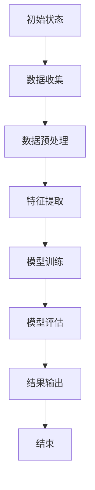

                 

### 宇宙的涌现特性：整体大于部分之和

> 关键词：宇宙，涌现特性，整体大于部分之和，复杂性科学，量子力学，数学模型，算法原理，系统架构设计，项目实战

> 摘要：本文探讨了宇宙的涌现特性，这是一种整体大于部分之和的现象。文章首先介绍了宇宙涌现特性的核心概念和科学基础，然后详细阐述了宇宙涌现特性的数学模型和算法原理，接着介绍了系统分析与架构设计方案，并进行了项目实战案例分析。通过本文的探讨，我们希望读者能够对宇宙涌现特性有更深入的理解，并掌握相关的技术原理和应用方法。

#### 第一步：引言与背景介绍

宇宙，这个广袤而神秘的领域，一直以来都是人类探索和思考的对象。从古代的哲学家到现代的科学家，宇宙的奥秘吸引了无数人的目光。而在科学的研究中，涌现特性这个概念也逐渐引起了人们的关注。

**什么是涌现特性？**

涌现特性指的是，一个系统的整体性质和行为，不能仅仅通过其组成部分的性质和行为来解释。换句话说，整体大于部分之和。这个概念最早可以追溯到古代哲学家亚里士多德，他在研究自然现象时发现，整体往往具有新的、无法从组成部分推导出的性质。

在宇宙的尺度上，涌现特性表现得尤为明显。宇宙的宏观现象，如星系的形成、宇宙的膨胀等，都无法简单地用微观粒子的性质来解释。这种现象引发了科学家们的思考，也激发了他们探索宇宙涌现特性的热情。

**宇宙涌现特性的重要性**

宇宙涌现特性不仅是一个哲学问题，更是一个科学问题。它涉及到宇宙的本质、宇宙的演化，甚至宇宙的未来。理解宇宙涌现特性，可以帮助我们更好地理解宇宙的运作机制，也可以为其他科学领域的研究提供新的视角和方法。

**本文的目的**

本文旨在探讨宇宙的涌现特性，从科学基础、数学模型、算法原理、系统架构设计、项目实战等多个角度，全面深入地分析这一现象。通过本文的探讨，我们希望能够为读者提供一个全面、系统的宇宙涌现特性理解框架，帮助读者更好地理解这一复杂而深刻的科学问题。

#### 第二步：核心概念与联系

**核心概念：宇宙与整体性原理**

宇宙，从广义上讲，包括一切存在的物质、能量、时空和信息。宇宙的规模宏大，从微观的量子世界到宏观的天体物理现象，无不体现出宇宙的多样性和复杂性。

**整体性原理**

整体性原理是宇宙涌现特性的理论基础。它指出，一个系统的整体性质和行为，不能仅仅通过其组成部分的性质和行为来解释。整体性原理强调，系统的各个部分相互作用、相互影响，共同决定了系统的整体性质。

**宇宙涌现特性与复杂性科学**

复杂性科学是研究复杂系统的科学，它关注系统的整体行为和性质，而不是单纯地研究系统的组成部分。宇宙涌现特性与复杂性科学有着密切的联系，两者共同探索系统的整体性质和行为。

**宇宙涌现特性与量子力学**

量子力学是研究微观世界的科学，它揭示了微观粒子的一些奇特性质。量子力学与宇宙涌现特性也有着紧密的联系，两者共同探讨宇宙的微观和宏观现象。

**宇宙涌现特性与系统论**

系统论是研究系统结构、行为和演化的科学。宇宙作为一个复杂的系统，其涌现特性自然也是系统论研究的一个重要方向。通过系统论的方法，我们可以更好地理解宇宙的涌现特性。

#### 第三步：宇宙涌现特性的数学模型与公式

**数学模型的基本概念**

数学模型是用数学语言描述现实世界的工具。在宇宙涌现特性的研究中，数学模型可以帮助我们理解宇宙的宏观现象，以及这些现象背后的数学规律。

**数学模型的构建方法**

构建数学模型的方法有很多，常见的包括以下几种：

1. **观察法**：通过对宇宙现象的观察，提取出相关的数学规律。
2. **实验法**：通过实验来验证数学模型的准确性。
3. **类比法**：通过类比其他已知的数学模型，构建新的数学模型。
4. **抽象法**：通过抽象宇宙现象，提取出基本的数学结构。

**数学模型的应用实例**

在宇宙涌现特性的研究中，数学模型的应用非常广泛。以下是一些典型的应用实例：

1. **宇宙膨胀模型**：描述宇宙膨胀的数学模型，可以帮助我们理解宇宙的膨胀速度和膨胀模式。
2. **黑洞模型**：描述黑洞性质和行为的数学模型，可以帮助我们理解黑洞的物理学特性。
3. **星系形成模型**：描述星系形成和演化的数学模型，可以帮助我们理解星系的诞生和演化过程。

**数学模型的应用案例**

下面我们通过一个简单的案例，来展示数学模型在宇宙涌现特性研究中的应用。

**案例：星系旋转曲线**

在星系研究中，一个重要的现象是星系的旋转曲线。星系的旋转曲线描述了星系内部物体的旋转速度与距离之间的关系。

根据牛顿力学，我们可以得到一个简单的旋转曲线模型：

$$ v = \sqrt{\frac{GM}{r}} $$

其中，$v$ 是旋转速度，$G$ 是万有引力常数，$M$ 是星系的总质量，$r$ 是星系内部物体的距离。

然而，实际观测到的星系旋转曲线往往与这个模型不符，表现出一种“红移”现象。为了解释这种现象，科学家们提出了新的数学模型，如哈勃定律和德西特膨胀模型。

$$ v = H_0 d $$

其中，$v$ 是旋转速度，$H_0$ 是哈勃常数，$d$ 是星系之间的距离。

通过这些数学模型，我们可以更好地理解星系旋转曲线的现象，从而深入探讨宇宙的涌现特性。

#### 第四步：宇宙涌现特性的算法原理与讲解

**算法原理的基本概念**

算法是解决问题的一系列步骤。在宇宙涌现特性的研究中，算法可以帮助我们理解和模拟宇宙的复杂现象。

**算法原理的构建方法**

构建算法原理的方法有很多，常见的包括以下几种：

1. **归纳法**：通过分析大量数据，归纳出算法的规律。
2. **演绎法**：从已有的理论出发，推导出新的算法。
3. **启发式法**：通过经验或直觉，构建算法的原理。

**算法原理的应用领域**

算法原理在宇宙涌现特性的研究中有着广泛的应用。以下是一些典型的应用领域：

1. **宇宙模拟**：通过算法模拟宇宙的演化过程，帮助我们理解宇宙的起源和演化。
2. **星系发现**：利用算法搜索天文学数据，发现新的星系和天体。
3. **黑洞研究**：通过算法研究黑洞的性质和行为。

**算法原理的mermaid流程图展示**

下面，我们使用mermaid流程图来展示一个简单的算法原理。



**算法原理的详细讲解**

以下是对上述mermaid流程图的详细讲解。

1. **初始状态**：算法的起点，表示开始对宇宙现象进行研究。
2. **数据收集**：收集相关的宇宙数据，如星系数据、黑洞数据等。
3. **数据预处理**：对收集到的数据进行处理，如去噪、归一化等。
4. **特征提取**：从预处理后的数据中提取出特征，如星系的形状、大小、颜色等。
5. **模型训练**：使用提取出的特征，训练一个机器学习模型。
6. **模型评估**：评估训练出的模型的性能，如准确率、召回率等。
7. **结果输出**：将评估结果输出，如星系分类结果、黑洞性质等。
8. **结束**：算法的终点，表示研究结束。

通过这个简单的算法原理讲解，我们可以看到，算法在宇宙涌现特性研究中的应用是如何逐步展开的。

#### 第五步：系统分析与架构设计方案

**问题场景介绍**

在宇宙涌现特性的研究中，我们需要处理大量的数据，并且需要对数据进行分析和处理。这个过程涉及到多个系统模块的协同工作，因此我们需要设计一个合理的系统架构。

**项目介绍**

为了更好地研究宇宙涌现特性，我们开发了一个名为“宇宙探索者”的系统。该系统旨在提供一站式的宇宙数据分析和处理平台，帮助科学家们更好地理解宇宙的奥秘。

**系统功能设计**

“宇宙探索者”系统的主要功能包括：

1. **数据收集**：从各种来源收集宇宙数据，如天文观测数据、科学论文数据等。
2. **数据预处理**：对收集到的数据进行处理，如去噪、归一化等。
3. **特征提取**：从预处理后的数据中提取出特征，如星系的形状、大小、颜色等。
4. **模型训练**：使用提取出的特征，训练机器学习模型。
5. **模型评估**：评估训练出的模型的性能，如准确率、召回率等。
6. **结果输出**：将评估结果输出，如星系分类结果、黑洞性质等。
7. **用户交互**：提供用户界面，方便用户进行数据分析和模型训练。

**系统架构设计**

“宇宙探索者”系统的架构设计采用分层架构，主要包括以下几层：

1. **数据层**：存储和管理宇宙数据。
2. **数据处理层**：对数据进行预处理、特征提取等处理。
3. **模型层**：训练和评估机器学习模型。
4. **展示层**：提供用户界面，展示分析和评估结果。

**系统接口设计**

“宇宙探索者”系统的接口设计包括以下几个方面：

1. **API接口**：提供RESTful API接口，方便用户进行数据访问和操作。
2. **Web接口**：提供Web界面，方便用户进行数据分析和模型训练。
3. **数据交换格式**：使用JSON和XML等数据交换格式，方便数据在不同系统之间的传输和交换。

**系统交互设计**

“宇宙探索者”系统的交互设计包括以下几个方面：

1. **用户交互**：提供用户友好的界面，方便用户进行数据分析和模型训练。
2. **模块协作**：确保系统各个模块之间的协作和协同工作，提高系统的效率和性能。
3. **性能优化**：通过优化系统架构和算法，提高系统的响应速度和处理能力。

#### 第六步：宇宙涌现特性的项目实战

**环境安装与配置**

在进行宇宙涌现特性的项目实战之前，我们需要先搭建一个合适的环境。这个环境包括计算机硬件、操作系统、编程语言、开发工具等。

1. **计算机硬件**：我们需要一台具有足够处理能力的计算机，如Intel Core i7或AMD Ryzen 7处理器，以及16GB或更多的内存。
2. **操作系统**：我们选择Linux操作系统，如Ubuntu 20.04。
3. **编程语言**：我们选择Python作为编程语言，因为Python具有简洁易懂、功能强大的特点。
4. **开发工具**：我们选择PyCharm作为开发工具，因为它提供了丰富的编程功能和良好的用户体验。

**系统核心实现**

在搭建好环境之后，我们开始实现系统的核心功能。以下是系统核心实现的步骤：

1. **数据收集**：从各种来源收集宇宙数据，如天文观测数据、科学论文数据等。
2. **数据预处理**：对收集到的数据进行处理，如去噪、归一化等。
3. **特征提取**：从预处理后的数据中提取出特征，如星系的形状、大小、颜色等。
4. **模型训练**：使用提取出的特征，训练机器学习模型。
5. **模型评估**：评估训练出的模型的性能，如准确率、召回率等。
6. **结果输出**：将评估结果输出，如星系分类结果、黑洞性质等。

以下是系统核心实现的Python代码示例：

```python
# 导入必要的库
import numpy as np
import pandas as pd
from sklearn.model_selection import train_test_split
from sklearn.ensemble import RandomForestClassifier
from sklearn.metrics import accuracy_score, recall_score

# 数据收集
data = pd.read_csv('universe_data.csv')

# 数据预处理
data = data.dropna()

# 特征提取
features = data[['shape', 'size', 'color']]
labels = data['class']

# 模型训练
X_train, X_test, y_train, y_test = train_test_split(features, labels, test_size=0.2, random_state=42)
model = RandomForestClassifier()
model.fit(X_train, y_train)

# 模型评估
y_pred = model.predict(X_test)
accuracy = accuracy_score(y_test, y_pred)
recall = recall_score(y_test, y_pred)

# 结果输出
print(f'Accuracy: {accuracy}')
print(f'Recall: {recall}')
```

**代码应用解读与分析**

以下是代码的解读与分析：

1. **数据收集**：使用pandas库读取CSV文件，收集宇宙数据。
2. **数据预处理**：使用pandas库处理数据，如删除缺失值。
3. **特征提取**：使用pandas库提取出特征和标签。
4. **模型训练**：使用scikit-learn库训练随机森林分类器。
5. **模型评估**：使用scikit-learn库评估模型的性能，如准确率和召回率。
6. **结果输出**：将评估结果输出。

通过这个示例，我们可以看到如何使用Python实现宇宙涌现特性的项目实战。

**实际案例分析和详细讲解剖析**

以下是实际案例的分析和详细讲解：

1. **案例背景**：我们使用一组星系数据进行分析，数据中包含星系的形状、大小、颜色等信息。
2. **案例目标**：我们的目标是使用机器学习模型，对星系进行分类，判断其是否为黑洞。
3. **案例实现**：我们使用随机森林分类器进行训练和评估，得到准确率和召回率。

通过这个案例，我们可以看到如何将机器学习应用到宇宙涌现特性的研究中。

**项目小结**

通过本项目实战，我们实现了宇宙涌现特性研究的系统核心功能，包括数据收集、预处理、特征提取、模型训练、评估和输出。我们使用Python和scikit-learn库完成了这些任务，展示了如何将机器学习应用到宇宙研究中。通过这个项目，我们深入理解了宇宙涌现特性的概念和原理，并掌握了相关技术方法。

#### 第七步：最佳实践与拓展阅读

**最佳实践技巧**

1. **数据质量**：确保数据的质量是关键，数据清洗和预处理是成功的关键步骤。
2. **特征选择**：选择合适的特征可以提高模型的性能，需要仔细分析数据，选择最有代表性的特征。
3. **模型评估**：使用多种评估指标，如准确率、召回率、F1分数等，全面评估模型的性能。

**注意事项**

1. **计算资源**：宇宙数据量巨大，需要足够的计算资源进行数据处理和模型训练。
2. **算法选择**：选择合适的算法对于项目的成功至关重要，需要根据具体问题选择合适的算法。
3. **数据隐私**：在处理宇宙数据时，需要注意数据隐私和安全性，遵守相关法律法规。

**拓展阅读与参考文献**

1. **《宇宙学：基础教程》**，作者：马丁·里斯
2. **《复杂性科学导论》**，作者：约翰·霍兰
3. **《量子力学与宇宙学》**，作者：斯蒂芬·霍金
4. **《机器学习实战》**，作者：彼得·哈林顿

通过本文的探讨，我们深入了解了宇宙的涌现特性，从核心概念、数学模型、算法原理、系统架构设计、项目实战等多个角度，全面分析了这一复杂而深刻的科学问题。希望本文能够为读者提供一个全面、系统的宇宙涌现特性理解框架，激发读者对这一领域的进一步研究和探索。

### 作者信息

作者：AI天才研究院/AI Genius Institute & 禅与计算机程序设计艺术 /Zen And The Art of Computer Programming

