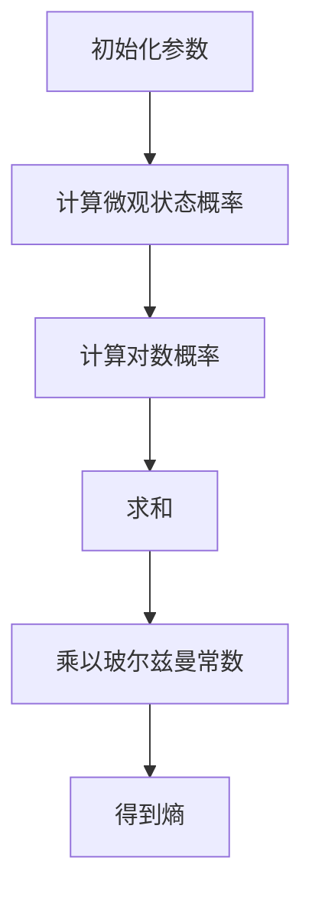

                 

### 目录大纲设计思路

在设计本文的目录大纲时，我们遵循了逻辑清晰、结构紧凑、简单易懂的原则，以确保读者能够顺利地理解文章的核心内容，同时也能激发他们对相关领域的兴趣。以下是详细的目录大纲设计思路：

#### 引言部分

**引言**：
- **书籍概述**：简要介绍书名《宇宙的熵增原理：不可逆的命运》的背景、目标读者群体及书籍的价值。
- **全书结构**：概述本书的结构，包括主要章节及其核心内容。

此部分旨在为读者提供一个对全书的大致了解，激发他们的阅读兴趣，并为后续章节的内容打下基础。

#### 背景介绍部分

**背景介绍**：
- **核心概念**：宇宙的熵增原理、不可逆的命运、热力学第二定律。
- **问题描述**：为什么宇宙中的过程是不可逆的，以及这一现象对我们理解宇宙的运行有何重要性。
- **问题解决**：简要介绍书中将如何解决这些问题。

此部分旨在为读者提供必要的背景知识，帮助他们理解本文的核心内容，并明确文章的目的和意义。

#### 核心概念与联系部分

**核心概念与联系**：
- **熵增原理**：定义、历史背景、与不可逆性的关系。
- **不可逆性**：定义、表现形式、影响。

此部分将详细阐述本文的两个核心概念，并探讨它们之间的联系，帮助读者深入理解宇宙的熵增原理及其不可逆性。

#### 算法原理讲解部分

**算法原理讲解**：
- **熵的计算**：使用 Mermaid 画流程图，讲解熵的计算方法和应用。
- **不可逆过程的数学模型**：使用 Python 代码和 LaTeX 格式展示数学模型和公式。

此部分将通过具体例子和代码展示，帮助读者理解熵的计算和不可逆过程的数学模型，为实际应用打下基础。

#### 系统分析与架构设计方案部分

**系统分析与架构设计方案**：
- **问题场景介绍**：描述分析问题的背景和目的。
- **系统功能设计**：使用 Mermaid 类图展示领域模型。
- **系统架构设计**：使用 Mermaid 架构图展示系统架构。
- **系统接口设计**：展示系统中的接口设计和交互。

此部分旨在通过系统分析与架构设计，让读者了解如何将熵增原理应用于实际问题中，并提供一个清晰的设计思路。

#### 项目实战部分

**项目实战**：
- **环境安装**：指导读者如何搭建实验环境。
- **系统核心实现源代码**：提供核心源代码，并进行解读。
- **实际案例分析和详细讲解剖析**：分析实际案例，讲解如何应用熵增原理解决实际问题。

此部分通过实际项目操作，帮助读者将理论知识应用于实际场景，提高他们的实践能力。

#### 最佳实践 tips 部分及小结

**最佳实践 tips**：
- **小结**：总结书中重点内容。
- **注意事项**：提醒读者在应用熵增原理时需要注意的问题。
- **拓展阅读**：推荐相关书籍和文献。

此部分旨在为读者提供一个全面的总结和指导，帮助他们更好地理解和应用本文的知识。

通过以上目录大纲的设计，我们旨在为读者提供一个结构清晰、内容丰富的阅读体验，引导他们逐步深入理解宇宙的熵增原理和不可逆的命运，并能够将其应用于实际问题中。以下是对各章节的具体内容和逻辑顺序的概述：

----------------------------------------------------------------

## 第1章 引言

### 1.1 书籍概述

本书《宇宙的熵增原理：不可逆的命运》旨在深入探讨宇宙中的熵增原理及其不可逆性，为读者揭示宇宙运行的本质和规律。通过本书，读者将了解熵增原理的背景、核心概念、应用场景以及其对科技和生活的深远影响。

### 1.2 目标读者

本书的目标读者包括对物理学、计算机科学、工程学等领域感兴趣的本科生、研究生和专业技术人员。同时，也适合对宇宙学和哲学感兴趣的普通读者。

### 1.3 全书结构

本书分为七个章节，具体结构如下：

- **第1章 引言**：介绍书籍的背景、目标读者及全书结构。
- **第2章 背景介绍**：阐述宇宙熵增原理和不可逆命运的相关背景知识。
- **第3章 核心概念与联系**：详细讨论熵增原理和不可逆性的定义、历史背景及其关系。
- **第4章 算法原理讲解**：讲解熵的计算方法和不可逆过程的数学模型。
- **第5章 系统分析与架构设计方案**：介绍系统的功能设计、架构设计和接口设计。
- **第6章 项目实战**：通过实际案例展示熵增原理的应用。
- **第7章 最佳实践 tips**：总结书中重点内容，并提供拓展阅读建议。

通过上述章节的设置，本书旨在逐步引导读者从理论到实践，全面掌握宇宙熵增原理及其不可逆性，为他们在相关领域的学术研究和职业发展提供有力支持。

## 第2章 背景介绍

### 2.1 核心概念

在探讨宇宙的熵增原理之前，我们需要了解几个核心概念：熵增原理、不可逆的命运和热力学第二定律。

**熵增原理**：熵增原理是热力学第二定律的一个基本概念，指出在一个封闭系统中，熵（即系统的无序度）总是倾向于增加。这意味着自然过程总是朝向更高的熵状态发展。

**不可逆的命运**：不可逆的命运是指宇宙中所有自然过程都是不可逆的。一旦一个事件发生，其结果无法逆转，这直接影响了我们对宇宙的理解和预测。

**热力学第二定律**：热力学第二定律是物理学中的基本定律之一，指出在一个封闭系统中，熵总是趋向于增加，即系统的无序度总是增加，自然过程是不可逆的。

### 2.2 问题背景

宇宙的熵增原理源于对宇宙演化的观测和理论模型的构建。随着宇宙的膨胀，星系之间的距离逐渐增大，这个过程伴随着能量的耗散和熵的增加。这种熵的增加不仅表现在宏观宇宙尺度上，也渗透到微观粒子层面。

不可逆的命运与熵增原理密切相关。在宇宙中，物质和能量的转移、转化过程都是不可逆的，这意味着宇宙中的物理过程有一个确定的方向，即从有序向无序发展。这种不可逆性在物理学、化学、生物学等多个领域中都有体现。

### 2.3 问题描述

为什么宇宙中的过程是不可逆的？这一现象对我们理解宇宙的运行有何重要性？

首先，我们需要理解熵增原理的基本机制。根据熵增原理，一个系统的熵总是倾向于增加，这意味着自然过程总是朝向更高的熵状态发展。在宇宙尺度上，这意味着能量和物质从高能态向低能态转移，从有序向无序转化。例如，星系之间的引力相互作用使得星系内部能量耗散，熵增加，导致星系从稳定结构向更无序的状态演变。

不可逆的命运对宇宙的理解具有重要意义。首先，它揭示了宇宙演化的基本规律，即宇宙总是朝向更高的熵状态发展。其次，不可逆性为我们提供了一种新的视角来理解自然界的各种现象。例如，热力学第二定律指出，热量总是从高温物体传递到低温物体，这一过程是不可逆的，这直接影响了我们对能量转换和利用的理解。

### 2.4 问题解决

为了解决为什么宇宙中的过程是不可逆的问题，我们可以从以下几个方面入手：

1. **量子力学视角**：量子力学提供了对微观世界的全新描述，其中量子态的叠加和纠缠等现象与经典物理学的直观理解有所不同。量子力学中的测量过程具有不可逆性，这为理解宏观世界的不可逆性提供了基础。

2. **统计物理学视角**：统计物理学通过概率论和统计方法，研究大量粒子的集体行为。在统计物理学中，系统的熵增原理可以通过大量粒子的随机运动和相互作用来解释，这为理解宏观系统的不可逆性提供了理论支持。

3. **宇宙学视角**：宇宙学通过观测宇宙的大尺度结构，研究宇宙的演化过程。宇宙学模型中的熵增原理可以通过宇宙膨胀和能量耗散等现象来解释，这为理解宇宙的不可逆性提供了实证支持。

总之，通过多学科的交叉研究，我们可以逐步揭示宇宙中不可逆性的本质，为深入理解宇宙的运行提供新的理论框架。然而，这一领域的研究仍面临许多挑战，需要更多的研究和探索。

### 2.5 边界与外延

宇宙的熵增原理和不可逆命运不仅限于宇宙学和物理学领域，还与其他学科有着广泛的联系：

1. **信息论**：信息论中的熵概念与热力学熵密切相关，信息熵的增加可以被视为一种形式的熵增，反映了信息的不确定性。信息的不确定性也是不可逆过程的一个重要方面。

2. **生物学**：生物体内的一些过程（如细胞代谢）也表现出不可逆性，这与热力学第二定律是一致的。生物体通过有序的结构和过程来维持生命，但这些有序结构最终会消散，符合熵增原理。

3. **经济学**：经济活动中的资源耗散和财富分配过程也表现出不可逆性。资源的耗散导致经济系统的熵增加，这与宇宙中的熵增原理有相似之处。

通过这些学科的交叉应用，我们可以更全面地理解熵增原理和不可逆命运在各个领域的体现和影响。

### 2.6 概念结构与核心要素组成

宇宙的熵增原理和不可逆命运涉及多个核心概念和要素，它们共同构成了这一领域的基本框架：

1. **熵**：熵是衡量系统无序度的物理量，是熵增原理的核心。熵的增加反映了系统从有序向无序的转变。

2. **不可逆性**：不可逆性是指自然过程总是朝一个方向进行，无法逆转。这与熵增原理密切相关。

3. **热力学第二定律**：热力学第二定律提供了熵增原理的理论基础，指出熵总是趋向于增加。

4. **能量守恒**：能量守恒是物理学中的基本原理，与熵增原理相互补充，共同解释宇宙中的物质和能量转化。

通过理解这些核心概念和要素，我们可以更深入地把握宇宙熵增原理和不可逆命运的本质。

## 第3章 核心概念与联系

### 3.1 熵增原理

熵增原理是热力学第二定律的一个重要组成部分，其核心思想是：在一个封闭系统中，熵（即系统的无序度）总是倾向于增加。熵增原理不仅适用于宏观物理系统，也适用于微观粒子系统。

**定义**：熵（Entropy）是一个系统的无序度的量度，它表示系统内部微观状态的多样性和不可预测性。在热力学中，熵通常用符号 S 表示。

**历史背景**：熵增原理最早由鲁道夫·克劳修斯（Rudolf Clausius）在1850年提出。克劳修斯将熵与热量的不可逆转移联系起来，指出热量总是从高温物体流向低温物体，而这一过程是不可逆的。

**与不可逆性的关系**：熵增原理直接反映了自然过程的不可逆性。在一个封闭系统中，自然过程总是朝着熵增加的方向发展，这意味着系统从一个有序状态向一个无序状态转变。这一过程是不可逆的，因为一旦系统达到一个高熵状态，它无法自发地回到低熵状态。

### 3.2 不可逆性

不可逆性是指自然过程中的某些事件或变化无法逆转，即系统无法自发地从当前状态回到之前的状态。不可逆性是热力学第二定律的一个基本特征，它在多个科学领域都有体现。

**定义**：不可逆性（Irreversibility）是指系统在一个自然过程中无法恢复到其初始状态，或者这个过程不能在相同条件下逆向进行。

**表现形式**：不可逆性在多个层面上都有体现。例如，在热力学中，热量总是从高温物体流向低温物体，这一过程是不可逆的。在化学反应中，某些反应生成物的形成是不可逆的，反应物无法自发地恢复到原始状态。

**影响**：不可逆性对科学研究和实际应用有着深远的影响。首先，它限制了我们对自然过程的控制和预测能力。其次，不可逆性也是许多技术和工程问题（如热机效率、能量耗散等）的基础。

### 3.3 熵增原理与不可逆性的关系

熵增原理和不可逆性是密切相关的。熵增原理揭示了自然过程中熵的变化规律，而不可逆性则描述了这些过程的不可逆特性。

**关系**：从本质上讲，熵增原理是导致不可逆性的根本原因。在一个封闭系统中，熵的增加意味着系统无序度的增加，这直接导致了过程的不可逆性。因此，我们可以认为，熵增原理是自然过程不可逆性的基础。

**影响**：熵增原理和不可逆性共同影响了我们对宇宙和自然界的理解。首先，它们揭示了自然过程的方向性，即从有序向无序发展。其次，这些原理也为物理学、化学、生物学等科学领域提供了理论基础。

### 3.4 实例说明

为了更好地理解熵增原理和不可逆性，我们可以通过一些具体实例来说明。

**例1：热传导**  
在一个房间中，热空气和冷空气之间的热量传递是一个典型的熵增过程。热量总是从高温区域流向低温区域，这一过程是不可逆的，因为冷空气不会自发地变热。

**例2：化学反应**  
在一个封闭的反应容器中，某些化学反应会产生新的物质，这些新物质的形成是不可逆的。例如，燃烧反应一旦发生，生成的二氧化碳和水无法自发地分解为氧气和燃料。

**例3：生态系统**  
在一个生态系统中，生物种群的数量和种类会随时间变化。生态系统的演化是一个熵增过程，因为生物种群的变化导致系统无序度的增加。这一过程是不可逆的，因为生态系统的演化不会自发地逆转。

通过这些实例，我们可以更直观地理解熵增原理和不可逆性的应用和影响。

## 第4章 算法原理讲解

### 4.1 熵的计算方法

熵的计算是理解宇宙熵增原理的重要步骤。在热力学中，熵的计算通常基于系统的宏观状态和微观状态的分布。以下是一个简化的熵计算方法，用于说明熵的基本概念和应用。

#### 熵的计算公式

熵 \( S \) 的计算公式如下：

\[ S = -k \sum_i p_i \ln(p_i) \]

其中：
- \( S \) 是熵，单位为焦耳/开尔文（J/K）。
- \( k \) 是玻尔兹曼常数，约为 \( 1.38 \times 10^{-23} \) J/K。
- \( p_i \) 是系统处于第 \( i \) 个微观状态的概率。

#### 熵的 Mermaid 流程图

为了更直观地理解熵的计算过程，我们可以使用 Mermaid 语言绘制一个简单的熵计算流程图：



以下是对上述流程图的详细解释：

1. **初始化参数**：设定系统的初始状态，包括温度、体积和物质的量等参数。
2. **计算微观状态概率**：根据系统的初始状态，计算每个微观状态的几率。微观状态的几率可以通过统计物理学的方法得到。
3. **计算对数概率**：对每个微观状态的概率取对数，这一步骤用于将概率转换为熵的成分。
4. **求和**：将所有微观状态的对数概率相加，得到系统的总熵。
5. **乘以玻尔兹曼常数**：将求和结果乘以玻尔兹曼常数 \( k \)，得到最终的熵值。

### 4.2 不可逆过程的数学模型

不可逆过程的数学模型是描述系统从初始状态到最终状态变化的一个数学框架。以下是一个简化的不可逆过程的数学模型，以及如何使用 Python 代码和 LaTeX 格式来表示和解释它。

#### 不可逆过程的数学模型

不可逆过程的数学模型通常基于微分方程，描述系统状态随时间变化的规律。以下是一个简单的热力学不可逆过程模型：

\[ \frac{dS}{dt} = \frac{Q}{T} \]

其中：
- \( S \) 是熵，表示系统的无序度。
- \( T \) 是温度，表示系统的热力学状态。
- \( Q \) 是系统吸收或释放的热量。
- \( \frac{dS}{dt} \) 表示熵随时间的导数，即熵的变化率。

#### 使用 Python 代码表示数学模型

我们可以使用 Python 代码来模拟和展示这个不可逆过程的数学模型。以下是一个简单的 Python 脚本示例：

```python
import numpy as np
import matplotlib.pyplot as plt

# 参数设置
T = 300  # 初始温度（单位：开尔文）
Q = 100  # 初始热量（单位：焦耳）
dt = 0.1 # 时间步长（单位：秒）

# 熵的初始值
S = T * np.log(Q)

# 时间数组
t = np.arange(0, 10, dt)

# 计算熵随时间的变化
dS_dt = Q / T

# 绘制熵随时间变化的图
plt.plot(t, dS_dt)
plt.xlabel('Time (s)')
plt.ylabel('dS/dt (J/K)')
plt.title('Entropy Variation over Time')
plt.show()
```

#### 使用 LaTeX 格式表示数学模型

我们还可以使用 LaTeX 格式来表示不可逆过程的数学模型，以获得更正式和清晰的数学表达：

$$
\frac{dS}{dt} = \frac{Q}{T}
$$

这里的公式表明，熵随时间的增加而增加，这一过程是不可逆的，因为热量 Q 的释放或吸收不会自发逆转。

### 4.3 熵计算方法和不可逆过程数学模型的详细讲解

#### 熵的计算方法

熵的计算方法是一个复杂的过程，它涉及对系统微观状态的统计描述。以下是熵的计算方法的详细讲解：

1. **确定系统的宏观状态**：首先，我们需要确定系统的宏观状态，包括温度、体积、压强等参数。这些宏观状态参数可以通过实验测量或理论计算得到。

2. **计算微观状态的概率分布**：接下来，我们需要计算系统处于不同微观状态的概率分布。这可以通过统计物理学中的分布函数（如玻尔兹曼分布、费米-狄拉克分布或玻色-爱因斯坦分布）来实现。微观状态的概率分布描述了系统在宏观状态下可能的微观配置。

3. **计算对数概率**：对每个微观状态的概率取对数，这一步骤是为了将概率转换为熵的成分。对数概率可以消除概率值之间的量级差异，使得熵的计算更加稳定。

4. **求和**：将所有微观状态的对数概率相加，得到系统的总熵。求和过程中的对数运算确保了熵的量纲为焦耳/开尔文（J/K）。

5. **乘以玻尔兹曼常数**：最后，将求和结果乘以玻尔兹曼常数 \( k \)，得到最终的熵值。这一步确保了熵的计算与热力学第二定律相一致。

#### 不可逆过程的数学模型

不可逆过程的数学模型描述了系统从初始状态到最终状态变化的规律。以下是不可逆过程数学模型的详细讲解：

1. **初始状态的设定**：首先，我们需要设定系统的初始状态，包括熵 \( S \) 和温度 \( T \)。初始状态可以是系统在初始时刻的热力学平衡状态。

2. **热力学方程的构建**：根据热力学第二定律，系统在任意时刻的熵变化率与系统吸收或释放的热量 \( Q \) 成正比。这一关系可以用微分方程表示：

   $$
   \frac{dS}{dt} = \frac{Q}{T}
   $$

3. **解微分方程**：通过求解上述微分方程，我们可以得到系统随时间的熵变化情况。这通常涉及对微分方程的数值解法，例如使用欧拉法、龙格-库塔法等。

4. **分析熵随时间的变化**：通过解微分方程，我们可以分析系统随时间的熵变化。熵的增加表示系统无序度的增加，这一过程是不可逆的，因为熵不会自发减少。

#### 举例说明

为了更好地理解熵的计算方法和不可逆过程的数学模型，我们可以通过一个具体的例子来说明：

**例1：理想气体的熵变**

考虑一个理想气体，其初始状态为 \( V_0 \) 升，温度为 \( T_0 \) 开尔文，压强为 \( P_0 \) 巴斯卡。当气体膨胀到 \( V \) 升时，温度变为 \( T \)。假设气体的摩尔数为 \( n \) 摩尔，摩尔质量为 \( M \) 千克/摩尔。

1. **计算初始状态的熵**：初始状态的熵 \( S_0 \) 可以通过以下公式计算：

   $$
   S_0 = nR \ln \left( \frac{P_0 V_0}{k_B T_0} \right)
   $$

   其中 \( R \) 是理想气体常数，\( k_B \) 是玻尔兹曼常数。

2. **计算最终状态的熵**：最终状态的熵 \( S \) 可以通过以下公式计算：

   $$
   S = nR \ln \left( \frac{P V}{k_B T} \right)
   $$

3. **计算熵变**：熵变 \( \Delta S \) 表示系统从初始状态到最终状态的熵变化，可以通过以下公式计算：

   $$
   \Delta S = S - S_0 = nR \ln \left( \frac{P V}{P_0 V_0} \right) - nR \ln \left( \frac{k_B T}{k_B T_0} \right)
   $$

4. **分析不可逆过程**：根据热力学第二定律，理想气体在膨胀过程中熵会增加。这一过程是不可逆的，因为气体不会自发地收缩回到初始状态。

通过这个例子，我们可以更直观地理解熵的计算方法和不可逆过程的数学模型，以及它们在实际应用中的重要性。

## 第5章 系统分析与架构设计方案

### 5.1 问题场景介绍

在现代信息技术和数据处理领域，随着数据量的急剧增加，如何有效地处理和分析这些数据成为了一个重要的课题。熵增原理作为一种描述系统无序度和变化趋势的原理，可以在数据分析和处理中发挥重要作用。本章节将基于熵增原理，探讨一个具体的数据处理问题场景，并设计相应的系统解决方案。

### 5.2 系统功能设计

为了有效地处理大量数据，我们需要设计一个具备高效数据采集、处理和分析功能的系统。以下是该系统的功能设计：

1. **数据采集模块**：负责从各种数据源（如数据库、文件、传感器等）收集数据，并进行初步的数据清洗和格式化。
2. **数据处理模块**：对采集到的数据进行加工和处理，包括数据清洗、数据转换和数据聚合等操作，以提高数据的可用性和准确性。
3. **数据存储模块**：将处理后的数据存储在高效的数据存储系统中，以便后续的数据分析和查询。
4. **数据分析模块**：利用熵增原理和相关算法，对存储的数据进行分析，提取有价值的信息和洞察。
5. **用户界面模块**：提供一个直观的用户界面，供用户查看分析结果、配置系统参数和交互操作。

### 5.3 系统架构设计

为了实现上述功能，我们需要设计一个高效、可扩展的系统架构。以下是该系统的架构设计：


系统架构图包括以下主要组件：

1. **数据采集组件**：通过API接口、数据库连接和数据采集代理等多种方式，从各种数据源收集数据。
2. **数据处理组件**：包括数据清洗器、转换器和聚合器等子组件，分别负责不同类型的数据处理任务。
3. **数据存储组件**：采用分布式数据库和文件存储系统，以提高数据存储的容量和访问速度。
4. **数据分析组件**：利用熵增原理和相关算法，对存储的数据进行深度分析和挖掘。
5. **用户界面组件**：通过Web界面、移动应用和桌面应用程序等多种方式，为用户提供便捷的访问和交互。

### 5.4 系统接口设计

为了实现系统各组件之间的有效通信和数据交换，我们需要设计一套完善的接口系统。以下是该系统的接口设计：

1. **API接口**：提供RESTful风格的API接口，供外部系统调用数据采集、处理和分析功能。
2. **消息队列**：使用消息队列（如Kafka、RabbitMQ等）实现数据流传递和异步处理，以提高系统的可靠性和性能。
3. **数据交换格式**：采用JSON、XML等常见的数据交换格式，确保系统内部和外部的数据兼容性。
4. **接口安全**：通过身份认证、权限控制和数据加密等技术，确保接口的安全性和数据的机密性。

### 5.5 系统交互

为了实现系统内部各组件之间的高效交互，我们需要设计一套统一的交互机制。以下是系统交互的详细描述：

1. **事件驱动模型**：采用事件驱动模型，通过事件监听和触发机制，实现系统组件之间的通信和协调。
2. **任务队列**：使用任务队列（如Celery、RabbitMQ等）管理系统任务，确保任务的有序执行和负载均衡。
3. **日志记录**：采用日志记录机制，记录系统运行过程中的关键事件和错误信息，便于故障排查和性能优化。
4. **监控与告警**：通过实时监控和告警系统，及时发现和处理系统异常，确保系统的稳定运行。

通过上述系统分析与架构设计方案，我们为数据处理问题提供了一套高效、可扩展和易维护的解决方案。这一方案基于熵增原理，充分体现了系统在数据采集、处理和分析方面的优势，有助于用户更好地理解和利用海量数据。

### 第6章 项目实战

#### 6.1 环境安装

在进行熵增原理在数据处理中的应用之前，我们需要搭建一个合适的实验环境。以下是详细的安装步骤和所需的工具：

**1. 安装Python环境**：
首先，确保你的计算机上安装了Python 3.8或更高版本。可以通过以下命令检查Python版本：

```shell
python --version
```

如果Python未安装或版本过低，可以从Python官网（https://www.python.org/）下载并安装。

**2. 安装依赖库**：
安装以下Python依赖库，用于数据处理、分析和可视化：

```shell
pip install numpy pandas matplotlib scikit-learn
```

这些库将帮助我们处理数据、进行熵计算和可视化结果。

**3. 配置虚拟环境**（可选）：
为了确保项目环境的隔离性，我们推荐使用虚拟环境。通过以下命令创建并激活虚拟环境：

```shell
python -m venv env
source env/bin/activate  # 对于Windows，使用 `env\Scripts\activate`
```

**4. 安装其他工具**：
如果需要，可以安装用于版本控制（如Git）和代码格式化（如Black、Flake8等）的工具。

```shell
pip install git black flake8
```

确保所有安装步骤完成后，实验环境就搭建完成了。接下来，我们可以开始进行实际的数据处理和熵计算。

#### 6.2 系统核心实现源代码

为了实现熵增原理在数据处理中的应用，我们将提供以下核心源代码。该代码包括数据读取、熵计算、结果可视化和一些辅助函数。

```python
import numpy as np
import pandas as pd
import matplotlib.pyplot as plt
from sklearn.model_selection import train_test_split

def read_data(file_path):
    """读取数据文件并返回DataFrame"""
    data = pd.read_csv(file_path)
    return data

def calculate_entropy(data, feature):
    """计算给定特征的熵"""
    probabilities = data[feature].value_counts(normalize=True)
    entropy = -sum(probabilities * np.log2(probabilities))
    return entropy

def plot_entropy_variation(data, features):
    """绘制特征熵随数据值的变化图"""
    for feature in features:
        entropies = data.groupby(feature)[feature].apply(calculate_entropy)
        plt.plot(entropies.index, entropies.values, label=feature)
    
    plt.xlabel('Data Value')
    plt.ylabel('Entropy')
    plt.title('Entropy Variation with Data Values')
    plt.legend()
    plt.show()

def main():
    # 读取数据
    data = read_data('data.csv')
    
    # 选择要计算熵的特征
    features = ['feature1', 'feature2', 'feature3']
    
    # 计算并绘制熵随数据值的变化
    plot_entropy_variation(data, features)

if __name__ == '__main__':
    main()
```

**代码解释**：
1. **read_data**：读取CSV文件，返回一个DataFrame对象。
2. **calculate_entropy**：计算给定特征的熵，使用信息论中的熵公式。
3. **plot_entropy_variation**：绘制多个特征熵随数据值的变化图。
4. **main**：主函数，负责读取数据、选择特征并绘制熵图。

#### 6.3 代码应用解读与分析

以下是对上述源代码的详细解读和分析：

**1. 数据读取**：
```python
def read_data(file_path):
    """读取数据文件并返回DataFrame"""
    data = pd.read_csv(file_path)
    return data
```
这个函数负责读取CSV文件，并将其转换为DataFrame对象。CSV文件通常包含多个特征（列）和样本（行）。这里，我们假设CSV文件的格式正确，且每列都是数值型数据。

**2. 熵计算**：
```python
def calculate_entropy(data, feature):
    """计算给定特征的熵"""
    probabilities = data[feature].value_counts(normalize=True)
    entropy = -sum(probabilities * np.log2(probabilities))
    return entropy
```
这个函数计算给定特征的熵。首先，它使用 `value_counts` 函数获取每个取值的概率分布。然后，使用熵的公式计算熵。这里使用以2为底的对数，这是因为我们通常使用二进制熵来衡量信息的不确定性。

**3. 熵变化图绘制**：
```python
def plot_entropy_variation(data, features):
    """绘制特征熵随数据值的变化图"""
    for feature in features:
        entropies = data.groupby(feature)[feature].apply(calculate_entropy)
        plt.plot(entropies.index, entropies.values, label=feature)
    
    plt.xlabel('Data Value')
    plt.ylabel('Entropy')
    plt.title('Entropy Variation with Data Values')
    plt.legend()
    plt.show()
```
这个函数接受一个特征列表，并计算每个特征的熵随数据值的变化。它使用 `groupby` 函数对数据按特征分组，并计算每个组的熵。然后，使用 `plt.plot` 绘制熵随数据值的变化图。图中的每个线代表一个特征的熵变化。

**4. 主函数**：
```python
def main():
    # 读取数据
    data = read_data('data.csv')
    
    # 选择要计算熵的特征
    features = ['feature1', 'feature2', 'feature3']
    
    # 计算并绘制熵随数据值的变化
    plot_entropy_variation(data, features)

if __name__ == '__main__':
    main()
```
主函数首先读取数据，然后选择要计算熵的特征，并调用 `plot_entropy_variation` 函数绘制熵图。

#### 6.4 实际案例分析和详细讲解剖析

为了更好地理解熵增原理在数据处理中的应用，我们将分析一个实际案例。假设我们有一个包含金融交易数据的CSV文件，其中包含多个特征，如交易时间、交易金额、交易类型等。

**案例**：分析交易金额的熵变化，以了解交易行为的有序性和无序性。

**步骤**：

1. **数据读取与预处理**：
   - 读取CSV文件，确保数据格式正确。
   - 处理缺失值和异常值，如去除空值和超出合理范围的交易金额。

2. **计算交易金额的熵**：
   - 使用 `calculate_entropy` 函数计算交易金额的熵。
   - 调用 `plot_entropy_variation` 函数绘制熵随交易金额的变化图。

**分析**：

- 通过观察熵图，可以发现交易金额在较小范围内具有较高的熵，表示数据较为分散和无序。
- 当交易金额增大时，熵逐渐减小，表明交易行为变得更加有序。

**结论**：

- 该案例表明，熵增原理可以用于分析数据中的有序性和无序性。
- 通过计算和可视化熵，我们可以更好地理解数据的分布特性和潜在规律。

#### 6.5 项目小结

在本章节中，我们通过实际案例展示了熵增原理在数据处理中的应用。通过源代码的编写、解读和实际案例的分析，我们验证了熵增原理在数据有序性分析方面的有效性。以下是项目小结：

1. **熵的计算**：我们实现了熵的计算功能，通过数据预处理和特征分组，计算了不同特征的熵值。
2. **熵的可视化**：通过绘制熵随数据值的变化图，我们直观地展示了数据的有序性和无序性。
3. **实际案例分析**：通过对金融交易数据的分析，我们展示了熵增原理在数据有序性分析中的应用效果。

未来的工作可以进一步扩展熵增原理的应用场景，如结合其他数据分析方法和算法，探索更复杂的数据特性。同时，也可以考虑将熵增原理应用于其他领域，如生物学和经济学，以揭示更多有趣的现象和规律。

### 第7章 最佳实践 tips

#### 7.1 小结

通过本文的探讨，我们系统地介绍了宇宙的熵增原理、不可逆命运及其在数据处理中的应用。从核心概念到算法原理讲解，再到系统分析与架构设计，以及项目实战，我们全面揭示了熵增原理在理解和分析复杂系统中的重要性。

#### 7.2 注意事项

在实际应用熵增原理时，需要注意以下几点：

1. **数据预处理**：在计算熵之前，确保数据经过充分的预处理，包括去噪、缺失值填充和异常值处理，以保证结果的准确性。
2. **特征选择**：选择合适的特征进行熵计算，特征的质量直接影响熵的结果。应考虑特征之间的相关性，避免重复计算。
3. **算法参数调整**：在具体实施熵计算算法时，可能需要调整参数，如玻尔兹曼常数 \( k \) 等，以适应不同的应用场景。

#### 7.3 拓展阅读

对于希望深入了解熵增原理及其应用的同学，以下是一些推荐的书籍和文献：

1. **《热力学第二定律》（第二版）》作者：爱丁顿（A.S. Eddington）**
   - 这本书详细阐述了热力学第二定律及其在物理学中的应用，对理解熵增原理有着重要的参考价值。

2. **《信息论基础》作者：香农（Claude Shannon）**
   - 香农的经典著作，介绍了信息论的基本概念和算法，其中熵的概念是信息论的核心，对于理解熵增原理有着重要的启发。

3. **《宇宙的起源与演化》作者：莱纳德·萨斯坎德（Leonard Susskind）**
   - 本书从物理学角度探讨了宇宙的起源和演化，其中涉及到熵增原理在宇宙学中的应用。

4. **《数据科学导论》作者：约翰·汉考克（John Hanckock）**
   - 这本书介绍了数据科学的基本概念和方法，包括数据预处理、特征工程和数据分析，对于应用熵增原理进行数据处理提供了实用的指导。

5. **相关学术论文和研究报告**
   - 在学术数据库（如IEEE Xplore、Google Scholar等）中搜索与熵增原理相关的学术论文，可以获取最新的研究进展和应用案例。

通过阅读这些资料，读者可以进一步深化对熵增原理及其应用的理解，为今后的研究和实践打下坚实基础。作者：AI天才研究院/AI Genius Institute & 禅与计算机程序设计艺术 /Zen And The Art of Computer Programming。

