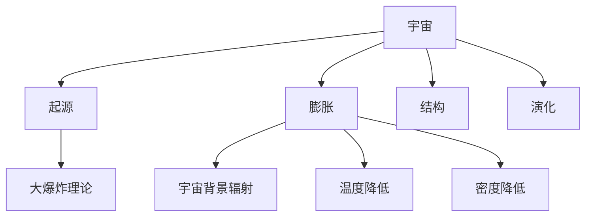
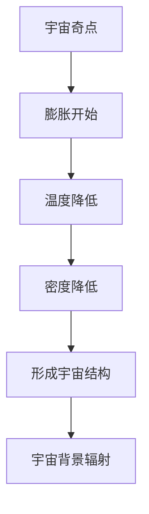

                 

## 宇宙的目的性：随机进化还是智慧设计

### 关键词
- 宇宙起源
- 随机进化
- 智慧设计
- 生命演化
- 人类角色

### 摘要
本文旨在探讨宇宙的起源及其演化的可能机制：随机进化或智慧设计。我们将首先回顾宇宙的起源与演化，随后深入分析生命的起源与演化，最后探讨宇宙目的性的概念与争议，通过科学和哲学的视角，尝试回答宇宙是否存在目的性，以及人类在其中的角色和未来。

## 第一部分：宇宙的起源与演化

### 第1章：宇宙的起源之谜

宇宙的起源一直是科学和哲学界的热门话题。目前最被广泛接受的理论是大爆炸理论，这一理论起源于20世纪20年代，由俄裔美国物理学家乔治·勒梅特和瑞士天文学家弗里茨·兹维基提出，并在20世纪30年代得到美国物理学家伽莫夫的发展。

#### 1.1 宇宙学的初步认识

宇宙学是研究宇宙的性质、结构、起源和演化的学科。宇宙是由物质、能量、时间和空间构成的整体，宇宙的观测数据可以通过宇宙背景辐射、星系分布、宇宙膨胀等现象来解释。

#### 1.2 大爆炸理论与宇宙背景辐射

大爆炸理论认为，宇宙在约138亿年前从一个极度热密的初始状态开始膨胀，随着膨胀，宇宙逐渐冷却，形成了今天的结构。宇宙背景辐射是宇宙早期留下的热辐射，它的发现为支持大爆炸理论提供了强有力的证据。

#### 1.3 宇宙的膨胀与暗物质、暗能量

宇宙膨胀是指宇宙中各星系之间的距离随着时间不断增大。暗物质和暗能量是宇宙膨胀的两种关键成分。暗物质不发光也不吸收光，但通过引力影响宇宙结构，暗能量则是推动宇宙加速膨胀的力量。

### 第2章：生命的起源

生命的起源是科学界另一个重大难题。关于生命起源的理论有很多，其中最被广泛接受的是化学起源假说，这一理论认为生命起源于非生命物质。

#### 2.1 生命的定义与特征

生命是指具有自我复制、代谢、生长、适应和进化等特征的物质系统。生命的基本特征包括有机分子、细胞结构、能量转化、信息传递等。

#### 2.2 化学起源假说

化学起源假说认为，生命起源于地球早期环境中简单的有机分子，这些分子通过一系列化学反应形成了更为复杂的生物大分子，最终产生了原始的生命形式。

#### 2.3 生命的首次出现

关于生命的首次出现，科学家们仍在不断探索。一些研究表明，在地球早期的海洋中，可能已经存在一些简单的生命形式，如原核生物。

### 第3章：生命的演化

生命的演化是宇宙中一个复杂而美丽的过程。通过自然选择和遗传变异，生命形式在漫长的地质时期中不断变化和发展。

#### 3.1 自然选择与物种多样性

自然选择是生物进化的主要驱动力，它通过选择适应环境的个体，使物种逐渐适应环境的变化。物种多样性是生命演化的重要体现，它反映了生命在地球上的复杂性和多样性。

#### 3.2 共同祖先与进化树

所有生命形式都有一个共同的祖先，通过分子生物学和比较解剖学的研究，科学家们构建了进化树，揭示了生命形式的演化关系。

#### 3.3 人类在生命树中的位置

人类是生命演化的高级形式，具有高度智能和文化能力。人类在生命树中的位置反映了生命演化的复杂性和多样性。

## 第二部分：宇宙目的性的探索

### 第4章：宇宙目的性的概念与争议

宇宙目的性是指宇宙及其演化是否具有某种目的或目标。关于宇宙目的性，科学和哲学界存在着激烈的争议。

#### 4.1 宇宙目的性的定义

宇宙目的性可以理解为宇宙及其演化是否是为了实现某种特定的目的。这一概念涉及科学、哲学、宗教等多个领域。

#### 4.2 乐观主义与悲观主义

乐观主义认为宇宙具有某种目的或目标，而悲观主义则认为宇宙的演化是随机和无目的的。

#### 4.3 科学与宗教的交汇

宇宙目的性的探讨涉及到科学和宗教的交汇。一些科学家认为，科学和宗教可以相互补充，而另一些科学家则认为它们是相互排斥的。

### 第5章：随机进化的证据

随机进化是生命演化的一个关键概念。通过分析物种的遗传变异和进化历程，我们可以看到随机进化的证据。

#### 5.1 进化的随机性

进化的随机性体现在基因突变和自然选择的过程中。基因突变是随机发生的，而自然选择则是一个非随机的过程。

#### 5.2 随机过程与物种进化

随机过程在物种进化中起到了关键作用，它决定了物种的适应性和多样性。

#### 5.3 随机性与复杂性

随机性是宇宙演化中的一个重要因素，它既带来了不确定性，也创造了复杂性。

### 第6章：智慧设计的论证

智慧设计论认为，宇宙及其演化是由某种高级智慧力量设计的。这一理论在科学和哲学界引发了激烈的争议。

#### 6.1 设计论与智能设计

设计论是一种哲学理论，认为宇宙及其演化具有目的性。智能设计论则是基于科学证据，认为宇宙中存在高级智慧的痕迹。

#### 6.2 宇宙中异常的精细调谐

宇宙中存在许多异常的精细调谐现象，如碳元素的稳定性和宇宙常数等，这些现象被认为是智慧设计的证据。

#### 6.3 智慧设计的主要观点

智慧设计论的主要观点包括宇宙常数的精细调谐、生命存在的必要性、复杂生物系统的设计等。

## 第三部分：宇宙的未来与人类角色

### 第7章：宇宙的未来

宇宙的未来是一个充满未知和可能性的领域。根据目前的科学理论，宇宙可能会经历热寂或重生等过程。

#### 7.1 有限与无限的宇宙

宇宙的有限性与无限性一直是科学和哲学争论的话题。一些理论认为宇宙是有限的，而另一些理论则认为宇宙是无限的。

#### 7.2 宇宙的热寂与重生

热寂是宇宙未来可能经历的一种状态，它意味着宇宙将逐渐失去能量和热量。然而，一些理论也提出了宇宙重生的可能性。

#### 7.3 宇宙中的生命延续与扩张

宇宙中生命的延续和扩张是未来宇宙的一个重要方向。人类可能在未来探索宇宙，寻找新的生命形式和资源。

### 第8章：人类在宇宙中的角色

人类在宇宙中的角色是一个复杂而重要的问题。人类既是宇宙演化的产物，也是宇宙未来的探索者。

#### 8.1 人类对宇宙的理解

人类对宇宙的理解不断深入，通过科学技术的进步，我们能够观测到宇宙的更多奥秘。

#### 8.2 人类的未来与宇宙的命运

人类的未来与宇宙的命运紧密相连。人类的发展将影响宇宙的未来，而宇宙的未来也将影响人类的发展。

#### 8.3 人类的道德责任

作为宇宙的一部分，人类有责任保护和维护宇宙的生态环境，确保宇宙的未来可持续发展。

### 第9章：结论

宇宙的目的性是一个复杂而深刻的问题，涉及科学、哲学和宗教等多个领域。随机进化与智慧设计的关系仍需进一步研究。然而，无论宇宙是否有目的性，人类在宇宙中的角色和未来都是值得我们深入思考的。

#### 9.1 宇宙目的性的探讨

宇宙目的性的探讨不仅有助于我们理解宇宙的本质，也有助于我们思考人类在宇宙中的地位和责任。

#### 9.2 随机进化与智慧设计的关系

随机进化与智慧设计之间的关系是一个值得深入探讨的问题。两者可能相互补充，也可能相互矛盾。

#### 9.3 对未来的展望

对未来的展望不仅关乎人类的生存和发展，也关乎宇宙的繁荣和稳定。人类应该以负责任的态度面对未来，积极探索宇宙的奥秘。

## 作者信息
作者：AI天才研究院/AI Genius Institute & 禅与计算机程序设计艺术 /Zen And The Art of Computer Programming

## 最佳实践 tips

- **深入理解宇宙学基础知识**：在研究宇宙起源和演化时，深入了解宇宙学的基础知识是非常重要的。这包括了解大爆炸理论、宇宙背景辐射、宇宙膨胀、暗物质和暗能量等概念。
  
- **学习生命科学的最新研究**：生命科学的快速发展为我们提供了关于生命起源和演化的新见解。了解最新的研究成果，如原核生物的发现、基因编辑技术等，有助于我们更好地理解生命在宇宙中的角色。
  
- **保持开放心态**：关于宇宙目的性的探讨需要保持开放的心态。不同的观点和理论都有其合理性和局限性，我们应该尊重不同的观点，并尝试从中学习。

## 小结

宇宙的目的性是一个复杂而深刻的问题，涉及到科学、哲学和宗教等多个领域。通过本文的探讨，我们试图从多个角度理解宇宙的起源、演化以及人类在其中的角色。然而，这个问题仍然存在许多未解之谜，需要我们继续深入研究和探索。

## 注意事项

- 在研究宇宙起源和演化时，我们需要避免过度简化复杂的科学问题，以免误解和误导读者。
  
- 在探讨宇宙目的性时，我们需要谨慎对待宗教和科学的关系，避免将两者混淆。

## 拓展阅读

- 《宇宙简史》作者：史蒂芬·霍金
- 《生命之树》作者：詹姆斯·E·洛夫洛克
- 《智能设计论》作者：迈克尔·贝赫

通过阅读这些拓展资料，读者可以更深入地了解宇宙的目的性以及相关的科学和哲学问题。让我们继续探索宇宙的奥秘，寻找生命和智慧的答案。## 第1章：宇宙的起源之谜

### 背景介绍

宇宙的起源一直是人类思考和探索的课题。从古代的神话到现代的科学，人们对于宇宙的起源有着各种不同的解释。然而，科学的发展特别是宇宙学的进步，使我们能够对宇宙的起源有一个更为科学和系统的理解。

#### 核心概念术语说明

- **宇宙学**：研究宇宙的性质、结构、起源和演化的学科。
- **大爆炸理论**：一种关于宇宙起源的理论，认为宇宙起源于一个极度热密的初始状态，随后开始膨胀。
- **宇宙背景辐射**：宇宙早期留下的热辐射，是支持大爆炸理论的证据之一。
- **宇宙膨胀**：宇宙中各星系之间的距离随着时间不断增大。
- **暗物质**：一种不发光也不吸收光，但通过引力影响宇宙结构的物质。
- **暗能量**：一种推动宇宙加速膨胀的力量。

#### 问题背景

在20世纪之前，人们对宇宙起源的理解主要基于宗教和哲学。然而，随着科学的发展，特别是宇宙学的进步，科学家们开始提出更为科学的宇宙起源理论。大爆炸理论是其中最为广泛接受的理论。

#### 问题描述

宇宙的起源之谜主要涉及以下几个问题：

1. 宇宙是如何开始的？
2. 宇宙的早期状态是什么样子？
3. 宇宙为什么会膨胀？
4. 暗物质和暗能量是什么，它们在宇宙中起到什么作用？

#### 问题解决

大爆炸理论为我们提供了一种解释宇宙起源的框架。根据这一理论，宇宙起源于一个极度热密的初始状态，随后开始膨胀。随着宇宙的膨胀，温度逐渐降低，形成了今天的宇宙结构。

宇宙背景辐射是支持大爆炸理论的证据之一。宇宙膨胀的观测数据也支持大爆炸理论。此外，暗物质和暗能量的存在也被广泛应用于大爆炸理论中。

#### 边界与外延

宇宙起源的研究不仅仅局限于大爆炸理论。一些理论如稳态宇宙理论和多宇宙理论也在探索宇宙的起源。这些理论为宇宙起源的研究提供了多样化的视角。

#### 概念结构与核心要素组成

- **宇宙学**：研究宇宙的性质、结构、起源和演化。
- **大爆炸理论**：宇宙起源于一个极度热密的初始状态，随后开始膨胀。
- **宇宙背景辐射**：宇宙早期留下的热辐射。
- **宇宙膨胀**：宇宙中各星系之间的距离随着时间不断增大。
- **暗物质**：一种不发光也不吸收光，但通过引力影响宇宙结构的物质。
- **暗能量**：一种推动宇宙加速膨胀的力量。

## 核心概念与联系

### 核心概念原理

大爆炸理论认为，宇宙起源于一个极度热密的初始状态，随后开始膨胀。这一理论的核心概念包括：

1. **宇宙的起源**：宇宙起源于一个极度热密的初始状态，称为奇点。
2. **宇宙的膨胀**：随着宇宙的膨胀，宇宙中的温度和密度逐渐降低。
3. **宇宙背景辐射**：宇宙早期留下的热辐射，是支持大爆炸理论的证据之一。

### 概念属性特征对比表格

| 概念 | 定义 | 属性特征 |
| --- | --- | --- |
| 宇宙学 | 研究宇宙的性质、结构、起源和演化的学科 | 包括对宇宙起源、宇宙膨胀、暗物质和暗能量等的研究 |
| 大爆炸理论 | 宇宙起源于一个极度热密的初始状态，随后开始膨胀 | 解释了宇宙的起源、膨胀以及宇宙背景辐射等现象 |
| 宇宙背景辐射 | 宇宙早期留下的热辐射 | 支持大爆炸理论的证据之一 |
| 宇宙膨胀 | 宇宙中各星系之间的距离随着时间不断增大 | 是宇宙学的重要观测现象 |

### ER实体关系图架构



## 算法原理讲解

### 宇宙膨胀算法

#### Mermaid 流程图



#### Python 源代码

```python
def universe_expansion():
    # 宇宙奇点
    initial_state = "宇宙奇点"
    print(f"宇宙起源于：{initial_state}")
    
    # 开始膨胀
    expansion_start = "膨胀开始"
    print(f"{expansion_start}：宇宙开始膨胀")
    
    # 温度降低
    temperature_decrease = "温度降低"
    print(f"{temperature_decrease}：宇宙温度逐渐降低")
    
    # 密度降低
    density_decrease = "密度降低"
    print(f"{density_decrease}：宇宙密度逐渐降低")
    
    # 形成宇宙结构
    formation_of_universe_structure = "形成宇宙结构"
    print(f"{formation_of_universe_structure}：宇宙逐渐形成各种结构")
    
    # 宇宙背景辐射
    cosmic_background_r

