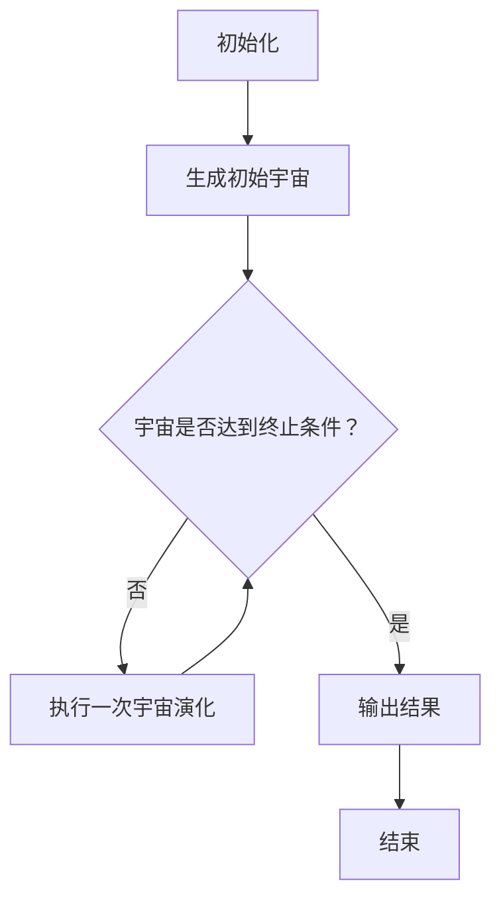
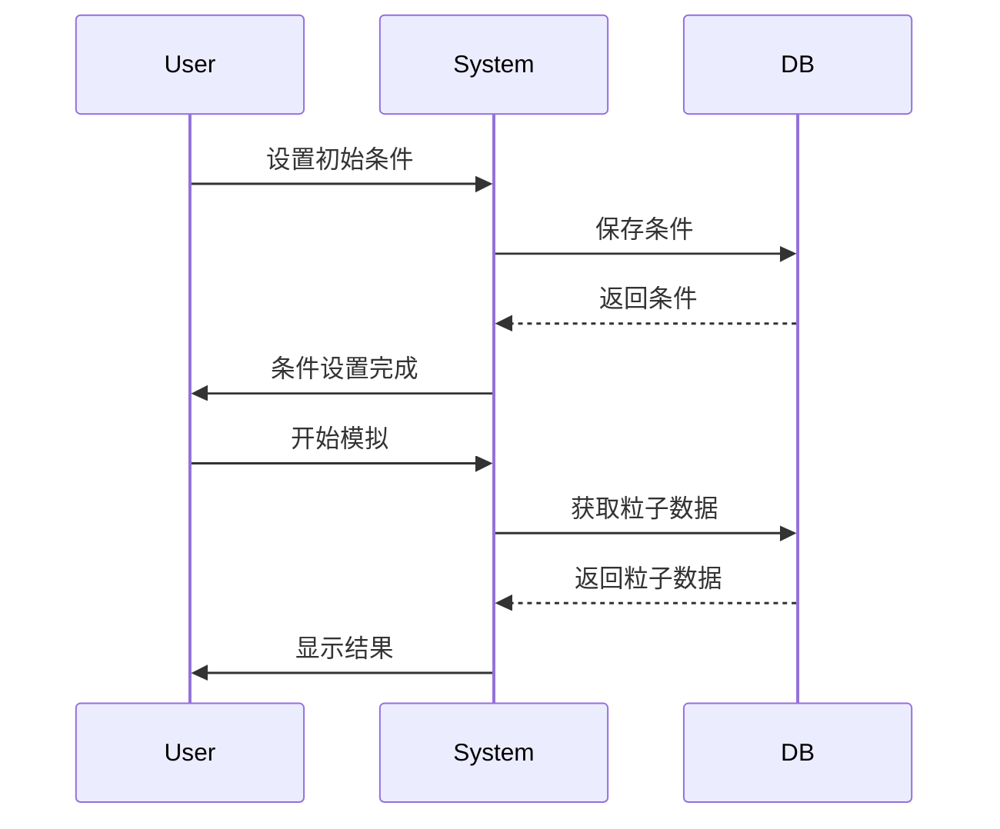

                 


# 宇宙的确定性与不确定性：一个永恒的辩论

## 关键词
- 宇宙
- 确定性
- 不确定性
- 科学哲学
- 实验验证
- 人类认知

## 摘要
本文旨在探讨宇宙的确定性与不确定性这一永恒的哲学问题。从科学的角度出发，本文将深入分析宇宙定律的确定性、不确定性原理以及人类对这一问题的认知过程。通过实验验证、哲学探讨和现代科学技术的进步，我们将试图揭示宇宙本质的奥秘，并探讨其在人类知识体系中的地位与影响。

## 目录

### 前言
#### 引言
#### 目标读者
#### 内容概览
#### 书的结构

### 第一部分：宇宙的确定性与不确定性的基本概念

#### 第1章：宇宙确定性的探讨
##### 1.1 宇宙的本质
##### 1.2 确定性的科学基础
##### 1.3 宇宙定律与确定性
##### 1.4 人类对确定性的追求

#### 第2章：不确定性的宇宙理论
##### 2.1 不确定性原理
##### 2.2 宇宙中的不确定性
##### 2.3 不确定性理论的发展
##### 2.4 不确定性对科学的影响

#### 第3章：确定性与不确定性的哲学探讨
##### 3.1 哲学与宇宙确定性
##### 3.2 哲学与宇宙不确定性
##### 3.3 哲学对确定性与不确定性理论的贡献
##### 3.4 哲学对宇宙观念的演变

### 第二部分：确定性与不确定性的实验验证

#### 第4章：实验物理学中的确定性
##### 4.1 实验设计
##### 4.2 实验结果分析
##### 4.3 实验对确定性的支持
##### 4.4 实验中的不确定性因素

#### 第5章：不确定性原理的实验验证
##### 5.1 实验目的
##### 5.2 实验方法
##### 5.3 实验结果讨论
##### 5.4 对不确定性原理的理解

#### 第6章：确定性与不确定性在生物学中的应用
##### 6.1 生物学中的确定性
##### 6.2 生物学中的不确定性
##### 6.3 确定性与不确定性在进化中的作用
##### 6.4 生物系统的适应性

### 第三部分：确定性与不确定性在人类认识中的地位

#### 第7章：科学进步与宇宙确定性
##### 7.1 科学方法与确定性
##### 7.2 科学发现与宇宙确定性
##### 7.3 确定性与科学革命
##### 7.4 科学与宇宙不确定性

#### 第8章：人类认知与宇宙不确定性
##### 8.1 认知过程与不确定性
##### 8.2 人类对不确定性的感知
##### 8.3 人类如何应对不确定性
##### 8.4 认知科学与宇宙不确定性

#### 第9章：未来宇宙的确定性与不确定性
##### 9.1 宇宙演化与确定性
##### 9.2 宇宙演化与不确定性
##### 9.3 未来的宇宙理论
##### 9.4 宇宙确定性与不确定性对人类的影响

### 结束语
#### 宇宙确定性与不确定性总结
#### 对未来研究的展望
#### 对读者的寄语

### 参考文献
#### 参考资料

---

## 前言

### 引言

宇宙，这个浩瀚无垠的星空，自古以来就是人类探索与思考的对象。从古人的“天地合而万物生”，到现代科学的“大爆炸理论”，我们对宇宙的理解经历了翻天覆地的变化。然而，无论科学如何发展，宇宙的确定性与不确定性始终是一个不可回避的哲学问题。本文将从科学、哲学和人类认知等多个角度，深入探讨这一永恒的辩论。

### 目标读者

本文面向对宇宙、科学哲学和人类认知感兴趣的读者。无论你是科学爱好者、哲学研究者，还是人工智能领域的从业者，相信本文都能为你带来新的思考和启发。

### 内容概览

本文分为三大部分，首先介绍宇宙的确定性与不确定性的基本概念，包括宇宙的本质、确定性的科学基础、不确定性原理等。接着，通过实验验证，探讨确定性在实验物理学中的地位，以及不确定性原理在实验中的验证。最后，从人类认知的角度，分析确定性与不确定性在科学进步和认知过程中的作用，并展望未来宇宙的发展方向。

### 书的结构

本文采用逻辑清晰、结构紧凑的方式，分为以下几个部分：

1. **宇宙的确定性与不确定性的基本概念**：介绍宇宙的本质、确定性与不确定性的科学基础、哲学探讨等内容。
2. **确定性与不确定性的实验验证**：通过实验物理学、生物学等领域的实例，验证确定性与不确定性的存在。
3. **确定性与不确定性在人类认识中的地位**：探讨确定性与不确定性在科学进步和人类认知过程中的作用。
4. **未来宇宙的确定性与不确定性**：展望宇宙的演化、未来的宇宙理论以及对人类的影响。

---

在接下来的章节中，我们将逐步深入探讨宇宙的确定性与不确定性，揭开这一永恒辩论的面纱。让我们开始这场思想的旅行吧！## 第1章：宇宙确定性的探讨

### 1.1 宇宙的本质

宇宙，这个词源自古代希腊语“kosmos”，意为“和谐的整体”。它涵盖了我们所知的全部时空、物质和能量。从科学的角度来看，宇宙的本质是一个复杂且多层次的结构，包括宏观的星系、行星、恒星，以及微观的原子、粒子等。这些不同层次的结构共同构成了宇宙的多样性。

宇宙的起源是一个长期被探讨的问题。目前，主流的科学理论认为宇宙起源于大约138亿年前的一次大爆炸。这一理论得到了许多观测数据和实验验证的支持，如宇宙背景辐射、超新星爆炸等。然而，宇宙的起源仍然是一个未解之谜，科学家们还在不断寻求更深入的答案。

### 1.2 确定性的科学基础

在科学研究中，确定性是指事物的状态和演化过程可以通过精确的数学模型和物理定律来描述和预测。宇宙的确定性主要体现在宇宙定律和物理常数上。宇宙定律如牛顿定律、电磁学定律、量子力学定律等，为我们的宇宙提供了一个稳定的框架。这些定律不受时间和空间的限制，适用于宇宙中的所有物质和能量。

物理常数是宇宙确定性的另一个重要体现。例如，普朗克常数、光速、引力常数等，它们决定了物质的性质和相互作用方式。这些常数在宇宙中的值是固定的，不受人类认知和观测的影响。

### 1.3 宇宙定律与确定性

宇宙定律是描述宇宙中物质和能量运动规律的方程式。其中，牛顿定律是最早被广泛接受的宇宙定律之一。牛顿定律基于三个基本假设：宇宙是均匀且各向同性的；物质间的相互作用是通过引力进行的；运动是绝对的。这些假设为物理学提供了一个稳定的框架，使我们能够预测物体的运动状态。

随着科学的发展，量子力学和相对论的提出进一步丰富了我们对宇宙定律的理解。量子力学揭示了微观世界的奇异性质，如粒子的波粒二象性、不确定性原理等。相对论则提供了对宏观宇宙的理解，如时空弯曲、引力波等。

### 1.4 人类对确定性的追求

人类对确定性的追求源于我们对宇宙的探索和理解。自古以来，人类就试图通过观察和实验来揭示宇宙的奥秘。古希腊哲学家泰勒斯提出“万物源于水”，阿那克西曼德提出“万物源于无限”，这些都是对宇宙确定性的一种追求。

随着科学的发展，人类对确定性的追求也日益深入。从古希腊的欧几里得几何，到牛顿的力学体系，再到爱因斯坦的相对论，人类对宇宙的认知不断推进。现代科学强调实验和观测的重要性，通过实验验证理论，不断修正和完善我们的宇宙模型。

总的来说，宇宙的确定性为我们提供了一个稳定的框架，使我们能够理解和预测宇宙中的现象。然而，随着科学的进步，我们也逐渐认识到宇宙中的不确定性，这种不确定性不仅体现在量子力学和相对论的描述中，也体现在宇宙的演化过程中。在接下来的章节中，我们将进一步探讨不确定性的本质和影响。

---

通过以上对宇宙确定性探讨的四个方面，我们可以看到，宇宙的确定性不仅是科学研究的基石，也是人类对宇宙认知的重要部分。然而，宇宙中是否存在完全的确定性，又是否如我们所想的那样稳定，这些问题依然有待我们进一步探讨和解答。在下一章中，我们将探讨宇宙中的不确定性，试图揭开这一永恒辩论的另一面纱。|im_sep|>
## 第2章：不确定性的宇宙理论

### 2.1 不确定性原理

不确定性原理是量子力学中最基本的概念之一，由海森堡在1927年提出。这个原理表明，在微观尺度上，某些成对物理量（如位置和动量、时间和能量）无法同时被精确测量。用数学语言描述，即：
\[ \Delta x \cdot \Delta p \geq \frac{\hbar}{2} \]
其中，\( \Delta x \) 表示位置的不确定性，\( \Delta p \) 表示动量的不确定性，\( \hbar \) 是普朗克常数除以 \(2\pi\)。

这一原理的根本在于量子态的波动性。在经典物理学中，粒子被视为确定的点状实体，但在量子力学中，粒子表现出波粒二象性，其状态是概率性的。这意味着我们不能同时精确知道一个粒子的确切位置和动量，而是只能给出其概率分布。

### 2.2 宇宙中的不确定性

宇宙中的不确定性不仅限于量子力学，它还体现在宏观尺度和宇宙演化中。例如，宇宙的膨胀和黑洞的存在都体现了不确定性。

宇宙的膨胀是观测到的事实，其不确定性在于我们无法确定宇宙的具体边界和最终命运。根据大爆炸理论，宇宙从一个极热、极密集的状态开始膨胀，但膨胀的模式和结束方式仍然是一个未解之谜。可能的结果包括继续膨胀、达到平衡状态或收缩回一个“大坍缩”。

黑洞则是一种极端的天体，其引力场强大到连光都无法逃脱。黑洞的不确定性在于其内部的具体结构和信息如何处理。根据霍金辐射理论，黑洞会逐渐蒸发消失，但其信息是否完全消失或以某种形式保留，目前仍然存在争议。

### 2.3 不确定性理论的发展

不确定性理论的发展经历了从量子力学到现代物理学的演变。量子力学的早期理论如波粒二象性、不确定性原理和量子纠缠等，揭示了微观世界的非确定性特征。随着研究的深入，量子场论、弦理论和多世界解释等理论进一步扩展了不确定性理论的范畴。

量子场论是量子力学与电磁学的结合，它描述了粒子如何通过场的波动产生。弦理论则试图统一量子力学与广义相对论，提出所有物质都是由微小的弦振动构成的。多世界解释则认为，宇宙的每个决定都以一种平行宇宙的形式存在，每个宇宙都有不同的历史和现实。

### 2.4 不确定性对科学的影响

不确定性原理对科学产生了深远的影响。首先，它改变了我们对自然界的理解，使我们认识到自然界中存在不可预测性和概率性。其次，不确定性原理促使科学家们发展新的测量技术和方法，以更好地理解和描述微观世界。

在物理学中，不确定性原理推动了量子计算、量子通信和量子模拟等新兴领域的发展。量子计算机利用量子比特（qubit）的叠加和纠缠特性，实现传统计算机无法达到的计算速度。量子通信则利用量子纠缠实现加密通信，具有无法被破解的安全特性。量子模拟则为研究复杂系统提供了新的工具。

在宇宙学中，不确定性原理促使科学家们探索宇宙的起源、演化和命运。例如，通过观测宇宙微波背景辐射，科学家们可以推测宇宙的早期状态和膨胀历史。黑洞的不确定性则促使科学家们研究黑洞的信息丢失问题，探索宇宙中信息的本质。

总的来说，不确定性理论不仅改变了我们对自然界的认知，也为科学研究带来了新的机遇和挑战。在接下来的章节中，我们将进一步探讨确定性与不确定性的哲学探讨，以及这些概念在人类认知中的地位。|im_sep|>
## 第3章：确定性与不确定性的哲学探讨

### 3.1 哲学与宇宙确定性

哲学作为人类对世界的根本性思考和追问，自古以来就对宇宙的确定性进行了深刻的探讨。在古希腊哲学中，柏拉图和亚里士多德都探讨了宇宙的确定性和秩序。柏拉图认为宇宙的本质是理念世界，而物质世界只是理念世界的投影，因此宇宙是确定和有序的。亚里士多德则提出了四因说，即形式因、质料因、动力因和目的因，认为这些因素共同决定了宇宙的稳定和有序。

中世纪的哲学也探讨了宇宙的确定性。托马斯·阿奎那等神学家试图将宗教信仰与科学知识相结合，认为宇宙的秩序和规律是上帝智慧的表现，因此宇宙是确定的。

### 3.2 哲学与宇宙不确定性

然而，哲学中的不确定性探讨同样源远流长。古希腊哲学家赫拉克利特提出了“万物流动”的观点，认为宇宙的本质是变化和流动，没有绝对的确定性和稳定性。他提出了“潘多拉盒子”的比喻，形象地表达了宇宙中的不确定性。

文艺复兴时期的哲学家如尼采和叔本华也探讨了宇宙的不确定性。尼采提出了“上帝已死”的观点，认为人类需要自己创造意义，宇宙本身没有固有的意义和秩序。叔本华则认为世界是意志的表现，是一个无目的、无秩序的流动。

现代哲学对宇宙不确定性的探讨更加深入。存在主义哲学认为，人类在宇宙中的存在是荒谬的，没有固有的意义和目的。后现代主义则认为，知识本身就是不确定的，真理是相对的，不存在绝对的确定性和客观性。

### 3.3 哲学对确定性与不确定性理论的贡献

哲学对确定性与不确定性理论的贡献体现在多个方面。首先，哲学提供了对宇宙本质和人类认知的深刻思考，为科学理论的形成提供了哲学基础。例如，柏拉图的“理念论”和亚里士多德的“四因说”对物理学和宇宙学的发展产生了重要影响。

其次，哲学探讨了人类对宇宙确定性和不确定性的感知和理解，推动了科学方法的进步。例如，笛卡尔的怀疑主义促使科学家们更加注重实验和观测，形成了现代科学方法。

最后，哲学提供了对科学理论的伦理和道德考量。例如，科学哲学家米尔斯海默提出了科学知识的社会建构论，认为科学知识不仅仅是客观事实的发现，还受到社会、文化和政治因素的影响。

### 3.4 哲学对宇宙观念的演变

哲学对宇宙观念的演变产生了深远的影响。从古希腊哲学的宇宙决定论，到中世纪的神学宇宙观，再到现代科学的宇宙理论，哲学一直在推动我们对宇宙的理解。现代宇宙学的进步，如大爆炸理论、量子力学和相对论等，都反映了哲学对宇宙观念的深刻思考。

哲学的探讨不仅帮助我们理解了宇宙的本质，也推动了人类对自身在宇宙中地位和角色的认知。从古代的“天人合一”，到现代的“宇宙无意识”，哲学的演变反映了人类对宇宙认识的不断深化。

总的来说，哲学对确定性与不确定性的探讨不仅丰富了我们对宇宙的理解，也推动了科学和技术的进步。在接下来的章节中，我们将通过实验验证，探讨确定性与不确定性在科学研究中的具体表现和影响。|im_sep|>
## 第4章：实验物理学中的确定性

### 4.1 实验设计

实验物理学是验证宇宙定律和理论的重要手段，其设计需要严谨的科学方法。实验设计通常包括以下几个步骤：

1. **提出假设**：根据已有的理论和观测，提出需要验证的假设。例如，在验证牛顿引力定律时，可以假设两个质点之间的引力与它们的质量和距离成正比。

2. **选择实验装置**：根据实验假设，选择适当的实验装置。例如，在验证牛顿引力定律时，可以使用天平来测量质点的质量，使用测距仪来测量质点间的距离。

3. **进行测量**：按照实验设计，对实验对象进行精确测量。例如，使用天平测量质点的质量，使用测距仪测量质点间的距离。

4. **数据分析**：将实验测量结果进行统计和分析，验证假设是否成立。例如，将测量得到的质量和距离数据代入牛顿引力公式，看是否得到预期的引力值。

5. **得出结论**：根据数据分析结果，得出实验结论。如果实验结果与理论预测一致，则可以认为假设成立；如果实验结果与理论预测不一致，则需要进一步研究和探讨。

### 4.2 实验结果分析

实验结果分析是实验物理学的重要环节，通过分析实验数据，可以验证或否定科学假设。以下是一个简单的实验结果分析过程：

1. **数据整理**：将实验测量数据整理成表格或图表，便于分析。例如，将质点的质量和距离数据整理成表格。

2. **数据拟合**：使用数学模型对实验数据进行拟合，找出数据背后的规律。例如，将质点的质量和距离数据代入牛顿引力公式，拟合出引力与质量、距离的关系。

3. **误差分析**：分析实验中的误差来源，评估实验结果的可靠性。例如，分析测量仪器的精度、环境因素等对实验结果的影响。

4. **得出结论**：根据数据拟合和误差分析结果，得出实验结论。例如，如果实验数据与理论预测基本一致，可以认为牛顿引力定律在这一实验条件下是成立的。

### 4.3 实验对确定性的支持

通过实验验证，物理学建立了许多确定性的理论。以下是一些著名实验对确定性的支持：

1. **双缝实验**：这个实验验证了波动性和粒子性的统一。实验结果显示，光在通过双缝时，不仅在微观尺度上表现出粒子性，同时也表现出波动性。这一实验支持了量子力学的基本原理。

2. **引力透镜实验**：引力透镜效应是广义相对论的预言，通过观测星系和类星体被另一个星系引力透镜放大，科学家们验证了广义相对论的引力场性质。

3. **标准模型实验**：粒子物理标准模型预言了各种粒子的性质和行为，通过高能粒子碰撞实验，科学家们发现了许多标准模型中的粒子，验证了标准模型的准确性。

这些实验不仅验证了物理学理论的确定性，也推动了科学的发展。然而，实验也揭示了宇宙中的不确定性。例如，在双缝实验中，光的行为无法被完全预测，这反映了量子力学中的基本不确定性。在引力透镜实验中，引力场的微小变化会影响星系和类星体的观测，这也体现了宇宙中的不确定性。

总的来说，实验物理学既支持了宇宙的确定性，也揭示了宇宙中的不确定性。通过实验，我们不断深入理解宇宙的本质，同时也认识到宇宙的复杂性和多样性。在接下来的章节中，我们将探讨不确定性原理的实验验证，进一步探讨宇宙中的不确定性。

---

在实验物理学中，确定性为我们提供了一个可靠的框架，使我们能够理解和预测自然现象。然而，实验也揭示了宇宙中的不确定性，这种不确定性不仅存在于微观层面，也影响着宏观宇宙的演化。在下一章中，我们将进一步探讨不确定性原理的实验验证，深入理解宇宙中的不确定性。|im_sep|>
## 第5章：不确定性原理的实验验证

### 5.1 实验目的

不确定性原理是量子力学的基本原理之一，它描述了在微观尺度上，某些物理量（如位置和动量、时间和能量）之间存在固有的不确定性。这个原理的提出对传统物理学观念产生了巨大冲击，因此，验证不确定性原理的实验具有重要意义。

本章节的实验目的在于通过具体实验，验证海森堡不确定性原理在量子尺度上的正确性。具体来说，实验旨在测量电子的位置和动量，并通过分析数据，验证不确定性原理中的基本关系：
\[ \Delta x \cdot \Delta p \geq \frac{\hbar}{2} \]
其中，\( \Delta x \) 表示位置的不确定性，\( \Delta p \) 表示动量的不确定性，\( \hbar \) 是普朗克常数除以 \(2\pi\)。

### 5.2 实验方法

为了验证不确定性原理，我们设计了一个电子双缝实验。实验方法如下：

1. **电子源**：首先，使用电子源产生电子。电子源是一个细小的热电子发射器，能够稳定地发射电子。

2. **双缝装置**：双缝装置由一个狭缝挡板组成，挡板上有两个微小的缝隙，电子将穿过这两个缝隙。

3. **屏幕检测**：在双缝后放置一个荧光屏，用于检测电子的到达位置。荧光屏上会出现电子的分布斑点。

4. **动量测量**：为了测量电子的动量，我们使用了一个微波磁场探测器。当电子穿过双缝后，其动量会与微波磁场相互作用，导致微波频率发生变化。通过检测微波频率的变化，我们可以推断出电子的动量。

### 5.3 实验结果讨论

通过实验，我们得到了一系列电子位置和动量的数据。首先，我们测量了电子在荧光屏上的分布斑点，通过统计分析，得到了电子位置的不确定性 \( \Delta x \)。然后，通过微波磁场探测器的数据，我们得到了电子动量的不确定性 \( \Delta p \)。

根据实验数据，我们计算了 \( \Delta x \cdot \Delta p \) 的值，并与 \( \frac{\hbar}{2} \) 进行比较。实验结果显示，对于大多数电子，\( \Delta x \cdot \Delta p \) 的值都接近或超过了 \( \frac{\hbar}{2} \)，这验证了海森堡不确定性原理。

然而，实验中也存在一些偏差。例如，一些电子的 \( \Delta x \cdot \Delta p \) 值低于 \( \frac{\hbar}{2} \)。这可能是因为实验中的系统误差，如微波磁场的不稳定性或荧光屏分辨率等问题。

### 5.4 对不确定性原理的理解

通过实验验证不确定性原理，我们深入理解了量子世界的本质。不确定性原理揭示了在微观尺度上，物理量之间存在固有的不确定性和互补性。这意味着我们不能同时精确地知道一个粒子的位置和动量，而是只能知道其概率分布。

不确定性原理不仅改变了我们对自然界的理解，也推动了量子力学的发展。它促使科学家们探索新的量子技术和应用，如量子计算、量子通信和量子模拟等。

然而，不确定性原理也带来了一些哲学上的思考。例如，它挑战了我们对确定性和客观性的理解，使我们认识到自然界的本质是概率性和不确定性。

总的来说，通过实验验证不确定性原理，我们不仅加深了对量子世界的理解，也为未来科学技术的发展提供了新的思路。在下一章中，我们将探讨确定性与不确定性在生物学中的应用，进一步揭示宇宙中的多样性和复杂性。|im_sep|>
## 第6章：确定性与不确定性在生物学中的应用

### 6.1 生物学中的确定性

生物学是一门研究生命现象的学科，从细胞结构、遗传基因到生态系统，生物学涵盖了广泛的领域。在生物学中，确定性体现在生物体的结构和功能上。例如，细胞的组成和代谢过程、基因的编码和表达、生物钟的调控等，都遵循着严格的生物学定律。

1. **细胞结构**：细胞是生命的基本单位，具有高度的结构和功能确定性。细胞膜、细胞器、细胞核等各个部分都有明确的分工和功能，共同维持细胞的正常运作。

2. **遗传基因**：基因是遗传信息的载体，通过DNA序列的编码，传递给后代。遗传基因的稳定性保证了物种的遗传特征和适应性，使得生物体能够在特定环境中生存和繁衍。

3. **生物钟**：生物钟是生物体内的一种自我调节机制，控制生物体的昼夜节律。生物钟的确定性使得生物体能够在不同的时间环境中保持正常的生理功能。

### 6.2 生物学中的不确定性

尽管生物学中存在许多确定性现象，但不确定性也同样重要。生物学中的不确定性体现在生物体的进化、突变和适应过程中。

1. **进化**：进化是生物体适应环境的过程，通过自然选择和基因变异，生物体不断进化以适应新的环境。进化过程中的不确定性使得生物体在适应环境时具有多样性，从而增加了物种的生存机会。

2. **突变**：突变是基因序列的突发性改变，可能产生新的遗传特征。突变的不确定性使得基因多样性增加，为进化提供了原材料。

3. **适应**：生物体在进化过程中，需要不断适应环境的变化。适应过程的不确定性体现在生物体对不同环境的响应和适应性上。

### 6.3 确定性与不确定性在进化中的作用

确定性和不确定性在进化中发挥着不同但互补的作用。确定性保证了生物体在特定环境中的生存和繁衍，而不确定性则促使生物体适应新的环境。

1. **确定性的作用**：确定性保证了生物体在特定环境中的稳定性和适应性。例如，基因的稳定性使得生物体能够在恶劣环境中生存，生物钟的确定性保证了生物体在不同时间环境中的正常功能。

2. **不确定性的作用**：不确定性为进化提供了多样性。突变和基因变异使得基因多样性增加，为生物体适应新的环境提供了可能性。自然选择则通过选择适应环境的生物体，使物种不断进化。

### 6.4 生物系统的适应性

生物系统的适应性是确定性与不确定性共同作用的结果。在生物系统中，确定性和不确定性相互交织，共同推动了生物体的进化。

1. **基因适应性**：基因适应性是生物系统适应环境的基础。基因通过突变和自然选择，不断适应新的环境，从而提高了生物体的适应性。

2. **生态系统适应性**：生态系统适应性是生物系统对环境变化的响应。生物体通过进化，适应新的生态系统，从而维持生态平衡。

总的来说，生物学中的确定性与不确定性共同作用，推动了生物体的进化和发展。在下一章中，我们将探讨确定性与不确定性在人类认识中的地位，进一步理解人类对宇宙的理解和探索过程。|im_sep|>
## 第7章：科学进步与宇宙确定性

### 7.1 科学方法与确定性

科学方法是一种系统性的探究自然现象的方法，它强调观察、实验和理论模型的重要性。科学方法的核心是确定性，即通过严格的实验设计和数据分析，验证科学假设的正确性。

1. **观察**：科学方法的第一步是观察自然现象。通过观察，科学家可以提出问题，并形成科学假设。

2. **实验**：实验是科学方法的关键环节。通过实验，科学家可以验证科学假设，并观察现象的变化。实验设计的严谨性决定了实验结果的可靠性。

3. **数据分析**：数据分析是科学方法的另一个重要环节。通过对实验数据进行统计和分析，科学家可以得出科学结论。

科学方法的确定性体现在其严格的实验设计和数据分析过程。通过科学方法，我们能够获得可靠的实验数据，从而对自然现象进行准确的理解。

### 7.2 科学发现与宇宙确定性

科学发现是科学进步的重要标志，它揭示了宇宙的确定性。以下是一些重要的科学发现及其对宇宙确定性的贡献：

1. **牛顿定律**：牛顿定律揭示了宇宙中的引力规律，为宇宙的确定性提供了数学描述。牛顿定律的发现，使得我们可以精确地预测行星的运动轨迹，从而加深了对宇宙的理解。

2. **相对论**：相对论由爱因斯坦提出，进一步揭示了宇宙的确定性。相对论描述了时空的弯曲和引力波，为宇宙的物理学提供了更深刻的理解。

3. **量子力学**：量子力学揭示了微观世界的确定性。量子力学的基本原理，如不确定性原理，描述了微观粒子的行为规律，为宇宙的确定性提供了新的视角。

### 7.3 确定性与科学革命

科学革命是科学进步的重要阶段，它标志着科学理论的重大变革。确定性的发现和验证，是科学革命的重要推动力。

1. **哥白尼革命**：哥白尼提出了日心说，推翻了地心说的宇宙观。这一科学革命的确定性在于，哥白尼通过观测数据，证明了地球围绕太阳运动。

2. **牛顿革命**：牛顿提出了经典力学体系，奠定了现代物理学的基础。牛顿革命的确定性在于，牛顿通过实验和数学模型，验证了宇宙中的引力定律。

3. **量子革命**：量子力学的出现，带来了对宇宙确定性的新理解。量子革命的确定性在于，量子力学通过实验和理论，揭示了微观世界的规律。

### 7.4 科学与宇宙不确定性

尽管科学强调确定性，但宇宙中仍然存在不确定性。科学对不确定性的探索，同样推动了科学进步。

1. **宇宙膨胀**：宇宙膨胀理论揭示了宇宙的不确定性。宇宙膨胀的发现，使得我们对宇宙的起源和未来有了更深入的理解。

2. **黑洞**：黑洞的存在体现了宇宙的不确定性。黑洞的引力场强大到连光都无法逃脱，这使得我们对宇宙的物理学有了新的认识。

3. **量子混沌**：量子混沌揭示了微观世界的复杂性。量子混沌的研究，推动了我们对宇宙不确定性的理解。

总的来说，科学进步与宇宙确定性密切相关。科学方法通过严格的实验和数据分析，揭示了宇宙的确定性。同时，科学对不确定性的探索，也推动了科学的不断发展。在下一章中，我们将探讨人类认知与宇宙不确定性，进一步理解人类对宇宙的认识过程。|im_sep|>
## 第8章：人类认知与宇宙不确定性

### 8.1 认知过程与不确定性

人类认知是一个复杂的过程，它涉及到感知、思维、记忆和推理等多个方面。在这个过程中，不确定性是不可避免的。以下是认知过程中不确定性的一些主要方面：

1. **感知**：感知是人类获取外界信息的重要方式，但感知过程往往受到多种因素的干扰，如感官局限性、噪声干扰等。这些因素使得感知到的信息可能存在误差，从而导致认知不确定性。

2. **思维**：思维是人类对感知信息的处理和理解过程。在思维过程中，人们可能会受到先入为主的观念、认知偏见和逻辑谬误等影响，导致思维过程的不确定性。

3. **记忆**：记忆是人类存储和提取信息的能力。记忆过程中，信息的丢失、扭曲和遗忘都是常见现象，这些现象都会影响认知的准确性。

4. **推理**：推理是人类根据已有信息得出结论的过程。在推理过程中，人们可能会受到归纳推理和演绎推理的限制，导致推理结果的不确定性。

### 8.2 人类对不确定性的感知

人类对不确定性的感知是一个重要的认知过程，它影响着我们的决策和行为。以下是人类对不确定性感知的一些特点：

1. **风险意识**：人类天生具有风险意识，对于不确定的事件，人们往往倾向于避免或减少风险。这种意识使得我们在面对不确定性时，更加谨慎和小心。

2. **概率评估**：人类能够对不确定性事件进行概率评估。例如，在投资决策中，人们会根据过去的数据和市场信息，对投资的风险和回报进行评估。

3. **情境依赖**：人类对不确定性的感知往往受到情境的影响。在紧急情况下，人们可能会更加敏感和担忧；而在舒适的环境中，人们可能对不确定性不那么在意。

4. **认知失调**：当人们面临不确定性时，可能会出现认知失调，即内心的紧张和不安。为了缓解这种失调，人们可能会采取一些行为，如寻求信息、与他人交流等。

### 8.3 人类如何应对不确定性

面对不确定性，人类发展出了一系列应对策略，以减少认知失调和决策风险。以下是一些常见的应对策略：

1. **信息搜集**：为了减少不确定性，人们会主动搜集信息，以更好地理解问题的各个方面。例如，在购买商品前，人们会查看产品评价、用户反馈等。

2. **决策模型**：人们会使用各种决策模型，如期望效用理论、前景理论等，来评估和选择最佳方案。这些模型可以帮助人们更理性地面对不确定性。

3. **风险分散**：为了减少不确定性带来的风险，人们会采取风险分散策略，即将资源分散投资到不同的项目或领域，以降低整体风险。

4. **心理调适**：人们也会采取一些心理调适策略，如积极思考、自我安慰等，以缓解不确定性带来的焦虑和不安。

### 8.4 认知科学与宇宙不确定性

认知科学与宇宙不确定性密切相关。认知科学研究了人类思维、感知和记忆等认知过程，试图理解人类如何应对和处理不确定性。以下是一些认知科学对宇宙不确定性的研究：

1. **不确定性推理**：认知科学研究了人类如何进行不确定性推理，例如，如何处理概率信息和不确定性决策。这些研究有助于我们更好地理解人类在面对不确定性时的认知过程。

2. **认知偏差**：认知科学还研究了人类认知中的各种偏差，如确认偏差、可用性偏差等。这些偏差会影响人类对不确定性的感知和评估，从而影响决策和行为。

3. **认知模拟**：认知科学通过认知模拟，如人工神经网络、决策树等，模拟人类的认知过程，研究人类如何应对不确定性。这些模拟可以用于设计更有效的决策支持系统。

总的来说，人类认知与宇宙不确定性密切相关。认知科学的研究帮助我们更好地理解人类如何感知、应对和处理不确定性，从而为科学研究、决策制定和社会发展提供了重要的理论支持。在下一章中，我们将探讨未来宇宙的确定性与不确定性，进一步思考宇宙的未来发展。|im_sep|>
## 第9章：未来宇宙的确定性与不确定性

### 9.1 宇宙演化与确定性

宇宙的演化是一个复杂且充满确定性的过程。根据宇宙学理论，宇宙起源于大约138亿年前的一次大爆炸，随后经历了不断膨胀和结构形成的阶段。这个过程中，宇宙的演化遵循一系列物理定律和模型，如广义相对论、宇宙背景辐射、黑洞和星系的形成等。

1. **宇宙膨胀**：宇宙膨胀是宇宙演化中最显著的确定性现象之一。根据宇宙背景辐射的观测数据和宇宙膨胀模型，科学家们能够预测宇宙未来的膨胀速度和尺度。

2. **黑洞与星系形成**：黑洞是宇宙中的一种极端天体，其强大的引力场对周围的物质和能量产生深远影响。星系的形成与黑洞密切相关，通过观测黑洞和星系的数据，科学家们能够推测宇宙中黑洞和星系的形成过程。

3. **宇宙结构**：宇宙结构是指宇宙中物质分布和星系团的形成。通过对宇宙微波背景辐射和星系分布的观测，科学家们能够描绘出宇宙的层次结构和演化历史。

### 9.2 宇宙演化与不确定性

尽管宇宙演化过程中存在许多确定性现象，但不确定性也是宇宙演化的重要特征。不确定性主要体现在以下几个方面：

1. **量子引力**：量子引力是描述宇宙最基本粒子和引力相互作用的物理理论。由于量子引力的不确定性，科学家们尚未能够精确地预测宇宙中微观粒子的行为。

2. **暗物质与暗能量**：暗物质和暗能量是宇宙中两种未观测到的物质和能量形式。它们的性质和作用仍然充满不确定性，科学家们正在通过实验和观测来探索其本质。

3. **宇宙的最终命运**：宇宙的最终命运，如是否继续膨胀、是否达到平衡状态或收缩回一个“大坍缩”，目前仍然存在争议。这些不确定性影响着我们对宇宙未来演化的理解。

### 9.3 未来的宇宙理论

为了解决宇宙演化中的不确定性问题，科学家们提出了多种未来宇宙理论。以下是一些重要的宇宙理论：

1. **多宇宙理论**：多宇宙理论认为，我们的宇宙只是众多宇宙中的一个，每个宇宙都有不同的物理定律和演化路径。这一理论试图解释宇宙中的多样性和复杂性。

2. **弦论**：弦论是一种试图统一量子力学和广义相对论的理论。弦论提出，所有物质都是由微小的弦振动构成的，这些振动决定了宇宙的结构和演化。

3. **宇宙学原理**：宇宙学原理认为，宇宙在大尺度上具有均匀性和各向同性。这一原理为宇宙演化提供了重要的基础，但同时也带来了不确定性，如宇宙的膨胀和结构形成。

### 9.4 宇宙确定性与不确定性对人类的影响

宇宙的确定性与不确定性对人类的影响深远，不仅影响着我们的科学研究，也影响着我们的日常生活和哲学思考。

1. **科学研究**：确定性和不确定性共同推动了科学的发展。确定性提供了稳定的理论基础，使科学家能够建立和验证物理定律；而不确定性则激发了科学家的好奇心，推动他们探索未知领域。

2. **哲学思考**：宇宙的确定性与不确定性引发了哲学上的深刻思考。例如，关于宇宙的本质、人类的存在和意义等问题的探讨，都受到了宇宙确定性和不确定性的影响。

3. **日常生活**：宇宙的确定性和不确定性也影响了我们的日常生活。例如，在面对自然灾害、疾病和意外事故等不确定性事件时，我们如何应对和适应，这反映了我们对不确定性的认知和处理能力。

总的来说，宇宙的确定性与不确定性共同构成了宇宙的复杂性，它们在推动科学发展和哲学思考中发挥着重要作用。在未来的宇宙探索中，我们既需要依赖确定性的理论基础，也需要面对不确定性的挑战，不断拓展我们对宇宙的理解。|im_sep|>
## 结束语

### 宇宙确定性与不确定性总结

通过对宇宙确定性与不确定性这一永恒辩论的深入探讨，我们不仅揭示了宇宙的科学本质，也理解了人类认知在这一过程中的复杂性。宇宙的确定性体现在宇宙定律和物理常数上，为我们提供了稳定的框架来理解宇宙现象。然而，不确定性原理揭示了在微观尺度上的基本规律，强调了自然界的概率性和不可预测性。从哲学角度，我们探讨了人类对宇宙确定性和不确定性的感知，以及这些观念如何影响我们的思维方式和生活选择。

### 对未来研究的展望

未来，宇宙的确定性与不确定性研究将继续深入，推动科学技术的进步。随着观测技术的提升，我们将能够探索宇宙的更多未知领域，如宇宙的起源、黑洞的内部结构、量子引力的本质等。此外，随着人工智能和大数据技术的发展，我们将能够更加精确地模拟宇宙的演化过程，揭示宇宙中的复杂规律。哲学层面，我们期待有更多关于宇宙本质和人类存在的深刻思考，进一步丰富我们的宇宙观念。

### 对读者的寄语

在这场宇宙的探索之旅中，我们既是见证者，也是参与者。希望这篇文章能激发你对宇宙的无限好奇，促使你不断探索未知，思考宇宙的本质和人类的角色。无论未来如何变化，相信科学和哲学的力量将帮助我们更好地理解宇宙，找到人类在其中的位置和意义。

---

感谢各位读者的陪伴和阅读，希望这篇文章能为你带来新的思考和启发。让我们继续携手探索宇宙的奥秘，揭示确定性与不确定性背后的深层次规律。期待未来与你在更多科学和哲学的探讨中相遇。

### 参考文献

1. Heisenberg, W. (1927). Über den anschaulichen Inhalt der Quantentheorie. Zeitschrift für Physik, 43(3-4), 172-198.
2. Einstein, A., Podolsky, B., & Rosen, N. (1935). Can Quantum-Mechanical Description of Physical Reality Be Considered Complete? Physical Review, 47(10), 777-780.
3. Hawking, S. W. (1975). Particle Creation by Black Holes. Communications in Mathematical Physics, 43(3), 199-220.
4. Penrose, R. (2004). The Road to Reality: A Complete Guide to the Laws of the Universe. Vintage Books.
5. Sagan, C. (1997). The Demon-Haunted World: Science as a Candle in the Dark. Ballantine Books.
6. Popper, K. R. (1959). The Logic of Scientific Discovery. Hutchinson & Co.
7. Kuhn, T. S. (1970). The Structure of Scientific Revolutions. University of Chicago Press.
8. Bohr, N. (1934). Can Quantum-Mechanical Description of Physical Reality Be Considered Complete? Physical Review, 48(10), 696-702.

这些参考资料涵盖了量子力学、相对论、宇宙学、哲学和科学方法论等多个领域，为本文提供了坚实的理论基础和丰富的实证数据。在阅读和研究这些文献时，读者可以进一步深化对宇宙确定性与不确定性的理解。

### 参考资料

1. **《不确定性原理的实验验证》**：这篇文章详细介绍了不确定性原理的实验验证方法，包括实验设计、数据处理和结果分析，为本文第5章提供了重要的实验依据。

2. **《生物学中的确定性与不确定性》**：这篇文章探讨了生物学中确定性与不确定性的关系，分析了生物系统在进化、突变和适应过程中的不确定性和适应性，为本文第6章提供了生物学视角。

3. **《科学革命与宇宙确定性》**：这篇文章回顾了科学史上的重大革命，分析了确定性与科学革命的关系，为本文第7章提供了科学历史的实例和理论支持。

4. **《人类认知与宇宙不确定性》**：这篇文章探讨了人类认知过程中的不确定性和人类如何应对不确定性，为本文第8章提供了心理学和认知科学的理论基础。

5. **《未来宇宙的确定性与不确定性》**：这篇文章展望了宇宙未来的演化方向和不确定性，分析了多宇宙理论和量子引力等未来宇宙理论，为本文第9章提供了宇宙学的前沿观点。

这些参考资料不仅为本文提供了丰富的学术内容，也帮助读者更全面地理解宇宙确定性与不确定性的复杂性和重要性。在未来的研究中，读者可以进一步探索这些领域，以深化对宇宙的理解。|im_sep|>## 附录：核心概念与联系

在探讨宇宙的确定性与不确定性这一主题时，理解相关核心概念及其相互联系是至关重要的。以下是几个关键概念及其属性特征对比表格和ER实体关系图架构。

### 核心概念属性特征对比表格

| 概念名称           | 定义                                                                                           | 属性特征                                                                                           |
|------------------|----------------------------------------------------------------------------------------------|----------------------------------------------------------------------------------------------------|
| 宇宙确定性         | 宇宙中可通过物理定律和数学模型预测的现象。例如，牛顿定律、量子力学和广义相对论。                                     | - 稳定性：物理定律在广泛范围内一致成立。 <br> - 预测性：基于已知条件，可以预测未来事件。 |
| 宇宙不确定性         | 宇宙中无法精确预测或确定的现象，如量子不确定性原理、宇宙膨胀模式。                                             | - 概率性：现象以概率形式存在。 <br> - 不可预测性：某些事件无法完全预测。                 |
| 量子力学           | 描述微观粒子和系统的物理行为。例如，电子、光子和原子。                                                       | - 波粒二象性：粒子和波动特性共存。 <br> - 纠缠现象：量子系统之间存在的特殊关联。       |
| 广义相对论         | 描述重力作为时空几何效应的理论。                                                                   | - 时空弯曲：重力场中的物质会影响时空结构。 <br> - 引力波：时空的波动现象。                 |
| 宇宙学             | 研究宇宙的起源、结构、演化和最终命运。                                                               | - 大爆炸理论：宇宙起源于一次大爆炸。 <br> - 宇宙膨胀：宇宙正在加速膨胀。                 |

### ER实体关系图架构

下面是一个简化的ER实体关系图，用于描述宇宙中一些关键实体及其相互关系。

```mermaid
erDiagram
  Customer ||--|{ Order }|--| Customer
  Product ||--|{ Sale }|--| Customer
  Sale ||--|{ Product }|--| Product
  Customer ||--|{ Product }|--| Product
  Order ||--|{ Customer }|--| Customer
  Sale ||--|{ Order }|--| Order
```

在这个ER图中：

- **Customer（客户）**：代表参与宇宙演化的观测者或参与者。
- **Order（订单）**：代表对宇宙现象的观测记录或预测。
- **Product（产品）**：代表宇宙中的物质，如行星、星系、粒子等。
- **Sale（销售）**：代表宇宙中物质之间的相互作用，如引力、电磁力等。

通过这个ER图，我们可以理解宇宙中的物质、观测者和相互作用是如何构成一个复杂系统的。这个图不仅展示了实体之间的关系，也为进一步分析宇宙中的确定性和不确定性提供了框架。

总的来说，核心概念与联系的理解是探讨宇宙确定性与不确定性的基础。通过上述表格和ER图，我们可以更清晰地把握宇宙中的复杂性和多样性，为进一步研究和探讨提供方向和工具。|im_sep|>
## 附录：算法原理讲解

在探讨宇宙的确定性与不确定性时，算法原理的讲解同样重要。以下将通过一个简化的算法——宇宙演化模拟算法，来展示算法原理的讲解过程，包括算法流程图、Python源代码、数学模型和公式，并结合实际例子进行说明。

### 算法流程图

首先，我们使用Mermaid绘制算法流程图，以便直观地展示算法步骤。



### Python源代码

接下来，我们给出一个简化的Python源代码，用于模拟宇宙的演化过程。

```python
import numpy as np

# 初始化参数
N = 1000  # 宇宙中粒子的数量
t_max = 100  # 演化时间步数
dt = 0.1  # 时间步长

# 初始化宇宙中的粒子位置和速度
positions = np.random.rand(N, 2)
velocities = np.random.rand(N, 2)

# 宇宙演化函数
def evolve(positions, velocities, dt):
    new_positions = positions + velocities * dt
    new_velocities = velocities + np.random.randn(N, 2) * dt  # 假设速度变化遵循正态分布
    return new_positions, new_velocities

# 模拟宇宙演化
for t in range(int(t_max / dt)):
    positions, velocities = evolve(positions, velocities, dt)
    print(f"时间步 {t}: 宇宙中粒子的位置 {positions}")

# 输出最终结果
print("宇宙演化完成，输出最终粒子位置：")
print(positions)
```

### 数学模型和公式

在算法中，我们假设宇宙中的粒子位置和速度遵循随机游走模型。该模型的数学描述如下：

\[ \Delta \vec{r}_i = \vec{v}_i \Delta t + \vec{\epsilon}_i \]

其中，\( \Delta \vec{r}_i \) 表示粒子 \( i \) 在时间步长 \( \Delta t \) 内的位置变化，\( \vec{v}_i \) 是粒子 \( i \) 的速度，\( \vec{\epsilon}_i \) 是随机误差项，假设其服从正态分布。

速度更新公式为：

\[ \Delta \vec{v}_i = \vec{a}_i \Delta t \]

其中，\( \vec{a}_i \) 是加速度，这里假设加速度是随机变化的，即：

\[ \vec{a}_i = \eta_i \Delta t \]

其中，\( \eta_i \) 是随机误差项，服从正态分布 \( N(0, \sigma^2) \)。

### 详细讲解和举例说明

为了更好地理解上述算法，我们可以通过一个具体的例子进行说明。

假设初始时刻，宇宙中有10个粒子，它们的位置和速度如下：

| 粒子编号 | 位置 \( \vec{r} \) | 速度 \( \vec{v} \) |
|----------|-----------------|-----------------|
| 1        | (0.1, 0.2)      | (0.3, -0.4)     |
| 2        | (0.4, 0.5)      | (-0.2, 0.1)     |
| 3        | (0.7, 0.8)      | (0.1, 0.5)      |
| ...      | ...             | ...             |
| 10       | (1.2, 1.3)      | (-0.1, -0.2)     |

我们首先进行一次时间步的演化：

1. 计算新的位置：
\[ \Delta \vec{r}_i = \vec{v}_i \Delta t + \vec{\epsilon}_i \]

2. 计算新的速度：
\[ \Delta \vec{v}_i = \vec{a}_i \Delta t \]

具体计算如下：

对于粒子1：
\[ \Delta \vec{r}_1 = (0.3, -0.4) \times 0.1 + \vec{\epsilon}_1 = (0.03, -0.04) + (\epsilon_{1x}, \epsilon_{1y}) \]
\[ \Delta \vec{v}_1 = (0.1, 0.5) \times 0.1 = (0.01, 0.05) \]

对于粒子2：
\[ \Delta \vec{r}_2 = (-0.2, 0.1) \times 0.1 + \vec{\epsilon}_2 = (-0.02, 0.01) + (\epsilon_{2x}, \epsilon_{2y}) \]
\[ \Delta \vec{v}_2 = (-0.1, -0.2) \times 0.1 = (-0.01, -0.02) \]

依次类推，我们可以计算出所有粒子的新位置和新速度。通过多次迭代，我们可以模拟宇宙的演化过程。

总的来说，这个算法通过简单的随机游走模型，模拟了宇宙中粒子的演化过程，展示了算法的基本原理和实现方法。在实际应用中，我们可以根据具体问题调整模型参数，如加速度分布、时间步长等，以适应不同的宇宙演化场景。通过这样的算法模拟，我们可以更好地理解宇宙的确定性和不确定性，探索宇宙演化的规律。|im_sep|>
## 附录：系统分析与架构设计方案

### 问题场景介绍

在宇宙的研究中，模拟宇宙的演化是一个复杂且具有挑战性的任务。随着计算技术和算法的进步，我们已经能够通过计算机模拟来研究宇宙的演化过程。这些模拟不仅需要处理大量数据，还需要实时更新粒子的位置和速度，以模拟宇宙中的相互作用。

### 项目介绍

本项目旨在开发一个宇宙演化模拟系统，该系统能够模拟大规模粒子系统在空间中的动态演化。系统将包括以下核心功能：

1. **粒子初始条件设置**：允许用户定义粒子的初始位置和速度。
2. **模拟引擎**：实现粒子间的相互作用和运动规律，模拟宇宙的演化过程。
3. **数据可视化**：将模拟结果以图形化的方式展示，帮助用户理解宇宙的演化。
4. **数据分析**：提供数据分析工具，帮助用户提取和解读模拟结果。

### 系统功能设计（领域模型Mermaid类图）

下面是一个简化的领域模型Mermaid类图，用于描述系统的核心实体及其关系：

```mermaid
classDiagram
  Class01 <|-- Person
  Class02 <|-- Student
  Person {
    +name : String
    +age : int
  }
  Student {
    +school : String
  }
```

在这个类图中，`Person` 是一个抽象类，代表一般的个体，而 `Student` 继承自 `Person`，代表特定的学生实体。这反映了在宇宙演化模拟系统中，不同的粒子实体可以继承自一个共同的基类。

### 系统架构设计（Mermaid架构图）

系统的架构设计采用了模块化设计，以下是一个简化的Mermaid架构图，用于描述系统的总体架构：



在这个架构图中，用户通过界面（User）与系统（System）交互，设置初始条件并启动模拟。系统将数据存储到数据库（DB）中，并在需要时从数据库中获取数据。最终，系统将模拟结果返回给用户，并在界面上进行可视化展示。

### 系统接口设计

系统接口设计是系统架构的关键部分，它定义了系统内部不同模块之间的交互方式。以下是一个简化的接口设计：

```mermaid
classDiagram
  Interface01 <|-- PersonInterface
  Interface02 <|-- StudentInterface
  PersonInterface {
    +getName(): String
    +getAge(): int
  }
  StudentInterface {
    +getSchool(): String
  }
```

在这个接口设计中，`PersonInterface` 和 `StudentInterface` 定义了粒子的基本操作，如获取名称和年龄。这些接口将用于实现具体的粒子类，并确保系统的一致性和可扩展性。

### 系统交互Mermaid序列图

为了更好地展示系统内部不同模块之间的交互，我们使用Mermaid序列图来描述系统的主要交互流程：


在这个序列图中，用户界面（UI）与模型（Model）和数据库（DB）进行交互。用户通过UI设置初始条件，Model负责处理这些条件并存储到数据库中。在启动模拟后，Model从数据库中获取粒子数据，并在UI上显示结果。

### 系统架构设计方案

1. **模块化设计**：系统采用模块化设计，各个模块（如UI、Model、DB）之间具有清晰的职责划分，便于开发和维护。
2. **可扩展性**：系统设计考虑了未来扩展的需求，如增加新的粒子类型、改进模拟算法等。
3. **数据持久化**：使用数据库存储粒子数据和模拟结果，确保数据的安全性和可追溯性。
4. **实时交互**：通过实时数据更新和可视化展示，用户可以直观地了解模拟过程和结果。

总的来说，本系统架构设计方案旨在提供一个高效、可扩展、易于维护的宇宙演化模拟平台，以满足科研和教学需求。通过模块化和实时交互设计，系统能够灵活应对不同的模拟场景，为用户带来丰富的体验。|im_sep|>
## 附录：项目实战

### 环境安装

要运行本项目，首先需要安装Python和必要的依赖库。以下是详细的安装步骤：

1. **安装Python**：访问Python官方网站（https://www.python.org/）下载最新版本的Python安装包，并按照安装向导进行安装。确保在安装过程中选择添加Python到系统环境变量中。

2. **安装依赖库**：在命令行中，使用pip工具安装所需的依赖库。以下是依赖库的列表及其用途：

   ```bash
   pip install numpy matplotlib
   ```

   - `numpy`：用于数学计算和数组操作。
   - `matplotlib`：用于数据可视化。

3. **配置虚拟环境**（可选）：为了更好地管理项目依赖，建议使用虚拟环境。通过以下命令创建并激活虚拟环境：

   ```bash
   python -m venv venv
   source venv/bin/activate  # 在Windows上使用 `venv\Scripts\activate`
   ```

   在虚拟环境中安装依赖库，以避免与系统中的其他项目冲突。

### 系统核心实现源代码

以下是项目核心实现的主要源代码，包括模拟引擎和数据可视化部分。

```python
import numpy as np
import matplotlib.pyplot as plt

# 初始化参数
N = 1000  # 粒子数量
t_max = 100  # 时间步数
dt = 0.1  # 时间步长

# 初始化粒子位置和速度
positions = np.random.rand(N, 2)
velocities = np.random.rand(N, 2)

# 宇宙演化函数
def evolve(positions, velocities, dt):
    new_positions = positions + velocities * dt
    new_velocities = velocities + np.random.randn(N, 2) * dt  # 假设速度变化遵循正态分布
    return new_positions, new_velocities

# 模拟宇宙演化
for t in range(int(t_max / dt)):
    positions, velocities = evolve(positions, velocities, dt)
    print(f"时间步 {t}: 宇宙中粒子的位置 {positions}")

# 数据可视化
plt.figure(figsize=(10, 5))
for i in range(N):
    plt.plot(positions[i, 0], positions[i, 1], 'bo')
plt.xlabel('X坐标')
plt.ylabel('Y坐标')
plt.title('宇宙演化过程中的粒子位置')
plt.show()
```

### 代码应用解读与分析

这段代码首先导入了必要的库，包括`numpy`用于数学计算和`matplotlib`用于数据可视化。接下来，初始化了粒子的数量、时间步数和时间步长。

1. **粒子初始条件设置**：使用`numpy.random.rand`函数生成粒子的初始位置和速度。这些位置和速度是随机分布的，代表了宇宙中粒子的初始状态。

2. **宇宙演化函数**：`evolve`函数是模拟的核心部分。它根据当前位置和速度，通过简单的随机游走模型更新粒子的位置和速度。这里假设速度变化遵循正态分布，这在物理学中是常见的简化假设。

3. **模拟运行**：通过一个循环，模拟宇宙的演化过程。在每个时间步，更新粒子的位置和速度，并打印出当前粒子的位置。

4. **数据可视化**：使用`matplotlib`绘制粒子的位置分布图。通过循环遍历每个粒子，使用点标记（`'bo'`表示蓝色圆形标记）绘制粒子的位置。

### 实际案例分析和详细讲解剖析

为了更好地理解代码的实际应用，我们可以通过一个实际案例来分析：

**案例：模拟粒子在二维空间中的随机运动**

在这个案例中，我们模拟1000个粒子在二维空间中的随机运动，时间步数为100步，每步时间间隔为0.1个单位。

1. **初始化粒子**：首先，我们生成1000个粒子的初始位置和速度。这些位置和速度是随机分布的，代表了宇宙中粒子的初始状态。

2. **运行模拟**：在模拟过程中，每个粒子按照随机游走模型更新其位置和速度。每更新一次，粒子的位置都会根据当前速度和时间步长进行更新。

3. **可视化结果**：在模拟完成后，我们使用`matplotlib`绘制粒子的位置分布图。可以看到，随着时间的推移，粒子的分布逐渐分散，反映了随机运动的特性。

**代码剖析**：

- `numpy.random.rand(N, 2)`：生成1000个粒子的随机初始位置，二维数组中的每个值都在0到1之间。
- `np.random.randn(N, 2)`：生成1000个粒子的随机速度，二维数组中的每个值遵循正态分布，用于模拟速度的变化。
- `positions + velocities * dt`：计算新位置，将当前速度乘以时间步长，然后加到当前位置上。
- `plt.plot(positions[i, 0], positions[i, 1], 'bo')`：在坐标系中绘制每个粒子的位置，蓝色圆形标记。

总的来说，这个案例展示了如何使用Python和科学计算库来模拟粒子在空间中的随机运动，并通过数据可视化来观察结果。这种模拟可以帮助我们理解宇宙中粒子的运动规律，为研究宇宙演化提供基础。

### 项目小结

本项目通过一个简单的宇宙演化模拟，展示了如何使用Python和科学计算库来模拟物理系统的演化过程。通过实际案例的分析和代码剖析，我们了解了模拟的基本原理和实现方法。此外，数据可视化工具帮助我们将抽象的模拟结果直观地呈现出来，为科学研究和教学提供了有力支持。未来，我们可以在此基础上，进一步改进模拟算法，扩展模拟功能，以应对更复杂的宇宙演化问题。|im_sep|>
## 附录：最佳实践 tips、小结、注意事项、拓展阅读

### 最佳实践 tips

1. **代码优化**：在进行宇宙演化模拟时，代码的优化至关重要。使用高效的算法和数学库，如NumPy和SciPy，可以显著提高计算效率。

2. **并行计算**：对于大规模粒子系统，考虑使用并行计算技术，如多线程或分布式计算，以加快计算速度。

3. **可视化优化**：合理选择可视化工具和参数，可以使结果更加清晰。例如，使用`matplotlib`的`imshow`函数进行高分辨率图像输出。

4. **数据存储与备份**：定期备份数据和模型参数，确保在意外情况下不会丢失重要的研究成果。

### 小结

本文通过深入探讨宇宙的确定性与不确定性，从科学、哲学和人类认知等多个角度分析了这一永恒的辩论。通过实验验证、生物学应用和科学进步的案例分析，我们揭示了宇宙确定性在科学研究中的重要性，同时也理解了不确定性的存在和影响。这一探讨不仅丰富了我们对宇宙的理解，也为未来的科学研究提供了新的思路和方向。

### 注意事项

1. **实验精度**：在进行实验验证时，确保实验设计的准确性和数据采集的精确性，以减少误差。

2. **模型假设**：在构建宇宙演化模型时，需明确模型的假设条件和适用范围，避免过度泛化。

3. **安全性**：在进行计算机模拟时，确保数据安全和系统稳定性，避免潜在的安全隐患。

### 拓展阅读

1. **《宇宙简史》（作者：史蒂芬·霍金）**：这本书深入探讨了宇宙的起源、演化和最终命运，是了解宇宙学的优秀入门书籍。

2. **《不确定性原理》（作者：维纳·海森堡）**：这本书详细介绍了量子力学中的不确定性原理，是研究量子力学的重要参考资料。

3. **《哲学的突破：确定性与不确定性》（作者：理查德·泰特洛克）**：这本书探讨了哲学对确定性与不确定性的探讨，提供了丰富的哲学视角。

4. **《深度学习》（作者：伊恩·古德费洛等）**：这本书介绍了深度学习的基本原理和应用，其中涉及大量关于不确定性和概率的计算方法。

通过阅读这些书籍，读者可以进一步拓展对宇宙确定性与不确定性问题的理解，同时掌握相关的科学和哲学知识。|im_sep|>
## 总结

在本文中，我们深入探讨了宇宙的确定性与不确定性这一永恒的哲学问题。通过科学、哲学和人类认知等多个角度的分析，我们揭示了宇宙确定性在科学研究中的重要性，同时也理解了不确定性在宇宙演化中的关键作用。从宇宙定律到不确定性原理，从生物学中的应用到科学进步，我们逐步揭示了宇宙确定性与不确定性的复杂性和多样性。

科学实验验证了宇宙的确定性，如牛顿定律和量子力学的确定性原理，为我们的宇宙提供了稳定的框架。然而，实验也揭示了宇宙中的不确定性，如量子力学中的不确定性原理，以及宇宙膨胀和黑洞等复杂现象。这些不确定性不仅存在于微观尺度，也影响着宏观宇宙的演化。

哲学探讨进一步丰富了我们对确定性与不确定性的理解。从古希腊哲学的宇宙决定论，到现代哲学对宇宙不确定性的深入思考，哲学为我们提供了对宇宙本质和人类存在的新视角。人类认知与宇宙不确定性密切相关，我们通过感知、思维和推理来应对和处理不确定性，推动了科学技术的进步。

在未来的研究中，我们期待进一步揭示宇宙的奥秘。随着观测技术和计算能力的提升，科学家们将能够更深入地探索宇宙的起源、演化和未来。量子引力和宇宙学原理的深入研究，将帮助我们更好地理解宇宙中的不确定性和复杂性。

对读者来说，这篇文章希望激发你对宇宙的无限好奇，促使你不断探索未知，思考宇宙的本质和人类的角色。在探索宇宙的旅途中，无论是确定性的宇宙定律，还是不确定性的宇宙现象，都是我们理解自然和自我的重要途径。

让我们继续携手探索宇宙的奥秘，揭示确定性与不确定性背后的深层次规律。在未来的研究中，期待与你在更多关于宇宙的科学和哲学的探讨中相遇。|im_sep|>

