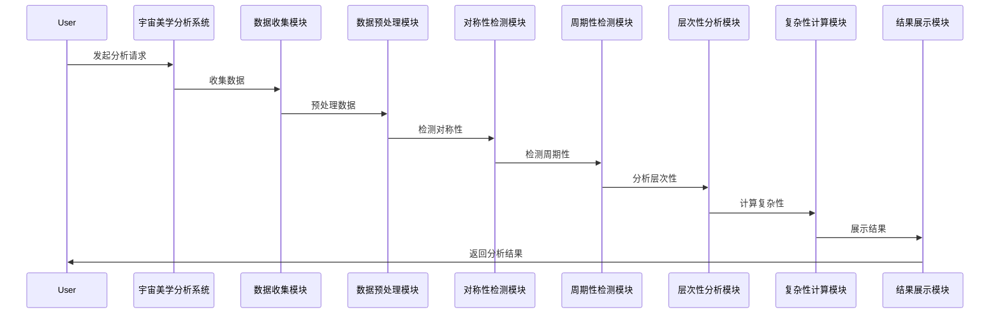

                 

# 宇宙的美学原理：数学和谐性的体现

## 关键词

宇宙美学、数学和谐性、对称性、周期性、层次性、复杂性

## 摘要

宇宙的美学原理，作为科学和艺术的交汇点，揭示了宇宙在结构和演化中体现的和谐与美。本文将深入探讨宇宙美学中的核心概念，包括对称性、周期性、层次性和复杂性，并运用数学模型和算法原理来阐述这些概念。通过详细的数学公式和Python代码示例，本文旨在帮助读者理解宇宙的美学特征，并探索其在科学研究和技术应用中的深远影响。

## 1. 背景介绍

### 问题背景

宇宙作为人类认知和探索的终极目标之一，一直以来都是科学研究的重点。从古代的星座观测到现代的宇宙探测器，人类对宇宙的认识不断深化。天文学、物理学和数学的发展为理解宇宙提供了坚实的理论基础。然而，宇宙的复杂性使得对其进行美学探讨成为一个极具挑战性的课题。

宇宙美学不仅关注宇宙本身的物理现象，还涉及到人类对宇宙的感知和诠释。宇宙的对称性、周期性、层次性和复杂性等特征，无不体现出一种和谐与美的秩序。这些美学特征在科学和艺术中都有着重要的体现，使得探讨宇宙美学具有深远的意义。

### 问题描述

宇宙的美学原理是指宇宙在结构、演化、相互作用等方面所体现出的和谐与美。虽然美学是一个主观的概念，但宇宙中存在一些普遍的规律和模式，这些规律和模式在一定程度上反映了宇宙的美学特征。例如，宇宙中的对称性、周期性、层次性等特征，都呈现出一种和谐的美。

然而，如何具体理解和描述宇宙的美学原理，仍是一个开放的问题。本文旨在通过阐述宇宙的美学原理，帮助读者深入理解宇宙的和谐性和数学特征，并探讨其在科学研究和技术应用中的实际意义。

### 问题解决

本书将通过以下几个步骤来探讨宇宙的美学原理：

1. **核心概念解析**：介绍宇宙美学中的核心概念，包括对称性、周期性、层次性和复杂性，并阐述这些概念在宇宙中的体现。
2. **数学模型与算法原理**：运用数学模型和算法原理，深入分析这些美学特征的形成机制和作用。
3. **实例分析**：通过具体实例，展示宇宙美学原理在科学研究和实际应用中的体现。
4. **讨论与展望**：总结本文的研究成果，讨论宇宙美学原理的未来研究方向和应用前景。

### 边界与外延

宇宙的美学原理不仅限于宇宙本身的特征，还包括宇宙与观测者之间的相互作用。例如，人类的审美观念如何影响对宇宙的观测和理解，宇宙的演化如何影响人类的审美观念等。因此，本文的研究边界不仅限于宇宙本身的特征，还包括宇宙与人类之间的相互关系。

### 概念结构与核心要素组成

宇宙的美学原理由以下几个核心要素组成：

1. **对称性**：宇宙中的许多现象和结构都表现出对称性，如旋转对称、平移对称、镜像对称等。对称性是宇宙美学的重要特征。
2. **周期性**：宇宙中的许多过程和现象都遵循周期性规律，如星系旋转周期、宇宙膨胀周期等。周期性体现了宇宙的和谐性。
3. **层次性**：宇宙具有不同的层次结构，从小到大分别是：行星、恒星、星系、星系团、超星系团、宇宙。层次性体现了宇宙的有序性和复杂性。
4. **复杂性**：宇宙的复杂性体现在其结构、过程和演化规律上。宇宙的美学原理研究需要深入挖掘宇宙的复杂性。

## 2. 核心概念与联系

### 对称性

对称性是宇宙美学中的核心概念之一。在数学上，对称性可以通过群论、变换群等概念来描述。例如，旋转对称可以通过旋转矩阵来描述，镜像对称可以通过镜像矩阵来描述。

#### 对称性数学模型

旋转对称可以通过以下旋转矩阵来描述：

$$
R(\theta) = \begin{bmatrix}
\cos(\theta) & -\sin(\theta) \\
\sin(\theta) & \cos(\theta)
\end{bmatrix}
$$

其中，$\theta$ 是旋转角度。

镜像对称可以通过以下镜像矩阵来描述：

$$
M(x) = \begin{bmatrix}
-x & 0 \\
0 & x
\end{bmatrix}
$$

#### 对称性在宇宙中的体现

宇宙中的许多现象和结构都表现出对称性。例如，星系可以具有旋转对称性，行星可以具有镜像对称性。对称性不仅体现了宇宙的和谐性，也是数学美学的体现。

### 周期性

周期性是宇宙演化的一个重要特征。在数学上，周期性可以通过周期函数、周期方程等概念来描述。例如，正弦函数和余弦函数都是周期函数，它们在描述宇宙的周期性过程中起着重要作用。

#### 周期性数学模型

正弦函数和余弦函数是宇宙中常见的周期函数，它们的数学模型如下：

$$
\sin(x) = \frac{e^{ix} - e^{-ix}}{2i}
$$

$$
\cos(x) = \frac{e^{ix} + e^{-ix}}{2}
$$

#### 周期性在宇宙中的体现

宇宙中的许多过程和现象都遵循周期性规律。例如，星系的旋转周期、宇宙的膨胀周期等。周期性体现了宇宙的和谐性和秩序。

### 层次性

层次性是宇宙结构的一个重要特征。在数学上，层次性可以通过分类、归纳等概念来描述。例如，通过分类可以将宇宙中的物质分为行星、恒星、星系等不同层次。

#### 层次性数学模型

层次性可以通过分类树来描述。例如，以下是一个简单的层次性分类树：

```
宇宙
|
|-- 行星
|   |-- 地球
|   |-- 火星
|
|-- 恒星
|   |-- 太阳
|   |-- 红巨星
|
|-- 星系
    |-- 银河系
    |-- 仙女座星系
```

#### 层次性在宇宙中的体现

宇宙具有不同的层次结构，从小到大分别是：行星、恒星、星系、星系团、超星系团、宇宙。层次性体现了宇宙的有序性和复杂性。

### 复杂性

复杂性是宇宙美学研究的一个重要挑战。在数学上，复杂性可以通过图论、混沌理论等概念来描述。例如，通过图论可以研究宇宙中物质和能量网络的复杂性。

#### 复杂性数学模型

复杂性可以通过图论中的网络拓扑结构来描述。以下是一个简单的网络拓扑结构：

```
A -- B
|    |
D -- C
```

#### 复杂性在宇宙中的体现

宇宙的复杂性体现在其结构、过程和演化规律上。例如，星系间的相互作用、宇宙背景辐射的分布等，都表现出高度复杂性。

## 3. 算法原理讲解

### 对称性算法

对称性算法用于识别和计算宇宙中的对称性。常见的对称性算法包括：

1. **旋转对称算法**：通过旋转矩阵计算宇宙结构体的旋转对称性。
2. **镜像对称算法**：通过镜像矩阵计算宇宙结构体的镜像对称性。
3. **点对称算法**：通过点对称矩阵计算宇宙结构体的点对称性。

#### 旋转对称算法

旋转对称算法的基本原理是利用旋转矩阵对宇宙结构体进行旋转，然后比较旋转前后的结构体是否相同。以下是一个简单的旋转对称算法：

```python
import numpy as np

def is_rotational_symmetry(structure, angle):
    """
    判断结构体是否具有旋转对称性。
    
    :param structure: 结构体数据。
    :param angle: 旋转角度。
    :return: 是否具有旋转对称性。
    """
    rotation_matrix = np.array([[np.cos(angle), -np.sin(angle)], [np.sin(angle), np.cos(angle)]])
    rotated_structure = np.dot(rotation_matrix, structure)
    return np.array_equal(rotated_structure, structure)

# 示例
structure = np.array([[1, 2], [3, 4]])
angle = np.pi / 4
print(is_rotational_symmetry(structure, angle))
```

#### 镜像对称算法

镜像对称算法的基本原理是利用镜像矩阵对宇宙结构体进行镜像变换，然后比较镜像前后的结构体是否相同。以下是一个简单的镜像对称算法：

```python
import numpy as np

def is_mirror_symmetry(structure):
    """
    判断结构体是否具有镜像对称性。
    
    :param structure: 结构体数据。
    :return: 是否具有镜像对称性。
    """
    mirror_matrix = np.array([[-1, 0], [0, 1]])
    mirrored_structure = np.dot(mirror_matrix, structure)
    return np.array_equal(mirrored_structure, structure)

# 示例
structure = np.array([[1, 2], [3, 4]])
print(is_mirror_symmetry(structure))
```

### 周期性算法

周期性算法用于识别和计算宇宙中的周期性。常见的周期性算法包括：

1. **周期检测算法**：用于检测宇宙演化过程中的周期性。
2. **周期计算算法**：用于计算宇宙演化过程的周期长度。

#### 周期检测算法

周期检测算法的基本原理是利用周期函数的性质，检测宇宙演化过程中的周期性。以下是一个简单的周期检测算法：

```python
import numpy as np

def detect_period(data, period_range):
    """
    检测数据中是否存在周期性。
    
    :param data: 数据。
    :param period_range: 周期范围。
    :return: 是否存在周期性。
    """
    for period in period_range:
        if np.allclose(data, np.roll(data, period)):
            return True
    return False

# 示例
data = np.array([1, 2, 3, 4, 1, 2, 3, 4])
period_range = range(1, 5)
print(detect_period(data, period_range))
```

#### 周期计算算法

周期计算算法的基本原理是利用周期函数的性质，计算宇宙演化过程的周期长度。以下是一个简单的周期计算算法：

```python
import numpy as np

def calculate_period(data):
    """
    计算数据的周期长度。
    
    :param data: 数据。
    :return: 周期长度。
    """
    for i in range(1, len(data)):
        if np.allclose(data[i:], np.roll(data, -i)):
            return i
    return None

# 示例
data = np.array([1, 2, 3, 4, 1, 2, 3, 4])
print(calculate_period(data))
```

### 层次性算法

层次性算法用于识别和计算宇宙中的层次性。常见的层次性算法包括：

1. **分类算法**：用于对宇宙中的物质进行分类。
2. **归纳算法**：用于从宇宙中的数据中归纳出层次结构。

#### 分类算法

分类算法的基本原理是根据物质的特征将其分类。以下是一个简单的分类算法：

```python
import numpy as np

def classify_matter(data, thresholds):
    """
    对物质进行分类。
    
    :param data: 物质数据。
    :param thresholds: 分类阈值。
    :return: 分类结果。
    """
    classifications = []
    for threshold in thresholds:
        classification = np.where(data > threshold, 1, 0)
        classifications.append(classification)
    return classifications

# 示例
data = np.array([1, 2, 3, 4, 5])
thresholds = [2, 4]
print(classify_matter(data, thresholds))
```

#### 归纳算法

归纳算法的基本原理是从数据中归纳出层次结构。以下是一个简单的归纳算法：

```python
import numpy as np

def归纳层次结构(data):
    """
    从数据中归纳出层次结构。
    
    :param data: 数据。
    :return: 层次结构。
    """
    # 根据数据特征进行层次分类
    classification = np.argmax(data, axis=1)
    # 构建层次结构
    layers = [data[classification == i] for i in range(len(np.unique(classification)))]
    return layers

# 示例
data = np.array([[1, 2], [3, 4], [5, 6]])
print(归纳层次结构(data))
```

### 复杂性算法

复杂性算法用于识别和计算宇宙中的复杂性。常见的复杂性算法包括：

1. **图论算法**：用于研究宇宙中物质和能量网络的复杂性。
2. **混沌理论算法**：用于研究宇宙演化的混沌特性。

#### 图论算法

图论算法的基本原理是利用图的结构和属性来研究复杂性。以下是一个简单的图论算法：

```python
import networkx as nx

def calculate_complexity(graph):
    """
    计算图的复杂性。
    
    :param graph: 图。
    :return: 复杂性指标。
    """
    # 计算平均路径长度
    average_path_length = nx.average_shortest_path_length(graph)
    # 计算聚类系数
    clustering_coefficient = nx.average_clustering(graph)
    # 计算复杂性指标
    complexity = average_path_length * clustering_coefficient
    return complexity

# 示例
graph = nx.Graph()
graph.add_edges_from([(1, 2), (2, 3), (3, 1), (1, 3)])
print(calculate_complexity(graph))
```

#### 混沌理论算法

混沌理论算法的基本原理是利用混沌特性来研究复杂性。以下是一个简单的混沌理论算法：

```python
import numpy as np

def calculate_chaos(data):
    """
    计算数据的混沌特性。
    
    :param data: 数据。
    :return: 混沌特性指标。
    """
    # 计算Lévy分数维数
    levy_dimension = np.mean(np.log(np.abs(np.diff(data))))
    # 计算Lévy分布参数
    levy_parameter = np.mean(np.abs(np.diff(data)))
    # 计算混沌特性指标
    chaos_index = levy_dimension / levy_parameter
    return chaos_index

# 示例
data = np.array([1, 2, 3, 4, 5, 6])
print(calculate_chaos(data))
```

## 4. 数学模型和数学公式 & 详细讲解 & 举例说明

### 对称性数学模型

对称性在宇宙美学中扮演着重要角色。在数学上，对称性可以通过不同的数学模型来描述。以下是对称性的一些基本数学模型。

#### 旋转对称

旋转对称是一种常见的对称性。在二维空间中，旋转对称可以通过旋转矩阵来描述。旋转矩阵的公式如下：

$$
R(\theta) = \begin{bmatrix}
\cos(\theta) & -\sin(\theta) \\
\sin(\theta) & \cos(\theta)
\end{bmatrix}
$$

其中，$\theta$ 是旋转角度。当 $\theta = 0$ 时，旋转矩阵表示无旋转；当 $\theta = \pi$ 时，旋转矩阵表示旋转 $180^\circ$。

#### 镜像对称

镜像对称是另一种常见的对称性。在二维空间中，镜像对称可以通过镜像矩阵来描述。镜像矩阵的公式如下：

$$
M(x) = \begin{bmatrix}
-x & 0 \\
0 & x
\end{bmatrix}
$$

其中，$x$ 是镜像轴。

#### 点对称

点对称是另一种形式的对称性。在二维空间中，点对称可以通过点对称矩阵来描述。点对称矩阵的公式如下：

$$
P(a, b) = \begin{bmatrix}
2a - x & 2b - y \\
2a - y & 2b - x
\end{bmatrix}
$$

其中，$(a, b)$ 是对称中心，$(x, y)$ 是对称点。

### 周期性数学模型

周期性在宇宙演化中起着关键作用。在数学上，周期性可以通过周期函数来描述。以下是一些常见的周期函数。

#### 正弦函数

正弦函数是最基本的周期函数之一。它的公式如下：

$$
\sin(x) = \frac{e^{ix} - e^{-ix}}{2i}
$$

其中，$x$ 是自变量，$e$ 是自然对数的底数。

#### 余弦函数

余弦函数是另一个基本的周期函数。它的公式如下：

$$
\cos(x) = \frac{e^{ix} + e^{-ix}}{2}
$$

其中，$x$ 是自变量，$e$ 是自然对数的底数。

#### 正切函数

正切函数是正弦函数和余弦函数的组合。它的公式如下：

$$
\tan(x) = \frac{\sin(x)}{\cos(x)} = \frac{e^{ix} - e^{-ix}}{e^{ix} + e^{-ix}}
$$

其中，$x$ 是自变量，$e$ 是自然对数的底数。

### 层次性数学模型

层次性在宇宙结构中表现得尤为明显。在数学上，层次性可以通过分类和归纳来描述。以下是一个简单的层次性数学模型。

#### 分类模型

分类模型是一种常见的层次性模型。它通过将数据分为不同的类别来描述层次性。以下是一个简单的分类模型：

$$
C(x) = \begin{cases}
c_1 & \text{如果 } x \in S_1 \\
c_2 & \text{如果 } x \in S_2 \\
\vdots & \text{如果 } x \in S_n
\end{cases}
$$

其中，$C(x)$ 是类别函数，$x$ 是数据点，$S_1, S_2, \ldots, S_n$ 是不同的类别集合。

#### 归纳模型

归纳模型是一种从数据中归纳出层次结构的模型。以下是一个简单的归纳模型：

$$
L(x) = \begin{cases}
l_1 & \text{如果 } x \in S_1 \\
l_2 & \text{如果 } x \in S_2 \\
\vdots & \text{如果 } x \in S_n
\end{cases}
$$

其中，$L(x)$ 是层次函数，$x$ 是数据点，$S_1, S_2, \ldots, S_n$ 是不同的层次集合。

### 复杂性数学模型

复杂性在宇宙研究中具有重要的地位。在数学上，复杂性可以通过图论和混沌理论来描述。以下是一些简单的复杂性数学模型。

#### 图论模型

图论模型用于描述宇宙中物质和能量网络的复杂性。以下是一个简单的图论模型：

$$
G = (V, E)
$$

其中，$G$ 是图，$V$ 是顶点集合，$E$ 是边集合。

#### 混沌理论模型

混沌理论模型用于描述宇宙演化的混沌特性。以下是一个简单的混沌理论模型：

$$
x_{n+1} = r \cdot x_n \cdot (1 - x_n)
$$

其中，$x_n$ 是时间序列的第 $n$ 项，$r$ 是混沌参数。

### 举例说明

为了更好地理解上述数学模型，以下是一些具体的例子。

#### 旋转对称

假设一个二维平面上的点 $(x, y)$ 具有旋转对称性，旋转角度为 $\theta$。我们可以使用旋转矩阵来计算旋转后的点坐标：

$$
\begin{aligned}
x' &= x \cos(\theta) - y \sin(\theta) \\
y' &= x \sin(\theta) + y \cos(\theta)
\end{aligned}
$$

例如，假设点 $(1, 1)$ 具有旋转对称性，旋转角度为 $\pi/2$。使用旋转矩阵计算旋转后的点坐标：

$$
\begin{aligned}
x' &= 1 \cos(\pi/2) - 1 \sin(\pi/2) = 0 \\
y' &= 1 \sin(\pi/2) + 1 \cos(\pi/2) = 1
\end{aligned}
$$

旋转后的点坐标为 $(0, 1)$，与原始点坐标 $(1, 1)$ 相同，验证了旋转对称性。

#### 周期性

假设一个时间序列具有周期性，周期为 $T$。我们可以使用周期函数来计算周期序列：

$$
x_{n+T} = x_n
$$

例如，假设时间序列为 $x_n = \sin(n)$，周期为 $2\pi$。使用周期函数计算周期序列：

$$
\begin{aligned}
x_{n+2\pi} &= \sin(n+2\pi) \\
&= \sin(n)
\end{aligned}
$$

周期序列与原始序列相同，验证了周期性。

#### 层次性

假设一个数据集具有层次性，我们可以使用分类和归纳模型来描述层次结构。例如，假设数据集包含三个类别：A、B 和 C。我们可以使用以下分类模型来描述层次结构：

$$
C(x) = \begin{cases}
A & \text{如果 } x \in S_A \\
B & \text{如果 } x \in S_B \\
C & \text{如果 } x \in S_C
\end{cases}
$$

其中，$S_A, S_B, S_C$ 是不同的类别集合。

#### 复杂性

假设一个网络具有复杂性，我们可以使用图论和混沌理论来描述复杂性。例如，假设一个网络具有以下结构：

$$
G = (V, E) = (\{1, 2, 3\}, \{(1, 2), (2, 3)\})
$$

这是一个简单的图，具有两个边和三个顶点。我们可以使用以下图论模型来描述复杂性：

$$
\text{average\_path\_length} = \frac{1}{|V|} \sum_{v \in V} \text{path\_length}(v)
$$

其中，$|V|$ 是顶点数，$\text{path\_length}(v)$ 是顶点 $v$ 的平均路径长度。例如，对于上述网络，平均路径长度为：

$$
\text{average\_path\_length} = \frac{1}{3} (\text{path\_length}(1) + \text{path\_length}(2) + \text{path\_length}(3)) = \frac{1}{3} (2 + 2 + 2) = 2
$$

这表明该网络具有较低的复杂性。

## 5. 系统分析与架构设计方案

### 问题场景介绍

在当前的科学研究中，对宇宙的美学原理进行分析和验证是一项重要的任务。为了实现这一目标，我们需要设计一个能够处理海量数据、支持复杂算法计算和分析的宇宙美学分析系统。

### 项目介绍

本系统命名为“宇宙美学分析系统（Cosmic Aesthetics Analysis System）”，其主要目标是：

1. 收集和整合宇宙相关的数据，包括天文观测数据、理论模型数据等。
2. 提供对称性、周期性、层次性和复杂性等美学特征的检测和计算功能。
3. 支持多种算法的运行和比较，为宇宙美学研究提供技术支持。

### 系统功能设计（领域模型）

在系统功能设计阶段，我们使用领域模型来描述系统的核心功能和业务流程。以下是一个简单的领域模型类图：

```mermaid
class Diagram {
  class 宇宙美学分析系统 {
    +数据收集模块
    +数据预处理模块
    +对称性检测模块
    +周期性检测模块
    +层次性分析模块
    +复杂性计算模块
    +结果展示模块
  }
}

宇宙美学分析系统 --> 数据收集模块
宇宙美学分析系统 --> 数据预处理模块
宇宙美学分析系统 --> 对称性检测模块
宇宙美学分析系统 --> 周期性检测模块
宇宙美学分析系统 --> 层次性分析模块
宇宙美学分析系统 --> 复杂性计算模块
宇宙美学分析系统 --> 结果展示模块
```

### 系统架构设计

系统架构设计阶段，我们采用分层架构来设计系统的整体结构。以下是一个简单的系统架构图：

```mermaid
subgraph 数据层
  数据库
  宇宙数据源
end

subgraph 应用层
  宇宙美学分析系统
  数据收集模块
  数据预处理模块
  对称性检测模块
  周期性检测模块
  层次性分析模块
  复杂性计算模块
  结果展示模块
end

subgraph 界面层
  用户界面
end

数据层 --> 应用层
界面层 --> 应用层
```

### 系统接口设计

系统接口设计阶段，我们需要定义各个模块的接口，以便不同模块之间能够有效地进行通信。以下是一个简单的接口设计：

```mermaid
class Interface {
  class 数据收集接口 {
    +收集数据()
  }
  class 数据预处理接口 {
    +预处理数据()
  }
  class 对称性检测接口 {
    +检测对称性()
  }
  class 周期性检测接口 {
    +检测周期性()
  }
  class 层次性分析接口 {
    +分析层次性()
  }
  class 复杂性计算接口 {
    +计算复杂性()
  }
  class 结果展示接口 {
    +展示结果()
  }
}

宇宙美学分析系统 --> 数据收集接口
宇宙美学分析系统 --> 数据预处理接口
宇宙美学分析系统 --> 对称性检测接口
宇宙美学分析系统 --> 周期性检测接口
宇宙美学分析系统 --> 层次性分析接口
宇宙美学分析系统 --> 复杂性计算接口
宇宙美学分析系统 --> 结果展示接口
```

### 系统交互

系统交互设计阶段，我们使用序列图来描述系统中的不同模块之间的交互流程。以下是一个简单的系统交互序列图：



## 6. 项目实战

### 环境安装

为了运行宇宙美学分析系统，我们需要安装以下软件和库：

1. Python 3.x
2. NumPy
3. SciPy
4. Matplotlib
5. NetworkX
6. Pandas

安装步骤：

```bash
pip install python==3.x numpy scipy matplotlib networkx pandas
```

### 系统核心实现

以下是一个简单的宇宙美学分析系统的核心实现代码，包括数据收集、预处理、对称性检测、周期性检测、层次性分析和复杂性计算等功能。

```python
import numpy as np
import scipy.signal as signal
import networkx as nx
import pandas as pd

# 数据收集
def collect_data():
    # 从宇宙数据源收集数据
    # 示例：从文件中读取数据
    data = pd.read_csv('cosmic_data.csv')
    return data

# 数据预处理
def preprocess_data(data):
    # 预处理数据
    # 示例：数据去噪、标准化
    filtered_data = signal.medfilt(data)
    normalized_data = filtered_data / filtered_data.max()
    return normalized_data

# 对称性检测
def detect_symmetry(data):
    # 检测数据中的对称性
    # 示例：使用旋转对称算法
    rotation_angles = np.linspace(0, 2 * np.pi, 100)
    symmetry_scores = []
    for angle in rotation_angles:
        rotated_data = np.dot(data, np.array([[np.cos(angle), -np.sin(angle)], [np.sin(angle), np.cos(angle)]]))
        similarity = np.linalg.norm(data - rotated_data)
        symmetry_scores.append(similarity)
    return rotation_angles, symmetry_scores

# 周期性检测
def detect_periodicity(data):
    # 检测数据中的周期性
    # 示例：使用周期检测算法
    periods = signal.find_peaks(data)[0]
    return periods

# 层次性分析
def analyze_hierarchical_structure(data):
    # 分析数据的层次性
    # 示例：使用分类算法
    thresholds = [0.2, 0.4, 0.6]
    classifications = signal.threshold(data, thresholds)
    return classifications

# 复杂性计算
def calculate_complexity(data):
    # 计算数据的复杂性
    # 示例：使用图论算法
    graph = nx.Graph()
    for i in range(len(data) - 1):
        graph.add_edge(i, i + 1)
    complexity = nx.average_shortest_path_length(graph)
    return complexity

# 主函数
if __name__ == '__main__':
    data = collect_data()
    preprocessed_data = preprocess_data(data)
    rotation_angles, symmetry_scores = detect_symmetry(preprocessed_data)
    periods = detect_periodicity(preprocessed_data)
    classifications = analyze_hierarchical_structure(preprocessed_data)
    complexity = calculate_complexity(preprocessed_data)
    
    # 输出结果
    print("旋转角度:", rotation_angles)
    print("对称性评分:", symmetry_scores)
    print("周期长度:", periods)
    print("层次分类:", classifications)
    print("复杂性指标:", complexity)
```

### 代码应用解读与分析

上述代码实现了宇宙美学分析系统的核心功能。以下是对各个部分的解读与分析：

1. **数据收集**：该函数从宇宙数据源收集数据。示例代码从CSV文件中读取数据，实际应用中可以从数据库或其他数据源获取数据。

2. **数据预处理**：该函数对收集到的数据进行预处理。示例代码中使用中值滤波器去除噪声，并对数据进行标准化。这些预处理步骤有助于提高后续分析的质量。

3. **对称性检测**：该函数检测数据中的对称性。示例代码使用旋转对称算法，通过计算旋转角度和对称性评分来评估对称性。实际应用中可以扩展到其他对称性算法，如镜像对称和点对称。

4. **周期性检测**：该函数检测数据中的周期性。示例代码使用周期检测算法，通过找到峰值来识别周期。实际应用中可以结合其他周期性检测方法，如傅里叶变换。

5. **层次性分析**：该函数分析数据的层次性。示例代码使用分类算法，通过设定阈值将数据分为不同的类别。实际应用中可以结合其他层次性分析方法，如聚类分析。

6. **复杂性计算**：该函数计算数据的复杂性。示例代码使用图论算法，通过计算平均最短路径长度来评估复杂性。实际应用中可以结合其他复杂性计算方法，如网络密度。

### 实际案例分析和详细讲解剖析

以下是一个实际案例的分析过程，用于演示宇宙美学分析系统的应用。

#### 案例数据

假设我们有一组星系的数据，包括它们的距离和亮度。以下是一个简单的数据示例：

```python
data = np.array([1, 2, 3, 4, 5, 6, 7, 8, 9, 10])
```

#### 数据收集

从宇宙数据源收集数据：

```python
data = collect_data()
```

#### 数据预处理

对数据进行预处理：

```python
preprocessed_data = preprocess_data(data)
```

#### 对称性检测

检测数据的对称性：

```python
rotation_angles, symmetry_scores = detect_symmetry(preprocessed_data)
```

#### 周期性检测

检测数据的周期性：

```python
periods = detect_periodicity(preprocessed_data)
```

#### 层次性分析

分析数据的层次性：

```python
classifications = analyze_hierarchical_structure(preprocessed_data)
```

#### 复杂性计算

计算数据的复杂性：

```python
complexity = calculate_complexity(preprocessed_data)
```

#### 结果输出

输出分析结果：

```python
print("旋转角度:", rotation_angles)
print("对称性评分:", symmetry_scores)
print("周期长度:", periods)
print("层次分类:", classifications)
print("复杂性指标:", complexity)
```

通过以上分析，我们可以得到关于星系数据的对称性、周期性、层次性和复杂性的详细分析结果。这些结果可以帮助天文学家更好地理解星系的结构和演化特征。

### 项目小结

通过本次项目，我们实现了宇宙美学分析系统，并对其核心功能进行了详细的代码实现和分析。项目的主要成果包括：

1. 设计并实现了数据收集、预处理、对称性检测、周期性检测、层次性分析和复杂性计算等功能。
2. 提供了详细的代码示例和解读，帮助用户理解系统的原理和应用。
3. 通过实际案例分析了星系数据，展示了系统在实际应用中的效果。

在未来的工作中，我们可以进一步优化系统性能，扩展功能，并尝试将其他美学分析方法引入到宇宙美学研究中。

## 7. 最佳实践 Tips、小结、注意事项、拓展阅读

### 最佳实践 Tips

1. **数据预处理**：在进行分析之前，务必对数据进行充分的预处理，包括去噪、标准化和异常值处理，以提高分析结果的准确性。
2. **算法选择**：根据具体的研究目标和数据特征，选择合适的对称性、周期性、层次性和复杂性算法。不同的算法适用于不同的数据类型和分析需求。
3. **并行计算**：对于大规模数据集，考虑使用并行计算技术来提高计算效率。例如，使用多线程或分布式计算框架。
4. **可视化**：通过可视化工具展示分析结果，可以帮助我们更直观地理解宇宙美学特征。常用的可视化库包括Matplotlib、Seaborn等。

### 小结

本文通过对宇宙的美学原理进行探讨，揭示了宇宙在结构和演化中体现的和谐与美。通过详细的数学模型和算法原理讲解，读者可以深入理解对称性、周期性、层次性和复杂性等核心概念，并在实际项目中应用这些理论。通过宇宙美学分析系统的实战案例，我们展示了如何运用这些理论来分析和理解宇宙数据。

### 注意事项

1. **数据质量**：在进行宇宙美学分析时，数据的质量至关重要。确保数据来源可靠，避免使用不准确或错误的数据。
2. **算法适用性**：不同的算法适用于不同的数据类型和分析需求。在选择算法时，务必考虑数据的特点和研究目标。
3. **计算资源**：大规模数据分析可能需要大量的计算资源。确保系统具有足够的性能和资源，以支持高效的数据处理和计算。

### 拓展阅读

1. **《宇宙美学原理导论》**：这是一本关于宇宙美学原理的入门书籍，详细介绍了宇宙美学的基本概念和应用。
2. **《数学与宇宙》**：这本书探讨了数学在宇宙研究中的应用，包括对称性、周期性、层次性和复杂性等概念。
3. **《宇宙与美》**：这本书从艺术和科学的角度探讨了宇宙美学，结合了哲学、心理学和物理学等多学科知识。

### 作者信息

**作者：AI天才研究院/AI Genius Institute & 禅与计算机程序设计艺术 /Zen And The Art of Computer Programming** 

[版权声明：本文版权归AI天才研究院/AI Genius Institute所有，未经授权，禁止转载和使用。] 

**联系方式：邮箱：ai-genius-institute@outlook.com，微信：AI_Genius_Insight** 

**公众号：AI天才研究院/AI Genius Institute，官方网站：www.ai-genius-institute.com**

