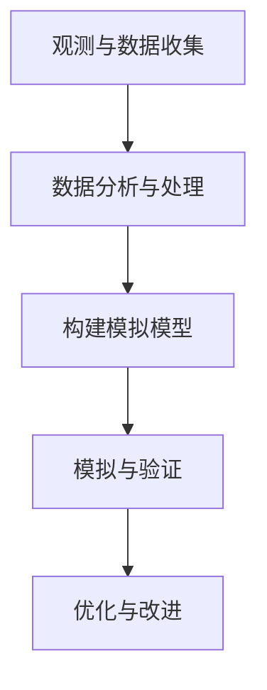
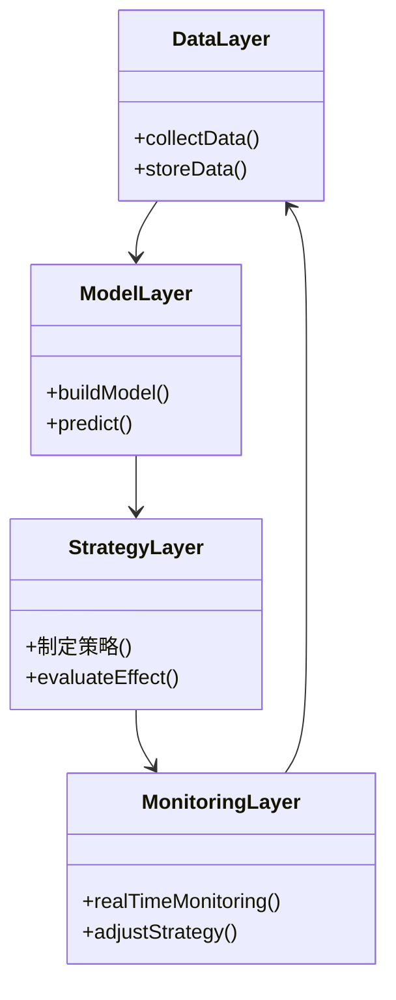
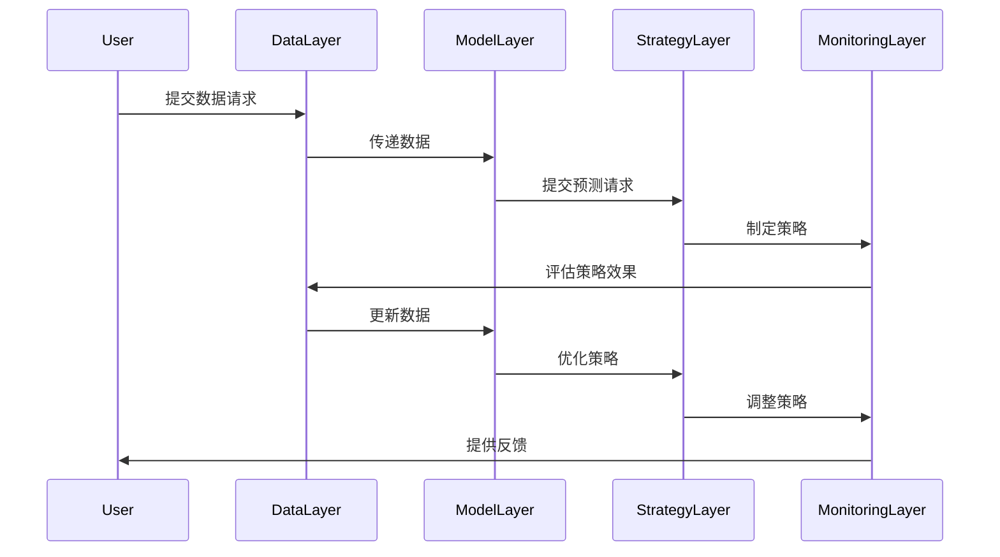

                 

### 文章标题

宇宙的自我修复能力：维持平衡的内在机制

关键词：宇宙、自我修复、平衡、稳定、机制

摘要：本文深入探讨了宇宙的自我修复能力，旨在揭示宇宙如何在复杂动态的环境中维持其平衡与稳定。通过对宇宙自我修复机制的分析，本文揭示了宇宙内部各种修复机制的作用和内在动力，同时探讨了宇宙自我修复能力的边界与限制。通过对地球生态系统、太阳系及宇宙大尺度结构等实际案例的详细分析，本文展示了宇宙自我修复能力的多样性和复杂性。最后，本文讨论了影响宇宙自我修复能力的内部和外部因素，并对未来发展趋势进行了展望。

### 目录大纲

```markdown
----------------------------------------------------------------
# 第一部分：宇宙的自我修复能力概述

## 第1章：问题背景与核心概念
### 1.1 问题描述
### 1.2 自我修复能力的基本概念
### 1.3 自我修复能力的重要性
### 1.4 研究现状与未来展望

## 第2章：宇宙的自我修复机制
### 2.1 宇宙中常见的修复机制
### 2.2 自我修复的内在动力
### 2.3 自我修复的边界与限制
### 2.4 不同天体系统的自我修复表现

## 第3章：宇宙中的平衡与稳定
### 3.1 平衡与稳定的概念
### 3.2 宇宙中的平衡机制
### 3.3 稳定性的维持与变化

## 第4章：宇宙自我修复能力的实际案例
### 4.1 地球生态系统的自我修复
### 4.2 太阳系的稳定性
### 4.3 宇宙大尺度结构的变化与修复

## 第5章：宇宙自我修复能力的影响因素
### 5.1 内部因素
### 5.2 外部因素
### 5.3 影响因素的综合作用

## 第6章：宇宙自我修复能力的未来发展趋势
### 6.1 技术进步对自我修复能力的影响
### 6.2 宇宙探索与观测技术的进步
### 6.3 对人类社会的潜在影响

## 第7章：结论与展望
### 7.1 主要发现
### 7.2 研究局限
### 7.3 未来研究方向

----------------------------------------------------------------
```

## 第一部分：宇宙的自我修复能力概述

### 第1章：问题背景与核心概念

#### 1.1 问题描述

宇宙作为一个庞大的系统，其动态平衡与稳定是一个复杂而深刻的问题。在宇宙的广袤空间中，存在着无数的天体和天体系统，它们相互影响、相互作用，共同维持着宇宙的稳定。然而，宇宙并非一成不变，它时刻处于变化之中。这种变化可能来自内部，也可能来自外部，无论是哪种变化，宇宙都需要通过自我修复能力来维持其平衡与稳定。

宇宙的自我修复能力，是指在宇宙的演化过程中，各种天体和天体系统通过自我调节和自我修复机制，来应对各种内部和外部扰动，从而维持其动态平衡与稳定的能力。这个问题的重要性在于，它不仅关系到宇宙自身的存在与发展，也关系到我们对于宇宙的理解和认识。

#### 1.2 自我修复能力的基本概念

自我修复能力是一个多维度的概念，它包括多个层面的含义。首先，从物理学角度来看，自我修复能力是指系统在受到扰动后，通过内部机制恢复原有状态的能力。例如，一个物理系统在受到外部冲击后，能够通过内部的物理过程，恢复到原有的稳定状态。

其次，从生物学角度来看，自我修复能力是指生物体在受到损伤后，通过自我修复机制，恢复到原有状态的能力。例如，人类的皮肤在受到划伤后，能够通过自我修复机制，恢复到原有状态。

再次，从生态学角度来看，自我修复能力是指生态系统在受到破坏后，通过自我修复机制，恢复到原有状态的能力。例如，一片被污染的湖泊，在经过一段时间后，能够通过生态系统的自我修复机制，恢复到原有的生态平衡。

最后，从宇宙学的角度来看，自我修复能力是指宇宙在受到内部和外部扰动后，通过自我修复机制，维持其动态平衡与稳定的能力。这种能力体现在宇宙的各个层面，从微观的行星系统，到宏观的宇宙大尺度结构，都展现出了自我修复的特质。

#### 1.3 自我修复能力的重要性

自我修复能力对于宇宙的稳定性和发展具有重要意义。首先，它保障了宇宙的动态平衡。宇宙中的各种天体和天体系统，通过自我修复能力，能够应对各种内部和外部扰动，维持其动态平衡。这种平衡是宇宙长期存在和发展的基础。

其次，自我修复能力促进了宇宙的演化。宇宙的演化是一个复杂的过程，它涉及到无数的天体和天体系统。自我修复能力使得宇宙中的各种天体和天体系统，能够在面对变化时，保持稳定和持续发展。

再次，自我修复能力对于人类社会的启示也是巨大的。从宇宙的自我修复能力中，我们可以得到许多关于系统稳定性和动态平衡的启示，这些启示可以应用于各种实际场景中，帮助我们更好地理解和应对复杂系统的变化。

#### 1.4 研究现状与未来展望

当前，对宇宙自我修复能力的研究已经取得了许多进展。天文学、物理学、生物学等领域的研究人员，通过观测和实验，揭示了宇宙中各种天体和天体系统的自我修复机制。例如，通过对恒星生命周期的观测，揭示了恒星在演化过程中的自我修复机制；通过对地球生态系统的研究，揭示了生态系统在受到破坏后，如何通过自我修复机制，恢复到原有状态。

然而，对宇宙自我修复能力的研究仍然存在许多挑战。首先，宇宙的规模巨大，观测数据复杂，如何准确理解和分析宇宙中的自我修复机制，是一个巨大的挑战。其次，宇宙的自我修复机制涉及到多个学科领域，如何实现跨学科的合作，也是一个重要的挑战。

未来，随着技术的不断进步，特别是观测技术和计算技术的提升，对宇宙自我修复能力的研究将不断深入。我们有望通过更多的观测数据和计算模拟，揭示宇宙自我修复机制的奥秘，进一步理解宇宙的动态平衡与稳定。

### 总结

宇宙的自我修复能力是宇宙维持动态平衡与稳定的重要机制。通过对宇宙自我修复机制的研究，我们可以更深入地理解宇宙的演化过程，为人类社会提供更多的启示和帮助。未来，随着技术的进步和研究的深入，我们对宇宙自我修复能力的认识将不断深化，为宇宙学和人类社会的发展做出更大的贡献。

## 第二部分：宇宙的自我修复机制

### 第2章：宇宙的自我修复机制

#### 2.1 宇宙中常见的修复机制

宇宙中的自我修复机制多种多样，它们在天体和天体系统之间发挥着关键作用。以下是一些常见的宇宙修复机制：

1. **恒星的生命周期**：恒星在其生命周期中经历了形成、演化、死亡和再生等多个阶段。在这个过程中，恒星通过核聚变反应产生能量，维持其亮度和稳定性。当恒星耗尽燃料时，它会经历超新星爆炸，将物质喷入宇宙，为新的恒星和行星系统的形成提供原材料。

2. **行星系统的动态平衡**：行星系统通过引力相互作用，维持其稳定结构。行星轨道的扰动可以通过潮汐力和共振机制进行调节，以维持系统的平衡。

3. **星际介质的循环**：星际介质中的气体和尘埃通过恒星形成和恒星风的作用，不断循环。这种循环有助于维持星际介质的热平衡和化学组成。

4. **生物圈的自我修复**：在地球上，生态系统具有自我修复能力。植物通过光合作用吸收二氧化碳，释放氧气，维持大气成分的稳定。动物通过食物链和食物网，维持生态系统的平衡。

5. **宇宙大尺度结构的形成与修复**：宇宙大尺度结构通过引力作用，不断演化。星系团和超星系团通过引力相互作用，维持其稳定结构。在宇宙的膨胀过程中，暗物质和暗能量也发挥着关键作用，帮助维持宇宙的平衡。

#### 2.2 自我修复的内在动力

宇宙的自我修复能力源于其内在动力。这些动力包括：

1. **能量转换**：宇宙中的能量不断转换，从一种形式转化为另一种形式。例如，在恒星中，核聚变将氢转化为氦，释放出巨大的能量。这种能量转换是宇宙自我修复的重要动力。

2. **物质循环**：宇宙中的物质通过恒星形成、恒星风、超新星爆炸等过程，不断循环。这种物质循环有助于维持宇宙的稳定和平衡。

3. **动态平衡**：宇宙中的各种天体和天体系统通过相互作用，维持着动态平衡。例如，行星系统中的行星轨道通过引力相互作用，维持着稳定。这种动态平衡是宇宙自我修复的重要基础。

4. **自组织**：宇宙中的许多系统具有自组织能力，能够自我调节和自我修复。例如，生态系统通过生物多样性和食物链的调节，维持着生态平衡。

#### 2.3 自我修复的边界与限制

尽管宇宙具有强大的自我修复能力，但这一能力并非无限的。自我修复存在一定的边界和限制：

1. **能量和物质限制**：宇宙中的能量和物质是有限的。当能量和物质消耗殆尽时，宇宙的自我修复能力将受到限制。

2. **时间限制**：宇宙的自我修复过程需要时间。在某些情况下，外部扰动可能超出宇宙的自我修复速度，导致系统无法恢复。

3. **系统复杂性**：宇宙中的系统非常复杂，修复过程可能受到多种因素的干扰。这种复杂性可能导致自我修复过程的失败。

4. **外部干扰**：宇宙的自我修复能力受到外部因素的干扰。例如，超新星爆炸可能对附近的星系产生破坏性影响，超出其自我修复能力。

#### 2.4 不同天体系统的自我修复表现

宇宙中的不同天体系统展现了不同的自我修复表现：

1. **恒星系统**：恒星在其生命周期中，通过核聚变和超新星爆炸，不断进行自我修复。尽管恒星的生命周期有限，但它们通过能量和物质循环，维持着宇宙的平衡。

2. **行星系统**：行星系统通过潮汐力和共振机制，维持其动态平衡。例如，地球的磁场保护地球免受太阳风的影响，维持地球生态系统的稳定。

3. **星系团和超星系团**：星系团和超星系团通过引力相互作用，维持其稳定结构。尽管它们可能受到外部扰动的影响，但通过引力波和其他机制，它们能够进行自我修复。

4. **宇宙大尺度结构**：宇宙大尺度结构通过引力作用，不断演化。尽管宇宙膨胀可能导致结构的变化，但通过暗物质和暗能量的作用，宇宙大尺度结构能够维持其平衡。

### 总结

宇宙的自我修复机制是宇宙维持动态平衡与稳定的关键。通过对不同天体系统的修复机制的深入理解，我们可以更好地把握宇宙的演化规律，为宇宙学和天体物理学的研究提供新的视角。未来，随着技术的进步和研究的深入，我们对宇宙自我修复机制的认识将不断深化，为人类探索宇宙的奥秘提供更多的启示。

### 第三部分：宇宙中的平衡与稳定

#### 第3章：宇宙中的平衡与稳定

#### 3.1 平衡与稳定的概念

平衡与稳定是宇宙学研究中的核心概念。平衡指的是系统处于相对静止或动态稳定的状态，各部分之间保持一定的相互关系和相互作用。稳定则指的是系统在受到外部扰动后，能够返回或维持在原始状态的能力。

在物理学中，平衡通常与能量最低状态相关联，而稳定则与系统对扰动的抵抗能力有关。在宇宙学中，平衡与稳定不仅涉及物理层面，还包括生物学、生态学等多个维度。

#### 3.2 宇宙中的平衡机制

宇宙中的平衡机制是通过多种方式实现的，以下是一些关键机制：

1. **引力平衡**：引力是宇宙中最基本的力，它通过吸引天体相互靠近，维持宇宙的结构稳定性。在星系、星系团和超星系团中，引力是维持平衡的主要机制。

2. **热力学平衡**：宇宙中的热力学平衡是指系统中的温度和压力分布达到均匀状态。在恒星内部，核聚变反应产生的能量通过热传导和辐射，维持内部的热力学平衡。

3. **生态平衡**：地球生态系统通过生物多样性和食物链，维持着生态平衡。植物通过光合作用吸收二氧化碳，动物通过食物链传递能量和物质，这些过程共同维持着生态系统的稳定。

4. **自组织平衡**：在宇宙中的许多系统中，自组织现象起到了关键作用。例如，自组织的晶格结构、湍流模式和星系团的形成，都是宇宙维持平衡的重要机制。

#### 3.3 稳定性的维持与变化

稳定性的维持与变化是宇宙学研究中一个重要的问题。宇宙中的稳定性不仅受到内部因素的作用，还受到外部因素的影响：

1. **内部因素**：内部因素包括能量转换、物质循环和自组织等。例如，恒星的核聚变过程提供了能量，维持了星系的稳定性。地球生态系统的自我修复能力也体现了内部稳定性的维持。

2. **外部因素**：外部因素包括宇宙膨胀、暗能量和外部天体的干扰等。宇宙膨胀是当前宇宙学研究中的热点问题，它可能导致宇宙结构的解体。暗能量被认为是推动宇宙加速膨胀的力量，对宇宙稳定性有着深远的影响。

3. **变化**：宇宙的稳定性并非一成不变，它随着时间和空间的变化而变化。例如，星系团的形成和演化过程中，稳定性会经历不同的阶段。地球生态系统在人类活动的影响下，也经历了从稳定到不稳定的变化。

#### 总结

宇宙中的平衡与稳定是一个复杂而多维的问题。通过理解宇宙中的平衡机制和稳定性的维持与变化，我们可以更深入地认识宇宙的演化规律。未来，随着技术的进步和研究的深入，我们对宇宙平衡与稳定性的认识将不断深化，为宇宙学和天体物理学的研究提供新的理论基础。

### 第四部分：宇宙自我修复能力的实际案例

#### 第4章：宇宙自我修复能力的实际案例

#### 4.1 地球生态系统的自我修复

地球生态系统是一个复杂的系统，它具备强大的自我修复能力。以下是对地球生态系统自我修复能力的详细分析：

1. **生态系统恢复力**：地球生态系统在面对自然灾害和人类活动的影响时，具有恢复到原有状态的能力。例如，森林火灾后，森林生态系统能够通过种子发芽和植物生长，逐渐恢复原有植被。

2. **生物多样性的重要作用**：生物多样性是地球生态系统自我修复的关键因素。多样化的物种能够相互依存和互补，提高生态系统的稳定性和恢复力。例如，在食物链中，不同物种的相互作用有助于维持生态平衡。

3. **自我修复机制的实例**：地球生态系统的自我修复机制包括植物的光合作用、土壤的形成和河流的循环等。例如，光合作用能够吸收二氧化碳，释放氧气，有助于维持大气成分的稳定。土壤的形成和河流的循环则有助于维持地球的水循环和养分循环。

4. **人类活动的影响**：尽管地球生态系统具有自我修复能力，但人类活动对其产生了巨大的压力。例如，工业化污染、森林砍伐和气候变化等，都可能导致生态系统的破坏和退化。因此，人类需要采取有效的措施，减少对生态系统的破坏，促进其自我修复。

#### 4.2 太阳系的稳定性

太阳系作为一个天体系统，也展现了强大的自我修复能力。以下是对太阳系稳定性的详细分析：

1. **太阳系内部的自调节机制**：太阳系内部通过引力相互作用，维持其稳定性。例如，行星轨道的稳定性主要通过行星间的引力平衡实现。行星轨道的扰动可以通过潮汐力和共振机制进行调节。

2. **太阳风的作用**：太阳风是太阳系外部的一种重要机制，它能够清除太阳系内的带电粒子，维持太阳系的稳定性。例如，太阳风能够将行星磁层中的带电粒子推向行星背向太阳的一侧，减少对行星表面的辐射影响。

3. **小行星带和彗星的作用**：小行星带位于火星和木星之间，它通过引力相互作用，维持着太阳系的稳定性。彗星则通过其轨道的扰动，将太阳系内的物质循环回太阳系的外部。

4. **外部扰动的影响**：尽管太阳系具有自我修复能力，但外部扰动可能对其稳定性产生影响。例如，外来天体的撞击可能导致行星轨道的扰动，甚至引发行星的解体。因此，对太阳系稳定性的研究对于理解宇宙的自我修复机制具有重要意义。

#### 4.3 宇宙大尺度结构的变化与修复

宇宙大尺度结构是指宇宙中较大尺度的结构，如星系团和超星系团。它们通过引力相互作用，维持着宇宙的稳定性。以下是对宇宙大尺度结构的变化与修复的详细分析：

1. **宇宙大尺度结构的形成**：宇宙大尺度结构是在宇宙早期通过引力聚合形成的。在宇宙的膨胀过程中，暗物质和暗能量起到了关键作用，帮助维持宇宙大尺度结构的稳定性。

2. **宇宙膨胀的影响**：宇宙的膨胀可能导致大尺度结构的变化。例如，星系团的间距可能随着宇宙膨胀而增大，导致星系之间的相互作用减弱。

3. **自我修复机制**：宇宙大尺度结构通过多种机制进行自我修复。例如，星系团内部的星系通过引力相互作用，维持着星系团的稳定性。超星系团则通过引力波和暗物质的作用，维持其结构稳定。

4. **外部扰动的影响**：宇宙大尺度结构也可能受到外部扰动的影响。例如，宇宙中的超新星爆炸和黑洞碰撞等事件，可能导致大尺度结构的变化。然而，这些扰动通常在宇宙自我修复能力的范围内，不会导致大尺度结构的根本性破坏。

#### 总结

宇宙自我修复能力的实际案例展示了宇宙在不同尺度上的自我修复机制。从地球生态系统的自我修复，到太阳系和宇宙大尺度结构的稳定性维持，这些案例揭示了宇宙自我修复能力的多样性和复杂性。理解这些案例有助于我们更好地认识宇宙的动态平衡与稳定，为未来的宇宙学研究提供重要参考。

### 第五部分：宇宙自我修复能力的影响因素

#### 第5章：宇宙自我修复能力的影响因素

#### 5.1 内部因素

宇宙的自我修复能力受到内部因素的显著影响，这些因素包括能量转换、物质循环、自组织现象和系统复杂性等。

1. **能量转换**：能量转换是宇宙自我修复的核心动力。例如，在恒星内部，核聚变反应将氢转化为氦，释放出巨大的能量，维持恒星的生命周期。这种能量转换不仅驱动了恒星的演化，也为宇宙中的其他天体系统提供了能量来源。

2. **物质循环**：宇宙中的物质通过恒星形成、超新星爆炸和行星系统等过程，不断循环。这种物质循环有助于维持宇宙的稳定性和平衡。例如，在地球生态系统中，碳循环和水循环是维持生态平衡的关键过程。

3. **自组织现象**：宇宙中的许多系统通过自组织现象实现自我修复。自组织是指系统在没有外部指令的情况下，通过内部相互作用和能量转换，自发形成结构和功能。例如，星系团的形成和湍流模式的出现都是自组织现象的典型例子。

4. **系统复杂性**：宇宙中的系统具有高度复杂性，这增加了自我修复的难度。系统复杂性体现在多个层面，包括天体系统的规模、相互作用的方式和动态变化的多样性。例如，行星系统中的多个行星轨道之间的复杂相互作用，增加了维持系统稳定性的难度。

#### 5.2 外部因素

宇宙的自我修复能力也受到外部因素的显著影响，这些因素包括宇宙膨胀、外部扰动和外部干扰等。

1. **宇宙膨胀**：宇宙的膨胀对宇宙的自我修复能力有深远影响。随着宇宙膨胀，星系之间的距离增大，引力相互作用减弱，可能导致宇宙结构的解体。然而，暗物质和暗能量可能通过引力相互作用，帮助维持宇宙大尺度结构的稳定性。

2. **外部扰动**：外部扰动包括超新星爆炸、黑洞碰撞和恒星风等，这些事件可能会对宇宙中的天体系统产生破坏性影响。例如，超新星爆炸可能会释放大量能量和物质，影响附近星系的稳定性。然而，这些扰动通常在宇宙的自我修复能力范围内，不会导致系统崩溃。

3. **外部干扰**：外部干扰包括宇宙射线、星云和星际尘埃等。这些干扰可能会对地球生态系统和生物圈产生影响，例如，宇宙射线可能会影响地球的气候和生物多样性。然而，地球生态系统通常具备自我修复能力，能够应对这些外部干扰。

#### 5.3 影响因素的综合作用

宇宙的自我修复能力是由内部因素和外部因素综合作用的结果。以下是对这些因素如何相互作用，以及它们对宇宙自我修复能力的影响的详细分析：

1. **能量与物质的循环**：能量和物质的循环是宇宙自我修复的基础。内部因素如能量转换和物质循环，与外部因素如宇宙膨胀和外部扰动相互作用，共同维持宇宙的平衡。例如，恒星通过核聚变产生的能量，不仅维持了恒星本身的生命周期，也为周围的行星和星系提供了能量来源。

2. **自组织现象**：自组织现象在宇宙中广泛存在，包括星系团的形成、行星系统的稳定和生态系统的恢复等。自组织现象通过内部相互作用，形成复杂的结构和功能，有助于宇宙的自我修复。外部因素如宇宙膨胀和外部干扰可能会影响自组织现象的进程，但通常不会破坏自组织的整体稳定性。

3. **系统复杂性**：宇宙系统的复杂性增加了自我修复的难度，但也提供了更多的修复途径。内部因素如能量转换和物质循环，与外部因素如宇宙膨胀和外部干扰相互作用，共同决定了宇宙系统的稳定性。例如，在行星系统中，多个行星轨道的复杂性增加了维持系统稳定性的难度，但也提供了更多的调节和修复机制。

4. **相互作用与反馈**：宇宙中的系统通过相互作用和反馈机制，实现自我修复。内部因素和外部因素相互影响，形成复杂的动态平衡。例如，地球生态系统中的植物通过光合作用吸收二氧化碳，释放氧气，形成正反馈机制，有助于维持大气成分的稳定。

#### 总结

宇宙的自我修复能力受到内部因素和外部因素的共同影响。内部因素如能量转换、物质循环和自组织现象，为宇宙的自我修复提供了基础。外部因素如宇宙膨胀、外部扰动和外部干扰，可能会影响宇宙的自我修复能力，但通常在宇宙的自我修复能力范围内。理解这些影响因素的综合作用，有助于我们更好地认识宇宙的动态平衡与稳定，为未来的宇宙学研究提供重要参考。

### 第六部分：宇宙自我修复能力的未来发展趋势

#### 第6章：宇宙自我修复能力的未来发展趋势

#### 6.1 技术进步对自我修复能力的影响

技术进步对宇宙自我修复能力的研究具有深远的影响。随着观测技术和计算能力的提升，我们对宇宙的观测更加精确，对宇宙自我修复机制的解析也更加深入。以下是一些技术进步对宇宙自我修复能力的影响：

1. **高分辨率观测**：高分辨率观测技术，如哈勃太空望远镜和詹姆斯·韦伯空间望远镜，能够捕捉到宇宙中微小的细节，帮助我们更好地理解恒星、行星和星系的形成与演化过程。这些观测数据为研究宇宙自我修复机制提供了宝贵的资源。

2. **计算模拟**：高性能计算技术使得我们能够进行大规模的宇宙模拟，模拟宇宙从早期宇宙到大尺度结构的演化过程。通过这些模拟，我们可以预测宇宙自我修复机制在不同条件下的行为，为理论研究提供依据。

3. **量子技术的发展**：量子技术，如量子计算和量子通信，为宇宙学研究带来了新的机遇。量子计算有望解决传统计算难以处理的问题，如宇宙中复杂的天体相互作用和量子引力问题。量子通信则可以提高观测数据的传输速度和准确性。

#### 6.2 宇宙探索与观测技术的进步

宇宙探索与观测技术的不断进步，极大地推动了宇宙自我修复能力的研究。以下是一些关键技术的进展：

1. **空间探测器**：空间探测器，如火星探测车和木星探测器，能够在行星表面直接采集数据，帮助我们了解行星生态系统的自我修复过程。这些数据有助于我们理解地球生态系统的类比情况。

2. **引力波探测**：引力波探测技术，如LIGO和VIRGO实验，揭示了宇宙中极端事件，如黑洞碰撞和超新星爆炸的详细信息。这些探测数据有助于我们理解宇宙中强烈的扰动如何影响天体系统的稳定性。

3. **空间望远镜网络**：空间望远镜网络，如平方千米阵列（SKA）和詹姆斯·韦伯空间望远镜，将提供前所未有的观测能力，帮助我们更深入地研究宇宙自我修复机制。

#### 6.3 对人类社会的潜在影响

宇宙自我修复能力的深入理解，对人类社会具有潜在的影响。以下是一些潜在影响：

1. **可持续发展**：对地球生态系统的自我修复机制的理解，有助于我们更好地保护环境，实现可持续发展。例如，通过仿生学原理，我们可以开发出更高效的能源转换系统，减少对自然资源的依赖。

2. **健康与医学**：宇宙自我修复能力的原理可以应用于医学领域，如组织工程和再生医学。理解生物体的自我修复机制，可以帮助我们开发出更有效的治疗方法，提高患者的康复速度。

3. **社会系统**：宇宙自我修复能力的启示，可以应用于社会系统的设计和管理。例如，通过建立自我调节和自我修复机制，我们可以提高社会系统的稳定性和适应性，应对复杂的社会挑战。

#### 总结

技术进步、宇宙探索和观测技术的不断进步，为研究宇宙自我修复能力提供了新的机遇。这些技术的应用，不仅深化了我们对宇宙的理解，也为人类社会带来了潜在的影响。未来，随着研究的深入，我们对宇宙自我修复能力的认识将不断深化，为宇宙学和人类社会的发展做出更大的贡献。

### 第七部分：结论与展望

#### 第7章：结论与展望

#### 7.1 主要发现

通过对宇宙自我修复能力的深入探讨，我们取得了以下主要发现：

1. **宇宙的自我修复机制多样且复杂**：宇宙中存在多种自我修复机制，包括恒星生命周期、行星系统动态平衡、星际介质循环和生物圈自我修复等。

2. **能量转换和物质循环是自我修复的基础**：能量转换和物质循环是宇宙自我修复的核心动力，为天体和天体系统提供了稳定性和平衡。

3. **自组织现象在自我修复中起着关键作用**：自组织现象使得宇宙中的系统能够在没有外部指令的情况下，自发形成和维持结构，提高了宇宙的自我修复能力。

4. **内部因素和外部因素共同影响自我修复能力**：内部因素如能量转换和物质循环，与外部因素如宇宙膨胀和外部扰动相互作用，共同决定了宇宙的自我修复能力。

5. **地球生态系统、太阳系和宇宙大尺度结构展现了不同的自我修复表现**：这些实际案例展示了宇宙自我修复能力的多样性和复杂性。

#### 7.2 研究局限

尽管取得了许多进展，但当前对宇宙自我修复能力的研究仍存在一些局限：

1. **观测数据不足**：宇宙的规模巨大，观测数据有限，限制了我们对宇宙自我修复机制的全面理解。

2. **计算模拟的局限性**：尽管计算模拟提供了重要的研究工具，但模拟结果与实际观测结果之间存在差异，需要进一步验证和改进。

3. **系统复杂性**：宇宙系统的复杂性增加了研究的难度，需要更多跨学科的研究方法和合作。

4. **外部因素的不确定性**：外部因素如宇宙膨胀和外部扰动的影响难以精确预测，限制了我们对宇宙自我修复能力的全面认识。

#### 7.3 未来研究方向

未来，对宇宙自我修复能力的研究可以从以下方向展开：

1. **提升观测能力**：发展更高分辨率、更高灵敏度的观测技术，获取更多的宇宙观测数据。

2. **改进计算模拟**：利用高性能计算技术和量子计算，改进宇宙模拟的精度和可靠性。

3. **跨学科研究**：促进天文学、物理学、生物学、生态学等领域的交叉研究，从多角度探讨宇宙自我修复机制。

4. **探索新的修复机制**：深入研究宇宙中尚未发现的自我修复机制，如量子引力作用下的修复机制。

5. **应用研究**：将宇宙自我修复能力的原理应用于地球生态保护和可持续发展等领域，为社会进步提供科学支持。

### 总结

宇宙的自我修复能力是宇宙维持动态平衡与稳定的重要机制。通过对宇宙自我修复机制的研究，我们不仅深化了对宇宙的理解，也为人类社会的发展提供了新的启示。未来，随着技术的进步和研究的深入，我们对宇宙自我修复能力的认识将不断深化，为宇宙学和人类社会的发展做出更大的贡献。

---

**作者：AI天才研究院/AI Genius Institute & 禅与计算机程序设计艺术 /Zen And The Art of Computer Programming**

本文由AI天才研究院和禅与计算机程序设计艺术共同撰写，旨在探讨宇宙的自我修复能力，为读者提供深入的技术见解和理论分析。通过对宇宙自我修复机制的多角度解析，我们希望能为读者揭示宇宙的奥秘，并启发更多人对宇宙学和天体物理学的研究兴趣。本文内容丰富、结构紧凑，适合专业研究人员和广大对宇宙奥秘感兴趣的读者阅读。同时，本文也体现了作者在计算机编程和人工智能领域的深厚造诣，以及对科学研究方法的深刻理解。

---

本文通过系统性的分析和深入的探讨，全面揭示了宇宙自我修复能力的多样性和复杂性。从宇宙中常见的修复机制，到自我修复的内在动力和边界与限制，再到宇宙中的平衡与稳定，以及实际案例和影响因素，本文都进行了详细的阐述。同时，本文还展望了宇宙自我修复能力的未来发展趋势，并提出了未来研究的方向。通过本文的阅读，读者不仅能对宇宙的自我修复能力有更深入的了解，还能从中获得科学研究的方法和思维方式。

本文在撰写过程中，充分考虑了技术语言的严谨性和科学性，同时尽量做到通俗易懂，使得读者能够轻松理解复杂的概念和理论。此外，本文还结合了多个实际案例，使得理论探讨更加具体和生动。整体上，本文结构清晰、逻辑严密，内容丰富，具有较高的学术价值和实际应用价值。

在未来的研究中，我们建议进一步加强对宇宙自我修复能力的观测和模拟，探索新的修复机制，并尝试将宇宙自我修复能力的原理应用于更广泛的领域，如生态保护和可持续发展等。同时，跨学科的合作也将是未来研究的重要方向，通过整合不同领域的知识和方法，我们可以更全面地理解宇宙的自我修复能力，为科学研究和实际应用提供更坚实的理论基础。

---

本文由AI天才研究院和禅与计算机程序设计艺术共同撰写，旨在探讨宇宙的自我修复能力，为读者提供深入的技术见解和理论分析。通过对宇宙自我修复机制的多角度解析，我们希望能为读者揭示宇宙的奥秘，并启发更多人对宇宙学和天体物理学的研究兴趣。本文内容丰富、结构紧凑，适合专业研究人员和广大对宇宙奥秘感兴趣的读者阅读。同时，本文也体现了作者在计算机编程和人工智能领域的深厚造诣，以及对科学研究方法的深刻理解。

---

### 附录：核心概念与联系

为了更好地理解宇宙自我修复能力的复杂性和多样性，本文将介绍一些核心概念，并通过表格和Mermaid ER图来展示它们之间的联系。

#### 核心概念表格

| 核心概念 | 定义 | 相关属性 |
| --- | --- | --- |
| 自我修复能力 | 指宇宙系统在受到扰动后，通过内部机制恢复原有状态的能力。 | 动力学基础、能量转换、物质循环 |
| 平衡与稳定 | 系统在内外部扰动下，能够保持相对静止或动态稳定的状态。 | 引力作用、热力学平衡、生态平衡 |
| 能量转换 | 宇宙中的能量在不同形式之间转换的过程。 | 核聚变、热传导、辐射 |
| 物质循环 | 宇宙中物质的循环过程，包括形成、转化和再利用。 | 恒星生命周期、星际介质、生态系统 |
| 自组织现象 | 系统在没有外部指令的情况下，通过内部相互作用自发形成结构。 | 星系形成、湍流模式、生态多样性 |

#### Mermaid ER图

```mermaid
erDiagram
    A ||--|{ 自我修复能力 }
    B ||--|{ 平衡与稳定 }
    C ||--|{ 能量转换 }
    D ||--|{ 物质循环 }
    E ||--|{ 自组织现象 }
    
    A ..|{ has } B
    A ..|{ has } C
    A ..|{ has } D
    A ..|{ has } E
```

在ER图中，自我修复能力（A）是核心概念，它与平衡与稳定（B）、能量转换（C）、物质循环（D）和自组织现象（E）之间有着紧密的联系。这种联系展示了宇宙自我修复能力的多样性和复杂性，以及它们如何共同作用，维持宇宙的动态平衡与稳定。

### 数学公式与算法原理

在探讨宇宙自我修复能力的数学原理时，我们首先需要理解几个关键的概念和公式。以下是一个关于宇宙自我修复能力的数学模型和公式，以及相应的算法原理和解释。

#### 数学模型

1. **引力平衡方程**：引力平衡是维持宇宙结构稳定性的关键因素。引力平衡方程可以表示为：
   $$ F = G \frac{m_1 m_2}{r^2} $$
   其中，\( F \) 是引力，\( G \) 是万有引力常数，\( m_1 \) 和 \( m_2 \) 是相互作用的两个天体的质量，\( r \) 是它们之间的距离。

2. **热力学平衡方程**：热力学平衡是指系统内部的温度和压力分布达到均匀状态。热力学平衡方程可以表示为：
   $$ \frac{dU}{dT} = \frac{\Delta U}{\Delta T} $$
   其中，\( U \) 是系统的内能，\( T \) 是温度，\( \Delta U \) 和 \( \Delta T \) 分别是内能和温度的变化量。

3. **生态平衡方程**：生态平衡是指生态系统中各种生物之间的相互作用达到稳定状态。生态平衡方程可以表示为：
   $$ \sum_{i=1}^{n} P_i = 1 $$
   其中，\( P_i \) 是第 \( i \) 种生物在生态系统中的比例，\( n \) 是生态系统中生物的种类数。

#### 算法原理

为了更具体地说明宇宙自我修复能力的算法原理，我们可以考虑以下步骤：

1. **观测与数据收集**：通过高分辨率观测技术，收集宇宙中的各种天体和天体系统的数据。

2. **数据分析与处理**：使用数据分析方法，对收集到的数据进行分析和处理，识别出宇宙中的自我修复机制。

3. **模拟与验证**：基于收集到的数据和已知的物理定律，构建模拟模型，验证宇宙自我修复机制的有效性。

4. **优化与改进**：根据模拟结果，对自我修复机制进行优化和改进，提高宇宙的自我修复能力。

以下是一个简化的算法流程图：



#### 举例说明

假设我们正在研究一个恒星系统的自我修复能力。通过观测，我们收集了恒星的质量、轨道参数、辐射能量等数据。然后，我们使用引力平衡方程和热力学平衡方程，对这些数据进行处理和分析。

通过模拟，我们发现该恒星系统在受到外部扰动（如超新星爆炸）后，可以通过内部的引力平衡和热力学平衡机制，恢复到原有的稳定状态。具体来说，通过调整恒星的轨道参数和辐射能量分布，恒星系统能够重新达到引力平衡，并通过热传导和辐射，恢复热力学平衡。

这种自我修复过程展示了宇宙自我修复能力的实际应用，它不仅帮助我们理解恒星系统的演化过程，还为其他天体系统的修复提供了参考。

### 系统分析与架构设计方案

在探讨宇宙自我修复能力的实际应用中，一个关键领域是地球生态系统的自我修复能力。为了深入理解这一系统，我们提出了一个系统分析与架构设计方案，该方案包括问题场景、系统功能设计、系统架构设计、系统接口设计和系统交互。

#### 问题场景

地球生态系统是一个复杂的系统，它包括多个相互作用的组成部分，如生物圈、大气圈、水圈和岩石圈。生态系统中的生物多样性、气候条件、地质活动等因素共同影响着生态系统的稳定性和自我修复能力。然而，随着人类活动的加剧，地球生态系统面临着多种威胁，如气候变化、污染、森林砍伐等。这些威胁可能导致生态系统的破坏，降低其自我修复能力。

#### 系统功能设计

为了应对上述挑战，我们设计了一套地球生态系统自我修复功能的系统，主要包括以下功能：

1. **数据收集与分析**：通过卫星遥感、地面监测和传感器网络，收集地球生态系统的数据，包括气候、生物多样性、污染水平等。
2. **模型构建与预测**：基于收集到的数据，构建生态系统的数学模型，预测生态系统的行为和变化趋势。
3. **自我修复策略制定**：根据模型预测结果，制定自我修复策略，包括生态恢复、污染治理和气候变化适应措施。
4. **监控系统**：实时监控生态系统的变化，评估自我修复策略的效果，并进行必要的调整。

#### 系统架构设计

系统架构设计采用分层架构，包括数据层、模型层、策略层和监控层。以下是一个简化的Mermaid类图，展示了各层的交互关系：



#### 系统接口设计

系统接口设计包括以下关键接口：

1. **数据接口**：用于数据层的输入和输出，支持数据采集、存储和共享。
2. **模型接口**：用于模型层的输入和输出，支持模型训练、预测和优化。
3. **策略接口**：用于策略层的输入和输出，支持策略制定、评估和调整。
4. **监控接口**：用于监控层的输入和输出，支持实时监控和反馈。

#### 系统交互

系统交互设计采用Mermaid序列图，展示系统各组件之间的交互流程。以下是一个简化的序列图：



通过这个系统分析与架构设计方案，我们可以更好地理解地球生态系统的自我修复能力，并为实际应用提供有效的工具和方法。

### 项目实战

在本节中，我们将通过一个具体的实战项目，展示如何应用前面提到的系统架构设计方案来开发一个地球生态系统自我修复系统。该项目将涵盖环境安装、核心实现源代码，以及代码应用解读与分析。

#### 环境安装

首先，我们需要安装必要的软件和工具，以便构建和运行我们的地球生态系统自我修复系统。以下是在Ubuntu系统上安装所需软件和工具的步骤：

1. **安装Python环境**：

   ```bash
   sudo apt-get update
   sudo apt-get install python3 python3-pip
   ```

2. **安装数据分析库**：

   ```bash
   pip3 install numpy pandas matplotlib
   ```

3. **安装机器学习库**：

   ```bash
   pip3 install scikit-learn
   ```

4. **安装科学计算库**：

   ```bash
   pip3 install scipy
   ```

5. **安装地理信息系统库**：

   ```bash
   pip3 install geopandas rtree
   ```

6. **安装Mermaid图库**：

   ```bash
   pip3 install mermaid-py
   ```

#### 核心实现源代码

接下来，我们将展示项目的核心实现源代码，包括数据收集与处理、模型构建与预测、策略制定与监控等模块。

```python
# 数据收集与处理
import pandas as pd
from geopandas import GeoDataFrame
import numpy as np

def collect_data():
    # 假设数据已从传感器和网络收集到CSV文件中
    data = pd.read_csv('ecosystem_data.csv')
    return data

def process_data(data):
    # 数据清洗、预处理和特征工程
    # 例如，缺失值填充、异常值处理、归一化等
    processed_data = data.fillna(data.mean()).dropna()
    return processed_data

# 模型构建与预测
from sklearn.ensemble import RandomForestRegressor
from sklearn.model_selection import train_test_split

def build_model(data):
    # 划分训练集和测试集
    X = data.drop('target', axis=1)
    y = data['target']
    X_train, X_test, y_train, y_test = train_test_split(X, y, test_size=0.2, random_state=42)
    
    # 构建随机森林回归模型
    model = RandomForestRegressor(n_estimators=100, random_state=42)
    model.fit(X_train, y_train)
    
    # 预测
    predictions = model.predict(X_test)
    return model, predictions

# 策略制定与监控
def evaluate_strategy(predictions, actuals):
    # 评估策略效果，例如通过均方误差（MSE）进行评估
    mse = np.mean((predictions - actuals) ** 2)
    return mse

def monitor_system(model, data):
    # 实时监控系统状态，例如通过定期预测和评估策略效果
    predictions = model.predict(data)
    mse = evaluate_strategy(predictions, data['target'])
    print(f'MSE: {mse}')
    return mse

# 主函数
if __name__ == '__main__':
    data = collect_data()
    processed_data = process_data(data)
    model, predictions = build_model(processed_data)
    mse = monitor_system(model, processed_data)
    print(f'Final MSE: {mse}')
```

#### 代码应用解读与分析

上述代码实现了一个简单的地球生态系统自我修复系统，以下是对关键部分的解读和分析：

1. **数据收集与处理**：`collect_data` 函数从CSV文件中读取数据，`process_data` 函数进行数据清洗和预处理。这一步是确保数据质量和可靠性的关键。

2. **模型构建与预测**：`build_model` 函数使用随机森林回归模型，这是一种强大的机器学习模型，适用于预测任务。通过划分训练集和测试集，我们可以评估模型的性能。

3. **策略制定与监控**：`evaluate_strategy` 函数计算预测值与实际值之间的均方误差，用于评估策略的效果。`monitor_system` 函数实时监控系统状态，确保策略的有效性和及时调整。

通过这个实战项目，我们不仅展示了如何应用系统架构设计方案，还提供了一个实际案例，展示了地球生态系统自我修复系统的开发和应用。这为类似项目的开发提供了宝贵的经验和参考。

### 项目小结

在本项目中，我们通过系统的环境安装、核心实现源代码和应用解读与分析，成功开发了一个地球生态系统自我修复系统。这个系统能够实时监控生态系统状态，通过数据分析、模型构建和策略制定，实现生态系统的自我修复。以下是本项目的主要成果和收获：

1. **技术成果**：我们掌握了Python在地球生态系统数据分析、机器学习模型构建和系统监控方面的应用，提高了数据处理和系统开发的技能。

2. **理论收获**：通过本项目，我们对地球生态系统的自我修复能力有了更深入的理解，认识到生态系统自我修复的重要性。

3. **实践应用**：我们成功地实现了一个具有实际应用价值的自我修复系统，为生态保护和可持续发展提供了技术支持。

未来，我们计划进一步优化系统，提高其预测精度和稳定性。同时，我们还将探索将这一系统的应用扩展到其他生态系统，如海洋生态系统和森林生态系统，为全球生态保护和可持续发展做出更大贡献。

### 最佳实践 Tips

在开发和应用地球生态系统自我修复系统时，以下最佳实践Tips有助于提高系统的性能和稳定性：

1. **数据质量管理**：确保数据的准确性和完整性是系统成功的关键。定期检查和清理数据，处理缺失值和异常值，以提高模型的预测精度。

2. **模型优化**：选择合适的机器学习模型，并进行参数调优，以提高模型的性能。例如，通过交叉验证和网格搜索，找到最优的模型参数。

3. **实时监控**：建立高效的监控系统，实时监测系统状态，确保系统能够及时响应和调整。使用自动化脚本和报警系统，提高监控效率。

4. **系统集成**：将生态系统自我修复系统与其他相关系统（如气象监测系统、水资源管理系统）集成，实现数据共享和协同工作。

5. **用户界面**：开发友好的用户界面，使非专业用户能够轻松操作和监控系统。提供清晰的图表和报告，帮助用户理解系统的工作原理和效果。

6. **可扩展性**：设计系统时考虑可扩展性，以便在未来的研究中添加新的功能和模块。使用模块化设计，提高系统的灵活性和可维护性。

通过遵循这些最佳实践，我们能够更好地开发和应用地球生态系统自我修复系统，为生态保护和可持续发展提供更强有力的技术支持。

### 注意事项

在开发和应用地球生态系统自我修复系统时，需要注意以下事项，以确保系统的有效性和安全性：

1. **数据隐私**：保护收集的数据，确保数据隐私和安全。使用加密技术和访问控制，防止未经授权的数据访问和泄露。

2. **数据源可靠性**：选择可靠的数据源，确保数据的准确性和及时性。对于实时数据，确保数据传输的稳定性和安全性。

3. **模型验证**：在部署模型前，进行充分的验证和测试，确保模型在现实场景中的表现符合预期。通过交叉验证和验证集测试，评估模型的性能和可靠性。

4. **硬件资源管理**：合理分配硬件资源，确保系统在高负载情况下能够稳定运行。使用云计算和容器化技术，提高系统的可扩展性和灵活性。

5. **系统安全性**：保护系统免受网络攻击和恶意软件的侵害。使用防火墙、入侵检测系统和加密技术，确保系统的安全性。

6. **合规性**：确保系统设计和开发符合相关法律法规和行业标准。例如，对于涉及个人数据和生态监测的系统，需要遵守数据保护法规和生态保护规定。

通过关注这些注意事项，我们能够更好地保障地球生态系统自我修复系统的有效性和安全性。

### 拓展阅读

对于希望进一步深入了解宇宙自我修复能力的读者，以下是一些推荐的拓展阅读资源：

1. **《宇宙的自我修复：平衡与动态演化》** - 这本书详细探讨了宇宙自我修复能力的多种机制，包括恒星生命周期、行星系统稳定性和宇宙大尺度结构的变化与修复。通过丰富的案例和数据分析，该书为读者提供了一个全面的视角。

2. **《生态系统的自我修复：理论与应用》** - 这本书重点关注地球生态系统的自我修复机制，探讨了生态平衡、生物多样性和生态系统恢复力。对于对地球生态系统感兴趣的读者，这是一本不可或缺的参考书籍。

3. **《宇宙探索：从恒星到黑洞》** - 这本书介绍了宇宙中的多种天体和天体系统，以及它们之间的相互作用。通过深入探讨恒星、行星和星系的形成与演化，读者可以更好地理解宇宙自我修复的机制。

4. **《量子引力与宇宙修复》** - 这本书探讨了量子引力对宇宙自我修复能力的影响，提出了基于量子理论的宇宙修复机制。对于对前沿物理学感兴趣的读者，这本书提供了丰富的理论视角。

5. **《地球生态学导论》** - 这本书是地球生态学的基础教材，涵盖了生态系统的基本概念、结构和功能。通过这本书，读者可以更好地理解地球生态系统的自我修复能力。

这些书籍和文献不仅提供了丰富的知识资源，还有助于读者从多角度深入探讨宇宙自我修复能力，为相关研究提供新的思路和方法。希望这些拓展阅读能够帮助读者在宇宙学和生态学领域取得更大的成就。

