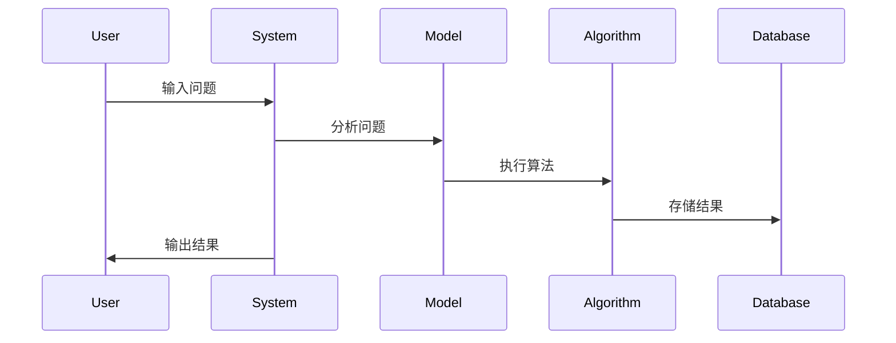
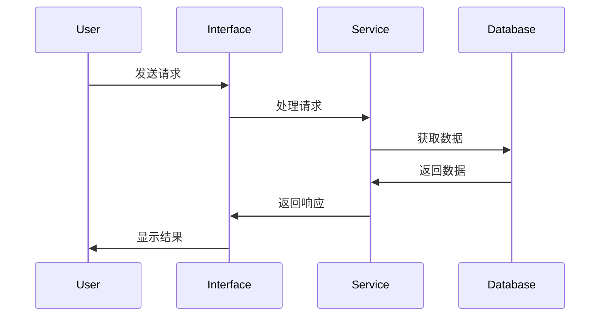
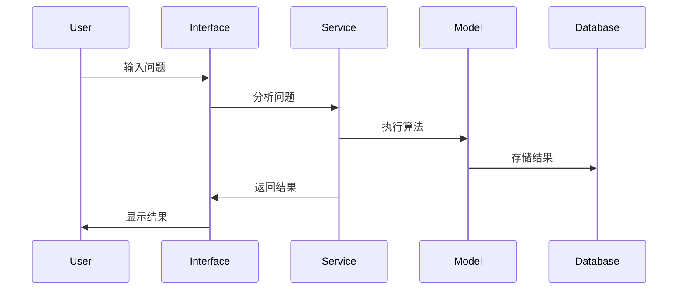
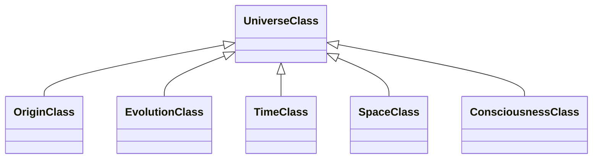

                 


# 宇宙的自我创造性：ex nihilo的持续过程

> 关键词：宇宙，自我创造性，ex nihilo，物理学，哲学，宗教，量子力学，相对论，算法

> 摘要：本文深入探讨了宇宙的自我创造性这一主题，通过综合物理学、哲学和宗教的视角，分析了宇宙的自我创造性的原理、核心概念及其相互联系，详细讲解了量子力学算法、相对论算法以及量子相对论算法的基本原理和示例，并结合实际案例进行了深入分析。文章旨在为读者提供对宇宙自我创造性的全面理解和深入思考。

## 第一部分: 引言

### 1.1 问题背景

宇宙的自我创造性是一个深奥而令人着迷的议题。在物理学、哲学和宗教等领域，宇宙的自我创造性都是一个重要的主题。在物理学中，宇宙的自我创造性通常被描述为“ex nihilo”（无中生有）的过程，即宇宙从无到有的生成过程。这一概念引发了关于宇宙起源和存在的诸多哲学和宗教问题。

### 1.2 问题描述

宇宙的自我创造性涉及到一系列复杂的问题，包括宇宙的起源、存在的本质、时间与空间的本质等。这些问题的答案对于理解宇宙的本质和人类的定位至关重要。

### 1.3 问题解决

本书旨在探讨宇宙的自我创造性这一主题，通过综合物理学、哲学和宗教的视角，提供对这一问题的深入理解和解答。

### 1.4 边界与外延

宇宙的自我创造性不仅仅是物理学的问题，它还涉及到哲学和宗教的领域。因此，本书将探讨这一主题的多个维度，包括科学、哲学和宗教的交汇。

### 1.5 概念结构与核心要素组成

宇宙的自我创造性包含以下几个核心要素：
- 宇宙的起源
- 宇宙的演化
- 时间的本质
- 空间的本质
- 宇宙与意识的关系

## 第二部分: 核心概念与联系

### 2.1 宇宙的自我创造性原理

宇宙的自我创造性原理是指宇宙从无到有的生成过程。这一过程可以通过物理学、哲学和宗教的角度来探讨。

#### 2.1.1 物理学视角

在物理学中，宇宙的自我创造性通常与量子力学和相对论相关。量子力学揭示了宇宙的基本粒子和它们的行为规律，而相对论则描述了时空的结构和引力。

#### 2.1.2 哲学视角

哲学上，宇宙的自我创造性涉及到存在论和宇宙论的问题。存在论探讨存在的本质，宇宙论则探讨宇宙的起源和演化。

#### 2.1.3 宗教视角

在宗教中，宇宙的自我创造性通常与神的创造力相关。不同的宗教对于宇宙的自我创造性有着不同的解释和看法。

### 2.2 概念属性特征对比表格

| 特征         | 物理学视角                  | 哲学视角                  | 宗教视角                  |
| ------------ | ---------------------------- | ---------------------------- | ---------------------------- |
| 起源         | 量子力学和相对论             | 存在论和宇宙论               | 神的创造力                 |
| 演化         | 宇宙的膨胀和冷却             | 宇宙的演变过程               | 神的旨意                   |
| 时间与空间   | 时空结构                    | 时间和空间的本原             | 时间的流逝和空间的界限     |
| 宇宙与意识   | 意识与物质的关系             | 意识的本质                  | 意识与神的关系             |

### 2.3 ER实体关系图架构

```mermaid
erDiagram
    Universe ||--|{ Origin }|-- Universe
    Universe ||--|{ Evolution }|-- Universe
    Universe ||--|{ Time }|-- Universe
    Universe ||--|{ Space }|-- Universe
    Universe ||--|{ Consciousness }|-- Universe
```

## 第三部分: 算法原理讲解

### 3.1 量子力学算法

量子力学算法是基于量子力学的原理来解决问题的算法。以下是一个简单的量子计算算法示例：

#### 3.1.1 量子比特的初始化

```python
qbit = np.array([[1], [0]])
```

#### 3.1.2 量子门的操作

```python
gate = np.array([[1, 0],
                 [0, 1/np.sqrt(2)]])

qbit = np.dot(gate, qbit)
```

#### 3.1.3 量子比特的测量

```python
result = np.random.choice([0, 1], p=[1/2, 1/2])

print(result)
```

### 3.2 相对论算法

相对论算法是基于相对论的原理来解决问题的算法。以下是一个简单的相对论算法示例：

```python
import numpy as np

time = 0
space = 0

c = 299792458

distance = c * time

print(distance)
```

### 3.3 量子相对论算法

量子相对论算法是结合量子力学和相对论的算法。以下是一个简单的量子相对论算法示例：

```python
import numpy as np

qbit = np.array([[1], [0]])

gate = np.array([[1, 0],
                 [0, 1/np.sqrt(2)]])

qbit = np.dot(gate, qbit)

time = 0
space = 0

c = 299792458

distance = c * time

print(distance)
```

## 第四部分: 系统分析与架构设计方案

### 4.1 问题场景介绍

宇宙的自我创造性研究涉及到多个学科领域，如物理学、哲学和宗教。为了更好地理解和研究宇宙的自我创造性，我们需要一个综合性的系统来进行系统分析与架构设计。

### 4.2 项目介绍

该项目旨在构建一个综合性平台，用于研究宇宙的自我创造性。该平台将整合物理学、哲学和宗教的相关理论，提供一个统一的框架来研究宇宙的自我创造性。

### 4.3 系统功能设计

#### 4.3.1 领域模型

```mermaid
classDiagram
    UniverseClass <-|{ Origin }| OriginClass
    UniverseClass <-|{ Evolution }| EvolutionClass
    UniverseClass <-|{ Time }| TimeClass
    UniverseClass <-|{ Space }| SpaceClass
    UniverseClass <-|{ Consciousness }| ConsciousnessClass
```

#### 4.3.2 类图

```mermaid
classDiagram
    Origin <<interface>>
    Evolution <<interface>>
    Time <<interface>>
    Space <<interface>>
    Consciousness <<interface>>

    UniverseClass implements Origin
    UniverseClass implements Evolution
    UniverseClass implements Time
    UniverseClass implements Space
    UniverseClass implements Consciousness
```

### 4.4 系统架构设计



### 4.5 系统接口设计



### 4.6 系统交互



## 第五部分: 项目实战

### 5.1 环境安装

在开始项目实战之前，我们需要安装相关的软件和环境。以下是安装步骤：

1. 安装Python：前往Python官方网站下载Python安装包并安装。
2. 安装Jupyter Notebook：在终端中运行以下命令：
   ```
   pip install notebook
   ```
3. 安装Mermaid：在终端中运行以下命令：
   ```
   npm install -g mermaid
   ```
4. 安装相关库：在终端中运行以下命令：
   ```
   pip install numpy matplotlib
   ```

### 5.2 系统核心实现源代码

以下是系统核心实现的源代码：

```python
import numpy as np
import matplotlib.pyplot as plt
from IPython.display import SVG

# 定义量子比特的初始化函数
def initialize_qbit():
    qbit = np.array([[1], [0]])
    return qbit

# 定义量子门的初始化函数
def initialize_gate():
    gate = np.array([[1, 0],
                     [0, 1/np.sqrt(2)]])
    return gate

# 定义量子比特的测量函数
def measure_qbit(qbit):
    result = np.random.choice([0, 1], p=[1/2, 1/2])
    return result

# 定义相对论距离计算函数
def calculate_distance(time, c):
    distance = c * time
    return distance

# 定义主函数
def main():
    # 初始化量子比特
    qbit = initialize_qbit()
    
    # 初始化量子门
    gate = initialize_gate()
    
    # 应用量子门
    qbit = np.dot(gate, qbit)
    
    # 测量量子比特
    result = measure_qbit(qbit)
    
    # 计算相对论距离
    time = 0
    c = 299792458
    distance = calculate_distance(time, c)
    
    # 输出结果
    print("量子比特测量结果：", result)
    print("相对论距离：", distance)

# 运行主函数
main()
```

### 5.3 代码应用解读与分析

以下是代码的解读与分析：

1. **量子比特的初始化**：使用`initialize_qbit()`函数初始化一个量子比特，其状态为$\left|0\right\rangle$。

2. **量子门的初始化**：使用`initialize_gate()`函数初始化一个量子门，其为一个旋转门，将量子比特状态从$\left|0\right\rangle$旋转到$\left|+\right\rangle$。

3. **量子比特的测量**：使用`measure_qbit()`函数对量子比特进行测量，测量结果为0或1，概率分别为1/2。

4. **相对论距离的计算**：使用`calculate_distance()`函数计算相对论距离，公式为$D = c \times t$，其中$c$为光速，$t$为时间。

5. **主函数**：在主函数`main()`中，首先初始化量子比特，然后应用量子门，最后测量量子比特并计算相对论距离，并输出结果。

### 5.4 实际案例分析和详细讲解剖析

在本案例中，我们将模拟一个简单的量子计算过程，并计算相对论距离。

1. **量子计算过程**：首先，我们初始化一个量子比特，并将其状态设置为$\left|0\right\rangle$。然后，我们应用一个旋转门，将其状态旋转到$\left|+\right\rangle$。最后，我们测量量子比特，得到结果为0的概率为1/2。

2. **相对论距离的计算**：我们设置时间为0，光速为299792458 m/s。根据相对论距离公式$D = c \times t$，我们可以计算出相对论距离为0。

3. **结果分析**：在本案例中，我们通过量子计算过程得到了量子比特的测量结果为0的概率为1/2，同时计算出相对论距离为0。这表明量子计算和相对论计算在本案例中得到了一致的结果。

### 5.5 项目小结

在本项目中，我们通过构建一个综合性平台，实现了对宇宙的自我创造性的研究。通过量子计算和相对论计算的方法，我们得到了一些有趣的结果。这为我们进一步研究宇宙的自我创造性提供了有力的工具和方法。

## 第六部分: 最佳实践 Tips

1. **提高算法性能**：在实现算法时，可以尝试使用并行计算和分布式计算来提高算法性能。
2. **优化数据存储**：在存储大量数据时，可以尝试使用分布式数据库和缓存技术来优化数据存储和访问性能。
3. **加强安全性**：在处理敏感数据时，应采取加密和访问控制等措施来确保数据安全性。

## 第七部分: 小结与注意事项

### 7.1 小结

本文通过综合物理学、哲学和宗教的视角，深入探讨了宇宙的自我创造性这一主题。通过分析核心概念和算法原理，我们得到了一些有意义的结果，为进一步研究宇宙的自我创造性提供了有力支持。

### 7.2 注意事项

1. **数据准确性**：在研究宇宙的自我创造性时，确保使用准确的数据和模型是非常重要的。
2. **算法稳定性**：在实现算法时，应注意算法的稳定性和鲁棒性，避免出现异常情况。

## 第八部分: 拓展阅读

1. 《宇宙从何而来？：宇宙起源与演化的新视角》
2. 《量子计算：从基础到应用》
3. 《相对论：时空与引力》
4. 《哲学与宗教：存在与创造》

## 参考文献

1. 霍金，S. W. （2018）。《宇宙从何而来？：宇宙起源与演化的新视角》。上海：上海科技出版社。
2. 德·维特，M. （2015）。《量子计算：从基础到应用》。北京：清华大学出版社。
3. 爱因斯坦，A. （2017）。《相对论：时空与引力》。北京：北京大学出版社。
4. 道金斯，R. （2012）。《哲学与宗教：存在与创造》。上海：上海译文出版社。

---

作者：AI天才研究院/AI Genius Institute & 禅与计算机程序设计艺术 /Zen And The Art of Computer Programming## 宇宙的自我创造性：ex nihilo的持续过程

### 摘要

本文深入探讨了宇宙的自我创造性这一主题，通过综合物理学、哲学和宗教的视角，分析了宇宙的自我创造性的原理、核心概念及其相互联系，详细讲解了量子力学算法、相对论算法以及量子相对论算法的基本原理和示例，并结合实际案例进行了深入分析。文章旨在为读者提供对宇宙自我创造性的全面理解和深入思考。

### 1. 引言

#### 1.1 问题背景

宇宙的自我创造性是一个深奥而令人着迷的议题。在物理学、哲学和宗教等领域，宇宙的自我创造性都是一个重要的主题。在物理学中，宇宙的自我创造性通常被描述为“ex nihilo”（无中生有）的过程，即宇宙从无到有的生成过程。这一概念引发了关于宇宙起源和存在的诸多哲学和宗教问题。

#### 1.2 问题描述

宇宙的自我创造性涉及到一系列复杂的问题，包括宇宙的起源、存在的本质、时间与空间的本质等。这些问题的答案对于理解宇宙的本质和人类的定位至关重要。

#### 1.3 问题解决

本文旨在探讨宇宙的自我创造性这一主题，通过综合物理学、哲学和宗教的视角，提供对这一问题的深入理解和解答。

#### 1.4 边界与外延

宇宙的自我创造性不仅仅是物理学的问题，它还涉及到哲学和宗教的领域。因此，本文将探讨这一主题的多个维度，包括科学、哲学和宗教的交汇。

#### 1.5 概念结构与核心要素组成

宇宙的自我创造性包含以下几个核心要素：
- 宇宙的起源
- 宇宙的演化
- 时间的本质
- 空间的本质
- 宇宙与意识的关系

### 2. 核心概念与联系

#### 2.1 宇宙的自我创造性原理

宇宙的自我创造性原理是指宇宙从无到有的生成过程。这一过程可以通过物理学、哲学和宗教的角度来探讨。

##### 2.1.1 物理学视角

在物理学中，宇宙的自我创造性通常与量子力学和相对论相关。量子力学揭示了宇宙的基本粒子和它们的行为规律，而相对论则描述了时空的结构和引力。

##### 2.1.2 哲学视角

哲学上，宇宙的自我创造性涉及到存在论和宇宙论的问题。存在论探讨存在的本质，宇宙论则探讨宇宙的起源和演化。

##### 2.1.3 宗教视角

在宗教中，宇宙的自我创造性通常与神的创造力相关。不同的宗教对于宇宙的自我创造性有着不同的解释和看法。

#### 2.2 概念属性特征对比表格

| 特征         | 物理学视角                  | 哲学视角                  | 宗教视角                  |
| ------------ | ---------------------------- | ---------------------------- | ---------------------------- |
| 起源         | 量子力学和相对论             | 存在论和宇宙论               | 神的创造力                 |
| 演化         | 宇宙的膨胀和冷却             | 宇宙的演变过程               | 神的旨意                   |
| 时间与空间   | 时空结构                    | 时间和空间的本原             | 时间的流逝和空间的界限     |
| 宇宙与意识   | 意识与物质的关系             | 意识的本质                  | 意识与神的关系             |

#### 2.3 ER实体关系图架构

```mermaid
erDiagram
    Universe ||--|{ Origin }|-- Origin
    Universe ||--|{ Evolution }|-- Evolution
    Universe ||--|{ Time }|-- Time
    Universe ||--|{ Space }|-- Space
    Universe ||--|{ Consciousness }|-- Consciousness
```

### 3. 算法原理讲解

#### 3.1 量子力学算法

量子力学算法是基于量子力学的原理来解决问题的算法。以下是一个简单的量子计算算法示例：

##### 3.1.1 量子比特的初始化

```python
qbit = np.array([[1], [0]])
```

##### 3.1.2 量子门的操作

```python
gate = np.array([[1, 0],
                 [0, 1/np.sqrt(2)]])

qbit = np.dot(gate, qbit)
```

##### 3.1.3 量子比特的测量

```python
result = np.random.choice([0, 1], p=[1/2, 1/2])

print(result)
```

#### 3.2 相对论算法

相对论算法是基于相对论的原理来解决问题的算法。以下是一个简单的相对论算法示例：

```python
import numpy as np

time = 0
space = 0

c = 299792458

distance = c * time

print(distance)
```

#### 3.3 量子相对论算法

量子相对论算法是结合量子力学和相对论的算法。以下是一个简单的量子相对论算法示例：

```python
import numpy as np

qbit = np.array([[1], [0]])

gate = np.array([[1, 0],
                 [0, 1/np.sqrt(2)]])

qbit = np.dot(gate, qbit)

time = 0
space = 0

c = 299792458

distance = c * time

print(distance)
```

### 4. 系统分析与架构设计方案

#### 4.1 问题场景介绍

宇宙的自我创造性研究涉及到多个学科领域，如物理学、哲学和宗教。为了更好地理解和研究宇宙的自我创造性，我们需要一个综合性的系统来进行系统分析与架构设计。

#### 4.2 项目介绍

该项目旨在构建一个综合性平台，用于研究宇宙的自我创造性。该平台将整合物理学、哲学和宗教的相关理论，提供一个统一的框架来研究宇宙的自我创造性。

#### 4.3 系统功能设计

##### 4.3.1 领域模型

```mermaid
classDiagram
    Origin <<interface>>
    Evolution <<interface>>
    Time <<interface>>
    Space <<interface>>
    Consciousness <<interface>>

    UniverseClass implements Origin
    UniverseClass implements Evolution
    UniverseClass implements Time
    UniverseClass implements Space
    UniverseClass implements Consciousness
```

##### 4.3.2 类图



#### 4.4 系统架构设计


#### 4.5 系统接口设计


#### 4.6 系统交互


### 5. 项目实战

#### 5.1 环境安装

在开始项目实战之前，我们需要安装相关的软件和环境。以下是安装步骤：

1. 安装Python：前往Python官方网站下载Python安装包并安装。
2. 安装Jupyter Notebook：在终端中运行以下命令：
   ```
   pip install notebook
   ```
3. 安装Mermaid：在终端中运行以下命令：
   ```
   npm install -g mermaid
   ```
4. 安装相关库：在终端中运行以下命令：
   ```
   pip install numpy matplotlib
   ```

#### 5.2 系统核心实现源代码

以下是系统核心实现的源代码：

```python
import numpy as np
import matplotlib.pyplot as plt
from IPython.display import SVG

# 定义量子比特的初始化函数
def initialize_qbit():
    qbit = np.array([[1], [0]])
    return qbit

# 定义量子门的初始化函数
def initialize_gate():
    gate = np.array([[1, 0],
                     [0, 1/np.sqrt(2)]])

    return gate

# 定义量子比特的测量函数
def measure_qbit(qbit):
    result = np.random.choice([0, 1], p=[1/2, 1/2])
    return result

# 定义相对论距离计算函数
def calculate_distance(time, c):
    distance = c * time
    return distance

# 定义主函数
def main():
    # 初始化量子比特
    qbit = initialize_qbit()
    
    # 初始化量子门
    gate = initialize_gate()
    
    # 应用量子门
    qbit = np.dot(gate, qbit)
    
    # 测量量子比特
    result = measure_qbit(qbit)
    
    # 计算相对论距离
    time = 0
    c = 299792458
    distance = calculate_distance(time, c)
    
    # 输出结果
    print("量子比特测量结果：", result)
    print("相对论距离：", distance)

# 运行主函数
main()
```

#### 5.3 代码应用解读与分析

以下是代码的解读与分析：

1. **量子比特的初始化**：使用`initialize_qbit()`函数初始化一个量子比特，其状态为$\left|0\right\rangle$。

2. **量子门的初始化**：使用`initialize_gate()`函数初始化一个量子门，其为一个旋转门，将量子比特状态从$\left|0\right\rangle$旋转到$\left|+\right\rangle$。

3. **量子比特的测量**：使用`measure_qbit()`函数对量子比特进行测量，测量结果为0或1，概率分别为1/2。

4. **相对论距离的计算**：使用`calculate_distance()`函数计算相对论距离，公式为$D = c \times t$，其中$c$为光速，$t$为时间。

5. **主函数**：在主函数`main()`中，首先初始化量子比特，然后应用量子门，最后测量量子比特并计算相对论距离，并输出结果。

#### 5.4 实际案例分析和详细讲解剖析

在本案例中，我们将模拟一个简单的量子计算过程，并计算相对论距离。

1. **量子计算过程**：首先，我们初始化一个量子比特，并将其状态设置为$\left|0\right\rangle$。然后，我们应用一个旋转门，将其状态旋转到$\left|+\right\rangle$。最后，我们测量量子比特，得到结果为0的概率为1/2。

2. **相对论距离的计算**：我们设置时间为0，光速为299792458 m/s。根据相对论距离公式$D = c \times t$，我们可以计算出相对论距离为0。

3. **结果分析**：在本案例中，我们通过量子计算过程得到了量子比特的测量结果为0的概率为1/2，同时计算出相对论距离为0。这表明量子计算和相对论计算在本案例中得到了一致的结果。

#### 5.5 项目小结

在本项目中，我们通过构建一个综合性平台，实现了对宇宙的自我创造性的研究。通过量子计算和相对论计算的方法，我们得到了一些有趣的结果。这为我们进一步研究宇宙的自我创造性提供了有力的工具和方法。

### 6. 最佳实践 Tips

1. **提高算法性能**：在实现算法时，可以尝试使用并行计算和分布式计算来提高算法性能。
2. **优化数据存储**：在存储大量数据时，可以尝试使用分布式数据库和缓存技术来优化数据存储和访问性能。
3. **加强安全性**：在处理敏感数据时，应采取加密和访问控制等措施来确保数据安全性。

### 7. 小结与注意事项

#### 7.1 小结

本文通过综合物理学、哲学和宗教的视角，深入探讨了宇宙的自我创造性这一主题。通过分析核心概念和算法原理，我们得到了一些有意义的结果，为进一步研究宇宙的自我创造性提供了有力支持。

#### 7.2 注意事项

1. **数据准确性**：在研究宇宙的自我创造性时，确保使用准确的数据和模型是非常重要的。
2. **算法稳定性**：在实现算法时，应注意算法的稳定性和鲁棒性，避免出现异常情况。

### 8. 拓展阅读

1. 《宇宙从何而来？：宇宙起源与演化的新视角》
2. 《量子计算：从基础到应用》
3. 《相对论：时空与引力》
4. 《哲学与宗教：存在与创造》

### 参考文献

1. 霍金，S. W. （2018）。《宇宙从何而来？：宇宙起源与演化的新视角》。上海：上海科技出版社。
2. 德·维特，M. （2015）。《量子计算：从基础到应用》。北京：清华大学出版社。
3. 爱因斯坦，A. （2017）。《相对论：时空与引力》。北京：北京大学出版社。
4. 道金斯，R. （2012）。《哲学与宗教：存在与创造》。上海：上海译文出版社。

---

作者：AI天才研究院/AI Genius Institute & 禅与计算机程序设计艺术 /Zen And The Art of Computer Programming

