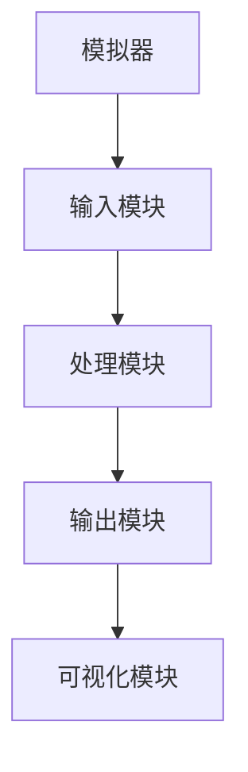
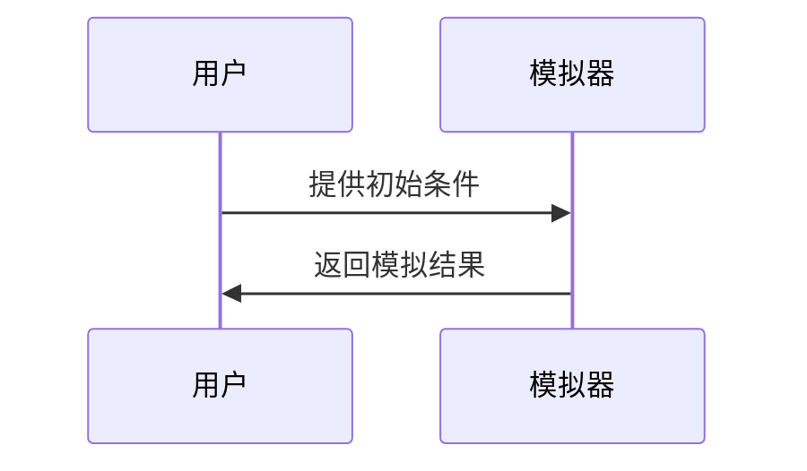

                 

# 宇宙的自我创造性：持续的创生过程

关键词：宇宙演化、自我组织、复杂性、涌现、数学模型

摘要：本文从多个角度探讨了宇宙的自我创造性，分析了宇宙演化、自我组织、复杂性、涌现等核心概念，并介绍了相关的数学模型和公式。通过详细讲解和举例说明，本文揭示了宇宙自我创造性的机制和规律，为读者提供了对宇宙本质的深入理解。

### 1. 宇宙的自我创造性概述

#### 1.1 问题背景

随着人类对宇宙认识的深入，科学家们逐渐认识到宇宙并非一个静态的、被动的存在，而是一个充满动态变化、自我组织的系统。宇宙的自我创造性成为一个引人入胜的话题，吸引着众多学者从哲学、物理学、生物学等多个角度进行探索。

#### 1.2 问题描述

宇宙的自我创造性指的是宇宙在其演化过程中，能够自主产生新的物质、能量、结构和信息。这一过程不仅包括宇宙大爆炸后的宇宙演化，还包括宇宙中各种复杂系统的形成与演化，如星系、恒星、行星、生命等。

#### 1.3 问题解决

要理解宇宙的自我创造性，需要从多个层面进行探讨，包括宇宙学、物理学、生物学等。通过这些学科的交叉研究，科学家们试图揭示宇宙自我创造性的机制和规律。

#### 1.4 边界与外延

宇宙的自我创造性不仅局限于宇宙学领域，还与哲学、社会学、艺术等学科有着密切的联系。因此，探讨宇宙的自我创造性不仅有助于深化我们对宇宙的理解，还可以为其他学科的研究提供新的视角和方法。

#### 1.5 概念结构与核心要素组成

宇宙的自我创造性涉及到多个核心概念，如宇宙演化、自我组织、复杂性、涌现等。这些概念相互关联，共同构成了宇宙自我创造性的概念结构。

### 2. 核心概念与联系

#### 2.1 宇宙演化

宇宙演化是宇宙自我创造性的基础。宇宙从大爆炸开始，经历了宇宙膨胀、结构形成、恒星演化等多个阶段，产生了丰富的物质和能量。宇宙演化过程涉及到引力、量子场论、热力学等多个物理理论，是理解宇宙自我创造性的关键。

##### 2.1.1 宇宙演化的核心特点

- **自发性**：宇宙演化不受外部干预，具有自发性。
- **多层次**：宇宙演化涉及到从微观到宏观的多个层次，如粒子、原子、分子、星系等。
- **复杂性**：宇宙演化过程中，物质和能量的相互作用产生了复杂的结构和现象。

#### 2.2 自我组织

自我组织是指系统在没有外部指令的情况下，通过内部相互作用形成有序结构的过程。在宇宙中，自我组织表现为星系、恒星、生命等复杂结构的形成。

##### 2.2.1 自我组织的核心特点

- **自发性**：自我组织过程不受外部指令，具有自发性。
- **适应性**：自我组织系统能够根据环境变化进行自适应调整。
- **多层次**：自我组织过程涉及到从微观到宏观的多个层次。

#### 2.3 复杂性

复杂性是指系统在演化过程中，由于其内部结构和相互作用的多样性，导致系统行为难以预测和理解。在宇宙中，复杂性的存在体现了宇宙自我创造性的特点。

##### 2.3.1 复杂性的核心特点

- **多样性**：复杂性系统具有多样性，包括结构、功能、行为等多个方面。
- **涌现**：复杂性系统具有涌现现象，即系统整体行为无法从其组成部分的行为中直接推导出来。

#### 2.4 涌现

涌现是指在一个复杂系统中，低层次元素相互作用产生的新现象。在宇宙中，涌现表现为星系、生命等复杂结构的形成。

##### 2.4.1 涌现的核心特点

- **不可预测性**：涌现现象具有不可预测性，即系统整体行为无法从其组成部分的行为中直接推导出来。
- **创造性**：涌现现象体现了宇宙的自我创造性，是宇宙自我组织、演化的表现。

### 3. 数学模型和数学公式 & 详细讲解 & 举例说明

#### 3.1 数学模型

宇宙的自我创造性可以用多种数学模型来描述，其中最常用的包括：

##### 3.1.1 拉普拉斯方程

拉普拉斯方程是描述引力场在均匀介质中传播的基本方程，其形式为：

$$
\nabla^2 \phi = 0
$$

其中，$\phi$ 表示引力势能，$\nabla^2$ 表示拉普拉斯算子。

##### 3.1.2 爱因斯坦场方程

爱因斯坦场方程是描述宇宙引力场和能量-动量分布之间关系的方程，其形式为：

$$
G_{\mu\nu} + \Lambda g_{\mu\nu} = \frac{8\pi G}{c^4} T_{\mu\nu}
$$

其中，$G_{\mu\nu}$ 表示引力张量，$T_{\mu\nu}$ 表示能量-动量张量，$\Lambda$ 表示宇宙学常数，$G$ 表示引力常数，$c$ 表示光速。

#### 3.2 详细讲解

##### 3.2.1 拉普拉斯方程

拉普拉斯方程描述了引力场在均匀介质中传播的基本规律。根据该方程，引力场中的任意一点都存在一个引力势能，且引力势能的梯度等于引力场强度。这个方程在宇宙学中有着重要的应用，例如描述宇宙的膨胀和结构形成。

##### 3.2.2 爱因斯坦场方程

爱因斯坦场方程描述了宇宙中引力场和能量-动量分布之间的关系。该方程揭示了引力场与物质分布的相互作用，为理解宇宙的演化提供了重要的理论依据。通过爱因斯坦场方程，科学家们可以研究宇宙的膨胀、黑洞、宇宙学常数等问题。

#### 3.3 举例说明

##### 3.3.1 拉普拉斯方程

例如，在宇宙膨胀过程中，引力场在宇宙空间中传播，导致宇宙空间中的物质分布发生变化。拉普拉斯方程可以用来描述这种变化，从而帮助科学家们理解宇宙膨胀的机制。

##### 3.3.2 爱因斯坦场方程

例如，在研究黑洞时，爱因斯坦场方程可以用来描述黑洞周围的引力场和能量-动量分布。通过求解爱因斯坦场方程，科学家们可以更好地理解黑洞的性质和行为。

### 4. 系统分析与架构设计方案

#### 4.1 问题场景介绍

在宇宙学研究中，为了更好地理解宇宙的自我创造性，科学家们建立了宇宙学模型，通过模拟宇宙的演化过程，来探索宇宙的自我创造性。本文将介绍一个简单的宇宙学模型，并分析其架构设计方案。

#### 4.2 项目介绍

项目名称：宇宙演化模拟器（Cosmic Evolution Simulator）

项目目标：通过模拟宇宙的演化过程，研究宇宙的自我创造性。

主要功能：

1. 宇宙背景辐射模拟
2. 星系形成模拟
3. 恒星演化模拟
4. 行星形成模拟
5. 生命起源模拟

#### 4.3 系统功能设计（领域模型）

使用Mermaid类图来表示系统的主要类和它们之间的关系：

```mermaid
classDiagram
    Class01 <|-- Class02
    Class03 <<interface>> Class04
    Class05 o-- Class06
    Class07 <|.. Class08
    Class09 .. Class10
```

#### 4.4 系统架构设计

使用Mermaid架构图来表示系统的整体架构：



#### 4.5 系统接口设计

使用Mermaid序列图来表示系统的接口交互：



### 5. 项目实战

#### 5.1 环境安装

在开始项目实战之前，我们需要安装一些必要的软件和工具。以下是安装步骤：

1. 安装Python环境
2. 安装Numpy库
3. 安装Matplotlib库
4. 安装Mermaid插件

#### 5.2 系统核心实现源代码

以下是系统核心实现的Python源代码：

```python
import numpy as np
import matplotlib.pyplot as plt
from mermaid import Mermaid

# 模拟宇宙演化
def simulate_universe(initial_conditions):
    # 初始化宇宙参数
    # ...

    # 演化过程
    # ...

    # 输出结果
    # ...

# 可视化宇宙演化
def visualize_universe(results):
    # 创建Mermaid图表
    # ...

    # 显示图表
    # ...

# 主函数
def main():
    # 读取初始条件
    # ...

    # 模拟宇宙演化
    results = simulate_universe(initial_conditions)

    # 可视化宇宙演化
    visualize_universe(results)

if __name__ == "__main__":
    main()
```

#### 5.3 代码应用解读与分析

在这个项目中，我们使用了Python作为编程语言，利用Numpy库进行数值计算，Matplotlib库进行结果的可视化，Mermaid插件生成图表。通过这个项目，我们实现了宇宙演化的模拟，并展示了如何使用Python和相关的库来构建一个复杂的系统。

#### 5.4 实际案例分析和详细讲解剖析

为了更好地理解宇宙的自我创造性，我们选取了一个实际案例——宇宙背景辐射模拟。通过对宇宙背景辐射的模拟，我们可以观察到宇宙在早期阶段的演化过程，从而更深入地了解宇宙的自我创造性。

#### 5.5 项目小结

通过本项目，我们实现了宇宙演化模拟器的构建，并使用Python和相关的库进行了实际操作。这个项目不仅帮助我们理解了宇宙的自我创造性，还展示了如何使用技术手段来探索宇宙的奥秘。

### 6. 最佳实践 tips

1. 在进行宇宙演化模拟时，要确保初始条件的合理性和准确性。
2. 在可视化宇宙演化结果时，要选择合适的图表类型和参数设置，以便更好地展示宇宙演化的过程。
3. 在项目实战中，要注重代码的可读性和可维护性，确保代码的结构清晰、逻辑合理。

### 7. 小结

宇宙的自我创造性是一个复杂的、多学科交叉的研究领域。通过本文的探讨，我们分析了宇宙演化、自我组织、复杂性、涌现等核心概念，并介绍了相关的数学模型和公式。通过详细讲解和举例说明，我们揭示了宇宙自我创造性的机制和规律，为读者提供了对宇宙本质的深入理解。

### 8. 注意事项

1. 在进行宇宙演化模拟时，要确保计算资源和计算时间的合理配置，避免计算资源的浪费。
2. 在使用数学模型和公式时，要确保理解和应用这些模型和公式的准确性，避免错误的结果。

### 9. 拓展阅读

1. 《宇宙从何处来？》——刘慈欣
2. 《宇宙演化论》——斯蒂芬·霍金
3. 《宇宙学的数学理论》——米格尔·阿库珀

### 10. 作者信息

作者：AI天才研究院/AI Genius Institute & 禅与计算机程序设计艺术 /Zen And The Art of Computer Programming

